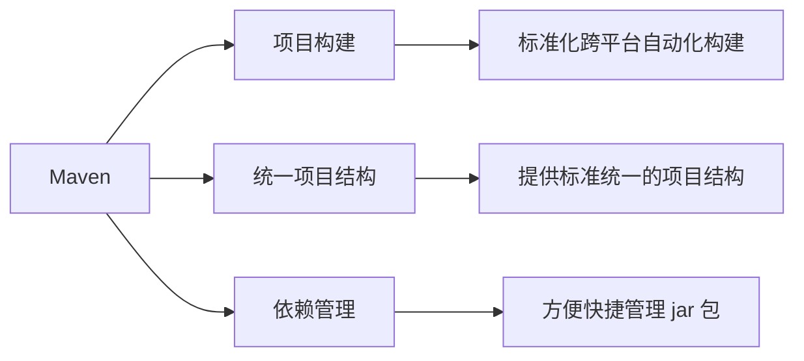
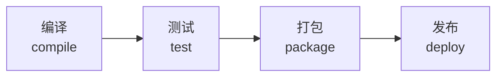
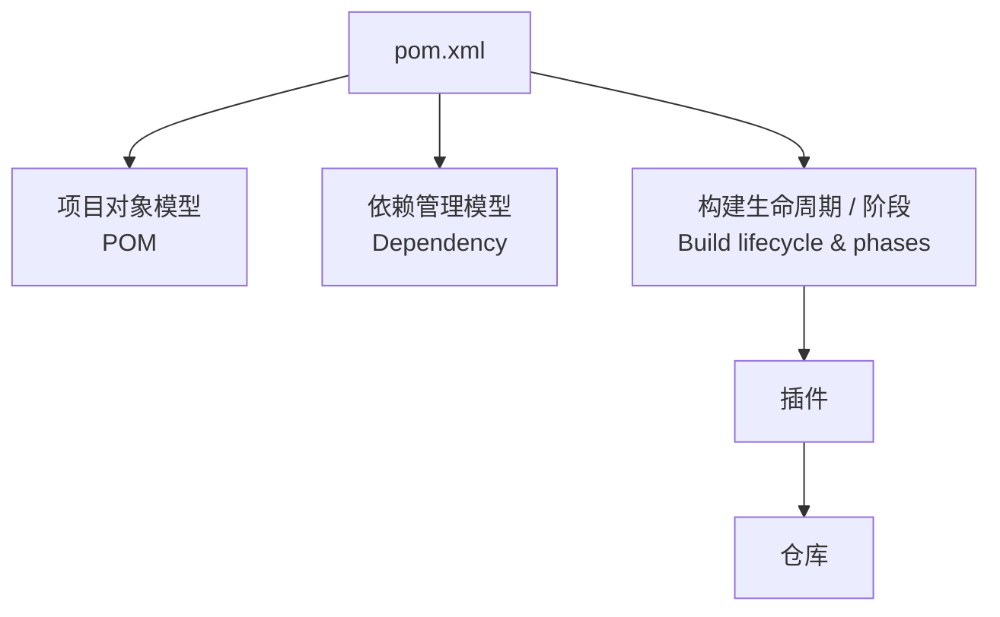

# Maven 基础

> 本笔记涵盖 Maven 的核心概念、安装配置、IDEA 集成、依赖管理与生命周期，以及基于 JUnit 的单元测试。

# 一、Maven 概述

> 本节介绍 Maven 是什么、能解决什么问题，以及 POM、仓库等核心概念。

## Maven 是什么

> <span style="color:blue">Maven</span> 是一款用于**管理和构建 Java 项目**的工具，是 <span style="color:blue">Apache</span> 旗下的一个开源项目。

- **Apache 软件基金会**：成立于 1999 年 7 月，是目前世界上最大的、最受欢迎的开源软件基金会，也是一个专门为支持开源项目而生的非盈利性组织。
- **官网**：http://maven.apache.org/
- **开源项目列表**：https://www.apache.org/index.html#projects-list

Apache Maven 是一个项目管理和构建工具，它基于**项目对象模型（POM）**的概念，通过一小段描述信息来管理项目的构建。

## Maven 的作用

Maven 主要解决三大问题：



| 作用 | 说明 |
| --- | --- |
| <span style="color:blue">项目构建</span> | 提供标准化的、跨平台（Linux / Windows / MacOS）的**自动化项目构建**方式 |
| <span style="color:blue">统一项目结构</span> | 提供**标准、统一**的项目结构 |
| <span style="color:blue">依赖管理</span> | 方便快捷地管理项目依赖的资源（jar 包） |

### 项目构建

构建过程包含四个环节，均可自动化完成：



### 依赖管理

只需在 `pom.xml` 中声明坐标，Maven 便会自动下载并管理 jar 包：

```xml
<dependency>
    <groupId>commons-io</groupId>
    <artifactId>commons-io</artifactId>
    <version>2.11.0</version>
</dependency>
```

### 统一项目结构

无论使用 Eclipse、MyEclipse 还是 IntelliJ IDEA，Maven 项目都遵循同一套目录结构，主程序与测试程序分开放置。

## Maven 核心概念

Maven 的核心由以下要素构成，它们都围绕 `pom.xml` 组织：



## 仓库

> <span style="color:blue">仓库</span>：用于存储资源，管理各种 jar 包。

| 仓库类型 | 说明 |
| --- | --- |
| <span style="color:blue">本地仓库</span> | 自己计算机上的一个目录 |
| <span style="color:blue">中央仓库</span> | 由 Maven 团队维护的**全球唯一**仓库，地址 https://repo1.maven.org/maven2/ |
| <span style="color:blue">远程仓库（私服）</span> | 一般由公司团队搭建的私有仓库 |

### 依赖查找顺序

当项目需要某个 jar 包时，Maven 按以下顺序查找：


> 顺序：**本地仓库 → 远程仓库（私服） → 中央仓库**。

# 二、Maven 安装与配置

> 本节介绍 Maven 的安装步骤：解压、配置本地仓库、配置阿里云私服、配置环境变量。

## 安装步骤

1. 解压 `apache-maven-3.9.4-bin.zip`。
2. 配置本地仓库：修改 `conf/settings.xml` 中的 `<localRepository>` 为一个指定目录。
3. 配置阿里云私服：修改 `conf/settings.xml` 中的 `<mirrors>` 标签，为其添加子标签。
4. 配置环境变量：`MAVEN_HOME` 为 Maven 的解压目录，并将其 `bin` 目录加入 `PATH` 环境变量。

## 配置本地仓库

```xml
<localRepository>D:\develop\apache-maven-3.9.4\mvn_repo</localRepository>
```

## 配置阿里云私服

```xml
<mirror>
    <id>alimaven</id>
    <name>aliyun maven</name>
    <url>http://maven.aliyun.com/nexus/content/groups/public/</url>
    <mirrorOf>central</mirrorOf>
</mirror>
```

> <span style="color:orange">注意</span>：配置 `settings.xml` 中的本地仓库、私服时，一定要仔细，注意配置信息的位置和标签。

## 验证安装

```bash
mvn -v   # 查看 Maven 版本，能正确输出版本信息即安装成功
```

# 三、IDEA 集成 Maven

> 本节介绍在 IDEA 中全局配置 Maven 环境、创建项目、理解坐标与导入项目。

## 配置 Maven 环境（全局）

在 IDEA 中需要配置三项内容：

| 配置项 | 说明 |
| --- | --- |
| Maven 安装目录 | Maven 解压后的根目录 |
| Maven 配置文件 | `conf/settings.xml` |
| Maven 仓库目录 | 本地仓库目录（`settings.xml` 中 `<localRepository>` 指定的目录） |

## 创建 Maven 项目

选择 `New Module` → 填写模块信息 → 构建工具选择 **Maven** → 点击 `Create`，创建完成后编写 `HelloWorld` 并运行。

## Maven 坐标

> **坐标**：Maven 中资源（jar）的唯一标识，通过坐标可以唯一定位资源位置。使用坐标来定义项目，或引入项目中需要的依赖。

| 组成 | 含义 |
| --- | --- |
| `groupId` | 定义当前 Maven 项目隶属的组织名称（通常是域名反写，如 `com.itheima`） |
| `artifactId` | 定义当前 Maven 项目名称（通常是模块名称，如 `order-service`、`goods-service`） |
| `version` | 定义当前项目版本号 |

```xml
<groupId>com.itheima</groupId>
<artifactId>maven-project01</artifactId>
<version>1.0-SNAPSHOT</version>
```

### 版本分类

| 版本 | 含义 |
| --- | --- |
| <span style="color:orange">SNAPSHOT</span> | 功能不稳定、尚处于开发中的版本，即快照版本 |
| <span style="color:green">RELEASE</span> | 功能趋于稳定、当前更新停止，可以用于发行的版本 |

## 导入 Maven 项目

| 方式 | 操作路径 |
| --- | --- |
| 方式一 | `File` → `Project Structure` → `Modules` → `Import Module` → 选择 Maven 项目的 `pom.xml` |
| 方式二 | Maven 面板 → `+`（`Add Maven Projects`）→ 选择 Maven 项目的 `pom.xml` |

> <span style="color:green">建议</span>：先将待导入的 Maven 项目复制到你的项目目录下，再选择其 `pom.xml` 文件进行导入。

# 四、依赖管理

> 本节介绍依赖配置、排除依赖，以及 Maven 生命周期。

## 依赖配置

> <span style="color:blue">依赖</span>：指当前项目运行所需要的 jar 包，一个项目中可以引入多个依赖。

配置步骤：

1. 在 `pom.xml` 中编写 `<dependencies>` 标签。
2. 在 `<dependencies>` 标签中使用 `<dependency>` 引入坐标。
3. 定义坐标的 `groupId`、`artifactId`、`version`。
4. 点击刷新按钮，引入最新加入的坐标。

```xml
<dependency>
    <groupId>org.springframework</groupId>
    <artifactId>spring-context</artifactId>
    <version>6.1.4</version>
</dependency>
```

> <span style="color:orange">提示</span>：如果不知道依赖的坐标信息，可以到 https://mvnrepository.com/ 中搜索。

## 排除依赖

> <span style="color:blue">排除依赖</span>：指主动断开依赖的资源，被排除的资源无需指定版本。

```xml
<dependency>
    <groupId>org.springframework</groupId>
    <artifactId>spring-context</artifactId>
    <version>6.1.4</version>
    <exclusions>
        <exclusion>
            <groupId>io.micrometer</groupId>
            <artifactId>micrometer-observation</artifactId>
        </exclusion>
    </exclusions>
</dependency>
```

> <span style="color:orange">注意事项</span>：一旦依赖配置变更了，记得重新加载；引入的依赖本地仓库不存在时，记得联网。

## 生命周期

> <span style="color:blue">Maven 生命周期</span>：为了对所有的 Maven 项目构建过程进行抽象和统一。

Maven 中有 **3 套相互独立**的生命周期：

| 生命周期 | 作用 |
| --- | --- |
| <span style="color:blue">clean</span> | 清理工作 |
| <span style="color:blue">default</span> | 核心工作，如：编译、测试、打包、安装、部署等 |
| <span style="color:blue">site</span> | 生成报告、发布站点等 |

每套生命周期包含一些**阶段（phase）**，阶段有顺序，后面的阶段依赖前面的阶段：

```mermaid
flowchart LR
  subgraph clean 生命周期
    direction LR
    PC[pre-clean] --> C[clean] --> POC[post-clean]
  end
  subgraph default 生命周期
    direction LR
    V[validate] --> CP[compile] --> T[test] --> PK[package] --> IN[install] --> DP[deploy]
  end
  subgraph site 生命周期
    direction LR
    PS[pre-site] --> S[site] --> POS[post-site] --> SD[site-deploy]
  end
```

常用阶段：

| 阶段 | 作用 |
| --- | --- |
| `clean` | 移除上一次构建生成的文件 |
| `compile` | 编译项目源代码 |
| `test` | 使用合适的单元测试框架运行测试（JUnit） |
| `package` | 将编译后的文件打包，如 jar、war 等 |
| `install` | 安装项目到本地仓库 |

> <span style="color:orange">注意</span>：在同一套生命周期中，**当运行后面的阶段时，前面的阶段都会运行**。

### 执行方式

1. 在 IDEA 中，右侧 Maven 工具栏选中对应的生命周期，双击执行。
2. 在命令行中，通过命令执行：

```bash
mvn clean
mvn compile
mvn package
```

# 五、单元测试

> 本节介绍测试的阶段划分与测试方法、JUnit 单元测试、断言、常见注解与依赖范围。

## 测试概述

> <span style="color:blue">测试</span>：一种用来促进鉴定软件的正确性、完整性、安全性和质量的过程。

### 阶段划分

| 阶段 | 介绍 | 目的 | 测试人员 |
| --- | --- | --- | --- |
| 单元测试 | 对软件的基本组成单位进行测试，最小测试单位 | 检验软件基本组成单位的正确性 | 开发人员 |
| 集成测试 | 将已分别通过测试的单元，按设计要求组合成系统或子系统，再进行的测试 | 检查单元之间的协作是否正确 | 开发人员 |
| 系统测试 | 对已经集成好的软件系统进行彻底的测试 | 验证软件系统的正确性、性能是否满足指定的要求 | 测试人员 |
| 验收测试 | 交付测试，是针对用户需求、业务流程进行的正式测试 | 验证软件系统是否满足验收标准 | 客户 / 需求方 |

### 测试方法

| 方法 | 说明 |
| --- | --- |
| <span style="color:blue">白盒测试</span> | 清楚软件内部结构、代码逻辑；用于验证代码、逻辑正确性 |
| <span style="color:blue">黑盒测试</span> | 不清楚软件内部结构、代码逻辑；用于验证软件的功能、兼容性等方面 |
| <span style="color:blue">灰盒测试</span> | 结合了白盒测试和黑盒测试的特点，既关注软件的内部结构又考虑外部表现（功能） |

对应关系：单元测试 → 白盒测试；集成测试 → 灰盒测试；系统测试 → 黑盒测试；验收测试 → 黑盒测试。

## 单元测试与 JUnit

> <span style="color:blue">单元测试</span>：就是针对最小的功能单元（方法），编写测试代码对其正确性进行测试。
> <span style="color:blue">JUnit</span>：最流行的 Java 测试框架之一，提供了一些功能，方便程序进行单元测试（第三方公司提供）。

| 对比 | main 方法测试 | JUnit 单元测试 |
| --- | --- | --- |
| 代码组织 | 测试代码与源代码未分开，难维护 | 测试代码与源代码分开，便于维护 |
| 相互影响 | 一个方法测试失败，影响后面方法 | 一个测试方法失败，不影响其它测试方法 |
| 自动化 | 无法自动化测试、得到测试报告 | 可根据需要进行自动化测试，自动分析结果、产出测试报告 |

## 快速入门

使用 JUnit 对 `UserService` 中的业务方法进行单元测试：

1. 在 `pom.xml` 中引入 JUnit 的依赖。
2. 在 `test/java` 目录下创建测试类，编写对应的测试方法，并在方法上声明 `@Test` 注解。
3. 运行单元测试（测试通过：绿色；测试失败：红色）。

```xml
<dependency>
    <groupId>org.junit.jupiter</groupId>
    <artifactId>junit-jupiter</artifactId>
    <version>5.9.1</version>
</dependency>
```

```java
@Test
public void testGetAge() {
    Integer age = new UserService().getAge("110002200505091218");
    System.out.println(age);
}
```

> <span style="color:orange">命名规范</span>：JUnit 单元测试类名命名规范为 `XxxxTest`【规范】；测试方法必须声明为 `public void`【规定】。

> <span style="color:red">注意</span>：单元测试运行不报错（绿色），**并不代表**代码没问题、测试通过。

## 断言

> <span style="color:blue">断言</span>：JUnit 提供了一些辅助方法，用来帮我们确定被测试的方法是否按照预期的效果正常工作。

| 断言方法 | 描述 |
| --- | --- |
| `Assertions.assertEquals(Object exp, Object act, String msg)` | 检查两个值是否相等，不相等就报错 |
| `Assertions.assertNotEquals(Object unexp, Object act, String msg)` | 检查两个值是否不相等，相等就报错 |
| `Assertions.assertNull(Object act, String msg)` | 检查对象是否为 null，不为 null 就报错 |
| `Assertions.assertNotNull(Object act, String msg)` | 检查对象是否不为 null，为 null 就报错 |
| `Assertions.assertTrue(boolean condition, String msg)` | 检查条件是否为 true，不为 true 就报错 |
| `Assertions.assertFalse(boolean condition, String msg)` | 检查条件是否为 false，不为 false 就报错 |
| `Assertions.assertThrows(Class expType, Executable exec, String msg)` | 检查程序运行抛出的异常是否符合预期 |

> <span style="color:orange">提示</span>：上述方法形参中的最后一个参数 `msg`，表示错误提示信息，可以不指定（有对应的重载方法）。

> <span style="color:green">为什么要用断言</span>：单元测试方法运行不报错，不代表业务方法没问题；通过断言可以检测方法运行结果是否和预期一致，从而判断业务方法的正确性。

## 常见注解

在 JUnit 中还提供了一些注解来增强其功能，常见的注解有以下几个：

| 注解 | 说明 | 备注 |
| --- | --- | --- |
| `@Test` | 测试类中的方法用它修饰才能成为测试方法，才能启动执行 | 单元测试 |
| `@ParameterizedTest` | 参数化测试的注解（可以让单个测试运行多次，每次运行时仅参数不同） | 用了该注解，就不需要 `@Test` 注解了 |
| `@ValueSource` | 参数化测试的参数来源，赋予测试方法参数 | 与参数化测试注解配合使用 |
| `@DisplayName` | 指定测试类、测试方法显示的名称（默认为类名、方法名） | |
| `@BeforeEach` | 修饰实例方法，该方法会在**每一个**测试方法执行之前执行一次 | 初始化资源（准备工作） |
| `@AfterEach` | 修饰实例方法，该方法会在**每一个**测试方法执行之后执行一次 | 释放资源（清理工作） |
| `@BeforeAll` | 修饰静态方法，该方法会在**所有**测试方法之前只执行一次 | 初始化资源（准备工作） |
| `@AfterAll` | 修饰静态方法，该方法会在**所有**测试方法之后只执行一次 | 释放资源（清理工作） |

> 单元测试的方法可以声明形参 —— 即**参数化测试**（`@ParameterizedTest` + `@ValueSource`）；初始化操作用 `@BeforeEach`、`@BeforeAll`，释放资源用 `@AfterEach`、`@AfterAll`。

## 依赖范围

> 依赖的 jar 包默认情况下可以在任何地方使用，可以通过 `<scope>` 设置其作用范围。

作用范围分三种：

- **主程序**范围有效（`main` 文件夹范围内）
- **测试程序**范围有效（`test` 文件夹范围内）
- 是否**参与打包运行**（`package` 指令范围内）

| scope 值 | 主程序 | 测试程序 | 打包（运行） | 范例 |
| --- | :---: | :---: | :---: | --- |
| `compile`（默认） | Y | Y | Y | log4j |
| `test` | - | Y | - | junit |
| `provided` | Y | Y | - | servlet-api |
| `runtime` | - | Y | Y | jdbc 驱动 |

```xml
<dependency>
    <groupId>org.junit.jupiter</groupId>
    <artifactId>junit-jupiter</artifactId>
    <version>5.9.3</version>
    <scope>test</scope>
</dependency>
```

# 六、常见问题

> 本节记录 Maven 使用中的常见问题及解决方案。

## 依赖下载不完整

**产生原因**：由于网络原因，依赖没有下载完整，在 Maven 仓库中生成了 `xxx.lastUpdated` 文件，该文件不删除，不会再重新下载。

**解决方案**：

1. 根据 Maven 依赖的坐标，找到仓库中对应的 `xxx.lastUpdated` 文件，删除，删除之后重新加载项目即可。
2. 通过命令批量递归删除指定目录下的 `xxx.lastUpdated` 文件：

```bash
del /s *.lastUpdated
```

> <span style="color:orange">注意</span>：重新加载依赖、依赖下载完成之后，Maven 面板可能还会报红，此时可以关闭 IDEA，重新打开 IDEA 加载此项目即可。

## 知识小结

| 要点 | 说明 | 注意事项 | 重要度 |
| --- | --- | --- | --- |
| Maven 的作用 | 项目构建、统一项目结构、依赖管理 | 基于项目对象模型（POM） | <span style="color:red">★★★★</span>☆ |
| 仓库与查找顺序 | 本地仓库 → 远程仓库（私服） → 中央仓库 | 中央仓库全球唯一，私服由公司搭建 | <span style="color:red">★★★</span>☆☆ |
| 安装配置 | 解压 → 配本地仓库 → 配阿里云私服 → 配环境变量 | 注意 `settings.xml` 中标签的位置 | <span style="color:red">★★★</span>☆☆ |
| Maven 坐标 | `groupId`（组织）、`artifactId`（模块）、`version`（版本） | 版本分 SNAPSHOT / RELEASE | <span style="color:red">★★★★</span>☆ |
| 依赖配置 | `<dependencies>` 中写 `<dependency>` 引入坐标 | 变更后需重新加载；本地无依赖需联网 | <span style="color:red">★★★★</span>☆ |
| 排除依赖 | `<exclusions>` 主动断开依赖资源 | 被排除的资源无需指定版本 | <span style="color:red">★★★</span>☆☆ |
| 生命周期 | clean、default、site 三套，相互独立 | 运行后面阶段时前面阶段都会运行 | <span style="color:red">★★★★</span>☆ |
| 单元测试 | JUnit 针对最小功能单元（方法）测试 | 类名 `XxxxTest`，方法 `public void` | <span style="color:red">★★★★</span>☆ |
| 断言 | 检测运行结果是否与预期一致 | 运行不报错 ≠ 测试通过 | <span style="color:red">★★★★</span>☆ |
| 依赖范围 | `compile` / `test` / `provided` / `runtime` | 通过 `<scope>` 指定 | <span style="color:red">★★★</span>☆☆ |
