# C 语言

## 第一章 C 语言入门

### 计算机系统组成

计算机系统由 <span style="color:red">**硬件系统**</span> 和 <span style="color:blue">**软件系统**</span> 组成，硬件是物理载体，软件是运行其上的指令集合。

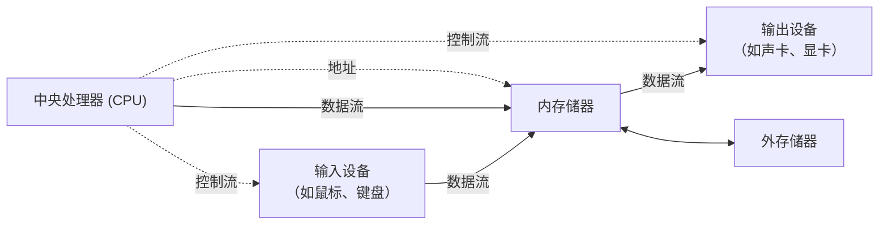

| 组成部分 | 说明 |
| :--- | :--- |
| 输入设备 | 鼠标、键盘、麦克风、扫描仪 |
| 输出设备 | 显示屏、扬声器、打印机 |
| 中央处理器 (CPU) | 运算速度非常快，ns 级别 |
| 运算器 | 算逻单元，负责数据运算 |
| 控制器 | 帮助 CPU 获取指令交给运算器 |
| 寄存器 | 存储 CPU 用来运算的数据 |
| 预取器 | 从内存中获取程序中的指令 |
| MMU | 虚拟内存映射 |
| 内存储器（内存） | 断电后数据丢失，读写速度快 |
| ROM | read only memory |
| RAM | random access memory |
| 外存储器（硬盘） | 断电后数据依然存在，读写速度慢 |

> <span style="color:orange">**内存靠「电信号」来存储数据。** 断电没！数据存储不能持久化。**优点**：数据读写速度快。</span>
>
> <span style="color:orange">**硬盘采用「磁信号」来存储数据。** 断电依然在。数据能持久化存储。**缺点**：数据读写速度慢。</span>

### 硬件系统

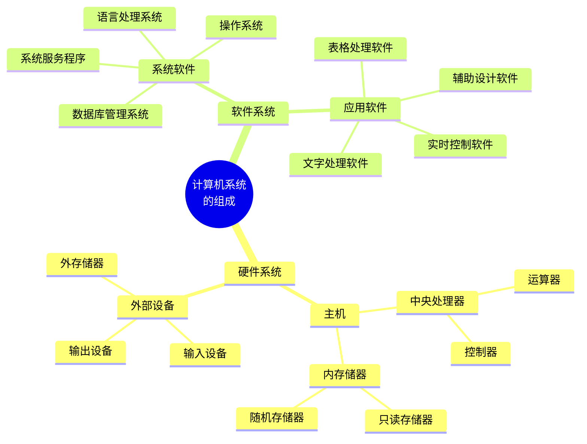

| 主机部分 | 说明 |
| :--- | :--- |
| CPU | 中央处理器 |
| 内存储器 | 内存条 |

| 外设部分 | 说明 |
| :--- | :--- |
| 输入设备 | 读入 |
| 输出设备 | 写出 |
| 外存储器 | 持久化存储 |

### CPU 内部结构

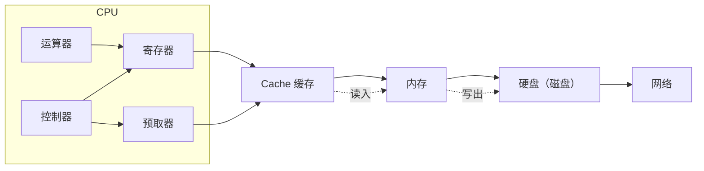

### 软件系统

#### 系统软件

- <span style="color:red">**操作系统**</span>
  - 优秀的商业公司、开源组织，站出来，编写一套针对硬件的底层程序。管理声卡、显卡、网卡、磁盘等这些硬件。
  - <span style="color:orange">**概念**</span>：操作系统就是管理计算机硬件与软件资源的一个计算机程序。本质：程序！！

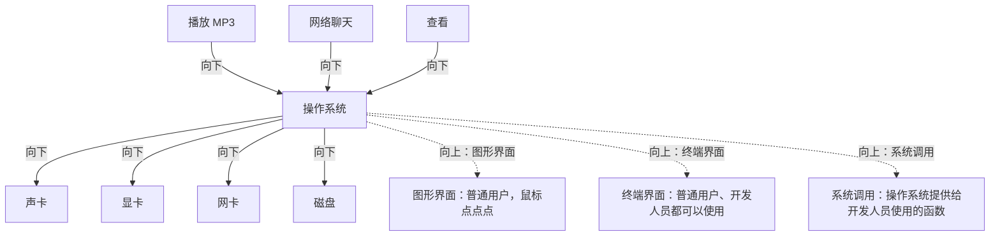

- 操作系统（OS）向下的作用：提供驱动程序，管理硬件
- 操作系统（OS）向上的作用：
  - 图形界面：普通用户，鼠标点点点
  - 终端界面：普通用户、开发人员都可以使用
  - 系统调用：操作系统提供给开发人员使用的函数

| 常用操作系统 | 别名 |
| :--- | :--- |
| Windows | 微软 |
| MacOS | 苹果 |
| Linux | 开源 |
| Unix | - |

- <span style="color:red">**语言系统**</span>
  - 计算机语言：C、C++、Java、Python、PHP …
  - 机器语言：二进制（10101001）

#### 应用软件

需要根据实际需求，来制定功能。

- 文件处理
- 图形处理
- 表格处理
- 实时控制

### 编译器和语言

| 概念 | 说明 |
| :--- | :--- |
| 编程语言 | 控制计算机硬件工作，由字母、特殊字符组成，每种编程语言有自己一套规则、语法 |
| 编译器 | CPU 只认识 1010010 二进制码，abc、汉字看不懂；编译器将人类易读易写的语言转换成 CPU 能读懂的语言 |
| 跨编译器 | 语言不同、语法不同，因此使用的编译器不同；Java 使用 javac 编译器，**不能**拿它来编译 C 语言；C 语言使用 gcc 编译器，**不能**拿它来编译 Java 语言 |

### C 语言简述

#### 计算机语言发展史

1. <span style="color:blue">**机器语言**</span>：101100110
2. <span style="color:blue">**汇编语言**</span>：助记符：abc ← 10100101。问题：硬件不同，指令不同。不同架构（CPU）指令集不同。只能支持某一种特定的硬件，**跨平台性差**。衍生出 B 语言。
3. <span style="color:blue">**C 语言**</span>：借助编译器，就能将 C 代码，转换成各种平台使用的指令。**跨平台**。
4. <span style="color:blue">**C++、Java、Oc、Python**</span>：面向对象编程。**程序扩展性好！**
5. <span style="color:blue">**SQL 语句**</span>：人类易理解。

> <span style="color:red">**机器生汇编，汇编生 B，B 生 C，C 生万物！！！**</span>

#### C 语言标准

**标准简史**：

1. 1972 年 C 语言在贝尔实验室诞生，丹尼斯·里奇参考 B 语言开发
2. 1970-80 年代，C 语言被广泛应用，产生很多不同的 C 语言版本，程序可移植性比较差
3. 1983 年，美国国家标准委员会（ANSI）成立了一个小组来制定 C 语言的标准：C 语言支持哪些语法、支持哪些功能等
4. <span style="color:red">**1989 年，通过了 C 语言的第一个标准，C89 标准**</span>
5. 1990 年，国际标准化组织（ISO）和国际电工委员会（IEC）将 C89 标准当做国际的 C 语言标准。C90 标准、C89 和 C90 指的是同一个标准
6. 1994 年 ISO 和 IEC 对 C89 标准进行修订，C94 标准，由于并没有增加新的语法特性，还是叫做 C89 或者 C90
7. 1995 年 ISO 和 IEC 再次做了修正，C95 标准
8. <span style="color:red">**1999 年 ISO 和 IEC 发布了 C 语言新标准，C 语言第二个标准。在该标准中，新增许多实用的 C 语言语法特性，增加新的关键字、可变长数组等等。C99 标准**</span>
9. 2007 年，重新修订了 C 语言
10. <span style="color:red">**2011 年，发布新的版本。新增了一些语法，泛型、国际化支持。目前为止最新版本是 C11**</span>

**标准的影响**：

1. 可将 C 语言的标准理解为 C 语言说明书。但，其并没有强制性约束力。
   > 如：微软拿到标准，认为有些标准不合理，不支持。微软认为某些特性非常好，但标准中没有，微软自己新增语法。
2. 如果编译器不支持标准，我们即使使用标准中的语法仍然会报错。
3. 编译器版本也会影响程序。因此，编写程序之前要确定编译器版本。

**常见的 C/C++ 编译器**：

| 序号 | 编译器 | 说明 |
| :--- | :--- | :--- |
| 1 | Borland C++ | 宝蓝公司 |
| 2 | Intel C++ | 英特尔编译器 |
| 3 | VC++ | 微软公司 |
| 4 | <span style="color:red">**g++ 编译器**</span> | gcc 是编译套件，Linux 默认使用的编译器，对标准支持最好 |

#### C 语言的优缺点

**优点**：

- 学习成本低
- 运行速度快
- 功能强大

**缺点**：

- 代码实现周期长
- 可移植性差
- 对经验要求高
- 对平台库依赖多

#### C 语言的应用领域

1. 服务器
2. 操作系统
3. 上层应用。MFC、QT
4. 嵌入式
5. 人工智能、硬件驱动
6. 中间件
7. 网络攻防、数据安全
8. 大学必修课
9. 名企、外企

### C 语言 32 个关键字

> <span style="color:red">**32 个关键字：（由系统定义，不能重作其它定义）**</span>

| - | - | - | - | - |
| :--- | :--- | :--- | :--- | :--- |
| auto | break | case | char | const |
| continue | default | do | double | else |
| enum | extern | float | for | goto |
| if | int | long | register | return |
| short | signed | sizeof | static | struct |
| switch | typedef | unsigned | union | void |
| volatile | while | | | |

### 9 种控制语句

| 序号 | 语句 |
| :--- | :--- |
| 1 | if () ~ else ~ |
| 2 | for () ~ |
| 3 | while () ~ |
| 4 | do ~ while () |
| 5 | continue |
| 6 | break |
| 7 | switch |
| 8 | goto |
| 9 | return |

### 34 种运算符

| 类别 | 运算符 |
| :--- | :--- |
| 算术运算符 | +、-、*、/、%、++、-- |
| 关系运算符 | <、<=、==、>、>=、!= |
| 逻辑运算符 | !、&&、\|\| |
| 位运算符 | <<、>>、~、\|、^、& |
| 赋值运算符 | = 及其扩展 |
| 条件运算符 | ?: |
| 逗号运算符 | , |
| 指针运算符 | *、& |
| 求字节数 | sizeof |
| 强制类型转换 | (类型) |
| 分量运算符 | .、-> |
| 下标运算符 | [] |
| 其它 | () |

### 文本编辑 HelloWorld

#### 修改计算机显示扩展名

打开任意一个目录 → 查看 → 文件扩展名（勾选）

#### 编写第一个 hello world 程序

```c
#include <stdio.h>

int main(void)
{
    printf("hello world\n");
    return 0;
}
```

#### 编译 hello world 程序 —— 得到机器能识别的二进制码

```bash
# 编译 C 程序，得到二进制码
gcc HelloWorld.c -o HelloWorld.exe

# 运行二进制程序
HelloWorld.exe
```

#### 快捷打开 HelloWorld.c 文件所在目录

1. 进入 HelloWorld.c 文件所在目录
2. 直接在「地址栏」中键入 cmd，不需要 cd 目录。切换。

### 常见 IDE

> **IDE**：集编辑器、编译器、调试器于一身的集合工具。

| 平台 | IDE |
| :--- | :--- |
| Windows | vs2013、vs2015、vs2017、<span style="color:red">**vs2019**</span>、Clion、Qt Creator、Eclipse |
| MacOS | Xcode、Clion、Qt Creator、Eclipse |
| Linux | vi/vim、Clion、Qt Creator、Eclipse |

### VS2019 基本使用

1. 打开 VS2019，新建项目 → 选择 **C++** → **Windows** → **控制台**
2. 创建项目，指定项目目录
3. 确保保留「解决方案资源管理器」
4. 创建 helloworld.c 文件：右键源文件 → 添加 → 新建项 → 选择 **C++ 文件 (.cpp)** → 修改扩展名为 `.c` → 命名 `helloworld.c`
5. 编写 helloworld.c 程序
6. 修改字体：
   - 工具 → 选项 → 环境 → 字体和颜色 → 选择字体
   - Ctrl + 鼠标滚轮 放大、缩小字号
7. 编写完成。点击 **本地 Windows 调试器** 图标运行

### 解决窗口一闪而过问题

1. 使用 **函数** 解决。在 `return 0;` 代码前添加一行代码：

    ```c
    system("pause");
    ```

2. 修改 VS2019 工具配置属性解决
   - 项目名上，右键 → 属性 → 配置属性 → 链接器 → 系统 → 子系统 → 下拉框中选择「**控制台 (/SUBSYSTEM:CONSOLE)**」→ 点击「应用」→ 点击确定。

### HelloWorld 释义

```c
#include <stdio.h>

int main(void)
{
    printf("hello world!\n");
    return 0;
}
```

#### 代码释义

| 序号 | 代码 | 释义 |
| :--- | :--- | :--- |
| 1 | `#` | 代表引入头文件专用特殊字符 |
| 2 | include | 引入头文件专用关键字 |
| 3 | `<>` | 用来包裹库头文件名 |
| 4 | stdio.h | 使用的头文件。因为程序中使用了 `printf()` 函数，就必须使用该头文件。std = standard，i = input 输入，o = output 输出 |
| 5 | int | main 函数返回值为整型，int |
| 6 | main | 整个程序的入口函数。任何 .c 程序，有且只有一个 main 函数 |
| 7 | (void) | 当前 main 函数没有参数 |
| 8 | `{}` | 内部放函数体 |
| 9 | printf("helloworld\n") | 见下方 |
| 10 | return 0; | 见下方 |

**printf 详解**：

- printf()：C 语言向屏幕输出字符使用的函数
- "helloworld"：待写出的字符串内容
- `\n`：回车换行

**return 详解**：

- return：返回。C 程序要求，main 函数要有返回值。借助 return 实现返回
- 0：成功！因为 int，返回整数

#### 注意事项

1. 程序中使用的所有的字符，**全部是「英文半角」字符**。
2. 程序中，**严格区分大小写**。
3. `;` 代表一行结束。**不能使用中文「；」，必须是英文**。

### 代码运行 4 种模式

| 序号 | 模式 | 说明 |
| :--- | :--- | :--- |
| 1 | Debug x86 | 以调试模式，运行 32 位程序 |
| 2 | Debug x64 | 以调试模式，运行 64 位程序 |
| 3 | Release x86 | 以发布模式，运行 32 位程序 |
| 4 | Release x64 | 以发布模式，运行 64 位程序 |

> **Debug**：调试模式。生成的 .exe 文件比 Release 模式生成文件大。带有调试信息。**学习中，只使用该模式**。
>
> **Release**：发布模式。生成的 .exe 文件没有调试信息。文件较小。

> **热键**：运行编写的程序。**Ctrl + F5**

### 注释

- <span style="color:red">**单行注释**</span>：`// 待注释的内容`
- <span style="color:red">**多行注释**</span>：`/* 待注释的内容 */`
  - 多行注释内，可以嵌套单行注释。多行注释之间不能嵌套。

### System 函数

- **作用**：执行 windows 系统中的指定的命令
- **命令**：
  - pause：暂停
  - cmd：启动新的终端
  - calc：唤起 windows 下的计算器
  - notepad：唤起 windows 下的记事本
  - mspaint：唤起 windows 下的画图工具
  - cls：清空当前 windows 终端中的内容

```c
#include <stdio.h>     // 引入头文件 stdio.h ，因为下面使用了 printf() 必须添加此头文件。
#include <Windows.h>   // 引入头文件 Windows.h，因为下面使用 Sleep() 函数。

int main(void)         // main 是程序的入口函数。void 表示没有参数。int 表示返回整数。
{
    printf("hello world1\n");   // 打印 helloworld 字符串，到屏幕。 \n 换行之
    printf("hello world2!\n");
    printf("hello world3!\n");
    printf("hello world4!\n");
    printf("hello world5!\n");
    printf("hello world6!\n");
    printf("hello world7!\n");

    Sleep(3000);          // 使当前程序，打印完 helloworld 后，睡眠 3s 钟

    // system("cmd");     // 3s 后，再有机会执行。启动一个新终端。
    // system("calc");    // 3s 后，启动计算器
    // system("notepad"); // 3s 后，启动记事本
    // system("mspaint"); // 3s 后，启动画图工具
    system("cls");        // 3s 后，将当前 终端 清空。

    return 0;             // 因为 main 返回 int 。所以这里有 return 0;
}
```

> **Sleep() 函数**，指定程序睡眠。**默认单位：毫秒**。需要使用头文件：`#include <Windows.h>`

## 第二章 核心语法（运行过程、常量、变量、标识符）

### main 函数种类

#### main 函数标准类型

- 无参：

    ```c
    int main(void) { return 0; }
    ```

- 有参：

    ```c
    int main(int argc, char *argv[]) { return 0; }
    ```

#### main 函数其他类型

> <span style="color:orange">**都能正常运行，但不是 main 的标准语法格式。**</span>

```c
// 都能正常运行，但不是 main 的标准语法格式。
void main(int argc, char *argv[]);
void main(void);
int main();
int main(void);
main();
main(int argc, char *argv[]);
```

### gcc 编译 4 步骤

#### 整体过程

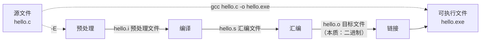

#### 预处理

- **参数**：`-E`
- **生成的文件**：xxx.i 预处理文件
- **使用命令**：`gcc -E xxx.c -o xxx.i`
- **工具**：预处理器（包含在 gcc 编译集合工具中）

**完成的工作**：

1. <span style="color:red">**头文件展开**</span>
   - 展开 stdio.h 文件内容，和源码一起，放到 xxx.i 文件中
   - <span style="color:red">**不检查语法错误！**</span>可以在此阶段提升任意文件
   - 测试命令：`gcc -E hello.c -o hello.i -I（大）.（当前目录）`
2. <span style="color:red">**宏定义替换**</span>
   - 将宏名，替换成宏值
   - `#define PI 3.14`【解释】：define：创建宏。PI：宏名 3.14：宏值

    ```c
    // 测试案例。使用命令： gcc -E hello.c -o hello.i
    #include <stdio.h>

    // 定义宏
    #define PI 3.14

    int main(void)
    {
        printf("hello world\n");

        // 使用宏
        printf("PI = %f\n", PI);

        return 0;
    }
    ```

3. <span style="color:red">**替换注释**</span>
   - 把单行、多行注释替换成空行
4. <span style="color:red">**展开条件编译**</span>
   - 根据条件来展开代码

    ```c
    // 测试案例
    #include <stdio.h>

    // 定义宏
    // #define PI 3.14   // PI 定义与否，直接决定下面的 -----666 是否打印。

    int main(void)
    {
        printf("hello world\n");

        // 使用宏
        //printf("PI = %f\n", PI);

        // 使用条件编译，含义是：如果定义了 PI ，那么就打印 -----666，否则不打印。
        #ifdef PI
            printf("-----------------6666\n");
        #endif
            return 0;
    }
    ```

#### 编译

- **参数**：`-S`
- **生成的文件**：xxx.s 汇编文件
- **使用命令**：`gcc -S xxx.i -o xxx.s`
- **工具**：编译器（包含在 gcc 编译集合工具中）

**完成的工作**：

1. <span style="color:red">**逐行检查语法错误！【重点】**</span> —— 编译过程整个 gcc 编译 4 步骤中，最耗时
2. 将 C 程序翻译成汇编指令。得到 .s 汇编文件

```asm
.file    "hello.c"
.text
.def    ___main; .scl    2; .type    32; .endef
.section .rdata,"dr"
.LC0:
    .ascii "hello world\0"
.LC2:
    .ascii "PI = %f\12\0"
.LC3:
    .ascii "-----------------6666\0"
    .text
    .globl  main
    .def    main; .scl    2; .type    32; .endef
    .seh_proc   main
main:
    pushq   %rbp
    .seh_pushreg    %rbp
    movq    %rsp, %rbp
    .seh_setframe   %rbp, 0
    subq    $32, %rsp
    .seh_stackalloc 32
    .seh_endprologue
    call    ___main
    leaq    .LC0(%rip), %rcx
    call    puts
    movq    %rcx, %rax
    movq    %rdx, %xmm1
    movq    %rax, %rdx
    leaq    .LC2(%rip), %rcx
    call    printf
    leaq    .LC3(%rip), %rcx
    call    puts
    movl    $0, %eax
    addq    $32, %rsp
    popq    %rbp
    ret
    .seh_endproc
    .section .rdata,"dr"
    .align 8
.LC1:
    .long   1374389535
    .long   1074339512
    .ident  "GCC: (x86_64-posix-sjlj-rev0, Built by MinGW-W64 project) 8.1.0"
    .def    puts; .scl    2; .type    32; .endef
    .def    printf; .scl    2; .type    32; .endef
```

#### 汇编

- **参数**：`-c`
- **生成的文件**：xxx.o 目标文件（二进制，人类看不懂）
- **使用命令**：`gcc -c xxx.s -o xxx.o`
- **工具**：汇编器（包含在 gcc 编译集合工具中）
- **完成的工作**：
  - 翻译：将汇编指令翻译成对应的二进制指令

#### 连接

- **参数**：无（-o 不是链接阶段参数，是用来指定文件名）
- **生成的文件**：xxx.exe 可执行文件（二进制，人类看不懂）
- **使用命令**：`gcc xxx.o -o xxx.exe`
- **工具**：链接器（包含在 gcc 编译集合工具中）
- **完成的工作**：
  - 库引入
  - 合并并目标文件
  - 合并并启动例程

```bash
# 完整 4 步骤编译流程
gcc -E hello.c -o hello.i
gcc -S hello.i -o hello.s
gcc -c hello.s -o hello.o
gcc hello.o -o hello.exe

# 一句话完成
gcc hello.c -o hello.exe
```

#### 小结

> <span style="color:orange">**gcc 编译的 4 个步骤中，每个步骤直接都可相互转换。**</span>

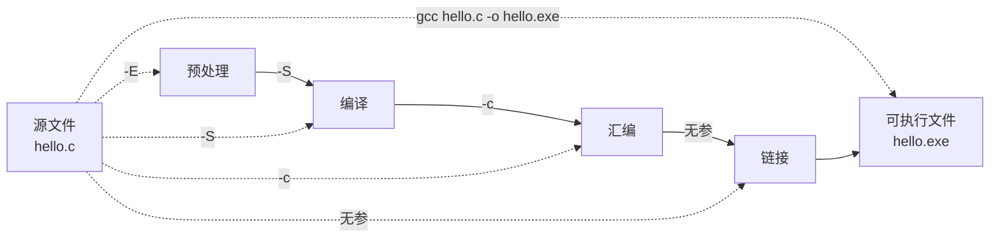

### printf 格式化输出 int

```c
#include <stdio.h>

#define PI 3.14

int main(void)
{
    int a = 10;

    printf("%d\n", a);       // %d：格式匹配符，匹配整数。
    printf("a = %d\n", a);   // a = 在 "" 中，代表普通字符串，原样输出。
    printf("%d\n", 100);

    printf("%f\n", PI);      // %f：格式匹配符，匹配小数。
    printf("PI = %f\n", PI); // PI = 在 "" 中，代表普通字符串，原样输出。

    printf("%f\n", 3.45678); // %f：格式匹配符，匹配小数。

    int b = 20;

    printf("%d + %d = %d\n", a, b, a+b);   // +、= 在 "" 中，代表普通字符串，原样输出。
    printf("%d + %d = %d\n", 3, 7, 3+7);
    return 0;
}
```

### 程序调试

- **前提**：程序，没有语法错误。—— 语法错误 VS 帮我检查。
  - 检查程序中出现的逻辑错误！
- **核心思想**：
  - 让程序一行的执行
- **添加行号**：
  - 工具 → 选项 → 文本编辑器 → c/c++ → 行号（勾选）

#### 程序调试流程

1. 添加断点。——可以添加多个
   1. 鼠标点击待添加断点行，左侧行号前灰色区域。再次点击取消
   2. 光标停止在待添加断点行的任意位置，按 F9 添加断点。再次按 F9 取消断点
2. 测试，必须在 **Debug** 模式下进程。**Release** 模式无效
3. F5 启动调试
4. 断点停止的位置，是尚未执行的指令
5. 开始调试：
   1. <span style="color:red">**逐语句执行**</span>。逐语句执行下一行（F11）：遇见函数，进入自定义函数内部，逐条跟踪执行
   2. <span style="color:red">**逐过程执行**</span>。逐过程执行下一行（F10）：遇见函数，不进入函数内部，逐条跟踪执行
   3. 逐断点执行。代码中有多个断点，直接跳转至下一个断点。—— 点击"继续"，无快捷键
   4. 跳出函数。跳出当前断点所在的函数。shift + F10

### 变量

#### 变量 3 要素

1. 变量名：用来在程序中使用
2. 变量类型：开辟内存空间大小
3. 变量值：存储的实际数据

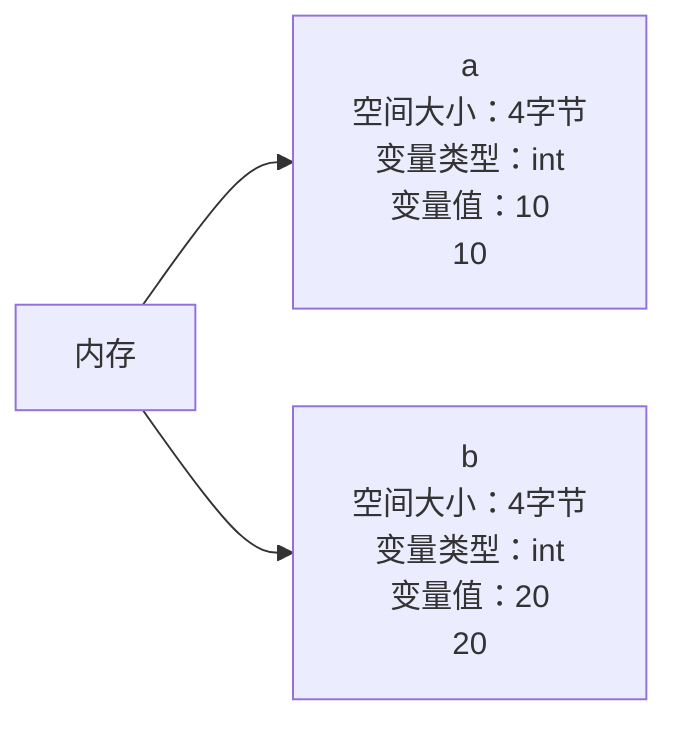

#### 变量定义

- **定义语法**：类型名 变量名 = 变量值（一般定义方法），`int m = 57;`
- 会开辟内存空间给变量。**变量声明不会开辟内存空间**。

#### 变量声明

- **语法**：
  - `int a;` 没有变量值的变量定义，叫做声明
  - `extern int a;` 添加 extern 关键字
- **特性**：
  - 变量要想使用，**必须**有定义
  - 编译器，在使用变量之前，必须能看到变量定义。如果没有看到，编译器会自动寻找一个变量声明。提升成定义
  - 如果 变量声明前，添加了 extern 关键字，无法提升！

### 常量

> 不会变化、不能被修改的数据。

1. "hello"、'A'、57、-10、3.1415926（浮点常量）
2. <span style="color:red">**#define PI 3.14**</span> —— 【宏定义】语法：`#define 宏名 宏值`
   - 强调：没有 `;` 结束标记
   - 强调：没有 `=`
3. `const int a = 10;` 定义语法：`const 类型名 变量名 = 变量值`
   - const 关键字：被该关键字修饰的变量，表示为只读变量

**练习**：

```c
#define PI 3.1415926      // 定义常量

int main(void)
{
    // 圆的面积：S = PI * r * r
    // 圆的周长：L = 2 * PI * r
    int r = 3;             // 变量的定义

    float S = PI * r * r;  // 表达式。作为变量值。
    float L = 2 * PI * r;

    //printf("圆的面积：%f\n", s);// 28.274334  默认显示 6 位小数。
    //printf("圆的周长：%f\n", l);// 18.849556

    //printf("圆的面积：%.2f\n", s);// 28.27
    //printf("圆的周长：%.2f\n", l);// 18.85指定保留小数点后两位，对第 3 位四舍五入

    float m = 3.4567891;

    printf("m=%6.2f\n", m);
    //共显示6位数，包含小数点，保留小数点后两位，对第3位四舍五入，不是6位用空格补齐。

    printf("m=%06.2f\n", m);
    //共显示6位数，包含小数点，保留小数点后两位，对第3位四舍五入，不是6位用0补齐。

    return 0;
}
```

### 标识符

- 变量和常量总称

#### 硬性要求

1. <span style="color:red">**标识符不能是关键字、函数名。**</span> system、printf、int、main、return、..
2. <span style="color:red">**只能有字母、数字、下划线组成。**</span> a-z/A-Z/0-9_
   - `abc_1`/`abc_2`/`_abc_1`/`a_b_c_d`
3. <span style="color:red">**不能以数字开头。**</span>
   - `int a5ir = 10;` ok
   - `int _34F = 6;` ok
   - `float 98i_54 = 5.4;` error
4. <span style="color:red">**大小写严格区分。**</span>
   - 通常 使用大写来定义常量。`#define MAX 100`
   - 通常 使用小写来定义变量

#### 命名规范

1. <span style="color:blue">**大驼峰法**</span>：`int HelloWorldHahaHohoHehe = 10;`
   - 多个单词组成变量名，每个单词首字母大写
2. <span style="color:blue">**小驼峰法**</span>：`int helloWorldHahaHohoHehe = 10;`
   - 多个单词组成变量名，首个单词的首字母小写，其余每个单词首字母大写
3. <span style="color:blue">**小写 + 下划线**</span>：`int hello_world_haha_hoho_hehe = 10;`
   - **C 语言专用！**

### sizeof 关键字

- sizeof 不是函数
- 求变量、数据类型，占用的内存空间大小
- 使用方法：
  1. `sizeof(变量名)` —— 返回变量大小，单位整数字节
  2. `sizeof(类型名)` —— 返回数据类型大小，单位整数字节
  3. `sizeof 变量名` —— 语法 C 语言支持该写法，不推荐使用

### 整型

#### 有符号整型

> 获取数据类型的最小值、最大值，可以使用 `#include <limits.h>`

| 整型名 | 名称 | 格式匹配符 | 占用的大小 | 最小值 | 最大值 |
| :--- | :--- | :--- | :--- | :--- | :--- |
| int | 整型 | %d | 4 字节 | -2147483648 | 2147483647 |
| short | 短整型 | %hd | 2 字节 | -32768 | 32767 |
| long | 长整型 | %ld | windows：32/64位：4 字节 Linux 下：32位：4 字节、64位：8 字节 | -2147483648 | 2147483647 |
| long long | 长长整型 | %lld | 8 字节 | -9223372036854775808 | 9223372036854775807 |

```c
#include <stdio.h>
#include <limits.h>

int main(void)
{
    printf("int大小 = %u\n", sizeof(int));
    printf("int最小值: %d, 最大值: %d\n", INT_MIN, INT_MAX);

    printf("short大小 = %u\n", sizeof(short));
    printf("short最小值: %hd, 最大值: %hd\n", SHRT_MIN, SHRT_MAX);

    printf("long大小 = %u\n", sizeof(long));
    printf("long最小值: %ld, 最大值: %ld\n", LONG_MIN, LONG_MAX);

    printf("long long大小 = %u\n", sizeof(long long));
    printf("long long最小值: %lld, 最大值: %lld\n", LLONG_MIN, LLONG_MAX);

    return 0;
}
```

#### 无符号整型

| 整型名 | 名称 | 格式匹配符 | 占用的大小 | 最小值 | 最大值 |
| :--- | :--- | :--- | :--- | :--- | :--- |
| unsigned int | 无符号整型 | %u | 4 字节 | 0 | - |
| unsigned short | 无符号短整型 | %hu | 2 字节 | 0 | - |
| unsigned long | 无符号长整型 | %lu | windows：32/64位：4 字节 Linux 下：32位：4 字节、64位：8 字节 | 0 | - |
| unsigned long long | 无符号长长整型 | %llu | 8 字节 | 0 | - |

## 第三章 核心语法（数据类型和进制转换）

### char 类型

#### 基础信息

- 字符型
- 单位：一个字节（8 bit 位）
- 格式匹配符：
  - 数值型：
    - 有符号：`%hhd` —— char 显示数值专用格式匹配符
    - 无符号：`%hhu` —— unsigned char 显示数值专用格式匹配符
  - 字符型：`%c`
- 取值范围：
  - 有符号：-128 ~ 127
  - 无符号：0 ~ 255
- 程序获取：

```c
#include <stdio.h>
#include <limits.h>

int main(void)
{
    // 获取无符号数值范围
    printf("char 无符号 min = 0, max = %hhu\n", UCHAR_MAX);
    // 获取有符号数值范围
    printf("char 有符号 min = %hhd, max = %hhd\n", CHAR_MIN, CHAR_MAX);
    // 获取 char 占用的字节数
    printf("char 大小 = %u\n", sizeof(char));
    // 获取 unsigned char 占用的字节数
    printf("unsigned char 大小 = %u\n", sizeof(unsigned char));

    return 0;
}
```

#### ASCII 码

- char 类型数据，数值对应一个 ASCII 码
- ASCII 表（American Standard Code for Information Interchange 美国标准信息交换代码）

| 字符 | ASCII 码 | 字符 | ASCII 码 |
| :--- | :--- | :--- | :--- |
| 0 | 48 | A | 65 |
| 1 | 49 | a | 97 |
| 9 | 57 | Z | 90 |
| 'A' | 65 | 'a' | 97 |
| '0' | 48 | '\n' | 10 |
| '\t' | 9 | '\0' | 0 |

```c
#include <stdio.h>

int main(void)
{
    char ch = 'A';   // 定义变量 ch, 指定初值为 'A';

    printf("ch = %c\n", ch);   // c: character. %c 用来显示字符的 格式匹配符。

    ch = 'm';     // 给变量 ch 赋值成 'm', 覆盖 原来的 'A';

    printf("ch = %c\n", ch);

    ch = 97;     // 使用 范围内的数值 97, 给 ch 赋值.

    printf("ch = %c\n", ch);   // 将数值97, 按照字符格式打印输出。

    ch = 98;     // 使用 范围内的数值 98, 给 ch 赋值.

    printf("ch = %c\n", ch);   // 将数值98, 按照字符格式打印输出。

    return 0;
}
```

#### 练习

将大写字母，转换成小写字母：

```c
#include <stdio.h>

int main(void)
{
    char ch = 'R';   // char 变量定义

    printf("R 转换的小写为: %c\n", ch+32);   // ch+32 表达式，对应格式匹配符 %c

    char ch2 = 'h'; // char 变量定义

    printf("h 转换的大写为: %c\n", ch2-32); // ch2-32 表达式，对应格式匹配符 %c

    char ch3 = '5';
    // 借助字符 5, 利用 ASCII特性, 打印出 字符9
    printf("打印字符9 = %c\n", ch3+4);

    return 0;
}
```

#### ASCII 表说明

- 0 ~ 32 ASCII 码 对应的字符都不可见
- 常用的 ASCII 码：
  - `'a'`：ASCII 码值 97
  - `'A'`：ASCII 码值 65
  - `'0'`：ASCII 码值 48
  - `'\n'`：ASCII 码值 10
  - `'\t'`：制表符。tab 键对应的字符。（ASCII 码值 9）
  - `'\0'`：ASCII 码值 0

#### char 与 printf 对应关系

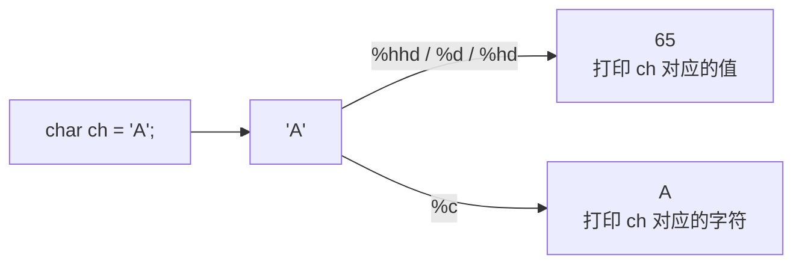

**练习**：在一个 printf 函数中，打印输出 hello 换行 world 换行

```c
// 方法 1
int main(void)
{
    printf("hello\nworld\n");
    return 0;
}

// 方法 2
int main(void)
{
    char ch = '\n'; // 定义 ch 变量，初值为 '\n'

    printf("hello%cworld%c", ch, ch); // 等价于 printf("hello\nworld\n");

    return 0;
}
```

一个 printf 中打印 hello（一个 tab 缩进）world 换行：

```c
int main(void)
{
    char ch1 = '\t';   // 实现 一个 tab 缩进
    char ch2 = '\n';   // 实现 一个换行

    printf("hello%cworld%c", ch1, ch2);

    return 0;
}
```

#### 转义字符

- `'/'`：自右向左划，叫做「斜杠」
- `'\'`：自左向右划，叫做「反斜杠」。**—— 是转义字符**
- 转义字符的作用：
  1. 将普通字符，转换为 特殊意
     - 如：`'\n'`：这是一个字符，代表换行
     - 如：`'\t'`：这是一个字符，代表一个制表符
  2. 将特殊字符，还原成本身意
     - 如：`'\\n'`：这样就将一个字符 `\n`，还原成 两个字符：`'\'` 和 `'n'`

**练习**：将特殊字符转换成本身意。

> 题目：屏幕上严格输出 如下内容：【"\n"的值是 10】要求显示时要有 `"`

```c
int main(void)
{
    printf("\"\\n\"的值是 %hhd", '\n');
    return 0;
}
```

### 实型（浮点型）【了解】

- 显示小数

#### 基础信息

- **float**：单精度浮点型。%f 大小：4 字节。（可以使用 sizeof() 求取）
  - 4.35 默认会被编译器理解为 double 类型
  - `float v = 4.567f;`：编译器理解 float
  - `%f` 格式匹配符，默认保留 6 位小数
- **double**：双精度浮点型。%lf 大小：8 字节。
  - `double d = 5.68;`

#### 取值范围

使用头文件 `#include <float.h>` 获取浮点型取值范围：

```c
int main(void)
{
    printf("float 范围: %f ~ %f\n", FLT_MIN, FLT_MAX);
    printf("double 范围: %lf ~ %lf\n", DBL_MIN, DBL_MAX);

    return 0;
}
```

#### 精度问题

- **float 类型**：
  - 精度 6~7 位
    - 整数部分 + 小数部分 <= 6 位，准确
    - 整数部分 + 小数部分 == 7 位，可能准确，也可能不准确
    - 整数部分 + 小数部分 > 7 位，不准确
- **double 类型**：
  - 精度 15~16 位
    - 整数部分 + 小数部分 <= 15 位，准确
    - 整数部分 + 小数部分 == 16 位，可能准确，也可能不准确
    - 整数部分 + 小数部分 > 16 位，不准确

```c
int main(void)
{
    float f = 439243243.9f;

    printf("f = %f\n", f);

    return 0;
}
```

> 不同平台（操作系统），对应 float、double 类型实现的精度有可能不同。以上是 Windows 下特性。
>
> float 和 double 不存在"无符号"类型。

### bool 类型

> C 语言原来没有 bool 类型。C99 标准中，新增了 bool 类型。C++ 自带 bool 类型。

- 用处：
  - 表示：
    - 好、坏
    - 真、假
    - 对、错
    - 是、否
  - 取值：
    - true —— 真 —— 1
    - false —— 假 —— 0
- C 语言使用 bool 的条件：
  - 编译器要支持 C99 标准
  - 导入 `#include <stdbool.h>`
- bool 类型的大小：
  - 1 字节。（`sizeof()` 求取）
- bool 没有专用的格式匹配符。打印时，使用 %d 来打印
  - true —— 真 —— 1
  - false —— 假 —— 0

```c
int main(void)
{
    bool aa = true;   // 定义 bool 类型变量 aa, 初值为 true == 1

    printf("aa = %d\n", aa);

    aa = false;   // 给 bool 类型变量 aa 赋值为 false == 0

    printf("aa = %d\n", aa);

    return 0;
}
```

### 进制和转换

- 计算机只使用 2 进制
- 8 进制、10 进制、16 进制，**统统都是给人类用的！！！**

#### 存储知识

- 1 bit 位 就是一个 二进制位，存 0 或 1
- 一个字节（Byte） 1B = 8 bit 位
- "内存单元" 是计算机内存存储的最小单位，一个内存单元 == 1 字节
- 1KB = 1024B
- 1MB = 1024KB
- 1GB = 1024MB
- 1TB = 1024GB

#### 2 进制

- 取值 1 或 0，逢 2 进 1，借 1 当 2
- 没有格式匹配符

**10 转 2**：

- 除 2 反向取余法

> 示例：56 → 111000；173 → 1010 1101

**2 转 10**：

- 掌握 2⁰ ~ 2¹⁰ 各自的取值：

| 指数 | 值 | 指数 | 值 | 指数 | 值 |
| :--- | :--- | :--- | :--- | :--- | :--- |
| 2⁰ | 1 | 2⁴ | 16 | 2⁸ | 256 |
| 2¹ | 2 | 2⁵ | 32 | 2⁹ | 512 |
| 2² | 4 | 2⁶ | 64 | 2¹⁰ | 1024 |
| 2³ | 8 | 2⁷ | 128 | - | - |

- 计算方法，对应二进制位，有 1 累加 2 的指数次幂值，有 0 略过

> 11101 —— 29
>
> 10110 —— 2+4+16 = 22

#### 8 进制

- 逢 8 进 1，借 1 当 8
- 取值：0/1/2/3/4/5/6/7 最大值 7
- 格式匹配符：`%o` 和 `%#o`
- 表示语法：`0` 开头
- 8 进制 ——> 10 进制：
  - `056 == 8⁰ * 6 + 8¹ * 5 = 6 + 40 = 46`
  - `0123 = 8⁰ * 3 + 8¹ * 2 + 8² * 1 = 3 + 16 + 64 = 83`
- 10 进制 ——> 8 进制：
  - 除 8 反向取余法
  - 135 —— 0207

**8 转 2**：

- 转换算法：将 8 进制数，自左向右，每一位，用 421 码展开
- 练习：
  - 056 —— 101110
  - 04735 —— 1001 1101 1101
  - 053261 —— 101 0110 1011 0001

**2 转 8**：

- 转换方法：自右向左，每 3 个二级制位一组，不足 3 位补 0
  - 1101010101111010
    - 分组：1 101 010 101 111 010
    - 补齐：001 101 010 101 111 010
    - 八进制数为：0152572
  - 101101111011
    - 分组：10 110 111 011
    - 补齐：010 110 111 011
    - 八进制数为：02673

#### 16 进制

- 逢 16 进 1，借 1 当 16
- 取值：0~9 10-A/a 11-B/b 12-C/c 13-D/d 14-E/e 15-F/f 最大值：F/f
- 格式匹配符：`%x` 或 `%#x`
- 表示语法：`0x` 开头
- 16 进制 ——> 10 进制：
  - 将每一个 16 进制位，展开 相加得 10 进制
- 10 进制 ——> 16 进制：
  - 除 16 反向取余法
  - 37：0x25
  - 43：0x2B

**16 转 2**：

- 转换算法：将 16 进制数，自左向右，每一位，用 8421 码展开
  - 0xFAC12：1111 1010 1100 0001 0010

**2 转 16**：

- 转换方法：自右向左，每 4 个二级制位一组，不足 4 位补 0
  - 101001011101011001
    - 分组：10 1001 0111 0101 1001
    - 补齐：0010 1001 0111 0101 1001
    - 16 进制数为：0x29759
  - 1110110100111101
    - 分组：1110 1101 0011 1101
    - 补齐：1110 1101 0011 1101
    - 16 进制数为：0xED3D

#### 小结

- 使用频率最高的是 10 进制。其次是：16 进制
  - `int m = 0x15f4;`
  - `int n = 0345;`
  - `int k = 01011101;`
    - **不能直接将变量值赋值为 2 进制**
    - 上述的赋值，会被编译器理解为 8 进制数

```c
#include <stdio.h>

int main(void)
{
    int a = 56;   // 10 进制数作 a 变量初始化。 -- 定义。

    printf("10进制: a = %d\n", a);
    printf("8进制: a = %o\n", a);
    printf("8进制: a = %#o\n", a);  // 在 % 和 #o 中间添加#，可以在输出时，显示 8 进制前缀。
    printf("16进制: a = %x\n", a);
    printf("16进制: a = %#x\n", a); // 在 % 和 #x 中间添加#，可以在输出时，显示 16 进制前缀。

    return 0;
}
```

#### 常用的格式匹配符

| 格式符 | 用途 |
| :--- | :--- |
| %d | 整型 |
| %c | 字符 |
| %x | 16 进制 |
| %u | 无符号 |
| %s | 字符串 |
| %o | 8 进制 |
| %#o | 带前缀 8 进制 |
| %#x | 带前缀 16 进制 |
| %hhd | char 有符号 |
| %hd | short 有符号 |
| %ld | long |
| %lld | long long |
| %hhu | char / unsigned char 无符号 |
| %hu | unsigned short |
| %lu | unsigned long |
| %llu | unsigned long long |
| %f | float |
| %lf | double |

### 编码和存储

#### 无符号存储

```c
unsigned int a = 12;   // 占用 4 字节 32 个 bit 位存储。
空间: 00000000 00000000 00000000 00000000   ----  4 字节。
存储: 00000000 00000000 00000000 00001100

unsigned short b = 15;   // 占用 2 字节 16 个 bit 位存储。
空间: 00000000 00000000                ----  2 字节。
存储: 00000000 00001111
```

#### 有符号存储

- 需要拿出一个二进制位，专门存储符号。标识正、负
  - 选用最高位 为符号位
  - 正：0
  - 负：1

**有符号正数**：

```c
// 采用 "源码" 存储
int a = 5;
空间: 0 0000000 00000000 00000000 00000000
存储: 0 0000000 00000000 00000000 00000101   --- 表示存储正数 5 。
```

**有符号负数**：

- 有符号的负数，采用「补码」存储
  - 源码：数值的二进制制直接存储
  - 反码：符号位不变，将其余数值位取反
  - 补码：反码 + 1

```c
int b = -33;
空间: 0 0000000 00000000 00000000 00000000
源码: 1 0000000 00000000 00000000 00100001
反码: 1 1111111 11111111 11111111 11011110
补码: 1 1111111 11111111 11111111 11011111   --- 负 33 在计算机中实际的存储形式。
```

- 小结：
  - int —— 4 字节 —— 32 bit 位
    - 有符号：31 个数值位，取值范围 -2³¹ ~ 2³¹ - 1 ——> -2147483648 ~ +2147483647
    - 无符号：32 个数值位，取值范围 0 ~ 2³² - 1 ——> 0 ~ 4294967295
  - short —— 2 字节 —— 16 bit 位
    - 有符号：15 个数值位，取值范围 -2¹⁵ ~ 2¹⁵ - 1 ——> -32768 ~ 32767
    - 无符号：16 个数值位，取值范围 0 ~ 2¹⁶ - 1 ——> 0 ~ 65535
- 因此，知道数据类型占用内存的大小，就能算出该类型 无符号数、有符号数 对应的取值范围。

### 数据溢出

> 详见练习章节

### 数值溢出

- 如果 int 类型变量，已经取最大值（2147483647），再给这个变量 +1，就发了溢出
  - 上溢出：最大值 + 1
  - 下溢出：最小值 - 1

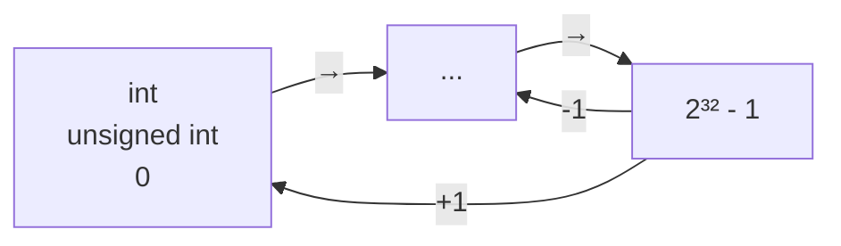

#### 无符号数

- 取值范围 0 ~ 2³² - 1
- 最大值 + 1 ——> 0
- 0 - 1 ——> 最大值

```c
// 上溢出
int main(void)
{
    unsigned int a = UINT_MAX;   // 取出无符号最大值

    printf("最大值+1 = %d\n", a + 1);  // 0
    printf("最大值+2 = %d\n", a + 2);  // 1

    return 0;
}

// 下溢出
int main(void)
{
    unsigned int a = 0; // 取出无符号最小值

    printf("最小值-1 = %u, 最大值 = %u\n", a - 1, UINT_MAX);

    return 0;
}
```

#### 有符号数

**上溢出**：

- 最大值 + 1，下溢出 == 最小值

```c
// unsigned 上溢出。
int main(void)
{
    int a = INT_MAX;   // 取出无符号最小值

    printf("最大值+1 = %d, 最小值 = %d\n", a+1, INT_MIN);

    return 0;
}

// signed 上溢出。
int main(void)
{
    int a = INT_MAX;   // 取出有符号最小值

    printf("最大值+1 = %d, 最小值 = %d\n", a+1, INT_MIN);

    return 0;
}
```

**下溢出**：

- 最小值 - 1，下溢出 == 最大值

```c
// signed 下溢出。
int main(void)
{
    int a = INT_MIN;   // 取出有符号最小值

    printf("最小值-1 = %d, 最大值 = %d\n", a - 1, INT_MAX);

    return 0;
}
```

#### 小结

- 大部分编译器，对于数值溢出，采用上述处理方式。但，个别编译器有可能不能
- 受数值溢出影响，进行数据存储时，要选择恰当的数据类型。389482390483209 —— int

### 不常用关键字（了解）

## 第四章 核心语法（运算符、if、switch、while）

- **extern**：表示声明。声明没有内存空间，不能提升为定义
- **const**：限制一个变量为只读。**—— 常量**
- **Volatile**：防止编译优化
- **register**：定义一个寄存器变量。**没有内存地址**

### 输入输出函数

#### 输出函数

- **printf()**：`%d, %c, %x, %u, %s ...`
- **putchar() 函数**：
  - 输出一个字符到屏幕
  - `'abcZ'` 是错误的定义，既不是 char 也不是字符串

```c
putchar(97);     // 97 == 'a'

putchar('\n');   // 输出换行符。

putchar('b');

putchar('\n');   // 使用率较高。  printf("\n");

putchar('abcZ'); // 'abcZ' 是错误的定义，既不是 char 也不是字符串。
```

#### 输入函数

##### scanf 函数

**使用**：

- 安装指定个格式匹配符，获取指定类型数据
- 获取整数：

```c
int a;   // 可以定义 a 变量（有内存空间），也可以声明（自动提升成定义，有内存空间）
scanf("%d", &a);     // &: 取变量 a 的地址 ---> 拿到 a 的内存空间。
```

- 示例：

```c
// scanf 输入
int main(void)
{
    //int a = 10;
    int a;   // 在 scanf 执行时，会提升为定义。

    int ret = scanf("%d", &a);  // scanf 可以从键盘获取用户输入，用户根据 %d 输入整数。

    printf("获取的a为: %d\n", a);

    return EXIT_SUCCESS;
}
```

- 一次性获取多个整数：
- 常见的错误书写方法：

```c
int a, b, c;   // 一次性创建多个 int 类型变量。

// scanf 可以从键盘获取用户输入，用户根据 多个%d 输入整数。
int ret = scanf("%d%d%d", &a, &b, &c);

// 上述写法编译器无法识别。输入的 123 应该怎样分配给 3 个 %d
```

- 正确的书写方式：（推荐）

```c
int main(void)
{
    int a, b, c;   // 一次性创建多个 int 类型变量。

    // scanf 可以从键盘获取用户输入，用户根据 多个%d 输入整数。
    int ret = scanf("%d %d %d", &a, &b, &c);

    printf("获取的a为: %d\n", a);
    printf("获取的b为: %d\n", b);
    printf("获取的c为: %d\n", c);

    return EXIT_SUCCESS;
}
```

- 获取字符：

```c
// scanf 输入，获取字符。
int main(void)
{
    char ch1, ch2, ch3;   // 一次性创建多个 char 变量

    printf("请输入3个字符，用空格隔分: ");

    scanf("%c %c %c", &ch1, &ch2, &ch3);

    printf("ch1 = %c\n", ch1);
    printf("ch2 = %c\n", ch2);
    printf("ch3 = %c\n", ch3);

    return EXIT_SUCCESS;
}
```

**注意事项**：

1. <span style="color:red">**不要随意**</span> 在 scanf() 函数中，添加 `\n`。如果添加了，换行符，会被 scanf 当成 格式来约束用户输入
   1. printf() 中的 `\n` 用来屏幕输出 换行
   2. scanf() 函数中的 `\n`，不能用来输出，因为这是一个输入函数
2. 解决 VS 中使用 scanf 函数报错 C4996 错误：

   > 以下是错误描述
   >
   > C4996 'scanf': This function or variable may be unsafe. Consider using scanf_s instead. To disable deprecation, use _CRT_SECURE_NO_WARNINGS. See online help for details.

3. 解决方法：在 .c 文件的**第一行**添加 `#define _CRT_SECURE_NO_WARNINGS`

##### getchar 函数

- 直接从键盘接收一个字符，并将得到的字符对应的 ASCII 返回

```c
int main(void)
{
    char ch = getchar();  // 定义 char 变量 ch, 接收 getchar() 函数返回值做为初值。

    printf("ch的数值: %d\n", ch);   // %hhd %hd
    printf("ch的字符: %c\n", ch);

    return EXIT_SUCCESS;
}
```

### 运算符

#### 算数运算符

1. `+ - * /`：先乘除取余，后加减
2. 除法运算后，得到的结果赋值给整型变量，取整数部分。`int c = 10/20;` ——> 0
3. 除 0：错误操作，不允许。`printf("%d\n", 10/0);`
4. 对 0 取余：错误操作，不允许。`printf("%d\n", 123 % 0);`
5. 不允许对小数取模。35 % 3.4;
6. 对负数取余，结果为余数的绝对值。`printf("%d\n", 10 % -3);` ——> 1

#### 自增自减运算符

- <span style="color:red">**前缀自增 (++)，自减 (--)**</span>
  - 先自增、自减，再取值

    ```c
    int a = 10;
    ++a;  // 等价于  a = a+1;
    ```

- <span style="color:red">**后缀自增 (++)，自减 (--)**</span>
  - 先取值，再自增、自减

```c
// ++ / -- 运算符
int main(void)
{
    // 前缀
    int a = 10;
    printf("%d\n", ++a);  // ++a 等价于 a = a+1;

    // 后缀
    int b = 10;
    printf("%d\n", b++);  // b++ 等价于 b = b+1;

    // 不管前缀、后缀、含有变量 ++/-- 表达式执行完后，变量均发生了自增、自减。
    printf("b = %d\n", b);

    return EXIT_SUCCESS;
}
```

#### 赋值运算符

1. `=`，在计算机中，只能完成"赋值"操作，一定是右边赋值给左边，也叫单向赋值
2. `a += 10` // 等价于 `a = a+10;`
3. `a -= 30` // 等价于 `a = a-30;`
4. `a %= 5;` // 等价于 `a = a%5;`

#### 比较运算符

- 真：1（非 0），假：0
- `==` 判等符（`=` 不是用来判等）
- `!=` 不等
- `<` 小于
- `<=` 小于等于
- `>` 大于
- `>=` 大于等于
- **【强调】**：数学运算中 13 < var < 16 判断，在计算机中，要写成：`var > 13 && var < 16;`

#### 逻辑运算符

- 0 为假，非 0 为真。（非 0：1、27、-9）
- **逻辑非（!）**
  - 非真为假，非假为真

    ```c
    // 逻辑运算符
    int main(void)
    {
        // 逻辑非
        int a = 34;  // 34 是非0， 默认 a 为真。
        int b = 0;

        printf("!a = %d\n", !a);  // a 为真，非a 为假！ ---> 0
        printf("b = %d\n", !b);   // b=0，b 为假，非b，为真。 ---> 1

        return EXIT_SUCCESS;
    }
    ```

- **逻辑与（&&）**
  - 同真为真，其余为假

    ```c
    printf("=====&&%d\n", a && !b);  // a为真，!b为真，真&&真 -- 真。 ----> 1
    ```

- **逻辑或（||）**
  - 有真为真，同假为假

    ```c
    printf("-----||%d\n", a || b);   // a 为真，!b 为真，真||真 -- 真。 ---> 1
    printf("------%d\n", !a || b);   // !a 为假，b 为假，假||假 -- 假。 ---> 0
    printf("-----||%d\n", !a || !b); // !a 为假，b 为假，假||假 -- 假。 ---> 0
    ```

#### 运算符优先级

> `() > ++/--`（后缀高于前缀）`(强转) ! (逻辑非) sizeof > 算数运算符(先乘除取余，后加减) > 比较运算符 > 逻辑运算符 > 三目运算（条件运算）> 赋值运算符 > 逗号运算符`

- 一周左右的时间，记忆运算符优先级

#### 逗号运算符

```c
int x, y, z;
int a = (x=1, y=2, z=3);  // x=1, y=2, z=3 是一个逗号运算符表达式。运算结果为 a = 3;

int a = (x=1, z=3, y=2?);  // 运算结果为 a = 2?;
```

- 含有"," 运算符表达式运算结果，是最后一个子表达式的结果

#### 三目运算符

- 语法：`表达式1 ? 表达式2 : 表达式3`
  - 表达式 1 必须是一个判断表达式
  - 结果为真：整个三目运算，返回表达式 2
  - 结果为假：整个三目运算，返回表达式 3

```c
// 三目运算
int main(void)
{
    int a = 40;
    int b = 4;

    //int m = a > b ? 69 : 10;
    //printf("m = %d\n", m);  // m = 69;

    //int m = a < b ? 69 : 10;
    //printf("m = %d\n", m);   // m = 10;

    // 三目运算支持嵌套
    int m = a < b ? 69 : (a<b?3+5); // 先算表达式3，加5，整个三目运算，取表达式3-->5
    printf("m = %d\n", m);   // m = 5;

    int m = a < b ? 69 : a < b ? 3 : 5;
    printf("m = %d\n", m);   // m = 5;

    return EXIT_SUCCESS;
}
```

- 如果不使用 `()`，三目运算默认的结合性，自右向左

### 类型转换

#### 隐式类型转换

1. 编译器自动完成。（小类型转大类型，同类型大小）

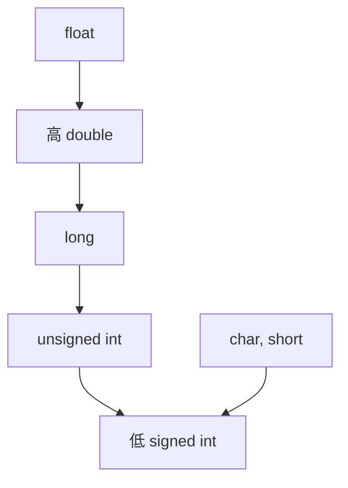

2. 由赋值产生：

```c
int r = 3;
float s = 3.14 * r * r;
// 3.14 默认类型是 double, r 是 int 类型。运算过程中，转换为 double 类型运算。
// 运算结束，赋值给 s 时，转换为 float。
```

- 小类型 ——> 大类型。没问题
- 大类型 ——> 小类型。可能丢失数据
  - VS 中 Ctrl + F7 只编译，检查语法错误，不运行

```c
int main(void)
{
    int a = 321;
    char ch = a;   // 用值为 321 的a变量，给 char 类型赋值。

    printf("ch = %d\n", ch);   // 运行输出 65;

    return EXIT_SUCCESS;
}
```

> 321：2⁸=256 有，128 没有，64 有，32/16/8/4/2 没有，有 1
>
> 0000 0000 0000 0000 0000 0001 0100 0001 —— 321 二进制表现形式
>
> 0000 0000 —— char 只有一个字节。
>
> 赋值后，char 值为：0100 0001 --- 1 + 64 = 65

#### 强制类型转换

- 语法：
  1. 强制变量：`(目标类型) 变量`
  2. 强制表达式：`(目标类型) 表达式`

```c
int main(void)
{
    float price = 3.6;   // 单价
    int weight = 4; // 斤数

    //int sum = weight * (int)price;   // 强制变量。
    //printf("sum = %d\n", sum);  // --- 12

    int sum = (int)(weight * price);   // 强制表达式。
    printf("sum = %d\n", sum);  // --- 14

    return EXIT_SUCCESS;
}
```

### if 分支语句

- if...else 分支语句，实现一种模糊匹配。匹配一个范围
- if...else 分支

```c
if (判断表达式) {
    判断表达式为真，执行的代码。
}
else
{
    判断表达式为假，执行的代码。
}
```

- 示例：

```c
int a;

printf("请输入一个数: ");

int ret = scanf("%d", &a);

if (a > 0) {
    printf("a > 0\n");
}
else
{
    printf("a <= 0\n");
}
```

- 多个分支逻辑：

```c
if (判断表达式1) {
    判断表达式1为真，执行的代码。
}
else if (判断表达式2)
{
    判断表达式1为假，判断表达式2为真，执行的代码。
}
else if (判断表达式3)
{
    判断表达式1为假，判断表达式2为假，判断表达式3为真，执行的代码。
}
...
else
{
    以上所有判断表达式都为假，执行的代码。
}
```

- 示例：

```c
int score;

printf("请输入学生成绩: ");

scanf("%d", &score);

if (score >= 90)    // 优秀
{
    printf("优秀\n");
}
else if (score >=70 && score < 90)         // 70 < score < 90 错误写法。
{
    printf("良好\n");
}
else if (score >= 60 && score < 70)
{
    printf("及格\n");
}
else
{
    printf("差劲\n");
}
```

**练习**：

- 编写程序，实现 3 只小猪评体重。屏幕输入 3 个小猪的重量，借助 if 分支，找出最重的那只小猪

```c
int main(void)
{
    int pig1, pig2, pig3;

    printf("请输入3只小猪的重量: ");

    scanf("%d %d %d", &pig1, &pig2, &pig3);

    if (pig1 > pig2)  // pig1 重
    {
        if (pig1 > pig3)  // 1、这行不能写分号。  2、缩进使用 tab 实现。
        {
            printf("第一只小猪最重，体重为: %d\n", pig1);
        }
        else
        {
            printf("第3只小猪最重，体重为: %d\n", pig3);
        }
    }
    else     // pig2 重
    {
        if (pig2 > pig3)
        {
            printf("第2只小猪最重，体重为: %d\n", pig2);
        }
        else
        {
            printf("第3只小猪最重，体重为: %d\n", pig3);
        }
    }
    return EXIT_SUCCESS;

    // 其他实现方法：
    // 使用逻辑运算  if (pig1 > pig2 && pig1 > pig3) ---> pig1。
    // 使用三目运算  pig1 > pig2 ? pig1 : pig2;
}
```

- 分支语句中，可以嵌套其他分支语句
- else 总是找它前面最近的 未配对的 if 组合使用

### switch 分支语句

- <span style="color:red">**精确匹配**</span>。结构较清晰。较 if 语句执行效率略高
- <span style="color:red">**缺点**</span>：不能直接判断区间，需要借助表达式运算

```c
switch (表达式)
{
    case 1:
        执行语句;
        break;   // 表示一个分支执行结束，跳出 switch.
    case 2:
        执行语句;
        break;   // 表示一个分支执行结束，跳出 switch.
    case N:
        执行语句;
        break;   // 表示一个分支执行结束，跳出 switch.
    default:
        其他情况，执行语句;（上述所有的 case 都不满足）
        break;
}
```

- 练习：获取学生成绩，给出优良可差

```c
int main(void)
{
    int score;

    printf("请输入学生成绩: ");
    scanf("%d", &score);

    // 将 学生成绩，通过运算，得出可以放入 switch case 分支 的 表达式。
    switch (score/10)
    {
        case 10:
            printf("优秀\n");
            break;   // 表示当前分支结束。
        case 9:
            printf("优秀\n");
            break;
        case 8:
            printf("良好\n");
            break;
        case 7:
            printf("良好\n");
            break;
        case 6:
            printf("及格\n");
            break;
        default:         // 所有 case 都不满足的其他情况。
            printf("不及格\n");
            break;
    }
    return EXIT_SUCCESS;
}
```

### case 穿透

- 一个 case 分支，如果没有 break；它执行完本 case 的代码后，会继续向下，执行下一个 case 分支的代码。这称之为 case 穿透
- 大多数情况下，一个 case 分支，应该对应一个 break
- 利用 case 穿透

```c
switch (score/10)
{
    case 10:        // 故意让 switch 发生 case 穿透
    case 9:
        printf("优秀\n");
        break;
    case 8:         // 故意让 switch 发生 case 穿透
    case 7:
        printf("良好\n");
        break;
    case 6:
        printf("及格\n");
        break;
    default:         // 所有 case 都不满足的其他情况。
        printf("不及格\n");
        break;
}
```

### while 循环语句

- 语法：

```c
while (判别表达式)   // 如果为真，执行循环体，如果为假，跳出循环。
{
    循环体
}
```

**练习**：

- 敲 7：从 1~100 数数，逢 7 和 7 的倍数，敲桌子
- 分析：
  - 7 的倍数：`num % 7 == 0`
  - 个位含 7：`num % 10 == 7`
  - 十位含 7：`num / 10 == 7`

```c
int main(void)
{
    //7的倍数： num % 7 == 0
    //个位含7： num % 10 == 7
    //十位含7： num / 10 == 7

    int num = 1;

    while (num <= 100)
    {
        // 判断敲桌子的时机
        // if ((num % 7 == 0) || (num % 10 == 7) || (num / 10 == 7))
        if (num % 7 == 0 || num % 10 == 7 || num / 10 == 7)
        {
            printf("敲桌子!\n");
        }
        else
        {
            printf("%d\n", num);
        }
        num++;
    }
    return EXIT_SUCCESS;
}
```

### do while 循环语句

- 无论如何先执行一次循环体，然后再判断循环是否应该继续
- 语法：

```c
do {
    循环体
} while (判断表达式);
```

**练习**：

- 求水仙花数。一个三位数（100~999），各个位上数字的立方 和 等于本数字
- 分析：
  - 3 位数：100~999 —— 如：234、861
  - 个位数：`int a = num % 10;`
  - 十位数：`int b = num / 10 % 10;`
  - 百位数：`int c = num / 100;`

```c
int main(void)
{
    //个位数: int a = num % 10;
    //十位数: int b = num / 10 % 10;
    //百位数: int c = num / 100;

    int num = 100;   // 数数从 100 开始。
    int a, b, c;     // 定义存储个位、十位、百位 的变量。

    do {
        a = num % 10;        // 求个位数。
        b = num / 10 % 10;
        c = num / 100;

        // 判断 这个数字是否是"水仙花数".
        if (a * a * a + b * b * b + c * c * c == num)
        {
            printf("水仙花数: %d\n", num);
        }
        num++;   // 不断向后数数。

    } while (num <= 999);

    return EXIT_SUCCESS;
}
```

## 第五章 核心语法（for、数组）

### 配置 VS2019 快捷导入代码

- 准备 快捷导入代码的脚本文件，保存至系统目录中（位置自定义）：`C:\Software\fastCode`（如 #1.snippet、#2.snippet、#3.snippet）
- 在 VS2019 中配置，使用上述目录中的脚本文件
  - 工具 —— 代码片段管理器 —— 修改 Basic 为 Visual C++ —— 选择 上述自定义的目录位置
- 在程序中使用 快捷导入代码
  - `#1` ---- `tab` 键

### for 循环

#### 语法

```c
for (表达式1; 表达式2; 表达式3)
{
    循环体;
}
```

- 循环从 **表达式1** 开始 ——> **表达式2**（判别表达式）——> 真 ——> 执行循环体 ——> 表达式 3 ——> 判断表达式 2
  - 真：继续 循环体 ——> 表达式 3 ——> 表达式 2 ...
  - 假：跳出循环。（正常情况下，for 循环的出口是 表达式 2）

#### 练习

使用 for 循环 求 1~100 的和：

```c
// 1~100 求和       1+2+3+4+5+...+100
int main(void)
{
    // 定义循环因子。
    int i = 0;        // 定义 i, 给初值。

    // 定义变量 记录累加值
    int sum = 0;      // 初值为 0
    for (i = 1; i <= 100; i++)
    {
        sum = sum + i;
    }

    // 循环结束，打印 累加结果
    printf("sum = %d\n", sum);

    return EXIT_SUCCESS;
}
```

### for 循环的变换形式

- 循环因子 i：
  - 在 for 循环之前定义。在 for 循环，结束后依然能使用
  - 定义在 for 循环之内。for 循环结束后，不能使用

    ```c
    for (int i = 1; i <= 100; i++)    // 将 i 的定义放到 for 内 表达式1 上。
    {
        sum = sum + i;
    }

    // 循环结束，打印 累加结果
    printf("sum = %d. i = %d\n", sum, i);  // 编译器保存，"未定义标识符"
    ```

- for 循环 3 个表达式，在使用 时，均可省略。但，2 个 `;` 不允许省略
  1. 省略 表达式 1：

        ```c
        int i = 1;  // 定义 循环因子
        int sum = 0;

        for (; i <= 100; i++)   // 不写表达式1
        {
            sum = sum + i;
        }
        ```

  2. 省略 表达式 3：

        ```c
        int i = 1;  // 定义 循环因子
        int sum = 0;

        for ( ; i <= 100; )    // 不写表达式1，不写表达式3
        {
            sum = sum + i;
            i++;         // 将原来的表达式3 写到循环体中。
        }
        ```

  3. 省略 表达式 2：

        ```c
        int i = 1;  // 定义 循环因子

        for ( ; ; ) // 不写表达式2，相当于 for ( ; 1; ) 表达式2为 真(1)。这是一个死循环。
        {
            printf("i = %d\n", i);
            i++;
        }
        // for ( ; ; ) 死循环 相当于  while(1) {};
        ```

- for 每个表达式中，可以含有多个算式：

```c
int i = 0;   // 定义 循环因子
int a = 0;

for (i=1, a=3; a<20, i<10; i++, a+=3)  // i<10, a <20 也可以写成  i<10 && a<20
{
    printf("i = %d\n", i);
    printf("a = %d\n", a);
}
```

**死循环**：

```c
// 方法1:
for(;;)
{
}

// 方法2:
while(1)
{
}
```

#### 练习

- 猜数字游戏：
  - 产生一个随机数，用户键盘输入一个数据，程序提示用户，输入的数据 > <= 随机数。用户根据提示不断变换输入，最终猜中！

**生成随机数**：

1. 添加一个随机数种子。作用：保证随机是真正的随机

    ```c
    srand(time(NULL));  // 固定写法。

    // time(NULL) 获取系统当前时间。unsigned long long 类型。
    // srand() 函数来生成随机数，使用 系统时间为 算法的 系数。
    ```

2. 添加头文件

    ```c
    // srand() --- <stdlib.h>
    // time() --- <time.h>
    ```

3. 生成随机数：

    ```c
    int n = rand() % 100;          // 随机数范围: 0 ~ 99
    int n = rand() % 100 + 13;     // 随机数范围: 13 ~ 112
    int n = rand() % 63 + 17;      // 随机数范围: 0~17 ~ 62+17
    ```

- 思路分析：

```c
// 伪代码
int main(void)
{
    1. 生成随机数。(3步骤)
    2. 创建死循环，用户猜测    while(1)
        int num ;
    while (1)
    {
        接收用户输入: scanf("%d", &num);
        if 判断用户输入的数据，与实际随机 大小。
            num > 随机数
            提示用户。继续循环。
        num < 随机数
            提示用户。继续循环。
        num == 随机数
            提示用户 猜中！结束循环。
            break;  跳出循环。
    }
    return 0;
}
```

- 编码实现：

```c
int main(void)
{
    // 播种随机数种子
    srand(time(NULL));

    // 生成随机数 n
    int n = rand() % 100;   // 范围 0~99

    // 定义 num 变量，存储用户输入的数据。
    int num;

    // 创建 死循环，给用户猜数字。
    for (;;)    // while(1) 等价
    {
        printf("请输入猜测的数字: ");
        // 获取用户输入数据
        scanf("%d", &num);

        // 提示用户，测试方向
        if (num > n)
        {
            printf("猜大了!\n");
        }
        // 如果 if分支、for、while 满足后，执行语句只有一条时，{} 可以省略。
        else if (num < n)
        {
            printf("猜小了!\n");  // 语法允许，不写 {}
        }
        else
        {
            printf("猜中了！！！\n");
            break;  // 不必再循环。
        }
    }
    printf("本尊数: %d\n", n);

    return EXIT_SUCCESS;
}
```

### 嵌套 for 循环

```c
int i = 0;  // 外层循环的循环因子
int j = 0;  // 内层循环的循环因子

for (i = 0; i < 10; i++)
{
    for (j = 2; j < 10; j++)
    {
        // 循环体
    }
}
```

- 结论：外层循环执行一次，内层循环执行一周

#### 练习

- 模拟电子表打印
- 分析：

```c
// 最外层
for (i = 0; i < 24; i++)
{
    for (j = 0; j < 60; j++)
    {
        for (k = 0; k < 60; k++)
        {
            打印时间。
        }
    }
}
```

```text
11:30:54
11:30:56
...
11:31:00
...
12:00:00
12:00:01
```

- 实现：

```c
int main(void)
{
    int i, j, k;

    for (i = 0; i < 24; i++)  // 小时
    {
        for (j = 0; j < 60; j++)  // 分钟
        {
            for (k = 0; k < 60; k++)  // 秒
            {
                printf("%02d:%02d:%02d\n", i, j, k);
                Sleep(980);
                system("cls");  // 清屏
            }
        }
    }

    return EXIT_SUCCESS;
}
```

#### 练习

- 打印正序 9x9 乘法表

```
1x1= 1           // 第1行，打印1列
1x2= 2 2x2= 4     // 第2行，打印2列
1x3= 3 2x3= 6 3x3= 9     // 第3行，打印3列
1x4= 4 2x4= 8 3x4=12 4x4=16    // 第4行，打印4列
...
1x9= 9 2x9=18 3x9=27 4x9=36 5x9=45 6x9=54 7x9=63 8x9=72 9x9=81    // 第9行，9列
```

```text
jxi =
第 i 行，打印 i 列。
```

- 分析 + 实现：

```c
for (i = 1; i <= 9; i++)  // 外层，描述行。
{
    for (j = 1; j <= i; j++)  // 内层，描述每一列。
    {
        printf("%dx%d=%d\t", j, i, i*j);
    }
    printf("\n");
}
```

- 打印倒序 9x9 乘法表：

```text
1x9= 9 2x9=18 3x9=27 4x9=36 5x9=45 6x9=54 7x9=63 8x9=72 9x9=81    // 第1行
1x8= 8 2x8=16 3x8=24 4x8=32 5x8=40 6x8=48 7x8=56 8x8=64
1x7= 7 2x7=14 3x7=21 4x7=28 5x7=35 6x7=42 7x7=49
1x6= 6 2x6=12 3x6=18 4x6=24 5x6=30 6x6=36
1x5= 5 2x5=10 3x5=15 4x5=20 5x5=25
1x4= 4 2x4= 8 3x4=12 4x4=16
1x3= 3 2x3= 6 3x3= 9
1x2= 2 2x2= 4
1x1= 1
```

```text
jxi = 值
```

```c
for (i = 9; i >= 1; i--)   // i 控制 行
{
    for (j = 1; j <= i; j++)
    {
        printf("%dx%d=%d\t", j, i, i*j);
    }
    putchar('\n');
}

// 上述省略{}写法无误，不推荐。 --- 推荐下面的写法。
int main(void)
{
    int i, j;
    for (i = 9; i >= 1; i--)
    {
        for (j = 1; j <= i; j++)
        {
            printf("%dx%d=%d\t", j, i, j * i);
        }
        putchar('\n');   // printf("\n");
    }
    return EXIT_SUCCESS;
}
```

### 跳转语句

#### break

- **作用 1**：
  - 一次 break，可以跳出一重循环。（for、while、do while）
- **作用 2**：
  - 防止 case 穿透。结束 switch()。

#### continue

- **作用**：结束 **本次** 循环，continue 关键字之后的代码，在这次循环中，不执行

- 示例 1：

```c
for (int i = 0; i < 5; i++)
{
    printf("==========1=========\n");
    printf("==========2=========\n");
    if (i == 2) {
        continue;
    }
    printf("==========3=========\n");
    printf("==========4=========\n");
    printf("==========5=========\n");
    printf("\n");
}
```

- 示例 2：

```c
int main(void)
{
    for (int i = 0; i < 10; i++)
    {
        for (int j = 0; j < 5; j++)
        {
            if (j == 2)
            {
                continue;  // 只跳出（后续代码不执行）本次 j == 3 时的循环。
            }
            printf("i = %d, j= %d\n", i, j);
        }
        printf("\n");
    }
    return EXIT_SUCCESS;
}
```

#### goto

- **语法**：
  1. 设定一个标签。标签名自定义，一般大写。如：ABC、LABLE、AAA
  2. 使用 "goto 标签名" 跳转到标签的位置。（只函数内生效）

- 示例：

```c
int main(void)
{
    printf("==========1=========\n");
    printf("==========2=========\n");
    printf("==========3=========\n");

    goto LABLE;
    printf("==========4=========\n");
    printf("==========5=========\n");
    printf("==========6=========\n");
    printf("==========7=========\n");

LABLE:
    printf("==========8=========\n");
    printf("==========9=========\n");

    return EXIT_SUCCESS;
}
```

- 示例：

```c
int main(void)
{
    int i = 0, j = 0;

    for (i = 0; i < 5; i++)
    {
        if (i == 2)
        {
            goto ABC234;
        }
        printf("i = %d\n", i);
    }

    for (j = 0; j < 5; j++)
    {
ABC234:
        printf("j = %d\n", j);
    }

    return EXIT_SUCCESS;
}
```

> `j = 0` 的表达式，没有执行。

- goto 语法过于灵活，会打乱程序的执行逻辑，降低代码的可读性。**后续编程中，尽量少用**
  - C 程序中，简单的逻辑，依然可以使用 goto。

### 数组

- **什么是数组**：
  - 数组是，相同数据类型有序的、连续的存储集合

```c
// 定义数组，定义10个类型相同、连续、有序存储 的 数据。
int arr[10] = {19, 2, 23, 4, 5, 6, 10, 7, 8, 9};

//printf("arr[0] = %d\n", arr[0]);   // 取数组的第一个元素。
printf("&arr[0] = %p\n", &arr[0]);   // 取数组的第一个元素的 内存地址。
//printf("&arr[0] = %x\n", &arr[0]);   // 内存地址使用 16 机制数表示。
//printf("&arr[0] = %#x\n", &arr[0]);
printf("&arr[1] = %p\n", &arr[1]);
printf("&arr[2] = %p\n", &arr[2]);
printf("&arr[3] = %p\n", &arr[3]);
```

- **%p**：
  - 用来打印变量内存地址的专用格式匹配符（占位符）

#### 基本特性

1. 各个元素，连续存储
2. <span style="color:red">**数组名为地址**</span>，是数组首个元素的地址。`arr == &arr[0]`
3. 求数组的总大小：

    ```c
    printf("数组的大小: %u\n", sizeof(arr));
    ```

4. 求数组每一个元素的大小：

    ```c
    printf("数组元素的大小: %u\n", sizeof(arr[0]));
    ```

5. 求数组元素的个数：

    ```c
    printf("数组元素的个数: %d\n", sizeof(arr)/sizeof(arr[0]));
    ```

6. 数组第一个元素的下标：0
7. 数组最后一个元素的下标：

    ```c
    sizeof(arr)/sizeof(arr[0]) - 1
    ```

#### 数组初始化

```c
// 初始化方法1
int arr[5] = {3, 7, 2, 1, 9};

// 初始化方法2 [多用]
int arr[5] = {3, 7};        // 剩余未初始化的元素，默认值 0

// 初始化方法3 [多用]
int arr[5] = {0};   // 初始化一个 全部元素为 0 的数组。 ---闭0  常用。

// 初始化方法4 [多用]
int arr[] = {3, 7, 2, 1, 6, 9, 13};   // 编译器会自动求取数组元素个数。

// 初始化方法5
int arr[] = {0};   // 定义了只有一个元素的数组，值为 0

// 初始化方法6 [多用]
int arr[10];   // 声明了一个有10个元素数组。
arr[0] = 5;
arr[1] = 6;
arr[2] = 7;  // 剩余未初始化的元素，默认值 --- 随机数。
```

#### 练习

- 数组元素逆序

```c
// 数组元素逆序
int main(void)
{
    int arr[] = {1, 6, 8, 0, 4, 3, 9, 2};  // 变为：{2, 9, 3, 4, 0, 8, 6, 1}

    // 获取数组的元素个数
    int n = sizeof(arr) / sizeof(arr[0]);

    int i = 0;     // 从前向后
    int j = n-1;   // 从后向前
    int tmp = 0;   // 定义临时变量。

    // 交换数组元素之前，打印数组的所有元素。
    for (int i = 0; i < n; i++)
    {
        printf("%d ", arr[i]);
    }
    putchar('\n');

    // 循环交换数组元素。
    while (i < j)
    {
        tmp = arr[i];     // 三杯水变量交换法
        arr[i] = arr[j];
        arr[j] = tmp;
        i++;   // 不断后移
        j--;   // 不断前移
    }

    // 交换数组元素之后，打印数组的所有元素。
    for (int i = 0; i < n; i++)
    {
        printf("%d ", arr[i]);
    }
    putchar('\n');

    return 0;
}
```

### 冒泡排序

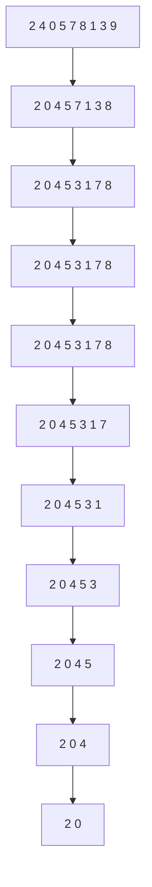

> N 个数，证 N-1 阶

```c
int main(void)
{
    int i, j, tmp;

    int xjp[] = {12, 2, 32, 14, 62, 54, 27, 89, 9, 10, 3};

    // 求取数组元素个数。
    int n = sizeof(xjp) / sizeof(xjp[0]);

    // 开始排序。
    for (i = 0; i < n - 1; i++)   // 外层控制行
    {
        for (j = 0; j < n - 1 - i; j++)  // 内层控制列。

            // 相邻两两比较，三杯水交换
            if (xjp[j] > xjp[j + 1])
            {
                tmp = xjp[j];
                xjp[j] = xjp[j + 1];
                xjp[j + 1] = tmp;
            }
    }
    // 打印排序结果。
    for (i = 0; i < n; i++)
    {
        printf("%d ", xjp[i]);
    }
    printf("\n");

    return EXIT_SUCCESS;
}
```

## 第六章 核心语法（二维数组、字符串、函数）

### 二维数组

#### 基本使用

```c
int arr[10] = {1,2,3,4,5,6,7}; // 一维数组

{1,2,3,4,5,6,7}
{1,2,3,4,5,6,7}
{1,2,3,4,5,6,7} // 多个一维数组，组成二维数组。
```

#### 定义语法

```c
int arr[r][c] = {数组元素}
int arr[2][3] =
{
    {2, 5, 8},            // 第0行
    {7, 9, 10}            // 第1行
};
// 常规写法：
int arr[3][5] = {{2, 3, 54, 56, 7}, {2, 67, 4, 35, 9}, {1, 4, 9, 3, 78}};
```

#### 打印

```c
// 自动补齐的 for 自带的 size_t 来源：
// 查看：方法1：右键 -- 转到定义
//      方法2：F12
typedef unsigned int size_t;   // 给 unsigned int 起别名，叫 size_t

// 以下是打印 2 维数组的方法：
int arr[3][5] = { {2, 3, 54, 56, 7}, {2, 67, 4, 35, 9}, {1, 4, 9, 3, 78} };

for (size_t i = 0; i < 3; i++)   // 行
{
    for (size_t j = 0; j < 5; j++) // 列
    {
        printf("%d ", arr[i][j]);
    }
    printf("\n");
}
```

#### 特性

- 数组大小

    ```c
    printf("数组大小：%u\n", sizeof(arr));
    ```

- 一行大小

    ```c
    printf("数组一行大小：%u\n", sizeof(arr[0]));
    ```

- 一个元素大小

    ```c
    printf("数组一个元素大小：%u\n", sizeof(arr[0][0]));
    ```

- 行数

    ```c
    int row = sizeof(arr) / sizeof(arr[0]);   // 数组总大小 / 每行大小
    ```

- 列数

    ```c
    int col = sizeof(arr[0]) / sizeof(arr[0][0]);   // 一行大小 / 每个元素大小
    ```

- 地址合一

    ```c
    数组的地址 == 数组的首元素地址 == 数组的首行地址
    printf("%p\n", arr);   // 数组的首地址
    printf("%p\n", arr[0]);   // 数组首行地址
    printf("%p\n", &arr[0][0]);   // 数组首元素的地址
    ```

#### 初始化

##### 常规初始化

```c
int arr[3][5] = { {2, 3, 54, 56, 7}, {2, 67, 4, 35, 9}, {1, 4, 9, 3, 78} };
```

##### 不完全初始化

```c
int arr[3][5] = {{2,3},, {2, 67, 4}, {1, 4, 16, 78}};   // 未被初始化的数值，为0
int arr[3][5] = {0};   // 初值全部为0的二维数组
int arr[3][5] = { 2, 3, 4, 5, 6, 7, 8, 9, 99, 2, 16, 78}; //【少见】系统自动分配行列
```

##### 不完全指定行列初始化

```c
int arr[][] = {1, 23, 4, 56, 7, 8};  【错误】 // 二维数组定义，至少需要指定 列值。
int arr[][2] = { 1, 23, 4, 56, 7, 8, 10};   // 可以不指定行值。

int row = sizeof(arr) / sizeof(arr[0]);
int col = sizeof(arr[0]) / sizeof(arr[0][0]);

for (size_t i = 0; i < row; i++)   // 行
{
    for (size_t j = 0; j < col; j++)   // 列
    {
        printf("%d ", arr[i][j]);
    }
    printf("\n");
}
```

#### 练习

- 求出 5 名学生 3 门功课的总成绩。（总成绩：一个学生的总成绩。一门功课的总成绩）

```c
int main(void)
{
    int scores[5][3];   // 5个学生，3门功课

    int row = sizeof(scores) / sizeof(scores[0]);
    int col = sizeof(scores[0]) / sizeof(scores[0][0]);

    // 获取 5 个学生 3门功课成绩
    for (size_t i = 0; i < row; i++)
    {
        for (size_t j = 0; j < col; j++)
        {
            scanf("%d", &scores[i][j]);
        }
    }
    // 一门功课的总成绩
    for (size_t i = 0; i < col; i++)   // 一次取出，每个学生的一门功课
    {
        int sum = 0;   // 累加每门功课的分数。
        for (size_t j = 0; j < row; j++)   // 每门功课第几个学生
        {
            sum += scores[j][i];
        }
        printf("第%d门功课总成绩：%d\n", i + 1, sum);
    }

    // 求每个学生的总成绩
    for (size_t i = 0; i < row; i++)   // 每个学生
    {
        int sum = 0;   // 累加每个学生的成绩。

        for (size_t j = 0; j < col; j++)   // 每个学生的成绩
        {
            sum += scores[i][j];  // sum = sum + scores[i][j];
        }
        printf("第%d个学生的总成绩为：%d\n", i+1, sum);
    }
    //printf("-----------------------------------\n");

    ///// 打印 5 个学生 3门功课成绩
    //for (size_t i = 0; i < row; i++)
    //{
    //  for (size_t j = 0; j < col; j++)
    //  {
    //      printf("%d ", scores[i][j]);
    //  }
    //  printf("\n");
    //}
    //system("pause");
    return EXIT_SUCCESS;
}
```

### 多维数组（了解）

- 三维数组：`[层][行][列]`
- 语法：`类型名 数组名[层][行][列]`

```c
int arr[3][3][4] =
{
    {
        {{12, 3, 4, 5}},    // 第0行
        {{12, 3, 4, 5}},    // 第1行
        {{12, 3, 4, 5}}     // 第2行
    }, // 第0层
    {
        {}, // 第0行
        {}, // 第1行
        {}  // 第2行
    }    // 第1层
};
```

- 打印：

```c
int main(void)
{
    int arr[3][4][2] =
    {
        {
            {1, 2},
            {3, 4},
            {5, 6},
            {7, 8}
        },
        {
            {12, 24},
            {31, 49},
            {5, 46},
            {17, 88}
        },
        {
            {122, 24},
            {311, 419},
            {15, 46},
            {17, 188}
        }
    };

    for (size_t i = 0; i < 3; i++) // 层
    {
        for (size_t j = 0; j < 4; j++) // 行
        {
            for (size_t k = 0; k < 2; k++) // 列
            {
                printf("%d ", arr[i][j][k]);
            }
            printf("\n");
        }
        printf("\n\n");
    }

    system("pause");
    return EXIT_SUCCESS;
}
```

```c
int arr[2][3][4] = {1,2,3,4,5,6,7,8,9};

int arr[][3][4] = {1,2,3,4,5,6,7,8,9}; // 层数，可以省略。

数组的首地址 == 首层地址 == 首层首行地址 == 首元素地址。

4维、5维、6维。。。。。N维

int arr[2][3]
short arr[2][3]
float arr[2]
long long arr[2][3][5]
```

### 字符串

- 一串字符。C 语言中，一定使用 `'\0'` 结束。

#### 字符数组和字符串的区别

- 字符数组

    ```c
    char str1[5] = {'h','e','l','l','o'};   // 不是字符串，没有 \0
    ```

- 字符串

    ```c
    char str2[6] = {'h','e','l','l','o','\0'};  【麻烦】
    char str3[6] = "hello";  // 自动带有 \0 结束标志.
    ```

#### 字符串输出

- `printf("%s")`
  - 打印字符串。挨着从字符串的第一个字符顺序向后打印，打印到 `'\0'` 结束，没碰到 `'\0'` 不结束。
  - `'a' != "a"('a','\0')`
  - `'abc'` 是一个错误定义！既不是字符串，也不是有效字符。

#### 其他格式匹配符

- `%Ns`：
  - 显示 N 个字符的字符串，不足 N 用空格向右填充。

    ```c
    printf("%9s\n", str);
    ```

- `%0Ns`：
  - 显示 N 个字符的字符串，不足 N 用 0 向左填充。

    ```c
    printf("%09s\n", str);
    ```

- `%-Ns`：
  - 显示 N 个字符的字符串，不足 N 用空格向左填充。

    ```c
    printf("%-9s\n", str);
    ```

- `%%`：与字符串无直接关系。
  - 显示一个 `%`。转义字符 `%`，`%` 无效。转义 `%`，使用 `%%` 本身。
  - 输出 [10 % 3 = 1]：`printf("10 %% 3 = 1\n");`

#### 练习

- 键盘输入字符串，存至 str 中，统计每个字母出现的次数。
- 分析

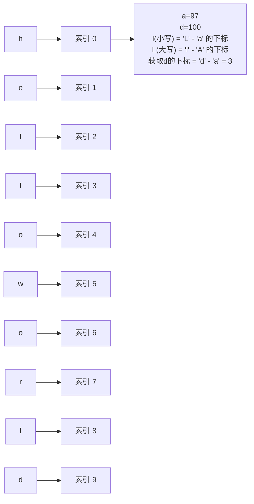

```c
int main(void)
{
    char str[1024] = { 0 };   // 定义有10个元素的字符数组，初值均为0

    for (size_t i = 0; i < 11; i++)
    {
        scanf("%c", &str[i]);  // helloworld
    }
    // 定义一个有26个元素的数组，初始化成 0
    char count[26] = { 0 };   // 代码26个英文字符出现的次数。

    for (size_t i = 0; i < 11; i++)
    {
        int index = str[i] - 'a';    // 提取每个字符，在 count 表中对应的下标。
        count[index]++;    // 向对应字符，位置++，代表该字符出现了一次。
    }

    // 循环遍历 count 数组，打印每个字符，出现的次数。
    for (size_t i = 0; i < 26; i++)
    {
        if (count[i] != 0)   // 0 == \0
        {
            printf("%c字符，在字符串%s中，出现了%d次\n", i+'a', str, count[i]);
        }
    }

    system("pause");
    return EXIT_SUCCESS;
}
```

#### scanf 获取字符串

```c
char str[1024] = {0};   // 定义字符串存储的空间，保证足够大。
scanf("%s", str);
```

- 注意事项：
  - 用于存储字符串的空间，必须足够大！防止溢出。
  - `%s` 遇到空格和 `\n` 终止。

    ```c
    char str[1024] = {0};
    scanf("%s", str);  --- 获取 "hello world haha xixi" 字符串
    printf("%s", str);  --- 输出 hello
    ```

  - 借助「正则表达式」，可以获取带有空格的字符串。`scanf("%[^\n]", str);`

### 字符串操作函数

#### gets

- 从（键盘）标准输入 stdin 获取字符串。返回字符串首地址，可以获取带有空格的字符串，不保存 `\n`，将其替换为 0

```c
#include <stdio.h>

char *gets(char *s);   // char * 等价于 char []
    参数：用来存储字符串的空间地址。
    返回值：返回实际获取到的字符串的首地址。
// 示例
char str[1024] = {0};
printf("获取的字符串为：%s\n", gets(str));
```

#### fgets

- 从（键盘）标准输入 stdin 获取字符串。**一定**会给字符串预留 0 空间。可以获取带有空格的字符串。如果空间足够，保留 `\n`，如果空间不足，不保留 `\n`。

```c
#include <stdio.h>
char *fgets(char *s, int size, FILE *stream);   // char * 等价于 char []
    参数1：用来存储字符串的空间地址。
    参数2：空间的大小。（严格对应实际空间的大小）
    参数3：读取字符串的位置。 -- stdin（键盘）

    返回值：返回实际获取到的字符串的首地址。

// 示例：
char str[15];
int len = sizeof(str);
printf("获取到的字符串为：%s\n", fgets(str, len, stdin));
```

#### puts

- 将字符串输出到 屏幕 标准输出 stdout，输出后会自动向屏幕输出 `\n`

```c
// printf("%s\n", "hello")

#include <stdio.h>

int puts(const char *s);   // char * 等价于 char []
    参数：待 写入到屏幕的字符串。
    返回值：
        成功：0，失败：-1
// 示例：
char str[] = "hello world";
int ret = puts(str);
printf("ret = %d\n", ret);
```

#### fputs

- 将字符串输出到 屏幕 标准输出 stdout，不自动添加 `\n` 字符。

```c
#include <stdio.h>

int fputs(const char * str, FILE * stream);   // char * 等价于 char []
    参数1：待输出到屏幕的字符串。
    参数2：写入的位置。 -- stdout 标准输出，屏幕。
    返回值：
        成功：0，失败：-1
// 示例：
char str[] = "hello world\n";

int ret = fputs(str, stdout);

printf("ret = %d\n", ret);
```

#### strlen

- 作用：获取一个字符串有效字符个数（字符串的长度）。不含 `\0`（碰到 `\0` 结束）

```c
#include <string.h>

size_t strlen(const char *s);
    参数：待 求长度的字符串
    返回：有效字符个数
// 示例：
char str[] = "hello world\n";
printf("有效长度=%u\n", strlen(str));   // 不含有 \0 长度
printf("sizeof=%u\n", sizeof(str));     // 含有 \0 长度
```

- 实现 strlen 函数

```c
int main(void)
{
    char str[] = "hello world";

    int i = 0;
    while (str[i] != '\0')
    {
        i++;
    }
    printf("不含\0的字符串长度为：%d\n", i);

    printf("strlen = %d\n", strlen(str)) ;

    system("pause");
    return EXIT_SUCCESS;
}
```

#### 字符串追加

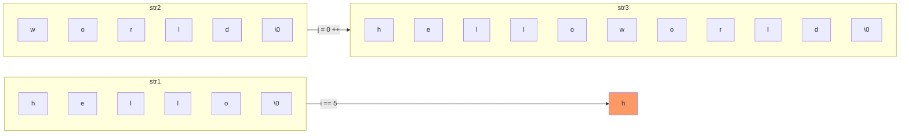

```c
int main(void)
{
    char str1[] = "hello";
    char str2[] = "world";
    char str3[100];

    // 循环将 str1 中的字符，依次写入到 str3 中
    int i = 0;
    while (str1[i] != '\0')
    {
        str3[i] = str1[i];
        i++;
    }
    // 循环结束，str3 = [hello] 无 \0
    // printf("i = %d\n", i);  --- 循环结束为 5。

    int j = 0;  // 循环 str2

    // 循环将 str2 中的字符，接着str1的内容顺序写入到 str3 中
    while (str2[j])  // while(str2[i] != 0) == while (str2[i] != '\0')
    {
        str3[i+j] = str2[j];
        j++;
    }
    // 循环结束，str3 = [helloworld] 无 \0

    // 手动添加 \0 结束标记
    str3[i + j] = '\0';

    printf("str3 = %s\n", str3);

    system("pause");
    return EXIT_SUCCESS;
}
```

### 函数

#### 函数的作用

- 提高代码复用率。
- 提高程序模块化组织性。

#### 函数分类

- 系统库函数：标准库。libc
  1. 必须引入头文件 `#include <xxx.h>` ---- 函数声明。
  2. 根据函数库函数原型，调用函数。
- 用户自定义函数：
  - `bubble_sort()`、`myPrint()`
  - 除了需要提供函数原型之外，还需要提供函数实现。

#### 使用函数

- 函数定义、函数声明、函数调用

##### 函数定义

- 函数定义必须包含"函数原型" 和 "函数体"
  - 函数原型：返回值类型 + 函数名 + 形参列表。
    - 形参列表：形参参数列表。一定包含：类型名、形参名

        ```c
        // 加法函数
        int add(int a, int b)
        ```

  - 函数体：一对 `{}` 包裹函数实现。

    ```c
    // 例子：
    int add(int a, int b)
    {
        int ret = a + b;
        return ret;
    }
    // int test(char ch, short b, int arr[], int m)
    ```

##### 函数调用

- 包含：函数名(实参列表)：
  - 实参（实际参数）：在调用时，传参必须严格按照形参填充。（参数个数、类型、顺序）
  - 实参在调用时，没有 类型描述符。

    ```c
    // 例子
    int m = 10;
    int n = 20;
    int ret = add(m, n);
    ```

##### 函数声明

- 包含：函数原型(返回值类型 + 函数名 + 形参列表) + ";"
- 要求，在函数调用之前，编译器，必须见过函数定义。否则需要函数声明。
- 如果，没有函数声明，编译器默认做"隐式声明"。
  - 隐式声明：【不要依赖】
    - 编译器认为所有的函数，返回值都是 int。
    - 可以根据函数调用，推测函数原型。
- `#include <xxx.h>` 内部，包含 函数声明。

#### exit 函数

- `return` 关键字：
  - 返回当前函数调用。将返回值返回调用者。（在底层，会调用 `_exit()` 函数。）
- `exit()` 函数：
  - 退出当前程序

```c
// 函数声明
// int test(int a, char ch);
int test(int, char); // 函数声明de 简化写法。声明时，形参名 可以省略。

int main(void)
{
    // 函数调用
    int ret = test(10, 'a');  // test函数，调用结束，return 给 main

    printf("test函数返回: ret = %d\n", ret);

    // return 0;   // 返回给调用者（自动例程）-- 作用：结束程序。
    exit(0);   // 结束程序。
}

// 函数定义
int test(int a, char ch)
{
    printf("a = %d\n", a);
    printf("ch = %c\n", ch);

    // return 97;   // 返回给调用者。程序不结束。
    // 结束程序
    exit(97);   // 使用 #include <stdlib.h>
}
```

#### 多文件编程

- 头文件守卫：为了防止头文件被重复包含。 --- head.h
  1. `#pragma once` 是 VS 自动生成的。只应用于 windows 系统。

      ```c
      #ifndef _HEAD_H_    // 习惯写成这样。
      #define _HEAD_H_
      //... 头文件内容：#include <xx.h>/宏定义 #define PI 3.14/函数声明/类型定义
      #endif

      // 示例：
      #ifndef _HEAD_H_    // 标准引入"头文件守卫"
      #define _HEAD_H_

      // include 头文件
      #include <stdio.h>
      #include <string.h>
      #include <stdlib.h>
      #include <math.h>
      #include <time.h>

      // 函数声明
      int add(int a, int b);
      int sub(int a, int b);
      // 宏定义
      #define PI 3.14

      // 类型定义


      #endif
      ```

- `<>` 包含的是，系统库头文件。
- `""` 包裹的是，用户自定义头文件。

```c
// main函数所在的 .c 文件中：
#include "head.h"
```

## 第七章 高级语法（指针）

### 指针

#### 指针和内存单元

- 指针：地址！
- 指针变量：用存储地址的变量！
- 内存单元：是计算机中内存最小的存储单位。内存单元大小 —— 1字节(8bit位)。
  - 每个内存单元，都有一个唯一的编号。
  - 这个内存单元的编号，称之为"地址"

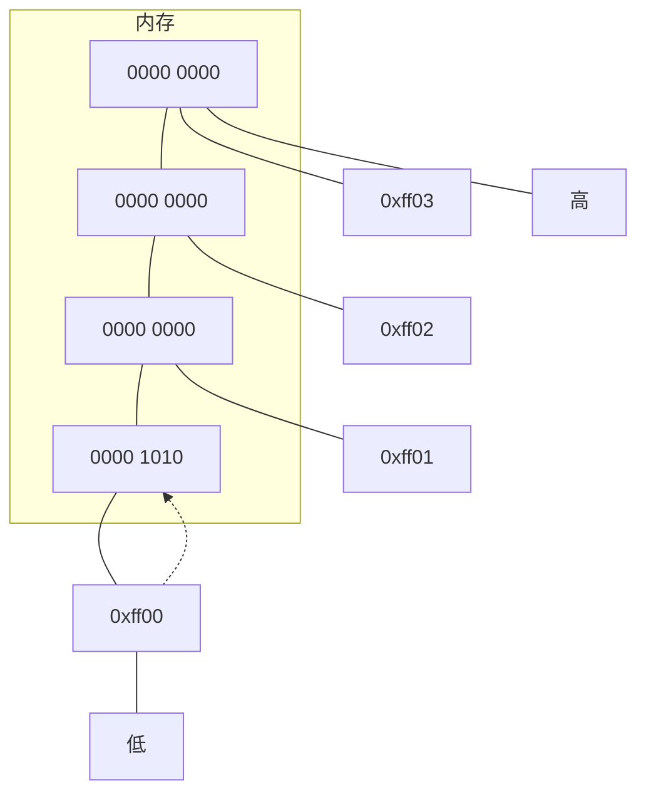

> `int a = 10;` 占用 4 字节（由 int 决定）

#### 指针的定义和使用

```c
int a = 10;
int *p = &a;

// printf("%p = %d\n", *p);  // 间接引用 -- 右值。
// 解引用、间接引用。
*p = 250;   // 间接引用 -- 左值。
printf("a = %d\n", a);
```

- `*p` 作用：
  - 将 p 变量的内容，取出，当成地址看待。找到该地址对应的内存空间。
    - 如果做左值，存储数据到空间中。
    - 如果做右值，取出空间中的内容。

#### 指针类型大小

- 指针，算一种自定义数据类型。`int *`
- 指针的大小，与类型无关！只与当前使用的平台架构有关（32位：4字节、64位：8字节）。

```c
int main(void)
{
    printf("int * 的大小：%u\n", sizeof(int*));
    printf("short * 的大小：%u\n", sizeof(short*));
    printf("char * 的大小：%u\n", sizeof(char*));
    printf("long * 的大小：%u\n", sizeof(long*));
    printf("long long * 的大小：%u\n", sizeof(long long *));
}
```

- 可以在一条语句中，同时定义多个指针变量、普通变量。

```c
int a, b, c;   // 多个普通变量

int *p1, *p2, *p3;   // 多个指针变量。 每个变量都有一个自己的 *

int a, *b, *c, d;   // 定义整型变量a、d，同时定义指针变量 b、c
```

#### 空指针和野指针

##### 野指针

1. 没有使用"有效"的地址，给指针初始化。

    ```c
    int* p;   // 没有给 p 指定一个有效地址。
    *p = 1000;
    ```

2. p 指针变量有值，但是，该值不是一个有效的地址。

    ```c
    int* p = 10;   // 没有给 p 指定一个有效地址。
    *p = 1000;
    ```

【结论】：编程时，杜绝野指针。

##### 空指针

- `NULL == 0 == '\0'`

```c
int* p = NULL;   // #define NULL ((void *)0)   // 定义一个空指针。
*p = 1000;       // *p 所指向的内存空间，是一个"无效访问区域"。
```

#### 泛型指针（万能指针 void *）

- 可以接受任意一种变量的地址，但是，在使用时【必须】借助"强制类型转换"具体化数据类型。
- `void *` 类型的大小。32位：4字节。64位：8字节。

```c
int main(void)
{
    printf("void * 的大小：%u\n", sizeof(void *));

    char ch = 'R';
    void* p;       // 泛型指针（万能指针）

    p = &ch;

    printf("*p = %c", *((char *)p));   // 将p变量类型，(i)void* 强制成 char *

    return EXIT_SUCCESS;
}
```

#### const 关键字

##### 修饰变量

```c
const int a = 20;   // a 为只读变量，不能修改。
//*a = 200;   // 不可以修改
int* p = &a;
*p = 677;
printf("a = %d\n", a);   // 借助指针可以修改 const 普通变量的值。
```

##### 修饰指针

```c
// 方式1
const int *p;   // 向后（右）作用

// 示例：
int a = 10;
int b = 20;
const int *p = &a;
*p = 500;   //【失败】：将 a 的值，改为 500。不能改！
p = &b;   //【成功】：可以修改 p 变量的内容（地址）。

// 方式2
int const *p;   // 向后（右）作用
// 作用方式同上！
```

- 常用：在函数内，限制指针所指向的内存空间，为只读（不允许修改）

#### 指针和数组

##### 数组名

- 数组名，是地址常量。 —— 不可以被修改。赋值（=、+=、-=、*=、/=、%= 带有副作用的运算符）

```c
int a[3] = { 1,2,3 };   // a 就是数组地址。
int b[3];     // b 是常量
b = a;   // 不允许！！因为 b 是地址常量。
```

- 指针，是变量。可以使用数组名，给指针赋值。

```c
int *p = a;   // a 就是数组地址。允许！！
```

##### 取数组元素

```c
int arr[] = {1, 3, 5, 7, 9};
int *p = arr;   // 使用数组地址，给p指针变量初始化

// 结论：
arr[0] == *(arr+0) == p[0] == *(p+0)
arr[1] == *(arr+1) == p[1] == *(p+1)
arr[2] == *(arr+2) == p[2] == *(p+2)
...
arr[N] == *(arr+N) == p[N] == *(p+N)
```

##### 指针和数组名区别

1. 指针是变量，数组名是常量。
2. `sizeof（指针）` ——> 4字节、8字节。
3. `sizeof（数组名）` ——> 数组实际的字节数。

##### 指针的算术运算

###### 数据类型对指针的作用

1. 间接引用（解引用）：
   - 指针的数据类型，确定了从指针存储的地址开始，向后读取的字节数。（与指针本身存储空间无关）

    ```c
    int a = 0x12345678;

    //int* p = &a;
    //int* p;   --- 0x12345678;
    //short* p;   --- 0x5678;
    char* p;   //  --- 0x78;
    p = &a;

    printf("%#x\n", *p);
    ```

2. 加减运算。
   - 指针的数据类型，决定了指针进行 +/- 操作时，向后/前 跳过的字节数。

    ```c
    int *    +1   实际加过 4 字节。
    short *  +1   实际加过 2 字节。
    char *   +1   实际加过 1 字节。
    long long *  +1   实际加过 8 字节。
    ```

###### 指针++操作数组

```c
int main(void)
{
    int arr[] = {1,2,3,4,5,6,7,8,9,0};
    int* p = arr;

    int n = sizeof(arr) / sizeof(arr[0]);

    //for (size_t i = 0; i < n; i++)
    //{
    //  printf("%d ", arr[i]);
    //}

    for (size_t i = 0; i < n; i++)
    {
        printf("%d ", *p);
        p++;    // p = p+1, 一次加过 一个 int 大小（一个数组元素）。
    }
    // p值随着循环，不断变化。 打印结束后，p指向一块无效的内存空间（野指针）
    printf("\n");

    return 0;
}
```

##### 练习

- 练习：使用 指针给空数组连续赋值。 再使用"指针挪移"方法打印这个数组。

```c
int main(void)
{
    int arr[10];
    int n = sizeof(arr) / sizeof(arr[0]);
    int* p = arr;   // p 指向 arr[0]
    printf("*p = %p\n", p);

    // 使用 指针，给空数组连续赋值。
    for (size_t i = 0; i < n; i++)
    {
        //arr[i] = i + 10;
        *(p + i) = 10 + i;    // *(p + i) == arr[i];
    }
    // 循环结束时，p指向谁？？ 依然指向 arr[0];
    printf("循环结束后：p = %p\n", p);

    // 使用"指针挪移"方法打印这个数组。
    for (size_t i = 0; i < n; i++)
    {
        printf("%d ", *p);
        p++;     // p = p+1, 一次加过 一个 int 大小（一个数组元素）。
    }
    printf("\n");
    // 循环结束时，p指向谁？？ 指向数组尾元素的下一个内存（野指针）。
    printf("2 for 循环结束后：p = %p\n", p);

    return 0;
}
```

##### 指针 +- 整数

1. 普通指针变量 + 整数

    ```c
    char *p;   p+1    偏过1个字节。
    short *p;  p+1    偏过2个字节。
    int *p;    p+1    偏过4个字节。
    ```

2. 在数组中，+ 整数

    ```c
    short arr[] = {1, 3, 5, 8, 12, 17, 19};
    short *p = arr+3;

    p + 3;   向后（右）偏过 3 个元素。 6 个字节。
    p - 2;   向前（左）偏过 2 个元素。 4 个字节。
    ```

3. `&数组名 + 1`
   - `&数组名 + 1`，加过的是一个数组的总大小。

    ```c
    int main(void)
    {
        short arr[] = {1,2,3,4,5,6,7,8,9,0};
        printf("arr = %p\n", arr);
        printf("&arr[0] = %p\n", &arr[0]);
        printf("arr+1 = %p\n", arr+1);

        printf("&arr = %p\n", &arr);   // 取"整个数组"的地址。
        printf("&arr+1 = %p\n", &arr + 1);   // +1，跳过一个数组 short [10]
        return 0;
    }
    ```

##### 指针其他运算

- 指针 `*` `/` `%`
  - 不允许！！！
- 指针+ - 指针
  - 指针+ - 指针
    - 不允许 error!
  - 指针-指针：
    - 普通变量来说，语法允许，但，无实际意义。
    - 对于数组来说，得到偏移过的元素个数。

    ```c
    int main(void)
    {
        int a[] = {1,2,3,4,5,6,7,8,9,0};
        int* p = a;   // 保存数组首地址。

        p = &a[3];   // 修改p保存的地址
        printf("p-a = %d\n", p - a);   // ---- 3

        int* q = &a[8];
        printf("q-p = %d\n", q - p);   // ---- 5

        return 0;
    }
    ```

##### 指针实现 strlen()

- 借助 数组 实现

    ```c
    // 数组实现
    int myStrlen1(char str[])
    {
        int i = 0;
        while (str[i] != '\0')
        {
            i++;
        }
        return i;
    }
    ```

- 借助 指针 实现

    ```c
    // 指针实现
    int myStrlen2(char str[])
    {
        char* p = str;
        while (*p != '\0')
        {
            p++;
        }
        return p-str;   // 返回元素个数。
    }
    ```

##### 指针比较运算

1. 普通变量。
   - 语法允许，但无实际意义。
2. 数组。
   - 对于数组来说，地址之间可以比大小。得到元素存储的先后顺序。

    ```c
    int arr[] = {1,2,3,5,6,7,8};
    int* p = &arr[2];

    if (p > arr) {
        printf("成立\n");
    }
    else if (p < arr) {
        printf("不成立");
    }
    else {
        printf("==\n");
    }
    ```

3. 判断 NULL

    ```c
    int* p;
    int a = 10;
    // p = NULL  // 初始化空指针。
    p = &a;

    if (p != NULL)
    {
        printf("p is not NULL\n");
    }
    else
    {
        printf("p is NULL\n");
    }
    ```

#### 指针数组

1. 指针数组的本质，是一个二级指针。

    ```c
    int a = 10;
    int b = 20;
    int c = 30;

    int *arr[] = {&a, &b, &c};   // int型指针数组，保存地址的数组。

    printf("*arr[0] = %d\n", *arr[0]);   // arr[0] == *(arr+0)
    printf("*arr[0] = %d\n", *(arr + 0));
    printf("**arr = %d\n", **arr);      // * 结合性，自右向左。
    ```

2. 二维数组，是指针数组，是二级指针。

    ```c
    int a[] = { 10 };
    int b[] = { 20 };
    int c[] = { 30 };

    int* arr[] = {a, b, c};   // 存地址。

    printf("arr[0][0] = %d\n", arr[0][0]);
    printf("(*(arr+0)) = %d\n", *(*(arr+0)));
    printf("**arr = %d\n", **arr);   // 二级指针的简介应用。
```

## 第八章 高级语法（多级指针、指针和字符串）

### 多级指针

- 多级指针不能跳跃定义。有一级，才能定义二级；有二级才能定义三级；有三级，才能定义4级、。。。

```c
int a = 10;   // 普通变量
int *p = &a;       // 一级指针，是变量的地址。
int **pp = &p;     // 二级指针，是一级指针的地址。【重点】
int ***ppp = &pp;  // 三级指针，是二级指针的地址。
int ****pppp = &ppp;// 四级指针，是三级指针的地址。
......
*pp == pp == &p
**ppp == *pp == p == &a;
***pppp == **ppp == *p == a;
```

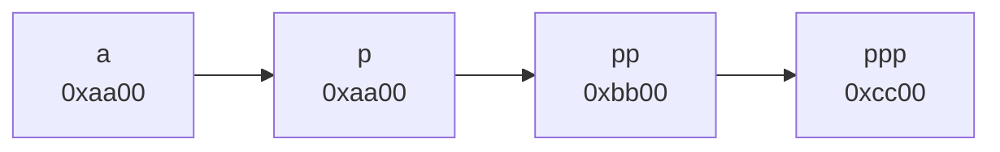

```c
int a = 10;
*ppp == pp == &p
**ppp == *pp == p == &a
***ppp == **pp == *p == a
```

### 指针和函数

#### 栈帧

- 当函数被调用时，系统会在 stack 空间上申请一块内存，用来给函数调用提供空间。存储 形参 和 局部变量。（定义在函数内部的变量）。
- 函数调用结束时，这块内存空间，会被自动释放（消失）。

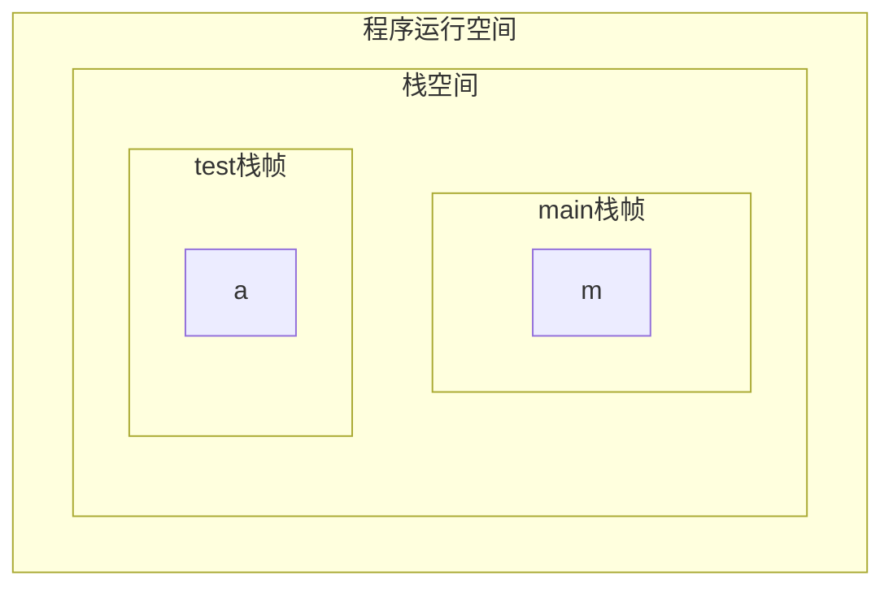

#### 传值和传址

##### 传值（值传递）

- 函数调用期间，实参将自己的数据值，拷贝一份给形参。

```c
// 定义函数，交换两个数。 -- 3杯水法
int swap1(int a, int b)   // a、b 形参
{
    int tmp = 0;   // 局部变量
    tmp = a;
    a = b;
    b = tmp;
}

int main(void)
{
    int m = 10;
    int n = 55;

    // 调用 函数 swap1，交换两个数。
    swap1(m, n);   // m、n 实参。

    system("pause");
    return EXIT_SUCCESS;
}
```

##### 传址（传引用）

- 函数调用期间，实参将自己的"地址值"，拷贝一份 赋值给形参。
  - 可以在 A 栈帧中，借助地址，修改B栈帧上的变量数据。

```c
// 定义函数，交换两个数。 -- 传引用（传址）
int swap2(int *a, int *b)   // a、b 形参。
{
    int tmp = 0;

    tmp = *a;
    *a = *b;
    *b = tmp;
}

int main(void)
{
    int m = 10;
    int n = 55;

    swap2(&m, &n);

    system("pause");
    return EXIT_SUCCESS;
}
```

#### 数组做函数参数

- 数组做函数参数时，传递的不再是整个数组，而是数组的首地址（指针）。

```c
int main(void)
{
    int arr[] = {1, 4, 6, 7, 9, 0};

    printf("main : sizeof(arr) = %u\n", sizeof(arr));   // 整个数组的大小。

    // 调用 test 函数，传参 数组。
    test(arr);   // 实参！

    system("pause");
    return EXIT_SUCCESS;
}

// 定义函数，用数组做参数
void test(int arr[])   // 形参
{
    printf("test : sizeof(arr) = %u\n", sizeof(arr));   // 指针的大小。

    printf("arr[0] = %d\n", arr[0]);
}
```

- 当整型数组做函数参数时，通常在函数定义中，封装2个参数，一个表数组首地址，另一个表元素个数。

```c
// 冒泡排序
//void BubbleSort(int arr[])  这种传参，无法在函数内，求元素个数。
void BubbleSort(int arr[], int n)
{
    for (int i = 0; i < n - 1; i++)
    {
        for (int j = 0; j < n - 1 - i; j++)
        {
            if (arr[j] > arr[j + 1])
            {
                int temp = arr[j];
                arr[j] = arr[j + 1];
                arr[j + 1] = temp;
            }
        }
    }
}

int main(void)
{
    int arr[] = {1, 4, 8, 12, 19, 43, 2, 7, 15};

    // 获取元素个数
    int n = sizeof(arr) / sizeof(arr[0]);

    // 排序
    BubbleSort(arr, n);

    // 打印排序后结果
    for (size_t i = 0; i < n; i++)
    {
        printf("%d ", arr[i]);
    }
    putchar('\n');

    return 0;
}
```

- 数组做函数参数，也可以写成指针的形式。（本质一样）

```c
void Bubblesort(int arr[], int n) == void Bubblesort(int *arr, int n)
```

#### 指针做函数返回值

- 指针做函数返回值，不能返回【局部变量的地址】。
  - 当函数调用结束，栈帧空间释放，局部变量的地址，无效。
- 数组做函数返回值，不允许！（C语言中，只能写成 指针形式）

### 指针和字符串

#### 基本知识

```c
char str1[] = {'h','i','\0'};  【麻烦】   变量，可读可写。
char str2[] = "hi";                 变量，可读可写。
char *str3 = "hi";                  常量，只读。
char *str4 = {'h','i','\0'};   //  错误！
```

演示 demo1：

- char *str2 = "hello" 是一个常量。不允许修改。

```c
int main0401(void)
{
    char str1[] = "hello";   // 相当于 {'h','e','l','l','o','\0'}
    char* str2 = "";

    str1[0] = 'R';   // 相当于 {'h','e','l','l','o','\0'}是变量，可以随意修改。
    printf("%s\n", str1);

    str2[0] = 'R';   // "hello" 是字符串常量。 不能修改！
    printf("%s\n", str2);

    system("pause");
    return EXIT_SUCCESS;
}
```

演示 demo2：

- 同一个字符串常量，可以给多个不同的指针赋值。
- `char* str2 = "hello"` 和 `char* n = "hello"`，地址值都相同。都是字符串"hello"的地址。

```c
int main(void)
{
    char str1[] = "hello";   // 相当于 {'h','e','l','l','o','\0'}
    char m[] = "hello";

    char* str2 = "hello";
    char* n = "hello";

    printf("str1 = %p\n", str1);
    printf("m    = %p\n", m);   // 数组定义的 hello 地址不同。

    printf("str2 = %p\n", str2);
    printf("n    = %p\n", n);   // 指针定义的 hello 是字符串常量。是同一个地址。

    system("pause");
    return EXIT_SUCCESS;
}
```

【结论】：当字符串（含有 `\0` 字符数组），做函数参数时，不需要提供 2 个参数。因为每个字符串都有 `\0`。

#### 练习

##### 字符串比较（strcmp() 函数）

- 比较 str1 和 str2，如果相同返回 0，不同则依次比较ASCII码，str1 > str2 返回 1，否则返回 -1
  - 按对应的位置，比较字符的大小。不比较ASCII 码和。
- 分析：
  - 循环，依次比较两个字符串中 对应位字符。`\0` 结束。都相同 ---> 0
  - 对应位不同，比较字符的 ASCII 码。 str1 > str2 ---> 1；str1 < str2 ---> -1

```c
// 数组的实现方式
int myStrcmp(char *str1, char *str2)
{
    int i = 0;
    while (str1[i] == str2[i])   // *(str1+i) == *(str2+i)
    {
        if (str1[i] == '\0')
        {
            return 0;    // 2个字符串，一样!
        }
        i++;
    }
    // str1 和 str2 有字符不同。
    return str1[i] > str2[i] ? 1 : -1;
}

// 指针的实现方式
int myStrcmp2(char* str1, char* str2)
{
    while (*str1 == *str2)   // *(str1+i) == *(str2+i)
    {
        if (*str1 == '\0')
        {
            return 0;    // 2个字符串，一样!
        }
        str1++;
        str2++;
    }
    // str1 和 str2 有字符不同。
    return *str1 > *str2 ? 1 : -1;
}
```

##### 字符串拷贝（strcpy 函数）

- 将一个字符串中的所有字符，依次拷贝存放到另一空字符数组中。

```c
// 数组版：
void myStrcpy(char* src, char* dst)
{
    int i = 0;
    while (src[i] != '\0')   // while(src[i] != 0)   while(strc[i])
    {
        dst[i] = src[i];
        i++;
    }
    dst[i] = '\0';   //main中的 dst 初始化为0。此步可以省略。
}

// 指针版
void myStrcpy2(char* src, char* dst)
{
    while (*src != '\0')   // while(src[i] != 0)   while(strc[i])
    {
        *dst = *src;
        src++;
        dst++;
    }
    *dst = '\0';   //main中的 dst 初始化为0。此步可以省略。
}
```

##### 在字符串中查找字符出现的位置（strchr 函数）

- `"helloworld" 'e' ---> "elloworld"`
- `'l' ---> "lloworld"`
- `'r' ---> "rld"`

```c
// 指针版
char* myStrchr(char* str, char ch)
{
    while (*str)   //while (*str != '\0')  ==while (*str != 0)
    {
        if (*str == ch)
        {
            return str;
        }
        str++;
    }
    return NULL;   // 在 str 中，没有找到 ch
}

// 数组版
char* myStrchr2(char* str, char ch)
{
    int i = 0;
    while (str[i])   //while (str[i] != '\0') == while (str[i] != 0)
    {
        if (str[i] == ch)    // str[i] == *(str+i)
        {
            return &str[i];
        }
        i++;
    }
    return NULL;   // 在 str 中，没有找到 ch
}
```

##### 字符串去空格

- `"ni chou sha ? chou ni za di ! " ---> "nichousha?chounizadi!"`

```c
// 封装函数，去除字符串中空格  --- 数组版
void str_no_space(char* src, char* dst)
{
    int i = 0;     // 遍历 src 字符串
    int j = 0;     // 记录 dst存储位置。
    while (src[i])
    {
        if (src[i] != ' ')    // 只有不为空格，才存到 dst中。
        {
            dst[j] = src[i];
            j++;        // 不为空格，后移。为空格，j不动。
        }
        i++;
    }
    dst[j] = '\0';
}

// 封装函数，去除字符串中空格  --- 指针版
void str_no_space2(char* src, char* dst)
{
    while (*src)
    {
        if (*src != ' ')    // 只有不为空格，才存储到 dst中。
        {
            *dst = *src;
            dst++;     // 不为空格，指针后移。为空格，指针不动
        }
        src++;
    }
    *dst = '\0';
}

int main(void)
{
    char str[] = "ni chou sha ? chou ni za di ! zai chou yi ge shi shi";
    char dst[1024] = {0};

    // 调用函数，去除 str中的空格，保存到 dst 中
    // str_no_space(str, dst);
    str_no_space2(str, dst);

    printf("dst = %s\n", dst);

    system("pause");
    return EXIT_SUCCESS;
}
```

#### 带参数的 main 函数

- 无参版：

    ```c
    int main(void) { return 0; }
    ```

- 有参版：

    ```c
    int main(int argc, char *argv[]) { return 0; }
        参数1：表示给 main 函数传递的参数的 总个数。
        参数2：是一个数组，数组的每一个元素都是 字符串 （char *）
    ```

测试代码：

```c
int main(int argc, char *argv[])
{
    int i = 0;

    for (i = 0; i < argc; i++)
    {
        printf("argv[%d] = %s\n", i, argv[i]);
    }

    system("pause");
    return EXIT_SUCCESS;
}
```

#### 测试方法

1. 在终端中，使用 gcc 编译得到可执行文件，如 test.exe
2. 不能获取带有空格的字符串！！！空格是分隔符。

```text
gcc 09-带参数的main.c -o test.exe

test.exe aa bb cc dd ee
test.exe hello world haha xixi hoho heihei .....
argc: --- 6
argv[0] = test.exe
argv[1] = aa
argv[2] = bb
argv[3] = cc
argv[4] = dd
argv[5] = ee
```

2. 在 VS 中，项目名称上 右键 —— 属性 —— 配置属性 —— 调试 —— 命令行参数 —— 写入 待测试的命令行参数。

#### 字符串练习

##### str 中 substr 出现的次数

```text
str : "hellolllolllolllo "
substr: "llo"
```

写函数测试，llo 在 "hellolllolllolllo" 出现了多少次。

学习、使用 strstr() 函数。再实现上述的题目。

##### 求字符串非空格元素个数

```text
"ni chou sha ? chou ni za di ! zai chou yi ge shi shi" 统计这里，除空格外 字符 的个数。
```

##### 字符串逆置

```text
"hello" ---> "olleh"
"word" ---> "drow"
```

##### 判断字符串是回文

```text
abcba --- 是回文
amkilolikma --- 是回文。
abccba --- 是回文。
abcdba --- 不是回文。
```

## 第九章 高级语法（字符串和内存管理）

### 字符串练习

#### str 中 substr 出现的次数

```text
str = "hellollloabclllollo "
substr: "llo" strlen("llo")
```

写函数测试，llo 在 "hellolllolllolllo" 出现了多少次。

- strstr() 函数

```c
#include <string.h>
char *strstr(const char *haystack, const char *needle);
char *strstr(const char *str, const char *substr);
    参数1：原串
    参数2：子串
    返回值：
        成功：返回子串在原串中的位置（地址值）
        失败：NULL
```

- 测试 strstr()

```c
// 测试 strstr
int main(void)
{
    char* ret = strstr("hellollloabclllollo", "llo");
    printf("str = %s\n", ret);

    system("pause");
    return EXIT_SUCCESS;
}
```

```text
count = 0;
strstr("hellolllollo", "llo")  ---> "llolllollo"   --->count++
"llolllollo" += strlen("llo");  ---> "llollo"
strstr("llollo", "llo")  ---> "llollo"   ---> count++
"llollo" += strlen("llo");  ---> "llo"
strstr("llo", "llo")  ---> "llo"   --->count++
"llo" += strlen("llo");  ---> ""
strstr("", "llo")  ---> NULL
```

```c
// 封装函数，统计 str字符串中，substr出现的次数
int substr_times(char* str, char* substr)
{
    int count = 0;  // 定义变量统计substr出现的次数。
    char *p = strstr(str, substr);   // ---> "llollloabclloxyzllollo";

    // 循环的截取 str 串，判断剩余 str串中是否包含 substr
    while (p != NULL)     // while (p)
    {
        count++;
        p += strlen(substr);     // "llollloabclloxyzllollo";

        p = strstr(p, substr);
    }
    return count;
}

// 在 str字符串中，找子串 substr出现的次数
int main(void)
{
    char str[] = "hell9qaqllloabclloxyzlmllollo";
    char substr[] = "llo";

    int ret = substr_times(str, substr);
    printf("%s 串中，%s 子串 出现 %d 次\n", str, substr, ret);

    system("pause");
    return EXIT_SUCCESS;
}
```

#### 求字符串非空格元素个数

```text
"ni chou sha ? chou ni za di ! zai chou yi ge shi shi" 统计这里，除空格外 字符 的个数。
```

```c
// 统计非空格数
int no_space_num(char* str)
{
    int count = 0;
    // 指针方式实现。
    char* p = str;
    while (*p)
    {
        if (*p != ' ')
        {
            count++;
        }
        p++;
    }
    return count;
}

int main(void)
{
    char str[] = "hello ni hao ma world?";

    int ret = no_space_num(str);

    printf("ret = %d\n", ret);

    system("pause");
    return EXIT_SUCCESS;
}
```

#### 字符串逆置

```text
"hello" ---> "olleh"
"word" ---> "drow"
```

- 参考"数组逆置"实现，day05

```c
// h e l l o
// 字符串的逆序
void str_inverse(char* str)
{
    char* start = str;       // 记录首个元素的地址
    char* end = str + strlen(str)-1;    // 记录最后一个元素的地址

    // 循环交换字符串首尾元素
    while (start < end)
    {
        char tmp = *start;      // 三杯水交换字符元素。
        *start = *end;
        *end = tmp;

        start++;   // 首元素指针后移
        end--;     // 尾元素指针前移
    }
}

int main(void)
{
    char str[] = "this is a test";

    str_inverse(str);

    printf("%s\n", str);

    system("pause");
    return EXIT_SUCCESS;
}
```

#### 判断字符串是回文

```c
// 判断字符串是否是回文
int str_is_abcba(char* str)
{
    char* start = str;
    char* end = str + strlen(str) - 1;

    while (start < end)
    {
        if (*start != *end)
        {
            return 0;     // 不是回文
        }
        start++;
        end--;
    }
    return 1;
}

int main(void)
{
    char str[] = "abcmmcba";

    int ret = str_is_abcba(str);
    if (ret == 1)     // 是回文
    {
        printf("%s 是回文！\n", str);
    }
    else if (ret == 0)
    {
        printf("%s 不是回文！\n", str);
    }

    system("pause");
    return EXIT_SUCCESS;
}
```

### 字符串处理函数

- 全部都是标准C库函数。使用头文件 `#include <string.h>`

#### 字符串拷贝

##### strcpy

```c
char *strcpy(char *dest, const char *src);    // src:source  dest:dst
```

- 将 src 的内容，拷贝给 dest。返回 dest，**dest空间要足够大**。
  - strcpy 函数，不去检查 dest 是否足够大。 ——【不安全函数】
- 函数调用结束，返回值和 dest 结果一致。

```c
// 字符串拷贝
int main(void)
{
    char str[] = "you will be die if you copy me!";

    char dst[100] = { 0 };

    char *p = strcpy(dst, str);

    printf("dest = %s\n", dst);
    printf("*p = %s\n", p);

    system("pause");
    return EXIT_SUCCESS;
}
```

##### strncpy

```c
char *strncpy(char *dest, const char *src, size_t n);    // 安全
```

- 将 src 的内容，拷贝给 dest。只拷贝 n 个字节。**dest空间要足够大**。通常 n 与 dest 的空间大小一致。

特性：

- `n > src`：只拷贝 src 大小。
- `n < src`：只拷贝 n 个字节。不会自动添加 `\0`

```c
// 测试
int main(void)
{
    char str[] = "hello world";

    char dst[100] = { 0 };

    char* p = strncpy(dst, str, sizeof(dst));

    //for (size_t i = 0; i < 10; i++)
    //{
    //  printf("%c\n", p[i]);
    //}

    printf("%s\n", p);

    system("pause");
    return EXIT_SUCCESS;
}
```

#### 字符串拼接

##### strcat

```c
char *strcat(char *dest, const char *src);
```

- 将 src 中内容，拼接到 dest 后。返回拼接成功的字符串。——需要保证 dest 空间足够大。
- 函数调用结束后，dest 和 返回值结果相同。

```c
int main(void)
{
    char str[] = "hello world";

    char dst[100] = "haha hoho xixi";

    char *p = strcat(dst, str);

    printf("p = %s\n", p);
    printf("dst = %s\n", dst);

    system("pause");
    return EXIT_SUCCESS;
}
```

##### strncat

```c
char *strncat(char *dest, const char *src, size_t n);
```

- 将 src 中前 n 个字符，拼接到 dest 后。返回拼接成功的字符串。——需要保证 dest 空间足够大。
- 函数调用结束后，dest 和 返回值结果相同。

```c
// 字符串拼接 strncat
int main(void)
{
    char str[] = "hello world";

    char dst[100] = "haha hoho xixi";

    char* p = strncat(dst, str, 7);

    printf("p = %s\n", p);
    printf("dst = %s\n", dst);

    system("pause");
    return EXIT_SUCCESS;
}
```

#### 字符串比较

- 字符串比较可以使用 `>` `<` `>=` `<=` `==` `!=`，字符串 不允许使用。

##### strcmp

```c
int strcmp(const char *s1, const char *s2);
```

- 比较 s1 和 s2 两个字符串，如果相等 返回 0；
- 如果不相等，进一步比 s1 和 s2 对应位上的 ASCII 码值。
  - s1 > s2 返回 1
  - s1 < s2 返回 -1

```c
int main(void)
{
    char s1[] = "helloz";

    char s2[] = "helloworld";

    printf("ret = %d\n", strcmp(s1, s2));    // 不比较 ASCII 的 和

    system("pause");
    return EXIT_SUCCESS;
}
```

##### strncmp

```c
int strncmp(const char *s1, const char *s2, size_t n);
```

- 比较 s1 和 s2 两个字符串的前 n 个字符，如果相等 返回 0；
- 如果不相等，进一步比 s1 和 s2 对应位上的 ASCII 码值。（不比较 ASCII 的和）

```c
char s1[] = "helloz";
char s2[] = "helloworld";
printf("ret = %d\n", strncmp(s1, s2, 5));   --- 0
```

#### 字符串格式化输入、输出

- s —— string.

##### sprintf

```c
int sprintf(char *str, const char *format, ...);
// ... 代表 这是一个参数可变的函数。
```

- 对应 printf 记忆。作用将 原来输出到屏幕的"格式化字符串"，写到 参数1的 str 中。

```c
// printf("%d + %d = %d\n", 10, 24, 10+24);

char str[1024] = {0};     // 保证空间足够大
sprintf(str, "%d + %d = %d\n", 10, 24, 10 + 24);    // 写到 str 中。不打印屏幕

puts(str);
printf("---%s", str);
```

##### sscanf

```c
int sscanf(const char *str, const char *format, ...);
```

- 对应 scanf 记忆。作用将 原来从键盘获取到的"格式化字符串"，从 参数1的 str 中获取。

```c
int a, b, c;

// scanf("%d+%d=%d", &a, &b, &c);    // 从键盘 stdin 读取。

char str[] = "10+20=30";       // 提供给 sscanf 参数1 使用。

int ret = sscanf(str, "%d+%d=%d", &a, &b, &c);

printf("a = %d\n", a);
printf("b = %d\n", b);
printf("c = %d\n", c);
```

#### 字符串查找字符、子串

##### strchr

```c
char *strchr(const char *s, int c);
```

- 在字符串 s 中，找字符 c 出现的位置。返回 字符在字符串中的地址。

```c
// 字符串中找字符出现位置 strchr
int main(void)
{
    printf("%s\n", strchr("hellohehexixihoho", 'i'));

    system("pause");
    return EXIT_SUCCESS;
}
```

##### strrchr

- r: right

```c
char *strrchr(const char *s, int c);
```

- 自右向左，在字符串 s 中，找字符 c 出现的位置。返回 字符在字符串中的地址。

```c
int main(void)
{
    //printf("%s\n", strchr("hellohehexixihoho", 'i'));
    printf("%s\n", strrchr("hellohehexixihoho", 'x'));

    system("pause");
    return EXIT_SUCCESS;
}
```

##### strstr

```c
char *strstr(const char *str, const char *substr);
```

- 在字符串 str 中，找寻子串 substr 第一次出现的位置。返回地址。

#### 字符串分割

##### strtok

```c
char *strtok(char *str, const char *delim);
    参数1：待拆分字符串
    参数2：分割符组成的字符串。 strtok("www.baidu.com", ".");  // 写成 '.' 错误！
```

- 按照（参2）既定的分割符，来拆分字符串。`www.baidu.com` 按 `"."` 拆分。

```c
// 测试1：
int main(void)
{
    char str[] = "www.itcast.cn";   // ---> "www\0itcast.cn";
    char *p = strtok(str, ".");     // strtok调用完成，会将 分割符用 \0 替换。

    printf("p = %s\n", p);

    // 调用一次 strtok 分割之后，再去打印原串 str
    for (size_t i = 0; i < 13; i++)
    {
        //printf("%c\n", str[i]);
        printf("%d\n", str[i]);   // 打印每个字符的 ASCII码
    }

    system("pause");
    return EXIT_SUCCESS;
}
```

- 结论：
  - strtok() 函数，直接在原串上对字符串分割。不能分割字符串常量。`char *str = "hello";`
  - strtok() 函数调用结束，会将分割符，替换成 `\0`
  - 第一次用 strtok 拆分，参数1 传待拆分的原串中。第1+次拆分，参数1 传 NULL。

```c
// 字符串分割 strtok
int main(void)
{
    char str[] = "www.itcast.cn.net.com";   // ---> "www\0itcast.cn";
    //char *str = "www.itcast.cn.net";    // 字符串常量。

    char *p = strtok(str, ".");     // strtok调用完成，会将 分割符用 \0 替换。

    printf("p = %s\n", p);

    // 循环按 "." 拆分 剩余 字符串。
    while (1)
    {
        p = strtok(NULL, ".");
        if (p == NULL)
        {
            break;
        }
        printf("p = %s\n", p);
    }
}
```

- 练习：
  - 拆分字符串 `"www.itcast.cn$This is a test$for strtok"`，按 分割符 `"$"`.

```c
//拆分 字符串 "www.itcast.cn$This is a test$for strtok"，按 分割符 "$" ...
int main(void)
{
    char str[] = "www.itcast.cn$This is a test$for strtok";

    // 调用第一次
    char* p = strtok(str, ".$");   // 分割符有3个：'.' / '$' / ' ' 空格
    printf("p = %s\n", p);

    // 后续 N+1次调用。while循环，参数NULL
    while (1)
    {
        p = strtok(NULL, ".$");
        if (p == NULL)
        {
            break;
        }
        printf("循环中 p = %s\n", p);
    }

    system("pause");
    return EXIT_SUCCESS;
}
```

#### 字符串转换

- a: 代表字符串 string.
- 将字符串转换成数、小数、长整数、 长长整型。
- 使用这类函数进行转换时，要求 原串必须是可转换的字符串。
  - 错误使用："abc123"、"yxac123"、"1245dke89" 不能正确转换。

##### atoi

```c
#include <stdlib.h>
int atoi(const char *nptr);

double atof(const char *nptr);
long atol(const char *nptr);
long long atoll(const char *nptr);
```

示例：

```c
char str1[] = "12abc3456";
int num = atoi(str1);
printf("num = %d\n", num);

char str2[] = "3.14";
double num2 = atof(str2);
printf("num2 = %lf\n", num2);

char str3[] = "34568490354";
long long num3 = atoll(str3);
printf("num3 = %lld\n", num3);
```

### 内存管理

#### 局部变量

- 概念：
  - 定义在函数内部的变量。
- 作用域：
  - 从定义位置开始，到包裹该变量的第一个右大括号结束。（函数作用域、块作用域。）

```c
void test(void)
{
    {
        int m = 10;   // 局部变量。 -- 块作用域。出了 } 不能使用。
    }
    printf("---m = %d\n", m);

    //int i = 0;
    for (size_t i = 0; i < 10; i++)
    {
        printf("m = %d\n", m);
    }
    //printf("i = %d\n", i);
}
```

#### 全局变量

- 概念：
  - 定义在函数外部的变量。
- 作用域：
  - 从定义位置开始，默认到本文件内部。其他文件如果想使用，可以通过"声明"的方式，将作用域导出。

#### static 变量

##### static 全局变量

- 定义语法：
  - 在全局变量定义之前，添加 static 关键字。如：`static int a = 10;`
- 作用域：
  - 被限制在本文件内部，不允许通过"声明"方式导出作用域。（java不同）

##### static 局部变量

- 定义语法：
  - 在局部变量定义之前，添加 static 关键字。
- 作用域：
  - 从定义位置开始，到包裹该变量的第一个右大括号结束。
- 特性：
  - 静态局部变量，只定义一次。相当于，在全局位置定义。通常用来做计数器。

```c
void test08(void)
{
    static int b = 10;   // 静态局部变量
    printf("%d\n", b++);
}

int main(void)
{
    for (size_t i = 0; i < 10; i++)
    {
        test08();   // 调用 test08 10 次。
    }

    system("pause");
    return EXIT_SUCCESS;
}
```

#### static 函数

- 全局函数：
  - 就是"函数"。
  - 定义语法：函数原型 + 函数体。
- static 函数：
  - 定义语法：`static 函数原型 + 函数体。`
  - 特性：
    - static 函数，只能在本文件内使用。其他文件即使声明也无法使用。

```c
// A.c 文件中有如下代码
// static 关键字修饰 test09 函数限制在本文件内。 外部文件，不能访问
static void test09(void)
{
    for (size_t i = 0; i < 5; i++)
    {
        printf("i = %d\n", i);
    }
}

//-------------------

//B.C 文件中调用上述函数。由于 static， B.C 不能使用 test09函数，会报错！
#define _CRT_SECURE_NO_WARNINGS
#include <stdio.h>
#include <string.h>
#include <stdlib.h>
#include <math.h>
#include <time.h>

// void test09(void);   // 声明函数
extern void test09(void);   // 声明函数

int main(void)
{
    test09();

    system("pause");
    return EXIT_SUCCESS;
}
```

### 生命周期

- 助记：
  - 生命周期：出生 --- 死亡 80岁。生命周期：80年。
  - 作用域：班花：全班。村长：全村。县长：全县。
1. 局部变量：定义位置开始，函数调用结束（存储在栈stack上）。 —— 函数被调用期间。
2. 全局变量：从程序启动开始（早于 main() 函数），程序终止结束。 —— 程序执行期间。
3. static 局部变量：从程序启动开始，程序终止结束（定义在全局位置）。 —— 程序执行期间。
4. static 全局变量：从程序启动开始，程序终止结束。 —— 程序执行期间。
5. 全局函数：从程序启动开始，程序终止结束。 —— 程序执行期间。
6. static 函数：从程序启动开始，程序终止结束。 —— 程序执行期间。

### 命名冲突

- 如果全局变量和局部变量命名冲突。采用就近原则。
- <span style="color:red">**强烈不推荐！**</span>

### 内存4区模型

1. 代码段：`.text` 段。存储程序源码（二进制形式）
2. 数据段：只读数据段 `.rodata`、初始化数据段 `.data`、未初始化数据段 `.bss`。
3. stack：栈。在其之上开辟帧栈。（较小：windows：1M~10M，Linux：8M~16M）
   - 存储特性：后进先出 FILO (LIFO)
4. heap：堆。给用户自定义提供空间。（较大：约1.3G+）

### Heap 堆空间

#### 开劈/释放 heap 空间

- 在 heap 上开劈空间

```c
#include <stdlib.h>

void *malloc(size_t size);    // 向 系统申请内存空间，在 heap 上。单位：字节。
    参数：申请空间的大小。
    返回值：
        成功：heap 内存空间的首地址。
        失败：NULL
// 申请成功的内存，通常拿来当成"数组" 使用
```

- 释放 heap 申请的空间

```c
void free(void *ptr);
    参：就是 malloc 函数的返回值。
```

- 示例：

```c
int main(void)
{
    // int arr[10];
    // 申请能存储 10 个 int 数的空间。 40字节。
    int *p = (int *)malloc(sizeof(int)*10);    // 强转的目的，方便阅读代码。
    if (p == NULL)
    {
        printf("malloc error\n");
        return -1;   // 退出程序。 -1, 非正常结束。
    }

    // 写 - 数据到 malloc 申请的空间
    for (size_t i = 0; i < 10; i++)
    {
        p[i] = i + 10;   // 存 数据到 malloc 申请的空间中。
    }

    // 从malloc申请的空间中，读数据。
    for (size_t i = 0; i < 10; i++)
    {
        printf("%d ", *(p+i));
    }
    printf("\n");

    // 释放malloc申请的空间。
    free(p);

    system("pause");
    return EXIT_SUCCESS;
}
```

#### 使用 heap 空间注意事项

1. 申请的 heap 堆内存空间连续，当成"数组"使用。
2. free 后的空间，不会立即失效。通常将 free后的地址，置为 NULL。
3. free 地址必须是 malloc 函数返回的地址。否则，报错！
4. 如果 malloc 后的地址一定会变化，通常使用临时变量 tmp 保存。

#### 二级指针对应的 heap 空间

#### 内存操作函数

##### memset

```c
#include <string.h>
void *memset(void *s, int c, size_t n);
```

##### memcpy

```c
void *memcpy(void *dest, const void *src, size_t n);
```

##### memmove

```c
void *memmove(void *dest, const void *src, size_t n);
```

##### memcmp

```c
int memcmp(const void *s1, const void *s2, size_t n);
```

#### 内存常见问题

1. 申请 0 字节空间
   - C 语言中，允许申请 0 字节的内存空间。
   - 0 字节的空间，不能拿来使用。
2. free 空指针
   - 空 NULL 指针，反复 free，不会报错。
   - 非空的指针，反复 free，<span style="color:red">**会报错！！！**</span> —— 推荐 free 后的指针，一定置 NULL。
3. 越界访问
   - 不允许！！！导致程序崩溃。
4. free ++ 后的地址
   - 不能正常释放。
   - 如果程序中，必须要将 p++，定义临时变量，保存 p 值。以便 free 释放。

## 第十章 高级语法（内存管理、结构体、联合体）

### heap 空间操作

#### 二级指针对应的 heap 空间

- `int **p = int *p[3] ==> (int *, int *, int *) ==> [(1, 2, 3, 54, 5), int *, int *]`

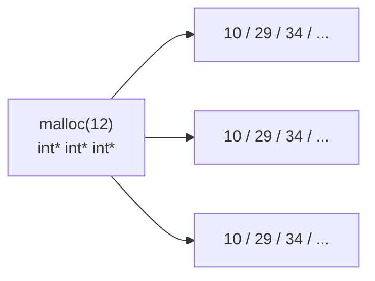

```c
int main(void)
{
    // 给外层空间malloc申请内存
    int** p = malloc(sizeof(int *) * 3);
    if (p == NULL)
    {
        printf("malloc error!\n");
        return -1;
    }
    // 给 内层指针 申请 malloc 空间
    for (size_t i = 0; i < 3; i++)
    {
        p[i] = malloc(sizeof(int) * 5);
        if (p[i] == NULL)
        {
            printf("malloc p[i] error!\n");
            return -1;
        }
    }
    // 使用空间 -- 写
    for (size_t i = 0; i < 3; i++)
    {
        for (size_t j = 0; j < 5; j++)
        {
            p[i][j] = i + j;    // 随意初始化值。
        }
    }
    // 使用空间 -- 读
    for (size_t i = 0; i < 3; i++)
    {
        for (size_t j = 0; j < 5; j++)
        {
            printf("%d ", *(*(p + i) + j));    // p[i][j] == *(p+i)[j] == *(*(p+i)+j)
        }
        printf("\n");
    }

    // free空间时，应该先释放 内层空间，再释放外层
    for (size_t i = 0; i < 3; i++)
    {
        free(p[i]);
        p[i] = NULL;
    }

    // 释放外层空间
    free(p);
    p = NULL;

    system("pause");
    return EXIT_SUCCESS;
}
```

#### 以 char **p 为例

```c
// 先申请外层指针。
char **p = malloc(sizeof(char *) * 5);
// 申请内层指针
for (int i = 0; i<5; i++)
{
    p[i] = malloc(sizeof(char) * 10);    // 字符串长度 <= 10个字符。
}
// 写
for (int i = 0; i<5; i++)
{
    // p[i] = "hello";  错误!
    strcpy(p[i],"hello");
}
// 释放外层
for (int i = 0; i<5; i++)
{
    free(p[i]);
    p[i] = NULL;
}
// 释放外层
free(p);
p = NULL;
```

### 内存操作函数

- 以 4 个函数，专门用来操作 heap 内层。stack 由系统自动申请，自动释放。

#### memset

```c
#include <string.h>
void *memset(void *s, int c, size_t n);
    参1：内存首地址。
    参2：置成什么。一般传 0
    参3：内存大小。单位：字节。
    返回值：
        成功：设置后的地址。
        失败：NULL

memset(首地址, 0, 空间大小);
```

- 绝大多数，memset 用来将申请好的 heap 内存，置 0。 —— 单位：字节。

```c
int* p = (int *)malloc(sizeof(int) * 10);
if (p == NULL)
{
    printf("malloc error");
    return -1;
}
// 将申请好的内存，全部置 0
memset(p, 0, sizeof(int) * 10);

// 直接打印申请好的空间内容。
for (size_t i = 0; i < 10; i++)
{
    printf("%d ", p[i]);
}

free(p);
p = NULL;
```

- memset 函数按"字节"设置。
  - 置 0 ——> 每一个字节都为 0。
  - <span style="color:orange">**置 1 ——> 每一个字节都为 1。**</span> —— 4字节 == 0x01010101 == 16843009

#### memcpy

- 以字节为单元，内存拷贝。`strcpy` ——> 只能拷贝字符串。

```c
void *memcpy(void *dest, const void *src, size_t n);
```

```c
// 拷贝内存中的整型数据
int arr[10] = { 1, 2, 3, 4, 5 };
int arr2[10];

memcpy(arr2, arr, sizeof(int)*10);

for (size_t i = 0; i < 10; i++)
{
    printf("%d ", arr2[i]);
}
printf("\n");

// 拷贝内存中的字符串
char str[] = "hello world";
char p[100];
//memcpy(p, str, strlen(str)+1);   // 按内存拷贝
strcpy(p, str);    // 字符串拷贝
strncpy(p, str, strlen(str) + 1);

printf("p = %s\n", p);
```

#### memmove

- 作用完全等同于 memcpy，以字节为单元，内存拷贝。---- <span style="color:green">**安全的！**</span>
- 拷贝的 src 和 dest 之间如果有重叠，memcpy由于底层实现原因，有可能出错。推荐使用 memmove。

```c
void *memmove(void *dest, const void *src, size_t n);
```

#### memcmp

- 以字节为单位，比较内存！
- 作用可以完全参照，strncmp。
- 规则：s1 == s2 --> 0, s1 > s2 --> 1, s2 < s2 --> -1

```c
int memcmp(const void *s1, const void *s2, size_t n);
```

```c
int arr1[] = { 14, 56, 22, 59, 21, 49, 25, 86, 89, 66, 71, 31, 98 };
int arr2[] = { 14, 56, 29, 59, 21};

int ret = memcmp(arr1, arr2, 5 * sizeof(int));

printf("ret = %d\n", ret);
```

### 函数内申请空间使用

#### A 函数内申请空间，A 函数使用

- 注意上述 4 点。

```c
int *p = malloc(10);
free(p); p = NULL;
```

#### A 函数内申请空间，B 函数使用

- 例1

```c
// A函数中申请空间，B函数使用。
int* func1(void)
{
    int* p = malloc(4);
    *p = 456;
    return p;    // 返回的 heap 堆空间的地址值，函数调用结束，地址 有效。
    //return &p;    // 返回的 stack 栈空间的地址值，函数调用结束，地址 无效。
}

int main(void)
{
    int* ret = NULL;
    ret = func1();

    printf("%d\n", *ret);
    free(ret);
    ret = NULL;

    system("pause");
    return EXIT_SUCCESS;
}
```

- 例2

```c
// A函数中申请空间，B函数使用。
int* func2(int *p)
{
    p = malloc(4);
    return p;
}

int main(void)
{
    int* ret = NULL;
    ret = func2(ret);

    *ret = 345;    // 写
    printf("%d\n", *ret);    // 读

    free(ret);
    ret = NULL;

    system("pause");
    return EXIT_SUCCESS;
}
```

- 例3

```c
void func3(int** p)    // int** 是一级指针的地址。
{
    *p = malloc(4);
}

int main(void)
{
    int* ret = NULL;

    func3(&ret);    // 传 一级指针的地址。
    // func3 函数，调用完成，ret指针，不在为 NULL，而是指向一块有效的 heap 空间地址。
    *ret = 789;
    printf("%d\n", *ret);

    free(ret);
    ret = NULL;

    system("pause");
    return EXIT_SUCCESS;
}
```

### 结构体

#### 结构体定义语法

- 复合类型：用户自定义类型：`int []`、`int *`、`char **`、`struct student`

```c
// 定义结构体类型
struct student {
    int age;       // 成员变量 -- 属性。不能被赋初值。
    int num;
    char name[10];
};
// 用结构体类型，定义变量。
struct student a;    // 定义了一个结构体类型的变量 a。
```

- 以上定义了一个结构体类型。名字叫 `struct student`。
  - `struct student` 的地位，等同于 `int`、`char`、`short`、`char *`、`int[]`、`long long`

- 通常 结构体类型定义在 全局位置。或者，放到 `xxx.h` 头文件。
- 头文件：

```c
// 头文件守卫
#ifndef _XXX_H_
#define _XXX_H_
/* #include、宏定义、函数声明、类型定义（结构体类型）。
#endif
```

#### 普通结构体变量

##### 定义语法

```c
struct student stu1, stu2, stu3;    // 一次定义3个变量。没赋初值。
struct student stu = {18, 1, "Andy"};
```

##### 访问成员方法

- 使用 `.` 访问成员。

```c
// 定义一个结构体变量，赋初值。
struct student stu = {18, 1, "Andy"};

printf("first: age = %d, name = %s, num = %d\n",
    stu.age, stu.name, stu.num);

stu.age = 118;
stu.num = 119;
//stu.name = "cuihua";    // name为地址常量，不能被赋值。
strcpy(stu.name, "cuihua");

printf("last: age = %d, name = %s, num = %d\n",
    stu.age, stu.name, stu.num);
```

- 普通变量使用 "->" 访问成员 ---- <span style="color:orange">**不常用！**</span>

```c
(&stu)->age = 118;
(&stu)->num = 119;
```

#### 结构体指针变量

##### 定义语法

```c
struct student *p1, *p2, *p3;    // 一次定义3个指针变量。野指针！！！
```

##### 访问成员方法

- 使用 "->" 访问成员。
- 避免野指针、空指针：

```c
// 1. struct student stu, *p1; //一次定义两个结构体变量，一个普通变量stu。另一指针变量p1
p1 = &stu;    // 给指针初始化。

// 2. struct student *p1;
p1 = (struct student *)malloc(sizeof(struct student));
```

- 指针使用 "." 访问成员。 ---- <span style="color:orange">**不常用！**</span>

```c
(*p1).age = 18;
strcpy((*p1).name, "cuihua");
(*p1).num = 119;
```

#### 非常规定义语法（了解）

```c
struct student {
    int age;
    int num;
    char name[10];
} s1, *s2;    // 定义结构体类型的同时，定义1个结构体变量 s1, 一个指针变量s2

struct {    // 匿名结构体
    int age;
    int num;
    char name[10];
} s3, *s4;    // 定义匿名结构体类型的同时，定义1个结构体变量 s3, 一个指针变量s4。

// 无法再定义其他变量。
```

#### 结构体数组

```c
struct student {
    int age;
    int num;
    char name[10];
};
struct student stu[5] = {{18, 1, "Andy"}, {19, 2, "Lucy"}, {118, 3, "李四"}};
int n = sizeof(stu) / sizeof(stu[0]);
for (int i = 0; i<n; i++)
{
    printf("age=%d,num=%d,name=%s\n", stu[i].age, stu[i].num, stu[i].name);
}
```

- `struct student *stu;` // 要求 指针指向能存储3个student 元素的空间，并给3个元素赋初值。访问。

```c
struct student *stu;    // 野指针.

// 得到到heap堆空间，当成数组使用。
stu = malloc(sizeof(struct student)*3);    // 等价于 struct student stu[3];

// 给数组的第1个元素赋值。
stu[0].age = 11;
stu[0].num = 111;
strcpy(stu[0].name, "aaa");

// 给数组的第2个元素赋值。
stu[1].age = 22;
stu[1].num = 222;
strcpy(stu[1].name, "bbb");

// 给数组的第3个元素赋值。
stu[2].age = 33;
stu[2].num = 333;
strcpy(stu[2].name, "ccc");

//int n = sizeof(stu) / sizeof(stu[0]);    // 不能求元素个数。

for (int i = 0; i < 3; i++)
{
    printf("age=%d,num=%d,name=%s\n", stu[i].age, stu[i].num, stu[i].name);
}

free(stu);
stu = NULL;
```

#### 结构体嵌套

```c
struct person {
    int age;
    char name[10]);
    // 类型
};
struct student {
    struct person man;    // person 类型的变量，作为 student 类型成员。
    int id;
    char addr[100];
};

int main(void)
{
    struct student stu = {{18, "zhaolu"}, 1, "北京朝阳区"};

    printf("age = %d\n", stu.man.age);
    printf("name = %s\n", stu.man.name);
    printf("addr = %s\n", stu.addr);

    // 修改
    stu.man.age = 119;
    strcpy(stu.man.name, "张三丰");
    strcpy(stu.addr, "武当山");

    printf("\nage = %d\n", stu.man.age);
    printf("name = %s\n", stu.man.name);
    printf("addr = %s\n", stu.addr);

    system("pause");
    return EXIT_SUCCESS;
}
```

### 做函数参数、返回值

#### 结构体变量赋值

- 主要应用于，函数调用期间，实参给形参赋值。
- 要求：
  - 结构体变量赋值时，必须<span style="color:red">**类型相同、成员个数一致、顺序一致**</span>。

#### 做参数、返回值

- <span style="color:green">**传值：**</span>
  - 结构体变量做函数参数，将结构体变量的值(实参)，拷贝一份给形参。
  - 形参、实参 共 2 份结构体。
- <span style="color:green">**传址：**</span>
  - 结构体指针变量做函数参数，将结构体的地址值做实参，拷贝一份给形参。
  - 形参、实参 共 1 份结构体。
- <span style="color:red">**结论：**</span>
  - 结构体做函数参数、返回值时，通常采用 "传址" 方式，节省空间。

```c
void func08(struct student **m)
{
    *m = malloc(sizeof(struct student));
    if (NULL == *m)
    {
        printf("malloc error\n");
        return -1;
    }
    //p->age = 100;
    //p->num = 1;
    //strcpy(p->name, "zyx");
    (*m)->age = 100;
    (*m)->num = 1;
    strcpy((*m)->name, "zyx");
}

int main(void)
{
    struct student* p = NULL;    // 空指针

    func08(&p);

    //p->age = 100;
    //p->num = 1;
    //strcpy(p->name, "zyx");

    printf("age=%d, name=%s, num=%d\n", p->age, p->name, p->num);

    free(p);
    p = NULL;

    system("pause");
    return EXIT_SUCCESS;
}
```

### 含有指针成员的结构体

- 申请内存：<span style="color:green">**先申请外层空间，再申请内层空间。**</span>
- 释放内存：<span style="color:green">**先释放内层空间，再释放外层空间。**</span>

```c
struct student {
    int age;
    int num;
    char *name;    // 野指针.
};

int main(void)
{
    struct student* p;    //野指针.

    // 给 p 初始化堆空间
    p = malloc(sizeof(struct student));
    if (NULL == p)
    {
        printf("malloc p error\n");
        return -1;
    }
    // 给成员变量 name 开辟堆空间
    p->name = malloc(sizeof(char) * 100);
    if (NULL == p->name)
    {
        printf("malloc p->name error\n");
        return -1;
    }
    // 写数据到结构体中
    p->age = 100;
    p->num = 10;
    strcpy(p->name, "张三丰");

    printf("age=%d, name=%s, num=%d\n", p->age, p->name, p->num);

    // 先释放内层空间
    free(p->name);
    p->name = NULL;

    free(p);
    p = NULL;

    return 0;
}
```

### typedef 关键字

- 给现有的数据类型起别名。<span style="color:red">**【注意】：不能定义新的数据类型。**</span>

```c
typedef unsigned int  size_t;    // 给 unsigned int 起别名叫 size_t

int a;    a 是变量。
typedef int a;    a 变成了 类型名。 a b;    定义一个整型变量 b. (可读性差)
```

- 通常使用 typedef 定义过的类型，添加一个 `"_t"` 结尾。
- 定义语法：
  - `typedef 旧类型名 新类型名_t;`

```c
typedef struct student {
    int age;
    int num;
    char *name;    // 野指针.
} stu_t;    // 新类型名：stu_t;
// 定义变量
struct student stu1;    // 依然可以正常使用
stu_t stu2;    // 定义一个 struct student 类型的变量。
```

- 使用 typedef 的好处：
  1. 简化类型名。
  2. 便于代码的修改和维护。

```c
typedef long long int32_t;    // int ----> long long

struct student {
    int age;
    int32_t num;
    char *name;    // 野指针.
    int32_t num1;
    int32_t num2;
    int32_t num3;
    int32_t num4;
} stu_t;
```

### 共用体（联合体）

```c
union test {
    char ch;
    short sh;
    int var;
};    // 创建一个联合体类型。
```

- 特性：
  - 内部所有成员变量的地址一致。等同于整个联合体的地址。
  - 联合体的大小，是内部成员变量中，最大的那个成员的大小。（对齐）
  - <span style="color:red">**修改其中一个成员的值，其他成员的值也跟着变化。**</span>

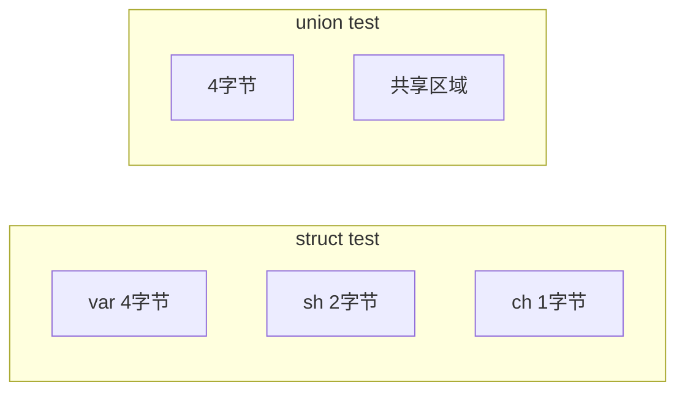

```c
typedef union test {
    char ch;
    short sh;
    int var;
} test_t;

int main(void)
{
    test_t obj;

    obj.var = 0x87654321;

    printf("&obj       = %p\n", &obj);
    printf("&obj.ch = %p\n", &obj.ch);
    printf("&obj.sh = %p\n", &obj.sh);
    printf("&obj.var= %p\n", &obj.var);

    printf("sizeof(test_t) = %u\n", sizeof(test_t));

    printf("var = %#x\n", obj.var);
    printf("sh  = %#x\n", obj.sh);
    printf("ch  = %#x\n", obj.ch);

    obj.ch = 0xAA;

    printf("var = %#x\n", obj.var);
    printf("sh  = %#x\n", obj.sh);
    printf("ch  = %#x\n", obj.ch);

    system("pause");
    return EXIT_SUCCESS;
}
```

## 第十一章 高级语法（文件基础）

### 枚举

- 语法：`enum 枚举名 { 枚举常量 };`

```c
enum color {red, green, blue, black, pink, yellow};
```

- 枚举常量：
  - 必须是整型常量，不允许是浮点数。可以是负值。默认值从 0 开始，后续常量较前一个 +1
  - 可以给任意一个常量赋初值，后续常量较前一个 +1。

```c
enum color {red, green=-5, blue, black, pink=-18, yellow};
```

- 示例：

```c
//enum color { red, green = -5, blue, black, pink = 18, yellow };
enum { red, green = -5, blue, black, pink = 18, yellow };

int main(void)
{
    int flg = 2;
    if (flg == blue)
    {
        printf("blue is -4\n");
    }
    else
    {
        printf("bule is not %d, blue=%d\n", flg, blue);
    }

    printf("red = %d, yellow = %d\n", red, yellow);

    system("pause");
    return EXIT_SUCCESS;
}
```

### 文件

#### 系统文件

- `scanf` -- 键盘 -- 标准输入 -- stdin -- 0
- `printf` -- 屏幕 -- 标准输出 -- stdout -- 1
- `perror` -- 屏幕 -- 标准错误 -- stderr -- 2

以上 3 个文件，为系统文件。应用程序启动时，这3个文件被系统自动打开，程序执行结束，由系统自动关闭（隐式回收）。

```c
fclose(stdout);    // 关闭文件。
printf("hello world\n");    // 报错！！！
```

#### 文件分类

- 设备文件：（与硬件有直接关系）
  - 屏幕、键盘、网卡、声卡、显卡、扬声器 …
- 磁盘文件：
  - 文本文件：文件内容为 ASCII 码
  - 二进制文件：文件内容为二进制编码数据。

#### 文件指针

- 普通指针

```c
int *p;    // 野指针.
p = &a;    // 初始化方法1
p = malloc()    // 初始化方法2
```

- 文件指针

```c
FILE *fp;    // 野指针.
```

- 文件指针，借助"文件操作函数"来改变 fp 为空、为野的情况！
  - 举例：fopen()---> 将 fp 变为 非野。

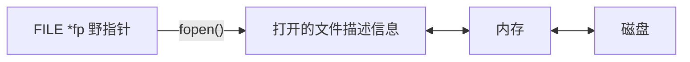

- 操作文件，可以使用的函数：fputc、fgetc、fputs、fgets、fread、fwrite ...

#### 文件操作一般步骤

1. 打开文件：`fopen()` ------> `FILE *fp;`
2. 读写文件：`fputc、fgetc、fputs、fgets、fread、fwrite...`
3. 关闭文件：`fclose()`

#### 文件操作

##### 打开、关闭文件

- 打开文件

```c
#include <stdio.h>
FILE *fp;    // 野指针
FILE * fopen(const char * filename, const char * mode);
    参1：待打开的文件名（访问路径）
    参2：文件打开权限。（如字，值多前3个）
        r：只读方式打开文件，文件如果不存在，报错！存在，以只读方式打开。
        w：只写方式打开文件，文件如果不存在，创建一个空文件。文件已经存在，清空并打开。
        w+：读、写方式打开文件，文件如果不存在，创建一个空文件。文件已经存在，清空并打开。
        r+：读、写方式打开文件，文件如果不存在，报错！存在，以读、写方式打开。
        a：以追加方式打开文件。
        b：操作二进制文件使用的。(windows)
    返回值：
        成功：返回打开文件的文件指针(fp) 【强调】：这个fp指针，不使用"解引用"操作数据。
        失败：NULL
```

- 关闭文件

```c
#include <stdio.h>
int fclose(FILE * stream);
    参：打开的文件fp（fopen()返回值）
    返回值：
        成功：0
        失败：-1
```

- 示例：

```c
int main(void)
{
    FILE* fp;

    // 打开文件
    //fp = fopen("C:\\itcast\\test.txt", "r");    // 错误传参
    //fp = fopen("C:\\itcast\\test.txt", "r");    // 正确传参
    //fp = fopen("C:/itcast/test.txt", "r");    // 正确传参
    //fp = fopen("C:/itcast/test2.txt", "r");    // 指定r打开，文件不存在，报错
    fp = fopen("C:/itcast/test2.txt", "w");    // 指定w打开，文件不存在创建，存在，清空
    if (fp == NULL)
    {
        perror("fopen error");    // printf("fopen error\n");
        return -1;
    }

    // 读写文件...

    // 关闭
    int ret = fclose(fp);
    printf("ret = %d, ----------finish\n", ret);

    system("pause");
    return EXIT_SUCCESS;
}
```

##### 绝对、相对路径

- 绝对路径：
  - 从系统磁盘的盘符开始，找到待访问的文件的路径。
  - windows 下的书写方法：
    1. `C:\\users\\afei\\Desktop\\TTTTTT\\01-复习.avi`
    2. `C:/users/afei/Desktop/TTTTTT/01-复习.avi` -- 也是 Linux 系统。
- 相对路径：
  1. 如果在 VS 环境下，使用 Ctrl+F5 编译执行，文件的相对路径是相对于 `day11.vcxproj` 所在目录位置。不是相对于 .c 文件。
  2. 如果双击 .c 文件同级目录下的 Debug 目录下的 xxx.exe 文件，文件的相对路径是相对于 xxx.exe 所在的目录位置。
  3. 如果 gcc 生成的 xxx.exe 文件，运行。文件的相对路径是相对于 xxx.exe 所在的目录位置。

##### 按字符写文件 fputc

```c
int fputc(int ch, FILE * stream);    // 将指定一个字符，写入指定文件
    参1：待写入的 字符
    参2：打开的文件 fp （fopen的返回值）
    返回值：
        成功：写入到文件中的那个字符的 ASCII
        失败：-1
```

- 练习：创建一个新文件，向该文件中写入 26 个大写英文字母。

```c
int main(void)
{
    char* filename = "03test.txt";    // 相对路径
    int ret = 0;
    char ch = 'A';

    FILE* fp = fopen(filename, "w");    // 文件存在，会清空
    if (NULL == fp)
    {
        perror("fopen error");
        return -1;
    }
    // 循环写26个大写字母 到 文件中。
    while (ch <= 'Z')
    {
        ret = fputc(ch, fp);
        ch++;
    }

    ret = fclose(fp);
    printf("ret = %d, ----------finish\n", ret);

    system("pause");
    return EXIT_SUCCESS;
}
```

- fputc 向文件中写字符时，<span style="color:green">**文件读写指针（参照光标理解），会自动后移。**</span>

##### 按字符读文件 fgetc

```c
int fgetc(FILE * stream);    // 从指定文件中，读取一个字符。
    参：待读取的文件fp(fopen()的返回值)
    返回值：
        成功：实际读到的字符的ASCII
        失败：-1
```

```c
void read_file(void)
{
    char* filename = "03test.txt";
    int ret = 0;
    char ch = 0;    // 存储读到的字符

    FILE* fp = fopen(filename, "r");    // r方式打开有文件。
    if (NULL == fp)
    {
        perror("fopen error");
        return -1;
    }
    // 从文件中读 字符
    while (1)
    {
        ch = fgetc(fp);
        //printf("ch = %c\n", ch);
        if (ch == EOF)    // 已经读到文件末尾.
        {
            break;
        }
        printf("ch = %c\n", ch);    // 写到这里，不读 EOF 结束标记。
    }

    ret = fclose(fp);
    printf("ret = %d, ----------finish\n", ret);
}

int main(void)
{
    //write_file();
    read_file();    // 读一个已经存有数据的文件
    system("pause");
    return EXIT_SUCCESS;
}
```

- fgetc 在读取文件时，<span style="color:green">**文件读写指针（参照光标理解），会自动后移。**</span>
- <span style="color:red">**文本文件，结束处，系统会自动添加一个结束标记 EOF --> -1 (#define EOF -1)**</span>
  - 文件关闭时，系统自动添加。

##### feof 函数

```c
int feof(FILE * stream);    // 判断是否到达文件结尾。
    参：fopen()返回值
    返回值：
        到达文件结尾 ---> 非0【真】
        没到达文件结尾 ---> 0【假】
```

- 作用：
  - 用来判断文件是否到达结尾。既能判断文本文件，也能判断二进制文件。
- 特性：
  - <span style="color:red">**要想使用 feof() 判断到达文件结尾，在 feof() 调用之前，必须要有 读文件的函数调用。**</span>

```c
FILE* fp = fopen("04test.txt", "r");
if (NULL == fp)
{
    perror("fopen error");
    return -1;
}

while (1)
{
    printf("没有到达文件结尾\n");
    // 没有这个fgetc函数读文件，feof函数，无法正常判断到达文件结尾。
    fgetc(fp);    // 一次读一个字符，读到的字符直接丢弃！
    if (feof(fp))
    {
        break;
    }
}

fclose(fp);
```

##### 按行读文件 fgets

- 获取一个字符串，以 `\n` 作为结束标记。自动添加 `\0`。空间足够大，读 `\n`。空间不足，舍弃 `\n`。一定会预留空间 存 `\0`

```c
char * fgets(char *str, int size, FILE * stream);
    参1：用来存储字符串的空间首地址
    参2：空间大小
    参3：数据来源的文件fp。
    返回值：
        成功：返回实际读到的字符串。
        失败：NULL

// 示例：
char buf[10];
printf("%s", fgets(buf, 10, stdin));    "hello" ---> hello\n\0
printf("%s", fgets(buf, 10, stdin));    "helloworld" ---> helloworl\0
```

##### 按行写文件 fputs

- 写出一个字符串，到文件中。如果字符串中没有 `\n`，不会写 `\n`

```c
int fputs(const char * str, FILE * stream);
    参1：将写出的字符串首地址。
    参2：写出源的文件fp。
    返回值：
        成功：0
        失败：-1

// 示例：
char *str = "hello";
fputs(str, stdout);    ----> 不添加 \n
```

##### 练习：接收用户键盘输入，写入文件

- 获取用户键盘输入，将所有内容，写入文件。规定：如果用户输入了 ":wq"，终止接收用户输入，将之前读到的数据，保存成一个文件。
- 提示：
  - 从 stdin 中读入到程序中。写出到文件 fp。
  - feof() 在本题中用不上，用 strcmp 判断 读到的句子，是不是 ":wq\n"。

```c
// 练习：接收用户键盘输入，写入文件。遇见 :wq 停止接收，保存成文件
int main(void)
{
    // 创建文件，具备写权限
    FILE* fp = fopen("05test.txt", "w");
    if (NULL == fp)
    {
        perror("fopen error");
        return -1;
    }

    // 创建一个空间，保存读到的数据内容
    char buf[MAX] = { 0 };

    // 从键盘读
    while (1)
    {
        fgets(buf, MAX, stdin);
        // 每读的一行数据，都判断是否是 ":wq\n"
        if (strcmp(buf, ":wq\n") == 0)
        {
            break;    // 用户输入了结束标志，终止读入，保存文件。
        }
        // 写入fp 文件中
        fputs(buf, fp);
    }

    // 关闭文件。
    fclose(fp);

    system("pause");
    return EXIT_SUCCESS;
}
```

##### 练习：文件版四则运算

- 说明：
- 文件中有 表达式：

```c
//四则运算.txt
10/2=
10*3=
4+3=
8-6=
```

- 读出表达式，运算，将结果写回文件。

```c
//四则运算.txt
10/2=5
10*3=30
4+3=7
8-6=2
```

- 分析：
  - `10/2= ---> fgets(buf, 4096, 四则运算.txt 对应的 fp) ---> "10/2=\n" ---> 10 / 2 =`
  - `strtok()、sscanf()-->选sscanf()实现 ---> sscanf(buf, "%d%c%d=\n", &a, &ch, &b) -->`
  - `a = 10, b = 2, ch ='/'`

```c
switch (ch) {
case '/':
    ret = a / b;
    break;
case '*':
    ret = a * b;
    break;
...
}
```

- `fopen("", "w")` 清空原来只有表达式没有结果的文件，将带有结果的表达式直接覆盖。
- 拼接上述 字符串，使用 `sprintf() / strcat() --> "10/2=5\n10*3=30\n4+3=7\n8-6=2\n"`
- 最终写出：`char result[] "10/2=5\n10*3=30\n4+3=7\n8-6=2\n" ---fputs(result, fp)`
- 实现

```c
#define BUF_MAX 4096

// 写算式到文件中
void write_file06(void)
{
    FILE* fp = fopen("C:/itcast/四则运算.txt", "w");
    if (NULL == fp)
    {
        perror("fopen error");
        return;    // 退出函数调用。
    }

    fputs("10/2=\n", fp);
    fputs("10*3=\n", fp);
    fputs("4+3=\n", fp);
    fputs("10-2=\n", fp);

    fclose(fp);
}

// 从文件中读算式、提取、拆分、计算、写回
void read_file06(void)
{
    // 创建存储算式的 空间
    char buf[BUF_MAX] = { 0 };
    // 创建空间，保存算式及运算结果
    char str[BUF_MAX] = { 0 };
    // 创建空间，保存 4 个带有结果的算式
    char result[BUF_MAX] = { 0 };

    // 定义变量，保存运算数和运算符，结果
    int a, b, ret;
    char ch;

    FILE* fp = fopen("C:/itcast/四则运算.txt", "r");
    if (NULL == fp)
    {
        perror("fopen error");
        return;    // 退出函数调用。
    }
    // 循环读取文件中的算式
    while (1)
    {
        fgets(buf, BUF_MAX, fp);    // buf = "10/2=\n\0"

        // 判断是否到达文件结尾。
        if (feof(fp))
        {
            break;
        }

        // 将 sscanf 的返回值强转为 void
        (void)sscanf(buf, "%d%c%d=\n", &a, &ch, &b);    // a:10  b:2  ch:'/'
        // 根据不同的运算符，做不同运算
        switch (ch) {
        case '/':
            ret = a / b;
            break;
        case '*':
            ret = a * b;
            break;
        case '+':
            ret = a + b;
            break;
        case '-':
            ret = a - b;
            break;
        default:
            printf("运算符错误\n");
            break;
        }
        // 拼接 ret 到 算式上。
        sprintf(str, "%d%c%d=%d\n", a, ch, b, ret);    // 10/2=5

        // 测试、是否能正常获取数据，拼接成带结果的表达式。
        //printf("%s", str);

        // 拼接 4 个子算式，到 一个 大空间中
        strcat(result, str);
    }

    // 测试、拼接 4 个子算式、到 一个 大空间中、打印输出。
    printf("%s", result);

    fclose(fp);

    // 清空原来没有结果的算式所在的文件。
    fp = fopen("C:/itcast/四则运算.txt", "w");
    if (NULL == fp)
    {
        perror("fopen error");
        return;    // 退出函数调用。
    }
    // 将既有算式，又有结果的字符串，写入到同一个文件中。
    fputs(result, fp);

    fclose(fp);
}

int main(void)
{
    // 测试写出算式到文件。
    write_file06();

    getchar();    // 从键盘读一个字符，如果用户不输入，程序不继续，阻塞等。

    // 测试读取算式
    read_file06();

    system("pause");
    return EXIT_SUCCESS;
}
```

- getchar() 函数
  - 从键盘获取一个字符。返回 ASCII。如果用户不输入，程序都向后执行。
- putchar() 函数
  - 向屏幕输出一个字符。
  - `putchar('m');`

## 第十二章 高级语法（文件进阶）

### 格式化读写文件

#### fprintf() 函数

- `printf ---- sprintf ---- fprintf`
  - 变参函数，参数列表中，有 "..."。最后一个固定参数通常是一个模式描述串(包含格式匹配符)，函数实际调用时传递的参数的个数、类型、顺序，由这个固定参数决定。

```c
printf("hello");
printf("%s", "hello");
printf("%d = %d%c%d\n", 10+5, 10, '+', 5);    ----> 屏幕

char buf[1024];    // 内存空间 --- 缓冲区
sprintf(buf, "%d = %d%c%d\n", 10+5, 10, '+', 5)    ----> buf 中
```

- 函数原型

```c
#include <stdio.h>
int fprintf(FILE * stream, const char * format, ...);    ----> 文件fp 中
```

- 测试

```c
FILE* fp = fopen("abc", "w");    // 相对路径法
if (!fp)    // NULL == fp
{
    perror("fopen error");
    return -1;
}

fprintf(fp, "%d%c%d=%d\n", 10, '+', 7, 10+7);

fclose(fp);
```

#### fscanf() 函数

- `scanf ---- sscanf ---- fscanf`

```c
int m;
scanf("%d", &m);                键盘 ---> m

char str[] = "98";
sscanf(str, "%d", &m);          str ---> m

FILE *fp = fopen("r");
fscanf(fp, "%d", &m);           fp指向的文件中 ---> m
```

- 函数原型

```c
int fscanf(FILE * stream, const char *format, ...);
```

- 测试：

```c
int a, b, c;
char ch;

FILE* fp = fopen("abc", "r");    // 相对路径法
if (!fp)    // NULL == fp
{
    perror("fopen error");
    return -1;
}

(void)fscanf(fp, "%d%c%d=%d\n", &a, &ch, &b, &c);

printf("a = %d\n", a);
printf("b = %d\n", b);
printf("c = %d\n", c);
printf("ch = %c\n", ch);

printf("%d%c%d=%d", a, ch, b, c);

fclose(fp);
```

#### 格式化读写特性（扩展知识）

##### 返回值

```c
int fprintf(FILE * stream, const char * format, ...);
```

- fprintf() 函数的返回值：
  - 成功：实际写入文件的字符个数。
  - 失败：-1

```c
int fscanf(FILE * stream, const char * format, ...);
```

- fscanf() 函数的返回值：
  - 成功：正确匹配的个数。
  - 失败：-1

##### fscanf 读取特性

1. 边界溢出问题。存储读取数据的空间，在使用之前，应该进行清空。否则会出现边界溢出异常。
   - 清空：`memset(buf, 0, sizeof(buf));`
2. <span style="color:red">**fscanf 函数，每次在调用的同时，都会判断，下一次调用是否能成功匹配参2，如果不匹配提前结束读取文件（feof(fp) 为真）**</span>

##### 练习：文件版排序

- 生成随机数，写入文件。将文件内乱序随机数读出，排好序再写回文件。

```c
// 生成随机数，写入文件
void write_rand(void)
{
    FILE* fp = fopen("test03.txt", "w");    // 相对路径法
    if (!fp)    // NULL == fp
    {
        perror("fopen error");
        return -1;
    }

    // 播种种机种子
    srand(time(NULL));
    for (size_t i = 0; i < 10; i++)
    {
        //int num = rand() % 100;    // 0 -- 99
        fprintf(fp, "%d\n", rand() % 100);    // 将生成的随机数写入到文件。
    }

    fclose(fp);
}

void BubbleSort(int* src, int len)
{
    for (int i = 0; i < len - 1; i++)
    {
        for (int j = 0; j < len - 1 - i; j++)
        {
            if (src[j] > src[j + 1])
            {
                int temp = src[j];
                src[j] = src[j + 1];
                src[j + 1] = temp;
            }
        }
    }
}

// 从文件中，读取随机数
void read_rand(void)
{
    // 定义数组，存储 10 个随机数
    int arr[10] = { 0 }, i = 0;

    FILE* fp = fopen("test03.txt", "r");    // 相对路径法
    if (!fp)    // NULL == fp
    {
        perror("fopen error");
        return -1;
    }
    // 循环读取文件内的随机数
    while (1)
    {
        (void)fscanf(fp, "%d\n", &arr[i]);
        i++;
        if (feof(fp))    // 先存储，后判断，防止最后一个元素丢失。
        {
            break;
        }
    }
    // 使用冒泡排序
    BubbleSort(arr, sizeof(arr)/sizeof(arr[0]));

    fclose(fp);    //关闭随机数据的文件

    // 清空 随机数据的文件
    fp = fopen("test03.txt", "w");
    if (!fp)    // NULL == fp
    {
        perror("fopen error");
        return -1;
    }

    for (size_t i = 0; i < 10; i++)
    {
        fprintf(fp, "%d\n", arr[i]);    // 将排好序的数组写入到文件。
    }

    fclose(fp);
}

int main(void)
{
    write_rand();

    getchar();    // 从键盘获取一个字符，如果用户不输入，就阻塞程序，不向下执行。

    read_rand();

    printf("--------------finish\n");

    system("pause");
    return EXIT_SUCCESS;
}
```

### 按块读写文件

| 读写函数 | 对应关系 |
| :--- | :--- |
| fgetc | fputc |
| fgets | fputs |
| fprintf | fscanf |

以上 3 组函数，默认用来处理文本文件。

fwrite - fread 既可以处理文本文件，也可以处理二进制文件。

#### fwrite() 函数

- 写出数据到文件中。

```c
#include <stdio.h>
size_t fwrite(const void *ptr, size_t size, size_t nmemb, FILE *stream);
    参1：待写出的数据的首地址。
    参2：待写出数据的大小（一次写多大）
    参3：写出的个数（写多少次）    写出数据的总大小 = 参2 x 参3
    参4：文件fp
    返回值：
        成功：永远返回参3。通常调用函数时，将 参2传1，参3代表实际写出的字节数。
        失败：0
// fwrite 函数，写入数据到文件中时，是按 二进制 写入。
```

- 测试

```c
typedef struct student {
    int age;
    char name[10];
    int num;
} stu_t;

// 按块写文件、fwrite
void write_struct(void)
{
    // 定义结构体数组
    stu_t stu[4] = {
        18, "afei", 10,
        20, "andy", 20,
        30, "lily", 30,
        16, "james", 40
    };

    FILE* fp = fopen("test04.txt", "w");    // 相对路径法
    if (!fp)    // NULL == fp
    {
        perror("fopen error");
        return ;
    }

    int ret = fwrite(&stu[0], 1, sizeof(stu_t) * 4, fp);
    if (ret == 0)
    {
        perror("fwrite error");
        return ;
    }
    printf("ret = %d\n", ret);

    fclose(fp);
}
```

#### fread() 函数

- 从文件fp中读取数据。

```c
size_t fread(void *ptr, size_t size, size_t nmemb, FILE *stream);
    参1：读取到的数据存放的地址。
    参2：一次读取数据的字节数（一次读多大）
    参3：读多少次    读出数据的总大小 = 参2 x 参3
    参4：文件fp
    返回值：
        成功：永远返回参3。 通常调用函数时，将 参2传1，参3代表实际读出的字节数。
        0 : 1) 读失败
            2) 到达文件结尾 == feof(fp)为真
```

- 测试

```c
typedef struct student {
    int age;
    char name[10];
    int num;
    char addr[100];
} stu_t;

// 按块读文件、fread，一次读一个 stu_t 元素
void read_struct(void)
{
    FILE* fp = fopen("test04.txt", "r");    // 相对路径法
    if (!fp)    // NULL == fp
    {
        perror("fopen error");
        return;
    }

    stu_t s1;

    // 从文件中，按块读取。
    int ret = fread(&s1, 1, sizeof(stu_t), fp);
    printf("ret = %d\n", ret);

    printf("age=%d, name=%s, num=%d\n", s1.age, s1.name, s1.num);

    fclose(fp);
}

// 按块读文件、fread，一次读所有 stu_t 元素
void read_struct2(void)
{
    FILE* fp = fopen("test04.txt", "r");    // 相对路径法
    if (!fp)    // NULL == fp
    {
        perror("fopen error");
        return;
    }

    stu_t s1[10];    // stu_t *s1 = malloc(sizeof(stu_t) * 1024);
    int i = 0;

    // 从文件中，循环按块读取。
    while (1)
    {
        int ret = fread(&s1[i], 1, sizeof(stu_t), fp);
        //if (ret == 0)    // 效果一样。
        if (feof(fp))    // 效果一样。
        {
            printf("读取到文件结尾\n");
            break;
        }
        printf("age=%d, name=%s, num=%d\n", s1[i].age, s1[i].name, s1[i].num);
        i++;
    }
    fclose(fp);
}
```

#### 练习：大文件拷贝

- 已知一个任意类型的文件，对该文件复制，产生一个相同的新文件。
- 实现思路：
  1. 打开两个文件。一个 "r"，另一个 "w"
  2. 从 r 中 fread，fwrite 写到 w 文件中
  3. 循环读，判断到达文件结尾，跳出循环。
  4. 关闭2个文件。
- 注意: 在windows下，打开二进制文件（mp4, MP3, avi, jpg）读写，需要 "b"。如："rb"、"wb"

```c
int main(void)
{
    // 创建一个缓存区（内存空间），用来存储读到的数据。
    char buf[4096] = { 0 };
    int ret = 0;

    FILE* rfp = fopen("C:\\users\\afei\\Desktop\\TTTTTT\\11-午后回顾.avi", "rb");
    if (!rfp)
    {
        perror("fopen error");
        return -1;
    }
    FILE* wfp = fopen("mycopy.avi", "wb");
    if (!rfp)
    {
        perror("fopen error");
        return -1;
    }

    // 循环从文件中读，写到另一个文件中。
    while (1)
    {
        ret = fread(buf, 1, sizeof(buf), rfp);
        if (ret == 0)
        {
            break;    // 读到文件末尾。
        }
        printf("ret = %d\n", ret);
        // 没有读到文件末尾，将实际读到的数据，"原封不动"的写入 wfp 中。
        fwrite(buf, 1, ret, wfp);
    }

    fclose(rfp);
    fclose(wfp);

    system("pause");
    return EXIT_SUCCESS;
}
```

### 随机位置读写文件

- <span style="color:green">**强调：文件读写指针，在一个文件内，只有一个。读、写都使用这一个。**</span>

#### fseek

```c
#include <stdio.h>
int fseek(FILE *stream, long offset, int whence);    // 修改文件偏移量(文件读写指针)
    参1：文件fp
    参2：偏移量（矢量：正数向后，负数向前）
    参3：偏移的起始位置
        SEEK_SET：文件开头位置
        SEEK_CUR：当前位置
        SEEK_END：文件结尾位置
    返回值：成功：0    失败：-1
```

#### ftell

```c
long ftell(FILE *stream);    // 获取文件偏移量（文件读写指针位置）
    返回值：从当前读写位置，到文件起始位置的偏移量。

// 借助 ftell(fp) + fseek(fp, -50, SEEK_END) 来求取文件大小。
```

#### rewind

```c
void rewind(FILE *stream);    // 回卷文件读写指针，将文件读写指针移动到起始位置。
// 相当于：fseek(fp, 0, SEEK_SET);
```

### 其他文件相关操作

#### Linux 和 Windows 文件区别

1. 对于二进制文件操作，Windows 下必须要使用 "b"。Linux下 二进制文件和文本文件操作没区别。
2. windows下的回车换行 `\r\n`，回车 `\r`，换行 `\n`。Linux 下 回车换行 `\n`。
3. <span style="color:red">**对文件指针：**</span>
   - 先写后读可以直接操作。windows 和 Linux 一致。
   - 先读后写。Linux无序修改。Windows下需要在写操作之前，添加 `fseek(fp, 0, SEEK_CUR)` 函数调用，获取文件读写指针，再来写。才能生效。

```c
int main(int argc, char* argv[])
{
    FILE* fp = fopen("test1.txt", "r+");

    char buf[6] = { 0 };
    char* ptr = fgets(buf, 6, fp);

    printf("buf=%s, ptr=%s\n", ptr, buf);

    fseek(fp, 0, SEEK_CUR);    //获取文件读写指针。如果没有这句，win下程序会崩溃。

    int ret = fputs("AAAA", fp);
    printf("ret = %d\n", ret);

    fclose(fp);

    return 0;
}
```

#### 获取文件状态

- `ftell(fp) + fseek(fp, 0, SEEK_END)` 可以获取文件大小。此种方法获取文件大小，必须要打开文件，文件打开、关闭操作，对于系统而言，系统资源消耗较大。

```c
#include <sys/types.h>
#include <sys/stat.h>
int stat(const char *path, struct stat *buf);    // status
    参1：文件访问路径
    参2：文件属性结构体指针（传出参数：函数调用结束时，充当函数返回值）
    返回值：成功：0    失败：-1
// 示例：
struct stat buf;
stat("待打开文件", &buf);
buf.st_size    获取文件的实际大小。
```

- 获取文件大小

```c
struct stat buf;

int ret = stat("test06.txt", &buf);    // buf传出参数
printf("ret = %d\n", ret);

printf("获取文件的大小为：%d\n", buf.st_size);
```

#### 删除、重命名文件

```c
int remove(const char *pathname);    // 删除

int rename(const char *oldpath, const char *newpath);    // 重命名


// 重命名：
//int ret = rename("test06.txt", "呜呜哈嘿.txt");
//printf("ret = %d\n", ret);

// 删除文件
int ret = remove("呜呜哈嘿.txt");
printf("ret = %d\n", ret);
```

### 缓冲区刷新

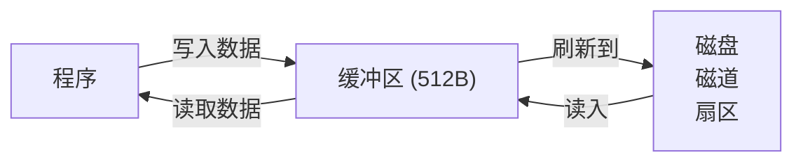

> <span style="color:orange">**磁盘**：物理操作，速度慢。</span>
> <span style="color:orange">**内存**：电子操作，速度快。</span>
> <span style="color:green">**缓冲区**：存在的意义，一次性物理访问磁盘盘过程时，尽可能多的读数据，保存在内存中。</span>
> <span style="color:blue">**预读入、缓输出。**</span>

- 标准输出 -- stdout -- 标准输出缓冲区。
  - 写给屏幕的数据，都是先存入缓冲区中，由缓冲区一次性刷新到物理设备（屏幕）
- 标准输入 -- stdin -- 标准输入缓冲区。
  - 从键盘读取的数据，直接读到缓冲区，由缓冲区给程序提供数据。
- 缓冲机制：
  1. <span style="color:green">**行缓冲**</span>：遇到 `\n` 刷新缓冲区的数据到物理设备上。`printf();`
  2. <span style="color:green">**全缓冲**</span>：缓冲区存满，数据才刷新到物理设备上、文件。
  3. <span style="color:green">**无缓冲**</span>：缓冲区中只要有数据，立即刷新到物理设备。`perror`
- 手动刷新缓冲区的方法：

```c
#include <stdio.h>
int fflush(FILE *stream);
    参：文件fp
    返回值：成功：0    失败：-1
```

  - 当文件关闭时，会强制刷新缓冲区，写入磁盘。 —— 隐式回收
  - 隐式回收：关闭文件，刷新缓冲区，释放malloc申请的内存。

```c
int main(void)
{
    FILE* fp = fopen("test10.txt", "w-");
    if (!fp)
    {
        perror("fopen error");
        return -1;
    }
    char ch = 0;

    while (1)
    {
        (void)scanf("%c", &ch);
        if (ch == ':')
        {
            break;
        }
        fputc(ch, fp);

        // 手动刷新缓冲区，写入物理磁盘。
        fflush(fp);
    }
    fclose(fp);    // 当文件关闭时，会强制刷新缓冲区，写入磁盘。

    system("pause");
    return EXIT_SUCCESS;
}
```

## 第十三章 练习（电话簿管理系统）

### 实现流程

1. 定义联系人的数据结构（结构体）
2. 创建 存储联系人数据的 static 全局数组 和 记录联系人实际数量的 static 全局变量。
3. 搭建电话簿的主业务逻辑框架（工作流程）
4. 定义并实现相应的功能函数
   1. 添加联系人
   2. 删除联系人
   3. 查找联系人
   4. 显示联系人
5. 组织上述功能函数的调用逻辑。
6. 整体测试、微调。

### 框架搭建1

#### main.c

```c
// 管理程序运行的主业务逻辑
#define _CRT_SECURE_NO_WARNINGS
#include "telephoneBook.h"

// 定义枚举，使用枚举常量描述事件
enum {ADD=1, DEL, SREACH, SHOW, EXIT};

// 显示菜单
void show_menu(void)
{
    printf("---------显示菜单-----------\n");
}

// 电话簿启动、工作
void startworking(void)
{
    // 电话簿具体工作内容
    while (1)
    {
        // 显示菜单
        show_menu();

        // 接收用户输入(1.添加，2.删除，3.查找，4.显示，5.退出)
        int number = 0;
        printf("请在菜单中选择您的需求：");
        (void)scanf("%d", &number);

        // 根据用户输入，作用相应操作
        switch (number)
        {
        case ADD:
            printf("1. 添加联系人\n");
            break;
        case DEL:
            printf("2. 删除联系人\n");
            break;
        case SREACH:
            printf("3. 查找联系人\n");
            break;
        case SHOW:
            printf("4. 显示联系人\n");
            break;
        case EXIT:
            printf("5. 退出系统\n");
            return;    // 结束整个电话簿系统
        default:
            break;
        }
    }
}

int main(void)
{
    startworking();

    system("pause");
    return EXIT_SUCCESS;
}
```

#### telephoneBook.c

```c
// 管理电话簿 相关信息
#include "telephoneBook.h"

// 定义 结构体数组 存储联系人
static person_t numbers[MAX_PERSON_NUM];

// 描述数组中，实际存储联系人个数
static int size = 0;

// 具体添加联系人
// 具体删除联系人
// 具体查找联系人
// 显示所有联系人
```

#### telephoneBook.h

```c
// #pragma once    // windows 系统自带防止头文件重复包含。

#ifndef _TELEPHONE_BOOK_H_
#define _TELEPHONE_BOOK_H_

// 系统库头文件引入
#include <stdio.h>
#include <string.h>
#include <stdlib.h>
#include <math.h>
#include <time.h>

// 函数声明
void show_menu(void);

// 宏定义，常量描述数组容量
#define MAX_PERSON_NUM 2048

// 定义联系人结构体
typedef struct person {
    char name[32];    // 联系人姓名
    char phone[16];   // 联系人电话
} person_t;

#endif
```

### 框架搭建2

#### main.c

```c
// 管理程序运行的主业务逻辑
#define _CRT_SECURE_NO_WARNINGS

#include "telephoneBook.h"

// 定义枚举，使用枚举常量描述事件
enum {ADD=1, DEL, SREACH, SHOW, EXIT};

// 显示菜单
void show_menu(void)
{
    printf("\n欢迎使用简易电话簿系统\n\n");
    printf("\t1. 添加联系人\n\n");
    printf("\t2. 删除联系人\n\n");
    printf("\t3. 查找联系人\n\n");
    printf("\t4. 显示联系人\n\n");
    printf("\t5. 退出系统\n\n");
}

// ADD分支
void add(void)
{
    printf("\n\t【姓名】为：");
    char name[32] = { 0 };        // 临时获取用户输入、存储联系人姓名
    (void)scanf("%s", name);

    printf("\n\t【电话】为：");
    char phone[16] = { 0 };        // 临时获取用户输入、存储联系人姓名
    (void)scanf("%s", phone);

    // 相联系人数组中，添加一个新联系人
    add_person(name, phone);

    printf("\n联系人【%s】添加成功！\n", name);
}

// DEL分支
void del(void)
{
    printf("\n\t将【删除】的联系人姓名为：");
    char name[32] = { 0 };        // 临时获取用户输入、存储联系人姓名
    (void)scanf("%s", name);

    // 从联系人数组中，删除联系人
    del_person(name);

    printf("\n联系人【%s】已成功删除！\n", name);
}

// SREACH分支
void search(void)
{
    printf("\n\t将【查找】的联系人姓名为：");
    char name[32] = { 0 };        // 临时获取用户输入、存储联系人姓名
    (void)scanf("%s", name);

    // 从联系人数组中，查找联系人的电话
    char *phone = search_person(name);
    if (NULL == phone)
    {
        printf("\n抱歉！电话簿中【%s】查无此人！\n", name);
    }
    else
    {
        printf("n联系人【%s】的电话为：%s\n", name, phone);
    }
}

// SHOW分支  --- 可以不封装该函数，直接调用 telephoneBook.c 中的 show_person()
//void show(void)
//{
//    printf("4. 显示联系人\n");
//}

// 电话簿启动、工作
void startworking(void)
{
    // 电话簿具体工作内容
    while (1)
    {
        // 显示菜单
        show_menu();

        // 接收用户输入(1.添加，2.删除，3.查找，4.显示，5.退出)
        int number = 0;
        printf("请在菜单中选择您的需求：");
        (void)scanf("%d", &number);

        // 根据用户输入，作用相应操作
        switch (number)
        {
        case ADD:
            add();
            break;
        case DEL:
            del();
            break;
        case SREACH:
            search();
            break;
        case SHOW:
            show_person();
            break;
        case EXIT:
            printf("\n欢迎下次再使用电话簿系统，再见~~\n");
            return;        // 结束整个电话簿系统
        default:
            break;
        }
    }
}

int main(void)
{
    startworking();

    system("pause");
    return EXIT_SUCCESS;
}
```

#### telephoneBook.c

```c
// 管理电话簿 相关信息
#include "telephoneBook.h"

// 定义 结构体数组 存储联系人
static person_t numbers[MAX_PERSON_NUM];

// 描述数组中，实际存储联系人个数
static int size = 0;

// 具体添加联系人
void add_person(const char* name, const char* phone)
{

}

// 具体删除联系人
void del_person(const char* name)
{

}

// 具体查找联系人 ---- 返回联系人的电话
char *search_person(const char* name)
{
    return NULL;
}

// 显示所有联系人
void show_person(void)
{

}
```

#### telephoneBook.h

```c
// #pragma once    // windows 系统自带防止头文件重复包含。

#ifndef _TELEPHONE_BOOK_H_
#define _TELEPHONE_BOOK_H_

// 系统库头文件引入
#include <stdio.h>
#include <string.h>
#include <stdlib.h>
#include <math.h>
#include <time.h>

// 函数声明
void add_person(const char* name, const char* phone);
void del_person(const char* name);
char* search_person(const char* name);
void show_person(void);

void show_menu(void);
void add(void);
void del(void);
void search(void);

// 宏定义，常量描述数组容量
#define MAX_PERSON_NUM 2048

// 定义联系人结构体
typedef struct person {
    char name[32];    // 联系人姓名
    char phone[16];   // 联系人电话
} person_t;

#endif
```

### 具体功能函数实现

#### 添加联系人

```c
// 具体添加联系人
void add_person(const char* name, const char* phone)
{
    // 校验参数
    if (NULL == name || NULL == phone)
    {
        printf("add_person 添加联系人失败！参数错误！\n");
        return;
    }

    strcpy(numbers[size].name, name);    // 存姓名到数组
    strcpy(numbers[size].phone, phone);  // 存电话到数组

    ++size;    // 更新size
}
```


