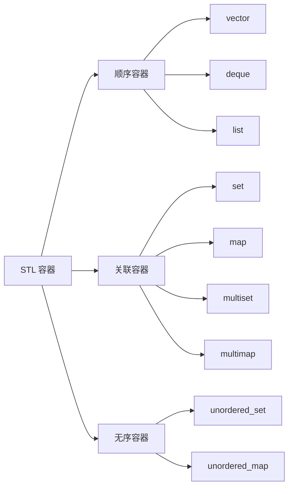

# C 语言过渡 C++

> 本笔记按"基础篇 → STL 篇 → 进阶篇 → C++11 篇"四部分整理，弥补 C 与 C++ 在语法、标准库、常用特性上的差异，作为刷题与竞赛入门的过渡资料。

# 一、基础篇

> 本节聚焦 C++ 相对 C 的核心语法变化：命名空间、IO 流、头文件、变量声明、bool、const、string、结构体、引用。

## C++ 与 C 的核心差异速览

| 维度 | C 语言 | C++ |
| --- | --- | --- |
| 输入输出 | `scanf` / `printf` | `cin` / `cout`（流式） |
| 头文件 | `<stdio.h>` | `<iostream>`（去 `.h`、加 `c` 前缀） |
| 变量声明 | 必须出现在语句块开头 | 任意位置（C++17 起更宽松） |
| 布尔类型 | 用 `0/1` 模拟 | 原生 `bool`，值为 `true` / `false` |
| 常量 | `#define` / `enum` | `const` / `constexpr` |
| 字符串 | `char[]` + 字符串函数 | 原生 `string` 类 |
| 结构体 | 必须写 `struct stu a;` | 可省略 `struct`，直接 `stu a;` |
| 引用 | 无（只能传指针） | 引用 `&`（语法糖，本质是指针） |
| 函数默认值 | 无 | 支持参数默认值 |
| 函数重载 | 不支持 | 支持 |

## 命名空间 `using namespace std`

> <span style="color:blue">`std`</span> 是 C++ 标准库的命名空间，`cin` / `cout` / `string` 等都在 `std` 里。

**两种写法**：

- `using namespace std;` —— 一次性把 `std` 全部展开（偷懒，**小项目/刷题**常用）
- `std::cin` / `std::cout` —— 每次显式指定（**正式项目**推荐，避免命名冲突）

```c++
#include <iostream>

using namespace std;

int main() {
    int n;
    cin >> n;
    cout << "wohaoshuai" << n << endl;

    return 0;
}
```

```c++
#include <iostream>

int main() {
    int n;
    std::cin >> n;
    std::cout << "wohaoshuai" << n << std::endl;

    return 0;
}
```

> <span style="color:orange">注意</span>：`endl` 等价于 `'\n' + flush()`，频繁使用会降低 IO 性能。刷题数据量大时，可改为 `'\n'`。

## cin 和 cout

### 运行速度

> <span style="color:orange">注意</span>：`cin` / `cout` 默认会与 C 标准库 `scanf` / `printf` 同步，且绑定到 `cin.tie(nullptr)`，因此**比 `scanf` / `printf` 慢**。数据量大时建议关闭同步。

**关闭同步提速**（刷题常用）：

```c++
ios::sync_with_stdio(false);
cin.tie(nullptr);
```

**使用方式**：`>>` 读入、`<<` 输出、配合 `endl` 或 `'\n'` 换行。

## 头文件

> C++ 标准库头文件**去掉 `.h`**，C 语言风格头文件加 `c` 前缀（`stdio.h` → `cstdio`），这样所有符号都在 `std` 命名空间里。

| C 风格 | C++ 风格 |
| --- | --- |
| `<stdio.h>` | `<cstdio>` |
| `<string.h>` | `<cstring>` |
| `<math.h>` | `<cmath>` |
| `<stdlib.h>` | `<cstdlib>` |
| `<ctype.h>` | `<cctype>` |

```c++
#include <cstring>
#include <cmath>
```

## 变量声明

> C99 之后 C 语言也允许在 `for` 循环里定义循环变量，但 C++ 从一开始就支持——这在 C89 时代的 C 里是违法的。

```c++
#include <iostream>

int main() {
    for (int i = 0; i < 10; i++) {
        // 循环体，i 作用域仅限 for 块内
    }
    // 这里使用 i 会编译报错
    return 0;
}
```

## bool 变量

> <span style="color:blue">`bool`</span> 是 C++ 原生类型，只有两个值：`true` / `false`。**任何非 0 值** 隐式转换为 `true`，`0` 转换为 `false`。

```c++
#include <iostream>

using namespace std;

int main() {
    bool flag = true;
    bool flag2 = -1;
    bool flag3 = 0;

    cout << flag << " " << flag2 << " " << flag3 << " " << endl; // 1 1 0

    return 0;
}
```

> <span style="color:orange">注意</span>：`cout` 输出 `bool` 会显示 `0/1`，想看 `true/false` 需 `cout << boolalpha << flag;`。

## const 定义常量

> `const` 比 `#define` 更安全（**有类型、参与编译检查**），比 `enum` 更通用（任何类型都可）。

```c++
#include <iostream>

using namespace std;

int main() {
    const int MAX = 100;

    cout << MAX << endl;

    return 0;
}
```

## string 类

> C++ 的 `string` 是对 `char[]` 的封装，**自动管理内存**，提供拼接、查找、截取等操作，比 C 的字符串函数安全得多。

```c++
#include <iostream>

using namespace std;

int main() {
    // 定义
    string s = "hello";
    string s2 = " world";

    // 拼接
    string s3 = s + s2;
    cout << s3 << endl; // hello world

    // 输入输出
    cin >> s;
    cout << s << endl;

    // getline, 让带有空格的输入能被读取
    getline(cin, s);


    // 处理
    // s.length() 获取字符串长度
    cout << s.length << endl;

    // s.substr(n, m) 从下标 n 开始，取 m 长度的字串
    cout << s3.substr(0, 2) << endl; // he

    return 0;
}
```

**常用方法速览**：

| 方法 | 功能 |
| --- | --- |
| `s.length()` / `s.size()` | 获取长度 |
| `s1 + s2` | 拼接 |
| `s1 == s2` | 比较 |
| `s.substr(pos, len)` | 截取子串 |
| `s.find(str)` | 查找子串位置，未找到返回 `string::npos` |
| `s.replace(pos, len, str)` | 替换 |
| `s.insert(pos, str)` | 插入 |
| `s.erase(pos, len)` | 删除 |

> <span style="color:orange">注意</span>：刷题时输入**含空格的整行**用 `getline(cin, s)`；`cin >> s` 遇到空格就停。

## 结构体

> C++ 中**可省略 `struct` 关键字**直接使用类型名，结构体里也能写函数（与类几乎等价，区别在默认访问权限）。

```c++
#include <iostream>
using namespace std;

struct stu {
    string name;
    int age;
};

int main() {
    stu a[10]; // 省略 struct

    return 0;
}
```

## 引用 `&` 和 取地址 `&`

> <span style="color:red">C++ 的 `&` 和 C 语言的 `&` 是两个完全不同的符号</span>：C++ 中 `&` 在**类型后**是引用声明（语法糖），在**变量前**是取地址。

| 用法 | 含义 | 示例 |
| --- | --- | --- |
| `int& r = a;` | 声明引用（`r` 是 `a` 的别名） | 函数参数传递、避免拷贝 |
| `&a` | 取变量 `a` 的地址 | `int* p = &a;` |
| `a && b` | 逻辑与（与 C 相同） | `if (a && b) {...}` |

**引用的本质**：编译器内部实现为**常量指针**（`int* const p = &a;`），引用必须在声明时**初始化**、不能重新指向其他变量。

```c++
#include <iostream>
using namespace std;

// 形参为引用 → 函数内修改会反映到调用方
void c(int& a) {
    a++;
}

int main() {
    int a = 4;

    c(a);

    cout << a << endl; // 5

    return 0;
}
```

> <span style="color:green">引用 vs 指针</span>：引用更安全（无空引用、不可重绑），语法更简洁；指针更灵活（可空、可改、可算术）。**优先用引用**。

# 二、STL 篇

> STL（Standard Template Library）是 C++ 的标准模板库，核心是**容器 + 迭代器 + 算法**。刷题 90% 的场景都依赖它。

## 容器分类总览



| 容器 | 底层 | 特点 | 时间复杂度 |
| --- | --- | --- | --- |
| `vector` | 动态数组 | 随机访问 O(1)，尾部插入 O(1) | 随机访问最优 |
| `deque` | 分段数组 | 头尾插入 O(1) | 双端队列 |
| `list` | 双向链表 | 任意位置插入 O(1)，无随机访问 | 频繁插入 |
| `set` / `map` | 红黑树 | 自动排序，查找 O(log n) | 有序场景 |
| `unordered_set` / `unordered_map` | 哈希表 | 查找 O(1) 平均 | 不需排序的最快查找 |

## vector

> 动态数组，**默认容器**，刷题首选。`size()` 动态变化，超出容量时自动 2 倍扩容。

```c++
#include <iostream>
#include <vector> // 头文件
using namespace std;

int main() {
    // 创建数组
    vector<int> a;            // 不分配空间
    vector<int> b(10);        // 分配 10 个空间，元素值默认为 0
    vector<int> c(10, 2);     // 分配 10 个空间，每个初始化为 2

    // 分配数组大小
    a.resize(10);

    // .size() 获取长度
    cout << a.size() << endl; // 10

    // 赋值
    for (int i = 0; i < a.size(); i++) {
        a[i] = i;
        cout << a[i] << " ";
    } // 0 1 2 3 4 5 6 7 8 9

    // 末尾添加新数据
    a.push_back(11);
    for (int i = 0; i < a.size(); i++) {
        cout << a[i] << " ";
    } // 0 1 2 3 4 5 6 7 8 9 11

    // 迭代器
    for (auto p = a.begin(); p != a.end(); p++) {
        cout << *p << " ";
    } // 0 1 2 3 4 5 6 7 8 9 11

    return 0;
}
```

**常用方法**：

| 方法 | 功能 |
| --- | --- |
| `v.push_back(x)` | 尾部插入 |
| `v.pop_back()` | 尾部删除 |
| `v.size()` / `v.empty()` | 长度 / 是否为空 |
| `v.resize(n)` | 调整大小 |
| `v.clear()` | 清空 |
| `v.front()` / `v.back()` | 访问首尾元素 |
| `v.begin()` / `v.end()` | 迭代器 |

## set

> <span style="color:blue">`set`</span> 是**集合**，元素**互异**且**自动从小到大排序**。底层是红黑树，插入/查找/删除都是 O(log n)。

```c++
#include <iostream>
#include <set> // 头文件
using namespace std;

int main() {
    // 创建集合
    set<int> s; // 和 vector 类似，因为集合元素互异，所以不能通过参数初始化

    // 插入
    s.insert(1);
    s.insert(2);
    s.insert(3);

    // 遍历——迭代器
    for (auto p = s.begin(); p != s.end(); p++) {
        cout << *p << " ";
    } // 1 2 3

    // 查找 s.find(data)，寻找 data 的地址，返回值是一个指针
    cout << (s.find(2) != s.end()) << endl; // 1 表示地址不同，已经找到
    cout << (s.find(4) != s.end()) << endl; // 0 地址指向数组后一位空间，没找到

    // 删除
    s.erase(1); // 删除元素 1
    cout << (s.find(1) != s.end()) << endl; // 0 未找到，1 已删除

    // 获取长度
    cout << s.size() << endl;
    return 0;
}
```

> <span style="color:orange">注意</span>：`s.erase(1)` 中的 `1` 是**值**（会先查找再删除）；如果传迭代器 `it`，则删除**该位置**元素。

## map（键值对）

> <span style="color:blue">`map`</span> 是**键值对集合**，按**键**自动从小到大排序（`multimap` 允许键重复）。

```c++
#include <iostream>
#include <map> // 头文件
using namespace std;

int main() {
    // 创建键值对
    map<string, int> m;

    // 添加
    m["hello"] = 2;
    m["world"] = 3;

    cout << "hello : " << m["hello"] << endl; // hello : 2

    // 迭代器
    for (auto p = m.begin(); p != m.end(); p++) {
        cout << p->first << ":" << p->second << " ";
    }
    /*
        hello:2 world:3
    */

    // 获取长度
    cout << m.size() << endl;

    return 0;
}
```

> <span style="color:orange">注意</span>：`m["key"]` 即使 `key` 不存在也会**插入默认值**，可能掩盖逻辑错误。**判断存在性**用 `m.find(key) != m.end()` 或 `m.count(key) > 0`。

## pair（键值对简述）

> `pair<T1, T2>` 把两个值绑在一起，常用于 `map` 的迭代器（`p->first` 是键，`p->second` 是值）。

```c++
pair<string, int> p = {"age", 18};
cout << p.first << "=" << p.second; // age=18
```

## stack（栈）

> <span style="color:blue">`stack`</span> 是**后进先出**（LIFO）的容器适配器，底层默认用 `deque` 实现。**只允许访问栈顶**。

```c++
#include <iostream>
#include <stack>
using namespace std;

int main() {
    stack<int> s;

    // 压栈
    s.push(1);
    s.push(2);
    s.push(3);

    // 访问栈顶
    cout << s.top() << endl; // 3

    // 出栈
    s.pop();
    cout << s.top() << endl; // 2

    // 获取长度
    cout << s.size() << endl; // 2

    // 是否为空
    cout << s.empty() << endl; // 0 (false)

    return 0;
}
```

**常用方法**：`push`（压栈）→ `top`（访问栈顶）→ `pop`（出栈）→ `size` / `empty`。

> <span style="color:orange">注意</span>：`pop` 只删元素不返回值，必须先用 `top()` 拿到值再 `pop()`。

## queue（队列）

> <span style="color:blue">`queue`</span> 是**先进先出**（FIFO）的容器适配器。BFS、层次遍历、滑动窗口常用。

```c++
#include <iostream>
#include <queue>
using namespace std;

int main() {
    queue<int> q;

    // 入队
    q.push(1);
    q.push(2);
    q.push(3);

    // 访问队首
    cout << q.front() << endl; // 1

    // 访问队尾
    cout << q.back() << endl; // 3

    // 出队
    q.pop();
    cout << q.front() << endl; // 2

    // 获取长度
    cout << q.size() << endl; // 2

    return 0;
}
```

**常用方法**：`push`（入队）→ `front`（队首） / `back`（队尾）→ `pop`（出队）→ `size` / `empty`。

## deque（双端队列）

> 头尾都能 O(1) 插入/删除，**支持随机访问**（`dq[i]`）。`queue` 和 `stack` 的功能它都覆盖，但常数略大。

```c++
#include <iostream>
#include <deque>
using namespace std;

int main() {
    deque<int> dq = {1, 2, 3};
    dq.push_front(0); // 头部插入
    dq.push_back(4);  // 尾部插入
    cout << dq[1];    // 1（随机访问）
    return 0;
}
```

## unordered_map 和 unordered_set

> 这两个就是**不会排序**的 `map`（键值对）和 `set`（集合），底层是**哈希表**。如果刷题时 `map` / `set` 超时，换成它们通常能快一档。

```c++
#include <iostream>
#include <unordered_map>
using namespace std;

int main() {
    unordered_map<string, int> um;
    um["a"] = 1;
    um["b"] = 2;
    cout << um["a"]; // 1
    return 0;
}
```

> <span style="color:orange">注意</span>：哈希表最坏复杂度 O(n)，且**无序**；如需有序遍历、有序集合，请用 `map` / `set`。

## 迭代器分类

| 类别 | 支持的操作 | 典型容器 |
| --- | --- | --- |
| 输入迭代器 | 只读、`++` | `istream_iterator` |
| 前向迭代器 | 读写、`++` | `forward_list` |
| 双向迭代器 | 读写、`++` / `--` | `list` / `set` / `map` |
| 随机访问迭代器 | 读写、`++` / `--` / `+n` / `-n` / `[]` | `vector` / `deque` |

> <span style="color:orange">注意</span>：STL 算法（`sort`、`binary_search` 等）依赖迭代器类别，**`sort` 不能用于 `list` / `set`**，这些容器自带排序或 `list::sort()`。

# 三、进阶篇

> 本节收录 `bitset`、`sort`、二分查找、字符处理等刷题常用工具。

## 位运算 bitset

> <span style="color:blue">`bitset`</span> 类似一个**固定长度的二进制位数组**。位数在编译期必须确定（下标 `b[0]` 是**低位**，`b[size-1]` 是**高位**），所以**直接输出整个 `bitset` 的方向与 `b[i]` 单个访问方向相反**。

```c++
#include <iostream>
#include <bitset>
using namespace std;

int main() {
    // 初始化
    bitset<5> b;             // 5 表示 5 个二进制位，初始化为 0，00000
    bitset<5> c(3);          // 十进制转二进制，输出 c 的结果为 00011
    bitset<5> d("101");      // 填入字符串，长度不够高位补 0，输出 d 的结果为 00101
    string s = "01010011";
    bitset<5> e(s, 1, 5);    // 从字符串的索引 1 开始取 5 个字符 10100，输出 e 的结果为 10100
    bitset<6> f("10011", 1); // 从字符串的索引 0 开始取 1 个字符高位补零，输出 f 的结果为 000001

    cout << b << endl; // 00000
    cout << c << endl; // 00011
    cout << d << endl; // 00101
    cout << e << endl; // 10100
    cout << f << endl; // 00011

    // 遍历
    for (int i = 0; i < d.size(); i++) {
        cout << d[i] << " ";
    }

    // 处理
    cout << "是否有 1：" << d.any() << endl;
    cout << "是否不存在 1：" << d.none() << endl;
    cout << "1 的个数：" << d.count() << endl;
    cout << "d 中元素个数：" << d.size() << endl;
    cout << "下标为 i 的元素是不是 1：" << d.test(1) << endl;

    d.set(3); // 把下标为 i 处设置为 1

    // 归零
    b.reset();   // 所有位归零
    d.reset(2);  // 第 i 位归零

    // 取反
    d.flip();   // 所有位取反
    d.flip(2);  // 第 i 位取反

    // 转换类型
    cout << "转换为 unsigned long 类型：" << d.to_ulong() << endl;
    cout << "转换为 string 类型：" << d.to_string() << endl;

    return 0;
}
```

**常用方法**：

| 方法 | 功能 |
| --- | --- |
| `b.any()` / `b.none()` | 是否存在 / 不存在 1 |
| `b.count()` | 1 的个数 |
| `b.set(i)` / `b.reset(i)` | 置 1 / 置 0 |
| `b.flip()` | 按位取反 |
| `b.test(i)` | 第 i 位是否为 1 |
| `b.to_ulong()` / `b.to_string()` | 转 `unsigned long` / `string` |

## sort 函数

> <span style="color:blue">`sort`</span> 对区间 `[first, last)` 进行排序，**默认升序**。`vector` 容器用 `v.begin()` 表示头、`v.end()` 表示尾；原生数组 `int arr[]` 用 `arr` 表示首地址、`arr + n` 表示尾。

```c++
#include <iostream>
#include <algorithm>
#include <vector>
using namespace std;
int main() {
    vector<int> m(10);
    for (int i = 0; i < m.size(); i++) {
        m[i] = i;
    }

    m.push_back(-1);
    // 排序
    sort(m.begin(), m.end());

    for (int i = 0; i < m.size(); i++)
        cout << m[i] << " "; // -1 0 1 2 3 4 5 6 7 8 9
    return 0;
}
```

### 使用 sort 自定义 cmp 函数

> `cmp(x, y)` 返回 `true` 表示 `x` 排在 `y` **前面**。**返回值必须用严格 `>` 或 `<`，不能用 `>=` 或 `<=`**（否则相等情况会导致排序不稳定 / 未定义行为）。

```c++
#include <iostream>
#include <algorithm>
#include <vector>
using namespace std;

bool cmp(int x, int y) {
    return x > y; // 降序
}
int main() {
    vector<int> v;
    for (int i = 1; i <= 10; i++) {
        v.push_back(11 - i); // 10, 9, 8, ..., 1
    }

    for (auto p = v.begin(); p != v.end(); p++)
        cout << *p << " ";

    cout << endl;

    // 排序
    sort(v.begin(), v.end(), cmp); // 原理：返回值为真，x 放 y 前面；为假，x 放 y 后面

    for (auto p = v.begin(); p != v.end(); p++)
        cout << *p << " "; // 10 9 8 7 6 5 4 3 2 1
    return 0;
}
```

**结构体多关键字排序**：

```c++
#include <iostream>
#include <algorithm>
#include <vector>
using namespace std;

struct stu {
    string name;
    int age;
};

bool cmp(stu a, stu b) {
    if (a.age != b.age) {
        return a.age < b.age; // 年龄小的在前
    } else {
        return a.name < b.name; // 同龄按名字字典序
    }
}

int main() {
    stu s[3];
    for (int i = 0; i < 3; i++) {
        cin >> s[i].name >> s[i].age;
    }
    sort(s, s + 3, cmp);
    for (int i = 0; i < 3; i++) {
        cout << s[i].name << " " << s[i].age << endl;
    }
    return 0;
}
```

### stable_sort / partial_sort

| 函数 | 特点 |
| --- | --- |
| `sort` | 不保证相等元素原顺序（不稳定） |
| `stable_sort` | 稳定排序（相等元素保持原顺序），略慢 |
| `partial_sort(beg, mid, end)` | 只排序到 `mid` 位置（取前 k 小），O(n log k) |

## 二分查找 lower_bound / upper_bound

> 前提：区间**已排序**。返回值是**迭代器**（或指针），不是下标。

| 函数 | 含义 |
| --- | --- |
| `lower_bound(beg, end, val)` | 第一个 `>= val` 的位置 |
| `upper_bound(beg, end, val)` | 第一个 `> val` 的位置 |
| `binary_search(beg, end, val)` | 是否存在 `val`（返回 `bool`） |

```c++
#include <algorithm>
vector<int> v = {1, 2, 2, 3, 4};
auto it = lower_bound(v.begin(), v.end(), 2); // 指向第一个 2
auto it2 = upper_bound(v.begin(), v.end(), 2); // 指向 3
```

## cctype 头文件的函数

> 用于**单个字符**的判断与转换，常配合 `string` 遍历使用。

| 函数 | 功能 |
| --- | --- |
| `isalpha(c)` | 是否字母 |
| `islower(c)` / `isupper(c)` | 是否小写 / 大写字母 |
| `isalnum(c)` | 是否字母或数字 |
| `isspace(c)` | 是否空白（` ` / `\t` / `\r` / `\n`） |
| `isdigit(c)` | 是否数字 |
| `tolower(c)` | 转换为小写字母 |
| `toupper(c)` | 转换为大写字母 |

# 四、C++11 篇

> 本节收录 C++11 起加入的现代语法：`auto`、范围 for、`to_string`、`stoi` / `stod`、lambda、智能指针、`nullptr`。`auto`、`to_string`、`stoi`、`stof`、`unordered_map`、`unordered_set` 都是 C++11 的标志性特性。

## auto 声明

> <span style="color:blue">`auto`</span> 让编译器**根据初始值推断变量类型**，代码更简洁，尤其配合**长类型名**（如迭代器）。

**基础用法**：

```c++
auto x = 100;     // int
auto y = 1.5;     // double
auto s = "hello"; // const char*
```

**迭代器场景**（C++11 之前要写很长）：

```c++
vector<int> v = {1, 2, 3};
// 之前：for (vector<int>::iterator it = v.begin(); it != v.end(); ++it)
for (auto it = v.begin(); it != v.end(); ++it) cout << *it;
```

> <span style="color:orange">注意</span>：`auto` 会**丢掉顶层 `const` 和引用**。如果想保留，用 `const auto&`（遍历时避免拷贝）。

## 基于范围的 for 循环

> 直接遍历容器或数组的每个元素，**不需要下标**。

```c++
#include <iostream>
#include <vector>
using namespace std;

int main() {
    int a[10] = {1, 2, 3, 4, 5, 6, 7, 8, 9, 10};
    vector<int> v = {1, 2, 3, 4, 5};

    // 输出数组中的每一个元素的值（不能改变元素的数值）
    for (int i : a) cout << i << " ";

    cout << endl;

    // 将数组中每一个元素都乘以 2，只有在引用的时候才能改变元素的值
    for (int& i : a)
        i *= 2;

    // 所有的容器，配合 auto，都可以使用这种方式来循环
    for (auto i : v) cout << i << " ";

    return 0;
}
```

> <span style="color:orange">注意</span>：默认是**拷贝**遍历，原容器不变；要修改元素必须用 `auto&` / `int&` 引用。

## to_string

> 将**数字转换为字符串**，常用于拼接输出。

**头文件**：`#include <string>`

```c++
#include <iostream>
#include <string>
using namespace std;

int main() {
    string s = to_string(123);
    string s2 = to_string(3.14);

    cout << s << endl;  // 123
    cout << s2 << endl; // 3.140000
    return 0;
}
```

## stoi 和 stod

| 函数 | 功能 |
| --- | --- |
| `stoi(s)` | 字符串 → `int` |
| `stol(s)` / `stoll(s)` | 字符串 → `long` / `long long` |
| `stoul(s)` / `stoull(s)` | 字符串 → `unsigned long` / `unsigned long long` |
| `stof(s)` | 字符串 → `float` |
| `stod(s)` | 字符串 → `double` |
| `stold(s)` | 字符串 → `long double` |

```c++
#include <iostream>
#include <string>
using namespace std;

int main() {
    int a = stoi("123");
    double b = stod("123.34");

    cout << a - 1 << endl;  // 122
    cout << b - 1 << endl;  // 122.34
    return 0;
}
```

> <span style="color:orange">注意</span>：字符串非数字前缀会抛 `std::invalid_argument` 异常；数字越界抛 `std::out_of_range`。

## lambda 表达式

> <span style="color:blue">lambda</span> 是**匿名函数**，可内联写在调用处，常用于 `sort` / `for_each` 等需要传函数对象的场景。

**语法**：`[捕获列表](参数) -> 返回值 { 函数体 }`

```c++
#include <algorithm>
#include <vector>
using namespace std;

int main() {
    vector<int> v = {3, 1, 4, 1, 5, 9, 2, 6};
    // 降序排序：lambda 替代独立 cmp 函数
    sort(v.begin(), v.end(), [](int a, int b) { return a > b; });
    return 0;
}
```

**常用捕获**：

| 写法 | 含义 |
| --- | --- |
| `[]` | 不捕获任何变量 |
| `[=]` | 按值捕获所有外部变量 |
| `[&]` | 按引用捕获所有外部变量 |
| `[x, &y]` | `x` 按值、`y` 按引用 |

## 智能指针（简述）

> <span style="color:orange">补充知识</span>：C++11 起标准库提供**自动管理堆内存**的智能指针，避免 `new` / `delete` 配对失误导致内存泄漏。

| 智能指针 | 特点 |
| --- | --- |
| `unique_ptr<T>` | 独占所有权，不可复制，只能 `move` |
| `shared_ptr<T>` | 共享所有权，引用计数，最后一个销毁时释放 |
| `weak_ptr<T>` | 不增加引用计数，配合 `shared_ptr` 解决循环引用 |

```c++
#include <memory>
unique_ptr<int> p = make_unique<int>(10);
shared_ptr<int> sp = make_shared<int>(20);
```

## nullptr

> <span style="color:green">`nullptr`</span> 是 C++11 引入的**空指针常量**，类型严格为 `std::nullptr_t`，**替代 C 风格的 `NULL`**（`NULL` 实际是 `0`，会和整数重载冲突）。

```c++
int* p = nullptr;  // 推荐
int* q = NULL;     // 不推荐，NULL == 0
```

# 知识小结

| 要点 | 说明 | 重要度 |
| --- | --- | --- |
| <span style="color:blue">命名空间</span> | `using namespace std;` 仅刷题用，项目慎用 | ★★★ |
| <span style="color:blue">cin/cout 提速</span> | `ios::sync_with_stdio(false); cin.tie(nullptr);` | ★★★★ |
| 头文件 | C 风格去 `.h` 加 `c` 前缀 | ★★★ |
| <span style="color:blue">bool</span> | 原生类型，非 0 即 `true` | ★★ |
| <span style="color:blue">string</span> | 自动管理内存，含 `substr` / `find` / `length` | ★★★★ |
| 结构体 | C++ 可省略 `struct` 关键字 | ★★ |
| <span style="color:red">引用 `&` vs 取地址 `&`</span> | 类型后是引用，变量前是取地址 | ★★★★★ |
| <span style="color:blue">vector</span> | 顺序容器首选，随机访问 O(1) | ★★★★★ |
| <span style="color:blue">set / map</span> | 有序容器，红黑树，O(log n) | ★★★★★ |
| <span style="color:blue">stack / queue</span> | 容器适配器，仅暴露受限接口 | ★★★★ |
| <span style="color:blue">unordered_map / set</span> | 哈希表，平均 O(1)，最坏 O(n) | ★★★★ |
| 迭代器 | `begin()` / `end()` 是**半开区间** `[begin, end)` | ★★★★ |
| <span style="color:blue">bitset</span> | 编译期定长位数组，索引 0 是低位 | ★★★ |
| <span style="color:red">sort 的 cmp</span> | 必须用严格 `>` / `<`，不能用 `>=` / `<=` | ★★★★★ |
| <span style="color:blue">auto</span> | 推断类型，丢掉 `const` / 引用 | ★★★★ |
| 范围 for | `for (auto& x : v)` 修改、`auto x` 拷贝 | ★★★★ |
| <span style="color:blue">stoi / stod</span> | 字符串转数字，越界抛异常 | ★★★ |
| lambda | `[捕获](参数){...}`，常作 `sort` 第三参数 | ★★★ |
| <span style="color:green">nullptr</span> | 替代 `NULL`，类型安全 | ★★★ |
