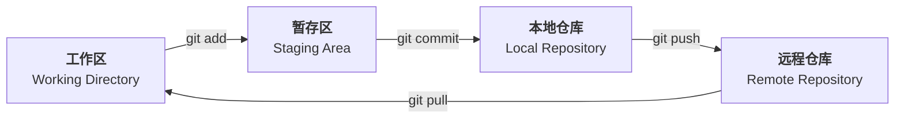
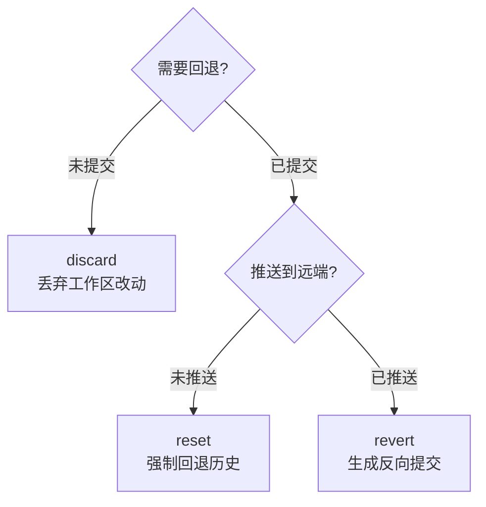
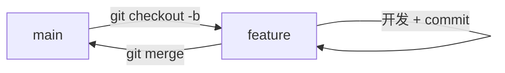
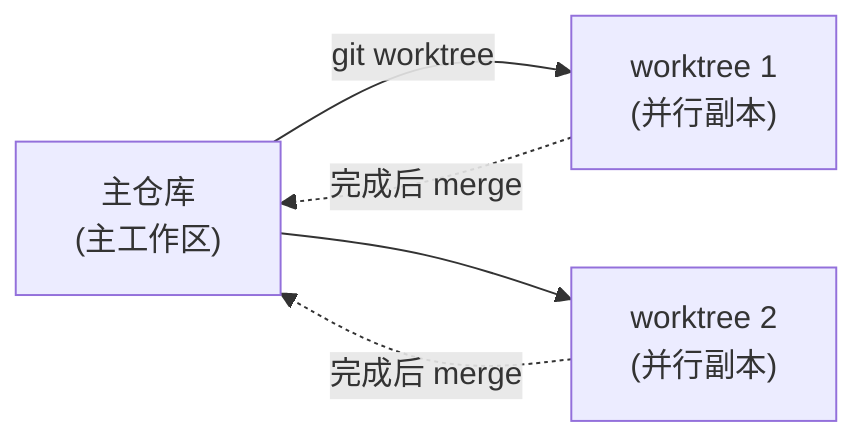
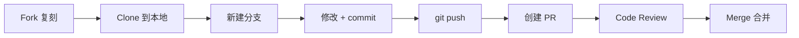
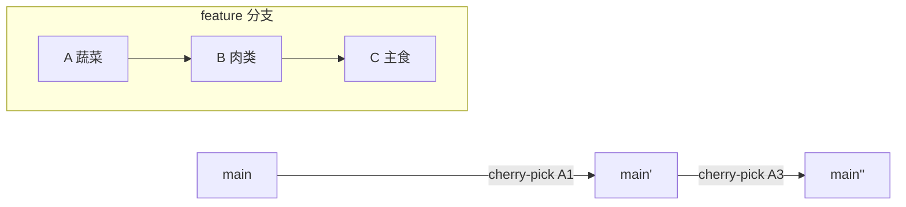
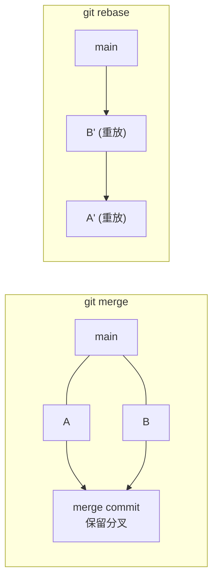

# Git 与 GitHub

> 本笔记涵盖 Git 版本控制与 GitHub 协作平台的核心概念、常用命令、多人协作流程及高级特性。
**参考链接**  
【Git+Github核心概念大串讲，从零到一全攻略，详细实战教程】 https://www.bilibili.com/video/BV1ySLc6QEcB/?share_source=copy_web&vd_source=9d34ca7f21db859ee3f136b49b89515d

# 一、Git 与 GitHub 概述

> 本节介绍版本控制、Git 与 GitHub 的基本概念和分区模型。

## Git 分区概念

Git 的数据流转分为四个核心区域：



| 分区 | 说明 |
| --- | --- |
| <span style="color:blue">工作区</span> (Working Directory) | 本地可见的普通文件目录，用户直接编辑修改文件的地方 |
| <span style="color:blue">暂存区</span> (Staging / Index) | 通过 `git add` 命令将工作区变更暂存的中转区域 |
| <span style="color:blue">本地仓库</span> (Local Repository) | 通过 `git commit` 将暂存区内容永久存储的版本库 |
| <span style="color:blue">远程仓库</span> (Remote Repository) | 通过 `git push` 同步到服务器的共享版本库 |

## 核心命令

```bash
git clone   <url>      # 克隆远程仓库到本地
git add     <file>     # 将工作区变更添加到暂存区
git commit  -m "msg"  # 将暂存区变更提交到本地仓库
git push               # 将本地仓库变更推送到远程仓库
git pull               # 拉取远程仓库最新变更
git merge   <branch>   # 合并分支变更
git fetch              # 获取远程仓库最新信息
```

## Git 是什么

> <span style="color:blue">Git</span> 是开源免费的 **<span style="color:blue">分布式版本控制系统</span>**，用 `commit` 记录每次完整快照。

**典型应用场景**：管理论⽂修改版本（第⼀版、第⼆版、定稿版等）、协同开发⼤型项⽬（处理成千上万⽂件）。

**核⼼<span style="color:green">优势</span>**：解决纯⼈⼯版本控制的复杂性，⽀持多⼈协同开发。

**仓库管理**：被 <span style="color:blue">Git</span> 管理的⽂件夹会⽣成 `.git` ⼦⽂件夹，使⽤ `commit` 作为版本控制基本单元，每次 `commit` 保存仓库完整快照，形成<span style="color:green">可回溯</span>的 `commit` 历史链路。

**仓库类型**：<span style="color:blue">本地仓库</span>运⾏在开发者个⼈电脑上，<span style="color:blue">远程仓库</span>是服务器上的备份仓库⽤于代码分享，可⾃⾏搭建或使⽤ GitHub 等托管服务。

## GitHub 是什么

> <span style="color:blue">GitHub</span> = Git + Hub，是全球最⼤的 **<span style="color:blue">代码托管与协作平台</span>**。

**名称解析**：<span style="color:blue">Git</span> 指版本控制系统，<span style="color:blue">Hub</span> 意为中⼼ / 集合。

**核⼼功能**：存储和分享 <span style="color:blue">Git</span> 仓库，⽀持多⼈协作开发。

**仓库类型**：<span style="color:green">公开仓库</span>可被搜索、浏览和学习（示例：Linux 内核、CPython 解释器、Nginx），<span style="color:orange">私有仓库</span>仅限指定⼈员访问。同类服务还包括 <span style="color:blue">Git</span>Lab、BitBucket 等，开源是计算机科学的基⽯与瑰宝。

# 二、环境准备与配置

> 本节介绍 Git、VS Code、GitHub 账号的安装与 AI Agent 的接入方法。

## Git 安装

### Windows 安装

```bash
# 推荐使用 winget 安装
winget install --id Git.Git -e --source winget
# 或访问 https://git-scm.com 下载安装包
```

访问 Git 官⽹下载 Windows 安装包，选择对应 CPU 架构（通常为 x86），运⾏安装程序并默认设置完成安装。

### Mac 安装

```bash
xcode-select --install   # 同意安装命令⾏⼯具包（包含 Git）
git --version            # 验证安装
```

## VS Code 安装

访问 VS Code 官⽹下载对应操作系统版本：Windows 系统直接运⾏安装程序，Mac 系统拖拽到 Applications ⽂件夹。验证命令 `code --version`。

## GitHub 账号注册

**注册流程**：访问 GitHub 官⽹点击 `Sign up` → 填写⽤户名、邮箱和密码 → 验证邮箱收取验证码。

> <span style="color:orange">注意</span>：国内⽤户可能需要特殊⽹络设置；建议使⽤常⽤邮箱注册；记住账号密码⽤于后续 Git 操作。

## 配置 AI Agent

**配置步骤**：在 GitHub 创建新仓库 → 复制仓库地址备⽤ → 使⽤ Codex 初始化本地项⽬ → 将本地项⽬与远程仓库关联。**关键操作**：通过 AI 辅助完成 Git 配置，需要授权 GitHub 账户访问，确保⽹络连接稳定。

## 环境验证

```bash
git --version    # Git 版本
code --version   # VS Code 运⾏状态
# GitHub 账号登录状态、 AI Agent 连接情况
```

> <span style="color:orange">常见问题</span>：⽹络连接问题、权限配置错误、环境变量未设置。

# 三、Git 本地基础操作

> 本节介绍仓库初始化、`.gitignore` 配置、提交、后悔药和分支等本地操作。

## 初始化仓库

> <span style="color:blue">git init</span> 命令将⼀个普通⽂件夹转变为 Git 管理的仓库。

```bash
cd my-project
git init
# 此时会⽣成隐藏的 .git ⼦⽂件夹
```

**操作步骤**：在 VS Code 中选择 `Open Folder` 打开任意⽂件夹（空或⾮空）→ 找到左侧 `Source Control` ⾯板 → 点击 `Initialize Repository` 按钮完成初始化。初始化成功后，⽂件夹内会⽣成隐藏的 `.git` ⼦⽂件夹，存储所有 Git 相关数据。

> <span style="color:red">删除</span> 此⽂件夹将取消 Git 管理。

## `.gitignore` 配置

`.gitignore` ⽂件⽤于声明仓库中 <span style="color:red">不应被 Git 管理</span> 的⽂件/⽬录。

**典型应⽤场景**：存储密钥的 `.env` ⽂件（安全考虑）、Node.js 项⽬的 `node_modules/` ⽬录（可通过 `npm install` 重新⽣成）。

**配置⽅法**：在仓库根⽬录创建 `.gitignore` ⽂件，每⾏写⼊⼀个略规则（⽬录需加斜杠，如 `node_modules/`）。

> <span style="color:green">最佳实践</span>：项⽬初始化时就应创建 `.gitignore`，避免误提交敏感或不必要⽂件。

## 提交 (commit)

`commit` 意为提交，每次提交保存仓库状态的完整快照，形成可回溯的历史链路。**操作流程**：创建/修改⽂件（如 `fruits.txt`）→ 在 `Source Control` ⾯板查看待提交⽂件→ 填写有意义的 commit message（说明本次修改内容）→ 点击 commit 按钮完成提交。

> <span style="color:green">AI 协作技巧</span>：让 AI 完成⼩功能点后⽴即提交，便于版本控制。

## Git 后悔药

> <span style="color:blue">后悔药三件套</span>：`discard`（未提交）→ `reset`（已提交未推送）→ `revert`（已推送）



| 操作 | 适用场景 | 操作方法 | 风险 |
| --- | --- | --- | --- |
| `discard` | 未提交的更改 | VS Code 点击 `Discard Changes` 按钮 | <span style="color:green">低</span>：仅影响工作区 |
| `reset` | 已提交未推送 | 命令行 `git reset <commit>` | <span style="color:red">高</span>：重写历史 |
| `revert` | 已推送 | 命令行 `git revert <commit>` | <span style="color:green">低</span>：不重写历史 |

> <span style="color:red">⚠ 警告</span>：<span style="color:red">多⼈协作分⽀禁⽤ reset</span>，重写历史会导致他⼈分⽀断裂；优先使⽤ <span style="color:green">revert</span>。

## 分支

> <span style="color:blue">分⽀本质</span>：指向某次 commit 的可移动指针，HEAD 指向当前分⽀。<span style="color:orange">分离头指针</span>状态（`HEAD` 直接指向某次历史提交）易丢失代码，应避免修改。



**分⽀四操作**：<span style="color:green">创建</span>（基于任意提交创建新分⽀，实质是指针操作）、**切换**（在 VS Code 左下⻆选择⽬标分⽀）、**合并**（使⽤ `git merge` 将特性分⽀合并回主⼲）、**删除**（切换⾄其他分⽀后删除⽬标分⽀）。<span style="color:green">⼯作模式</span>：每个开发者/Agent 在独⽴分⽀开发，完成后合并。

# 四、Git 高级特性

> 本节介绍工作树、合并冲突等高级功能。

## 工作树 (Worktree)



**本质**：创建新分⽀并将代码完整复制到新⽂件夹，主⽂件夹与⼯作树⽂件夹并⾏⼯作互不⼲扰，底层通过 <span style="color:blue">Git</span> 关联，改动可轻松合并回主⼲。<span style="color:green">适⽤场景</span>：需要并⾏开发测试时使⽤。创建⽅法：命令⾏ `claude --worktree <分⽀名>`，或图形界⾯右键项⽬选择 "创建永久⼯作树"。

## 合并冲突

> <span style="color:orange">冲突</span>：两个分⽀修改同⼀⽂件的同⼀⾏代码时，Git ⽆法⾃动合并，需要⼈⼯/AI 选择保留⽅案。

**解决⽅法**：让 AI 合并时遇到冲突暂停 → ⼈⼯选择保留⽅案：保留某⼀⽅改动，或合并双⽅改动（可指定顺序）。AI 通过⾃然语⾔交互简化了传统 git 冲突解决流程。

# 五、远程仓库实战

> 本节介绍远程仓库的创建、克隆、推送与同步等操作。

## 数据流转总览


## 暂存区的作用

暂存区作为 `commit` 前的准备区域，允许选择性提交部分⽂件改动。现代 Git ⼯具（如 VS Code）常将 `git add` 和 `git commit` 合并简化操作。

## 创建远端仓库

**创建步骤**：点击 GitHub 的 `New` 按钮 → 设置仓库名称（英⽂）→ 选择公开 (Public) 或私有 (Private) 属性 → 可选添加 `README`、`.gitignore` 和许可证⽂件。

**仓库属性区别**：<span style="color:green">公开仓库</span>代码对所有⼈可⻅，<span style="color:orange">私有仓库</span>仅⾃⼰可⻅。

## 克隆远端仓库到本地

**克隆流程**：复制 GitHub 仓库地址 → 在 VS Code 中选择 `Clone Repository` → 粘贴仓库地址 → 选择本地存储路径。**克隆效果**：⾃动创建本地仓库，⽣成⼯作⽬录，建⽴与远端仓库的关联。

## 本地提交到远端仓库

**提交流程**：在本地⼯作区修改/新增⽂件 → 执⾏ `git commit` 提交到本地仓库 → 点击 `Publish` 按钮推送到远端。

> <span style="color:red">权限限制</span>：只有仓库管理员或被授权⽤户才能 push 成功，<span style="color:red">不能直接 push 到他⼈仓库</span>。

## 本地仓库绑定远端仓库（第二种方法）

```bash
# 1. 初始化本地仓库
git init
# 2. 进⾏⾸次 commit
git add .
git commit -m "init"
# 3. 在 VS Code 点击 Publish 按钮
# 4. 设置远端仓库名称和属性(公开/私有)
```

**特点**：适⽤于已有本地项⽬的情况，推送后⾃动创建对应的远端仓库。

## 远端仓库改动同步到本地

```bash
git pull   # 相当于 git fetch + git merge
# 或在 VS Code 中点击 Sync Changes 按钮
```

**常⻅场景**：远端仓库直接修改（如 GitHub ⽹⻚端编辑）、协作者推送了新提交。**分⽀显示**：`origin/main` 表示远端分⽀，`main` 表示本地分⽀，箭头图标显示同步状态。

# 六、GitHub 网页入门

> 本节介绍 GitHub 网页界面、仓库管理、搜索、Issues、快捷键与在线开发环境。

## 仓库网址的构成

基本结构 `github.com/作者名/仓库名`，其中 `github.com` 是平台主域名，中间是开发者⽤户名，最后是仓库英⽂名称。

## 仓库界面与代码库

界⾯中央显示项⽬源代码。代码获取⽅式：直接浏览、点击 `Code` 按钮下载压缩包、执⾏ `git clone <仓库地址>`。Commit message 记录修改内容，最后更新⽇期反映项⽬活跃度，<span style="color:orange">⻓期未更新可能表示项⽬停⽌维护</span>。

## README 与 Releases

**README** ⾃动展示在仓库⻚⻚，包含项⽬简介、功能说明和使⽤⽅法。**Releases** 提供打包好的软件下载，包含版本号和更新内容，可选择历史版本下载。

## About、Star、Fork

**About 模块**显示项⽬简介、标签和开源协议。**Star** 类似点赞收藏，数量反映项⽬热度。**Fork** 将仓库复制到⾃⼰的账户，可⽤于学习源码或⼆次开发，也可通过 Pull Request 贡献代码。

## 搜索功能

**局部搜索**在当前仓库内查找内容，**全局搜索**可搜索整个 GitHub 平台，⽀持⽂件名、代码内容搜索及⾼级搜索语法。

## Issues 功能

**Issues** 是与项⽬作者讨论的平台，可报告 bug 或提出新功能<span style="color:orange">建议</span>。状态分 <span style="color:orange">`Open`</span>（未解决）和 <span style="color:green">`Closed`</span>（已解决）。

## GitHub 快捷键

| 快捷键 | 功能 |
| --- | --- |
| <span style="color:blue">/</span> | 快速打开 GitHub 的全局搜索功能栏 |
| <span style="color:blue">t</span> | 在仓库⻚⾯快速定位到⽂件搜索栏，⽀持按⽂件名搜索 |
| <span style="color:blue">l</span> | 快速跳转到指定⾏号（如输⼊ 33 跳转到 33 ⾏） |
| <span style="color:blue">?</span> | 打开快捷键速查表 |
| <span style="color:blue">gi</span> | 快速进⼊ issues ⻚⾯（先按 g 再按 i） |
| <span style="color:blue">gc</span> | 快速查看代码（go to code） |

**⾏操作功能**：`Copy line` 复制当前⾏、`Copy perm link` 复制永久链接、`git blame` 查看提交历史和贡献者。

## 在线开发环境

按 <span style="color:blue">.</span> (句号键) 可在⽹⻚版 VS Code 中打开当前仓库，即 **`Codespaces`**：云端开发环境（⽀持双核 8GB 内存配置），可在浏览器中调试代码，通过右上⻆ `Run` 按钮执⾏代码（如 Python 脚本）。调试时优先使⽤ **Codespaces** ⽽⾮本地环境。

## 注意事项

始终可通过 <span style="color:blue">?</span> 键调出速查表；调试时优先使⽤ `Codespaces` ⽽⾮本地环境；在 `issues` ⻚⾯可使⽤ `is:issue is:open` 等过滤器搜索。

# 七、GitHub 多人协作

> 本节介绍 Fork、PR、Code Review、Cherry Pick、Rebase 等多人协作流程。

## 协作流程总览



## 贡献代码前的准备：复刻项目

贡献者点击 **Fork** 按钮将项⽬复制到⾃⼰的账户下，这是贡献代码的第⼀步。复刻后项⽬会出现在贡献者⾃⼰的 <span style="color:blue">Git</span>Hub 账户下。点击 `Create fork` 即可完成复刻。

> <span style="color:orange">权限说明</span>：贡献者没有直接修改原项⽬的权限，必须通过复刻创建个⼈副本后才能进⾏修改。

## 本地修改：克隆与分支创建

在复刻后的项⽬中点击 `Code` 获取项⽬地址，使⽤ VS Code 的克隆功能将项⽬下载到本地。<span style="color:red">修改代码前必须先创建新分⽀，避免直接在 main 分⽀上修改</span>，这样可以防⽌后续同步代码时产⽣冲突。**修改流程**：通过 VS Code 左下⻆菜单创建分⽀ → 进⾏代码修改 → 提交 commit → 点击 `Publish` 推送⾄ GitHub。

## 例题 1：提交改动与创建合并请求

修改完成后将分⽀推送到 <span style="color:blue">Git</span>Hub，可以在对应分⽀看到提交记录。通过 `Compare & pull request` 按钮创建合并请求 (**PR**)，将⾃⼰的修改合并回原项⽬。**PR** 会清晰展示两个分⽀间的代码差异，便于管理员审核。

## 合并请求的审核与合并

Pull Request (PR) 是合并请求的提案，贡献者提议将⾃⼰的分⽀合并到主⼲分⽀。项⽬管理员会进⾏ code review（代码审核），可能提出修改意⻅，确认⽆误后才会同意合并。协作流程：复刻项⽬ → 创建分⽀ → 修改代码 → 提交 PR → 等待审核 → 合并完成。

## 例题 2：同步母项目代码与解决冲突

同步必要性：在创建 **PR** 前必须先将⺟项⽬的最新代码同步到⾃⼰的分⽀，确保没有<span style="color:red">冲突</span>。

<span style="color:red">冲突</span><span style="color:orange">预防</span>：当主⼲和特性分⽀同时修改相同⽂件时会产⽣<span style="color:red">冲突</span>，应先在本地解决<span style="color:red">冲突</span>再提交 **PR**。

<span style="color:green">最佳实践</span>：始终保持特性分⽀与主⼲同步，可以⼤⼤减少合并时的<span style="color:red">冲突</span>可能性。

## Codex 操作演示

操作前需先将分⽀切换为 feature 分⽀。当合并⺟项⽬遇到冲突时，Codex 会提示⽤户选择处理⽅式（如选择 "两个都保留"）。最终采⽤樱桃合并⽅式同步⼦项⽬与⺟项⽬的最新改动。

## 推送本地改动并创建 PR

```bash
git push                  # 推送 feature 分⽀
git push -f               # 必要时强制推送
```

明确合并⽅向：⼦项⽬ <span style="color:blue">feature</span> 分⽀ → ⺟项⽬ <span style="color:blue">main</span> 分⽀。填写清晰 `PR` 标题（如 "⽔果清单，增加更多⽔果"）。

## 管理员处理合并请求

**审核流程**：管理员通过 `File changes` 查看提交代码，可提出修改建议或直接批准。**合并操作**：点击 `Merge` 按钮确认合并，系统⾃动更新贡献者列表。

## 协作者设置与直接推送代码

**协作者添加**：路径 `Settings` → `Collaborators` → `Add people`，需被添加者在 GitHub 收件箱确认邀请。**权限优势**：免去 fork 步骤，可直接创建分⽀并 push 到远端仓库，提交 PR 前需先合并主⼲最新改动。

## Cherry Pick（拣选提交）



**应⽤场景**：当需要将特定分⽀的某些提交（⽽⾮全部）合并到当前分⽀时使⽤。例如 feature 分⽀有 3 次提交（蔬菜清单、⾁类清单、主⻝清单），但只需要合并其中两次。

```bash
# 1. 复制⽬标提交的 ID
# 2. 在⽬标分⽀执⾏ cherry-pick
git checkout main
git cherry-pick <commit-id-1>
git cherry-pick <commit-id-3>
```

<span style="color:green">效果验证</span>：通过查看分⽀历史记录，确认只有选择的特定提交被合并（如蔬菜和主⻝提交），未选择的提交（如⾁类）则不会包含，且不会产⽣额外的 `merge` commit 记录。

## Rebase 变基



**定义**：变基操作属于 Git ⾼级操作，通过改变提交的基准点来整理提交历史。与 merge 相比，rebase 不会⽣成 "Merge branch..." 这类合并提交记录，而是将当前分⽀的提交 "嫁接" 到⽬标分⽀的最新提交之后。<span style="color:green">适⽤场景</span>：适合个⼈开发分⽀整理历史，<span style="color:red">不适合多⼈协作分⽀</span>。

```bash
# 命令格式：git rebase <⽬标分⽀>
git checkout feature
git rebase main
# 完成后必须强制推送
git push -f
```

**执⾏步骤**：确保当前位于需要变基的分⽀（如 feature 分⽀）→ 执⾏ rebase 命令指向⽬标分⽀（如 main 分⽀）→ 处理可能的冲突（如有）→ 完成变基后必须使⽤强制推送 `git push -f`。**注意事项**：变基后原提交会⽣成新的提交 ID（如 C2 变为 C2'），原分⽀的根基提交会变更到⽬标分⽀的最新提交。

> <span style="color:red">⚠ 警告</span>：<span style="color:red">强制推送覆盖远端历史</span>，<span style="color:red">多⼈协作分⽀绝不可⽤</span> <span style="color:red">git push -f</span>。

**操作结果验证**：

**历史记录特征**：提交历史变为线性结构（如 main 的 C3→C4→C5→feature 的 C2'），原合并分⽀的提交会按时间顺序重新排列，不会出现合并冲突产⽣的特殊提交记录。**强制推送必要性**：因为分⽀根基已改变，普通推送会被拒绝，强制推送前需确保没有其他协作者基于旧历史进⾏开发。

## 知识小结

| 要点 | 说明 | 注意事项 | 重要度 |
| --- | --- | --- | --- |
| <span style="color:blue">HEAD</span> 指针 | 指向当前所处的 commit 位置；分离头指针（detached <span style="color:blue">HEAD</span>）状态易<span style="color:red">丢失</span>代码 | 避免在分离头指针状态修改代码 | <span style="color:red">★★★</span>☆☆ |
| 后悔药操作 | discard 放弃未提交更改；reset 强制回退历史版本；revert 生成反向提交 | **多人协作分支<span style="color:red">禁用</span> reset**，优先用 revert | <span style="color:red">★★★★</span>☆ |
| Work Tree | 创建分支的物理副本文件夹，与主仓库并行开发 | 需通过 `merge` 将改动合并回主干 | <span style="color:red">★★★</span>☆☆ |
| 合并<span style="color:red">冲突</span> | 多个分支修改同一文件同一行时需人工/AI 解决<span style="color:red">冲突</span> | AI 可辅助选择保留内容（如 西瓜+草莓） | <span style="color:red">★★★★</span>☆ |
| <span style="color:blue">Git</span> 分区 | 工作区 → 暂存区 → 本地仓库 → 远端仓库 | VS Code 默认合并 add 和 commit 操作 | <span style="color:red">★★★</span>☆☆ |
| 远端协作 | clone 下载仓库；push 上传代码；pull 同步远端改动（含 fetch+`merge`） | **无权限无法直接 push 他人仓库** | <span style="color:red">★★★</span>☆☆ |
| <span style="color:blue">Git</span>Hub 功能 | **Fork** 复制项目；`Pull Request` 合并请求；`Issues` 问题讨论；<span style="color:blue">Releases</span> 版本发布 | **公开仓库代码可被所有人查看** | <span style="color:red">★★</span>☆☆☆ |
| Cherry Pick | 选择性合并特定提交（如仅合并蔬菜+主食提交） | 需手动指定 commit ID | <span style="color:red">★★★★</span>☆ |
| Stash | 临时存储未完成代码（如紧急切换分支时） | 区别于暂存区（<span style="color:blue">Staging Area</span>） | <span style="color:red">★★★</span>☆☆ |
| Rebase 变基 | 更改分支根基，保持提交历史线性整洁 | **必须<span style="color:red">强制推送</span>（`git push -f`），多人分支<span style="color:red">禁用</span>** | <span style="color:red">★★★★★</span> |
