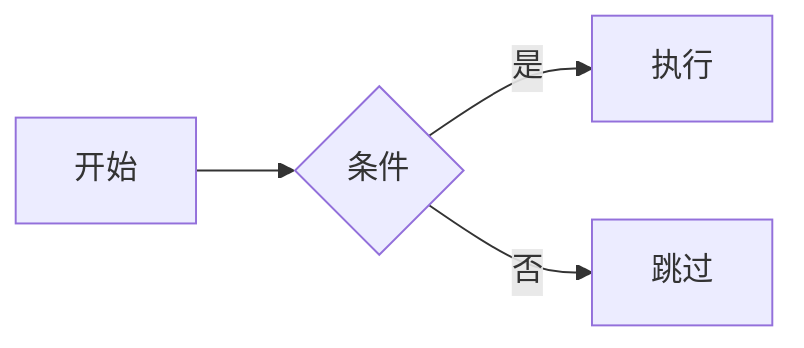
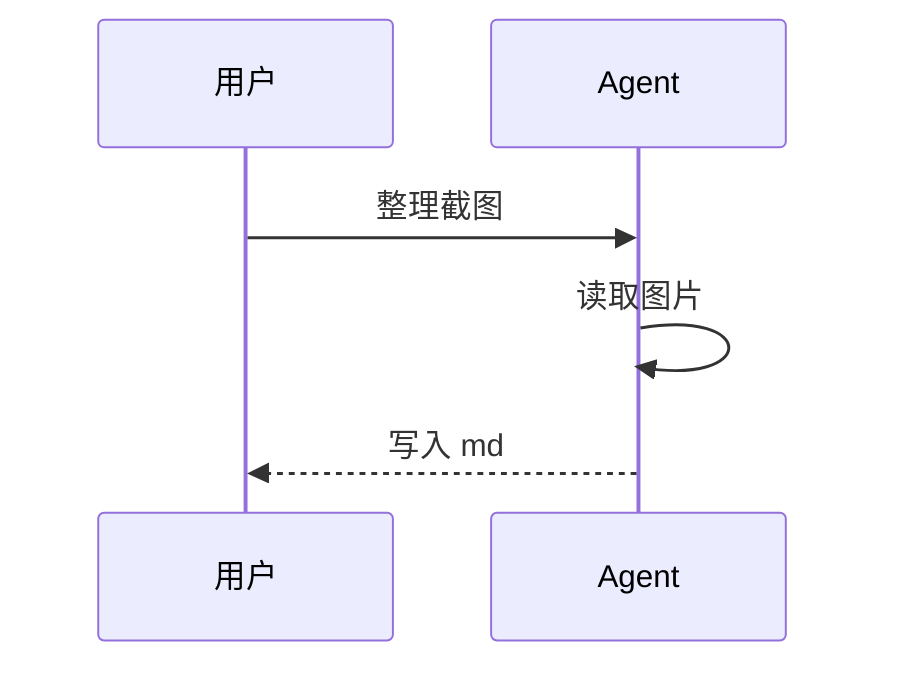

# Java 学习笔记整理工作流 SOP

> 本文档是 `e:\myNote\javaLearn` 项目的标准作业流程（SOP），所有 agent 会话都应遵守。
> 用户的项目记忆摘要另见 `c:\Users\xkl51\.trae-cn\memory\projects\-e-myNote-javaLearn--p2-530d9051e84b678c99a3\project_memory.md`，本文件是其详细展开版。

---

## 1. 项目结构与映射

### 1.1 顶层目录

```
e:\myNote\javaLearn\
├── Java学习\          ← 截图源目录（用户维护）
│   ├── 1.Java核心与AI开发基础\
│   └── 2.Java核心与AI开发进阶\
├── Java笔记\          ← 笔记产出（agent 维护）
│   ├── 1.Java核心与AI开发基础.md
│   └── 2.Java核心与AI开发进阶.md
└── .trae\documents\   ← 流程与辅助文档（本文件所在地）
```

### 1.2 课程 → md 映射

| 课程目录 | 目标 md |
| :--- | :--- |
| `Java学习\1.Java核心与AI开发基础\` | `Java笔记\1.Java核心与AI开发基础.md` |
| `Java学习\2.Java核心与AI开发进阶\` | `Java笔记\2.Java核心与AI开发进阶.md` |

**强约束**：截图必须整理到与课程同名的 md 中，不允许跨课程混排。

### 1.3 章节 → H2 映射

每个课程目录下由用户按章节创建子文件夹，命名约定：

```
<序号>.第X章 <章节名>\
```

- 序号：`0`、`1`、`2`… 用阿拉伯数字（不必补零，但保持一致）
- 章节名前缀可省略，例如 `1.第一章 开发环境搭建` 或 `0.第零章 导学部分`
- 章节名会作为 md 中的 H2 标题（H2 = `## 第X章 <章节名>` 或 `## <章节名>`，具体由章节子文件夹名决定）

---

## 2. 用户端操作流程

### 2.1 用户一次性动作

1. 在 `Java学习\<课程>\` 下创建章节子文件夹，命名 `<序号>.第X章 <章节名>`
2. 在 `Java笔记\` 下创建对应课程的 md 文件，命名 `<课程同名>.md`，**只写一个 H1 标题**（agent 不再写 H1）

### 2.2 用户每次新增截图

1. 观看网课时截图
2. 将截图移动到对应章节子文件夹
3. 按出现顺序命名：
   - 第零/一/二章：`1.png` `2.png` `3.png` ……（自然升序）
   - 第三章等：`幻灯片1.PNG` `幻灯片2.PNG` ……（用户原命名，agent 不改名）
4. 通知 agent 整理（本对话中即「继续整理」）

> **不要**：不要把多个章节的截图放进同一文件夹；不要用非数字前缀（如 `a1.png`）命名。

---

## 3. Agent 端标准作业流程

每次接到「整理」指令，按以下顺序执行：

### 3.1 探查阶段

1. 读取本 SOP 文档 + 项目记忆，确认无重大变更
2. 用 `LS` 扫描两个课程目录的章节子文件夹
3. 用 `LS` 列出每个章节子文件夹的 PNG 文件，按文件名**自然升序**排序
4. 用 `Read` 读取目标 md 的**当前内容**和**总行数**，确认：
   - 已有哪些 H2 章节（避免重复追加）
   - 是否有目录区需要更新
5. 与用户确认本次要整理的章节范围（如未明确）

### 3.2 阅读阶段

1. 用 `Read` 逐张读取 PNG（系统会自动转述图片内容）
2. 跳过明显重复的目录页、装饰页（保留原则：宁多勿漏，对不确定的可保留并在汇报中说明）
3. 按内容归类为 H3 小节；同一 H3 跨多张图时，合并整理
4. 提炼关键信息：
   - 表格 → md 表格
   - 代码 → 代码块（含语言标签）
   - 流程/关系 → mermaid 图
   - 重点词 → `<span style="color:red">`、`<span style="color:orange">`、`<span style="color:green">`、`<span style="color:blue">`
   - 金句 → `> ` 引用块

### 3.3 写入阶段

1. 用 `Edit` 在 md 末尾追加 H2 章节（H2 标题 = 章节子文件夹名去掉前导序号，例如 `0.第零章 导学部分` → `## 第零章 导学部分`）
2. 在 H2 之下，按 H3 顺序写小节
3. **不写**任何文件头/尾元信息（详见第 5 节禁用项）
4. 若 md 已有目录区（H1 之后、第一个 H2 之前的列表），同步追加本次新增的 H2/H3 锚点链接

### 3.4 汇报阶段

简明报告（≤ 4 行）：

```
本次整理：<N> 张 → 课程 <X> 第<Y>章 → <md 文件名>（H2 + <K> 个 H3）
```

---

## 4. md 格式约定

### 4.1 强调工具箱

| 场景 | 用法 | 示例 |
| :--- | :--- | :--- |
| 表格 | md 表格 | 见下 |
| 重点词 | HTML 颜色 | `<span style="color:red">重点</span>` |
| 关键提示 | 引用块 | `> 注意：xxx` |
| 流程图 | mermaid | 见下 |
| 代码 | 代码块 + 语言标签 | ` ```java ` |
| 标题 | H1（仅一次）/H2（章节）/H3（小节） | `## 第三章 Java 基础语法` |

### 4.2 颜色使用规范

- <span style="color:red">红色</span>：必须牢记、易错点
- <span style="color:orange">橙色</span>：次重点、注意事项
- <span style="color:green">绿色</span>：正面、推荐做法
- <span style="color:blue">蓝色</span>：名词、术语、定义

### 4.3 mermaid 模板

````markdown

````

````markdown

````

### 4.4 mermaid 写法禁用项（用户 2026-08-21 反馈的渲染错误）

> IDE 预览插件（Markdown Preview Mermaid Support）会对部分写法报错，**必须规避**：

- ❌ **禁止用中文 `subgraph` 名直接做边目标**：`subgraph 方法区 ... end` 之后又写 `方法区 --> 栈内存` 会渲染失败
- ❌ **禁止用 `subgraph` 名做链式箭头**：`A --> B --> C` 当 A/B/C 是 subgraph 名时会报错
- ❌ **禁止用单字符标签 `-.X.->`**：单字符 X 作为虚线标签解析失败。改用 `-. × .-` 或 `-. 断 .->`
- ✅ **推荐做法**：内存图/分区图**去掉 `subgraph` 包装**，用独立节点 `A --> B --> C` 链式箭头；节点文本用 `"..."` 包裹以正确显示 `<br/>` 换行
- ✅ 跨区域关系用 `linkStyle` 或箭头文字 `-->|说明|->` 表达，不要靠 subgraph 名字连边
- 理由：用户希望 mermaid 在 IDE 一打开就成功渲染，无需手动改写

---

## 5. 禁用项（红线）

> 这些规则来自用户**明确要求**，违反任何一条都会重做。

- ❌ **不写文件头元信息**：H1 之后不写「本文档由 agent 整理」「来源路径」「整理时间」
- ❌ **不写文件尾脚注**：md 末尾不写「整理完成。共处理 N 张截图」
- ❌ **不嵌入图片引用**：不写 `` 或 ``，md 中只整理文字
- ❌ **不写「来源：xxx.png」**：不标注每条内容来自哪张截图
- ❌ **不写「请人工核对」类免责声明**：agent 应尽力读懂并整理，对读不懂的可跳过并在汇报中说明
- ❌ **不擅自改名/移动用户的 PNG 文件**
- ❌ **不在md表格使用颜色标签**
- ❌ **不在笔记添加与学习无关的声明**


**允许的元信息**：
- ✅ md 顶部的目录列表（用户首条消息中提到希望保留目录导航；如有则追加新章节的锚点链接）
- ✅ mermaid 图、表格、引用块、代码块中需要的少量元信息（如代码注释）

---

## 6. 典型场景

### 6.1 用户新建一个章节文件夹并放入截图

1. 用户：「我建了 `第四章 流程控制` 文件夹，放了 30 张截图，整理一下」
2. Agent 探查 → 确认目标 md → 读取 30 张 → 追加 H2 + H3 → 汇报

### 6.2 用户往已有章节追加截图

1. 用户：「第三章又加了 5 张，从 48 开始命名，整理一下」
2. Agent 探查时检查 `幻灯片1.PNG` ~ `幻灯片47.PNG` 是否已在 md 中体现
3. 只读 48~52 五张，**追加到第三章已有 H2 末尾的新 H3**（或在末尾新增 H3）
4. 不重复写已经整理过的内容

### 6.3 用户开始第二门课

1. `Java学习\2.Java核心与AI开发进阶\` 出现新章节
2. Agent 确认 `Java笔记\2.Java核心与AI开发进阶.md` 是否只有 H1
3. 若是空模板，按 SOP 正常整理
4. 若是中途加入的旧内容，先 Read 全文避免重复

### 6.4 章节截图顺序混乱

1. Agent 主动按文件名自然升序读取
2. 若用户用了非数字前缀（如 `a1.png` `b2.png`），停下来问用户：「希望按什么顺序读？」

### 6.5 出现重复/装饰页

- 跳过目录页、空白页、纯装饰页
- 汇报中说明跳过了几张、原因
- 对不确定是否要保留的页，**保留**并标注

---

## 7. 探查阶段输出模板

每次接到整理任务，先在内部/汇报中输出以下探查结果：

| 项 | 值 |
| :--- | :--- |
| 课程 | `1.Java核心与AI开发基础` |
| 目标 md | `Java笔记\1.Java核心与AI开发基础.md` |
| md 当前状态 | N 行，已有 H2：xxx、yyy |
| 本次章节 | `0.第零章 导学部分`（20 张） |
| 待读 PNG | 1.png ~ 20.png |
| 预估 H3 数 | 3~6 个（视内容而定） |

---

## 8. 验证步骤

每次写入完成后，执行：

1. `Read` 目标 md 最后 30 行，确认新增内容已正确追加
2. 检查没有触发第 5 节任何禁用项
3. 检查 H2 标题与章节子文件夹名一致（去前导序号）
4. 检查 mermaid 代码块格式（` ```mermaid ` 起止配对）
5. 简短汇报（≤ 4 行）

---

## 9. 附录：当前项目状态快照（2026-08-21）

> 此为**检查时刻**的状态描述，下次会话时请重新探查，不要依赖此快照。

| 课程 | 章节文件夹 | 截图数 | md 状态 |
| :--- | :--- | :---: | :--- |
| 1.Java核心与AI开发基础 | 0.第零章 导学部分 | 20 | ✅ 已整理（20→9 H3） |
| 1.Java核心与AI开发基础 | 1.第一章 开发环境搭建 | 28 | ✅ 已整理（28→5 H3） |
| 1.Java核心与AI开发基础 | 2.第二章 IDEA开发工具 | 13 | ✅ 已整理（13→3 H3） |
| 1.Java核心与AI开发基础 | 3.第三章 JAVA基础语法 | 47 | ✅ 已整理（47→6 H3） |
| 1.Java核心与AI开发基础 | 4.第四章 运算符 | 62 | ✅ 已整理（62→10 H3） |
| 1.Java核心与AI开发基础 | 5.第五章 方法 | 57 | ✅ 已整理（57→9 H3） |
| 1.Java核心与AI开发基础 | 6.第六章 流程控制语句 | 74 | ✅ 已整理（74→9 H3） |
| 1.Java核心与AI开发基础 | 7.第七章 数组 | 67 | ✅ 已整理（67→8 H3） |
| 1.Java核心与AI开发基础 | 8.第八章 面向对象基础 | 86 | ✅ 已整理（86→9 H3） |
| 1.Java核心与AI开发基础 | 9.第九章 面向对象高级 | 147 | ✅ 已整理（147→11 H3） |
| 1.Java核心与AI开发基础 | 10.第十章 常用API | 44 | ✅ 已整理（44→3 H3） |
| 1.Java核心与AI开发基础 | 11.第十一章 集合基础 | 61 | ✅ 已整理（61→5 H3） |
| 2.Java核心与AI开发进阶 | （无） | 0 | 仅 H1（空模板） |

合计：706 张全部整理完毕，12 个章节写入 `1.Java核心与AI开发基础.md`。

---

## 10. 变更日志

| 日期 | 变更 |
| :--- | :--- |
| 2026-08-21 | 首次创建本 SOP。综合用户首条消息规则 + 之前会话沉淀，更新映射、流程、格式、禁用项、场景、探查模板、验证。108 张截图暂不处理。 |
| 2026-08-21 | 完成第零~三章整理（共 108 张 → 4 个 H2 章节），状态快照更新。 |
| 2026-08-21 | 完成第四~五章整理（共 119 张 → 2 个 H2 章节），状态快照更新；新增「方法区/栈内存」mermaid 流程图。 |
| 2026-08-21 | 完成第六章整理（74 张 → 9 H3），状态快照更新。 |
| 2026-08-21 | 完成第七章整理（67 张 → 8 H3），状态快照更新。 |
| 2026-08-21 | 完成第八章整理（86 张 → 9 H3），状态快照更新。 |
| 2026-08-21 | 完成第九章整理（147 张 → 11 H3：继承/Object/final/抽象类/接口/抽象vs接口/多态/代码块/包/内部类/Lambda），状态快照更新。 |
| 2026-08-21 | 完成第十章整理（44 张 → 3 H3：常用API概述/String类/StringBuilder类），状态快照更新。 |
| 2026-08-21 | 完成第十一章整理（61 张 → 5 H3：集合概述/ArrayList/创建集合/常用成员方法/集合练习），状态快照更新。 |
| 2026-08-21 | 用户反馈两处 mermaid 渲染错误（L2623-2635 一个数组内存图、L2698-2707 空指针异常）。修复方案：去掉 subgraph 包装 + 改写 `.X.` 标签。同步新增 §4.4 mermaid 写法禁用项 + §5 禁用项追加 mermaid 红线。 |
