# Java核心与AI开发基础

## 目录

- [第零章 导学部分](#第零章-导学部分)
- [第一章 开发环境搭建](#第一章-开发环境搭建)
- [第二章 IDEA 开发工具](#第二章-idea-开发工具)
- [第三章 Java 基础语法](#第三章-java-基础语法)
- [第四章 运算符](#第四章-运算符)
- [第五章 方法](#第五章-方法)
- [第六章 流程控制语句](#第六章-流程控制语句)
- [第七章 数组](#第七章-数组)
- [第八章 面向对象基础](#第八章-面向对象基础)
- [第九章 面向对象高级](#第九章-面向对象高级)
- [第十章 常用 API](#第十章-常用-api)
- [第十一章 集合基础](#第十一章-集合基础)

## 第零章 导学部分

> AI 智能应用开发（Java）导学视频 —— 融合 Java 核心技术与 AI 创新能力
> 多一句没有，少一句不行。用更短的时间，教会更实用的技术

### 课程介绍

#### 课程定位与能力要求

| 就业方向 | 岗位技术力 | 专业技能 & 项目经验 | 课程阶段 |
| :--- | :--- | :--- | :--- |
| **Java+AI 初级工程师**（1~2 年经验）<br>参与软件需求分析、负责代码模块功能实现、抽象系统能力、参加设计文档及系统能力，重大项目主导设计能力 | **6 门技术** + **整体项目经验** + **第三方方案** | 掌握 Java 核心语法、集合、多线程、IO/NIO、掌握 JVM 内存模型与 GC 机制、熟练使用 Spring Boot + MyBatis 开发 Web 应用、掌握分布式技术架构设计、熟悉 Kafka/MQ/Redis 中间件、掌握 MySQL/MongoDB 分布式存储与读写分离、掌握 Java 集合综合使用…… | **第一阶段**：Java 核心与 AI 开发基础<br>**第二阶段**：Java 核心与 AI 开发进阶 |
| **Java+AI 中级工程师**（3~5 年经验）<br>参与技术方案选型与设计、解决疑难问题、调优与扩展能力、参与重大项目主导设计能力 | **第三方技术** + **分布式项目经验** + **AI 智能体应用开发** | 掌握微服务架构、Spring Cloud（Nacos/Sentinel/Seata）、微服务分布式事务、RabbitMQ 消息中间件、Redisson 分布式锁；熟练使用 Java 集合高级 API、Stream API、NIO、Netty；掌握 JVM 调优、SQL 调优；Redis 高级优化等技术；微服务高可用技术；分布式系统架构设计；微服务架构设计 | 第三阶段：AI 智能 Web 开发<br>第四阶段：企业级智能体项目（神州养车）<br>第五阶段：微服务 SCA<br>第六阶段：互联网分布式微服务项目（云岚到家）<br>第八阶段：沉浸式项目实战（神州养车）<br>第九阶段：Java AI 智能体应用开发<br>第十阶段：BAT 大厂 360° 测试开发 / 就业指导 |
| 能够清晰地表达自己的技术能力和项目经验 | — | — | — |
| 构建「**Java 核心 + AI 创新**」复合竞争力 | — | 掌握核心概念和技术，深入理解大模型智能体技术概念，包括提示词数据微调（Prompt Tuning）和特征改进微调（PET/Tuna）开源模型应用技术 | 雷达拓展课：分布式项目集<br>雷达拓展课：AI 大模型开发实战 |

#### 课程总目标与时长

| 总目标 | 学习时长 | 课程阶段 | 任务包 | 学习周期 |
| :--- | :--- | :--- | :---: | :--- |
| **通过系统学习和实战项目，达到企业招聘需求，实现高薪就业** | **每周 ≥ 24 小时**<br>（视频时长 12 小时，练习时长 12 小时） | 第一阶段：Java 核心与 AI 开发基础 | 19 | 3 周（约 72 小时） |
| | | 第二阶段：Java 核心与 AI 开发进阶 | 12 | **2 周+**（约 56 小时） |
| | | 第三阶段：AI 智能 Web 开发 | 18 | 7 周（约 168 小时） |
| | | 第四阶段：企业级智能体项目（神州养车） | 15 | 4 周（约 96 小时） |
| | | 第五阶段：微服务 SCA | 15 | 3 周（约 72 小时） |
| | | 第六阶段：互联网分布式微服务项目（云岚到家） | 14 | 4 周（约 96 小时） |

### 学习计划

#### 什么是任务包？

> **任务包**是老师为了帮助我们学好 Java 开发技能，将各阶段内容带分出的具体学习单元。每个任务包围绕学习目标展开，包含一系列具体的学习材料（视频、练习题等）以及预估学习时长，助力我们逐步达成学习目标，扎实吸收知识，实现高效学习。

#### 任务包组成

| 维度 | 组成 | 详细说明 |
| :--- | :--- | :--- |
| **学习目标**（技能点） | 学习目标 | 每个任务包都有明确的学习目标，结合具体技能点。告诉你学完后要达到什么水平。例如：「Java 开发环境搭建」任务包中有三个技能点。 |
| | 技能点掌握要求 | 技能点 1：JDK 的下载和安装<br>技能点 2：配置环境变量、path 环境变量配置<br>技能点 3：使用 IDE 编写并运行 Java 代码<br>**要求：不仅要看得懂，还要弄清楚运行环境中的概念，能够跟别人讲解自己写下来**<br>举例 2：使用 IDEA 编写并运行 Java 代码<br>备注：通过实际操作，比如编写和运行简单的 Java 程序，确保能灵活运用这些知识解决实际问题。 |
| **学习材料** | 视频教程 | 详细讲解每个技能点，帮助你理解和掌握知识。 |
| | 知识总结 | 通过思维导图，快速复习所学技能点。 |
| | 练习题 | 通过实际操作巩固知识，提升应用能力。 |
| **质量验收** | 练习题 | 每个任务包都有练习题，帮助我们巩固所学知识。 |
| | 章节测评 | 每个关键章节结束后，有测评来检查学习进度。 |
| | 阶段考试 | 每个阶段结束后，老师会和我们对一对面试，检查编写能力；沟通表达能力。确保真正掌握了知识。 |
| **时间规划** | 任务包总时长 | 明确视频学习、练习和测评的预估时长，帮助我们合理安排时间。 |
| | 周计划 | 根据每周可投入的学习时间，合理分配任务包数量，确保学习进度和质量。 |

#### 任务包能带来什么好处？

| 维度 | 好处 |
| :--- | :--- |
| **明确学习目标** | 每个任务包都有清晰的目标，结合具体的技能点和掌握要求，让我们清楚地知道要达成什么。集中精力在关键知识点上，提高学习效率。 |
| **系统化学习路径** | 通过分步骤的任务包，循序渐进地完成完整的学习体系，帮助我们更好地理解和掌握复杂内容。 |
| **高效时间管理** | 提供预估的学习时长和周计划，帮助我们合理安排时间，平衡学习与生活。 |
| **提升学习动力** | 每完成一个任务包，我们都能获得成就感，激发和保持热情，让我们设定确保每个阶段都有反馈和奖励。 |
| **易于跟踪进度** | 通过练习题、章节测评和阶段测试，清晰跟踪学习进度，及时调整学习计划，确保始终在正确的轨道上前进。 |

#### 学习平台：博学谷

> 线上学习灵活，每日任务量可动态调整，但要确保周计划整体完成。
> 平台提供日历视图，每日展示具体任务（前端学科就业班、Java 后端开发、20 天下载安装、学习阶段汇总、开发 Java 程序等），支持打卡、查看学习路线。

### 学习方法

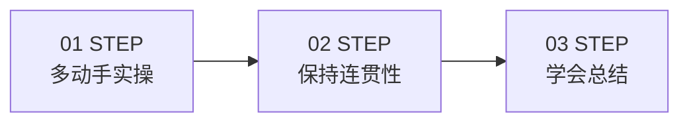

> 学习 Java 的三大步骤：<span style="color:red">多动手实操</span> → <span style="color:orange">保持连贯性</span> → <span style="color:green">学会总结</span>

### 学后测评

| 测评类型 | 用途 |
| :--- | :--- |
| **任务包练习** | 巩固任务包所学知识；编程题无需上传代码，提交后即可查看参考答案 |
| **章节测评** | 关键章节结束后的阶段检查 |
| **阶段考试** | 阶段性的综合考试，含面试问答 |

> 任务包练习示例（Java 核心与 AI 开发基础-任务包一[开发环境搭建]）：在 IntelliJ IDEA 中完成以下操作，创建一个 Java 工程并实现一个简单的打印功能。
>
> ①创建工程：打开 IntelliJ IDEA，创建一个名为 JavaSePractices 的空工程。
> ②创建模块、包、类：在 JavaSePractices 工程中，创建一个名为 chapter01 的模块。在 chapter01 模块下，创建一个名为 com.buxuegu.demo01 的包。在 com.buxuegu.demo01 包中，创建一个名为 Test01 的类。
> ③编写代码：在 Test01 类中，使用 main 方法打印 `hello world` 的控制台。
> ④运行程序：运行 Test01 类，确保控制台输出以下内容：`hello world`

### Java 的应用领域

> <span style="color:red">Java 语言拥有 27 年发展历史，长盛不衰，是大型软件的服务端开发首选语言。</span>

| 类别 | 典型应用 |
| :--- | :--- |
| 互联网应用 | 抖音、京东、快手、QQ、淘宝、美团、微信、今日头条、钉钉 |
| 资讯社区 | 知乎、豆瓣、CSDN、猫眼、中国知网 |
| 游戏 / 工具 | 任天堂 |

### Java+AI 工程师的核心能力

> <span style="color:red">Java 核心功夫是王道</span> —— 不管有没有 AI，写好 Java 代码都是根本！就像学武功，马步得扎稳。你写的 Java 代码就是指挥棒！代码写得好，逻辑清晰，AI 助手才能更好地执行任务，整个系统才稳定可靠。

#### 地基四要素

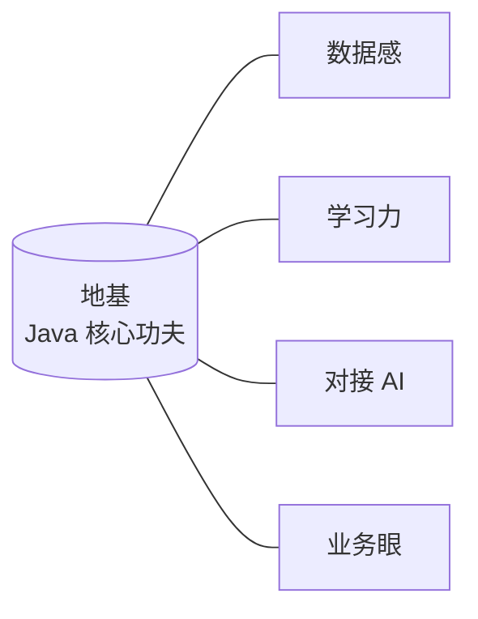

| 要素 | 含义 | Java 中的体现 |
| :--- | :--- | :--- |
| **数据感** | 当好 AI 的原料整理师，把「乱糟糟」变成「整齐齐」 | Java 程序收集用户对商品的评价文字 |
| **学习力** | 拥抱变化的心态 | 持续学习新框架、新工具 |
| **对接 AI** | 学会调用 AI「外挂」 | 在 Java 程序里方便地「调用」现成的 AI 功能 |
| **业务眼** | 知道用 AI 解决什么问题 | 区分哪些业务用传统代码、哪些用 AI 服务 |

#### 对接 AI 案例

| 场景 | Java 代码负责 | AI 服务负责 |
| :--- | :--- | :--- |
| 评论情感分析 | 把一段用户评论发给 AI 服务 | 告诉评论的情感是正面还是负面的 |
| 图像识别 | 把一张图片传给 AI 服务 | 识别图片里有什么物体 |

#### 业务眼 — AI 落地的典型场景

| 业务领域 | 描述 |
| :--- | :--- |
| **客服系统** | 自动回复、智能问答 |
| 图像与视频分析 | 内容理解、目标检测 |
| 金融交易 | 风控、量化决策 |
| 保险理赔 | 智能核损、定损 |

#### 4 步能力成长路径

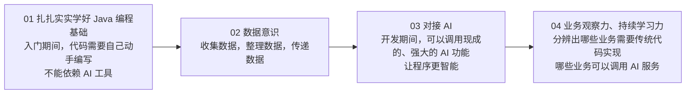

### 课程总览（第一、第二阶段）

| 阶段 | 章节 | 章节名 |
| :--- | :---: | :--- |
| **第一阶段** | 第一章 | Java 开发环境搭建 |
| | 第二章 | 基础语法 |
| | 第三章 | 流程控制语句 |
| | 第四章 | 数组 |
| | 第五章 | 面向对象基础 |
| | 第六章 | 面向对象高级 |
| | 第七章 | 常用 API |
| | 第八章 | 综合案例 |
| **第二阶段** | 第一章 | 集合高级 |
| | 第二章 | 异常 |
| | 第三章 | File 类 |
| | 第四章 | 常用 API IO 流 |
| | 第五章 | 多线程 |
| | 第六章 | 网络编程 |
| | 第七章 | Java 高级技术 |

## 第一章 开发环境搭建

> 培养 AI 新时代 Java 工程师

### Java 背景介绍

#### Java 语言的历史

> **Java** 是由 **James Gosling**（詹姆斯·高斯林）于 **1995 年**在 **Sun 公司**开发的计算机高级编程语言，在 **2009 年**被 **Oracle 公司**收购。

**James Gosling** —— Java 之父

| 项目 | 内容 |
| :--- | :--- |
| 出生 | 1955 年出生于加拿大 |
| 学士 | 1977 年获得卡尔加里大学计算机学士学位 |
| 博士 | 1983 年获得卡内基梅隆大学计算机博士学位 |
| 称号 | **Java 之父** |

#### Java 的应用领域

| 方向 | 典型应用 | 说明 |
| :--- | :--- | :--- |
| **桌面应用开发** | IDEA、Eclipse | 集成开发工具 |
| **企业级应用开发** | 微服务、大型互联网应用 | **Java 的主战场** |
| **移动应用开发** | Android | Android 原生应用 |
| **服务器系统** | 应用的后台 | 服务端开发 |
| **大数据开发** | hadoop | 大数据生态 |
| **游戏开发** | 我的世界 MineCraft | 游戏服务端 |

#### Java 的三大技术平台

| 平台 | 全称 | 中文 | 定位 |
| :--- | :--- | :--- | :--- |
| **JavaSE** | Java Standard Edition | **标准版** | Java 技术的核心和基础 |
| **JavaEE** | Java Enterprise Edition | **企业版** | 企业级应用开发的一套**解决方案** |
| **JavaME** | Java Micro Edition | **小型版** | 针对移动设备应用的**解决方案** |

#### 本节复习

| 问题 | 答案 |
| :--- | :--- |
| Java 是什么？ | 一门高级编程语言 |
| Java 是哪家公司的？现在属于哪家公司？ | Sun 公司、Oracle 公司 |
| Java 之父是谁？ | 詹姆斯·高斯林 |
| Java 能做什么？ | 基本上什么都可以干，主要做**企业服务端开发** |
| Java 有哪三大使用平台？ | **JavaSE**（标准版）、**JavaEE**（企业版）、**JavaME**（小型版） |

### JDK 工具的下载和安装

#### JDK 简介

> 开发 Java 程序必须先安装好 **JDK**（**Java Development Kit**），也就是 Java 开发工具包。

**LTS 版本**（Long-Term Support）：**JDK 8、JDK 11、JDK 17、JDK 21**。**很多企业还在使用 JDK 8 / JDK 11**。

#### 下载步骤

在 Oracle 的官网可以找到 JDK 的下载链接：[Java Downloads | Oracle 中国](https://www.oracle.com/cn/java/technologies/downloads/)

| 步骤 | 操作 |
| :---: | :--- |
| ① | 选择 **JDK 版本**（推荐 JDK 17） |
| ② | 选择**操作系统**版本（如 Windows） |
| ③ | 选择**安装包类型**（如 x64 Installer） |

#### 安装验证

安装完成后，通过 CMD 命令行测试是否安装成功：

| 步骤 | 操作 |
| :---: | :--- |
| ① | 按下键盘上的 **Win + R** 键，会打开一个运行窗口 |
| ② | 在窗口中输入 `cmd`，然后按下 Enter 键，弹出 DOS 窗口 |
| ③ | 在 DOS 窗口输入命令，测试 Java 工具及其版本是否正确 |

```powershell
java -version
javac -version
```

#### JDK bin 目录核心工具

| 工具 | 类型 | 作用 |
| :--- | :--- | :--- |
| `java.exe` | **执行工具** | 启动 JVM 运行 class 文件 |
| `javac.exe` | **编译工具** | 将 `.java` 源文件翻译成 `.class` 字节码 |
| `javadoc.exe` | 文档工具 | 生成 API 文档 |

> <span style="color:red">我们写好的 Java 程序都是高级语言，计算机底层是硬件，不能识别这些语言，必须先通过 javac 编译工具进行翻译，然后再通过 java 执行工具执行才可以驱动机器干活。</span>

#### JDK 的组成

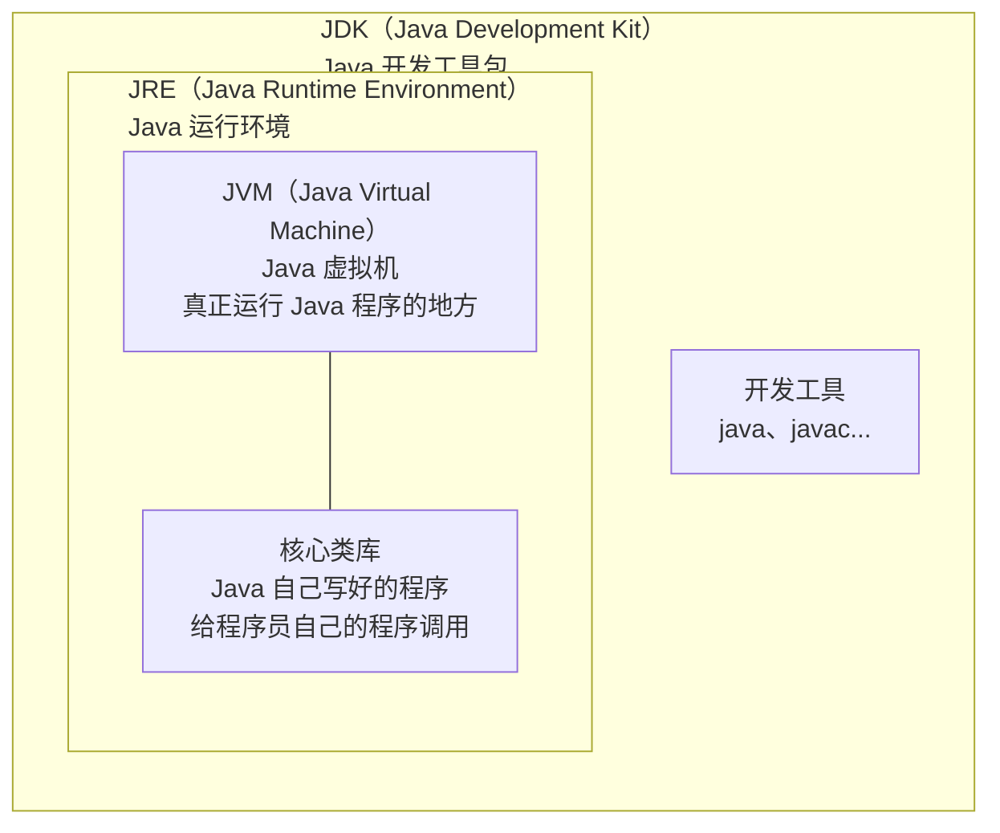

| 组件 | 含义 | 角色 |
| :--- | :--- | :--- |
| **JVM** | Java Virtual Machine，Java 虚拟机 | 真正运行 Java 程序的地方 |
| **核心类库** | Java 自己写好的程序 | 给程序员自己的程序调用 |
| **JRE** | Java Runtime Environment，Java 运行环境 | JVM + 核心类库 |
| **JDK** | Java Development Kit，Java 开发工具包 | JRE + 开发工具（含 java、javac 等） |

#### DOS 常用命令

| 常用命令 | 作用 |
| :--- | :--- |
| `盘符:` | 切换盘符：`D:`、`E:` |
| `dir` | 查看当前路径下的文件信息 |
| `cd` | 进入单级目录：`cd itheima` / 回退到上一级目录：`cd ..` / 回退到盘符根目录：`cd /` |
| `cls` | 清屏 |
| `tab` | 自动补全指定字符开头的单词 |
| `↑` 键 | 查看历史命令 |
| `↓` 键 | 查看历史命令 |
| `exit` | 退出 |

#### 本节复习

| 问题 | 答案 |
| :--- | :--- |
| 要使用 Java，必须先安装什么？去哪里下载？ | **JDK**（Java Development Kit）开发者工具包；Oracle 官网 |
| LTS 版本有哪些？很多企业还在使用哪个 JDK 版本？ | **JDK 8、11、17、21**；很多企业还在使用 **JDK 8 / JDK 11** |
| 如何验证 JDK 是否安装成功了？ | 打开命令行窗口，输入 `java -version`、`javac -version` 看版本号 |
| JDK 中最重要的 2 个命令行程序是什么？各自的作用是？ | `javac`、`java`；编译工具、执行工具 |

### 第一个 Java 程序 Hello World

#### Java 程序的开发步骤

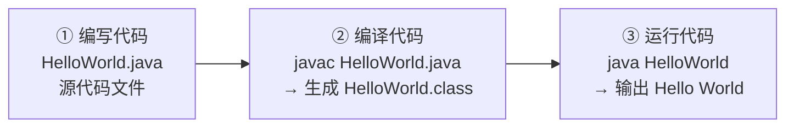

| 步骤 | 命令 | 说明 |
| :---: | :--- | :--- |
| ① 编写代码 | — | 用记事本等编辑器写 `HelloWorld.java` |
| ② 编译代码 | `javac HelloWorld.java` | 生成 `HelloWorld.class` 字节码文件 |
| ③ 运行代码 | `java HelloWorld` | JVM 执行 class，输出 `Hello World` |

```powershell
D:\code>javac HelloWorld.java
D:\code>java HelloWorld
Hello World
```

#### HelloWorld 代码解析

```java
public class HelloWorld {
    public static void main(String[] args) {
        System.out.println("Hello World !");
    }
}
```

| 元素 | 含义 |
| :--- | :--- |
| `public class HelloWorld` | `class` 定义一个类，后面跟上的是**类名称**；`public` 是权限修饰符（暂时理解：限制**类名称和文件名称需要保持一致**） |
| `public static void main(String[] args)` | 程序执行时的**入口点**，`main` 方法也称之为主方法 |
| `System.out.println("Hello World !")` | **打印语句**，使程序在控制台打印双引号所包裹的内容 |

### Java 程序执行原理

#### 机器语言与硬件

> 计算机底层都是**硬件电路**，可以通过**不通电和通电**，表示 **0、1**。
> **机器语言**：由 0、1 组成，如 `00011100 00110101`。

#### 编程语言发展历程

| 阶段 | 特点 |
| :---: | :--- |
| **机器语言** | 由 0/1 组成，计算机直接识别，难读难写 |
| **汇编语言** | 用助记符代替 0/1，仍是低级语言 |
| **高级语言** | 接近人类语言，需翻译成机器语言才能执行 |

> <span style="color:red">高级语言更简单</span>，使用接近人类自己的语言书写代码，再将其翻译成计算机能理解的机器指令。

#### Java 的跨平台原理

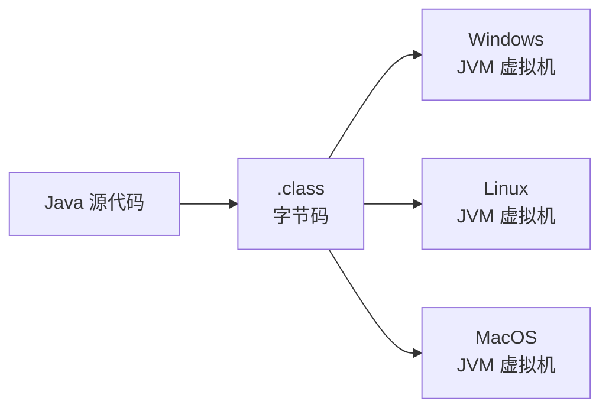

> <span style="color:red">总结</span>：在需要运行 Java 应用程序的操作系统上，安装一个与操作系统对应的 **Java 虚拟机（JVM，Java Virtual Machine）** 即可。

#### 本节复习

| 问题 | 答案 |
| :--- | :--- |
| Java 程序的执行原理是什么样的？ | 不管是什么样高级编程语言，最终要翻译成计算机底层可以识别的机器语言 |
| 机器语言是由什么组成的？ | **0 和 1** |
| Java 跨平台指的是什么？原理又是什么？ | Java 程序可以在任意操作系统中运行；在不同的操作系统中，安装与之对应版本的 **JVM 虚拟机** |

### Java 环境配置

#### Path 环境变量

> <span style="color:red">Path 环境变量</span>用于记住程序路径，方便在命令行窗口的**任意目录**启动程序。

**示例**：QQ.exe 在 `D:\App\QQ` 目录下，从 D: 盘 `>QQ`、C: 盘 `>qq`、E: 盘 `>qq` 都能启动。

**Path 环境变量位置**：此电脑 → 属性 → 高级系统设置 → 高级 → 环境变量

**Path 环境变量的原理**：当我们在 Path 中配置某个程序路径后，启动命令行窗口启动程序时，系统会按 Path 中配置的目录顺序查找该程序。

#### JDK 的环境变量配置

> 较新版本的 JDK 安装时会自动配置 `javac`、`java` 程序的路径到 Path 环境变量中去，因此，`javac`、`java` 可以直接使用。
>
> <span style="color:red">注意</span>：以前的老版本的 JDK 在安装时是没有自动配置 Path 环境变量的，此时需要自己配置 Path 环境变量。

**Path 值示例**：`E:\develop\Java\jdk21\bin`（本机路径，不要抄，去复制）

> 重新配置了环境变量后，必须检测是否配置成功：打开命令行窗口，输入 `java -version` 分别看版本提示。

**JAVA_HOME**：告诉操作系统 JDK 安装在了哪个位置（将来其他技术要通过这个环境变量找 JDK）。

#### 本节复习

| 问题 | 答案 |
| :--- | :--- |
| 什么是 Path 环境变量？ | 用于配置程序的路径，方便我们在命令行窗口的任意目录下启动该程序 |
| JDK 安装时，关于环境变量的配置，需要注意什么？ | 较新版本的 JDK 会自动配置 PATH 环境变量，较老的 JDK 版本则不会 |
| 建议如何处理？ | 建议还是自己配置一下「**PATH**」、「**JAVA_HOME**」 |

## 第二章 IDEA 开发工具

> <span style="color:blue">工欲善其事必先利其器</span>

### IDEA 介绍和安装

#### IDE 集成环境

> **IDE 集成环境**：把代码编写，编译，执行，调试等多种功能综合到一起的开发工具。

#### 主流 Java 开发工具

| 工具 | 厂商 | 特点 |
| :--- | :--- | :--- |
| **IntelliJ IDEA** | JetBrains | 目前使用最多的 Java 开发集成环境 |
| NetBeans | Oracle | 开源 |
| Eclipse | IBM 开源社区 | 老牌 IDE |

> 官方网站：[IntelliJ IDEA – the Leading Java and Kotlin IDE (jetbrains.com)](https://www.jetbrains.com/idea/)

#### 本节小结

| 关键点 | 内容 |
| :--- | :--- |
| **IDEA 全称** | <span style="color:blue">IntelliJ IDEA</span>，是目前使用最多的 Java 开发集成环境 |
| **IDE 集成环境** | 把代码的编写、编译、运行、调试等多种功能综合到一起的开发工具 |

### IDEA 中的第一个代码

#### IDEA 创建 Java 项目的代码结构

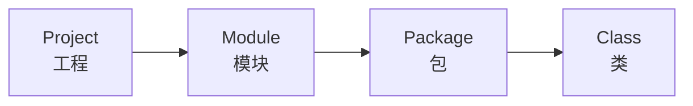

| 层级 | 含义 | 作用 |
| :--- | :--- | :--- |
| **Project** | 工程 | 一个项目下可以管理多个模块 |
| **Module** | 模块 | 独立的业务单元（如商品模块、订单模块） |
| **Package** | 包 | 组织类，避免类名冲突 |
| **Class** | 类 | 实际编写代码的地方 |

#### 模块化项目示例

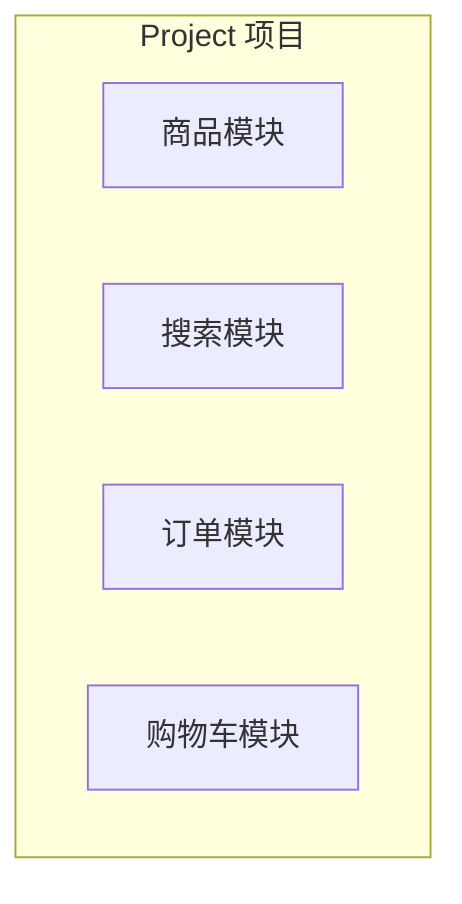

#### 模块内部代码结构

每个模块（Module）内部通常按职责划分为：

| 代码类别 | 作用 |
| :--- | :--- |
| **前端交互代码** | 接收用户请求、返回响应数据 |
| **业务代码** | 处理业务逻辑（如商品查询、下单） |
| **数据访问代码** | 与数据库交互（增删改查） |

#### 学习中的目录结构

> <span style="color:red">整个基础篇创建一个 Project，今后每一天都创建一个新的 Module</span>

```
BasicCodes/                      ← Project
├── .idea/
├── day01/                       ← Module（第 1 天）
├── day02/                       ← Module（第 2 天）
├── day03/                       ← Module（第 3 天）
├── BasicCodes.iml
├── External Libraries
└── Scratches and Consoles
```

### IDEA 的使用操作

#### 常用操作

| 操作类别 | 操作项 |
| :--- | :--- |
| **类文件** | 新建类文件、删除类文件、修改类文件 |
| **模块** | 新建模块、删除模块、修改模块、导入模块 |
| **项目** | 关闭项目、打开项目、修改项目、新建项目 |

#### 常用快捷键

| 快捷键 | 功能 |
| :--- | :--- |
| `psvm` + 回车 | 快速生成 main 方法 |
| `sout` + 回车 | 快速生成输出语句 |
| `Ctrl + Alt + L` | 格式化代码 |
| `Alt + Shift + ↑` | 上移当前行 |
| `Alt + Shift + ↓` | 下移当前行 |
| `Alt + 回车` | 导入包，自动修正 |
| `Ctrl + N` | 查找类 |
| `Ctrl + R` | 替换文本 |
| `Ctrl + F` | 查找文本 |
| `Shift + F6` | 重构-重命名 |
| `Ctrl + X` | 剪切当前行 |
| `Ctrl + D` | 复制行 |
| `Ctrl + /` | 批量加入单行注释，再按一次就是取消 |
| `Ctrl + Shift + /` | 批量加入多行注释，再按一次就是取消 |
| `Alt + 1` | 快速打开或隐藏工程面板 |

## 第三章 Java 基础语法

> <span style="color:blue">根基稳，万事可成</span>

### 注释

#### 什么是注释

> 注释是写在程序中对代码进行解释说明的文字，方便自己和其他人查看，以便理解程序的。

#### Java 注释的三种写法

| 注释类型 | 写法格式 | 特点 |
| :--- | :--- | :--- |
| **单行注释** | `// 注释内容` | 只能写一行 |
| **多行注释** | `/* 注释内容1<br>注释内容2 */` | 可以写多行 |
| **文档注释** | `/** 注释内容<br>注释内容 */` | 可以生成 API 文档 |

```java
/**
 * 通过class关键字定义了一个类，类名叫做 HelloWorld
 * public 起到限制作用，限制文件名和类名保持一致
 */
public class HelloWorld {
    public static void main(String[] args) {
        // 这是一个单行注释，有效范围是从 // 开始到当前行结尾
        System.out.println("HelloWorld");

        /*
            这是一个
            多行注释
         */
        System.out.println("HelloWorld");
    }
}
```

> <span style="color:red">注意事项</span>：<span style="color:red">注释内容不会参与编译和运行</span>

#### 本节小结

| 问题 | 答案 |
| :--- | :--- |
| 注释是什么？ | 写在程序中对程序进行解释说明的文字 |
| Java 程序中书写注释的方式有几种，各自有什么不同？ | 单行注释：`//`<br>多行注释：`/* */`<br>文档注释：`/** */` |
| 注释有什么特点？为什么？ | 不影响程序的执行，编译后的 class 文件中已经没有注释了 |

### 关键字

#### 关键字介绍

> **关键字**：被 Java 赋予了<span style="color:red">特定涵义的英文单词</span>。

```java
public class HelloWorld {
    public static void main(String[] args) {
        System.out.println("HelloWorld");
    }
}
```

> 例如：`class` 表示"创建类"。

> <span style="color:red">注意事项</span>：Java 中的关键字，已经被赋予了特殊的涵义，这些单词不允许使用。

#### Java 关键字大全

| 分类 | 关键字 |
| :--- | :--- |
| **访问控制** | `private` `protected` `public` |
| **类/方法/变量修饰符** | `abstract` `class` `extends` `final` `implements` `interface` `native` `new` `static` `strictfp` `synchronized` `transient` `volatile` |
| **程序控制** | `break` `case` `continue` `default` `do` `else` `for` `if` `instanceof` `return` `switch` `while` |
| **包相关** | `import` `package` |
| **数据类型** | `boolean` `byte` `char` `double` `float` `int` `long` `short` `void` |
| **错误处理** | `assert` `catch` `finally` `throw` `throws` `try` |
| **其他** | `const` `enum` `goto` `super` `this` |

### 字面量

#### 字面量介绍

> **字面量**：就是程序中能直接书写的数据，学这个知识的重点是：<span style="color:red">搞清楚 Java 程序中数据的书写格式</span>。

| 常用数据 | 生活中的写法 | 程序中的写法 | 说明 |
| :--- | :--- | :--- | :--- |
| 整数 | 666、-88 | 666、-88 | 写法一致 |
| 小数 | 13.14、-5.21 | 13.14、-5.21 | 写法一致 |
| 字符串 | 黑马程序员 | `"HelloWorld"`、`"黑马程序员"` | <span style="color:red">程序中必须使用双引号</span> |
| 字符 | A、0、我 | `'A'`、`'0'`、`'我'` | <span style="color:red">程序中必须使用单引号，有且仅能一个字符</span> |
| 布尔值 | 真、假 | `true`、`false` | 只有两个值：`true` 代表真，`false` 代表假 |
| 空值 | — | 值是：`null` | 一个特殊的值，空值（后面会讲解作用，暂时不管） |

#### 字面量练习

> 需求：请将自己的个人信息打印在控制台（姓名，年龄，性别，身高，婚姻状况）

```java
public class Main {
    public static void main(String[] args) {
        System.out.println("张三");
        System.out.println(23);
        System.out.println('男');
        System.out.println(180.1);
        System.out.println(false);
    }
}
```

```powershell
张三
23
男
180.1
false

Process finished with exit code 0
```

#### 本节小结

| 问题 | 答案 |
| :--- | :--- |
| 关键字指的是什么？ | 被 Java 赋予了特定含义的英文单词 |
| 关键字我们能使用吗？ | 不允许使用 |
| 字面量这个知识是要求同学们学会什么？ | **数据在程序中的书写格式** |
| 字符、字符串在程序中的书写格式有什么要求？ | **字符必须单引号围起来，有且仅能一个字符**<br>**字符串必须用双引号围起来** |
| 几个常见的特殊值的书写格式是？ | `true`、`false`、`null` |

### 变量

#### 变量的介绍和定义格式

> **变量**就是内存中的一块区域，可以理解成一个盒子，用来<span style="color:red">装</span>程序要处理的<span style="color:red">数据</span>的。

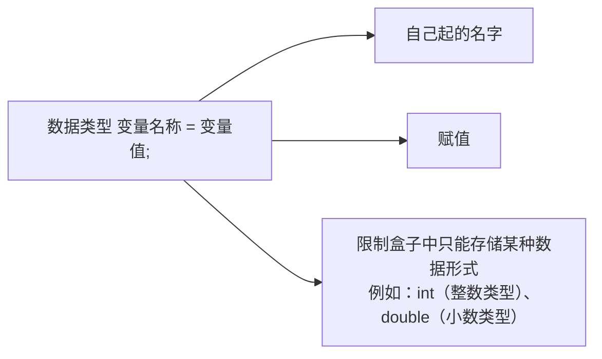

| 部分 | 含义 |
| :--- | :--- |
| **数据类型** | 限制盒子中只能存储某种数据形式 |
| **变量名称** | 自己起的名字 |
| **=** | 赋值（将右边的值赋给左边的变量） |
| **变量值** | 实际存储的数据 |

**示例**：`int age = 18;`

#### 认识变量

> <span style="color:red">变量有啥特点？变量里装的数据是可以被替换的。</span>

```java
int age = 18;
age = 19;             // 把 18 替换成 19

System.out.println(age);   // 输出 19
age = age + 1;             // 在 19 的基础上 + 1，变成 20

System.out.println(age);   // 输出 20
```

> <span style="color:red">变量有啥应用场景呢？写程序对数据进行处理就很方便了。</span>

#### 本节小结

| 问题 | 答案 |
| :--- | :--- |
| 变量是什么，变量的完整定义格式是什么样的？ | 变量是内存中的一块区域，可以理解成盒子，用来记住成程序要处理的数据的。<br>**数据类型 变量名称 = 数据;** |
| 为啥要用变量，变量有啥好处？ | 使用变量记要处理的数据，编写的代码更灵活，管理代码更方便 |
| 变量有什么特点？基于这个特点，变量有啥应用场景？ | **变量里装的数据可以被替换** |

#### 变量的注意事项

| 序号 | 注意事项 |
| :---: | :--- |
| 1 | 变量要先声明才能使用 |
| 2 | 变量是什么类型，就必须装什么类型的数据 |
| 3 | 变量只在自己所归属的 `{}` 范围内有效 |
| 4 | 同一个范围内，变量的名称不能一样 |
| 5 | 变量定义的时候可以不赋初始值，但在使用时，变量里必须有值 |
| 6 | 一条语句可以定义多个变量，中间使用逗号分隔 |

### 标识符

#### 标识符概述

> **标识符**：就是给类，方法，变量等起名字的符号。

```java
public class Demo {

    public static void main(String[] args) {

        int salary = 12000;
        System.out.println(salary);

        salary = 15000;
        System.out.println(salary);

        int age = 18;
        System.out.println(age);
    }
}
```

#### 标识符命名规则

> <span style="color:red">硬性要求</span>（不满足则编译报错）

| 规则 | 说明 |
| :--- | :--- |
| 组成字符 | 由<span style="color:blue">数字、字母、下划线（_）和美元符（$）</span>组成 |
| 开头 | <span style="color:red">不能以数字开头</span> |
| 关键字 | <span style="color:red">不能是关键字</span> |
| 大小写 | 区分大小写 |

**判断下列变量名哪些不符合规则**（红色 = 不符合）：

| 变量名 | 是否符合 | 原因 |
| :--- | :---: | :--- |
| `bj` | ✅ | 符合 |
| `b2` | ✅ | 符合 |
| `2b` | ❌ | 数字开头 |
| `class` | ❌ | 是关键字 |
| `_2b` | ✅ | 符合 |
| `#itheima` | ❌ | 包含非法字符 `#` |
| `ak47` | ✅ | 符合 |
| `Class` | ✅ | 符合（首字母大写但不是关键字） |
| `helloworld` | ✅ | 符合 |

#### 标识符命名规范

> <span style="color:green">软性建议</span>（不满足不报错，但建议遵守）

| 命名法 | 适用场景 | 单单词 | 多单词 |
| :--- | :--- | :--- | :--- |
| **小驼峰命名法** | 变量、方法 | 所有字母小写：`name` | 从第二个单词开始，首字母大写：`firstName` |
| **大驼峰命名法** | 类 | 首字母大写：`Student` | 每个单词的首字母大写：`GoodStudent` |

#### 本节小结

| 问题 | 答案 |
| :--- | :--- |
| 什么是标识符？ | 标识符就是名字 |
| 标识符的规则？ | 由数字、字母、下划线、美元符等组成；<span style="color:red">且不能数字开头，不能用关键字，不能用特殊符号（&、%）</span> |
| 命名建议？ | 见名知义，驼峰命名 |

### 数据类型

#### 数据类型分类

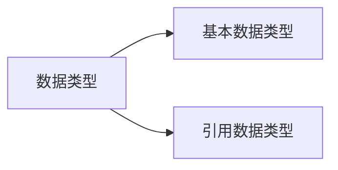

#### 八种基本数据类型

| 数据类型 | 关键字 | 取值范围 | 内存占用 |
| :--- | :--- | :--- | :---: |
| **整数** | `byte` | -128 ~ 127 | 1 |
| **整数** | `short` | -32768 ~ 32767 | 2 |
| **整数** | **`int`**（默认） | -2147483648 ~ 2147483647（10 位数） | 4 |
| **整数** | `long` | -9223372036854775808 ~ 9223372036854775807（19 位数） | 8 |
| **浮点数** | `float` | 1.401298e-45 到 3.402823e+38 | 4 |
| **浮点数** | **`double`**（默认） | 4.9000000e-324 到 1.797693e+308 | 8 |
| **字符** | `char` | 0 ~ 65535 | 2 |
| **布尔** | `boolean` | `true`、`false` | 1 |

> <span style="color:orange">说明</span>：`e+38` 表示是乘以 10 的 38 次方；同样，`e-45` 表示乘以 10 的负 45 次方。

```java
public class Test {
    public static void main(String[] args) {
        System.out.println(10);     // 整数默认 int 类型
        System.out.println(12.3);   // 小数默认 double 类型
    }
}
```

#### 编码表与 ASCII 码表

> **编码表**：是计算机中字节到字符的一套对应关系。

> **ASCII 码表**：American Standard Code for Information Interchange，美国信息交换标准代码。

| 项目 | 内容 |
| :--- | :--- |
| 数字 `0` | 对应 ASCII 码 `48` |
| 大写字母 `A` | 对应 ASCII 码 `65` |
| 小写字母 `a` | 对应 ASCII 码 `97` |

> <span style="color:red">注</span>：表中的 ASCII 字符可以用 `ALT + 小键盘上的数字键` 输入。

#### 数据类型案例

> 需求：请将自己的个人信息，使用变量保存，并展示在控制台。

| 字段 | 示例值 | 数据类型 |
| :--- | :--- | :--- |
| 姓名 | 黑马谢广坤 | `String` |
| 年龄 | 18 | `int` |
| 性别 | 男 | `char` |
| 身高 | 180.1 | `double` |
| 是否单身 | 是 | `boolean` |

#### 本节小结

| 问题 | 答案 |
| :--- | :--- |
| Java 中的数据类型大体分为两类，分别是？ | **基本数据类型**、**引用数据类型** |
| 整数类型首选？小数类型首选？ | **`int`**、**`double`** |
| 定义字符串类型的变量，类型选的是？ | **`String`** |
| 所有整数默认是？小数默认是？ | 整数默认 `int`；小数默认 `double` |
| `char` 类型的变量，可以接收整数类型的数据吗？ | 可以（`char` 取值范围 0 ~ 65535，对应 ASCII 码） |

## 第四章 运算符

> 对变量和字面量操作的符号

### 算术运算符

#### 运算符分类

| 符号 | 作用 | 说明 |
| :---: | :---: | :--- |
| `+` | 加 | 参看小学一年级 |
| `-` | 减 | 参看小学一年级 |
| `*` | 乘 | 参看小学二年级，与 "×" 相同 |
| `/` | 除 | 参看小学二年级，与 "÷" 相同 |
| `%` | 取余 | 获取的是两个数据做除法的<span style="color:red">余数</span> |

> `/` 和 `%` 的区别：两个数据做除法，`/` 取结果的<span style="color:orange">商</span>，`%` 取结果的<span style="color:orange">余数</span>。
>
> <span style="color:red">整数操作只能得到整数</span>，要想得到小数，必须有浮点数参与运算。

#### 案例：数值拆分

> 需求：将数字 123 拆分出个位、十位、百位后，打印在控制台

```text
整数123的个位为:3
整数123的十位为:2
整数123的百位为:1
```

| 拆分位 | 公式 | 计算过程 |
| :---: | :--- | :--- |
| 个位 | `数值 % 10` | 123 除以 10（商 12，余数为 3） |
| 十位 | `数值 / 10 % 10` | 123 除以 10（商 12），12 除以 10（商 1，余数为 2） |
| 百位 | `数值 / 10 / 10 % 10` | 123 / 10 得到 12，12 / 10 得到 1，1 % 10 得到 1 |

> **公式总结**：
> - 个位：数值 `% 10`
> - 十位：数值 `/ 10 % 10`
> - 百位：数值 `/ 10 / 10 % 10`
> - 千位：数值 `/ 10 / 10 / 10 % 10`
> - ……

#### 本节小结

| 问题 | 答案 |
| :--- | :--- |
| 整数相除可以直接得到小数结果吗？如果不可以该怎么解决？ | 不可以，需要加入小数运算 |
| 假设给定一个五位数 65536，获取千位的计算公式是？ | `数值 / 10 / 10 / 10 % 10` |

### 字符串拼接

> 当 `+` 操作中，遇到了字符串，这时 `+` 就是<span style="color:red">字符串连接符</span>，而不是算术运算。

```java
public class Test {
    public static void main(String[] args) {
        System.out.println(1 + 23);                  // 24
        System.out.println("年龄为:" + 23);           // 年龄为:23
        System.out.println(1 + 99 + "年黑马");        // 100年黑马
    }
}
```

> 说明：从左到右依次运算，遇到字符串后，所有后续 `+` 都变为字符串拼接。

```java
public class Test {
    public static void main(String[] args) {
        System.out.println("年龄为:" + 23 + 1);        // 年龄为:231
    }
}
```

> 计算过程：
> 1. `"年龄为:" + 23` → `"年龄为:23"`
> 2. `"年龄为:23" + 1` → `"年龄为:231"`

> <span style="color:red">解决方案</span>：使用小括号改变运算优先级。

```java
public class Test {
    public static void main(String[] args) {
        System.out.println("年龄为:" + (23 + 1));      // 年龄为:24
    }
}
```

> 当 `+` 号操作中遇到了字符串，就会变成字符串拼接。

### 自增自减运算符

| 符号 | 作用 | 说明 |
| :---: | :---: | :--- |
| `++` | 自增 | 变量自身的值加 1 |
| `--` | 自减 | 变量自身的值减 1 |

> `++` 和 `--` 既可以放在变量的后边，也可以放在变量的前边（参考购物车 + / - 按钮）。

#### 本节小结

| 场景 | 规则 |
| :--- | :--- |
| 单独使用 | `++`、`--` 单独使用在变量前后无区别 |
| 参与运算 | `++` 在前，<span style="color:red">先自增再操作</span>；`++` 在后，<span style="color:orange">先操作再自增</span> |
| 操作数限制 | `++`、`--` 只能操作变量，不能操作字面量 |

### 类型转换

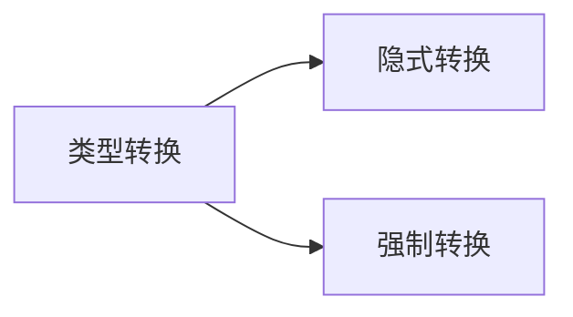

#### 隐式转换介绍

> 把一个<span style="color:orange">取值范围小</span>的数值或者变量，<span style="color:orange">赋值</span>给另一个<span style="color:green">取值范围大</span>的变量

```java
public class Test {
    public static void main(String[] args) {
        int a = 10;
        double b = a;          // 隐式转换：int → double
        System.out.println(b); // 10.0
    }
}
```

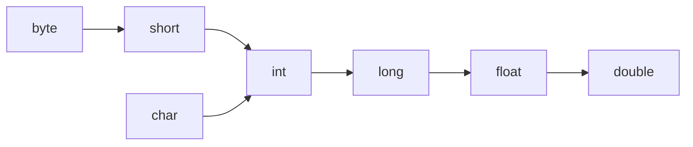

#### 运算过程中的隐式转换

> 取值范围小的数据，和取值范围大的数据进行运算，小的会先提升为大的之后，再进行运算

```java
public class Test {
    public static void main(String[] args) {
        int a = 10;
        double b = 12.3;
        double c = a + b;      // 22.3，a 临时提升为 double
    }
}
```

> <span style="color:red">特殊规则</span>：<span style="color:blue">`byte` `short` `char`</span> 三种数据在运算的时候，都会先提升为 `int`，然后再进行运算。

```java
public class Test {
    public static void main(String[] args) {
        byte a = 10;
        byte b = 20;
        byte c = a + b;        // 编译报错：a + b 提升为 int，需要强转
    }
}
```

```java
public class Test {
    public static void main(String[] args) {
        byte a = 10;
        byte b = 20;
        int c = a + b;         // 正确：int 接收
    }
}
```

> `char` 与 `int` 相加时，`char` 会提升为 `int`（按 ASCII 码取值）。

```java
public class Test {
    public static void main(String[] args) {
        int a = 1;
        char b = 'a';
        int c = a + b;         // 98（'a' 对应 ASCII 码 97）
        System.out.println(c);
    }
}
```

#### 强制类型转换

> 把一个<span style="color:orange">取值范围大</span>的数值或者变量，<span style="color:orange">赋值</span>给另一个<span style="color:red">取值范围小</span>的变量
>
> <span style="color:red">不允许直接赋值</span>，需要加入强制转换

**格式**：`目标数据类型 变量名 = (目标数据类型) 被强转的数据;`

```java
public class Test {
    public static void main(String[] args) {
        double a = 12.3;
        int b = (int) a;       // 12（精度损失，小数部分丢失）
        System.out.println(b);
    }
}
```

#### 本节小结

| 类别 | 规则 |
| :--- | :--- |
| **基本的隐式转换** | 把一个取值范围小的数值或者变量，赋值给另一个取值范围大的变量 |
| **运算中的隐式转换** | 取值范围小的数据，和取值范围大的数据进行运算，小的会先提升为大的之后，再进行运算；`byte`、`short`、`char` 三种数据运算时会先提升为 `int` |
| **强制类型转换** | 取值范围大的数据，给取值范围小的变量赋值，需要强制类型转换；<span style="color:red">强转有可能造成精度损失</span> |

### 赋值运算符

#### 基本赋值运算符

| 符号 | 作用 | 说明 |
| :---: | :---: | :--- |
| `=` | 赋值 | `a = 10`，将 10 赋值给变量 a |

#### 扩展赋值运算符

| 符号 | 作用 | 说明 |
| :---: | :---: | :--- |
| `+=` | 加后赋值 | `a += b`，将 a + b 的值给 a |
| `-=` | 减后赋值 | `a -= b`，将 a - b 的值给 a |
| `*=` | 乘后赋值 | `a *= b`，将 a × b 的值给 a |
| `/=` | 除后赋值 | `a /= b`，将 a ÷ b 的商给 a |
| `%=` | 取余后赋值 | `a %= b`，将 a ÷ b 的余数给 a |

> <span style="color:red">注意</span>：扩展赋值运算符隐含了强转效果。

#### 本节小结

| 类别 | 符号 |
| :--- | :--- |
| 基本赋值运算符 | `=` |
| 扩展赋值运算符 | `+=` `-=` `*=` `/=` `%=`（隐含了强转效果） |
| 关系运算符 | `>` `>=` `<` `<=` `==` `!=`（最终返回 `boolean` 类型结果） |

> <span style="color:red">警告</span>：`==` 是关系运算符，`=` 是赋值运算符，不要混淆！

### 关系运算符

| 符号 | 说明 |
| :---: | :--- |
| `==` | `a==b`，判断 a 和 b 的值是否相等，成立为 `true`，不成立为 `false` |
| `!=` | `a!=b`，判断 a 和 b 的值是否不相等，成立为 `true`，不成立为 `false` |
| `>` | `a>b`，判断 a 是否大于 b，成立为 `true`，不成立为 `false` |
| `>=` | `a>=b`，判断 a 是否大于等于 b，成立为 `true`，不成立为 `false` |
| `<` | `a<b`，判断 a 是否小于 b，成立为 `true`，不成立为 `false` |
| `<=` | `a<=b`，判断 a 是否小于等于 b，成立为 `true`，不成立为 `false` |

> 关系运算符最终返回的都是 `boolean` 类型的结果。

### 逻辑运算符

> 把多个条件放在一起运算，最终返回<span style="color:blue">布尔类型</span>的值：`true`、`false`
>
> 连接布尔类型的表达式，或者是值。

#### 案例：判断成绩是否优秀

> 需求：在程序中，判断一个学生成绩是否在 90~100 之间，是的话程序输出优秀。

```java
public class Test {
    public static void main(String[] args) {
        int score = 95;
        System.out.println(score >= 90 & score <= 100);  // true
    }
}
```

#### 逻辑运算符分类

| 符号 | 介绍 | 说明 |
| :---: | :---: | :--- |
| `&` | 逻辑与 | 并且，遇 `false` 则 `false` |
| `\|` | 逻辑或 | 或者，遇 `true` 则 `true` |
| `!` | 逻辑非 | 取反 |
| `^` | 逻辑异或 | 相同为 `false`，不同为 `true` |

#### 短路逻辑运算符

| 符号 | 介绍 | 说明 |
| :---: | :---: | :--- |
| `&&` | 短路与 | 作用和 `&` 相同，但是有<span style="color:red">短路效果</span> |
| `\|\|` | 短路或 | 作用和 `\|` 相同，但是有<span style="color:red">短路效果</span> |

| 运算符 | 左操作数 | 右操作数 |
| :---: | :---: | :--- |
| `&`（逻辑与） | 无论 `true` 还是 `false` | 右边都要执行 |
| `&&`（短路与） | 左为 `true` | 右边执行 |
| `&&`（短路与） | 左为 `false` | <span style="color:red">右边不执行</span> |
| `\|`（逻辑或） | 无论 `true` 还是 `false` | 右边都要执行 |
| `\|\|`（短路或） | 左为 `false` | 右边执行 |
| `\|\|`（短路或） | 左为 `true` | <span style="color:red">右边不执行</span> |

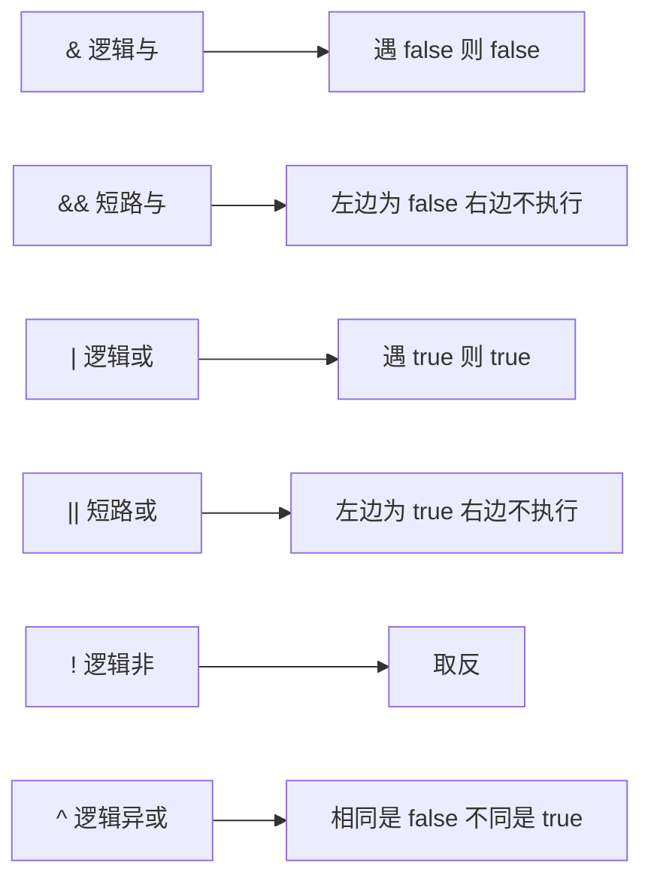

> <span style="color:red">注意</span>：实际开发中，常用的逻辑运算符是：`&&`、`||`、`!`

### 三元运算符

**格式**：`判断条件 ? 值1 : 值2;`

**执行流程**：

1. 首先计算<span style="color:red">判断条件的值</span>
2. 如果值为 <span style="color:green">`true`</span>，<span style="color:blue">值 1</span> 就是运算结果
3. 如果值为 <span style="color:red">`false`</span>，<span style="color:blue">值 2</span> 就是运算结果

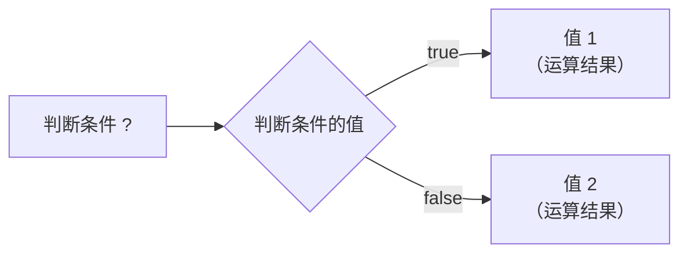

> <span style="color:green">总结</span>：根据判断条件，从两份数据中二者选其一。

### 运算符优先级

| 优先级 | 运算符 |
| :---: | :--- |
| 1 | `.` `()` |
| 2 | `!`、`~`、`++`、`--` |
| 3 | `*`、`/`、`%` |
| 4 | `+`、`-` |
| 5 | `<<`、`>>`、`>>>` |
| 6 | `<`、`<=`、`>`、`>=`、`instanceof` |
| 7 | `==`、`!=` |
| 8 | `&` |
| 9 | `^` |
| 10 | `\|` |
| 11 | `&&` |
| 12 | `\|\|` |
| 13 | `?:` |
| 14 | `=`、`+=`、`-=`、`*=`、`/=`、`%=`、`&=` |

> <span style="color:orange">规律</span>：`&&` 优先级高于 `||`，赋值运算符优先级最低。

#### 优先级案例解析

```java
public class Test {
    public static void main(String[] args) {
        int a = 10;
        int b = 20;
        System.out.println(a > b || a < b && a > b);
        // 解析：&& 优先级高于 ||，先算 a < b && a > b（false），再算 a > b || false（false || false = false）
    }
}
```

> <span style="color:red">小技巧</span>：不确定优先级时，用 `()` 改变优先级，可读性更强。

```java
public class Test {
    public static void main(String[] args) {
        int a = 10;
        int b = 20;
        System.out.println((a > b || a < b) && a > b);
        // 显式加括号：先算 a > b || a < b（true），再算 true && a > b（true && false = false）
    }
}
```

### Scanner 键盘录入

#### 需求

> 请在程序中，提示用户通过键盘输入自己的姓名、年龄，并能在程序中收到这些数据。
>
> Java 已经写好了实现程序，我们调用即可。

#### 三个步骤

```java
import java.util.Scanner;       // ① 导包：告诉程序去 JDK 的哪个包中找扫描器技术

public class Test {
    public static void main(String[] args) {
        Scanner sc = new Scanner(System.in);  // ② 创建对象：代表得到键盘扫描器对象

        System.out.println("请输入您的年龄：");
        int age = sc.nextInt();              // ③ 调用方法：等待接收用户输入数据
        System.out.println("年龄是：" + age);

        System.out.println("请输入您的名称：");
        String name = sc.next();
        System.out.println("欢迎：" + name);
    }
}
```

#### 本节小结

> Java 程序中如何实现接收用户键盘输入的数据？
>
> 使用 Java 提供的类 `Scanner` 来完成，<span style="color:red">步骤</span>如下：

| 步骤 | 代码 | 说明 |
| :---: | :--- | :--- |
| 1 | `import java.util.Scanner;` | <span style="color:blue">导包</span> |
| 2 | `Scanner sc = new Scanner(System.in);` | <span style="color:blue">创建对象</span> |
| 3 | `sc.nextInt()` / `sc.next()` / `sc.nextDouble()` | <span style="color:blue">调用方法接收数据</span> |

| 方法 | 作用 |
| :---: | :--- |
| `sc.nextInt()` | 接收整数 |
| `sc.next()` | 接字符串 |
| `sc.nextDouble()` | 接收浮点数 |

## 第五章 方法

> 函数，实现特定功能的操作步骤集合

### 方法的介绍

#### 为什么要使用方法

> 如果将所有功能都写在 `main` 方法中，代码会臃肿（"臃肿"），不便于维护。

```java
public class Test {
    public static void main(String[] args) {
        // ...50 行代码
    }
}
```

> 解决方法：将每个功能**单独封装**到一个方法中，`main` 中只负责调用。

```java
public class Test {
    public static void main(String[] args) {

    }

    /** 查看全部商品 */
    public static void showGoodsInfo() { ... }

    /** 上架商品 */
    public static void addGoods() { ... }

    /** 下架商品 */
    public static void deleteGoods() { ... }

    /** 修改商品 */
    public static void updateGoods() { ... }
}
```

#### 方法的概念

| 维度 | 内容 |
| :--- | :--- |
| 别名 | 方法（method）、函数（function） |
| 定义 | 一段具有独立功能的代码块 |
| 特点 | <span style="color:red">不调用就不执行</span> |

#### 小结

> 方法（函数）就是将<u>具有独立功能的代码</u>封装起来，组成一个独立的小工具，方便重复使用，提升维护性。

| 维度 | 好处 |
| :--- | :--- |
| 代码管理 | 可以将挤在一起的臃肿代码按照功能进行分类管理，<span style="color:green">提高维护性</span> |
| 代码复用 | <span style="color:green">提高代码的复用性</span> |

### 方法的基本定义和调用

#### 定义和调用格式

| 维度 | 格式 |
| :--- | :--- |
| 定义格式 | `public static void 方法名() { // 方法体 }` |
| 调用格式 | `方法名();` |

```java
public class Test {
    public static void show() {
        // 方法体
    }

    public static void main(String[] args) {
        show();   // 调用
    }
}
```

#### 案例：方法计算两个整数最大值

> 需求：定义一个方法，方法中定义两个整数变量，求出最大值并打印在控制台

| 步骤 | 内容 |
| :---: | :--- |
| 1 | 根据格式编写方法，方法名自己给出（见名知意 小驼峰命名法） |
| 2 | 方法内部定义出两个 `int` 类型变量 |
| 3 | 使用三元运算符求出最大值 |
| 4 | 调用该方法，让内部的逻辑执行起来 |

### 方法的执行流程

#### 方法的调用流程

| 阶段 | 行为 |
| :---: | :--- |
| 方法未被调用时 | 字节码文件存放在 <span style="color:red">方法区</span> |
| 方法被调用时 | 需要进入到 <span style="color:red">栈内存</span> 中运行 |

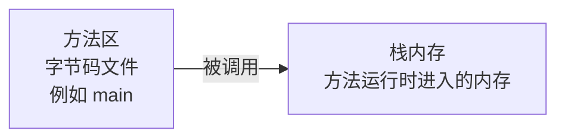

#### 入栈与出栈

| 行为 | 描述 |
| :---: | :--- |
| 入栈 | 方法被调用时，进入栈内存 |
| 出栈 | 方法执行完毕后，弹出栈内存 |

```java
public class MethodDemo1 {
    public static void main(String[] args) {
        System.out.println("开始");
        getMax();
        System.out.println("结束");
    }

    public static void getMax() {
        int num1 = 10;
        int num2 = 20;
        int max = num1 > num2 ? num1 : num2;
        System.out.println(max);
    }
}
```

执行流程：

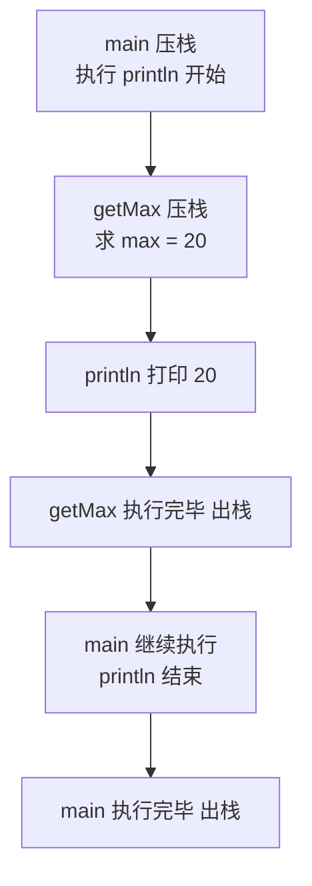

#### 多个方法嵌套调用

```java
public class MethodDemo2 {
    public static void main(String[] args) {
        study();
    }

    public static void sleep() {
        System.out.println("睡觉");
    }

    public static void eat() {
        System.out.println("吃饭");
    }

    public static void study() {
        eat();
        System.out.println("学习");
        sleep();
    }
}
```

#### 小结

| 内存区域 | 说明 |
| :--- | :--- |
| 方法区 | <span style="color:red">字节码文件加载时进入的内存</span> |
| 栈内存 | <span style="color:red">方法运行时入栈，方法运行结束出栈</span> |

### 带参数的方法

#### 为什么要带参数

> 方法中写死的数据不灵活，每次只能处理固定的内容。

```java
public class MethodDemo1 {
    public static void main(String[] args) {
        getMax();
    }

    public static void getMax() {
        int num1 = 10;
        int num2 = 20;
        int max = num1 > num2 ? num1 : num2;
        System.out.println(max);
    }
}
```

> 上面的 `getMax()` 只能计算 10 和 20 的最大值。<br>
> 解决办法：让方法可以接收调用方传入的数据 → 形参 + 实参

#### 定义格式

| 参数数量 | 格式 |
| :---: | :--- |
| 单个参数 | `public static void 方法名 (数据类型 变量名) { // 方法体 }` |
| 多个参数 | `public static void 方法名 (数据类型 变量名1, 数据类型 变量名2...) { // 方法体 }` |

```java
public static void call(String name) {
    // ...
}

public static void add(int a, int b) {
    // ...
}
```

#### 调用格式

| 参数数量 | 格式 |
| :---: | :--- |
| 单个参数 | `方法名(参数);` |
| 多个参数 | `方法名(参数1, 参数2);` |

```java
call("钢门吹雪");
add(10, 20);
```

#### 形参和实参

| 名称 | 全称 | 出现时机 | 说明 |
| :---: | :---: | :---: | :--- |
| <span style="color:red">形参</span> | 形式参数 | <span style="color:red">定义</span>方法时 | 方法声明的参数，相当于局部变量的声明 |
| <span style="color:red">实参</span> | 实际参数 | <span style="color:red">调用</span>方法时 | 传入的具体数据 |

```java
public class MethodDemo2 {
    public static void main(String[] args) {
        getMax(10, 20);   // 10、20 是实参
    }

    public static void getMax(int num1, int num2) {  // num1、num2 是形参
        int max = num1 > num2 ? num1 : num2;
        System.out.println(max);
    }
}
```

#### 小结

| 知识点 | 说明 |
| :--- | :--- |
| 参数作用 | <span style="color:green">带参数的方法可以提高方法的灵活性</span> |
| 形参 | 方法定义时声明的参数 |
| 实参 | 方法调用时传入的参数 |

### 带返回值的方法

#### 为什么需要返回值

> A 方法产生的数据，B 方法想要使用的话，就需要定义带返回值的方法

```java
// 之前：A 方法中计算 sum，B 方法想用 sum 是用不了的
public static void methodA(int a, int b) {
    int sum = a + b;
    // ...
}

public static void methodB() {
    System.out.println(sum % 2 == 0);   // 报错，拿不到 sum
}
```

```java
// 现在：A 方法通过 return 把数据交给 B 方法
public static int methodA(int a, int b) {
    int sum = a + b;
    return sum;
}

public static void methodB() {
    int result = methodA(10, 20);
    System.out.println(result % 2 == 0);
}
```

#### 定义格式

```
public static 数据类型 方法名 (数据类型 变量名1, 数据类型 变量名2...) {
    return 数据值;
}
```

```java
public static int add(int a, int b) {
    int c = a + b;
    return c;
}

public static double getNum() {
    return 12.3;
}
```

#### 调用格式

| 场景 | 格式 |
| :---: | :--- |
| 单纯调用 | `方法名(参数...);` |
| 接收返回值 | `数据类型 变量名 = 方法名(参数...);` |

```java
add(10, 20);                    // 单纯调用，返回值被丢弃
int result = add(10, 20);       // 用变量接收
```

#### 小结

| 知识点 | 说明 |
| :--- | :--- |
| 使用场景 | A 方法中的数据，如果 B 方法想要使用的话，就需要设计返回值 |
| 关键字 | 通过 <span style="color:red">`return`</span> 关键字，将结果数据返回 |
| 返回位置 | 返回到方法的调用处 |

### 方法通用定义格式

#### 完整格式

```
public static 返回值类型 方法名(参数) {
    方法体;
    return 数据;
}
```

| 组成 | 含义 | 类比 |
| :---: | :---: | :--- |
| 参数 | 制作材料 | 面粉、酵母、糖… |
| 方法体 | 使用材料干活 | 搅拌、烘烤… |
| 返回值 | 成品 | 面包 |

#### 定义方法的两个明确

| 明确项 | 说明 |
| :---: | :--- |
| <span style="color:red">明确参数</span> | 主要是明确参数的类型和数量 |
| <span style="color:red">明确返回值类型</span> | 方法操作完毕后是否有结果数据，如果有写对应的数据类型，没有写 `void` |

#### 调用方法的两种方式

| 方法类型 | 调用方式 |
| :---: | :--- |
| `void` 类型的方法 | 直接调用即可：`方法名(参数);` |
| 非 `void` 类型的方法 | 推荐用变量接收调用：`数据类型 变量名 = 方法名(参数);` |

#### 案例

| 需求编号 | 需求 |
| :---: | :--- |
| 需求 1 | 设计一个方法，能够计算出 2 个小数的和 |
| 需求 2 | 设计一个方法，能够计算出 3 个整数的最小值 |
| 需求 3 | 设计一个方法，能够打印出用户的个人信息（姓名，年龄，身高，性别） |

### 方法注意事项

| 序号 | 注意事项 |
| :---: | :--- |
| 1 | <span style="color:red">方法不调用就不执行</span> |
| 2 | 方法与方法之间是<span style="color:red">平级关系，不能嵌套定义</span> |
| 3 | 方法的编写顺序和执行顺序<span style="color:red">无关</span> |
| 4 | 方法的返回值类型为 `void` 时，表示该方法没有返回值，没有返回值的方法可以省略 `return` 语句不写 |
| 5 | 如果要编写 `return`，后面不能跟具体的数据（`void` 方法中） |
| 6 | `return` 语句下面，不能编写代码，因为永远执行不到，属于无效的代码 |

```java
// 错误示例：return 之后还有代码
public class MethodDemo {
    public static void method() {
        // 代码片段
        return;
        System.out.println("卑微代码");   // ❌ 报错
    }
}
```

### 方法重载

#### 引入

> 需求：提供 4 个计算方法，功能如下
> - 2 个 `int` 相加
> - 2 个 `double` 相加
> - 3 个 `int` 相加
> - 3 个 `double` 相加

```java
public class Test {
    public static int add1(int a, int b) {
        return a + b;
    }

    public static double add2(double a, double b) {
        return a + b;
    }

    public static int add3(int a, int b, int c) {
        return a + b + c;
    }

    public static double add4(double a, double b, double c) {
        return a + b + c;
    }
}
```

> 但是 4 个 add1/add2/add3/add4 名字太繁琐了，<br>
> 能否全部用 `add` 同一个名字？→ 方法重载

```java
public class Test {
    public static int    add(int a, int b)              { return a + b; }
    public static double add(double a, double b)        { return a + b; }
    public static int    add(int a, int b, int c)       { return a + b + c; }
    public static double add(double a, double b, double c) { return a + b + c; }
}
```

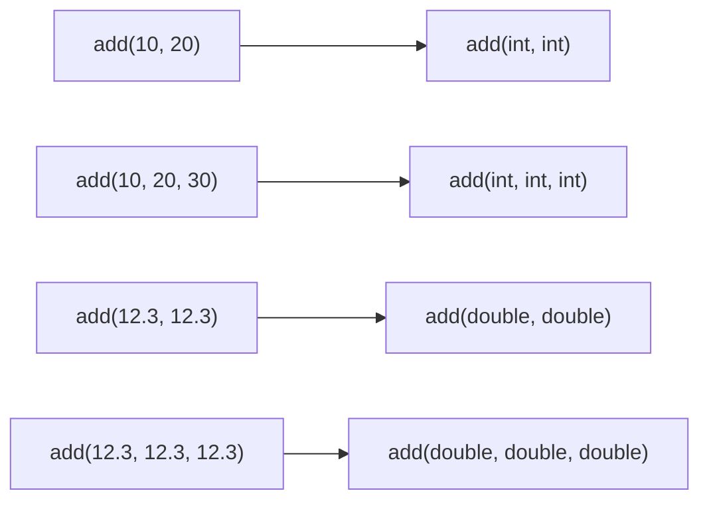

> 调用方法的时候，Java 虚拟机会<span style="color:red">通过参数的不同来区分同名的方法</span>

#### 方法重载的定义

| 维度 | 说明 |
| :---: | :--- |
| 位置 | 在<span style="color:red">同一个类</span>中 |
| 方法名 | 多个方法的<span style="color:red">方法名相同</span> |
| 参数 | 每个方法具有<span style="color:red">不同的参数类型或参数个数</span> |
| 结果 | 这些同名的方法，就构成了重载关系（Overload） |

> 简单记：同一个类中，方法名相同，参数不同的方法<br>
> 参数不同：<span style="color:green">个数不同、类型不同、顺序不同</span>

> <span style="color:red">注意：识别方法之间是否是重载关系，只看方法名和参数，跟返回值无关。</span>

#### 重载判断正误

| 示例 | 是否构成重载 | 原因 |
| :---: | :---: | :--- |
| `void fn(int a)` / `int fn(int a)` | ❌ | 参数相同，仅返回值不同 |
| `void fn(int a)` / `int fn(int a, int b)` | ✅ | 参数个数不同 |
| `void fn(int a)` / `int fn(double a)` | ✅ | 参数类型不同 |
| 两个类中的 `fn(int a)` / `fn(double a)` | ❌ | 不在同一个类中 |
| `void fn(int a, double b)` / `void fn(double a, int b)` | ✅ | 参数顺序不同 |
| `void fn(int a, double b)` / `void fn(int c, double d)` | ❌ | 仅形参名不同 |

#### 方法重载的好处

> 不用记忆过多繁琐的方法名字

```java
public class MethodDemo {
    public static void main(String[] args) {
        // 输出调用
        System.out.println(10);       // 同一个 println，传入 int
        System.out.println(10.1);     // 同一个 println，传入 double
        System.out.println(true);     // 同一个 println，传入 boolean
    }
}
```

#### 小结

| 知识点 | 说明 |
| :---: | :--- |
| 方法重载 Overload | <span style="color:red">同一个类中，方法名相同，参数不同的方法</span> |
| 重载看返回值吗？ | <span style="color:green">不看，只看参数类型、参数个数、参数顺序</span> |
| 重载有啥好处？ | <span style="color:green">不需要记忆太多方法名字</span> |

### IDEA 安装 AI 插件

#### IDEA 集成通义灵码

| 阶段 | 说明 |
| :---: | :--- |
| IDEA 之前的编程方式 | 程序的编码工作，还是需要程序员思考，并逐行编写 |
| AI 出现后 | IDEA 可以集成很多辅助编程的 AI 编程插件 |
| 推荐插件 | 阿里巴巴 通义灵码 |

> 官网：<https://lingma.aliyun.com/lingma/download>

## 第六章 流程控制语句

> <span style="color:blue">控制程序代码执行顺序</span>
> 多一句没有，少一句不行。用更短的时间，教会更实用的技术

### 1. 流程控制语句分类

| 分类 | 说明 | 关键字 |
| :--- | :--- | :--- |
| <span style="color:red">顺序结构</span> | Java 程序默认的执行流程，没有特定的语法结构，按照代码的先后顺序，依次执行 | 程序默认 |
| <span style="color:red">分支结构</span> | 根据条件选择性地执行某段代码 | `if`、`switch` |
| <span style="color:red">循环结构</span> | 让一段代码重复执行很多次 | `for`、`while`、`do...while` |

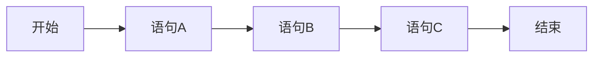

```java
public class Test {
    public static void main(String[] args) {
        System.out.println("A");
        System.out.println("B");
        System.out.println("C");
    }
}
```

### 2. 分支结构 if

#### if 的三种格式

| 格式 | 语法 | 适用场景 |
| :--- | :--- | :--- |
| <span style="color:red">格式 1</span> | `if (判断条件) { 语句体; }` | 单条件判断 |
| <span style="color:red">格式 2</span> | `if (判断条件) { 语句体1; } else { 语句体2; }` | 二选一 |
| <span style="color:red">格式 3</span> | `if (判断条件1) { 语句体1; } else if (判断条件2) { 语句体2; } ... else { 语句体n+1; }` | 多条件区间判断 |

**执行流程**：

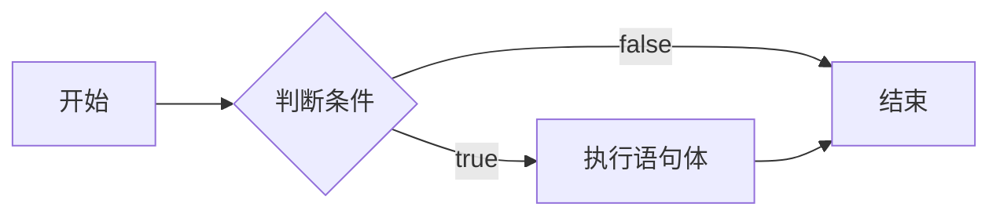

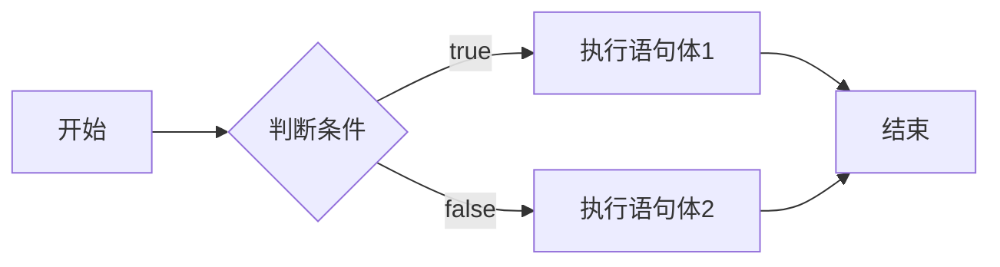

```mermaid
flowchart LR
    S[开始] --> C1{判断条件1}
    C1 -- true --> B1[执行语句体1]
    C1 -- false --> C2{判断条件2}
    C2 -- true --> B2[执行语句体2]
    C2 -- false --> C3{...}
    C3 -- true --> Bn[执行相应语句体]
    C3 -- false --> Bx[执行语句体n+1]
    B1 --> E[结束]
    B2 --> E
    Bn --> E
    Bx --> E
```

> 1. <span style="color:orange">if 分支是什么？</span>可以根据条件，选择执行某段程序
> 2. <span style="color:orange">if 分支的写法有几种？</span>三种（见上表）

#### 案例：考试奖励

> 需求：键盘录入考试成绩，根据成绩所在的区间，程序打印出不同的奖励

| 成绩区间 | 奖励 |
| :--- | :--- |
| 95 ~ 100 | 自行车一辆 |
| 90 ~ 94 | 游乐场玩一次 |
| 80 ~ 89 | 变形金刚一个 |
| 80 分以下 | 胖揍一顿 |

```java
Scanner sc = new Scanner(System.in);
System.out.print("请输入考试成绩：");
int score = sc.nextInt();

if (score >= 95 && score <= 100) {
    System.out.println("自行车一辆");
} else if (score >= 90 && score <= 94) {
    System.out.println("游乐场玩一次");
} else if (score >= 80 && score <= 89) {
    System.out.println("变形金刚一个");
} else {
    System.out.println("胖揍一顿");
}
```

#### if 语句注意事项

- <span style="color:red">if 语句中，如果大括号控制的是一条语句，大括号可以省略不写</span>
- <span style="color:red">if 语句的 () 和 {} 之间不要写分号</span>
- <span style="color:red">if 语句的 () 中需要产生 boolean 类型的结果，根据结果决定程序的走向</span>

### 3. 分支结构 switch

> 通过比较值来决定执行哪条分支

#### switch 分支的执行流程

1. <span style="color:orange">先计算表达式的值</span>，再拿着这个值去与 `case` 后的值进行匹配
2. 与哪个 `case` 后的值匹配为 `true` 就执行哪个 `case` 块的代码，<span style="color:red">遇到 `break` 就跳出 switch 分支</span>
3. 如果全部 `case` 后的值与之匹配都是 `false`，则执行 `default` 块的代码

```java
switch (表达式) {
    case 值1:
        语句体1;
        break;
    case 值2:
        语句体2;
        break;
    ...
    default:
        语句体n+1;
        break;
}
```

> - <span style="color:green">if 适合做条件是区间判断的情况</span>
> - <span style="color:green">switch 适合做：条件是比较值的情况、代码优雅、性能较好</span>

#### switch 语句注意事项

1. <span style="color:red">表达式类型只能是 `byte`、`short`、`int`、`char`，不支持 `double`、`float`、`long`</span>
   - JDK5 开始支持<span style="color:blue">枚举</span>
   - JDK7 开始支持 <span style="color:blue">String</span>
2. <span style="color:red">`case` 给出的值不允许重复</span>，且<span style="color:red">只能是字面量，不能是变量</span>
3. <span style="color:red">正常使用 switch 的时候，不要忘记写 `break`，否则会出现穿透现象</span>

### 4. Debug 工具

> - <span style="color:blue">Debug</span>：是供程序员使用的程序调试工具
>   - 它可以用于<span style="color:orange">查看程序的执行流程</span>
>   - 也可以用于追踪程序执行过程来<span style="color:orange">调试程序</span>
> - <span style="color:blue">Debug 调试</span>，又被称为<span style="color:red">断点调试</span>，<span style="color:blue">断点</span>其实是一个标记，告诉 Debug 从标记的地方开始查看

#### Debug 工具栏

| 操作 | 说明 |
| :--- | :--- |
| <span style="color:red">程序向下执行一步</span> | 单步执行（F8） |
| <span style="color:red">跳出当前方法</span> | 从方法中返回到调用处 |
| <span style="color:red">进入方法查看详情</span> | 进入方法体逐行执行（F7） |
| <span style="color:red">结束 DeBug 模式</span> | 终止本次调试 |
| <span style="color:red">再点一次取消断点</span> | 移除该行断点 |

#### Debug 视图

- <span style="color:blue">Frames</span>：显示正在执行的方法（`main6, Main`、`getMax:12, Main`）
- <span style="color:blue">Variables</span>：显示变量的变化过程（`a = 10`、`b = 20`）
- <span style="color:blue">Console</span>：控制台输出

#### Breakpoints 视图

> 统一管理所有断点（Java Line Breakpoints、Java Exception Breakpoints 等），可设置 <span style="color:orange">Suspend: All / Thread</span>、<span style="color:orange">Condition</span>、<span style="color:orange">Log message</span>、<span style="color:orange">Remove once hit</span> 等高级属性

### 5. 循环结构 for

> 循环语句的作用：<span style="color:red">可以将一段代码重复的执行很多次</span>

```java
for (初始化语句; 条件判断语句; 条件控制语句) {
    循环体语句;
}
```

#### 跑圈示例

> 循环任务：跑圈
> 控制循环：根据心中 1 2 3 4 数字的变化进行控制
> 循环条件：心中的数小于 4，就开始循环任务

```mermaid
flowchart LR
    S[开始] --> I[初始化语句<br/>int i = 1] --> C{i < 4}
    C -- true --> B[循环体语句<br/>sout 跑圈] --> U[条件控制语句<br/>i++]
    U --> C
    C -- false --> E[结束]
```

#### for 循环小结

> 循环语句的作用：可以将一段代码重复的执行很多次
> for 循环语句格式：

```java
for (初始化语句; 条件判断语句; 条件控制语句) {
    循环体语句;
}
```

**执行流程**：

1. 初始化语句
2. 执行条件判断语句，看结果是 true，还是 false；<span style="color:red">false 结束，true 继续</span>
3. 执行循环体语句
4. 执行条件控制语句
5. 回到 2 继续

#### 案例：循环打印 10 次「黑马程序员」

> 需求：请使用循环，在控制台打印出 10 次「黑马程序员」

```java
for (int i = 1; i <= 10; i++) {
    System.out.println("黑马程序员");
}
```

#### 案例：模拟计时器

> 需求：请使用循环在控制台打印数字 1~3 和 3~1 的数据

| 思路积累 | 说明 |
| :--- | :--- |
| <span style="color:green">循环中，用于控制循环的变量还可以放在循环体中，继续进行使用</span> | — |
| <span style="color:green">条件控制语句，不一定是 `++`</span> | 例如 `i--` |

```java
// 打印 1 ~ 3
for (int i = 1; i <= 3; i++) {
    System.out.println(i);
}
System.out.println("------------");

// 打印 3 ~ 1
for (int i = 3; i >= 1; i--) {
    System.out.println(i);
}
```

#### 案例：求和

> 需求：求 1-100 之间的偶数和，并把求和结果在控制台输出

**分析**：

1. 定义求和变量 `sum`，准备记录累加的结果
2. 使用 for 循环，分别获取数据 1 ~ 100
3. 循环使用 if 语句，筛选出偶数数据
4. <span style="color:red">将每一个偶数数据，和 `sum` 变量进行累加</span>
5. 循环结束后，打印求和后的结果

> <span style="color:green">思路积累：今后若遇到的需求是，求 xxx 的和，就要联想到求和变量 `sum`</span>

```java
int sum = 0;
for (int i = 1; i <= 100; i++) {
    if (i % 2 == 0) {
        sum += i;
    }
}
System.out.println("1-100之间的偶数和是：" + sum);
```

#### 案例：水仙花数

> 需求：在控制台输出所有的「水仙花数」

| 定义 | 解释 |
| :--- | :--- |
| <span style="color:red">水仙花数是一个三位数</span> | 例：111、222、333、370、371、520、999 |
| <span style="color:red">个位、十位、百位的数字立方和等于原数</span> | 例：123 → 1³+2³+3³ = 1+8+27 = 36 ≠ 123（不是水仙花数）<br/>例：371 → 3³+7³+1³ = 27+343+1 = 371 = 371（是水仙花数） |

**分析**：

1. 通过 for 循环，获取到所有的三位数 100 ~ 999
2. 在循环内部，将每一个三位数拆分为（个位，十位，百位）
3. 加入 if 筛选条件：`if (ge*ge*ge + shi*shi*shi + bai*bai*bai == 原数)`
4. 满足条件则输出水仙花数

```java
for (int i = 100; i <= 999; i++) {
    int ge = i % 10;
    int shi = i / 10 % 10;
    int bai = i / 100 % 10;
    if (ge*ge*ge + shi*shi*shi + bai*bai*bai == i) {
        System.out.println(i);
    }
}
```

#### 案例：统计水仙花数

> 需求：在控制台输出所有的「水仙花数」，并统计出水仙花数的个数

**分析**：

1. <span style="color:red">定义计数器变量 `count`，准备统计水仙花数的个数</span>
2. 通过 for 循环，获取到所有的三位数 100 ~ 999
3. 在循环内部，将每一个三位数拆分为（个位，十位，百位）
4. 加入 if 筛选条件：`if (ge*ge*ge + shi*shi*shi + bai*bai*bai == 原数)`
5. <span style="color:red">满足条件则输出水仙花数，`count` 变量 `++`</span>
6. 打印 `count` 所记录的值

> <span style="color:green">思路积累：今后若遇到的需求是，统计 xxx，就要联想到计数器变量 `count`</span>

```java
int count = 0;
for (int i = 100; i <= 999; i++) {
    int ge = i % 10;
    int shi = i / 10 % 10;
    int bai = i / 100 % 10;
    if (ge*ge*ge + shi*shi*shi + bai*bai*bai == i) {
        System.out.println(i);
        count++;
    }
}
System.out.println("水仙花数共有：" + count + " 个");
```

#### for 循环语句注意事项

- <span style="color:red">循环 {} 中定义的变量，在每一轮循环结束后，都会从内存中释放</span>
- <span style="color:red">循环 () 中定义的变量，在整个循环结束后，都会从内存中释放</span>
- <span style="color:red">循环语句 () 和 {} 之间不要写分号</span>

> - 循环 () 中定义的变量，在循环结束后还可以继续使用吗？
> - 循环 {} 中定义的变量，什么时候从内存中消失？
> - 循环 () 和 {} 之间写分号，还可以控制循环体吗？

#### 循环嵌套

> 循环嵌套：在循环语句中，继续出现循环语句。
> <span style="color:red">外循环执行一次，内循环执行一圈</span>

```java
for (int i = 1; i <= 5; i++) {
    for (int j = 1; j <= 5; j++) {
        System.out.println("HelloWorld");
    }
}
```

#### 案例：循环嵌套

> 使用 `*` 在控制台打印出 4 行 5 列的矩形

```
* * * * *
* * * * *
* * * * *
* * * * *
```

> 使用 `*` 在控制台打印出 5 行的直角三角形

```
*
* *
* * *
* * * *
* * * * *
```

```java
// 4 行 5 列矩形
for (int i = 1; i <= 4; i++) {
    for (int j = 1; j <= 5; j++) {
        System.out.print("* ");
    }
    System.out.println();
}

// 5 行直角三角形
for (int i = 1; i <= 5; i++) {
    for (int j = 1; j <= i; j++) {
        System.out.print("* ");
    }
    System.out.println();
}
```

> - <span style="color:green">循环嵌套：在循环中继续编写循环语句</span>
> - <span style="color:green">执行流程：外循环执行一次，内循环执行一圈</span>
> - <span style="color:green">思路：如果一个循环任务还要继续执行多次，使用外循环包裹</span>

### 6. 循环结构 while

```java
初始化语句;
while (判断语句) {
    循环体语句;
    控制语句;
}
```

#### 案例：珠穆朗玛峰

> 需求：世界最高峰珠穆朗玛峰高度是 8848.86 米 = 8848860 毫米，假如我有一张足够大的纸，它的厚度是 0.1 毫米。请问：该纸张折叠多少次，可以折成珠穆朗玛峰的高度？

**分析**：

1. 定义变量存储珠穆朗玛峰的高度、纸张的高度

```java
double peakHeight = 8848860;   // 山峰高度
double paperThickness = 0.1;   // 纸张厚度
```

2. 使用 while 循环来控制纸张折叠，循环条件是（纸张厚度 < 山峰高度），循环每执行一次，就表示纸张折叠一次，并把纸张厚度变为原来两倍
3. 循环外定义计数变量 `count`，循环每折叠一次纸张，让 `count` 变量 +1

```java
double peakHeight = 8848860;
double paperThickness = 0.1;
int count = 0;
while (paperThickness < peakHeight) {
    paperThickness *= 2;
    count++;
}
System.out.println("需要折叠 " + count + " 次");
```

#### while 与 for 的区别

> 1. while 循环的格式，执行流程是怎么样的？

```java
初始化语句;
while (循环条件) {
    循环体语句;
    迭代语句;
}
```

```java
int i = 1;
while (i <= 3) {
    System.out.println("HelloWorld");
    i++;
}
```

> 2. while 和 for 有什么区别？什么时候用 for，什么时候用 while？
> - <span style="color:green">功能上是完全一样的，for 能解决的 while 也能解决，反之亦然</span>
> - <span style="color:green">使用规范：知道循环次数，使用 for；不知道循环次数建议使用 while</span>

### 7. 循环结构 do...while

```java
初始化语句;
do {
    循环体语句;
    条件控制语句;
} while (循环条件);
```

```java
int i = 0;
do {
    System.out.println("Hello World!");
    i++;
} while (i < 3);
```

> <span style="color:red">do-while 循环的特点：先执行后判断</span>

#### 三种循环的区别

| 循环 | 判断时机 | 适用场景 |
| :--- | :--- | :--- |
| <span style="color:red">for 循环</span> | 先判断后执行 | 已知循环次数 |
| <span style="color:red">while 循环</span> | 先判断后执行 | 不明确循环次数 |
| <span style="color:red">do...while 循环</span> | 先执行后判断 | 循环体至少执行一次 |

> - <span style="color:green">for 循环和 while 循环的执行流程是一模一样的，功能上无区别，for 能做的 while 也能做，反之亦然</span>
> - <span style="color:green">使用规范：如果已知循环次数建议使用 for 循环，如果不清楚要循环多少次建议使用 while 循环</span>
> - <span style="color:green">其他区别：for 循环中，控制循环的变量只在循环中使用；while 循环中，控制循环的变量在循环后还可以继续使用</span>

```java
// for 循环：循环结束后控制变量不可用
for (int i = 0; i < 3; i++) {
    System.out.println("Hello World");
}
System.out.println(i);  // 报错：i 已不可用

// while 循环：循环结束后控制变量仍可用
int i = 0;
while (i < 3) {
    System.out.println("Hello World");
    i++;
}
System.out.println(i);  // 输出 3
```

### 8. break、continue

> 跳转控制语句

| 关键字 | 作用 |
| :--- | :--- |
| <span style="color:red">break</span> | <span style="color:red">终止</span> 循环体内容的执行，也就是说结束当前的整个循环 |
| <span style="color:red">continue</span> | <span style="color:red">跳过</span> 某次循环体内容的执行，继续下一次的执行 |

> **注意事项**：
> - <span style="color:orange">break：只能在循环，和 switch 当中进行使用</span>
> - <span style="color:orange">continue：只能在循环中进行使用</span>

#### 带标号的 break（跳出指定循环）

> 如果出现循环嵌套，默认操作内层循环，如需改动，可以使用<span style="color:red">标号</span>控制

```java
lo:
for (int i = 1; i <= 5; i++) {
    for (int j = 1; j <= 5; j++) {
        if (j == 2) {
            break lo;
        }
    }
}
```

### 9. Random 生成随机数

```java
import java.util.Random;

public class Test {
    public static void main(String[] args) {
        Random r = new Random();
        int num1 = r.nextInt(10);
    }
}
```

| 步骤 | 说明 |
| :--- | :--- |
| ① 导包 | 告诉程序去 JDK 的哪个包中找随机数生成器（`import java.util.Random;`） |
| ② 抄代码 | 代表得到随机数生成器对象（东西）（`Random r = new Random();`） |
| ③ 抄代码 | 生成一个随机数，指定随机范围（`int num1 = r.nextInt(10);`） |

> <span style="color:red">注意：`r.nextInt(n);` 的范围是 0 ~ n-1，<span style="color:red">不包含 n</span></span>

#### 思考：产生一个 1~100 的随机数

> `r.nextInt(?)` 传入什么参数？
> <span style="color:green">`int num = r.nextInt(100) + 1;`</span>（`nextInt(100)` 得到 0~99，加 1 得到 1~100）

#### 案例：猜数字小游戏

> 1. 产生一个 1~100 之间的随机数作为中奖数字
> 2. 随后键盘录入用户猜的数字进行比对
> 3. 没有猜中的话给出提示，直到用户猜对为止，程序结束

```java
import java.util.Random;
import java.util.Scanner;

public class Test {
    public static void main(String[] args) {
        Random r = new Random();
        int lucky = r.nextInt(100) + 1;

        Scanner sc = new Scanner(System.in);
        while (true) {
            System.out.print("请输入：");
            int guess = sc.nextInt();
            if (guess > lucky) {
                System.out.println("猜大了");
            } else if (guess < lucky) {
                System.out.println("猜小了");
            } else {
                System.out.println("恭喜，猜中了！");
                break;
            }
        }
    }
}
```

> **运行示例**：
>
> ```
> 请输入：50
> 猜大了
> 请输入：25
> 猜小了
> 请输入：15
> 猜小了
> 请输入：10
> 猜小了
> 请输入：12
> 恭喜，猜中了！
> ```

## 第七章 数组

> <span style="color:blue">数组指一种容器，可以存储同种类型的多个值</span>

### 1. 数组介绍

#### 为什么使用数组

> 销售部门共有 10 个员工，需要录入 10 个人的销售业绩，然后<span style="color:orange">找出最大值</span>、<span style="color:orange">找出最小值</span>、<span style="color:orange">计算销售总额</span>。如果使用普通变量，需要定义 10 个 int 变量存储，繁琐且不利于批量操作。

#### 什么是数组

> - <span style="color:blue">数组是一种<strong>容器</strong>，可以用来存储同种数据类型的<strong>多个值</strong></span>
> - 例如：`int a = 10; int b = 20; int c = 30;` 三个变量分别存储 → `int[] arr = {10, 20, 30, ..., 90};` 一个数组存储

> 1. <span style="color:orange">数组是什么？能干什么？</span>
>    答：一种容器，可以存储同种数据类型的多个值
> 2. <span style="color:orange">什么时候使用数组？</span>
>    答：如果要操作的数据有多个，并且还属于一个整体

### 2. 数组定义和静态初始化

#### 数组定义

| 格式 | 语法 | 范例 |
| :--- | :--- | :--- |
| <span style="color:red">格式一</span> | `数据类型[] 数组名;` | `int[] array1;` |
| <span style="color:red">格式二</span> | `数据类型 数组名[];` | `int array2[];` |

> 1. <span style="color:orange">数组的定义格式为？</span>  `数据类型[] 数组名;`
> 2. <span style="color:orange">数组的静态初始化格式为？</span>
>    - 完整：`数据类型[] 数组名 = new 数据类型[]{元素1, 元素2, 元素3...};`
>    - 简化：`数据类型[] 数组名 = {元素1, 元素2, 元素3...};`
> 3. <span style="color:orange">打印数组名会看到什么？</span>  十六进制内存地址

#### 数组静态初始化

> 初始化：<span style="color:blue">就是在内存中，为数组容器开辟空间，并将数据存入容器中的过程</span>

```java
// 完整格式
数据类型[] 数组名 = new 数据类型[]{ 元素1, 元素2, 元素3... };
int[] array = new int[]{ 11, 22, 33 };
double[] array2 = new double[]{ 11.1, 22.2, 33.3 };

// 简化格式（开发中推荐使用）
数据类型[] 数组名 = { 元素1, 元素2, 元素3... };
int[] array = { 11, 22, 33 };
double[] array2 = { 11.1, 22.2, 33.3 };
```

> <span style="color:red">注意事项：打印数组名，会看到数组在内存中的十六进制地址值</span>
> 例如：`[I@10f87f48`、`[D@b4c966a`

```mermaid
flowchart LR
    subgraph M[内存]
        direction TB
        V1[11]
        V2[22]
        V3[33]
    end
    Arr[数组名] --> M
```

### 3. 数组元素访问

```java
格式：数组名[索引];
```

> - <span style="color:red">索引：就是数组容器中空间的编号</span>，<span style="color:blue">编号从 0 开始，逐个 +1 增长</span>

```mermaid
flowchart LR
    subgraph array[array 数组]
        direction TB
        E0[索引 0] --> E1[索引 1] --> E2[索引 2] --> E3[索引 3]
    end
    Caller[array 小组，2 号滚出列] --> E2
```

> 1. <span style="color:orange">数组元素访问格式为？</span>  `数组名[索引];`
> 2. <span style="color:orange">索引（角标、下标）</span>：指数组中每一个元素的编号，<span style="color:red">编号从 0 开始，逐个 +1 增长</span>
> 3. <span style="color:orange">数组名.length：动态获取数组的长度（元素的个数）</span>

### 4. 数组遍历操作

> - <span style="color:red">数组遍历：依次访问数组中的每一个元素</span>

#### 数组遍历 - 求偶数和

> **需求**：已知数组元素为 `{11, 22, 33, 44, 55}`，请将数组中偶数元素取出并求和，最后打印求和结果

**分析**：

1. 静态初始化数组
2. 定义求和变量
3. 遍历数组取出每一个元素
4. 判断当前元素是否是偶数，是的话跟求和变量做累加操作
5. 打印求和变量

```java
int[] arr = {11, 22, 33, 44, 55};
int sum = 0;
for (int i = 0; i < arr.length; i++) {
    if (arr[i] % 2 == 0) {
        sum += arr[i];
    }
}
System.out.println("数组中所有偶数的和为：" + sum);  // 66
```

#### 数组遍历 - 求最大值

> **需求**：已知数组元素为 `{5, 44, 33, 55, 22}`，请找出数组中最大值并打印在控制台

| 选手 | 战力 | 索引 |
| :---: | :---: | :---: |
| 选手 0 | 5 | 0 |
| 选手 1 | 44 | 1 |
| 选手 2 | 33 | 2 |
| 选手 3 | 55 | 3 |
| 选手 4 | 22 | 4 |

**分析**：

1. 定义 `max` 变量来记录擂台上不断变化的数据
2. 数组中 0 号选手先上台，因此 `int max = arr[0];`
3. 遍历数组取出每一个元素，索引从 1 开始
4. 逐个进行比较，找到更大的，`max` 变量记录更大的数据
5. 遍历后打印 `max` 变量所记录的值

```java
int[] arr = {5, 44, 33, 55, 22};
int max = arr[0];
for (int i = 1; i < arr.length; i++) {
    if (arr[i] > max) {
        max = arr[i];
    }
}
System.out.println("数组最大值为：" + max);  // 55
```

#### 数组元素反转

> **需求**：已知一个数组 `arr = {11, 22, 33, 44, 55};`，用程序实现把数组中的元素值交换，交换后的数组 `arr = {55, 44, 33, 22, 11};`，并在控制台输出交换后的数组元素。

##### 两变量交换（借助第三变量）

> 需求：实现两个变量的数据交换

```java
int a = 10;
int b = 20;

// 定义第三个变量，完成交换
int c = a;
a = b;
b = c;
```

> 思路：使用一个空杯（第三个变量）作为中转，先把 a 倒到 c，再把 b 倒到 a，最后把 c 倒到 b，完成交换

##### 反转过程

| 步骤 | 操作 | 数组状态 | 指针位置 |
| :---: | :--- | :---: | :---: |
| 初始 | `int start = 0, end = arr.length - 1;` | `11 22 33 44 55 66` | start=0, end=5 |
| 第一次 | 交换 `arr[0]` 和 `arr[5]` | `66 22 33 44 55 11` | start=1, end=4 |
| 第二次 | 交换 `arr[1]` 和 `arr[4]` | `66 55 33 44 22 11` | start=2, end=3 |
| 第三次 | 交换 `arr[2]` 和 `arr[3]` | `66 55 44 33 22 11` | start=3, end=2（停止） |

```mermaid
flowchart LR
    subgraph 0[交换前]
        A0[11] --> A1[22] --> A2[33] --> A3[44] --> A4[55] --> A5[66]
    end
    subgraph 1[第三次后]
        B0[66] --> B1[55] --> B2[44] --> B3[33] --> B4[22] --> B5[11]
    end
    0 --> 1
```

```java
// 交换条件：start < end
// 交换：arr[start] 和 arr[end]
// 交换后：start++, end--

int[] arr = {11, 22, 33, 44, 55, 66};

for (int start = 0, end = arr.length - 1; start < end; start++, end--) {
    int temp = arr[start];
    arr[start] = arr[end];
    arr[end] = temp;
}

for (int i = 0; i < arr.length; i++) {
    System.out.print(arr[i] + " ");
}
// 66 55 44 33 22 11
```

### 5. 数组动态初始化

> 动态初始化：<span style="color:red">初始化时只指定数组长度，由系统为数组分配初始值</span>

```java
格式：数据类型[] 数组名 = new 数据类型[数组长度];
范例：int[] arr = new int[3];
```

| 数据类型 | 明细 | 默认值 |
| :---: | :--- | :--- |
| <span style="color:red">基本数据类型</span> | 整数 | `0` |
| | 小数 | `0.0` |
| | 字符 | `'\u0000'`（常见体现为空白字符） |
| | 布尔 | `false` |
| <span style="color:red">引用数据类型</span> | 类、接口、数组 | `null` |

#### 动态初始化 vs 静态初始化

| 维度 | 动态初始化 | 静态初始化 |
| :--- | :--- | :--- |
| <span style="color:red">格式</span> | `数据类型[] 数组名 = new 数据类型[长度];` | `数据类型[] 数组名 = {元素1, 元素2, 元素3...};` |
| <span style="color:red">特点</span> | 手动指定长度，系统自动分配默认初始化值 | 手动指定元素，系统计算出数组长度 |
| <span style="color:red">场景</span> | 不明确要操作元素的时候 | 明确具体要操作的元素 |

#### 案例：评委打分

> **需求**：在编程竞赛中，有 6 个评委为参赛的选手打分，分数为 0-100 的整数分。选手的最后得分为：去掉一个最高分和一个最低分后的 4 个评委平均值

### 6. 数组内存图

#### Java 内存分配介绍

| 区域 | 作用 |
| :--- | :--- |
| <span style="color:red">栈</span> | 方法运行时所进入的内存（局部变量） |
| <span style="color:red">堆</span> | `new` 出来的东西会在这块内存中开辟空间，并产生地址 |
| <span style="color:red">方法区</span> | 字节码文件加载时进入的内存（包含本地方法栈、寄存器） |

#### 一个数组内存图

> 简化格式只是简化了代码书写，<span style="color:red">真正运行期间还是按照完整格式运行的</span>：`int[] arr = new int[]{11,22,33};`

```mermaid
flowchart LR
    A["Test.class<br/>main"]
    B["main<br/>int[] arr → 10f87f48"]
    C["10f87f48<br/>int[]<br/>length=3<br/>0:44 1:55 2:66"]
    A --> B --> C
```

> 输出结果：`44 55 66`

#### 两个数组指向相同内存图

> **重要**：<span style="color:red">两个数组名指向同一个数组时，操作的是同一块内存空间</span>

```java
int[] array1 = {11, 22, 33};
int[] array2 = array1;     // array2 指向 array1 的地址
array2[0] = 100;            // 通过 array2 修改元素
// array1[0] 也是 100
```

#### 方法参数传递内存图

| 数据类型 | 是否改变原值 | 原因 |
| :--- | :--- | :--- |
| <span style="color:red">基本数据类型</span> | 不改变 | 传递的是数据值，修改形参不影响实参（除非用 `return` 把结果返回） |
| <span style="color:red">引用数据类型</span> | 改变 | 传递的是地址值，方法内通过地址操作堆内存数据 |

```java
// 基本数据类型 - 形参改变不影响实参
public static void change(int number) {
    number = 200;
}
// 调用前：100，调用后：100

// 基本数据类型 - 用 return 返回
public static int change(int number) {
    number = 200;
    return number;
}
// 调用前：100，调用后：200

// 引用数据类型 - 通过形参影响实参
public static void change(int[] arr) {
    arr[0] = 66;
}
// 调用前：11，调用后：66
```

### 7. 数组常见问题

#### 索引越界异常

> - <span style="color:red">ArrayIndexOutOfBoundsException</span>：当访问了数组中不存在的索引，就会引发索引越界异常

#### 空指针异常

> - <span style="color:blue">当引用数据类型变量被赋值为 `null` 之后，地址的指向被切断，还继续访问堆内存数据，就会引发空指针异常</span>

```java
public static void main(String[] args) {
    int[] arr = new int[2];
    // 把 null 赋值给数组
    arr = null;
    // 输出元素
    System.out.println(arr[0]);   // NullPointerException
}
```

```mermaid
flowchart LR
    M1["方法: main<br/>int[] arr = null"]
    H1["10f87f48<br/>int[]<br/>length=2<br/>0:0 1:0"]
    M1 -. × .- H1
```

### 8. 二维数组

> - <span style="color:blue">二维数组是一种<strong>容器</strong>，该容器用于存储一维数组</span>

#### 使用场景

> 要操作的一维数组有多个，并且属于同一个整体，可以考虑使用二维数组

```java
// 销售部门四个季度的销售业绩
int[] arr = { {22, 66, 44}, {77, 33, 88}, {25, 45, 65}, {11, 66, 99} };
```

#### 二维数组静态初始化

| 格式 | 语法 | 范例 |
| :--- | :--- | :--- |
| <span style="color:red">完整</span> | `数据类型[][] 数组名 = new 数据类型[][]{...};` | `int[][] arr = new int[][]{{11,22},{33,44}};` |
| <span style="color:red">简化</span> | `数据类型[][] 数组名 = {{...},{...}};` | `int[][] arr = {{11,22},{33,44}};` |

#### 二维数组元素访问

```java
格式：数组名[索引][索引];
范例：arr[1][0];
```

#### 案例：二维数组遍历

> **需求**：已知一个二维数组 `arr = {{11, 22, 33}, {33, 44, 55}};`，遍历该数组，取出所有元素并打印

**分析**：

1. 遍历二维数组，取出里面每一个一维数组
2. 在遍历的过程中，对每一个一维数组继续完成遍历，获取内部存储的每一个元素

```java
int[][] arr = {{11, 22, 33}, {33, 44, 55}};

for (int i = 0; i < arr.length; i++) {
    // arr[i] 就是每一个一维数组
    for (int j = 0; j < arr[i].length; j++) {
        System.out.print(arr[i][j] + " ");
    }
    System.out.println();
}
// 11 22 33
// 33 44 55
```

## 第八章 面向对象基础

> <span style="color:blue">万物皆对象</span>
> 面向对象是一种编程的指导思想
> 以什么形式 组织代码 / 以什么思路 解决问题

### 1. 面向对象介绍

> 面向对象：<span style="color:red">并不是一个技术，而是一种编程的指导思想</span>
> 以什么形式 组织代码 / 以什么思路 解决问题
> 因为生活中，我们解决问题时，就是采用这种指导思想去解决的
> 所以，我们写程序去解决问题时，如果也能采用这种指导思想，就会使编程变得非常简单，程序也便于人理解

```mermaid
flowchart LR
    A[面向对象] --> B[一种编程的指导思想]
    A --> C[以什么形式 组织代码]
    A --> D[以什么思路 解决问题]
```

> <span style="color:blue">万物皆对象</span>
> 试卷、钱、手机、人、试柜 → 都是**对象**
> 老师、学生 → 也是**对象**
> 老师 t = new 老师(); 试卷 s = t.出题(); 学生 stu = new 学生(); stu.考试(s); t.批卷(s);

```java
public class Test {
    public static void main(String[] args) {
        老师 t = new 老师();
        试卷 s = t.出题();
        学生 stu = new 学生();
        stu.考试(s);
        t.批卷(s);
    }
}
```

> 面向对象，重点学什么？
> - <span style="color:red">学习自己如何设计对象</span>
> - <span style="color:red">学习已有的对象如何使用</span>

> **学习目标**：
> 1. <span style="color:red">自己设计对象使用</span>
> 2. <span style="color:red">掌握已有对象的使用</span>

### 2. 类和对象

> - <span style="color:blue">Java 中想要创建对象，必须先要有类的存在</span>
> - <span style="color:blue">类指的是一组相关属性和行为的集合，我们将其理解为是一张对象的设计图</span>

> **类和对象的关系**：
> - <span style="color:red">Java 中需要根据类，创建对象</span>
> - <span style="color:red">一个类，可以创建出多个对象</span>

#### 类的组成

> 类由两部分组成：<span style="color:red">属性</span> + <span style="color:red">行为</span>

| 组成 | 语法要点 | 范例 |
| :--- | :--- | :--- |
| <span style="color:red">属性</span>（成员变量） | 跟之前定义变量的格式一样，<span style="color:red">只不过位置需要放在方法的外面</span> | `String name = "张三";`<br>`int age = 23;` |
| <span style="color:red">行为</span>（成员方法） | 跟之前定义方法的格式一样，<span style="color:red">只不过需要去掉 static 关键字</span> | `public void study() { System.out.println("学习Java"); }`<br>`public void eat() { System.out.println("吃饭"); }` |

#### 创建对象、使用对象

| 步骤 | 语法 | 范例 |
| :--- | :--- | :--- |
| <span style="color:red">创建对象</span> | `类名 对象名 = new 类名();` | `Student stu = new Student();` |
| <span style="color:red">使用成员变量</span> | `对象名.变量名;` | `stu.name`<br>`stu.age = 24;` |
| <span style="color:red">使用成员方法</span> | `对象名.方法名(实际参数);` | `stu.study();`<br>`stu.eat();` |

> **小结**：
> - <span style="color:green">类的组成：属性、行为</span>
> - <span style="color:green">属性：成员变量，描述事物的名词</span>
> - <span style="color:green">行为：成员方法，描述事物的动词</span>
> - <span style="color:green">创建对象格式：`类名 对象名 = new 类名();`</span>
> - <span style="color:green">使用对象格式：`对象名.变量名; 对象名.方法名();`</span>

#### 练习：类的定义与对象的创建和使用

> **需求**：定义一个手机类 `Phone`，包含属性（品牌 brand、颜色 color、价格 price）和行为（打电话 call、发短信 sendMessage），并编写一个手机测试类 `PhoneTest` 创建两个手机对象，赋值后打印并调用成员方法。

```java
public class Phone {
    String brand;
    String color;
    int price;

    public void call(String name) {
        System.out.println("给 " + name + " 打电话");
    }

    public void sendMessage() {
        System.out.println("群发短信");
    }
}

public class PhoneTest {
    public static void main(String[] args) {
        Phone p1 = new Phone();
        p1.brand = "小米";
        p1.color = "白色";
        p1.price = 4999;
        System.out.println(p1.brand + " " + p1.color + " " + p1.price);

        Phone p2 = new Phone();
        p2.brand = "华为";
        p2.color = "黑色";
        p2.price = 6999;
        System.out.println(p2.brand + " " + p2.color + " " + p2.price);

        p1.call("张总");
        p2.sendMessage();
    }
}
```

### 3. 类和对象内存图

> 一个对象的内存图 → 栈内存（局部变量 + 引用）→ 堆内存（new 出来的对象，成员变量 + 成员方法引用）→ 方法区（字节码）

```mermaid
flowchart LR
    subgraph 方法区
        M[TestStudent.class<br/>main]
    end
    subgraph 栈内存
        S1[main<br/>Student stu = 7ef20235]
    end
    subgraph 堆内存
        H1[7ef20235<br/>String name: 张三<br/>int age: 23<br/>成员方法引用地址]
    end
    方法区 --> 栈内存 --> 堆内存
```

```mermaid
flowchart LR
    subgraph 方法区
        M[Test.class<br/>main]
    end
    subgraph 栈内存
        S1[main<br/>Student stu1 = 7ef20235]
        S2[Student stu2 = 27d6c5e0]
    end
    subgraph 堆内存
        H1[7ef20235<br/>name: 张三 age: 23]
        H2[27d6c5e0<br/>name: 李四 age: 24]
    end
    M --> S1 --> H1
    S1 --> H2
```

```mermaid
flowchart LR
    subgraph 方法区
        M[Test.class<br/>main]
    end
    subgraph 栈内存
        S1[main<br/>Student stu1 = 7ef20235<br/>Student stu2 = 7ef20235]
    end
    subgraph 堆内存
        H1[7ef20235<br/>name: 钢门吹雪]
    end
    M --> S1 --> H1
```

### 4. 成员变量和局部变量区别

| 区别 | <span style="color:red">成员变量</span> | <span style="color:red">局部变量</span> |
| :---: | :---: | :---: |
| <span style="color:red">类中位置</span> | 方法外 | 方法中 |
| <span style="color:red">初始化值</span> | 有默认初始化值 | 没有，使用前需要完成赋值 |
| <span style="color:red">内存位置</span> | 堆内存 | 栈内存 |
| <span style="color:red">生命周期</span> | 随着对象的创建而存在，随着对象的消失而消失 | 随着方法的调用而存在，随着方法的运行结束而消失 |
| <span style="color:red">作用域</span> | 在自己所属类的大括号中 | 在自己所归属的大括号中 |

### 5. this 关键字

#### this 可以解决的问题

> 当局部变量和成员变量出现了重名的情况，<span style="color:red">Java 使用的是就近原则</span>
> 但是我就非要用成员变量 → 用 `this.成员变量`

```java
public class Student {
    String name;
    int age;

    public void sayHello(String name) {
        System.out.println(this.name);   // 我就非要用成员变量
    }
}
```

#### this 介绍

> <span style="color:red">this 代表当前类对象的引用（地址）</span>

```mermaid
flowchart LR
    subgraph 栈内存
        S[main<br/>Student stu = 0011]
    end
    subgraph 堆内存
        H[0011<br/>this → 0011<br/>name: 钢门吹雪<br/>age: 23]
    end
    S --> H
```

#### this 小结

> 1. <span style="color:red">当局部变量和成员变量重名的时候，Java 使用的是就近原则</span>
> 2. <span style="color:red">this 关键字的作用是：调用本类成员</span>
>    - `this.本类成员变量;` —— 如果不涉及变量重复，`this.` 可以省略
>    - `this.本类成员方法();` —— 没有前提条件，`this.` 可以直接省略
> 3. <span style="color:red">this 代表什么呢？代表当前类对象的引用（地址）</span>

### 6. 构造方法

> - <span style="color:blue">构造器：初始化一个新构建的对象，构建、创建对象的时候，所调用的方法</span>
> - **格式**：
>   1. <span style="color:red">方法名与类名相同，大小写也要一致</span>
>   2. <span style="color:red">没有返回值类型，连 void 都没有</span>
>   3. <span style="color:red">没有具体的返回值（不能由 return 带回结果数据）</span>
> - **执行时机**：
>   1. <span style="color:red">创建对象的时候调用，每创建一次对象，就会执行一次构造方法</span>
>   2. <span style="color:red">不能手动调用构造方法</span>

```java
public class Test {
    public static void main(String[] args) {
        Student stu = new Student();
    }
}
```

#### 构造方法作用

> - 本质作用：<span style="color:red">创建对象</span>
> - 结合构造方法执行时机：<span style="color:red">给对象中的属性（成员变量）进行初始化</span>

#### 构造方法注意事项

> 1. **构造方法的创建**：
>    - <span style="color:red">如果没有定义构造方法，系统将给出一个默认的无参数构造方法</span>
>    - 如果定义了构造方法，系统将不再提供默认的构造方法
> 2. **构造方法的重载**：<span style="color:red">构造方法也是方法，允许重载关系出现</span>
> 3. **推荐的使用方式**：<span style="color:red">无参数构造方法，和带参数构造方法，都自己手动给出</span>

```java
class Student {
    int age;
    public Student() {}
    public Student(int age) {
        this.age = 18;
    }
}
```

#### 构造方法执行流程

```mermaid
flowchart LR
    subgraph 栈内存
        M[main<br/>Student stu = 0011<br/>构造方法 Student 调用者 this→0011<br/>String name = 钢门吹雪<br/>int age = 23]
    end
    subgraph 堆内存
        H[0011<br/>this → 0011<br/>name: 钢门吹雪<br/>age: 23]
    end
    M --> H
```

```java
public class Student {
    String name;
    int age;
    public Student() {}
    public Student(String name, int age) {
        this.name = name;
        this.age = age;
    }
    public void show() {
        System.out.println(name + "---" + age);
    }
}
```

#### 构造方法小结

> - **构造方法的作用**：1. 创建对象  2. 给成员变量初始化
> - **构造方法的格式**：1. 方法名与类名相同，大小写也要一致  2. 没有返回值类型，连 void 都没有  3. 没有具体的返回值
> - **构造方法的注意事项**：1. 如果一个类中没有写构造方法，系统会提供一个默认的无参数构造方法  2. 如果手动编写了构造方法，系统将不会提供默认的那个无参构造方法，建议无参构造、带参构造全部手动给出

### 7. 封装

> **面向对象三大特征**：<span style="color:red">封装</span> / 继承 / 多态

#### 封装思想

> - <span style="color:red">封装</span>就是将<span style="color:red">数据（属性）</span>和<span style="color:red">操作数据的方法</span>捆绑在一起
> - 组成一个整体，也就是类
> - 同时，通过<span style="color:red">访问修饰符</span>来控制对类中属性和方法的访问权限，从而实现<span style="color:red">信息隐藏</span>
> - <span style="color:green">更好的维护数据</span>
> - <span style="color:green">使用者无需关心内部实现，只要知道如何使用即可</span>
> - 核心：<span style="color:red">合理隐藏，合理暴露</span>

#### 案例：学生成绩

> **需求**：计算每一名学生的总成绩，展示学生的所有信息

| id | 姓名 | 年龄 | 数学成绩 | 语文成绩 |
| :---: | :---: | :---: | :---: | :---: |
| 1 | 张三 | 23 | 90 | 87 |
| 2 | 李四 | 24 | 69 | 91 |

```java
public class Student {
    int id;
    String name;
    int age;
    double mathScore;
    double chineseScore;

    public Student(int id, String name, int age, double mathScore, double chineseScore) {
        this.id = id;
        this.name = name;
        this.age = age;
        this.mathScore = mathScore;
        this.chineseScore = chineseScore;
    }

    // 省略构造方法
    public double getTotalScore() {
        return mathScore + chineseScore;
    }

    public void showStudentInfos() {
        System.out.println("学号：" + id);
        System.out.println("姓名：" + name);
        System.out.println("年龄：" + age);
        System.out.println("数学成绩：" + mathScore);
        System.out.println("语文成绩：" + chineseScore);
    }
}
```

```java
public class Test {
    public static void main(String[] args) {
        Student stu1 = new Student(1, "张三", 23, 90, 87);
        stu1.showStudentInfos();

        Student stu2 = new Student(2, "李四", 24, 69, 91);
        stu2.showStudentInfos();
    }
}
```

#### 案例：电话簿

> 合理隐藏：`saveLog()` 方法设为 `private`；合理暴露：`call()` 方法设为 `public`

```java
public class Phone {
    public void call(String name) {
        System.out.println("给 " + name + " 打电话");
        saveLog();
    }

    private void saveLog() {
        System.out.println("通话记录");
        System.out.println("将联系人 - 时间 - 通话时长保存到本地");
    }
}
```

#### 权限修饰符

| 修饰符 | 可修饰 |
| :---: | :---: |
| <span style="color:red">private</span> | 成员变量、成员方法、构造方法 |
| <span style="color:red">(default)</span> | 成员变量、成员方法、构造方法 |
| <span style="color:red">protected</span> | 成员变量、成员方法、构造方法 |
| <span style="color:red">public</span> | 成员变量、成员方法、构造方法 |

### 8. JavaBean

> **标准 JavaBean**：
> 1. <span style="color:red">这个类中的成员变量都要私有，并且要对外提供相应的 getXxx、setXxx 方法</span>
> 2. <span style="color:red">类中提供无参，带参构造方法</span>
> 3. **实体类的应用场景**：<span style="color:green">实体类只负责数据存取，而对数据的处理交给其他类来完成，以实现数据和数据业务处理相分离</span>

```java
public class Student {
    private String name;
    private double score;

    // getter setter 方法
    // 计算学生总成绩
    // 展示学生所有信息
    // ...
}

public class StudentOperator {
    private Student s;
    public StudentOperator(Student s) {
        this.s = s;
    }
}
```

### 9. static 关键字

> - <span style="color:red">static 是静态的意思</span>，可以修饰成员变量，也可以修饰成员方法

#### static 修饰成员的特点

> 1. <span style="color:red">被其修饰的成员，被该类的所有对象所共享</span>
> 2. <span style="color:red">多了一种调用方式，可以通过类名调用</span>
> 3. <span style="color:red">随着类的加载而加载，优先于对象存在</span>

| 类型 | 用途 |
| :--- | :--- |
| <span style="color:red">static 成员变量</span> | 共享数据 |
| <span style="color:red">static 成员方法</span> | 常用于工具类 |

#### static 内存图

```mermaid
flowchart LR
    subgraph 栈内存
        M[main<br/>User u1, u2]
    end
    subgraph 堆内存
        H1[u1: name=张三 age=23]
        H2[u2: name=李四 age=24]
        SH[User 静态成员变量区<br/>int onLineNumber = 2]
    end
    subgraph 方法区
        Z[StaticTest1.class<br/>main]
    end
    M --> H1
    M --> H2
    H1 --> SH
    H2 --> SH
    Z --> M
```

#### 注意事项

> - <span style="color:red">static 方法中，只能访问静态成员（直接访问）</span>
> - <span style="color:red">static 中不允许使用 this 关键字</span>

#### 案例：数组工具类

> **需求**：编写一个类 `ArrayTools`，内部编写三个方法：
> 1. 从数组中找最大值
> 2. 从数组中找最小值
> 3. 打印出数组中所有的元素

```java
public class ArrayTools {
    public static int getMax(int[] arr) {
        int max = arr[0];
        for (int i = 1; i < arr.length; i++) {
            if (arr[i] > max) max = arr[i];
        }
        return max;
    }

    public static int getMin(int[] arr) {
        int min = arr[0];
        for (int i = 1; i < arr.length; i++) {
            if (arr[i] < min) min = arr[i];
        }
        return min;
    }

    public static void printArray(int[] arr) {
        for (int i = 0; i < arr.length; i++) {
            System.out.print(arr[i] + " ");
        }
        System.out.println();
    }
}
```

#### 重新认识 main 方法

```java
public class HelloWorld {
    public static void main(String[] args) {
        System.out.println("HelloWorld");
    }
}
```

| 关键字 | 含义 |
| :---: | :--- |
| <span style="color:red">public</span> | 被 JVM 调用，访问权限足够大 |
| <span style="color:red">static</span> | 被 JVM 调用，不用创建对象<br>因为 main 方法是静态的，所以测试类中其他方法也需要是静态的 |
| <span style="color:red">void</span> | 被 JVM 调用，不需要给 JVM 返回值 |
| <span style="color:red">main</span> | 一个通用的名称，虽然不是关键字，但是被 JVM 识别 |
| <span style="color:red">String[] args</span> | 以前用于接收键盘录入数据的，现在没用 |

## 第九章 面向对象高级

### 1. 继承

#### 继承介绍

> <span style="color:blue">继承是面向对象三大特征之一，可以让类跟类之间产生父子关系</span>
> 子类可以<span style="color:orange">直接使用</span>父类中<span style="color:orange">非私有的成员</span>

#### 继承的好处与弊端

> 继承的好处：
> - <span style="color:blue">提高代码的<strong>复用性</strong></span>
> - <span style="color:blue">提高了代码的<strong>维护性</strong></span>
> - <span style="color:blue">让类与类之间产生了关系，是<strong>多态的前提</strong></span>
>
> 继承的弊端：
> - <span style="color:red">继承让类与类之间产生了关系，<strong>耦合性增强</strong></span>
> - <span style="color:red">开发原则：<strong>高内聚，低耦合</strong></span>

#### 继承的语法格式

> 继承用关键字 `extends`

```java
public class 子类 extends 父类 { }
```

#### 继承后成员访问特点

| 成员 | 访问特点 |
| :--- | :--- |
| 成员变量 | <span style="color:orange">就近原则：先在子类局部范围找，再到子类成员范围找，最后到父类成员范围找</span> |
| 成员方法 | <span style="color:orange">就近原则</span> |
| 构造方法 | <span style="color:orange">子类的所有构造方法默认都会访问父类的<strong>无参构造方法</strong></span> |

#### 继承中变量访问

> 1. <span style="color:orange">子类局部范围有就使用子类的</span>
> 2. <span style="color:orange">子类成员范围有就使用子类的</span>
> 3. <span style="color:orange">父类成员范围有就使用父类的</span>
> 4. <span style="color:orange">如果都没有就报错（不用考虑父类的父类）</span>

```java
class Fu {
    String name = "Fu";
}

class Zi extends Fu {
    String name = "Zi";
    
    public void show() {
        String name = "局部";
        System.out.println(name);       // 局部
        System.out.println(this.name);  // Zi
        System.out.println(super.name); // Fu
    }
}
```

#### super 关键字

> `super` 代表的是<span style="color:red">父类对象的引用</span>
> `this` 代表的是<span style="color:red">当前对象的引用</span>

| 关键字 | 访问成员变量 | 访问成员方法 | 访问构造方法 |
| :--- | :--- | :--- | :--- |
| `this.` | 本类的成员变量 | 本类的成员方法 | `this(...)` 访问本类构造 |
| `super.` | 父类的成员变量 | 父类的成员方法 | `super(...)` 访问父类构造 |

#### 继承中构造方法访问

> 1. <span style="color:orange">子类所有构造方法的第一行，默认都有一个 `super()` 调用父类无参构造</span>
> 2. <span style="orange">如果父类<strong>没有</strong>无参构造，子类构造方法中必须显式调用父类的有参构造 `super(参数)`</span>
> 3. <span style="orange">子类构造方法中，`this()` 和 `super()` <strong>不能同时存在</strong>，因为它们都必须放在第一行</span>
> 4. <span style="orange">子类构造方法中，<strong>默认调用父类无参构造</strong>是 Java 帮我们加上的</span>

```mermaid
flowchart TB
    A[创建子类对象] --> B[先执行父类构造]
    B --> C[再执行子类构造]
```

#### 继承的特点

> 1. <span style="color:red">Java 只支持<strong>单继承</strong>，不支持多继承</span>（一个子类只能有一个父类）
> 2. <span style="color:blue">Java 支持<strong>多层继承</strong>（父类可以有父类）</span>
> 3. <span style="color:blue">一个父类可以有<strong>多个子类</strong></span>
> 4. <span style="color:orange">顶层父类是 `Object`，所有类都直接或间接继承 Object</span>

```mermaid
classDiagram
    A <|-- B
    B <|-- C
    A : Object
    B : 父类
    C : 子类
```

#### 方法重写

> <span style="color:blue">方法重写：在子类中，出现和父类<strong>一模一样</strong>的方法声明（方法名、参数列表、返回值类型都相同）</span>
> <span style="color:red">方法重写的意义：子类可以覆盖父类的实现，提供自己的逻辑</span>

> 方法重写的注意事项：
> - <span style="color:orange">私有方法不能被重写（父类私有成员子类不能继承）</span>
> - <span style="orange">子类重写父类方法时，访问权限不能更低（<strong>public > 默认 > private</strong>）</span>
> - <span style="orange">子类重写父类方法时，建议加上 `@Override` 注解来校验</span>

```java
class Fu {
    public void show() {
        System.out.println("Fu show");
    }
}

class Zi extends Fu {
    @Override
    public void show() {
        System.out.println("Zi show");
    }
}
```

#### 继承的练习

> 需求：定义老师类和学生类，找出他们的共同特征，抽到父类中
> 共同特征：姓名、年龄、吃饭
> 特有功能：老师 - 讲课；学生 - 学习

```mermaid
classDiagram
    class Person {
        +String name
        +int age
        +eat()
    }
    class Teacher {
        +teach()
    }
    class Student {
        +study()
    }
    Person <|-- Teacher
    Person <|-- Student
```

### 2. Object 类

#### Object 类介绍

> <span style="color:blue">Object 是所有类的<strong>顶层父类</strong>，所有类都直接或间接继承 Object</span>
> 一个类如果没有显式继承其他类，默认继承 Object

#### 常用方法

| 方法 | 说明 |
| :--- | :--- |
| `public String toString()` | 返回对象的字符串表示，默认打印的是<strong>地址值</strong> |
| `public boolean equals(Object obj)` | 比较两个对象是否相等，默认比较的是<strong>地址值</strong> |
| `public Class<?> getClass()` | 返回对象的字节码文件对象 |
| `protected Object clone()` | 克隆对象 |

#### toString 方法的重写

> 打印对象时，会自动调用 `toString()` 方法
> 默认 `toString()` 返回的是：`类名@十六进制地址值`，没有意义
> 所以需要<span style="color:red">重写 `toString()`</span>，返回对象的属性值

```java
@Override
public String toString() {
    return "Student{name=" + name + ", age=" + age + "}";
}
```

#### equals 方法的重写

> 默认 `equals()` 比较的是对象的<strong>地址值</strong>
> 业务中通常需要比较对象的<strong>内容</strong>是否相同，需要重写 `equals()`

```java
@Override
public boolean equals(Object o) {
    // 如果两个对象的地址相同，代表是同一块内存控件，里面的内容肯定相同
    if (this == o) return true;
    
    // 代码如果可以执行到这里，说明stu1肯定不是null
    // stu1不是null，stu2为null，直接返回fallse
    // 比较零个对象的字节码，如果字节码不相同，代表类型不一致
    if (o == null || getClass() != o.getClass()) return false;
    
    // 向下转型，调用子类特有的属性
    Student student = (Student) o;
    
    // 比较两个对象的属性值
    return age == student.age && Objects.equals(name, student.name);
}
```

> <span style="color:orange">快捷键：`Alt + Insert` → `toString()` / `equals()` 可自动生成</span>

#### Objects 类

> <span style="color:blue">`Objects` 类<strong>与 `Object` 仍然是继承关系</strong>，`Objects` 类是从 <strong>JDK 1.7</strong> 开始之后才有的工具类</span>
> <span style="color:orange">位于 `java.util.Objects`，是一个<strong>工具类</strong>，提供一些<strong>静态方法</strong>来操作对象</span>

##### Objects 常见方法

| 方法名 | 说明 |
| :--- | :--- |
| <span style="color:red">`public static boolean equals(Object a, Object b)`</span> | <span style="color:orange">比较两个对象，底层会先进行<strong>非空判断</strong>，从而可以<strong>避免空指针异常</strong>，再进行 equals 比较 |
| <span style="color:red">`public static boolean isNull(Object obj)`</span> | <span style="color:orange">判断变量是否为 `null` |

##### Objects.equals 源码分析

```java
public static boolean equals(Object a, Object b) {
    return (a == b) || (a != null && a.equals(b));
}
```

> <span style="color:red">关键点：先比较 `a == b`（地址），如果为 true 直接返回；否则判断 `a != null` 后再调用 `a.equals(b)`，<strong>避免空指针异常</strong></span>

##### Objects 小结

> <span style="color:orange">Objects 中的 `equals` 方法<strong>仅仅是个工具类中的方法</strong>，底层依赖于我们自己编写的 `equals` 方法</span>
> <span style="color:blue">优势：<strong>加入了健壮性判断</strong>（提前做非空判断，避免空指针异常）</span>

### 3. final 关键字

#### final 介绍

> <span style="color:blue">final 是<strong>最终</strong>的意思，可以修饰<strong>类、方法、变量</strong></span>

#### final 修饰的特点

| 修饰对象 | 效果 |
| :--- | :--- |
| 修饰类 | <span style="color:red">该类<strong>不能被继承</strong>（太监类）</span> |
| 修饰方法 | <span style="color:red">该方法<strong>不能被重写</strong></span> |
| 修饰变量 | <span style="color:red">该变量<strong>不能被重新赋值</strong>，<strong>只能赋值一次</strong></span> |

```java
final class Fu { }              // 该类不能被继承
class Zi {
    public final void show() { } // 该方法不能被重写
}
```

#### final 修饰变量的细节

> - <span style="color:orange">修饰基本数据类型：变量存储的<strong>数据值</strong>不能发生改变</span>
> - <span style="color:orange">修饰引用数据类型：变量存储的<strong>地址值</strong>不能发生改变，对象的内容可以改变</span>
> - <span style="color:orange">变量是<strong>成员变量</strong>时，由于有默认值，用 final 修饰后必须<strong>手动赋值</strong>（构造方法或直接赋值）</span>
> - <span style="color:orange">final 修饰的变量一般叫<strong>常量</strong>，命名规范：<strong>所有字母都大写，多个单词用下划线分隔</strong></span>

```java
final int AGE = 18;        // AGE 是常量
final int[] ARR = {1, 2, 3};
// ARR = new int[5];      // 错误，地址值不能改
ARR[0] = 100;              // 正确，内容可以改
```

### 4. 抽象类

#### 抽象类介绍

> <span style="color:blue">抽象类是一种<strong>特殊的父类</strong>，里面可以定义<strong>没有方法体的抽象方法</strong></span>

#### 抽象方法

> <span style="color:red">抽象方法：将共性的行为（方法）抽取到父类之后，发现每个子类的执行逻辑不一样，此时在父类中不能给出具体的方法体，这种方法就是抽象方法</span>

```java
public abstract 返回值类型 方法名(参数列表);   // 抽象方法，没有方法体
```

#### 抽象类定义格式

```java
public abstract class 类名 {                  // 抽象类
    public abstract 返回值类型 方法名(参数列表); // 抽象方法
}
```

#### 抽象类特点

> 1. <span style="color:orange">抽象类<strong>不能实例化</strong>（不能创建对象）</span>
> 2. <span style="color:orange">抽象类中<strong>可以有构造方法</strong>，供子类访问父类数据初始化</span>
> 3. <span style="color:orange">抽象类中<strong>可以有非抽象方法</strong>，提高代码复用性</span>
> 4. <span style="color:orange">抽象类的<strong>子类必须重写所有抽象方法</strong>，否则子类也必须是抽象类</span>

```mermaid
classDiagram
    class Animal {
        <<abstract>>
        +name: String
        +eat()*
        +drink() 抽象方法
    }
    class Dog {
        +eat()
        +drink()
    }
    Animal <|-- Dog
```

#### 抽象类的意义

> <span style="color:blue">强制子类必须按照父类的格式定义方法</span>
> <span style="color:orange">抽象类存在的意义是为了被子类继承，否则抽象类将毫无意义</span>

```java
public abstract class Animal {
    private String name;
    
    public Animal() { }
    public Animal(String name) { this.name = name; }
    
    public abstract void eat();  // 抽象方法
    
    public void sleep() {        // 普通方法
        System.out.println("睡觉");
    }
}

public class Dog extends Animal {
    @Override
    public void eat() {
        System.out.println("狗吃骨头");
    }
}
```

#### 抽象类练习

> 需求：定义一个抽象类 `Shape`，包含抽象方法 `getArea()` 和 `getPerimeter()`，让 `Circle` 和 `Rectangle` 继承

```mermaid
classDiagram
    class Shape {
        <<abstract>>
        +getArea()*
        +getPerimeter()*
    }
    class Circle {
        -radius: double
        +getArea()
        +getPerimeter()
    }
    class Rectangle {
        -length: double
        -width: double
        +getArea()
        +getPerimeter()
    }
    Shape <|-- Circle
    Shape <|-- Rectangle
```

### 5. 接口

#### 接口介绍

> <span style="color:blue">接口是一种<strong>规则</strong>，是对行为的抽象</span>
> <span style="color:orange">Java 中的接口更多体现的是一种<strong>规范</strong>（约定），是一种引用数据类型</span>

#### 接口的定义格式

```java
public interface 接口名 { 
    // 成员变量：只能是常量，默认修饰 public static final
    // 成员方法：只能是抽象方法，默认修饰 public abstract
    // JDK8：可以定义默认方法、静态方法
    // JDK9：可以定义私有方法
}
```

#### 接口的实现

```java
public class 类名 implements 接口名 { 
    // 重写接口中所有抽象方法
}
```

#### 接口的成员特点

| 成员 | 特点 |
| :--- | :--- |
| 成员变量 | <span style="color:red">只能是<strong>常量</strong>，默认修饰符 `public static final`</span> |
| 成员方法 | <span style="color:red">只能是<strong>抽象方法</strong>，默认修饰符 `public abstract`</span>（JDK8 前） |
| 构造方法 | <span style="color:red"><strong>没有</strong>构造方法</span> |

```java
public interface Animal {
    public static final int AGE = 10;   // 常量
    public abstract void eat();          // 抽象方法
}
```

#### 接口的关系

| 关系 | 写法 |
| :--- | :--- |
| 类与类 | <span style="color:orange">继承关系（`extends`），单继承或多层继承</span> |
| 类与接口 | <span style="color:orange">实现关系（`implements`），可以单实现，也可以<strong>多实现</strong></span> |
| 接口与接口 | <span style="color:orange">继承关系（`extends`），可以单继承，也可以<strong>多继承</strong></span> |

```java
// 类多实现接口
class A implements B, C { }

// 接口多继承接口
interface D extends B, C { }
```

#### JDK8 接口新特性

> <span style="color:blue">JDK8 之后，接口中可以定义<strong>默认方法</strong>和<strong>静态方法</strong>，用来解决接口升级的问题</span>

| 方法类型 | 格式 | 特点 |
| :--- | :--- | :--- |
| <span style="color:red">默认方法</span> | `public default 返回值类型 方法名(参数) { }` | <span style="color:orange">有方法体；实现类可以<strong>继承</strong>，也可以<strong>重写</strong></span> |
| <span style="color:red">静态方法</span> | `public static 返回值类型 方法名(参数) { }` | <span style="color:orange">有方法体；只能通过<strong>接口名调用</strong>，不能通过实现类调用</span> |

```java
public interface MyInterface {
    default void show() {               // 默认方法
        System.out.println("默认方法");
    }
    
    static void staticMethod() {        // 静态方法
        System.out.println("静态方法");
    }
}

// 调用
MyInterface.staticMethod();
```

#### JDK9 接口新特性

> <span style="color:blue">JDK9 之后，接口中可以定义<strong>私有方法</strong>，用来抽取默认方法或静态方法中重复的代码</span>

```java
public interface MyInterface {
    default void show1() {
        methodCommon();
        System.out.println("show1");
    }
    
    default void show2() {
        methodCommon();
        System.out.println("show2");
    }
    
    private void methodCommon() {       // 私有方法，供默认方法使用
        System.out.println("公共代码");
    }
}
```

### 6. 抽象类和接口的区别

| 成员 | 抽象类 | 接口 |
| :--- | :--- | :--- |
| <span style="color:red">成员变量</span> | 可以是变量，也可以是常量 | <span style="color:orange">只能是 `public static final` 常量</span> |
| <span style="color:red">成员方法</span> | 可以是抽象方法，也可以是非抽象方法 | <span style="color:orange">JDK8 前：只能是 `public abstract` 抽象方法<br>JDK8 后：可以加 default / static<br>JDK9 后：可以加 private</span> |
| <span style="color:red">构造方法</span> | <span style="color:orange">有</span> | <span style="color:orange">无</span> |
| <span style="color:red">使用场景</span> | 抽取共性代码（is a） | 定义规则（like a） |

```mermaid
classDiagram
    class 抽象类 {
        +构造方法
        +普通方法
        +抽象方法
        +普通变量
        +常量
    }
    class 接口 {
        +常量
        +抽象方法
        +默认方法(JDK8)
        +静态方法(JDK8)
        +私有方法(JDK9)
    }
```

> <span style="color:blue">设计原则：<strong>接口优先于抽象类</strong>。当两者都能满足需求时，优先使用接口</span>

### 7. 多态

#### 多态介绍

> <span style="color:blue">多态是面向对象三大特征之一，是指<strong>同一行为</strong>，通过<strong>不同的事物</strong>，可以体现出<strong>不同的形态</span>
> 多态是<span style="color:orange">方法的多态</span>，跟属性无关

#### 多态的前提

> 1. <span style="color:orange">要有<strong>继承或实现关系</strong></span>
> 2. <span style="color:orange">要有<strong>方法重写</strong></span>
> 3. <span style="color:orange">要<strong>父类引用指向子类对象</strong>：`Fu f = new Zi();`</span>

```java
Animal a = new Dog();   // 父类引用指向子类对象（向上转型）
a.eat();                // 调用的是 Dog 重写后的方法
```

#### 多态中成员访问特点

| 成员 | 访问特点 |
| :--- | :--- |
| 成员变量 | <span style="color:red"><strong>编译看左边，运行也看左边</strong>（访问的是父类的成员变量）</span> |
| 成员方法 | <span style="color:red"><strong>编译看左边，运行看右边</strong>（访问的是子类重写后的方法）</span> |

> <span style="color:orange">记忆口诀：成员方法看右边（运行），其他成员看左边（编译）</span>

#### 多态的好处和弊端

> 好处：
> - <span style="color:blue">提高了程序的<strong>扩展性</strong></span>（定义方法时，使用父类作为参数，使用时传入子类对象）
>
> 弊端：
> - <span style="color:red">多态情况下，<strong>不能访问子类特有的成员</strong></span>

#### 多态中的转型

> <span style="color:blue">向上转型：从子到父（自动转换），父类引用指向子类对象</span>
> <span style="color:orange">向下转型：从父到子（强制转换），子类引用 指向 父类对象（实际还是子类）</span>

```java
Animal a = new Dog();           // 向上转型（自动）
Dog d = (Dog) a;                // 向下转型（强制）
d.watchHouse();                 // 调用 Dog 特有方法
```

#### instanceof 关键字

> <span style="color:blue">用于判断某个对象是否属于某个类型，避免类型转换异常 `ClassCastException`</span>

```java
if (a instanceof Dog) {
    Dog d = (Dog) a;
    d.watchHouse();
} else if (a instanceof Cat) {
    Cat c = (Cat) a;
    c.catchMouse();
}
```

#### 多态内存图

```mermaid
flowchart LR
    subgraph stack[栈]
        F[Fu 类型引用 a]
    end
    subgraph heap[堆]
        Z[Zi 类对象]
    end
    F --> Z
    Z -.继承自 Fu.-> FU[父类成员]
    Z -.重写.-> FM[方法区]
```

#### 多态练习

> 需求：定义动物类，猫和狗继承动物类，都有 eat 方法；定义测试类，传入任意动物对象调用 eat 方法

```mermaid
classDiagram
    class Animal {
        <<abstract>>
        +eat()*
    }
    class Cat {
        +eat()
    }
    class Dog {
        +eat()
    }
    Animal <|-- Cat
    Animal <|-- Dog
```

### 8. 代码块

#### 代码块介绍

> <span style="color:blue">在 Java 中，使用 `{}` 括起来的代码被称为<strong>代码块</strong></span>

#### 代码块的分类

| 类型 | 位置 | 特点 |
| :--- | :--- | :--- |
| <span style="color:red">局部代码块</span> | <span style="color:orange">方法内部</span> | <span style="color:orange">限定变量的<strong>生命周期</strong>，及早释放内存</span> |
| <span style="color:red">构造代码块</span> | <span style="color:orange">类中方法外</span> | <span style="color:orange">每次创建对象都会执行，优先于构造方法执行</span> |
| <span style="color:red">静态代码块</span> | <span style="color:orange">类中方法外，加 `static`</span> | <span style="color:orange">随着类加载而执行，<strong>只执行一次</strong>，优先于构造代码块执行</span> |

```java
public class Student {
    static {
        System.out.println("静态代码块");     // 加载类时执行
    }
    
    {
        System.out.println("构造代码块");     // 每次 new 都执行
    }
    
    public Student() {
        System.out.println("构造方法");
    }
}
```

#### 静态代码块的应用

> <span style="color:blue">用于<strong>类的初始化</strong>，加载驱动、加载配置文件等</span>

```java
public class JDBCUtils {
    static {
        try {
            Class.forName("com.mysql.jdbc.Driver");
        } catch (ClassNotFoundException e) {
            e.printStackTrace();
        }
    }
}
```

### 9. 包

#### 什么是包

> <span style="color:blue">包（package）本质就是<strong>文件夹</strong>，用来管理类文件的</span>
> 通过包，可以将<strong>不同功能的类</strong>进行<strong>分类管理</strong>，避免类重名的问题

#### 包的定义格式

```java
package 公司域名倒写.技术名称.包名;
// 范例
package com.itheima.pojo;

public class Student { }
```

> 规范：<span style="color:orange">包名建议<strong>全部英文小写</strong>，且<strong>具备意义</strong>，一般使用<strong>公司域名倒写</strong> + <strong>项目名</strong> + <strong>功能名</strong></span>
> 注意：<span style="color:red">package 语句必须是程序的<strong>第一行可执行代码</strong></span>

#### 导包

> 相同包下的类可以<strong>直接访问</strong>，不同包下的类必须<strong>导包</strong>，才可以使用！

```java
import 包名.类名;     // 导包格式
import com.itheima.pojo.Student;  // 范例
```

> 1. <span style="color:orange">如果导入的类在 `java.lang` 包下（核心包），就<strong>不需要</strong>编写 import 导包代码</span>
> 2. <span style="color:orange">假如一个类中需要用到不同类，而这两个类的名称是一样的，那么默认<strong>只能导入一个类</strong>，另一个类要<strong>带包名访问</strong></span>

#### 导包练习

```java
// 1. 手动导包
import java.util.Scanner;

// 2. 通配符 * 导入整个包的所有类（不建议）
import java.util.*;
```

### 10. 内部类

#### 内部类介绍

> <span style="color:blue">内部类就是在一个类的内部又定义了另一个类</span>
> 例如：在一个类 A 的内部定义一个类 B，B 就被称为内部类，A 称为外部类

#### 内部类的分类

| 类型 | 位置 | 说明 |
| :--- | :--- | :--- |
| <span style="color:red">成员内部类</span> | <span style="color:orange">类中方法外</span> | <span style="color:orange">与成员变量、成员方法同级</span> |
| <span style="color:red">静态内部类</span> | <span style="color:orange">类中方法外，加 `static`</span> | <span style="color:orange">静态的成员内部类</span> |
| <span style="color:red">局部内部类</span> | <span style="color:orange">方法内</span> | <span style="color:orange">定义在方法中的类</span> |
| <span style="color:red">匿名内部类</span> | <span style="color:orange">方法内</span> | <span style="color:orange">没有名字的内部类，<strong>本质是一个对象</strong></span> |

#### 成员内部类

```java
public class Outer {
    private int num = 10;
    
    public class Inner {
        public void show() {
            System.out.println(num);   // 内部类可以直接访问外部类成员
        }
    }
}

// 创建对象
Outer.Inner oi = new Outer().new Inner();
oi.show();
```

#### 成员内部类访问特点

> - <span style="color:orange">内部类可以<strong>直接访问</strong>外部类的<strong>所有成员</strong>（包括私有）</span>
> - <span style="color:orange">外部类要访问内部类的成员，<strong>必须创建对象</strong></span>
> - <span style="color:orange">内部类中如果定义了和外部类<strong>同名的成员变量</strong>，默认访问内部类的</span>
> - <span style="color:orange">访问外部类同名成员：`外部类名.this.成员变量`</span>

#### 静态内部类

> <span style="color:orange">静态内部类只能访问外部类的<strong>静态成员</strong></span>

```java
public class Outer {
    static class Inner {
        public void show() {
            System.out.println("静态内部类");
        }
    }
}

// 创建对象
Outer.Inner oi = new Outer.Inner();
oi.show();
```

#### 局部内部类

> <span style="color:orange">定义在方法中的类，外界无法直接使用，需要在<strong>方法内部创建对象</strong>使用</span>
> 可以直接访问外部类的成员，也可以访问方法内的<strong>局部变量</strong>（final 修饰的常量，JDK8 后 final 可省略）

```java
public class Outer {
    public void method() {
        int num = 10;
        class Inner {
            public void show() {
                System.out.println(num);   // 访问方法中的局部变量
            }
        }
        new Inner().show();
    }
}
```

#### 匿名内部类

> <span style="color:blue">匿名内部类是<strong>局部内部类</strong>的一种特殊写法，<strong>本质是一个对象</strong></span>

```java
new 接口名/类名() {
    // 重写方法
}.方法名();
```

```java
// 案例
new Inter() {
    @Override
    public void show() {
        System.out.println("匿名内部类");
    }
}.show();
```

#### 匿名内部类的应用场景

> <span style="color:blue">当方法的参数是<strong>接口</strong>或<strong>抽象类</strong>时，可以直接传递<strong>匿名内部类</strong>作为实参</span>

```java
public static void main(String[] args) {
    useInter(new Inter() {
        @Override
        public void show() {
            System.out.println("show");
        }
    });
}

public static void useInter(Inter i) {
    i.show();
}
```

### 11. Lambda 表达式

#### Lambda 表达式介绍

> <span style="color:blue">Lambda 表达式是 JDK8 之后的新特性，可以用来<strong>简化匿名内部类</strong>的书写</span>
> 只能简化<strong>函数式接口</strong>的匿名内部类

> <span style="color:orange">函数式接口：有且仅有一个抽象方法的接口（可以有其他非抽象方法），可以加 `@FunctionalInterface` 注解</span>

#### Lambda 表达式的标准格式

```java
() -> { }
```

| 部分 | 说明 |
| :--- | :--- |
| `()` | 形参列表，接口中抽象方法的形参列表 |
| `->` | 固定写法，代表指向动作 |
| `{}` | 方法体，接口中抽象方法的方法体 |

#### Lambda 表达式练习

> 1. 抽象方法无参无返回值
> 2. 抽象方法有参无返回值
> 3. 抽象方法有参有返回值

```java
// 案例 1：无参无返回值
useInter(() -> System.out.println("Lambda"));

// 案例 2：有参无返回值
useInter((int num) -> System.out.println(num));

// 案例 3：有参有返回值
useInter((int a, int b) -> a + b);
```

#### Lambda 表达式的省略规则

> 1. <span style="color:orange">参数类型可以省略</span>，但<strong>多个参数不能只省略一个</strong>
> 2. <span style="color:orange">如果参数<strong>只有一个</strong>，小括号可以省略</span>
> 3. <span style="color:orange">如果方法体<strong>只有一句话</strong>，大括号可以省略，且如果有 `return` 也要省略</span>

```java
// 完整写法
(int a, int b) -> { return a + b; }

// 省略参数类型
(a, b) -> { return a + b; }

// 省略大括号和 return
(a, b) -> a + b;
```

#### Lambda 表达式与匿名内部类的区别

| 对比项 | 匿名内部类 | Lambda 表达式 |
| :--- | :--- | :--- |
| <span style="color:red">类型</span> | 编译后产生<strong>单独的字节码文件</strong>（`Outer$1.class`） | <span style="color:orange">编译后<strong>不产生单独的字节码文件</strong>，对应的字节码会在运行时动态生成</span> |
| <span style="color:red">使用范围</span> | <span style="color:orange">所有接口和抽象类都可以使用</span> | <span style="color:orange">只能简化<strong>函数式接口</strong>的匿名内部类</span> |

## 第十章 常用 API

### 1. 常用 API 概述

#### 什么是 API

> <span style="color:blue">API（<strong>Application Programming Interface</strong>）—— 应用程序编程接口</span>
> 就是别人写好的一些类，给咱们程序员直接拿去调用即可解决问题的

#### 已经学习过的 API

| API | 作用 |
| :--- | :--- |
| <span style="color:red">Scanner</span> | <span style="color:orange">键盘录入</span> |
| <span style="color:red">Random</span> | <span style="color:orange">随机数</span> |

> <span style="color:blue">JDK-API 帮助文档：<strong>JDK 提供的类的使用说明书</strong>，所有 API 都可以在这里查到</span>

### 2. String 类

#### String 类的特点

> - <span style="color:blue">Java 程序中所有<strong>双引号字符串</strong>，都是 <strong>String 类的对象</strong></span>
> - <span style="color:orange">字符串在<strong>创建之后，其内容不可更改</strong></span>
> - <span style="color:orange">字符串虽然不可改变，但是<strong>可以被共享</strong></span>

```java
String s = "abc";   // 字符串"abc"是 String 类的对象，s 指向它
s = "def";          // 不是修改内容，而是把 s 的指向改为新的"def"
```

#### String 类的常见构造方法

| 构造方法 | 说明 |
| :--- | :--- |
| <span style="color:red">`public String()`</span> | 创建空白字符串，不含任何内容 |
| <span style="color:red">`public String(String original)`</span> | 根据传入的字符串，创建字符串对象 |
| <span style="color:red">`public String(char[] chs)`</span> | 根据字符数组，创建字符串对象 |

```java
// 两种最常用的方式
String s1 = new String("abc");   // 通过构造方法
String s2 = "abc";                // 直接赋值（推荐）
```

#### String 类的常见面试题（== 比较）

> 1. <span style="color:orange">字符串字面量赋值，先在字符串常量池中查找；</span>
>    <span style="color:red">如果存在，则<strong>直接共享</strong>，不创建新对象；不存在则创建新对象并存入池中</span>

```java
String s1 = "abc";
String s2 = "abc";
System.out.println(s1 == s2);   // true（共享常量池中同一个对象）
```

> 2. <span style="color:orange">通过 `new` 关键字创建的字符串对象，<strong>每次都会在堆内存中开辟新空间</strong></span>

```java
String s1 = "abc";
String s2 = new String("abc");
System.out.println(s1 == s2);   // false（地址不同）
```

> 3. <span style="color:orange">字符串拼接 `+` 的底层会创建 `StringBuilder` 对象，拼接后再 `toString()`；<br>结果是<strong>新对象</strong>，所以和常量池中的不相等</span>

```java
String s1 = "abc";
String s2 = "ab" + "c";           // 常量拼接，编译期优化 → true
String s3 = s2 + "c";             // 变量拼接 → new StringBuilder().toString() → false
System.out.println(s1 == s3);     // false
```

```mermaid
flowchart LR
    subgraph heap[堆内存]
        ST[StringTable 字符串常量池]
        H[new String 对象]
    end
    subgraph stack[栈内存]
        A[s1]
        B[s2]
    end
    A --> ST
    B --> H
    H -.不共享.-> ST
```

> <span style="color:red">结论：比较字符串内容是否相同，请使用 `equals()` 方法，而不是 `==`</span>

#### String 用于比较的方法

| 方法 | 说明 |
| :--- | :--- |
| <span style="color:red">`public boolean equals(要比较的字符串)`</span> | <span style="color:orange">完全一样结果才是 `true`，否则为 `false`</span> |
| <span style="color:red">`public boolean equalsIgnoreCase(要比较的字符串)`</span> | <span style="color:orange">忽略大小写的比较</span> |

```java
String s1 = "abc";
String s2 = "ABC";
System.out.println(s1.equals(s2));           // false
System.out.println(s1.equalsIgnoreCase(s2)); // true
```

#### 案例：模拟用户登录

> 需求：已知正确的用户名和密码，请用程序实现模拟用户登录。总共给三次机会，登录之后，给出相应的提示

```java
import java.util.Scanner;

public class Login {
    public static void main(String[] args) {
        String rightUsername = "itheima";
        String rightPassword = "123456";
        Scanner sc = new Scanner(System.in);
        
        for (int i = 0; i < 3; i++) {
            System.out.print("请输入用户名：");
            String username = sc.next();
            System.out.print("请输入密码：");
            String password = sc.next();
            
            if (rightUsername.equals(username) && rightPassword.equals(password)) {
                System.out.println("登录成功！");
                break;
            } else {
                System.out.println("登录失败，还有 " + (2 - i) + " 次机会");
            }
        }
    }
}
```

#### String 字符串的遍历

| 方法 | 说明 |
| :--- | :--- |
| <span style="color:red">`public char[] toCharArray()`</span> | <span style="color:orange">将字符串转换为字符数组</span> |
| <span style="color:red">`public char charAt(int index)`</span> | <span style="color:orange">根据索引找字符</span> |
| <span style="color:red">`public int length()`</span> | <span style="color:orange">返回字符串的长度</span> |

```java
// 方式一：charAt + length
String s = "abcde";
for (int i = 0; i < s.length(); i++) {
    System.out.println(s.charAt(i));
}

// 方式二：toCharArray
for (char c : s.toCharArray()) {
    System.out.println(c);
}
```

#### 案例：统计字符次数

> 需求：键盘录入一个字符串，统计该字符串中大写字母字符、小写字母字符、数字字符出现的次数（不考虑其他字符）
> 例如：`aAb3&c2B*4CD1` → 小写：3 个；大写：4 个；数字：4 个

```java
String s = new Scanner(System.in).next();
int upper = 0, lower = 0, digit = 0;
for (int i = 0; i < s.length(); i++) {
    char c = s.charAt(i);
    if (c >= 'A' && c <= 'Z') upper++;
    else if (c >= 'a' && c <= 'z') lower++;
    else if (c >= '0' && c <= '9') digit++;
}
System.out.println("大写：" + upper + "，小写：" + lower + "，数字：" + digit);
```

#### String 字符串的截取方法

| 方法 | 说明 |
| :--- | :--- |
| <span style="color:red">`public String substring(int beginIndex, int endIndex)`</span> | <span style="color:orange">截取；<strong>包头不包尾</strong>，只有返回值才是截取的小串</span> |
| <span style="color:red">`public String substring(int beginIndex)`</span> | <span style="color:orange">从 beginIndex 截取到末尾</span> |

```java
String s = "abcdef";
System.out.println(s.substring(1, 3));   // bc（包左不包右）
System.out.println(s.substring(2));      // cdef
```

#### 案例：手机号屏蔽

> 需求：以字符串的形式从键盘接受一个手机号，将中间四位号码屏蔽
> 最终效果为：`156****1234`

```java
String phone = "15612341234";
String result = phone.substring(0, 3) + "****" + phone.substring(7);
System.out.println(result);   // 156****1234
```

#### String 字符串的替换方法

| 方法 | 说明 |
| :--- | :--- |
| <span style="color:red">`public String replace(旧值, 新值)`</span> | <span style="color:orange">返回值才是<strong>替换之后</strong>的结果，原串不变</span> |

```java
String s = "abcabc";
String r = s.replace("a", "x");
System.out.println(r);   // xbcxbc
System.out.println(s);   // abcabc（不变）
```

#### 案例：敏感词替换

> 需求：键盘录入一个字符串，如果字符串中包含 `(TMD)`，则使用 `***` 替换

```java
String s = new Scanner(System.in).next();
String r = s.replace("TMD", "***");
System.out.println(r);
```

#### String 字符串的切割方法

| 方法 | 说明 |
| :--- | :--- |
| <span style="color:red">`public String[] split(String regex)`</span> | <span style="color:orange">根据传入的字符串作为规则进行切割；<br>将切割后的内容存入字符串数组中，并将字符串数组返回</span> |

```java
String s = "a,b,c,d";
String[] arr = s.split(",");
for (String x : arr) {
    System.out.println(x);
}
```

> <span style="color:orange">注意：<strong>切割时如果中间存在空格</strong>，需要用 `, +` 或 `","` 处理；<br>切割规则如果是特殊字符（如 `.`、`|`），需要转义（加 `\\`）</span>

#### String 方法小结

| 方法 | 说明 |
| :--- | :--- |
| <span style="color:red">`equals(要比较的字符串)`</span> | <span style="color:orange">比较内容</span> |
| <span style="color:red">`equalsIgnoreCase(要比较的字符串)`</span> | <span style="color:orange">比较内容，忽略大小写</span> |
| <span style="color:red">`toCharArray()`</span> | <span style="color:orange">将字符串转换为字符数组</span> |
| <span style="color:red">`charAt(int index)`</span> | <span style="color:orange">根据索引找字符</span> |
| <span style="color:red">`length()`</span> | <span style="color:orange">返回字符串的长度</span> |
| <span style="color:red">`substring(int beginIndex)`</span> | <span style="color:orange">截取到末尾</span> |
| <span style="color:red">`substring(int beginIndex, int endIndex)`</span> | <span style="color:orange">根据开始和结束索引做截取，<strong>包含头不包含尾</strong></span> |
| <span style="color:red">`replace(旧值, 新值)`</span> | <span style="color:orange">替换</span> |
| <span style="color:red">`split(String regex)`</span> | <span style="color:orange">切割</span> |

### 3. StringBuilder 类

#### StringBuilder 引入

> <span style="color:blue">StringBuilder 可以<strong>大幅度提高字符串操作效率</strong></span>
> 如果在<strong>大量拼接字符串</strong>的场景下，使用 String 的 `+` 会反复创建对象，效率低，推荐用 StringBuilder

#### StringBuilder 介绍

> - <span style="color:orange">StringBuilder 是<strong>字符串的缓冲区</strong>，我们可以将其理解为是一种<strong>容器</strong></span>
> - <span style="color:orange">StringBuilder 是一种<strong>可变的字符序列</strong></span>

#### StringBuilder 构造方法

| 构造方法 | 说明 |
| :--- | :--- |
| <span style="color:red">`public StringBuilder()`</span> | <span style="color:orange">创建一个空的字符串缓冲区（容器）</span> |
| <span style="color:red">`public StringBuilder(String str)`</span> | <span style="color:orange">创建一个字符串缓冲区，并初始化好指定的参数内容</span> |

```java
StringBuilder sb1 = new StringBuilder();
StringBuilder sb2 = new StringBuilder("abc");
```

#### StringBuilder 常用方法

| 方法名 | 说明 |
| :--- | :--- |
| <span style="color:red">`public StringBuilder append(任意类型)`</span> | <span style="color:orange">添加数据，并<strong>返回对象本身</strong>（支持链式编程）</span> |
| <span style="color:red">`public StringBuilder reverse()`</span> | <span style="color:orange">反转容器中的内容</span> |
| <span style="color:red">`public int length()`</span> | <span style="color:orange">返回长度（字符出现的个数）</span> |
| <span style="color:red">`public String toString()`</span> | <span style="color:orange">通过 toString() 就可以实现把 StringBuilder 转换为 String</span> |

```java
StringBuilder sb = new StringBuilder();
sb.append("a").append("b").append("c");   // 链式编程
System.out.println(sb);          // abc
System.out.println(sb.length()); // 3

String s = sb.toString();        // 转成 String
```

#### 案例：回文字符串

> 需求：键盘接受一个字符串，程序判断出该字符串是否是对称字符串，并在控制台打印是或不是
> 对称字符串：`123321`、`111`
> 非对称字符串：`123123`

```java
String s = new Scanner(System.in).next();
StringBuilder sb = new StringBuilder(s);
String reverse = sb.reverse().toString();

if (s.equals(reverse)) {
    System.out.println("是对称字符串");
} else {
    System.out.println("不是对称字符串");
}
```

#### 案例：按照指定的格式拼接字符串

> 需求：定义一个方法，把 `int` 数组中的数据按照指定的格式拼接成一个字符串返回。调用该方法，并在控制台输出结果
> 例如：数组为 `int[] arr = {1,2,3};` → 输出 `[1, 2, 3]`

```java
public static String arrayToString(int[] arr) {
    StringBuilder sb = new StringBuilder("[");
    for (int i = 0; i < arr.length; i++) {
        if (i == arr.length - 1) {
            sb.append(arr[i]).append("]");
        } else {
            sb.append(arr[i]).append(", ");
        }
    }
    return sb.toString();
}
```

#### StringBuilder 原理（一个加号，堆内存中俩对象）

> 当执行 `String s = s1 + s2;` 时，底层会做：
> 1. 创建一个 `StringBuilder` 对象
> 2. 调用 `append()` 把 s1、s2 加入
> 3. 调用 `toString()` 创建新的 String 对象返回

```mermaid
flowchart LR
    subgraph stack[栈内存]
        s1[s1 = 'a']
        s2[s2 = s1 + 'b']
        s3[s3 = s2 + 'c']
    end
    subgraph heap[堆内存]
        SB1[StringBuilder 'ab']
        ST1[String 'ab']
        SB2[StringBuilder 'abc']
        ST2[String 'abc']
    end
    s1 --> H1[StringTable 'a']
    s2 --> SB1
    SB1 -.toString.-> ST1
    s2 --> SB2
    SB2 -.toString.-> ST2
    s3 --> ST2
```

> <span style="color:red">结论：每次 `+` 都会产生一个 StringBuilder + 一个新 String 对象，<strong>频繁拼接效率低</strong></span>

#### StringBuilder 拼接原理（append 复用自身）

> 直接使用 StringBuilder 的 `append()`，方法返回<strong>自身对象</strong>，始终在同一个缓冲区中操作

```mermaid
flowchart LR
    subgraph stack[栈内存]
        sb[Reference sb]
    end
    subgraph heap[堆内存]
        BUF[StringBuilder 同一个对象]
    end
    sb --> BUF
    BUF --> A1[append a]
    BUF --> A2[append b]
    BUF --> A3[append c]
```

> <span style="color:blue">优势：<strong>不会产生中间 String 对象</strong>，效率远高于 `+` 拼接</span>

#### StringBuilder 小结

> <span style="color:orange">StringBuilder 可以大幅度提升字符串操作效率</span>
> <span style="color:orange">今后若频繁进行字符串拼接操作，建议使用 StringBuilder</span>

#### StringBuilder 与 String 互转

```java
// StringBuilder → String：通过 toString()
String s = sb.toString();

// String → StringBuilder：通过构造方法
StringBuilder sb2 = new StringBuilder("hello");
```

#### 链式编程

> StringBuilder 的 `append()` 方法返回的是<strong>对象本身</strong>，因此可以连续调用

```java
StringBuilder sb = new StringBuilder();
sb.append("a").append("b").append("c").reverse().append("d");
System.out.println(sb);   // dcba
```

## 第十一章 集合基础

### 1. 集合概述

#### 什么是集合

> <span style="color:blue">集合是一种<strong>容器</strong>，用来装数据的，类似于数组</span>

#### 数组 vs 集合

| 对比项 | 数组 | 集合 |
| :--- | :--- | :--- |
| <span style="color:red">长度</span> | <span style="color:orange"><strong>固定不变</strong></span> | <span style="color:orange"><strong>可变</strong></span> |
| <span style="color:red">类型</span> | <span style="color:orange">基本数据类型 / 引用数据类型</span> | <span style="color:orange">只能存放<strong>引用数据类型</strong>（基本类型用包装类）</span> |
| <span style="color:red">使用场景</span> | <span style="color:orange">元素个数固定不变</span> | <span style="color:orange">元素个数经常发生改变</span> |

> <span style="color:red">结论：开发中<strong>集合用的更多</strong>，因为业务中数据量往往是动态的</span>

#### 集合的体系结构

```mermaid
classDiagram
    class Collection
    class Map
    Collection <|-- List
    Collection <|-- Set
    List <|-- ArrayList
    List <|-- LinkedList
    List <|-- Vector
    Set <|-- HashSet
    Set <|-- TreeSet
    Set <|-- LinkedHashSet
    Map <|-- HashMap
    Map <|-- LinkedHashMap
    Map <|-- TreeMap
```

> <span style="color:blue">Collection 接口：单列集合，每次操作存储一个元素</span>
> <span style="color:blue">Map 接口：双列集合，每次操作存储一对键值对（key-value）</span>

### 2. ArrayList

#### ArrayList 长度可变原理

> 1. <span style="color:orange">当创建 ArrayList 集合容器的时候，底层会存在一个<strong>长度为 10</strong> 的空数组</span>
> 2. <span style="color:orange">当数组<strong>存满</strong>后，再次添加新元素时，ArrayList 会<strong>扩容</strong>原数组 <strong>1.5 倍</strong> 大小的新数组</span>
> 3. <span style="color:orange">将原数组数据<strong>拷贝</strong>到新数组中</span>
> 4. <span style="color:orange">将新元素添加到新数组中</span>

```mermaid
flowchart TB
    A[创建 ArrayList 底层数组长度 10] --> B{数组是否存满?}
    B -- 否 --> C[直接添加]
    B -- 是 --> D[扩容原数组 1.5 倍新数组]
    D --> E[拷贝原数据到新数组]
    E --> F[添加新元素]
    F --> B
```

#### 集合和数组的使用选择小结

> - <span style="color:orange">数组：存储的元素个数<strong>固定不变</strong></span>
> - <span style="color:orange">集合：存储的元素个数<strong>经常发生改变</strong></span>

### 3. 创建集合

#### 创建集合的两种方式

> <span style="color:red">方案 1（不推荐）：<strong>不写泛型</strong>，添加数据时可以是任意类型，但取数据时容易出问题</span>

```java
ArrayList list = new ArrayList();
list.add(1);
list.add(12.3);
list.add('a');
list.add("abc");
list.add(false);
```

> <span style="color:red">方案 2（推荐）：<strong>写泛型</strong>，限制集合中只能存储指定类型的元素</span>

```java
ArrayList<String> list = new ArrayList<>();
list.add(1);       // ❌ 编译报错，类型不匹配
list.add(12.3);    // ❌
list.add("abc");   // ✅
```

> <span style="color:orange">建议使用<strong>方案 2</strong>，创建集合的时候加入泛型可以使数据<strong>严谨和规范</strong></span>

#### 创建集合小结

> - <span style="color:orange">集合在创建的时候<strong>如果不加泛型</strong>，添加数据的时候可以是<strong>任意类型</strong></span>
> - <span style="color:orange">建议创建的时候<strong>加入泛型</strong>，保证数据的严谨和规范</span>
> - <span style="color:orange"><strong>JDK7 版本</strong>开始，右侧 `&lt;&gt;` 中可以<strong>省略类型</strong></span>

```java
// JDK7 前：右侧需要写泛型
ArrayList<String> list = new ArrayList<String>();

// JDK7+：右侧 <> 可省略（菱形语法）
ArrayList<String> list = new ArrayList<>();
```

### 4. ArrayList 常用成员方法

#### 增删改查方法

| 方法名 | 说明 |
| :--- | :--- |
| <span style="color:red">`public boolean add(E e)`</span> | <span style="color:orange">将指定的元素添加到此集合的<strong>末尾</strong></span> |
| <span style="color:red">`public void add(int index, E element)`</span> | <span style="color:orange">在此集合中的<strong>指定位置</strong>插入指定的元素 |
| <span style="color:red">`public E get(int index)`</span> | <span style="color:orange">返回指定索引处的元素 |
| <span style="color:red">`public int size()`</span> | <span style="color:orange">返回集合中的元素的个数 |
| <span style="color:red">`public E remove(int index)`</span> | <span style="color:orange">删除指定索引处的元素，<strong>返回被删除的元素</strong> |
| <span style="color:red">`public boolean remove(Object o)`</span> | <span style="color:orange">删除指定的元素，<strong>返回删除是否成功</strong> |
| <span style="color:red">`public E set(int index, E element)`</span> | <span style="color:orange">修改指定索引处的元素，<strong>返回被修改的元素</strong> |

#### 集合的遍历

```java
ArrayList<String> list = new ArrayList<>();
list.add("aaa");
list.add("bbb");
list.add("ccc");

// 方式 1：普通 for
for (int i = 0; i < list.size(); i++) {
    System.out.println(list.get(i));
}

// 方式 2：增强 for（推荐）
for (String s : list) {
    System.out.println(s);
}
```

### 5. 集合练习

#### 练习 1：集合存储字符串并遍历

> 需求：创建一个存储字符串的集合，内部存储 3 个字符串元素，使用程序实现在控制台遍历该集合

```java
ArrayList<String> list = new ArrayList<>();
list.add("张三");
list.add("李四");
list.add("王五");

for (int i = 0; i < list.size(); i++) {
    System.out.println(list.get(i));
}
```

#### 练习 2：集合存储学生对象并遍历

> 需求：创建一个存储学生对象的集合，存储 3 个学生对象，使用程序实现在控制台遍历该集合
> 学生的姓名和年龄来自于键盘录入

```java
public class Student {
    private String name;
    private int age;
    
    public Student() { }
    public Student(String name, int age) {
        this.name = name;
        this.age = age;
    }
    // 省略 getter / setter
}
```

```java
ArrayList<Student> list = new ArrayList<>();
Scanner sc = new Scanner(System.in);

for (int i = 0; i < 3; i++) {
    System.out.print("请输入姓名：");
    String name = sc.next();
    System.out.print("请输入年龄：");
    int age = sc.nextInt();
    
    Student stu = new Student(name, age);
    list.add(stu);
}

for (Student stu : list) {
    System.out.println(stu.getName() + "，" + stu.getAge());
}
```

#### 集合存储对象内存图

> 以 `addStudent(list)` 三个学生对象为例，逐步展示栈内存和堆内存的变化

```mermaid
flowchart LR
    subgraph stack[栈内存]
        M[方法 main<br/>ArrayList list 001]
        A1[方法 addStudent<br/>name 张三 age 23<br/>stu 00A]
        A2[方法 addStudent<br/>name 李四 age 24<br/>stu 00B]
        A3[方法 addStudent<br/>name 王五 age 25<br/>stu 00C]
    end
    subgraph heap[堆内存]
        L[new ArrayList 001<br/>内部存 00A 00B 00C]
        O1[new Student 00A<br/>张三 23]
        O2[new Student 00B<br/>李四 24]
        O3[new Student 00C<br/>王五 25]
    end
    M --> L
    A1 -.add 后.-> L
    A2 -.add 后.-> L
    A3 -.add 后.-> L
    L --> O1
    L --> O2
    L --> O3
```

> <span style="color:red">关键结论：集合中存储的是对象的<strong>地址值</strong>，而非对象本身</span>
> <span style="color:orange">由于 ArrayList 底层是数组，所以数组中存的是对象的地址引用</span>

#### 练习 3：集合删除元素

> 需求：创建一个存储 String 的集合，内部存储 `(test, 张三, 李四, test, test)` 字符串
> 删除所有的 `test` 字符串，删除后，将集合剩余元素打印在控制台

```java
ArrayList<String> list = new ArrayList<>();
list.add("test");
list.add("张三");
list.add("李四");
list.add("test");
list.add("test");

// 注意：不能一边遍历一边删除，会导致索引错乱
// 方案 1：倒着遍历
for (int i = list.size() - 1; i >= 0; i--) {
    if ("test".equals(list.get(i))) {
        list.remove(i);
    }
}

// 方案 2：使用迭代器（推荐）
Iterator<String> it = list.iterator();
while (it.hasNext()) {
    if ("test".equals(it.next())) {
        it.remove();   // 使用迭代器自己的 remove
    }
}
```

#### 练习 4：集合元素筛选

> 需求：定义一个方法，方法接收一个集合对象（泛型为 `Student`），方法内部将年龄低于 18 的学生对象找出，并存入新集合对象，方法返回新集合

```java
public static ArrayList<Student> filterStudents(ArrayList<Student> list) {
    ArrayList<Student> result = new ArrayList<>();
    for (Student s : list) {
        if (s.getAge() < 18) {
            result.add(s);
        }
    }
    return result;
}
```

> <span style="color:orange">注意：返回值必须是一个新的集合，<strong>不能修改原集合</strong></span>

#### 集合小结

> - <span style="color:blue">集合是一种<strong>长度可变</strong>的容器</span>
> - <span style="color:blue">开发中推荐使用<strong>方案 2</strong>（加泛型）创建集合，保证数据严谨</span>
> - <span style="color:blue">集合中存储的是对象的<strong>地址</strong>，不是对象本身</span>
> - <span style="color:blue">遍历集合常用<strong>普通 for</strong>（带索引）和<strong>增强 for</strong></span>
> - <span style="color:blue">删除元素不能一边遍历一边删除，要倒着删或用迭代器</span>

