# Java核心与AI开发进阶

## 第十二章：集合高级

> 集合是长度可变的容器。Java 集合按"单列/双列"分为两大体系：**单列**（一次添加一个元素，对应 `Collection` 接口）和**双列**（一次添加两个元素即键值对，对应 `Map` 接口）。本篇覆盖 `Collection`、`List`、常用数据结构、`ArrayList` / `LinkedList` 以及泛型基础。

### 一、集合体系结构

**整体划分**：

| 分类 | 顶层接口 | 子接口 / 实现类 | 一次添加 | 特点 |
| --- | --- | --- | --- | --- |
| <span style="color:blue">单列集合</span> | `Collection` | `List`：ArrayList、LinkedList | 1 个元素 | 有序 |
| 单列集合 | `Collection` | `Set`：TreeSet、HashSet、LinkedHashSet | 1 个元素 | 无序 |
| <span style="color:green">双列集合</span> | `Map` | TreeMap、HashMap、LinkedHashMap | 2 个元素（键值对） | 键不可重复 |

**List 与 Set 的核心区别**：

| 接口 | 存取 | 索引 | 重复元素 |
| --- | --- | --- | --- |
| <span style="color:blue">List 接口</span> | 存取有序 | 有 | <span style="color:orange">可以</span>存储重复 |
| <span style="color:green">Set 接口</span> | 存取无序 | <span style="color:red">没有</span> | <span style="color:red">不可以</span>存储重复 |

> <span style="color:orange">注意</span>：单列集合调用 `add(元素)`，双列集合调用 `put(键, 值)`。

### 二、Collection 接口的使用

> `Collection` 是所有单列集合的**父接口**，其内部方法（`add` / `remove` / `contains` / …）所有单列集合都可以使用。

| 方法 | 说明 |
| --- | --- |
| `public boolean add(E e)` | 把给定的对象添加到当前集合中 |
| `public void clear()` | 清空集合中所有的元素 |
| `public boolean remove(E e)` | 把给定的对象在当前集合中删除 |
| `public boolean contains(Object obj)` | 判断当前集合中是否包含给定的对象 |
| `public boolean isEmpty()` | 判断当前集合是否为空 |
| `public int size()` | 返回集合中元素的个数（集合的长度） |

> <span style="color:red">⚠ 关键点</span>：`remove()` 与 `contains()` 方法**底层依赖对象的 `equals` 方法**判断是否相等。若集合中存的是自定义对象（如 `Student`），未重写 `equals` 时会调用 `Object.equals`（比地址），需重写才能按内容比较。

### 三、集合的通用遍历方式

> 通用遍历方式有三种，**`Set` 没有索引不能用普通 for 循环**，所以后两种才真正"通用"。

| 方式 | 适用场景 | 备注 |
| --- | --- | --- |
| <span style="color:blue">普通 for 循环</span> | 仅 `List`（需索引） | 写法 `list.get(i)`，**Set 不可用** |
| <span style="color:green">迭代器</span> Iterator | 所有 Collection | `hasNext()` 判断 + `next()` 取值并后移 |
| <span style="color:orange">增强 for 循环</span> | 所有 Collection 与数组 | JDK5 引入，**内部原理就是 Iterator** |

**普通 for（仅 List）**：

```java
ArrayList<String> list = new ArrayList<>();
for (int i = 0; i < list.size(); i++) {
    String s = list.get(i);
}
```

**迭代器**：

```java
Iterator<String> it = list.iterator();
while (it.hasNext()) {
    String s = it.next();
    System.out.println(s);
}
```

> <span style="color:orange">注意</span>：`next()` 方法会**取出当前元素并将指针向后移动一位**。调用次数不能超过 `hasNext()` 的次数，否则抛 `NoSuchElementException`。

**增强 for（语法糖）**：

```java
for (String s : list) {          // 内部就是 Iterator
    System.out.println(s);
}
```

### 四、List 接口

> `List` 因为**支持索引**，所以在 `Collection` 基础上多了一组"索引操作"的独特 API。

| 方法 | 说明 |
| --- | --- |
| `void add(int index, E element)` | 在集合中的**指定位置**插入指定元素 |
| `E remove(int index)` | 删除指定索引处的元素，返回被删除的元素 |
| `E set(int index, E element)` | 修改指定索引处的元素，返回被修改的元素 |
| `E get(int index)` | 返回指定索引处的元素 |

**List 接口的 5 种遍历方式**：迭代器 `Iterator`、增强 for、foreach 方法、普通 for 循环、**列表迭代器 `ListIterator`**。

#### 4.1 并发修改异常

> 使用迭代器遍历集合的过程中，**调用了集合对象的 `add` / `remove` 方法**，就会出现 `ConcurrentModificationException`（并发修改异常）。

| 想要的操作 | 正确做法 |
| --- | --- |
| 迭代过程中做<span style="color:red">删除</span> | 使用 `Iterator` 自带的 `remove` 方法 |
| 迭代过程中做<span style="color:green">添加</span> | 使用 `ListIterator` 自带的 `add` 方法 |

```java
// 错误写法：会抛 ConcurrentModificationException
Iterator<String> it = list.iterator();
while (it.hasNext()) {
    String s = it.next();
    if ("xxx".equals(s)) {
        list.remove(s);          // ❌
    }
}

// 正确写法：用迭代器自己的 remove()
Iterator<String> it = list.iterator();
while (it.hasNext()) {
    String s = it.next();
    if ("xxx".equals(s)) {
        it.remove();             // ✅
    }
}
```

### 五、数据结构

> 集合的"底层"就是数据结构：`ArrayList` 用数组，`LinkedList` 用链表，`Stack` / `Queue` 用栈 / 队列。理解数据结构才能选对集合。

#### 5.1 栈（Stack）

> 栈是一种 **<span style="color:blue">先进后出</span>（后进先出）** 的线性表，像弹匣——**只有一端开口**（栈顶），另一端封闭（栈底）。

| 操作 | 别名 | 方向 |
| --- | --- | --- |
| 入栈 | 压栈 / push | 从栈顶进入 |
| 出栈 | 弹栈 / pop | 从栈顶出去 |

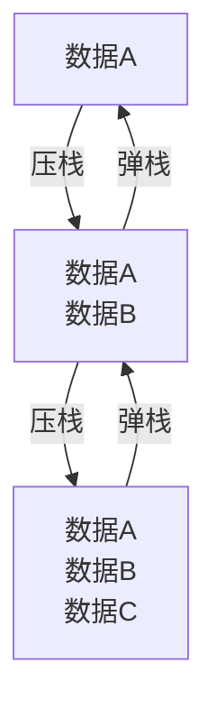

#### 5.2 队列（Queue）

> 队列是 **<span style="color:blue">先进先出</span>** 的线性表，像排队——**两端都开口**。

| 位置 | 操作 | 方向 |
| --- | --- | --- |
| 后端（rear） | 入队 / offer | 元素**从后端进入** |
| 前端（front） | 出队 / poll | 元素**从前端出去** |

#### 5.3 数组（Array）

> 数组在内存中**连续存储**，每个元素有固定下标（索引）。

| 优点 | 缺点 |
| --- | --- |
| <span style="color:green">查询速度快</span>：通过地址值 + 索引定位，查询任意数据耗时相同 | <span style="color:red">增删效率低</span>：新增 / 删除数据时，可能大批量移动数组中其他元素 |

#### 5.4 链表（Linked List）

> 链表中的结点是**独立的内存块**，结点之间通过"下一个结点地址"串联，**内存不连续**。

| 优点 | 缺点 |
| --- | --- |
| <span style="color:green">增删相对快</span>：只需要改变相邻结点的地址指向 | <span style="color:red">查询慢</span>：无论查哪个数据都要从头开始找 |

**单向链表 vs 双向链表**：

| 类型 | 存储内容 | 遍历方向 |
| --- | --- | --- |
| <span style="color:blue">单向链表</span> | 数据 + 下一个结点地址 | 只能从头到尾 |
| <span style="color:green">双向链表</span> | 前一个结点地址 + 数据 + 下一个结点地址 | 可前后双向，**查找第 N 个元素**更灵活 |

**链表的插入过程**（在数据 A、C 之间插入 B）：

1. 数据 B 对应的下一个数据地址指向数据 C
2. 数据 A 对应的下一个数据地址指向数据 B

### 六、ArrayList 类

> `ArrayList` 底层是**数组**实现的，因此**根据索引查询元素快，增删相对慢**。

#### 6.1 长度可变原理

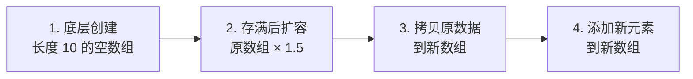

**四步概括**：① 初始长度 10 的空数组 → ② 存满后扩容 1.5 倍 → ③ 旧数据拷贝到新数组 → ④ 新元素添加到新数组。

#### 6.2 源码解析

| 步骤 | 行为 |
| --- | --- |
| ① | 使用**空参构造器**创建的集合，底层会创建一个**默认长度为 0** 的数组 |
| ② | **添加第一个元素**时，底层会创建一个**新的长度为 10** 的数组 |
| ③ | 数组**存满**时，会**扩容 1.5 倍** |

#### 6.3 LinkedList 类

> `LinkedList` 底层基于**双链表**实现：**查询元素慢，增删首尾元素非常快**。

| 特有方法 | 说明 |
| --- | --- |
| `public void addFirst(E e)` | 在该列表**开头**插入指定的元素 |
| `public void addLast(E e)` | 将指定的元素**追加到此列表的末尾** |
| `public E getFirst()` | 返回此列表中的**第一个**元素 |
| `public E getLast()` | 返回此列表中的**最后一个**元素 |
| `public E removeFirst()` | 从此列表中**删除并返回第一个**元素 |
| `public E removeLast()` | 从此列表中**删除并返回最后一个**元素 |

> <span style="color:orange">思考</span>：`LinkedList` 也有 `get(int index)` 方法，**表面看起来是根据索引获取元素，实际上要从头 / 尾开始逐个查找**，所以查询性能差；如果大量查询请用 `ArrayList`，大量首尾增删请用 `LinkedList`。

### 七、泛型（Generics）

> **JDK5 引入**的特性，可以在**编译阶段**约束操作的数据类型，并进行检查。

#### 7.1 泛型的好处

1. **统一数据类型**
2. **将运行期的错误提升到编译期**（编译时就能发现类型不匹配）

> <span style="color:red">⚠ 注意事项</span>：**泛型中只能编写引用数据类型**，不能写基本类型（要用包装类：`int` → `Integer`、`double` → `Double`）。

```java
// ❌ 错误
ArrayList<int> list = new ArrayList<>();

// ✅ 正确
ArrayList<Integer> list = new ArrayList<>();
```

#### 7.2 泛型类

> 在类名后用 `<E>` 声明类型占位符，类中即可用 `E` 表示"某种类型"。

```java
public class ArrayList<E> {
    public boolean add(E e) { ... }
}
```

#### 7.3 泛型方法

| 场景 | 泛型声明方式 |
| --- | --- |
| <span style="color:blue">非静态方法</span> | 泛型**根据类的泛型**去匹配 |
| <span style="color:green">静态方法</span> | 需要**自己声明独立的泛型**（静态先于对象存在，无法用类的泛型） |

```java
// 非静态：使用类上声明的 E
public class ArrayList<E> {
    public boolean add(E e) { ... }
}

// 静态：必须自己声明 <T>
public static <T> void printArray(T[] array) { ... }
```

#### 7.4 泛型接口

> 类实现带泛型的接口时，有两种操作方式：

1. **实现接口时直接确定类型**：`public class ArrayList<E> implements List<E>`
2. **保持接口的泛型，等创建对象时再确定**：`public class ArrayList<E> implements List<E>`

#### 7.5 泛型通配符 `?`

> 用于**方法形参**接收"任意类型"的集合，常配合上下限 `? extends T` / `? super T` 使用（进阶内容，留到后续章节）。

### 集合高级（2）

> 本篇聚焦 `Set` 家族（`TreeSet` / `HashSet` / `LinkedHashSet`）和 `Map` 家族（`HashMap` / `LinkedHashMap` / `TreeMap`）的实现原理、API 与遍历方式，以及 `Collections` 工具类的常用方法（含**可变参数**）。

### 一、Set 集合介绍

> `Set` 接口是 `Collection` 的子接口。`Set` 实现类有 3 个：`TreeSet` / `HashSet` / `LinkedHashSet`，整体特点是：**存取顺序不一致，没有跟索引有关的方法，不能存储重复元素**。

| 实现类 | 特点 | 底层 |
| --- | --- | --- |
| <span style="color:blue">TreeSet</span> | <span style="color:green">元素排序</span> | 红黑树 |
| <span style="color:green">HashSet</span> | <span style="color:orange">元素唯一</span>（不保证顺序） | 哈希表 |
| <span style="color:blue">LinkedHashSet</span> | 元素唯一，<span style="color:green">保证存取顺序</span> | 哈希表 + 双向链表 |

> <span style="color:orange">注意</span>：`Set` 没有索引，三种通用遍历方式（迭代器 / 增强 for / foreach）都可用，**普通 for 循环不可用**。

### 二、TreeSet 集合

> `TreeSet` 特点是元素**按规则排序**（默认自然排序 / 自定义比较器），本质底层是**红黑树**（一种自平衡的二叉查找树）。

#### 2.1 底层数据结构演进

| 数据结构 | 规则 | 缺点 |
| --- | --- | --- |
| 普通的二叉树 | 父结点只跟子结点相连 | 退化成链表时查询效率 O(n) |
| <span style="color:green">二叉查找树</span>（二叉排序树） | 小的存左边，大的存右边，一样的不存 | 数据倾斜时仍可能退化成链表 |
| <span style="color:blue">平衡二叉树</span> | 在满足查找二叉树规则下，让树尽可能矮小，提高查询性能 | 频繁旋转开销大 |
| <span style="color:green">红黑树</span>（TreeSet 实际用） | 近似平衡的二叉查找树，规则更灵活，旋转更少 | — |

#### 2.2 两种排序方式

> `TreeSet` 支持两种排序方式：**自然排序**（元素自身实现 `Comparable`）和**比较器排序**（构造时传入 `Comparator`）。

**自然排序三步骤**：

1. 类实现 `Comparable` 接口
2. 重写 `compareTo` 方法
3. 根据 `compareTo` 返回值组织排序规则：<span style="color:red">负数：左边走</span>、<span style="color:green">正数：右边走</span>、**0：不存**

```java
public class Student implements Comparable<Student> {
    @Override
    public int compareTo(Student o) {
        return this.age - o.age;   // 按年龄升序
    }
}
```

> <span style="color:orange">注意</span>：`TreeSet` 取出的顺序是**左中右**（中序遍历），`张三, 23 李四, 24 王五, 25 赵六, 26`。

**比较器排序**：当**同具备自然排序和比较器排序**时，**会优先按照比较器进行排序操作**。当 `String` / `Integer` / `Double` 等内置自然排序规则**不符合需求**时（如 `String` 是字典序，需要按长度排），使用比较器排序。

### 三、HashSet 集合

> `HashSet` 特点：<span style="color:green">元素唯一</span>、不保证顺序。底层是**哈希表**，因此**存取速度快**。

#### 3.1 `hashCode` 与 `equals` 配合流程

> 哈希值是一个 `int` 类型的随机值，Java 中每个对象都有一个哈希值（由 `Object.hashCode()` 底层 C++ 计算）。**自定义对象**必须按"内容"实现 `hashCode` + `equals`，否则重复元素识别不出来。

**`hashCode` 的作用**：定位元素应存入哪个桶（数组下标）；**`equals` 的作用**：同一桶内的元素**去重判断**。

```java
@Override
public boolean equals(Object o) {
    if (this == o) return true;
    if (o == null || getClass() != o.getClass()) return false;
    Student student = (Student) o;
    return age == student.age && Objects.equals(name, student.name);
}

@Override
public int hashCode() {
    return Objects.hash(name, age);
}
```

> <span style="color:red">⚠ 关键点</span>：根据对象内容生成 hash 值，**不同的对象 hash 值也可能相等**（如 `"重地"` 和 `"通话"`），这种现象叫 <span style="color:red">**哈希碰撞**</span>。

#### 3.2 HashSet 底层原理

> `HashSet` 底层就是 `HashMap`，存储流程基于**哈希表**（JDK 8 前后结构不同）。

| 版本 | 底层结构 |
| --- | --- |
| JDK 8 之前 | <span style="color:blue">数组 + 链表</span> |
| JDK 8 之后 | <span style="color:green">数组 + 链表 + 红黑树</span> |

**哈希表存储数据的详细流程**：

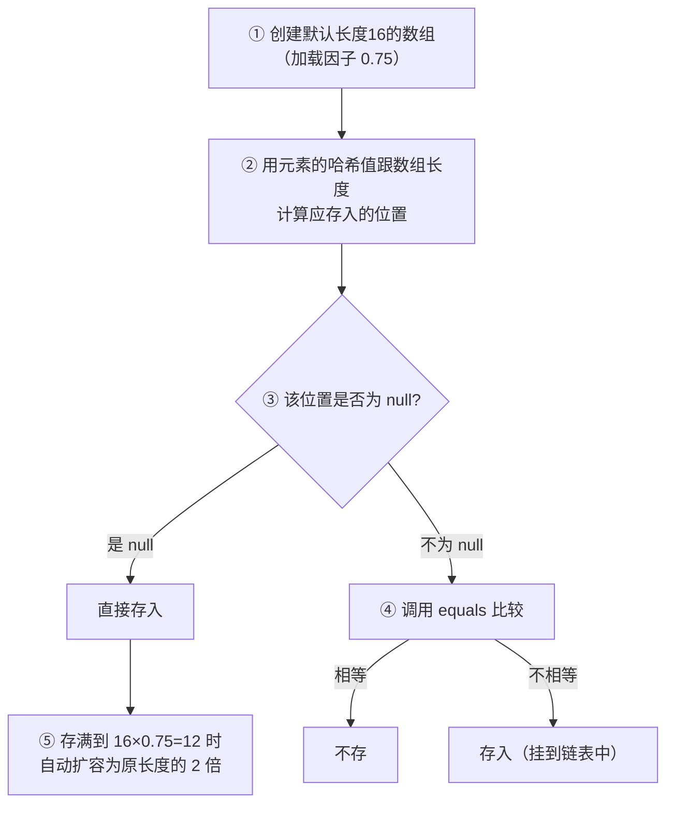

| 关键参数 | 默认值 |
| --- | --- |
| 初始数组长度 | 16 |
| 加载因子 | 0.75 |
| 扩容触发点 | 元素数 = 16 × 0.75 = 12 |
| 扩容规则 | 每次扩为原来的 2 倍 |

> <span style="color:orange">注意</span>：JDK 8 之前是**新元素占老元素位置、老元素挂下面**；JDK 8 之后是**新元素直接挂在老元素下面**。当**链表长度超过 8 且数组长度 ≥ 64**时，链表自动转成**红黑树**提升查询性能。

### 四、LinkedHashSet 集合

> `LinkedHashSet` **依然是基于哈希表**（数组 + 链表 + 红黑树）实现的，**但每个元素额外多了一个双向链表**机制记录前后元素位置——所以**保证存取顺序**。

- 元素唯一 ✔（继承自 `HashSet`）
- 保证存取顺序 ✔（多了一条双向链表）
- 效率<span style="color:red">低于</span>`HashSet`（多维护一条链表）

### 五、Collections 工具类

> `java.util.Collections` 是**集合工具类**，提供操作集合的静态方法。

#### 5.1 可变参数（Varargs）

> 可变参数用在形参中可以接收多个数据，本质在方法内部就是一个**数组**。

| 格式 | 说明 |
| --- | --- |
| `数据类型...参数名称` | 只能写在形参列表中 |

**调用方式灵活**：可以不传参数、传 1 个或多个、传一个数组。

> <span style="color:red">⚠ 注意事项</span>：
> 1. **一个形参列表中可变参数只能有一个**
> 2. **可变参数必须放在形参列表的最<span style="color:red">后面</span>**

```java
public static int sum(int... nums) {     // 本质 int[] nums
    int total = 0;
    for (int n : nums) total += n;
    return total;
}

sum();              // 0
sum(1, 2, 3);       // 6
sum(new int[]{1,2});// 3
```

### 六、Map 集合介绍

> `Map` 是<span style="color:green">键值对集合</span>，**一次添加两个元素**。需要存储**一对应**的数据时，优先考虑 `Map`。

| 实现类 | 键的特点 |
| --- | --- |
| <span style="color:blue">HashMap</span> | 按键<span style="color:blue">无序</span>，不重复，无索引 |
| <span style="color:green">LinkedHashMap</span> | 按键<span style="color:green">有序</span>，不重复，无索引 |
| <span style="color:orange">TreeMap</span> | 按键<span style="color:orange">排序</span>，不重复，无索引 |

> 三个实现类的值**都不做要求**（可重复、可为 null）。

#### 6.1 常见 API

> `Map` 是双列集合的**顶层接口**，它的功能是**全部双列集合**都可以使用的。

| 方法 | 说明 |
| --- | --- |
| `V put(K key, V value)` | 添加元素 |
| `V remove(Object key)` | 根据键删除键值对元素 |
| `void clear()` | 移除所有的键值对元素 |
| `boolean containsKey(Object key)` | 判断集合是否包含指定的**键** |
| `boolean containsValue(Object value)` | 判断集合是否包含指定的**值** |
| `boolean isEmpty()` | 判断集合是否为空 |
| `int size()` | 集合的长度（键值对的个数） |

#### 6.2 三种遍历方式

| 方式 | 核心方法 | 适用场景 |
| --- | --- | --- |
| <span style="color:blue">通过键找值</span> | `keySet()` + `get(key)` | 只想用键的遍历 |
| <span style="color:green">通过键值对对象</span> | `entrySet()` + `Map.Entry` | 同时拿键和值（推荐） |
| <span style="color:orange">通过 `forEach`</span> | `forEach(BiConsumer)` | Lambda 风格 |

**方式 1：通过键找值**（分 3 步）

```java
Set<String> keys = map.keySet();          // ① 获取所有键
for (String key : keys) {                 // ② 遍历 Set 集合
    String value = map.get(key);          // ③ 根据键找值
    System.out.println(key + "=" + value);
}
```

**方式 2：通过键值对对象**（核心是 `Map.Entry`）

```java
// Map.Entry 内部接口的方法
K getKey();      // 获取键
V getValue();    // 获取值

Set<Map.Entry<String, String>> entries = map.entrySet();
for (Map.Entry<String, String> entry : entries) {
    System.out.println(entry.getKey() + "=" + entry.getValue());
}
```

**方式 3：通过 `forEach`**（Lambda）

```java
map.forEach((key, value) -> System.out.println(key + "=" + value));
```

### 七、Map 集合的实现类

| 实现类 | 键的底层 |
| --- | --- |
| <span style="color:blue">TreeMap</span> | 红黑树 |
| <span style="color:green">HashMap</span> | 哈希表 |
| <span style="color:orange">LinkedHashMap</span> | 哈希表 + 双向链表 |

#### 7.1 HashMap 底层原理

> `HashMap` 与 `HashSet` 底层结构**完全相同**：哈希表。

| 版本 | 结构 | 重要升级 |
| --- | --- | --- |
| JDK 8 之前 | 数组 + 链表 | — |
| <span style="color:green">JDK 8 开始</span> | 数组 + 链表 + <span style="color:green">红黑树</span> | 链表长度 > 8 且数组长度 ≥ 64 时自动转红黑树 |

**`map.put("键", "值")` 的存储过程**：

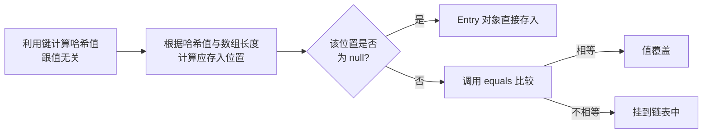

#### 7.2 LinkedHashMap

底层是**哈希表 + 双向链表**，与 `LinkedHashSet` 同理——哈希表保证键唯一，双向链表保证**存取顺序**。

#### 7.3 TreeMap

底层是**红黑树**，键按**排序**组织。`Comparable` / `Comparator` 两种排序方式与 `TreeSet` 一致。

### 八、Set / List / Map 选择速查

| 需求 | 推荐集合 | 底层 |
| --- | --- | --- |
| 元素可重复 | <span style="color:green">ArrayList</span>（用的最多） | 数组 |
| 元素可重复，<span style="color:red">增删明显多于查询</span> | LinkedList | 链表 |
| 元素去重 | <span style="color:green">HashSet</span>（用的最多） | 哈希表 |
| 元素去重，且<span style="color:green">保证存取顺序</span> | LinkedHashSet | 哈希表 + 双向链表 |
| 元素<span style="color:orange">排序</span> | TreeSet | 红黑树 |

### 九、练习：统计字符出现次数

> **需求**：字符串 `aababcabcdabcde`，统计每个字符出现次数，按 `a(5)b(4)c(3)d(2)e(1)` 格式输出。

```java
public class CharCount {
    public static void main(String[] args) {
        String s = "aababcabcdabcde";
        Map<Character, Integer> map = new LinkedHashMap<>(); // 保证输出顺序
        for (int i = 0; i < s.length(); i++) {
            char c = s.charAt(i);
            map.merge(c, 1, Integer::sum);     // 简化 put 逻辑
        }

        StringBuilder sb = new StringBuilder();
        map.forEach((k, v) -> sb.append(k).append('(').append(v).append(')'));
        System.out.println(sb);                 // a(5)b(4)c(3)d(2)e(1)
    }
}
```

> <span style="color:orange">注意</span>：用 `LinkedHashMap` 而不是 `HashMap`，是为了**保证输出顺序与首次出现顺序一致**。

## 第十三章：Stream 流

> <span style="color:blue">Stream 流</span> 配合 **Lambda 表达式**使用，可以<span style="color:green">简化集合和数组操作</span>。其思想类似"工厂流水线"：**原料（数据）→ 加工（中间方法）→ 出厂（终结方法）**，每一步都可以灵活组合，写出**链式编程**风格的代码。

### 一、Stream 流思想三步骤

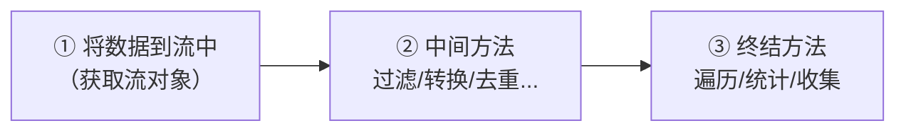

| 步骤 | 关键点 |
| --- | --- |
| ① 获取流对象 | 把集合/数组/零散数据"上"到流水线 |
| ② 中间方法 | 调用后**返回新的 Stream**，可继续链式调用 |
| ③ 终结方法 | 调用后<span style="color:red">流被消费</span>，链式调用结束 |

### 二、获取 Stream 流对象

> 共有 3 种获取方式，根据数据来源选择。

| 数据来源 | 调用方式 | 方法签名 |
| --- | --- | --- |
| <span style="color:blue">集合</span> | `Collection` 接口中的**默认方法** | `default Stream<E> stream()` |
| <span style="color:green">数组</span> | `Arrays` 工具类的**静态方法** | `static <T> Stream<T> stream(T[] array)` |
| <span style="color:orange">零散数据</span> | `Stream` 接口中的**静态方法** | `static <T> Stream<T> of(T... values)` |

```java
// ① 集合
List<String> list = ...;
Stream<String> s1 = list.stream();

// ② 数组
Integer[] arr = {1, 2, 3};
Stream<Integer> s2 = Arrays.stream(arr);

// ③ 零散数据
Stream<String> s3 = Stream.of("a", "b", "c");
```

### 三、Stream 中间操作方法

> 中间方法调用后返回**新的 Stream**，支持链式编程。

| 方法签名 | 说明 |
| --- | --- |
| `Stream<T> filter(Predicate<? super T> predicate)` | 用于对流中的数据进行<span style="color:green">过滤</span> |
| `Stream<T> limit(long maxSize)` | 获取前几个元素 |
| `Stream<T> skip(long n)` | 跳过前几个元素 |
| `Stream<T> distinct()` | 去除流中重复的元素（依赖 `hashCode` 和 `equals`） |
| `static <T> Stream<T> concat(Stream a, Stream b)` | <span style="color:orange">合并</span> a 和 b 两个流为一个流 |
| `Stream<R> map(Function<? super T, ? extends R> mapper)` | 对流中的每一个元素进行**转换** |

> <span style="color:red">⚠ 注意事项</span>：**如果流对象已经被消费过，就不允许再次使用**。每个流对象**只能终结一次**，多次调用终结方法会抛 `IllegalStateException`。

```java
// 链式编程：用 limit + concat + distinct 一气呵成
Stream<String> s1 = list.stream().limit(4);
Stream<String> s2 = list.stream().skip(2);
Stream<String> s3 = Stream.concat(s1, s2);
s3.distinct().forEach(System.out::println);   // 消费 s3 后流就关闭
```

### 四、Stream 终结操作方法

> 终结方法调用后**流被关闭**，链式结束。

| 方法签名 | 说明 |
| --- | --- |
| `void forEach(Consumer action)` | 对此流的每个元素执行**遍历**操作 |
| `long count()` | 返回此流中的**元素数** |

### 五、Stream 收集操作

> Stream 流操作**不会修改数据源**，操作完成后若需要重新得到集合/数组，需要用 `collect` 方法。

```java
// 把流中的数据转回集合
R collect(Collector collector);
```

`Collectors` 工具类提供 3 种常用收集方式：

| 静态方法 | 作用 |
| --- | --- |
| `public static <T> Collector toList()` | 把元素收集到 <span style="color:blue">List</span> 集合中 |
| `public static <T> Collector toSet()` | 把元素收集到 <span style="color:green">Set</span> 集合中 |
| `public static Collector toMap(Function keyMapper, Function valueMapper)` | 把元素收集到 <span style="color:orange">Map</span> 集合中 |

#### 5.1 收集到 Map 示例

> **需求**：将 `ArrayList` 中的 `"zhangsan,23"` / `"lisi,24"` / `"wangwu,25"` 收集到 `Map<姓名, 年龄>`。

```java
ArrayList<String> list = new ArrayList<>();
Collections.addAll(list, "zhangsan,23", "lisi,24", "wangwu,25");

Map<String, Integer> map = list.stream()
        .collect(Collectors.toMap(
                s -> s.split(",")[0],   // 键：姓名
                s -> Integer.parseInt(s.split(",")[1])  // 值：年龄
        ));
// {zhangsan=23, lisi=24, wangwu=25}
```

#### 5.2 综合练习：演员信息处理

> **需求**：两个 `ArrayList` 集合分别存储 6 名男演员和 6 名女演员。
> 1. <span style="color:green">男演员只要名字为 3 个字的前两人</span>
> 2. <span style="color:green">女演员只要姓林的，并且不要第一个</span>
> 3. 把过滤后的男演员姓名和女演员姓名<span style="color:orange">合并</span>到一起
> 4. 把合并后的元素作为构造方法的参数创建 `Actor` 对象，遍历数据
> 5. 演员类 `Actor` 含一个成员变量、一个带参构造方法、对应 get / set 方法

```java
// 演员类
public class Actor {
    private String name;
    public Actor(String name) { this.name = name; }
    public String getName() { return name; }
    public void setName(String name) { this.name = name; }
}

// 处理
ArrayList<String> males = new ArrayList<>(Arrays.asList(
        "蔡徐坤", "李易峰", "王俊凯", "易烊千玺", "陈伟霆", "邓伦"));
ArrayList<String> females = new ArrayList<>(Arrays.asList(
        "林允儿", "林志玲", "杨幂", "赵丽颖", "刘亦菲", "林心如"));

Stream<String> m = males.stream().filter(s -> s.length() == 3).limit(2);
Stream<String> f = females.stream().filter(s -> s.startsWith("林")).skip(1);
Stream.concat(m, f).map(Actor::new).forEach(a -> System.out.println(a.getName()));
```

## 第十四章：异常

> <span style="color:blue">异常</span> 指的是程序在**编译或执行过程**中，出现的非正常的情况（错误）。常见如 `ArrayIndexOutOfBoundsException` / `ClassCastException` / `NullPointerException`。**语法错误不是异常**。

### 一、异常体系

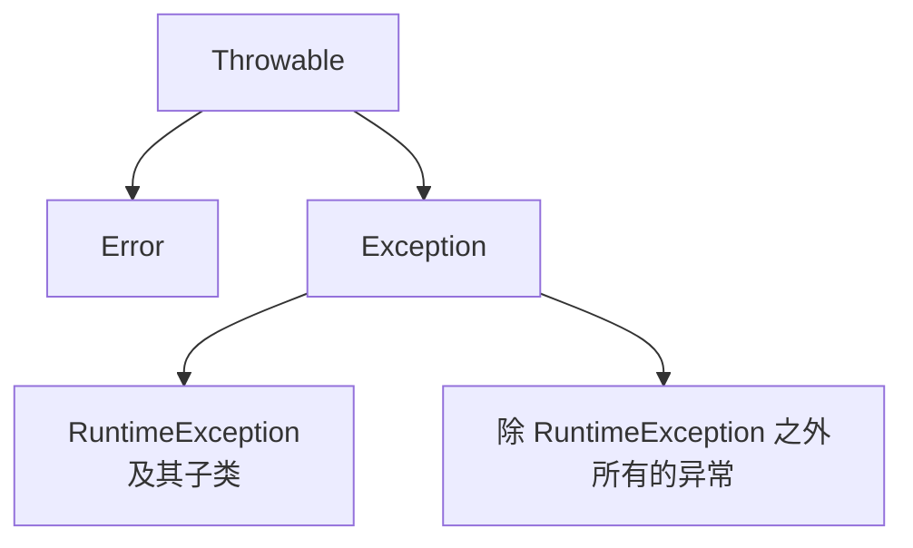

| 父类 | 子类 | 性质 | 举例 |
| --- | --- | --- | --- |
| <span style="color:red">Error</span> | 严重级别问题 | <span style="color:red">无法处理</span> | `StackOverflowError`（栈内存溢出）、`OutOfMemoryError`（堆内存溢出） |
| <span style="color:blue">Exception</span> | 异常类，程序常见错误 | 可处理 | 见下分类 |

#### 1.1 Exception 两大类

| 分类 | 触发时机 | 常见异常 | 原因 |
| --- | --- | --- | --- |
| <span style="color:blue">运行时异常</span>（`RuntimeException` 及其子类） | 编译不报错，<span style="color:orange">运行时可能</span>出错 | 数组索引越界 `ArrayIndexOutOfBoundsException`、空指针 `NullPointerException`、类型转换 `ClassCastException` | 程序员代码<span style="color:red">不严谨</span> |
| <span style="color:green">编译时异常</span>（除 `RuntimeException` 外） | <span style="color:red">编译阶段就报错</span> | `new FileReader("D:\\A.txt")` | 起到**提醒**作用，需提前处理 |

> <span style="color:orange">注意</span>：**编译时异常不报错，运行时可能报错**；**编译时异常没继承 RuntimeException，编译阶段就会出错**。

### 二、异常的默认处理流程

> 不做任何处理时，JVM 的默认行为：

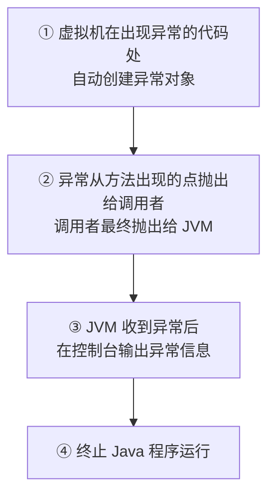

### 三、异常处理方式

> Java 提供 <span style="color:blue">2 种</span> 主动处理方式：**捕获（try...catch）**和**抛出（throws / throw）**。

#### 3.1 `try...catch`：捕获异常

> 优点：**程序可以继续往下执行**。

```java
try {
    // 可能会出现异常的代码
} catch (异常类型1 变量) {
    // 处理异常的方案
} catch (异常类型2 变量) {
    // 处理异常的方案
}
```

> <span style="color:red">⚠ 关键点</span>：**如果使用多个 catch，最大的异常需要放在最后**（父类在后）。

**`Throwable` 常见方法**：

| 方法 | 说明 |
| --- | --- |
| `public String getMessage()` | 获取异常的**错误原因**（简短） |
| `public void printStackTrace()` | 展示**完整的**异常错误信息（最常用） |

#### 3.2 `throws`：抛出异常

> 用在**方法名后面**，声明"这个方法存在异常，但不做处理，交给调用方处理"。

```java
public void method() throws 异常1, 异常2, 异常3... { }
```

> <span style="color:red">⚠ 关键点</span>：**子类重写父类方法时，不能抛出父类没有的异常，或者比父类更大的异常**。

#### 3.3 两种方式怎么选

| 方式 | 出现问题时 | 选择依据 |
| --- | --- | --- |
| <span style="color:blue">try...catch</span> | 程序可以**继续**执行 | 问题**不需要暴露**给调用者 |
| <span style="color:orange">throws 抛出</span> | 程序在**错误点停止** | 问题**需要暴露**出去 |

> 思路：看这个问题是否需要暴露出来 → <span style="color:green">需要：抛出</span>，<span style="color:green">不需要：try...catch</span>。

#### 3.4 `throw` vs `throws`

| 关键字 | 位置 | 后面跟 | 作用 |
| --- | --- | --- | --- |
| <span style="color:blue">`throw`</span> | **方法体中** | 异常对象 | 抛出异常对象 |
| <span style="color:green">`throws`</span> | **方法名后面** | 异常类型 | 声明方法存在异常 |

> <span style="color:orange">细节</span>：抛出的异常对象如果是<span style="color:red">编译时异常</span>，**必须使用 `throws` 声明**；如果是<span style="color:green">运行时异常</span>，则不需要写 `throws`。

### 四、自定义异常

> Java 无法为这个世界上**全部的问题**提供异常类。当企业想用**异常管理某个业务问题**时，需要自定义异常类。

#### 4.1 两类自定义异常

| 类型 | 父类 | 步骤 |
| --- | --- | --- |
| <span style="color:blue">自定义编译时异常</span> | 继承 `Exception` | ① 定义类 ② 重写构造器 |
| <span style="color:green">自定义运行时异常</span> | 继承 `RuntimeException` | ① 定义类 ② 重写构造器 |

#### 4.2 示例：自定义业务异常

```java
// 1. 自定义运行时异常
public class AgeOutOfRangeException extends RuntimeException {
    public AgeOutOfRangeException() { super(); }
    public AgeOutOfRangeException(String message) { super(message); }
}

// 2. 业务方法中抛出
public void setAge(int age) {
    if (age < 0 || age > 150) {
        throw new AgeOutOfRangeException("年龄超出范围: " + age);
    }
    this.age = age;
}

// 3. 调用方捕获
try {
    setAge(200);
} catch (AgeOutOfRangeException e) {
    System.out.println(e.getMessage());   // 年龄超出范围: 200
}
```

> <span style="color:green">好处</span>：通过自定义异常可以**精准表达特定错误**（比通用 `Exception` 更有语义）。

## 第十五章：File 类、递归

> `File` 类是**操作系统文件对象**（文件、文件夹）的 Java 封装，本章先掌握 `File` 的 API，再学习**递归**——用 `File` 遍历多层目录的关键。

### 一、File 类创建对象

> `File` 封装的对象**仅仅是一个路径名**，这个路径可以存在，也可以不存在。

| 构造方法 | 说明 |
| --- | --- |
| `public File(String pathname)` | 根据**文件路径**创建文件对象 |
| `public File(String parent, String child)` | 根据**父路径 + 子路径**字符串创建文件对象 |
| `public File(File parent, String child)` | 根据**父路径 File 对象 + 子路径**字符串创建文件对象 |

#### 1.1 绝对路径 vs 相对路径

| 路径类型 | 含义 | 示例 |
| --- | --- | --- |
| <span style="color:blue">绝对路径</span> | 从<span style="color:green">盘符根目录</span>开始，到具体的文件或文件夹 | `new File("D:\\A.txt")` |
| <span style="color:orange">相对路径</span> | 相对于<span style="color:orange">当前项目</span>的所在目录 | `new File("A.txt")`（实际路径是"项目根\\A.txt"） |

### 二、File 类常用 API

#### 2.1 判断方法

| 方法 | 说明 |
| --- | --- |
| `public boolean isDirectory()` | 判断是否为<span style="color:blue">文件夹</span> |
| `public boolean isFile()` | 判断是否为<span style="color:green">文件</span> |
| `public boolean exists()` | 判断路径是否<span style="color:orange">存在</span> |

#### 2.2 获取信息方法

| 方法 | 说明 |
| --- | --- |
| `public long length()` | 返回文件的**大小**（字节数） |
| `public String getAbsolutePath()` | 返回文件的<span style="color:blue">绝对路径</span> |
| `public String getPath()` | 返回**定义文件时**使用的路径 |
| `public String getName()` | 返回文件的**名称**，带后缀 |
| `public long lastModified()` | 返回文件的**最后修改时间**（时间毫秒值） |

#### 2.3 创建和删除方法

| 方法 | 说明 |
| --- | --- |
| `public boolean createNewFile()` | 创建一个**新的空文件** |
| `public boolean mkdir()` | 只能创建<span style="color:orange">一级文件夹</span> |
| `public boolean mkdirs()` | 可以创建**多级文件夹**（推荐） |
| `public boolean delete()` | 删除文件或<span style="color:red">空文件夹</span> |

> <span style="color:red">⚠ 关键点</span>：`delete()` 方法**只能删除空文件夹**，且**不走回收站**（不可恢复）。

#### 2.4 遍历方法

| 方法 | 说明 |
| --- | --- |
| `public File[] listFiles()` | 获取当前目录下所有的**一级文件对象**（不包含子目录内容） |

> <span style="color:orange">注意</span>：`listFiles()` 返回值的 4 种情况：
> - 路径<span style="color:red">不存在</span> → 返回 `null`
> - 路径是<span style="color:red">文件</span> → 返回 `null`
> - 路径是<span style="color:green">空文件夹</span> → 返回长度为 `0` 的数组
> - 路径是<span style="color:red">需权限</span>才能访问的文件夹 → 返回 `null`

### 三、递归

> <span style="color:blue">递归</span> 是指**方法直接或者间接调用本身**。它的核心思路是：**将大问题层层转化为与原问题相似、规模更小的问题**来解决。

> <span style="color:red">⚠ 关键点</span>：递归如果**没有控制好终止**，会出现**递归死循环**，导致<span style="color:red">栈内存溢出</span>（`StackOverflowError`）。

#### 3.1 案例：求 5 的阶乘

> 推导：5! = 5 × 4!、4! = 4 × 3!、…、1! = 1。

```java
public class RecursionDemo1 {
    public static void main(String[] args) {
        int result = jc(5);
        System.out.println(result);   // 120
    }

    public static int jc(int num) {
        if (num == 1) {
            return 1;                    // 终止条件
        }
        return num * jc(num - 1);        // 自己调自己，参数规模更小
    }
}
```

**递归栈帧**：

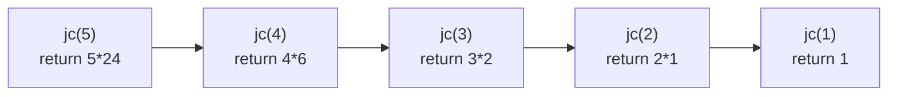

#### 3.2 案例：不死神兔（斐波那契数列）

> **题目**：一对兔子，从出生后**第 3 个月起**每个月都生一对兔子，小兔子长到第 3 个月后又生一对。假设兔子都不死，问**第 20 个月**的兔子对数为多少？

> **规律**：从第 3 个月开始，兔子对数 = 前两个月之和。

| 月 | 1 | 2 | 3 | 4 | 5 | 6 | 7 | 8 | ... |
| --- | --- | --- | --- | --- | --- | --- | --- | --- | --- |
| 对数 | 1 | 1 | 2 | 3 | 5 | 8 | 13 | 21 | ... |

```java
public static int rabbit(int month) {
    if (month == 1 || month == 2) return 1;
    return rabbit(month - 1) + rabbit(month - 2);
}
```

#### 3.3 递归使用场景

> 常用于**逻辑类似的业务**：文件遍历、目录树、阶乘、斐波那契等。

### 四、递归案例实战

#### 4.1 找出所有 `.java` 文件（含子目录）

> **需求**：键盘录入一个文件夹路径，找出这个文件夹下**所有**的 `.java` 文件（包括子文件夹）。
> **思路**：单层用 `listFiles()` 即可，子文件夹需要<span style="color:green">递归</span>进入查找。

```java
public static void findJava(File dir, ArrayList<String> list) {
    File[] files = dir.listFiles();
    if (files == null) return;

    for (File f : files) {
        if (f.isFile() && f.getName().endsWith(".java")) {
            list.add(f.getAbsolutePath());
        } else if (f.isDirectory()) {
            findJava(f, list);                 // 递归
        }
    }
}
```

#### 4.2 递归删除文件夹

> **注意**：`delete()` 只能删除**空文件夹**，所以要**先删子再删自己**（后序遍历）。

```java
public static void deleteDir(File dir) {
    File[] files = dir.listFiles();
    if (files == null) return;

    for (File f : files) {
        if (f.isFile()) {
            f.delete();                       // 文件直接删
        } else if (f.isDirectory()) {
            deleteDir(f);                     // 递归
        }
    }
    dir.delete();                             // 最后删自己
}
```

#### 4.3 递归统计文件夹大小

> **思路**：文件夹 = 所有文件大小之和；遇到子文件夹继续递归。

```java
public static long sizeOf(File dir) {
    long total = 0;
    File[] files = dir.listFiles();
    if (files == null) return 0;

    for (File f : files) {
        if (f.isFile()) {
            total += f.length();
        } else if (f.isDirectory()) {
            total += sizeOf(f);
        }
    }
    return total;
}
```

### 五、键盘录入路径案例

> **需求**：键盘录入一个文件夹路径，如果输入错误就给出提示，**并继续录入，直到正确为止**。

**分析**：输入的路径**可能不存在**或**是文件路径**，所以需用 `exists()` + `isDirectory()` 双重判断。

```java
Scanner sc = new Scanner(System.in);
File dir;
while (true) {
    System.out.print("请输入文件夹路径: ");
    String path = sc.nextLine();
    dir = new File(path);
    if (!dir.exists()) {
        System.out.println("路径不存在，请重新输入");
    } else if (!dir.isDirectory()) {
        System.out.println("不是文件夹，请重新输入");
    } else {
        break;
    }
}
System.out.println("已找到文件夹: " + dir.getAbsolutePath());
```

## 第十六章：常用 API

> Java 提供了一系列"工具类"来完成数学计算、系统操作、日期处理等通用任务。本章覆盖 `Math`、`System`、包装类、`BigDecimal`、`Arrays`、`Date`、`SimpleDateFormat`、`LocalDateTime` / `LocalDate` / `LocalTime`、`DateTimeFormatter` 以及时间间隔工具 `ChronoUnit` / `Duration` / `Period`。

### 一、Math 类

> `Math` 类是用于**执行基本数字运算**的工具类，所有方法都是 `static` 修饰，可直接通过类名调用。

| 方法名 | 说明 |
| --- | --- |
| `public static int abs(int a)` | 获取参数绝对值 |
| `public static double ceil(double a)` | 向上取整 |
| `public static double floor(double a)` | 向下取整 |
| `public static int round(float a)` | 四舍五入 |
| `public static int max(int a, int b)` | 获取两个 int 值中的较大值 |
| `public static double pow(double a, double b)` | 返回 a 的 b 次幂的值 |
| `public static double random()` | 返回值为 double 的随机值，范围 `[0.0, 1.0)` |

### 二、System 类

> `System` 的功能是静态的，**都是直接用类名调用即可**。

| 方法名 | 说明 |
| --- | --- |
| `public static void exit(int status)` | 终止当前运行的 Java 虚拟机，非零表示异常终止 |
| `public static long currentTimeMillis()` | 返回当前系统的时间毫秒值形式 |
| `public static void arraycopy(数据源数组, 起始索引, 目的地数组, 起始索引, 拷贝个数)` | 数组拷贝 |

> <span style="color:orange">时间原点小知识</span>：计算机中的时间原点是 **1970 年 1 月 1 日 08:00:00**。1969 年 8 月贝尔实验室的肯·汤普逊利用妻子离开一个月的机会开发了 Unix，使用 B 编译语言在 PDP-7 上开发，随后丹尼斯·里奇改进了 B 语言，开发出 C 语言重写了 Unix，因此 **1970 年 1 月 1 日 也算 C 语言的生日**。

### 三、包装类

> Java 是面向对象的语言，但基本类型（如 `int`、`double`）不是对象，无法调用方法或参与泛型。**包装类的作用就是将基本数据类型包装成类**（变成引用数据类型），从而可以创建对象、调用方法解决问题。

| 基本数据类型 | 引用数据类型 | 基本数据类型 | 引用数据类型 |
| --- | --- | --- | --- |
| <span style="color:green">byte</span> | <span style="color:green">Byte</span> | <span style="color:green">float</span> | <span style="color:green">Float</span> |
| <span style="color:green">short</span> | <span style="color:green">Short</span> | <span style="color:green">double</span> | <span style="color:green">Double</span> |
| <span style="color:green">int</span> | <span style="color:green">Integer</span> | <span style="color:green">boolean</span> | <span style="color:green">Boolean</span> |
| <span style="color:green">long</span> | <span style="color:green">Long</span> | <span style="color:red">char</span> | <span style="color:red">Character</span> |

> <span style="color:red">⚠ 注意事项</span>：除了 `int → Integer` 和 `char → Character` 是"特殊拼写"外，其他都是基本类型首字母大写。

#### 3.1 Integer 类

> 用于将基本数据类型**手动包装为类**。

| 构造 / 方法 | 说明 |
| --- | --- |
| <span style="color:red">`public Integer(int value)`</span> | ~~已过时，不推荐使用~~ |
| <span style="color:green">`public static Integer valueOf(int i)`</span> | **推荐**通过静态方法装箱 |

> <span style="color:orange">说明</span>：从 JDK9 开始 `new Integer(int)` 构造方法已被标记为过时，建议使用 `valueOf` 或自动装箱。

#### 3.2 自动装箱与自动拆箱

| 名称 | 解释 |
| --- | --- |
| <span style="color:blue">自动装箱</span> | 基本类型的数据和变量**可以直接赋值给包装类型的变量** |
| <span style="color:green">自动拆箱</span> | 包装类型的变量**可以直接赋值给基本数据类型的变量** |

```java
Integer i = 10;        // 自动装箱
int n = i;             // 自动拆箱
int result = i + 100;  // 拆箱后参与运算
```

> <span style="color:green">简单记</span>：有了自动拆装箱，**基本数据类型和对应的包装类，可以直接运算**，操作起来非常便捷。

#### 3.3 包装类练习

> **需求**：已知字符串 `String s = "10,50,30,20,40"`，请将该字符串转换为整数并存入数组，随后求出最大值打印在控制台。

```java
String s = "10,50,30,20,40";
String[] arr = s.split(",");
int[] nums = new int[arr.length];
int max = nums[0];
for (int i = 0; i < arr.length; i++) {
    nums[i] = Integer.parseInt(arr[i]);   // 字符串 → int
    if (nums[i] > max) {
        max = nums[i];
    }
}
System.out.println("最大值: " + max);
```

### 四、BigDecimal 类

> 用于**解决小数运算中出现的不精确问题**。例如：

```java
double num1 = 0.1;
double num2 = 0.2;
System.out.println(num1 + num2);   // 0.30000000000000004
```

#### 4.1 创建对象

| 构造 / 方法 | 说明 |
| --- | --- |
| `public BigDecimal(double val)` | 通过 double 创建（**不推荐**，仍有精度问题） |
| <span style="color:green">`public BigDecimal(String val)`</span> | 通过字符串创建，<span style="color:green">推荐</span> |
| <span style="color:green">`public static BigDecimal valueOf(double val)`</span> | 静态方法，<span style="color:green">推荐</span> |

#### 4.2 常用方法

| 方法名 | 说明 |
| --- | --- |
| `public BigDecimal add(BigDecimal b)` | 加法 |
| `public BigDecimal subtract(BigDecimal b)` | 减法 |
| `public BigDecimal multiply(BigDecimal b)` | 乘法 |
| `public BigDecimal divide(BigDecimal b)` | 除法 |
| `public BigDecimal divide(另一个 BigDecimal 对象, 精确几位, 舍入模式)` | 除法（精确控制） |

#### 4.3 divide 除法细节

> 除法运算需要注意**除不尽**的情况，必须指定保留位数与舍入模式。

```java
BigDecimal divide = bd1.divide(参与运算的对象, 小数点后精确到多少位, 舍入模式);
```

| 舍入模式 | 含义 |
| --- | --- |
| `RoundingMode.UP` | <span style="color:orange">进一法</span> |
| `RoundingMode.DOWN` | <span style="color:orange">去尾法</span> |
| `RoundingMode.HALF_UP` | <span style="color:orange">四舍五入</span> |

```java
BigDecimal a = new BigDecimal("10");
BigDecimal b = new BigDecimal("3");
BigDecimal r = a.divide(b, 2, RoundingMode.HALF_UP);  // 3.33
```

> <span style="color:orange">小结</span>：BigDecimal 用于解决小数运算的精度损失问题；创建对象推荐 `BigDecimal(String)` 或 `static valueOf(double)`；除法运算要注意除不尽的情况。

### 五、Arrays 类

> 数组操作工具类，**专门用于操作数组元素**。

| 方法名 | 说明 |
| --- | --- |
| `public static String toString(类型[] a)` | 将数组元素拼接为带格式的字符串 |
| `public static boolean equals(类型[] a, 类型[] b)` | 比较两个数组内容是否相同 |
| `public static int binarySearch(int[] a, int key)` | 查找元素在数组中的索引（<span style="color:red">二分查找法</span>） |
| `public static void sort(类型[] a)` | 对数组进行默认升序排序 |

#### 5.1 二分查找原理

> 二分查找的**前提：必须是排好序的数据**。每次取中间位置元素与目标值比较：
> - 中间元素 < 目标值 → 往右半区查找
> - 中间元素 > 目标值 → 往左半区查找
> - 中间元素 = 目标值 → 找到


> <span style="color:red">⚠ 注意</span>：如果查找的元素不在数组中，`binarySearch` 会返回**负数**（即 - (插入点 + 1)）。

```java
int[] arr = {11, 22, 33, 44, 55, 66, 77, 88, 99, 100};
int idx = Arrays.binarySearch(arr, 88);   // 7
```

### 六、Date 类

> `Date` 代表**日期和时间**，位于 `java.util` 包下。

| 构造器 | 说明 |
| --- | --- |
| `public Date()` | 创建一个 `Date` 对象，代表系统当前此刻的日期时间 |
| `public Date(long time)` | 把时间毫秒值转换成 `Date` 日期对象 |

| 常见方法 | 说明 |
| --- | --- |
| `public long getTime()` | 返回从 1970 年 1 月 1 日 00:00:00 走到此列的总毫秒数 |
| `public void setTime(long time)` | 设置日期对象的时间为当前时间毫秒值对应的时间 |

```java
Date d1 = new Date();
System.out.println(d1);                    // 当前时间
System.out.println(d1.getTime());          // 当前时间毫秒值
Date d2 = new Date(0L);                    // 时间原点
System.out.println(d2);                    // Thu Jan 01 08:00:00 CST 1970
```

> <span style="color:orange">小结</span>：① `Date` 对象创建 → `new Date()`；② 获取时间毫秒值 → `getTime()`；③ 时间毫秒值转 `Date` 对象 → `new Date(long time)` 或 `setTime(long time)`。

### 七、SimpleDateFormat 类

> 用于**日期格式化**（`Date` → 字符串）和**解析**（字符串 → `Date`）。

#### 7.1 构造器与格式化方法

| 分类 | 方法名 | 说明 |
| --- | --- | --- |
| <span style="color:blue">构造器</span> | `public SimpleDateFormat()` | 构造一个 SimpleDateFormat，使用**默认格式** |
| <span style="color:blue">构造器</span> | `public SimpleDateFormat(String pattern)` | 构造一个 SimpleDateFormat，使用**指定的格式** |
| <span style="color:green">格式化方法</span> | `public final String format(Date date)` | 将日期格式化成日期/时间字符串 |
| <span style="color:green">格式化方法</span> | `public final Date parse(String source)` | 将字符串解析为日期类型 |

```java
SimpleDateFormat sdf = new SimpleDateFormat("yyyy-MM-dd HH:mm:ss");
Date d = new Date();
String s = sdf.format(d);                  // Date → 字符串
Date d2 = sdf.parse("2025-01-20 15:30:00"); // 字符串 → Date
```

> <span style="color:orange">常用格式符号</span>：`yyyy`（年）`MM`（月）`dd`（日）`HH`（时）`mm`（分）`ss`（秒）。

### 八、JDK8 新增的时间 API

> JDK8 之后新增的时间 API 设计更合理、**功能丰富、使用方便**，主要特点：
> 1. 都是**不可变对象**，修改后会返回新的时间对象，不会丢失最开始的时间
> 2. <span style="color:green">线程安全</span>
> 3. <span style="color:green">能精确到毫秒、纳秒</span>

#### 8.1 LocalDateTime / LocalDate / LocalTime

| 类 | 含义 |
| --- | --- |
| <span style="color:blue">LocalDate</span> | 代表本地日期（年、月、日、星期） |
| <span style="color:blue">LocalTime</span> | 代表本地时间（时、分、秒、纳秒） |
| <span style="color:red">LocalDateTime</span> | 代表本地日期 + 时间（年、月、日、星期、时、分、秒、纳秒） |

**获取对象**：

| 方法 | 示例 |
| --- | --- |
| `public static Xxxx now()`：获取系统当前时间对应的该对象 | `LocalDate ld = LocalDate.now();`<br>`LocalTime lt = LocalTime.now();`<br>`LocalDateTime ldt = LocalDateTime.now();` |
| `public static Xxxx of(...)`：获取指定时间的对象 | `LocalDate.of(2099, 11, 11)`<br>`LocalTime.of(9, 8, 59)`<br>`LocalDateTime.of(2025, 11, 16, 14, 30, 1)` |

**获取年月日时分秒相关的方法**：

| 方法名 | 功能 |
| --- | --- |
| `int getYear()` | 获取年份字段 |
| `Month getMonth()` | 使用 Month 枚举获取年份字段 |
| `int getMonthValue()` | 获取 1 到 12 之间的月份字段 |
| `int getDayOfMonth()` | 获取日期字段 |
| `DayOfWeek getDayOfWeek()` | 获取星期几字段，即枚举 DayOfWeek |
| `int getHour()` | 获取当日时间字段 |
| `int getMinute()` | 获取分钟字段 |
| `int getSecond()` | 获取秒字段 |

**修改年月日时分秒相关的方法**：

> `LocalDateTime` / `LocalDate` / `LocalTime` 都是**不可变**的，下列方法返回的是**一个新的对象**。

| 方法名 | 说明 |
| --- | --- |
| `withHour`、`withMinute`、`withSecond`、`withNano` | <span style="color:blue">修改时间，返回新时间对象</span> |
| `plusHours`、`plusMinutes`、`plusSeconds`、`plusNanos` | 把某个信息<span style="color:green">加</span>多少，返回新时间对象 |
| `minusHours`、`minusMinutes`、`minusSeconds`、`minusNanos` | 把某个信息<span style="color:red">减</span>多少，返回新时间对象 |
| `equals` / `isBefore` / `isAfter` | 判断 2 个时间对象是否相等，在前还是在后 |

```java
LocalDateTime ldt = LocalDateTime.now();
LocalDateTime newLdt = ldt
        .withHour(10)               // 修改小时
        .plusDays(7)                // 加 7 天
        .minusHours(2);             // 减 2 小时
```

#### 8.2 DateTimeFormatter

> 用于**时间的格式化和解析**，是 JDK8 新增时间 API 的"格式器"。

| 方法名 | 说明 |
| --- | --- |
| `static DateTimeFormatter ofPattern(格式)` | <span style="color:green">获取格式对象</span> |
| `String format(时间对象)` | 按照指定方式格式化 |

```java
DateTimeFormatter dtf = DateTimeFormatter.ofPattern("yyyy-MM-dd HH:mm:ss");
LocalDateTime ldt = LocalDateTime.now();
String s = dtf.format(ldt);                     // 格式化
LocalDateTime ldt2 = LocalDateTime.parse(s, dtf); // 解析
```

### 九、时间间隔工具类

> 用于**计算时间间隔**，JDK8 提供了三个工具：

| 类 | 用途 |
| --- | --- |
| <span style="color:blue">Duration</span> | 用于计算两个"**时间**"间隔（秒、纳秒） |
| <span style="color:green">Period</span> | 用于计算两个"**日期**"间隔（年、月、日） |
| <span style="color:orange">ChronoUnit</span> | 用于计算两个"**日期**"间隔 |

```java
// 计算两个 LocalDateTime 之间相差的天、时、分
LocalDateTime start = LocalDateTime.of(2025, 1, 1, 0, 0, 0);
LocalDateTime end   = LocalDateTime.now();

long days  = ChronoUnit.DAYS.between(start, end);
long hours = ChronoUnit.HOURS.between(start, end);
long mins  = ChronoUnit.MINUTES.between(start, end);
```

> <span style="color:orange">案例</span>：根据用户填写的生日计算年龄——使用 `Period.between(birth, today)` 取得"年、月、日"三段间隔，进而精确计算周岁。

```java
LocalDate birth = LocalDate.of(1990, 12, 1);
LocalDate today = LocalDate.now();
Period p = Period.between(birth, today);
System.out.println("年龄：" + p.getYears() + " 岁 "
        + p.getMonths() + " 月 " + p.getDays() + " 天");
```

## 第十七章：IO 流

> IO 是 "Input / Output" 的缩写，意为**输入 / 输出**，本质是**数据传输**。常见场景：读写配置文件 / 日志文件、客户端与服务端通讯、文件上传下载等。

### 一、IO 介绍和分类

#### 1.1 IO 流向

> 把外存中的数据**读取**到内存中称为"输入"（读），把内存中的数据**写出**到外存中称为"输出"（写）。

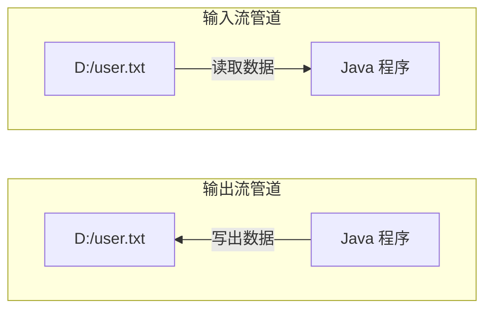

#### 1.2 IO 流体系结构

> IO 流按"数据单位"分为两大体系：**字节流**（万能流，所有文件都能操作）和**字符流**（纯文本文件专用，能解决中文乱码）。

| 分类 | 抽象类 | 说明 | 抽象类的子类 |
| --- | --- | --- | --- |
| <span style="color:orange">字节流</span>（万能流） | `InputStream` | 字节输入流 | `FileInputStream` |
| 字节流 | `OutputStream` | 字节输出流 | `FileOutputStream` |
| <span style="color:blue">字符流</span>（纯文本） | `Reader` | 字符输入流 | `FileReader` |
| 字符流 | `Writer` | 字符输出流 | `FileWriter` |

> <span style="color:orange">小结</span>：**字符流使用场景：读写纯文本文件；字节流使用场景：不是纯文本文件都用字节流**。

### 二、FileOutputStream 字节输出流

> `FileOutputStream` 是**字节输出流**的子类，用于把 Java 程序的数据写出到文件（如 `D:\A.txt`）。

#### 2.1 构造方法

| 构造方法 | 说明 |
| --- | --- |
| `FileOutputStream(String name)` | 输出流关联文件，文件路径以**字符串**形式给出 |
| `FileOutputStream(String name, boolean append)` | 第二个参数是<span style="color:green">追加写入</span>的开关 |
| `FileOutputStream(File file)` | 输出流关联文件，文件路径以 `File` 对象形式给出 |
| `FileOutputStream(File file, boolean append)` | 第二个参数是追加写入的开关 |

> <span style="color:red">⚠ 注意事项</span>：① 关联的文件如果**不存在会自动创建**；② 如果文件已存在，默认会<span style="color:red">清空原有的内容</span>再重新写入（除非开启追加模式）。

#### 2.2 成员方法

| 方法 | 说明 |
| --- | --- |
| `void write(int b)` | 写出<span style="color:orange">单个字节</span> |
| `void write(byte[] b)` | 写出一个<span style="color:orange">字节数组</span> |
| `void write(byte[] b, int off, int len)` | 写出字节数组的<span style="color:orange">一部分</span> |

```java
// 示例：写出数据
FileOutputStream fos = new FileOutputStream("D:\\A.txt", true);  // 追加写入
fos.write(97);                      // 写出单个字节 'a'
fos.write("Hello".getBytes());      // 写出整个字符串
fos.close();                        // 关闭流，释放资源
```

### 三、关流与异常处理

> 流对象使用完毕后，<span style="color:red">记得调用 `close` 方法关闭，不然会占用资源</span>。

#### 3.1 JDK7 之后的 try-with-resources 写法

> `try` 后面的**小括号**里可以直接写需要关闭的对象，**前提是该对象实现了 `AutoCloseable` 接口**。

```java
try (FileOutputStream fos = new FileOutputStream("D:\\A.txt")) {
    fos.write("Hello".getBytes());
} catch (IOException e) {
    e.printStackTrace();
}
```

> <span style="color:green">优势</span>：① 自动调用 `close()` 释放资源；② 代码更简洁，**避免忘记关流**。

### 四、FileInputStream 字节输入流

> `FileInputStream` 是字节输入流，用于**读取**文件中的数据到 Java 程序（如把 `D:\A.txt` 的内容读进来）。

#### 4.1 构造方法

| 构造方法 | 说明 |
| --- | --- |
| `FileInputStream(String name)` | 输入流关联文件，文件路径以字符串形式给出 |
| `FileInputStream(File file)` | 输入流关联文件，文件路径以 `File` 对象形式给出 |

> <span style="color:red">⚠ 注意事项</span>：① 关联的**文件不存在**会抛出 `FileNotFoundException` 异常；② 文件夹的话会拒绝访问。

#### 4.2 成员方法

| 方法 | 说明 |
| --- | --- |
| `int read()` | 读取一个字节并返回，如果到达文件结尾则返回 **-1** |
| `int read(byte[] b)` | 将读取到字节放到传入的数组，<span style="color:green">返回读取到的有效字节个数</span>，到达文件结尾则返回 -1 |

```java
// 方式一：单字节读取（效率低）
try (FileInputStream fis = new FileInputStream("D:\\A.txt")) {
    int b;
    while ((b = fis.read()) != -1) {
        System.out.print((char) b);
    }
} catch (IOException e) {
    e.printStackTrace();
}

// 方式二：字节数组读取（推荐，效率高）
try (FileInputStream fis = new FileInputStream("D:\\A.txt")) {
    byte[] bys = new byte[2];
    int len;
    while ((len = fis.read(bys)) != -1) {
        System.out.print(new String(bys, 0, len));
    }
} catch (IOException e) {
    e.printStackTrace();
}
```

#### 4.3 String 构造方法（配合使用）

| 构造方法 | 说明 |
| --- | --- |
| `public String(byte[] bytes, int offset, int length)` | 将字节数组转换为字符串，参数 1：字节数组；参数 2：起始索引；参数 3：转换的个数 |

### 五、文件拷贝案例

> **需求**：将 `D:\嘿嘿.jpg` 拷贝到 `E:\` 根目录下。

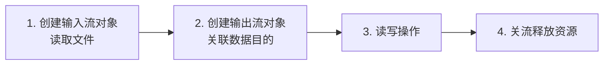

```java
try (
    FileInputStream fis = new FileInputStream("D:\\嘿嘿.jpg");
    FileOutputStream fos = new FileOutputStream("E:\\嘿嘿.jpg")
) {
    byte[] bys = new byte[1024];
    int len;
    while ((len = fis.read(bys)) != -1) {
        fos.write(bys, 0, len);
    }
} catch (IOException e) {
    e.printStackTrace();
}
```

### 六、FileReader 字符输入流

> 用于**读取纯文本文件**，能解决**中文乱码问题**。

| 分类 | 方法 | 说明 |
| --- | --- | --- |
| <span style="color:blue">构造</span> | `FileReader(String fileName)` | 字符输入流关联文件，路径以字符串形式给出 |
| 构造 | `FileReader(File file)` | 字符输入流关联文件，路径以 `File` 对象形式给出 |
| <span style="color:green">成员方法</span> | `public int read()` | 读取<span style="color:green">单个字符</span> |
| 成员方法 | `public int read(char[] cbuf)` | 读取一个字符数组，<span style="color:green">返回读取到的有效字符个数</span> |

### 七、FileWriter 字符输出流

#### 7.1 构造方法

| 构造方法 | 说明 |
| --- | --- |
| `FileWriter(String fileName)` | 字符输出流关联文件，路径以字符串形式给出 |
| `FileWriter(String fileName, boolean append)` | 参数 2：<span style="color:green">追加写入</span>的开关 |
| `FileWriter(File file)` | 字符输出流关联文件，路径以 `File` 对象形式给出 |
| `FileWriter(File file, boolean append)` | 参数 2：追加写入的开关 |

#### 7.2 成员方法

| 方法 | 说明 |
| --- | --- |
| `public void write(int c)` | 写出<span style="color:blue">单个字符</span> |
| `public void write(char[] cbuf)` | 写出一个<span style="color:blue">字符数组</span> |
| `public void write(char[] cbuf, int off, int len)` | 写出字符数组的<span style="color:blue">一部分</span> |
| `public void write(String str)` | 写出<span style="color:blue">字符串</span> |
| `public void write(String str, int off, int len)` | 写出字符串的<span style="color:blue">一部分</span> |

> <span style="color:red">⚠ 注意事项</span>：字符输出流写出数据，**需要调用 `flush` 或 `close` 方法，数据才会写出**。
> - `flush()` 后可以继续写出
> - `close()` 后不能继续写出（流已关闭）

### 八、Properties 集合

> `Properties` 是 `java.util` 包下的类，<span style="color:blue">继承自 `Hashtable<Object, Object>`，本质是一个 Map 集合</span>，但**键和值都必须是 String**。

#### 8.1 作为集合使用

| 分类 | 方法 | 说明 |
| --- | --- | --- |
| <span style="color:blue">构造</span> | `Properties()` | 创建一个没有默认值的空属性列表 |
| <span style="color:green">成员方法</span> | `Object setProperty(String key, String value)` | 添加 / 修改一个键值对 |
| 成员方法 | `String getProperty(String key)` | 根据键获取值 |
| 成员方法 | `Set<String> stringPropertyNames()` | 获取集合中所有的键 |

```java
Properties prop = new Properties();
prop.setProperty("username", "admin");
prop.setProperty("password", "123456");
System.out.println(prop.getProperty("username"));  // admin
```

#### 8.2 和 IO 有关的方法

| 方法 | 说明 |
| --- | --- |
| `void load(InputStream inStream)` | 从输入**字节流**读取属性列表（键和元素对） |
| `void load(Reader reader)` | 从输入**字符流**读取属性列表（键和元素对） |
| `void store(OutputStream out, String comments)` | 将此属性列表写入输出**字节流**，以适合 `load(InputStream)` 方法的格式 |
| `void store(Writer writer, String comments)` | 将此属性列表写入输出**字符流**，以适合 `load(Reader)` 方法的格式 |

```java
// 把集合中的键值对写到配置文件
Properties prop = new Properties();
prop.setProperty("username", "admin");
prop.setProperty("password", "123456");
try (FileWriter fw = new FileWriter("config.properties")) {
    prop.store(fw, "user config");
}

// 从配置文件中读取键值对到集合
Properties prop2 = new Properties();
try (FileReader fr = new FileReader("config.properties")) {
    prop2.load(fr);
    System.out.println(prop2.getProperty("username"));
}
```

> <span style="color:orange">小结</span>：① `Properties` 本质就是 Map 集合，键值都是 String；② `setProperty(键,值)` 添加、`getProperty(键)` 取值；③ `load` 从流加载、`store` 写入流——**将来加载配置文件时很方便**。

### 九、HuTool 工具

#### 9.1 Hutool 介绍

> **Hutool** 是一个小而全的 Java 工具类库，**通过静态方法封装**，降低相关 API 的学习成本，提高工作效率。
>
> - 名称由来：`Hutool = Hu + tool`，是原公司项目底层代码剥离后的开源库，**"Hu" 是公司名称的表示，tool 表示工具**
> - 谐音"糊涂"，一方面简洁易用，一方面寓意"难得糊涂"

#### 9.2 Hutool 常用 API

> Hutool 不是 JDK 自带的，**使用时需要导入 `jar` 包**（后续学习 Maven 可简化此操作）。

**`IoUtil` 类提供的部分方法**：

| 方法 | 说明 |
| --- | --- |
| `copy(InputStream in, OutputStream out, int bufferSize)` | 字节流拷贝 |
| `copy(Reader reader, Writer writer)` | 字符流拷贝 |
| `readLines(Reader reader, Collection<String> collection)` | 按行读取内容到集合 |
| `close(Closeable closeables)` | <span style="color:green">安全关闭流</span> |

**`FileUtil` 类提供的部分方法**：

| 方法 | 说明 |
| --- | --- |
| `touch(filePath)` | <span style="color:green">创建文件</span>（自动创建父目录） |
| `mkdir(dirPath)` | <span style="color:green">创建目录</span>（支持多级目录） |
| `copy(srcPath, destPath, isOverride)` | 复制文件或目录（可选覆盖） |
| `move(srcFile, destDir, isOverride)` | <span style="color:green">移动</span>文件或目录 |

> <span style="color:orange">Tips</span>：Hutool 导入 jar 包的方式较为繁琐，<span style="color:green">后面学到 Maven 的时候可以简化</span>。

## 第十八章：多线程

> 多线程是 Java 编程中非常重要的特性，用于**提高程序执行效率**和**同时处理多个任务**。本章从进程和线程的概念讲起，逐步深入到 Java 线程的创建、线程安全、线程同步以及线程池的使用。

### 一、进程和线程

#### 1.1 进程介绍

> **进程（Process）** 是计算机中的程序关于某数据集合上的一次运行活动，是系统进行**资源分配的基本单位**。简单理解为**程序的执行过程**。

**进程的特点**：

| 特点 | 说明 |
| --- | --- |
| <span style="color:green">独立性</span> | 每一个进程都有自己的空间，在没有经过进程本身允许的情况下，一个进程不可以直接访问其它的进程空间 |
| <span style="color:orange">动态性</span> | 进程是动态产生、动态消亡的 |
| <span style="color:blue">并发性</span> | 任何进程都可以同其它进程一起并发执行 |

> <span style="color:orange">小结</span>：进程是程序的执行过程，具有独立性、动态性、并发性。对于一个 CPU 而言，它是在**多个进程间轮换执行**的。

#### 1.2 并行和并发

> **并行**：在同一时刻，有多个指令在多个 CPU 上<span style="color:green">同时</span>执行。
> **并发**：在同一时刻，有多个指令在单个 CPU 上<span style="color:orange">交替</span>执行。

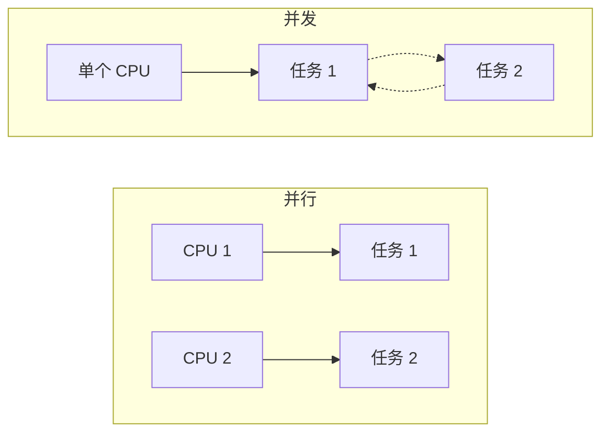

#### 1.3 线程介绍

> **线程（Thread）**：进程可以同时执行多个任务，<span style="color:green">每个任务就是一个线程</span>。例如：360 安全卫士中的"电脑清理"和"电脑杀毒"是同一个进程中的不同线程。

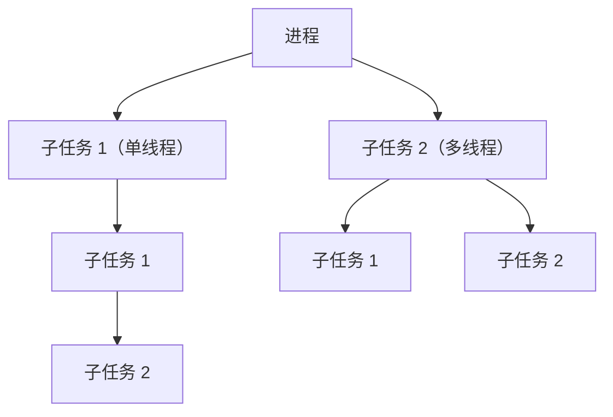

#### 1.4 多线程的意义

> 随着处理器上的**核心数量越来越多**，现在大多数计算机都比以往更加擅长**并行计算**。一个线程，在一个时刻，**只能运行在一个处理器核心上**。

**多线程的两个核心作用**：

| 作用 | 说明 |
| --- | --- |
| <span style="color:green">提高执行效率</span> | 多个任务并行执行，节省时间 |
| <span style="color:blue">同时处理多个任务</span> | 一个应用可以同时处理多种业务（如下载 + 上传） |

> <span style="color:orange">小结</span>：线程是进程中的任务，<span style="color:green">多线程就是多个任务</span>。多线程的意义在于**提高效率**、**可以同时处理多个任务**。

### 二、Java 开启线程的方式

> Java 中有三种方式可以开启线程：<span style="color:green">继承 Thread 类</span>、<span style="color:green">实现 Runnable 接口</span>、<span style="color:green">实现 Callable 接口</span>。<span style="color:red">推荐后两种方式</span>，因为它们扩展性更好（避免了单继承的局限性）。

| 方式 | 是否需要返回值 | 说明 |
| --- | --- | --- |
| <span style="color:blue">继承 Thread 类</span> | 无返回值 | 重写 `run()` 方法，调用 `start()` 启动线程 |
| <span style="color:green">实现 Runnable 接口</span> | <span style="color:green">线程任务无返回值</span> | 实现 `run()` 方法，传入 `Thread` 构造器启动 |
| <span style="color:orange">实现 Callable 接口</span> | <span style="color:orange">线程任务有返回值</span> | 实现 `call()` 方法，借助 `FutureTask` 启动 |

### 三、线程相关方法

#### 3.1 常用方法

> `Thread` 类提供了丰富的线程控制方法，**红色标记的是静态方法**。

| 方法名称 | 说明 |
| --- | --- |
| `String getName()` | 返回此线程的名称 |
| `void setName(String name)` | 设置线程的名字（构造方法也可以设置名字） |
| <span style="color:red">`static`</span> `Thread currentThread()` | 获取当前线程的对象 |
| <span style="color:red">`static`</span> `void sleep(long time)` | 让线程休眠指定的时间，单位为**毫秒** |
| `setPriority(int newPriority)` | 设置线程的优先级 |
| `final int getPriority()` | 获取线程的优先级 |
| `final void setDaemon(boolean on)` | 设置为<span style="color:orange">守护线程</span> |

```java
// 示例：获取并设置线程名
MyThread t1 = new MyThread("线程A");
MyThread t2 = new MyThread("线程B");

t1.setName("高铁");
t2.setName("飞机");

System.out.println(t1.getName());  // 高铁
System.out.println(t2.getName());  // 飞机

// Thread.currentThread()：获取当前线程对象
System.out.println(Thread.currentThread().getName());  // main
```

#### 3.2 线程调度方式

> Java 线程调度采用**抢占式调度**（线程优先级高的先获取 CPU 资源），但**结果随机**（因为多线程有随机性）。

| 调度方式 | 说明 |
| --- | --- |
| <span style="color:green">抢占式调度</span> | 优先级高的线程先抢占 CPU，<span style="color:green">Java 采用此方式</span> |
| 非抢占式调度 | 按顺序执行，公平但效率低 |

> <span style="color:orange">优先级范围</span>：**<span style="color:red">1 ~ 10</span>**，<span style="color:blue">默认值为 5</span>。优先级高只是**获取 CPU 资源的概率高**，不是绝对先执行。

```java
MyThread t1 = new MyThread("高铁");
MyThread t2 = new MyThread("飞机");

t1.setPriority(Thread.MIN_PRIORITY);  // 1
t2.setPriority(Thread.MAX_PRIORITY);  // 10

System.out.println(t1.getPriority());  // 1
System.out.println(t2.getPriority());  // 10
```

### 四、线程安全和同步

#### 4.1 线程安全的问题

> **需求**：某电影院目前正在上映国产大片，共有 **100 张票**，而它有 **3 个窗口**卖票。请设计一个程序模拟该电影院卖票。

```java
class Tickets implements Runnable {
    int tickets = 1;

    @Override
    public void run() {
        while (true) {
            if (tickets <= 0) {
                break;
            }
            System.out.println(Thread.currentThread().getName() + "卖出了第" + tickets + "号票");
            tickets--;
        }
    }
}
```

> 上面的代码存在**线程安全问题**：多个线程同时操作共享数据 `tickets`，可能导致卖出同一张票甚至卖出 0 号、-1 号票。

#### 4.2 线程安全问题分析

> 三个线程**同时**进入 `while` 循环，都读取到 `tickets = 1`，于是都"卖出了第 1 号票"，然后 `tickets--` 多次，结果出现重复卖票或卖出非法票号。

**安全问题出现的条件**：

| 条件 | 说明 |
| --- | --- |
| <span style="color:red">是多线程环境</span> | 必须有多个线程并发执行 |
| <span style="color:red">有共享数据</span> | 多个线程操作同一个数据 |
| <span style="color:red">有多条语句操作共享数据</span> | 多个操作共享数据的代码 |

#### 4.3 线程同步

> **同步技术**：将多条语句操作共享数据的代码<span style="color:green">锁</span>起来，让任意时刻**只能有一个线程**可以执行。

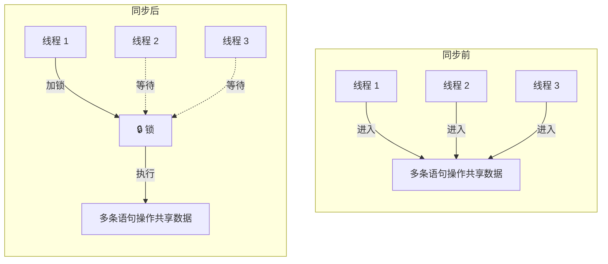

Java 提供三种同步方式：

| 方式 | 说明 |
| --- | --- |
| <span style="color:blue">同步代码块</span> | `synchronized(锁对象) { ... }` |
| <span style="color:green">同步方法</span> | 在方法返回值前加 `synchronized` 关键字 |
| <span style="color:orange">Lock 锁</span> | `java.util.concurrent.locks.Lock` 接口，更灵活 |

##### 4.3.1 同步代码块

```java
synchronized(锁对象) {
    多条语句操作共享数据的代码
}
```

> <span style="color:red">⚠ 注意事项</span>：
> - 锁对象可以是任意对象，但是需要保证多条线程的锁对象，<span style="color:red">是同一把锁</span>
> - 同步可以解决多线程的数据安全问题，但是<span style="color:orange">也会降低程序的运行效率</span>

```java
class Tickets implements Runnable {
    int tickets = 100;
    Object lock = new Object();  // 锁对象

    @Override
    public void run() {
        while (true) {
            synchronized (lock) {
                if (tickets <= 0) {
                    break;
                }
                System.out.println(Thread.currentThread().getName() + "卖出了第" + tickets + "号票");
                tickets--;
            }
        }
    }
}
```

##### 4.3.2 同步方法

> 在方法的**返回值类型前面**加入 `synchronized` 关键字。

```java
public synchronized void method() {
    // 多条语句操作共享数据的代码
}
```

> <span style="color:orange">小细节</span>：
> - 方法分为**静态**和**非静态**
> - <span style="color:blue">静态方法</span>的锁对象是**字节码对象**（`类名.class`）
> - <span style="color:green">非静态方法</span>的锁对象是 **`this`**

##### 4.3.3 Lock 锁

> 使用 `Lock` 锁，我们可以<span style="color:green">更清晰</span>地看到哪里加了锁，哪里释放了锁。相比 `synchronized`，Lock 锁**更灵活、性能更好**。

**对比**：

```java
// 方式一：同步代码块
synchronized(锁对象) {
    多条语句操作共享数据的代码
}

// 方式二：同步方法
public synchronized void method() { }

// 方式三：Lock 锁
lock.lock();
...
lock.unlock();
```

> `Lock` 是**接口**，无法直接创建对象。

| 构造方法 | 说明 |
| --- | --- |
| `public ReentrantLock()` | 创建一个 `ReentrantLock` 的实例 |

| 成员方法 | 说明 |
| --- | --- |
| `void lock()` | <span style="color:green">加锁</span> |
| `void unlock();` | <span style="color:orange">释放锁</span> |

```java
import java.util.concurrent.locks.ReentrantLock;
import java.util.concurrent.locks.Lock;

class Tickets implements Runnable {
    int tickets = 100;
    Lock lock = new ReentrantLock();

    @Override
    public void run() {
        while (true) {
            lock.lock();
            try {
                if (tickets <= 0) {
                    break;
                }
                System.out.println(Thread.currentThread().getName() + "卖出了第" + tickets + "号票");
                tickets--;
            } finally {
                lock.unlock();  // 无论是否异常，都需要释放锁
            }
        }
    }
}
```

### 五、线程池介绍

#### 5.1 线程池的好处

> **池**：提前创建好的一组资源（如数据库连接池、常量池）。<span style="color:green">将线程对象交给线程池维护</span>，可以**降低系统成本**，从而**提升程序的性能**。

**为什么需要线程池**：

| 问题 | 说明 |
| --- | --- |
| 创建成本高 | 系统创建一个线程的成本是比较高的，因为它涉及到与操作系统交互 |
| 资源浪费 | 当程序中需要创建大量生存期很短暂的线程时，频繁的创建和销毁线程，就会严重浪费系统资源 |

#### 5.2 线程池学习路径

> 学习线程池分三步：理解线程池的好处 → 使用 JDK 提供的线程池 → 自定义线程池。


> <span style="color:red">⚠【强制】</span>线程池**不允许使用 `Executors` 去创建**，而是通过 `ThreadPoolExecutor` 的方式，这样的处理方式让写的同学更加明确线程池的运行规则，规避资源耗尽的风险。
>
> **说明**：`Executors` 返回的线程池对象的弊端如下：
> 1. `FixedThreadPool` 和 `SingleThreadPool`：允许的请求队列长度为 `Integer.MAX_VALUE`，<span style="color:red">可能会堆积大量的请求</span>，从而导致 **OOM**。
> 2. `CachedThreadPool`：允许的创建线程数量为 `Integer.MAX_VALUE`，<span style="color:red">可能会创建大量的线程</span>，从而导致 **OOM**。

#### 5.3 使用 JDK 提供的线程池

> `Executors` 中提供静态方法来创建线程池（<span style="color:orange">了解即可，实际开发推荐使用 `ThreadPoolExecutor`</span>）。

| 方法 | 介绍 |
| --- | --- |
| `static ExecutorService newCachedThreadPool()` | 创建一个默认的线程池 |
| `static newFixedThreadPool(int nThreads)` | 创建一个指定最多线程数量的线程池 |

### 六、自定义线程池

#### 6.1 ThreadPoolExecutor 类

> `ThreadPoolExecutor` 是线程池的核心实现类，其构造方法有 **7 个参数**。

```java
ThreadPoolExecutor(int corePoolSize, int maximumPoolSize, long keepAliveTime, TimeUnit unit,
                   BlockingQueue<Runnable> workQueue, ThreadFactory threadFactory, RejectedExecutionHandler handler)
```

#### 6.2 参数详解

| 参数 | 含义 | 约束 |
| --- | --- | --- |
| 参数 1 | <span style="color:blue">核心线程数量</span>（<span style="color:orange">正式员工</span>） | 不能小于 0 |
| 参数 2 | <span style="color:green">最大线程数量</span>（<span style="color:orange">正式员工 + 临时工</span>） | 不能小于等于 0，<span style="color:red">最大数量 >= 核心线程数量</span> |
| 参数 3 | <span style="color:orange">空闲时间</span> | 不能小于 0 |
| 参数 4 | <span style="color:purple">时间单位</span> | 时间单位 |
| 参数 5 | <span style="color:green">任务队列</span>（<span style="color:orange">指定排队人数</span>） | 不能为 null |
| 参数 6 | <span style="color:red">线程对象工厂</span> | 不能为 null |
| 参数 7 | <span style="color:blue">拒绝策略</span> | 不能为 null |

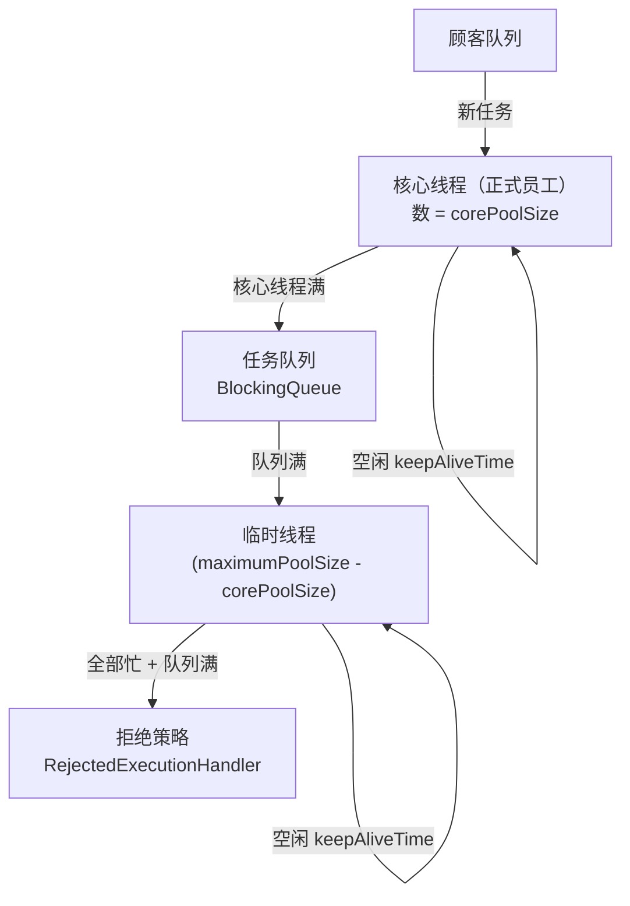

#### 6.3 线程池拒绝策略

| 策略选项 | 说明 |
| --- | --- |
| <span style="color:blue">`ThreadPoolExecutor.AbortPolicy`</span> | 丢弃任务并抛出 `RejectedExecutionException` 异常（<span style="color:red">默认</span>） |
| <span style="color:green">`ThreadPoolExecutor.DiscardPolicy`</span> | 丢弃任务，但是不抛出异常，<span style="color:red">这是不推荐的做法</span> |
| <span style="color:orange">`ThreadPoolExecutor.DiscardOldestPolicy`</span> | 抛弃队列中等待最久的任务，然后把当前任务加入队列中 |
| <span style="color:purple">`ThreadPoolExecutor.CallerRunsPolicy`</span> | 调用任务的 `run()` 方法，绕过线程池直接执行 |

#### 6.4 自定义线程池小结

> <span style="color:orange">思考</span>：临时线程什么时候创建？什么时候会开启拒绝策略？

| 问题 | 触发条件 |
| --- | --- |
| <span style="color:green">临时线程什么时候创建？</span> | 线程任务数 <span style="color:red">></span> <span style="color:blue">核心线程数</span> + 任务队列的数量 |
| <span style="color:orange">什么时候会开启拒绝策略？</span> | 线程任务数 <span style="color:red">></span> <span style="color:green">最大线程数</span> + 任务队列的数量 |

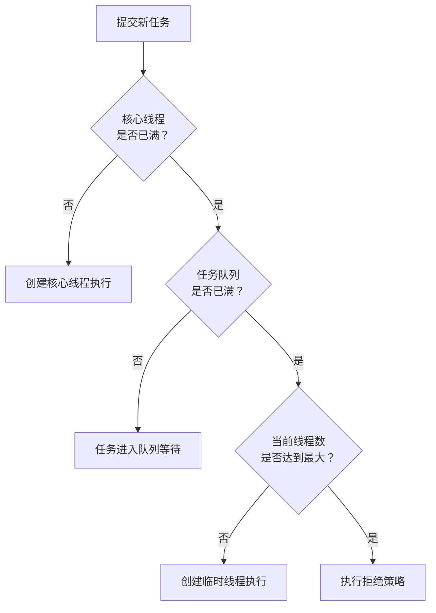

> <span style="color:orange">小结</span>：自定义线程池通过 `ThreadPoolExecutor` 的 7 个参数灵活控制线程池的行为。核心线程处理正常业务，任务队列起到缓冲作用，临时线程应对突发流量，拒绝策略保证系统在极端情况下不会崩溃。

## 第十九章：网络编程

> 网络编程是实现**设备间数据通信**的核心技术，本章从通信架构、网络三要素讲起，重点掌握 <span style="color:green">UDP</span> 和 <span style="color:green">TCP</span> 两种协议的数据收发方式。

### 一、网络编程基本概念

#### 1.1 网络编程

> **网络编程**是让设备中的程序与网络上**其他设备中的程序**进行数据交互的技术（实现<span style="color:green">网络通信</span>）。典型场景：手机与手机聊天、网页访问服务器。

#### 1.2 基本的通信架构

> 基本的通信架构有 **2 种**形式：<span style="color:green">CS 架构</span>、<span style="color:green">BS 架构</span>。

| 架构 | 全称 | 典型应用 | 特点 |
| --- | --- | --- | --- |
| <span style="color:green">CS 架构</span> | Client 客户端 / Server 服务端 | 微信、IntelliJ IDEA、网易云音乐 | 需要程序员开发客户端软件；需要用户下载安装客户端软件 |
| <span style="color:green">BS 架构</span> | Browser 浏览器 / Server 服务端 | Chrome、Edge、火狐浏览器访问网页 | 不需要程序员开发客户端；需要用户下载安装浏览器 |

> <span style="color:orange">⚠</span> 无论是 CS 架构，还是 BS 架构的软件都<span style="color:red">必须依赖网络编程</span>！Java 提供了哪些网络编程解决方案？**`java.net.*` 包下提供了网络编程的解决方案！**

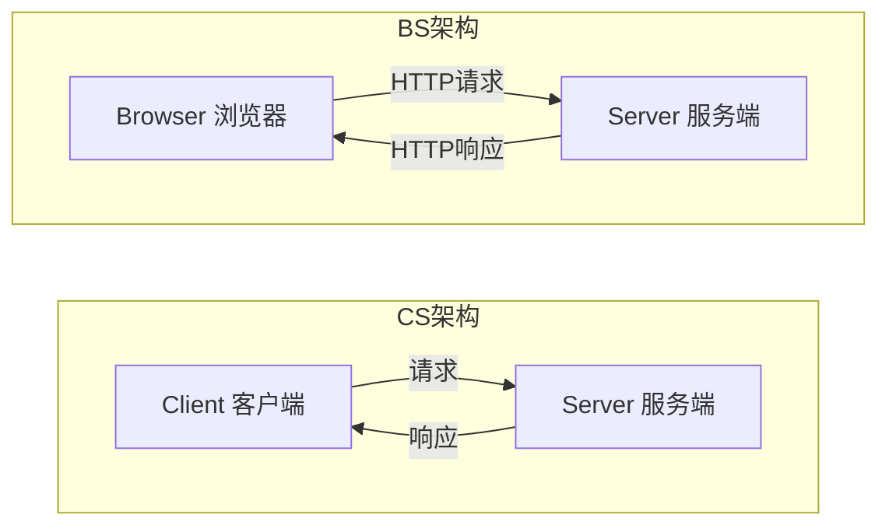

### 二、网络编程三要素

> **网络通信三要素**：<span style="color:red">IP 地址</span>、<span style="color:orange">端口</span>、<span style="color:green">协议</span>。

| 要素 | 含义 |
| --- | --- |
| <span style="color:red">01 IP 地址</span> | 设备在网络中的地址，<span style="color:red">是设备在网络中的唯一标识</span> |
| <span style="color:orange">02 端口</span> | 应用程序在设备中的<span style="color:red">唯一标识</span> |
| <span style="color:green">03 协议</span> | 连接和数据在网络中传输的<span style="color:red">规则</span> |

#### 2.1 IP 地址

> **IP（Internet Protocol）**：全称"互联网协议地址"，是分配给上网设备的唯一标识。目前，被广泛采用的 IP 地址形式有两种：<span style="color:green">IPv4</span>、<span style="color:green">IPv6</span>。

| 类别 | 位数 | 字节数 | 表示法 | 数量 |
| --- | --- | --- | --- | --- |
| <span style="color:green">IPv4</span> | 32 位 | 4 个字节 | <span style="color:red">点分十进制</span>（如 `192.168.1.66`） | 最多 `2^32` 个，<span style="color:red">目前已用完</span> |
| <span style="color:green">IPv6</span> | 128 位 | 16 个字节 | <span style="color:red">冒分十六进制</span>（如 `2001:0db8:0000:0023:0008:0800:200c:417a`） | 最多 `2^128` 个，<span style="color:green">可为地球上每一粒沙子编号</span> |

> <span style="color:orange">小细节</span>：IPv4 地址一般写成 `11000000.10101000.00000001.01000010`，转成十进制就是 `192.168.1.66`。

##### 2.1.1 IPv4 地址的分类形式

| 分类 | 说明 | 范围 |
| --- | --- | --- |
| <span style="color:green">公网地址</span> | 万维网使用 | — |
| <span style="color:orange">私有地址</span> | 局域网使用，专门为组织机构内部使用，以此节省 IP | `192.168.0.0 ~ 192.168.255.255` |

> <span style="color:orange">小结</span>：常见场景为网吧、公寓、商场、办公楼等小型组织内部使用 <span style="color:green">192.168.xxx.xxx</span> 的私有地址。

##### 2.1.2 特殊 IP 地址

> **`127.0.0.1`**（也可以是 `localhost`）：是**回送地址**也称**本地回环地址**，也称**本机 IP**，永远只会寻找当前所在本机。
> <span style="color:orange">建议</span>：自己练习就写 `127.0.0.1`。

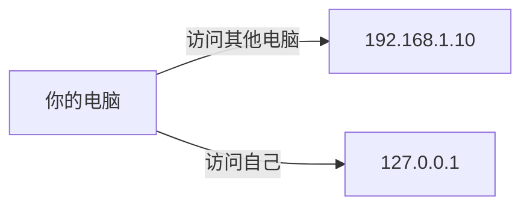

##### 2.1.3 IP 和域名

> 平时上网没有用过 IP，都是用网址的。浏览器访问服务器时，**先通过 DNS 服务器**把网址（域名）解析成 IP 地址，再去访问对应的服务器。

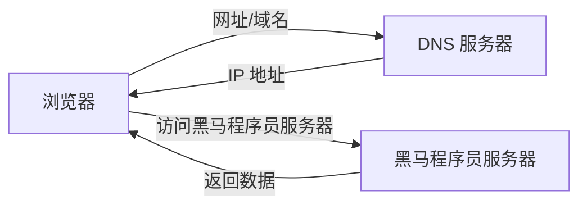

##### 2.1.4 常用的 CMD 命令

| 命令 | 说明 |
| --- | --- |
| `ipconfig` | 查看本机 IP 地址 |
| `ping` | 检查网络是否连通 |

> <span style="color:orange">小结</span>：
> - **现在如何解决 IPv4 不够的问题？** <span style="color:green">利用局域网 IP 解决 IP 不够的问题</span>
> - **特殊的 IP 是什么？** `127.0.0.1`（永远表示本机）
> - **常见的两个 CMD 命令？** `ipconfig`、`ping`

##### 2.1.5 InetAddress 类

> 为了方便对 IP 地址的获取和操作，Java 提供了 `InetAddress` 类。
> **`InetAddress`**：此类表示 Internet 协议（IP）地址。

| 方法名 | 说明 |
| --- | --- |
| <span style="color:red">`static`</span> `InetAddress getByName(String host)` | 确定主机名称的 IP 地址。主机名称可以是机器名称，也可以是 IP 地址 |
| `String getHostName()` | 获取此 IP 地址的主机名 |
| `String getHostAddress()` | 返回文本显示中的 IP 地址字符串 |

```java
import java.net.InetAddress;

public class InetAddressDemo {
    public static void main(String[] args) throws Exception {
        InetAddress address = InetAddress.getByName("DESKTOP-ABC123");
        // InetAddress address = InetAddress.getByName("192.168.1.100");

        System.out.println(address.getHostName());   // 主机名
        System.out.println(address.getHostAddress()); // IP 地址字符串
    }
}
```

#### 2.2 端口号

> **端口号**是应用程序在设备中**唯一的标识**。

| 项目 | 说明 |
| --- | --- |
| 范围 | <span style="color:red">0 ~ 65535</span>（由两个字节表示的整数） |
| 知名端口 | <span style="color:orange">0 ~ 1023</span> 用于一些知名的网络服务或者应用 |
| 自定义端口 | <span style="color:green">1024 以上</span> 端口号自己使用 |

> <span style="color:red">⚠ 注意</span>：一个端口号只能被一个应用程序使用。

```mermaid
flowchart LR
  subgraph 电脑A
    APP1["WeChat 6666"] --> P65533["65533 消息"]
    APP2["QQ 7777"] --> P65533
    APP3["Game 8888"] --> P65533
  end
  P65533 -->|"端口号"| 电脑B
```

#### 2.3 协议

> **计算机网络**中，连接和通信的规则被称为**网络通信协议**。常见的协议有 <span style="color:green">UDP 协议</span> 和 <span style="color:green">TCP 协议</span>。

##### 2.3.1 UDP 协议

> **用户数据报协议（User Datagram Protocol）**。
> - <span style="color:green">面向无连接</span>的通信协议
> - 速度快，有大小限制（<span style="color:red">一次最多发送 64K</span>）
> - 数据不安全，易丢失数据
> - 不管是否已经连接成功，都会发送
> - <span style="color:green">典型应用</span>：在线视频

##### 2.3.2 TCP 协议

> **传输控制协议 TCP（Transmission Control Protocol）**。
> - <span style="color:green">面向连接</span>的通信协议
> - 速度慢，没有大小限制，数据安全
> - 通过<span style="color:red">三次握手</span>建立连接
> - 通过<span style="color:red">四次挥手</span>断开连接
> - <span style="color:green">典型应用</span>：下载软件

```mermaid
flowchart LR
  subgraph 三次握手
    direction TB
    A1["客户端"] -->|"① 连接请求"| B1["服务器"]
    B1 -->|"② 响应"| A1
    A1 -->|"③ 确认"| B1
  end
  subgraph 四次挥手
    direction TB
    A2["客户端"] -->|"① 取消请求"| B2["服务器"]
    B2 -->|"② 响应"| A2
    B2 -->|"③ 处理数据后确认"| A2
    A2 -->|"④ 确认"| B2
  end
```

> <span style="color:orange">小结</span>：网络通信三要素是 IP 地址、端口、协议，<span style="color:green">三者缺一不可</span>。

### 三、UDP 协议收发数据

#### 3.1 UDP 协议发送数据

> 类比快递流程：① 找快递公司 → ② 打包礼物 → ③ 快递公司发送包裹 → ④ 付钱走人。

| 步骤 | 类比 | 代码对应 |
| --- | --- | --- |
| ① 找快递公司 | 找快递公司 | <span style="color:green">创建发送端的 `DatagramSocket` 对象</span> |
| ② 打包礼物 | 打包礼物 | <span style="color:green">数据打包（`DatagramPacket`）</span> |
| ③ 快递公司发送包裹 | 快递公司发送包裹 | <span style="color:green">发送数据</span> |
| ④ 付钱走人 | 付钱走人 | <span style="color:green">释放资源</span> |

```java
import java.net.DatagramPacket;
import java.net.DatagramSocket;
import java.net.InetAddress;

public class UDPSend {
    public static void main(String[] args) throws Exception {
        // ① 创建发送端的 DatagramSocket 对象
        DatagramSocket ds = new DatagramSocket();

        // ② 打包礼物（数据）
        String msg = "你好 UDP";
        byte[] bytes = msg.getBytes();
        InetAddress address = InetAddress.getByName("127.0.0.1");
        int port = 10086;

        DatagramPacket dp = new DatagramPacket(bytes, bytes.length, address, port);

        // ③ 发送数据
        ds.send(dp);

        // ④ 释放资源
        ds.close();
    }
}
```

#### 3.2 UDP 协议接收数据

> 类比快递流程：① 找快递公司 → ② 接收箱子 → ③ 从箱子里面获取礼物 → ④ 签收走人。

| 步骤 | 类比 | 代码对应 |
| --- | --- | --- |
| ① 找快递公司 | 找快递公司 | <span style="color:green">创建接收端的 `DatagramSocket` 对象</span> |
| ② 接收箱子 | 接收箱子 | <span style="color:green">接收打包好的数据</span> |
| ③ 从箱子里面获取礼物 | 从箱子里面获取礼物 | <span style="color:green">解析数据包</span> |
| ④ 签收走人 | 签收走人 | <span style="color:green">释放资源</span> |

```java
import java.net.DatagramPacket;
import java.net.DatagramSocket;

public class UDPReceive {
    public static void main(String[] args) throws Exception {
        // ① 创建接收端的 DatagramSocket 对象
        // 必须指定端口号，跟发送端一致
        DatagramSocket ds = new DatagramSocket(10086);

        // ② 接收打包好的数据
        byte[] bytes = new byte[1024];
        DatagramPacket dp = new DatagramPacket(bytes, bytes.length);

        // 该方法是阻塞的，会一直等发送端发送数据
        ds.receive(dp);

        // ③ 解析数据包
        byte[] data = dp.getData();
        int len = dp.getLength();
        String msg = new String(data, 0, len);
        System.out.println("数据是：" + msg);

        // ④ 释放资源
        ds.close();
    }
}
```

> <span style="color:orange">小结</span>：UDP 协议收发数据
> - 使用 `DatagramSocket` 搭建站点
> - 使用 `DatagramPacket` 打包数据
> - `send` 方法用于发送
> - `receive` 方法用于接收

### 四、TCP 协议收发数据

#### 4.1 TCP 通信程序

> TCP 通信严格区分<span style="color:green">客户端</span>和<span style="color:green">服务端</span>。

##### 4.1.1 客户端

| 步骤 | 说明 | API |
| --- | --- | --- |
| 1 | 创建 `Socket` 对象指定 IP 和端口 | `Socket(String host, int port)` |
| 2 | 通过 socket 对象获取传输数据的流对象 | `OutputStream getOutputStream()`、`InputStream getInputStream()` |
| 3 | 通过流对象收发数据 | — |
| 4 | 释放资源 | — |

> <span style="color:orange">提示</span>：这里的流对象不是读写文件中的数据
> - <span style="color:green">输出流</span>：写出数据到服务端
> - <span style="color:green">输入流</span>：读取服务端发送过来的数据

##### 4.1.2 服务端

| 步骤 | 说明 | API |
| --- | --- | --- |
| 1 | 创建 `ServerSocket` 对象指定端口 | `ServerSocket(int port)` |
| 2 | 响应客户端发送的请求 | `Socket accept()` |
| 3 | 通过 socket 对象获取传输数据的流对象 | `OutputStream getOutputStream()`、`InputStream getInputStream()` |
| 4 | 通过流对象收发数据 | — |
| 5 | 释放资源 | — |

```java
// ================ 客户端 ================
import java.io.OutputStream;
import java.net.Socket;

public class TCPClient {
    public static void main(String[] args) throws Exception {
        // 1. 创建 Socket 对象指定 IP 和端口
        Socket socket = new Socket("127.0.0.1", 10086);

        // 2. 通过 socket 对象获取输出流
        OutputStream os = socket.getOutputStream();

        // 3. 写出数据
        os.write("你好 TCP".getBytes());

        // 4. 释放资源
        os.close();
        socket.close();
    }
}

// ================ 服务端 ================
import java.io.InputStream;
import java.net.ServerSocket;
import java.net.Socket;

public class TCPServer {
    public static void main(String[] args) throws Exception {
        // 1. 创建 ServerSocket 对象指定端口
        ServerSocket ss = new ServerSocket(10086);

        // 2. 响应客户端发送的请求，得到 Socket 对象
        Socket socket = ss.accept();

        // 3. 通过 socket 对象获取输入流
        InputStream is = socket.getInputStream();

        // 4. 读取数据
        byte[] bytes = new byte[1024];
        int len = is.read(bytes);
        String msg = new String(bytes, 0, len);
        System.out.println("客户端发来：" + msg);

        // 5. 释放资源
        is.close();
        socket.close();
        ss.close();
    }
}
```

> <span style="color:orange">小结</span>：TCP 协议区分客户端和服务端
> - 客户端创建 `Socket` 对象，指定 IP 和端口号
> - 服务端创建 `ServerSocket` 对象，指定端口号
> - 调用 `accept()` 响应请求，得到 `Socket` 对象
> - 两端通过 `Socket` 对象获取输入输出流，收发数据

## 第二十章：Java 高级技术

> 本章是 Java 高级特性的综合章节，涵盖**枚举、类加载器、反射、注解、动态代理**等核心技术。这些技术是**框架的基石**，掌握它们可以更深入地理解框架的运行原理。

### 一、枚举

#### 1.1 枚举介绍

> **枚举是 Java 中的一种特殊类型**，一般用来做**信息的标记和分类**。例如用标记来区分春、夏、秋、冬四个季节。

**传统方式 vs 枚举方式**：

```java
// 传统方式：使用 public static final 常量
class Season {
    public static final int SPRING = 1;
    public static final int SUMMER = 2;
    public static final int AUTUMN = 3;
    public static final int WINTER = 4;
}

// 枚举方式：使用 enum 关键字
enum Season {
    SPRING, SUMMER, AUTUMN, WINTER;
}
```

#### 1.2 枚举定义格式

> <span style="color:green">枚举本质上是一个类</span>，但比类多了几个特殊限制。

```java
修饰符 enum 枚举类名 {
    枚举项1, 枚举项2, 枚举项3...;
}
```

```java
public enum Season {
    SPRING, SUMMER, AUTUMN, WINTER;
}
```

#### 1.3 枚举的特点

| 特点 | 说明 |
| --- | --- |
| 每一个枚举项其实就是该枚举的<span style="color:green">一个对象</span> | 默认 public static final 修饰 |
| 通过<span style="color:green">枚举类名</span>去访问指定的枚举项 | `Season.SPRING` |
| 所有枚举类都是 `Enum` 的子类 | 继承自 `java.lang.Enum` |
| 枚举也是类，可以定义成员变量 | — |
| 枚举类第一行必须是枚举项 | 最后一个枚举项后的分号可以省略，但有其他内容时不能省略 |
| 枚举类可以有构造器，但必须是 `private` 的 | <span style="color:red">默认也是 private</span> |
| 枚举类可以有抽象方法 | 但<span style="color:red">枚举项必须重写</span>该方法 |

#### 1.4 枚举的使用场景

> 枚举最适合用于**做信息的标记和分类**。

**场景**：商品状态有 `在售`/`预售`/`售罄` 三种情况。

```java
// 传统方式：定义多个常量
public static final int PRE_SALE = 1;  // 预售
public static final int SALE = 2;      // 在售
public static final int SELLOUT = 3;   // 售罄

// 枚举方式：一目了然
enum GoodState {
    PRE_SALE,   // 预售
    SALE,       // 在售
    SELLOUT     // 售罄
}
```

> <span style="color:orange">小结</span>：使用枚举做信息的标记和分类，<span style="color:green">代码可读性更高</span>，<span style="color:green">入参约束严谨</span>，<span style="color:green">代码优雅</span>。

### 二、类加载器

#### 2.1 类加载器介绍

> **类加载器**负责将类的字节码载入**方法区**中。加载时机为：<span style="color:green">用到就加载</span>。

```mermaid
flowchart LR
  A[Java 源文件] -->|javac 编译| B[class 字节码文件]
  B -->|类加载器载入| C[方法区]
```

**加载时机**（满足以下任一条件即可）：

| 条件 | 示例 |
| --- | --- |
| <span style="color:green">创建对象</span> | `Student stu = new Student();` |
| <span style="color:green">调用类的静态成员</span> | `System.out.println(A.num);` |
| <span style="color:green">初始化继承体系</span> | `Zi z = new Zi();`（`Zi extends Fu`） |
| <span style="color:green">使用反射加载类的字节码</span> | `Class.forName("com.xxx");` |

#### 2.2 类加载器的加载过程

> 类的加载过程分三步：<span style="color:purple">加载</span> → <span style="color:red">链接</span>（验证、准备、解析） → <span style="color:blue">初始化</span>。

```mermaid
flowchart LR
  A[加载] -->|找到 class| B[链接]
  B --> C[验证]
  C --> D[准备]
  D --> E[解析]
  E --> F[初始化]
```

| 阶段 | 功能 |
| --- | --- |
| <span style="color:purple">加载</span> | 通过包名 + 类名获取这个类，准备用流进行传输；将类加载到内存中；加载完毕创建一个 `Class` 对象 |
| <span style="color:red">链接 - 验证</span> | 验证类是否符合 JVM 规范，<span style="color:green">安全性检查</span> |
| <span style="color:red">链接 - 准备</span> | 为 `static` 变量分配空间，<span style="color:green">设置默认值</span>（如 `String school = null`） |
| <span style="color:red">链接 - 解析</span> | 将常量池中的<span style="color:green">符号引用</span>解析为<span style="color:green">直接引用</span> |
| <span style="color:blue">初始化</span> | 根据程序员程序编码制定的主观计划去初始化类变量和其他资源（如 `String school = "传智大学"`） |

> <span style="color:orange">小工具</span>：`jps` 是 JDK 提供的一个查看当前 Java 进程的小工具。`HSDB`（Hotspot Debugger）是一款内置于 SA 中的 GUI 调试工具，可用于调试 JVM 运行时数据。启动命令：
> ```bash
> java -cp ./lib/sa-jdi.jar sun.jvm.hotspot.HSDB
> ```

#### 2.3 类加载器的分类

| 类加载器 | 说明 | 负责范围 |
| --- | --- | --- |
| <span style="color:red">Bootstrap class loader</span> | <span style="color:green">启动类加载器</span>，虚拟机的内置类加载器，<span style="color:red">通常表示为 null</span> | C++ 实现，获取到的只能是 null |
| <span style="color:orange">Platform class loader</span> | <span style="color:green">平台类加载器</span>，负责加载 JDK 中一些特殊的模块（JDK9 之前是 Extension Class Loader） | 负责加载 `lib\modules` 内部的类（JDK9 之前是 `jre\lib\ext` 目录下的类） |
| <span style="color:blue">Application class loader</span> | <span style="color:green">应用程序类加载器</span> | 负责加载自己写的类 |
| 自定义类加载器 | 上级为 Application | 目前不做讲解 |

**获取类加载器**：

| 方法 | 功能 |
| --- | --- |
| `public ClassLoader getClassLoader()` | 获取该类的类加载器对象 |

#### 2.4 双亲委派模式

> **双亲委派模式**是 Java 类加载器的核心机制。

```mermaid
flowchart TB
  Start["开始 AppClassLoader"] --> A1{"是否加载过?"}
  A1 -->|是| Loaded["已经加载过<br>不再加载"]
  A1 -->|否| A2{"是否可以加载?"}
  A2 -->|否| P1["向上委托<br>PlatformClassLoader"]
  A2 -->|是| Done["自己加载此类"]
  P1 --> P2{"是否加载过?"}
  P2 -->|是| Loaded
  P2 -->|否| P3{"是否可以加载?"}
  P3 -->|否| B1["向上委托<br>BootStrapClassLoader"]
  P3 -->|是| Done
  B1 --> B2{"是否加载过?"}
  B2 -->|是| Loaded
  B2 -->|否| B3{"是否可以加载?"}
  B3 -->|否| CNF["ClassNotFoundException"]
  B3 -->|是| Done
```

**双亲委派模式的原则**：

1. 如果一个类加载器收到了类加载请求，<span style="color:green">它并不会自己先去加载</span>
2. 而是把这个请求<span style="color:green">委托给父类的加载器</span>去执行
3. 如果父类加载器还存在其父类加载器，则进一步向上委托，<span style="color:green">依次递归</span>
4. 请求最终将到达<span style="color:red">顶层的启动类加载器</span>
5. 如果父类加载器可以完成类加载任务，就<span style="color:green">成功返回</span>
6. 倘若父类加载器无法完成此加载任务，<span style="color:green">子加载器才会尝试自己去加载</span>，这就是双亲委派模式
7. <span style="color:green">避免类的重复加载</span>

> <span style="color:orange">小结</span>：
> - **类加载器**负责将类的字节码载入到方法区中
> - **加载时机**：用到就加载
> - **加载过程**：<span style="color:purple">加载</span> → <span style="color:red">链接（验证、准备、解析）</span> → <span style="color:blue">初始化</span>

### 三、反射

#### 3.1 反射介绍

> **反射**是**框架技术的灵魂**。反射是在**运行状态中**，对于任意一个类，都能够知道这个类的所有属性和方法；对于任意一个对象，都能够调用它的任意属性和方法。这种**动态获取信息以及动态调用对象方法的功能**称为 Java 语言的反射机制。

> <span style="color:orange">理解</span>：注释是给人看的，<span style="color:green">注解是给虚拟机看的</span>。反射操作的是<span style="color:green">字节码对象</span>。

```mermaid
flowchart LR
  Byte["字节码对象"] -->|"解剖"| A1["构造方法对象"]
  Byte --> A2["成员变量对象"]
  Byte --> A3["成员方法对象"]
  A1 -->|"创建"| A1a["创建对象"]
  A2 -->|"赋值、获取"| A2a["赋值 获取"]
  A3 -->|"调用"| A3a["调用"]
```

#### 3.2 反射技术的学习路径

1. <span style="color:green">获取类的字节码对象</span>
2. 反射类中的构造方法，随后创建对象
3. 反射类中的成员变量，完成赋值和获取
4. 反射类中的成员方法，调用成员方法

#### 3.3 获取类的字节码对象

> 获取 `Class` 对象有<span style="color:green">三种方式</span>。

| 方式 | 说明 | 适用场景 |
| --- | --- | --- |
| <span style="color:green">`Class.forName("全类名")`</span> | <span style="color:green">全类名（包名+类名）</span> | 编译时还不知道类名（<span style="color:red">最常用</span>） |
| <span style="color:green">`类名.class`</span> | 通过类名直接获取 | 编译时已确定类名 |
| <span style="color:green">`对象.getClass()`</span> | 通过对象获取 | 已有对象时使用 |

```java
// 1. Class.forName（最常用）
Class<?> clazz1 = Class.forName("com.itheima.Student");

// 2. 类名.class
Class<?> clazz2 = Student.class;

// 3. 对象.getClass()
Student stu = new Student();
Class<?> clazz3 = stu.getClass();
```

> <span style="color:orange">小结</span>：反射是框架技术的灵魂，在运行状态中可以操作任意类中的任意属性任意方法；反射操作的是字节码对象；获取字节码对象的三种方式见上表。

#### 3.4 反射类中的构造方法

| 方法 | 功能 |
| --- | --- |
| <span style="color:green">`Constructor<?>[] getConstructors()`</span> | 返回所有<span style="color:green">公共构造方法</span>对象的数组 |
| <span style="color:green">`Constructor<?>[] getDeclaredConstructors()`</span> | 返回所有构造方法对象的数组 |
| <span style="color:green">`Constructor<T> getConstructor(Class<?>... parameterTypes)`</span> | 返回单个<span style="color:green">公共构造方法</span>对象 |
| <span style="color:green">`Constructor<T> getDeclaredConstructor(Class<?>... parameterTypes)`</span> | 返回单个构造方法对象 |

**Constructor 类用于创建对象的方法**：

| 方法 | 功能 |
| --- | --- |
| <span style="color:green">`T newInstance(Object... initargs)`</span> | 根据指定的构造方法创建对象 |
| <span style="color:green">`setAccessible(boolean flag)`</span> | 设置为 true，<span style="color:green">表示取消访问检查</span>（暴力反射） |

```java
// 通过反射获取无参构造方法并创建对象
Class<?> clazz = Class.forName("com.itheima.Student");
Constructor<?> con = clazz.getDeclaredConstructor();
con.setAccessible(true);  // 取消访问检查
Object obj = con.newInstance();
```

> <span style="color:red">⚠ 反射建议</span>：<span style="color:red">禁止暴力反射操作</span>（生产环境慎用 `setAccessible(true)`）。

#### 3.5 反射类中的成员变量

| 方法 | 功能 |
| --- | --- |
| <span style="color:green">`Field[] getFields()`</span> | 返回所有<span style="color:green">公共成员变量</span>对象的数组 |
| <span style="color:green">`Field[] getDeclaredFields()`</span> | 返回所有成员变量对象的数组 |
| <span style="color:green">`Field getField(String name)`</span> | 返回单个<span style="color:green">公共成员变量</span>对象 |
| <span style="color:green">`Field getDeclaredField(String name)`</span> | 返回单个成员变量对象 |

**Field 类的设置和获取方法**：

| 方法 | 功能 |
| --- | --- |
| <span style="color:green">`void set(Object obj, Object value)`</span> | <span style="color:green">赋值</span> |
| <span style="color:green">`Object get(Object obj)`</span> | <span style="color:green">获取值</span> |

```java
Class<?> clazz = Class.forName("com.itheima.Student");
Object obj = clazz.getDeclaredConstructor().newInstance();

// 反射获取 name 成员变量并赋值
Field nameField = clazz.getDeclaredField("name");
nameField.setAccessible(true);
nameField.set(obj, "张三");
String name = (String) nameField.get(obj);
System.out.println(name);  // 张三
```

#### 3.6 反射类中的成员方法

| 方法 | 功能 |
| --- | --- |
| <span style="color:green">`Method[] getMethods()`</span> | 返回所有公共成员方法对象的数组，<span style="color:green">包括继承的</span> |
| <span style="color:green">`Method[] getDeclaredMethods()`</span> | 返回所有成员方法对象的数组，<span style="color:red">不包括继承的</span> |
| <span style="color:green">`Method getMethod(String name, Class<?>... parameterTypes)`</span> | 返回单个公共成员方法对象 |
| <span style="color:green">`Method getDeclaredMethod(String name, Class<?>... parameterTypes)`</span> | 返回单个成员方法对象 |

**Method 类用于执行方法的方法**：

| 方法 | 功能 |
| --- | --- |
| <span style="color:green">`Object invoke(Object obj, Object... args)`</span> | <span style="color:green">运行方法</span> |

```java
Class<?> clazz = Class.forName("com.itheima.Student");
Object obj = clazz.getDeclaredConstructor().newInstance();

// 反射调用 study 方法
Method method = clazz.getDeclaredMethod("study");
method.setAccessible(true);
method.invoke(obj);  // 调用 study()
```

#### 3.7 反射练习

> **练习 1（伪泛型）**：请向一个泛型为 `Integer` 的集合，添加一个 `String` 字符串。
> <span style="color:orange">思路</span>：Java 中的泛型是假的，只在编译的时候有效。

```java
ArrayList<Integer> list = new ArrayList<>();
list.add(1);
list.add(2);

// 通过反射绕过泛型检查
Class<?> clazz = list.getClass();
Method add = clazz.getMethod("add", Object.class);
add.invoke(list, "hello");

System.out.println(list);  // [1, 2, hello]
```

> **练习 2（配置文件 + 反射）**：编写 `Student`/`Teacher`/`Worker` 三个 JavaBean（属性均为 `name`、`age`），通过修改配置文件实现不修改代码切换调用不同类的不同方法。

```properties
# config.properties
className=com.itheima.Student
methodName=study
```

```java
public class ReflectDemo {
    public static void main(String[] args) throws Exception {
        // 1. 读取配置文件
        Properties prop = new Properties();
        prop.load(new FileInputStream("config.properties"));
        String className = prop.getProperty("className");
        String methodName = prop.getProperty("methodName");

        // 2. 通过反射创建对象
        Class<?> clazz = Class.forName(className);
        Constructor<?> con = clazz.getDeclaredConstructor();
        Object obj = con.newInstance();

        // 3. 通过反射调用方法
        Method method = clazz.getDeclaredMethod(methodName);
        method.invoke(obj);
    }
}
```

### 四、注解

#### 4.1 注解介绍

> **Annotation** 表示注解，是 <span style="color:red">JDK 1.5</span> 的新特性。注解的主要作用是<span style="color:green">对程序进行标注</span>。

> <span style="color:orange">理解</span>：
> - 注释是给人看的，<span style="color:green">注解是给虚拟机看的</span>
> - 通过注解可以给类增加额外的信息
> - 编译器或 JVM 可以根据注解来完成对应的功能

**JDK 中常见注解**：

| 注解 | 说明 |
| --- | --- |
| <span style="color:green">`@Override`</span> | 表示方法的重写（<span style="color:red">编译时检查</span>） |
| <span style="color:green">`@Deprecated`</span> | 表示修饰的方法已过时 |
| <span style="color:green">`@SuppressWarnings("all")`</span> | <span style="color:green">压制警告</span> |

#### 4.2 自定义注解

> <span style="color:orange">重要</span>：自定义注解<span style="color:red">单独存在意义不大</span>，一般会跟<span style="color:green">反射结合起来</span>使用。

##### 4.2.1 自定义注解格式

```java
public @interface 注解名称 {
    public 属性类型 属性名() default 默认值;
}
```

```java
public @interface Anno {
    String show() default "show...";
}
```

**属性类型**：

| 类型 | 说明 |
| --- | --- |
| <span style="color:green">基本数据类型</span> | `int`、`boolean` 等 |
| <span style="color:green">String</span> | 字符串 |
| <span style="color:green">Class</span> | 类对象 |
| <span style="color:green">注解</span> | 嵌套注解 |
| <span style="color:green">枚举</span> | `enum` 类型 |
| <span style="color:green">以上类型的一维数组</span> | 如 `int[]`、`String[]` |

**完整示例**：

```java
public @interface MyAnno {
    public static final int num1 = 100;
    public static final String num2 = "abc";
    public static final MyAnno num3 = null;
    public static final Class num4 = String.class;
    public static final int[] num5 = {};

    public abstract String show1() default "show1";
    public abstract int show2() default 132;
    public abstract MyAnno2 show3() default @MyAnno2;
    public abstract Class show4() default String.class;
    public abstract int[] show5() default {1, 2, 3};
}
```

##### 4.2.2 自定义注解使用

**常用位置**：

1. <span style="color:green">类</span>
2. <span style="color:green">方法</span>

> <span style="color:red">⚠ 注意</span>：
> - 在使用注解时，如果注解的属性没有给出默认值，<span style="color:green">需要手动给出</span>
> - `@Anno(name="张三")`
> - 如果数组中只有一个属性值，在使用时 <span style="color:green">`{}` 是可以省略的</span>

##### 4.2.3 特殊的属性 value

> 如果只有一个属性名字为 `value` 没有赋值，使用时<span style="color:green">直接给出值</span>，不需要写属性名。

```java
public @interface SuppressWarnings {
    String[] value();
}

// 简化写法
@SuppressWarnings("all")
public class MyClass { }
```

#### 4.3 元注解

> **元注解**就是用在<span style="color:green">注解上</span>的注解。

| 元注解名 | 说明 |
| --- | --- |
| <span style="color:green">`@Target`</span> | 指定了注解能哪里使用 |
| <span style="color:green">`@Retention`</span> | 可以理解为<span style="color:green">保留时间（生命周期）</span> |

##### 4.3.1 @Target

> `@Target`：用来标识注解使用的位置，如果没有使用该注解标识，则自定义的注解可以使用在任意位置。

**`@Target` 可使用的值定义在 `ElementType` 枚举类中**：

| 值 | 说明 |
| --- | --- |
| <span style="color:green">`TYPE`</span> | <span style="color:green">类，接口</span> |
| <span style="color:green">`FIELD`</span> | <span style="color:green">成员变量</span> |
| <span style="color:green">`METHOD`</span> | <span style="color:green">成员方法</span> |
| <span style="color:green">`PARAMETER`</span> | 方法参数 |
| `CONSTRUCTOR` | 构造方法 |
| `LOCAL_VARIABLE` | 局部变量 |

##### 4.3.2 @Retention

> `@Retention`：用来标识注解的生命周期（有效范围）。

**`@Retention` 可使用的值定义在 `RetentionPolicy` 枚举类中**：

| 值 | 说明 |
| --- | --- |
| `SOURCE` | 注解只作用在源码阶段，<span style="color:red">生成的字节码文件中不存在</span> |
| <span style="color:green">`CLASS`</span> | 注解作用在源码阶段，字节码文件阶段，<span style="color:red">运行阶段不存在</span>，<span style="color:red">默认值</span> |
| <span style="color:green">`RUNTIME`</span> | 注解作用在源码阶段，<span style="color:red">字节码文件阶段，运行阶段</span>（<span style="color:green">反射需要使用</span>） |

**自定义测试注解案例**：

> 需求：自定义一个注解 `@Test`，用于指定类的方法上，如果类中的某个方法上使用了该注解，就执行该方法。

```java
// 1. 自定义注解
@Target(ElementType.METHOD)
@Retention(RetentionPolicy.RUNTIME)
public @interface Test {
}

// 2. 使用注解
public class UserTest {
    @Test
    public void test1() { System.out.println("test1 执行了"); }

    public void test2() { System.out.println("test2 没执行"); }
}

// 3. 通过反射执行
public static void main(String[] args) throws Exception {
    Class<?> clazz = UserTest.class;
    Object obj = clazz.getDeclaredConstructor().newInstance();
    for (Method method : clazz.getDeclaredMethods()) {
        if (method.isAnnotationPresent(Test.class)) {
            method.invoke(obj);
        }
    }
}
```

### 五、动态代理

#### 5.1 动态代理

> **动态代理**是对象的另外一种创建方式，<span style="color:green">这种方式可以在不修改源码的情况下，增强方法</span>。

**创建对象的方式**：

```java
Dog d = new Dog();                    // 1. new
Animal a = new Dog();                 // 2. 多态
Dog.class.getConstructor().newInstance();  // 3. 反射
```

#### 5.2 代理

> **代理**：<span style="color:green">在原有功能基础上进行增强</span>。例如：房产中介可以在房东原有售卖房产、房屋出租的功能基础上，额外提供代驾、喂养宠物等服务。

```java
// 1. 共同的接口
public interface Sale {
    void sale(double money);
    void hire(double money);
}

// 2. 被代理对象（房东）
public class Owner implements Sale {
    @Override
    public void sale(double money) {
        System.out.println("售卖房产" + money + "元");
    }

    @Override
    public void hire(double money) {
        System.out.println("出租房产" + money + "元");
    }
}

// 3. 代理对象（中介）
public class SaleImpl implements Sale {
    private Owner owner;

    public SaleImpl(Owner owner) {
        this.owner = owner;
    }

    @Override
    public void sale(double money) {
        money += 20000;       // 代理对象对功能增强（中介费）
        owner.sale(money);    // 被代理对象处理执行原有功能
    }

    @Override
    public void hire(double money) {
        money += 1000;        // 代理对象对功能增强
        owner.hire(money);    // 被代理对象处理执行原有功能
    }
}
```

#### 5.3 JDK 动态代理

> 动态代理<span style="color:green">在运行时动态生成代理类</span>，<span style="color:red">无需手动为每个目标类编写代理类</span>。
>
> Java 提供了 `java.lang.reflect.Proxy` 类，<span style="color:green">提供了使用动态代理方式创建对象的 API</span>。

```java
static Object newProxyInstance(ClassLoader loader, Class<?>[] interfaces, InvocationHandler h)
```

**参数介绍**：

| 参数 | 作用 |
| --- | --- |
| 参数一 | 用于指定用哪个<span style="color:green">类加载器</span>，去加载生成的实现类 |
| 参数二 | 指定<span style="color:green">接口</span>，这些接口用于指定生成的实现类中有什么，也就是有哪些方法 |
| 参数三 | 用来指定生成的实现类中<span style="color:green">不同方法的实现方案</span> |

**完整示例**：

```java
public class ProxyUtil {
    public static <T> T createProxy(T obj) {
        // 获取被代理对象的 ClassLoader
        ClassLoader loader = obj.getClass().getClassLoader();
        // 获取被代理对象实现的所有接口
        Class<?>[] interfaces = obj.getClass().getInterfaces();
        // 创建 InvocationHandler
        InvocationHandler h = (proxy, method, args) -> {
            // 增强逻辑
            if (method.getName().equals("sale")) {
                System.out.println("收取中介费 20000 元");
            }
            // 调用被代理对象的原方法
            return method.invoke(obj, args);
        };
        // 返回代理对象
        return (T) Proxy.newProxyInstance(loader, interfaces, h);
    }
}

public static void main(String[] args) {
    Owner owner = new Owner();
    Sale sale = ProxyUtil.createProxy(owner);
    sale.sale(1000000);   // 输出：收取中介费 20000 元 / 售卖房产1020000.0元
    sale.hire(3000);      // 输出：出租房产3000.0元
}
```

> <span style="color:orange">小结</span>：
> - <span style="color:green">动态代理</span>是对象的另外一种创建方式，这种方式可以在不修改源码的情况下，增强方法
> - <span style="color:green">代理对象</span>可以在原有功能的基础上进行增强
> - <span style="color:green">动态代理</span>在运行时动态生成代理类，无需手动为每个目标类编写代理类
> - 使用 `Proxy` 中的 <span style="color:green">`newProxyInstance()`</span> 方法创建代理对象

