```mermaid
graph LR
    A["CSS3核心技术"] --> B["CSS简介<br>作用：样式美化/布局/动画"]
    A --> C["CSS分类<br>内联/内部/外部"]
    A --> D["CSS选择器"]
    A --> E["CSS文本样式"]
    A --> F["CSS三大特性<br>继承/层叠/优先级"]
    A --> G["盒子模型"]
    A --> H["字体图标<br>iconfont等"]
    A --> I["精灵图<br>背景定位"]

    D --> D1["基础选择器"]
    D1 --> D1a["类型选择器 div {}"]
    D1 --> D1b["类选择器 .class {}<br>可复用"]
    D1 --> D1c["ID选择器 #id {}<br>唯一"]
    D1 --> D1d["通配符 * {}<br>全局重置"]

    D --> D2["关系选择器"]
    D2 --> D2a["后代 A B"]
    D2 --> D2b["子代 A > B"]
    D2 --> D2c["邻接兄弟 A + B"]
    D2 --> D2d["通用兄弟 A ~ B"]

    D --> D3["分组选择器 A, B"]

    D --> D4["伪类选择器"]
    D4 --> D4a["状态伪类"]
    D4a --> D4a1["link/visited/hover/active<br>（LVHA顺序）"]
    D4a --> D4a2["hover（任何元素）"]
    D4a --> D4a3["focus（表单焦点）"]
    D4 --> D4b["结构伪类"]
    D4b --> D4b1["first-child"]
    D4b --> D4b2["last-child"]
    D4b --> D4b3["nth-child(n)"]
    D4 --> D4c["表单伪类"]
    D4c --> D4c1["disabled"]
    D4c --> D4c2["checked"]

    D --> D5["伪元素选择器"]
    D5 --> D5a["first-line/first-letter"]
    D5 --> D5b["placeholder"]
    D5 --> D5c["before/after<br>需content"]

    D --> D6["属性选择器"]
    D6 --> D6a["[attr]"]
    D6 --> D6b["[attr=value]"]
    D6 --> D6c["[attr^=value] 开头"]
    D6 --> D6d["[attr$=value] 结尾"]
    D6 --> D6e["[attr*=value] 包含"]

    E --> E1["字体样式"]
    E1 --> E1a["color 颜色"]
    E1 --> E1b["font-family 字体族"]
    E1 --> E1c["font-size 大小"]
    E1 --> E1d["font-style 斜体"]
    E1 --> E1e["font-weight 粗细"]
    E1 --> E1f["text-decoration 装饰"]

    E --> E2["文本布局"]
    E2 --> E2a["text-align 水平对齐"]
    E2 --> E2b["text-indent 首行缩进"]
    E2 --> E2c["letter-spacing 字间距"]
    E2 --> E2d["line-height 行高<br>垂直居中"]

    E --> E3["font简写<br>顺序：style weight size/line-height family"]

    F --> F1["继承性<br>文字相关"]
    F --> F2["层叠性<br>后定义覆盖"]
    F --> F3["优先级<br>!important > 内联 > ID > 类 > 标签 > 通配符"]

    G --> G1["盒子类型<br>block/inline"]
    G --> G2["盒子组成"]
    G2 --> G2a["内容 content"]
    G2 --> G2b["边框 border<br>样式：solid/dashed/dotted等"]
    G2 --> G2c["圆角 border-radius<br>px/% 胶囊=高一半"]
    G2 --> G2d["内边距 padding<br>上右下左"]
    G2 --> G2e["外边距 margin<br>行内上下无效"]
    G2 --> G2f["尺寸计算 box-sizing<br>content-box / border-box"]

    G --> G3["背景 background"]
    G3 --> G3a["背景色 background-color"]
    G3 --> G3b["背景图 background-image"]
    G3 --> G3c["背景重复 background-repeat"]
    G3 --> G3d["背景位置 background-position"]
    G3 --> G3e["背景尺寸 background-size<br>cover/contain"]
    G3 --> G3f["背景固定 background-attachment"]
    G3 --> G3g["复合写法 background"]
    G3 --> G3h["渐变<br>linear-gradient / radial-gradient"]

    G --> G4["盒子阴影 box-shadow<br>x偏移 y偏移 模糊 扩展 颜色 inset"]
    G --> G5["过渡 transition<br>属性 时长 曲线 延迟"]
    G --> G6["样式初始化<br>*重置 / Normalize.css"]

    H --> H1["使用步骤<br>下载→引入→加类名"]
    I --> I1["原理：背景图+定位"]
    I --> I2["background-position负值"]
```

# CSS3核心技术

**板块**  
01. CSS3基础知识  
02. CSS3选择器  
03. CSS3盒子模型  
04. CSS3精灵图  
05. CSS3字体图标

---

# CSS简介

CSS(Cascading Style Sheets,层叠样式表)。是用来控制网页在浏览器中的**显示外观**的语言。  
**CSS3**现在已被大部分现代浏览器支持，而下一版CSS4仍在开发中。

**作用**：  
**样式美化**：文本样式，背景，边框等  
**布局与定位**：元素排列，响应式设计  
**动画交互**：伪类，过渡，动画

> CSS的核心是<ins>控制视觉表现</ins>

**html**：html是结构，用于展示内容  
**css**：css是样式，用于设置网页的样式及布局

**简单示例**：

```html
<!DOCTYPE html>
<html lang="en">
  <head>
    <meta charset="UTF-8" />
    <meta name="viewport" content="width=device-width, initial-scale=1.0" />
    <title>document</title>
    <style>
      div {
        font-size: 20px;
        color: red;
      }
    </style>
  </head>
  <body>
    <div>文字内容</div>
  </body>
</html>
```

这样div元素的文字内容就会显示为20px的红色字体。

---

# CSS分类（位置分类）

1.**内联样式表（行内样式表）**  
样式写到标签内部，可以控制当前标签的样式，特殊情况使用。

```html
<p style="color: red; font-size: 14px;">文字内容</p>
```

2.**内部样式表**  
写到`<head>`标签中，脱离结构，可以控制当前页面的所有标签，较为常用。

```html
<style>
  div {
    font-size: 20px;
    color: red;
  }
</style>
```

3.**外部样式表**  
单独新建一个CSS文件，完全脱离结构，可以控制整个网站的所有标签，最常用。

```html
<link rel="stylesheet" href="./css/index.css" />
```

---

# 初识CSS选择器

**选择器是什么?**  
CSS选择器是CSS规则的一部分，它是**选择 HTML 元素**的方式。

_CSS属性_：
采取**键值对**形式。属性名:属性值;  
  
**CSS选择器**：选择标签  
**CSS属性**：设置标签的样式

#### 选择器分类

根据使用场景不同，选择器也分不同类型

- 基础选择器
- 关系选择器
- 分组选择器
- 伪类和伪元素
- 属性选择器
  ...

---

# CSS基础选择器

基础选择器指由单个选择器组成，常见的有：

1.  **类型选择器**
    ```css
    p {
      color: gold;
    }
    ```

---

2.  **类选择器**
    ```css
    .box {
      color: gold;
    }
    ```

---

3.  **id选择器**
    ```css
    #box {
      color: gold;
    }
    ```

---

4.  **通配符选择器**
    ```css
    * {
      color: gold;
    }
    ```

---

## 类型选择器

类型选择器选择某个类型的元素，也称为标签选择器。

```css
/* 选择所有div标签修改样式 */
div {
  color: gold;
}

/* 选择所有span标签修改样式 */
span {
  color: green;
}
```


**CSS层叠性**：  
CSS 规则可以同时作用于一个元素，浏览器通过特定规则决定最终生效的样式。层叠性解决了样式冲突问题。  
**原则**：后定义的样式覆盖先前的样式（就近原则）。

### CSS书写规范

良好的书写规范，让我们更专业。虽然代码自动格式化，但是我们还需要了解：

1.  选择器和大括号中间保留1个空格距离。
2.  属性名和属性值中间也要保留1个空格。
3.  每个CSS属性单独占一行。后期会打包压缩，无需担心体积问题。

**示例代码**

```css
p {
  color: gold;
  font-size: 20px;
}
```

### CSS注释 + AI注释

CSS注释的快捷键是 `ctrl + /`，注意注释内容左右两侧保持一个空格距离是良好习惯。

**示例代码**

```css
span {
  /* 这里添加注释 */
  color: green;
}
```

**AI工具注释**

1.  单个属性注释可以在CSS属性后面打一个**空格**即可自动添加注释。
2.  如果想要给多个属性添加注释，**选中CSS添加到右侧对话区，输入提示词即可**。

---

## 类选择器

类选择器选择某**一个元素**或者**多个元素**。  
场景：  
  
**语法**：  
**CSS:**

```html
<style>
  .pink {
    color: pink;
  }
</style>
```

`.类名 { 样式声明; ... }`

**HTML:**

```html
<ul>
  <li>猪爸爸</li>
  <li>猪妈妈</li>
  <li>乔治</li>
  <li class="pink">佩奇</li>
</ul>
```

`<标签 class="类名">`

**类选择器注意事项**：

1.  类名自定义，不能是中文、纯数字。
2.  多个英文单词组成尽量使用 `-` 链接。
3.  命名要有意义，尽量见名知义。
4.  `class` 属性可以有多类名，中间用空格隔开。
5.  类选择器的权重（优先级）高于类型选择器（标签选择器）。

---

## id选择器

选择 HTML 中具有特定 `id` 属性的唯一元素

**语法**：

**CSS:**

```css
#header {
  color: red;
}
```

`#id名 { 样式声明; ... }`

**HTML:**

```html
<div id="header">修改样式</div>
```

`<标签 id="id名">`

### id选择器和类选择器区别

**类选择器**

- **语法**：以 `.` 开头，后跟类名（如 `.nav`）
- **作用**：选择 `class` 属性的一个或多个元素
- **特点**：可以使用多次
- **类似**：身份证的名字，可以使用多次
- **场景**：后期修改样式基本都是类选择器

**id选择器**

- **语法**：以 `#` 开头，后跟 id 名（如 `#header`）
- **作用**：选择特定 `id` 属性的唯一元素
- **特点**：同一页面中，id 值必须唯一（不能重复）
- **类似**：身份证的编号，唯一，只能用一次
- **场景**：后期主要是配合 JavaScript 添加交互效果

---

## 通配符选择器

通配符可以选择 HTML 中**所有**的标签，进行样式修改。
特殊情况下通过通配符清除所有元素的默认边距和填充，统一不同浏览器的**默认样式**。  
**语法**：

```css
* {
  margin: 0; /* 去除所有元素的外边距 */
  padding: 0; /* 去除所有元素的内边距 */
  box-sizing: border-box; /* 统一盒模型，包括内边距和边框 */
}
```

## CSS基础选择器总结

| 选择器类型   | 语法示例          | 匹配范围                  | 复用性       | 典型使用场景                            | 注意事项                     |
| ------------ | ----------------- | ------------------------- | ------------ | --------------------------------------- | ---------------------------- |
| 类型选择器   | `div { ... }`     | 匹配所有指定HTML标签元素  | 某一类型标签 | 全局样式重置、基础标签样式（如body, p） | 避免滥用，可能导致样式冲突   |
| 类选择器     | `.nav { ... }`    | 匹配所有含指定class的元素 | 多次使用     | 多元素共享样式                          | 优先使用，避免与ID选择器冲突 |
| ID选择器     | `#header { ... }` | 匹配唯一含指定id的元素    | 唯一性       | 唯一元素标识                            | 必须唯一，避免样式覆盖风险   |
| 通配符选择器 | `* { ... }`       | 匹配所有元素              | 全局覆盖     | 全局样式重置                            | 性能较差，慎用               |

---

大部分情况下，我们使用**类选择器**，是最重要的。

---

# CSS关系选择器

关系选择器是通过**位置关系**来选择目标元素（标签），可以更精准选择某些元素。常见的有：

1.  **后代选择器**
    ```css
    .box p {
      color: pink;
    }
    ```
    选择 `.box` 元素内部**所有层级**的 `p` 元素（包括子、孙等后代）。

---

2.  **子代选择器**
    ```css
    .box > p {
      color: pink;
    }
    ```
    选择 `.box` 元素内部**直接子层级**的 `p` 元素（仅父子关系，不包含孙级及以下）。

---

3.  **邻接兄弟选择器**
    ```css
    h2 + p {
      color: red;
    }
    ```
    选择 `h2` 元素**紧挨着的下一个兄弟** `p` 元素（仅相邻的第一个兄弟）。

---

4.  **通用兄弟选择器**
    ```css
    h2 ~ p {
      color: blue;
    }
    ```
    选择 `h2` 元素**后面所有同级**的 `p` 元素（不要求紧邻）。

---

## 后代选择器

选择某个元素的**后代元素（不限层级，包括子元素，孙元素等）**。  
**场景**：  
  
图中有的链接字大，有的字小，就是通过后代选择器来实现的。

**语法**：

```css
父元素 后代元素 {
  样式声明;
  ...
}
```

**示例**：  
**CSS**：

```css
div p {
  color: pink;
}
```

---

**HTML**：

```html
<div>
  <p>我是文字</p>
</div>
<p>我是文字</p>
```

---

<font color="red">
注：后代选择器可以是任意层级，不仅仅是一层，还可以是多层。
</font>

```css
ul li a {
  color: pink;
}
```

**更好的写法，结合类选择器，使选择更精确**

```css
.nav li a {
  color: pink;
}
```

```html
<ul class="nav">
  <li><a href="#">首页</a></li>
</ul>
<ul>
  <li><a href="#">关于我们</a></li>
  <li><a href="#">联系我们</a></li>
</ul>
```

这样，就可以只修改类为 `.nav` 的 `ul` 元素下的 `a` 元素的颜色，而不影响其他 `ul` 元素下的 `a` 元素。

---

**说明**：
选择div标签里面的p元素，中间空格隔开。
父级div作用是限定，子元素p修改样式。
父级和子集都可以是任意选择器。

---

## 子代选择器

选择某个元素的**直接子元素（仅限一层）**。  
**语法**：

```css
父元素 > 子元素 {
  样式声明;
  ...
}
```

选择父元素里面的第一层子元素，中间用 `>` 隔开。

---

**示例**：

**CSS**：

```css
div > span {
  color: pink;
}
```

---

**HTML**：

```html
<div>
  <span>我是儿子</span>
  <p>
    <span>我是孙子</span>
  </p>
</div>
```

**说明**：  
这样，就可以只修改 `div` 元素直接子元素 `span`”我是儿子“ 的颜色，而不影响 `p` 元素或 `p` 元素的子元素 `span`“我是孙子”的颜色。

---

**补充**：
和后代选择器类似，可以使用多个选择器组合

---

## 兄弟选择器

兄弟选择器分为**邻接兄弟选择器**和**通用兄弟选择器**：

### 邻接兄弟选择器

选中紧跟在指定元素后面的第一个同级元素。  
**语法**：

```css
指定元素 + 同级元素 {
  样式声明;
  ...
}
```

---

### 通用兄弟选择器

选中指定元素后面所有同级元素（不要求紧邻）。  
**语法**：

```css
指定元素 ~ 同级元素 {
  样式声明;
  ...
}
```

---

我们用以下**HTML结构**来详细说明**邻接兄弟选择器**和**通用兄弟选择器**的区别。

```html
<div class="box">
  <p>文字内容</p>
  <p>文字内容</p>
  <p>文字内容</p>
  <h2>标题</h2>
  <p>文字内容</p>
  <p>文字内容</p>
  <p>文字内容</p>
</div>
```

使用**邻接兄弟选择器**选中紧跟在h2后面的第一个p元素

```css
h2 + p {
  color: pink;
}
```

**效果**：  


使用**通用兄弟选择器**选中紧跟在h2后面的所有p元素

```css
h2 ~ p {
  color: pink;
}
```

**效果**：  


---

## 关系选择器总结

| 选择器         | 语法    | 选择范围             | 实例                          |
| -------------- | ------- | -------------------- | ----------------------------- |
| 后代选择器     | `A B`   | 所有后代（跨层级）   | `ul li {color: pink;}`        |
| 子代选择器     | `A > B` | 直接子元素（仅一层） | `div>span {color: pink;}`     |
| 邻接兄弟选择器 | `A + B` | 紧邻的下一个同级元素 | `h2+p {}` 标题后的第一个p元素 |
| 通用兄弟选择器 | `A ~ B` | A之后的所有同级元素  | `h2~p {}` 标题后的所有p元素   |

**后代选择器**是我们最常用的。

---

# CSS文本样式

CSS文本样式用于控制网页中文字的外观，包括字体、颜色、对齐、间距等，主要分为两大类：

**字体样式**  
比如：使用哪种字体，字体大小，字体粗体、斜体，等等

**文本布局**  
比如：文本对齐、行高、字间距、首行缩进等

---

<font color="red">
注意：文字是无法直接通过CSS来更改样 式的，必须要用适合的**标签来包裹它们**，本质是**修改标签**样式，里面文字跟随样式变化
</font>

---

## 字体样式

给文字设置颜色、大小、粗体、装饰等效果

| 字体样式          | 说明         |
| ----------------- | ------------ |
| `color`           | 设置字体颜色 |
| `font-family`     | 字体族       |
| `font-size`       | 字体大小     |
| `font-style`      | 字体风格     |
| `font-weight`     | 字体粗体     |
| `text-decoration` | 字体装饰     |

---

### 字体颜色color

最常见的颜色指定方式：使用关键字、十六进制值和 `rgb()` 值。  
学习可以用关键字，**开发用十六进制**，特殊情况用rgb。

**1. 关键字**  
这些颜色通常不会在生产环境的网站中使用，主要学习使用。  
比如：`red`、`green`、`blue`、`pink`等。  
示例代码：

```css
p {
  color: pink;
}
```

---

**2. 十六进制**  
这个是开发最常用的。实际开发中，我们从设计稿直接复制即可。  
比如：红色 `#FF0000` 或者 `#F00`。  
示例代码：

```css
p {
  color: #f00;
}
```

---

**3. rgb格式**  
`rgb()` 函数接受三个参数，分别表示颜色的红、绿和蓝。也是设计稿复制的。  
比如：红色 `rgb(255,0,0)`。  
示例代码：

```css
p {
  color: rgb(255, 0, 0);
}
```

---

**4. rgba格式**  
`rgba()` 函数与 `rgb()` 类似，但多了一个参数表示透明度。0是完全透明，1是不透明  
比如：红色 `rgba(255,0,0, 0.3)` 表示红色透明度为 0.3。  
示例代码：

```css
p {
  color: rgba(255, 0, 0, 0.3);
}
```

---

### 字体族font-family

给定一个有**先后顺序**的，由字体名或者字体族名组成的列表来为选定的元素设置字体

```css
body {
  fonot-familiy: Arial, Helvetica, sans-serif;
}
```

属性值用**逗号隔开**。浏览器会选择列表中第一个该计算机上有安装的单位

> 在实际开发中，都是规定好的可以直接复制即可，无需记忆

---

### 字体大小font-size

`font-size`可以设置字体大小

```css
p {
  font-size: 18px;
}
```

**像素px**

> ---
>
> CSS像素(CSS Pixel)是CSS中用于定义长度，尺寸的单位(简写为px)  
> **绝对单位**

> 不同浏览器默认字体大小不一样，谷歌默认16px，建议给body标签统一指定大小，做到浏览器统一

---

### 字体风格font-style

font-style用来打开和关闭文本italic(斜体)  
**属性值**：

- `normal`：将文本设置为普通字体(将存在的斜体关闭)
- `italic`：如果当前字体的斜体版本可用，那么文本设置为斜体版本

```css
p {
  font-style: italic; /* 设置斜体样式 */
}
```

**最常见**：让em或者i标签**取消默认倾斜**

```css
em {
  font-style: normal;
}

i {
  font-style: normal;
}
```

### 字体粗体font-weight

`font-weight`设置文字的粗体大小

**使用场景**:  

> 1. 很多标题是不要加粗的，此时可以用CSS取消加粗
> 2. 部分大批量文字可以利用CSS样式加粗

---

**属性值**：

- normal：正常粗细
- bold：加粗
  其他值受属性影响基本不用

---

**数字属性值**（常用）：

- 400：正常粗细
- 700：加粗
  取值范围100到900之间，常用就是400和700

---

**示例**：

```css
p {
  font-weight: 700;
}
```

### 字体装饰text-decoration

设置/取消字体上的文本装饰

> **使用场景**：
>
> 1. 最常见设置链接下划线，比如取消下划线等
> 2. 特殊情况添加删除线

---

**属性值**：

- none:取消文本装饰
- underline:下划线
- overline:上划线
- line-through:穿过文本的线

---

**示例**：

```css
a {
  text-decoration: none;
}
```

### 字体样式总结

| 属性              | 描述               | 常见取值                                                                                  | 示例                                                              |
| ----------------- | ------------------ | ----------------------------------------------------------------------------------------- | ----------------------------------------------------------------- |
| `color`           | 设置文本内容的颜色 | 颜色名称(red, blue)<br/>六进制(#F00000)<br/>RGB(rgb(255,0,0))<br/>RGBA(rgba(255,0,0,0.5)) | `color: red;`<br>`color: #3366cc;`                                |
| `font-family`     | 设置文本的字体系列 | 无衬线字体                                                                                | `font-family: "Microsoft YaHei", sans-serif;`                     |
| `font-size`       | 设置文本的大小     | `px`                                                                                      | `font-size: 16px;`                                                |
| `font-style`      | 设置文本的样式     | `normal`(正常)、`italic`(斜体)                                                            | `font-style: normal;`                                             |
| `font-weight`     | 设置文本的粗细     | 数值(100-900)<br/>关键字(`normal`, `bold`)                                                | `font-weight: 400;`<br>`font-weight: 700;`                        |
| `text-decoration` | 设置文本的装饰效果 | `none`(无装饰)<br/>`underline`(下划线)<br/>`overline`(上划线)<br/>`line-through`(中划线)  | `text-decoration: underline;`<br>`text-decoration: line-through;` |

---

## 文本布局

作用域文本的对齐，缩进，间距等布局功能的属性

### 文本布局样式表

| 字体样式         | 说明         |
| ---------------- | ------------ |
| `text-align`     | 文本对齐     |
| `text-indent`    | 首行缩进     |
| `letter-spacing` | 文本字符间距 |
| `line-height`    | 行高         |

---

### 文本对齐text-align

控制文本在它所在的块级盒子内**如何水平对齐**

> **使用场景**：
>
> 1. 文本/图片在盒子**水平对齐**
> 2. 文章文字**两端对齐**


**属性值**：

- left:文本左对齐
- right:文本右对齐
- center:文本水平居中对齐
- justify:自动改变字间距，两端对齐

**示例**：

```css
p {
  text-align: center; /* 居中对齐 */
}
```

---

### 首行缩进text-indent

设置**块级元素**中文本行前面空格（**缩进**）的长度

> **使用场景**：
>
> 1. 段落首行缩进两个字的效果
> 2. logo隐藏文字效果(后续讲解)

**属性值**：`数字`  
常见单位是em，相对单位，**本元素的文字大小**1em等于当前元素的字体大小，如果当前元素没有大小，则按照父元素文字大小

**示例**：

```css
p {
  text-indent: 2em; /* 缩进2个文字大小 */
}
```

---

### 字间距letter-spacing

用于设置文本字符的间距

**使用场景**：

1. 调整字与字间距，用户体验更好

**属性值**：`数字`
常见单位是px ，默认是0px

**示例**：

```css
p {
  letter-spacing: 2px; /* 字间距2px */
}
```

---

### 行高line-height

设置文本每行的高

**使用场景**：

1. 设置多行文本之间的**上下间距**。
2. 让单行文本垂直居中。

**常用属性值**：

- 数字px
- 数字不带单位(当前字体大小的倍数)

**示例**：

```css
p {
  line-height: 24px; /* 行高24px */
}
```

---

**单行文本垂直居中原理**：  
**行高组成**：

1. 上间距
2. 字体大小
3. 下间距


**行高等于盒子高度，即可实现垂直居中**

---

### 文本布局总结

| 属性名           | 作用                         | 核心取值                                         | 注意事项                                                      | 示例                          |
| ---------------- | ---------------------------- | ------------------------------------------------ | ------------------------------------------------------------- | ----------------------------- |
| `text-align`     | 设置文本的水平对齐方式       | `left`、`right`、`center`、`justify`（两端对齐） | 仅对块级元素生效                                              | `p { text-align: center; }`   |
| `text-indent`    | 设置首行文本的缩进量         | 长度值（如 20px、2em）                           | 仅对块级元素生效                                              | `p { text-indent: 2em; }`     |
| `letter-spacing` | 设置文本中字符之间的间距     | 数值                                             | 负值可使字符重叠（需谨慎使用）                                | `h1 { letter-spacing: 2px; }` |
| `line-height`    | 设置文本行与行之间的垂直间距 | 像素或者倍数                                     | 1.5 表示当前字体大小1.5倍；行高等于容器高时，单行文字垂直居中 | `p { line-height: 1.6; }`     |

---

## font简写

font简写属性在一个声明中设置多个字体属性

**使用场景**：

1. 给整个页面设置相关字体样式

**语法**：

```css
font: font-style font-weight font-size/line-height font-family;
```

- 其中font-size和font-family必须写
- 其他可以省略，默认显示
- 有严格的书写顺序

忘了属性请跳转到[字体样式总结](#字体样式总结)

**示例**：

```css
p {
  font: italic bold 16px/24px "微软雅黑";
}
```

```css
p {
  font: 18px/1.5 "宋体";
}
```

---

## CSS继承性

子元素自动**继承**父元素某些CSS样式属性。

- 主要继承跟文字相关的样式属性，比如字体，颜色，文本对齐等
- 如果子元素定义自己样式，会**优先自己**样式，不会继承父元素样式

---

# 分组选择器

是将不同的选择器**组合**在一起，使用**逗号分割**  
也称为**并集选择器**

**使用场景**：

1. 给多个元素设置相同的样式

**语法**：

```css
选择器1,
选择器2,
选择器3 {
  /* 样式声明 */
}
```

**示例**：

```css
p,
h1,
h2 {
  color: red; /* 所有p、h1、h2元素文字颜色都是红色 */
}
```

---

# 伪类选择器

选择元素的**特定状态**或**结构位置**，符号是冒号`:`

**对比**：  
类选择器：`.类名`  
伪类选择器：`:伪类名`

**分类**：

1. **状态伪类**
   - 根据用户交互或状态变化选择
   - 比如：鼠标经过链接，表单获得焦点等
2. **结构伪类**
   - 根据元素的位置选择
   - 比如：选择第五个第十个元素，选择第三个元素等
3. **表单伪类**
   - 针对表单元素的状态选择
   - 比如：表单禁用，选中复选框等

---

## 状态伪类选择器

### 链接伪类

链接伪类用于根据链接的**不同状态**（如未访问，悬停，点击等）为其添加样式，从而提升用户体验和界面交互性。

---

**使用场景**：

1. 设置链接不同状态的样式


---

**链接伪类使用**：

| 链接伪类    | 作用                                 |
| ----------- | ------------------------------------ |
| `a:link`    | 未访问链接的默认样式                 |
| `a:visited` | 已访问链接的样式                     |
| `a:hover`   | 鼠标悬浮在链接上时的反馈             |
| `a:active`  | 链接被点击时的瞬时状态（按下到松开） |

**伪类顺序规则（LVHA 顺序）**
`a:link -> a:visited -> a:hover -> a:active`

**注意事项**：

- 链接伪类的顺序不能颠倒，否则会导致样式失效
- 链接伪类可以与其他选择器组合使用，比如：`p a:hover`表示段落中的悬停链接

---

**示例**：

```css
a:link {
  color: blue; /* 未访问链接为蓝色 */
}

a:visited {
  color: purple; /* 已访问链接为紫色 */
}

a:hover {
  color: red; /* 鼠标悬停链接为红色 */
}

a:active {
  color: green; /* 链接被点击时为绿色 */
}
```

---

**实际开发中，一般这样写**：

**淘宝**

```css
a {
  text-decoration: none;
}
a:hover {
  text-decoration: underline;
}
```

---

**京东**

```css
a {
  color: #666;
  text-decoration: none;
}
a:hover {
  color: #ff0f23;
}
```

---

**小米**

```css
a {
  color: #757575;
}
a,
a:hover {
  text-decoration: none;
}
a:hover {
  color: #ff6700;
}
```

---

### 用户行为伪类

用户以某种方式和文档**交互**的时候使用，这些用户行为伪类，有时叫做**动态伪类**。

**使用场景**：

1. 鼠标经过元素的时候，修改样式
2. 表单获得焦点的时候，修改样式


---

**用户行为伪类使用**：

| 用户行为伪类 | 作用                   |
| ------------ | ---------------------- |
| `:hover`     | 鼠标经过元素           |
| `:focus`     | 获得焦点的元素（表单） |

**示例**：

**鼠标经过元素**

```css
div {
  background-color: pink;
}
div:hover {
  background-color: red;
  color: red;
  /* 鼠标经过元素，背景颜色和文字颜色都变成红色 */
}
```

**获得焦点的元素（表单）**

```css
input {
  border: 1px solid #ccc;
}
input:focus {
  border: 2px solid red;
  width: 200px;
  /* 表单获得焦点时，边框变成红色,宽度变成200px */
}
```

---

## 结构伪类选择器

根据**元素的位置**选择目标元素。

**使用场景**：

1. 选择第一个或者最后一个或者第n个元素

  
每个元素都有左竖线，但是第一个元素的被去掉了，这就是伪类选择器的作用。

---

**结构伪类选择器使用**：

| 结构伪类        | 作用                         |
| --------------- | ---------------------------- |
| `:first-child`  | 一组兄弟元素中的第一个元素   |
| `:last-child`   | 一组兄弟元素中的最后一个元素 |
| `:nth-child(n)` | 一组兄弟元素列表中第n个元素  |

---

对于`nth-child(n)`，n可以是：

- 数字
- 关键字：`even`（偶数），`odd`（奇数）
- 公式：
  - `3n`：3的倍数，表示第3个、第6个、第9个...等元素
  - `n+2`：表示第二个及以后的元素
  - `-n+3`：表示前三个元素
  - 注意公式的n取值从`0`开始计算

---

**示例**：

```css
ul li:first-child {
  color: pink;
  /* 第一个li元素的字体颜色为粉色 */
}

ul li:nth-child(5) {
  color: blue;
  /* 第五个li元素的字体颜色为蓝色 */
}

ul li:last-child {
  color: green;
  /* 最后一个li元素的字体颜色为绿色 */
}
```

---

## 表单伪类选择器

针对表单元素的状态

**使用场景**：

1. 表单按钮禁用的时候，调整颜色
2. 复选框选中的修改样式


---

**表单伪类选择器使用**：

| 表单伪类选择器 | 作用                 |
| -------------- | -------------------- |
| `:disabled`    | 禁用的表单元素       |
| `:checked`     | 选中的复选框或单选框 |

---

**示例**：

**禁用的表单元素**

```css
button:disabled {
  background-color: #ccc;
  color: #666;
  cursor: not-allowed;
  /* 禁用的按钮背景颜色为灰色，文字颜色为深灰色，鼠标悬停时显示不能点击的图标 */
}
```

```html
<button type="submit" disabled>提交</button> /*
提交按钮被禁用时，背景颜色为灰色，文字颜色为深灰色，鼠标悬停时显示不能点击的图标
*/
```

**选中的复选框或单选框**

```css
input:checked + label {
  font-weight: bold;
  color: red;
  /* 复选框1被选中时，文字加粗，颜色为红色 */
}
```

```html
<input type="checkbox" id="checkbox1" />
<label for="checkbox1">复选框1</label>
/* 复选框1被选中时，文字加粗，颜色为红色 */
```

---

# 伪元素选择器

选择元素特定的部分（使用双冒号`::`）

**对比**:

- 类选择器：选择元素的某个类名（`.nav`）
- 伪类选择器：选择元素的某个状态（`:hover`）
- 伪元素选择器：选择元素的某个部分（`::before`）

**使用场景**：

1. 让表单里面的`placeholder`文字变颜色
2. 做更多的修饰效果

---

**伪元素选择器使用**：

1. 选择特定部分
2. 插入内容

---

## 1.选择特定部分

| 伪元素选择器     | 作用                                |
| ---------------- | ----------------------------------- |
| `::first-line`   | 选择首行                            |
| `::first-letter` | 首字母                              |
| `::placeholder`  | 选择input或者textarea占位符（常用） |

**示例**：

```css
input::placeholder {
  color: #bbb;
  line-height: 30px;
  /* input或者textarea占位符文字颜色为灰色, 行高为30px */
}
```

---

## 2.插入内容

本质上插入的是盒子模型中的内容区域（content area）

| 伪元素选择器 | 作用                               |
| ------------ | ---------------------------------- |
| `::before`   | 元素内插入伪元素，作为第一个元素   |
| `::after`    | 元素内插入伪元素，作为最后一个元素 |

**示例**：

```css
div::before {
  content: "开始";
  color: red;
  background-color: #eee;
  padding: 5px;
  /* 元素内插入伪元素，作为第一个元素，内容为"开始"，颜色为红色，背景颜色为浅灰色，内边距为5px */
}

div::after {
  content: "结束";
  color: red;
  background-color: #eee;
  padding: 5px;
  /* 元素内插入伪元素，作为最后一个元素，内容为"结束"，颜色为红色，背景颜色为浅灰色，内边距为5px */
}
```

---

# 属性选择器

根据元素的**属性特征**来精准定位元素，从而实现更灵活的样式控制  
**使用场景**：

1. 表单样式控制
2. 图标字体控制
3. 国际化语言适配等等

**属性选择器分类**：

| 属性选择器   | 作用                                 |
| ------------ | ------------------------------------ |
| `[属性]`     | 匹配包含指定属性的元素               |
| `[属性=值]`  | 匹配属性值等于指定值的元素           |
| `[属性^=值]` | 匹配属性值以指定字符串开头的元素     |
| `[属性$=值]` | 匹配属性值以指定字符串结尾的元素     |
| `[属性*=值]` | 匹配属性值任意位置包含指定子串的元素 |

**示例**：

```css
/* 属性选择器 */
/* 1. 选择包含属性（所有带class属性的a标签） */
a[class] {
  color: #333;
}

/* 2. 选择属性等于值 完全匹配（class="red"的a标签） */
a[class="red"] {
  color: red;
}

/* 3. 选择属性值以xx开头（class以"font"开头的a标签） */
a[class^="font"] {
  color: blue;
}

/* 4. 选择属性值以xx结尾（class以"16"结尾的a标签） */
a[class$="16"] {
  color: purple;
}

/* 5. 选择属性包含xx（class包含"on"的a标签，此处匹配"font"） */
a[class*="font"] {
  font-weight: bold;
}
```

**HTML结构**：

```html
<a href="#">修改文字颜色</a> <br />
<!-- 注释：所有带class属性的a标签文字颜色为#333 -->
<a href="#" class="font">修改文字颜色</a> <br />
<!-- 注释：class="font"的a标签文字颜色为蓝色 -->
<a href="#" class="font14">修改文字颜色</a> <br />
<!-- 注释：class="font14"的a标签文字颜色为紫色 -->
<a href="#" class="font16">修改文字颜色</a> <br />
<!-- 注释：class="font16"的a标签文字颜色为紫色 -->
<a href="#" class="red">修改文字颜色</a> <br />
<!-- 注释：class="red"的a标签文字颜色为红色 -->
```

---

# CSS三大特性

## 继承性

子元素继承父元素样式  
主要是跟文字相关的样式继承  
如果子元素设置了自己的样式，就会覆盖继承的样式（因为继承的权重是`0,0,0,0`，详情请看优先级）

---

## 层叠性

后面样式会覆盖前面样式  
主要解决**样式冲突**问题  
但是要看**选择器权重**来决定优先级

---

## 优先级

浏览器通过优先级来判断哪些属性值与一个元素值相关，优先级是基于不同种类**选择器**组成的**匹配规则**。  
优先级由**选择器**的权重决定，权重高的规则**覆盖**权重低的规则

### 原则

1. 优先级相等的时候，CSS中**最后**的那个声明的样式将会被应用到元素上。（层叠就近原则）
2. 其余判断哪个选择器**权重**高，就优先执行那个样式
3. 权重是4位一组，是分开的层级，不能进位。

| 选择器类型          | 示例                       | 权重值         | 优先级说明                     |
| ------------------- | -------------------------- | -------------- | ------------------------------ |
| `!important`        | `color: red !important;`   | 无限大         | 强制覆盖所有规则（慎用）       |
| 内联样式            | `<div style="color: red">` | `(1, 0, 0, 0)` | 行内样式权重最高 `(1,0,0,0)`   |
| ID 选择器           | `#myId`                    | `(0, 1, 0, 0)` | 每个 ID 增加 `0,1,0,0`         |
| 类/属性/伪类        | `.class, [type="text"]`    | `(0, 0, 1, 0)` | 每个类/属性/伪类增加 `0,0,1,0` |
| 类型（标签）/伪元素 | `div, ::after`             | `(0, 0, 0, 1)` | 每个标签/伪元素增加 `0,0,0,1`  |
| 通配符/继承         | `*`, 继承的样式            | `(0, 0, 0, 0)` | 通配符和继承权重最低           |

### 权重累加

权重是累加的，每个选择器的层级权重相加，最终得到一个4位的权重值。

**示例**：#nav .item a 的权重为：  
(0,1,0,0) + (0,0,1,0) + (0,0,0,1) = (0,1,1,1)

**tip**:查看权重可以使用trae鼠标悬停在选择器上查看，也可以通过浏览器的调试工具查看。

---

# 盒子模型

所有的元素都被一个个的“盒子”包围着，学会盒子模型是实现**准确布局**，处理**元素排列**的关键。

在CSS中，我们有几种类型的盒子，一般分为**区块盒子**（block boxes）和**行内盒子**（inline boxes）。

**区块盒子**：

- 盒子会产生换行
- width和height属性可以发挥作用
- 不设置宽度则默认和是父元素空间的100%
- 内边距，外边距和边框会撑大元素
- 常见的比如：div，p，h，ul，table等

**行内盒子**：

- 盒子不会产生换行
- width和height属性将**不起作用**
- **垂直方向**的内边距，外边距不起效果
- **水平方向**的内边距，外边距会有效果
- 常见的比如：span，em，a，strong等

## 盒子模型组成

CSS盒模型整体上适用于**区块盒子**，包含盒子**内容**，**内边距**，**外边距**，**边框**四部分。

- **盒子内容**：显示内容的区域，由内容或者指定宽度高度来决定内容大小
- **内边距 padding**：元素内容与边框之间的距离，由padding属性设置
- **外边距 margin**：元素边框与其他元素之间的距离，由margin属性设置
- **边框 border**：元素边框，由border属性设置


使用调试工具可以查看盒子模型的组成


---

### 盒子模型组成-边框

border属性用于设置盒子边框

#### 使用场景一

1. 设置盒子四条或者单独边框

**属性值**：  
border: 边框粗细 边框样式 边框颜色

- 边框有三部分属性值组成，中间必须用**空格**隔开
- 三部分属性值没有先后顺序

**边框样式表**：  
| 边框样式 | 描述 | 视觉效果 |
|:----------------:|:----------------:|:----------------:|
| dotted | 点状边框 | 圆点组成的虚线 |
| dashed | 虚线边框 | 短横线组成的虚线 |
| solid | 实线边框 | 连续的实线 |
| double | 双线边框 | 两条实线组成的边框 |
| groove | 凹槽边框 | 3D凹槽效果 |
| ridge | 垄状边框 | 3D垄状效果 |
| inset | 内凹边框 | 3D内凹效果 |
| outset | 外凹边框 | 3D外凹效果 |

**示例**：

```css
div {
  border: 1px solid #f1f1f1;
}
```

#### 使用场景二

1. 四个边框不同
2. 底部一条线做分割线

**属性**：  
根据方位名词。top,bottom,left,right

- border-top: 1px solid #f1f1f1;
- border-bottom: 1px solid #f1f1f1;
- border-left: 1px solid #f1f1f1;
- border-right: 1px solid #f1f1f1;

**示例**：

```css
div {
  border-top: 3px solid #ff9900;
  border-bottom: 1px solid pink;
  border-left: 1px solid pink;
  border-right: 1px solid pink;
}
```

---

### 盒子模型组成-圆角边框

`border-radius`属性用于设置盒子圆角边框

**使用场景**：

1. 盒子设置圆角更好看
2. 盒子或者图片设置为圆形

**属性值**：  
border-radius: 圆角大小

**示例**：

```css
div {
  border-radius: 10px;
}
```

---

**特殊场景一**：

1. 胶囊圆角
2. 盒子或者图片设置为圆形

**实现**：

- 胶囊圆角：长方形将圆角设置为**盒子高度的一半**
- 圆形：正方形将圆角设置为**盒子宽度的一半**或者**50%**

**示例**：

```css
/* 胶囊 */
div {
  width: 200px;
  height: 100px;
  border-radius: 50px;
}

/* 圆形 */
div {
  width: 200px;
  height: 200px;
  border-radius: 50%;
}
```

---

**特殊场景二**：

1. 分别设置不同角的圆角大小

|              圆角写法               |                      描述                      |
| :---------------------------------: | :--------------------------------------------: |
|        border-radius: 10px;         |               所有角都设置为10px               |
|      border-radius: 10px 20px;      |       左上，右下是10px，右上，左下是20px       |
|   border-radius: 10px 20px 30px;    |    左上是10px, 右上，左下是20px，右下是30px    |
| border-radius: 10px 20px 30px 40px; | 左上是10px, 右上是20px，右下是30px，左下是40px |

---

**圆角原理图示**：  


---

### 盒子模型组成-内边距

`padding`属性用于设置盒子内边距，内边距是内容与边框之间的距离。

**使用场景**：

1. 让盒子内容和边框保留一定距离，更美观

#### 内边距写法（多值规则：顺时针记忆）

| 内边距写法                      | 作用                                            |
| ------------------------------- | ----------------------------------------------- |
| `padding: 10px;`                | 上下左右4个内边距均为10px                       |
| `padding: 10px 20px;`           | 上下内边距为10px，左右内边距为20px              |
| `padding: 10px 20px 30px;`      | 上内边距10px，左右内边距20px，下内边距30px      |
| `padding: 10px 20px 30px 40px;` | 上10px → 右20px → 下30px → 左40px（顺时针顺序） |

**示例**：

```css
div {
  padding: 10px;
}
```

---

#### 单边内边距设置

可通过方位名词单独设置某一侧的内边距：

- `padding-left: 10px;` 设置左内边距
- `padding-right: 10px;` 设置右内边距
- `padding-top: 10px;` 设置上内边距
- `padding-bottom: 10px;` 设置下内边距

**示例**：

```css
div {
  padding-left: 10px;
}
```

---

### 盒子模型组成-外边距

外边距`margin`是盒子周围一圈看不到的空间，它会把其他元素退离盒子

**使用场景**：

1. 让盒子与其他元素之间有一定距离，更美观

| 外边距写法                     | 作用                                            |
| ------------------------------ | ----------------------------------------------- |
| `margin: 10px;`                | 上下左右4个外边距均为10px                       |
| `margin: 10px 20px;`           | 上下外边距为10px，左右外边距为20px              |
| `margin: 10px 20px 30px;`      | 上外边距10px，左右外边距20px，下外边距30px      |
| `margin: 10px 20px 30px 40px;` | 上10px → 右20px → 下30px → 左40px（顺时针顺序） |

**示例**：

```css
div {
  margin: 10px;
}
```

---

#### 单边外边距设置

可通过方位名词单独设置某一侧的外边距：

- `margin-left: 10px;` 设置左外边距
- `margin-right: 10px;` 设置右外边距
- `margin-top: 10px;` 设置上外边距
- `margin-bottom: 10px;` 设置下外边距

**示例**：

```css
div {
  margin-left: 10px;
}
```

---

**注意事项**：

1.  **行内元素**：左右外边距生效，上下外边距无效。
2.  **行内元素**：设置宽度和高度也无效。

---

### 盒子模型-尺寸计算

在 CSS 盒子模型的默认定义（标准盒模型）中：

- 元素的 `width`/`height` 仅指**内容区域**的大小。
- `padding`（内边距）和 `border`（边框）会**额外增加**盒子的总尺寸。

实际宽度计算示例

- 基础情况：
  - 内容宽度：`200px`
  - 无 padding、无 border
  - **盒子实际宽度 = 200px**

- 带 padding 和 border 的情况：
  - 内容宽度：`200px`
  - 边框：`5px`（左右各 5px）
  - 内边距：`10px`（左右各 10px）
  - 计算：200 + 5 + 5 + 10 + 10 = 230
  - **盒子实际宽度 = 230px**

结论：在默认盒模型下

- **总宽度 = width + 左右padding + 左右border**
- **总高度 = height + 上下padding + 上下border**
- 这会导致布局计算变得复杂，容易超出预期尺寸。

---

box-sizing 属性说明  
`box-sizing` 用于定义元素的盒模型计算方式，控制 `width` 和 `height` 是否包含 `padding` 和 `border`。

---

语法

```css
box-sizing: 属性值;
```

**属性值说明**：  
| 属性值 | 描述 |
|--------------|----------------------------------------------------------------------|
| `content-box` | **默认值**。`width`/`height` 仅包含内容区域，不包含 `padding` 和 `border`。<br>理解：`width = 内容宽度` |
| `border-box` | `width`/`height` 包含内容、`padding` 和 `border`。<br>理解：`width = border + padding + 内容宽度` |

---

当设置 `box-sizing: border-box;` 时：

- 元素总宽度固定为 `200px`
- 即使有 `border: 5px` 和 `padding: 10px`，内容区域会自动缩小，总宽度仍保持 `200px`

---

## 盒子背景（background）

`background` 用于设置元素背景相关属性，包括：

- 背景颜色
- 背景图片
- 背景位置
- 背景重复方式
- 背景渐变等

---

**使用场景**：

1.  给盒子添加背景图片，让界面更精美
2.  给列表添加统一小图标，实现装饰效果
3.  给页面设置大尺寸背景图，增强视觉冲击力
4.  纯 CSS 实现背景渐变效果，无需图片

---

### background背景常见属性

| 属性 | 作用 | 常用值 | 示例代码 |
| ----------------------- | -------------------- | ----------------------------------------------------------- | -----------------0--------------- |
| `background-color` | 设置元素背景颜色 | 颜色名称、十六进制、RGB、透明度 | `background-color: #f0f0f0;` |
| `background-image` | 设置背景图片 | `url(image.jpg)` | `background-image: url(bg.png);` |
| `background-repeat` | 控制背景图片是否重复 | `repeat`（默认）、`no-repeat`、`repeat-x`、`repeat-y` | `background-repeat: no-repeat;` |
| `background-position` | 定位背景图片位置 | `x y`（如 `center top`，或 `px`、`%` 单位） | `background-position: center;` |
| `background-size` | 调整背景图片尺寸 | 默认 `auto`、`cover`（覆盖）、`contain`（包含）或 `px`、`%` | `background-size: cover;` |
| `background-attachment` | 背景是否随页面滚动 | `scroll`（默认）、`fixed` | `background-attachment: fixed;` |

**示例**：

```css
div {
  /* 背景颜色 */
  background-color: #f0f0f0;
  /* 背景图片 */
  background-image: url(bg.png);
  /* 背景图片不重复 */
  background-repeat: no-repeat;
  /* 背景图片居中 */
  background-position: center;
  /* 背景图片覆盖 */
  background-size: cover;
  /* 背景图片固定不动 */
  background-attachment: fixed;
}
```

### 背景复合写法

`background` 属性可以同时设置多个背景属性，包括背景颜色，背景图片，背景位置，背景重复方式，背景尺寸，背景固定不动等。

**背景复合写法**：

```css
div {
  background: 颜色 图片 重复 固定 位置/尺寸; /* 顺序无关 */
}
```

**示例**：

```css
div {
  div {
  background: #f0f0f0 url(bg.png) no-repeat fixed center / cover;
}
}
```

### 背景渐变

在CSS中，可使用`linear-gradient`(线性渐变)和`radial-gradient`(径向渐变)实现背景渐变效果。

**场景**:

1. 文字底色渐变甚至动画，更吸引用户
2. 盒子添加更加美观

| 属性/方法                                          | 描述                       | 示例代码                                                                                                                          |
| -------------------------------------------------- | -------------------------- | --------------------------------------------------------------------------------------------------------------------------------- |
| `linear-gradient(方向, 颜色1 位置, 颜色2 位置...)` | 线性渐变（方向可控）       | `background: linear-gradient(to right, #ff6b6b, #4ecdc4)`<br>`background-image: linear-gradient(90deg, #ff6b6b 30%, #4ecdc4 70%)` |
| `radial-gradient(形状, 颜色1, 颜色2...)`           | 径向渐变（形状和位置可控） | `radial-gradient(circle, #ff9a9e, #fad0c4)`                                                                                       |

#### 线性渐变

1. 方向：可以是**方位名词**（如 `to right`、`to left`、`to top`、`to bottom`）或**角度(deg)**（如 `90deg`、`45deg` 等）。
2. 色标位置：可以指定颜色和其在渐变中的位置（如 `#ff6b6b 30%` 表示在 30% 位置使用 `#ff6b6b` 颜色）,不是必须写的。

**示例**：

```css
div {
  /* 线性渐变：从左到右，从红色到蓝色 */
  background: linear-gradient(to right, #ff6b6b, #4ecdc4);
}

.gradient-box {
  /* 线性渐变：从左上角到右下角，从红色到蓝色 */
  width: 300px;
  height: 200px;
  background: linear-gradient(45deg, #ff6b6b, #4ecdc4);
}
```

**文字背景线性渐变**：

```css
div {
  /* 设置背景渐变 */
  background: linear-gradient(to right, pink, red);

  /* 兼容性写法：谷歌老版本浏览器 */
  -webkit-background-clip: text;
  /* 文字范围裁剪背景 */
  background-clip: text;

  /* 文本填充颜色设置为透明，让背景渐变显示出来 */
  -webkit-text-fill-color: transparent;
}
```

#### 径向渐变

1. 形状：可以是 `circle`（圆形）或 `ellipse`（椭圆形）。
2. 色标位置：与线性渐变相同。

**示例**：

```css
div {
  /* 径向渐变：从中心向四周，从红色到蓝色 */
  background: radial-gradient(circle, #ff6b6b, #4ecdc4);
}
```

## 盒子阴影

CSS 中的 `box-shadow` 属性用于在元素的框架上添加阴影效果。

**场景**:

1. 给盒子添加阴影，使页面看起来更加立体
2. 鼠标经过元素显示阴影，更加突出元素

**语法**：
box-shadow: x偏移量 y偏移量 模糊半径 扩展半径 颜色 (内阴影);

- 多个属性用空格隔开
- x轴偏移量和y轴偏移量必填，其他属性可省略采取默认值
- 默认是外阴影，若要内阴影，需添加 `inset` 关键字

**示例**：

```css
div {
  box-shadow: 0 0 10px 5px rgba(0, 0, 0, 0.3);
}

div:hover {
  box-shadow: 0 0 10px 5px rgba(0, 0, 0, 0.5);
}
```

## 过渡

过渡效果（transition）用于在元素的属性值发生变化时，平滑地过渡（而不是瞬间切换）。

**场景**：

1. 鼠标经过图片放大
2. 表单获得焦点，输入框变宽

**语法**：  
transition：过渡属性 过渡时间 过渡函数 延迟时间；

- 属性值中间空格隔开
- 过渡属性如果都要变化可以写`all`
- 过渡时间单位是秒（s）或毫秒（ms）
- 过渡函数可选，默认是`ease`，常用值有`linear`（线性）、`ease`（默认，先慢后快）、`ease-in`（慢开始）、`ease-out`（慢结束）、`ease-in-out`（慢开始慢结束）
- 延迟时间可选，默认是0，单位是秒（s）或毫秒（ms）

**示例**：

```css
/* 过渡写到盒子上，不是写在:hover上 */
.box {
  /* 宽度 */
  width: 100px;
  /* 高度 */
  height: 100px;
  /* 背景颜色 */
  background-color: #f0f0f0;
  /* 过渡属性：所有属性 */
  transition: all 0.3s ease-in-out;
}

.box :hover {
  /* 显示阴影 */
  box-shadow: 0 0 10px 5px rgba(0, 0, 0, 0.3);
}
```

## 样式初始化

浏览器对HTML元素有默认样式（如 `margin`、`padding`、`font-size` 等）。不同样式浏览器默认样式可能不一致，导致跨浏览器兼容问题，我们需要对这些默认样式进行初始化。

**初始化的核心目的**：

- 统一浏览器默认样式，消除差异
- 减少后续开发中的冗余代码
- 提高代码可维护性

### 最佳实践

#### 小型项目

```css
/* 全局重置 */
* {
  margin: 0; /* 清除所有元素的 margin */
  padding: 0; /* 清除所有元素的 padding */
  box-sizing: border-box; /* 推荐同时设置盒模型 */
}

/* 重置列表样式 */
ul,
ol {
  list-style: none; /* 去除列表样式 */
}

/* 重置链接样式 */
a {
  text-decoration: none; /* 去除下划线 */
}
```

#### 中大型项目:推荐Normalize.css

**推荐方案**：中大型项目推荐使用 `Normalize.css` 进行样式重置，它能在保留有用浏览器默认样式的同时，统一不同浏览器的渲染表现。
**引入方式**：

```html
<link rel="stylesheet" href="./css/Normalize.css" />
```

**官网下载地址**：[https://necolas.github.io/normalize.css/](https://necolas.github.io/normalize.css/)
Vue 官网等项目就引入了该 CSS 文件。

# 字体图标

字体图标是一种将图标以字体形式嵌入网页的技术，允许开发者像使用文字一样通过 CSS 控制图标的样式（如颜色、大小、阴影等）。

---

#### 使用场景

1.  导航菜单图标
2.  按钮操作图标
3.  结合动画效果

#### 优势

1.  **矢量缩放**：无损放大缩小
2.  **样式灵活**：通过 CSS 直接修改颜色、大小、阴影等属性
3.  **减少 HTTP 请求**：一个字体文件可包含多个图标，比多张图片更高效
4.  **兼容性好**：支持所有现代浏览器，甚至部分旧版浏览器

## 字体图标库

字体图标要么设计师提供，要么去字体库下载。
| 图标库名称 | 特点 | 官网链接 |
| ---------------- | -------------------------------------------------------- | ------------------------------------------ |
| Font Awesome | 图标最全，支持免费版和Pro付费版 | [fontawesome.com](https://fontawesome.com) |
| Bootstrap Icons | Bootstrap生态内图标，简单易用 | [icons.getbootstrap.com](https://icons.getbootstrap.com) |
| icomoon | 最早推出了第一个自定义图标字体生成器 | [icomoon.io](https://icomoon.io) |
| iconfont | 阿里字体库，包含淘宝图标库和阿里妈妈图标库（免费） | [http://www.iconfont.cn/](http://www.iconfont.cn/) |

## 使用字体图标

先以icon font图标库为例，其他图标库使用方法类似。

### 字体图标使用步骤

1.  **下载字体图标文件**
    去官网或者由设计师提供字体图标文件，将其保存到项目目录下。
    各个文件的作用：
    - `iconfont.css`：包含字体图标类名的 CSS 样式表，用于定义图标对应的字体和 Unicode 编码。
    - `iconfont.ttf`、`iconfont.woff`、`iconfont.woff2`：字体文件，包含实际的图标字形。浏览器会根据用户设备支持的字体格式加载对应的字体文件。

2.  **引入到HTML文件中**
    根据下载的压缩包，使用 `<link>` 标签引入对应的 CSS 文件。

    ```html
    <link rel="stylesheet" href="./fonts/iconfont.css" />
    ```

3.  **使用字体图标**
    - 一般通过标签调用类名来选择对应的字体图标。
    - 可根据实际需求，通过 CSS 调整图标的样式，如颜色、大小、位置等。
    ```html
    <i class="iconfont icon-home"></i>
    ```

---

# CSS精灵图

CSS精灵图是将多个小图标或图像合并到一张大图中，通过调整 `background-position` 属性来显示特定部分的图像技术。

---

#### 使用场景

1.  导航菜单图标
2.  按钮操作图标
3.  复杂彩色小图标更适合精灵图

#### 优势

1.  **减少HTTP请求**：多个小图标合并为一张图片，只需一次请求
2.  **提升性能**：减少网络开销，尤其适合移动端或低带宽场景
3.  **统一管理**：方便维护图标集，避免文件分散

---

通过合理使用CSS精灵图，可以有效优化网页性能。对于复杂场景（如高清屏适配），建议结合SVG或字体图标使用。

---

#### CSS精灵图原理

1.  **给盒子添加背景图片**：将合并后的精灵图作为元素的背景图片。
2.  **通过背景定位对齐**：使用 `background-position` 属性调整背景图的位置，使目标图标区域与元素可视区域对齐。
3.  **注意网页坐标规则**：网页背景定位的坐标原点在左上角，x轴向右、y轴向下，因此 `background-position` 的负值用于向左、向上移动背景图。

**在线测量工具**：[https://www.tugaigai.com/online_ps/](https://www.tugaigai.com/online_ps/)

#### 示例

```css
.icon-home {
  /* 背景图片 */
  background-image: url("./sprite.png");
  /* 背景定位 */
  background-position: -10px -10px;
  /* 图标大小 */
  width: 32px;
  height: 32px;
}
```

