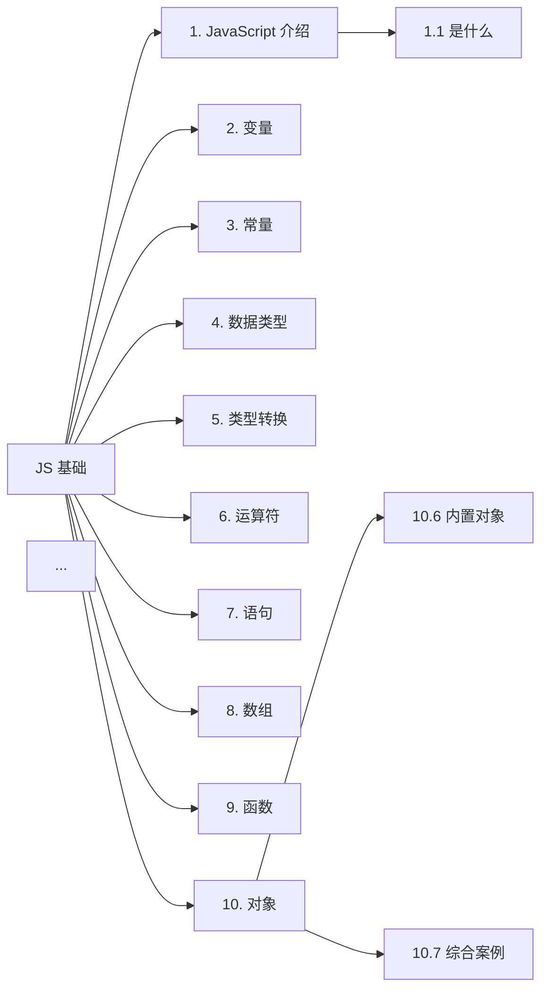

# JS 基础笔记收尾：第 10 章（对象）+ Mermaid 树状图生成计划

## Summary

完成 `e:\前端大学习\javascript\JS基础\10.对象` 文件夹中剩余截图的读取与整理，将 `### 10. 对象` 章节追加到 `e:\前端大学习\javascript\javascript.md` 末尾；然后基于 1~10 章共 10 个章节及子小节，生成一个 `graph LR`（向右）Mermaid 树状图，写入 `e:\前端大学习\javascript\js基础Mermaid.md`。

## Current State Analysis

### `javascript.md`（已存在，约 1744 行）

- `## JS 基础` 节点下已包含 `### 1. JavaScript 介绍` 至 `### 9. 函数` 共 9 个章节。
- 章节统一格式：
  - 标题：`### N. 名称`
  - 引子：`> 章节涵盖：...`
  - 子节：`#### N.M 子节名`
  - 表格 / 代码块 / Mermaid `flowchart LR` 描述流程与分类。
- 末尾以 `### 9. 函数 > #### 9.7 逻辑中断（拓展）` 收尾。

### `js基础Mermaid.md`（空文件）

- 0 字节，文件中无内容，等待写入 Mermaid 树状图。

### `10.对象` 文件夹（共 33 张截图：0.png ~ 32.png）

- 0.png：章节封面（"对象"）。
- 1.png~16.png：上一轮会话中已读取过部分内容（对象是什么、对象使用 / 声明语法、属性和方法、增删改查）。
- 17.png~32.png：尚未读取（按惯例覆盖对象遍历、内置对象 `Math / Date`、综合案例等）。

## Proposed Changes

### 改动 1：补全 `### 10. 对象` 章节并写入 `javascript.md`

**文件**：`e:\前端大学习\javascript\javascript.md`

**做法**：
1. 先并行读取 `10.对象` 剩余截图（17.png ~ 32.png，共 16 张），用于核对子主题与提取内容要点。
2. 在 9.7 末尾追加 `### 10. 对象` 整章，按以下结构（章节内子节编号与 1-9 章保持一致 `#### 10.M`）：

| 子节 | 主题 | 表达方式 |
|---|---|---|
| 10.1 | 对象是什么 | 文字 + 与数组对比的小表 |
| 10.2 | 对象的基本使用 | 字面量 `{}` / `new Object()` + 代码块 |
| 10.3 | 对象的属性（增删改查） | `obj.属性` / `obj['属性']` + 代码块 |
| 10.4 | 对象中的方法 / `this` | 代码块（`this` 指向调用者） |
| 10.5 | 遍历对象 | `for...in` / `Object.keys()` + 代码块 |
| 10.6 | 内置对象（Math / Array / String） | 表格列常用 API |
| 10.7 | 综合案例（如渲染学生信息表格） | 代码块 + Mermaid 描述数据流 |

**风格约束**：
- 与 1~9 章一致：三级标题 + 引子 + 表格 + 代码块 + Mermaid `flowchart LR`。
- 对"对象与数组的对比""增删改查总览"等关系类图示用 Mermaid 描述。
- 对不能转化的 UI/品牌装饰（如"黑马程序员"PPT 装饰）用 1~2 句文字说明或跳过。

### 改动 2：生成 `js基础Mermaid.md`

**文件**：`e:\前端大学习\javascript\js基础Mermaid.md`

**结构**：

```markdown
# JS 基础 知识框架

> 向右展开的树状图，根节点对应 `javascript.md` 中的 `## JS 基础`。



**约束**：
- 使用 `graph LR` 实现"向右"。
- 节点 ID 用纯 ASCII（A~J 表示 10 章，A1~A7 等表示子小节，编号与 `javascript.md` 中 `#### N.M` 严格对应）。
- 节点文字用中文展示。
- 子节数量汇总（按 `javascript.md` 实际为准）：

| 章 | 子节数 | 范围 |
|---|---|---|
| 1 | 7 | 1.1 ~ 1.7 |
| 2 | 6 | 2.1 ~ 2.6 |
| 3 | 2 | 3.1 ~ 3.2 |
| 4 | 7 | 4.1 ~ 4.7 |
| 5 | 4 | 5.1 ~ 5.4 |
| 6 | 5 | 6.1 ~ 6.5 |
| 7 | 3 | 7.1 ~ 7.3（7.2、7.3 内部已含 if/三元/switch、while/for 等子点） |
| 8 | 4 | 8.1 ~ 8.4 |
| 9 | 7 | 9.1 ~ 9.7 |
| 10 | 7 | 10.1 ~ 10.7 |
| **合计** | **52** | |

- 若 Mermaid 渲染节点过多导致卡顿，启用 `<details>` 折叠（`graph LR` 总节点数 ≤ 62，52 节点在阈值内，不折叠）。

## Assumptions & Decisions

1. **风格继承**：完全沿用 1~9 章的格式：三级标题、章节引子、表格、代码块、Mermaid。不做精简。
2. **子节编号以 `javascript.md` 为准**：写 Mermaid 时先核对最终 `javascript.md` 中 `#### N.M` 的实际数量与命名，再生成节点。
3. **可扩展性**：未来新增 11.字符串 时，只需在 `javascript.md` 末尾追加新章，并在 Mermaid 中追加 `JS --> K["11. 字符串"]` 与其子节。
4. **图示策略**：能用 Mermaid 表达的关系/流程/分类图用 Mermaid；纯装饰性元素（如"黑马程序员"品牌 UI）跳过或 1 句文字描述。
5. **降级策略**：若某张 PNG 截图读取失败或清晰度不足导致无法准确判断内容，跳过该张并在文本中标注"截图识别受限"。

## Implementation Steps

### Step 1：补读 `10.对象` 剩余截图（16.png 之后）

- 用 `Read` 工具并行读取 `e:\前端大学习\javascript\JS基础\10.对象\17.png` ~ `32.png`。
- 提取每张截图的标题、文字要点、代码示例，按 10.1 ~ 10.7 分类汇总。
- 16.png 已在上一轮读取过，但因可能与 17.png 衔接，重新读一遍以确认子节归属。

### Step 2：撰写 `### 10. 对象` 章节内容

- 在内部整理出完整 Markdown 草稿（含代码块、表格、Mermaid）。
- **暂不写入** `javascript.md`，等所有要点确认后再统一追加，避免反复 Edit。

### Step 3：用 `Edit` 工具在 `javascript.md` 末尾追加 `### 10. 对象`

- `old_string` 定位到 `### 9. 函数 > #### 9.7 逻辑中断（拓展）` 末尾最后一段 `console.log(NaN + 1)         // NaN` 之后。
- `new_string` 在其后追加 `### 10. 对象` 整章内容。
- 章节之间空一行分隔，与现有 1~9 章风格保持一致。

### Step 4：生成 `js基础Mermaid.md`

- 用 `Read` 重新打开 `javascript.md`，统计最终 `###` 与 `####` 数量与命名。
- 用 `Write` 写入 `js基础Mermaid.md`，包含：
  - 文档头（标题 + 说明）
  - 一个 `graph LR` 代码块，根节点 `JS` → 10 章 → 52 个子节。

### Step 5：本地校验

- 用 `Read` 分别读两个文件的最终内容：
  - `javascript.md` 行数与 `### N. 名称` 出现次数（应包含 1~10）。
  - `js基础Mermaid.md` 中 `graph LR` 节点的 `JS --> X` 一级边应有 10 条，子节边数 = 52。
- 检查没有格式错乱（标题层级、代码块开闭、Mermaid 块开闭）。

## Verification

1. **完整性**：
   - `javascript.md` 在 `## JS 基础` 之下出现 10 个 `###` 章节（1~10）。
   - `js基础Mermaid.md` 中 Mermaid 块包含 10 条 `JS --> X` 边 + 52 条子节边。
2. **可渲染性**：在 VS Code 中打开 `js基础Mermaid.md`，Markdown Preview Mermaid Support 能正确渲染向右的树状图。
3. **风格一致**：与 1~9 章风格（`### N. 名称`、`#### N.M`、表格、代码块、Mermaid）保持一致。
4. **可扩展性**：将来追加 11.字符串 时，只需在 `javascript.md` 末尾追加新章 + 在 Mermaid 中追加一行 `JS --> K["11. 字符串"]` 与其子节。
