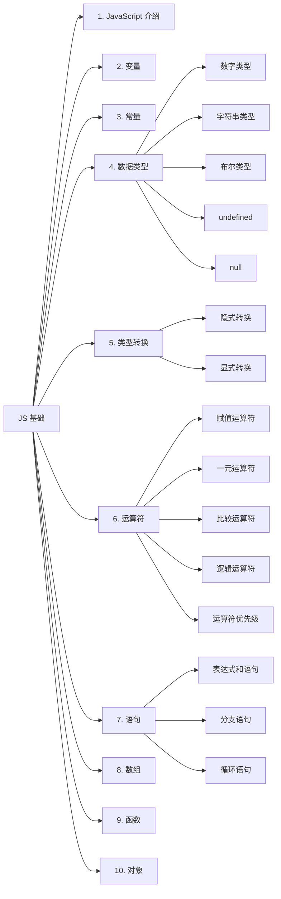

# JS 基础笔记整理与 Mermaid 树状图生成

## 1. Summary

继续将 `e:\前端大学习\javascript\JS基础` 目录下剩余 4 个知识文件夹（7.语句、8.数组、9.函数、10.对象）中的图片笔记整理到 `e:\前端大学习\javascript\javascript.md` 的 `## JS 基础` 章节末尾；之后在 `e:\前端大学习\javascript\js基础Mermaid.md` 中生成一张以 `## JS 基础` 为根节点、**向右展开**（`graph LR`）的 Mermaid 树状图，覆盖 10 个章节及其主要子节点。

## 2. Current State Analysis

- `e:\前端大学习\javascript\javascript.md`（1030+ 行）
  - 已完成章节：`### 1. JavaScript 介绍`、`### 2. 变量`、`### 3. 常量`、`### 4. 数据类型`、`### 5. 类型转换`、`### 6. 运算符`
  - 已有占位但无内容：`### 7. 语句`（位于第 1030 行）
  - 缺章节：`### 8. 数组`、`### 9. 函数`、`### 10. 对象`
  - 图片引用约定：使用相对路径 `JS基础/<子目录>/<图片名>.png`，与已写章节保持一致
  - 格式约定：三级标题分章、四级标题分小节、表格 + 代码块 + `**加粗**` + 图片引用

- `e:\前端大学习\javascript\js基础Mermaid.md`
  - 文件存在但内容为空，需填充完整的 Mermaid 源码

- `e:\前端大学习\javascript\JS基础` 目录
  - 已处理：1.JavaScript介绍、2.变量、3.常量、4.数据类型、5.类型转换、6.运算符
  - 待处理：
    - `7.语句/`：24 张（0-23.png）
    - `8.数组/`：17 张（0-16.png）
    - `9.函数/`：42 张（0-41.png）
    - `10.对象/`：33 张（0-32.png）

## 3. Proposed Changes

### 3.1 续写 `javascript.md` 的 `### 7. 语句` 章节

- **起点**：`### 7. 语句`（第 1030 行）下方追加内容
- **步骤**：
  1. 按顺序读取 `7.语句/0.png ~ 23.png` 全部 24 张图
  2. 按图片顺序组织为子章节：
     - 7.1 表达式和语句
     - 7.2 程序三大流程控制语句（顺序/分支/循环）
     - 7.3 分支语句（if 单/双/多分支、三元运算符、switch 语句）
     - 7.4 循环语句（while、for、break、continue）
  3. 对图示部分用 `` 引用
  4. 保留已有格式风格（表格、代码块、`**加粗**`）

### 3.2 新增 `### 8. 数组` 章节

- **步骤**：
  1. 读取 `8.数组/0.png ~ 16.png` 全部 17 张图
  2. 组织内容（数组概念、声明、取值、遍历、增删改查操作等）
  3. 同样使用 `` 引用图示
  4. 注意：基础部分数组已在 2.4 变量拓展中提过，这里按图片笔记覆盖即可，必要时与 2.4 内容互补

### 3.3 新增 `### 9. 函数` 章节

- **步骤**：
  1. 读取 `9.函数/0.png ~ 41.png` 全部 42 张图
  2. 组织内容（函数声明/调用、参数、返回值、作用域、匿名函数、箭头函数等）
  3. 同样使用 `` 引用图示

### 3.4 新增 `### 10. 对象` 章节

- **步骤**：
  1. 读取 `10.对象/0.png ~ 32.png` 全部 33 张图
  2. 组织内容（对象声明、属性访问、遍历、方法、this、内置对象等）
  3. 同样使用 `` 引用图示

### 3.5 生成 Mermaid 树状图到 `js基础Mermaid.md`

- **内容结构**（以 `## JS 基础` 为根节点，向右展开）：



- **节点名规范**：使用字母 + 数字索引（`A`, `B`, `B1`）保证 Mermaid 解析稳定
- **方向**：`graph LR`（左到右）满足「向右」要求

## 4. Assumptions & Decisions

- **不重写已有内容**：6 个已写章节保持原样，仅在末尾 `### 7. 语句` 之后追加 7、8、9、10 四个新章节
- **不重命名子章节编号**：保持 `### 7. 语句`、`### 8. 数组` 等三级标题顺序
- **图片命名**：原样使用 `0.png` `1.png` 等文件名，不做重命名
- **Mermaid 节点命名**：为兼容 Markdown Preview Mermaid Support 插件，节点 ID 使用 ASCII 字母数字（避免中文作为节点 ID）
- **小节子节点**：仅展开 4、5、6、7 章的主要子节点，其他章只保留一级节点，避免图形过于密集
- **格式一致**：沿用已有章节的格式（表格、代码块、加粗、图片引用）

## 5. Verification Steps

1. 重新打开 `javascript.md`，确认末尾包含 4 个新章节 `### 7. 语句`、`### 8. 数组`、`### 9. 函数`、`### 10. 对象`
2. 检查所有图片引用路径 `JS基础/<子目录>/<n>.png` 是否能在工作区打开（即文件真实存在）
3. 打开 `js基础Mermaid.md`，确认 Mermaid 源码以 ` ```mermaid ` 代码块包裹
4. 在 VS Code 中使用 Markdown Preview Mermaid Support 预览，验证：
   - 树状图方向为从左到右
   - 10 个一级章节全部展示
   - 无 Mermaid 解析报错
