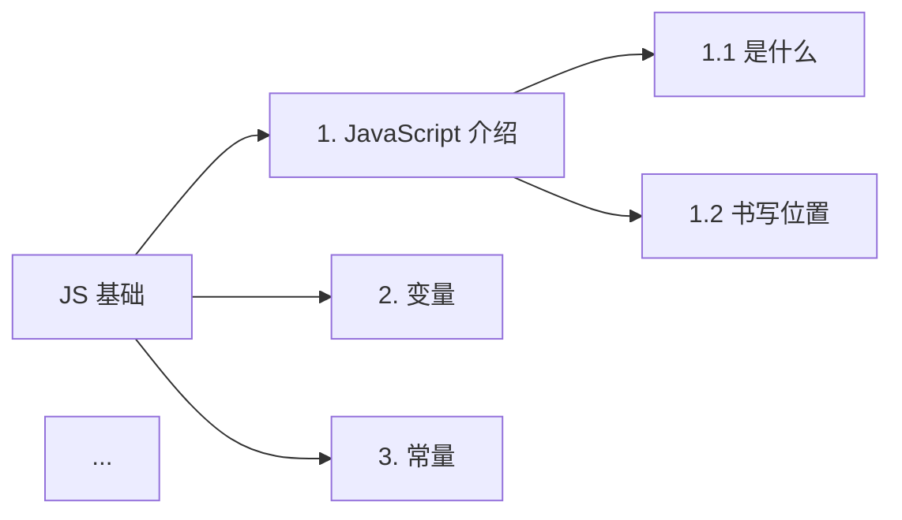

# JS 基础笔记整理 + Mermaid 树状图生成计划

## Summary

读取 `e:\前端大学习\javascript\JS基础\` 下 10 个子文件夹（1.JavaScript介绍 ~ 10.对象）共约 200 张网课截图，把知识整理到 `e:\前端大学习\javascript\javascript.md` 的 `## JS 基础` 节点下，并使用 Mermaid 语法生成向右的树状图到 `e:\前端大学习\javascript\js基础Mermaid.md`。

## Current State Analysis

- **`javascript.md`** 当前只有 2 行内容：
  ```
  # JavaScript
  ## JS 基础
  ```
- **`js基础Mermaid.md`** 是空文件。
- **`JS基础/`** 下 10 个子文件夹，每个文件夹内的 `0.png` 多为章节封面/目录页，后续编号为正文页。
- 用户在 IDE 中已安装 **Markdown Preview Enhanced** 与 **Markdown Preview Mermaid Support**，可以直接渲染 Mermaid 图表。
- 上一轮会话（`session_id: 6a43af98cea6f2da53cdf096`）曾整理过 1-6 章内容并已落入 javascript.md，但当前文件回退到只有标题状态——说明本次需要重新完整整理 1-10 章。

### 10 个章节概览（已通过 0.png 抽样确认）

| # | 文件夹 | 大致子主题 | 图片数 |
|---|---|---|---|
| 1 | 1.JavaScript介绍 | 是什么 / 书写位置 / 注释 / 结束符 / 输入输出语法 / 字面量 | 16 |
| 2 | 2.变量 | 变量是什么 / 基本使用 / 本质 / 命名规则与规范 | 20 |
| 3 | 3.常量 | 基本使用（声明、命名、注意事项、数组/对象是否可变） | 2 |
| 4 | 4.数据类型 | 5+1 种基本类型 / typeof / 字面量 | 18 |
| 5 | 5.类型转换 | 隐式转换 / 显式转换（Number / String / Boolean） | 10 |
| 6 | 6.运算符 | 赋值 / 一元 / 比较 / 逻辑 / 优先级 | 21 |
| 7 | 7.语句 | 表达式和语句 / 分支（if、三元、switch）/ 循环（while、for、break、continue） | 24 |
| 8 | 8.数组 | 数组是什么 / 增删改查 / 案例 | 17 |
| 9 | 9.函数 | 为什么需要 / 使用 / 传参 / 返回值 / 作用域 / 匿名函数 | 42 |
| 10 | 10.对象 | 对象基础 / 属性 / 方法 / 遍历 / 内置对象 / 案例 | 33 |

## Proposed Changes

### 改动 1：扩展 `javascript.md`（位于 L2 之后）

**文件**：`e:\前端大学习\javascript\javascript.md`

**做法**：在 `## JS 基础` 之下追加 10 个二级子章节，每章使用 `### N. 名称` 格式。`### 1. JavaScript 介绍` 到 `### 10. 对象` 共 10 个标题，与章节文件夹一一对应。

**章节内部统一模板**：
- 用 `#### X.Y 小节名`（如 `#### 1.1 什么是 JavaScript`）作为第三级小节。
- 文字要点用无序列表；代码示例用 ` ```js ` 代码块。
- 概念对比 / 分类列表使用表格。
- **流程类 / 关系类**（如 JS 运行环境图、隐式转换规则）使用 Mermaid `flowchart LR` 描述。
- **无法用 Mermaid 表达**（如"黑马程序员"PPT 中六边形装饰、纯品牌 UI 元素）的图示，使用简短文字描述或跳过。

**章节内容规划**：

1. `### 1. JavaScript 介绍`
   - 1.1 是什么：浏览器/Node.js 两种运行环境（用 Mermaid 描述 V8 + DOM/BOM/XHR vs V8 + fs/path）。
   - 1.2 书写位置：行内 / 内部 / 外部。
   - 1.3 注释：单行 `//`、多行 `/* */`、VSCode 快捷键。
   - 1.4 结束符：`;` 可省略但不推荐。
   - 1.5 输入输出：`document.write` / `alert` / `console.log` / `prompt`。
   - 1.6 字面量：数字、字符串、布尔、undefined、null。

2. `### 2. 变量`
   - 2.1 是什么：存储数据的容器。
   - 2.2 基本使用：`let` / `var` 声明 + 赋值 + 取值。
   - 2.3 本质：内存中开辟空间存储数据。
   - 2.4 命名规则与规范（用表格列出 规则 vs 规范）。

3. `### 3. 常量`
   - 基本使用：`const` 声明、必须初始化、命名规范、不允许重新赋值。
   - 数组/对象用 const 声明时可以修改内容（保留原 PPT 上的反例代码）。

4. `### 4. 数据类型`
   - 5 基本类型（number/string/boolean/undefined/null）+ 引用类型（object）。
   - 字面量示例代码块。
   - 检测方式：`typeof x` / `typeof(x)` / `x instanceof Array`。

5. `### 5. 类型转换`
   - 5.1 为什么要转换：`prompt` / `+` 拼接 / 比较 三种场景。
   - 5.2 隐式转换：表格列出 `+ / - / * / 比较` 的规则。
   - 5.3 显式转换：`Number() / parseInt() / parseFloat() / String() / Boolean()`，配合示例代码。

6. `### 6. 运算符`
   - 6.1 赋值：`=`、复合赋值。
   - 6.2 一元：`++` / `--`（前置 vs 后置）。
   - 6.3 比较：`==` vs `===`（用表格）。
   - 6.4 逻辑：`&&` / `||` / `!`、短路。
   - 6.5 优先级：数字优先级表（1~18 级简表）。

7. `### 7. 语句`
   - 7.1 表达式 vs 语句。
   - 7.2 分支：`if` / `if-else` / 三元 / `switch`（含穿透）。
   - 7.3 循环：`while` / `for` / `break` / `continue`。
   - 用 Mermaid `flowchart TD` 描述 `if-else` 与 `switch` 执行流。

8. `### 8. 数组`
   - 8.1 是什么：有序数据集合。
   - 8.2 基本使用：字面量 `[]` / `new Array()`。
   - 8.3 操作：增 `push/unshift`、删 `pop/shift/splice`、改 `arr[i]=`、查 `arr[i]/indexOf/length`。
   - 8.4 案例：求和 / 最大值 / 筛选等（用代码块）。

9. `### 9. 函数`
   - 9.1 为什么：复用代码。
   - 9.2 使用：`function` 声明 vs 函数表达式 vs 箭头函数。
   - 9.3 传参：形参 / 实参 / 默认值 / 伪数组 `arguments`。
   - 9.4 返回值：`return`。
   - 9.5 作用域：全局 / 局部 / 块级 / 作用域链（用 Mermaid 描述链式查找）。
   - 9.6 匿名函数：函数表达式 / IIFE / 回调。

10. `### 10. 对象`
    - 10.1 是什么：无序键值对集合。
    - 10.2 字面量 / `new Object()`。
    - 10.3 增删改查：`obj.属性` / `obj['属性']`。
    - 10.4 方法：对象中的函数，`this` 指向。
    - 10.5 遍历：`for...in` / `Object.keys()`。
    - 10.6 内置对象：`Math / Date / Array / String` 常用 API（表格简列）。

### 改动 2：新建 `js基础Mermaid.md`

**文件**：`e:\前端大学习\javascript\js基础Mermaid.md`

**结构**：
```markdown
# JS 基础 知识框架

> 向右展开的树状图，对应 `javascript.md` 中 ## JS 基础 章节的子节点。


```

**约束**：
- 使用 `graph LR`（Left to Right）实现"向右"。
- 节点命名用纯 ASCII ID（`A1, A2...`），展示文本用中文。
- 每章子节点数量与 `javascript.md` 中 `#### X.Y` 数量一致（确保两份文件结构对齐）。
- 节点超过 60 个时启用 Markdown 折叠（`details` 块）以避免 Mermaid 渲染卡顿。

## Assumptions & Decisions

1. **深度假设**：用户希望"详细"级别的整理，复用上一轮会话（2026-07-01）整理 1-6 章时的风格：三级标题 + 表格 + 代码块 + Mermaid。不做精简摘要。
2. **图示处理策略**：能用 Mermaid 表达的关系/流程图用 Mermaid；无法表达的设计型图示用 1~2 句文字描述。
3. **顺序策略**：按 0.png 的目录页顺序处理子主题，0.png 通常是封面，作为章节引子放在 `### N. 名称` 之后、`####` 之前。
4. **图片不嵌入**：不内嵌 PNG 路径，只整理文字+图表化的知识（用户说"图片中可能有文字无法写出的图示"指的是用 Mermaid 等方式弥补）。
5. **可扩展性**：本次整理 1-10 章后，按原方案，新章节（如 11.字符串）只需新增 `### 11. 字符串` 小节，**不修改**已有内容；同时在 `js基础Mermaid.md` 中追加对应节点。
6. **降级方案**：如果某张 PNG 截图清晰度不足导致读不准，直接跳过该小节（保持上下文整洁），不臆测。

## Implementation Steps

### Step 1：读取所有 0.png 概览（10 次 Read，并行）
- 10 个 `0.png` 一次性并发读出，确认每个章节的子主题顺序。

### Step 2：按文件夹分批读取内容图片
- 每章按编号顺序读取（0 跳过，因为 Step 1 已读；1 起到末尾）。
- 每读完一张，**立刻**在内部汇总该小节文字要点（不进 context）→ 仅在批读取完毕后统一写入 markdown。
- 为避免 context 过大，每读完 1 个文件夹立刻写入 `javascript.md` 的一章并清空中间状态。

### Step 3：写入 `javascript.md` 的 10 个章节
- 用 Edit 工具在 `## JS 基础` 之下逐章追加。
- 每章用 `### N. 名称` 开头，子小节用 `#### N.M`。
- 每章结束空一行分隔。

### Step 4：生成 `js基础Mermaid.md`
- 写入文档头 + `graph LR` 代码块。
- 节点 ID 用 `A1, A2, B1, B2...`（A~J 十个字母对应 1~10 章）。
- 所有文字用中文展示标签。

### Step 5：本地校验
- 用 Read 工具再次读取最终的两个文件，确认无遗漏、无格式错乱。

## Verification

1. **完整性**：`javascript.md` 在 `## JS 基础` 之下出现 10 个 `###` 章节；`js基础Mermaid.md` 中 Mermaid 块包含 10 条 `JS --> X` 一级边。
2. **可渲染性**：在 VS Code 中打开 `js基础Mermaid.md`，Markdown Preview Mermaid Support 能正确渲染向右的树状图。
3. **风格一致**：与上一轮已整理的 1-6 章风格（表格、代码块、Mermaid、`### N. 名称` 命名）保持一致。
4. **可扩展性**：在 10 章后插入 11.字符串 时，只需在 `javascript.md` 末尾追加 `### 11. 字符串` 段，在 Mermaid 中追加一行 `JS --> K["11. 字符串"]` 即可。
