# APIs 知识框架

> 向右展开的树状图，根节点对应 `javascript.md` 中的 `## APIs`。
> 节点 ID 使用 A~U 标识 21 个章节，Ax/Ux 表示子小节，与 `javascript.md` 中 `#### N.M` 严格对应。

```mermaid
graph LR
    APIs["APIs"]

    %% === 第一层：21 个一级章节 ===
    APIs --> A["0. 变量的声明<br/>(课前铺垫)"]
    APIs --> B["1. Web API 基本认知"]
    APIs --> C["2. 获取 DOM 对象"]
    APIs --> D["3. 操作元素内容"]
    APIs --> E["4. 操作元素属性"]
    APIs --> F["5. 定时器 - 间歇函数"]
    APIs --> G["6. 事件监听（绑定）"]
    APIs --> H["7. 事件类型"]
    APIs --> I["8. 事件对象"]
    APIs --> J["9. 环境对象"]
    APIs --> K["10. 回调函数"]
    APIs --> L["11. 事件流"]
    APIs --> M["12. 事件委托"]
    APIs --> N["13. 其它事件"]
    APIs --> O["14. 日期对象"]
    APIs --> P["15. 节点操作"]
    APIs --> Q["16. M 端事件"]
    APIs --> R["17. JS 插件"]
    APIs --> S["18. windows 对象"]
    APIs --> T["19. 本地存储"]
    APIs --> U["20. 正则表达式"]

    %% === 0. 变量的声明 (0.1 ~ 0.5) ===
    A --> A1["0.1 三个关键字"]
    A --> A2["0.2 案例：let 能否改为 const？"]
    A --> A3["0.3 const 原理（重要）"]
    A --> A4["0.4 错误 vs 正确示例"]
    A --> A5["0.5 总结"]

    %% === 1. Web API 基本认知 (1.1 ~ 1.5) ===
    B --> B1["1.1 作用和分类"]
    B --> B2["1.2 什么是 DOM"]
    B --> B3["1.3 DOM 树"]
    B --> B4["1.4 DOM 对象（重要）"]
    B --> B5["1.5 本章总结"]

    %% === 2. 获取 DOM 对象 (2.1 ~ 2.3) ===
    C --> C1["2.1 学习目标与提问"]
    C --> C2["2.2 根据 CSS 选择器来获取 DOM 元素（重点）"]
    C --> C3["2.3 其他获取 DOM 元素方法（了解）"]

    %% === 3. 操作元素内容 (3.1 ~ 3.4) ===
    D --> D1["3.1 学习目标"]
    D --> D2["3.2 对象.innerText 属性"]
    D --> D3["3.3 对象.innerHTML 属性"]
    D --> D4["3.4 两者区别"]

    %% === 4. 操作元素属性 (4.1 ~ 4.4) ===
    E --> E1["4.1 操作元素常用属性"]
    E --> E2["4.2 操作元素样式属性"]
    E --> E3["4.3 操作表单元素属性"]
    E --> E4["4.4 自定义属性"]

    %% === 5. 定时器 - 间歇函数 (5.1 ~ 5.4) ===
    F --> F1["5.1 定时器函数介绍"]
    F --> F2["5.2 开启定时器 - setInterval"]
    F --> F3["5.3 关闭定时器 - clearInterval"]
    F --> F4["5.4 本章总结"]

    %% === 6. 事件监听（绑定）(6.1 ~ 6.4) ===
    G --> G1["6.1 事件监听"]
    G --> G2["6.2 事件监听版本"]
    G --> G3["6.3 拓展阅读 - 事件监听版本"]
    G --> G4["6.4 本章总结"]

    %% === 7. 事件类型 (7.1) ===
    H --> H1["7.1 常见事件类型"]

    %% === 8. 事件对象 (8.1 ~ 8.3) ===
    I --> I1["8.1 获取事件对象"]
    I --> I2["8.2 事件对象常用属性"]
    I --> I3["8.3 本章总结"]

    %% === 9. 环境对象 (9.1) ===
    J --> J1["9.1 环境对象"]

    %% === 10. 回调函数 (10.1 ~ 10.2) ===
    K --> K1["10.1 回调函数"]
    K --> K2["10.2 本章总结"]

    %% === 11. 事件流 (11.1 ~ 11.7) ===
    L --> L1["11.1 事件流和两个阶段说明"]
    L --> L2["11.2 事件捕获"]
    L --> L3["11.3 事件冒泡"]
    L --> L4["11.4 阻止冒泡"]
    L --> L5["11.5 解绑事件"]
    L --> L6["11.6 两种注册事件的区别"]
    L --> L7["11.7 本章总结"]

    %% === 12. 事件委托 (12.1 ~ 12.4) ===
    M --> M1["12.1 思考：如何给多个元素注册事件？"]
    M --> M2["12.2 事件委托的好处/原理/实现"]
    M --> M3["12.3 阻止冒泡的拓展（preventDefault）"]
    M --> M4["12.4 本章总结"]

    %% === 13. 其它事件 (13.1 ~ 13.4) ===
    N --> N1["13.1 页面加载事件"]
    N --> N2["13.2 元素滚动事件"]
    N --> N3["13.3 页面尺寸事件"]
    N --> N4["13.4 元素尺寸与位置"]

    %% === 14. 日期对象 (14.1 ~ 14.5) ===
    O --> O1["14.1 什么是日期对象"]
    O --> O2["14.2 实例化"]
    O --> O3["14.3 日期对象方法"]
    O --> O4["14.4 时间戳"]
    O --> O5["14.5 本章总结"]

    %% === 15. 节点操作 (15.1 ~ 15.5) ===
    P --> P1["15.1 DOM 节点"]
    P --> P2["15.2 查找节点"]
    P --> P3["15.3 增加节点"]
    P --> P4["15.4 删除节点"]
    P --> P5["15.5 本章总结"]

    %% === 16. M 端事件 (16.1 ~ 16.2) ===
    Q --> Q1["16.1 触屏事件"]
    Q --> Q2["16.2 本章总结"]

    %% === 17. JS 插件 (17.1 ~ 17.3) ===
    R --> R1["17.1 什么是插件"]
    R --> R2["17.2 学习插件的基本过程"]
    R --> R3["17.3 本地文件结构"]

    %% === 18. windows 对象 (18.1 ~ 18.7) ===
    S --> S1["18.1 BOM"]
    S --> S2["18.2 定时器-延时函数"]
    S --> S3["18.3 JS 执行机制"]
    S --> S4["18.4 location 对象"]
    S --> S5["18.5 navigator 对象"]
    S --> S6["18.6 history 对象"]
    S --> S7["18.7 本章总结"]

    %% === 19. 本地存储 (19.1 ~ 19.6) ===
    T --> T1["19.1 本地存储介绍"]
    T --> T2["19.2 本地存储分类"]
    T --> T3["19.3 存储复杂数据类型"]
    T --> T4["19.4 数组中 map 方法（拓展）"]
    T --> T5["19.5 数组中 join 方法（拓展）"]
    T --> T6["19.6 本章总结"]

    %% === 20. 正则表达式 (20.1 ~ 20.6) ===
    U --> U1["20.1 什么是正则表达式"]
    U --> U2["20.2 语法"]
    U --> U3["20.3 元字符"]
    U --> U4["20.4 修饰符"]
    U --> U5["20.5 replace 替换"]
    U --> U6["20.6 本章总结"]
```

## 章节子节统计

| 章节 | 子节数 | 范围 |
|---|---|---|
| 0. 变量的声明（课前铺垫） | 5 | 0.1 ~ 0.5 |
| 1. Web API 基本认知 | 5 | 1.1 ~ 1.5 |
| 2. 获取 DOM 对象 | 3 | 2.1 ~ 2.3 |
| 3. 操作元素内容 | 4 | 3.1 ~ 3.4 |
| 4. 操作元素属性 | 4 | 4.1 ~ 4.4 |
| 5. 定时器 - 间歇函数 | 4 | 5.1 ~ 5.4 |
| 6. 事件监听（绑定） | 4 | 6.1 ~ 6.4 |
| 7. 事件类型 | 1 | 7.1 |
| 8. 事件对象 | 3 | 8.1 ~ 8.3 |
| 9. 环境对象 | 1 | 9.1 |
| 10. 回调函数 | 2 | 10.1 ~ 10.2 |
| 11. 事件流 | 7 | 11.1 ~ 11.7 |
| 12. 事件委托 | 4 | 12.1 ~ 12.4 |
| 13. 其它事件 | 4 | 13.1 ~ 13.4 |
| 14. 日期对象 | 5 | 14.1 ~ 14.5 |
| 15. 节点操作 | 5 | 15.1 ~ 15.5 |
| 16. M 端事件 | 2 | 16.1 ~ 16.2 |
| 17. JS 插件 | 3 | 17.1 ~ 17.3 |
| 18. windows 对象 | 7 | 18.1 ~ 18.7 |
| 19. 本地存储 | 6 | 19.1 ~ 19.6 |
| 20. 正则表达式 | 6 | 20.1 ~ 20.6 |
| **合计** | **85** | — |
