# JavaScript
## JS 基础

> 来源：黑马程序员 JS 基础网课截图整理

### 1. JavaScript 介绍

> 章节涵盖：JS 是什么、书写位置、注释、结束符、输入输出语法、字面量

#### 1.1 JavaScript 是什么

- **是什么**：一种运行在客户端（浏览器）的编程语言，用于实现人机交互效果。
- **作用**：
  - 网页特效（监听用户行为，让网页作出反馈）
  - 表单验证（针对表单数据的合法性进行判断）
  - 数据交互（获取后台数据，渲染到前端）
  - 服务端编程（Node.js）
- **组成**（JavaScript = ECMAScript + Web APIs）：

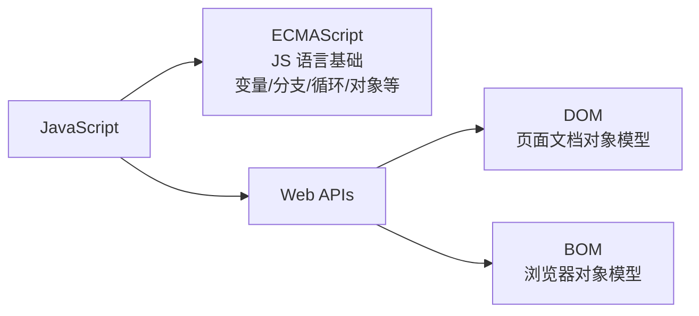

- **权威网站**：[MDN JavaScript 文档](https://developer.mozilla.org/zh-CN/docs/Web/JavaScript)

#### 1.2 JavaScript 书写位置

JavaScript 与 CSS 一样有 3 种书写位置：

| 位置 | 写法 | 场景 |
|---|---|---|
| **行内** | 写在 HTML 标签的属性内（如 `onclick`） | 临时事件处理 |
| **内部** | `<script>` 标签写在 `</body>` 上方 | 当前页面少量脚本 |
| **外部** | `<script src="my.js"></script>` 引入 `.js` 文件 | 推荐做法，多页面复用 |

**内部 JavaScript 示例**：

```html
<body>
  <script>
    alert('嗨，欢迎来传智播客学习前端技术！')
  </script>
</body>
```

**外部 JavaScript 示例**：

```html
<body>
  <!-- 通过 src 引入外部 js 文件 -->
  <script src="my.js"></script>
</body>
```

> **注意**：
> 1. `script` 标签中间无需写代码，否则会被忽略！
> 2. 外部 JavaScript 会使代码更有序、更易于复用，因此这是好的习惯。

#### 1.3 JavaScript 注释

| 类别 | 符号 | 作用 | 快捷键 |
|---|---|---|---|
| **单行注释** | `//` | `//` 右边这一行的代码会被忽略 | `Ctrl + /` |
| **块注释** | `/* */` | 在 `/*` 和 `*/` 之间的所有内容都会被忽略 | `Shift + Alt + A` |

```javascript
// 这种是单行注释的语法
// 一次只能注释一行
// 可以重复注释

/*
  这种的是多行注释的语法
  更常见的多行注释这种写法
  在些可以任意换行
  多少行都可以
*/
```

#### 1.4 JavaScript 结束符

- **作用**：使用英文的 `;` 代表语句结束。
- **实际情况**：实际开发中，可写可不写，浏览器（JavaScript 引擎）可以自动推断语句的结束位置。
- **现状**：在实际开发中，越来越多的人主张书写 JavaScript 代码时省略结束符。
- **约定**：为了风格统一，结束符要么每句都写，要么每句都不写（按照团队要求）。

```javascript
// 风格 1：每句都写
alert(1);
alert(2);

// 风格 2：都不写
alert(1)
alert(2)
```

#### 1.5 JavaScript 输入输出语法

**什么是语法**：人和计算机打交道的规则约定。我们要按照这个规则去写，程序员需要操控计算机，需要计算机能看懂。

**输出语法**：

| 语法 | 作用 |
|---|---|
| `document.write('要出的内容')` | 向 body 内输出内容；标签会被解析成网页元素 |
| `alert('要出的内容')` | 页面弹出警告对话框 |
| `console.log('控制台打印')` | 控制台输出语法，程序员调试使用 |

**输入语法**：

```javascript
prompt('请输入您的姓名：')
```

- **作用**：显示一个对话框，对话框中包含一条文字信息，用来提示用户输入文字。

**JavaScript 代码执行顺序**：

- 按 HTML 文档流顺序执行 JavaScript 代码。
- `alert()` 和 `prompt()` 它们会跳过页面渲染先被执行（目前作为了解，后期讲解详细执行过程）。

#### 1.6 字面量

- **定义**：在计算机科学中，字面量（literal）是在计算机中描述 事/物。
- **举例**：
  - 工资是 1000 → `1000` 就是数字字面量
  - '黑马程序员' → 字符串字面量
  - 接下来学的 `[]` 数组字面量、`{}` 对象字面量

#### 1.7 本章总结

1. **JavaScript 是什么？** 一门编程语言，可以实现很多的网页交互效果。
2. **书写位置**：
   - 内部 JavaScript
   - 内部 JavaScript → 写到 `</body>` 标签上方
   - 外部 JavaScript → 但是 `<script>` 标签不要写内容，否则会被忽略
3. **注释**：单行注释 `//`、多行注释 `/* */`。
4. **结束符**：分号 `;` 可以加也可以不加，可以按照团队约定。
5. **输入输出语句**：
   - 输入：`prompt()`
   - 输出：`alert()` `document.write()` `console.log()`

### 2. 变量

> 章节涵盖：变量是什么、变量基本使用、变量的本质、变量命名规则与规范

#### 2.1 变量是什么

- **问题**：用户输入的数据我们如何存储起来？
- **答案**：**变量**。
- **理解**：变量是存储数据的容器，类比超市储物柜：柜子（变量）→ 放东西（赋值）→ 取东西（取值）。

#### 2.2 变量基本使用

**声明 + 赋值 + 取值**：

```javascript
// 1. 声明变量
let age
// 2. 赋值（把值存入变量）
age = 18
// 3. 取出变量的值
console.log(age)   // 18
```

**一步到位写法**（声明 + 赋值合并）：

```javascript
let age = 18
console.log(age)   // 18
```

**同时声明多个变量**：

```javascript
let age = 18, name = 'tom', sex = '男'
```

**关键字对比**：

| 关键字 | 作用域 | 变量提升 | 能否重复声明 | 推荐度 |
|---|---|---|---|---|
| `var` | 函数级 | ✅ | ✅ | ❌（ES5 旧语法） |
| `let` | 块级 | ❌ | ❌ | ✅（推荐） |

#### 2.3 变量的本质

- 变量本质：**程序在内存中申请的一块用来存储数据的空间**。
- 变量名是该空间的"门牌号"，通过变量名可以找到这块内存。

#### 2.4 变量命名规则与规范

| 类型 | 内容 |
|---|---|
| **规则（必须遵守，不遵守报错）** | ① 不能用关键字（如 `let`、`var`、`if`、`for`）<br/>② 只能由下划线、字母、数字、`$` 组成，且数字不能开头<br/>③ 字母严格区分大小写，如 `Age` 和 `age` 是不同的变量 |
| **规范（建议遵守，不符合业内通识）** | ① 起名要有意义<br/>② 遵守小驼峰命名法：第一个单词首字母小写，后面每个单词首字母大写。例如：`userName` |

**变量名合法性示例**：

| 变量名 | 是否报错 | 是否符合规范 |
|---|---|---|
| `21age` | 报错（数字开头） | — |
| `_age` | 不报错 | 符合规范 |
| `user-name` | 报错（含连字符） | — |
| `username` | 不报错 | 不符合规范 |
| `userName` | 不报错 | 符合规范 |
| `let` | 报错（关键字） | — |
| `na@me` | 报错（含特殊字符） | — |
| `$age` | 不报错 | 符合规范 |

#### 2.5 变量拓展 - `let` 和 `var` 的区别

- 在较旧的 JavaScript 中，使用关键字 `var` 来声明变量，而不是 `let`。
- `var` 现在开发中一般不再使用它，只是我们可能在老版程序中看到它。
- `let` 为了解决 `var` 的一些问题。

**`var` 声明的"不合理"行为**：

- 可以先使用，再声明（变量提升）
- `var` 声明过的变量可以重复声明
- 例如：变量提升、全局变量、没有块级作用域等

**结论**：`var` 就是一个 bug，别迷恋它了，以后声明变量我们统一使用 `let`。

#### 2.6 变量拓展 - 数组引入

数组（Array）——一种将**一组数据**存储在**单个变量名**下的优雅方式。

```javascript
let arr = []    // arr 是变量，[] 是数组字面量
```

> ⚠️ 数组的详细使用方法（增删改查、案例）见 `### 8. 数组` 章节。

### 3. 常量

> 章节涵盖：常量的基本使用

#### 3.1 常量的基本使用

- **概念**：使用 `const` 声明的变量称为"**常量**"。
- **使用场景**：当某个变量**永远不会被改变**的时候，就可以使用 `const` 来声明，而不是 `let`。
- **命名规范**：和变量一致。
- **常量使用**：

```javascript
// 声明一个常量
const G = 9.8
// 输出这个常量
console.log(G)
```

```javascript
// 错误示例：常量不允许重新赋值
const G = 9.8
G = 9.9          // 报错：Assignment to constant variable.
console.log(G)
```

- **注意**：常量不允许重新赋值，**声明的时候必须赋值（初始化）**。
- **小技巧**：不需要重新赋值的数据使用 `const`。

#### 3.2 声明方式总结

| 关键字 | 说明 |
|---|---|
| `let` | 现在实际开发中变量声明方式 |
| `var` | 以前的声明变量的方式，会有很多问题 |
| `const` | 类似于 `let`，但是变量的值无法被修改 |

### 4. 数据类型

> 章节涵盖：数据类型、检测数据类型

#### 4.1 数据类型 - 整体分类

计算机世界中的万事万物都是数据。计算机程序可以处理大量的数据，**为什么要给数据分类**：

1. 更加充分和高效地利用内存
2. 也更加方便程序员的使用数据

**JS 数据类型整体分为两大类**：

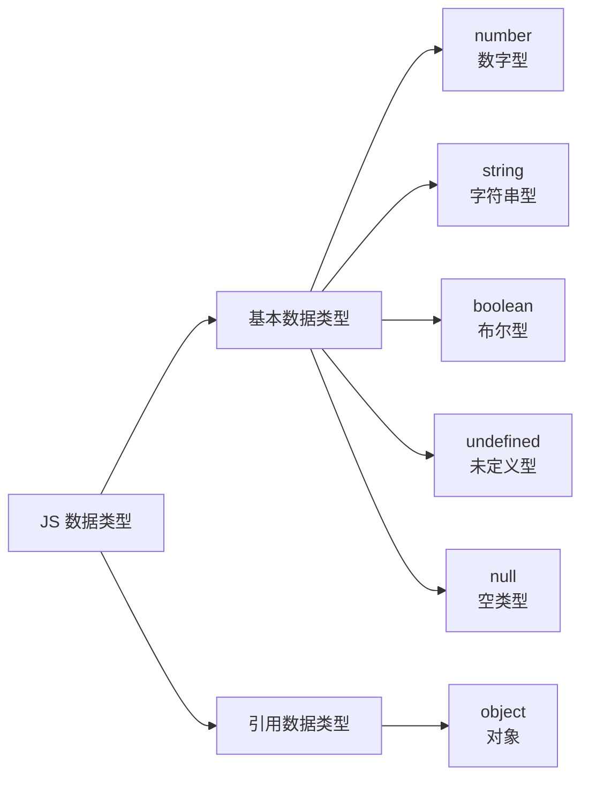

#### 4.2 数字类型（Number）

- 即我们数学中学习到的数字，可以是**整数、小数、正数、负数**。

```javascript
let age = 18    // 整数
let price = 88.99  // 小数
```

- JavaScript 中的正数、负数、小数等统一称为**数字类型**。
- **注意**：JS 是弱数据类型，变量到底属于哪种类型，只有赋值之后，我们才能确认。Java 是强数据类型，例如 `int a = 3` 必须是整数。

**算术运算符**：

| 符号 | 含义 |
|---|---|
| `+` | 求和 |
| `-` | 求差 |
| `*` | 求积 |
| `/` | 求商 |
| `%` | 取模（取余数），开发中常用于判断某个数字是否被整除 |

**算术运算符优先级**：

- 同时使用多个运算符编写程序时，会按某种顺序先后执行，我们称为**优先级**。
- JavaScript 中优先级越高越先被执行，优先级相同时以书从左向右执行。
  - 乘、除、取余优先级相同
  - 加、减优先级相同
  - 乘、除、取余优先级大于加、减
  - 使用 `()` 可以提升优先级
- **总结**：先乘除后加减，有括号先算括号里面的。

```javascript
console.log(1 + 2 * 3)    // 7
console.log(10 - 8 / 2)   // 6
console.log(2 % 5 + 4 * 2) // 10
```

**NaN**：

- `NaN` 代表一个计算错误。它是一个不正确的或者一个未定义的数学操作所得到的结果。

```javascript
console.log('老师' - 2)   // NaN
```

- `NaN` 是粘性的。任何对 `NaN` 的操作都会返回 `NaN`。

```javascript
console.log(NaN + 2)      // NaN
```

**Infinity（正无穷）**：

- `Infinity` 是 JS 中的**正无穷大**（`-Infinity` 是负无穷大），它和 `NaN` 一样都是 `number` 类型的**特殊值**。

```javascript
console.log(Infinity)                    // Infinity
console.log(-Infinity)                   // -Infinity
console.log(Number.POSITIVE_INFINITY)    // Infinity
console.log(typeof Infinity)             // 'number'
```

**产生方式**：

```javascript
// 1. 数字除以 0
console.log(1 / 0)        // Infinity
console.log(-1 / 0)       // -Infinity

// 2. 超出 Number 最大值
console.log(1.79e+308 * 2)  // Infinity
```

**运算规则**：

| 表达式 | 结果 | 说明 |
|---|---|---|
| `Infinity + Infinity` | `Infinity` | |
| `Infinity - Infinity` | **`NaN`** | 不定型 |
| `Infinity * 0` | **`NaN`** | 不定型 |
| `Infinity * 2` | `Infinity` | |
| `任何有限数 / Infinity` | `0` | |
| `Infinity > 1000000` | `true` | 任何数都比 Infinity 小 |

**检测方法**：

```javascript
Number.isFinite(Infinity)   // false
Number.isFinite(100)        // true
```

**常见使用场景**：

1. **`Math.max()` / `Math.min()` 无参数时返回 ±∞**（作为初始值）
2. **表示"无上限"边界**（如价格筛选 `a=0, b=Infinity`）
3. **求最小值**（数组遍历时用 `Infinity` 作初始值，确保第一个元素能替换它）

```javascript
// 价格筛选：默认 0 元 ~ 无穷大（不限最高价）
function findPrice(a = 0, b = Infinity) { /* ... */ }
findPrice(0)         // 0 ~ ∞
findPrice(0, 100)    // 0 ~ 100

// 求数组最小值
const prices = [88, 199, 1599, 9.9, 299]
let min = Infinity
for (const p of prices) {
  if (p < min) min = p
}
console.log(min)   // 9.9
```

> **总结**：JS 数字类型中除了 `NaN` 外，还有两个特殊值 `Infinity`（正无穷）和 `-Infinity`（负无穷），都属于 `number` 类型，可参与数学运算。

#### 4.3 字符串类型（string）

- 通过**单引号 `''`、双引号 `""`、反引号 ` `` `** 包裹的数据都叫字符串，单引号和双引号没有本质上的区别，推荐使用**单引号**。

```javascript
let uname = '小明'      // 使用单引号
let gender = "男"       // 使用双引号
let goods = `小米`      // 使用反引号
let tel = '13681113456' // 看上去是数字，但是引号包裹了就是字符串
let str = ''            // 这种情况叫空字符串
```

**注意事项**：

1. 无论单引号或是双引号必须成对使用。
2. 单引号/双引号可以互相嵌套，但是不以自己嵌套自己（口诀：**外双内单**，或者**外单内双**）。
3. 必要时可以使用转义符 `\`，输出单引号或双引号。

**字符串拼接**：

- 场景：`+` 运算符可以实现字符串的拼接。
- 口诀：**数字相加，字符相连**。

```javascript
console.log('你好' + '世界')   // 你好世界
console.log('age=' + 18)        // age=18
```

**模板字符串**：

- **使用场景**：拼接字符串和变量；在没有它之前，要拼接变量比较麻烦。

```javascript
// 传统写法
document.write('大家好，我叫' + name + '，今年' + age + '岁')
```

- **语法**：
  - `` ` ``（反引号）
  - 在英文输入模式下按键盘的 `tab` 键上方那个键（`1` 左边那个键）
  - 内容拼接变量时，用 `${}` 包住变量

```javascript
// 模板字符串写法
document.write(`大家好，我叫${name}，今年${age}岁`)
```

#### 4.4 布尔类型（boolean）

- 表示肯定或否定时在计算机中对应的是布尔类型数据。
- 它有两个固定的值 `true` 和 `false`，表示肯定的数据用 `true`（真），表示否定的数据用 `false`（假）。

```javascript
// JavaScript 好玩不？
let isCool = true
console.log(isCool)
```

#### 4.5 未定义类型（undefined）

- 未定义是比较特殊的类型，只有一个值 `undefined`。
- **什么情况出现未定义类型**：只声明变量，不赋值的情况下，变量的默认值为 `undefined`，一般很少 [直接] 为某个变量赋值为 `undefined`。

```javascript
let age   // 声明变量但是未赋值
document.write(age)   // 输出 undefined
```

- **工作中的使用场景**：我们开发中经常声明一个变量，等待传送过来的数据。如果我们不知道这个数据是否传递过来，此时我们可以通过检测这个变量是不是 `undefined`，就判断用户是否有数据传递过来。

#### 4.6 null（空类型）

- JavaScript 中的 `null` 仅仅是一个代表"无"、"空"或"值未知"的特殊值。

```javascript
let obj = null
console.log(obj)   // null
```

**`null` 和 `undefined` 区别**：

- `undefined` 表示没有赋值
- `null` 表示赋值了，但是内容为空

**`null` 开发中的使用场景**：

- 官方解释：把 `null` 作为尚未创建的对象
- 大白话：将来有个变量里面存放的是一个对象，但是对象还没创建好，可以先给个 `null`

#### 4.7 检测数据类型

**控制台输出语句**：

```javascript
let age = 18
let uname = '刘德华'
let flag = false
let buy
console.log(age)       // 18
console.log(uname)     // 刘德华
console.log(flag)      // false
console.log(buy)       // undefined
```

- 控制台语句经常用于测试结果来使用。
- 可以看出数字型和布尔型颜色为蓝色，字符串和 undefined 颜色为灰色。

**通过 `typeof` 关键字检测数据类型**：

- `typeof` 运算符可以返回被检测的数据类型。它支持两种语法形式：
  1. 作为运算符：`typeof x` （常用的写法）
  2. 函数形式：`typeof(x)`
- 换言之，有括号和没有括号，得到的结果是一样的，所以我们直接使用**运算符**的写法。

```javascript
let age = 18
let uname = '刘德华'
let flag = false
let buy
console.log(typeof age)      // number
console.log(typeof uname)    // string
console.log(typeof flag)     // boolean
console.log(typeof buy)      // undefined
```

### 5. 类型转换

> 章节涵盖：为什么要类型转换、隐式转换、显式转换

#### 5.1 为什么需要类型转换

- JavaScript 是弱数据类型：JavaScript 也不知道变量到底属于那种数据类型，只有赋值了才清楚。
- 坑：使用表单、`prompt` 获取过来的数据默认是字符串类型的，此时就不能直接简单的进行加法运算。

```javascript
console.log('10000' + '2000')   // 输出结果 100002000
```

- 此时需要转换变量的数据类型。
- 通俗来说，就是把一种数据类型的变量转换成我们需要的数据类型。

#### 5.2 隐式转换

某些运算符被执行时，系统内部自动将数据类型进行转换，这种转换称为**隐式转换**。

**规则**：

- `+` 号两边只要有一个是字符串，都把另外一个转成字符串
- 除了 `+` 以外的算术运算符 比如 `- * /` 等都会把数据转成数字类型

**缺点**：

- 转换类型不明确，靠经验才能总结

**小技巧**：

- `+号` 作为正号解析可以转换成数字型
- 任何数据和字符串相加结果都是字符串

```javascript
console.log(11 + 11)         // 22
console.log('11' + 11)       // 1111
console.log(11 - 11)         // 0
console.log('11' - 11)       // 0
console.log(1 * 1)           // 1
console.log('1' * 1)         // 1
console.log(typeof '123')    // string
console.log(typeof +'123')   // number
console.log(+'11' + 11)      // 22
```

#### 5.3 显式转换

编写程序时过度依靠系统内部的隐式转换是不严禁的，因为隐式转换规律并不清晰，大多是靠经验总结的规律。

为了避免因隐式转换带来的问题，通常根据逻辑需要对数据进行**显式转换**。

**概念**：自己写代码告诉系统该转成什么类型

**转换为数字型**：

| 方法 | 作用 |
|---|---|
| `Number(数据)` | 转成数字类型；如果字符串内容里有非数字，转换失败时结果为 `NaN`（Not a Number），即不是一个数字；`NaN` 也是 number 类型的数据，代表非数字 |
| `parseInt(数据)` | 只保留整数 |
| `parseFloat(数据)` | 可以保留小数 |

```javascript
let str = '123'
console.log(Number(str))            // 123
console.log(Number('pink'))         // NaN

console.log(parseInt('12px'))       // 12
console.log(parseInt('12.34px'))    // 12
console.log(parseInt('12.94px'))    // 12
console.log(parseInt('abc12.94px')) // 12

console.log(parseFloat('12px'))     // 12
console.log(parseFloat('12.34px'))  // 12.34
console.log(parseFloat('12.94px'))  // 12.94
console.log(parseFloat('abc12.94px')) // 12.94
```

#### 5.4 常见错误

**错误 1**：`Uncaught ReferenceError: age is not defined`

```javascript
console.log(age)   // 没有 age 变量
```

**分析**：

- 提示 age 变量没有定义过
- 很可能 age 变量没有声明和赋值
- 或者我们输出变量名和声明的变量不一致引起的（简单说写错变量名了）

**错误 2**：`Uncaught TypeError: Assignment to constant variable.`

```javascript
const age = 18
age = 21
console.log(age)   // 错误 常量不能被重新赋值
```

**分析**：常量被重新赋值了，常量不能被重新赋值。

**错误 3**：字符串拼接问题

```javascript
let num1 = prompt('请输入第一个数值:')
let num2 = prompt('请输入第二个数值:')
alert(`两者相加的结果是：${num1 + num2}`)
```

**分析**：

- 因为 `prompt` 获取过来的是字符型，所以会出现字符相加的问题。
- `prompt` 如果出现相加 记得要转为数字型，可以 利用 `+` 最简单。

```javascript
let num1 = +prompt('请输入第一个数值:')
let num2 = +prompt('请输入第二个数值:')
alert(`两者相加的结果是：${num1 + num2}`)
```

### 6. 运算符

> 章节涵盖：赋值运算符、一元运算符、比较运算符、逻辑运算符、运算符优先级

#### 6.1 赋值运算符

- 赋值运算符：对变量进行赋值的运算符
- 已经学过的赋值运算符：`=`  将等号右边的值赋予给左边，要求左边必须是一个容器
- 其他赋值运算符：`+=`  `-=`  `*=`  `/=`  `%=`
- 使用这些运算符可以在对变量赋值时进行快速操作

**`+=` 示例**：

```javascript
// 以前我们让一个变量加 1 如何做的？
let num = 1
num = num + 1
console.log(num)   // 结果是 2

// 简单的写法
let num = 1
num += 1
console.log(num)   // 结果是 2
```

#### 6.2 一元运算符

众多的 JavaScript 的运算符可以根据所需表达式的个数，分为一元运算符、二元运算符、三元运算符。

- **二元运算符**：例如 `let num = 10 + 20`
- **一元运算符**：例如 正负号

**自增运算符**：

- 符号：`++`
- 作用：让变量的值 `+1`

**自减运算符**：

- 符号：`--`
- 作用：让变量的值 `-1`
- 使用场景：经常用于计数来使用。比如进行 10 次操作，用它来计算进行了多少次了。

**前置自增 vs 后置自增**：

| 类型 | 写法 | 单独使用 | 参与运算 |
|---|---|---|---|
| **前置自增** | `++num` | 等价于 `num += 1` | 先自加再使用（记忆口诀：++ 在前 先加） |
| **后置自增** | `num++` | 等价于 `num += 1` | 先使用再自加（记忆口诀：++ 在后 后加） |

```javascript
let i = 1
console.log(++i + 2)   // 结果是 4
// 注意：i 是 2
// i 先自加 1，变成 2 之后，在和后面的 2 相加
```

```javascript
let i = 1
console.log(i++ + 2)   // 结果是 3
// 注意：此时的 i 是 1
// 先和 2 相加，先运算输出完毕后，i 再自加是 2
```

- **结论**：前置自增和后置自增独立使用时二者并没有区别！一般开发中我们都是独立使用。实际开发中，我们一般都是单独使用的，后置 `i++` 更多。

#### 6.3 比较运算符

- **使用场景**：比较两个数据大小、是否相等
- 比较运算符：

| 符号 | 含义 |
|---|---|
| `>` | 左边是否大于右边 |
| `<` | 左边是否小于右边 |
| `>=` | 左边是否大于或等于右边 |
| `<=` | 左边是否小于或等于右边 |
| `==` | 左右两边值是否相等 |
| `===` | 左右两边是否类型和值都相等 |
| `!==` | 左右两边是否不全等 |

- 比较结果为 boolean 类型，即只会得到 `true` 或 `false`

**对比**：

- `=` 单等是赋值
- `==` 是判断
- `===` 是全等
- 开发中判断是否相等，强烈推荐使用 `===`

**比较运算符细节**：

- 字符串比较，是比较的字符对应的 ASCII 码（从左往右依次比较；如果第一位一样再比较第二位，以此类推）
- `NaN` 不等于任何值，包括它本身（涉及到 `NaN` 都是 `false`）
- 尽量不要比较小数，因为小数有精度问题
- 不同类型之间比较会发生隐式转换：最终把数据隐式转换成 number 类型再比较。所以开发中，如果进行准确的比较我们更喜欢 `===` 或者 `!==`

#### 6.4 逻辑运算符

- **目标**：掌握逻辑运算符，为程序"能思考"做准备

**问题**：如果我想判断一个变量 `num` 是否大于 5 且小于 10，怎么办？

- 错误写法：`5 < num < 10`
- 使用场景：逻辑运算符常用来解决多重条件判断
- 正确写法：`num > 5 && num < 10`

**逻辑运算符表**：

| 符号 | 名称 | 日常读法 | 特点 | 口诀 |
|---|---|---|---|---|
| `&&` | 逻辑与 | 并且 | 符号两边都为 `true` 结果才为 `true` | 一假则假 |
| `\|\|` | 逻辑或 | 或者 | 符号两边有一个 `true` 就为 `true` | 一真则真 |
| `!` | 逻辑非 | 取反 | `true` 变 `false`，`false` 变 `true` | 真变假，假变真 |

#### 6.5 运算符优先级

掌握运算符优先级，能判断运算符执行的顺序。

| 优先级 | 运算符 | 顺序 |
|---|---|---|
| 1 | 小括号 | `()` |
| 2 | 一元运算符 | `++ -- !` |
| 3 | 算术运算符 | 先 `* / %` 后 `+ -` |
| 4 | 关系运算符 | `> >= < <=` |
| 5 | 相等运算符 | `== != === !==` |
| 6 | 逻辑运算符 | 先 `&&` 后 `||` |
| 7 | 赋值运算符 | `=` |
| 8 | 逗号运算符 | `,` |

> 小括号永远是最高的。

### 7. 语句

> 章节涵盖：表达式和语句、分支语句、循环语句

#### 7.1 表达式和语句

**目标**：能说出表达式和语句的区别

- **表达式**：表达式是可以被求值的代码，JavaScript 引擎会将其计算出一个结果。

```javascript
x = 7
3 + 4
num++
```

- **语句**：语句是一段可以执行的代码。
  - 比如 `prompt()` 可以弹出一个输入框，还有 `if` 语句、`for` 循环语句等等

**区别**：

- **表达式**：因为表达式可被求值，所以它可以写在赋值语句的右侧。
  - 表达式：`num = 3 + 4`
- **语句**：而语句不一定有值，所以比如 `alert()`、`for`、`break` 等语句就不能被用于赋值。
  - 语句：`alert()` 弹出对话框、`console.log()` 控制台打印输出

> 某些情况，也可以把表达式理解为表达式语句，因为它是在计算结果，但不是必须的成分（例如 `continue` 语句）

#### 7.2 分支语句

**目标**：掌握流程控制，写出能"思考"的程序

**学习路径**：

- 程序三大流程控制语句
- 分支语句

**程序三大流程控制语句**：

- 以前我们写的代码，写几句就从上往下执行几句，这种叫**顺序结构**
- 有的时候要根据条件选择执行代码，这种就叫**分支结构**
- 某段代码被重复执行，就叫**循环结构**

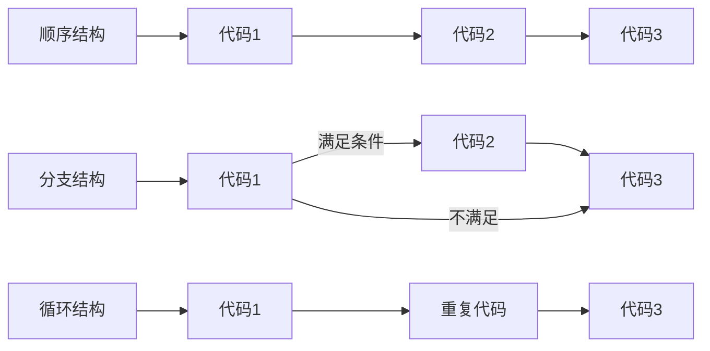

**分支语句**：分支语句可以让我们有**选择性**的执行想要的代码。

- 分支语句包含：
  - `if` 分支语句
  - 三元运算符
  - `switch` 语句

**7.2.1 `if` 语句**

- **目标**：能使用 if 语句执行满足条件的代码
- `if` 语句有三种使用：单分支、双分支、多分支

**单分支使用语法**：

```javascript
if (条件) {
  满足条件要执行的代码
}
```

- 括号内的条件为 `true` 时，进入大括号里执行代码
- 小括号内的结果若不是布尔类型时，会发生隐式转换为布尔类型
- 如果大括号只有一个语句，大括号可以省略，但是，俺们不提倡这么做~

**双分支 `if` 语法**：

```javascript
if (条件) {
  满足条件要执行的代码
} else {
  不满足条件执行的代码
}
```

**多分支 `if` 语法**：

- 使用场景：适合有多个结果的时候，比如学习成绩可以分为：优良中差

```javascript
if (条件1) {
  代码1
} else if (条件2) {
  代码2
} else if (条件3) {
  代码3
} else {
  代码n
}
```

**释义**：

- 先判断条件 1，若满足条件 1 就执行代码 1，其他不执行
- 若不满足则向下判断条件 2，满足条件 2 执行代码 2，其他不执行
- 若依然不满足继续往下判断，依次类推
- 若以上条件都不满足，执行 `else` 里的代码 n
- 注：可以写 N 个条件，但这里演示只写 2 个

**7.2.2 三元运算符**

- **目标**：能利用三元运算符执行满足条件的语句
- **使用场景**：其实是比 `if` 双分支更简单的写法，可以使用三元表达式
- **符号**：`?` 与 `:` 配合使用
- **语法**：

```javascript
条件 ? 满足条件执行的代码 : 不满足条件执行的代码
```

- **一般用来取值**

**7.2.3 `switch` 语句**

- **目标**：能利用 `switch` 执行满足条件的语句

```javascript
switch (数据) {
  case 值1:
    代码1
    break
  case 值2:
    代码2
    break
  default:
    代码n
    break
}
```

**释义**：

- 找到跟小括号里数据**全等**的 `case` 值，并执行里面对应的代码
- 若没有全等 `===` 的则执行 `default` 里的代码
- 例：数据跟值 2 全等，则执行代码 2

**注意**：

1. `switch case` 语句一般用于等值判断，不适合于区间判断
2. `switch case` 一般需要配合 `break` 关键字使用，没有 `break` 会造成 case 穿透

#### 7.3 循环结构

**目标**：掌握循环结构，实现一段代码重复执行

**学习路径**：

1. 断点调试
2. `while` 循环

**7.3.1 断点调试**

- **作用**：学习时可以帮助更好的理解代码运行，工作时可以更快找到 bug
- **浏览器打开调试界面**：
  1. 按 F12 打开开发者工具
  2. 点到 sources 一栏
  3. 选择代码文件

**7.3.2 `while` 循环**

- **目标**：掌握 `while` 循环语法，能重复执行某段代码
- **循环**：重复执行一些操作，`while`：在 ... 期间，所以 `while` 循环就是在满足条件期间，重复执行某些代码。
- 比如我们运行相同的代码输出 5 次（输出 5 句"我学的很棒"）
- **路径**：
  - `while` 循环基本语法
  - `while` 循环三要素

**`while` 循环三要素**：

- 循环的本质就是以某个变量为起始值，然后不断产生变量，慢慢靠近终止条件的过程。
- 所以，`while` 循环需要具备三要素：
  1. 变量起始值
  2. 终止条件（没有终止条件，循环会一直执行，造成死循环）
  3. 变量变化量（用自增或者自减）

```javascript
let i = 1
while (i <= 3) {
  document.write('我会循环三次<br>')
  i++
}
```

**总结**：

1. `while` 循环的作用是什么？
   - 在满足条件期间，重复执行某些代码
2. `while` 循环三要素是什么？
   - 变量起始值
   - 终止条件（没有终止条件，循环会一直执行，造成死循环）
   - 变量变化量（用自增或者自减）

**7.3.3 循环退出**

- **目标**：能说出 `continue` 和 `break` 的区别
- **循环结束**：
  - `break`：退出循环
  - `continue`：结束本次循环，继续下次循环
- **区别**：
  - `continue` 退出本次循环，一般用于排除或者跳过某一个选项的时候，可以使用 `continue`
  - `break` 退出整个循环，一般用于结果已经得到，后续的循环不需要的时候可以使用

**7.3.4 `for` 循环**

- **学习路径**：
  - `for` 循环基本使用
  - 循环嵌套

**1. `for` 循环 - 基本使用**

- **目标**：掌握 `for` 循环重复执行某些代码
- **`for` 循环语法**：
  - **作用**：重复执行代码
  - **好处**：把声明起始值、循环条件、变化值写到一起，让人一目了然，它是最常使用的循环形式

```javascript
for (变量起始值; 终止条件; 变量变化量) {
  // 循环体
}
```

**2. 退出循环**

- `continue` 退出本次循环，一般用于排除或者跳过某一个选项的时候，可以使用 `continue`
- `break` 退出整个 `for` 循环，一般用于结果已经得到，后续的循环不需要的时候可以使用

**了解**：

1. `while(true)` 来构造"无限"循环，需要使用 `break` 退出循环。
2. `for(;;)` 也可以来构造"无限"循环，同样需要使用 `break` 退出循环。

**3. `for` 循环和 `while` 循环有什么区别**：

- 当如果明确了循环的次数的时候推荐使用 `for` 循环
- 当不明确循环的次数的时候推荐使用 `while` 循环

**1.3 `for` 循环嵌套**

- **`for` 循环嵌套**

```javascript
for (外部声明记录循环次数的变量; 循环条件; 变化值) {
  for (内部声明记录循环次数的变量; 循环条件; 变化值) {
    循环体
  }
}
```

- 一个循环里再套一个循环，一般用在 `for` 循环里

### 8. 数组

> 章节涵盖：数组是什么、数组的基本使用、操作数组、数组案例

#### 8.1 数组是什么

- **目标**：能说出数组是什么
- **数组**：（Array）是一种可以按顺序保存数据的**数据类型**
- **为什么要数组？**
  - 思考：如果我想保存一个班里所有同学的姓名怎么办？
  - 场景：如果有多个数据可以用数组保存起来，然后放到一个变量中，管理非常方便

#### 8.2 数组的基本使用

- **目标**：能够声明数组并且能够获取里面的数据

**1. 声明语法**：

```javascript
let 数组名 = [数据1, 数据2, ..., 数据n]
```

```javascript
let arr = new Array(数据1, 数据2, ..数据n)
```

**例**：

```javascript
let names = ['小明', '小刚', '小红', '小丽', '小米']
```

- 数组是按顺序保存，所以每个数据都有自己的编号
- 计算机中的编号从 0 开始，所以小明的编号为 0，小刚编号为 1，以此类推
- 在数组中，数据的编号也叫**索引**或**下标**
- 数组可以存储任意类型的数据

**2. 取值语法**：

```javascript
数组名[下标]
```

**例**：

```javascript
let names = ['小明', '小刚', '小红', '小丽', '小米']
names[0]   // 小明
names[1]   // 小刚
```

- 通过下标取数据
- 取出来是什么类型的，就根据这种类型特点来访问

**3. 一些术语**：

- **元素**：数组中保存的每个数据都叫数组元素
- **下标**：数组中数据的编号
- **长度**：数组中数据的个数，通过数组的 `length` 属性获得

```javascript
let names = ['小明', '小刚', '小红', '小丽', '小米']
console.log(names[0])      // 小明
console.log(names[1])      // 小刚
console.log(names.length)  // 5
```

**4. 遍历数组（重点）**

- **目标**：能够遍历输出数组里面的元素
- 用循环把数组中每个元素都访问到，一般会用 `for` 循环遍历
- **语法**：

```javascript
for (let i = 0; i < 数组名.length; i++) {
  数组名[i]
}
```

**例**：

```javascript
let nums = [10, 20, 30, 40, 50]
for (let i = 0; i < nums.length; i++) {
  document.write(nums[i])
}
```

#### 8.3 操作数组

- 数组本质是数据集合，操作数据无非就是 增 删 改 查 语法：

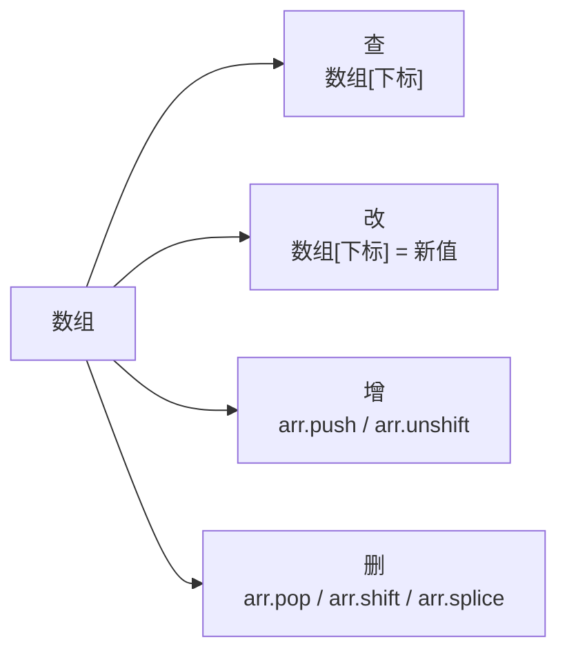

**2.3 操作数组 - 新增**

- **目标**：掌握利用 `push` 向数组添加元素（数据）

**`push` 方法**：

- `数组.push()` 方法将一个或多个元素添加到数组的**末尾**，并返回该数组的新长度（**重点**）
- **语法**：

```javascript
arr.push(元素1, ..., 元素n)
```

- **例如**：

```javascript
let arr = ['red', 'green']
arr.push('pink')
console.log(arr)  // ['red', 'green', 'pink']
```

**`unshift` 方法**：

- `arr.unshift(新增的内容)` 方法将一个或多个元素添加到数组的**开头**，并返回该数组的新长度
- **语法**：

```javascript
arr.unshift(元素1, ..., 元素n)
```

- **例如**：

```javascript
let arr = ['red', 'green']
arr.unshift('pink')
console.log(arr)  // ['pink', 'red', 'green']
```

```javascript
let arr = ['red', 'green']
arr.unshift('pink', 'hotpink')
console.log(arr)  // ['pink', 'hotpink', 'red', 'green']
```

**总结**：

1. 想要数组末尾增加数据元素利用那个方法？
   - `arr.push()`
   - 可以添加一个或者多个数组元素
   - 返回的是数组长度
2. 想要数组开头增加数据元素利用那个方法？
   - `arr.unshift()`
   - 可以添加一个或者多个数组元素
   - 返回的是数组长度
3. 重点记住那个？
   - `arr.push()`

**2.3 操作数组 - 删除**

- **目标**：能够删除数组元素（数据）

**`pop` 方法**：

- `数组.pop()` 方法从数组中删除**最后一个元素**，并返回该元素的值
- **语法**：

```javascript
arr.pop()
```

- **例如**：

```javascript
let arr = ['red', 'green']
arr.pop()
console.log(arr)  // ['red']
```

**`shift` 方法**：

- `数组.shift()` 方法从数组中删除**第一个元素**，并返回该元素的值
- **语法**：

```javascript
arr.shift()
```

- **例如**：

```javascript
let arr = ['red', 'green']
arr.shift()
console.log(arr)  // ['green']
```

**`splice` 方法**：

- `数组.splice()` 方法 删除指定元素
- **语法**：

```javascript
arr.splice(start, deleteCount)
arr.splice(起始位置, 删除几个元素)
```

- **解释**：
  - `start` 起始位置：
    - 指定修改的开始位置（从 0 计数）
  - `deleteCount`：
    - 表示要移除的数组元素的个数
    - 可选的。 如果省略则默认从指定的起始位置删除到最后

**总结**：

1. 想要数组末尾删除 1 个数据元素利用那个方法？带参数吗？
   - `arr.pop()`
   - 不带参数
   - 返回值是删除的元素
2. 想要数组开头删除 1 个数据元素利用那个方法？带参数吗？
   - `arr.shift()`
   - 不带参数
   - 返回值是删除的元素
3. 想要指定删除数组元素用那个？开发常用吗？有哪些使用场景？
   - `arr.splice(起始位置, 删除的个数)`
   - 开发很常用，比如随机抽奖，比如删除指定商品等等

#### 8.4 数组案例

**冒泡排序**：

- 冒泡排序是一种简单的排序算法。
- 它重复地走访过要排序的数列，一次比较两个元素，如果他们的顺序错误就把他们交换过来。走访数列的工作是重复地进行直到没有再需要交换，也就是说该数列已经排序完成。
- 这个算法的名字由来是因为越小的元素会经由交换慢慢"浮"到数列的顶端。
- 比如数组 `[2,3,1,4,5]` 经过排序成为了 `[1,2,3,4,5]` 或者 `[5,4,3,2,1]`

**冒泡排序分析**：

- 1. 一共需要的趟数，我们用**外层 `for` 循环**
  - 5 个数据我们一共需要走 4 趟
  - 长度就是 数组长度 减 1：`arr.length - 1`
- 2. 每一趟交换次数，我们用**里层 `for` 循环**
  - 第一趟 交换 4 次
  - 第二趟 交换 3 次
  - 第三趟 交换 2 次
  - 第四趟 交换 1 次
  - 长度就是 数组长度 减 去的 次数
  - 但是我们次数是从 0 开始的，所以最终 `arr.length - 1 - i`
- 3. 交换 2 个变量就好了

**数组排序**：

- `数组.sort()` 方法可以排序
- **语法**：

```javascript
let arr = [4, 2, 5, 1, 3]
// 1. 升序排列写法
arr.sort(function (a, b) {
  return a - b
})
console.log(arr)  // [1, 2, 3, 4, 5]
// 2. 降序排列写法
arr.sort(function (a, b) {
  return b - a
})
console.log(arr)  // [5, 4, 3, 2, 1]
```

### 9. 函数

> 章节涵盖：为什么需要函数、函数使用、函数传参、函数返回值、作用域、匿名函数

#### 9.1 为什么需要函数

- **目标**：能说出为什么需要函数
- **函数**：`function`，是被设计为**执行特定任务**的代码块
- **说明**：函数可以把具有相同或相似逻辑的代码"包裹"起来，通过函数调用执行这些被"包裹"的代码逻辑，这么做的优势是有利于**精简代码方便复用**。
- 比如我们前面使用的 `alert()`、`prompt()` 和 `console.log()` 都是一些 js 函数，只不过已经封装好了，我们直接使用的。

**总结**：

1. 为什么需要函数？
   - 可以实现代码复用，提高开发效率
2. 函数是什么？
   - `function` 执行特定任务的代码块

#### 9.2 函数使用

- **目标**：掌握函数语法，把代码封装起来

**函数的声明语法**：

```javascript
function 函数名() {
  函数体
}
```

**例**：

```javascript
function sayHi() {
  document.write('hai~~')
}
```

**函数命名规范**：

- 和变量命名基本一致
- 尽量小驼峰式命名法
- 前缀应该为**动词**
- 命名建议：常用动词约定

| 动词 | 含义 |
|---|---|
| `can` | 判断是否可执行某个动作 |
| `has` | 判断是否含有某个值 |
| `is` | 判断是否为某个值 |
| `get` | 获取某个值 |
| `set` | 设置某个值 |
| `load` | 加载某些数据 |

```javascript
function getName() {}
function addSquares() {}
```

**函数的调用语法**：

```javascript
// 函数调用，这些函数体内的代码逻辑会被执行
函数名()
```

- 注意：声明（定义）的函数必须调用才会真正被执行，使用 `()` 调用函数
- **例**：

```javascript
// 函数一次声明可以多次调用，每一次函数调用函数体里面的代码会重新执行一次
sayHi()
sayHi()
```

- 我们曾经使用的 `alert()`，`parseInt()` 这种名字后面跟小括号的本质都是函数的调用

**函数体**：

- 函数体是函数的构成部分，它负责将相同或相似代码"包裹"起来，直到函数调用时函数体内的代码才会被执行。函数的功能代码都要写在函数体当中。

```javascript
// 打招呼
function sayHi() {
  console.log('嗨~')
}
sayHi()
```

**总结**：

1. 函数是用那个关键字声明的？
   - `function`
2. 函数不调用会执行吗？如何调用函数？
   - 函数不调用自己不执行
   - 调用方式：函数名()
3. 函数的复用代码和循环重复代码有什么不同？
   - 循环代码写完即执行，不能很方便控制执行位置
   - 随时调用，随时执行，可重复调用

#### 9.3 函数传参

- **思考**：这样的函数只能求 10 + 20，这个函数功能局限非常大
- **解决方法**：把要计算的数字传到函数内
- **结论**：
  - 若函数完成功能需要调用者传入数据，那么就需要用有参数的函数
  - 这样可以极大提高函数的灵活性

**声明语法**：

```javascript
function 函数名(参数列表) {
  函数体
}
```

- **参数列表**：
  - 传入数据列表
  - 声明这个函数需要传入几个数据
  - 多个数据用逗号隔开

**例**：

- 单个参数：

```javascript
function getSquare(num1) {
  document.write(num1 * num1)
}
```

- 多个参数：

```javascript
function getSum(num1, num2) {
  document.write(num1 + num2)
}
```

**调用语法**：

```javascript
函数名(传递的参数列表)
```

**例**：

```javascript
getSquare(8)
getSum(10, 20)
```

- 调用函数时，需要传入几个数据就写几个，用逗号隔开

**形参 vs 实参**：

- **形参**：声明函数时写在函数名右边小括号里的叫形参（形式上的参数）
- **实参**：调用函数时写在函数名右边小括号里的叫实参（实际上的参数）
- 形参可以理解是在这个函数内声明的变量（比如 `num1 = 10`），实参可以理解为是给这个变量赋值
- 开发中尽量保持形参和实参个数一致
- 我们曾经使用过的 `alert('打印')`，`parseInt('11')`，`Number('11')` 本质上都是函数调用的传参

**总结**：

1. 函数传递参数的好处是？
   - 可以极大的提高了函数的**灵活性**
2. 函数参数可以分为那两类？怎么判断他们是那种参数？
   - 函数可以分为形参和实参
   - 函数声明时，小括号里面的是形参，形式上的参数
   - 函数调用时，小括号里面的是实参，实际的参数
   - 尽量保持形参和实参的个数一致
3. 参数中间用什么符号隔开？
   - 逗号

**参数默认值**：

- 形参：可以看做变量，但是如果一个变量不给值，默认是什么？
  - `undefined`
- 但是如果做用户不输入实参，刚才的案例，则出现 `undefined + undefined` 结果是什么？
  - `NaN`
- 我们可以改进下，用户不输入实参，可以给**形参默认值**，可以默认为 0，这样程序更严谨，可以如下操作：

```javascript
function getSum(x = 0, y = 0) {
  document.write(x + y)
}
getSum()       // 结果是 0，而不是 N
getSum(1, 2)   // 结果是 3
```

> 这个默认值只会在缺少实参参数传递时 才会被执行，所以有参数会优先执行传递过来的实参，否则默认为 undefined

#### 9.4 函数返回值

- **提问**：什么是函数？
- 函数是被设计为**执行特定任务**的代码块
- **提问**：执行完特定任务之后，然后呢？
- 把任务的结果给我们
- **缺点**：把计算后的结果处理方式写死了，内部处理了
- **解决**：把处理结果返回给调用者
- **有返回值函数的概念**：
  - 当调用某个函数，这个函数会返回一个结果出来
  - 这就是有**返回值**的函数

**其实我们前面已经接触了很多的函数具备返回值**：

```javascript
let result = prompt('请输入你的年龄?')
let result2 = parseInt('111')
```

- 只是这些函数是 JS 底层内置的，我们直接就可以使用
- 当然有些函数，则没有返回值

```javascript
alert('我是弹框，不需要返回值')
```

- 所以要根据需求，来设定需不需要返回值

**当函数需要返回数据出去时，用 `return` 关键字**：

- **语法**：

```javascript
return 数据
return 20
```

- **怎么使用呢？**

```javascript
function getSum(x, y) {
  return x + y
}
let num = getSum(10, 30)
document.write(num)
```

**细节**：

- 在函数体中使用 `return` 关键字能将内部的执行结果交给函数外部使用
- `return` 后面代码不会再被执行，会立即结束当前函数，所以 `return` 后面的数据不要换行写
- `return` 函数可以没有 `return`，这种情况函数默认返回值为 undefined

**总结**：

1. 为什么要让函数有返回值
   - 函数执行后得到结果，结果是调用者想要拿到的（一句话，函数内部不需要输出结果，而是**返回结果**）
   - 对执行结果的扩展性更高，可以让其他的程序使用这个结果
2. 函数有返回值用那个关键字？有什么注意事项呢？
   - 语法：`return 数据`
   - `return` 后面不接数据或者函数内不写 `return`，函数的返回值是 undefined
   - `return` 能立即结束当前函数，所以 `return` 后面的数据不要换行写

**1.4 函数细节补充**：

- 两个相同的函数后面的会覆盖前面的函数
- 在 Javascript 中实参的个数和形参的个数可以不一致
  - 如果形参过多 会自动填上 `undefined`（了解即可）
  - 如果实参过多 那么多余的实参会被忽略（函数内部有一个 `arguments`，里面装着所有的实参）
- 函数一旦碰到 `return` 就不会在往下执行了，函数的结束用 `return`

> **思考**：`break` 的结束和 `return` 结束有什么区别？

#### 9.5 作用域

- 通常来说，一段程序代码中所用到的名字并不总是有效和可用的，而限定这个名字的**可用性的代码范围**就是这个名字的**作用域**。
- 作用域的使用提高了程序逻辑的局部性，增强了程序的可靠性，减少了名字冲突。

| 全局作用域 | 局部作用域 |
|---|---|
| **全局有效** | **局部有效** |
| 作用于所有代码执行的环境（整个 `script` 标签内部）或者一个独立的 js 文件 | 作用于函数内的代码环境，就是局部作用域。因为跟函数有关系，所以也称为函数作用域。 |

在 JavaScript 中，根据作用域的不同，变量可以分为：

- **全局变量**：函数外部 `let` 的变量，全局变量在任何区域都可以访问和修改
- **局部变量**：函数内部 `let` 的变量，局部变量只能在当前函数内部访问和修改

**特殊坑**：

- 变量有一个坑，特殊情况：
- 如果函数内部，变量没有声明，直接赋值，也当**全局变量**看，但是强烈不推荐
- 但是有一种情况，函数内部的形参可以看做是局部变量。

**总结**：

1. JS 中作用域分为哪 2 种？
   - 全局作用域。函数外部或者整个 script 有效
   - 局部作用域。也称为函数作用域，函数内部有效
2. 根据作用域不同，变量分为哪 2 种？
   - 全局变量
   - 局部变量
3. 有一种特殊情况是全局变量是那种？我们提倡吗？
   - 局部变量或者块级变量 没有 let 声明直接赋值的当全局变量看
   - 我们强烈不提倡

**作用域思考**：

- 在不同作用域下，可能存在变量命名冲突的情况，到底该执行谁呢？

```javascript
let num = 10
function fn() {
  let num = 20
  console.log(num)
}
fn()
```

**变量的访问原则**：

- 只要是代码，就至少有一个作用域
- 写在函数内部的局部作用域
- 如果函数中还有函数，那么在这个作用域中就又可以诞生一个作用域
- **访问原则**：在能够访问到的情况下**先局部，局部没有在找全局**

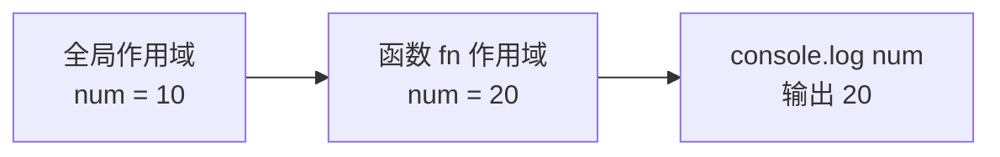

**总结**：

1. 变量访问原则是什么？
   - 采取**就近原则**的方式来查找变量最终的值

#### 9.6 匿名函数

- **具名函数**：`function fn() {}` `fn()`
- **匿名函数**：`function() {}`

**匿名函数**：

- 没有名字的函数，无法直接使用。
- **使用方式**：
  - 函数表达式
  - 立即执行函数

**1. 函数表达式**：

- 将匿名函数赋值给一个变量，并且通过变量名称进行调用 我们将这个称为**函数表达式**
- **语法**：

```javascript
let fn = function () {
  // 函数体
}
```

- **调用**：

```javascript
fn()   // 函数名()
```

> 其中函数的形参和实参使用跟具名函数一致。

**使用场景**：

- 目前没有，先认识
- 后期 web API 会使用：

```html
<body>
  <button>点击我</button>
  <script>
    let btn = document.querySelector('button')
    btn.onclick = function () {
      alert('我是匿名函数')
    }
  </script>
</body>
```

**2. 立即执行函数**：

- **场景介绍**：避免全局变量之间的污染
- **语法**：

```javascript
// 方式1
;(function () { console.log(11) })()

// 方式2
;(function () { console.log(11) })()
```

```javascript
// 不需要调用，立即执行
;(function (x, y) {
  console.log(x + y)
})(1, 2)
// (function(){})();

;(function () {}())  // 1. 第一种写法
// (function(){}());  // 2. 第二种写法
;(function (x, y) {
  console.log(x + y)
})(1, 3)
```

> 注意：多个立即执行函数要用 `;` 隔开，要不然会报错

**总结**：

1. 立即执行函数有什么作用？
   - 防止变量污染
2. 立即执行函数需要调用吗？有什么注意事项呢？
   - 无需调用，立即执行，其实本质已经调用了
   - 多个立即执行函数之间用分号隔开

#### 9.7 逻辑中断（拓展）

- 开发中，还会见到以下的写法：

```javascript
function getSum(x, y) {
  x = x || 0
  y = y || 0
  console.log(x + y)
}
getSum(1, 2)
```

**1. 逻辑运算符里的短路**

- 短路：只存在于 `&&` 和 `||` 中，当满足一定条件会让右边代码不执行

| 符号 | 短路条件 |
|---|---|
| `&&` | 左边为 `false` 就短路 |
| `\|\|` | 左边为 `true` 就短路 |

- **原因**：通过左边能得到整个式子的结果，因此没必要再判断右边
- **运算结果**：无论 `&&` 还是 `||`，运算结果都是最后被执行的表达式值，一般用在变量赋值

```javascript
console.log(11 && 22)   // 都是真，这返回最后一个真值
console.log(11 || 22)   // 输出第一个真值
```

**2. 转换为 Boolean 型**

**显示转换**：

- `Boolean(内容)`
- 记忆：`''`、`0`、`undefined`、`null`、`false`、`NaN` 转换为布尔值后都是 `false`，其余则为 `true`

```javascript
console.log(false && 20)     // false
console.log(5 < 3 && 20)     // flase
console.log(undefined && 20) // undefined
console.log(null && 20)      // null
console.log(0 && 20)         // 0
console.log(10 && 20)        // 20
```

```javascript
console.log(false || 20)     // 20
console.log(5 < 3 || 20)     // 20
console.log(undefined || 20) // 20
console.log(null || 20)      // 20
console.log(0 || 20)         // 20
console.log(10 || 20)        // 10
```

**隐式转换**：

1. 有字符串的加法 `"" + 1`，结果是 `"1"`
2. 减法 `-`（像大多数数学运算一样）只能用于数字，它会使空字符串 `""` 转换为 0
3. `null` 经过数字转换之后会变为 0
4. `undefined` 经过数字转换之后会变为 NaN

```javascript
console.log('' - 1)          // -1
console.log('pink老师' - 1)   // NaN
console.log(null + 1)        // 1
console.log(undefined + 1)   // NaN
console.log(NaN + 1)         // NaN
```

### 10. 对象

> 章节涵盖：对象是什么、对象使用、属性增删改查、对象中的方法、遍历对象、内置对象、值类型与引用类型

#### 10.1 对象是什么

- **目标**：能说出对象是什么
- **对象（object）**：JavaScript 里的一种**数据类型**，可以理解为是一种**无序的数据集合**。
- 注意：
  - 对象的数据集合是以"**键值对**"（`key: value`）的形式存在。
  - 数组是有序的数据集合，对象是**无序**的数据集合。

**对象与数组对比**：

| 类型 | 数据集合 | 访问方式 | 有序性 |
|---|---|---|---|
| **数组** | 一组数据 | 通过下标（索引） | ✅ 有序（下标 0,1,2...） |
| **对象** | 键值对集合 | 通过属性名 | ❌ 无序 |

#### 10.2 对象使用

- **目标**：掌握对象的声明语法
- 对象声明语法有两种：

**1. 字面量声明**：

```javascript
let 对象名 = {}
let 对象名 = { uname: 'pink老师', age: 18, gender: '女' }
```

**2. `new Object` 声明**：

```javascript
let 对象名 = new Object()
```

- 这是 JavaScript 内置的构造函数。
- **属性**：对象的成员（变量）。
- **方法**：对象的成员（函数）。

**例**：

```javascript
let person = {
  uname: 'pink老师',
  age: 18,
  gender: '女'
}
console.log(person)   // {uname: 'pink老师', age: 18, gender: '女'}
```

#### 10.3 属性 - 增删改查

- **目标**：掌握对象属性的查、改、增、删

**1. 查（访问属性）**

对象访问属性有两种方式：

| 写法 | 语法 | 适用场景 |
|---|---|---|
| **点形式** | `对象名.属性` | 简单属性名（不能用关键字 / 数字开头） |
| **[] 形式** | `对象名['属性']` | 多词属性、含 `-` 等特殊字符、属性名是变量 |

- **点形式**：`对象.属性`
- **[] 形式**：`对象['属性']`（单引号 / 双引号都可）
- **区别**：
  - 点后面的属性名一定不要加引号
  - `[]` 里面的属性名一定加引号
  - 后期不同使用场景会用到不同的写法

**例**：

```javascript
let person = {
  uname: 'pink老师',
  age: 18,
  gender: '女'
}

console.log(person.uname)        // pink老师
console.log(person['age'])       // 18
```

**2. 改（修改属性）**

```javascript
let person = { uname: 'pink老师', age: 18, gender: '女' }
person.gender = '男'             // 改语法
console.log(person)              // {uname: 'pink老师', age: 18, gender: '男'}
```

**3. 增（新增属性）**

```javascript
let person = { uname: 'pink老师', age: 18, gender: '女' }
person.address = '武汉黑马'       // 增语法
console.log(person)              // {uname: 'pink老师', age: 18, gender: '女', address: '武汉黑马'}
```

**4. 删（删除属性）**

```javascript
delete person.gender
console.log(person)              // {uname: 'pink老师', age: 18, address: '武汉黑马'}
```

**总结**：

| 操作 | 语法 |
|---|---|
| **查** | `对象名.属性` |
| **改** | `对象名.属性 = 新值` |
| **增** | `对象名.新属性名 = 新值` |
| **删** | `delete 对象名.属性` |

- 改和增语法一样，判断标准就是对象有没有这个属性，没有就是新增，有就是改。

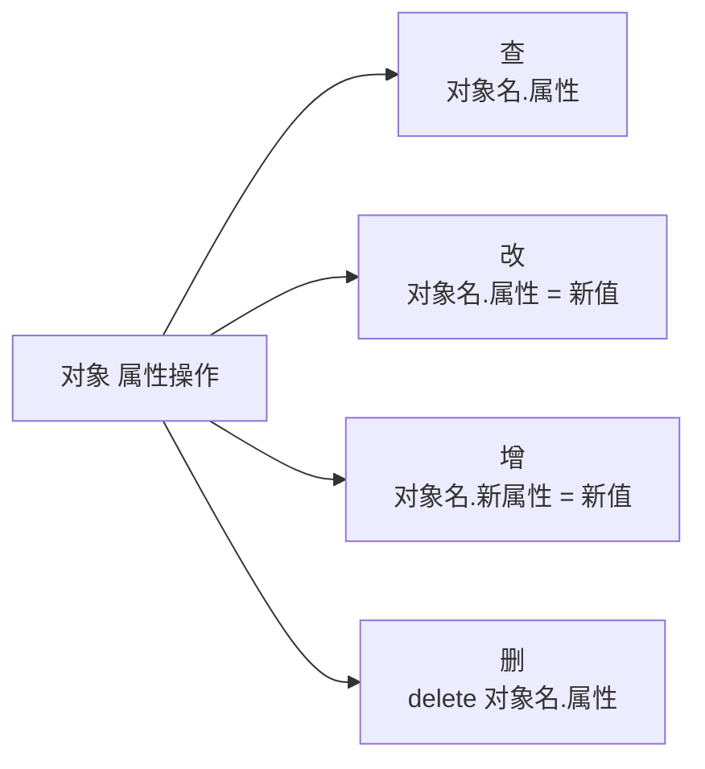

#### 10.4 对象中的方法

- **目标**：掌握对象中方法的声明与调用

- **数据行为性的信息称为方法**，如跑步、唱歌等，一般是动词性的，其本质是函数。

**1. 方法的声明**：

```javascript
let person = {
  name: 'andy',
  sayHi: function() {
    document.write('hi~~')
  }
}
```

- **要点**：
  1. 方法是由**方法名**和**函数**两部分构成，它们之间使用 `:` 分隔
  2. 多个属性之间使用**英文逗号**分隔
  3. 方法是依附在对象中的函数
  4. 方法名可以使用 `""` 或 `''`，一般情况下省略，除非名称遇到特殊符号如空格、中横线等

**2. 方法的调用**：

- **声明对象，并添加了若干方法后**，可以使用 `对象名.方法名()` 进行调用，我称之为**方法调用**。
- 也可以添加形参和实参。

```javascript
let person = {
  name: 'andy',
  sayHi: function () {
    document.write('hi~~')
  }
}
// 对象名.方法名()
person.sayHi()
```

- **注意**：千万别忘了给方法名后面加小括号 `()`，即使不传参数也要加。

**3. 方法中的 `this`**：

- 方法中的 `this` 指向当前对象（方法的调用者）。

```javascript
let person = {
  name: 'andy',
  sayHi: function () {
    console.log('hi, 我是' + this.name)
  }
}
person.sayHi()    // hi, 我是andy
```

#### 10.5 遍历对象

- **目标**：能够遍历输出对象里面的元素

**遍历对象的问题**：

- 对象没有像数组一样的 `length` 属性，所以无法确定长度
- 对象里面是无序的键值对，没有规律，不像数组里面是有规律的下标

**`for...in` 遍历**：

- 一般不用这种方式遍历数组、主要是用来遍历对象

```javascript
let obj = {
  uname: 'andy',
  age: 18,
  sex: '男'
}
for (let k in obj) {
  console.log(k)        // 打印属性名
  console.log(obj[k])   // 打印属性值
}
```

- **要点**：
  - `for...in` 语法中的 `k` 是一个变量，在循环的过程中依次代表对象的属性名
  - 由于 `k` 是变量，所以必须使用 `[]` 语法解析
  - **一定记住**：`k` 是获得对象的**属性名**，`对象名[k]` 是获得**属性值**

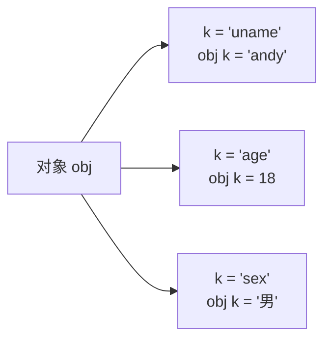

**总结**：

1. 遍历对象用哪个语句？
   - `for...in`
2. `for (let k in obj)` 中，获得对象属性是哪个？获得值是哪个？
   - 获得对象属性是 `k`
   - 获得对象值是 `obj[k]`

#### 10.6 内置对象

- **目标**：学会调用 JavaScript 为我们准备好的内置对象
- **学习路径**：
  1. 内置对象是什么
  2. 内置对象 `Math`
  3. 生成任意范围随机数

**1. 内置对象是什么？**

- **JavaScript 内部提供的对象**，包含各种属性和方法给开发者调用。
- 思考：我们之前用过内置对象吗？
  - `document.write()`
  - `console.log()`

**2. 内置对象 `Math`**

- **介绍**：`Math` 对象是 JavaScript 提供的一个"**数学**"对象
- **作用**：提供了一系列做数学运算的方法

| 方法 | 作用 |
|---|---|
| `Math.random()` | 生成 `0~1` 之间的随机数（包含 0 不包括 1） |
| `Math.ceil()` | 向上取整 |
| `Math.floor()` | 向下取整 |
| `Math.max()` | 找最大数 |
| `Math.min()` | 找最小数 |
| `Math.pow()` | 幂运算 |
| `Math.abs()` | 绝对值 |

**3. 生成任意范围随机数**

- `Math.random()` 随机数函数，返回一个 `0 ~ 1` 之间，并且包括 0 不包括 1 的随机小数 `[0, 1)`。

```javascript
// 如何生成 0~10 的随机数呢？
Math.floor(Math.random() * (10 + 1))

// 如何生成 5~10 的随机数？
Math.floor(Math.random() * (5 + 1)) + 5

// 如何生成 N~M 之间的随机数？
Math.floor(Math.random() * (M - N + 1)) + N
```

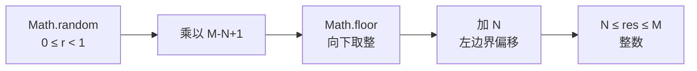

**4. 术语解释（拓展）**

| 术语 | 解释 | 举例 |
|---|---|---|
| **关键字** | 在 JavaScript 中有特殊意义的词汇 | `let`、`var`、`function`、`if`、`else`、`switch`、`case`、`break` |
| **保留字** | 在目前的 JavaScript 中没意义，但未来可能会具有特殊意义的词汇 | `int`、`short`、`long`、`char` |
| **标识（标识符）** | 变量名、函数名的另一种叫法 | 无 |
| **表达式** | 能产生值的代码，一般配合运算符出现 | `10 + 3`、`age >= 18` |
| **语句** | 一段可执行的代码 | `if ()`、`for ()` |

#### 10.7 值类型与引用类型（拓展）

- **目标**：了解基本数据类型和引用数据类型的存储方式

- **简单类型**又叫做基本数据类型或者**值类型**，**复杂类型**又叫做**引用类型**。

| 类型 | 别名 | 包含 | 存储方式 |
|---|---|---|---|
| **值类型** | 简单数据类型 / 基本数据类型 | `string`、`number`、`boolean`、`undefined`、`null` | 存放在**栈**中 |
| **引用类型** | 复杂数据类型 | 通过 `new` 关键字创建的对象，如 `Object`、`Array`、`Date` 等 | 对象存放在**堆**中，变量在栈中存地址 |

**1. 堆栈空间分配区别**

- **栈（操作系统）**：由操作系统自动分配释放存放函数的参数值、局部变量的值等。其操作方式类似于数据结构中的栈。
  - **简单数据类型放到栈里面**
- **堆（操作系统）**：存储复杂类型（对象），一般由程序员分配释放，若程序员不释放，由垃圾回收机制回收。
  - **引用数据类型存放到堆里面**

**2. 简单类型的内存分配**

- 值类型变量的数据直接存放在变量（栈空间）中。

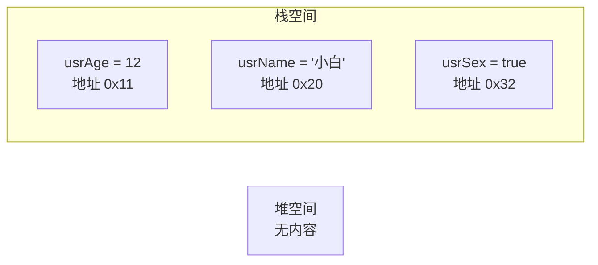

**3. 复杂类型的内存分配**

- 引用类型变量（栈空间）里存放的是**地址**，真正的对象实例存放在堆空间中。

```javascript
let usrObj = {}
```

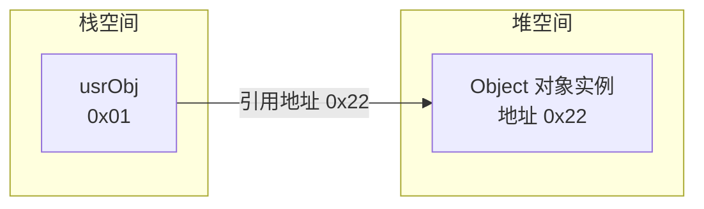

- 栈里的变量通过 `0x22` 这个**地址引用**堆里的对象实例。

---

## APIs

### 课程导览

**Web APIs 课程安排 7 天**

| 天数 | 主题 | 关键内容 | 综合案例 |
|---|---|---|---|
| 第一天 | DOM-获取元素 | 获取元素、修改属性 | 京东秒杀 |
| 第二天 | DOM-事件基础 | 注册事件、tab 栏切换 | 每日特价 |
| 第三天 | DOM-事件进阶 | 事件对象、事件委托 | 京东好物 |
| 第四天 | DOM-节点操作 | 节点的增删改查 | 学员信息管理 |
| 第五天 | BOM-操作浏览器 | BOM、插件、本地存储 | 新增学生信息 / 就业榜 |
| 第六天 | 正则表达式 | 正则表达式、综合案例 | 表单验证 |
| 第七天 | 实战 | 小兔鲜个人实战 | 小兔鲜电商网站 |

**课程设计原则**：

- **拒绝百科全书** —— 更注重实用，有效让更多的精力放在有用的价值上。
- **每天一个综合案例** —— 当天学的不好，看看综合案例是否能独立完成之后练习作业强化。
- **有些课堂练习自己写** —— 有些课堂案例我不讲，而是引导小伙伴自己独立思考完成，锻炼思考能力。
- **注重实战** —— 编程注重实战能力，而我们是以交付实战能力为主。

> ✅ 本章对应目录中的主题已陆续整理到 `### 0. ~ ### 10.` 章节，覆盖：变量声明、Web API 基本认知、获取 DOM 对象、操作元素内容、操作元素属性、定时器、事件监听（绑定）、事件类型、事件对象、环境对象、回调函数。剩余「事件进阶、节点操作、BOM、正则、实战、综合案例」待补充截图后再追加。

### 0. 变量的声明（课前铺垫）

> 章节涵盖：三个关键字、const 优先、引用类型的特殊性

#### 0.1 三个关键字

- 变量声明有三个关键字：`var`、`let`、`const`。
- **首先 `var` 先排除**：老派写法，问题很多，可以淘汰掉。
- **`let` 还是 `const`？** 建议 **const 优先**，尽量使用 const，原因：
  - const 语义化更好
  - 很多变量我们声明的时候就知道它不会被更改了，那为什么不用 const 呢？
  - 实际开发中也是，比如 React 框架，基本 const
- 如果还在纠结，那么我建议：**有了变量先给 const**，如果发现它后面是要被修改的，再改为 let。

| 关键字 | 作用域 | 变量提升 | 能否重复声明 | 能否重新赋值 | 推荐度 |
|---|---|---|---|---|---|
| `var` | 函数级 | ✅ | ✅ | ✅ | ❌（ES5 旧语法） |
| `let` | 块级 | ❌ | ❌ | ✅ | ✅（需要修改时） |
| `const` | 块级 | ❌ | ❌ | ❌ | ✅（默认优先） |

#### 0.2 案例：let 能否改为 const？

**可以改 const**（值没变过）：

```javascript
// 字符串拼接，值没变
document.write('我叫' + '刘德华')   // 我叫刘德华
const uname = '刘德华'
const song = '忘情水'
document.write(uname + song)       // 刘德华忘情水

// prompt + 一元正号转换为数字后，值没变
const num1 = +prompt('请输入第一个数值:')
const num2 = +prompt('请输入第二个数值:')
alert(`两者相加的结果是:${num1 + num2}`)
```

**不能改 const**（变量重新赋值）：

```javascript
// num 重新赋值
let num = 1
num = num + 1
console.log(num)   // 2

// for 循环计数器 i++
for (let i = 0; i < nums.length; i++) {
  document.write(nums[i])
}
```

**引用类型可以改 const**（只修改内容，不修改地址）：

```javascript
const arr = ['red', 'green']
arr.push('pink')                   // 修改堆里数组内容，地址不变
console.log(arr)                   // ['red', 'green', 'pink']

const person = {
  uname: 'pink老师',
  age: 18,
  gender: '女'
}
person.address = '武汉黑马'         // 给对象新增属性，地址不变
console.log(person)
```

#### 0.3 const 原理（重要）

- `const` 声明的值**不能更改**，而且 const 声明变量的时候需要里面进行初始化。
- 但是对于**引用数据类型**，const 声明的变量，里面存的不是值，不是值，不是值，是**地址**。

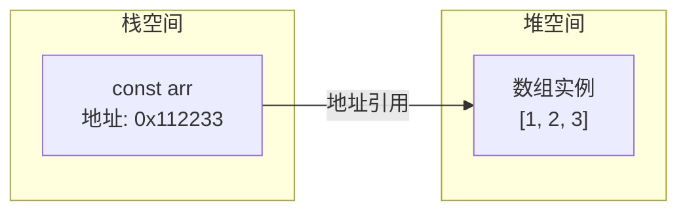

- 栈里的 `const arr` 存的是地址 `0x112233`；堆里才是真正的数据 `[1, 2, 3]`。
- **只要地址不变，就不会报错**；地址变了才会报错。

#### 0.4 错误 vs 正确示例

| 场景 | 错误写法（地址变了） | 正确写法（地址不变） |
|---|---|---|
| 数组 | `const names = []`<br/>`names = [1, 2, 3]` | `const names = []`<br/>`names[0] = 1`<br/>`names[1] = 2`<br/>`names[2] = 3` |
| 对象 | `const obj = {}`<br/>`obj = { uname: 'pink老师' }` | `const obj = {}`<br/>`obj.uname = 'pink老师'` |

#### 0.5 总结

1. 以后声明变量我们优先使用哪个？
   - **const**
   - 有了变量先给 const，如果发现它后面是要被修改的，再改为 let
2. 为什么 const 声明的对象可以修改里面的属性？
   - 因为对象是引用类型，里面存储的是地址，只要地址不变，就不会报错
   - 建议数组和对象使用 const 来声明
3. 什么时候使用 let 声明变量？
   - 如果基本数据类型的值或者引用类型的地址发生变化的时候，需要用 let
   - 比如一个变量进行加减运算，比如 for 循环中的 `i++`

### 1. Web API 基本认知

> 章节涵盖：作用和分类、什么是 DOM、DOM 树、DOM 对象

#### 1.1 作用和分类

- **作用**：使用 JS 去操作 html 和浏览器。
- **分类**：
  - **DOM**（文档对象模型，Document Object Model）
  - **BOM**（浏览器对象模型，Browser Object Model）

**JavaScript 组成**：


#### 1.2 什么是 DOM

- **定义**：DOM（Document Object Model——文档对象模型）是用来呈现以及与任意 HTML 或 XML 文档交互的 API。
- **白话文**：DOM 是浏览器提供的一套专门用来**操作网页内容**的功能。
- **DOM 作用**：
  - 开发网页内容特效
  - 实现用户交互

**DOM 示例**：通过 JavaScript 动态更新 HTML 文档中的标签元素（如随机点名、京东秒杀倒计时）。

#### 1.3 DOM 树

**什么是 DOM 树**：

- 将 HTML 文档以树状结构直观的表现出来，我们称之为**文档树**或 **DOM 树**。
- 描述网页内容关系的名词。
- **作用**：文档树直观的体现了**标签与标签之间的关系**。

**HTML 文档结构示例**：

```html
<!DOCTYPE html>
<html lang="en">
<head>
  <meta charset="UTF-8">
  <meta name="viewport" content="width=device-width, initial-scale=1.0">
  <title>标题</title>
</head>
<body>
  文本
  <a href="">链接名</a>
  <div id="" class="">文本</div>
</body>
</html>
```

**对应的 DOM 树**：

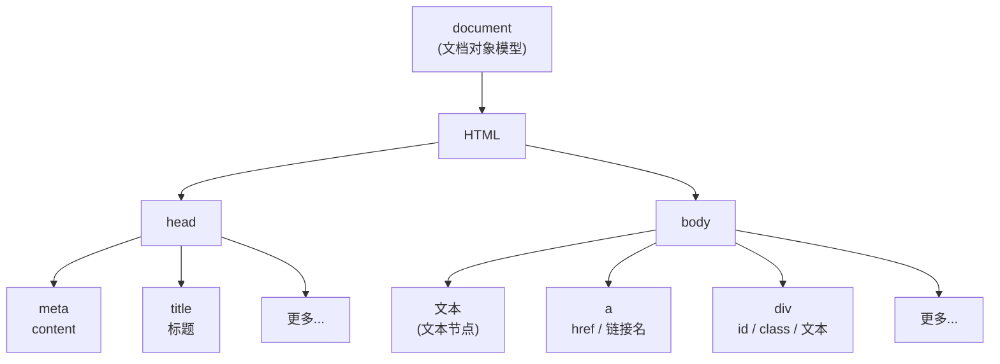

> DOM 树中的节点分为三类：**元素节点**（如 `html`）、**属性节点**（如 `href`）、**文本节点**（如"文本"）。

#### 1.4 DOM 对象（重要）

- **DOM 对象**：浏览器根据 html 标签生成的 **JS 对象**。
  - 所有的标签属性都可以在这个对象上面找到。
  - 修改这个对象的属性会自动映射到标签身上。
- **DOM 的核心思想**：**把网页内容当做对象来处理**。
- **document 对象**：
  - 是 DOM 里提供的一个**对象**。
  - 所以它提供的属性和方法都是**用来访问和操作网页内容**的。
  - 例：`document.write()`
  - **网页所有内容都在 document 里面**。

**DOM 对象结构示意**：

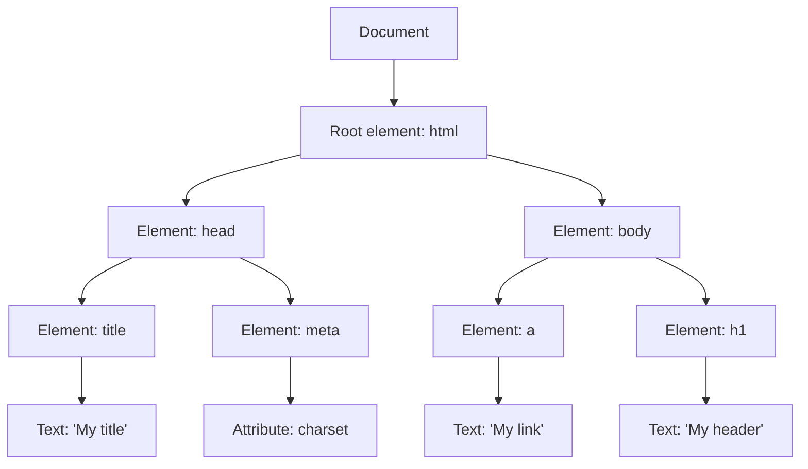

#### 1.5 本章总结

1. **Web API 阶段我们学习哪两部分？**
   - DOM
   - BOM
2. **DOM 是什么？有什么作用？**
   - DOM 是文档对象模型
   - 操作网页内容，可以开发网页内容特效和实现用户交互
3. **DOM 树是什么？**
   - 将 HTML 文档以树状结构直观的表现出来，我们称之为文档树或 DOM 树
   - 作用：文档树直观的体现了标签与标签之间的关系
4. **DOM 对象怎么创建的？**
   - 浏览器根据 html 标签生成的 JS 对象（DOM 对象）
   - DOM 的核心就是把内容当对象来处理
5. **document 是什么？**
   - 是 DOM 里提供的一个对象
   - 网页所有内容都在 document 里面

### 2. 获取 DOM 对象

> 章节涵盖：学习目标、根据 CSS 选择器获取（重点）、其他获取方法（了解）

#### 2.1 学习目标与提问

- **目标**：能查找/获取 DOM 对象。
- **提问**：我们想要操作某个标签首先做什么？
  - 肯定首先选中这个标签，跟 CSS 选择器类似，选中标签才能操作。
  - 查找/获取 DOM 元素就是**利用 JS 选择页面中标签元素**。

**学习路径**：

1. 根据 CSS 选择器来获取 DOM 元素（**重点**）
2. 其他获取 DOM 元素方法（了解）

#### 2.2 根据 CSS 选择器来获取 DOM 元素（重点）

**1. 选择匹配的第一个元素**

```javascript
document.querySelector('css选择器')
```

- **参数**：包含一个或多个有效的 CSS 选择器**字符串**。
- **返回值**：
  - CSS 选择器匹配的**第一个元素**，一个 `HTMLElement` 对象。
  - 如果没有匹配到，则返回 `null`。
- **MDN 文档**：https://developer.mozilla.org/zh-CN/docs/Web/API/Document/querySelector

**2. 选择匹配的多个元素**

```javascript
document.querySelectorAll('css选择器')
```

- **参数**：包含一个或多个有效的 CSS 选择器**字符串**。
- **返回值**：CSS 选择器匹配的 **NodeList 对象集合**。
- **例如**：`document.querySelectorAll('ul li')`

**`querySelectorAll` 返回的是一个伪数组**：

- 有长度、有索引号的"数组"。
- 但是**没有 `pop()`、`push()` 等数组方法**。
- 想要得到里面的每一个对象，则需要**遍历（for）**的方式获得。

> ⚠️ **注意事项**：哪怕只有一个元素，通过 `querySelectorAll()` 获取过来的也是一个**伪数组**，里面只有一个元素而已。

**两者区别总结**：

| 方法 | 选几个 | 返回值 | 是否可直接修改 |
|---|---|---|---|
| `querySelector()` | 1 个 | HTMLElement / `null` | ✅ 可以 |
| `querySelectorAll()` | 多个 | NodeList（伪数组） | ❌ 不可以，只能通过遍历一次给里面的元素做修改 |

> **小括号参数注意事项**：
> - 里面写 CSS 选择器
> - 必须是字符串，**也就是必须加引号**

#### 2.3 其他获取 DOM 元素方法（了解）

```javascript
// 根据 id 获取一个元素
document.getElementById('nav')

// 根据标签获取一类元素  获取页面所有 div
document.getElementsByTagName('div')

// 根据类名获取元素  获取页面所有类名为 w 的
document.getElementsByClassName('w')
```

> 这三种方法**直接写名字即可**（不加 `.` 或 `#` 等 CSS 符号），但**不常用**，因为 CSS 选择器方式更灵活。

### 3. 操作元素内容

> 章节涵盖：innerText 属性、innerHTML 属性

#### 3.1 学习目标

- **目标**：能够修改元素的文本/更换内容。
- DOM 对象都是根据标签生成的，所以**操作标签，本质上就是操作 DOM 对象**。
- 就是操作对象使用的**点语法**。
- 如果想要修改标签元素的里面的**内容**，则可以使用如下几种方式。

#### 3.2 对象.innerText 属性

- **作用**：将文本内容添加/更新到任意标签位置
- **特点**：显示**纯文本**，**不解析标签**

```javascript
const info = document.querySelector('.info')
// 获取标签内部的文字
// console.log(info.innerText)
// 添加/修改标签内部文字内容
info.innerText = '嗨喽，俺是刘德华~'
```

#### 3.3 对象.innerHTML 属性

- **作用**：将文本内容添加/更新到任意标签位置
- **特点**：**会解析标签**，多标签建议使用模板字符串

```javascript
const info = document.querySelector('.info')
// 获取标签内部的文字
// console.log(info.innerHTML)
// 添加/修改标签内部文字内容
info.innerHTML = '嗨喽，俺是<strong>刘德华</strong>~'
```

#### 3.4 两者区别

| 属性 | 是否解析标签 | 推荐场景 |
|---|---|---|
| `元素.innerText` | ❌ 不解析标签（只识别文本） | 只插入纯文本时使用 |
| `元素.innerHTML` | ✅ 能识别文本，能够解析标签 | 需要插入 HTML 标签时使用 |

> 💡 **小技巧**：如果还在纠结到底用谁，你可以**选择 `innerHTML`**（功能更强，且支持多标签拼接）。

### 4. 操作元素属性

> 章节涵盖：常用属性、样式属性、类名操作、表单元素属性、自定义属性

#### 4.1 操作元素常用属性

- 还可以通过 JS 设置/修改标签元素属性，比如通过 `src` 更换图片。
- 最常见的属性比如：`href`、`title`、`src` 等。

**语法**：

```javascript
对象.属性 = 值
```

**举例说明**：

```javascript
// 1. 获取元素
const pic = document.querySelector('img')
// 2. 操作元素
pic.src = './images/b02.jpg'
pic.title = '刘德华黑鸟演唱会'
```

#### 4.2 操作元素样式属性

- 还可以通过 JS 设置/修改标签元素的**样式属性**。
- 比如：轮播图小圆点自动更换颜色样式；点击按钮可以滚动图片（移动 `left` 等）。

**学习路径**：

1. 通过 `style` 属性操作 CSS
2. 操作类名（`className`）操作 CSS
3. 通过 `classList` 操作类控制 CSS

**1. 通过 `style` 属性操作 CSS**

语法：

```javascript
对象.style.样式属性 = 值
```

举例说明：

```javascript
const box = document.querySelector('.box')
// 修改元素样式
box.style.width = '200px'
box.style.marginTop = '15px'
box.style.backgroundColor = 'pink'
```

注意：

1. 修改样式通过 **`style` 属性**引出
2. 如果属性有 `-` 连接符，需要转换为**小驼峰命名法**（如 `margin-top` → `marginTop`）
3. 赋值的时候，需要的时候不要忘记加 CSS **单位**

**2. 操作类名（`className`）操作 CSS**

- 如果修改的样式比较多，直接通过 `style` 属性修改比较繁琐，我们可以通过借助于 CSS 类名的形式。

语法：

```javascript
// active 是一个 css 类名
元素.className = 'active'
```

注意：

1. 由于 `class` 是关键字，所以使用 **`className`** 去代替
2. `className` 是**使用新值换旧值**，如果需要添加一个类，需要保留之前的类名

**3. 通过 `classList` 操作类控制 CSS**

- 为了解决 `className` 容易覆盖以前的类名，我们可以通过 `classList` 方式**追加和删除类名**。

语法：

```javascript
// 追加一个类
元素.classList.add('类名')
// 删除一个类
元素.classList.remove('类名')
// 切换一个类（有则删除，无则添加）
元素.classList.toggle('类名')
```

**`className` vs `classList` 区别**：

| 场景 | 推荐 |
|---|---|
| 修改大量样式 | `className` 更方便 |
| 修改少量样式 / 不想覆盖原类名 | `classList` 更安全 |
| 只想追加或删除某个类 | 必须用 `classList`（classList 是追加和删除，不影响以前类名） |

#### 4.3 操作表单元素属性

- 表单很多情况，也需要修改属性，比如点击"眼睛"图标可以看到密码，本质是把表单类型转换为文本框。
- **正常的有属性有取值的** 跟其他的标签属性没有任何区别：
  - **获取**：`DOM对象.属性名`
  - **设置**：`DOM对象.属性名 = 新值`

```javascript
表单.value = '用户名'
表单.type = 'password'
```

**布尔值属性**：

- 表单属性中添加就有效果，移除就没有效果。
- **一律使用布尔值表示**：如果为 `true` 代表添加了该属性，如果是 `false` 代表移除了该属性。
- 比如：`disabled`、`checked`、`selected`

```javascript
// 禁用按钮
btn.disabled = true
// 选中复选框
checkbox.checked = true
// 选中下拉项
option.selected = true
```

#### 4.4 自定义属性

- **标准属性**：标签天生自带的属性，比如 `class`、`id`、`title` 等，可以直接使用点语法操作（比如 `disabled`、`checked`、`selected`）。
- **自定义属性**：
  - 在 HTML5 中推出来了专门的 **`data-` 自定义属性**
  - 在标签上一律以 **`data-` 开头**
  - 在 DOM 对象上一律以 **`dataset` 对象方式**获取

```html
<body>
  <div class="box" data-id="10">盒子</div>
  <script>
    const box = document.querySelector('.box')
    console.log(box.dataset.id)   // 10
  </script>
</body>
```

### 5. 定时器 - 间歇函数

> 章节涵盖：定时器函数介绍、定时器函数基本使用

#### 5.1 定时器函数介绍

- 网页中经常会需要一种功能：**每隔一段时间需要自动执行一段代码**，不需要我们手动去触发。
- 例如：网页中的**倒计时**（京东秒杀 22:00 点场 距结束 `00:14:22`）。
- 要实现这种需求，需要**定时器函数**。
- 定时器函数有两种，本节先讲**间歇函数**（`setInterval`）。

**应用场景**：

- 网页倒计时
- 京东秒杀倒计时
- 轮播图自动切换
- 用户协议几秒后才可勾选

#### 5.2 开启定时器 - `setInterval`

```javascript
setInterval(函数, 间隔时间)
```

- **作用**：每隔一段时间调用这个函数
- **间隔时间单位**：毫秒

**举例说明**：

```javascript
function repeat() {
  console.log('前端程序员，就是头发多咋滴~~')
}
// 每隔一秒调用 repeat 函数
setInterval(repeat, 1000)
```

> ⚠️ **注意**：
> 1. 函数名字**不需要加括号**（加括号会立即执行一次，而不是定时执行）
> 2. 定时器返回的是一个 **id 数字**

#### 5.3 关闭定时器 - `clearInterval`

定时器函数可以开启和关闭定时器。

**语法**：

```javascript
let 变量名 = setInterval(函数, 间隔时间)
clearInterval(变量名)
```

> 一般**不会刚创建就停止**，而是满足一定条件再停止。

**举例说明**：

```javascript
let timer = setInterval(function() {
  console.log('hi~~')
}, 1000)

// 满足条件时关闭定时器
clearInterval(timer)
```

#### 5.4 本章总结

1. **定时器函数有什么作用？**
   - 可以根据时间自动重复执行某些代码。
2. **定时器函数如何开启？**
   - `setInterval(函数名, 时间)`
3. **定时器函数如何关闭？**

   ```javascript
   let 变量名 = setInterval(函数, 间隔时间)
   clearInterval(变量名)
   ```

### 6. 事件监听（绑定）

> 章节涵盖：事件监听、事件监听版本（DOM L0 / L2）、DOM 事件发展史

#### 6.1 事件监听

- **目标**：能够给 DOM 元素添加事件监听。

- **什么是事件**：
  - 事件是在编程时系统内发生的**动作**或者发生的事情
  - 比如用户在网页上**单击**一个按钮

- **什么是事件监听**：
  - 就是让程序检测是否有事件产生，一旦有事件触发，就立即调用一个函数做出响应
  - 也称为 **绑定事件** 或者 **注册事件**
  - 比如鼠标经过显示下拉菜单，比如点击可以播放轮播图等等

- **语法**：

```javascript
元素对象.addEventListener('事件类型', 要执行的函数)
```

- **事件监听三要素**：
  - **事件源**：哪个 DOM 元素被事件触发了，要获取 DOM 元素
  - **事件类型**：用什么方式触发，比如鼠标单击 `click`、鼠标经过 `mouseover` 等
  - **事件调用的函数**：要做什么事

- **案例说明**：

```html
<button>按钮</button>
<script>
  const btn = document.querySelector('.btn')
  // 修改元素样式
  btn.addEventListener('click', function () {
    alert('点击了~')
  })
</script>
```

- **注意**：
  1. 事件类型要加引号
  2. 函数是点击之后再执行，每次点击都会执行一次

#### 6.2 事件监听版本

- **DOM L0**：

  ```javascript
  事件源.on事件 = function () { }
  ```

- **DOM L2**：

  ```javascript
  事件源.addEventListener(事件, 事件处理函数)
  ```

- **区别**：
  - `on` 方式会被覆盖（同一个事件只能绑定一个处理函数）
  - `addEventListener` 方式可绑定多次，拥有事件更多特性
  - **推荐使用 `addEventListener`**

#### 6.3 拓展阅读 - 事件监听版本

- **发展史**：
  - **DOM L0**：是 DOM 的发展的第一个版本；L：level
  - **DOM L1**：DOM 级别 1，于 1998 年 10 月 1 日成为 W3C 推荐标准
  - **DOM L2**：使用 `addEventListener` 注册事件
  - **DOM L3**：DOM 3 级事件模块在 DOM 2 级事件的基础上重新定义了这些事件，也添加了一些新事件类型

#### 6.4 本章总结

1. **什么是事件监听？**
   - 就是让程序检测是否有事件产生，一旦有事件触发，就立即调用一个函数做出响应，也称为 **注册事件**
2. **事件监听三要素是什么？**
   - 事件源（谁被触发了）
   - 事件类型（用什么方式触发，点击还是鼠标经过等）
   - 事件处理程序（要做什么事情）

### 7. 事件类型

> 章节涵盖：鼠标事件、焦点事件、键盘事件、文本事件

#### 7.1 常见事件类型

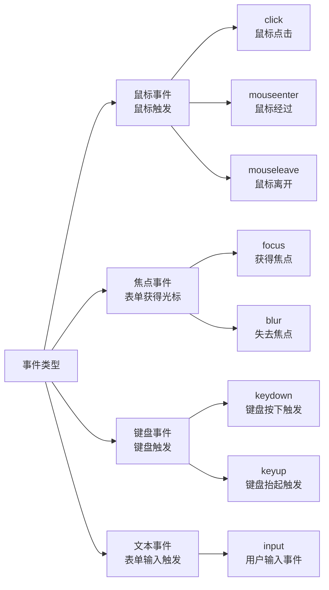

| 分类 | 事件名 | 触发场景 |
|---|---|---|
| **鼠标事件** | `click` | 鼠标点击 |
|  | `mouseenter` | 鼠标经过 |
|  | `mouseleave` | 鼠标离开 |
| **焦点事件** | `focus` | 获得焦点 |
|  | `blur` | 失去焦点 |
| **键盘事件** | `keydown` | 键盘按下触发 |
|  | `keyup` | 键盘抬起触发 |
| **文本事件** | `input` | 用户输入事件 |

> **触发现象**：
> - 鼠标事件 → 由鼠标触发
> - 焦点事件 → 表单获得光标
> - 键盘事件 → 键盘触发
> - 文本事件 → 表单输入触发

### 8. 事件对象

> 章节涵盖：获取事件对象、事件对象常用属性

#### 8.1 获取事件对象

- **目标**：能说出什么是事件对象。

- **事件对象是什么**：
  - 也是一个对象，这个对象里有事件触发时的相关信息
  - 例如：鼠标点击事件中，事件对象就存有鼠标点在哪个位置等信息

- **使用场景**：
  - 可以判断用户按下哪个键，比如按下回车键可以发布新闻
  - 可以判断鼠标点击了哪个元素，从而做相应的操作

- **语法：如何获取**：
  - 在事件绑定的回调函数的**第一个参数**就是事件对象
  - 一般命名为 `event`、`ev`、`e`

  ```javascript
  元素.addEventListener('click', function (e) {

  })
  ```

#### 8.2 事件对象常用属性

- **目标**：能够使用常见事件对象属性。

| 属性 | 说明 |
|---|---|
| `type` | 获取当前的事件类型 |
| `clientX` / `clientY` | 获取光标相对于浏览器**可见窗口**左上角的位置 |
| `offsetX` / `offsetY` | 获取光标相对于**当前 DOM 元素**左上角的位置 |
| `key` | 用户按下的键盘键的值（现在不提倡使用 `keyCode`） |

#### 8.3 本章总结

1. **事件对象是什么？**
   - 也是一个对象，这个对象里有事件触发时的相关信息
2. **事件对象在哪里？**
   - 在事件绑定的回调函数的第一个参数就是事件对象

### 9. 环境对象

> 章节涵盖：`this` 指向

#### 9.1 环境对象

- **目标**：能够分析判断函数运行在不同环境中 `this` 所指代的对象。

- **环境对象**：指的是函数内部特殊的变量 **`this`**，它代表着当前函数运行时所处的环境。

- **作用**：弄清楚 `this` 的指向，可以让我们代码更简洁。

- **核心规则**：
  - 函数的调用方式不同，`this` 指代的对象也不同
  - **「谁调用，`this` 就是谁」** 是判断 `this` 指向的粗略规则
  - **直接调用函数**，其实相当于是 `window.函数`，所以 `this` 指代 `window`

- **总结**：
  1. 环境对象 `this` 是什么？
     - 它代表着当前函数运行时所处的环境
  2. 判断 `this` 指向的粗略规则是什么？
     - **「谁调用，`this` 就是谁」**

### 10. 回调函数

> 章节涵盖：回调函数概念、常见使用场景

#### 10.1 回调函数

- **目标**：能够说出什么是回调函数。

- **概念**：
  - 如果将函数 A 作为参数传递给函数 B 时，我们称函数 A 为**回调函数**
  - 简单理解：当一个函数当做参数来传递给另外一个函数的时候，这个函数就是回调函数

- **常见的使用场景**：

  ```javascript
  function fn() {
    console.log('我是回调函数...')
  }
  // fn 传递给了 setInterval，fn 就是回调函数
  setInterval(fn, 1000)


  box.addEventListener('click', function () {
    console.log('我也是回调函数')
  })
  ```

#### 10.2 本章总结

1. **回调函数**：
   - 把函数当做另外一个函数的参数传递，这个函数就叫回调函数
   - 回调函数本质还是函数，只不过把它当成参数使用
   - 使用**匿名函数**做为回调函数比较常见

> 本批次对应 `api课程安排\6.png` 目录页中「事件监听（绑定）、事件类型、事件对象、环境对象、回调函数」五个主题。

> 📌 **本节开始**：整理 `api课程安排\7~9.png` 对应的「Web APIs 第三天 - Dom 事件进阶」目录下的 `### 11.~19.` 共 9 个新章节。

### 11. 事件流

> 章节涵盖：事件流与两个阶段、事件捕获、事件冒泡、阻止冒泡与默认行为、解绑事件、两种注册方式区别

#### 11.1 事件流和两个阶段说明

- **目标**：能够说出事件流经历的 **2 个阶段**。
- **事件流** 指的是事件完整执行过程中的流动路径。
- 假设页面里有个 `div`，当触发事件时，会经历两个阶段，分别是**捕获阶段**、**冒泡阶段**。

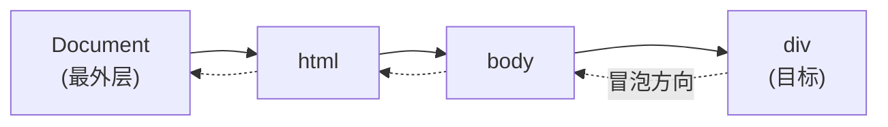

- **简单来说**：
  - **捕获阶段** 是从父到子（Document → html → body → div）
  - **冒泡阶段** 是从子到父（div → body → html → Document）
- 实际工作中**都是使用事件冒泡为主**。

#### 11.2 事件捕获

- **目标**：简单了解事件捕获执行过程。
- **事件捕获概念**：
  - 从 DOM 的**根元素**开始去执行对应的事件（**从外到里**）。
- **事件捕获需要写对应代码才能看到效果**。

**语法**：

```javascript
DOM.addEventListener(事件类型, 事件处理函数, 是否使用捕获机制)
```

**说明**：

- `addEventListener` 第三个参数传入 `true` 代表是**捕获阶段**触发（很少使用）
- 若传 `false` 代表**冒泡阶段**触发，默认就是 `false`
- 若是 **L0 事件监听**，则**只有冒泡阶段，没有捕获**

#### 11.3 事件冒泡

- **目标**：能够说出事件冒泡的执行过程。
- **事件冒泡概念**：
  - 当一个元素的事件被触发时，同样的事件将会在该元素的**所有祖先元素**中依次被触发。这一过程被称为事件冒泡。
- **简单理解**：当一个元素触发事件后，会**依次向上**调用所有父级元素的**同名事件**。
- **事件冒泡是默认存在的**。
- L2 事件监听第三个参数是 `false`，或者默认都是冒泡。

**冒泡示例代码**：

```javascript
const father = document.querySelector('.father')
const son = document.querySelector('.son')
document.addEventListener('click', function () {
  alert('我是爷爷')
})
fa.addEventListener('click', function () {
  alert('我是爸爸')
})
son.addEventListener('click', function () {
  alert('我是儿子')
})
```

#### 11.4 阻止冒泡

- **目标**：能够写出阻止冒泡的代码。
- **问题**：因为默认就有冒泡模式的存在，所以容易导致事件影响到父级元素。
- **需求**：若想把事件就限制在当前元素内，就需要**阻止事件冒泡**。
- **前提**：阻止事件冒泡**需要拿到事件对象**。

**语法**：

```javascript
事件对象.stopPropagation()
```

- **注意**：此方法可以阻断事件流动传播，不光在冒泡阶段有效，**捕获阶段也有效**。

**阻止默认行为**（如阻止链接的跳转、表单域的跳转）：

```javascript
e.preventDefault()
```

**示例代码**：

```html
<form action="http://www.baidu.com">
  <input type="submit" value="提交">
</form>
<script>
  const form = document.querySelector('form')
  form.addEventListener('click', function (e) {
    // 阻止表单默认提交行为
    e.preventDefault()
  })
</script>
```

#### 11.5 解绑事件

**方式 1：L0 事件方式** —— 直接使用 `null` 覆盖偶就可以实现事件的解绑。

```javascript
// 绑定事件
btn.onclick = function () {
  alert('点击了')
}
// 解绑事件
btn.onclick = null
```

**方式 2：L2 事件方式** —— 必须使用 `removeEventListener`。

```javascript
// removeEventListener(事件类型, 事件处理函数, [获取捕获或者冒泡阶段])
function fn() {
  alert('点击了')
}
// 绑定事件
btn.addEventListener('click', fn)
// 解绑事件
btn.removeEventListener('click', fn)
```

- **注意**：**匿名函数无法被解绑**。

#### 11.6 两种注册事件的区别

| 类型 | 说明 |
|---|---|
| **传统 on 注册（L0）** | 同一个对象，后面注册的事件会**覆盖**前面注册的（同一个事件）<br/>直接使用 `null` 覆盖偶就可以实现事件的解绑<br/>**都是冒泡阶段执行的** |
| **事件监听注册（L2）** | 语法：`addEventListener(事件类型, 事件处理函数, 是否使用捕获)`<br/>后面注册的事件**不会覆盖**前面注册的事件（同一个事件）<br/>可以通过第三个参数去确定是在**冒泡或者捕获**阶段执行<br/>必须使用 `removeEventListener(事件类型, 事件处理函数, 获取捕获或者冒泡阶段)`<br/>**匿名函数无法被解绑** |

#### 11.7 本章总结

1. **什么是事件流？** 事件完整执行过程中的流动路径。
2. **两个阶段？** 捕获阶段、冒泡阶段。
3. **阻止冒泡**：`事件对象.stopPropagation()`。
4. **阻止默认行为**：`事件对象.preventDefault()`。
5. **解绑事件**：L0 用 `null` 覆盖；L2 用 `removeEventListener`。
6. **注册事件两种方式**：`on` 方式（L0）和 `addEventListener` 方式（L2）。

### 12. 事件委托

> 章节涵盖：思考、事件委托的好处/原理/实现、本章总结

#### 12.1 思考：如何给多个元素注册事件？

- **问题 1**：如果同时给**多个元素**注册事件，我们怎么做的？
  - **传统方案**：`for` 循环注册事件。
- **问题 2**：有没有一种**技巧** 注册**一次**事件就能完成以上效果呢？
  - **方案**：**事件委托**。

```javascript
// 传统 for 循环注册
const lis = document.querySelectorAll('ul li')
for (let i = 0; i < lis.length; i++) {
  lis[i].addEventListener('click', function () {
    alert('我被点击了')
  })
}
```

#### 12.2 事件委托的好处/原理/实现

- **目标**：能够说出事件委托的好处。
- **事件委托** 是利用事件流的特征解决一些开发需求的知识技巧。
- **优点**：**减少注册次数**，可以提高程序性能。
- **原理**：事件委托其实是**利用事件冒泡的特点**。
  - 给**父元素**注册事件，当我们触发子元素的时候，会冒泡到父元素身上，从而触发父元素的事件。
- **实现**：**`事件对象.target.tagName`** 可以获得真正触发事件的元素。

```javascript
ul.addEventListener('click', function () { /* 执行父级点击事件 */ })
```

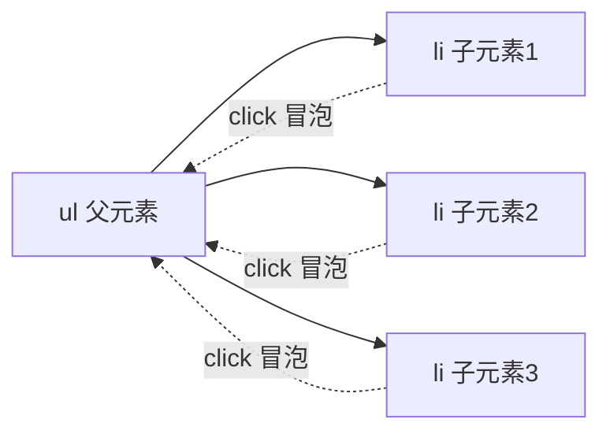

#### 12.3 阻止冒泡的拓展（preventDefault）

- 我们某些情况下需要**阻止默认行为**的发生，比如 阻止 链接的跳转，表单域跳转。

```javascript
e.preventDefault()
```

#### 12.4 本章总结

1. **事件委托的好处是什么？**
   - 减少注册次数，提高了程序性能
2. **事件委托是委托给了谁？** 父元素还是子元素？
   - 父元素
3. **如何找到真正触发的元素？**
   - `事件对象.target.tagName`

### 13. 其它事件

> 章节涵盖：页面加载事件、元素滚动事件、页面尺寸事件、元素尺寸与位置

#### 13.1 页面加载事件

- **加载外部资源**（如图片、外联 CSS 和 JavaScript 等）**加载完毕**时触发的事件。
- **为什么要学？**
  - 有些时候需要等页面资源全部处理完了做一些事情
  - 老代码喜欢把 script 写在 head 中，这时候直接找 dom 元素找不到

**方式 1：load 事件**

- 监听**整个页面**资源加载完毕：给 `window` 添加 `load` 事件。
- 监听**某个资源**加载完毕：给指定元素（如 `img`）添加 `load` 事件。

```javascript
// 页面加载事件
window.addEventListener('load', function () {
  // 执行的操作
})

// 监听图片加载完毕
img.addEventListener('load', function () {
  // 等待图片加载完毕，再去执行里面的代码
})
```

**方式 2：DOMContentLoaded 事件**

- 当**初始的 HTML 文档**被完全加载和解析完成之后，`DOMContentLoaded` 事件被触发，而**无需等待**样式表、图像等完全加载。

```javascript
document.addEventListener('DOMContentLoaded', function () {
  // 执行的操作
})
```

**两者对比**：

| 事件名 | 监听对象 | 触发时机 |
|---|---|---|
| `load` | `window` / `img` 等资源 | 监听**整个页面**所有资源加载完毕 |
| `DOMContentLoaded` | `document` | 监听**页面 DOM 加载完毕**，无需等待样式表、图像等完全加载 |

#### 13.2 元素滚动事件

- 滚动条在滚动的时候**持续触发**的事件。
- **为什么要学？**
  - 很多网页需要检测用户把页面滚动到某个区域后做一些处理，比如**固定导航栏**，比如**返回顶部**。
- **事件名**：`scroll`。

**监听整个页面滚动**：

```javascript
// 页面滚动事件
window.addEventListener('scroll', function () {
  // 我行的操作
})
```

- 给 `window` 或 `document` 添加 `scroll` 事件。
- 监听**某个元素的内部滚动**直接给某个元素加即可。

**获取位置 - scrollLeft / scrollTop**：

- **scrollLeft 和 scrollTop**（属性）
  - 获取被卷去的大小
  - 获取元素内容往左、往上滚出去看不到的距离
  - 这两个值是**可读写**的
- 尽量在 `scroll` 事件里面获取被卷去的距离。

```javascript
div.addEventListener('scroll', function () {
  console.log(this.scrollTop)
})
```

**获取页面滚动距离**：

- 实际开发中经常**检测页面滚动的距离**，比如页面滚动 100 像素，就可以显示一个元素，或者固定一个元素。

```javascript
window.addEventListener('scroll', function () {
  // document.documentElement 是 html 元素获取方式
  const n = document.documentElement.scrollTop
  console.log(n)
})
```

- `document.documentElement` HTML 文档返回对象为 HTML 元素。

**滚动到指定坐标**：

- `scrollTo()` 方法可把内容滚动到指定的坐标。

```javascript
// 让页面滚动到 y 轴 1000 像素的位置
window.scrollTo(0, 1000)
```

**本章总结**：

1. 被卷去的头部或者左侧用那个属性？是否可以读取和修改？
   - `scrollTop` / `scrollLeft`
   - 可以读取，也可以修改（赋值）
2. 检测页面滚动的头部距离（被卷去的头部）用那个属性？
   - `document.documentElement.scrollTop`

#### 13.3 页面尺寸事件

- 会在**窗口尺寸改变**的时候触发事件：`resize`。

```javascript
window.addEventListener('resize', function () {
  // 执行的代码
})
```

**检测屏幕宽度**：

```javascript
window.addEventListener('resize', function () {
  let w = document.documentElement.clientWidth
  console.log(w)
})
```

**clientWidth 和 clientHeight**（获取元素宽高）：

- 获取元素的**可见部分**宽高（不包含边框，margin，滚动条等）
- 元素：`clientWidth` 和 `clientHeight`

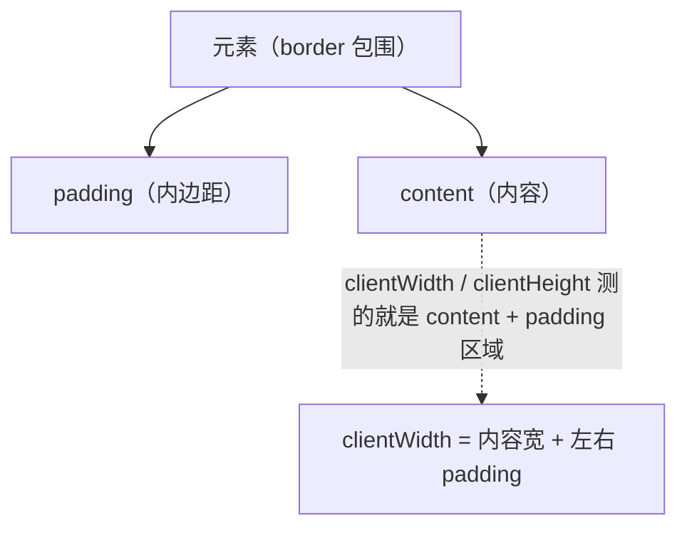

#### 13.4 元素尺寸与位置

- **使用场景**：
  - 前面案例滚动多少距离，都是我们自己算的，最好是页面滚动到某个元素，就可以做某些事。
  - 简单说，就是通过 js 的方式，得到**元素在页面中的位置**。
  - 这样我们可以做，页面滚动到这个位置，就可以做某些操作，省去计算了。

**offsetWidth 和 offsetHeight（获取元素宽高）**：

- 获取元素的**自身**宽高、包含元素自身设置的宽高、padding、border。
- **`offsetWidth` 和 `offsetHeight`**
- 获取出来的是**数值**，方便计算。
- **注意**：获取的是**可视**宽高，如果盒子是隐藏的，获取的结果是 0。

**offsetLeft 和 offsetTop（获取位置）**：

- 获取元素距离自己**定位父级元素**的左、上距离。
- **`offsetLeft` 和 `offsetTop`** **注意是只读属性**。

**`element.getBoundingClientRect()`**：

- 方法返回元素的大小及其相对于**视口**的位置。

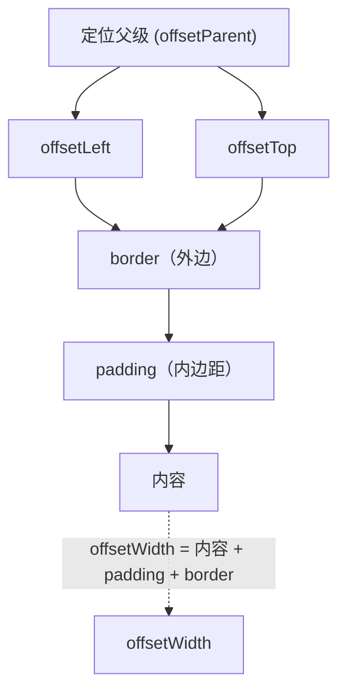

**总结表格**：

| 属性 | 作用 | 说明 |
|---|---|---|
| `scrollLeft` 和 `scrollTop` | 被卷去的头部和左侧 | 配合页面滚动来用，**可读写** |
| `clientWidth` 和 `clientHeight` | 获得元素宽度和高度 | 不包含 border，margin，滚动条；**用于 js 获取元素大小，只读属性** |
| `offsetWidth` 和 `offsetHeight` | 获得元素宽度和高度 | **包含 border、padding，滚动条等，只读** |
| `offsetLeft` 和 `offsetTop` | 获取元素距离自己定位父级元素的左、上距离 | 获取元素位置的时候使用，**只读属性** |

> 📌 **本节开始**：整理 `api课程安排\7~9.png` 对应的「Web APIs 第三天 - Dom 事件进阶」目录下「日期对象、节点操作、BOM、插件、本地存储」对应的 `### 14.~19.` 共 6 个新章节。

### 14. 日期对象

> 章节涵盖：日期对象概念、实例化、日期对象方法、时间戳

#### 14.1 什么是日期对象

- **目标**：掌握日期对象，可以让网页显示日期。
- **日期对象**：用来表示时间的对象。
- **作用**：可以得到当前系统时间。
- **应用场景**：京东秒杀倒计时（距离某场秒杀还剩多少时间）。

**学习路径**：

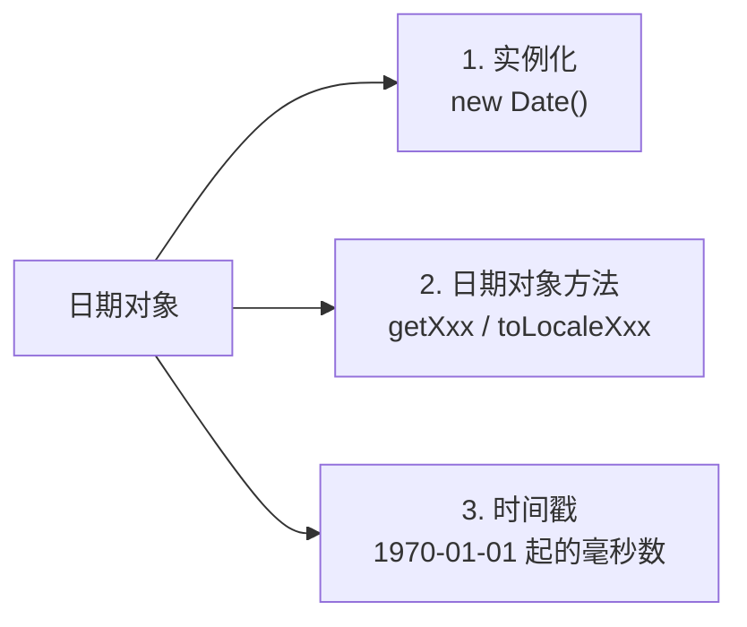

#### 14.2 实例化

- **目标**：能够实例化日期对象。
- 在代码中发现了 `new` 关键字时，一般将这个操作称为**实例化**。
- 创建一个时间对象并获取时间。

**获得当前时间**：

```javascript
const date = new Date()
```

**获得指定时间**：

```javascript
const date = new Date('2008-8-8')
console.log(date)
```

#### 14.3 日期对象方法

- **目标**：能够使用日期对象中的方法写出常见日期。
- **使用场景**：因为日期对象返回的数据我们不能直接使用，所以需要转换为实际开发中常用的格式。

**getXxx 系列方法**：

| 方法 | 作用 | 说明 |
|---|---|---|
| `getFullYear()` | 获得年份 | 获取四位年份 |
| `getMonth()` | 获得月份 | 取值为 **0 ~ 11** |
| `getDate()` | 获取月份中的每一天 | 不同月份取值也不相同 |
| `getDay()` | 获取星期 | 取值为 **0 ~ 6** |
| `getHours()` | 获取小时 | 取值为 **0 ~ 23** |
| `getMinutes()` | 获取分钟 | 取值为 **0 ~ 59** |
| `getSeconds()` | 获取秒 | 取值为 **0 ~ 59** |

**toLocaleXxx 系列方法**：

```javascript
// 得到日期对象
const date = new Date()
// div.innerHTML = date.toLocaleString()        // 2022/4/1 09:41:21
// div.innerHTML = date.toLocaleDateString()    // 2022/4/1
// div.innerHTML = date.toLocaleTimeString()    // 09:41:21
```

#### 14.4 时间戳

- **目标**：能够获得当前时间戳。
- **使用场景**：如果计算倒计时效果，前面方法无法直接计算，需要借助于时间戳完成。
- **什么是时间戳**：
  - 是指 **1970 年 01 月 01 日 00 时 00 分 00 秒**起至现在的**毫秒数**，它是一种特殊的计量时间的方式。
- **算法**：
  - 将来的时间戳 - 现在的时间戳 = 剩余时间毫秒数
  - 剩余时间毫秒数 转换为 剩余时间的 年月日时分秒 就是 倒计时时间
  - 比如 将来时间戳 `2000ms` - 现在时间戳 `1000ms` = `1000ms`
  - `1000ms` 转换为就是 `0小时0分1秒`

**三种方式获取时间戳**：

| 方式 | 示例 | 说明 |
|---|---|---|
| 1. `getTime()` | `const date = new Date()`<br/>`console.log(date.getTime())` | 实例对象调用 |
| 2. `+new Date()` | `console.log(+new Date())` | **无需实例化**，**重点记住** |
| 3. `Date.now()` | `Date.now()` | **无需实例化**，但只能得到当前的时间戳 |

#### 14.5 本章总结

1. **实例化日期对象用哪个？** `new Date()`
2. **日期对象方法里面月份和星期有什么注意的？**
   - 月份是 `0~11`，星期是 `0~6`
3. **获取时间戳哪三种方式？重点记住哪个？**
   - `date.getTime()`
   - `+new Date()`（**重点记住**，可以返回当前时间戳或者指定的时间戳）
   - `Date.now()`

### 15. 节点操作

> 章节涵盖：DOM 节点、查找节点、增加节点、删除节点

#### 15.1 DOM 节点

- **目标**：能说出 DOM 节点的类型。
- **DOM 节点**：DOM 树里每一个内容都称之为节点。
- **节点类型**：

| 类型 | 说明 | 举例 |
|---|---|---|
| **元素节点** | 所有的标签 比如 `body`、`div` | `html` 是根节点 |
| **属性节点** | 所有的属性 比如 `href` | 标签上的属性 |
| **文本节点** | 所有的文本 | 标签里的文字 |
| 其他 | … | — |

**DOM 树示例**（document → HTML → head/body → meta/title/a/div …）：

```mermaid
flowchart TD
    D["document<br/>(文档对象模型)"] --> HTML["HTML"]
    HTML --> HEAD["head"]
    HTML --> BODY["body"]
    HEAD --> META["meta<br/>content"]
    HEAD --> TITLE["title<br/>标题"]
    HEAD --> MORE1["更多..."]
    BODY --> T["文本<br/>(文本节点)"]
    BODY --> A["a 链接名<br/>href (属性节点)"]
    BODY --> DIV["div<br/>id / class (属性节点)"]
    DIV --> TXT["文本<br/>(文本节点)"]
```

> 💡 **重点记住节点**：**元素节点**，可以更好的让我们理清标签元素之间的关系。

#### 15.2 查找节点

- **目标**：能够具备根据节点关系查找目标节点的能力。
- **使用场景**：关闭二维码案例 —— 点击关闭按钮，关闭的是二维码的盒子（**父子关系**），无需获取 erweima 元素。

**节点关系**：针对的找亲戚返回的都是对象 —— 父节点 / 子节点 / 兄弟节点。

**父节点查找**：

- `parentNode` 属性
- 返回最近一级的父节点 找不到返回为 `null`

```javascript
子元素.parentNode
```

**子节点查找**：

| 属性 | 说明 |
|---|---|
| `childNodes` | 获得所有子节点、包括文本节点（空格、换行）、注释节点等 |
| **`children`** ⭐ | **仅获得所有元素节点**，**返回的还是一个伪数组**（重点） |

```javascript
父元素.children
```

**兄弟关系查找**：

| 属性 | 作用 |
|---|---|
| `nextElementSibling` | 下一个兄弟节点 |
| `previousElementSibling` | 上一个兄弟节点 |

**查找节点总结**：

| 需求 | 属性 |
|---|---|
| 查找父节点 | `parentNode` |
| 查找所有子节点 | `children` |
| 查找兄弟节点 | `nextElementSibling` / `previousElementSibling` |

#### 15.3 增加节点

- **目标**：能够具备根据需求新增节点的能力。
- **使用场景**：很多情况下，我们需要在页面中增加元素，比如点击发布按钮新增一条评论。

**学习路线**：1. 创建节点 → 2. 追加节点。

**1. 创建节点**：

- 即创造出一个新的网页元素，再添加到网页内，一般先**创建节点**，然后**插入节点**。
- 创建元素节点方法：

```javascript
// 创建一个新的元素节点
document.createElement('标签名')
```

**2. 追加节点**：

- 要想在界面看到，还得插入到某个父元素中。

```javascript
// 插入到这个父元素的最后
父元素.appendChild(要插入的元素)

// 插入到某个子元素的前面
父元素.insertBefore(要插入的元素, 在哪个元素前面)
```

**克隆节点**（特殊情况，复制一个原有的节点）：

```javascript
// 克隆一个已有的元素节点
元素.cloneNode(布尔值)
```

- `cloneNode` 会克隆出一个跟原标签一样的元素，括号内传入布尔值
  - 若为 `true`，则代表克隆时会包含后代节点一起克隆
  - 若为 `false`，则代表克隆时不包含后代节点
  - **默认为 `false`**

#### 15.4 删除节点

- **目标**：能够具备根据需求删除节点的能力。
- 若一个节点在页面中已不需要时，可以删除它。
- 在 JavaScript 原生 DOM 操作中，要删除元素必须**通过父元素删除**。

```javascript
父元素.removeChild(要删除的元素)
```

- **注**：
  - 如不存在父子关系则删除不成功
  - 删除节点和隐藏节点（`display:none`）有区别：隐藏节点还是存在的，但是删除 则从 html 中删除节点

#### 15.5 本章总结

| 操作 | 方法 | 说明 |
|---|---|---|
| 查找父节点 | `parentNode` | 找不到返回 `null` |
| 查找子节点 | `children` | 重点：仅返回元素节点 |
| 查找兄弟节点 | `nextElementSibling` / `previousElementSibling` | 仅返回元素 |
| 创建节点 | `document.createElement('标签名')` | 返回新元素对象 |
| 追加节点 | `parent.appendChild(child)` / `parent.insertBefore(child, ref)` | 末尾 / 指定位置前 |
| 克隆节点 | `元素.cloneNode(true/false)` | `true` 含后代，`false` 不含 |
| 删除节点 | `parent.removeChild(child)` | 通过父元素删除 |

### 16. M 端事件

> 章节涵盖：触屏事件、touch 对象

#### 16.1 触屏事件

- **目标**：了解 M 端常见的事件。
- 移动端也有自己独特的地方。比如**触屏事件 touch**（也称触摸事件），Android 和 IOS 都有。
- **触屏事件 touch**（也称触摸事件），Android 和 IOS 都有。
- **touch 对象**代表一个触摸点。触摸点可能是一根手指，也可能是一根触摸笔。触屏事件可响应用户手指（或触控笔）对屏幕或者触控板操作。

**常见的触屏事件**：

| 触屏 touch 事件 | 说明 |
|---|---|
| `touchstart` | 手指触摸到一个 DOM 元素时触发 |
| `touchmove` | 手指在一个 DOM 元素上滑动时触发 |
| `touchend` | 手指从一个 DOM 元素上移开时触发 |

#### 16.2 本章总结

- 移动端事件与 PC 端区别：移动端特有的**触屏事件 touch**（`touchstart` / `touchmove` / `touchend`）。
- **注意**：`touchmove` 在手指滑动期间会**频繁触发**，要注意性能问题（如节流 / 防抖）。

### 17. JS 插件

> 章节涵盖：什么是插件、学习插件的过程、本地文件结构

#### 17.1 什么是插件

- **插件**：就是别人写好的一些代码，我们只需要复制对应的代码，就可以直接实现对应的效果。
- 优势：**拿来即用**，避免重复造轮子。
- 经典案例：[Swiper](https://www.swiper.com.cn/) 轮播图插件。

#### 17.2 学习插件的基本过程

- 步骤 1：**熟悉官网**，了解这个插件可以完成什么需求 —— https://www.swiper.com.cn/
- 步骤 2：**看在线演示**，找到符合自己需求的 demo —— https://www.swiper.com.cn/demo/index.html
- 步骤 3：**查看基本使用流程** —— https://www.swiper.com.cn/usage/index.html
- 步骤 4：**查看 API 文档**，去配置自己的插件 —— https://www.swiper.com.cn/api/index.html
- 步骤 5：**注意**：多个 swiper 同时使用的时候，**类名需要注意区分**。

#### 17.3 本地文件结构

> 💡 swiper 源码包中一般包含以下目录，实际项目中我们只关心 `package` 目录，里面有 css 和 js 文件。

| 目录 | 作用 |
|---|---|
| `.github` / `.nova` / `.vscode` / `build` / `cypress` / `demos` / `playground` / `scripts` / `src` | 源码与开发环境相关文件 |
| **`package`** ⭐ | **css 和 js 文件在这里**（实际项目使用） |

### 18. windows 对象

> 章节涵盖：BOM、定时器-延时函数、JS 执行机制、location、navigator、history

#### 18.1 BOM

- **BOM**（Browser Object Model —— 浏览器对象模型）。
- `window` 是浏览器的**顶级对象**，它本身又是一个**全局对象**。在浏览器中我们定义的**全局变量 / 全局函数**都会变成 `window` 的属性和方法。
- `document`、`alert()`、`console.log()` 等都是 `window` 的属性。

```mermaid
flowchart LR
    W["window<br/>(全局对象)"] --> D["document<br/>(页面文档)"]
    W --> L["location"]
    W --> N["navigator"]
    W --> H["history"]
    W --> S["setTimeout"]
    W --> SI["setInterval"]
```

#### 18.2 定时器-延时函数

- **目标**：能够使用延时函数。
- JavaScript 内置的一个用来让代码延迟执行的函数，叫 `setTimeout`。

**语法**：

```javascript
setTimeout(回调函数, 等待的毫秒数)
```

- `setTimeout` 仅仅只执行一次，所以可以理解为就是把一段代码延迟执行。

**清除延时函数**：

```javascript
let timer = setTimeout(回调函数, 等待的毫秒数)
clearTimeout(timer)
```

- 注意点：
  - 延时器需要等待，所以**里面的代码先执行**（即调用 `clearTimeout` 的代码）
  - 一般都是先定义延时器，再写清除延时器

#### 18.3 JS 执行机制

- **目标**：能够了解 JS 执行的同步与异步机制。

**同步任务**：

- 同步任务都在主线程上执行，形成一个**执行栈**。

**异步任务**：

- JS 的异步是通过**回调函数**实现的。
- 一般而言，异步任务有以下三种类型：
  1. 普通事件，如 `click`、`resize` 等
  2. 资源加载，如 `load`、`error` 等
  3. 定时器，包括 `setInterval`、`setTimeout` 等
- 异步任务相关添加到**任务队列**中（任务队列也称为消息队列）。

**执行顺序**：

1. 先执行**执行栈**中的同步任务。
2. 异步任务放入**任务队列**中。
3. 一旦执行栈中的所有同步任务执行完毕，系统就会按次序读取**任务队列**中的异步任务，于是被读取的异步任务结束等待状态，进入执行栈，开始执行。

```mermaid
flowchart LR
    subgraph 执行栈["执行栈（主车道）"]
        direction TB
        S1["console.log(1)"]
        S2["setTimeout(fn, 0)"]
        S3["console.log(2)"]
    end
    subgraph 任务队列["任务队列（应急车道）"]
        T["fn"]
    end
    执行栈 --> 任务队列
    任务队列 -.事件循环.-> 执行栈
```

- 由于主线程不断的重复获得任务、执行任务、再获取任务、再执行，所以这种机制被称为**事件循环**（event loop）。

#### 18.4 location 对象

- **目标**：能够使用 location 对象跳转到指定页面。
- **location 的数据类型是对象**，它拆分并保存了 URL 地址的各个组成部分。
- **常用属性和方法**：

| 属性 / 方法 | 作用 |
|---|---|
| `location.href` | 属性获取完整的 URL 地址，对其赋值时用于地址的跳转 |
| `location.search` | 属性获取地址中携带的参数，符号 `?` 后面部分 |
| `location.hash` | 属性获取地址中的哈希值，符号 `#` 后面部分（后期 vue 路由的铺垫） |
| `location.reload()` | 方法用来刷新当前页面，传入参数 `true` 时表示强制刷新 |

**href 跳转示例**：

```javascript
// 可以得到当前文件URL地址
console.log(location.href)
// 可以通过js 方式跳转到目标地址
location.href = 'http://www.itcast.cn'
```

**search 倒计时跳转案例分析**（点击链接 → 设置倒计时 → 时间到自动跳转）：

```javascript
console.log(location.search)
```

**hash 用途**：vue 路由的铺垫，经常用于不刷新页面，显示不同页面，比如 网易云音乐。

**reload 强制刷新**：

```html
<button>点击刷新</button>
<script>
  const btn = document.querySelector('button')
  btn.addEventListener('click', function () {
    location.reload(true)   // 强制刷新 类似 ctrl + f5
  })
</script>
```

**location 总结**：

- `location.href` 属性获取完整的 URL 地址，对其赋值时用于地址的跳转
- `search` 属性获取地址中携带的参数，符号 `?` 后面部分
- `hash` 属性获取地址中的哈希值，符号 `#` 后面部分
- `reload` 方法用来刷新当前页面，传入参数 `true` 时表示强制刷新

#### 18.5 navigator 对象

- **目标**：能够使用 navigator 对象识别用户的浏览器信息。
- **navigator 的数据类型是对象**，该对象下记录了浏览器自身的相关信息。
- **常用属性和方法**：通过 `userAgent` 检测浏览器的版本及平台。

```javascript
// 检测 userAgent（浏览器信息）
!(function () {
  const userAgent = navigator.userAgent
  // 验证是否为Android或iPhone
  const android = userAgent.match(/(Android);?[\s\/]+([\d.]+)?/)
  const iphone = userAgent.match(/(iPhone\sOS)\s([\d_]+)/)
  // 如果是Android或iPhone， 则跳转至移动站点
  if (android || iphone) {
    location.href = 'http://m.itcast.cn'
  }
})()
```

#### 18.6 history 对象

- **目标**：能够使用 history 对象控制页面历史记录跳转。
- **history 的数据类型是对象**，主要管理历史记录，该对象与浏览器地址栏的操作相对应，如前进、后退、历史记录等。
- **常用属性和方法**：

| history 对象方法 | 作用 |
|---|---|
| `back()` | 可以后退功能 |
| `forward()` | 前进功能 |
| `go(参数)` | 前进后退功能 参数如果是 `1` 前进 1 个页面 如果是 `-1` 后退 1 个页面 |

- history 对象一般在实际开发中比较少用，但是会在一些 OA 办公系统中见到。

#### 18.7 本章总结

| 对象 | 作用 | 核心 API |
|---|---|---|
| `window` | 顶级 / 全局对象 | `setTimeout` / `setInterval` |
| `location` | URL 地址 | `href` / `search` / `hash` / `reload()` |
| `navigator` | 浏览器信息 | `userAgent` |
| `history` | 历史记录 | `back()` / `forward()` / `go(n)` |

### 19. 本地存储

> 章节涵盖：本地存储介绍、本地存储分类、存储复杂数据类型

#### 19.1 本地存储介绍

- **目标**：学习 window 对象的常见属性，知道各个 BOM 对象的功能含义。
- 以前我们页面写的数据一刷新页面就没有了，是不是？
- 随着互联网的快速发展，基于网页的应用越来越普遍，同时也变的越来越复杂，为了满足各种各样的需求，会经常性地在本地存储大量的数据，HTML5 规范提出了相关解决方案。

**本地存储的特点**：

1. 数据存储在**用户浏览器**中
2. 设置、读取方便、甚至页面刷新不丢失数据
3. 容量较大，`sessionStorage` 和 `localStorage` 约 **5M** 左右

**常见的使用场景**：https://todomvc.com/examples/vanilla-es6/  页面刷新数据不丢失。

#### 19.2 本地存储分类

- **目标**：能够使用 localStorage 把数据存储的浏览器中。

**localStorage 特性**：

- **作用**：可以将数据**永久**存储在本地（用户的电脑），除非手动删除，否则关闭页面也会存在
- **特性**：
  - 可以**多窗口（页面）共享**（同一浏览器可以共享）
  - 以**键值对**的形式存储使用

**API 语法**：

```javascript
// 存储数据
localStorage.setItem('键', '值')

// 获取数据
localStorage.getItem('键')

// 删除数据
localStorage.removeItem('键')
```

**浏览器查看本地数据**：打开 DevTools → **Application** 面板 → Storage → **Local Storage**（键值对以表格形式展示）。

**sessionStorage 特性**：

| 特性 | 说明 |
|---|---|
| 生命周期 | **关闭浏览器窗口** |
| 共享性 | 在**同一个窗口（页面）**下数据可以共享 |
| 存储形式 | 以**键值对**的形式存储使用 |
| 用法 | 跟 `localStorage` **基本相同** |

**两种存储对比**：

| 特性 | `localStorage` | `sessionStorage` |
|---|---|---|
| 生命周期 | **永久**，除非手动删除 | 关闭浏览器窗口即清空 |
| 共享性 | 同一浏览器多窗口共享 | 同一窗口共享 |
| API | `setItem` / `getItem` / `removeItem` | 同左 |
| 容量 | 约 5M | 约 5M |

**localStorage 总结**：

1. localStorage 作用是什么？
   - 可以将数据永久存储在本地（用户的电脑），除非手动删除，否则关闭页面也会存在
2. localStorage 存储、获取、删除的语法是什么？
   - 存储：`localStorage.setItem(key, value)`
   - 获取：`localStorage.getItem(key)`
   - 删除：`localStorage.removeItem(key)`

#### 19.3 存储复杂数据类型

- **目标**：能够存储复杂数据类型以及取出数据。
- **问题**：本地只能存储字符串，无法存储复杂数据类型。

**存储复杂数据类型（直接存储会变 `[object Object]`）**：

```javascript
const goods = {
  name: '小米10',
  price: 1999
}
localStorage.setItem('goods', goods)   // ❌ 存进去后显示 [object Object]
```

**解决**：需要将复杂数据类型转换成 **JSON 字符串**，再存储到本地。

```javascript
const goods = {
  name: '小米10',
  price: 1999
}
localStorage.setItem('goods', JSON.stringify(goods))   // ✅ 存 {"name":"小米10","price":1999}
```

**取出时反序列化**：把取出来的字符串转换为对象。

```javascript
const obj = JSON.parse(localStorage.getItem('goods'))
console.log(obj)    // {name: '小米10', price: 1999}
```

#### 19.4 数组中 map 方法（拓展）

- **使用场景**：`map` 可以遍历数组处理数据，并且**返回新的数组**
- **map 也称为映射**。映射是个术语，指两个元素的集之间元素相互"对应"的关系。
- **map 重点在于有返回值，`forEach` 没有返回值**。

```javascript
const arr = ['red', 'blue', 'green']
const newArr = arr.map(function (ele, index) {
  console.log(ele)    // 数组元素
  console.log(index)  // 数组索引号
  return ele + '颜色'
})
console.log(newArr)   // ['red颜色', 'blue颜色', 'green颜色']
```

```mermaid
flowchart LR
    A1["'red'"] --> A2["'red颜色'"]
    B1["'blue'"] --> B2["'blue颜色'"]
    C1["'green'"] --> C2["'green颜色'"]
```

- **小结**：`map` 方法处理数组元素时，会**返回一个新数组**（元素是回调函数处理后的值），`forEach` 则无返回值。

#### 19.5 数组中 join 方法（拓展）

- **作用**：`join()` 方法用于把数组中的所有元素**转换一个字符串**
- **语法**：`数组.join(参数)`

```javascript
const arr = ['red颜色', 'blue颜色', 'green颜色']
console.log(arr.join(''))   // red颜色blue颜色green颜色
```

- **参数**：数组元素是通过参数里面指定的**分隔符**进行分隔的，**空字符串 `''`**，则所有元素之间都**没有任何字符**。

#### 19.6 本章总结

| 场景 | 方法 |
|---|---|
| 存储简单数据类型 | `localStorage.setItem(key, value)` |
| 获取简单数据类型 | `localStorage.getItem(key)` |
| 删除指定数据 | `localStorage.removeItem(key)` |
| **存储复杂数据类型** | **存**之前用 `JSON.stringify()` 转换为字符串 |
| **取出复杂数据类型** | **取**之后用 `JSON.parse()` 转换回对象 |
| 临时会话存储 | 用 `sessionStorage`（关闭浏览器即清空） |
| 永久本地存储 | 用 `localStorage`（手动删除才清空） |
| **数组迭代返回新数组** | `arr.map((ele, index) => 处理逻辑)`（有返回值） |
| **数组转字符串** | `arr.join('分隔符')`（默认 `,`，传 `''` 无分隔符） |

### 20. 正则表达式

> 章节涵盖：正则表达式介绍、语法、test/exec 方法、元字符、量词、字符类、修饰符、replace 替换

#### 20.1 什么是正则表达式

- **目标**：学习正则表达式概念及语法，编写简单的正则表达式实现字符的查找或检测。
- **正则表达式**（Regular Expression）是用于匹配字符串中字符组合的**模式**。在 JavaScript 中，正则表达式也是**对象**。
- 通常用来查找、替换那些符合正则表达式的文本，许多语言都支持正则表达式。

**直观理解**：

- 假设人群中要找"戴帽子和眼镜的男人"，描述信息（帽子 / 眼镜 / 男人）就是**模式**。
- 把这些描述信息编码成一个规则，对应到计算机中就是**正则表达式**。

**使用场景**：

| 场景 | 说明 | 示例 |
|---|---|---|
| **匹配** | 验证表单：用户名只能输入英文/数字/下划线，昵称框可输入中文 | 用户名校验 `/^[a-z0-9_-]{3,16}$/` |
| **替换** | 过滤页面内容中的敏感词 | 替换 `***` |
| **提取** | 从字符串中获取我们想要的特定部分 | 提取字符串中所有数字 |

#### 20.2 语法

- JavaScript 中使用正则表达式分**两步**：
  1. **定义规则**：定义正则表达式
  2. **检测查找**：判断是否有符合规则的字符串

**1. 定义正则表达式**

```javascript
// 定义正则表达式语法
const 变量名 = /表达式/

// 其中 / / 是正则表达式字面量
// 比如：定义一个检测"前端"关键词的正则
const reg = /前端/
```

**2. 判断是否有符合规则的字符串 —— `test()` 方法**

- 作用：用来查看正则表达式与指定的字符串**是否匹配**
- 语法：`regObj.test(被检测的字符串)`
- 返回值：匹配返回 `true`，否则返回 `false`

```javascript
// 要检测的字符串
const str = 'IT培训，前端开发培训,IT培训课程,web前端培训,Java培训,人工智能培训'
// 1. 定义正则表达式，检测规则
const reg = /前端/
// 2. 检测方法
console.log(reg.test(str))   // true
```

**3. 检索（查找）符合规则的字符串 —— `exec()` 方法**

- 作用：在一个指定字符串中执行一个**搜索匹配**
- 语法：`regObj.exec(被检测字符串)`
- 返回值：如果匹配成功，`exec()` 方法返回一个**数组**（含 `index`、`input`、`groups`），否则返回 `null`

```javascript
// 要检测的字符串
const str = 'IT培训，前端开发培训,IT培训课程,web前端培训,Java培训,人工智能培训'
// 1. 定义正则表达式，检测规则
const reg = /前端/
// 2. 检测方法
console.log(reg.exec(str))   // ['前端', index: 5, input: 'IT培训，前端开发培训...', groups: undefined]
```

**`test()` 与 `exec()` 区别**：

| 方法 | 作用 | 返回值 |
|---|---|---|
| `test()` | 判断是否有符合规则的字符串 | 布尔值（找到 `true`，否则 `false`） |
| `exec()` | 检索（查找）符合规则的字符串 | 数组（找到）/ `null`（未找到） |

#### 20.3 元字符

- **目标**：能说出什么是元字符以及它的好处。
- **普通字符**：大多数的字符仅能够描述它们本身，这些字符称作普通字符，例如所有的字母和数字。也就是说普通字符只能够匹配字符串中与它们相同的字符。
- **元字符（特殊字符）**：是一些具有特殊含义的字符，可以极大提高了灵活性和强大的匹配功能。
  - 比如：规定用户只能输入英文 26 个英文字母，普通字符的话 `abcdefghijklm......`
  - 但是换成元字符写法：`[a-z]`
- **参考文档**：
  - MDN: https://developer.mozilla.org/zh-CN/docs/Web/JavaScript/Guide/Regular_Expressions
  - 正则测试工具：http://tool.oschina.net/regex

**为了方便记忆和学习，对众多元字符进行了分类**：

```mermaid
flowchart LR
    M["元字符"] --> B["边界符<br/>(位置)"]
    M --> Q["量词<br/>(重复次数)"]
    M --> C["字符类"]
    C --> S["[ ] 集合"]
    C --> R["连字符 / 取反"]
    C --> D["预定义类"]
```

**1. 边界符**

- 正则表达式中的边界符（位置符）用来提示**字符所处的位置**，主要有两个字符：

| 边界符 | 说明 |
|---|---|
| `^` | 表示匹配行首的文本（以谁开始） |
| `$` | 表示匹配行尾的文本（以谁结束） |

- 如果 `^` 和 `$` 在一起，表示**必须是精确匹配**。

```javascript
console.log(/哈/.test('哈'))         // true
console.log(/^二哈$/.test('二哈'))    // true
console.log(/^二哈$/.test('很二哈哈')) // true（先简化：未加边界时只要包含即可）

// ^ 开头
console.log(/^二哈/.test('很二哈哈'))  // false
console.log(/^二哈/.test('二哈很傻'))  // true
// $ 结尾
console.log(/二哈$/.test('二哈很傻'))  // false
console.log(/^二哈$/.test('二哈二哈'))  // false
console.log(/^二哈$/.test('二哈'))     // true
```

**2. 量词**

- **量词** 用来 设定某个模式出现的次数

| 量词 | 说明 |
|---|---|
| `*` | 重复零次或更多次 |
| `+` | 重复一次或更多次 |
| `?` | 重复零次或一次 |
| `{n}` | 重复 n 次 |
| `{n,}` | 重复 n 次或更多次 |
| `{n,m}` | 重复 n 到 m 次 |

> **注意**：逗号左右两侧千万不要出现空格

```javascript
// * 表示重复 0 次或者更多次
console.log(/^哈*$/.test(''))           // true
console.log(/^哈*$/.test('哈'))         // true
console.log(/^哈*$/.test('哈哈哈'))      // true
// + 表示重复 1 次或者更多次
console.log(/^哈+$/.test(''))           // false
console.log(/^哈+$/.test('哈'))         // true
console.log(/^哈+$/.test('哈哈哈'))      // true
// ? 表示重复 0 次或者 1 次
console.log(/^哈?$/.test(''))           // true
console.log(/^哈?$/.test('哈'))         // true
console.log(/^哈?$/.test('哈哈哈'))      // false
// {n} 重复 n 次
console.log(/^哈{2}$/.test('哈'))        // false
console.log(/^哈{2}$/.test('哈哈'))      // true
console.log(/^哈{2}$/.test('哈哈哈'))     // false
// {n,} 重复 n 次或更多
console.log(/^哈{2,}$/.test(''))         // false
console.log(/^哈{2,}$/.test('哈'))       // false
console.log(/^哈{2,}$/.test('哈哈'))     // true
console.log(/^哈{2,}$/.test('哈哈哈'))    // true
// {n,m} 重复 n 到 m 次（逗号左右千万不要有空格）
console.log(/^哈{2,4}$/.test('哈'))       // false
console.log(/^哈{2,4}$/.test('哈哈'))     // true
console.log(/^哈{2,4}$/.test('哈哈哈'))    // true
console.log(/^哈{2,4}$/.test('哈哈哈哈'))  // true
console.log(/^哈{2,4}$/.test('哈哈哈哈哈')) // false
```

**3. 字符类**

**(1) `[ ]` 匹配字符集合**

- 后面的字符串只要包含 `abc` 中**任意一个字符**，都返回 `true`。

```javascript
// 只要中括号里面的任意字符出现都返回 true
console.log(/[abc]/.test('andy'))    // true
console.log(/[abc]/.test('baby'))    // true
console.log(/[abc]/.test('cry'))     // true
console.log(/[abc]/.test('die'))     // false
```

**(2) `[ ]` 里面加上 `-` 连字符**

- 使用连字符 `-` 表示一个**范围**

```javascript
console.log(/^[a-z]$/.test('c'))    // true
```

- 比如：
  - `[a-z]`：表示 a 到 z 26 个英文字母都可以
  - `[a-zA-Z]`：表示大小写都可以
  - `[0-9]`：表示 0-9 的数字都可以
- 认识下：**腾讯 QQ 号：`^[1-9][0-9]{4,}$`**（腾讯 QQ 号从 10000 开始）

**(3) `[ ]` 里面加上 `^` 取反符号**

- `[^a-z]`：匹配除了小写字母以外的字符
- **注意**：要写到中括号里面

**(4) `.` 匹配除换行符之外的任何单个字符**

**(5) 预定义类**：指的是 某些常见模式的简写方式

| 预定类 | 说明 |
|---|---|
| `\d` | 匹配 0-9 之间的任一数字，相当于 `[0-9]` |
| `\D` | 匹配所有 0-9 以外的字符，相当于 `[^0-9]` |
| `\w` | 匹配任意的字母、数字和下划线，相当于 `[A-Za-z0-9_]` |
| `\W` | 除所有字母、数字和下划线以外的字符，相当于 `[^A-Za-z0-9_]` |
| `\s` | 匹配空格（包括换行符、制表符、空格等），相当于 `[\t\r\n\v\f]` |
| `\S` | 匹配非空格的字符，相当于 `[^\t\r\n\v\f]` |

**应用示例**：

- 日期格式：`^\d{4}-\d{1,2}-\d{1,2}$`

#### 20.4 修饰符

- 修饰符约束正则执行的某些细节行为，如是否区分大小写、是否支持多行匹配等
- 语法：`/表达式/修饰符`
- `i` 是单词 ignore 的缩写，正则匹配时字母**不区分大小写**
- `g` 是单词 global 的缩写，匹配**所有满足正则表达式**的结果

```javascript
console.log(/a/i.test('a'))    // true
console.log(/a/i.test('A'))    // true
```

#### 20.5 replace 替换

- 语法：`字符串.replace(/正则表达式/, '替换的文本')`

```javascript
// 把字符串中所有的 '前端' 替换为 'web'
const str = '前端开发，前端培训，web前端'
const newStr = str.replace(/前端/g, 'web')
console.log(newStr)   // 'web开发，web培训，webweb'
```

#### 20.6 本章总结

| 类别 | 符号/方法 | 作用 |
|---|---|---|
| 定义 | `/表达式/` | 正则表达式字面量 |
| 检测 | `reg.test(str)` | 判断是否有符合规则的字符串，返回布尔值 |
| 检索 | `reg.exec(str)` | 查找符合规则的字符串，返回数组或 `null` |
| 边界符 | `^` / `$` | 行首 / 行尾（一起用表示精确匹配） |
| 量词 | `*` / `+` / `?` / `{n}` / `{n,}` / `{n,m}` | 设定模式出现的次数 |
| 字符类 | `[abc]` / `[a-z]` / `[^a-z]` / `.` | 字符集合 / 范围 / 取反 / 任意单字符 |
| 预定义类 | `\d` / `\D` / `\w` / `\W` / `\s` / `\S` | 常见模式简写 |
| 修饰符 | `i` / `g` | 不区分大小写 / 全局匹配 |
| 替换 | `str.replace(/正则/, '文本')` | 替换匹配内容 |

## JS 进阶

> 来源：黑马程序员 JavaScript 高级第一天网课截图整理（作用域 & 函数进阶 & 解构赋值）
> 学习目标：掌握作用域等概念加深对 JS 理解；学习 ES6 新特性让代码书写更加简洁便利

### 1. 作用域

> 章节涵盖：局部作用域、全局作用域、作用域链、JS 垃圾回收机制、闭包、变量提升

**目标**：了解作用域对程序执行的影响及作用域链的查找机制，使用闭包函数创建隔离作用域避免全局变量污染。

- **作用域（scope）** 规定了变量能够被访问的"范围"，离开了这个"范围"变量便不能被访问
- **作用域分为**：局部作用域、全局作用域

#### 1.1 局部作用域

局部作用域分为**函数作用域**和**块作用域**。

**1. 函数作用域**：

- 在函数内部声明的变量**只能在函数内部被访问**，外部无法直接访问

```javascript
function getSum() {
  // 函数内部是函数作用域 属于局部变量
  const num = 10
}
console.log(num)   // 报错 函数外部不能使用局部作用域变量
```

**函数作用域总结**：

1. 函数内部声明的变量，在函数外部无法被访问
2. 函数的参数也是函数内部的局部变量
3. 不同函数内部声明的变量无法互相访问
4. 函数执行完毕后，函数内部的变量实际被清空了

**2. 块作用域**：

- 在 JavaScript 中使用 `{}` 包裹的代码称为代码块，代码块内部声明的变量**外部将【有可能】无法被访问**

```javascript
for (let t = 1; t <= 6; t++) {
  // t 只能在该代码块中被访问
  console.log(t)   // 正常
}
// 超出了 t 的作用域
console.log(t)   // 报错
```

**块作用域总结**：

1. `let` 声明的变量会产生块作用域，`var` 不会产生块作用域
2. `const` 声明的常量也会产生块作用域
3. 不同代码块之间的变量无法互相访问
4. 推荐使用 `let` 或 `const`

#### 1.2 全局作用域

- `<script>` 标签和 `.js` 文件的【最外层】就是所谓的全局作用域，在此声明的变量在函数内部也可以被访问。
- 全局作用域中声明的变量，任何其它作用域都可以被访问

```javascript
// 全局作用域
// 全局作用域下声明了 num 变量
const num = 10
function fn() {
  // 该函数内部可以使用全局作用域的变量
  console.log(num)
}
// 此处全局作用域
```

**注意**：

1. 为 `window` 对象动态添加的属性默认也是全局的，不推荐！
2. 函数中未使用任何关键字声明的变量为全局变量，不推荐！！！
3. 尽可能少的声明全局变量，防止全局变量被污染

#### 1.3 作用域链

作用域链**本质上是底层的变量查找机制**。

- 在函数被执行时，会**优先查找当前函数作用域中查找变量**
- 如果当前作用域查找不到则会依次**逐级查找父级作用域直到全局作用域**

```javascript
// 全局作用域
let a = 1
let b = 2
// 局部作用域
function f() {
  let a = 1
  // 局部作用域
  function g() {
    a = 2
    console.log(a)
  }
  g()   // 调用g
}
f()   // 调用f
```

```mermaid
flowchart LR
    G["global<br/>全局"] --> F["f<br/>函数 f 作用域"]
    F --> FG["g<br/>函数 g 作用域"]
```

**总结**：

1. 嵌套关系的作用域串联起来形成了作用域链
2. 相同作用域链中按着从小到大的规则查找变量
3. 子作用域能够访问父作用域，父级作用域无法访问子级作用域

#### 1.4 垃圾回收机制

**垃圾回收机制（Garbage Collection）** 简称 **GC**。

- JS 中内存的分配和回收都是**自动完成**的，内存不使用的时候会被**垃圾回收器**自动回收

**内存的生命周期**：

JS 环境中分配的内存，一般有如下生命周期：

1. **内存分配**：当我们声明变量、函数、对象的时候，系统会自动为它们分配内存
2. **内存使用**：即读写内存，也就是使用变量、函数等
3. **内存回收**：使用完毕，由**垃圾回收器**自动回收不再使用的内存

```javascript
// 为变量分配内存
const age = 18

// 为对象分配内存
const obj = {
  age: 19
}

// 为函数分配内存
function fn() {
  const age = 18
  console.log(age)
}
```

**说明**：

- 全局变量一般不会回收（关闭页面回收）
- 一般情况下**局部变量的值**，不用了，会被自动回收掉

**内存泄漏**：程序中分配的内存由于某种原因程序**未释放**或**无法释放**叫做内存泄漏

**堆栈空间分配区别**：

1. **栈（操作系统）**：由操作系统自动分配释放函数的参数值、局部变量等，**基本数据类型**放到栈里面。
2. **堆（操作系统）**：一般由程序员分配释放，若程序员不释放，由**垃圾回收机制**回收。**复杂数据类型**放到堆里面。

下面介绍两种常见的浏览器垃圾回收算法：**引用计数法** 和 **标记清除法**。

**引用计数法**：

- IE 采用的引用计数算法，定义"内存不再使用"，就是看一个对象是否有指向它的引用，**没有引用了就回收对象**

**算法**：

1. 跟踪记录被引用的次数
2. 如果被引用了一次，那么就记录次数 1，多次引用会累加 `++`
3. 如果减少一个引用就减 1 `--`
4. 如果引用次数是 0，则释放内存

```javascript
const arr = [1, 2, 3, 4]
arr = null
```

**致命问题：嵌套引用（循环引用）**

如果两个对象**相互引用**，尽管他们已不再使用，垃圾回收器不会进行回收，导致内存泄漏。

```javascript
function fn() {
  let o1 = {}
  let o2 = {}
  o1.a = o2
  o2.a = o1
  return '引用计数无法回收'
}
fn()
```

**标记清除法**：

- 现在的浏览器已经**不再使用引用计数算法**了
- 现代浏览器通用的大多是基于**标记清除算法**的某些改进算法，总体思想都是一致的。

**核心**：

1. 标记清除算法将"不再使用的对象"定义为"**无法达到的对象**"
2. 就是从根部（在 JS 中就是全局对象）出发定时扫描内存中的对象。**凡是能从根部达到的对象，都是还需要使用的**
3. 那些**无法由根部出发触及到的对象**被标记为不再使用，稍后进行回收

```mermaid
flowchart LR
    G["global 根"] --> A["可达对象1<br/>标记保留"]
    G --> B["可达对象2<br/>标记保留"]
    B --> C["可达对象3<br/>标记保留"]
    UN["孤岛对象<br/>无法从根到达"] --> UNR["回收"]
```

**解决循环引用问题**：

```javascript
function fn() {
  let o1 = {}
  let o2 = {}
  o1.a = o2
  o2.a = o1
  return '引用计数无法回收'
}
fn()
// 根部已经访问不到，所以自动清除
```

#### 1.5 闭包

**目标**：能说出什么是闭包，闭包的作用以及注意事项

- **概念**：一个函数对周围状态的引用捆绑在一起，**内层函数中访问到其外层函数的作用域**
- **简单理解**：闭包 = **内层函数** + **外层函数的变量**

```javascript
function outer() {
  const a = 1
  function f() {
    console.log(a)
  }
  f()
}
outer()
```

**闭包作用**：**封闭数据**，提供操作，外部也可以访问函数内部的变量

**闭包的基本格式**：

```javascript
function outer() {
  let i = 1
  function fn() {
    console.log(i)
  }
  return fn
}
const fun = outer()
fun()   // 1
// 外层函数使用内部函数的变量
```

**简写**：

```javascript
function outer() {
  let i = 1
  return function () {
    console.log(i)
  }
}
const fun = outer()
fun()   // 调用fun  1
// 外层函数使用内部函数的变量
```

**闭包应用：实现数据的私有**

比如，我们要做个统计函数调用次数，函数调用一次，就 `++`：

```javascript
// ❌ 全局变量，容易被修改
let count = 1
function fn() {
  count++
  console.log(`函数被调用${count}次`)
}
fn()   // 2
fn()   // 3
```

```javascript
// ✅ 闭包实现数据私有
function fn() {
  let count = 1
  function fun() {
    count++
    console.log(`函数被调用${count}次`)
  }
  return fun
}
const result = fn()
result()   // 2
result()   // 3
// 这样实现了数据私有，无法直接修改 count
```

**总结**：

1. 怎么理解闭包？
   - 闭包 = 内层函数 + 外层函数的变量
2. 闭包的作用？
   - **封闭数据，实现数据私有**，外部也可以访问函数内部的变量
   - 闭包很有用，因为它允许将函数与其所操作的某些数据（环境）关联起来
3. 闭包可能引起的问题？
   - **内存泄漏**

#### 1.6 变量提升

**目标**：了解什么是变量提升

- **变量提升**是 JavaScript 中比较"奇怪"的现象，它允许在变量声明之前即被访问（**仅存在于 var 声明变量**）

**注意**：

1. 变量在未声明即被访问时会报语法错误
2. 变量在 var 声明之前即被访问，变量的值为 `undefined`
3. let/const 声明的变量**不存在变量提升**
4. 变量提升出现在相同作用域当中
5. 实际开发中**推荐先声明再访问变量**

```javascript
// 访问变量 str
console.log(str + 'world!')
// 声明变量 str
var str = 'hello'
```

**ES6 引入块级作用域**：

JS 初学者经常花很多时间才能习惯变量提升，还经常出现一些意想不到的 bug，正因为如此，**ES6 引入了块级作用域**，用 `let` 或者 `const` 声明变量，让代码写法更加规范和人性化。

**总结**：

1. 用哪个关键字声明变量会有变量提升？
   - `var`
2. 变量提升是什么流程？
   - 先把 var 变量提升到当前作用域最前面
   - **只提升变量声明，不提升变量赋值**
   - 然后依次执行代码
3. 我们不建议使用 var 声明变量

### 2. 函数进阶

> 章节涵盖：函数提升、函数参数（动态参数/剩余参数）、箭头函数

**目标**：知道函数参数默认值、动态参数、剩余参数的使用细节，提升函数应用的灵活度，知道箭头函数的语法及与普通函数的差异。

#### 2.1 函数提升

**目标**：能说出函数提升的过程

- 函数提升与变量提升比较类似，是指函数在声明之前即可以被调用

```javascript
// 调用函数
foo()
// 声明函数
function foo() {
  console.log('声明之前即被调用...')
}
```

```javascript
// 不存在提升现象
bar()   // 错误
var bar = function () {
  console.log('函数表达式不存在提升现象...')
}
```

**总结**：

1. **函数提升**能够使函数的声明调用更灵活
2. 函数表达式**不存在提升的现象**
3. 函数提升出现在相同作用域当中

#### 2.2 函数参数

函数参数的使用细节，能够提升函数应用的灵活度。

**学习路径**：

1. 动态参数
2. 剩余参数

**1. 动态参数**

- `arguments` 是函数内部内置的**伪数组变量**，它包含了调用函数时传入的所有实参

```javascript
// 求函数, 计算所有参数的和
function sum() {
  // console.log(arguments)
  let s = 0
  for (let i = 0; i < arguments.length; i++) {
    s += arguments[i]
  }
  console.log(s)
}
// 调用求和函数
sum(5, 10)        // 两个参数
sum(1, 2, 4)      // 两个参数
```

**总结**：

1. `arguments` 是一个伪数组，**只存在于函数中**
2. `arguments` 的作用是**动态获取函数的实参**
3. 可以通过 for 循环依次得到传递过来的实参

**2. 剩余参数**

- **目标**：能够使用剩余参数
- 剩余参数允许我们将一个**不定数量**的参数表示为一个**数组**

```javascript
function getSum(...other) {
  // other 得到 [1,2,3]
  console.log(other)
}
getSum(1, 2, 3)
```

**剩余参数语法**：

1. `...` 是语法符号，置于**最末函数形参之前**，用于获取**多余的实参**
2. 借助 `...` 获取的剩余实参，是个**真数组**

```javascript
function config(baseURL, ...other) {
  console.log(baseURL)   // 得到 'http://baidu.com'
  console.log(other)     // other 得到 ['get', 'json']
}
// 调用函数
config('http://baidu.com', 'get', 'json');
```

**开发中，还是提倡多使用剩余参数。**

**剩余参数 vs 动态参数**：

| 对比项 | `arguments` 动态参数 | `...` 剩余参数 |
|---|---|---|
| 类型 | 伪数组 | **真数组** |
| 位置 | 函数内任意处 | **只能置于最末位** |
| 使用场景 | 不确定参数数量时 | 同左（推荐） |

**展开运算符（拓展）**：

- 展开运算符 `...`（与剩余参数语法相同，但位置不同）将一个**数组进行展开**

**典型运用场景**：求数组最大值（最小值）、合并数组等

```javascript
const arr = [1, 5, 3, 8, 2]
// console.log(...arr)     // 1 5 3 8 2
console.log(Math.max(...arr))   // 8
console.log(Math.min(...arr))   // 1
```

```javascript
// 合并数组
const arr1 = [1, 2, 3]
const arr2 = [4, 5, 6]
const arr3 = [...arr1, ...arr2]
console.log(arr3)   // [1,2,3,4,5,6]
```

**总结**：

1. 剩余参数主要的使用场景是？
   - 用于获取多余的实参
2. 剩余参数和动态参数区别是什么？开发中提倡使用哪一个？
   - 动态参数是伪数组
   - 剩余参数是真数组
   - 开发中使用剩余参数想必也是极好的

#### 2.3 箭头函数（重要）

**目标**：能够熟悉箭头函数不同写法

- **目的**：引入箭头函数的目的是**更简短的函数写法**并且**不绑定 this**，箭头函数的语法比函数表达式更简洁
- **使用场景**：箭头函数更适用于**那些本来需要匿名函数的地方**

**学习路径**：

1. 基本语法
2. 箭头函数参数
3. 箭头函数 this

**语法 1：基本写法**

```javascript
// 普通函数
const fn = function () {
  console.log('我是普通函数')
}
fn()
```

```javascript
// 箭头函数
const fn = () => {
  console.log('俺是箭头函数')
}
fn()
```

**语法 2：只有一个参数可以省略小括号**

```javascript
// 普通函数
const fn = function (x) {
  return x + x
}
console.log(fn(1))   // 2
```

```javascript
// 箭头函数
const fn = x => {
  return x + x
}
console.log(fn(1))   // 2
```

**语法 3：如果函数体只有一行代码，可以写到一行上，并且无需写 return 直接返回值**

```javascript
// 普通函数
const fn = function (x, y) {
  return x + y
}
console.log(fn(1, 2))   // 3
```

```javascript
// 箭头函数
const fn = (x, y) => x + y

console.log(fn(1, 2))   // 3
```

```javascript
// 更简洁的语法
const form = document.querySelector('form')
form.addEventListener('click', ev => ev.preventDefault())
```

**语法 4：加括号的函数体返回对象字面量表达式**

```javascript
// const fn1 = uname => ({ uname: uname })   // ❌ 简写语法有歧义
const fn1 = uname => ({ uname })   // ✅ 简写 + 对象简写
console.log(fn1('pink老师'))   // {uname: 'pink老师'}
```

**箭头函数总结**：

1. 箭头函数属于表达式函数，因此**不存在函数提升**
2. 箭头函数只有一个参数时可以省略圆括号 `()`
3. 箭头函数函数体只有一行代码时可以省略花括号 `{}`，并自动做为返回值被返回
4. 加括号的函数体返回对象字面量表达式

**箭头函数参数**：

1. 普通函数有 `arguments` 动态参数
2. **箭头函数没有 `arguments` 动态参数**，但是有**剩余参数 `...args`**

```javascript
const getSum = (...args) => {
  let sum = 0
  for (let i = 0; i < args.length; i++) {
    sum += args[i]
  }
  return sum   // 注意函数体有多行代码需要return
}
console.log(getSum(1, 2, 3))   // 6
```

**箭头函数 this**：

- 在箭头函数出现之前，每一个新函数根据它是如何被调用的来定义这个函数的 this 值，非常令人讨厌。
- **箭头函数不会创建自己的 this**，它只会从自己的作用域链的上一层沿用 this。

```javascript
console.log(this)   // 此处为window
const sayHi = function () {
  console.log(this)   // 普通函数指向调用者  此处为window
}
btn.addEventListener('click', function () {
  console.log(this)   // 当前this 指向 btn
})
```

**使用建议**：

- 在开发中【使用箭头函数前需要考虑函数中 this 的值】，事件回调函数使用箭头函数时，this 为全局的 window，因此 **DOM 事件回调函数为了简便，还是不太推荐使用箭头函数**

```javascript
const btn = document.querySelector('.btn')

// 箭头函数 此时 this 指向 window
btn.addEventListener('click', () => {
  console.log(this)
})

// 普通函数 此时 this 指向 DOM 对象
btn.addEventListener('click', function () {
  console.log(this)
})
```

> 箭头函数更多 this 问题，我们第四天再进行讲解

**箭头函数 this 总结**：

1. 箭头函数里面有 this 吗？
   - **箭头函数不会创建自己的 this**，它只会从自己的作用域链的上一层沿用 this
2. DOM 事件回调函数推荐使用箭头函数吗？
   - **不太推荐，特别是需要用到 this 的时候**
   - 事件回调函数使用箭头函数时，this 为全局的 window

### 3. 解构赋值

> 章节涵盖：数组解构、对象解构

**目标**：知道解构的语法及分类，使用解构简洁语法快速为变量赋值

```mermaid
flowchart LR
    D["解构赋值"] --> D1["3.1 数组解构"]
    D --> D2["3.2 对象解构"]
```

#### 3.1 数组解构

数组解构是将数组的单元值**快速批量赋值**给一系列变量的**简洁语法**。

**传统方式**：

```javascript
const arr = [100, 60, 80]
const max = arr[0]
const min = arr[1]
const avg = arr[2]
console.log(max)   // 最大值 100
console.log(min)   // 最小值 60
console.log(avg)   // 最小值 80
```

以上要么不好记忆，要么书写麻烦，此时可以使用解构赋值的方法让代码更简洁：

```javascript
const [max, min, avg] = [100, 60, 80]
console.log(max)   // 最大值 100
console.log(min)   // 最小值 60
console.log(avg)   // 最小值 80
```

**基本语法**：

1. 赋值运算符 `=` 左侧的 `[]` 用于**批量声明变量**，右侧数组的单元值将被赋值给左侧的变量
2. **变量的顺序对应数组单元值的位置依次进行赋值操作**

```javascript
// 普通的数组
const arr = [1, 2, 3]
// 批量声明变量 a b c
// 同时将数组单元值 1 2 3 依次赋值给变量 a b c
const [a, b, c] = arr
console.log(a)   // 1
console.log(b)   // 2
console.log(c)   // 3
```

**典型应用：交换 2 个变量**

```javascript
let a = 1
let b = 3;
;[b, a] = [a, b]
console.log(a)   // 3
console.log(b)   // 1
```

> ⚠️ **注意**：js 前面必须加分号情况

**1. 立即执行函数**：

```javascript
;(function t() { })();
// 或者
;(function t() { })()
```

**2. 数组解构**：

```javascript
// 数组开头的，特别是前面有语句的一定注意加分号
;[b, a] = [a, b]
```

**变量少 单元值多的情况**：

```javascript
// 变量少，单元值多
const [a, b, c] = ['小米', '苹果', '华为', '格力']
console.log(a)   // 小米
console.log(b)   // 苹果
console.log(c)   // 华为
```

> 笑死我 当变量少 数组值多时 未被变量赋值的值则不会赋值

**利用剩余参数解决变量少 单元值多的情况**：

```javascript
// 利用剩余参数 变量少，单元值多
const [a, b, ...tel] = ['小米', '苹果', '华为', '格力', 'vivo']
console.log(a)   // 小米
console.log(b)   // 苹果
console.log(tel) // ['华为', '格力', 'vivo']
```

> 剩余参数返回的还是一个数组

**防止有 undefined 传递单元值的情况，可以设置默认值**：

```javascript
// 设置默认值
const [a = '手机', b = '华为'] = ['小米']
console.log(a)   // 小米
console.log(b)   // 华为
```

> 允许初始化变量的默认值，且只有单元值为 `undefined` 时默认值才会生效

**按需导入，忽略某些返回值**：

```javascript
// 按需导入，忽略某些值
const [a, , c, d] = ['小米', '苹果', '华为', '格力']
console.log(a)   // 小米
console.log(c)   // 华为
console.log(d)   // 格力
```

**支持多维数组的结构**：

```javascript
const [a, b] = ['苹果', ['小米', '华为']]
console.log(a)   // 苹果
console.log(b)   // ['小米', '华为']
```

```javascript
// 想要拿到 小米和华为怎么办？
const [a, [b, c]] = ['苹果', ['小米', '华为']]
console.log(a)   // 苹果
console.log(b)   // 小米
console.log(c)   // 华为
```

**数组解构总结**：

1. 数组解构赋值的作用是什么？
   - 是将数组的单元值快速**批量赋值**给一系列变量的**简洁语法**
2. JS 前面有哪两种情况需要加分号的？
   - 立即执行函数
   - 数组解构

#### 3.2 对象解构

**对象解构**是将对象**属性**和**方法**快速**批量赋值**给一系列变量的**简洁语法**

**1. 基本语法**：

1. 赋值运算符 `=` 左侧的 `{}` 用于批量声明变量，右侧对象的属性值将被赋值给左侧的变量
2. 对象属性的值将被赋值给**与属性名相同**的变量
3. 注意解构的变量名不要和外面的变量名冲突否则报错
4. 对象中找不到与变量名一致的属性时变量值为 `undefined`

```javascript
// 普通对象
const user = {
  name: '小明',
  age: 18
}
// 批量声明变量 name age
// 同时将数组单元值 小明 18 依次赋值给变量 name age
const { name, age } = user

console.log(name)   // 小明
console.log(age)    // 18
```

**2. 数组对象解构**：

```javascript
const pig = [
  {
    name: '佩奇',
    age: 6
  }
]

const [{ name, age }] = pig
console.log(name, age)
```

**3. 多级对象解构**：

```javascript
const pig = {
  name: '佩奇',
  family: {
    mother: '猪妈妈',
    father: '猪爸爸',
    sister: '乔治'
  },
  age: 6
}
```

```javascript
// 依次打印家庭成员
const { name, family: { mother, father, sister } } = pig
console.log(name)    // 佩奇
console.log(mother)  // 猪妈妈
console.log(father)  // 猪爸爸
console.log(sister)  // 乔治
```

**3 级多级对象解构（拓展）**：

```javascript
// 这是后台传递过来的数据，请选中data里面的数据方便后面渲染
const msg = {
  "code": 200,
  "msg": "获取新闻列表成功",
  "data": [
    {
      "id": 1,
      "title": "5G商用自己已三大运营商收入下滑",
      "count": 58
    },
    {
      "id": 2,
      "title": "国际媒体头条速览",
      "count": 56
    },
    {
      "id": 3,
      "title": "乌克兰和俄罗斯持续冲突",
      "count": 1669
    }
  ]
}
```

**1. 简单解构 data**：

```javascript
const { data } = msg
console.log(data)
```

**2. 需求：请将上面对象只选出 data 数据，传递给另外一个函数**：

```javascript
function render({ data }) {
  // 内部处理
  console.log(data)
}
render(msg)
```

**3. 需求：为了将 msg 里面的 data 选出来，传递给函数 需要将函数形参修改名为 myData**：

```javascript
function render({ data: myData }) {
  // 内部处理
  console.log(myData)
}
render(msg)
```

#### 3.3 遍历数组 forEach 方法（重点）

- `forEach()` 方法用于调用数组的每个元素，**并将元素传递给回调函数**

```javascript
被遍历的数组.forEach(function (当前数组元素, 当前元素索引号) {
  // 函数体
})
```

**注意**：

1. `forEach` 主要是**遍历数组**
2. 参数当前数组元素是必须写的，索引号可选。

```javascript
const arr = ['red', 'green', 'blue']
arr.forEach(function (item, index) {
  console.log(item, index)
})
// red 0
// green 1
// blue 2
```

#### 3.4 筛选数组 filter 方法（重点）

- `filter()` 方法**创建一个新的数组**，新数组中的元素是通过检查指定数组中**符合条件的所有元素**
- **主要使用场景**：**筛选数组符合条件的元素**，并返回筛选之后元素的新数组

**语法**：

```javascript
被遍历的数组.filter(function (currentValue, index) {
  return 筛选条件
})
```

**例**：

```javascript
// 筛选数组中大于30的元素
const score = [10, 50, 3, 40, 33]
const re = score.filter(function (item) {
  return item > 30
})
console.log(re)   // [50, 40, 33]
```

**filter 总结**：

1. `filter()` 筛选数组
2. **返回值**：返回数组，**包含了符合条件的所有元素**。**如果没有符合条件的元素则返回空数组**
3. 参数：`currentValue` 必须写，`index` 可选
4. **因为返回新数组，所以不会影响原数组**

#### 3.5 本章总结

| 类别 | 符号/方法 | 作用 |
|---|---|---|
| 数组解构基本语法 | `const [a, b, c] = arr` | 按位置顺序批量赋值 |
| 数组解构 + 剩余参数 | `const [a, b, ...rest] = arr` | 多余单元值放入真数组 |
| 数组解构默认值 | `const [a = 'default', b] = arr` | 防止 `undefined` 传递 |
| 数组解构按需导入 | `const [a, , c] = arr` | 跳过某些单元值 |
| 多维数组解构 | `const [a, [b, c]] = arr` | 嵌套数组解构 |
| 对象解构基本语法 | `const { name, age } = obj` | 按属性名批量赋值 |
| 数组对象解构 | `const [{ name, age }] = arrObj` | 解构数组中的对象 |
| 多级对象解构 | `const { a: { b, c } } = obj` | 嵌套对象解构 |
| 重命名解构 | `const { a: myA } = obj` | 解构后重命名 |
| **数组遍历** | `arr.forEach((item, index) => {})` | 遍历数组，**无返回值** |
| **数组筛选** | `arr.filter((item) => 条件)` | 筛选元素，**返回新数组** |

### 4. 深入对象

> 来源：黑马程序员 JavaScript 进阶第二天网课截图整理（深入对象）
> 章节涵盖：创建对象三种方式、构造函数、实例成员&静态成员

**目标**：掌握基于构造函数创建对象，理解实例化过程；掌握实例成员和静态成员的使用场景。

```mermaid
flowchart LR
    O["深入对象"] --> O1["4.1 创建对象三种方式"]
    O --> O2["4.2 构造函数"]
    O --> O3["4.3 实例成员&静态成员"]
    O --> O4["4.4 本章总结"]
```

#### 4.1 创建对象三种方式

**目标**：了解创建对象有三种方式

**1. 利用对象字面量创建对象**

```javascript
const o = {
  name: '佩奇',
  age: 6
}
```

**2. 利用 `new Object()` 创建对象**

```javascript
const o = new Object({ name: '佩奇' })
console.log(o)   // {name: '佩奇'}
```

**3. 利用构造函数创建对象**

```javascript
function Pig(name) {
  this.name = name
}
const peppa = new Pig('佩奇')
console.log(peppa)   // {name: '佩奇'}
```

> ⚠️ **注意**：前两种方式一次只能创建一个对象，如果想批量创建多个同类型对象，需要用构造函数方式。

#### 4.2 构造函数

**目标**：能够利用构造函数创建对象

- **构造函数**：是一种特殊的函数，主要用来**初始化对象**
- **使用场景**：常规的 `{...}` 语法允许创建一个对象。比如我们创建了佩奇的对象，继续创建乔治的对象还需要重写一遍，此时可以通过**构造函数来快速创建多个类似的对象**。

**构造函数语法**：大写字母开头的函数

**创建构造函数**：

```javascript
// 1. 创建构造函数
function Pig(name) {
  this.name = name
}
// 2. new 关键字调用函数
// 接受创建的对象
const peppa = new Pig('佩奇')
console.log(peppa)   // {name: '佩奇'}
```

**说明**：

1. 使用 `new` 关键字调用函数的行为被称为**实例化**
2. 实例化构造函数时没有参数时可以省略 `()`
3. 构造函数内部无需写 `return`，返回值即为新创建的对象
4. 构造函数内部的 `return` 返回的值**无效**，所以不要写 `return`
5. `new Object()`、`new Date()` 也是实例化构造函数

**实例化执行过程**：

1. 创建新对象
2. 构造函数 `this` 指向新对象
3. 执行构造函数代码，修改 `this`，添加新的属性
4. 返回新对象

**构造函数总结**：

1. 构造函数的作用是什么？怎么写呢？
   - 构造函数是来**快速创建多个类似的对象**
   - **大写字母开头**的函数
2. `new` 关键字调用函数的行为被称为？
   - **实例化**
3. 构造函数内部需要写 `return` 吗，返回值是什么？
   - **不需要**
   - 构造函数自动返回创建的新的对象

#### 4.3 实例成员 & 静态成员

**实例成员**：

通过构造函数创建的对象称为**实例对象**，**实例对象中的属性和方法**称为**实例成员**（实例属性和实例方法）

```javascript
// 构造函数
function Person() {
  // 构造函数内部的 this  就是实例对象
  // 实例对象中动态添加属性
  this.name = '小明'
  // 实例对象动态添加方法
  this.sayHi = function () {
    console.log('大家好~')
  }
}

// 实例化
const p1 = new Person()
console.log(p1)
console.log(p1.name)    // 访问实例属性
p1.sayHi()              // 调用实例方法
```

**说明**：

1. 为构造函数传入参数，创建**结构相同但值不同的对象**
2. 构造函数创建的**实例对象彼此独立互不影响**

**静态成员**：

构造函数的属性和方法被称为**静态成员**（静态属性和静态方法）

```javascript
// 构造函数
function Person(name, age) {
  // 省略实例成员
}

// 静态属性
Person.eyes = 2
Person.arms = 2

// 静态方法
Person.walk = function () {
  console.log('^_^人都会走路...')
  // this 指向 Person
  console.log(this.eyes)
}
```

**说明**：

1. 静态成员**只能构造函数来访问**
2. 静态方法中的 `this` 指向构造函数

> 例如 `Date.now()`、`Math.PI`、`Math.random()` 等都是典型的静态成员。

**总结**：

1. 实例成员（属性和方法）写在哪里？
   - **实例对象**的属性和方法即为实例成员
   - 实例对象**相互独立**，实例成员当前实例对象使用
2. 静态成员（属性和方法）写在哪里？
   - **构造函数**的属性和方法被称为静态成员
   - 静态成员**只能构造函数访问**

#### 4.4 本章总结

| 类别 | 符号/方法 | 作用 |
|---|---|---|
| 字面量创建 | `const o = {}` | 简单创建单个对象 |
| `new Object` | `const o = new Object()` | 构造函数创建单个对象 |
| 构造函数创建 | `function Foo(){} new Foo()` | 批量创建多个类似对象 |
| 构造函数语法 | `function FooName() {}` | 大写字母开头的函数 |
| 实例化 | `new 构造函数(参数)` | 使用 `new` 关键字调用构造函数 |
| 实例成员 | `this.属性/方法` | 实例对象上的属性和方法 |
| 静态成员 | `构造函数.属性/方法` | 构造函数本身的属性和方法 |
| 实例化执行过程 | — | 创建新对象 → this 指向 → 执行代码 → 返回新对象 |

### 5. 内置构造函数

> 来源：黑马程序员 JavaScript 进阶第二天网课截图整理（内置构造函数）
> 章节涵盖：Object、Array、String、Number 四个内置构造函数

**目标**：掌握对象、数组、字符串、数字等类型的常见属性和方法，便捷完成功能。

```mermaid
flowchart LR
    B["内置构造函数"] --> B0["5.0 包装类型介绍"]
    B --> B1["5.1 Object"]
    B --> B2["5.2 Array"]
    B --> B3["5.3 String"]
    B --> B4["5.4 Number"]
    B --> B5["5.5 本章总结"]
```

#### 5.0 包装类型介绍

在 JavaScript 中**最主要的数据类型有 6 种**：

**基本数据类型**：

- 字符串、数值、布尔、`undefined`、`null`

**引用类型**：

- 对象

但是，我们会发现有些特殊情况：

```javascript
// 普通字符串
const str = 'andy'
console.log(str.length)   // 4
```

其实字符串、数值、布尔、等基本类型也都有**专门的构造函数**，我们称为**包装类型**。

**JS 中几乎所有的数据都可以基于构造函数创建**：

| 分类 | 类型 |
|---|---|
| 引用类型 | `Object`、`Array`、`RegExp`、`Date` 等 |
| 包装类型 | `String`、`Number`、`Boolean` 等 |

**字符串、数值、布尔具有对象特征的原因**：

```javascript
// 字符串类型
const str = 'hello world'
// 统计字符的长度（字符数量）
console.log(str.length)

// 数值类型
const price = 12.345
// 保留两位小数
price.toFixed(2)
```

之所以具有对象特征的原因是字符串、数值、布尔类型数据是 JavaScript 底层使用 `Object` 构造函数"包装"来的，被称为**包装类型**。

##### 5.0.1 `String()` 全局函数（强制转换为字符串）

`String(值)` 是 JavaScript 内置的**全局函数**，可以将任意类型的数据转换为字符串。

```javascript
// 数值转字符串
console.log(String(123))           // '123'
console.log(String(12.34))         // '12.34'
console.log(String(NaN))           // 'NaN'
console.log(String(Infinity))      // 'Infinity'

// 布尔转字符串
console.log(String(true))          // 'true'
console.log(String(false))         // 'false'

// null 和 undefined 也可以转换
console.log(String(null))          // 'null'
console.log(String(undefined))     // 'undefined'
```

**特点**：

- 可以处理 `null` 和 `undefined`（不会报错）
- 转换结果是字符串类型（带引号的）

##### 5.0.2 `toString()` 实例方法

每个包装类型实例（如字符串、数值、布尔）都有 `toString()` 方法，用于返回对象的字符串表示。

```javascript
// 字符串的 toString
const str = 'hello'
console.log(str.toString())        // 'hello'

// 数值的 toString
const num = 123
console.log(num.toString())        // '123'

// 布尔的 toString
const bool = true
console.log(bool.toString())       // 'true'

// 数值 toString 可以传入进制参数
console.log((10).toString(2))      // '1010'   转为二进制
console.log((255).toString(16))    // 'ff'     转为十六进制
```

**⚠️ 注意**：

- `null.toString()` ❌ 报错（null 没有 toString）
- `undefined.toString()` ❌ 报错（undefined 没有 toString）

##### 5.0.3 `String()` vs `toString()` 对比

| 对比项 | `String(值)` | `值.toString()` |
|---|---|---|
| 类型 | 全局函数 | 实例方法 |
| `null` | ✅ 返回 `'null'` | ❌ 报错 |
| `undefined` | ✅ 返回 `'undefined'` | ❌ 报错 |
| 数值进制转换 | ❌ 不支持 | ✅ 支持（如 `num.toString(2)`） |
| 推荐度 | 更通用 | 调用时需确保值非 null/undefined |

**总结**：

1. `String()` 是函数，可以传入任意值（包括 `null`、`undefined`），最通用
2. `toString()` 是方法，但**不能对 `null` 和 `undefined` 调用**
3. **日常开发推荐用 `String()` 函数**，因为它更安全；只有需要进制转换时用 `toString(进制)`

#### 5.1 Object

`Object` 是内置的构造函数，用于创建普通对象。

```javascript
// 通过构造函数创建普通对象
const user = new Object({name: '小明', age: 15})
```

> ⚠️ 推荐使用字面量方式声明对象，而不是 `Object` 构造函数

##### 5.1.1 `Object.keys()` 静态方法

- **作用**：`Object.keys` 静态方法获取对象中**所有属性（键）**
- **语法**：

```javascript
const o = { name: '佩奇', age: 6 }
// 获得对象的所有键，并且返回是一个数组
const arr = Object.keys(o)
console.log(arr)   // ['name', 'age']
```

> **注意**：返回的是**一个数组**

##### 5.1.2 `Object.values()` 静态方法

- **作用**：`Object.values` 静态方法获取对象中**所有属性值**

```javascript
const o = { name: '佩奇', age: 6 }
// 获得对象的所有值，并且返回是一个数组
const arr = Object.values(o)
console.log(arr)   // ['佩奇', 6]
```

> **注意**：返回的是**一个数组**

##### 5.1.3 `Object.assign()` 静态方法

- **作用**：`Object.assign` 静态方法常用于**对象拷贝**

```javascript
// 拷贝对象 把 o 拷贝给 obj
const o = { name: '佩奇', age: 6 }
const obj = {}
Object.assign(obj, o)
console.log(obj)   // {name: '佩奇', age: 6}
```

- **使用**：经常使用的场景**给对象添加属性**

```javascript
// 给 o 新增属性
const o = { name: '佩奇', age: 6 }
Object.assign(o, { gender: '女' })
console.log(o)   // {name: '佩奇', age: 6, gender: '女'}
```

#### 5.2 Array

`Array` 是内置的构造函数，用于创建数组。

```javascript
const arr = new Array(3, 5)
console.log(arr)   // [3, 5]
```

> ⚠️ 创建数组建议使用**字面量创建**，不用 `Array` 构造函数创建

##### 5.2.1 数组常见方法 - 核心方法（回顾）

> 💡 以下 4 个核心方法在 `### 3. 解构赋值` 已详细介绍过（3.3 / 3.4），此处仅作回顾。

| 方法 | 作用 | 说明 |
|---|---|---|
| `forEach` | 遍历数组 | 不返回数组，经常用于查找遍历数组元素 |
| `filter` | 过滤数组 | 返回新数组，返回的是筛选满足条件的数组元素 |
| `map` | 迭代数组 | 返回新数组，返回的是处理之后的数组元素，想要使用返回的新数组 |
| `reduce` | 累计器 | 返回累计处理的结果，经常用于求和等 |

##### 5.2.2 reduce 方法详解

- **作用**：`reduce` 返回累计处理的结果，经常用于求和等
- **基本语法**：

```javascript
arr.reduce(function () {}, 起始值)
arr.reduce(function (上一次值, 当前值) {}, 初始值)
```

- **参数**：
  1. 如果有起始值，则把初始值累加到里面
- **reduce 执行过程**：
  1. 如果没有起始值，则上一次值以数组的第一个数组元素的值
  2. 每一次循环，把返回值给做为下一次循环的上一次值
  3. 如果有起始值，则起始值做为上一次值

**例 1：求和（无起始值）**

```javascript
const arr = [1, 2, 3, 4]
const total = arr.reduce(function (prev, current) {
  return prev + current
})
console.log(total)   // 10
```

**例 2：求和（带起始值）**

```javascript
const arr = [1, 2, 3, 4]
const total = arr.reduce(function (prev, current) {
  return prev + current
}, 10)
console.log(total)   // 20
```

**例 3：求最大值**

```javascript
const arr = [10, 20, 5, 30]
const max = arr.reduce((prev, current) => prev > current ? prev : current)
console.log(max)   // 30
```

##### 5.2.3 伪数组转换为真数组 - `Array.from()`

- **作用**：`Array.from()` 静态方法将**伪数组转换为真数组**

```javascript
// 伪数组：arguments
function fn() {
  // 将 arguments 伪数组转换为真数组
  const realArr = Array.from(arguments)
  console.log(realArr)   // [1, 2, 3]
}
fn(1, 2, 3)

// DOM 集合转换为数组
const lis = document.querySelectorAll('li')
const lisArr = Array.from(lis)
lisArr.push('新元素')   // 可以调用数组方法
```

##### 5.2.4 数组其他常见方法（13.png 补全示例）

> 下面这些方法在 `5.内置构造函数/13.png` 中以列表形式展示，此处补全每个方法的**示例代码**。

| 方法 | 作用 | 示例 | 返回值 |
|---|---|---|---|
| `join(分隔符)` | 数组元素拼接为字符串 | `[1, 2, 3].join('-')` | `'1-2-3'` |
| `find(回调)` | 查找元素，返回符合测试条件的**第一个**数组元素值 | `[10, 20, 30].find(v => v > 15)` | `20` |
| `findIndex(回调)` | 查找元素的**索引值** | `[10, 20, 30].findIndex(v => v > 15)` | `1` |
| `every(回调)` | 检测数组所有元素是否都符合指定条件，**如果所有元素都通过检测返回 true，否则返回 false** | `[1, 3, 5].every(v => v % 2 === 1)` | `true` |
| `some(回调)` | 检测数组中的元素是否满足指定条件，**如果数组中有元素满足条件返回 true，否则返回 false** | `[1, 2, 3].some(v => v > 2)` | `true` |
| `concat(数组)` | 合并两个数组，返回生成新数组 | `[1, 2].concat([3, 4])` | `[1, 2, 3, 4]` |
| `sort()` | 对原数组单元值排序 | `[3, 1, 2].sort((a, b) => a - b)` | `[1, 2, 3]` |
| `splice(起始位置, 删除个数)` | 删除或替换数组单元 | `[1, 2, 3].splice(1, 1)` | `[2]`（原数组变为 `[1, 3]`）|
| `reverse()` | 反转数组 | `[1, 2, 3].reverse()` | `[3, 2, 1]` |

**代码示例**：

```javascript
// 1. join - 数组转字符串
const arr = ['red', 'green', 'blue']
console.log(arr.join())        // 'red,green,blue'
console.log(arr.join('-'))     // 'red-green-blue'

// 2. find - 查找第一个符合条件的元素
const score = [60, 80, 95, 45]
const result = score.find(item => item > 90)
console.log(result)            // 95

// 3. findIndex - 查找元素的索引
const index = score.findIndex(item => item > 90)
console.log(index)             // 2

// 4. every - 检测所有元素是否都符合
const allAdult = [18, 20, 30].every(age => age >= 18)
console.log(allAdult)          // true

// 5. some - 检测是否存在符合的元素
const hasAdult = [10, 15, 20].some(age => age >= 18)
console.log(hasAdult)          // true

// 6. concat - 合并数组
const arr1 = [1, 2]
const arr2 = [3, 4]
const arr3 = arr1.concat(arr2)
console.log(arr3)              // [1, 2, 3, 4]

// 7. sort - 排序
const nums = [3, 1, 4, 1, 5, 9, 2, 6]
nums.sort((a, b) => a - b)     // 升序
console.log(nums)              // [1, 1, 2, 3, 4, 5, 6, 9]

// 8. splice - 删除/替换元素
const fruits = ['apple', 'banana', 'orange']
const removed = fruits.splice(1, 1)
console.log(removed)           // ['banana']
console.log(fruits)            // ['apple', 'orange']

// 9. reverse - 反转
const arr4 = [1, 2, 3]
arr4.reverse()
console.log(arr4)              // [3, 2, 1]
```

#### 5.3 String

在 JavaScript 中的字符串、数值、布爾具有对象的使用特征，如具有属性和方法：

```javascript
// 字符串类型
const str = 'hello world'
// 统计字符的长度（字符数量）
console.log(str.length)

// 数值类型
const price = 12.345
// 保留两位小数
price.toFixed(2)
```

之所以具有对象特征的原因是字符串、数值、布爾类型数据是 JavaScript 底层使用 `Object` 构造函数"包装"来的，被称为**包装类型**。

##### 5.3.1 常见实例方法（16.png 补全示例）

| # | 方法 | 作用 | 示例 | 返回值 |
|---|---|---|---|---|
| 1 | `length`（属性） | 用来获取字符串的长度 | `'andy'.length` | `4` |
| 2 | `split('分隔符')` | 用来将字符串拆分成数组 | `'a-b-c'.split('-')` | `['a', 'b', 'c']` |
| 3 | `substring(开始索引, 结束的索引号)` | 用于字符串截取 | `'hello'.substring(1, 3)` | `'el'` |
| 4 | `startsWith(检测字符串, 检测位置索引)` | 检测是否以某字符串开头 | `'hello world'.startsWith('hello')` | `true` |
| 5 | `includes(搜索的字符串, 检测位置索引)` | 判断一个字符串是否包含在另一个字符串中 | `'hello'.includes('ell')` | `true` |
| 6 | `toUpperCase` | 用于将字符串转换成大写 | `'abc'.toUpperCase()` | `'ABC'` |
| 7 | `toLowerCase` | 用于将字符转换成小写 | `'ABC'.toLowerCase()` | `'abc'` |
| 8 | `indexOf` | 检测是否包含某字符 | `'hello'.indexOf('e')` | `1` |
| 9 | `endsWith` | 检测是否以某字符串结尾 | `'hello.js'.endsWith('.js')` | `true` |
| 10 | `replace(旧, 新)` | 用于替换字符串，支持正则匹配 | `'a-b'.replace('-', '*')` | `'a*b'` |
| 11 | `match(正则)` | 用于查找字符串，支持正则匹配 | `'abc123'.match(/\d+/)` | `['123']` |

**代码示例**：

```javascript
const str = 'hello world'

// 1. length - 字符串长度
console.log(str.length)                       // 11

// 2. split - 拆分为数组
const arr = 'a-b-c'.split('-')
console.log(arr)                              // ['a', 'b', 'c']

// 3. substring - 字符串截取
console.log('hello'.substring(1, 3))          // 'el'    [1, 3) 顾头不顾尾

// 4. startsWith - 检测开头
console.log(str.startsWith('hello'))         // true
console.log(str.startsWith('world', 6))      // true    从索引 6 开始检测

// 5. includes - 检测是否包含
console.log('hello'.includes('ell'))          // true
console.log('hello'.includes('ell', 2))       // false   从索引 2 开始检测

// 6. toUpperCase / toLowerCase - 大小写转换
console.log('Hello'.toUpperCase())            // 'HELLO'
console.log('Hello'.toLowerCase())            // 'hello'

// 7. indexOf - 查找索引
console.log('hello'.indexOf('e'))             // 1
console.log('hello'.indexOf('x'))             // -1      未找到

// 8. endsWith - 检测结尾
console.log('hello.js'.endsWith('.js'))       // true

// 9. replace - 替换
console.log('a-b-c'.replace('-', '*'))        // 'a*b-c'   只替换第一个
console.log('a-b-c'.replace(/-/g, '*'))       // 'a*b*c'   全局替换

// 10. match - 查找
console.log('abc123def456'.match(/\d+/g))     // ['123', '456']
```

#### 5.4 Number

`Number` 是内置的构造函数，用于创建数值。

**常用方法**：

- `toFixed(位数)`：可以设置保留小数位的位数

```javascript
// 数值类型
const price = 12.345
// 保留两位小数 四舍五入
console.log(price.toFixed(2))   // '12.35'
```

**说明**：

- `toFixed()` 会进行**四舍五入**
- `toFixed()` 返回的是**字符串类型**，不是数值
- 如果位数不足会补 `0`，位数超过会四舍五入

```javascript
console.log((1.4).toFixed(0))     // '1'
console.log((1.5).toFixed(0))     // '2'
console.log((3.14159).toFixed(3)) // '3.142'
console.log((3).toFixed(2))       // '3.00'   不足补 0
```

#### 5.5 本章总结

| 类别 | 符号/方法 | 作用 |
|---|---|---|
| **包装类型** | `String()` | 全局函数，强制转换为字符串 |
| **包装类型** | `值.toString()` | 实例方法，转换为字符串（不支持 null/undefined）|
| **Object 静态方法** | `Object.keys(obj)` | 获取对象所有属性（键）|
| **Object 静态方法** | `Object.values(obj)` | 获取对象所有属性值 |
| **Object 静态方法** | `Object.assign(target, src)` | 对象拷贝 / 添加属性 |
| **Array 实例方法** | `arr.forEach(cb)` | 遍历数组，无返回值 |
| **Array 实例方法** | `arr.filter(cb)` | 过滤数组，返回新数组 |
| **Array 实例方法** | `arr.map(cb)` | 迭代数组，返回新数组 |
| **Array 实例方法** | `arr.reduce(cb, init)` | 累计处理，返回结果 |
| **Array 实例方法** | `arr.join(sep)` | 数组拼接为字符串 |
| **Array 实例方法** | `arr.find(cb)` | 查找第一个符合条件的元素 |
| **Array 实例方法** | `arr.findIndex(cb)` | 查找第一个符合条件的索引 |
| **Array 实例方法** | `arr.every(cb)` | 检测所有元素是否符合 |
| **Array 实例方法** | `arr.some(cb)` | 检测是否存在符合的元素 |
| **Array 实例方法** | `arr.concat(arr2)` | 合并两个数组 |
| **Array 实例方法** | `arr.sort(cmp)` | 数组排序 |
| **Array 实例方法** | `arr.splice(start, n)` | 删除/替换数组单元 |
| **Array 实例方法** | `arr.reverse()` | 反转数组 |
| **Array 静态方法** | `Array.from(伪数组)` | 伪数组转真数组 |
| **String 属性** | `str.length` | 字符串长度 |
| **String 实例方法** | `str.split(sep)` | 拆分为数组 |
| **String 实例方法** | `str.substring(start, end)` | 字符串截取 |
| **String 实例方法** | `str.startsWith(s, pos)` | 检测开头 |
| **String 实例方法** | `str.includes(s, pos)` | 检测是否包含 |
| **String 实例方法** | `str.toUpperCase()` | 转大写 |
| **String 实例方法** | `str.toLowerCase()` | 转小写 |
| **String 实例方法** | `str.indexOf(s)` | 查找索引 |
| **String 实例方法** | `str.endsWith(s)` | 检测结尾 |
| **String 实例方法** | `str.replace(old, new)` | 替换字符串 |
| **String 实例方法** | `str.match(reg)` | 查找字符串 |
| **Number 实例方法** | `num.toFixed(n)` | 保留小数位（四舍五入）|

### 6. 编程思想

> 来源：黑马程序员 JavaScript 进阶第三天网课截图整理 — 深入面向对象（编程思想）
> 学习目标：理解面向过程和面向对象两种编程思想；掌握 OOP 三大特性

**目标**：了解什么是编程思想，掌握两种主流编程范式（POP 和 OOP）的核心差异与适用场景。

```mermaid
flowchart LR
    P["编程思想"] --> P1["6.1 面向过程编程 POP"]
    P --> P2["6.2 面向对象编程 OOP"]
    P --> P3["6.3 面向对象特性"]
    P --> P4["6.4 POP vs OOP 对比"]
    P --> P5["6.5 本章总结"]
```

#### 6.1 面向过程编程（POP）

**目标**：从生活例子了解什么是面向过程编程

- **面向过程**：就是分析出解决问题所需要的**步骤**，然后用函数把这些步骤一步一步实现，使用的时候再一个一个的依次调用就可以了。
- **举个例子**：**蛋炒饭**

```mermaid
flowchart LR
    A["原料<br/>米+蛋+油+葱+盐"] --> B["步骤1<br/>热油"]
    B --> C["步骤2<br/>炒蛋"]
    C --> D["步骤3<br/>加米饭"]
    D --> E["步骤4<br/>加葱盐"]
    E --> F["蛋炒饭<br/>完成"]
```

**总结**：

- 面向过程，就是按照我们分析好了的步骤，**按照步骤解决问题**

#### 6.2 面向对象编程（OOP）

**目标**：从生活例子了解什么是面向对象编程

- **面向对象**：是把事务分解为一个个**对象**，然后由对象之间**分工与合作**。
- **举个例子**：**盖浇饭**

```mermaid
flowchart LR
    A["菜 番茄炒蛋"] --> D["米饭"]
    B["菜 土豆丝"] --> D
    C["菜 红烧肉"] --> D
    D --> E["盖浇饭<br/>完成"]
```

**总结**：

- 面向对象是以**对象功能**来划分问题，而不是步骤

> 💡 **生活比喻**：盖浇饭的好处是，菜和饭可以自由组合（番茄炒蛋盖饭、土豆丝盖饭），无需重新做一份；而蛋炒饭一旦做了，米饭和蛋就混在一起难以拆分。

#### 6.3 面向对象特性

**在面向对象程序开发思想中，每一个对象都是功能中心，具有明确分工。**

- 面向对象编程具有灵活、代码可复用、容易维护和开发的优点，更适合多人合作的大型软件项目。
- 面向对象的特性：

  - **封装性**
  - **继承性**
  - **多态性**

```mermaid
flowchart LR
    subgraph 特性["面向对象三大特性"]
        E["封装性<br/>属性和方法封装到类中"]
        I["继承性<br/>子类继承父类"]
        P["多态性<br/>同一方法不同表现"]
    end
```

**三大特性含义**：

| 特性 | 含义 | 例子 |
|---|---|---|
| 封装性 | 将属性和方法封装到对象中，只暴露必要的接口 | 构造函数把数据和方法包到对象里 |
| 继承性 | 子类可以继承父类的属性和方法 | `Man` / `Woman` 继承 `People` |
| 多态性 | 同一方法在不同对象上有不同表现 | 动物都会"叫"，狗是"汪汪"，猫是"喵喵" |

#### 6.4 面向过程 vs 面向对象 对比

| 对比项 | 面向过程编程 | 面向对象编程 |
|---|---|---|
| **优点** | 性能比面向对象高，适合跟硬件联系很紧密的东西，例如单片机就采用面向过程编程 | 易维护、易复用、易扩展，由于面向对象有封装、继承、多态性的特性，可以设计出低耦合的系统，使系统更加灵活、更加易于维护 |
| **缺点** | 没有面向对象易维护、易复用、易扩展 | 性能比面向过程低 |

**生活例子**：

> 生活离不开蛋炒饭，也离不开盖浇饭，选择不同而已，只不过前端不同于其他语言，面向过程更多

#### 6.5 本章总结

| 类别 | 名称 | 核心思想 | 例子 |
|---|---|---|---|
| 编程思想 | 面向过程 POP | 按**步骤**分析解决问题 | 蛋炒饭 |
| 编程思想 | 面向对象 OOP | 按**对象功能**划分问题 | 盖浇饭 |
| OOP 特性 | 封装性 | 属性和方法封装到类/对象中 | 构造函数 |
| OOP 特性 | 继承性 | 子类继承父类 | `Man` 继承 `People` |
| OOP 特性 | 多态性 | 同一方法不同对象有不同表现 | 动物叫（狗/猫/鸡） |
| 适用场景 | POP | 性能要求高、与硬件紧密 | 单片机、嵌入式 |
| 适用场景 | OOP | 大型多人合作项目 | Web 应用、桌面软件 |

### 7. 构造函数

> 来源：黑马程序员 JavaScript 进阶第三天网课截图整理 — 深入面向对象（构造函数）
> 章节涵盖：构造函数封装与共享、构造函数的内存浪费问题

**目标**：理解构造函数如何实现 OOP 封装，并认识到实例化时每个方法都重新分配内存的浪费问题。

```mermaid
flowchart LR
    C["构造函数"] --> C1["7.1 实现封装与共享"]
    C --> C2["7.2 内存浪费问题"]
    C --> C3["7.3 解决思路（引出原型）"]
    C --> C4["7.4 本章总结"]
```

#### 7.1 构造函数实现封装与共享

**目标**：理解构造函数如何体现 OOP 封装特性

- 封装是面向对象思想中比较重要的一部分，js 面向对象可以通过构造函数实现封装。
- 同样的将变量和函数组合到了一起并能通过 this 实现数据的共享，所不同的是借助构造函数创建出来的**实例对象之间是彼此独立不影响的**。

**示例：Star 构造函数**：

```javascript
function Star(uname, age) {
  this.uname = uname
  this.age = age
  this.sing = function () {
    console.log('我会唱歌')
  }
}
// 实例对象，获得了构造函数中封装的所有逻辑
const ldh = new Star('刘德华', 18)
const zxy = new Star('张学友', 19)
ldh.sing()   // 我会唱歌
zxy.sing()   // 我会唱歌
```

**总结**：

1. 构造函数体现了面向对象的**封装特性**
2. 构造函数实例创建的对象**彼此独立、互不影响**

#### 7.2 构造函数的内存浪费问题

**问题**：前面我们学过的构造函数方法很好用，但是**存在浪费内存的问题**。

**内存图示**：

```mermaid
flowchart LR
    subgraph 内存
        subgraph 栈["栈 Stack"]
            S1["ldh<br/>0x111111"]
            S2["zxy<br/>0x222222"]
        end
        subgraph 堆["堆 Heap"]
            F1["function()<br/>sing 副本1"]
            F2["function()<br/>sing 副本2"]
        end
    end
    S1 -->|指向| F1
    S2 -->|指向| F2
```

**代码验证**：

```javascript
function Star(uname, age) {
  this.uname = uname
  this.age = age
  this.sing = function () {
    console.log('我会唱歌')
  }
}
const ldh = new Star('刘德华', 18)
const zxy = new Star('张学友', 19)
console.log(ldh.sing === zxy.sing)   // false  说明俩函数不一样
```

**说明**：

- 每次 `new Star(...)` 时，构造函数里的 `sing` 方法都会被**重新创建一次**
- 100 个实例就有 100 份 sing 方法副本，**浪费内存**
- 实际上 sing 函数的逻辑完全相同，没必要每个实例都拷贝一份

**总结**：

1. JS 借助构造函数实现 OOP
2. 构造函数存在**浪费内存**的问题

#### 7.3 解决思路（引出原型）

> 💡 既然 `sing` 方法对所有 Star 实例都是相同的，那能不能让所有 Star 实例**共享一个 sing 方法**？

**解决思路**：

- 把那些**不变的方法**，**直接定义在 `prototype` 对象**上
- 这样所有对象的实例就能共享这些方法
- 详见下节 `### 8. 原型`

```javascript
// 改进版
function Star(uname, age) {
  this.uname = uname
  this.age = age
}
// 把 sing 方法挂到 prototype 上，所有实例共享
Star.prototype.sing = function () {
  console.log('我会唱歌')
}
const ldh = new Star('刘德华', 18)
const zxy = new Star('张学友', 19)
console.log(ldh.sing === zxy.sing)   // true  共享同一份函数
```

#### 7.4 本章总结

| 概念 | 说明 | 注意点 |
|---|---|---|
| 构造函数封装 | 用 `function Foo() { this.x = ... }` 把数据和方法封装到对象 | 大写字母开头 |
| 实例对象共享数据 | 构造函数中 `this.xxx` 会被实例共享 | 通过 `this.xxx` 访问 |
| 内存浪费 | 每个实例方法都是独立的函数对象 | `ldh.sing !== zxy.sing` |
| 解决思路 | 把不变的方法挂到 `prototype` 上 | 详见 `### 8. 原型` |

### 8. 原型

> 来源：黑马程序员 JavaScript 进阶第三天网课截图整理 — 深入面向对象（原型）
> 章节涵盖：原型 / constructor 属性 / 对象原型 / 原型继承 / 原型链 / instanceof

**目标**：掌握 JS 原型对象、对象原型、原型链等核心概念，能够使用原型实现继承和方法共享。

```mermaid
flowchart LR
    Y["原型"] --> Y1["8.1 原型 prototype"]
    Y --> Y2["8.2 constructor 属性"]
    Y --> Y3["8.3 对象原型 __proto__"]
    Y --> Y4["8.4 原型继承"]
    Y --> Y5["8.5 原型链查找规则"]
    Y --> Y6["8.6 instanceof 运算符"]
    Y --> Y7["8.7 本章总结"]
```

#### 8.1 原型（prototype）

**目标**：能够利用原型对象实现方法共享

- 构造函数通过原型分配的函数是所有对象**共享的**。
- JavaScript 规定，**每一个构造函数都有一个 `prototype` 属性**，指向另一个对象，所以我们也称为**原型对象**
- 这个对象可以挂载函数，对象实例化不会多次创建原型上函数，**节约内存**
- 我们可以把那些**不变的方法**，**直接定义在 `prototype` 对象上**，这样所有对象的实例就可以共享这些方法
- **构造函数和原型对象中的 `this` 都指向 实例化的对象**

**示例**：

```javascript
function Star(uname, age) {
  this.uname = uname
  this.age = age
}
console.log(Star.prototype)   // 返回一个对象，称之为原型对象

// 把方法挂到 prototype 上
Star.prototype.sing = function () {
  console.log('我会唱歌')
}

const ldh = new Star('刘德华', 18)
const zxy = new Star('张学友', 19)

ldh.sing()   // 我会唱歌
zxy.sing()   // 我会唱歌
console.log(ldh.sing === zxy.sing)   // true  说明俩函数一样，共享
```

**原型中的 this 指向**：

```javascript
let that
function Person(name) {
  this.name = name
  that = this   // 构造函数中 this
}
Person.prototype.sing = function () {
  that = this   // 原型对象方法中 this
}
const o = new Person()
o.sing()
console.log(that === o)   // true   两个 this 都指向实例化对象 o
```

**总结**：

1. `prototype` 是什么？哪里来的？
   - 答：**原型（原型对象）**；构造函数都自动有原型
2. 构造函数和原型里面的 `this` 指向谁？
   - 答：**实例化的对象**

#### 8.2 constructor 属性

**在哪里**：每个原型对象里面都有一个 `constructor` 属性（constructor 构造函数）

**作用**：该属性指向该原型对象的构造函数，**简单理解，就是指向我的爸爸，我是有爸爸的孩子**

```mermaid
flowchart LR
    F["构造函数<br/>function Star(name)"] --prototype--> P["原型对象<br/>共享的属性和方法"]
    P --constructor--> F
```

**使用场景**：

- 如果有多个对象的方法，我们可以给原型对象**采取对象形式赋值**
- 但是这样就会**覆盖构造函数原型对象原来的内容**，这样修改后的原型对象 `constructor` 就不再指向当前构造函数了
- 此时，我们可以在修改后的原型对象中，**添加一个 `constructor` 指向原来的构造函数**

**错误示例（未补 constructor）**：

```javascript
function Star(name) {
  this.name = name
}
Star.prototype = {
  sing: function () { console.log('唱歌') },
  dance: function () { console.log('跳舞') }
}
console.log(Star.prototype.constructor)   // 指向 Object（被覆盖了）
```

**正确示例（手动补 constructor）**：

```javascript
function Star(name) {
  this.name = name
}
Star.prototype = {
  // 手动利用 constructor 指回 Star 构造函数
  constructor: Star,
  sing: function () { console.log('唱歌') },
  dance: function () { console.log('跳舞') }
}
console.log(Star.prototype.constructor)   // 指向 Star（正确）
```

**总结**：

- `constructor` 属性的作用是什么？
  - 答：**指向该原型对象的构造函数**

#### 8.3 对象原型（`__proto__`）

**思考**：构造函数可以创建实例对象，构造函数还有一个原型对象，一些公共的属性或者方法放到这个原型对象身上。但是为啥实例对象可以访问原型对象里面的属性和方法呢？

**对象原型概念**：

- **对象都会有一个属性 `__proto__` 指向构造函数的 `prototype` 原型对象**，之所以我们对象可以使用构造函数 `prototype` 原型对象的属性和方法，就是因为对象有 `__proto__` 原型的存在。

```mermaid
flowchart LR
    F["构造函数<br/>function Star(name)"] --prototype--> P["原型对象<br/>共享的属性和方法"]
    P --constructor--> F
    F --new--> I["实例对象<br/>__proto__"]
    I --__proto__--> P
```

**注意**：

- `__proto__` 是 **JS 非标准属性**
- `[[prototype]]` 和 `__proto__` 意义相同
- 用来表明当前实例对象指向哪个原型对象 `prototype`
- `__proto__` 对象原型里面也有一个 `constructor` 属性，指向创建该实例对象的构造函数

**示例**：

```javascript
function Star(name) {
  this.name = name
}
Star.prototype.sing = function () {
  console.log('唱歌')
}
const ldh = new Star('刘德华')

// 实例对象通过 __proto__ 访问原型对象
console.log(ldh.__proto__ === Star.prototype)   // true
console.log(ldh.__proto__.constructor === Star)   // true
console.log(Star.prototype.constructor === Star)   // true
```

**总结**：

1. `prototype` 是什么？哪里来的？
   - 答：原型（原型对象）；构造函数都自动有原型
2. `constructor` 属性在哪里？作用是？
   - 答：prototype 原型和对象原型 `__proto__` 里面都有；都**指向创建实例对象/原型的构造函数**
3. `__proto__` 属性在哪里？指向谁？
   - 答：**在实例对象里面**；指向**原型 prototype**

#### 8.4 原型继承

**目标**：掌握通过原型实现继承

继承是面向对象编程的另一个特征，通过继承进一步提升代码封装的程度，JavaScript 中大多是借助原型对象实现继承的特性。

> 龙生龙、凤生凤、老鼠的儿子会打洞描述的正是继承的含义。

**问题引入**：Man 和 Woman 构造函数有大量重复代码

```javascript
function Man() {
  this.head = 1
  this.eyes = 2
  this.legs = 2
  this.say = function () {}
  this.eat = function () {}
}
const pink = new Man()

function Woman() {
  this.head = 1
  this.eyes = 2
  this.legs = 2
  this.say = function () {}
  this.eat = function () {}
  this.baby = function () {}
}
const red = new Woman()
```

##### 8.4.1 封装-抽象公共部分

把男人和女人公共的部分抽出来放到"人"里面：

```javascript
// 人类 公共的属性和方法
const People = {
  head: 1,
  eyes: 2,
  legs: 2,
  say: function () {},
  eat: function () {}
}

// 男人
function Man() {}
Man.prototype = People
Man.prototype.baby = function () {}   // 男人独有的方法

// 女人
function Woman() {}
Woman.prototype = People
Woman.prototype.baby = function () {}   // 女人独有的方法
```

##### 8.4.2 问题---原因

男人和女人都同时使用了**同一个对象**，根据引用类型的特点，**他们指向同一个对象，修改一个就会都影响**：

```javascript
Man.prototype = People
Woman.prototype = People
// 都指向 0x111111（同一个 People 对象）
// Man.prototype.baby = function() {...} 会影响 Woman.prototype.baby
```

**内存图示**：

```mermaid
flowchart LR
    M["Man.prototype"] --指向--> P["People 对象<br/>0x111111"]
    W["Woman.prototype"] --指向--> P
```

##### 8.4.3 解决

**需求**：男人和女人不要使用同一个对象，但是不同对象里面包含相同的属性和方法

**答案**：构造函数

`new` 每次都会创建一个新的对象

```javascript
function Person() {
  this.head = 1
  this.eyes = 2
  this.legs = 2
  this.say = function () {}
  this.eat = function () {}
}

function Man() {}
Man.prototype = new Person()
Man.prototype.baby = function () {}

function Woman() {}
Woman.prototype = new Person()
Woman.prototype.baby = function () {}
```

**总结**：

- 借助构造函数 + 原型对象，既能实现数据共享，又能避免引用类型共享导致的问题。

#### 8.5 原型链-查找规则

1. 当访问一个对象的属性（包括方法）时，**首先查找这个对象自身有没有该属性**
2. 如果没有就查找它的原型（也就是 `__proto__` 指向的 `prototype` 原型对象）
3. 如果还没有就查找原型对象的原型（**Object 的原型对象**）
4. 依次类推一直找到 Object 为止（**null**）
5. `__proto__` 对象原型的意义就在于为对象成员查找机制提供一个方向，或者说一条路线
6. 可以使用 `instanceof` 运算符用于检测构造函数的 `prototype` 属性是否出现在某个实例对象的原型链上

```mermaid
flowchart LR
    O["obj 实例对象"] --自身--> A["obj 自身属性"]
    O --__proto__--> P["Object 构造函数<br/>prototype"]
    P --__proto__--> OP["Object.prototype"]
    OP --__proto__--> N["null"]
```

**示例**：

```javascript
function Person() {}
Person.prototype.say = function () { console.log('hi') }

const p = new Person()
p.say()   // 'hi'   自身没有 → 找 prototype → 找到 say
console.log(p.toString())   // [object Object]   自身没有 → 找 Person.prototype → 没有 → 找 Object.prototype → 找到 toString
```

#### 8.6 instanceof 运算符

**描述**：`instanceof` 运算符用来检测 `constructor.prototype` 是否存在于参数 `object` 的原型链上。

**示例**（MDN 风格）：

```javascript
// 定义构造函数
function C() {}
function D() {}

const o = new C()

o instanceof C   // true，因为 Object.getPrototypeOf(o) === C.prototype
o instanceof D   // false，因为 D.prototype 不在 o 的原型链上
o instanceof Object   // true，因为 Object.prototype.isPrototypeOf(o) 返回 true
C.prototype instanceof Object   // true，同上

C.prototype = {}
const o2 = new C()
o2 instanceof C   // true（C.prototype 在 o2 的原型链上）
o instanceof C   // false（C.prototype 已经被替换，不再在 o 的原型链上）
```

**说明**：

- `instanceof` 检查的是**原型链**而不只是直接 prototype
- 一旦构造函数的 prototype 被重新赋值，之前创建的实例就不再是它的 instanceof

#### 8.7 本章总结

| 概念 | 写法 | 含义 |
|---|---|---|
| 构造函数原型 | `Star.prototype` | 构造函数自动拥有的原型对象，挂载共享方法 |
| 原型中的 `this` | — | 指向实例化的对象 |
| 原型的 constructor | `Star.prototype.constructor` | 指向构造函数本身（Star）|
| 对象原型 | `obj.__proto__` | 实例对象指向其构造函数的 `prototype` |
| 原型继承 | `Child.prototype = new Parent()` | 子构造函数继承父构造函数 |
| 原型链 | `obj → __proto__ → ... → null` | 属性/方法查找路径 |
| `instanceof` | `obj instanceof Constructor` | 检测原型链中是否出现构造函数的 prototype |

### 9. 深浅拷贝

> 来源：黑马程序员 JavaScript 进阶第四天网课截图整理 — 深浅拷贝
> 章节涵盖：浅拷贝、深拷贝（递归 / lodash / JSON）

**目标**：理解浅拷贝与深拷贝的本质区别，掌握 3 种常用深拷贝方法，并能根据数据复杂度选择合适的方案。

```mermaid
flowchart LR
    S["深浅拷贝"] --> S1["9.1 浅拷贝"]
    S --> S2["9.2 深拷贝"]
    S --> S3["9.3 递归实现深拷贝"]
    S --> S4["9.4 本章总结"]
```

#### 9.1 浅拷贝

**目标**：理解浅拷贝只拷贝地址的特性

- 首先，浅拷贝和深拷贝**只针对引用类型**
- 浅拷贝：**拷贝的是地址**，而不是对象本身
- 常见方法：
  1. 拷贝对象：`Object.assign()` / 展开运算符 `{...obj}`
  2. 拷贝数组：`Array.prototype.concat()` 或者 `[...arr]`

**示例 1：浅拷贝对象**：

```javascript
const obj = {
  uname: 'pink'
}

const o = { ...obj }   // 浅拷贝
console.log(o)         // {uname: 'pink'}
o.uname = 'red'
console.log(o)         // {uname: 'red'}
console.log(obj)       // {uname: 'pink'}   互不影响（单层）
```

**示例 2：浅拷贝对象**：

```javascript
// 一个 pink 对象
const pink = {
  name: 'pink老师',
  age: 18
}

const red = {}
Object.assign(red, pink)
console.log(red)           // {name: 'pink老师', age: 18}
red.name = 'red老师'
console.log(red)           // {name: 'red老师', age: 18}
// 不会影响 pink 对象
console.log(pink)          // {name: 'pink老师', age: 18}
```

**问题引入 — 多层对象的影响**：

```javascript
const pink = {
  name: 'pink老师',
  age: 18,
  family: {
    mother: 'pink妈妈'
  }
}

const red = {}
Object.assign(red, pink)
console.log(red)               // {name: 'pink老师', age: 18, family: {...}}
red.name = 'red老师'
// 更改对象里面的 family 还是会有影响
red.family.mother = 'red妈妈'
console.log(red)               // {name: 'red老师', age: 18, family: {mother: 'red妈妈'}}
// 不会影响 pink 对象
console.log(pink)              // {name: 'pink老师', age: 18, family: {mother: 'red妈妈'}}
```

> ⚠️ **如果是简单数据类型拷贝值，引用数据类型拷贝的是地址**。
> 简单理解：如果是单层对象，没问题；如果有多层就有问题。

**总结**：

| 方式 | 语法 | 适用类型 |
|---|---|---|
| 展开运算符 | `{...obj}` / `[...arr]` | 对象 / 数组 |
| Object.assign | `Object.assign(新对象, 源对象)` | 对象 |
| Array.concat | `arr.concat()` / `arr.concat([])` | 数组 |

#### 9.2 深拷贝

**目标**：理解深拷贝是拷贝对象本身，不是地址

- 深拷贝：**拷贝的是对象**，不是地址
- 常见方法：
  1. 通过**递归**实现深拷贝
  2. `lodash/cloneDeep`
  3. 通过 `JSON.stringify()` 实现

**9.2.1 递归函数概念**：

- 如果一个函数在**内部可以调用其本身**，那么这个函数就是**递归函数**
- 简单理解：函数内部调用自己
- 递归的核心：必须有**结束条件**（防止死循环）

```javascript
let num = 1
// fn 就是递归函数
function fn() {
  console.log('我要打印6次')
  if (num >= 6) {
    return
  }
  num++
  fn()    // 函数内部调用函数自己
}
fn()
```

**9.2.2 递归实现深拷贝（简版）**：

- 核心思路：遍历对象的每个属性，如果属性值是**引用类型**（数组或对象），就递归拷贝；否则直接赋值。

```javascript
const o = {}
function deepCopy(newObj, oldObj) {
  for (let k in oldObj) {
    if (oldObj[k] instanceof Array) {
      newObj[k] = []
      deepCopy(newObj[k], oldObj[k])
    } else if (oldObj[k] instanceof Object) {
      newObj[k] = {}
      deepCopy(newObj[k], oldObj[k])
    } else {
      newObj[k] = oldObj[k]
    }
  }
}
deepCopy(o, obj)
```

> 💡 简版递归足以应付面试和生产中大多数场景（如多层对象 / 数组）。

**9.2.3 lodash 的 `_.cloneDeep`**：

- js 库 `lodash` 内部实现了深拷贝
- 语法：`_.cloneDeep(要被克隆的对象)`

```javascript
const obj = {
  uname: 'pink',
  age: 18,
  hobby: ['篮球', '足球'],
  family: {
    baby: '小pink'
  }
}

// 语法：_.cloneDeep(要被克隆的对象)
const o = _.cloneDeep(obj)
console.log(o)
o.family.baby = '老pink'
console.log(obj)    // 原对象不受影响
```

**9.2.4 JSON.stringify() 实现**：

- 借助 `JSON.parse(JSON.stringify(对象))` 实现深拷贝

```javascript
const obj = {
  uname: 'pink',
  age: 18,
  hobby: ['篮球', '足球'],
  family: {
    baby: '小pink'
  }
}

const o = JSON.parse(JSON.stringify(obj))
console.log(o)
o.family.baby = '老pink'
console.log(obj)    // 原对象不受影响
```

> ⚠️ **JSON 方法的局限性**：会丢失 `function`、`undefined`、`Symbol`；遇到循环引用会报错；`Date` 会变成字符串。

#### 9.3 浅拷贝 vs 深拷贝 对比

| 维度 | 浅拷贝 | 深拷贝 |
|---|---|---|
| 拷贝目标 | 引用地址 | 对象本身（所有层级） |
| 单层对象 | 互不影响 | 互不影响 |
| 多层对象 | 内层会相互影响 | 完全独立 |
| 性能 | 快 | 慢（递归遍历） |

```mermaid
flowchart LR
    subgraph Q["浅拷贝"]
        Q1["原对象 obj"] --"地址 0x111"--> Q2["新对象 o"]
    end
    subgraph S["深拷贝"]
        S1["原对象 obj<br/>0x111"] --"递归遍历"--> S2["新对象 o<br/>0x222<br/>(新内存)"]
    end
```

#### 9.4 本章总结

| 概念 | 写法 | 适用场景 / 注意点 |
|---|---|---|
| 浅拷贝 - 对象 | `Object.assign(o, src)` / `{...o}` | 单层对象 / 数组 |
| 浅拷贝 - 数组 | `[...arr]` / `arr.concat()` | 单层数组 |
| 深拷贝 - 递归 | `function deepCopy(newObj, oldObj) {...}` | 通用方案 |
| 深拷贝 - lodash | `_.cloneDeep(obj)` | 业务项目首选 |
| 深拷贝 - JSON | `JSON.parse(JSON.stringify(obj))` | 仅限纯数据（无函数/日期等） |
| 核心区别 | 浅拷地址 vs 深拷对象 | 多层对象选深拷贝 |

### 10. 异常处理

> 来源：黑马程序员 JavaScript 进阶第四天网课截图整理 — 异常处理
> 章节涵盖：throw 抛异常、try/catch 捕获异常、debugger 断点调试

**目标**：了解 JavaScript 中程序异常处理的方法，提升代码运行的健壮性。

```mermaid
flowchart LR
    E["异常处理"] --> E1["10.1 throw 抛异常"]
    E --> E2["10.2 try / catch / finally 捕获异常"]
    E --> E3["10.3 debugger 断点调试"]
    E --> E4["10.4 本章总结"]
```

#### 10.1 throw 抛异常

**目标**：能够用 throw 主动抛出一个异常信息

- 异常处理是指**预估代码执行过程中可能发生的错误**，然后最大程度的避免错误的发生导致整个程序无法继续运行

```javascript
function counter(x, y) {
  if (!x || !y) {
    // throw '参数不能为空！'
    throw new Error('参数不能为空！')
  }
  return x + y
}
counter()    // 抛错：Uncaught Error: 参数不能为空！
```

**总结**：

1. `throw` 抛出异常信息，程序也会终止执行
2. `throw` 后面跟的是错误提示信息
3. `Error` 对象配合 `throw` 使用，能够设置更详细的错误信息

#### 10.2 try / catch / finally 捕获异常

**目标**：能够使用 try/catch/finally 捕获错误信息

- 我们可以通过 `try / catch` 捕获错误信息（浏览器提供的错误信息）
- 关键字记忆口诀：**try 试试 / catch 拦住 / finally 最后**

```javascript
function foo() {
  try {
    // 查找 DOM 节点
    const p = document.querySelector('.p')
    p.style.color = 'red'
  } catch (error) {
    // try 代码段中执行有错误时，会执行 catch 代码段
    // 查看错误信息
    console.log(error.message)
    // 终止代码继续执行
    return
  } finally {
    alert('执行')
  }
  console.log('如果出现错误，我的括号不会执行')
}
foo()
```

**总结**：

1. `try...catch` 用于捕获错误信息
2. 将预估可能发生错误的代码写在 try 代码段中
3. 如果 try 代码段中出现错误后，会执行 catch 代码段，并截获到错误信息
4. `finally` 不管是否有错误，都会执行

```mermaid
flowchart LR
    T["try 代码段"] -->|"执行无错"| OK["继续往下走"]
    T -->|"抛出错误"| C["catch 捕获 error"]
    C --> F["finally 始终执行"]
    F --> AFTER["后续代码"]
    OK --> AFTER
```

#### 10.3 debugger 断点调试

**目标**：能够使用 debugger 进行断点调试

- 浏览器开发者工具的 **Sources** 面板可以打断点调试
- 也可以在代码中直接写 `debugger` 关键字，效果等同打断点

```javascript
const arr = [1, 3, 5]
const newArr = arr.map((item, index) => {
  debugger    // 执行到这一行会自动暂停
  console.log(item)    // 当前元素
  console.log(index)   // 当前元素索引号
  return item + 10     // 让当前元素 + 10
})
console.log(newArr)    // [11, 13, 15]
```

**总结**：

- `debugger` 关键字用于在浏览器中触发**断点**，方便逐行查看变量状态
- 调试完成后记得删除 `debugger` 语句

#### 10.4 本章总结

| 关键字 / 方式 | 作用 | 注意点 |
|---|---|---|
| `throw` | 主动抛出一个异常 | 默认会终止程序；常配合 `new Error()` 使用 |
| `try` | 包裹可能出错的代码 | 必须与 `catch` 一起使用 |
| `catch (error)` | 捕获错误信息 | `error.message` 可读取错误文本 |
| `finally` | 无论是否报错都会执行 | 适合做收尾工作（如关闭资源） |
| `debugger` | 在浏览器触发断点 | 调试完毕及时删除 |
| `console.error` | 打印错误到控制台 | 不影响程序继续执行 |

### 11. 处理 this

> 来源：黑马程序员 JavaScript 进阶第四天网课截图整理 — 处理 this
> 章节涵盖：this 指向（普通函数/箭头函数）、改变 this（call/apply/bind）

**目标**：了解函数中 `this` 在不同场景下的默认值，掌握动态指定函数 `this` 值的方法。

```mermaid
flowchart LR
    T["处理 this"] --> T1["11.1 this 指向"]
    T --> T2["11.2 改变 this<br/>(call / apply / bind)"]
    T --> T3["11.3 本章总结"]
```

#### 11.1 this 指向

**目标**：能够说出 this 在不同函数中的指向

- `this` 是 JavaScript 最具"魅惑"的知识点，不同的应用场合 this 的取值可能会有意想不到的结果
- 目标：了解函数中 this 在不同场景下的默认值，知道动态指定函数 this 值的方法
- 学习路径：
  1. 普通函数 this 指向
  2. 箭头函数 this 指向

##### 11.1.1 普通函数 this 指向

**目标**：能说出普通函数的 this 指向

- 普通函数的调用方式**决定了 `this` 的值**，即 **"谁调用 this 的值指向谁"**

```javascript
// 普通函数
function sayHi() {
  console.log(this)
}
// 函数表达式
const sayHello = function () {
  console.log(this)
}
// 函数的调用方式决定了 this 的值
sayHi()             // window（普通调用）
window.sayHi()      // window

// 普通对象
const user = {
  name: '小明',
  walk: function () {
    console.log(this)
  }
}
// 动态为 user 添加方法
user.sayHi = sayHi
user.sayHello = sayHello
// 函数调用方式，决定了 this 的值
user.sayHi()        // user 对象
user.sayHello()     // user 对象
```

```javascript
// 严格模式下
'use strict'
function fn() {
  console.log(this)   // undefined
}
fn()
```

**总结**：

1. 普通函数 this 指向我们怎么记忆？
   - 答：**【谁调用 this 的值指向谁】**
2. 普通函数严格模式下指向谁？
   - 答：严格模式下指向 `undefined`

```mermaid
flowchart LR
    C1["直接调用<br/>fn()"] -->|默认| W["window<br/>(非严格模式)"]
    C1 -->|严格模式| U["undefined"]
    C2["对象调用<br/>obj.fn()"] --> O["obj 对象"]
    C3["new 调用"] --> I["新创建的实例"]
```

##### 11.1.2 箭头函数 this 指向

**目标**：能说出箭头函数的 this 指向

- 箭头函数中的 `this` 与普通函数完全不同，**也不受调用方式的影响**，事实上**箭头函数中并不存在 this**！
- 箭头函数会默认帮我们绑定外层 `this` 的值，所以在箭头函数中 `this` 的值和外层的 `this` 是一样的
- 箭头函数中的 this 引用的就是最近作用域中的 this
- 向外层作用域中，一层一层查找 this，直到有 this 的定义

```javascript
console.log(this)    // 此处为 window

// 箭头函数
const sayHi = function () {
  console.log(this)    // 该箭头函数中的 this 为函数声明环境中 this 一致
}
```

```javascript
// 普通对象
const user = {
  name: '小明',
  // 该箭头函数中的 this 为函数声明环境中 this 一致
  walk: () => {
    console.log(this)
  }
}
```

**注意情况 2**：同样由于箭头函数 this 的原因，基于原型的面向对象也不推荐采用箭头函数

```javascript
function Person() {
}

// 原型对象上添加了箭头函数
Person.prototype.walk = () => {
  console.log('人都要走路...')
  console.log(this)    // window
}
const p1 = new Person()
p1.walk()
```

**总结**：

1. 函数内不存在 this，沿用上一级的
2. 不适用场景：构造函数、原型函数、字面量对象中函数、dom 事件函数等
3. 适用场景：需要使用上层 this 的地方
4. 使用正确的话，它会在很多地方带来方便

```mermaid
flowchart LR
    A["箭头函数"] --"无自己的 this"--> B["沿用上一级作用域的 this"]
    B --> C["逐层向外查找<br/>直到有 this 定义"]
```

#### 11.2 改变 this（call / apply / bind）

**目标**：掌握 call / apply / bind 三个改变 this 指向的方法

- JavaScript 中还允许指定函数中 this 的指向，有 **3 个方法**可以动态指定普通函数中 this 的指向
  - `call()`
  - `apply()`
  - `bind()`

##### 11.2.1 call() - 了解

**目标**：掌握 call 方法的使用

- 使用 `call` 方法调用函数，同时指定被调用函数中 `this` 的值
- 语法：`fun.call(thisArg, arg1, arg2, ...)`

| 参数 | 含义 |
|---|---|
| `thisArg` | 在 fun 函数运行时指定的 this 值 |
| `arg1, arg2` | 传递的其他参数 |
| **返回值** | 就是函数的返回值，因为它就是调用函数 |

##### 11.2.2 apply() - 理解

**目标**：掌握 apply 方法的使用

- 使用 `apply` 方法调用函数，同时指定被调用函数中 `this` 的值
- 语法：`fun.apply(thisArg, [argsArray])`

| 参数 | 含义 |
|---|---|
| `thisArg` | 在 fun 函数运行时指定的 this 值 |
| `argsArray` | 传递的值，必须包含在**数组**里面 |
| **返回值** | 就是函数的返回值，因为它就是调用函数 |

```javascript
// 求和函数
function counter(x, y) {
  return x + y
}
// 调用 counter 函数，并传入参数
let result = counter.apply(null, [5, 10])
console.log(result)     // 15
```

> 💡 **因此 apply 主要跟数组有关系**，比如使用 `Math.max()` 求数组的最大值：

```javascript
// 求数组最大值
const arr = [3, 5, 2, 9]
console.log(Math.max.apply(null, arr))   // 9   利用 apply
console.log(Math.max(...arr))            // 9   利用展开运算符
```

**思考**：call 和 apply 的区别是？
- 都是调用函数，都能改变 this 指向
- 参数不一样，apply 传递的必须是**数组**

##### 11.2.3 bind() - 重点

**目标**：掌握 bind 方法的使用

- `bind()` 方法**不会调用函数**，但是能改变函数内部 `this` 指向
- 语法：`fun.bind(thisArg, arg1, arg2, ...)`

| 参数 | 含义 |
|---|---|
| `thisArg` | 在 fun 函数运行时指定的 this 值 |
| `arg1, arg2` | 传递的其他参数 |
| **返回值** | 由指定的 this 值和初始化参数改造的**原函数拷贝（新函数）** |

```javascript
// 普通函数
function sayHi() {
  console.log(this)
}

let user = {
  name: '小明',
  age: 18
}
// 调用 bind 指定 this 的值
let sayHello = sayHi.bind(user)
// 调用使用 bind 创建的新函数
sayHello()        // {name: '小明', age: 18}
```

> 💡 因此当我们**只是想改变 this 指向，并且不想调用这个函数**的时候，可以使用 bind，比如改变定时器内部的 this 指向。

##### 11.2.4 call / apply / bind 总结

| 对比项 | call | apply | bind |
|---|---|---|---|
| 相同点 | 都可以改变函数内部 this 指向 | 都可以改变函数内部 this 指向 | 都可以改变函数内部 this 指向 |
| 是否调用函数 | ✅ 会调用 | ✅ 会调用 | ❌ 不会调用 |
| 传参方式 | 参数列表 `aru1, aru2,...` | 必须是**数组** `[arg]` | 参数列表 `aru1, aru2,...` |
| 返回值 | 函数返回值 | 函数返回值 | 返回**新函数** |
| 主要应用场景 | 调用函数并且可以传递参数 | 经常跟数组有关系，比如借助数组实现数组最大值最小值 | 不调用函数，但是还想改变 this 指向，比如改变定时器内部的 this 指向 |

```mermaid
flowchart LR
    subgraph 三个方法
        CA["call()"]
        AP["apply()"]
        BI["bind()"]
    end
    CA -->|"立即调用<br/>参数列表"| R1["改变 this"]
    AP -->|"立即调用<br/>参数数组"| R1
    BI -->|"不调用<br/>返回新函数"| R1
```

#### 11.3 本章总结

| 概念 | 写法 / 场景 | this 指向 |
|---|---|---|
| 普通函数 this | `fn()` | window（严格模式 undefined） |
| 对象方法 this | `obj.fn()` | obj 对象 |
| 箭头函数 this | `() => {}` | **沿用上一级作用域的 this**（不适用构造/原型/DOM 事件） |
| `call` | `fn.call(thisArg, ...args)` | 立即调用，参数列表 |
| `apply` | `fn.apply(thisArg, [args])` | 立即调用，参数为数组（常用于 `Math.max`） |
| `bind` | `fn.bind(thisArg, ...args)` | 不调用，返回新函数（常用于定时器） |

### 12. 性能优化

> 来源：黑马程序员 JavaScript 进阶第四天网课截图整理 — 性能优化
> 章节涵盖：防抖、节流、案例 - 记录视频播放位置

**目标**：理解防抖和节流的核心思想，掌握手写 lodash 风格的防抖/节流函数，并能在高频事件场景中灵活应用。

```mermaid
flowchart LR
    P["性能优化"] --> P1["12.1 防抖<br/>(debounce)"]
    P --> P2["12.2 节流<br/>(throttle)"]
    P --> P3["12.3 案例<br/>记录视频播放位置"]
    P --> P4["12.4 本章总结"]
```

#### 12.1 防抖（debounce）

**目标**：理解防抖的核心思想，能用 lodash 或手写函数实现防抖

- **防抖**：单位时间内，频繁触发事件，**只执行最后一次**
- 举个例子：王者荣耀回城，只要被打断就需要重新来
- 使用场景：
  - **搜索框搜索输入**。只需用户最后一次输入完，再发送请求
  - 手机号、邮箱**验证输入检测**

```mermaid
flowchart LR
    T1["触发"] --> S1["准备开始执行"]
    S1 --> T2["触发 (取消上次)"]
    T2 --> S3["取消上次，准备开始执行"]
    S3 --> T3["触发 (取消上次)"]
    T3 --> S4["取消上次，准备开始执行"]
    S4 --> E["执行结束"]
```

##### 12.1.1 案例 - 鼠标滑过盒子显示文字

**要求**：鼠标在盒子上移动，鼠标停止 500ms 之后，里面的数字才会变化 +1

```javascript
const box = document.querySelector('.box')
let i = 1
function mouseMove() {
  box.innerHTML = i++
  // 如果里面存在开销较大操作，大量数据处理，大量 dom 操作，可能会卡
}

// box.addEventListener('mousemove', mouseMove)
```

**实现方式**：
1. **lodash 提供的防抖处理**
2. 手写一个防抖函数来处理

##### 12.1.2 lodash 防抖

- 语法：`_.debounce(fun, 时间)`

```javascript
// 利用 Lodash 库实现防抖 - 500 毫秒之后采取 + 1
// 语法：_.debounce(fun, 时间)
box.addEventListener('mousemove', _.debounce(mouseMove, 500))
```

##### 12.1.3 手写防抖函数（核心思路）

**核心思路**：防抖的核心就是利用定时器（`setTimeout`）来实现

1. 声明一个定时器**变量**
2. 当鼠标每次滑动都先判断**是否有定时器**了，如果有定时器先**清除以前**的定时器
3. 如果没有定时器则**开启定时器**，记得存到变量里面

```javascript
function debounce(fn, t) {
  let timer
  // return 返回一个匿名函数
  return function () {
    // 2.3.4
    if (timer) clearTimeout(timer)
    timer = setTimeout(function () {
      fn()    // 加小括号调用 fn 函数
    }, t)
  }
}

box.addEventListener('mousemove', debounce(mouseMove, 500))
```

**总结**：

1. 防抖是什么？
   - 答：单位时间内，频繁触发事件，**只执行最后一次**
2. 有什么使用场景呢？
   - 答：搜索框搜索输入、手机号、邮箱验证输入检测

#### 12.2 节流（throttle）

**目标**：理解节流的核心思想，能用 lodash 或手写函数实现节流

- **节流**：单位时间内，频繁触发事件，**只执行一次**
- 简单理解：在 500ms 内，不管触发多少次事件，**只执行一次**
- 举个例子：
  - 王者荣耀技能冷却，期间无法继续释放技能
  - 和平精英 98K 换子弹期间不能射击
- 使用场景：
  - **高频事件**：鼠标移动 `mousemove`、页面尺寸缩放 `resize`、滚动条滚动 `scroll` 等等

```mermaid
flowchart LR
    T1["触发"] --> S1["真正开始执行"]
    S1 --> E1["执行结束"]
    T2["触发 (上一次任务还在<br/>取消触发)"] --> S2["之前已有，取消本次"]
    S2 --> T3["触发"] --> S3["真正开始执行"]
    S3 --> E2["执行结束"]
```

##### 12.2.1 案例 - 鼠标滑过盒子显示文字

**要求**：鼠标在盒子上移动，不管移动多少次，**每隔 500ms 才 + 1**

```javascript
const box = document.querySelector('.box')
let i = 1
function mouseMove() {
  box.innerHTML = i++
  // 如果里面存在开销较大操作，大量数据处理，大量 dom 操作，可能会卡
}

// box.addEventListener('mousemove', mouseMove)
```

**实现方式**：
1. **lodash 提供的节流函数**来处理
2. 手写一个节流函数来处理

##### 12.2.2 lodash 节流

- 语法：`_.throttle(fun, 时间)`

```javascript
// 利用 Lodash 库实现节流 - 500 毫秒之后采取 + 1
// 语法：_.throttle(fun, 时间)
box.addEventListener('mousemove', _.throttle(mouseMove, 3000))
```

##### 12.2.3 手写节流函数（核心思路）

**核心思路**：节流的核心就是利用定时器（`setTimeout`）来实现

1. 声明一个定时器**变量**
2. 当鼠标每次滑动都先判断**是否有定时器**了，如果有定时器则**不开启新定时器**
3. 如果没有定时器则**开启定时器**，记得存到变量里面
   - 定时器里面调用执行的函数
   - 定时器里面要把定时器清空

```javascript
function throttle(fn, t) {
  let timer = null
  return function () {
    if (!timer) {
      timer = setTimeout(function () {
        fn()
        // 清空定时器
        timer = null
      }, t)
    }
  }
}

box.addEventListener('mousemove', throttle(mouseMove, 500))
```

> 💡 **关键点**：在 `setTimeout` 中是无法 `clearTimeout` 删除定时器的，因为定时器还在运作，所以使用 `timer = null` 而不是 `clearTimeout(timer)`。

**总结**：

1. 节流是什么？
   - 答：单位时间内，频繁触发事件，**只执行一次**
   - 简单理解：在 500ms 内，不管触发多少次事件，只执行一次
2. 有什么使用场景呢？
   - 答：高频事件：鼠标移动 `mousemove`、页面尺寸缩放 `resize`、滚动条滚动 `scroll`

##### 12.2.4 防抖与节流对比

| 性能优化 | 说明 | 使用场景 |
|---|---|---|
| **防抖** | 单位时间内，频繁触发事件，**只执行最后一次** | 搜索框搜索输入、手机号、邮箱验证输入检测 |
| **节流** | 单位时间内，频繁触发事件，**只执行一次** | 高频事件：鼠标移动 `mousemove`、页面尺寸缩放 `resize`、滚动条滚动 `scroll` 等等 |

```mermaid
flowchart LR
    subgraph 防抖
        A1["触发"] --> A2["准备开始执行"]
        A2 -->|"触发 (取消)"| A3["取消上次<br/>准备开始执行"]
        A3 -->|"触发 (取消)"| A4["取消上次<br/>准备开始执行"]
        A4 --> A5["执行结束"]
    end
    subgraph 节流
        B1["触发"] --> B2["真正开始执行"]
        B2 --> B3["执行结束"]
        B4["触发 (上一个任务还在<br/>取消触发)"] --> B5["之前已有<br/>取消本次"]
    end
```

#### 12.3 案例 - 记录视频播放位置

**目标**：综合运用节流 + 本地存储，实现"页面打开后继续上次的播放进度"

**分析 — 两个事件**：

1. `ontimeupdate` 事件：在视频/音频（audio/video）当前的播放位置发送改变时触发
2. `onloadeddata` 事件：在当前帧的数据加载完成且还没有足够的数据播放视频/音频（audio/video）的下一帧时触发

**谁需要节流？**
- `ontimeupdate` 触发频次太高了，我们可以设定 **1 秒钟触发一次**

**思路**：

1. 在 `ontimeupdate` 事件触发的时候，**每隔 1 秒钟**，就**记录当前时间到本地存储**
2. 下次打开页面，`onloadeddata` 事件触发，就可以从**本地存储取出时间**，让视频从取出的时间播放，如果没有就默认为 0s
3. 获得当前时间 `video.currentTime`

```javascript
// 1. 获取元素   要对视频进行操作
const video = document.querySelector('video')
video.ontimeupdate = _.throttle(() => {
  // console.log(video.currentTime)  获得当前的视频时间
  // 把当前的时间存储到本地存储
  localStorage.setItem('currentTime', video.currentTime)
}, 1000)

// 打开页面触发事件，就从本地存储里面取出记录的时间，赋值给 video.currentTime
video.onloadeddata = () => {
  // console.log(111)
  video.currentTime = localStorage.getItem('currentTime') || 0
}
```

#### 12.4 本章总结

| 概念 | 写法 | 核心思想 | 典型场景 |
|---|---|---|---|
| **防抖 debounce** | `_.debounce(fn, t)` | 单位时间内**只执行最后一次** | 搜索框输入、验证输入 |
| **节流 throttle** | `_.throttle(fn, t)` | 单位时间内**只执行一次** | mousemove / resize / scroll |
| **手写防抖** | `clearTimeout` + `setTimeout` | 重新触发就清空旧定时器 | 面试常考 |
| **手写节流** | `timer = null` + `setTimeout` | 已有定时器则不再开启 | 面试常考 |
| **案例** | `ontimeupdate + throttle + localStorage` | 记录视频播放位置 | 综合实战 |

