# JS 基础 知识框架

> 向右展开的树状图，根节点对应 `javascript.md` 中的 `## JS 基础`。
> 节点 ID 使用 A~J 标识 10 个章节，Ax/Jx 表示子小节，与 `javascript.md` 中 `#### N.M` 严格对应。

```mermaid
graph LR
    JS["JS 基础"]

    %% === 第一层：10 个一级章节 ===
    JS --> A["1. JavaScript 介绍"]
    JS --> B["2. 变量"]
    JS --> C["3. 常量"]
    JS --> D["4. 数据类型"]
    JS --> E["5. 类型转换"]
    JS --> F["6. 运算符"]
    JS --> G["7. 语句"]
    JS --> H["8. 数组"]
    JS --> I["9. 函数"]
    JS --> J["10. 对象"]

    %% === 1. JavaScript 介绍 (1.1 ~ 1.7) ===
    A --> A1["1.1 JavaScript 是什么"]
    A --> A2["1.2 书写位置"]
    A --> A3["1.3 注释"]
    A --> A4["1.4 结束符"]
    A --> A5["1.5 输入输出语法"]
    A --> A6["1.6 字面量"]
    A --> A7["1.7 本章总结"]

    %% === 2. 变量 (2.1 ~ 2.6) ===
    B --> B1["2.1 变量是什么"]
    B --> B2["2.2 变量基本使用"]
    B --> B3["2.3 变量的本质"]
    B --> B4["2.4 命名规则与规范"]
    B --> B5["2.5 let 与 var 的区别"]
    B --> B6["2.6 数组引入"]

    %% === 3. 常量 (3.1 ~ 3.2) ===
    C --> C1["3.1 常量的基本使用"]
    C --> C2["3.2 声明方式总结"]

    %% === 4. 数据类型 (4.1 ~ 4.7) ===
    D --> D1["4.1 整体分类"]
    D --> D2["4.2 数字类型 Number"]
    D --> D3["4.3 字符串类型 string"]
    D --> D4["4.4 布尔类型 boolean"]
    D --> D5["4.5 未定义类型 undefined"]
    D --> D6["4.6 null 空类型"]
    D --> D7["4.7 检测数据类型"]

    %% === 5. 类型转换 (5.1 ~ 5.4) ===
    E --> E1["5.1 为什么需要类型转换"]
    E --> E2["5.2 隐式转换"]
    E --> E3["5.3 显式转换"]
    E --> E4["5.4 常见错误"]

    %% === 6. 运算符 (6.1 ~ 6.5) ===
    F --> F1["6.1 赋值运算符"]
    F --> F2["6.2 一元运算符"]
    F --> F3["6.3 比较运算符"]
    F --> F4["6.4 逻辑运算符"]
    F --> F5["6.5 运算符优先级"]

    %% === 7. 语句 (7.1 ~ 7.3) ===
    G --> G1["7.1 表达式和语句"]
    G --> G2["7.2 分支语句"]
    G --> G3["7.3 循环结构"]

    %% === 8. 数组 (8.1 ~ 8.4) ===
    H --> H1["8.1 数组是什么"]
    H --> H2["8.2 数组的基本使用"]
    H --> H3["8.3 操作数组"]
    H --> H4["8.4 数组案例"]

    %% === 9. 函数 (9.1 ~ 9.7) ===
    I --> I1["9.1 为什么需要函数"]
    I --> I2["9.2 函数使用"]
    I --> I3["9.3 函数传参"]
    I --> I4["9.4 函数返回值"]
    I --> I5["9.5 作用域"]
    I --> I6["9.6 匿名函数"]
    I --> I7["9.7 逻辑中断 拓展"]

    %% === 10. 对象 (10.1 ~ 10.7) ===
    J --> J1["10.1 对象是什么"]
    J --> J2["10.2 对象使用"]
    J --> J3["10.3 属性 增删改查"]
    J --> J4["10.4 对象中的方法"]
    J --> J5["10.5 遍历对象"]
    J --> J6["10.6 内置对象"]
    J --> J7["10.7 值类型与引用类型"]
```

## 章节子节统计

| 章节 | 子节数 | 范围 |
|---|---|---|
| 1. JavaScript 介绍 | 7 | 1.1 ~ 1.7 |
| 2. 变量 | 6 | 2.1 ~ 2.6 |
| 3. 常量 | 2 | 3.1 ~ 3.2 |
| 4. 数据类型 | 7 | 4.1 ~ 4.7 |
| 5. 类型转换 | 4 | 5.1 ~ 5.4 |
| 6. 运算符 | 5 | 6.1 ~ 6.5 |
| 7. 语句 | 3 | 7.1 ~ 7.3 |
| 8. 数组 | 4 | 8.1 ~ 8.4 |
| 9. 函数 | 7 | 9.1 ~ 9.7 |
| 10. 对象 | 7 | 10.1 ~ 10.7 |
| **合计** | **52** | — |
