# JS 进阶 知识框架

> 向右展开的树状图，根节点对应 `javascript.md` 中的 `## JS 进阶`。
> 节点 ID 使用 A~L 标识 12 个章节，Ax/Lx 表示子小节，与 `javascript.md` 中 `#### N.M` 严格对应。

```mermaid
graph LR
    JS["JS 进阶"]

    %% === 第一层：12 个一级章节 ===
    JS --> A["1. 作用域"]
    JS --> B["2. 函数进阶"]
    JS --> C["3. 解构赋值"]
    JS --> D["4. 深入对象"]
    JS --> E["5. 内置构造函数"]
    JS --> F["6. 编程思想"]
    JS --> G["7. 构造函数"]
    JS --> H["8. 原型"]
    JS --> I["9. 深浅拷贝"]
    JS --> J["10. 异常处理"]
    JS --> K["11. 处理 this"]
    JS --> L["12. 性能优化"]

    %% === 1. 作用域 (1.1 ~ 1.6) ===
    A --> A1["1.1 局部作用域"]
    A --> A2["1.2 全局作用域"]
    A --> A3["1.3 作用域链"]
    A --> A4["1.4 垃圾回收机制"]
    A --> A5["1.5 闭包"]
    A --> A6["1.6 变量提升"]

    %% === 2. 函数进阶 (2.1 ~ 2.3) ===
    B --> B1["2.1 函数提升"]
    B --> B2["2.2 函数参数"]
    B --> B3["2.3 箭头函数（重要）"]

    %% === 3. 解构赋值 (3.1 ~ 3.5) ===
    C --> C1["3.1 数组解构"]
    C --> C2["3.2 对象解构"]
    C --> C3["3.3 遍历数组 forEach 方法（重点）"]
    C --> C4["3.4 筛选数组 filter 方法（重点）"]
    C --> C5["3.5 本章总结"]

    %% === 4. 深入对象 (4.1 ~ 4.4) ===
    D --> D1["4.1 创建对象三种方式"]
    D --> D2["4.2 构造函数"]
    D --> D3["4.3 实例成员&静态成员"]
    D --> D4["4.4 本章总结"]

    %% === 5. 内置构造函数 (5.0 ~ 5.5) ===
    E --> E0["5.0 包装类型介绍<br/>(String & toString)"]
    E --> E1["5.1 Object"]
    E --> E2["5.2 Array"]
    E --> E3["5.3 String"]
    E --> E4["5.4 Number"]
    E --> E5["5.5 本章总结"]

    %% === 6. 编程思想 (6.1 ~ 6.5) ===
    F --> F1["6.1 面向过程编程 POP"]
    F --> F2["6.2 面向对象编程 OOP"]
    F --> F3["6.3 面向对象特性"]
    F --> F4["6.4 POP vs OOP 对比"]
    F --> F5["6.5 本章总结"]

    %% === 7. 构造函数 (7.1 ~ 7.4) ===
    G --> G1["7.1 实现封装与共享"]
    G --> G2["7.2 内存浪费问题"]
    G --> G3["7.3 解决思路（引出原型）"]
    G --> G4["7.4 本章总结"]

    %% === 8. 原型 (8.1 ~ 8.7) ===
    H --> H1["8.1 原型 prototype"]
    H --> H2["8.2 constructor 属性"]
    H --> H3["8.3 对象原型 __proto__"]
    H --> H4["8.4 原型继承"]
    H --> H5["8.5 原型链查找规则"]
    H --> H6["8.6 instanceof 运算符"]
    H --> H7["8.7 本章总结"]

    %% === 9. 深浅拷贝 (9.1 ~ 9.4) ===
    I --> I1["9.1 浅拷贝"]
    I --> I2["9.2 深拷贝"]
    I --> I3["9.3 浅拷贝 vs 深拷贝 对比"]
    I --> I4["9.4 本章总结"]

    %% === 10. 异常处理 (10.1 ~ 10.4) ===
    J --> J1["10.1 throw 抛异常"]
    J --> J2["10.2 try / catch / finally<br/>捕获异常"]
    J --> J3["10.3 debugger 断点调试"]
    J --> J4["10.4 本章总结"]

    %% === 11. 处理 this (11.1 ~ 11.3) ===
    K --> K1["11.1 this 指向"]
    K --> K2["11.2 改变 this<br/>(call / apply / bind)"]
    K --> K3["11.3 本章总结"]

    %% === 12. 性能优化 (12.1 ~ 12.4) ===
    L --> L1["12.1 防抖<br/>(debounce)"]
    L --> L2["12.2 节流<br/>(throttle)"]
    L --> L3["12.3 案例<br/>记录视频播放位置"]
    L --> L4["12.4 本章总结"]
```

## 章节子节统计

| 章节 | 子节数 | 范围 |
|---|---|---|
| 1. 作用域 | 6 | 1.1 ~ 1.6 |
| 2. 函数进阶 | 3 | 2.1 ~ 2.3 |
| 3. 解构赋值 | 5 | 3.1 ~ 3.5 |
| 4. 深入对象 | 4 | 4.1 ~ 4.4 |
| 5. 内置构造函数 | 6 | 5.0 ~ 5.5 |
| 6. 编程思想 | 5 | 6.1 ~ 6.5 |
| 7. 构造函数 | 4 | 7.1 ~ 7.4 |
| 8. 原型 | 7 | 8.1 ~ 8.7 |
| 9. 深浅拷贝 | 4 | 9.1 ~ 9.4 |
| 10. 异常处理 | 4 | 10.1 ~ 10.4 |
| 11. 处理 this | 3 | 11.1 ~ 11.3 |
| 12. 性能优化 | 4 | 12.1 ~ 12.4 |
| **合计** | **55** | — |
