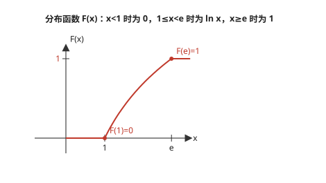
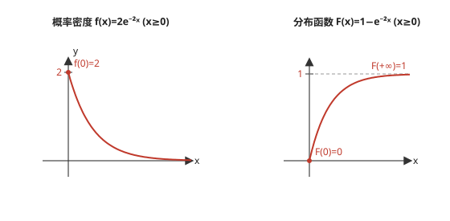
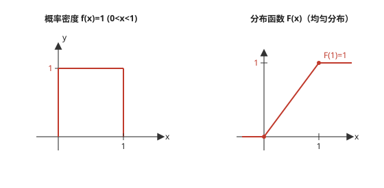

# 概率论与数理统计-速成课笔记

---

# 第一章
## 第一讲 随机事件及其概率（一）

> 本讲包含 2 种题型。

---

### 一、利用"四大公式"求事件概率

> **"四大公式"**：加法公式、减法公式、乘法公式、条件概率公式。

#### 例1

**（1）** 设 $P(A)=0.5$，$P(A\cup B)=0.8$，且 $A,B$ 互不相容，求 $P(B)$。

**（2）** 设 $P(A)=P(B)=P(C)=\dfrac{1}{4}$，$P(AC)=\dfrac{1}{8}$，$P(AB)=P(BC)=0$，求 "$A,B,C$ 至少发生一个" 的概率。

---

**【分析】**

**① "四大公式"**

- **加法公式**

  1. $P(A\cup B)$ 的含义："$A,B$ 至少发生一个"。（问：$A\cup B\cup C$ 呢？）
  2. $P(A\cup B)=P(A)+P(B)-P(AB)$
  3. $P(A\cup B\cup C)=P(A)+P(B)+P(C)-P(AB)-P(AC)-P(BC)+P(ABC)$
  
  > 口诀："**加奇减偶**"。

---

**【解】**

**（1）** 由 $A,B$ 互不相容，则 $AB=\varnothing$，又 $P(A\cup B)=0.8$

$$\Rightarrow P(A)+P(B)-P(AB)=0.8$$

$$\therefore P(B)=0.8-P(A)=0.8-0.5=0.3$$

> 补充：$ABC \subseteq AB$，$P(ABC) \leq P(AB) = 0$（互不相容），所以 $P(ABC)=0$。

**（2）** "$A,B,C$ 至少发生一个" $= P(A\cup B\cup C)$

$$= P(A)+P(B)+P(C)-P(AB)-P(AC)-P(BC)+P(ABC)$$

$$= \dfrac{1}{4}+\dfrac{1}{4}+\dfrac{1}{4}-0-\dfrac{1}{8}-0+0 = \dfrac{5}{8}$$

---

#### 例2

设 $P(A)=0.7$，$P(A-B)=0.3$，求 $P(\overline{AB})$。

**【分析】**

**① 减法公式**：$P(A-B)=P(A)-P(AB)$

**② 对立事件**：$P(\overline{A})=1-P(A)$

**【解】**

① 由 $P(A-B)=0.3 \Rightarrow P(A)-P(AB)=0.3$

$$\Rightarrow P(AB)=P(A)-0.3=0.7-0.3=0.4$$

② $P(\overline{AB})=1-P(AB)=1-0.4=0.6$

---

#### 例3

设 $P(B)=0.4$，$P(A\cup B)=0.5$，求 $P(A|\overline{B})$。

**【分析】**

**① 条件概率公式**：$P(A|B)=\dfrac{P(AB)}{P(B)}$

**②** $P(A-B)=P(A)-P(AB)$

**【解】**

1. 由 $P(B)=0.4$，$P(A\cup B)=0.5$，则：

$$P(A)+P(B)-P(AB)=0.5$$

$$\Rightarrow P(A)-P(AB)=0.5-P(B)=0.5-0.4=0.1$$

2. 

$$P(A|\overline{B}) = \dfrac{P(A\overline{B})}{P(\overline{B})} = \dfrac{P(A)-P(AB)}{1-P(B)} = \dfrac{0.1}{1-0.4} = \dfrac{1}{6}$$

---

#### 例4

设 $A,B$ 相互独立，$P(B)=0.4$，$P(A\cup B)=0.5$，求 $P(\overline{B}|A)$。

**【分析】**

**①** $A$ 与 $B$ 独立 $\Longleftrightarrow$ $A$ 与 $B$ 互不影响 $\Longleftrightarrow$ $P(B|A)=P(B)$

$$\Longleftrightarrow P(AB)=P(A)P(B)$$

**②** $A$ 与 $B$ 独立 $\Longleftrightarrow$ $B$ 是否发生不受 $A$ 的影响 $\Longleftrightarrow$ $\overline{B}$ 与 $A$，$\overline{B}$ 与 $\overline{A}$，$B$ 与 $\overline{A}$ 独立

$$\Longleftrightarrow P(\overline{B}|A)=P(\overline{B})$$

> 口诀："**有爸无爸，对妈独立无影响**"。

**【解】**

**法一**：由 $A,B$ 独立 $\Rightarrow P(AB)=P(A)P(B)=0.4P(A)$

而 $P(A\cup B)=0.5 \Rightarrow P(A)+P(B)-P(AB)=0.5$

$$\Rightarrow P(A)+0.4-0.4P(A)=0.5 \Rightarrow P(A)=\dfrac{1}{4}$$

$$P(\overline{B}|A)=\dfrac{P(A\overline{B})}{P(A)}=\dfrac{P(A)-P(AB)}{P(A)}=\dfrac{P(A)-0.4P(A)}{P(A)}=0.6$$

**法二**：由 $A,B$ 独立 $\Rightarrow$ $\overline{B}$ 与 $A$ 独立

$$\Rightarrow P(\overline{B}|A)=P(\overline{B})=1-P(B)=1-0.4=0.6$$

---

### 二、古典型求概率

#### 例1

袋中有 5 只白球，6 只黑球，从中任取 2 球，求：

1. 取到 1 白 1 黑 的概率；
2. 至少取到 1 只黑球的概率。

**【分析】**

**① 古典型概率**：事件 $A$ 发生的概率公式：

$$P(A)=\dfrac{A\text{ 中可能的点数}}{\Omega\text{ 中可能的点数}}$$

**② 排列**：$A_{11}^{2}$ 表示从 11 个不同元素中任取 2 个排成一列的排法：$A_{11}^{2}=11\times 10$

**组合**：$C_{11}^{2}$ 表示从 11 个不同元素中任取 2 个（不计顺序）的取法：$C_{11}^{2}=\dfrac{11\times 10}{2!}$

**【解】**

**（1）法一** 设 $A$ = "取到 1 黑 1 白球"，$\Omega$ = "从 11 球中任取 2 球"（不计顺序，一次取 2 球）

$$P(A)=\dfrac{C_{5}^{1}\cdot C_{6}^{1}}{C_{11}^{2}}=\dfrac{5\times 6}{\dfrac{11\times 10}{2!}}=\dfrac{6}{11}$$

> （分步相乘，分类相加）

**法二** 设 $A$ = "取到 1 黑 1 白球"，$\Omega$ = "从 11 球中任取 2 球"（共取 2 次，一次取 1 球，分类："先白后黑" + "先黑后白"）

$$P(A)=\dfrac{A_{5}^{1}\cdot A_{6}^{1}+A_{6}^{1}\cdot A_{5}^{1}}{A_{11}^{2}}=\dfrac{5\times 6+6\times 5}{11\times 10}=\dfrac{6}{11}$$

> 答案是一样的。

**（2）** 设 $B$ = "至少取到 1 只黑球"，$\overline{B}$ = "2 只球均为白球"（不计顺序）

$$P(B)=1-P(\overline{B})=1-\dfrac{C_{5}^{2}}{C_{11}^{2}}=1-\dfrac{\dfrac{5\times 4}{2!}}{\dfrac{11\times 10}{2!}}=1-\dfrac{2}{11}=\dfrac{9}{11}$$

---

## 第二讲 随机事件及其概率（二）

> 本讲包含 2 种题型。

---

### 三、全概率公式与贝叶斯公式

**【分析】** ① 在用题中，若适合分两个阶段完成，则用全概率公式或贝叶斯公式。

**① 全概率公式**：

$$P(A)=P(AB_{1}\cup AB_{2}\cup AB_{3})=P(B_{1})P(A|B_{1})+P(B_{2})P(A|B_{2})+P(B_{3})P(A|B_{3})$$

**② 贝叶斯公式**：

$$P(B_{i}|A)=\dfrac{P(AB_{i})}{P(A)}=\dfrac{P(B_{i})P(A|B_{i})}{\text{全概率公式}}$$

> **步骤**：
> - **第1步**：把第一阶段所有可能结果看成完备组 $B_{1},B_{2},B_{3}$；
> - **第2步**：把第二阶段的某个可能结果看成 $A$；
> - **第3步**：用全概率或贝叶斯公式。

---

#### 例1

甲袋中有 5 只红球、4 只白球；乙袋中有 4 只红球、5 只白球。先从甲中任取 1 只球放入乙中，再从乙中取 1 只球，求：

1. 从乙中取到的球是白球的概率；
2. 若已知从乙中取到 1 白球，问从甲中取到的球是白球的概率。

**【解】**

**（1）** 第 1 阶段：甲→乙

- $B_{1}=$ 从甲中取到红球，$P(B_{1})=\dfrac{5}{9}$
- $B_{2}=$ 从甲中取到白球，$P(B_{2})=\dfrac{4}{9}$

第 2 阶段：从乙中取 1 球，$A=$ "从乙中取到白球"

由全概率公式：

$$P(A)=P(B_{1})P(A|B_{1})+P(B_{2})P(A|B_{2})=\dfrac{5}{9}\times\dfrac{5}{10}+\dfrac{4}{9}\times\dfrac{6}{10}=\dfrac{49}{90}$$

**（2）** 由题意（贝叶斯公式）：

$$P(B_{2}|A)=\dfrac{P(B_{2}A)}{P(A)}=\dfrac{P(B_{2})P(A|B_{2})}{49/90}=\dfrac{\dfrac{4}{9}\times\dfrac{6}{10}}{49/90}=\dfrac{24}{49}$$

---

#### 例2

已知男性中有 $5\%$ 是色盲，女性中有 $0.25\%$ 是色盲，今从男女人数相等的人群中随机挑选一人，恰好是色盲，问此人是男性的概率。

**【解】**

第一阶段：从人群中选人

- $B_{1}=$ "选到男性"
- $B_{2}=$ "选到女性"

第二阶段：判断此人是否色盲，$A=$ "发现此人是色盲"

**①** 全概率公式：

$$P(A)=P(B_{1})P(A|B_{1})+P(B_{2})P(A|B_{2})=\dfrac{1}{2}\times 5\%+\dfrac{1}{2}\times 0.25\%=\dfrac{21}{800}$$

**②** 贝叶斯公式：

$$P(B_{1}|A)=\dfrac{P(B_{1})P(A|B_{1})}{P(A)}=\dfrac{\dfrac{1}{2}\times 5\%}{21/800}=\dfrac{20}{21}$$

---

### 四、伯努利概型求概率

**【分析】** 当出现"独立"、"$n$ 重试验"、"每次试验只有 $A$ 与 $\overline{A}$ 两种结果"，则用伯努利概型：

$$P_{n}(k)=C_{n}^{k}\,p^{k}(1-p)^{n-k}, \quad \text{其中 } p=P(A),\ 1-p=P(\overline{A})$$

---

#### 例

某人打靶的命中率为 $0.8$，现独立射击 5 次，问 5 次中命中 2 次的概率。

**【解】** 5 次独立重复射击，$p=0.8$，则：

$$P\{\text{5 次试验中命中 2 次}\}=P_{5}(2)=C_{5}^{2}\cdot p^{2}\cdot(1-p)^{3}=C_{5}^{2}\cdot 0.8^{2}\cdot 0.2^{3}$$

---

# 第二章

## 第三讲 一维随机变量及其分布（一）

> 本讲包含 3 种题型。

---

### 一、离散型随机变量（R.V.）求分布律

**【分析】** 离散型随机变量 R.V. 的分布律求法："**先求取值，再求概率**"。

#### 例

将一枚骰子掷两次，以 $X$ 表示两次中得到的小的点数，求 $X$ 的分布律（概率分布）。

**解：** $X=$ "两次骰子中较小的点数"，$X$ 可能取值：$1,2,3,4,5,6$。

⇒ 分布律：

| $X$ | 1 | 2 | 3 | 4 | 5 | 6 |
| --- | --- | --- | --- | --- | --- | --- |
| $P$ | $p_1$ | $p_2$ | $p_3$ | $p_4$ | $p_5$ | $p_6$ |

**法1（列表法）**：掷两次总情况共 $6\times 6=36$ 种（等可能）：

| 第一次 ＼ 第二次 | 1 | 2 | 3 | 4 | 5 | 6 |
| --- | --- | --- | --- | --- | --- | --- |
| **1** | (1,1) | (1,2) | (1,3) | (1,4) | (1,5) | (1,6) |
| **2** | (2,1) | (2,2) | (2,3) | (2,4) | (2,5) | (2,6) |
| **3** | (3,1) | (3,2) | (3,3) | (3,4) | (3,5) | (3,6) |
| **4** | (4,1) | (4,2) | (4,3) | (4,4) | (4,5) | (4,6) |
| **5** | (5,1) | (5,2) | (5,3) | (5,4) | (5,5) | (5,6) |
| **6** | (6,1) | (6,2) | (6,3) | (6,4) | (6,5) | (6,6) |

其中

$$p_1=\frac{\text{"}X=1\text{" 情况数}}{\text{总情况数}}=\frac{11}{36},\qquad p_2=\frac{9}{36},\qquad p_3=\frac{7}{36}$$

$$p_4=\frac{5}{36},\qquad p_5=\frac{3}{36},\qquad p_6=\frac{1}{36}$$

**法2（排列法）**：

$$p_1=\frac{\text{"先1后}X\text{"}+\text{"先大后1"}+\text{"先1后1"}}{\text{总情况数}}=\frac{A_1^1A_5^1+A_5^1A_1^1+A_1^1A_1^1}{A_6^1\cdot A_6^1}=\frac{11}{36}$$

$$p_2=\frac{A_1^1A_4^1+A_4^1A_1^1+A_1^1A_1^1}{A_6^1\cdot A_6^1}=\frac{9}{36}$$

同理可得 $p_3=\dfrac{7}{36}$，$p_4=\dfrac{5}{36}$，$p_5=\dfrac{3}{36}$，$p_6=\dfrac{1}{36}$。故

| $X$ | 1 | 2 | 3 | 4 | 5 | 6 |
| --- | --- | --- | --- | --- | --- | --- |
| $P$ | $\dfrac{11}{36}$ | $\dfrac{9}{36}$ | $\dfrac{7}{36}$ | $\dfrac{5}{36}$ | $\dfrac{3}{36}$ | $\dfrac{1}{36}$ |

---

### 二、利用常见离散型分布求概率

**【分析】** 当出现"独立"、"$n$ 次试验"、"每次试验只有两种结果"时，用**二项分布** $B(n,p)$，其分布律为

$$P\{X=k\}=C_n^k\,p^k(1-p)^{n-k},\qquad k=0,1,\cdots,n$$

#### 例

在四次独立射击试验中，每次命中目标的概率为 $p$，若已知至少命中 1 次的概率为 $\dfrac{80}{81}$，求 $p$。

**解：** 设 $X=$ "4 次射击中命中目标的次数"，则 $X\sim B(4,p)$。

由题意 $P\{\text{至少命中 1 次}\}=\dfrac{80}{81}$，故

$$P\{\text{4 次均未中}\}=1-\frac{80}{81}=\frac{1}{81}$$

$$\Rightarrow\ P\{X=0\}=C_4^0\,p^0(1-p)^{4-0}=\frac{1}{81}$$

$$\Rightarrow\ (1-p)^4=\frac{1}{81}=\left(\frac{1}{3}\right)^4\ \Rightarrow\ 1-p=\frac{1}{3}\ \Rightarrow\ p=\frac{2}{3}$$

---

### 三、连续型 R.V. 相关计算

**连续型 R.V. $X$ 的区间概率：**

$$P\{a<X\leq b\}\overset{①}{=}\int_a^b f(x)\,dx\overset{②}{=}F(b)-F(a)$$

$$P\{X=a\}=0,\qquad P\{X\leq a\}=F(a)=\int_{-\infty}^{a}f(x)\,dx$$

#### 例1

设 R.V. $X$ 的分布函数

$$F(x)=\begin{cases}0,&x<1\\[4pt] \ln x,&1\leq x<e\\[4pt] 1,&x\geq e\end{cases}$$

（1）求 $X$ 的概率密度 $f(x)$；（2）求 $P\{X<2\}$、$P\{0<X\leq 3\}$。

**解：**

（1）由 $f(x)=F'(x)$：

$$f(x)=\begin{cases}0,&x<1\\[4pt] \dfrac{1}{x},&1\leq x<e\\[4pt] 0,&x\geq e\end{cases}=\begin{cases}\dfrac{1}{x},&1\leq x<e\\[4pt] 0,&\text{其它}\end{cases}$$

（2）

① $P\{X<2\}=P\{X\leq 2\}=F(2)=\ln 2$

② 法1：$P\{0<X\leq 3\}=F(3)-F(0)=1-0=1$

法2：$P\{0<X\leq 3\}=\displaystyle\int_0^3 f(x)\,dx=\int_1^e \frac{1}{x}\,dx=\ln x\Big|_1^e=1$

> 注：$f(x)$ 仅在 $[1,e]$ 上非零，故积分区间由 $[0,3]$ 收缩为 $[1,e]$。

#### 例2

设 $X$ 的概率密度为

$$f(x)=\begin{cases}ke^{-2x},&x>0\\[4pt] 0,&x<0\end{cases}$$

（1）求 $k$；（2）求分布函数 $F(x)$。

**【分析】**

（1）已知 $f(x)$ 反求参数——用**规范性**：$\displaystyle\int_{-\infty}^{+\infty}f(x)\,dx=1$（即 $F(+\infty)=1$、$F(-\infty)=0$）

（2）已知 $f(x)$ 求 $F(x)$——**不定积分**：① $F(x)=\int f(x)\,dx$；② 用 $F(x)$ 的规范性

**解：**

（1）由规范性

$$1=\int_{-\infty}^{+\infty}f(x)\,dx=\int_0^{+\infty}f(x)\,dx=\int_0^{+\infty}ke^{-2x}\,dx$$

$$\therefore\ 1=\int_0^{+\infty}ke^{-2x}\,dx=k\cdot\left(-\frac{1}{2}\right)e^{-2x}\Big|_0^{+\infty}=\frac{k}{2}\ \Rightarrow\ k=2$$

（其中 $e^{-\infty}=0$，$e^0=1$）

（2）由 $F'(x)=f(x)=\begin{cases}2e^{-2x},&x\geq 0\\[4pt] 0,&x<0\end{cases}$，显然

$$F(x)=\begin{cases}-e^{-2x}+C_1,&x\geq 0\\[4pt] C_2,&x<0\end{cases}$$

由规范性

$$\begin{cases}F(-\infty)=0\ \Rightarrow\ C_2=0\\[6pt] F(+\infty)=1\ \Rightarrow\ -e^{-2\times(+\infty)}+C_1=1\ \Rightarrow\ C_1=1\end{cases}$$

$$\Rightarrow\ F(x)=\begin{cases}1-e^{-2x},&x\geq 0\\[4pt] 0,&x<0\end{cases}$$

#### 例3

若 $X\sim f(x)=\begin{cases}1,&0<x<1\\[4pt] 0,&\text{其他}\end{cases}$，求 $F(x)$。

**【分析】** 已知 $f(x)$ 求 $F(x)$（不定积分）：

① $F(x)=\int f(x)\,dx$；② 规范性 $F(-\infty)=0$、$F(+\infty)=1$；③ **分段点处连续**

**解：**

① 由 $f(x)=\begin{cases}0,&x\leq 0\\[4pt] 1,&0<x<1\\[4pt] 0,&x\geq 1\end{cases}$，显然

$$F(x)=\begin{cases}C_1,&x\leq 0\\[4pt] x+C_2,&0<x<1\\[4pt] C_3,&x\geq 1\end{cases}$$

② 由规范性：$F(-\infty)=0\Rightarrow C_1=0$；$F(+\infty)=1\Rightarrow C_3=1$

由分段点处连续：

$$\lim_{x\to 0^-}F(x)=\lim_{x\to 0^+}F(x)\ \Rightarrow\ \lim_{x\to 0^-}C_1=\lim_{x\to 0^+}(x+C_2)\ \Rightarrow\ C_2=0$$

综上

$$F(x)=\begin{cases}0,&x\leq 0\\[4pt] x,&0<x<1\\[4pt] 1,&x\geq 1\end{cases}$$

---
