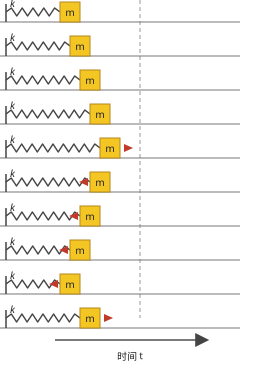
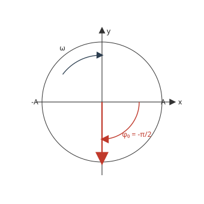
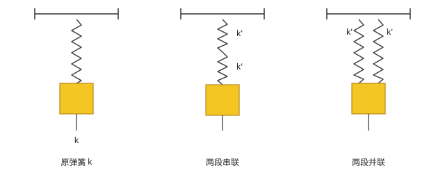
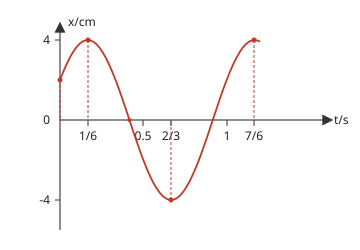
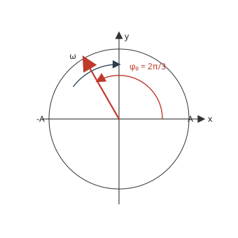
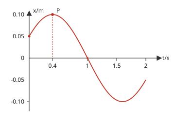
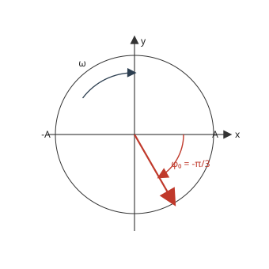
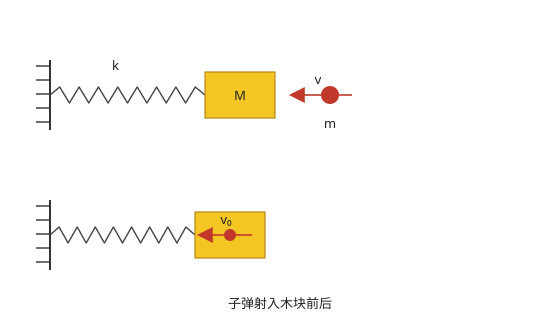
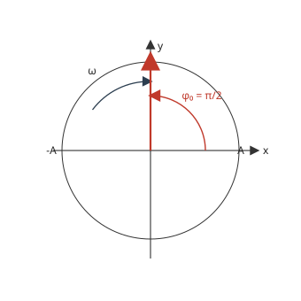

# 大二物理上

## 课时一 振动学方程

| 考点 | 重要程度 | 占分 | 常见题型 |
| --- | --- | --- | --- |
| 1. 认识简谐运动 | ★★★★ | 3~5 | 选择 / 填空 |
| 2. 振动学方程 | 必考 | 5~10 | 大题 |

### 1. 认识简谐运动

弹簧振子在水平方向上做往复运动，速度在两端最大位移处为零（$v=0$），在平衡位置处最大。可用旋转矢量法直观表示。

简谐运动的基本公式：

| 物理量 | 表达式 | 说明 |
| --- | --- | --- |
| 运动方程 | $x = A\cos(\omega t + \varphi_0)$ | |
| 振幅 | $A = \sqrt{x_0^2 + \dfrac{v_0^2}{\omega^2}}$ | 由初始条件决定 |
| 角频率 | $\omega = \sqrt{\dfrac{k}{m}} = \dfrac{2\pi}{T}$ | 弹簧振子 |
| 初相 | $\varphi_0$ | 由初始条件决定 |
| 相位 | $\omega t + \varphi_0$ | |
| 周期 | $T = \dfrac{2\pi}{\omega}$ | |
| 频率 | $\nu = \dfrac{1}{T} = \dfrac{\omega}{2\pi}$ | |
| 速度 | $v = \dfrac{dx}{dt} = -A\omega\sin(\omega t + \varphi_0)$，$v_{\max} = A\omega$ | |
| 加速度 | $a = \dfrac{dv}{dt} = -A\omega^2\cos(\omega t + \varphi_0)$，$a_{\max} = A\omega^2$ | |

> [!tip] 旋转矢量法
> 用一个长度为 $A$ 的旋转矢量以角速度 $\omega$ 逆时针旋转，矢量在 $x$ 轴上的投影即对应位移 $x$。矢量与 $x$ 轴的夹角即为相位 $\omega t + \varphi_0$，$t=0$ 时的夹角为初相 $\varphi_0$。
>
> 

> [!tip] 弹簧串并联
> 弹簧串联：$\dfrac{1}{k} = \dfrac{1}{k_1} + \dfrac{1}{k_2}$
> 弹簧并联：$k = k_1 + k_2$
>
> 

**题1.** 一质点按如下规律沿 $x$ 轴作简谐运动：$x = 0.1\cos\left(8\pi t + \dfrac{2\pi}{3}\right)$ (SI)，求此振动的周期、振幅、初相、速度最大值和加速度最大值。

**解：**

- 振幅 $A = 0.1\,\text{m}$
- 角频率 $\omega = 8\pi$，$T = \dfrac{2\pi}{\omega} = \dfrac{2\pi}{8\pi} = 0.25\,\text{s}$
- 初相 $\varphi_0 = \dfrac{2\pi}{3}$
- 速度最大值 $v_{\max} = A\omega = 0.1 \times 8\pi = 2.5\,\text{m/s}$
- 加速度最大值 $a_{\max} = A\omega^2 = 0.1 \times (8\pi)^2 = 63.1\,\text{m/s}^2$

**题2.** 质点做简谐运动，振动方程 $x = A\cos(\omega t + \varphi)$，当 $t = T/2$（$T$ 为周期）时，质点的速度为（  ）

$A.\ -A\omega\sin\varphi \quad B.\ A\omega\sin\varphi \quad C.\ -A\omega\cos\varphi \quad D.\ A\omega\cos\varphi \quad E.\ 0$

**答：B**

**解：**

$$v = \frac{dx}{dt} = -A\omega\sin(\omega t + \varphi)\Big|_{t=T/2}$$

$$= -A\omega\sin\left(\omega\cdot\frac{T}{2} + \varphi\right) = -A\omega\sin\left(\omega\cdot\frac{2\pi/\omega}{2} + \varphi\right)$$

$$= -A\omega\sin(\pi + \varphi) = A\omega\sin\varphi$$

**题3.** 将倔强系数为 $k$ 的轻质弹簧截去一半，然后一端固定，另一端下挂质量为 $m$ 的小球，组成振动系统。那么该系统的频率是（  ）

$A.\ \dfrac{1}{4\pi}\sqrt{\dfrac{k}{m}} \quad B.\ \dfrac{1}{2\pi}\sqrt{\dfrac{k}{m}} \quad C.\ \dfrac{1}{2\sqrt{2}\pi}\sqrt{\dfrac{k}{m}} \quad D.\ \dfrac{\sqrt{2}}{2\pi}\sqrt{\dfrac{k}{m}}$

**答：D**

**解：** 两段半弹簧并联：$\dfrac{1}{k'} + \dfrac{1}{k'} = \dfrac{1}{k} \Rightarrow k' = 2k$

$$\omega = \sqrt{\frac{k'}{m}} = \sqrt{\frac{2k}{m}}, \quad \nu = \frac{\omega}{2\pi} = \frac{\sqrt{2}}{2\pi}\sqrt{\frac{k}{m}}$$

### 2. 振动学方程 $x = A\cos(\omega t + \varphi_0)$

**题1.** 已知一物体作简谐运动，周期为 $1\,\text{s}$，振动曲线如图所示，求简谐运动的余弦表达式。

**解：**

- 振幅 $A = 0.04\,\text{m}$
- 周期 $T = 1\,\text{s}$，$\omega = \dfrac{2\pi}{T} = 2\pi\,\text{rad/s}$
- 由旋转矢量法得 $\varphi_0 = -\dfrac{\pi}{3}$

$$x = 0.04\cos\left(2\pi t - \frac{\pi}{3}\right)$$

**题2.** 一质点作简谐运动，振幅为 $A$，在起始位置时刻质点的位移为 $\dfrac{A}{2}$，且向 $x$ 轴的正方向运动，代表此简谐运动的旋转矢量图为：

**答：B**（位移 $x = \dfrac{A}{2}$，且向 $+x$ 方向运动 ⟹ 矢量在第一象限，逆时针旋转）

**题3.** 质点沿 $x$ 轴作简谐运动，用余弦函数表示，振幅为 $A$，当 $t=0$ 时，质点处于 $x_0 = -\dfrac{A}{2}$ 处且向 $x$ 轴负方向运动，则其初相为：

$A.\ \dfrac{\pi}{6} \quad B.\ \dfrac{2\pi}{3} \quad C.\ \dfrac{4\pi}{3} \quad D.\ \dfrac{\pi}{3}$

**答：B**

**解：** 由旋转矢量法，$\varphi_0 = \dfrac{2\pi}{3}$（位于第二象限，对应 $x = -\dfrac{A}{2}$ 且向 $-x$ 方向旋转分量最大处）。

**题4.** 质点振动的 $x-t$ 曲线如图所示，求：

（1）质点的振动方程；

（2）质点从 $t=0$ 的位置到达 $P$ 点相应位置所需的最短时间。

**解：**

（1）$A = 0.1$

由旋转矢量法知 $\varphi_0 = -\dfrac{\pi}{3}$，$x = 0.1\cos\left(\omega t - \dfrac{\pi}{3}\right)$

$0 = 0.1\cos\left(\omega t - \dfrac{\pi}{3}\right)$ 时 $\omega t - \dfrac{\pi}{3} = \dfrac{\pi}{2} \Rightarrow \omega = \dfrac{5\pi}{6}$

$$x = 0.1\cos\left(\frac{5\pi}{6}t - \frac{\pi}{3}\right)$$

（2）$t = 0$ 时 $\varphi_0 = -\dfrac{\pi}{3}$；$t = t_P$ 时 $\varphi_P = 0$

$$\Delta t = \frac{\Delta\varphi}{\omega} = \frac{\pi/3}{5\pi/6} = 0.4\,\text{s}$$

**题5.** 如图所示，质量为 $1.0\times10^{-2}\,\text{kg}$ 的子弹，以 $500\,\text{m/s}$ 的速度射入并嵌在木块中，同时使弹簧压缩而作简谐运动。设木块质量为 $4.99\,\text{kg}$，弹簧的劲度系数为 $k = 8.00\times10^3\,\text{N/m}$。若以弹簧原长时木块所在处为坐标原点，向右为轴正方向，求简谐运动方程。

**解：** 由动量守恒

$$mv = (M + m)v_0 \Rightarrow v_0 = \frac{m}{M + m}v = \frac{0.01}{0.01 + 4.99}\times 500 = 1\,\text{m/s}$$

$$\omega = \sqrt{\frac{k}{M + m}} = \sqrt{\frac{8\times10^3}{0.01 + 4.99}} = 40\,\text{rad/s}$$

$$A = \sqrt{x_0^2 + \frac{v_0^2}{\omega^2}} = \sqrt{0^2 + \frac{1^2}{40^2}} = 2.5\times10^{-2}\,\text{m}$$

由旋转矢量法知 $\varphi_0 = \dfrac{\pi}{2}$

$$x = 2.5\times10^{-2}\cos\left(40t + \frac{\pi}{2}\right)$$

