# 数据结构

> 依据 王道考研《数据结构》课程整理（本文件为全部章节的总笔记，随阅读逐章追加）。

## 第一章 绪论

### 1.0 开篇——数据结构在学什么？

**数据结构在学什么？**
- 如何用程序代码把现实世界的问题**信息化**；
- 如何用计算机**高效地处理**这些信息从而创造价值。

**人类文明三次浪潮**（阿尔文·托夫勒《第三次浪潮》）：
| 浪潮 | 阶段 | 说明 |
| --- | --- | --- |
| 第一次 | 农业（约 1 万年前） | 学会农耕，从"动物"到"人类" |
| 第二次 | 工业（17 世纪末） | 出现枪炮与机械，导致古文明灭亡 |
| 第三次 | **信息化**（正在到来） | 高度信息化的世界，导致 ? ? ? |

> 托夫勒："唯一可以确定的是，明天会使我们所有人大吃一惊。"

**"信息化"**：把现实事物用计算机表示。

| 现实事物 | 信息化后的表示 |
| --- | --- |
| 财富（存钱罐） | 电子零钱（浮点型变量 `float`） |
| 排队（海底捞取号） | 号单/用户号（数组？还是…） |
| 友谊（朋友圈/粉丝） | 社交网络（粉丝列表、二维码） |

> 学完 C 语言后，如何用计算机表示这些信息、并高效处理 → 这就是**数据结构**要解决的问题。

**计算机系统分层**（信息化世界）：一台计算机/手机 = **计组（硬件）** → **操作系统** → **C、数据结构（软件）**；多台计算机之间通过**计算机网络**互联，构成"信息化世界"。

---

### 1.1 数据结构的基本概念

> 学习建议：概念多但较基础，抓大放小、形成框架。讨论一种数据结构时，关注"**三要素**"。

**知识总览**：

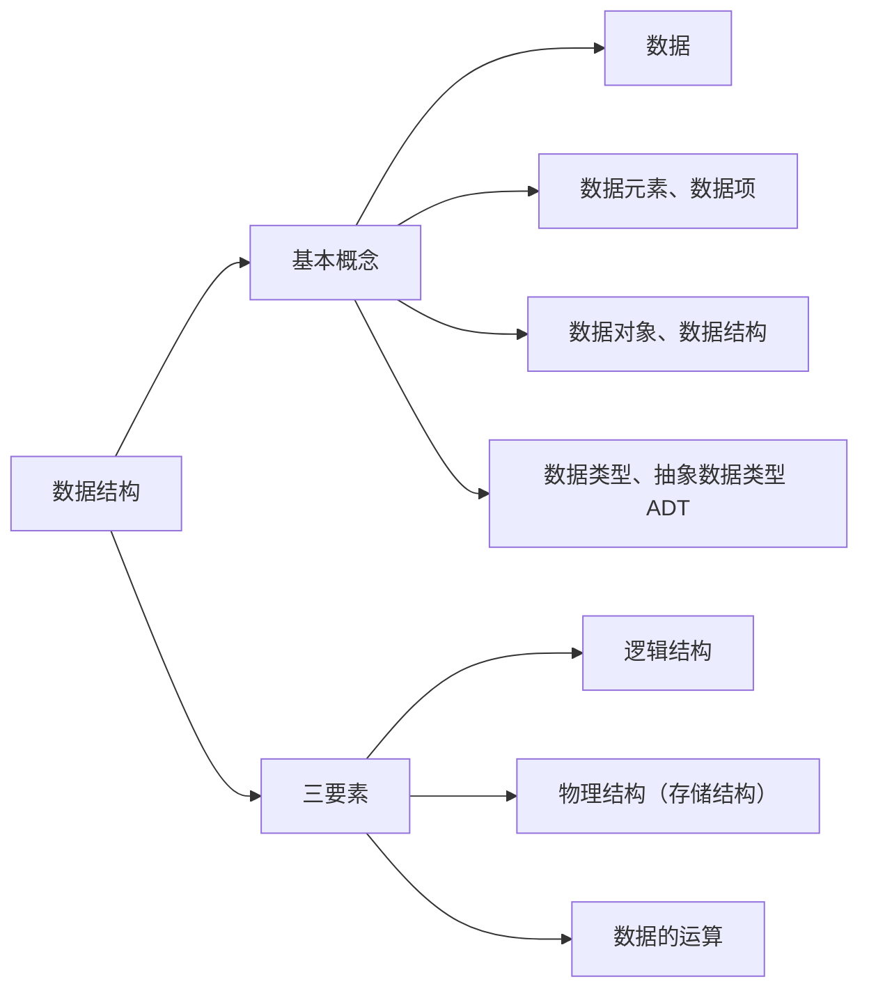

#### 1. 什么是数据
**数据**：信息的载体，是描述客观事物属性的**数、字符**及所有能输入到计算机中并被计算机程序识别和处理的**符号的集合**。数据是计算机程序加工的原料。（计算机内以二进制 0/1 表示。）

#### 2. 数据元素、数据项
- **数据元素**：数据的**基本单位**，通常作为一个整体来考虑和处理。
- **数据项**：构成数据元素的**不可分割的最小单位**。
- 一个数据元素可由若干数据项组成；根据实际业务需求确定"什么是数据元素、什么是数据项"。
  例：海底捞取号记录 = {号数、取号时间、就餐人数}；微博账号 = {昵称、性别、生日（年/月/日可为"组合项"）}。

#### 3. 数据结构、数据对象
- **结构**：各个元素之间的关系（如汉字"沙 / 粥 / 曼"的不同结构）。
- **数据结构**：相互之间存在一种或多种**特定关系**的数据元素的集合。
- **数据对象**：具有**相同性质**的数据元素的集合，是数据的一个**子集**。
  例：数据结构 = 某个特定门店的排队顾客信息及其关系；数据对象 = 全国所有门店的排队顾客信息。

#### 4. 数据结构的三要素
讨论一种数据结构要关注：**逻辑结构、物理结构（存储结构）、数据的运算**。

**① 逻辑结构**（数据元素之间的逻辑关系是什么？）：

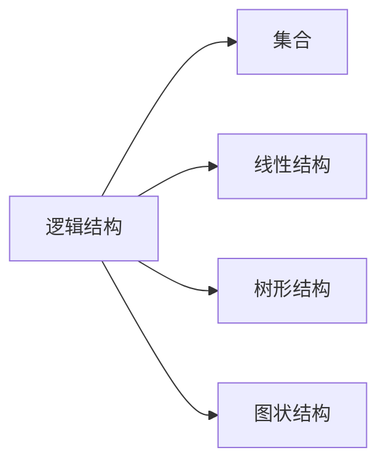

| 逻辑结构 | 关系 | 例子 |
| --- | --- | --- |
| 集合 | 各元素同属一个集合，别无其他关系 | 火锅配料 |
| 线性结构 | 一对一；除第一个外均有唯一前驱，除最后一个外均有唯一后继 | 排队取号、烤串 |
| 树形结构 | 一对多 | 文件系统目录 |
| 图状结构（网状） | 多对多 | 微信好友 |

> 线性结构 = 一对一；集合、树形、图状结构 = **非线性结构**。

**② 物理结构（存储结构）**（如何用计算机表示数据元素的逻辑关系？）：

| 存储结构 | 含义 |
| --- | --- |
| 顺序存储 | 逻辑上相邻的元素在物理位置上也相邻，关系由存储单元的邻接关系体现 |
| 链式存储 | 逻辑上相邻的元素物理位置可不相邻，借助指针表示逻辑关系 |
| 索引存储 | 存储元素信息的同时建立附加的索引表，索引项形如（关键字，地址） |
| 散列存储 | 根据元素关键字直接算出存储地址（又称 Hash 存储） |

> 链式、索引、散列属于**非顺序存储**。
> **绪论只需理解两点**：①顺序存储元素物理上必须连续，非顺序存储可以离散；②存储结构会影响存储空间分配的方便程度（如"有人插队"）；③存储结构会影响对数据运算的速度（如"找第三个人"）。

**③ 数据的运算**：运算的**定义**针对**逻辑结构**（指出功能），运算的**实现**针对**存储结构**（指出操作步骤）。
例：队列逻辑结构（海底捞排队）定义运算：①队头元素出队；②新元素入队；③输出队列长度。

#### 5. 数据类型、抽象数据类型（ADT）
**数据类型**：一个值的集合和定义在此集合上的一组操作的总称。
1. **原子类型**：其值不可再分的数据类型（如 bool、int）。
2. **结构类型**：其值可再分解为若干成分（分量）的数据类型（如 `struct Customer{ int num; int people; }`）。

| 类型 | 值的范围 | 可进行的操作 |
| --- | --- | --- |
| bool | true / false | 与、或、非 |
| int | -2147483648 ~ 2147483647 | 加、减、乘、除、模… |
| struct Customer | num∈1~9999，people∈1~12 | 如"拼桌"运算 |

**抽象数据类型（ADT, Abstract Data Type）**：抽象数据组织及与之相关的操作。用数学化的语言定义数据的逻辑结构、定义运算，**与具体的实现无关**。

> **重要结论**：
> - 定义了一个 ADT，就是定义了数据的逻辑结构、数据的运算，即定义了一个**数据结构**。
> - 确定一种存储结构，就表示出了逻辑结构；存储结构不同，运算的具体实现也不同；确定了存储结构才能**实现**数据结构。
> - 数据结构这门课看重的是**数据元素之间的关系**和**对这些数据元素的操作**，而不关心具体的数据项内容。

---

### 1.2.1 算法的基本概念

**什么是算法？**
- **程序 = 数据结构 + 算法**（数据结构是要处理的信息；算法是处理信息的步骤）。
- **算法（Algorithm）**：对特定问题求解步骤的一种描述，是指令的**有限序列**，其中的每条指令表示一个或多个操作。
- 例：做番茄炒蛋（食材+步骤）；对线性表按年龄递增排序（选择排序 Step1~Step4）。

> **程序设计** = 设计一个好的数据结构 + 设计一个好的算法。

**算法的五个特性**：

| 特性 | 含义 |
| --- | --- |
| 有穷性 | 算法总在执行**有穷步**后结束，且每一步都能在**有穷时间**内完成 |
| 确定性 | 每条指令必须有确切的含义，相同输入只能得出相同的输出 |
| 可行性 | 描述的每一步都能通过已实现的基本运算执行有限次来实现 |
| 输入 | 有零个或多个输入，取自某个特定对象的集合 |
| 输出 | 有一个或多个输出，是与输入有某种特定关系的量 |

> 注：**算法必须是有穷的，而程序可以是无穷的**（如微信是程序，不是算法）。

**"好"算法的特质**（设计时要尽量追求的目标）：
1. **正确性**：能正确地解决求解问题。
2. **可读性**：描述要让别人看得懂（可由代码/伪代码/文字描述，重要的是**无歧义**）。
3. **健壮性**：输入非法数据时能恰当地反应或处理，不产生莫名其妙的输出。
4. **高效率与低存储量需求**：省时、省内存，即**时间复杂度低、空间复杂度低**。

---

### 1.2.2 算法的时间复杂度

**如何评估算法时间开销？**
- 让算法先运行、事后统计运行时间？存在问题：和机器性能、编程语言、编译程序指令质量有关；有些算法不能事后统计（如导弹控制算法）。
- 应**事前预估**：算法**时间复杂度** = 事前预估算法时间开销 $T(n)$ 与问题规模 $n$ 的关系（T 表示 time）。

**大 O 表示法**：$T(n) = O(f(n))$，表示二者**同阶/同等数量级**（当 $n \to \infty$ 时二者之比为常数）。只考虑阶数高的部分，系数和低次幂可忽略。

**计算规则**：
- **加法规则**：$T(n) = O(f(n)) + O(g(n)) = O(\max(f(n), g(n)))$ —— 多项相加，只保留最高阶项，系数变为 1。
- **乘法规则**：$T(n) = O(f(n)) \times O(g(n)) = O(f(n)\times g(n))$ —— 多项相乘，都保留。

**常用技巧**：顺序执行的代码只影响常数项（忽略）；只需挑循环中的一个基本操作、分析其执行次数与 n 的关系；多层嵌套循环只需关注**最深层循环**循环了几次。

**三种时间复杂度**：
| 类型 | 含义 |
| --- | --- |
| 最坏时间复杂度 | 考虑输入数据"最坏"的情况 |
| 平均时间复杂度 | 所有输入示例等概率出现时算法的期望运行时间 |
| 最好时间复杂度 | 考虑输入数据"最好"的情况 |

> 很多算法执行时间与输入数据有关（如顺序查找）；算法性能问题在 n 很大时才会暴露。

**如何计算**：①找一个基本操作（最深层循环）→ ②分析其执行次数 $x$ 与问题规模 $n$ 的关系 $x=f(n)$ → ③取 $O(x)$ 即 $T(n)$。

**例题**：
- **逐步递增**：`int i=1; while(i<=n){ i++; printf(...); }` → $T(n)=3n+3=O(n)$。
- **指数递增**：`i=i*2` 每次翻倍 → 最深层循环语句频度 $x$，结束时 $2^x>n$，$x=\log_2 n+1$ → $T(n)=O(\log_2 n)$。
- **顺序查找**（数组中找元素 n）：最好 $O(1)$、最坏 $O(n)$、平均 $\frac{1+2+\dots+n}{n}=\frac{1+n}{2}$ → $O(n)$。

**常见复杂度排序**（口诀"常对幂指阶"）：

$$O(1) < O(\log_2 n) < O(n) < O(n\log_2 n) < O(n^2) < O(n^3) < O(2^n) < O(n!) < O(n^n)$$

---

### 1.2.3 算法的空间复杂度

**空间复杂度**：空间开销（内存开销）与问题规模 $n$ 的关系，记作 $S(n) = O(f(n))$（S 表示 Space）。

**程序运行时的内存需求**：
- **程序代码**：大小固定，与问题规模无关；
- **数据**：局部变量、参数等，其中**与 $n$ 相关**的变量才影响空间复杂度。

**原地工作**：算法所需内存空间为常量，即 $S(n) = O(1)$。（如算法1 逐步递增型爱你，无论 $n$ 怎么变，内存都是固定常量。）

**例题**：
| 程序 | 所需空间 | $S(n)$ |
| --- | --- | --- |
| `int flag[n]; int i;` | $\approx 4n+8$ | $O(n)$ |
| `int flag[n][n];` | $n\times n$ | $O(n^2)$ |
| `flag[n][n] + other[n] + i` | $O(n^2)+O(n)+O(1)$ | $O(n^2)$（加法规则） |
| 递归 `loveYou(n)`（各层存参数 n） | 递归深度 $n$ | $O(n)$ |
| 递归 `loveYou(n)`（各层存 `flag[n]` 数组） | $1+2+\dots+n=\frac{n(n+1)}{2}$ | $O(n^2)$ |

**递归的空间复杂度 = 递归调用的深度**（若各层所需存储空间不同，分析方法略有区别）。

**如何计算空间复杂度**：
- **普通程序**：①找到所占空间大小与问题规模相关的变量 → ②分析其所占空间 $x$ 与 $n$ 的关系 $x=f(n)$ → ③取 $O(x)$ 即 $S(n)$；
- **递归程序**：找到**递归调用的深度** $x$ 与 $n$ 的关系，取 $O(x)$ 即 $S(n)$。

**常用技巧**：同时间复杂度，加法/乘法规则、"常对幂指阶"（$O(1)<O(\log_2 n)<O(n)<O(n\log_2 n)<O(n^2)<O(n^3)<O(2^n)<O(n!)$）。

---

### 小结

1. **基本概念**：数据、数据元素/数据项、数据对象/数据结构、数据类型/抽象数据类型 ADT。
2. **数据结构的三要素**：逻辑结构（集合/线性/树形/图状，即线性与非线性）、物理结构/存储结构（顺序/链式/索引/散列，后三者非顺序）、数据的运算（定义针对逻辑结构、实现针对存储结构）。
3. **算法**：程序 = 数据结构 + 算法；算法的五个特性（有穷性、确定性、可行性、输入、输出），"好"算法特质（正确、可读、健壮、高效低存储）。
4. **时间复杂度**：$T(n)=O(f(n))$；加法/乘法规则；"常对幂指阶"；最好/最坏/平均。
5. **空间复杂度**：$S(n)=O(f(n))$；原地工作 $O(1)$；递归空间 = 递归深度。
6. **主考点**：定义了一个 ADT 就是定义了一个数据结构；存储结构影响运算实现；复杂度用大 O 只留最高阶。

---

## 第二章 线性表

### 2.1 线性表的定义和基本操作

**线性表（Linear List）定义**：是具有**相同数据类型**的 $n$（$n\ge0$）个数据元素的**有限序列**。$n$ 为表长，$n=0$ 时是空表。用 $L$ 命名线性表，一般表示为：

$$L = (a_1,\ a_2,\ \dots,\ a_i,\ a_{i+1},\ \dots,\ a_n)$$

**特性**：①元素个数有限；②元素类型相同（每个元素所占空间一样大）；③元素有次序。

**重要术语**：
- $a_i$ 是线性表中的"第 $i$ 个"元素——线性表中的**位序**（**从 1 开始**，注意数组下标从 0 开始，用数组实现线性表时要审题）。
- $a_1$ 是**表头元素**，$a_n$ 是**表尾元素**。
- 除第一个元素外，每个元素有且仅有一个**直接前驱**；除最后一个元素外，每个元素有且仅有一个**直接后继**。

> Eg：所有整数按递增次序排列，是线性表吗？——**否**（无限序列，不是线性表）。

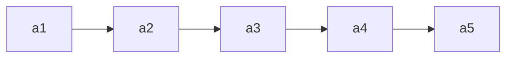

**基本操作**（记忆思路：**创销、增删改查**）：

| 操作 | 功能 | 说明 |
| --- | --- | --- |
| InitList(&L) | 初始化表 | 构造空表，分配内存空间（从无到有） |
| DestroyList(&L) | 销毁表 | 释放线性表占用的内存空间（从有到无） |
| ListInsert(&L,i,e) | 插入 | 在表 L 第 i 个位置插入元素 e（增） |
| ListDelete(&L,i,&e) | 删除 | 删除表 L 第 i 个位置的元素，用 e 返回其值（删） |
| LocateElem(L,e) | 按值查找 | 在表 L 中查找具有给定关键字值的元素 |
| GetElem(L,i) | 按位查找 | 获取表 L 第 i 个位置的元素的值 |
| Length(L) | 求表长 | 返回 L 中数据元素的个数 |
| PrintList(L) | 输出 | 按前后顺序输出 L 的所有元素 |
| Empty(L) | 判空 | 若 L 为空表返回 true，否则 false |

> **为什么要实现基本操作**：①团队合作编程，定义的 ADT 要让人方便使用（封装）；②将常用操作封装成函数，避免重复工作、降低出错风险。
> **改、查（本质是"定位"）**：改之前也要先"查"（LocateElem / GetElem）。

**什么时候要传入参数的引用 `&`**：对参数的修改结果需要"**带回来**"时。如 `InitList(&L)`、`DestroyList(&L)`、`ListInsert(&L,i,e)`、`ListDelete(&L,i,&e)`；而 `LocateElem(L,e)`、`GetElem(L,i)` 只读，不加 `&`。

```c
void test(int &x){ x = 1024; ... }   // 引用传递，x 的修改"带回来了"
int x = 1;  test(x);                 // 调用后 x=1024
```

> Tips：比起学会"How"，更重要的是想明白"Why"；函数命名要有可读性。

### 2.2.1 顺序表的定义

**顺序表**：用**顺序存储**的方式实现线性表。顺序存储把逻辑上相邻的元素存储在物理位置上也相邻的存储单元中，元素之间的关系由存储单元的邻接关系来体现。（即用"数组"存放数据元素。）

**元素地址**：设线性表第一个元素存放位置为 LOC(L)（location 的缩写），则第 $i$ 个元素地址 = LOC(L) + $(i-1)\times$ sizeof(ElemType)。用 C 语言 `sizeof(ElemType)` 得到元素大小（如 `sizeof(int)=4B`，`sizeof(Customer)=8B`）。

**顺序表的实现——静态分配**：

```c
#define MaxSize 10                 // 定义最大长度
typedef struct {
    ElemType data[MaxSize];        // 用静态的"数组"存放数据元素
    int length;                    // 顺序表的当前长度
} SqList;                          // 顺序表类型定义（静态分配）
```

Sq = sequence（顺序、序列）。给数据元素分配连续存储空间，大小为 MaxSize × sizeof(ElemType)。
- 表长一开始就确定、**无法更改**（静态）。存满就"放弃治疗"；若一开始就声明很大的空间，又会浪费。

**顺序表的实现——动态分配**（静态数组存满无法扩容，用动态数组）：

```c
#define InitSize 10
typedef struct {
    ElemType *data;    // 指示动态分配数组的指针
    int MaxSize;       // 顺序表的最大容量
    int length;        // 顺序表的当前长度
} SeqList;             // 动态分配方式
```

```c
L.data = (ElemType *) malloc(sizeof(ElemType) * InitSize);   // 申请一片连续空间
```

- C 用 malloc / free（头文件 `<stdlib.h>`），C++ 用 new / delete。
- **动态扩容**（`IncreaseSize(&L, len)`）：`int *p = L.data;  L.data = (int *) malloc((L.MaxSize + len) * sizeof(int));  for(...) L.data[i]=p[i];  L.MaxSize += len;  free(p);`
- 注：可用 `realloc` 实现，但建议初学者用 malloc / free 以理解过程；**扩容要把旧数据复制到新区域，时间开销大（O(n)）**。

**顺序表的特点**：

| 特点 | 说明 |
| --- | --- |
| 随机访问 | 能在 $O(1)$ 时间内找到第 $i$ 个元素（`data[i-1]`，位序从 1、下标从 0） |
| 存储密度高 | 每个节点只存储数据元素，无指针 |
| 拓展容量不方便 | 静态分配无法改变；动态分配扩容也要搬移数据（$O(n)$） |
| 插入、删除不方便 | 需要移动大量元素 |

### 2.2.2_1 顺序表的插入和删除

**插入**：`ListInsert(&L, i, e)` —— 在表 L 的第 i 个位置插入元素 e。

```c
bool ListInsert(SqList &L, int i, int e){
    if(i < 1 || i > L.length + 1) return false;   // 判断 i 的范围是否有效
    if(L.length >= MaxSize) return false;          // 当前存储空间已满，不能插入
    for(int j = L.length; j >= i; j--)             // 将第 i 个元素及之后的元素后移
        L.data[j] = L.data[j-1];
    L.data[i-1] = e;                               // 在位置 i 处放入 e
    L.length++;                                     // 长度 +1
    return true;
}
```

- 注意位序 i 与数组下标关系：元素后移时**从表尾元素开始往前**移动。
- 健壮性：`if` 判断 i 是否合法、空间是否已满，返回 `bool` 给使用者反馈。

**插入时间复杂度**（问题规模 n = L.length）：

| 情况 | 说明 | 复杂度 |
| --- | --- | --- |
| 最好 | 插到表尾（i=n+1），0 次移动 | $O(1)$ |
| 最坏 | 插到表头（i=1），n 次移动 | $O(n)$ |
| 平均 | 各位置概率 $\frac{1}{n+1}$，平均移动 $\frac{n}{2}$ | $O(n)$ |

**删除**：`ListDelete(&L, i, &e)` —— 删除表 L 第 i 个位置的元素，并用 e 返回其值。

```c
bool ListDelete(SqList &L, int i, int &e){
    if(i < 1 || i > L.length) return false;   // 判断 i 的范围是否有效
    e = L.data[i-1];                           // 将被删除的元素赋值给 e
    for(int j = i; j < L.length; j++)          // 将第 i 个位置后的元素前移
        L.data[j-1] = L.data[j];
    L.length--;                                 // 长度 -1
    return true;
}
```

- 元素前移时**从靠前的元素开始**（与插入的后移相反，注意别弄反）。
- `e` 加了 `&`，因为要把删除的值"带回来"；不加 & 传的是复制品，改不回去。

**删除时间复杂度**（问题规模 n = L.length）：

| 情况 | 说明 | 复杂度 |
| --- | --- | --- |
| 最好 | 删除表尾（i=n），0 次移动 | $O(1)$ |
| 最坏 | 删除表头（i=1），n-1 次移动 | $O(n)$ |
| 平均 | 各位置概率 $\frac{1}{n}$，平均移动 $\frac{n-1}{2}$ | $O(n)$ |

### 2.2.2_2 顺序表的查找

**按位查找**：`GetElem(L, i)` —— 获取表 L 第 i 个位置的元素的值。

```c
ElemType GetElem(SeqList L, int i){
    return L.data[i-1];      // 位序 i 对应数组下标 i-1
}
```

- **时间复杂度 $O(1)$**：顺序表数据元素在内存中**连续存放**，根据起始地址 + 元素大小可立即定位第 i 个元素（**随机存取**特性）。
- 指针类型决定"步长"：`data[i]` = 起始地址 + i×sizeof(ElemType)；`malloc` 返回 `void*`，需**强制转换成** `ElemType*`。

**按值查找**：`LocateElem(L, e)` —— 在表 L 中查找第一个元素值等于 e 的元素，返回其**位序**（找不到返回 0）。

```c
int LocateElem(SeqList L, ElemType e){
    for(int i = 0; i < L.length; i++)
        if(L.data[i] == e)  return i + 1;   // 数组下标 i 对应位序 i+1
    return 0;                               // 退出循环，查找失败
}
```

- **基本数据类型**（int、char、double、float…）可直接用 `==` 比较；
- **结构类型**不能直接用 `==`（C 语言会报错），需逐分量比较，或封装成 `isCustomerEqual(a, b)` 函数；考研初试手写代码可直接用 `==`（主要考算法思想）。

**按值查找时间复杂度**（问题规模 n = L.length）：

| 情况 | 说明 | 复杂度 |
| --- | --- | --- |
| 最好 | 目标元素在表头，循环 1 次 | $O(1)$ |
| 最坏 | 目标元素在表尾，循环 n 次 | $O(n)$ |
| 平均 | 各位置概率 $\frac{1}{n}$，平均 $\frac{n+1}{2}$ 次 | $O(n)$ |

### 2.3.1 单链表的定义

**单链表**：用**链式存储**（存储结构）实现了**线性结构**（逻辑结构）。每个结点存储一个数据元素，各结点间的先后关系用一个**指针**表示。

| | 顺序表（顺序存储） | 单链表（链式存储） |
| --- | --- | --- |
| 优点 | 可随机存取，存储密度高 | 不要求大片连续空间，改变容量方便 |
| 缺点 | 要求大片连续空间，改变容量不方便 | 不可随机存取，要耗费空间存放指针 |

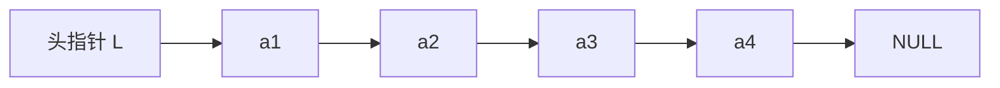

**用代码定义一个单链表**：

```c
typedef struct LNode{      // 定义单链表结点类型
    ElemType data;         // 数据域，存放一个数据元素
    struct LNode *next;    // 指针域，指向下一个结点
}LNode, *LinkList;
```

- `typedef <数据类型> <别名>`：给类型重命名。`LNode` 是结点类型，`LinkList` 等价于 `LNode *`。**前者强调"是一个结点"，后者强调"这是一个单链表"，合适的地方用合适的名字可读性更高**。
- 新建结点：`LNode * p = (LNode *) malloc(sizeof(LNode));`（malloc 返回 void*，需强制转换）。

**两种实现方式：带头结点 / 不带头结点**（头结点不存放数据，只是为了操作方便）：

| | 不带头结点 | 带头结点 |
| --- | --- | --- |
| 初始化 | `InitList(&L){ L = NULL; }` | `InitList(&L){ L = (LNode*)malloc(sizeof(LNode)); L->next = NULL; }` |
| 空表判断 | `L == NULL` | `L->next == NULL` |
| 写代码 | 麻烦（首个/后续结点、空表/非空表逻辑不同） | 更方便（统一处理） |

> 头指针 L 就代表整个单链表；因为要修改头指针，`InitList` 的参数要加 `&` 引用。

### 2.3.2_1 单链表的插入和删除

**插入**：

**① 按位序插入** `ListInsert(&L, i, e)`：在第 i 个位置插入元素 e，核心是找到第 i-1 个结点，把新结点插到它后面。

```c
bool ListInsert(LinkList &L, int i, ElemType e){
    if(i < 1) return false;
    LNode *p; int j = 0;
    p = L;                                // 头结点看作第 0 个结点
    while(p != NULL && j < i-1){ p = p->next; j++; }   // 找到第 i-1 个结点
    if(p == NULL) return false;
    LNode *s = (LNode *) malloc(sizeof(LNode));
    s->data = e;
    s->next = p->next;                    // 先连（顺序不能颠倒）
    p->next = s;                          // 再断
    return true;
}
```

- 时间复杂度：最好 $O(1)$（插表头 i=1），最坏 $O(n)$（插表尾），平均 $O(n)$。
- **不带头结点**：不存在"第 0 个"结点，i=1 需特殊处理（改头指针 L）。

**② 指定结点的后插** `InsertNextNode(p, e)`：`s->next = p->next; p->next = s;` —— $O(1)$。

**③ 指定结点的前插** `InsertPriorNode(p, e)`：**偷天换日**——把新结点 s 插到 p 后面，再交换数据，$O(1)$：
```c
s->next = p->next; p->next = s;
s->data = p->data;      // 把 p 中元素复制到 s
p->data = e;            // p 覆盖为 e
```

**删除**：

**① 按位序删除** `ListDelete(&L, i, &e)`：找到第 i-1 个结点，令其指向第 i+1 个结点，释放第 i 个结点。

```c
bool ListDelete(LinkList &L, int i, ElemType &e){
    if(i < 1) return false;
    LNode *p; int j = 0; p = L;
    while(p != NULL && j < i-1){ p = p->next; j++; }
    if(p == NULL) return false;
    if(p->next == NULL) return false;      // 第 i-1 个结点之后已无其余结点
    LNode *q = p->next;
    e = q->data;
    p->next = q->next;                     // 将 *q 从链中"断开"
    free(q);
    return true;
}
```

- 时间复杂度：最好 $O(1)$（删表头），最坏/平均 $O(n)$。

**② 指定结点的删除** `DeleteNode(p)`：
- 方法 1：传入头指针，循环找到 p 的前驱，改前驱的 next。
- 方法 2：**偷天换日**——把 p->next 的数据复制到 p，再删除 p->next，$O(1)$。
  > **有坑**：p 是最后一个结点时（p->next == NULL），方法 2 要特殊处理。

> Tips：这些代码都要会写；注意审题（**带头否？**）；体会"封装"的好处。

### 2.3.2_2 单链表的查找

**按位查找** `GetElem(L, i)`：返回第 i 个结点（头结点看作第 0 个结点）。

```c
LNode * GetElem(LinkList L, int i){
    if(i < 0) return NULL;
    LNode *p; int j = 0;
    p = L;                                       // 头结点为第 0 个结点
    while(p != NULL && j < i){ p = p->next; j++; }
    return p;                                     // i 超过表长时返回 NULL
}
```

- 时间复杂度 $O(n)$：[**单链表不具备"随机访问"特性，只能依次扫描**]（对比顺序表是 $O(1)$）。
- 王道书版本用 `j=1; p=L->next`；`if(i==0) return L; if(i<1) return NULL;`。

**按值查找** `LocateElem(L, e)`：返回第一个数据域等于 e 的结点指针，找不到返回 NULL。

```c
LNode * LocateElem(LinkList L, ElemType e){
    LNode *p = L->next;                          // 从第 1 个结点开始查找
    while(p != NULL && p->data != e) p = p->next;
    return p;
}
```

- 平均时间复杂度 $O(n)$。（ElemType 是复杂结构类型时需逐分量比较，同顺序表。）

**求单链表长度** `Length(L)`：

```c
int Length(LinkList L){
    int len = 0; LNode *p = L;
    while(p->next != NULL){ p = p->next; len++; }
    return len;
}
```

- 时间复杂度 $O(n)$。

> 对比：顺序表可"随机存取"（$O(1)$ 按位访问）；单链表只能**依次扫描**，三种基本操作（按位插入/删除/查找）平均都是 $O(n)$。写循环扫描时要**注意边界条件**。

### 2.3.2_3 单链表的建立

**建立思路**（本节讨论**带头结点**的情况）：

- **Step 1**：初始化一个单链表（`InitList`，分配头结点并令 `L->next = NULL`）；
- **Step 2**：每次取一个数据元素 `e`，插入到**表尾**（尾插法）或**表头**（头插法）。

#### 1. 尾插法建立单链表

**朴素做法**：每轮调用 `ListInsert(L, length+1, e)` 插到表尾。

```c
InitList(L);                       // 初始化单链表
int length = 0;                    // 记录链表长度
while(...){
    取一个数据元素 e;
    ListInsert(L, length+1, e);    // 插到尾部
    length++;
}
```

> **问题**：`ListInsert` 每次都要**从头遍历**找到表尾，单次 $O(n)$，整体 $O(n^2)$。

**改进做法**：设置一个**表尾指针 `r`** 始终指向最后一个结点，插入变为 $O(1)$，整体 $O(n)$。

```c
LinkList List_TailInsert(LinkList &L){          // 正向建立单链表
    int x;                                       // 设 ElemType 为 int
    L = (LinkList)malloc(sizeof(LNode));         // 建立头结点
    LNode *s, *r = L;                            // r 为表尾指针
    scanf("%d", &x);                             // 输入结点的值
    while(x != 9999){                            // 输入 9999 表示结束
        s = (LNode *)malloc(sizeof(LNode));
        s->data = x;
        r->next = s;                             // 在 r 结点之后插入元素 x
        r = s;                                   // r 指向新的表尾结点
        scanf("%d", &x);
    }
    r->next = NULL;                              // 尾结点指针置空
    return L;
}
```

> 关键：`r` 永远指向最后一个结点，避免每次从头遍历（对比朴素做法省去内层遍历）。

#### 2. 头插法建立单链表

每次把新结点插到**头结点之后**，即对头结点做**后插操作** `InsertNextNode(L, e)`。

```c
LinkList List_HeadInsert(LinkList &L){          // 逆向建立单链表
    LNode *s; int x;
    L = (LinkList)malloc(sizeof(LNode));         // 创建头结点
    L->next = NULL;                              // 初始为空链表（务必写！）
    scanf("%d", &x);
    while(x != 9999){                            // 输入 9999 表示结束
        s = (LNode *)malloc(sizeof(LNode));      // 创建新结点
        s->data = x;
        s->next = L->next;
        L->next = s;                             // 将新结点插入表中，L 为头指针
        scanf("%d", &x);
    }
    return L;
}
```

> **重要应用**：头插法建立出来的链表是**逆序**的，因此可用于**链表的逆置**。
> **易错点**：`L->next = NULL` 不能省 —— 养成习惯，只要初始化单链表，就先让头指针指向 NULL。

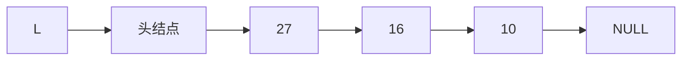

**本节核心**：头插法、尾插法的核心都是**初始化操作** + **指定结点的后插操作**；尾插法要注意设置指向表尾结点的指针 `r`；头插法的重要应用是**链表的逆置**。

### 2.3.3 双链表

**单链表 V.S. 双链表**：

| | 单链表 | 双链表 |
| --- | --- | --- |
| 检索方向 | **无法逆向检索**，有时不方便 | **可进可退**（有前驱、后继两个指针） |
| 存储密度 | 高（每结点 1 个指针） | 更低（每结点 2 个指针，`prior` + `next`） |

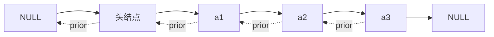

**结点定义**：

```c
typedef struct DNode{          // 定义双链表结点类型
    ElemType data;             // 数据域
    struct DNode *prior, *next;// 前驱和后继指针
}DNode, *DLinklist;
```

> `DLinklist` 等价于 `DNode *`。

#### 1. 双链表的初始化（带头结点）

```c
bool InitDLinkList(DLinklist &L){
    L = (DNode *) malloc(sizeof(DNode));   // 分配一个头结点
    if(L == NULL) return false;            // 内存不足，分配失败
    L->prior = NULL;                       // 头结点的 prior 永远指向 NULL
    L->next = NULL;                        // 头结点之后暂时还没有结点
    return true;
}

// 判断双链表是否为空（带头结点）
bool Empty(DLinklist L){
    if(L->next == NULL) return true;
    else return false;
}
```

#### 2. 双链表的插入（后插）

在 `p` 结点之后插入 `s` 结点：

```c
bool InsertNextDNode(DNode *p, DNode *s){
    if(p == NULL || s == NULL) return false;   // 非法参数
    s->next = p->next;                         // ①
    if(p->next != NULL)                        // ② 如果 p 结点有后继结点
        p->next->prior = s;
    s->prior = p;                              // ③
    p->next = s;                               // ④
    return true;
}
```

> **要点**：修改指针时**要注意顺序**（①②必须在③④之前，否则会丢失后继结点的地址）；
> **边界情况**：若 `p` 是最后一个结点，则 `p->next == NULL`，此时 `p->next->prior` 会空指针异常，必须加 `if` 判断。
>
> 用"后插操作"可以实现**按位序插入**和**前插操作**。

#### 3. 双链表的删除（后删）

删除 `p` 结点的后继结点 `q`：

```c
bool DeleteNextDNode(DNode *p){
    if(p == NULL) return false;
    DNode *q = p->next;                        // 找到 p 的后继结点 q
    if(q == NULL) return false;                // p 没有后继
    p->next = q->next;
    if(q->next != NULL)                        // q 结点不是最后一个结点
        q->next->prior = p;
    free(q);                                   // 释放结点空间
    return true;
}

// 销毁双链表
void DestroyList(DLinklist &L){
    while(L->next != NULL)                     // 循环释放各个数据结点
        DeleteNextDNode(L);
    free(L);                                   // 释放头结点
    L = NULL;                                  // 头指针指向 NULL
}
```

> **边界情况**：若被删除结点是最后一个数据结点，则 `q->next == NULL`，需特殊处理。

#### 4. 双链表的遍历

| 遍历方式 | 代码骨架 |
| --- | --- |
| 后向遍历 | `while(p != NULL){ 处理 p; p = p->next; }` |
| 前向遍历 | `while(p != NULL){ 处理 p; p = p->prior; }` |
| 前向遍历（跳过头结点） | `while(p->prior != NULL){ 处理 p; p = p->prior; }` |

> 双链表**不可随机存取**，按位查找、按值查找都只能用**遍历**的方式实现，时间复杂度 $O(n)$。

**本节考点**：初始化（头结点的 `prior`、`next` 都指向 NULL）→ 插入（后插，注意指针修改顺序与"插在最后"的边界）→ 删除（后删，注意"删的是最后一个数据结点"的边界）→ 遍历（循环终止条件）。

### 2.3.4 循环链表

循环链表分两种：**循环单链表**、**循环双链表**。

#### 1. 循环单链表

**定义**：与单链表的区别在于，**表尾结点的 `next` 指针指向头结点**（而不是 NULL）。

| 对比项 | 普通单链表 | 循环单链表 |
| --- | --- | --- |
| 表尾结点的 `next` | `NULL` | 指向**头结点** `L` |
| 判空条件 | `L == NULL`（不带头） / `L->next == NULL`（带头） | `L->next == L` |
| 判断 p 是否表尾 | `p->next == NULL` | `p->next == L` |

```c
// 初始化一个循环单链表
bool InitList(LinkList &L){
    L = (LNode *) malloc(sizeof(LNode));   // 分配一个头结点
    if(L == NULL) return false;            // 内存不足，分配失败
    L->next = L;                           // 头结点 next 指向头结点
    return true;
}

// 判断循环单链表是否为空
bool Empty(LinkList L){
    if(L->next == L) return true;
    else return false;
}

// 判断结点 p 是否为循环单链表的表尾结点
bool isTail(LinkList L, LNode *p){
    if(p->next == L) return true;
    else return false;
}
```

**重要性质**：

- **普通单链表**：从某个结点出发，**只能找到该结点之后的结点**（无法回到前面的结点）。
- **循环单链表**：从**任意一个结点**出发，都可以找到表中的**其他任何结点**（因为表尾又绕回了表头）。

**灵活应用**：若让头指针 `L` 指向**表尾元素**：
- 找表头：`L->next` —— $O(1)$；
- 找表尾：`L` 本身 —— $O(1)$。

> 因为循环链表中表头、表尾仅一步之遥，所以对表头、表尾的操作都很方便（代价是插入/删除时可能需要修改 `L`）。

#### 2. 循环双链表

**定义**：表头结点的 `prior` 指向**表尾结点**，表尾结点的 `next` 指向**头结点**。

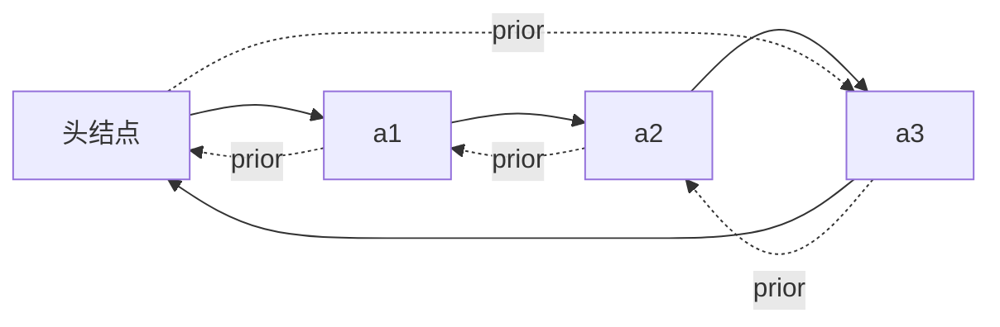

```c
// 初始化空的循环双链表
bool InitDLinkList(DLinklist &L){
    L = (DNode *) malloc(sizeof(DNode));   // 分配一个头结点
    if(L == NULL) return false;            // 内存不足，分配失败
    L->prior = L;                          // 头结点的 prior 指向头结点
    L->next = L;                           // 头结点的 next 指向头结点
    return true;
}

// 判断循环双链表是否为空
bool Empty(DLinklist L){
    if(L->next == L) return true;
    else return false;
}

// 判断结点 p 是否为循环双链表的表尾结点
bool isTail(DLinklist L, DNode *p){
    if(p->next == L) return true;
    else return false;
}
```

**循环双链表的插入（后插）** —— 因为 `p->next` **永远不为 NULL**，所以**不需要**判断边界：

```c
bool InsertNextDNode(DNode *p, DNode *s){
    s->next = p->next;
    p->next->prior = s;        // 循环双链表中 p->next 一定非空，可直接写
    s->prior = p;
    p->next = s;
    return true;
}
```

**循环双链表的删除（后删）** —— 同理，`q->next` 也一定非空：

```c
bool DeleteNextDNode(DNode *p){
    DNode *q = p->next;
    p->next = q->next;
    q->next->prior = p;        // 无需判断 q->next 是否为空
    free(q);
    return true;
}
```

> **对比**：普通双链表的插入/删除要判断 `p->next != NULL`、`q->next != NULL`（处理"插在/删在最后一个结点"的边界）；**循环双链表因为有"环"，这些判断都可以省掉**，代码更简洁。

#### 3. 循环链表要解决的代码问题

1. **如何判空** —— 看 `L->next` 是否等于 `L`；
2. **如何判断结点 p 是表尾/表头结点** —— 表尾：`p->next == L`；表头：`p == L`（带头结点时）；这是**后向/前向遍历的实现核心**；
3. **如何在表头、表中、表尾插入/删除一个结点** —— 这是插入、删除操作的**不易错思路**（先想清楚是"改前驱的 next"还是"改后继的 prior"）。

### 2.3.5 静态链表

**什么是静态链表**：用**数组**的方式实现的链表 —— 分配一整片**连续的内存空间**，各个结点**集中安置**。

- 数组的每个元素由两部分组成：**数据元素** + **游标**（下一个结点的数组下标，充当"指针"）；
- 用 `0` 号结点充当**头结点**；
- 游标为 **-1** 表示已到达**表尾**（相当于 NULL）；空闲结点的游标设为特殊值 **-2**。

> 例：每个数据元素 4B、每个游标 4B（每个结点共 8B），则 `e₁` 的存放地址 = `addr + 8 × 2`。

**用代码定义一个静态链表**：

```c
#define MaxSize 10              // 静态链表的最大长度
typedef struct {
    ElemType data;              // 存储数据元素
    int next;                   // 下一个元素的数组下标
} SLinkList[MaxSize];           // 等价于声明一个长度为 MaxSize 的 Node 型数组
```

```c
// 等价写法
struct Node{
    ElemType data;
    int next;
};
typedef struct Node SLinkList[MaxSize];
```

> `SLinkList b;` 相当于定义了一个长度为 `MaxSize` 的 Node 型数组；
> 验证：`sizeof(x)=8`、`sizeof(a)=80`、`sizeof(b)=80`（`MaxSize=10`）。

**静态链表的数组示意**（`MaxSize = 10`）：

| 下标 | 0 | 1 | 2 | 3 | 4 | 5 | 6 | 7 | 8 | 9 |
| --- | --- | --- | --- | --- | --- | --- | --- | --- | --- | --- |
| **data** | 头 | $e_2$ | $e_1$ | $e_4$ | 空 | 空 | $e_3$ | 空 | 空 | 空 |
| **next** | 2 | 6 | 1 | -1 | -2 | -2 | 3 | -2 | -2 | -2 |

对应的逻辑链：

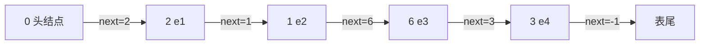

> 注意：静态链表中，**逻辑上相邻的元素在物理上不一定相邻**（由 `next` 游标串起来），这一点与单链表相同。

**简述基本操作的实现**：

| 操作 | 做法 |
| --- | --- |
| **初始化** | 把 `a[0]` 的 `next` 设为 -1；其他结点的 `next` 设为特殊值（如 -2）表示空闲 |
| **查找** | 从头结点出发**挨个往后遍历**结点 |
| **插入**（位序为 i） | ① 找到一个**空的结点**存入数据元素；② 从头结点出发找到位序为 **i-1** 的结点；③ 修改新结点的 `next`；④ 修改 i-1 号结点的 `next` |
| **删除** | ① 从头结点出发找到**前驱结点**；② 修改前驱结点的游标；③ 被删除结点的 `next` 设为 -2 |

> **如何判断结点是否为空**：可以让 `next` 为某个特殊值，如 -2。

**优缺点与适用场景**：

| | 说明 |
| --- | --- |
| **优点** | 增、删操作**不需要大量移动元素**（不像顺序表） |
| **缺点** | **不能随机存取**，只能从头结点开始依次往后查找；**容量固定不可变** |
| **适用场景** | ① **不支持指针**的低级语言；② **数据元素数量固定不变**的场景（如操作系统的**文件分配表 FAT**） |

### 2.3.6 顺序表和链表的比较

从三个维度（Round 1~3）对比，最后回答"到底该用谁"。

#### Round 1：逻辑结构

**都属于线性表，都是线性结构**。

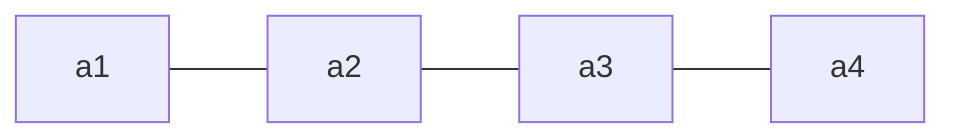

#### Round 2：存储结构

| | 顺序表（顺序存储） | 链表（链式存储） |
| --- | --- | --- |
| **优点** | 支持**随机存取**、**存储密度高** | **离散的小空间**分配方便，**改变容量方便** |
| **缺点** | **大片连续空间**分配不方便，**改变容量不方便** | **不可随机存取**，**存储密度低** |

#### Round 3：基本操作（按"创销、增删改查"复习）

**① 创（初始化）**：

| | 顺序表 | 链表 |
| --- | --- | --- |
| 做法 | 需要**预分配大片连续空间**。分配过小 → 之后不便拓展；分配过大 → 浪费内存 | 只需分配**一个头结点**（也可不要头结点，只声明一个头指针），之后**方便拓展** |
| 静态分配 | 静态数组 → 容量**不可改变** | — |
| 动态分配 | 动态数组（`malloc`、`free`）→ 容量可改变，但**需要移动大量元素，时间代价高** | — |

**② 销（销毁）**：

| | 顺序表 | 链表 |
| --- | --- | --- |
| 做法 | 修改 `Length = 0` | 依次删除各个结点（`free`） |
| 空间回收 | 静态分配由**系统自动回收**；动态分配需**手动 `free`** | 需手动 `free` |

> **注意**：`malloc` 和 `free` **必须成对出现**。

**③ 增、删**：

| | 顺序表 | 链表 |
| --- | --- | --- |
| 做法 | 插入/删除元素要将**后续元素都后移/前移** | 插入/删除元素**只需修改指针** |
| 时间复杂度 | $O(n)$，时间开销**主要来自移动元素** | $O(n)$，时间开销**主要来自查找目标元素** |
| 数据元素很大时 | **移动的时间代价很高** | **查找元素的时间代价更低** |

**④ 查**：

| | 顺序表 | 链表 |
| --- | --- | --- |
| 按位查找 | $O(1)$ | $O(n)$ |
| 按值查找 | $O(n)$；**若表内元素有序，可在 $O(\log_2 n)$ 内找到** | $O(n)$ |

#### 到底该用顺序表还是链表？

| | 顺序表 | 链表 |
| --- | --- | --- |
| **弹性（可扩容）** | 差 | 好 |
| **增、删** | 差 | 好 |
| **查** | 好 | 差 |

**选择依据**：

- **表长难以预估、经常要增加/删除元素** —— 用**链表**；
- **表长可预估、查询（搜索）操作较多** —— 用**顺序表**。

#### 开放式问题的答题思路（重要考点）

> **问题**：实现线性表时，用顺序表还是链表好？（请描述顺序表和链表的……）

**答题框架**：

1. 顺序表和链表的**逻辑结构都是线性结构**，都属于**线性表**；
2. 但二者的**存储结构不同**：顺序表采用**顺序存储**……（特点 → 带来的优缺点）；链表采用**链式存储**……（特点 → 导致的优缺点）；
3. 由于采用不同的存储方式实现，因此**基本操作的实现效率也不同**：当**初始化**时……；当**插入**一个数据元素时……；当**删除**一个数据元素时……；当**查找**一个数据元素时……。

### 小结

1. **线性表**：相同数据类型的 $n$（$n\ge0$）个数据元素的有限序列；位序从 1 开始，数组下标从 0 开始。
2. **基本操作**：创销、增删改查（`InitList` / `DestroyList` / `ListInsert` / `ListDelete` / `LocateElem` / `GetElem` / `Length` / `PrintList` / `Empty`）；需要"把修改带回来"时参数要加 `&`。
3. **顺序表**：顺序存储，随机访问 $O(1)$、存储密度高；插删平均 $O(n)$（移动元素）；静态分配容量固定，动态分配扩容 $O(n)$。
4. **单链表**：链式存储，不要求连续空间；按位/按值查找、按位插入删除平均都是 $O(n)$（依次扫描）；**带头结点**写代码更方便。
5. **单链表的建立**：尾插法（要设**表尾指针** `r`，$O(n)$）、头插法（**逆序**，可用于**链表逆置**）；核心是"初始化 + 后插操作"。
6. **双链表**：可进可退（`prior` + `next`），但存储密度更低；插入/删除要注意**指针修改顺序**与"操作最后一个结点"的边界。
7. **循环链表**：循环单链表表尾 `next` 指向头结点（判空 `L->next == L`）；循环双链表头尾相接，插入/删除**无需判空边界**，代码更简洁。
8. **静态链表**：用数组实现的链表（`data` + `next` 游标），0 号为头结点、游标 -1 为表尾；适合不支持指针的语言、元素数量固定的场景（如 FAT）。
9. **顺序表 V.S. 链表**：逻辑结构相同（都是线性表）；存储结构不同 → 弹性/增删/查的优劣不同；**表长难估、频繁增删用链表；表长可估、查询多用顺序表**。

---

## 第三章 栈、队列和数组

| 考点 | 重要程度 | 占分 | 常见题型 |
| --- | --- | --- | --- |
| 栈的定义与基本操作（LIFO） | ★★★ | 2~4 分 | 选择 |
| 栈的顺序存储（`top` 指针、共享栈） | ★★★ | 2~4 分 | 选择、代码 |
| 栈的链式存储 | ★★ | 2 分 | 选择 |
| 队列的定义与基本操作（FIFO） | ★★★ | 2~4 分 | 选择 |
| 循环队列（判空/判满、元素个数） | ★★★★ | 2~5 分 | 选择、计算 |
| 双端队列（输入/输出受限） | ★★ | 2~4 分 | 选择 |
| 栈的应用（括号匹配、表达式求值、递归） | ★★★★ | 4~6 分 | 综合、选择 |
| 特殊矩阵的压缩存储（对称、三角、三对角、稀疏） | ★★★ | 2~4 分 | 选择、计算 |

---

### 3.1.1 栈的基本概念

**定义**：**栈（Stack）是只允许在一端进行插入或删除操作的线性表**。

> 与普通线性表相比：
> - **逻辑结构**：与普通线性表**相同**；
> - **数据的运算**：插入、删除操作**有区别**（只能在栈顶进行）。

**重要术语**：

| 术语 | 含义 |
| --- | --- |
| **栈顶（Top）** | **允许插入和删除**的一端 |
| **栈底（Bottom）** | **不允许插入和删除**的一端 |
| **空栈** | 不含任何元素的栈 |

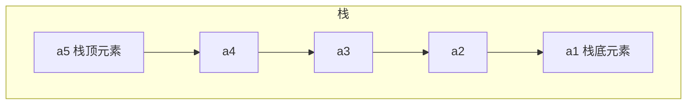

- **进栈顺序**：$a_1 \to a_2 \to a_3 \to a_4 \to a_5$
- **出栈顺序**：$a_5 \to a_4 \to a_3 \to a_2 \to a_1$
- **特点**：**后进先出**（Last In First Out，**LIFO**）

> 生活类比：一摞盘子（后放的先取）、烤串（后穿的先吃）。

**栈的基本操作**：

| 操作 | 功能 | 归类 |
| --- | --- | --- |
| `InitStack(&S)` | 初始化栈。构造一个空栈 S，分配内存空间 | 创 |
| `DestroyStack(&S)` | 销毁栈。销毁并释放栈 S 所占用的内存空间 | 销 |
| `Push(&S, x)` | **进栈**。若栈 S 未满，则将 x 加入使之成为**新栈顶** | 增 |
| `Pop(&S, &x)` | **出栈**。若栈 S 非空，则弹出栈顶元素，并用 x 返回 | 删 |
| `GetTop(S, &x)` | **读栈顶元素**。若栈 S 非空，则用 x 返回栈顶元素 | 查 |
| `StackEmpty(S)` | 判断一个栈 S 是否为空。若 S 为空返回 true，否则 false | 判空 |

> **要点**：
> - `Push` / `Pop` 会**删除**栈顶元素；`GetTop` **不删除**栈顶元素；
> - **查**：栈的使用场景中**大多只访问栈顶元素**；
> - **增、删只能在栈顶操作**。

#### 栈的常考题型

**问题**：进栈顺序为 $a \to b \to c \to d \to e$，有哪些合法的出栈顺序？

**结论**：$n$ 个不同元素进栈，出栈元素不同排列的个数为

$$\frac{1}{n+1}C_{2n}^{n}$$

上述公式称为**卡特兰（Catalan）数**，可采用数学归纳法证明（**不要求掌握**）。

例：$n=5$ 时

$$\frac{1}{5+1}C_{10}^{5}=\frac{10\times9\times8\times7\times6}{6\times5\times4\times3\times2\times1}=42$$

> 即 $a\to b\to c\to d\to e$ 进栈时，合法的出栈顺序共有 **42** 种。

**本节考点**：定义（操作受限的线性表，只能在栈顶插入/删除）→ 特性（**后进先出 LIFO**）→ 术语（栈顶、栈底、空栈）→ 基本操作（创销、增删、查、判空）。

### 3.1.2 栈的顺序存储实现

**顺序栈**：用**顺序存储**方式实现的栈 —— 用**静态数组**实现，并需要记录**栈顶指针**。

```c
#define MaxSize 10              // 定义栈中元素的最大个数
typedef struct{
    ElemType data[MaxSize];     // 静态数组存放栈中元素
    int top;                    // 栈顶指针
} SqStack;
```

> `Sq` = sequence（顺序）；顺序存储给各数据元素分配**连续**的存储空间，大小为 `MaxSize * sizeof(ElemType)`。

#### 1. 初始化操作

```c
void InitStack(SqStack &S){
    S.top = -1;                 // 初始化栈顶指针
}

bool StackEmpty(SqStack S){     // 判断栈空
    if(S.top == -1) return true;    // 栈空
    else return false;
}
```

> `top = -1` 时栈为空（此时 `top` 指向**栈顶元素**）。

#### 2. 进栈操作（Push）

```c
bool Push(SqStack &S, ElemType x){
    if(S.top == MaxSize - 1) return false;   // 栈满，报错
    S.top = S.top + 1;                       // 指针先加 1
    S.data[S.top] = x;                       // 新元素入栈
    return true;
}
```

> 上面两行**等价于** `S.data[++S.top] = x;`
> **错误写法**（指针与赋值顺序颠倒）：
> `S.data[S.top] = x;  S.top = S.top + 1;` 或 `S.data[S.top++] = x;`

#### 3. 出栈操作（Pop）

```c
bool Pop(SqStack &S, ElemType &x){
    if(S.top == -1) return false;   // 栈空，报错
    x = S.data[S.top];              // 栈顶元素先出栈
    S.top = S.top - 1;              // 指针再减 1
    return true;
}
```

> 上面两行**等价于** `x = S.data[S.top--];`
> **错误写法**：`S.top = S.top - 1;  x = S.data[S.top];` 或 `x = S.data[--S.top];`
> **注意**：出栈后数据**仍残留在内存**中，只是**逻辑上**被删除了。

#### 4. 读栈顶元素（GetTop）

```c
bool GetTop(SqStack S, ElemType &x){
    if(S.top == -1) return false;   // 栈空，报错
    x = S.data[S.top];              // x 记录栈顶元素
    return true;
}
```

> 与 `Pop` 的**唯一区别**：`Pop` 有 `S.top = S.top - 1`（先出栈、指针再减 1），`GetTop` **不移动指针**。

#### 5. 另一种方式（`top` 指向"下一个可插入位置"）

| 操作 | `top` 初始为 **-1**（指向栈顶元素） | `top` 初始为 **0**（指向下一个可插入位置） |
| --- | --- | --- |
| 初始化 | `S.top = -1` | `S.top = 0` |
| 进栈 | `S.data[++S.top] = x` | `S.data[S.top++] = x` |
| 出栈 | `x = S.data[S.top--]` | `x = S.data[--S.top]` |
| 读栈顶 | `x = S.data[S.top]` | `x = S.data[S.top - 1]` |
| **判空** | `S.top == -1` | `S.top == 0` |
| **判满** | `S.top == MaxSize - 1` | `S.top == MaxSize` |

> **顺序栈的缺点**：**栈的大小不可变**（静态数组）。
> **审题提醒**：做题前先看清题目用的是哪种实现方式。

#### 6. 共享栈

**两个栈共享同一片内存空间**，两个栈**从两边往中间增长**。

```c
#define MaxSize 10
typedef struct{
    ElemType data[MaxSize];     // 静态数组存放栈中元素
    int top0;                   // 0 号栈栈顶指针
    int top1;                   // 1 号栈栈顶指针
} ShStack;

void InitStack(ShStack &S){
    S.top0 = -1;                // 0 号栈从左边开始增长
    S.top1 = MaxSize;           // 1 号栈从右边开始增长
}
```

> **栈满的条件**：`top0 + 1 == top1`（两个栈顶指针相遇）。
> 好处：更充分地利用存储空间（只有在整片空间都被占满时才溢出）。

#### 小结

- 顺序栈的基本操作（创、增、删、查）都是 **$O(1)$** 时间复杂度；
- 两种实现方式（`top` 初值 -1 / 0）的**判空、判满、指针移动方式都不同**，要看清题目；
- **共享栈**：两个栈从两端往中间增长，栈满条件 `top0 + 1 == top1`；
- 顺序栈的**缺点**是容量固定不可变。

### 3.1.3 栈的链式存储实现

**链栈**：用**链式存储**方式实现的栈。

```c
typedef struct Linknode{
    ElemType data;              // 数据域
    struct Linknode *next;      // 指针域
} *LiStack;                     // 栈类型定义
```

**核心思想**：**进栈 / 出栈都只能在栈顶一端进行**，因此把**链头作为栈顶**：

| 链栈操作 | 对应单链表操作 |
| --- | --- |
| **进栈** | 对**头结点**的**后插**操作（头插法建立单链表） |
| **出栈** | 对**头结点**的**后删**操作 |

**两种实现方式**：

| | 带头结点 | 不带头结点（**推荐**） |
| --- | --- | --- |
| 初始化 | `S -> 头结点 -> NULL` | `S -> NULL` |

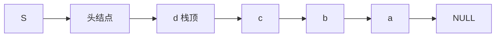

> **注意**：链栈**一般不会满**（除非内存耗尽），因此通常**不需要判满**，只需判空（`S == NULL` 或 `S->next == NULL`）。

**本节要点**：链栈的**进栈、出栈都在链头进行**；本质就是"头插法建立单链表"+"对头结点的后删"，建议**动手写一遍**初始化、进栈、出栈、读栈顶、判空的代码。

### 3.2.1 队列的基本概念

**定义**：**队列（Queue）是只允许在一端进行插入，在另一端删除的线性表**。

> 与栈对比：栈是"只允许在一端进行插入或删除"，队列是"一端插入、另一端删除"。

**重要术语**：

| 术语 | 含义 |
| --- | --- |
| **队头（Front）** | **允许删除**的一端 |
| **队尾（Rear）** | **允许插入**的一端 |
| **空队列** | 不含任何元素的队列 |

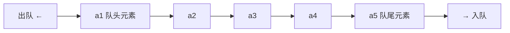

- **入队**（EnQueue）：在**队尾**插入元素；
- **出队**（DeQueue）：在**队头**删除元素；
- **特点**：**先进先出**（First In First Out，**FIFO**）。

> 生活类比：排队打饭、收费站排队 —— 先进入队列的元素先出队。

**队列的基本操作**：

| 操作 | 功能 | 归类 |
| --- | --- | --- |
| `InitQueue(&Q)` | 初始化队列。构造一个空队列 Q | 创 |
| `DestroyQueue(&Q)` | 销毁队列。销毁并释放队列 Q 所占用的内存空间 | 销 |
| `EnQueue(&Q, x)` | **入队**。若队列 Q 未满，将 x 加入，使之成为**新的队尾** | 增 |
| `DeQueue(&Q, &x)` | **出队**。若队列 Q 非空，删除**队头**元素，并用 x 返回 | 删 |
| `GetHead(Q, &x)` | **读队头元素**。若队列 Q 非空，则将队头元素赋值给 x | 查 |
| `QueueEmpty(Q)` | 判队列空。若队列 Q 为空返回 true，否则 false | 判空 |

> **要点**：
> - `EnQueue` / `DeQueue` 会**删除**队头元素；`GetHead` **不删除**队头元素；
> - **查**：队列的使用场景中**大多只访问队头元素**；
> - 增、删**只能在规定的一端进行**（队尾插入、队头删除）。

**本节考点**：定义（只能在**队尾插入、队头删除**的操作受限线性表）→ 特性（**先进先出 FIFO**）→ 术语（队头、队尾、空队列、队头元素、队尾元素）→ 基本操作（创销、增删、查、判空）。

### 3.2.2 队列的顺序实现

```c
#define MaxSize 10              // 定义队列中元素的最大个数
typedef struct{
    ElemType data[MaxSize];     // 用静态数组存放队列元素
    int front, rear;            // 队头指针和队尾指针
} SqQueue;
```

> **指针指向约定**（本节默认）：`front` 指向**队头元素**；`rear` 指向**队尾元素的后一个位置**（即**下一个应该插入的位置**）。

#### 1. 初始化操作

```c
void InitQueue(SqQueue &Q){
    Q.rear = Q.front = 0;       // 初始时，队头、队尾指针指向 0
}

bool QueueEmpty(SqQueue Q){
    if(Q.rear == Q.front) return true;   // 队空条件
    else return false;
}
```

#### 2. 入队操作（EnQueue）

**朴素做法**（`rear == MaxSize` 判断队满 —— **错误**，会造成"假溢出"）：

```c
Q.data[Q.rear] = x;             // 将 x 插入队尾
Q.rear = Q.rear + 1;            // 队尾指针后移
```

**循环队列做法**（用**取模运算**）：

```c
bool EnQueue(SqQueue &Q, ElemType x){
    if((Q.rear + 1) % MaxSize == Q.front) return false;   // 队满则报错
    Q.data[Q.rear] = x;                                   // 新元素插入队尾
    Q.rear = (Q.rear + 1) % MaxSize;                      // 队尾指针加 1 取模
    return true;
}
```

> **模运算**：将无限的整数域映射到有限的整数集合 $\{0,1,2,\dots,MaxSize-1\}$ 上，把存储空间在**逻辑上变成了"环状"**（循环队列）。
> 跨考 Tips：取模运算即取余运算，两个整数 $a,b$，`a % b` == $a$ 除以 $b$ 的余数；《数论》中通常表示为 $a \bmod b$。

#### 3. 出队操作（DeQueue）

```c
bool DeQueue(SqQueue &Q, ElemType &x){
    if(Q.rear == Q.front) return false;   // 队空则报错
    x = Q.data[Q.front];
    Q.front = (Q.front + 1) % MaxSize;    // 队头指针后移
    return true;
}

// 获得队头元素的值，用 x 返回
bool GetHead(SqQueue Q, ElemType &x){
    if(Q.rear == Q.front) return false;   // 队空则报错
    x = Q.data[Q.front];
    return true;
}
```

> **只能让队头元素出队**。

#### 4. 循环队列：判断队满 / 队空（三种方案）

**问题**：`Q.rear == Q.front` 既可能是**队空**，也可能是**队满**，需要区分。

**方案一：牺牲一个存储单元**（默认方案）

| 判断 | 条件 |
| --- | --- |
| **队空** | `Q.rear == Q.front` |
| **队满** | `(Q.rear + 1) % MaxSize == Q.front`（队尾指针的**再下一个位置**是队头） |
| **队列元素个数** | `(rear + MaxSize - front) % MaxSize` |

> 代价：牺牲一个存储单元（`MaxSize=10` 的数组最多只能存 **9** 个元素）。

**方案二：增加 `size` 变量记录队列长度**

```c
typedef struct{
    ElemType data[MaxSize];
    int front, rear;
    int size;                   // 队列当前长度
} SqQueue;
```

- 插入成功 `size++`；删除成功 `size--`；
- **队列元素个数 = `size`**；
- **队空**：`size == 0`；**队满**：`size == MaxSize`。

**方案三：增加 `tag` 变量标记最近一次操作**

```c
typedef struct{
    ElemType data[MaxSize];
    int front, rear;
    int tag;                    // 最近进行的是删除(0) / 插入(1)
} SqQueue;
```

- **只有删除操作**才可能导致队空；**只有插入操作**才可能导致队满；
- 每次**删除**成功令 `tag = 0`；每次**插入**成功令 `tag = 1`；
- **队空**：`front == rear && tag == 0`；
- **队满**：`front == rear && tag == 1`。

#### 5. 其他出题方法：`rear` 指向队尾元素

若约定 **`rear` 指向队尾元素**（而非后一个位置）：

| 操作 | 写法 |
| --- | --- |
| 入队 | `Q.rear = (Q.rear + 1) % MaxSize;  Q.data[Q.rear] = x;`（**先移动指针再存**） |
| 出队 | `x = Q.data[Q.front];  Q.front = (Q.front + 1) % MaxSize;` |
| **判空** | `(Q.rear + 1) % MaxSize == Q.front` |
| **判满** | **不能**用 `(Q.rear+1)%MaxSize == Q.front`（与判空冲突），需另想办法 |

> **判满的替代方案**：① **牺牲一个存储单元**；② **增加辅助变量**（`size` 或 `tag`）。

**解题套路**：遇到队列的题，先确定两件事 ——
1. **`front`、`rear` 指针的指向**：① `rear` 指向队尾元素**后一个位置**；② `rear` 指向**队尾元素**；
2. **判空/判满的方法**：a. 牺牲一个存储单元；b. 增加 `size` 变量；c. 增加 `tag` 标记。

组合起来（①a、①b、①c、②a、②b、②c）就是各种考题。

### 3.2.3 队列的链式实现

**链队列**：用**链式存储**方式实现的队列。

```c
typedef struct LinkNode{        // 链式队列结点
    ElemType data;
    struct LinkNode *next;
} LinkNode;

typedef struct{                 // 链式队列
    LinkNode *front, *rear;     // 队列的队头和队尾指针
} LinkQueue;
```

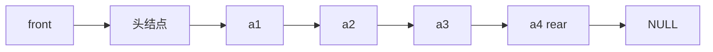

#### 1. 初始化

| | 带头结点 | 不带头结点 |
| --- | --- | --- |
| 代码 | `Q.front = Q.rear = (LinkNode*)malloc(sizeof(LinkNode));`<br>`Q.front->next = NULL;` | `Q.front = NULL;`<br>`Q.rear = NULL;` |
| **判空** | `Q.front == Q.rear` | `Q.front == NULL` |

#### 2. 入队（EnQueue）

**带头结点**（代码统一，无需特判）：

```c
void EnQueue(LinkQueue &Q, ElemType x){
    LinkNode *s = (LinkNode *)malloc(sizeof(LinkNode));
    s->data = x;
    s->next = NULL;
    Q.rear->next = s;           // 新结点插入到 rear 之后
    Q.rear = s;                 // 修改表尾指针
}
```

**不带头结点**（**第一个元素入队需特别处理**）：

```c
void EnQueue(LinkQueue &Q, ElemType x){
    LinkNode *s = (LinkNode *)malloc(sizeof(LinkNode));
    s->data = x;
    s->next = NULL;
    if(Q.front == NULL){        // 在空队列中插入第一个元素
        Q.front = s;            // 修改队头、队尾指针
        Q.rear = s;
    } else {
        Q.rear->next = s;       // 新结点插入到 rear 结点之后
        Q.rear = s;             // 修改 rear 指针
    }
}
```

#### 3. 出队（DeQueue）

**带头结点**：

```c
bool DeQueue(LinkQueue &Q, ElemType &x){
    if(Q.front == Q.rear) return false;   // 空队
    LinkNode *p = Q.front->next;
    x = p->data;                          // 用变量 x 返回队头元素
    Q.front->next = p->next;              // 修改头结点的 next 指针
    if(Q.rear == p)                       // 此次是最后一个结点出队
        Q.rear = Q.front;                 // 修改 rear 指针
    free(p);                              // 释放结点空间
    return true;
}
```

**不带头结点**（**最后一个元素出队需特别处理**）：

```c
bool DeQueue(LinkQueue &Q, ElemType &x){
    if(Q.front == NULL) return false;     // 空队
    LinkNode *p = Q.front;                // p 指向此次出队的结点
    x = p->data;                          // 用变量 x 返回队头元素
    Q.front = p->next;                    // 修改 front 指针
    if(Q.rear == p){                      // 此次是最后一个结点出队
        Q.front = NULL;                   // front 指向 NULL
        Q.rear = NULL;                    // rear 指向 NULL
    }
    free(p);                              // 释放结点空间
    return true;
}
```

#### 4. 队列满的条件

| 存储方式 | 队满条件 |
| --- | --- |
| **顺序存储** | **预分配的空间耗尽**时队满 |
| **链式存储** | **一般不会队满**（除非内存不足）→ **不存在"判满"** |

**本节考点**：链队列的初始化（带头/不带头）→ 入队（不带头时**第一个元素**要特判）→ 出队（不带头时**最后一个元素**要特判）→ 判空 → **判满不存在**。

### 3.2.4 双端队列

**三种"操作受限的线性表"对比**：

| 结构 | 插入 | 删除 |
| --- | --- | --- |
| **栈** | 只能从**一端** | 只能从**同一端** |
| **队列** | 只能从**一端** | 只能从**另一端** |
| **双端队列（Deque）** | 允许从**两端** | 允许从**两端** |

> **双端队列（Deque）**：只允许从**两端插入、两端删除**的线性表。
> 若只使用其中一端的插入、删除操作，则效果**等同于栈**。

**两种受限变种**：

| 变种 | 插入 | 删除 |
| --- | --- | --- |
| **输入受限**的双端队列 | 只允许从**一端**插入 | 允许从**两端**删除 |
| **输出受限**的双端队列 | 允许从**两端**插入 | 只允许从**一端**删除 |

#### 考点：判断输出序列合法性

**问题**：数据元素输入序列为 $1,2,3,4$，则哪些输出序列是合法的？

全部排列共 $A_4^4 = 4! = 24$ 种。

**① 栈**（只能一端插入、同一端删除）：

合法的输出序列有 **14** 种 —— 即卡特兰数

$$\frac{1}{n+1}C_{2n}^{n}=\frac{1}{4+1}C_{8}^{4}=14$$

**非法的 10 种**为：

| | | |
| --- | --- | --- |
| 3,1,2,4 | 3,1,4,2 | 4,1,2,3 |
| 4,1,3,2 | 4,2,1,3 | 4,2,3,1 |
| 4,3,1,2 | 1,4,2,3 | 2,4,1,3 |
| 3,4,1,2 | | |

**② 输入受限的双端队列**：**非法的 5 种**为

| | |
| --- | --- |
| 3,1,2,4 | 3,1,4,2 |
| 4,2,1,3 | 4,2,3,1 |
| 1,4,2,3 | |

**③ 输出受限的双端队列**：**非法的 5 种**为

| | |
| --- | --- |
| 3,1,2,4 | 3,1,4,2 |
| 4,1,3,2 | 4,2,3,1 |
| 1,4,2,3 | |

> **重要结论**：**在栈中合法的输出序列，在双端队列中必定合法**（因为栈是双端队列的一种特例 —— 两端都只使用同一端）。
> 所以双端队列合法的序列数 **≥** 栈合法的序列数（本例中：栈 14 种，两种受限双端队列各 19 种）。

**本节考点**：三种结构的定义辨析 → 输出序列合法性的判断 → "栈合法 ⇒ 双端队列必合法"。
> 回忆：栈的变种是**共享栈**（两栈共享一片空间，从两端向中间增长）。

### 3.3.1 栈在括号匹配中的应用

**问题**：编译器中，括号不匹配会报错（如 `int x = 10*(20*(1+1)-(3-2));`）。

**核心思路**：

- **最后出现的左括号最先被匹配**（**LIFO**）→ 可用**栈**实现该特性；
- 每出现一个**右括号**，就"**消耗**"一个左括号 → **出栈**。

即：**遇到左括号就入栈；遇到右括号，就"消耗"一个左括号**（弹出栈顶元素检查是否匹配）。

**三种匹配失败的情况**：

| 失败情况 | 说明 |
| --- | --- |
| ① **左括号单身** | 处理完所有括号后，**栈非空**（有左括号没被匹配） |
| ② **右括号单身** | 扫描到右括号时，**栈空**（没有左括号可消耗） |
| ③ **左右括号不匹配** | 弹出的栈顶左括号与当前右括号**类型不一致** |

**算法流程图**：

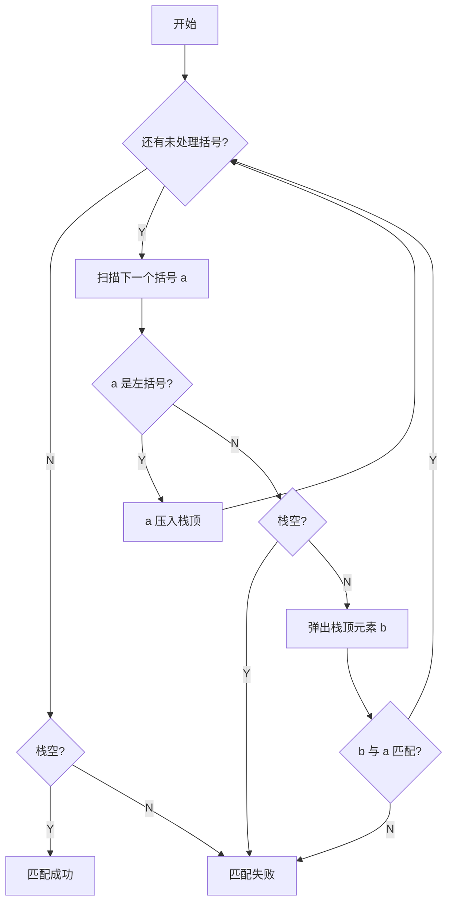

**算法实现**：

```c
bool bracketCheck(char str[], int length){
    SqStack S;
    InitStack(S);                       // 初始化一个栈
    for(int i = 0; i < length; i++){
        if(str[i] == '(' || str[i] == '[' || str[i] == '{'){
            Push(S, str[i]);            // 扫描到左括号，入栈
        } else {
            if(StackEmpty(S))           // 扫描到右括号，且当前栈空
                return false;           // 匹配失败
            char topElem;
            Pop(S, topElem);            // 栈顶元素出栈
            if(str[i] == ')' && topElem != '(') return false;
            if(str[i] == ']' && topElem != '[') return false;
            if(str[i] == '}' && topElem != '{') return false;
        }
    }
    return StackEmpty(S);               // 检索完全部括号后，栈空说明匹配成功
}
```

> **考试技巧**：考场上**可直接使用基本操作**（`InitStack` / `Push` / `Pop` / `StackEmpty`），但建议**简要说明接口**。
> **练习建议**：不要用基本操作，动手实现完整代码。

### 3.3.2 栈在表达式求值中的应用

#### 1. 三种算术表达式

中缀表达式由三部分组成：**操作数、运算符、界限符**（括号）。界限符必不可少，它反映了计算的先后顺序。

波兰数学家的灵感：**不用界限符也能无歧义地表达运算顺序** —— 这就是波兰表达式。

| 表达式 | 规则 | 例 |
| --- | --- | --- |
| **中缀表达式** | 运算符在两个操作数**中间** | `a+b`；`a+b-c`；`a+b-c*d` |
| **后缀表达式**（逆波兰式 Reverse Polish notation） | 运算符在两个操作数**后面** | `ab+`；`ab+c-`；`ab+cd*-` |
| **前缀表达式**（波兰式 Polish notation） | 运算符在两个操作数**前面** | `+ab`；`-+abc`；`-+ab*cd` |

> **关键结论**：一个中缀表达式可以对应**多个**后缀、前缀表达式；
> 但若规定"左优先"/"右优先"原则，则一个中缀表达式**只对应一个**后缀表达式（保证算法的**确定性**）。

#### 2. 中缀表达式转后缀表达式（手算）

**手算方法**：

1. 确定中缀表达式中**各个运算符的运算顺序**；
2. 选择下一个运算符，按照「**左操作数 右操作数 运算符**」的方式组合成一个新的操作数；
3. 如果还有运算符没被处理，就继续 ②。

**"左优先"原则**：只要**左边的运算符能先计算，就优先算左边的** —— 保证手算和机算结果相同。

**例**：`((15 ÷ (7 - (1 + 1))) × 3) - (2 + (1 + 1))`

$$\Rightarrow\ 15\ 7\ 1\ 1\ +\ -\ \div\ 3\ \times\ 2\ 1\ 1\ +\ +\ -$$

**例**：`A + B - C * D / E + F` → `AB + CD * E / - F +`

**例**（对比"左优先"与否）：`A + B * (C - D) - E / F`

| 原则 | 运算顺序 | 后缀表达式 |
| --- | --- | --- |
| **左优先**（推荐） | ③②①⑤④ | `ABCD - * + EF / -` |
| 非左优先 | ⑤③②④① | `ABCD - * EF / - +` |

> 客观来看两种都正确，但**机算结果是前者**（左优先）。

#### 3. 后缀表达式的计算

**手算方法**：**从左往右**扫描，每遇到一个运算符，就让运算符**前面最近的两个操作数**执行对应运算，**合体为一个操作数**。

> **注意**：两个操作数的**左右顺序**（左操作数 在左，右操作数 在右）。

**机算（用栈实现）**：

1. **从左往右**扫描下一个元素，直到处理完所有元素；
2. 若扫描到**操作数**则**压入栈**，并回到 ①；否则执行 ③；
3. 若扫描到**运算符**，则**弹出两个栈顶元素**，执行相应运算，**运算结果压回栈顶**，回到 ①。

> **注意**：**先出栈的是"右操作数"**（因为左操作数先进栈）。
> 若表达式合法，则最后**栈中只会留下一个元素**，就是**最终结果**。
> **应用**：后缀表达式适用于**基于栈的编程语言**（stack-oriented programming language），如 **Forth**、**PostScript**。

#### 4. 中缀表达式转前缀表达式（手算）

**手算方法**：

1. 确定中缀表达式中**各个运算符的运算顺序**；
2. 选择下一个运算符，按照「**运算符 左操作数 右操作数**」的方式组合成一个新的操作数；
3. 如果还有运算符没被处理，就继续 ②。

**"右优先"原则**：只要**右边的运算符能先计算，就优先算右边的**。

**例**：`A + B * (C - D) - E / F`

| 运算顺序 | 前缀表达式 |
| --- | --- |
| ③②①⑤④ | `- + A * B - CD / EF` |
| ⑤③②④① | `+ A - * B - CD / EF` |

**例**：`((15 ÷ (7 - (1 + 1))) × 3) - (2 + (1 + 1))` → `- × ÷ 15 - 7 + 1 1 3 + 2 + 1 1`

#### 5. 前缀表达式的计算（机算）

用栈实现前缀表达式的计算：

1. **从右往左**扫描下一个元素，直到处理完所有元素；
2. 若扫描到**操作数**则**压入栈**，并回到 ①；否则执行 ③；
3. 若扫描到**运算符**，则**弹出两个栈顶元素**，执行相应运算，**运算结果压回栈顶**，回到 ①。

> **注意**：**先出栈的是"左操作数"**（与后缀表达式相反）。

#### 6. 本节要点速记

| 操作 | 方向 | 先出栈的是 |
| --- | --- | --- |
| 后缀表达式求值 | **从左往右**扫描 | **右操作数** |
| 前缀表达式求值 | **从右往左**扫描 | **左操作数** |

| 转换 | 原则 | 组合方式 |
| --- | --- | --- |
| 中缀 → 后缀 | **左优先** | <左操作数 右操作数 运算符> |
| 中缀 → 前缀 | **右优先** | <运算符 左操作数 右操作数> |

**后缀转中缀**：从左往右扫描，每遇到一个运算符，就将 <左操作数 右操作数 运算符> 变为 **(左操作数 运算符 右操作数)** 的形式。

---

