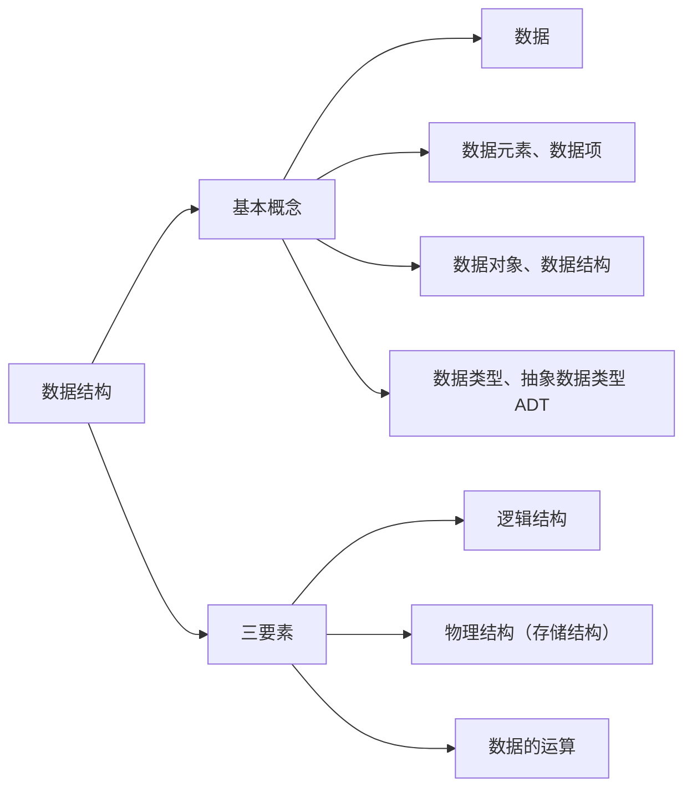
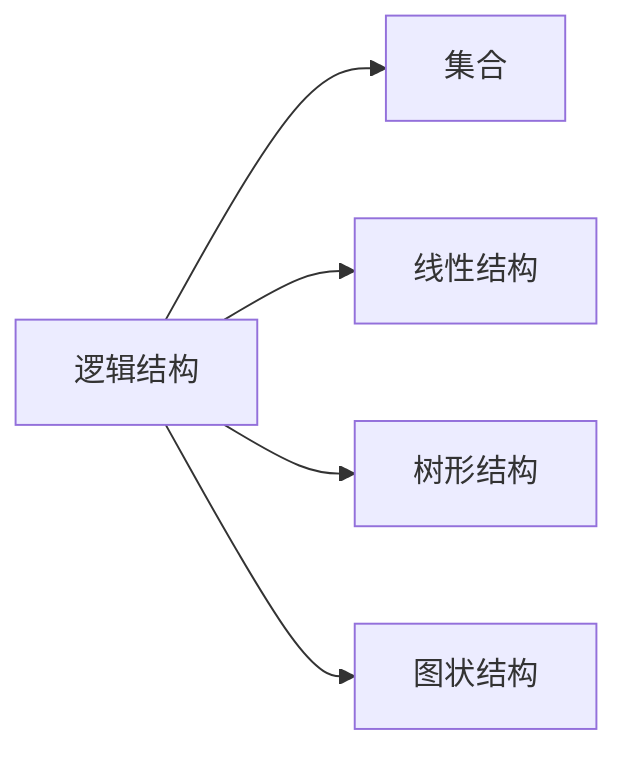
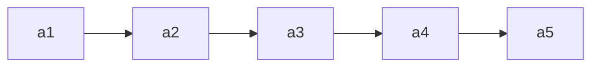

# 数据结构

> 依据 王道考研《数据结构》课程整理（本文件为全部章节的总笔记，随阅读逐章追加）。

## 第一章 绪论

### 1.0 开篇——数据结构在学什么？

**数据结构在学什么？**
- 如何用程序代码把现实世界的问题**信息化**；
- 如何用计算机**高效地处理**这些信息从而创造价值。

**人类文明三次浪潮**（阿尔文·托夫勒《第三次浪潮》）：
| 浪潮 | 阶段 | 说明 |
| --- | --- | --- |
| 第一次 | 农业（约 1 万年前） | 学会农耕，从"动物"到"人类" |
| 第二次 | 工业（17 世纪末） | 出现枪炮与机械，导致古文明灭亡 |
| 第三次 | **信息化**（正在到来） | 高度信息化的世界，导致 ? ? ? |

> 托夫勒："唯一可以确定的是，明天会使我们所有人大吃一惊。"

**"信息化"**：把现实事物用计算机表示。

| 现实事物 | 信息化后的表示 |
| --- | --- |
| 财富（存钱罐） | 电子零钱（浮点型变量 `float`） |
| 排队（海底捞取号） | 号单/用户号（数组？还是…） |
| 友谊（朋友圈/粉丝） | 社交网络（粉丝列表、二维码） |

> 学完 C 语言后，如何用计算机表示这些信息、并高效处理 → 这就是**数据结构**要解决的问题。

**计算机系统分层**（信息化世界）：一台计算机/手机 = **计组（硬件）** → **操作系统** → **C、数据结构（软件）**；多台计算机之间通过**计算机网络**互联，构成"信息化世界"。

---

### 1.1 数据结构的基本概念

> 学习建议：概念多但较基础，抓大放小、形成框架。讨论一种数据结构时，关注"**三要素**"。

**知识总览**：



#### 1. 什么是数据
**数据**：信息的载体，是描述客观事物属性的**数、字符**及所有能输入到计算机中并被计算机程序识别和处理的**符号的集合**。数据是计算机程序加工的原料。（计算机内以二进制 0/1 表示。）

#### 2. 数据元素、数据项
- **数据元素**：数据的**基本单位**，通常作为一个整体来考虑和处理。
- **数据项**：构成数据元素的**不可分割的最小单位**。
- 一个数据元素可由若干数据项组成；根据实际业务需求确定"什么是数据元素、什么是数据项"。
  例：海底捞取号记录 = {号数、取号时间、就餐人数}；微博账号 = {昵称、性别、生日（年/月/日可为"组合项"）}。

#### 3. 数据结构、数据对象
- **结构**：各个元素之间的关系（如汉字"沙 / 粥 / 曼"的不同结构）。
- **数据结构**：相互之间存在一种或多种**特定关系**的数据元素的集合。
- **数据对象**：具有**相同性质**的数据元素的集合，是数据的一个**子集**。
  例：数据结构 = 某个特定门店的排队顾客信息及其关系；数据对象 = 全国所有门店的排队顾客信息。

#### 4. 数据结构的三要素
讨论一种数据结构要关注：**逻辑结构、物理结构（存储结构）、数据的运算**。

**① 逻辑结构**（数据元素之间的逻辑关系是什么？）：



| 逻辑结构 | 关系 | 例子 |
| --- | --- | --- |
| 集合 | 各元素同属一个集合，别无其他关系 | 火锅配料 |
| 线性结构 | 一对一；除第一个外均有唯一前驱，除最后一个外均有唯一后继 | 排队取号、烤串 |
| 树形结构 | 一对多 | 文件系统目录 |
| 图状结构（网状） | 多对多 | 微信好友 |

> 线性结构 = 一对一；集合、树形、图状结构 = **非线性结构**。

**② 物理结构（存储结构）**（如何用计算机表示数据元素的逻辑关系？）：

| 存储结构 | 含义 |
| --- | --- |
| 顺序存储 | 逻辑上相邻的元素在物理位置上也相邻，关系由存储单元的邻接关系体现 |
| 链式存储 | 逻辑上相邻的元素物理位置可不相邻，借助指针表示逻辑关系 |
| 索引存储 | 存储元素信息的同时建立附加的索引表，索引项形如（关键字，地址） |
| 散列存储 | 根据元素关键字直接算出存储地址（又称 Hash 存储） |

> 链式、索引、散列属于**非顺序存储**。
> **绪论只需理解两点**：①顺序存储元素物理上必须连续，非顺序存储可以离散；②存储结构会影响存储空间分配的方便程度（如"有人插队"）；③存储结构会影响对数据运算的速度（如"找第三个人"）。

**③ 数据的运算**：运算的**定义**针对**逻辑结构**（指出功能），运算的**实现**针对**存储结构**（指出操作步骤）。
例：队列逻辑结构（海底捞排队）定义运算：①队头元素出队；②新元素入队；③输出队列长度。

#### 5. 数据类型、抽象数据类型（ADT）
**数据类型**：一个值的集合和定义在此集合上的一组操作的总称。
1. **原子类型**：其值不可再分的数据类型（如 bool、int）。
2. **结构类型**：其值可再分解为若干成分（分量）的数据类型（如 `struct Customer{ int num; int people; }`）。

| 类型 | 值的范围 | 可进行的操作 |
| --- | --- | --- |
| bool | true / false | 与、或、非 |
| int | -2147483648 ~ 2147483647 | 加、减、乘、除、模… |
| struct Customer | num∈1~9999，people∈1~12 | 如"拼桌"运算 |

**抽象数据类型（ADT, Abstract Data Type）**：抽象数据组织及与之相关的操作。用数学化的语言定义数据的逻辑结构、定义运算，**与具体的实现无关**。

> **重要结论**：
> - 定义了一个 ADT，就是定义了数据的逻辑结构、数据的运算，即定义了一个**数据结构**。
> - 确定一种存储结构，就表示出了逻辑结构；存储结构不同，运算的具体实现也不同；确定了存储结构才能**实现**数据结构。
> - 数据结构这门课看重的是**数据元素之间的关系**和**对这些数据元素的操作**，而不关心具体的数据项内容。

---

### 1.2.1 算法的基本概念

**什么是算法？**
- **程序 = 数据结构 + 算法**（数据结构是要处理的信息；算法是处理信息的步骤）。
- **算法（Algorithm）**：对特定问题求解步骤的一种描述，是指令的**有限序列**，其中的每条指令表示一个或多个操作。
- 例：做番茄炒蛋（食材+步骤）；对线性表按年龄递增排序（选择排序 Step1~Step4）。

> **程序设计** = 设计一个好的数据结构 + 设计一个好的算法。

**算法的五个特性**：

| 特性 | 含义 |
| --- | --- |
| 有穷性 | 算法总在执行**有穷步**后结束，且每一步都能在**有穷时间**内完成 |
| 确定性 | 每条指令必须有确切的含义，相同输入只能得出相同的输出 |
| 可行性 | 描述的每一步都能通过已实现的基本运算执行有限次来实现 |
| 输入 | 有零个或多个输入，取自某个特定对象的集合 |
| 输出 | 有一个或多个输出，是与输入有某种特定关系的量 |

> 注：**算法必须是有穷的，而程序可以是无穷的**（如微信是程序，不是算法）。

**"好"算法的特质**（设计时要尽量追求的目标）：
1. **正确性**：能正确地解决求解问题。
2. **可读性**：描述要让别人看得懂（可由代码/伪代码/文字描述，重要的是**无歧义**）。
3. **健壮性**：输入非法数据时能恰当地反应或处理，不产生莫名其妙的输出。
4. **高效率与低存储量需求**：省时、省内存，即**时间复杂度低、空间复杂度低**。

---

### 1.2.2 算法的时间复杂度

**如何评估算法时间开销？**
- 让算法先运行、事后统计运行时间？存在问题：和机器性能、编程语言、编译程序指令质量有关；有些算法不能事后统计（如导弹控制算法）。
- 应**事前预估**：算法**时间复杂度** = 事前预估算法时间开销 $T(n)$ 与问题规模 $n$ 的关系（T 表示 time）。

**大 O 表示法**：$T(n) = O(f(n))$，表示二者**同阶/同等数量级**（当 $n \to \infty$ 时二者之比为常数）。只考虑阶数高的部分，系数和低次幂可忽略。

**计算规则**：
- **加法规则**：$T(n) = O(f(n)) + O(g(n)) = O(\max(f(n), g(n)))$ —— 多项相加，只保留最高阶项，系数变为 1。
- **乘法规则**：$T(n) = O(f(n)) \times O(g(n)) = O(f(n)\times g(n))$ —— 多项相乘，都保留。

**常用技巧**：顺序执行的代码只影响常数项（忽略）；只需挑循环中的一个基本操作、分析其执行次数与 n 的关系；多层嵌套循环只需关注**最深层循环**循环了几次。

**三种时间复杂度**：
| 类型 | 含义 |
| --- | --- |
| 最坏时间复杂度 | 考虑输入数据"最坏"的情况 |
| 平均时间复杂度 | 所有输入示例等概率出现时算法的期望运行时间 |
| 最好时间复杂度 | 考虑输入数据"最好"的情况 |

> 很多算法执行时间与输入数据有关（如顺序查找）；算法性能问题在 n 很大时才会暴露。

**如何计算**：①找一个基本操作（最深层循环）→ ②分析其执行次数 $x$ 与问题规模 $n$ 的关系 $x=f(n)$ → ③取 $O(x)$ 即 $T(n)$。

**例题**：
- **逐步递增**：`int i=1; while(i<=n){ i++; printf(...); }` → $T(n)=3n+3=O(n)$。
- **指数递增**：`i=i*2` 每次翻倍 → 最深层循环语句频度 $x$，结束时 $2^x>n$，$x=\log_2 n+1$ → $T(n)=O(\log_2 n)$。
- **顺序查找**（数组中找元素 n）：最好 $O(1)$、最坏 $O(n)$、平均 $\frac{1+2+\dots+n}{n}=\frac{1+n}{2}$ → $O(n)$。

**常见复杂度排序**（口诀"常对幂指阶"）：

$$O(1) < O(\log_2 n) < O(n) < O(n\log_2 n) < O(n^2) < O(n^3) < O(2^n) < O(n!) < O(n^n)$$

---

### 1.2.3 算法的空间复杂度

**空间复杂度**：空间开销（内存开销）与问题规模 $n$ 的关系，记作 $S(n) = O(f(n))$（S 表示 Space）。

**程序运行时的内存需求**：
- **程序代码**：大小固定，与问题规模无关；
- **数据**：局部变量、参数等，其中**与 $n$ 相关**的变量才影响空间复杂度。

**原地工作**：算法所需内存空间为常量，即 $S(n) = O(1)$。（如算法1 逐步递增型爱你，无论 $n$ 怎么变，内存都是固定常量。）

**例题**：
| 程序 | 所需空间 | $S(n)$ |
| --- | --- | --- |
| `int flag[n]; int i;` | $\approx 4n+8$ | $O(n)$ |
| `int flag[n][n];` | $n\times n$ | $O(n^2)$ |
| `flag[n][n] + other[n] + i` | $O(n^2)+O(n)+O(1)$ | $O(n^2)$（加法规则） |
| 递归 `loveYou(n)`（各层存参数 n） | 递归深度 $n$ | $O(n)$ |
| 递归 `loveYou(n)`（各层存 `flag[n]` 数组） | $1+2+\dots+n=\frac{n(n+1)}{2}$ | $O(n^2)$ |

**递归的空间复杂度 = 递归调用的深度**（若各层所需存储空间不同，分析方法略有区别）。

**如何计算空间复杂度**：
- **普通程序**：①找到所占空间大小与问题规模相关的变量 → ②分析其所占空间 $x$ 与 $n$ 的关系 $x=f(n)$ → ③取 $O(x)$ 即 $S(n)$；
- **递归程序**：找到**递归调用的深度** $x$ 与 $n$ 的关系，取 $O(x)$ 即 $S(n)$。

**常用技巧**：同时间复杂度，加法/乘法规则、"常对幂指阶"（$O(1)<O(\log_2 n)<O(n)<O(n\log_2 n)<O(n^2)<O(n^3)<O(2^n)<O(n!)$）。

---

### 小结

1. **基本概念**：数据、数据元素/数据项、数据对象/数据结构、数据类型/抽象数据类型 ADT。
2. **数据结构的三要素**：逻辑结构（集合/线性/树形/图状，即线性与非线性）、物理结构/存储结构（顺序/链式/索引/散列，后三者非顺序）、数据的运算（定义针对逻辑结构、实现针对存储结构）。
3. **算法**：程序 = 数据结构 + 算法；算法的五个特性（有穷性、确定性、可行性、输入、输出），"好"算法特质（正确、可读、健壮、高效低存储）。
4. **时间复杂度**：$T(n)=O(f(n))$；加法/乘法规则；"常对幂指阶"；最好/最坏/平均。
5. **空间复杂度**：$S(n)=O(f(n))$；原地工作 $O(1)$；递归空间 = 递归深度。
6. **主考点**：定义了一个 ADT 就是定义了一个数据结构；存储结构影响运算实现；复杂度用大 O 只留最高阶。

---

## 第二章 线性表

### 2.1 线性表的定义和基本操作

**线性表（Linear List）定义**：是具有**相同数据类型**的 $n$（$n\ge0$）个数据元素的**有限序列**。$n$ 为表长，$n=0$ 时是空表。用 $L$ 命名线性表，一般表示为：

$$L = (a_1,\ a_2,\ \dots,\ a_i,\ a_{i+1},\ \dots,\ a_n)$$

**特性**：①元素个数有限；②元素类型相同（每个元素所占空间一样大）；③元素有次序。

**重要术语**：
- $a_i$ 是线性表中的"第 $i$ 个"元素——线性表中的**位序**（**从 1 开始**，注意数组下标从 0 开始，用数组实现线性表时要审题）。
- $a_1$ 是**表头元素**，$a_n$ 是**表尾元素**。
- 除第一个元素外，每个元素有且仅有一个**直接前驱**；除最后一个元素外，每个元素有且仅有一个**直接后继**。

> Eg：所有整数按递增次序排列，是线性表吗？——**否**（无限序列，不是线性表）。



**基本操作**（记忆思路：**创销、增删改查**）：

| 操作 | 功能 | 说明 |
| --- | --- | --- |
| InitList(&L) | 初始化表 | 构造空表，分配内存空间（从无到有） |
| DestroyList(&L) | 销毁表 | 释放线性表占用的内存空间（从有到无） |
| ListInsert(&L,i,e) | 插入 | 在表 L 第 i 个位置插入元素 e（增） |
| ListDelete(&L,i,&e) | 删除 | 删除表 L 第 i 个位置的元素，用 e 返回其值（删） |
| LocateElem(L,e) | 按值查找 | 在表 L 中查找具有给定关键字值的元素 |
| GetElem(L,i) | 按位查找 | 获取表 L 第 i 个位置的元素的值 |
| Length(L) | 求表长 | 返回 L 中数据元素的个数 |
| PrintList(L) | 输出 | 按前后顺序输出 L 的所有元素 |
| Empty(L) | 判空 | 若 L 为空表返回 true，否则 false |

> **为什么要实现基本操作**：①团队合作编程，定义的 ADT 要让人方便使用（封装）；②将常用操作封装成函数，避免重复工作、降低出错风险。
> **改、查（本质是"定位"）**：改之前也要先"查"（LocateElem / GetElem）。

**什么时候要传入参数的引用 `&`**：对参数的修改结果需要"**带回来**"时。如 `InitList(&L)`、`DestroyList(&L)`、`ListInsert(&L,i,e)`、`ListDelete(&L,i,&e)`；而 `LocateElem(L,e)`、`GetElem(L,i)` 只读，不加 `&`。

```c
void test(int &x){ x = 1024; ... }   // 引用传递，x 的修改"带回来了"
int x = 1;  test(x);                 // 调用后 x=1024
```

> Tips：比起学会"How"，更重要的是想明白"Why"；函数命名要有可读性。

### 2.2.1 顺序表的定义

**顺序表**：用**顺序存储**的方式实现线性表。顺序存储把逻辑上相邻的元素存储在物理位置上也相邻的存储单元中，元素之间的关系由存储单元的邻接关系来体现。（即用"数组"存放数据元素。）

**元素地址**：设线性表第一个元素存放位置为 LOC(L)（location 的缩写），则第 $i$ 个元素地址 = LOC(L) + $(i-1)\times$ sizeof(ElemType)。用 C 语言 `sizeof(ElemType)` 得到元素大小（如 `sizeof(int)=4B`，`sizeof(Customer)=8B`）。

**顺序表的实现——静态分配**：

```c
#define MaxSize 10                 // 定义最大长度
typedef struct {
    ElemType data[MaxSize];        // 用静态的"数组"存放数据元素
    int length;                    // 顺序表的当前长度
} SqList;                          // 顺序表类型定义（静态分配）
```

Sq = sequence（顺序、序列）。给数据元素分配连续存储空间，大小为 MaxSize × sizeof(ElemType)。
- 表长一开始就确定、**无法更改**（静态）。存满就"放弃治疗"；若一开始就声明很大的空间，又会浪费。

**顺序表的实现——动态分配**（静态数组存满无法扩容，用动态数组）：

```c
#define InitSize 10
typedef struct {
    ElemType *data;    // 指示动态分配数组的指针
    int MaxSize;       // 顺序表的最大容量
    int length;        // 顺序表的当前长度
} SeqList;             // 动态分配方式
```

```c
L.data = (ElemType *) malloc(sizeof(ElemType) * InitSize);   // 申请一片连续空间
```

- C 用 malloc / free（头文件 `<stdlib.h>`），C++ 用 new / delete。
- **动态扩容**（`IncreaseSize(&L, len)`）：`int *p = L.data;  L.data = (int *) malloc((L.MaxSize + len) * sizeof(int));  for(...) L.data[i]=p[i];  L.MaxSize += len;  free(p);`
- 注：可用 `realloc` 实现，但建议初学者用 malloc / free 以理解过程；**扩容要把旧数据复制到新区域，时间开销大（O(n)）**。

**顺序表的特点**：

| 特点 | 说明 |
| --- | --- |
| 随机访问 | 能在 $O(1)$ 时间内找到第 $i$ 个元素（`data[i-1]`，位序从 1、下标从 0） |
| 存储密度高 | 每个节点只存储数据元素，无指针 |
| 拓展容量不方便 | 静态分配无法改变；动态分配扩容也要搬移数据（$O(n)$） |
| 插入、删除不方便 | 需要移动大量元素 |

### 2.2.2_1 顺序表的插入和删除

**插入**：`ListInsert(&L, i, e)` —— 在表 L 的第 i 个位置插入元素 e。

```c
bool ListInsert(SqList &L, int i, int e){
    if(i < 1 || i > L.length + 1) return false;   // 判断 i 的范围是否有效
    if(L.length >= MaxSize) return false;          // 当前存储空间已满，不能插入
    for(int j = L.length; j >= i; j--)             // 将第 i 个元素及之后的元素后移
        L.data[j] = L.data[j-1];
    L.data[i-1] = e;                               // 在位置 i 处放入 e
    L.length++;                                     // 长度 +1
    return true;
}
```

- 注意位序 i 与数组下标关系：元素后移时**从表尾元素开始往前**移动。
- 健壮性：`if` 判断 i 是否合法、空间是否已满，返回 `bool` 给使用者反馈。

**插入时间复杂度**（问题规模 n = L.length）：

| 情况 | 说明 | 复杂度 |
| --- | --- | --- |
| 最好 | 插到表尾（i=n+1），0 次移动 | $O(1)$ |
| 最坏 | 插到表头（i=1），n 次移动 | $O(n)$ |
| 平均 | 各位置概率 $\frac{1}{n+1}$，平均移动 $\frac{n}{2}$ | $O(n)$ |

**删除**：`ListDelete(&L, i, &e)` —— 删除表 L 第 i 个位置的元素，并用 e 返回其值。

```c
bool ListDelete(SqList &L, int i, int &e){
    if(i < 1 || i > L.length) return false;   // 判断 i 的范围是否有效
    e = L.data[i-1];                           // 将被删除的元素赋值给 e
    for(int j = i; j < L.length; j++)          // 将第 i 个位置后的元素前移
        L.data[j-1] = L.data[j];
    L.length--;                                 // 长度 -1
    return true;
}
```

- 元素前移时**从靠前的元素开始**（与插入的后移相反，注意别弄反）。
- `e` 加了 `&`，因为要把删除的值"带回来"；不加 & 传的是复制品，改不回去。

**删除时间复杂度**（问题规模 n = L.length）：

| 情况 | 说明 | 复杂度 |
| --- | --- | --- |
| 最好 | 删除表尾（i=n），0 次移动 | $O(1)$ |
| 最坏 | 删除表头（i=1），n-1 次移动 | $O(n)$ |
| 平均 | 各位置概率 $\frac{1}{n}$，平均移动 $\frac{n-1}{2}$ | $O(n)$ |

### 2.2.2_2 顺序表的查找

**按位查找**：`GetElem(L, i)` —— 获取表 L 第 i 个位置的元素的值。

```c
ElemType GetElem(SeqList L, int i){
    return L.data[i-1];      // 位序 i 对应数组下标 i-1
}
```

- **时间复杂度 $O(1)$**：顺序表数据元素在内存中**连续存放**，根据起始地址 + 元素大小可立即定位第 i 个元素（**随机存取**特性）。
- 指针类型决定"步长"：`data[i]` = 起始地址 + i×sizeof(ElemType)；`malloc` 返回 `void*`，需**强制转换成** `ElemType*`。

**按值查找**：`LocateElem(L, e)` —— 在表 L 中查找第一个元素值等于 e 的元素，返回其**位序**（找不到返回 0）。

```c
int LocateElem(SeqList L, ElemType e){
    for(int i = 0; i < L.length; i++)
        if(L.data[i] == e)  return i + 1;   // 数组下标 i 对应位序 i+1
    return 0;                               // 退出循环，查找失败
}
```

- **基本数据类型**（int、char、double、float…）可直接用 `==` 比较；
- **结构类型**不能直接用 `==`（C 语言会报错），需逐分量比较，或封装成 `isCustomerEqual(a, b)` 函数；考研初试手写代码可直接用 `==`（主要考算法思想）。

**按值查找时间复杂度**（问题规模 n = L.length）：

| 情况 | 说明 | 复杂度 |
| --- | --- | --- |
| 最好 | 目标元素在表头，循环 1 次 | $O(1)$ |
| 最坏 | 目标元素在表尾，循环 n 次 | $O(n)$ |
| 平均 | 各位置概率 $\frac{1}{n}$，平均 $\frac{n+1}{2}$ 次 | $O(n)$ |

### 2.3.1 单链表的定义

**单链表**：用**链式存储**（存储结构）实现了**线性结构**（逻辑结构）。每个结点存储一个数据元素，各结点间的先后关系用一个**指针**表示。

| | 顺序表（顺序存储） | 单链表（链式存储） |
| --- | --- | --- |
| 优点 | 可随机存取，存储密度高 | 不要求大片连续空间，改变容量方便 |
| 缺点 | 要求大片连续空间，改变容量不方便 | 不可随机存取，要耗费空间存放指针 |


**用代码定义一个单链表**：

```c
typedef struct LNode{      // 定义单链表结点类型
    ElemType data;         // 数据域，存放一个数据元素
    struct LNode *next;    // 指针域，指向下一个结点
}LNode, *LinkList;
```

- `typedef <数据类型> <别名>`：给类型重命名。`LNode` 是结点类型，`LinkList` 等价于 `LNode *`。**前者强调"是一个结点"，后者强调"这是一个单链表"，合适的地方用合适的名字可读性更高**。
- 新建结点：`LNode * p = (LNode *) malloc(sizeof(LNode));`（malloc 返回 void*，需强制转换）。

**两种实现方式：带头结点 / 不带头结点**（头结点不存放数据，只是为了操作方便）：

| | 不带头结点 | 带头结点 |
| --- | --- | --- |
| 初始化 | `InitList(&L){ L = NULL; }` | `InitList(&L){ L = (LNode*)malloc(sizeof(LNode)); L->next = NULL; }` |
| 空表判断 | `L == NULL` | `L->next == NULL` |
| 写代码 | 麻烦（首个/后续结点、空表/非空表逻辑不同） | 更方便（统一处理） |

> 头指针 L 就代表整个单链表；因为要修改头指针，`InitList` 的参数要加 `&` 引用。

### 2.3.2_1 单链表的插入和删除

**插入**：

**① 按位序插入** `ListInsert(&L, i, e)`：在第 i 个位置插入元素 e，核心是找到第 i-1 个结点，把新结点插到它后面。

```c
bool ListInsert(LinkList &L, int i, ElemType e){
    if(i < 1) return false;
    LNode *p; int j = 0;
    p = L;                                // 头结点看作第 0 个结点
    while(p != NULL && j < i-1){ p = p->next; j++; }   // 找到第 i-1 个结点
    if(p == NULL) return false;
    LNode *s = (LNode *) malloc(sizeof(LNode));
    s->data = e;
    s->next = p->next;                    // 先连（顺序不能颠倒）
    p->next = s;                          // 再断
    return true;
}
```

- 时间复杂度：最好 $O(1)$（插表头 i=1），最坏 $O(n)$（插表尾），平均 $O(n)$。
- **不带头结点**：不存在"第 0 个"结点，i=1 需特殊处理（改头指针 L）。

**② 指定结点的后插** `InsertNextNode(p, e)`：`s->next = p->next; p->next = s;` —— $O(1)$。

**③ 指定结点的前插** `InsertPriorNode(p, e)`：**偷天换日**——把新结点 s 插到 p 后面，再交换数据，$O(1)$：
```c
s->next = p->next; p->next = s;
s->data = p->data;      // 把 p 中元素复制到 s
p->data = e;            // p 覆盖为 e
```

**删除**：

**① 按位序删除** `ListDelete(&L, i, &e)`：找到第 i-1 个结点，令其指向第 i+1 个结点，释放第 i 个结点。

```c
bool ListDelete(LinkList &L, int i, ElemType &e){
    if(i < 1) return false;
    LNode *p; int j = 0; p = L;
    while(p != NULL && j < i-1){ p = p->next; j++; }
    if(p == NULL) return false;
    if(p->next == NULL) return false;      // 第 i-1 个结点之后已无其余结点
    LNode *q = p->next;
    e = q->data;
    p->next = q->next;                     // 将 *q 从链中"断开"
    free(q);
    return true;
}
```

- 时间复杂度：最好 $O(1)$（删表头），最坏/平均 $O(n)$。

**② 指定结点的删除** `DeleteNode(p)`：
- 方法 1：传入头指针，循环找到 p 的前驱，改前驱的 next。
- 方法 2：**偷天换日**——把 p->next 的数据复制到 p，再删除 p->next，$O(1)$。
  > **有坑**：p 是最后一个结点时（p->next == NULL），方法 2 要特殊处理。

> Tips：这些代码都要会写；注意审题（**带头否？**）；体会"封装"的好处。

### 2.3.2_2 单链表的查找

**按位查找** `GetElem(L, i)`：返回第 i 个结点（头结点看作第 0 个结点）。

```c
LNode * GetElem(LinkList L, int i){
    if(i < 0) return NULL;
    LNode *p; int j = 0;
    p = L;                                       // 头结点为第 0 个结点
    while(p != NULL && j < i){ p = p->next; j++; }
    return p;                                     // i 超过表长时返回 NULL
}
```

- 时间复杂度 $O(n)$：[**单链表不具备"随机访问"特性，只能依次扫描**]（对比顺序表是 $O(1)$）。
- 王道书版本用 `j=1; p=L->next`；`if(i==0) return L; if(i<1) return NULL;`。

**按值查找** `LocateElem(L, e)`：返回第一个数据域等于 e 的结点指针，找不到返回 NULL。

```c
LNode * LocateElem(LinkList L, ElemType e){
    LNode *p = L->next;                          // 从第 1 个结点开始查找
    while(p != NULL && p->data != e) p = p->next;
    return p;
}
```

- 平均时间复杂度 $O(n)$。（ElemType 是复杂结构类型时需逐分量比较，同顺序表。）

**求单链表长度** `Length(L)`：

```c
int Length(LinkList L){
    int len = 0; LNode *p = L;
    while(p->next != NULL){ p = p->next; len++; }
    return len;
}
```

- 时间复杂度 $O(n)$。

> 对比：顺序表可"随机存取"（$O(1)$ 按位访问）；单链表只能**依次扫描**，三种基本操作（按位插入/删除/查找）平均都是 $O(n)$。写循环扫描时要**注意边界条件**。

