# 数据结构

> 依据 王道考研《数据结构》课程整理（本文件为全部章节的总笔记，随阅读逐章追加）。

## 第一章 绪论

### 1.0 开篇——数据结构在学什么？

**数据结构在学什么？**

- 如何用程序代码把现实世界的问题**信息化**；
- 如何用计算机**高效地处理**这些信息从而创造价值。

**人类文明三次浪潮**（阿尔文·托夫勒《第三次浪潮》）：

| 浪潮  | 阶段            | 说明                |
| --- | ------------- | ----------------- |
| 第一次 | 农业（约 1 万年前）   | 学会农耕，从"动物"到"人类"   |
| 第二次 | 工业（17 世纪末）    | 出现枪炮与机械，导致古文明灭亡   |
| 第三次 | **信息化**（正在到来） | 高度信息化的世界，导致 ? ? ? |

> 托夫勒："唯一可以确定的是，明天会使我们所有人大吃一惊。"

**"信息化"**：把现实事物用计算机表示。

| 现实事物       | 信息化后的表示             |
| ---------- | ------------------- |
| 财富（存钱罐）    | 电子零钱（浮点型变量 `float`） |
| 排队（海底捞取号）  | 号单/用户号（数组？还是…）      |
| 友谊（朋友圈/粉丝） | 社交网络（粉丝列表、二维码）      |

> 学完 C 语言后，如何用计算机表示这些信息、并高效处理 → 这就是**数据结构**要解决的问题。

**计算机系统分层**（信息化世界）：一台计算机/手机 = **计组（硬件）** → **操作系统** → **C、数据结构（软件）**；多台计算机之间通过**计算机网络**互联，构成"信息化世界"。

---


### 1.1 数据结构的基本概念

> 学习建议：概念多但较基础，抓大放小、形成框架。讨论一种数据结构时，关注"**三要素**"。

**知识总览**：

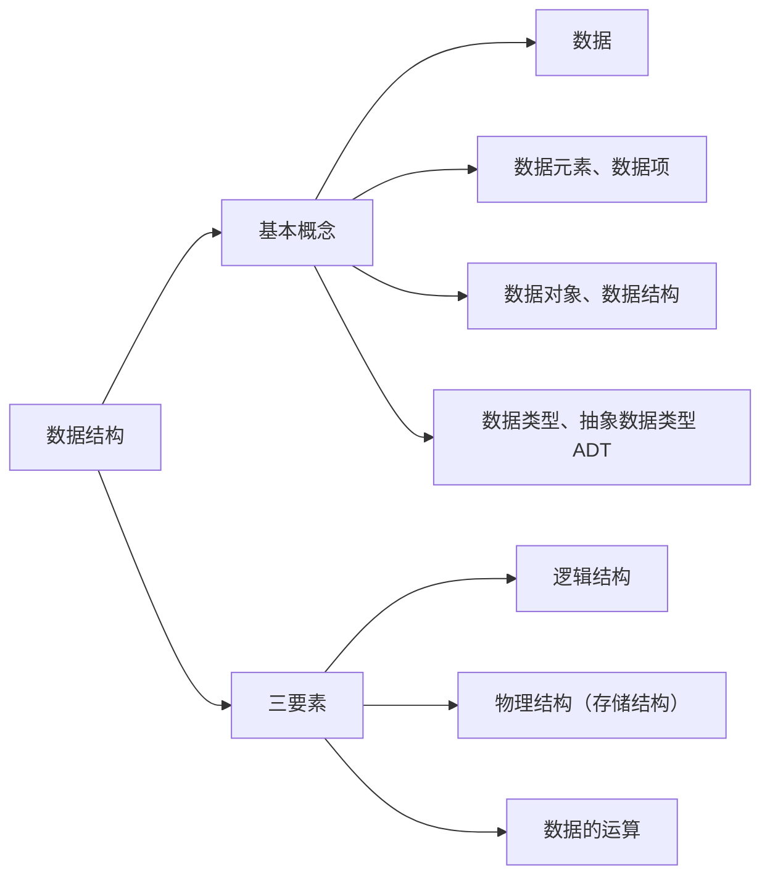

#### 1. 什么是数据

**数据**：信息的载体，是描述客观事物属性的**数、字符**及所有能输入到计算机中并被计算机程序识别和处理的**符号的集合**。数据是计算机程序加工的原料。（计算机内以二进制 0/1 表示。）

#### 2. 数据元素、数据项

- **数据元素**：数据的**基本单位**，通常作为一个整体来考虑和处理。
- **数据项**：构成数据元素的**不可分割的最小单位**。
- 一个数据元素可由若干数据项组成；根据实际业务需求确定"什么是数据元素、什么是数据项"。  
  例：海底捞取号记录 = {号数、取号时间、就餐人数}；微博账号 = {昵称、性别、生日（年/月/日可为"组合项"）}。

#### 3. 数据结构、数据对象

- **结构**：各个元素之间的关系（如汉字"沙 / 粥 / 曼"的不同结构）。
- **数据结构**：相互之间存在一种或多种**特定关系**的数据元素的集合。
- **数据对象**：具有**相同性质**的数据元素的集合，是数据的一个**子集**。  
  例：数据结构 = 某个特定门店的排队顾客信息及其关系；数据对象 = 全国所有门店的排队顾客信息。

#### 4. 数据结构的三要素

讨论一种数据结构要关注：**逻辑结构、物理结构（存储结构）、数据的运算**。

**① 逻辑结构**（数据元素之间的逻辑关系是什么？）：

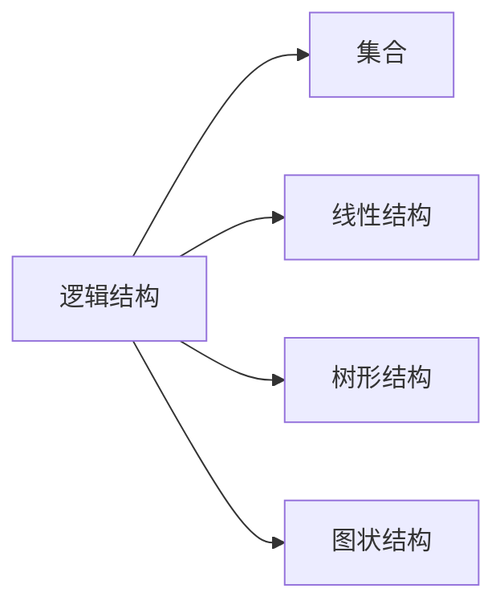

| 逻辑结构     | 关系                           | 例子      |
| -------- | ---------------------------- | ------- |
| 集合       | 各元素同属一个集合，别无其他关系             | 火锅配料    |
| 线性结构     | 一对一；除第一个外均有唯一前驱，除最后一个外均有唯一后继 | 排队取号、烤串 |
| 树形结构     | 一对多                          | 文件系统目录  |
| 图状结构（网状） | 多对多                          | 微信好友    |

> 线性结构 = 一对一；集合、树形、图状结构 = **非线性结构**。

**② 物理结构（存储结构）**（如何用计算机表示数据元素的逻辑关系？）：

| 存储结构 | 含义                               |
| ---- | -------------------------------- |
| 顺序存储 | 逻辑上相邻的元素在物理位置上也相邻，关系由存储单元的邻接关系体现 |
| 链式存储 | 逻辑上相邻的元素物理位置可不相邻，借助指针表示逻辑关系      |
| 索引存储 | 存储元素信息的同时建立附加的索引表，索引项形如（关键字，地址）  |
| 散列存储 | 根据元素关键字直接算出存储地址（又称 Hash 存储）      |

> 链式、索引、散列属于**非顺序存储**。  
> **绪论只需理解两点**：①顺序存储元素物理上必须连续，非顺序存储可以离散；②存储结构会影响存储空间分配的方便程度（如"有人插队"）；③存储结构会影响对数据运算的速度（如"找第三个人"）。

**③ 数据的运算**：运算的**定义**针对**逻辑结构**（指出功能），运算的**实现**针对**存储结构**（指出操作步骤）。  
例：队列逻辑结构（海底捞排队）定义运算：①队头元素出队；②新元素入队；③输出队列长度。

#### 5. 数据类型、抽象数据类型（ADT）

**数据类型**：一个值的集合和定义在此集合上的一组操作的总称。

1. **原子类型**：其值不可再分的数据类型（如 bool、int）。
2. **结构类型**：其值可再分解为若干成分（分量）的数据类型（如 `struct Customer{ int num; int people; }`）。

| 类型              | 值的范围                     | 可进行的操作     |
| --------------- | ------------------------ | ---------- |
| bool            | true / false             | 与、或、非      |
| int             | -2147483648 ~ 2147483647 | 加、减、乘、除、模… |
| struct Customer | num∈1~~9999，people∈1~~12 | 如"拼桌"运算    |

**抽象数据类型（ADT, Abstract Data Type）**：抽象数据组织及与之相关的操作。用数学化的语言定义数据的逻辑结构、定义运算，**与具体的实现无关**。

> **重要结论**：
>
> - 定义了一个 ADT，就是定义了数据的逻辑结构、数据的运算，即定义了一个**数据结构**。
> - 确定一种存储结构，就表示出了逻辑结构；存储结构不同，运算的具体实现也不同；确定了存储结构才能**实现**数据结构。
> - 数据结构这门课看重的是**数据元素之间的关系**和**对这些数据元素的操作**，而不关心具体的数据项内容。

---

### 1.2.1 算法的基本概念

**什么是算法？**

- **程序 = 数据结构 + 算法**（数据结构是要处理的信息；算法是处理信息的步骤）。
- **算法（Algorithm）**：对特定问题求解步骤的一种描述，是指令的**有限序列**，其中的每条指令表示一个或多个操作。
- 例：做番茄炒蛋（食材+步骤）；对线性表按年龄递增排序（选择排序 Step1~Step4）。

> **程序设计** = 设计一个好的数据结构 + 设计一个好的算法。

**算法的五个特性**：

| 特性  | 含义                                  |
| --- | ----------------------------------- |
| 有穷性 | 算法总在执行**有穷步**后结束，且每一步都能在**有穷时间**内完成 |
| 确定性 | 每条指令必须有确切的含义，相同输入只能得出相同的输出          |
| 可行性 | 描述的每一步都能通过已实现的基本运算执行有限次来实现          |
| 输入  | 有零个或多个输入，取自某个特定对象的集合                |
| 输出  | 有一个或多个输出，是与输入有某种特定关系的量              |

> 注：**算法必须是有穷的，而程序可以是无穷的**（如微信是程序，不是算法）。

**"好"算法的特质**（设计时要尽量追求的目标）：

1. **正确性**：能正确地解决求解问题。
2. **可读性**：描述要让别人看得懂（可由代码/伪代码/文字描述，重要的是**无歧义**）。
3. **健壮性**：输入非法数据时能恰当地反应或处理，不产生莫名其妙的输出。
4. **高效率与低存储量需求**：省时、省内存，即**时间复杂度低、空间复杂度低**。

---


### 1.2.2 算法的时间复杂度

**如何评估算法时间开销？**

- 让算法先运行、事后统计运行时间？存在问题：和机器性能、编程语言、编译程序指令质量有关；有些算法不能事后统计（如导弹控制算法）。
- 应**事前预估**：算法**时间复杂度** = 事前预估算法时间开销 $T(n)$ 与问题规模 $n$ 的关系（T 表示 time）。

**大 O 表示法**：$T(n) = O(f(n))$，表示二者**同阶/同等数量级**（当 $n \to \infty$ 时二者之比为常数）。只考虑阶数高的部分，系数和低次幂可忽略。

**计算规则**：

- **加法规则**：$T(n) = O(f(n)) + O(g(n)) = O(\max(f(n), g(n)))$ —— 多项相加，只保留最高阶项，系数变为 1。
- **乘法规则**：$T(n) = O(f(n)) \times O(g(n)) = O(f(n)\times g(n))$ —— 多项相乘，都保留。

**常用技巧**：顺序执行的代码只影响常数项（忽略）；只需挑循环中的一个基本操作、分析其执行次数与 n 的关系；多层嵌套循环只需关注**最深层循环**循环了几次。

**三种时间复杂度**：

| 类型      | 含义                    |
| ------- | --------------------- |
| 最坏时间复杂度 | 考虑输入数据"最坏"的情况         |
| 平均时间复杂度 | 所有输入示例等概率出现时算法的期望运行时间 |
| 最好时间复杂度 | 考虑输入数据"最好"的情况         |

> 很多算法执行时间与输入数据有关（如顺序查找）；算法性能问题在 n 很大时才会暴露。

**如何计算**：①找一个基本操作（最深层循环）→ ②分析其执行次数 $x$ 与问题规模 $n$ 的关系 $x=f(n)$ → ③取 $O(x)$ 即 $T(n)$。

**例题**：

- **逐步递增**：`int i=1; while(i<=n){ i++; printf(...); }` → $T(n)=3n+3=O(n)$。
- **指数递增**：`i=i*2` 每次翻倍 → 最深层循环语句频度 $x$，结束时 $2^x>n$，$x=\log_2 n+1$ → $T(n)=O(\log_2 n)$。
- **顺序查找**（数组中找元素 n）：最好 $O(1)$、最坏 $O(n)$、平均 $\frac{1+2+\dots+n}{n}=\frac{1+n}{2}$ → $O(n)$。

**常见复杂度排序**（口诀"常对幂指阶"）：

$O(1) < O(\log_2 n) < O(n) < O(n\log_2 n) < O(n^2) < O(n^3) < O(2^n) < O(n!) < O(n^n)$

---

### 1.2.3 算法的空间复杂度

**空间复杂度**：空间开销（内存开销）与问题规模 $n$ 的关系，记作 $S(n) = O(f(n))$（S 表示 Space）。

**程序运行时的内存需求**：

- **程序代码**：大小固定，与问题规模无关；
- **数据**：局部变量、参数等，其中**与 $n$ 相关**的变量才影响空间复杂度。

**原地工作**：算法所需内存空间为常量，即 $S(n) = O(1)$。（如算法1 逐步递增型爱你，无论 $n$ 怎么变，内存都是固定常量。）

**例题**：

| 程序                                | 所需空间                           | $S(n)$         |
| --------------------------------- | ------------------------------ | -------------- |
| `int flag[n]; int i;`             | $\approx 4n+8$                 | $O(n)$         |
| `int flag[n][n];`                 | $n\times n$                    | $O(n^2)$       |
| `flag[n][n] + other[n] + i`       | $O(n^2)+O(n)+O(1)$             | $O(n^2)$（加法规则） |
| 递归 `loveYou(n)`（各层存参数 n）          | 递归深度 $n$                       | $O(n)$         |
| 递归 `loveYou(n)`（各层存 `flag[n]` 数组） | $1+2+\dots+n=\frac{n(n+1)}{2}$ | $O(n^2)$       |

**递归的空间复杂度 = 递归调用的深度**（若各层所需存储空间不同，分析方法略有区别）。

**如何计算空间复杂度**：

- **普通程序**：①找到所占空间大小与问题规模相关的变量 → ②分析其所占空间 $x$ 与 $n$ 的关系 $x=f(n)$ → ③取 $O(x)$ 即 $S(n)$；
- **递归程序**：找到**递归调用的深度** $x$ 与 $n$ 的关系，取 $O(x)$ 即 $S(n)$。

**常用技巧**：同时间复杂度，加法/乘法规则、"常对幂指阶"（$O(1)<O(\log_2 n)<O(n)<O(n\log_2 n)<O(n^2)<O(n^3)<O(2^n)<O(n!)$）。

---

### 小结

1. **基本概念**：数据、数据元素/数据项、数据对象/数据结构、数据类型/抽象数据类型 ADT。
2. **数据结构的三要素**：逻辑结构（集合/线性/树形/图状，即线性与非线性）、物理结构/存储结构（顺序/链式/索引/散列，后三者非顺序）、数据的运算（定义针对逻辑结构、实现针对存储结构）。
3. **算法**：程序 = 数据结构 + 算法；算法的五个特性（有穷性、确定性、可行性、输入、输出），"好"算法特质（正确、可读、健壮、高效低存储）。
4. **时间复杂度**：$T(n)=O(f(n))$；加法/乘法规则；"常对幂指阶"；最好/最坏/平均。
5. **空间复杂度**：$S(n)=O(f(n))$；原地工作 $O(1)$；递归空间 = 递归深度。
6. **主考点**：定义了一个 ADT 就是定义了一个数据结构；存储结构影响运算实现；复杂度用大 O 只留最高阶。

---

## 第二章 线性表


### 2.1 线性表的定义和基本操作

**线性表（Linear List）定义**：是具有**相同数据类型**的 $n$（$n\ge0$）个数据元素的**有限序列**。$n$ 为表长，$n=0$ 时是空表。用 $L$ 命名线性表，一般表示为：

$L = (a_1,\ a_2,\ \dots,\ a_i,\ a_{i+1},\ \dots,\ a_n)$

**特性**：①元素个数有限；②元素类型相同（每个元素所占空间一样大）；③元素有次序。

**重要术语**：

- $a_i$ 是线性表中的"第 $i$ 个"元素——线性表中的**位序**（**从 1 开始**，注意数组下标从 0 开始，用数组实现线性表时要审题）。
- $a_1$ 是**表头元素**，$a_n$ 是**表尾元素**。
- 除第一个元素外，每个元素有且仅有一个**直接前驱**；除最后一个元素外，每个元素有且仅有一个**直接后继**。

> Eg：所有整数按递增次序排列，是线性表吗？——**否**（无限序列，不是线性表）。

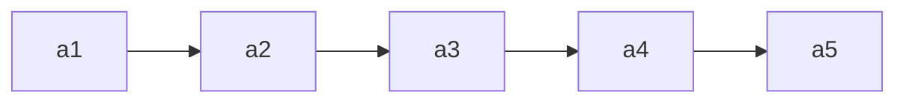

**基本操作**（记忆思路：**创销、增删改查**）：

| 操作                    | 功能   | 说明                           |
| --------------------- | ---- | ---------------------------- |
| InitList(\&L)         | 初始化表 | 构造空表，分配内存空间（从无到有）            |
| DestroyList(\&L)      | 销毁表  | 释放线性表占用的内存空间（从有到无）           |
| ListInsert(\&L,i,e)   | 插入   | 在表 L 第 i 个位置插入元素 e（增）        |
| ListDelete(\&L,i,\&e) | 删除   | 删除表 L 第 i 个位置的元素，用 e 返回其值（删） |
| LocateElem(L,e)       | 按值查找 | 在表 L 中查找具有给定关键字值的元素          |
| GetElem(L,i)          | 按位查找 | 获取表 L 第 i 个位置的元素的值           |
| Length(L)             | 求表长  | 返回 L 中数据元素的个数                |
| PrintList(L)          | 输出   | 按前后顺序输出 L 的所有元素              |
| Empty(L)              | 判空   | 若 L 为空表返回 true，否则 false      |

> **为什么要实现基本操作**：①团队合作编程，定义的 ADT 要让人方便使用（封装）；②将常用操作封装成函数，避免重复工作、降低出错风险。  
> **改、查（本质是"定位"）**：改之前也要先"查"（LocateElem / GetElem）。

**什么时候要传入参数的引用 `&`**：对参数的修改结果需要"**带回来**"时。如 `InitList(&L)`、`DestroyList(&L)`、`ListInsert(&L,i,e)`、`ListDelete(&L,i,&e)`；而 `LocateElem(L,e)`、`GetElem(L,i)` 只读，不加 `&`。

```c
void test(int &x){ x = 1024; ... }   // 引用传递，x 的修改"带回来了"
int x = 1;  test(x);                 // 调用后 x=1024
```

> Tips：比起学会"How"，更重要的是想明白"Why"；函数命名要有可读性。


### 2.2.1 顺序表的定义

**顺序表**：用**顺序存储**的方式实现线性表。顺序存储把逻辑上相邻的元素存储在物理位置上也相邻的存储单元中，元素之间的关系由存储单元的邻接关系来体现。（即用"数组"存放数据元素。）

**元素地址**：设线性表第一个元素存放位置为 LOC(L)（location 的缩写），则第 $i$ 个元素地址 = LOC(L) + $(i-1)\times$ sizeof(ElemType)。用 C 语言 `sizeof(ElemType)` 得到元素大小（如 `sizeof(int)=4B`，`sizeof(Customer)=8B`）。

**顺序表的实现——静态分配**：

```c
#define MaxSize 10                 // 定义最大长度
typedef struct {
    ElemType data[MaxSize];        // 用静态的"数组"存放数据元素
    int length;                    // 顺序表的当前长度
} SqList;                          // 顺序表类型定义（静态分配）
```

Sq = sequence（顺序、序列）。给数据元素分配连续存储空间，大小为 MaxSize × sizeof(ElemType)。

- 表长一开始就确定、**无法更改**（静态）。存满就"放弃治疗"；若一开始就声明很大的空间，又会浪费。

**顺序表的实现——动态分配**（静态数组存满无法扩容，用动态数组）：

```c
#define InitSize 10
typedef struct {
    ElemType *data;    // 指示动态分配数组的指针
    int MaxSize;       // 顺序表的最大容量
    int length;        // 顺序表的当前长度
} SeqList;             // 动态分配方式
```

```c
L.data = (ElemType *) malloc(sizeof(ElemType) * InitSize);   // 申请一片连续空间
```

- C 用 malloc / free（头文件 `<stdlib.h>`），C++ 用 new / delete。
- **动态扩容**（`IncreaseSize(&L, len)`）：`int *p = L.data;  L.data = (int *) malloc((L.MaxSize + len) * sizeof(int));  for(...) L.data[i]=p[i];  L.MaxSize += len;  free(p);`
- 注：可用 `realloc` 实现，但建议初学者用 malloc / free 以理解过程；**扩容要把旧数据复制到新区域，时间开销大（O(n)）**。

**顺序表的特点**：

| 特点       | 说明                                                |
| -------- | ------------------------------------------------- |
| 随机访问     | 能在 $O(1)$ 时间内找到第 $i$ 个元素（`data[i-1]`，位序从 1、下标从 0） |
| 存储密度高    | 每个节点只存储数据元素，无指针                                   |
| 拓展容量不方便  | 静态分配无法改变；动态分配扩容也要搬移数据（$O(n)$）                     |
| 插入、删除不方便 | 需要移动大量元素                                          |


### 2.2.2_1 顺序表的插入和删除

**插入**：`ListInsert(&L, i, e)` —— 在表 L 的第 i 个位置插入元素 e。

```c
bool ListInsert(SqList &L, int i, int e){
    if(i < 1 || i > L.length + 1) return false;   // 判断 i 的范围是否有效
    if(L.length >= MaxSize) return false;          // 当前存储空间已满，不能插入
    for(int j = L.length; j >= i; j--)             // 将第 i 个元素及之后的元素后移
        L.data[j] = L.data[j-1];
    L.data[i-1] = e;                               // 在位置 i 处放入 e
    L.length++;                                     // 长度 +1
    return true;
}
```

- 注意位序 i 与数组下标关系：元素后移时**从表尾元素开始往前**移动。
- 健壮性：`if` 判断 i 是否合法、空间是否已满，返回 `bool` 给使用者反馈。

**插入时间复杂度**（问题规模 n = L.length）：

| 情况 | 说明                                       | 复杂度    |
| -- | ---------------------------------------- | ------ |
| 最好 | 插到表尾（i=n+1），0 次移动                        | $O(1)$ |
| 最坏 | 插到表头（i=1），n 次移动                          | $O(n)$ |
| 平均 | 各位置概率 $\frac{1}{n+1}$，平均移动 $\frac{n}{2}$ | $O(n)$ |

**删除**：`ListDelete(&L, i, &e)` —— 删除表 L 第 i 个位置的元素，并用 e 返回其值。

```c
bool ListDelete(SqList &L, int i, int &e){
    if(i < 1 || i > L.length) return false;   // 判断 i 的范围是否有效
    e = L.data[i-1];                           // 将被删除的元素赋值给 e
    for(int j = i; j < L.length; j++)          // 将第 i 个位置后的元素前移
        L.data[j-1] = L.data[j];
    L.length--;                                 // 长度 -1
    return true;
}
```

- 元素前移时**从靠前的元素开始**（与插入的后移相反，注意别弄反）。
- `e` 加了 `&`，因为要把删除的值"带回来"；不加 & 传的是复制品，改不回去。

**删除时间复杂度**（问题规模 n = L.length）：

| 情况 | 说明                                       | 复杂度    |
| -- | ---------------------------------------- | ------ |
| 最好 | 删除表尾（i=n），0 次移动                          | $O(1)$ |
| 最坏 | 删除表头（i=1），n-1 次移动                        | $O(n)$ |
| 平均 | 各位置概率 $\frac{1}{n}$，平均移动 $\frac{n-1}{2}$ | $O(n)$ |

### 2.2.2_2 顺序表的查找

**按位查找**：`GetElem(L, i)` —— 获取表 L 第 i 个位置的元素的值。

```c
ElemType GetElem(SeqList L, int i){
    return L.data[i-1];      // 位序 i 对应数组下标 i-1
}
```

- **时间复杂度 $O(1)$**：顺序表数据元素在内存中**连续存放**，根据起始地址 + 元素大小可立即定位第 i 个元素（**随机存取**特性）。
- 指针类型决定"步长"：`data[i]` = 起始地址 + i×sizeof(ElemType)；`malloc` 返回 `void*`，需**强制转换成** `ElemType*`。

**按值查找**：`LocateElem(L, e)` —— 在表 L 中查找第一个元素值等于 e 的元素，返回其**位序**（找不到返回 0）。

```c
int LocateElem(SeqList L, ElemType e){
    for(int i = 0; i < L.length; i++)
        if(L.data[i] == e)  return i + 1;   // 数组下标 i 对应位序 i+1
    return 0;                               // 退出循环，查找失败
}
```

- **基本数据类型**（int、char、double、float…）可直接用 `==` 比较；
- **结构类型**不能直接用 `==`（C 语言会报错），需逐分量比较，或封装成 `isCustomerEqual(a, b)` 函数；考研初试手写代码可直接用 `==`（主要考算法思想）。

**按值查找时间复杂度**（问题规模 n = L.length）：

| 情况 | 说明                                       | 复杂度    |
| -- | ---------------------------------------- | ------ |
| 最好 | 目标元素在表头，循环 1 次                           | $O(1)$ |
| 最坏 | 目标元素在表尾，循环 n 次                           | $O(n)$ |
| 平均 | 各位置概率 $\frac{1}{n}$，平均 $\frac{n+1}{2}$ 次 | $O(n)$ |


### 2.3.1 单链表的定义

**单链表**：用**链式存储**（存储结构）实现了**线性结构**（逻辑结构）。每个结点存储一个数据元素，各结点间的先后关系用一个**指针**表示。

|    | 顺序表（顺序存储）        | 单链表（链式存储）        |
| -- | ---------------- | ---------------- |
| 优点 | 可随机存取，存储密度高      | 不要求大片连续空间，改变容量方便 |
| 缺点 | 要求大片连续空间，改变容量不方便 | 不可随机存取，要耗费空间存放指针 |

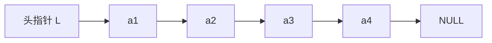

**用代码定义一个单链表**：

```c
typedef struct LNode{      // 定义单链表结点类型
    ElemType data;         // 数据域，存放一个数据元素
    struct LNode *next;    // 指针域，指向下一个结点
}LNode, *LinkList;
```

- `typedef <数据类型> <别名>`：给类型重命名。`LNode` 是结点类型，`LinkList` 等价于 `LNode *`。**前者强调"是一个结点"，后者强调"这是一个单链表"，合适的地方用合适的名字可读性更高**。
- 新建结点：`LNode * p = (LNode *) malloc(sizeof(LNode));`（malloc 返回 void*，需强制转换）。

**两种实现方式：带头结点 / 不带头结点**（头结点不存放数据，只是为了操作方便）：

|      | 不带头结点                       | 带头结点                                                                 |
| ---- | --------------------------- | -------------------------------------------------------------------- |
| 初始化  | `InitList(&L){ L = NULL; }` | `InitList(&L){ L = (LNode*)malloc(sizeof(LNode)); L->next = NULL; }` |
| 空表判断 | `L == NULL`                 | `L->next == NULL`                                                    |
| 写代码  | 麻烦（首个/后续结点、空表/非空表逻辑不同）      | 更方便（统一处理）                                                            |

> 头指针 L 就代表整个单链表；因为要修改头指针，`InitList` 的参数要加 `&` 引用。


### 2.3.2_1 单链表的插入和删除

**插入**：

**① 按位序插入** `ListInsert(&L, i, e)`：在第 i 个位置插入元素 e，核心是找到第 i-1 个结点，把新结点插到它后面。

```c
bool ListInsert(LinkList &L, int i, ElemType e){
    if(i < 1) return false;
    LNode *p; int j = 0;
    p = L;                                // 头结点看作第 0 个结点
    while(p != NULL && j < i-1){ p = p->next; j++; }   // 找到第 i-1 个结点
    if(p == NULL) return false;
    LNode *s = (LNode *) malloc(sizeof(LNode));
    s->data = e;
    s->next = p->next;                    // 先连（顺序不能颠倒）
    p->next = s;                          // 再断
    return true;
}
```

- 时间复杂度：最好 $O(1)$（插表头 i=1），最坏 $O(n)$（插表尾），平均 $O(n)$。
- **不带头结点**：不存在"第 0 个"结点，i=1 需特殊处理（改头指针 L）。

**② 指定结点的后插** `InsertNextNode(p, e)`：`s->next = p->next; p->next = s;` —— $O(1)$。

**③ 指定结点的前插** `InsertPriorNode(p, e)`：**偷天换日**——把新结点 s 插到 p 后面，再交换数据，$O(1)$：

```c
s->next = p->next; p->next = s;
s->data = p->data;      // 把 p 中元素复制到 s
p->data = e;            // p 覆盖为 e
```

**删除**：

**① 按位序删除** `ListDelete(&L, i, &e)`：找到第 i-1 个结点，令其指向第 i+1 个结点，释放第 i 个结点。

```c
bool ListDelete(LinkList &L, int i, ElemType &e){
    if(i < 1) return false;
    LNode *p; int j = 0; p = L;
    while(p != NULL && j < i-1){ p = p->next; j++; }
    if(p == NULL) return false;
    if(p->next == NULL) return false;      // 第 i-1 个结点之后已无其余结点
    LNode *q = p->next;
    e = q->data;
    p->next = q->next;                     // 将 *q 从链中"断开"
    free(q);
    return true;
}
```

- 时间复杂度：最好 $O(1)$（删表头），最坏/平均 $O(n)$。

**② 指定结点的删除** `DeleteNode(p)`：

- 方法 1：传入头指针，循环找到 p 的前驱，改前驱的 next。
- 方法 2：**偷天换日**——把 p->next 的数据复制到 p，再删除 p->next，$O(1)$。
  > **有坑**：p 是最后一个结点时（p->next == NULL），方法 2 要特殊处理。

> Tips：这些代码都要会写；注意审题（**带头否？**）；体会"封装"的好处。


### 2.3.2_2 单链表的查找

**按位查找** `GetElem(L, i)`：返回第 i 个结点（头结点看作第 0 个结点）。

```c
LNode * GetElem(LinkList L, int i){
    if(i < 0) return NULL;
    LNode *p; int j = 0;
    p = L;                                       // 头结点为第 0 个结点
    while(p != NULL && j < i){ p = p->next; j++; }
    return p;                                     // i 超过表长时返回 NULL
}
```

- 时间复杂度 $O(n)$：[**单链表不具备"随机访问"特性，只能依次扫描**]（对比顺序表是 $O(1)$）。
- 王道书版本用 `j=1; p=L->next`；`if(i==0) return L; if(i<1) return NULL;`。

**按值查找** `LocateElem(L, e)`：返回第一个数据域等于 e 的结点指针，找不到返回 NULL。

```c
LNode * LocateElem(LinkList L, ElemType e){
    LNode *p = L->next;                          // 从第 1 个结点开始查找
    while(p != NULL && p->data != e) p = p->next;
    return p;
}
```

- 平均时间复杂度 $O(n)$。（ElemType 是复杂结构类型时需逐分量比较，同顺序表。）

**求单链表长度** `Length(L)`：

```c
int Length(LinkList L){
    int len = 0; LNode *p = L;
    while(p->next != NULL){ p = p->next; len++; }
    return len;
}
```

- 时间复杂度 $O(n)$。

> 对比：顺序表可"随机存取"（$O(1)$ 按位访问）；单链表只能**依次扫描**，三种基本操作（按位插入/删除/查找）平均都是 $O(n)$。写循环扫描时要**注意边界条件**。


### 2.3.2_3 单链表的建立

**建立思路**（本节讨论**带头结点**的情况）：

- **Step 1**：初始化一个单链表（`InitList`，分配头结点并令 `L->next = NULL`）；
- **Step 2**：每次取一个数据元素 `e`，插入到**表尾**（尾插法）或**表头**（头插法）。

#### 1. 尾插法建立单链表

**朴素做法**：每轮调用 `ListInsert(L, length+1, e)` 插到表尾。

```c
InitList(L);                       // 初始化单链表
int length = 0;                    // 记录链表长度
while(...){
    取一个数据元素 e;
    ListInsert(L, length+1, e);    // 插到尾部
    length++;
}
```

> **问题**：`ListInsert` 每次都要**从头遍历**找到表尾，单次 $O(n)$，整体 $O(n^2)$。

**改进做法**：设置一个**表尾指针 `r`** 始终指向最后一个结点，插入变为 $O(1)$，整体 $O(n)$。

```c
LinkList List_TailInsert(LinkList &L){          // 正向建立单链表
    int x;                                       // 设 ElemType 为 int
    L = (LinkList)malloc(sizeof(LNode));         // 建立头结点
    LNode *s, *r = L;                            // r 为表尾指针
    scanf("%d", &x);                             // 输入结点的值
    while(x != 9999){                            // 输入 9999 表示结束
        s = (LNode *)malloc(sizeof(LNode));
        s->data = x;
        r->next = s;                             // 在 r 结点之后插入元素 x
        r = s;                                   // r 指向新的表尾结点
        scanf("%d", &x);
    }
    r->next = NULL;                              // 尾结点指针置空
    return L;
}
```

> 关键：`r` 永远指向最后一个结点，避免每次从头遍历（对比朴素做法省去内层遍历）。

#### 2. 头插法建立单链表

每次把新结点插到**头结点之后**，即对头结点做**后插操作** `InsertNextNode(L, e)`。

```c
LinkList List_HeadInsert(LinkList &L){          // 逆向建立单链表
    LNode *s; int x;
    L = (LinkList)malloc(sizeof(LNode));         // 创建头结点
    L->next = NULL;                              // 初始为空链表（务必写！）
    scanf("%d", &x);
    while(x != 9999){                            // 输入 9999 表示结束
        s = (LNode *)malloc(sizeof(LNode));      // 创建新结点
        s->data = x;
        s->next = L->next;
        L->next = s;                             // 将新结点插入表中，L 为头指针
        scanf("%d", &x);
    }
    return L;
}
```

> **重要应用**：头插法建立出来的链表是**逆序**的，因此可用于**链表的逆置**。  
> **易错点**：`L->next = NULL` 不能省 —— 养成习惯，只要初始化单链表，就先让头指针指向 NULL。

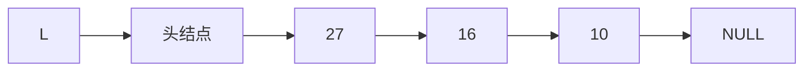

**本节核心**：头插法、尾插法的核心都是**初始化操作** + **指定结点的后插操作**；尾插法要注意设置指向表尾结点的指针 `r`；头插法的重要应用是**链表的逆置**。


### 2.3.3 双链表

**单链表 V.S. 双链表**：

|      | 单链表              | 双链表                            |
| ---- | ---------------- | ------------------------------ |
| 检索方向 | **无法逆向检索**，有时不方便 | **可进可退**（有前驱、后继两个指针）           |
| 存储密度 | 高（每结点 1 个指针）     | 更低（每结点 2 个指针，`prior` + `next`） |

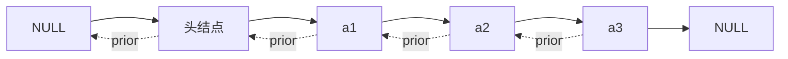

**结点定义**：

```c
typedef struct DNode{          // 定义双链表结点类型
    ElemType data;             // 数据域
    struct DNode *prior, *next;// 前驱和后继指针
}DNode, *DLinklist;
```

> `DLinklist` 等价于 `DNode *`。

#### 1. 双链表的初始化（带头结点）

```c
bool InitDLinkList(DLinklist &L){
    L = (DNode *) malloc(sizeof(DNode));   // 分配一个头结点
    if(L == NULL) return false;            // 内存不足，分配失败
    L->prior = NULL;                       // 头结点的 prior 永远指向 NULL
    L->next = NULL;                        // 头结点之后暂时还没有结点
    return true;
}

// 判断双链表是否为空（带头结点）
bool Empty(DLinklist L){
    if(L->next == NULL) return true;
    else return false;
}
```

#### 2. 双链表的插入（后插）

在 `p` 结点之后插入 `s` 结点：

```c
bool InsertNextDNode(DNode *p, DNode *s){
    if(p == NULL || s == NULL) return false;   // 非法参数
    s->next = p->next;                         // ①
    if(p->next != NULL)                        // ② 如果 p 结点有后继结点
        p->next->prior = s;
    s->prior = p;                              // ③
    p->next = s;                               // ④
    return true;
}
```

> **要点**：修改指针时**要注意顺序**（①②必须在③④之前，否则会丢失后继结点的地址）；  
> **边界情况**：若 `p` 是最后一个结点，则 `p->next == NULL`，此时 `p->next->prior` 会空指针异常，必须加 `if` 判断。
>
> 用"后插操作"可以实现**按位序插入**和**前插操作**。

#### 3. 双链表的删除（后删）

删除 `p` 结点的后继结点 `q`：

```c
bool DeleteNextDNode(DNode *p){
    if(p == NULL) return false;
    DNode *q = p->next;                        // 找到 p 的后继结点 q
    if(q == NULL) return false;                // p 没有后继
    p->next = q->next;
    if(q->next != NULL)                        // q 结点不是最后一个结点
        q->next->prior = p;
    free(q);                                   // 释放结点空间
    return true;
}

// 销毁双链表
void DestroyList(DLinklist &L){
    while(L->next != NULL)                     // 循环释放各个数据结点
        DeleteNextDNode(L);
    free(L);                                   // 释放头结点
    L = NULL;                                  // 头指针指向 NULL
}
```

> **边界情况**：若被删除结点是最后一个数据结点，则 `q->next == NULL`，需特殊处理。

#### 4. 双链表的遍历

| 遍历方式        | 代码骨架                                             |
| ----------- | ------------------------------------------------ |
| 后向遍历        | `while(p != NULL){ 处理 p; p = p->next; }`         |
| 前向遍历        | `while(p != NULL){ 处理 p; p = p->prior; }`        |
| 前向遍历（跳过头结点） | `while(p->prior != NULL){ 处理 p; p = p->prior; }` |

> 双链表**不可随机存取**，按位查找、按值查找都只能用**遍历**的方式实现，时间复杂度 $O(n)$。

**本节考点**：初始化（头结点的 `prior`、`next` 都指向 NULL）→ 插入（后插，注意指针修改顺序与"插在最后"的边界）→ 删除（后删，注意"删的是最后一个数据结点"的边界）→ 遍历（循环终止条件）。


### 2.3.4 循环链表

循环链表分两种：**循环单链表**、**循环双链表**。

#### 1. 循环单链表

**定义**：与单链表的区别在于，**表尾结点的 `next` 指针指向头结点**（而不是 NULL）。

| 对比项          | 普通单链表                                    | 循环单链表          |
| ------------ | ---------------------------------------- | -------------- |
| 表尾结点的 `next` | `NULL`                                   | 指向**头结点** `L`  |
| 判空条件         | `L == NULL`（不带头） / `L->next == NULL`（带头） | `L->next == L` |
| 判断 p 是否表尾    | `p->next == NULL`                        | `p->next == L` |

```c
// 初始化一个循环单链表
bool InitList(LinkList &L){
    L = (LNode *) malloc(sizeof(LNode));   // 分配一个头结点
    if(L == NULL) return false;            // 内存不足，分配失败
    L->next = L;                           // 头结点 next 指向头结点
    return true;
}

// 判断循环单链表是否为空
bool Empty(LinkList L){
    if(L->next == L) return true;
    else return false;
}

// 判断结点 p 是否为循环单链表的表尾结点
bool isTail(LinkList L, LNode *p){
    if(p->next == L) return true;
    else return false;
}
```

**重要性质**：

- **普通单链表**：从某个结点出发，**只能找到该结点之后的结点**（无法回到前面的结点）。
- **循环单链表**：从**任意一个结点**出发，都可以找到表中的**其他任何结点**（因为表尾又绕回了表头）。

**灵活应用**：若让头指针 `L` 指向**表尾元素**：

- 找表头：`L->next` —— $O(1)$；
- 找表尾：`L` 本身 —— $O(1)$。

> 因为循环链表中表头、表尾仅一步之遥，所以对表头、表尾的操作都很方便（代价是插入/删除时可能需要修改 `L`）。

#### 2. 循环双链表

**定义**：表头结点的 `prior` 指向**表尾结点**，表尾结点的 `next` 指向**头结点**。

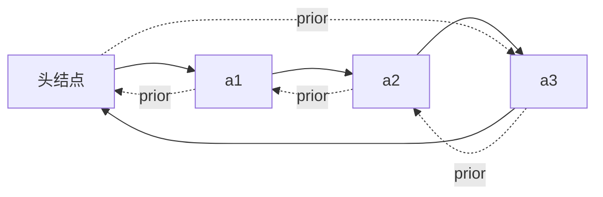

```c
// 初始化空的循环双链表
bool InitDLinkList(DLinklist &L){
    L = (DNode *) malloc(sizeof(DNode));   // 分配一个头结点
    if(L == NULL) return false;            // 内存不足，分配失败
    L->prior = L;                          // 头结点的 prior 指向头结点
    L->next = L;                           // 头结点的 next 指向头结点
    return true;
}

// 判断循环双链表是否为空
bool Empty(DLinklist L){
    if(L->next == L) return true;
    else return false;
}

// 判断结点 p 是否为循环双链表的表尾结点
bool isTail(DLinklist L, DNode *p){
    if(p->next == L) return true;
    else return false;
}
```

**循环双链表的插入（后插）** —— 因为 `p->next` **永远不为 NULL**，所以**不需要**判断边界：

```c
bool InsertNextDNode(DNode *p, DNode *s){
    s->next = p->next;
    p->next->prior = s;        // 循环双链表中 p->next 一定非空，可直接写
    s->prior = p;
    p->next = s;
    return true;
}
```

**循环双链表的删除（后删）** —— 同理，`q->next` 也一定非空：

```c
bool DeleteNextDNode(DNode *p){
    DNode *q = p->next;
    p->next = q->next;
    q->next->prior = p;        // 无需判断 q->next 是否为空
    free(q);
    return true;
}
```

> **对比**：普通双链表的插入/删除要判断 `p->next != NULL`、`q->next != NULL`（处理"插在/删在最后一个结点"的边界）；**循环双链表因为有"环"，这些判断都可以省掉**，代码更简洁。

#### 3. 循环链表要解决的代码问题

1. **如何判空** —— 看 `L->next` 是否等于 `L`；
2. **如何判断结点 p 是表尾/表头结点** —— 表尾：`p->next == L`；表头：`p == L`（带头结点时）；这是**后向/前向遍历的实现核心**；
3. **如何在表头、表中、表尾插入/删除一个结点** —— 这是插入、删除操作的**不易错思路**（先想清楚是"改前驱的 next"还是"改后继的 prior"）。


### 2.3.5 静态链表

**什么是静态链表**：用**数组**的方式实现的链表 —— 分配一整片**连续的内存空间**，各个结点**集中安置**。

- 数组的每个元素由两部分组成：**数据元素** + **游标**（下一个结点的数组下标，充当"指针"）；
- 用 `0` 号结点充当**头结点**；
- 游标为 **-1** 表示已到达**表尾**（相当于 NULL）；空闲结点的游标设为特殊值 **-2**。

> 例：每个数据元素 4B、每个游标 4B（每个结点共 8B），则 `e₁` 的存放地址 = `addr + 8 × 2`。

**用代码定义一个静态链表**：

```c
#define MaxSize 10              // 静态链表的最大长度
typedef struct {
    ElemType data;              // 存储数据元素
    int next;                   // 下一个元素的数组下标
} SLinkList[MaxSize];           // 等价于声明一个长度为 MaxSize 的 Node 型数组
```

```c
// 等价写法
struct Node{
    ElemType data;
    int next;
};
typedef struct Node SLinkList[MaxSize];
```

> `SLinkList b;` 相当于定义了一个长度为 `MaxSize` 的 Node 型数组；  
> 验证：`sizeof(x)=8`、`sizeof(a)=80`、`sizeof(b)=80`（`MaxSize=10`）。

**静态链表的数组示意**（`MaxSize = 10`）：

| 下标       | 0 | 1     | 2     | 3     | 4  | 5  | 6     | 7  | 8  | 9  |
| -------- | - | ----- | ----- | ----- | -- | -- | ----- | -- | -- | -- |
| **data** | 头 | $e_2$ | $e_1$ | $e_4$ | 空  | 空  | $e_3$ | 空  | 空  | 空  |
| **next** | 2 | 6     | 1     | -1    | -2 | -2 | 3     | -2 | -2 | -2 |

对应的逻辑链：

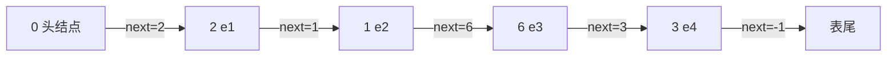

> 注意：静态链表中，**逻辑上相邻的元素在物理上不一定相邻**（由 `next` 游标串起来），这一点与单链表相同。

**简述基本操作的实现**：

| 操作            | 做法                                                                                  |
| ------------- | ----------------------------------------------------------------------------------- |
| **初始化**       | 把 `a[0]` 的 `next` 设为 -1；其他结点的 `next` 设为特殊值（如 -2）表示空闲                                |
| **查找**        | 从头结点出发**挨个往后遍历**结点                                                                  |
| **插入**（位序为 i） | ① 找到一个**空的结点**存入数据元素；② 从头结点出发找到位序为 **i-1** 的结点；③ 修改新结点的 `next`；④ 修改 i-1 号结点的 `next` |
| **删除**        | ① 从头结点出发找到**前驱结点**；② 修改前驱结点的游标；③ 被删除结点的 `next` 设为 -2                                |

> **如何判断结点是否为空**：可以让 `next` 为某个特殊值，如 -2。

**优缺点与适用场景**：

|          | 说明                                                        |
| -------- | --------------------------------------------------------- |
| **优点**   | 增、删操作**不需要大量移动元素**（不像顺序表）                                 |
| **缺点**   | **不能随机存取**，只能从头结点开始依次往后查找；**容量固定不可变**                     |
| **适用场景** | ① **不支持指针**的低级语言；② **数据元素数量固定不变**的场景（如操作系统的**文件分配表 FAT**） |


### 2.3.6 顺序表和链表的比较

从三个维度（Round 1~3）对比，最后回答"到底该用谁"。

#### Round 1：逻辑结构

**都属于线性表，都是线性结构**。

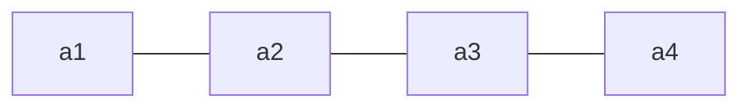

#### Round 2：存储结构

|        | 顺序表（顺序存储）                   | 链表（链式存储）                  |
| ------ | --------------------------- | ------------------------- |
| **优点** | 支持**随机存取**、**存储密度高**        | **离散的小空间**分配方便，**改变容量方便** |
| **缺点** | **大片连续空间**分配不方便，**改变容量不方便** | **不可随机存取**，**存储密度低**      |

#### Round 3：基本操作（按"创销、增删改查"复习）

**① 创（初始化）**：

|      | 顺序表                                              | 链表                                         |
| ---- | ------------------------------------------------ | ------------------------------------------ |
| 做法   | 需要**预分配大片连续空间**。分配过小 → 之后不便拓展；分配过大 → 浪费内存        | 只需分配**一个头结点**（也可不要头结点，只声明一个头指针），之后**方便拓展** |
| 静态分配 | 静态数组 → 容量**不可改变**                                | —                                          |
| 动态分配 | 动态数组（`malloc`、`free`）→ 容量可改变，但**需要移动大量元素，时间代价高** | —                                          |

**② 销（销毁）**：

|      | 顺序表                                | 链表               |
| ---- | ---------------------------------- | ---------------- |
| 做法   | 修改 `Length = 0`                    | 依次删除各个结点（`free`） |
| 空间回收 | 静态分配由**系统自动回收**；动态分配需**手动 `free`** | 需手动 `free`       |

> **注意**：`malloc` 和 `free` **必须成对出现**。

**③ 增、删**：

|         | 顺序表                     | 链表                        |
| ------- | ----------------------- | ------------------------- |
| 做法      | 插入/删除元素要将**后续元素都后移/前移** | 插入/删除元素**只需修改指针**         |
| 时间复杂度   | $O(n)$，时间开销**主要来自移动元素** | $O(n)$，时间开销**主要来自查找目标元素** |
| 数据元素很大时 | **移动的时间代价很高**           | **查找元素的时间代价更低**           |

**④ 查**：

|      | 顺序表                                     | 链表     |
| ---- | --------------------------------------- | ------ |
| 按位查找 | $O(1)$                                  | $O(n)$ |
| 按值查找 | $O(n)$；**若表内元素有序，可在 $O(\log_2 n)$ 内找到** | $O(n)$ |

#### 到底该用顺序表还是链表？

|             | 顺序表 | 链表 |
| ----------- | --- | -- |
| **弹性（可扩容）** | 差   | 好  |
| **增、删**     | 差   | 好  |
| **查**       | 好   | 差  |

**选择依据**：

- **表长难以预估、经常要增加/删除元素** —— 用**链表**；
- **表长可预估、查询（搜索）操作较多** —— 用**顺序表**。

#### 开放式问题的答题思路（重要考点）

> **问题**：实现线性表时，用顺序表还是链表好？（请描述顺序表和链表的……）

**答题框架**：

1. 顺序表和链表的**逻辑结构都是线性结构**，都属于**线性表**；
2. 但二者的**存储结构不同**：顺序表采用**顺序存储**……（特点 → 带来的优缺点）；链表采用**链式存储**……（特点 → 导致的优缺点）；
3. 由于采用不同的存储方式实现，因此**基本操作的实现效率也不同**：当**初始化**时……；当**插入**一个数据元素时……；当**删除**一个数据元素时……；当**查找**一个数据元素时……。

### 小结

1. **线性表**：相同数据类型的 $n$（$n\ge0$）个数据元素的有限序列；位序从 1 开始，数组下标从 0 开始。
2. **基本操作**：创销、增删改查（`InitList` / `DestroyList` / `ListInsert` / `ListDelete` / `LocateElem` / `GetElem` / `Length` / `PrintList` / `Empty`）；需要"把修改带回来"时参数要加 `&`。
3. **顺序表**：顺序存储，随机访问 $O(1)$、存储密度高；插删平均 $O(n)$（移动元素）；静态分配容量固定，动态分配扩容 $O(n)$。
4. **单链表**：链式存储，不要求连续空间；按位/按值查找、按位插入删除平均都是 $O(n)$（依次扫描）；**带头结点**写代码更方便。
5. **单链表的建立**：尾插法（要设**表尾指针** `r`，$O(n)$）、头插法（**逆序**，可用于**链表逆置**）；核心是"初始化 + 后插操作"。
6. **双链表**：可进可退（`prior` + `next`），但存储密度更低；插入/删除要注意**指针修改顺序**与"操作最后一个结点"的边界。
7. **循环链表**：循环单链表表尾 `next` 指向头结点（判空 `L->next == L`）；循环双链表头尾相接，插入/删除**无需判空边界**，代码更简洁。
8. **静态链表**：用数组实现的链表（`data` + `next` 游标），0 号为头结点、游标 -1 为表尾；适合不支持指针的语言、元素数量固定的场景（如 FAT）。
9. **顺序表 V.S. 链表**：逻辑结构相同（都是线性表）；存储结构不同 → 弹性/增删/查的优劣不同；**表长难估、频繁增删用链表；表长可估、查询多用顺序表**。

---

## 第三章 栈、队列和数组

| 考点                      | 重要程度 | 占分    | 常见题型  |
| ----------------------- | ---- | ----- | ----- |
| 栈的定义与基本操作（LIFO）         | ★★★  | 2~4 分 | 选择    |
| 栈的顺序存储（`top` 指针、共享栈）    | ★★★  | 2~4 分 | 选择、代码 |
| 栈的链式存储                  | ★★   | 2 分   | 选择    |
| 队列的定义与基本操作（FIFO）        | ★★★  | 2~4 分 | 选择    |
| 循环队列（判空/判满、元素个数）        | ★★★★ | 2~5 分 | 选择、计算 |
| 双端队列（输入/输出受限）           | ★★   | 2~4 分 | 选择    |
| 栈的应用（括号匹配、表达式求值、递归）     | ★★★★ | 4~6 分 | 综合、选择 |
| 特殊矩阵的压缩存储（对称、三角、三对角、稀疏） | ★★★  | 2~4 分 | 选择、计算 |

---


### 3.1.1 栈的基本概念

**定义**：**栈（Stack）是只允许在一端进行插入或删除操作的线性表**。

> 与普通线性表相比：
>
> - **逻辑结构**：与普通线性表**相同**；
> - **数据的运算**：插入、删除操作**有区别**（只能在栈顶进行）。

**重要术语**：

| 术语             | 含义              |
| -------------- | --------------- |
| **栈顶（Top）**    | **允许插入和删除**的一端  |
| **栈底（Bottom）** | **不允许插入和删除**的一端 |
| **空栈**         | 不含任何元素的栈        |

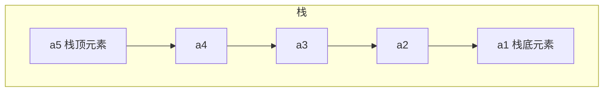

- **进栈顺序**：$a_1 \to a_2 \to a_3 \to a_4 \to a_5$
- **出栈顺序**：$a_5 \to a_4 \to a_3 \to a_2 \to a_1$
- **特点**：**后进先出**（Last In First Out，**LIFO**）

> 生活类比：一摞盘子（后放的先取）、烤串（后穿的先吃）。

**栈的基本操作**：

| 操作                 | 功能                                  | 归类 |
| ------------------ | ----------------------------------- | -- |
| `InitStack(&S)`    | 初始化栈。构造一个空栈 S，分配内存空间                | 创  |
| `DestroyStack(&S)` | 销毁栈。销毁并释放栈 S 所占用的内存空间               | 销  |
| `Push(&S, x)`      | **进栈**。若栈 S 未满，则将 x 加入使之成为**新栈顶**   | 增  |
| `Pop(&S, &x)`      | **出栈**。若栈 S 非空，则弹出栈顶元素，并用 x 返回      | 删  |
| `GetTop(S, &x)`    | **读栈顶元素**。若栈 S 非空，则用 x 返回栈顶元素       | 查  |
| `StackEmpty(S)`    | 判断一个栈 S 是否为空。若 S 为空返回 true，否则 false | 判空 |

> **要点**：
>
> - `Push` / `Pop` 会**删除**栈顶元素；`GetTop` **不删除**栈顶元素；
> - **查**：栈的使用场景中**大多只访问栈顶元素**；
> - **增、删只能在栈顶操作**。

#### 栈的常考题型

**问题**：进栈顺序为 $a \to b \to c \to d \to e$，有哪些合法的出栈顺序？

**结论**：$n$ 个不同元素进栈，出栈元素不同排列的个数为

$\frac{1}{n+1}C_{2n}^{n}$

上述公式称为**卡特兰（Catalan）数**，可采用数学归纳法证明（**不要求掌握**）。

例：$n=5$ 时

$\frac{1}{5+1}C_{10}^{5}=\frac{10\times9\times8\times7\times6}{6\times5\times4\times3\times2\times1}=42$

> 即 $a\to b\to c\to d\to e$ 进栈时，合法的出栈顺序共有 **42** 种。

**本节考点**：定义（操作受限的线性表，只能在栈顶插入/删除）→ 特性（**后进先出 LIFO**）→ 术语（栈顶、栈底、空栈）→ 基本操作（创销、增删、查、判空）。


### 3.1.2 栈的顺序存储实现

**顺序栈**：用**顺序存储**方式实现的栈 —— 用**静态数组**实现，并需要记录**栈顶指针**。

```c
#define MaxSize 10              // 定义栈中元素的最大个数
typedef struct{
    ElemType data[MaxSize];     // 静态数组存放栈中元素
    int top;                    // 栈顶指针
} SqStack;
```

> `Sq` = sequence（顺序）；顺序存储给各数据元素分配**连续**的存储空间，大小为 `MaxSize * sizeof(ElemType)`。

#### 1. 初始化操作

```c
void InitStack(SqStack &S){
    S.top = -1;                 // 初始化栈顶指针
}

bool StackEmpty(SqStack S){     // 判断栈空
    if(S.top == -1) return true;    // 栈空
    else return false;
}
```

> `top = -1` 时栈为空（此时 `top` 指向**栈顶元素**）。

#### 2. 进栈操作（Push）

```c
bool Push(SqStack &S, ElemType x){
    if(S.top == MaxSize - 1) return false;   // 栈满，报错
    S.top = S.top + 1;                       // 指针先加 1
    S.data[S.top] = x;                       // 新元素入栈
    return true;
}
```

> 上面两行**等价于** `S.data[++S.top] = x;`  
> **错误写法**（指针与赋值顺序颠倒）：  
> `S.data[S.top] = x;  S.top = S.top + 1;` 或 `S.data[S.top++] = x;`

#### 3. 出栈操作（Pop）

```c
bool Pop(SqStack &S, ElemType &x){
    if(S.top == -1) return false;   // 栈空，报错
    x = S.data[S.top];              // 栈顶元素先出栈
    S.top = S.top - 1;              // 指针再减 1
    return true;
}
```

> 上面两行**等价于** `x = S.data[S.top--];`  
> **错误写法**：`S.top = S.top - 1;  x = S.data[S.top];` 或 `x = S.data[--S.top];`  
> **注意**：出栈后数据**仍残留在内存**中，只是**逻辑上**被删除了。

#### 4. 读栈顶元素（GetTop）

```c
bool GetTop(SqStack S, ElemType &x){
    if(S.top == -1) return false;   // 栈空，报错
    x = S.data[S.top];              // x 记录栈顶元素
    return true;
}
```

> 与 `Pop` 的**唯一区别**：`Pop` 有 `S.top = S.top - 1`（先出栈、指针再减 1），`GetTop` **不移动指针**。

#### 5. 另一种方式（`top` 指向"下一个可插入位置"）

| 操作     | `top` 初始为 **-1**（指向栈顶元素） | `top` 初始为 **0**（指向下一个可插入位置） |
| ------ | ------------------------ | --------------------------- |
| 初始化    | `S.top = -1`             | `S.top = 0`                 |
| 进栈     | `S.data[++S.top] = x`    | `S.data[S.top++] = x`       |
| 出栈     | `x = S.data[S.top--]`    | `x = S.data[--S.top]`       |
| 读栈顶    | `x = S.data[S.top]`      | `x = S.data[S.top - 1]`     |
| **判空** | `S.top == -1`            | `S.top == 0`                |
| **判满** | `S.top == MaxSize - 1`   | `S.top == MaxSize`          |

> **顺序栈的缺点**：**栈的大小不可变**（静态数组）。  
> **审题提醒**：做题前先看清题目用的是哪种实现方式。

#### 6. 共享栈

**两个栈共享同一片内存空间**，两个栈**从两边往中间增长**。

```c
#define MaxSize 10
typedef struct{
    ElemType data[MaxSize];     // 静态数组存放栈中元素
    int top0;                   // 0 号栈栈顶指针
    int top1;                   // 1 号栈栈顶指针
} ShStack;

void InitStack(ShStack &S){
    S.top0 = -1;                // 0 号栈从左边开始增长
    S.top1 = MaxSize;           // 1 号栈从右边开始增长
}
```

> **栈满的条件**：`top0 + 1 == top1`（两个栈顶指针相遇）。  
> 好处：更充分地利用存储空间（只有在整片空间都被占满时才溢出）。

#### 小结

- 顺序栈的基本操作（创、增、删、查）都是 **$O(1)$** 时间复杂度；
- 两种实现方式（`top` 初值 -1 / 0）的**判空、判满、指针移动方式都不同**，要看清题目；
- **共享栈**：两个栈从两端往中间增长，栈满条件 `top0 + 1 == top1`；
- 顺序栈的**缺点**是容量固定不可变。

### 3.1.3 栈的链式存储实现

**链栈**：用**链式存储**方式实现的栈。

```c
typedef struct Linknode{
    ElemType data;              // 数据域
    struct Linknode *next;      // 指针域
} *LiStack;                     // 栈类型定义
```

**核心思想**：**进栈 / 出栈都只能在栈顶一端进行**，因此把**链头作为栈顶**：

| 链栈操作   | 对应单链表操作                     |
| ------ | --------------------------- |
| **进栈** | 对**头结点**的**后插**操作（头插法建立单链表） |
| **出栈** | 对**头结点**的**后删**操作           |

**两种实现方式**：

|     | 带头结点               | 不带头结点（**推荐**） |
| --- | ------------------ | ------------- |
| 初始化 | `S -> 头结点 -> NULL` | `S -> NULL`   |

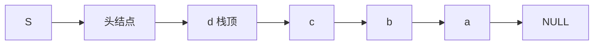

> **注意**：链栈**一般不会满**（除非内存耗尽），因此通常**不需要判满**，只需判空（`S == NULL` 或 `S->next == NULL`）。

**本节要点**：链栈的**进栈、出栈都在链头进行**；本质就是"头插法建立单链表"+"对头结点的后删"，建议**动手写一遍**初始化、进栈、出栈、读栈顶、判空的代码。


### 3.2.1 队列的基本概念

**定义**：**队列（Queue）是只允许在一端进行插入，在另一端删除的线性表**。

> 与栈对比：栈是"只允许在一端进行插入或删除"，队列是"一端插入、另一端删除"。

**重要术语**：

| 术语            | 含义          |
| ------------- | ----------- |
| **队头（Front）** | **允许删除**的一端 |
| **队尾（Rear）**  | **允许插入**的一端 |
| **空队列**       | 不含任何元素的队列   |

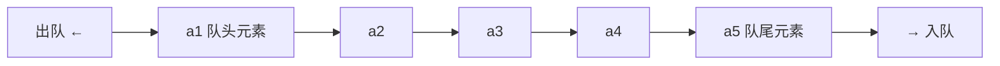

- **入队**（EnQueue）：在**队尾**插入元素；
- **出队**（DeQueue）：在**队头**删除元素；
- **特点**：**先进先出**（First In First Out，**FIFO**）。

> 生活类比：排队打饭、收费站排队 —— 先进入队列的元素先出队。

**队列的基本操作**：

| 操作                 | 功能                                  | 归类 |
| ------------------ | ----------------------------------- | -- |
| `InitQueue(&Q)`    | 初始化队列。构造一个空队列 Q                     | 创  |
| `DestroyQueue(&Q)` | 销毁队列。销毁并释放队列 Q 所占用的内存空间             | 销  |
| `EnQueue(&Q, x)`   | **入队**。若队列 Q 未满，将 x 加入，使之成为**新的队尾** | 增  |
| `DeQueue(&Q, &x)`  | **出队**。若队列 Q 非空，删除**队头**元素，并用 x 返回  | 删  |
| `GetHead(Q, &x)`   | **读队头元素**。若队列 Q 非空，则将队头元素赋值给 x      | 查  |
| `QueueEmpty(Q)`    | 判队列空。若队列 Q 为空返回 true，否则 false       | 判空 |

> **要点**：
>
> - `EnQueue` / `DeQueue` 会**删除**队头元素；`GetHead` **不删除**队头元素；
> - **查**：队列的使用场景中**大多只访问队头元素**；
> - 增、删**只能在规定的一端进行**（队尾插入、队头删除）。

**本节考点**：定义（只能在**队尾插入、队头删除**的操作受限线性表）→ 特性（**先进先出 FIFO**）→ 术语（队头、队尾、空队列、队头元素、队尾元素）→ 基本操作（创销、增删、查、判空）。


### 3.2.2 队列的顺序实现

```c
#define MaxSize 10              // 定义队列中元素的最大个数
typedef struct{
    ElemType data[MaxSize];     // 用静态数组存放队列元素
    int front, rear;            // 队头指针和队尾指针
} SqQueue;
```

> **指针指向约定**（本节默认）：`front` 指向**队头元素**；`rear` 指向**队尾元素的后一个位置**（即**下一个应该插入的位置**）。

#### 1. 初始化操作

```c
void InitQueue(SqQueue &Q){
    Q.rear = Q.front = 0;       // 初始时，队头、队尾指针指向 0
}

bool QueueEmpty(SqQueue Q){
    if(Q.rear == Q.front) return true;   // 队空条件
    else return false;
}
```

#### 2. 入队操作（EnQueue）

**朴素做法**（`rear == MaxSize` 判断队满 —— **错误**，会造成"假溢出"）：

```c
Q.data[Q.rear] = x;             // 将 x 插入队尾
Q.rear = Q.rear + 1;            // 队尾指针后移
```

**循环队列做法**（用**取模运算**）：

```c
bool EnQueue(SqQueue &Q, ElemType x){
    if((Q.rear + 1) % MaxSize == Q.front) return false;   // 队满则报错
    Q.data[Q.rear] = x;                                   // 新元素插入队尾
    Q.rear = (Q.rear + 1) % MaxSize;                      // 队尾指针加 1 取模
    return true;
}
```

> **模运算**：将无限的整数域映射到有限的整数集合 $\{0,1,2,\dots,MaxSize-1\}$ 上，把存储空间在**逻辑上变成了"环状"**（循环队列）。  
> 跨考 Tips：取模运算即取余运算，两个整数 $a,b$，`a % b` == $a$ 除以 $b$ 的余数；《数论》中通常表示为 $a \bmod b$。

#### 3. 出队操作（DeQueue）

```c
bool DeQueue(SqQueue &Q, ElemType &x){
    if(Q.rear == Q.front) return false;   // 队空则报错
    x = Q.data[Q.front];
    Q.front = (Q.front + 1) % MaxSize;    // 队头指针后移
    return true;
}

// 获得队头元素的值，用 x 返回
bool GetHead(SqQueue Q, ElemType &x){
    if(Q.rear == Q.front) return false;   // 队空则报错
    x = Q.data[Q.front];
    return true;
}
```

> **只能让队头元素出队**。

#### 4. 循环队列：判断队满 / 队空（三种方案）

**问题**：`Q.rear == Q.front` 既可能是**队空**，也可能是**队满**，需要区分。

**方案一：牺牲一个存储单元**（默认方案）

| 判断         | 条件                                                      |
| ---------- | ------------------------------------------------------- |
| **队空**     | `Q.rear == Q.front`                                     |
| **队满**     | `(Q.rear + 1) % MaxSize == Q.front`（队尾指针的**再下一个位置**是队头） |
| **队列元素个数** | `(rear + MaxSize - front) % MaxSize`                    |

> 代价：牺牲一个存储单元（`MaxSize=10` 的数组最多只能存 **9** 个元素）。

**方案二：增加 `size` 变量记录队列长度**

```c
typedef struct{
    ElemType data[MaxSize];
    int front, rear;
    int size;                   // 队列当前长度
} SqQueue;
```

- 插入成功 `size++`；删除成功 `size--`；
- **队列元素个数 = `size`**；
- **队空**：`size == 0`；**队满**：`size == MaxSize`。

**方案三：增加 `tag` 变量标记最近一次操作**

```c
typedef struct{
    ElemType data[MaxSize];
    int front, rear;
    int tag;                    // 最近进行的是删除(0) / 插入(1)
} SqQueue;
```

- **只有删除操作**才可能导致队空；**只有插入操作**才可能导致队满；
- 每次**删除**成功令 `tag = 0`；每次**插入**成功令 `tag = 1`；
- **队空**：`front == rear && tag == 0`；
- **队满**：`front == rear && tag == 1`。

#### 5. 其他出题方法：`rear` 指向队尾元素

若约定 **`rear` 指向队尾元素**（而非后一个位置）：

| 操作     | 写法                                                                   |
| ------ | -------------------------------------------------------------------- |
| 入队     | `Q.rear = (Q.rear + 1) % MaxSize;  Q.data[Q.rear] = x;`（**先移动指针再存**） |
| 出队     | `x = Q.data[Q.front];  Q.front = (Q.front + 1) % MaxSize;`           |
| **判空** | `(Q.rear + 1) % MaxSize == Q.front`                                  |
| **判满** | **不能**用 `(Q.rear+1)%MaxSize == Q.front`（与判空冲突），需另想办法                 |

> **判满的替代方案**：① **牺牲一个存储单元**；② **增加辅助变量**（`size` 或 `tag`）。

**解题套路**：遇到队列的题，先确定两件事 ——

1. **`front`、`rear` 指针的指向**：① `rear` 指向队尾元素**后一个位置**；② `rear` 指向**队尾元素**；
2. **判空/判满的方法**：a. 牺牲一个存储单元；b. 增加 `size` 变量；c. 增加 `tag` 标记。

组合起来（①a、①b、①c、②a、②b、②c）就是各种考题。


### 3.2.3 队列的链式实现

**链队列**：用**链式存储**方式实现的队列。

```c
typedef struct LinkNode{        // 链式队列结点
    ElemType data;
    struct LinkNode *next;
} LinkNode;

typedef struct{                 // 链式队列
    LinkNode *front, *rear;     // 队列的队头和队尾指针
} LinkQueue;
```

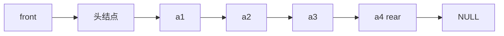

#### 1. 初始化

|        | 带头结点                                                                                | 不带头结点                                |
| ------ | ----------------------------------------------------------------------------------- | ------------------------------------ |
| 代码     | `Q.front = Q.rear = (LinkNode*)malloc(sizeof(LinkNode));`  
`Q.front->next = NULL;` | `Q.front = NULL;`  
`Q.rear = NULL;` |
| **判空** | `Q.front == Q.rear`                                                                 | `Q.front == NULL`                    |

#### 2. 入队（EnQueue）

**带头结点**（代码统一，无需特判）：

```c
void EnQueue(LinkQueue &Q, ElemType x){
    LinkNode *s = (LinkNode *)malloc(sizeof(LinkNode));
    s->data = x;
    s->next = NULL;
    Q.rear->next = s;           // 新结点插入到 rear 之后
    Q.rear = s;                 // 修改表尾指针
}
```

**不带头结点**（**第一个元素入队需特别处理**）：

```c
void EnQueue(LinkQueue &Q, ElemType x){
    LinkNode *s = (LinkNode *)malloc(sizeof(LinkNode));
    s->data = x;
    s->next = NULL;
    if(Q.front == NULL){        // 在空队列中插入第一个元素
        Q.front = s;            // 修改队头、队尾指针
        Q.rear = s;
    } else {
        Q.rear->next = s;       // 新结点插入到 rear 结点之后
        Q.rear = s;             // 修改 rear 指针
    }
}
```

#### 3. 出队（DeQueue）

**带头结点**：

```c
bool DeQueue(LinkQueue &Q, ElemType &x){
    if(Q.front == Q.rear) return false;   // 空队
    LinkNode *p = Q.front->next;
    x = p->data;                          // 用变量 x 返回队头元素
    Q.front->next = p->next;              // 修改头结点的 next 指针
    if(Q.rear == p)                       // 此次是最后一个结点出队
        Q.rear = Q.front;                 // 修改 rear 指针
    free(p);                              // 释放结点空间
    return true;
}
```

**不带头结点**（**最后一个元素出队需特别处理**）：

```c
bool DeQueue(LinkQueue &Q, ElemType &x){
    if(Q.front == NULL) return false;     // 空队
    LinkNode *p = Q.front;                // p 指向此次出队的结点
    x = p->data;                          // 用变量 x 返回队头元素
    Q.front = p->next;                    // 修改 front 指针
    if(Q.rear == p){                      // 此次是最后一个结点出队
        Q.front = NULL;                   // front 指向 NULL
        Q.rear = NULL;                    // rear 指向 NULL
    }
    free(p);                              // 释放结点空间
    return true;
}
```

#### 4. 队列满的条件

| 存储方式     | 队满条件                            |
| -------- | ------------------------------- |
| **顺序存储** | **预分配的空间耗尽**时队满                 |
| **链式存储** | **一般不会队满**（除非内存不足）→ **不存在"判满"** |

**本节考点**：链队列的初始化（带头/不带头）→ 入队（不带头时**第一个元素**要特判）→ 出队（不带头时**最后一个元素**要特判）→ 判空 → **判满不存在**。


### 3.2.4 双端队列

**三种"操作受限的线性表"对比**：

| 结构              | 插入        | 删除         |
| --------------- | --------- | ---------- |
| **栈**           | 只能从**一端** | 只能从**同一端** |
| **队列**          | 只能从**一端** | 只能从**另一端** |
| **双端队列（Deque）** | 允许从**两端** | 允许从**两端**  |

> **双端队列（Deque）**：只允许从**两端插入、两端删除**的线性表。  
> 若只使用其中一端的插入、删除操作，则效果**等同于栈**。

**两种受限变种**：

| 变种            | 插入           | 删除           |
| ------------- | ------------ | ------------ |
| **输入受限**的双端队列 | 只允许从**一端**插入 | 允许从**两端**删除  |
| **输出受限**的双端队列 | 允许从**两端**插入  | 只允许从**一端**删除 |

#### 考点：判断输出序列合法性

**问题**：数据元素输入序列为 $1,2,3,4$，则哪些输出序列是合法的？

全部排列共 $A_4^4 = 4! = 24$ 种。

**① 栈**（只能一端插入、同一端删除）：

合法的输出序列有 **14** 种 —— 即卡特兰数

$\frac{1}{n+1}C_{2n}^{n}=\frac{1}{4+1}C_{8}^{4}=14$

**非法的 10 种**为：

|         |         |         |
| ------- | ------- | ------- |
| 3,1,2,4 | 3,1,4,2 | 4,1,2,3 |
| 4,1,3,2 | 4,2,1,3 | 4,2,3,1 |
| 4,3,1,2 | 1,4,2,3 | 2,4,1,3 |
| 3,4,1,2 |         |         |

**② 输入受限的双端队列**：**非法的 5 种**为

|         |         |
| ------- | ------- |
| 3,1,2,4 | 3,1,4,2 |
| 4,2,1,3 | 4,2,3,1 |
| 1,4,2,3 |         |

**③ 输出受限的双端队列**：**非法的 5 种**为

|         |         |
| ------- | ------- |
| 3,1,2,4 | 3,1,4,2 |
| 4,1,3,2 | 4,2,3,1 |
| 1,4,2,3 |         |

> **重要结论**：**在栈中合法的输出序列，在双端队列中必定合法**（因为栈是双端队列的一种特例 —— 两端都只使用同一端）。  
> 所以双端队列合法的序列数 **≥** 栈合法的序列数（本例中：栈 14 种，两种受限双端队列各 19 种）。

**本节考点**：三种结构的定义辨析 → 输出序列合法性的判断 → "栈合法 ⇒ 双端队列必合法"。

> 回忆：栈的变种是**共享栈**（两栈共享一片空间，从两端向中间增长）。


### 3.3.1 栈在括号匹配中的应用

**问题**：编译器中，括号不匹配会报错（如 `int x = 10*(20*(1+1)-(3-2));`）。

**核心思路**：

- **最后出现的左括号最先被匹配**（**LIFO**）→ 可用**栈**实现该特性；
- 每出现一个**右括号**，就"**消耗**"一个左括号 → **出栈**。

即：**遇到左括号就入栈；遇到右括号，就"消耗"一个左括号**（弹出栈顶元素检查是否匹配）。

**三种匹配失败的情况**：

| 失败情况          | 说明                         |
| ------------- | -------------------------- |
| ① **左括号单身**   | 处理完所有括号后，**栈非空**（有左括号没被匹配） |
| ② **右括号单身**   | 扫描到右括号时，**栈空**（没有左括号可消耗）   |
| ③ **左右括号不匹配** | 弹出的栈顶左括号与当前右括号**类型不一致**    |

**算法流程图**：

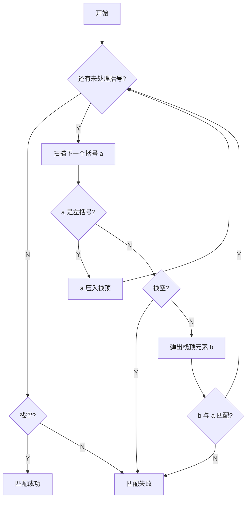

**算法实现**：

```c
bool bracketCheck(char str[], int length){
    SqStack S;
    InitStack(S);                       // 初始化一个栈
    for(int i = 0; i < length; i++){
        if(str[i] == '(' || str[i] == '[' || str[i] == '{'){
            Push(S, str[i]);            // 扫描到左括号，入栈
        } else {
            if(StackEmpty(S))           // 扫描到右括号，且当前栈空
                return false;           // 匹配失败
            char topElem;
            Pop(S, topElem);            // 栈顶元素出栈
            if(str[i] == ')' && topElem != '(') return false;
            if(str[i] == ']' && topElem != '[') return false;
            if(str[i] == '}' && topElem != '{') return false;
        }
    }
    return StackEmpty(S);               // 检索完全部括号后，栈空说明匹配成功
}
```

> **考试技巧**：考场上**可直接使用基本操作**（`InitStack` / `Push` / `Pop` / `StackEmpty`），但建议**简要说明接口**。  
> **练习建议**：不要用基本操作，动手实现完整代码。


### 3.3.2 栈在表达式求值中的应用

#### 1. 三种算术表达式

中缀表达式由三部分组成：**操作数、运算符、界限符**（括号）。界限符必不可少，它反映了计算的先后顺序。

波兰数学家的灵感：**不用界限符也能无歧义地表达运算顺序** —— 这就是波兰表达式。

| 表达式                                     | 规则              | 例                       |
| --------------------------------------- | --------------- | ----------------------- |
| **中缀表达式**                               | 运算符在两个操作数**中间** | `a+b`；`a+b-c`；`a+b-c*d` |
| **后缀表达式**（逆波兰式 Reverse Polish notation） | 运算符在两个操作数**后面** | `ab+`；`ab+c-`；`ab+cd*-` |
| **前缀表达式**（波兰式 Polish notation）          | 运算符在两个操作数**前面** | `+ab`；`-+abc`；`-+ab*cd` |

> **关键结论**：一个中缀表达式可以对应**多个**后缀、前缀表达式；  
> 但若规定"左优先"/"右优先"原则，则一个中缀表达式**只对应一个**后缀表达式（保证算法的**确定性**）。

#### 2. 中缀表达式转后缀表达式（手算）

**手算方法**：

1. 确定中缀表达式中**各个运算符的运算顺序**；
2. 选择下一个运算符，按照「**左操作数 右操作数 运算符**」的方式组合成一个新的操作数；
3. 如果还有运算符没被处理，就继续 ②。

**"左优先"原则**：只要**左边的运算符能先计算，就优先算左边的** —— 保证手算和机算结果相同。

**例**：`((15 ÷ (7 - (1 + 1))) × 3) - (2 + (1 + 1))`

$\Rightarrow\ 15\ 7\ 1\ 1\ +\ -\ \div\ 3\ \times\ 2\ 1\ 1\ +\ +\ -$

**例**：`A + B - C * D / E + F` → `AB + CD * E / - F +`

**例**（对比"左优先"与否）：`A + B * (C - D) - E / F`

| 原则          | 运算顺序  | 后缀表达式               |
| ----------- | ----- | ------------------- |
| **左优先**（推荐） | ③②①⑤④ | `ABCD - * + EF / -` |
| 非左优先        | ⑤③②④① | `ABCD - * EF / - +` |

> 客观来看两种都正确，但**机算结果是前者**（左优先）。

#### 3. 后缀表达式的计算

**手算方法**：**从左往右**扫描，每遇到一个运算符，就让运算符**前面最近的两个操作数**执行对应运算，**合体为一个操作数**。

> **注意**：两个操作数的**左右顺序**（左操作数 在左，右操作数 在右）。

**机算（用栈实现）**：

1. **从左往右**扫描下一个元素，直到处理完所有元素；
2. 若扫描到**操作数**则**压入栈**，并回到 ①；否则执行 ③；
3. 若扫描到**运算符**，则**弹出两个栈顶元素**，执行相应运算，**运算结果压回栈顶**，回到 ①。

> **注意**：**先出栈的是"右操作数"**（因为左操作数先进栈）。  
> 若表达式合法，则最后**栈中只会留下一个元素**，就是**最终结果**。  
> **应用**：后缀表达式适用于**基于栈的编程语言**（stack-oriented programming language），如 **Forth**、**PostScript**。

#### 4. 中缀表达式转前缀表达式（手算）

**手算方法**：

1. 确定中缀表达式中**各个运算符的运算顺序**；
2. 选择下一个运算符，按照「**运算符 左操作数 右操作数**」的方式组合成一个新的操作数；
3. 如果还有运算符没被处理，就继续 ②。

**"右优先"原则**：只要**右边的运算符能先计算，就优先算右边的**。

**例**：`A + B * (C - D) - E / F`

| 运算顺序  | 前缀表达式                 |
| ----- | --------------------- |
| ③②①⑤④ | `- + A * B - CD / EF` |
| ⑤③②④① | `+ A - * B - CD / EF` |

**例**：`((15 ÷ (7 - (1 + 1))) × 3) - (2 + (1 + 1))` → `- × ÷ 15 - 7 + 1 1 3 + 2 + 1 1`

#### 5. 前缀表达式的计算（机算）

用栈实现前缀表达式的计算：

1. **从右往左**扫描下一个元素，直到处理完所有元素；
2. 若扫描到**操作数**则**压入栈**，并回到 ①；否则执行 ③；
3. 若扫描到**运算符**，则**弹出两个栈顶元素**，执行相应运算，**运算结果压回栈顶**，回到 ①。

> **注意**：**先出栈的是"左操作数"**（与后缀表达式相反）。

#### 6. 本节要点速记

| 操作      | 方向         | 先出栈的是    |
| ------- | ---------- | -------- |
| 后缀表达式求值 | **从左往右**扫描 | **右操作数** |
| 前缀表达式求值 | **从右往左**扫描 | **左操作数** |

| 转换      | 原则      | 组合方式            |
| ------- | ------- | --------------- |
| 中缀 → 后缀 | **左优先** | <左操作数 右操作数 运算符> |
| 中缀 → 前缀 | **右优先** | <运算符 左操作数 右操作数> |

**后缀转中缀**：从左往右扫描，每遇到一个运算符，就将 <左操作数 右操作数 运算符> 变为 **(左操作数 运算符 右操作数)** 的形式。

#### 7. 机算：用栈实现「中缀转后缀」

初始化**一个栈**，用于保存**暂时还不能确定运算顺序的运算符**。**从左到右**处理各个元素，直到末尾。

可能遇到**三种情况**：

| 遇到        | 处理方式                                                                          |
| --------- | ----------------------------------------------------------------------------- |
| ① **操作数** | **直接加入后缀表达式**                                                                 |
| ② **界限符** | 遇到 `(` **直接入栈**；遇到 `)` 则**依次弹出栈内运算符**并加入后缀表达式，直到弹出 `(` 为止。**注意：`(` 不加入后缀表达式** |
| ③ **运算符** | 依次弹出栈中**优先级高于或等于**当前运算符的所有运算符，并加入后缀表达式；若碰到 `(` 或**栈空**则停止。之后再**把当前运算符入栈**     |

> 按上述方法处理完所有字符后，将栈中**剩余运算符**依次弹出，并加入后缀表达式。

**例**：`A+B-C*D/E+F` → `AB+CD*E/-F+`  
**例**：`A+B*(C-D)-E/F` → `ABCD-*+EF/-`

#### 8. 机算：用栈实现「后缀表达式求值」

1. **从左往右**扫描下一个元素，直到处理完所有元素；
2. 若扫描到**操作数**则**压入栈**，并回到 ①；否则执行 ③；
3. 若扫描到**运算符**，则**弹出两个栈顶元素**，执行相应运算，**运算结果压回栈顶**，回到 ①。

> **注意**：先出栈的是"**右操作数**"。

#### 9. 机算：用栈实现「中缀表达式求值」（两个栈）

初始化**两个栈**：**操作数栈**和**运算符栈**。

- 若扫描到**操作数**，**压入操作数栈**；
- 若扫描到**运算符或界限符**，则按照"**中缀转后缀**"相同的逻辑压入**运算符栈**（期间也会弹出运算符）；
- **每当弹出一个运算符时，就需要再弹出两个操作数栈的栈顶元素并执行相应运算，运算结果再压回操作数栈**。

> **本质**：把"中缀转后缀"和"后缀表达式求值"**合并成一步**完成。

#### 10. 三个机算算法速记

| 算法          | 栈的数量                 | 扫描方向 | 要点                                           |
| ----------- | -------------------- | ---- | -------------------------------------------- |
| **中缀 → 后缀** | 1 个（运算符栈）            | 从左往右 | 操作数直接输出；`(` 入栈、`)` 弹到 `(`；运算符弹出优先级 **≥** 自己的 |
| **后缀表达式求值** | 1 个（操作数栈）            | 从左往右 | 遇运算符弹出 2 个操作数，**先出的是右操作数**                   |
| **中缀表达式求值** | **2 个**（操作数栈 + 运算符栈） | 从左往右 | 弹出一个运算符就立刻做一次运算，结果回压操作数栈                     |


### 3.3.3 栈在递归中的应用

#### 1. 函数调用背后的过程

**函数调用的特点**：**最后被调用的函数最先执行结束**（**LIFO**）。

**函数调用时**，需要用一个"**函数调用栈**"存储：

1. **调用返回地址**
2. **实参**
3. **局部变量**

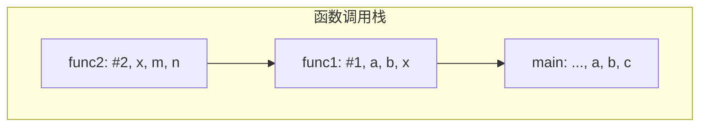

> 即：`main` 调用 `func1`，`func1` 调用 `func2`，则 `func2` 的栈帧在栈顶，最先执行结束、最先出栈。

#### 2. 栈在递归中的应用

**适合用"递归"算法解决的问题**：可以把原始问题转换为**属性相同，但规模较小**的问题。

**例 1：计算正整数的阶乘 $n!$**

$\text{factorial}(n)=\begin{cases}n\times\text{factorial}(n-1),&n>1\\[4pt]1,&n=1\\[4pt]1,&n=0\end{cases}$

- $n\times\text{factorial}(n-1)$ —— **递归表达式**（**递归体**）
- $n=1$、$n=0$ 时返回 1 —— **边界条件**（**递归出口**）

**例 2：求斐波那契数列**

$\text{Fib}(n)=\begin{cases}\text{Fib}(n-1)+\text{Fib}(n-2),&n>1\\[4pt]1,&n=1\\[4pt]0,&n=0\end{cases}$

**递归工作栈**：

- 递归调用时，函数调用栈可称为"**递归工作栈**"；
- **每进入一层递归**，就将递归调用所需信息**压入栈顶**；
- **每退出一层递归**，就从**栈顶弹出**相应信息。

#### 3. 递归的缺点与改造

| 缺点       | 说明                      |
| -------- | ----------------------- |
| **效率低**  | 太多层递归可能会导致**栈溢出**       |
| **重复计算** | 如求斐波那契数列时可能包含**很多重复计算** |

> **改进**：可以**自定义栈**，将递归算法**改造成非递归算法**。

**本节考点**：函数调用栈存什么（返回地址、实参、局部变量）→ 递归工作栈的入栈/出栈时机 → 递归的两个缺点（栈溢出、重复计算）→ 可用自定义栈改造成非递归。

### 3.3.4 队列在层次遍历中的应用

| 应用           | 说明                              |
| ------------ | ------------------------------- |
| **树的层次遍历**   | 用队列保存待访问的结点，一层一层地访问（在"树"章节详细学习） |
| **图的广度优先遍历** | 用队列保存待访问的顶点，由近及远地访问（在"图"章节详细学习） |

### 3.3.5 队列在操作系统中的应用

**核心场景**：多个进程争抢着使用**有限的系统资源**时，**FCFS**（First Come First Service，**先来先服务**）是一种常用策略 —— **可用队列实现**。

| 例子            | 说明                                               |
| ------------- | ------------------------------------------------ |
| **CPU 资源的分配** | 各进程按到达顺序排成**就绪进程队列**，依次获得 CPU                    |
| **打印数据缓冲区**   | 多个同学共用一台打印机时，打印任务按先后顺序排成队列；**可缓解主机与打印机速度不匹配的问题** |

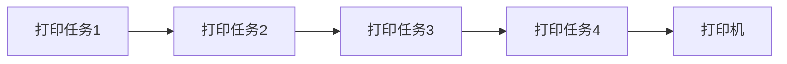

**本节考点**：队列的两个典型应用场景 —— **层次遍历 / 广度优先遍历**（先进先出保证"由近及远"）、**操作系统的 FCFS 调度与缓冲区**。


### 3.4 特殊矩阵的压缩存储

#### 1. 数组的存储结构

**一维数组** `ElemType a[10];`

- 各数组元素**大小相同**，且**物理上连续存放**；
- `a[i]` 的存放地址 = **LOC + i × sizeof(ElemType)**（$0\le i<10$）。

> **注意**：除非题目特别说明，否则**数组下标默认从 0 开始**（**易错，注意审题**）。

**二维数组** `ElemType b[2][4];`（2 行 4 列）

逻辑视角是一个 $2\times4$ 的表格，但在内存中有两种铺法：

| 存储方式      | 排列顺序                                        |
| --------- | ------------------------------------------- |
| **行优先存储** | `b[0][0] b[0][1] b[0][2] b[0][3] b[1][0] …` |
| **列优先存储** | `b[0][0] b[1][0] b[0][1] b[1][1] b[0][2] …` |

**地址计算公式**（$M$ 行 $N$ 列的二维数组 `b[M][N]`，起始地址 LOC）：

| 存储方式    | 公式                                                    |
| ------- | ----------------------------------------------------- |
| **行优先** | `b[i][j]` 地址 = **LOC + (i×N + j) × sizeof(ElemType)** |
| **列优先** | `b[i][j]` 地址 = **LOC + (j×M + i) × sizeof(ElemType)** |

> **重要提醒**：**描述矩阵元素时，行、列号通常从 1 开始；而描述数组时通常下标从 0 开始**（具体看题目条件，**注意审题**）。

#### 2. 对称矩阵的压缩存储

**定义**：若 $n$ 阶方阵中任意一个元素 $a_{ij}$ 都有 $a_{ij}=a_{ji}$，则该矩阵为**对称矩阵**。

| 区域   | 条件    |
| ---- | ----- |
| 上三角区 | $i<j$ |
| 主对角线 | $i=j$ |
| 下三角区 | $i>j$ |

**普通存储**：$n\times n$ 二维数组（浪费约一半空间）。

**压缩存储策略**：只存储**主对角线 + 下三角区**（或主对角线 + 上三角区），按**行优先**原则将各元素存入一维数组 `B`。

- 数组大小 = $\dfrac{n(n+1)}{2}$

**映射公式**（矩阵下标 → 一维数组下标）：

$k=\begin{cases}\dfrac{i(i-1)}{2}+j-1,&i\ge j\ \text{（下三角区和主对角线元素）}\\[8pt]\dfrac{j(j-1)}{2}+i-1,&i<j\ \text{（上三角区元素，利用 } a_{ij}=a_{ji}\text{）}\end{cases}$

> **推导思路**：按行优先，$a_{ij}$ 前面有完整的 $1+2+\dots+(i-1)$ 个元素，再加上本行的第 $j$ 个。  
> **出题变化**：① 存上三角还是下三角？② 行优先还是列优先？③ 矩阵元素下标从 0 还是 1 开始？④ 数组下标从 0 还是 1 开始？—— 任一变化，公式都要跟着改。

#### 3. 三角矩阵的压缩存储

| 类型        | 特点                              |
| --------- | ------------------------------- |
| **下三角矩阵** | 除了主对角线和下三角区，**其余元素都相同**（常量 $c$） |
| **上三角矩阵** | 除了主对角线和上三角区，**其余元素都相同**（常量 $c$） |

**压缩存储策略**：按**行优先**原则将非常量区元素存入一维数组，并**在最后一个位置存储常量 $c$**。

- 数组大小 = $\dfrac{n(n+1)}{2}+1$

**下三角矩阵**的映射公式：

$k=\begin{cases}\dfrac{i(i-1)}{2}+j-1,&i\ge j\ \text{（下三角区和主对角线元素）}\\[8pt]\dfrac{n(n+1)}{2},&i<j\ \text{（上三角区元素，值为常量 }c\text{）}\end{cases}$

**上三角矩阵**的映射公式：

$k=\begin{cases}\dfrac{(i-1)(2n-i+2)}{2}+(j-i),&i\le j\ \text{（上三角区和主对角线元素）}\\[8pt]\dfrac{n(n+1)}{2},&i>j\ \text{（下三角区元素，值为常量 }c\text{）}\end{cases}$

#### 4. 三对角矩阵（带状矩阵）的压缩存储

**定义**：当 $|i-j|>1$ 时，有 $a_{ij}=0$（$1\le i,j\le n$）。

**压缩存储策略**：按**行优先**（或列优先）原则，**只存储带状部分**。

- 数组大小 = $3n-2$（即 `B[0]` ~ `B[3n-3]`）

**正向映射**（$|i-j|\le1$）：

$k=2i+j-3$

> **推导**：前 $i-1$ 行共 $3(i-1)-1$ 个元素；$a_{ij}$ 是第 $i$ 行的第 $j-i+2$ 个元素；  
> 所以 $a_{ij}$ 是第 $3(i-1)-1+(j-i+2)=2i+j-2$ 个元素，下标 $k=2i+j-3$。

**反向映射**（已知 $k$ 求 $i,j$）：

$i=\left\lceil\dfrac{k+2}{3}\right\rceil\quad\text{或}\quad i=\left\lfloor\dfrac{k+1}{3}+1\right\rfloor,\qquad j=k-2i+3$

> **思路**：第 $k+1$ 个元素满足 $3(i-1)-1<k+1\le3i-1$，解出 $i$ 的范围后向上取整。

#### 5. 稀疏矩阵的压缩存储

**定义**：**非零元素远远少于矩阵元素的个数**。

**压缩存储策略**：**只存储非零元素**。

| 策略         | 做法                                |
| ---------- | --------------------------------- |
| **① 顺序存储** | **三元组** `<行, 列, 值>`（按行优先列出所有非零元素） |
| **② 链式存储** | **十字链表法**                         |

**三元组示例**（$5\times6$ 矩阵）：`(1,3,4)`、`(1,6,5)`、`(2,2,3)`、`(2,4,9)`、`(3,5,7)`、`(4,2,2)`  
（注：此处行、列标从 1 开始）

**十字链表法的结点结构**：每个非零元素结点含 **行、列、值** 三个数据域，外加两个指针域：

- **向右域 `right`**：指向**第 $i$ 行**的下一个非零元素；
- **向下域 `down`**：指向**第 $j$ 列**的下一个非零元素。


### 小结

1. **栈（Stack）**：只允许在**一端**插入、删除的线性表；**LIFO 后进先出**；术语有栈顶、栈底、空栈；基本操作 `InitStack` / `Push` / `Pop` / `GetTop` / `StackEmpty`。
2. **栈的存储**：**顺序栈**（`top=-1` 或 `top=0` 两种实现，注意判空/判满不同；**共享栈** `top0+1==top1` 为满）；**链栈**（链头为栈顶，进栈=头插、出栈=头删，一般不判满）。
3. **栈的常考题型**：$n$ 个不同元素进栈，出栈序列个数 = **卡特兰数** $\frac{1}{n+1}C_{2n}^{n}$。
4. **队列（Queue）**：**一端插入、另一端删除**；**FIFO 先进先出**；术语有队头、队尾、空队列。
5. **队列的顺序实现（循环队列）**：用**取模**把空间变成"环状"；判空/判满三方案 —— **牺牲一个存储单元**（满：`(rear+1)%MaxSize==front`）、**加 `size` 变量**、**加 `tag` 标记**；元素个数 = `(rear+MaxSize-front)%MaxSize`。
6. **队列的链式实现**：带头结点写代码更统一；不带头结点时**第一个元素入队**、**最后一个元素出队**都要特判；**链队列不存在队满**。
7. **双端队列**：两端都可插、都可删；**输入受限**（一端插入）/**输出受限**（一端删除）；**栈合法的输出序列在双端队列中必定合法**。
8. **栈的应用**：括号匹配（三种失败情况）；表达式求值（**中缀→后缀用"左优先"、中缀→前缀用"右优先"**；后缀求值先出栈的是**右操作数**、前缀求值先出栈的是**左操作数**；**中缀求值用两个栈**）。
9. **队列的应用**：树的**层次遍历**、图的**广度优先遍历**；操作系统的 **FCFS 调度**、**打印缓冲区**。
10. **特殊矩阵压缩存储**：**对称矩阵**（存主对角线+下三角，$k=\frac{i(i-1)}{2}+j-1$）；**三角矩阵**（多存一个常量 $c$，数组长 $\frac{n(n+1)}{2}+1$）；**三对角矩阵**（$k=2i+j-3$，数组长 $3n-2$）；**稀疏矩阵**（三元组 / 十字链表）。

---

## 第四章 串

| 考点 | 重要程度 | 占分 | 常见题型 |
| --- | --- | --- | --- |
| 串的定义与基本操作 | ★★ | 2 分 | 选择 |
| 串的存储结构（顺序/链式） | ★★ | 2 分 | 选择 |
| 朴素模式匹配算法（BF） | ★★★ | 2~4 分 | 选择、计算 |
| **KMP 算法（`next` 数组、匹配过程）** | ★★★★★ | 4~8 分 | 选择、综合、代码 |
| **求 `next` 数组 / `nextval` 数组** | ★★★★★ | 4~8 分 | 选择、计算 |
| KMP 的进一步优化（`nextval`） | ★★★★ | 2~4 分 | 选择、计算 |

---

### 4.1.1 串的定义和基本操作

#### 1. 串的定义

**串**，即**字符串（String）**，是由**零个或多个字符组成的有限序列**。一般记为

$$S = \text{'a}_1a_2\cdots a_n\text{'}\qquad (n\ge 0)$$

- $S$ 是**串名**，单引号括起来的字符序列是**串的值**；
- $a_i$ 可以是字母、数字或其他字符；
- 串中字符的个数 $n$ 称为**串的长度**；
- $n=0$ 时的串称为**空串**（用 $\varnothing$ 表示）。

> 注：有的地方用双引号（如 Java、C），有的地方用单引号（如 Python）。

**例**：`S = "HelloWorld!"`、`T = 'iPhone 11 Pro Max?'`

**重要术语**：

| 术语 | 含义 |
| --- | --- |
| **子串** | 串中**任意个连续**的字符组成的子序列 |
| **主串** | **包含**子串的串 |
| **字符在主串中的位置** | 字符在串中的**序号** |
| **子串在主串中的位置** | 子串的**第一个字符**在主串中的位置 |

> **注意**：**位序从 1 开始**，而不是从 0 开始。

**例**（以 `T = 'iPhone 11 Pro Max?'` 为例）：

- `'iPhone'`、`'Pro M'` 是串 T 的**子串**；
- T 是子串 `'iPhone'` 的**主串**；
- `'1'` 在 T 中的位置是 **8**（第一次出现）；
- `'11 Pro'` 在 T 中的位置为 **8**。

**空串 V.S 空格串**：

| | 例 | 说明 |
| --- | --- | --- |
| **空串** | `M = ''` | M 是空串，长度为 0 |
| **空格串** | `N = '   '` | N 是由**三个空格字符**组成的空格串，每个空格字符占 1B |

#### 2. 串 V.S 线性表

| 对比项 | 说明 |
| --- | --- |
| **相同点** | 串是一种**特殊的线性表**，数据元素之间呈**线性关系** |
| **不同点 ①** | 串的数据对象**限定为字符集**（如中文字符、英文字符、数字字符、标点字符等） |
| **不同点 ②** | 串的基本操作（增删改查等）**通常以"子串"为操作对象** |

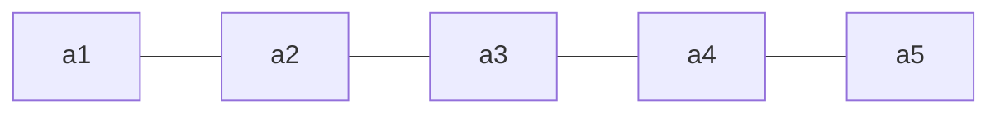

> 人类语言通常要**多个字符组成的序列**才有现实意义（如搜索引擎以"子串"为检索单位）。

#### 3. 串的基本操作

假设有串 `T = ""`、`S = "iPhone 11 Pro Max?"`、`W = "Pro"`：

| 操作 | 功能 |
| --- | --- |
| `StrAssign(&T, chars)` | **赋值**。把串 T 赋值为 chars |
| `StrCopy(&T, S)` | **复制**。由串 S 复制得到串 T |
| `StrEmpty(S)` | **判空**。若 S 为空串返回 TRUE，否则 FALSE |
| `StrLength(S)` | **求串长**。返回串 S 的元素个数 |
| `ClearString(&S)` | **清空**。将 S 清为空串 |
| `DestroyString(&S)` | **销毁**。将串 S 销毁（回收存储空间） |
| `Concat(&T, S1, S2)` | **串联接**。用 T 返回由 S1 和 S2 联接而成的新串 |
| `SubString(&Sub, S, pos, len)` | **求子串**。用 Sub 返回串 S 的第 pos 个字符起长度为 len 的子串 |
| `Index(S, T)` | **定位**。若主串 S 中存在与串 T 值相同的子串，则返回它在主串 S 中**第一次出现的位置**；否则返回 0 |
| `StrCompare(S, T)` | **比较**。若 S>T 返回值>0；若 S=T 返回值=0；若 S<T 返回值<0 |

**例**：

- `Concat(&T, S, W)` 后，`T = "iPhone 11 Pro Max?Pro"`（**存储空间扩展？**）
- `SubString(&T, S, 4, 6)` 后，`T = "one 11"`
- `Index(S, W)` 后，返回值为 **11**

#### 4. 串的比较操作

`StrCompare(S, T)` 的比较规则：

1. **从第一个字符开始往后依次对比**，**先出现更大字符的串就更大**；
2. **长串的前缀与短串相同时，长串更大**；
3. **只有两个串完全相同时，才相等**。

**例**：

| 比较 | 结果 |
| --- | --- |
| `"abandon"` vs `"aboard"` | `<`（第 3 个字符 `a` < `o`） |
| `"abstract"` vs `"abstraction"` | `<`（前缀相同，长串更大） |
| `"abstract"` vs `"abstract "` | `<`（前缀相同，长串更大） |
| `"academic"` vs `"abuse"` | `>`（第 2 个字符 `c` > `b`） |
| `"academic"` vs `"academic"` | `=` |

#### 5. 字符集编码

| 概念 | 含义 |
| --- | --- |
| **字符集** | 函数**定义域** |
| **编码** | 函数**映射规则** $f$ |
| **$y$** | 对应的**二进制数** |

> 任何数据存到计算机中一定是**二进制数**，需要确定"字符 ↔ 二进制数"的对应规则，这就是**编码**。
> **字符集**：英文字符 → **ASCII 字符集**；中英文 → **Unicode 字符集**。
> 基于同一个字符集，可以有**多种编码方案**，如 **UTF-8**、**UTF-16**。
> **注意**：采用不同的编码方式，每个字符所占空间不同；**考研中只需默认每个字符占 1B 即可**。

**拓展：乱码问题** —— 文件中原本采用编码规则 $y=f(x)$（如"码" → `00010101000101010010`），
打开文件时软件以为采用的是另一套规则 $y=g(x)$，于是 `00010101000101010010` 被解释成"樌"，**出现乱码**。

**本节考点**：串的定义与术语（串长、空串、空格串、子串、主串、位置）→ 串 V.S 线性表的异同 → 基本操作（重点是 `Index` 定位和 `StrCompare` 比较）→ 字符集编码。

### 4.1.2 串的存储结构

#### 1. 串的顺序存储

**① 静态数组实现**（定长顺序存储）：

```c
#define MAXLEN 255          // 预定义最大串长为 255
typedef struct{
    char ch[MAXLEN];        // 每个分量存储一个字符
    int length;             // 串的实际长度
} SString;
```

**② 动态数组实现**（堆分配存储）：

```c
typedef struct{
    char *ch;               // 按串长分配存储区，ch 指向串的基地址
    int length;             // 串的长度
} HString;

HString S;
S.ch = (char *) malloc(MAXLEN * sizeof(char));
S.length = 0;
```

> 分配**连续的存储空间**，每个 `char` 字符占 **1B**；用完之后需要**手动 `free`**。

**四种记录串长的方式**（以 `char ch[10]` 存 `"wangdao"` 为例）：

| 方案 | 做法 | 特点 |
| --- | --- | --- |
| **方案一** | 字符依次存，另用**变量 `Length`** 记录长度 | 直观 |
| **方案二** | **`ch[0]` 充当 `Length`** | **优点：字符的位序和数组下标相同** |
| **方案三** | **没有 `Length` 变量**，以字符 `'\0'` 表示结尾 | 对应 ASCII 码的 0 |
| **方案四（教材）** | **`ch[0]` 废弃不用**，另用变量 `Length` 记录长度 | 王道教材采用此方案 |

#### 2. 串的链式存储

**每个结点存 1 个字符**：

```c
typedef struct StringNode{
    char ch;                        // 每个结点存 1 个字符
    struct StringNode *next;
} StringNode, * String;
```

> **缺点**：**存储密度低** —— 每个字符 1B，每个指针却要 4B。

**每个结点存多个字符**（提高存储密度）：

```c
typedef struct StringNode{
    char ch[4];                     // 每个结点存多个字符
    struct StringNode *next;
} StringNode, * String;
```

> 没有字符的位置用 `'#'` 或 `'\0'` **补足**。

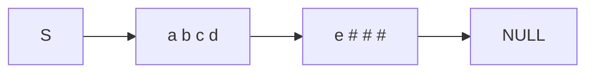

#### 3. 基于顺序存储实现基本操作

以教材方案四的 `SString` 为例。

**① 求子串 `SubString(&Sub, S, pos, len)`**：

```c
bool SubString(SString &Sub, SString S, int pos, int len){
    // 子串范围越界
    if (pos + len - 1 > S.length)
        return false;
    for (int i = pos; i < pos + len; i++)
        Sub.ch[i - pos + 1] = S.ch[i];
    Sub.length = len;
    return true;
}
```

**② 串的比较 `StrCompare(S, T)`**：

```c
int StrCompare(SString S, SString T) {
    for (int i = 1; i <= S.length && i <= T.length; i++){
        if (S.ch[i] != T.ch[i])
            return S.ch[i] - T.ch[i];
    }
    // 扫描过的所有字符都相同，则长度长的串更大
    return S.length - T.length;
}
```

**③ 定位 `Index(S, T)`**（求串 T 在主串 S 中的位置）：

```c
int Index(SString S, SString T){
    int i = 1, n = StrLength(S), m = StrLength(T);
    SString sub;                    // 用于暂存子串
    while (i <= n - m + 1){
        SubString(sub, S, i, m);
        if (StrCompare(sub, T) != 0) ++i;
        else return i;              // 返回子串在主串中的位置
    }
    return 0;                       // S 中不存在与 T 相等的子串
}
```

> **注意**：循环条件是 `i <= n - m + 1`（最后可能匹配的起始位置），不是 `i <= n`。

**本节考点**：顺序存储（静态/动态 + 四种串长记录方案，**教材用方案四**）→ 链式存储（每结点存多字符以提高存储密度）→ 三个基本操作的代码实现（`SubString`、`StrCompare`、`Index`）。

### 4.2.1 朴素模式匹配算法

#### 1. 什么是字符串的模式匹配

| 术语 | 含义 |
| --- | --- |
| **主串** | 被搜索的串（如 `'嘿嘿嘿红红火火恍恍惚惚…笑出猪叫哈哈…'`） |
| **模式串** | 要查找的串（如 `'笑出猪叫'`） |

**字符串模式匹配**：在**主串中找到与模式串相同的子串**，并返回其**所在位置**。

> **子串 vs 模式串**：**子串**是主串的一部分，**一定存在**；**模式串不一定能在主串中找到**。

**两种模式匹配算法**：

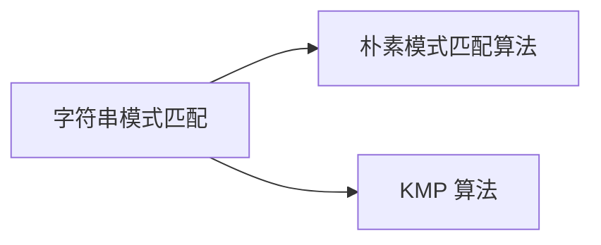

#### 2. 朴素模式匹配算法（BF / 暴力匹配）

**例**：主串 `S = abaabaabcabaabc`（长度 15），模式串 `T = abaaabc`（长度 6）。

**算法思想**：

- 设**主串长度为 $n$，模式串长度为 $m$**；
- 将主串中**所有长度为 $m$ 的子串**与模式串对比；
- 找到**第一个**与模式串匹配的子串，并返回子串**起始位置**；
- 若所有子串都不匹配，则返回 **0**。

**代码实现**：

```c
int Index(SString S, SString T){
    int i = 1, j = 1;
    while(i <= S.length && j <= T.length){
        if(S.ch[i] == T.ch[j]){
            ++i; ++j;           // 继续比较后继字符
        }
        else{
            i = i - j + 2;
            j = 1;              // 指针后退重新开始匹配
        }
    }
    if(j > T.length)
        return i - T.length;    // 匹配成功，返回子串第一个字符的位置
    else
        return 0;               // 匹配失败
}
```

> **要点**：
> - `i = i - j + 2` —— **主串指针回退**到本轮起始位置的下一位；
> - `j = 1` —— 模式串指针**从头开始**；
> - `j > T.length` 说明模式串全部匹配成功，此时返回 **`i - T.length`**。

#### 3. 最坏时间复杂度

设主串长度为 $n$，模式串长度为 $m$。

**最坏情况**：每个子串都要对比 $m$ 个字符，共 $n-m+1$ 个子串，因此

$$O\big((n-m+1)\times m\big)=O(nm)$$

> 注：很多时候 $n\gg m$。
> **最坏情况的典型例子**：主串 `aaaaaaab`、模式串 `aaaaab` —— 每一轮都在**最后一位**才失配，白白比较了很多次。

**本节考点**：模式匹配的概念（主串、模式串、子串）→ 朴素算法的思想与代码（`i=i-j+2`、返回 `i-T.length`）→ **最坏时间复杂度 $O(nm)$**（这也是 KMP 要解决的问题）。

### 4.2.2 KMP 算法

#### 1. KMP 算法的由来

由 **D.E.Knuth、J.H.Morris 和 V.R.Pratt** 提出，因此称为 **KMP 算法**。

#### 2. 核心思想：主串指针不回溯

**朴素算法的痛点**：每次失配后主串指针 `i` 都要回退（`i = i-j+2`），做了大量**无用功**。

**KMP 精髓**：**利用好已经匹配过的模式串的信息** —— 失配时**主串指针 `i` 不回溯**，只把**模式串指针 `j` 回退**到 `next[j]`。

**以 $T=\text{'abaabc'}$ 为例**（失配时的处理方式）：

| 失配位置 | 处理方式 |
| --- | --- |
| 第 6 个元素匹配失败 | `i` 不变，`j = 3` |
| 第 5 个元素匹配失败 | `i` 不变，`j = 2` |
| 第 4 个元素匹配失败 | `i` 不变，`j = 2` |
| 第 3 个元素匹配失败 | `i` 不变，`j = 1` |
| 第 2 个元素匹配失败 | `i` 不变，`j = 1` |
| 第 1 个元素匹配失败 | 匹配下一个相邻子串，令 **`j = 0`，`i++`，`j++`** |

> 把上面这些 `j` 的取值整理成数组，就是 **`next` 数组**。

#### 3. KMP 匹配的代码

```c
int Index_KMP(SString S, SString T, int next[]){
    int i = 1, j = 1;
    while(i <= S.length && j <= T.length){
        if(j == 0 || S.ch[i] == T.ch[j]){
            ++i;
            ++j;                // 继续比较后继字符
        }
        else
            j = next[j];        // 模式串向右移动
    }
    if(j > T.length)
        return i - T.length;    // 匹配成功
    else
        return 0;
}
```

> **与朴素算法的对比**：
> - 主串指针 `i` **从不回退**；
> - `j = next[j]` 取代了朴素算法的 `i = i-j+2; j = 1;`；
> - `j == 0` 表示**模式串第 1 个字符就失配**，此时主串、模式串**同时后移**。

#### 4. 时间复杂度

| 环节 | 复杂度 |
| --- | --- |
| 求 `next` 数组 | $O(m)$ |
| 模式匹配过程（最坏） | $O(n)$ |
| **KMP 算法总的（最坏）** | $\boldsymbol{O(m+n)}$ |

> 对比朴素算法的 $O(nm)$，KMP 在长文本（$n\gg m$）时优势明显。

#### 5. 求 next 数组（手算）

**`next` 数组的作用**：当模式串的**第 $j$ 个字符失配**时，从模式串的**第 `next[j]` 个**继续往后匹配。

**手算口诀**（背下来）：

1. **`next[1]` 都无脑写 0**；
2. **`next[2]` 都无脑写 1**；
3. **其他 `next`**：在**不匹配的位置前边，划一根"分界线"**，模式串**一步一步往后退**，直到**分界线之前"能对上"**，或**模式串完全跨过分界线**为止。**此时 `j` 指向哪儿，`next` 数组的值就是多少**。

**例 1**：$T=\text{'abaabc'}$

| 序号 $j$ | 1 | 2 | 3 | 4 | 5 | 6 |
| --- | --- | --- | --- | --- | --- | --- |
| 模式串 | a | b | a | a | b | c |
| **`next[j]`** | **0** | **1** | **1** | **2** | **2** | **3** |

**例 2**：$T=\text{'google'}$ → `next` = **0, 1, 1, 1, 2, 1**

**例 3**：$T=\text{'aaaab'}$ → `next` = **0, 1, 2, 3, 4**

**例 4**：$T=\text{'ababaa'}$ → `next` = **0, 1, 1, 2, 3, 4**

> **注意**：`next[0]` **不使用** —— `next` 数组的**下标从 1 开始**。

### 4.2.3 KMP 算法的进一步优化

#### 1. 为什么要优化？

`next` 数组的**缺陷**：当 `T[j]` 失配时让 `j` 退到 `next[j]`；但如果 **$T[j] = T[\text{next}[j]]$**，那么退过去之后**一定还会立即失配**（因为主串该位置的字符已经确定 $\ne T[j]$），白白多比较一次。

**优化思路**：如果 $T[j] = T[\text{next}[j]]$，就**继续往前退**，直接取 `nextval[next[j]]` 的值。

> 直观理解：**"退一步还是同样的字符"，那就干脆多退几步。**

#### 2. nextval 数组的求法

```c
nextval[1] = 0;
for (int j = 2; j <= T.length; j++) {
    if (T.ch[next[j]] == T.ch[j])
        nextval[j] = nextval[next[j]];
    else
        nextval[j] = next[j];
}
```

**手算步骤**：**先求 `next` 数组，再由 `next` 数组求 `nextval` 数组**。

#### 3. 经典例题

**例 1**：$T=\text{'abaabc'}$

| 序号 $j$ | 1 | 2 | 3 | 4 | 5 | 6 |
| --- | --- | --- | --- | --- | --- | --- |
| 模式串 | a | b | a | a | b | c |
| `next[j]` | 0 | 1 | 1 | 2 | 2 | 3 |
| **`nextval[j]`** | **0** | **1** | **0** | **2** | **1** | **3** |

**例 2**：$T=\text{'aaaab'}$

| 序号 $j$ | 1 | 2 | 3 | 4 | 5 |
| --- | --- | --- | --- | --- | --- |
| 模式串 | a | a | a | a | b |
| `next[j]` | 0 | 1 | 2 | 3 | 4 |
| **`nextval[j]`** | **0** | **0** | **0** | **0** | **4** |

**例 3**：$T=\text{'ababaa'}$

| 序号 $j$ | 1 | 2 | 3 | 4 | 5 | 6 |
| --- | --- | --- | --- | --- | --- | --- |
| 模式串 | a | b | a | b | a | a |
| `next[j]` | 0 | 1 | 1 | 2 | 3 | 4 |
| **`nextval[j]`** | **0** | **1** | **0** | **1** | **0** | **4** |

> **观察**：模式串中有**连续重复字符**（如 `aaaab`）时，`nextval` 的优化效果最明显（`0,0,0,0,4` 对比 `0,1,2,3,4`）。

**本节考点**：`nextval` 的**优化思路**（$T[j]=T[\text{next}[j]]$ 时继续前退）→ **先求 `next` 再求 `nextval`** → 三个经典例题。

### 小结

1. **串**：零个或多个字符组成的有限序列；术语有串长、空串、空格串、子串、主串、位置（**位序从 1 开始**）。
2. **串 V.S 线性表**：串是特殊的线性表，数据对象**限定为字符集**，基本操作**以"子串"为对象**。
3. **基本操作**：`StrAssign` / `StrCopy` / `StrEmpty` / `StrLength` / `ClearString` / `DestroyString` / `Concat` / `SubString` / **`Index`** / **`StrCompare`**。
4. **串的比较**：从第一个字符依次对比，先出现更大字符的更大；前缀相同时**长串更大**；完全相同才相等。
5. **字符集编码**：字符集是定义域、编码是映射规则；**考研中默认每个字符占 1B**；编码不一致会导致**乱码**。
6. **串的存储**：**顺序存储**（静态数组 `SString` / 动态数组 `HString`，四种串长记录方案，**教材用方案四** —— `ch[0]` 废弃不用 + `length`）；**链式存储**（每结点存多个字符以提高存储密度）。
7. **朴素模式匹配算法（BF）**：主串中所有长度为 $m$ 的子串逐个与模式串对比；失配时 `i = i-j+2; j = 1`（**主串指针回退**）；返回 `i - T.length`；最坏 **$O(nm)$**。
8. **KMP 算法**：**主串指针 `i` 不回溯**，失配时 `j = next[j]`；`j == 0` 时 `i++`、`j++`；时间复杂度 **$O(m+n)$**（求 `next` 为 $O(m)$，匹配为 $O(n)$）。
9. **求 `next` 数组口诀**：`next[1]` 无脑写 **0**，`next[2]` 无脑写 **1**，其余用**分界线法**（模式串往后退到分界线前"能对上"为止，**j 指向哪儿 next 值就是多少**）；**`next[0]` 不用**。
10. **KMP 优化（`nextval`）**：若 $T[j]=T[\text{next}[j]]$ 则继续前退；**先求 `next` 再求 `nextval`**；连续重复字符多的模式串优化效果最明显。

---

## 第五章 树与二叉树

| 考点 | 重要程度 | 占分 | 常见题型 |
| --- | --- | --- | --- |
| 树的定义与基本术语 | ★★ | 2 分 | 选择 |
| 树的性质（结点数、度、高度） | ★★★ | 2~4 分 | 选择、计算 |
| 二叉树的定义与性质 | ★★★ | 2~4 分 | 选择、计算 |
| 二叉树的存储结构 | ★★★ | 2~4 分 | 选择、代码 |
| **二叉树的遍历（先/中/后/层序）** | ★★★★★ | 4~8 分 | 选择、综合、代码 |
| **由遍历序列构造二叉树** | ★★★★ | 2~4 分 | 选择、综合 |
| 线索二叉树（概念 / 线索化 / 找前驱后继） | ★★★★ | 4~6 分 | 选择、综合、代码 |
| 树的存储结构（双亲 / 孩子 / 孩子兄弟） | ★★★ | 2~4 分 | 选择 |
| 树、森林与二叉树的转换 | ★★★ | 2~4 分 | 选择 |
| 树和森林的遍历 | ★★★ | 2~4 分 | 选择 |
| **哈夫曼树与哈夫曼编码** | ★★★★ | 4~6 分 | 选择、计算 |
| 并查集（含优化） | ★★★ | 2~4 分 | 选择、代码 |

---

### 5.1.1 树的基本概念

#### 1. 树的定义

**树**是 $n$（$n\ge 0$）个**结点**的**有限集合**：

- $n=0$ 时，称为**空树**（一种特殊情况）；
- 在任意一棵**非空树**中应满足：

  1. **有且仅有一个**特定的称为**根**的结点；
  2. 当 $n>1$ 时，其余结点可分为 $m$（$m>0$）个**互不相交**的有限集合 $T_1,T_2,\dots,T_m$，其中每个集合**本身又是一棵树**，并且称为根结点的**子树**。

> **树是一种递归定义的数据结构。**

**非空树的特性**：

| 特性 | 说明 |
| --- | --- |
| 根结点 | **有且仅有一个**根结点 |
| **叶子结点**（终端结点） | **没有后继**的结点 |
| **分支结点**（非终端结点） | **有后继**的结点 |
| 前驱唯一 | 除了根结点外，任何一个结点都有**且仅有**一个前驱 |
| 后继个数 | 每个结点可以有 **0 个或多个**后继 |

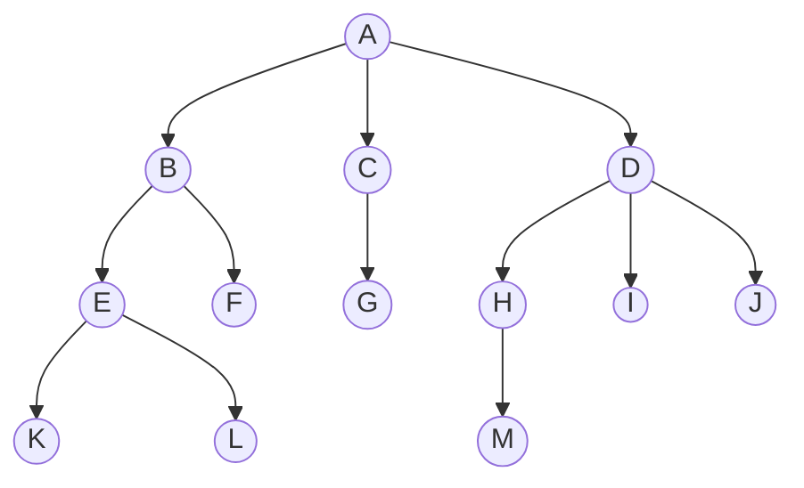

**树形逻辑结构的应用**：**行政区域划分**（中国 → 省 → 市）、**文件系统**（盘 → 文件夹 → 文件）。

#### 2. 基本术语

**① 结点之间的关系描述**（用家族关系类比很好记）：

| 术语 | 含义 |
| --- | --- |
| **祖先结点** | 从根到该结点所经分支上的所有结点 |
| **子孙结点** | 以某结点为根的子树中的任一结点 |
| **双亲结点（父结点）** | 直接前驱 |
| **孩子结点** | 直接后继 |
| **兄弟结点** | 有同一个双亲的结点 |
| **堂兄弟结点** | 双亲在**同一层**的结点 |
| **路径** | 两个结点之间的路径，**只能从上往下** |
| **路径长度** | 路径上**经过多少条边** |

**② 结点、树的属性描述**：

| 属性 | 定义 |
| --- | --- |
| **结点的层次（深度）** | **从上往下**数，**默认从 1 开始** |
| **结点的高度** | **从下往上**数 |
| **树的高度（深度）** | **总共多少层** |
| **结点的度** | 该结点**有几个孩子（分支）** |
| **树的度** | **各结点的度的最大值** |

> **非叶子结点的度 > 0**；**叶子结点的度 = 0**。

**③ 有序树 V.S 无序树**：

| 类型 | 含义 |
| --- | --- |
| **有序树** | 逻辑上看，树中结点的各子树**从左至右是有次序的**，**不能互换** |
| **无序树** | 逻辑上看，树中结点的各子树**从左至右是无次序的**，**可以互换** |

> 具体看你用树存什么，是否需要**用结点的左右位置反映某些逻辑关系**。

**④ 森林**：$m$（$m\ge0$）棵**互不相交**的树的集合（$m$ 可为 0，即**空森林**）。

> **考点**：森林与树的**相互转化**问题。

**本节考点**：树的定义（**递归定义**）与非空树的 5 条特性 → 结点间关系（父/子/兄弟/堂兄弟/路径/路径长度）→ 结点与树的属性（**层次从上往下、高度从下往上**；**结点的度 vs 树的度**）→ 有序树 vs 无序树 → 森林。

### 5.1.3 树的常考性质

#### 考点 1：结点数 = 总度数 + 1

$$\boxed{\text{结点数} = \text{总度数} + 1}$$

> 理解：每个结点（除根外）都恰好是某条边（分支）的"孩子"，所以**结点数 = 边数 + 1**，而**边数 = 总度数**。

#### 考点 2：度为 m 的树 V.S m 叉树

| | **度为 m 的树** | **m 叉树** |
| --- | --- | --- |
| 任意结点的度 | $\le m$（最多 $m$ 个孩子） | $\le m$（最多 $m$ 个孩子） |
| 是否有结点度 = m | **至少有一个结点度 $=m$** | 允许**所有**结点的度都 $<m$ |
| 是否可空 | **一定是非空树**，**至少有 $m+1$ 个结点** | **可以是空树** |

> **易错点**：这两个概念容易混 —— 度为 $m$ 的树**必须**存在度为 $m$ 的结点，所以**至少 $m+1$ 个结点**（1 个根 + $m$ 个孩子）；而 $m$ 叉树**可以是空树**。

#### 考点 3：第 i 层最多有多少个结点

$$\boxed{\text{度为 }m\text{ 的树 / }m\text{ 叉树第 }i\text{ 层至多有 } m^{\,i-1}\text{ 个结点}\quad (i\ge1)}$$

| 层数 | 最多结点数 |
| --- | --- |
| 第 1 层 | $m^0$ |
| 第 2 层 | $m^1$ |
| 第 3 层 | $m^2$ |
| 第 4 层 | $m^3$ |

#### 考点 4：高度为 h 的 m 叉树至多有多少个结点

$$\boxed{\text{至多 }\frac{m^h-1}{m-1}\text{ 个结点}}$$

> **推导**：由等比数列求和公式 $a+aq+aq^2+\dots+aq^{n-1}=\dfrac{a(1-q^n)}{1-q}$，
> 各层最多结点数相加：$m^0+m^1+\dots+m^{h-1}=\dfrac{m^h-1}{m-1}$。

#### 考点 5：最少有多少个结点

$$\boxed{\text{高度为 }h\text{ 的 }m\text{ 叉树至少有 }h\text{ 个结点}}$$

$$\boxed{\text{高度为 }h\text{、度为 }m\text{ 的树至少有 }h+m-1\text{ 个结点}}$$

> **理解**：$m$ 叉树最少时就是**一条链**（每层 1 个），共 $h$ 个；
> 度为 $m$ 的树还必须**至少有一个度为 $m$ 的结点**，所以要在链的基础上再挂 $m-1$ 个孩子，共 $h+m-1$ 个。

#### 考点 6：具有 n 个结点的 m 叉树的最小高度

$$\boxed{h_{\min}=\left\lceil\log_m\big(n(m-1)+1\big)\right\rceil}$$

**推导**（**高度最小 ⇒ 所有结点都有 $m$ 个孩子**）：

$$\underbrace{\frac{m^{h-1}-1}{m-1}}_{\text{前 }h-1\text{ 层最多}}<n\le\underbrace{\frac{m^h-1}{m-1}}_{\text{前 }h\text{ 层最多}}$$

$$m^{h-1}<n(m-1)+1\le m^h$$

$$h-1<\log_m\big(n(m-1)+1\big)\le h$$

$$\Rightarrow\ h_{\min}=\left\lceil\log_m\big(n(m-1)+1\big)\right\rceil$$

**本节考点**：6 个常考性质 —— ① **结点数 = 总度数 + 1**；② 度为 $m$ 的树 vs $m$ 叉树；③ 第 $i$ 层至多 $m^{i-1}$ 个；④ 高度 $h$ 至多 $\frac{m^h-1}{m-1}$ 个；⑤ 最少结点数（$h$ / $h+m-1$）；⑥ 最小高度 $\lceil\log_m(n(m-1)+1)\rceil$。

### 5.2.1 二叉树的定义和基本术语

#### 1. 二叉树的定义

**二叉树**是 $n$（$n\ge0$）个结点的**有限集合**：

1. 或者为**空二叉树**，即 $n=0$；
2. 或者由一个**根结点**和两个**互不相交**的、被称为根的**左子树**和**右子树**组成；左子树和右子树**又分别是一棵二叉树**。

**特点**：

1. 每个结点**至多只有两棵子树**（不存在度 $>2$ 的结点）；
2. 左右子树**不能颠倒** —— **二叉树是有序树**。

> **注意区别**：**二叉树 $\ne$ 度为 2 的有序树**。
> 度为 2 的有序树要求每个结点**恰好**有 2 个孩子；而二叉树允许结点的度为 **0、1、2**。

**二叉树的五种状态**：空二叉树、只有根结点、只有左子树、只有右子树、左右子树都有。

#### 2. 几个特殊的二叉树

**① 满二叉树**

一棵高度为 $h$，且含有 $2^h-1$ 个结点的二叉树。

| 特点 | 说明 |
| --- | --- |
| 叶子结点 | **只有最后一层**有叶子结点 |
| 度为 1 的结点 | **不存在** |
| 层序编号 | 按层序从 1 开始编号：结点 $i$ 的**左孩子为 $2i$**、**右孩子为 $2i+1$**；结点 $i$ 的**父结点为 $\lfloor i/2\rfloor$**（如果有的话） |

**② 完全二叉树**

当且仅当其每个结点都与**高度为 $h$ 的满二叉树**中编号为 $1\sim n$ 的结点**一一对应**时，称为完全二叉树。

| 特点 | 说明 |
| --- | --- |
| 叶子结点 | 只有**最后两层**可能有叶子结点 |
| 度为 1 的结点 | **最多只有一个** |
| 层序编号 | 同满二叉树③的编号规律 |
| 分支 / 叶子 | $i\le\lfloor n/2\rfloor$ 为**分支结点**，$i>\lfloor n/2\rfloor$ 为**叶子结点** |

> **易错点**：完全二叉树中若某结点**只有一个孩子**，那么**一定是左孩子**。

**③ 二叉排序树（BST）**

一棵二叉树或者是空二叉树，或者是具有如下性质的二叉树：

- **左子树上所有结点的关键字均小于根结点的关键字**；
- **右子树上所有结点的关键字均大于根结点的关键字**；
- 左子树和右子树**又各是一棵二叉排序树**。

> **用途**：元素的**排序、搜索**。

**④ 平衡二叉树（AVL）**

树上**任一结点的左子树和右子树的深度之差不超过 1**。

> **用途**：能有**更高的搜索效率**（"胖胖的、丰满的树"）。

**本节考点**：二叉树的定义（**递归定义**、至多两棵子树、**有序**）与"二叉树 vs 度为 2 的有序树"的区别 → 五种状态 → 四类特殊二叉树（满二叉树 / 完全二叉树 / 二叉排序树 / 平衡二叉树）的定义与特点。

### 5.2.2 二叉树的性质

#### 1. 二叉树的常考性质

**考点 1：$n_0 = n_2 + 1$**

设非空二叉树中度为 0、1 和 2 的结点个数分别为 $n_0$、$n_1$ 和 $n_2$，则

$$\boxed{n_0=n_2+1}$$

（**叶子结点比二分支结点多一个**）

**推导**：设结点总数为 $n$：

1. 按结点类型数：$n=n_0+n_1+n_2$
2. 按"**结点数 = 总度数 + 1**"：$n=n_1+2n_2+1$

② − ① 得 $n_0=n_2+1$。

**考点 2：第 $i$ 层至多有多少个结点**

$$\boxed{\text{二叉树第 }i\text{ 层至多有 } 2^{\,i-1}\text{ 个结点}\quad(i\ge1)}$$

**考点 3：高度为 $h$ 的二叉树至多有多少个结点**

$$\boxed{\text{至多 }2^h-1\text{ 个结点}\quad(\text{即满二叉树})}$$

#### 2. 完全二叉树的常考性质

**考点 1：具有 $n$（$n>0$）个结点的完全二叉树的高度 $h$**

$$\boxed{h=\left\lceil\log_2(n+1)\right\rceil\quad\text{或}\quad h=\left\lfloor\log_2 n\right\rfloor+1}$$

**推导一**（用满二叉树的结点数夹逼）：

$$\underbrace{2^{h-1}-1}_{\text{高 }h-1\text{ 的满二叉树}}<n\le\underbrace{2^h-1}_{\text{高 }h\text{ 的满二叉树}}\ \Rightarrow\ 2^{h-1}<n+1\le2^h\ \Rightarrow\ h-1<\log_2(n+1)\le h$$

$$\Rightarrow\ h=\left\lceil\log_2(n+1)\right\rceil$$

**推导二**（用完全二叉树本身的结点数范围）：

$$2^{h-1}\le n<2^h\ \Rightarrow\ h-1\le\log_2 n<h\ \Rightarrow\ h=\left\lfloor\log_2 n\right\rfloor+1$$

> **附带结论**：第 $i$ 个结点所在的层次为 $\left\lceil\log_2(n+1)\right\rceil$ 或 $\left\lfloor\log_2 n\right\rfloor+1$。

**考点 2：由结点数 $n$ 推出 $n_0$、$n_1$、$n_2$**

**突破口**：**完全二叉树最多只会有一个度为 1 的结点**，即 $n_1=0$ 或 $1$。

由 $n_0=n_2+1$ 可知 $n_0+n_2$ 一定是**奇数**，于是：

| 完全二叉树结点数 $n$ | $n_1$ | $n_0$ | $n_2$ |
| --- | --- | --- | --- |
| $2k$（**偶数**） | **1** | **k** | **k − 1** |
| $2k-1$（**奇数**） | **0** | **k** | **k − 1** |

**本节考点**：二叉树三条（$n_0=n_2+1$、第 $i$ 层至多 $2^{i-1}$、高 $h$ 至多 $2^h-1$）+ 完全二叉树两条（**高度公式**、**由 $n$ 反推 $n_0/n_1/n_2$**）。

### 5.2.3 二叉树的存储结构

#### 1. 顺序存储

```c
#define MaxSize 100
struct TreeNode {
    ElemType value;         // 结点中的数据元素
    bool isEmpty;           // 结点是否为空
};
TreeNode t[MaxSize];
```

定义一个长度为 `MaxSize` 的数组 `t`，按照**从上至下、从左至右**的顺序依次存储**完全二叉树**中的各个结点。

```c
// 初始化时所有结点标记为空
for (int i = 0; i < MaxSize; i++) {
    t[i].isEmpty = true;
}
```

> `t[0]` 可以让**第一个位置空缺**，保证**数组下标和结点编号一致**。

**几个重要常考的基本操作**（完全二叉树）：

| 操作 | 公式 |
| --- | --- |
| $i$ 的**左孩子** | $2i$ |
| $i$ 的**右孩子** | $2i+1$ |
| $i$ 的**父结点** | $\lfloor i/2\rfloor$ |
| $i$ 所在的**层次** | $\lceil\log_2(n+1)\rceil$ 或 $\lfloor\log_2 n\rfloor+1$ |

**若完全二叉树中共有 $n$ 个结点**：

| 判断 | 条件 |
| --- | --- |
| $i$ 是否有**左孩子** | $2i\le n$ ? |
| $i$ 是否有**右孩子** | $2i+1\le n$ ? |
| $i$ 是**叶子还是分支**结点 | $i>\lfloor n/2\rfloor$ ?（$i>\lfloor n/2\rfloor$ 为叶子） |

> **思考**：如果结点从 0 开始编号，该怎么算？（各公式都要相应调整）

**顺序存储的缺陷与结论**：

- 二叉树顺序存储中，**一定要把二叉树的结点编号与完全二叉树对应起来**（否则 $2i$、$2i+1$、$\lfloor i/2\rfloor$ 的规律失效）；
- **最坏情况**：高度为 $h$ 且只有 $h$ 个结点的**单支树**（所有结点只有右孩子），也至少需要 $2^h-1$ 个存储单元；
- **结论**：二叉树的**顺序存储结构只适合存储完全二叉树**。

#### 2. 链式存储

```c
// 二叉树的结点（链式存储）
typedef struct BiTNode{
    ElemType data;                      // 数据域
    struct BiTNode *lchild, *rchild;    // 左、右孩子指针
} BiTNode, *BiTree;
```

```c
// 定义一棵空树
BiTree root = NULL;

// 插入根结点
root = (BiTree) malloc(sizeof(BiTNode));
root->data = {1};
root->lchild = NULL;
root->rchild = NULL;

// 插入新结点
BiTNode *p = (BiTNode *) malloc(sizeof(BiTNode));
p->data = {2};
p->lchild = NULL;
p->rchild = NULL;
root->lchild = p;                       // 作为根结点的左孩子
```

> ⭐ **重要结论**：$n$ 个结点的**二叉链表共有 $n+1$ 个空链域**（可用于构造**线索二叉树**）。

```mermaid
graph TD
    N1["1"] --> N2["2"]
    N1 --> N3["3"]
    N2 --> N4["4"]
    N3 --> N6["6"]
    N3 --> N7["7"]
    N4 --> N11["11"]
    N6 --> N12["12"]
```

**链式存储的优缺点**：

| 操作 | 说明 |
| --- | --- |
| 找指定结点 $p$ 的**左/右孩子** | **超简单**（直接 `p->lchild` / `p->rchild`） |
| 找指定结点 $p$ 的**父结点** | **只能从根开始遍历寻找** |

> **Tips**：根据实际需求决定要不要加**父结点指针** —— 加上就变成**三叉链表**，方便找父结点。

```c
// 三叉链表
typedef struct BiTNode{
    ElemType data;
    struct BiTNode *lchild, *rchild;    // 左、右孩子指针
    struct BiTNode *parent;             // 父结点指针
} BiTNode, *BiTree;
```

**本节考点**：顺序存储（**结点编号要与完全二叉树对应**、$2i$/$2i+1$/$\lfloor i/2\rfloor$、判孩子与判叶子的条件、**只适合存完全二叉树**）→ 链式存储（`BiTNode` 定义、**$n$ 个结点有 $n+1$ 个空链域**、找父结点需遍历、三叉链表）。

### 5.3.1 二叉树的先中后序遍历

#### 1. 什么是遍历

**遍历**：按照某种次序把**所有结点都访问一遍**。

| 遍历方式 | 依据的规则 |
| --- | --- |
| **层次遍历** | 基于树的**层次**特性确定的次序规则 |
| **先/中/后序遍历** | 基于树的**递归**特性确定的次序规则 |

**二叉树的递归特性**：① 要么是**空二叉树**；② 要么由"**根结点 + 左子树 + 右子树**"组成。

#### 2. 三种遍历的定义

| 遍历 | 次序 | 英文 |
| --- | --- | --- |
| **先序遍历** | **根 左 右** | **NLR** |
| **中序遍历** | **左 根 右** | **LNR** |
| **后序遍历** | **左 右 根** | **LRN** |

```mermaid
graph TD
    R((根)) --> L((左子树))
    R --> RR((右子树))
```

**例**：以 $A(B(D,E),C(F,G))$ 为例

| 遍历 | 序列 |
| --- | --- |
| 先序 | A B D E C F G |
| 中序 | D B E A F C G |
| 后序 | D E B F G C A |

#### 3. 三种遍历的代码

**先序遍历**：

```c
void PreOrder(BiTree T){
    if(T != NULL){
        visit(T);               // 访问根结点
        PreOrder(T->lchild);    // 递归遍历左子树
        PreOrder(T->rchild);    // 递归遍历右子树
    }
}
```

**中序遍历**：

```c
void InOrder(BiTree T){
    if(T != NULL){
        InOrder(T->lchild);     // 递归遍历左子树
        visit(T);               // 访问根结点
        InOrder(T->rchild);     // 递归遍历右子树
    }
}
```

**后序遍历**：

```c
void PostOrder(BiTree T){
    if(T != NULL){
        PostOrder(T->lchild);   // 递归遍历左子树
        PostOrder(T->rchild);   // 递归遍历右子树
        visit(T);               // 访问根结点
    }
}
```

> **空间复杂度**：三种遍历都需要**递归工作栈**，空间复杂度为 **$O(h)$**（$h$ 为树的高度）。

#### 4. 求遍历序列的技巧（重点）

**技巧一：分支结点逐层展开法** —— 把分支结点逐层展开成"根左右"等形式再读。

**技巧二："全世界路"法**（更直观）：

> **脑补空结点**，从根结点出发，画一条路：
> - 如果**左边还有没走的路**，优先往**左边**走；
> - 走到路的**尽头（空结点）**就**往回走**；
> - 如果**左边没路了**，就往**右边**走；
> - 如果**左、右都没路了**，则往**上面**走。

**关键结论**：**每个结点都会被"路过" 3 次**！

| 遍历 | 访问时机 |
| --- | --- |
| **先序遍历** | **第一次**路过时访问结点 |
| **中序遍历** | **第二次**路过时访问结点 |
| **后序遍历** | **第三次**路过时访问结点 |

#### 5. 应用举例

**算数表达式的"分析树"**（如 $a+b*(c-d)-e/f$）：

| 遍历 | 对应表达式 |
| --- | --- |
| **先序遍历** | **前缀**表达式（`-+a*b-cd/ef`） |
| **中序遍历** | **中缀**表达式（`a+b*c-d-e/f`，**需要加界限符**） |
| **后序遍历** | **后缀**表达式（`abcd-*+ef/-`） |

**求树的深度**：

```c
int treeDepth(BiTree T){
    if (T == NULL) {
        return 0;
    } else {
        int l = treeDepth(T->lchild);
        int r = treeDepth(T->rchild);
        // 树的深度 = Max(左子树深度, 右子树深度) + 1
        return l > r ? l + 1 : r + 1;
    }
}
```

**本节考点**：三种遍历的次序（**NLR / LNR / LRN**）与代码（**只是 `visit(T)` 的位置不同**）→ 求遍历序列的两种技巧（逐层展开 / **路过三次**：先序第一次、中序第二次、后序第三次）→ 遍历算数表达式树 → 求树的深度 → 空间复杂度 $O(h)$。

### 5.3.2 二叉树的层次遍历

#### 1. 算法思想

1. 初始化一个**辅助队列**；
2. **根结点入队**；
3. 若**队列非空**，则**队头结点出队**，访问该结点，并将其**左、右孩子插入队尾**（如果有的话）；
4. **重复 ③ 直至队列为空**。

```mermaid
graph TD
    A((A)) --> B((B))
    A --> C((C))
    B --> D((D))
    B --> E((E))
    C --> F((F))
    C --> G((G))
```

> 上图的层序序列：**A B C D E F G**

#### 2. 代码实现

```c
// 层序遍历
void LevelOrder(BiTree T){
    LinkQueue Q;
    InitQueue(Q);                       // 初始化辅助队列
    BiTree p;
    EnQueue(Q, T);                      // 将根结点入队
    while(!IsEmpty(Q)){                 // 队列不空则循环
        DeQueue(Q, p);                  // 队头结点出队
        visit(p);                       // 访问出队结点
        if(p->lchild != NULL)
            EnQueue(Q, p->lchild);      // 左孩子入队
        if(p->rchild != NULL)
            EnQueue(Q, p->rchild);      // 右孩子入队
    }
}
```

**用到的辅助结构**：

```c
// 二叉树的结点（链式存储）
typedef struct BiTNode{
    char data;
    struct BiTNode *lchild, *rchild;
} BiTNode, *BiTree;

// 链式队列结点
typedef struct LinkNode{
    BiTNode *data;                      // 存指针而不是结点！
    struct LinkNode *next;
} LinkNode;

typedef struct{
    LinkNode *front, *rear;             // 队头队尾
} LinkQueue;
```

> **要点**：链式队列的结点中存的是 **`BiTNode *`（指针）**，而不是整个结点 —— **存指针而不是结点**。

**本节考点**：层序遍历的算法思想（**队列**：根入队 → 出队访问 → 左右孩子入队）→ 代码实现 → 队列元素类型是**结点指针**。

### 5.3.3 由遍历序列构造二叉树

#### 1. 重要结论

**结论 1**：**只给出前/中/后/层序遍历序列中的一种，不能唯一确定一棵二叉树。**

> 例如：中序序列 `BDCAE` 可以对应多种不同的二叉树形态。

**结论 2**：**前序、后序、层序序列的两两组合，无法唯一确定一棵二叉树**（必须有**中序**序列参与）。

**能唯一确定二叉树的三种组合**：

```mermaid
graph LR
    A[由遍历序列构造二叉树] --> B[前序 + 中序]
    A --> C[后序 + 中序]
    A --> D[层序 + 中序]
```

#### 2. 前序 + 中序遍历序列

**方法**：

1. **前序序列的第一个**就是**根结点**；
2. 在中序序列中找到该根结点，其**左边**是**左子树的中序序列**，**右边**是**右子树的中序序列**；
3. 由左子树中序序列的**长度**，可推出**左子树的前序序列**（前序中紧随根结点之后的若干元素），剩下的是**右子树的前序序列**；
4. 对左右子树**递归**重复上述过程。

**例 1**：前序 `A D B C E`，中序 `B D C A E`

| 步骤 | 说明 |
| --- | --- |
| 根结点 | 前序第一个 = **A** |
| 划分中序 | `BDC` \| **A** \| `E` → 左子树中序 `BDC`，右子树中序 `E` |
| 划分前序 | **A** \| `DBC` \| `E` → 左子树前序 `DBC`，右子树前序 `E` |
| 递归 | 左子树：前序 `DBC` + 中序 `BDC` → 根 D，左 B 右 C |

**结果**：$A\big(D(B,C),\ E\big)$

**例 2**：前序 `D A E F B C H G I`，中序 `E A F D H C B G I`
→ 结果：$D\big(A(E,F),\ B(H(C),\ G(I))\big)$

> **注意验证**：构造完后一定要用两个序列回代验证一遍。

#### 3. 后序 + 中序遍历序列

**方法**：与"前序 + 中序"完全对称 ——

1. **后序序列的最后一个**就是**根结点**；
2. 在中序序列中找到该根结点，划分左右子树的中序序列；
3. 由左子树中序序列的**长度**推出左子树的后序序列（后序中**前若干元素**），剩下的是右子树的后序序列；
4. **递归**处理。

**例 3**：后序 `E F A H C I G B D`，中序 `E A F D H C B G I`

- 根结点 = 后序最后一个 = **D**；
- 中序划分：`EAF` \| **D** \| `HCBGI`；
- 后序划分：`EFA` \| `HCIGB` \| **D**。

#### 4. 层序 + 中序遍历序列

**方法**：

1. **层序序列的第一个**就是**根结点**；
2. 在中序序列中划分出左右子树的中序序列；
3. 在层序序列中，**按顺序**找属于左子树的结点 —— **第一个**就是**左子树的根**；同理找出**右子树的根**；
4. **递归**处理。

**例 5**：层序 `A B C D E`，中序 `A C B E D`

- 根 = 层序第一个 = **A**；中序中 A 在**最左** → **左子树为空**，右子树中序 = `CBED`；
- 层序中剩下 `BCDE`，其中 **B** 是右子树的根（最先出现）；
- 中序 `C B E D` 中 B 左边是 `C`（左子树），右边是 `ED`（右子树）；
- 继续：层序中 **C** 先于 D 出现 → C 是 B 左子树的根；右子树 `ED` 中，层序 **D** 先出现 → D 为根，中序 `E D` 中 E 在左 → E 是 D 的左孩子。

**结果**：$A\big(-,\ B(C,\ D(E,-))\big)$

**本节考点**：**只给一种序列不能唯一确定**、**必须有中序序列** → 三种构造方法（前序/后序/层序 + 中序）→ 关键是**用中序序列划分左右子树**、**用长度对应推出另一种序列的划分** → 构造完要**回代验证**。

### 5.3.4 线索二叉树的概念

#### 1. 为什么要线索化？

**问题**：如何找到指定结点 $p$ 在**中序遍历序列中的前驱 / 后继**？

**朴素思路**：从根结点出发，重新进行一次中序遍历，用指针 `q` 记录当前访问的结点、`pre` 记录上一个被访问的结点：

- 当 `q == p` 时，`pre` 为**前驱**；
- 当 `pre == p` 时，`q` 为**后继**。

> **缺点**：**找前驱、后继很不方便；遍历操作必须从根开始**。

**突破口**：$n$ 个结点的二叉树有 **$n+1$ 个空链域** —— 可用来**记录前驱、后继的信息**！

#### 2. 线索二叉树的概念

| 概念 | 含义 |
| --- | --- |
| **线索** | 指向前驱、后继的指针称为"**线索**" |
| **前驱线索** | 由**左孩子指针**充当 |
| **后继线索** | 由**右孩子指针**充当 |

**作用**：方便从**一个指定结点**出发，找到其**前驱、后继**；**方便遍历**。

#### 3. 存储结构

```c
// 二叉树结点（链式存储）
typedef struct BiTNode{
    ElemType data;
    struct BiTNode *lchild, *rchild;
} BiTNode, *BiTree;                     // 术语：二叉链表

// 线索二叉树结点
typedef struct ThreadNode{
    ElemType data;
    struct ThreadNode *lchild, *rchild;
    int ltag, rtag;                     // 左、右线索标志
} ThreadNode, *ThreadTree;              // 术语：线索链表
```

**`tag` 标志位的含义**（**重要**）：

| 标志 | 取值 | 含义 |
| --- | --- | --- |
| `ltag` | **1** | `lchild` 指向**前驱** |
| `ltag` | **0** | `lchild` 指向**左孩子** |
| `rtag` | **1** | `rchild` 指向**后继** |
| `rtag` | **0** | `rchild` 指向**右孩子** |

> 记忆：**tag = 1 表示是"线索"**（指向前驱/后继）；**tag = 0 表示指向孩子**。

#### 4. 三种线索二叉树

| 类型 | 线索化依据 | 线索指向 |
| --- | --- | --- |
| **中序线索二叉树** | 以**中序遍历序列**为依据 | 中序前驱、中序后继 |
| **先序线索二叉树** | 以**先序遍历序列**为依据 | 先序前驱、先序后继 |
| **后序线索二叉树** | 以**后序遍历序列**为依据 | 后序前驱、后序后继 |

**例**（同一棵树 $A(B(D(G),E),C(F))$）：

| 类型 | 遍历序列 |
| --- | --- |
| 中序线索二叉树 | D G B E A F C |
| 先序线索二叉树 | A B D G E C F |
| 后序线索二叉树 | G D E B F C A |

#### 5. 手算画出线索二叉树（考点）

1. **确定线索二叉树类型** —— 中序、先序、还是后序？
2. **按照对应遍历规则**，确定各个结点的**访问顺序，并写上编号**；
3. 将 **$n+1$ 个空链域**连上**前驱、后继**。

**本节考点**：为什么线索化（$n+1$ 个空链域 + 找前驱后继不便）→ **`ltag`/`rtag` 的含义**（1 为线索、0 为孩子）→ 三种线索二叉树的区别（线索化依据不同）→ 手算画线索二叉树的三个步骤。

---
