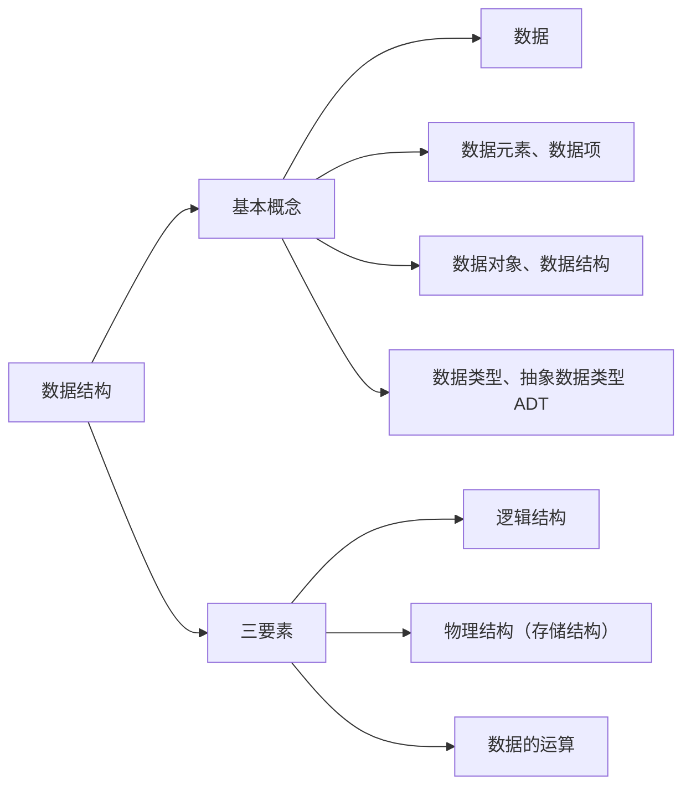
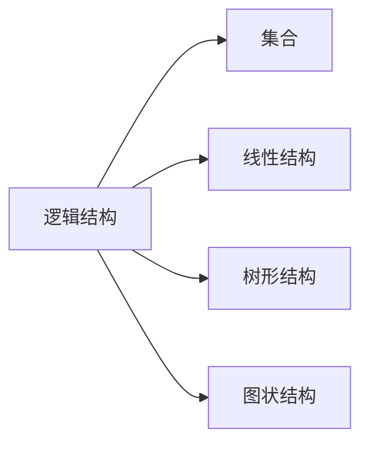

# 第一章 绪论

### 1.0 开篇——数据结构在学什么？

**数据结构在学什么？**

- 如何用程序代码把现实世界的问题**信息化**；
- 如何用计算机**高效地处理**这些信息从而创造价值。

**人类文明三次浪潮**（阿尔文·托夫勒《第三次浪潮》）：

| 浪潮  | 阶段            | 说明                |
| --- | ------------- | ----------------- |
| 第一次 | 农业（约 1 万年前）   | 学会农耕，从"动物"到"人类"   |
| 第二次 | 工业（17 世纪末）    | 出现枪炮与机械，导致古文明灭亡   |
| 第三次 | **信息化**（正在到来） | 高度信息化的世界，导致 ? ? ? |

> 托夫勒："唯一可以确定的是，明天会使我们所有人大吃一惊。"

**"信息化"**：把现实事物用计算机表示。

| 现实事物       | 信息化后的表示             |
| ---------- | ------------------- |
| 财富（存钱罐）    | 电子零钱（浮点型变量 `float`） |
| 排队（海底捞取号）  | 号单/用户号（数组？还是…）      |
| 友谊（朋友圈/粉丝） | 社交网络（粉丝列表、二维码）      |

> 学完 C 语言后，如何用计算机表示这些信息、并高效处理 → 这就是**数据结构**要解决的问题。

**计算机系统分层**（信息化世界）：一台计算机/手机 = **计组（硬件）** → **操作系统** → **C、数据结构（软件）**；多台计算机之间通过**计算机网络**互联，构成"信息化世界"。

---

### 1.1 数据结构的基本概念

> 学习建议：概念多但较基础，抓大放小、形成框架。讨论一种数据结构时，关注"**三要素**"。

**知识总览**：

#### 1. 什么是数据

**数据**：信息的载体，是描述客观事物属性的**数、字符**及所有能输入到计算机中并被计算机程序识别和处理的**符号的集合**。数据是计算机程序加工的原料。（计算机内以二进制 0/1 表示。）

#### 2. 数据元素、数据项

- **数据元素**：数据的**基本单位**，通常作为一个整体来考虑和处理。
- **数据项**：构成数据元素的**不可分割的最小单位**。
- 一个数据元素可由若干数据项组成；根据实际业务需求确定"什么是数据元素、什么是数据项"。
  例：海底捞取号记录 = {号数、取号时间、就餐人数}；微博账号 = {昵称、性别、生日（年/月/日可为"组合项"）}。

#### 3. 数据结构、数据对象

- **结构**：各个元素之间的关系（如汉字"沙 / 粥 / 曼"的不同结构）。
- **数据结构**：相互之间存在一种或多种**特定关系**的数据元素的集合。
- **数据对象**：具有**相同性质**的数据元素的集合，是数据的一个**子集**。
  例：数据结构 = 某个特定门店的排队顾客信息及其关系；数据对象 = 全国所有门店的排队顾客信息。

#### 4. 数据结构的三要素

讨论一种数据结构要关注：**逻辑结构、物理结构（存储结构）、数据的运算**。

**① 逻辑结构**（数据元素之间的逻辑关系是什么？）：

| 逻辑结构     | 关系                           | 例子      |
| -------- | ---------------------------- | ------- |
| 集合       | 各元素同属一个集合，别无其他关系             | 火锅配料    |
| 线性结构     | 一对一；除第一个外均有唯一前驱，除最后一个外均有唯一后继 | 排队取号、烤串 |
| 树形结构     | 一对多                          | 文件系统目录  |
| 图状结构（网状） | 多对多                          | 微信好友    |

> 线性结构 = 一对一；集合、树形、图状结构 = **非线性结构**。

**② 物理结构（存储结构）**（如何用计算机表示数据元素的逻辑关系？）：

| 存储结构 | 含义                               |
| ---- | -------------------------------- |
| 顺序存储 | 逻辑上相邻的元素在物理位置上也相邻，关系由存储单元的邻接关系体现 |
| 链式存储 | 逻辑上相邻的元素物理位置可不相邻，借助指针表示逻辑关系      |
| 索引存储 | 存储元素信息的同时建立附加的索引表，索引项形如（关键字，地址）  |
| 散列存储 | 根据元素关键字直接算出存储地址（又称 Hash 存储）      |

> 链式、索引、散列属于**非顺序存储**。
> **绪论只需理解两点**：①顺序存储元素物理上必须连续，非顺序存储可以离散；②存储结构会影响存储空间分配的方便程度（如"有人插队"）；③存储结构会影响对数据运算的速度（如"找第三个人"）。

**③ 数据的运算**：运算的**定义**针对**逻辑结构**（指出功能），运算的**实现**针对**存储结构**（指出操作步骤）。
例：队列逻辑结构（海底捞排队）定义运算：①队头元素出队；②新元素入队；③输出队列长度。

#### 5. 数据类型、抽象数据类型（ADT）

**数据类型**：一个值的集合和定义在此集合上的一组操作的总称。

1. **原子类型**：其值不可再分的数据类型（如 bool、int）。
2. **结构类型**：其值可再分解为若干成分（分量）的数据类型（如 `struct Customer{ int num; int people; }`）。

| 类型              | 值的范围                     | 可进行的操作     |
| --------------- | ------------------------ | ---------- |
| bool            | true / false             | 与、或、非      |
| int             | -2147483648 ~ 2147483647 | 加、减、乘、除、模… |
| struct Customer | num∈1~~9999，people∈1~~12 | 如"拼桌"运算    |

**抽象数据类型（ADT, Abstract Data Type）**：抽象数据组织及与之相关的操作。用数学化的语言定义数据的逻辑结构、定义运算，**与具体的实现无关**。

> **重要结论**：
>
> - 定义了一个 ADT，就是定义了数据的逻辑结构、数据的运算，即定义了一个**数据结构**。
> - 确定一种存储结构，就表示出了逻辑结构；存储结构不同，运算的具体实现也不同；确定了存储结构才能**实现**数据结构。
> - 数据结构这门课看重的是**数据元素之间的关系**和**对这些数据元素的操作**，而不关心具体的数据项内容。

---

### 1.2.1 算法的基本概念

**什么是算法？**

- **程序 = 数据结构 + 算法**（数据结构是要处理的信息；算法是处理信息的步骤）。
- **算法（Algorithm）**：对特定问题求解步骤的一种描述，是指令的**有限序列**，其中的每条指令表示一个或多个操作。
- 例：做番茄炒蛋（食材+步骤）；对线性表按年龄递增排序（选择排序 Step1~Step4）。

> **程序设计** = 设计一个好的数据结构 + 设计一个好的算法。

**算法的五个特性**：

| 特性  | 含义                                  |
| --- | ----------------------------------- |
| 有穷性 | 算法总在执行**有穷步**后结束，且每一步都能在**有穷时间**内完成 |
| 确定性 | 每条指令必须有确切的含义，相同输入只能得出相同的输出          |
| 可行性 | 描述的每一步都能通过已实现的基本运算执行有限次来实现          |
| 输入  | 有零个或多个输入，取自某个特定对象的集合                |
| 输出  | 有一个或多个输出，是与输入有某种特定关系的量              |

> 注：**算法必须是有穷的，而程序可以是无穷的**（如微信是程序，不是算法）。

**"好"算法的特质**（设计时要尽量追求的目标）：

1. **正确性**：能正确地解决求解问题。
2. **可读性**：描述要让别人看得懂（可由代码/伪代码/文字描述，重要的是**无歧义**）。
3. **健壮性**：输入非法数据时能恰当地反应或处理，不产生莫名其妙的输出。
4. **高效率与低存储量需求**：省时、省内存，即**时间复杂度低、空间复杂度低**。

---

### 1.2.2 算法的时间复杂度

**如何评估算法时间开销？**

- 让算法先运行、事后统计运行时间？存在问题：和机器性能、编程语言、编译程序指令质量有关；有些算法不能事后统计（如导弹控制算法）。
- 应**事前预估**：算法**时间复杂度** = 事前预估算法时间开销 $T(n)$ 与问题规模 $n$ 的关系（T 表示 time）。

**大 O 表示法**：$T(n) = O(f(n))$，表示二者**同阶/同等数量级**（当 $n \to \infty$ 时二者之比为常数）。只考虑阶数高的部分，系数和低次幂可忽略。

**计算规则**：

- **加法规则**：$T(n) = O(f(n)) + O(g(n)) = O(\max(f(n), g(n)))$ —— 多项相加，只保留最高阶项，系数变为 1。
- **乘法规则**：$T(n) = O(f(n)) \times O(g(n)) = O(f(n)\times g(n))$ —— 多项相乘，都保留。

**常用技巧**：顺序执行的代码只影响常数项（忽略）；只需挑循环中的一个基本操作、分析其执行次数与 n 的关系；多层嵌套循环只需关注**最深层循环**循环了几次。

**三种时间复杂度**：

| 类型      | 含义                    |
| ------- | --------------------- |
| 最坏时间复杂度 | 考虑输入数据"最坏"的情况         |
| 平均时间复杂度 | 所有输入示例等概率出现时算法的期望运行时间 |
| 最好时间复杂度 | 考虑输入数据"最好"的情况         |

> 很多算法执行时间与输入数据有关（如顺序查找）；算法性能问题在 n 很大时才会暴露。

**如何计算**：①找一个基本操作（最深层循环）→ ②分析其执行次数 $x$ 与问题规模 $n$ 的关系 $x=f(n)$ → ③取 $O(x)$ 即 $T(n)$。

**例题**：

- **逐步递增**：`int i=1; while(i<=n){ i++; printf(...); }` → $T(n)=3n+3=O(n)$。
- **指数递增**：`i=i*2` 每次翻倍 → 最深层循环语句频度 $x$，结束时 $2^x>n$，$x=\log_2 n+1$ → $T(n)=O(\log_2 n)$。
- **顺序查找**（数组中找元素 n）：最好 $O(1)$、最坏 $O(n)$、平均 $\frac{1+2+\dots+n}{n}=\frac{1+n}{2}$ → $O(n)$。

**常见复杂度排序**（口诀"常对幂指阶"）：

$O(1) < O(\log_2 n) < O(n) < O(n\log_2 n) < O(n^2) < O(n^3) < O(2^n) < O(n!) < O(n^n)$

---

### 1.2.3 算法的空间复杂度

**空间复杂度**：空间开销（内存开销）与问题规模 $n$ 的关系，记作 $S(n) = O(f(n))$（S 表示 Space）。

**程序运行时的内存需求**：

- **程序代码**：大小固定，与问题规模无关；
- **数据**：局部变量、参数等，其中**与 $n$ 相关**的变量才影响空间复杂度。

**原地工作**：算法所需内存空间为常量，即 $S(n) = O(1)$。（如算法1 逐步递增型爱你，无论 $n$ 怎么变，内存都是固定常量。）

**例题**：

| 程序                                | 所需空间                           | $S(n)$         |
| --------------------------------- | ------------------------------ | -------------- |
| `int flag[n]; int i;`             | $\approx 4n+8$                 | $O(n)$         |
| `int flag[n][n];`                 | $n\times n$                    | $O(n^2)$       |
| `flag[n][n] + other[n] + i`       | $O(n^2)+O(n)+O(1)$             | $O(n^2)$（加法规则） |
| 递归 `loveYou(n)`（各层存参数 n）          | 递归深度 $n$                       | $O(n)$         |
| 递归 `loveYou(n)`（各层存 `flag[n]` 数组） | $1+2+\dots+n=\frac{n(n+1)}{2}$ | $O(n^2)$       |

**递归的空间复杂度 = 递归调用的深度**（若各层所需存储空间不同，分析方法略有区别）。

**如何计算空间复杂度**：

- **普通程序**：①找到所占空间大小与问题规模相关的变量 → ②分析其所占空间 $x$ 与 $n$ 的关系 $x=f(n)$ → ③取 $O(x)$ 即 $S(n)$；
- **递归程序**：找到**递归调用的深度** $x$ 与 $n$ 的关系，取 $O(x)$ 即 $S(n)$。

**常用技巧**：同时间复杂度，加法/乘法规则、"常对幂指阶"（$O(1)<O(\log_2 n)<O(n)<O(n\log_2 n)<O(n^2)<O(n^3)<O(2^n)<O(n!)$）。

---

### 小结

1. **基本概念**：数据、数据元素/数据项、数据对象/数据结构、数据类型/抽象数据类型 ADT。
2. **数据结构的三要素**：逻辑结构（集合/线性/树形/图状，即线性与非线性）、物理结构/存储结构（顺序/链式/索引/散列，后三者非顺序）、数据的运算（定义针对逻辑结构、实现针对存储结构）。
3. **算法**：程序 = 数据结构 + 算法；算法的五个特性（有穷性、确定性、可行性、输入、输出），"好"算法特质（正确、可读、健壮、高效低存储）。
4. **时间复杂度**：$T(n)=O(f(n))$；加法/乘法规则；"常对幂指阶"；最好/最坏/平均。
5. **空间复杂度**：$S(n)=O(f(n))$；原地工作 $O(1)$；递归空间 = 递归深度。
6. **主考点**：定义了一个 ADT 就是定义了一个数据结构；存储结构影响运算实现；复杂度用大 O 只留最高阶。

---

