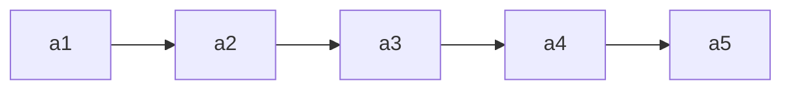
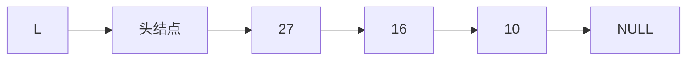
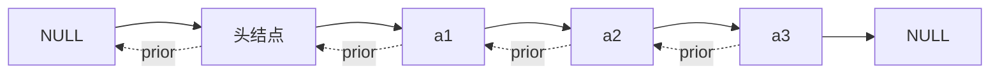
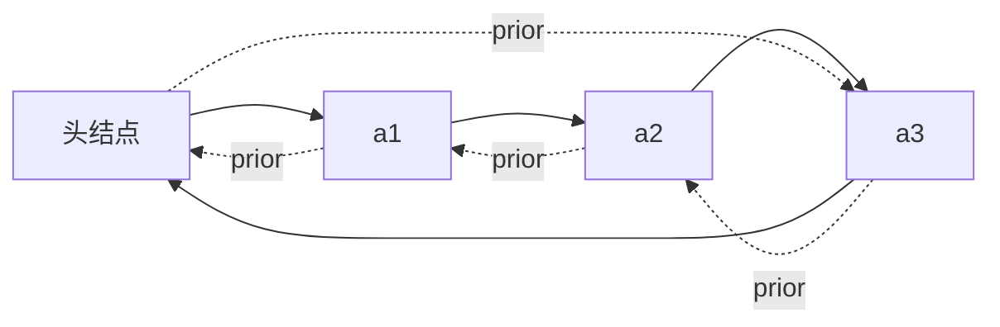
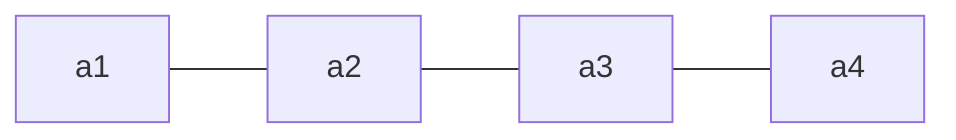

# 第二章 线性表


### 2.1 线性表的定义和基本操作

**线性表（Linear List）定义**：是具有**相同数据类型**的 $n$（$n\ge0$）个数据元素的**有限序列**。$n$ 为表长，$n=0$ 时是空表。用 $L$ 命名线性表，一般表示为：

$L = (a_1,\ a_2,\ \dots,\ a_i,\ a_{i+1},\ \dots,\ a_n)$

**特性**：①元素个数有限；②元素类型相同（每个元素所占空间一样大）；③元素有次序。

**重要术语**：

- $a_i$ 是线性表中的"第 $i$ 个"元素——线性表中的**位序**（**从 1 开始**，注意数组下标从 0 开始，用数组实现线性表时要审题）。
- $a_1$ 是**表头元素**，$a_n$ 是**表尾元素**。
- 除第一个元素外，每个元素有且仅有一个**直接前驱**；除最后一个元素外，每个元素有且仅有一个**直接后继**。

> Eg：所有整数按递增次序排列，是线性表吗？——**否**（无限序列，不是线性表）。



**基本操作**（记忆思路：**创销、增删改查**）：

| 操作                    | 功能   | 说明                           |
| --------------------- | ---- | ---------------------------- |
| InitList(\&L)         | 初始化表 | 构造空表，分配内存空间（从无到有）            |
| DestroyList(\&L)      | 销毁表  | 释放线性表占用的内存空间（从有到无）           |
| ListInsert(\&L,i,e)   | 插入   | 在表 L 第 i 个位置插入元素 e（增）        |
| ListDelete(\&L,i,\&e) | 删除   | 删除表 L 第 i 个位置的元素，用 e 返回其值（删） |
| LocateElem(L,e)       | 按值查找 | 在表 L 中查找具有给定关键字值的元素          |
| GetElem(L,i)          | 按位查找 | 获取表 L 第 i 个位置的元素的值           |
| Length(L)             | 求表长  | 返回 L 中数据元素的个数                |
| PrintList(L)          | 输出   | 按前后顺序输出 L 的所有元素              |
| Empty(L)              | 判空   | 若 L 为空表返回 true，否则 false      |

> **为什么要实现基本操作**：①团队合作编程，定义的 ADT 要让人方便使用（封装）；②将常用操作封装成函数，避免重复工作、降低出错风险。
> **改、查（本质是"定位"）**：改之前也要先"查"（LocateElem / GetElem）。

**什么时候要传入参数的引用 `&`**：对参数的修改结果需要"**带回来**"时。如 `InitList(&L)`、`DestroyList(&L)`、`ListInsert(&L,i,e)`、`ListDelete(&L,i,&e)`；而 `LocateElem(L,e)`、`GetElem(L,i)` 只读，不加 `&`。

```c
void test(int &x){ x = 1024; ... }   // 引用传递，x 的修改"带回来了"
int x = 1;  test(x);                 // 调用后 x=1024
```

> Tips：比起学会"How"，更重要的是想明白"Why"；函数命名要有可读性。


### 2.2.1 顺序表的定义

**顺序表**：用**顺序存储**的方式实现线性表。顺序存储把逻辑上相邻的元素存储在物理位置上也相邻的存储单元中，元素之间的关系由存储单元的邻接关系来体现。（即用"数组"存放数据元素。）

**元素地址**：设线性表第一个元素存放位置为 LOC(L)（location 的缩写），则第 $i$ 个元素地址 = LOC(L) + $(i-1)\times$ sizeof(ElemType)。用 C 语言 `sizeof(ElemType)` 得到元素大小（如 `sizeof(int)=4B`，`sizeof(Customer)=8B`）。

**顺序表的实现——静态分配**：

```c
#define MaxSize 10                 // 定义最大长度
typedef struct {
    ElemType data[MaxSize];        // 用静态的"数组"存放数据元素
    int length;                    // 顺序表的当前长度
} SqList;                          // 顺序表类型定义（静态分配）
```

Sq = sequence（顺序、序列）。给数据元素分配连续存储空间，大小为 MaxSize × sizeof(ElemType)。

- 表长一开始就确定、**无法更改**（静态）。存满就"放弃治疗"；若一开始就声明很大的空间，又会浪费。

**顺序表的实现——动态分配**（静态数组存满无法扩容，用动态数组）：

```c
#define InitSize 10
typedef struct {
    ElemType *data;    // 指示动态分配数组的指针
    int MaxSize;       // 顺序表的最大容量
    int length;        // 顺序表的当前长度
} SeqList;             // 动态分配方式
```

```c
L.data = (ElemType *) malloc(sizeof(ElemType) * InitSize);   // 申请一片连续空间
```

- C 用 malloc / free（头文件 `<stdlib.h>`），C++ 用 new / delete。
- **动态扩容**（`IncreaseSize(&L, len)`）：`int *p = L.data;  L.data = (int *) malloc((L.MaxSize + len) * sizeof(int));  for(...) L.data[i]=p[i];  L.MaxSize += len;  free(p);`
- 注：可用 `realloc` 实现，但建议初学者用 malloc / free 以理解过程；**扩容要把旧数据复制到新区域，时间开销大（O(n)）**。

**顺序表的特点**：

| 特点       | 说明                                                |
| -------- | ------------------------------------------------- |
| 随机访问     | 能在 $O(1)$ 时间内找到第 $i$ 个元素（`data[i-1]`，位序从 1、下标从 0） |
| 存储密度高    | 每个节点只存储数据元素，无指针                                   |
| 拓展容量不方便  | 静态分配无法改变；动态分配扩容也要搬移数据（$O(n)$）                     |
| 插入、删除不方便 | 需要移动大量元素                                          |


### 2.2.2（1）顺序表的插入和删除

**插入**：`ListInsert(&L, i, e)` —— 在表 L 的第 i 个位置插入元素 e。

```c
bool ListInsert(SqList &L, int i, int e){
    if(i < 1 || i > L.length + 1) return false;   // 判断 i 的范围是否有效
    if(L.length >= MaxSize) return false;          // 当前存储空间已满，不能插入
    for(int j = L.length; j >= i; j--)             // 将第 i 个元素及之后的元素后移
        L.data[j] = L.data[j-1];
    L.data[i-1] = e;                               // 在位置 i 处放入 e
    L.length++;                                     // 长度 +1
    return true;
}
```

- 注意位序 i 与数组下标关系：元素后移时**从表尾元素开始往前**移动。
- 健壮性：`if` 判断 i 是否合法、空间是否已满，返回 `bool` 给使用者反馈。

**插入时间复杂度**（问题规模 n = L.length）：

| 情况 | 说明                                       | 复杂度    |
| -- | ---------------------------------------- | ------ |
| 最好 | 插到表尾（i=n+1），0 次移动                        | $O(1)$ |
| 最坏 | 插到表头（i=1），n 次移动                          | $O(n)$ |
| 平均 | 各位置概率 $\frac{1}{n+1}$，平均移动 $\frac{n}{2}$ | $O(n)$ |

**删除**：`ListDelete(&L, i, &e)` —— 删除表 L 第 i 个位置的元素，并用 e 返回其值。

```c
bool ListDelete(SqList &L, int i, int &e){
    if(i < 1 || i > L.length) return false;   // 判断 i 的范围是否有效
    e = L.data[i-1];                           // 将被删除的元素赋值给 e
    for(int j = i; j < L.length; j++)          // 将第 i 个位置后的元素前移
        L.data[j-1] = L.data[j];
    L.length--;                                 // 长度 -1
    return true;
}
```

- 元素前移时**从靠前的元素开始**（与插入的后移相反，注意别弄反）。
- `e` 加了 `&`，因为要把删除的值"带回来"；不加 & 传的是复制品，改不回去。

**删除时间复杂度**（问题规模 n = L.length）：

| 情况 | 说明                                       | 复杂度    |
| -- | ---------------------------------------- | ------ |
| 最好 | 删除表尾（i=n），0 次移动                          | $O(1)$ |
| 最坏 | 删除表头（i=1），n-1 次移动                        | $O(n)$ |
| 平均 | 各位置概率 $\frac{1}{n}$，平均移动 $\frac{n-1}{2}$ | $O(n)$ |

### 2.2.2（2）顺序表的查找

**按位查找**：`GetElem(L, i)` —— 获取表 L 第 i 个位置的元素的值。

```c
ElemType GetElem(SeqList L, int i){
    return L.data[i-1];      // 位序 i 对应数组下标 i-1
}
```

- **时间复杂度 $O(1)$**：顺序表数据元素在内存中**连续存放**，根据起始地址 + 元素大小可立即定位第 i 个元素（**随机存取**特性）。
- 指针类型决定"步长"：`data[i]` = 起始地址 + i×sizeof(ElemType)；`malloc` 返回 `void*`，需**强制转换成** `ElemType*`。

**按值查找**：`LocateElem(L, e)` —— 在表 L 中查找第一个元素值等于 e 的元素，返回其**位序**（找不到返回 0）。

```c
int LocateElem(SeqList L, ElemType e){
    for(int i = 0; i < L.length; i++)
        if(L.data[i] == e)  return i + 1;   // 数组下标 i 对应位序 i+1
    return 0;                               // 退出循环，查找失败
}
```

- **基本数据类型**（int、char、double、float…）可直接用 `==` 比较；
- **结构类型**不能直接用 `==`（C 语言会报错），需逐分量比较，或封装成 `isCustomerEqual(a, b)` 函数；考研初试手写代码可直接用 `==`（主要考算法思想）。

**按值查找时间复杂度**（问题规模 n = L.length）：

| 情况 | 说明                                       | 复杂度    |
| -- | ---------------------------------------- | ------ |
| 最好 | 目标元素在表头，循环 1 次                           | $O(1)$ |
| 最坏 | 目标元素在表尾，循环 n 次                           | $O(n)$ |
| 平均 | 各位置概率 $\frac{1}{n}$，平均 $\frac{n+1}{2}$ 次 | $O(n)$ |


### 2.3.1 单链表的定义

**单链表**：用**链式存储**（存储结构）实现了**线性结构**（逻辑结构）。每个结点存储一个数据元素，各结点间的先后关系用一个**指针**表示。

|    | 顺序表（顺序存储）        | 单链表（链式存储）        |
| -- | ---------------- | ---------------- |
| 优点 | 可随机存取，存储密度高      | 不要求大片连续空间，改变容量方便 |
| 缺点 | 要求大片连续空间，改变容量不方便 | 不可随机存取，要耗费空间存放指针 |


**用代码定义一个单链表**：

```c
typedef struct LNode{      // 定义单链表结点类型
    ElemType data;         // 数据域，存放一个数据元素
    struct LNode *next;    // 指针域，指向下一个结点
}LNode, *LinkList;
```

- `typedef <数据类型> <别名>`：给类型重命名。`LNode` 是结点类型，`LinkList` 等价于 `LNode *`。**前者强调"是一个结点"，后者强调"这是一个单链表"，合适的地方用合适的名字可读性更高**。
- 新建结点：`LNode * p = (LNode *) malloc(sizeof(LNode));`（malloc 返回 void*，需强制转换）。

**两种实现方式：带头结点 / 不带头结点**（头结点不存放数据，只是为了操作方便）：

|      | 不带头结点                       | 带头结点                                                                 |
| ---- | --------------------------- | -------------------------------------------------------------------- |
| 初始化  | `InitList(&L){ L = NULL; }` | `InitList(&L){ L = (LNode*)malloc(sizeof(LNode)); L->next = NULL; }` |
| 空表判断 | `L == NULL`                 | `L->next == NULL`                                                    |
| 写代码  | 麻烦（首个/后续结点、空表/非空表逻辑不同）      | 更方便（统一处理）                                                            |

> 头指针 L 就代表整个单链表；因为要修改头指针，`InitList` 的参数要加 `&` 引用。


### 2.3.2（1）单链表的插入和删除

**插入**：

**① 按位序插入** `ListInsert(&L, i, e)`：在第 i 个位置插入元素 e，核心是找到第 i-1 个结点，把新结点插到它后面。

```c
bool ListInsert(LinkList &L, int i, ElemType e){
    if(i < 1) return false;
    LNode *p; int j = 0;
    p = L;                                // 头结点看作第 0 个结点
    while(p != NULL && j < i-1){ p = p->next; j++; }   // 找到第 i-1 个结点
    if(p == NULL) return false;
    LNode *s = (LNode *) malloc(sizeof(LNode));
    s->data = e;
    s->next = p->next;                    // 先连（顺序不能颠倒）
    p->next = s;                          // 再断
    return true;
}
```

- 时间复杂度：最好 $O(1)$（插表头 i=1），最坏 $O(n)$（插表尾），平均 $O(n)$。
- **不带头结点**：不存在"第 0 个"结点，i=1 需特殊处理（改头指针 L）。

**② 指定结点的后插** `InsertNextNode(p, e)`：`s->next = p->next; p->next = s;` —— $O(1)$。

**③ 指定结点的前插** `InsertPriorNode(p, e)`：**偷天换日**——把新结点 s 插到 p 后面，再交换数据，$O(1)$：

```c
s->next = p->next; p->next = s;
s->data = p->data;      // 把 p 中元素复制到 s
p->data = e;            // p 覆盖为 e
```

**删除**：

**① 按位序删除** `ListDelete(&L, i, &e)`：找到第 i-1 个结点，令其指向第 i+1 个结点，释放第 i 个结点。

```c
bool ListDelete(LinkList &L, int i, ElemType &e){
    if(i < 1) return false;
    LNode *p; int j = 0; p = L;
    while(p != NULL && j < i-1){ p = p->next; j++; }
    if(p == NULL) return false;
    if(p->next == NULL) return false;      // 第 i-1 个结点之后已无其余结点
    LNode *q = p->next;
    e = q->data;
    p->next = q->next;                     // 将 *q 从链中"断开"
    free(q);
    return true;
}
```

- 时间复杂度：最好 $O(1)$（删表头），最坏/平均 $O(n)$。

**② 指定结点的删除** `DeleteNode(p)`：

- 方法 1：传入头指针，循环找到 p 的前驱，改前驱的 next。
- 方法 2：**偷天换日**——把 p->next 的数据复制到 p，再删除 p->next，$O(1)$。
  > **有坑**：p 是最后一个结点时（p->next == NULL），方法 2 要特殊处理。

> Tips：这些代码都要会写；注意审题（**带头否？**）；体会"封装"的好处。


### 2.3.2（2）单链表的查找

**按位查找** `GetElem(L, i)`：返回第 i 个结点（头结点看作第 0 个结点）。

```c
LNode * GetElem(LinkList L, int i){
    if(i < 0) return NULL;
    LNode *p; int j = 0;
    p = L;                                       // 头结点为第 0 个结点
    while(p != NULL && j < i){ p = p->next; j++; }
    return p;                                     // i 超过表长时返回 NULL
}
```

- 时间复杂度 $O(n)$：[**单链表不具备"随机访问"特性，只能依次扫描**]（对比顺序表是 $O(1)$）。
- 王道书版本用 `j=1; p=L->next`；`if(i==0) return L; if(i<1) return NULL;`。

**按值查找** `LocateElem(L, e)`：返回第一个数据域等于 e 的结点指针，找不到返回 NULL。

```c
LNode * LocateElem(LinkList L, ElemType e){
    LNode *p = L->next;                          // 从第 1 个结点开始查找
    while(p != NULL && p->data != e) p = p->next;
    return p;
}
```

- 平均时间复杂度 $O(n)$。（ElemType 是复杂结构类型时需逐分量比较，同顺序表。）

**求单链表长度** `Length(L)`：

```c
int Length(LinkList L){
    int len = 0; LNode *p = L;
    while(p->next != NULL){ p = p->next; len++; }
    return len;
}
```

- 时间复杂度 $O(n)$。

> 对比：顺序表可"随机存取"（$O(1)$ 按位访问）；单链表只能**依次扫描**，三种基本操作（按位插入/删除/查找）平均都是 $O(n)$。写循环扫描时要**注意边界条件**。


### 2.3.2（3）单链表的建立

**建立思路**（本节讨论**带头结点**的情况）：

- **Step 1**：初始化一个单链表（`InitList`，分配头结点并令 `L->next = NULL`）；
- **Step 2**：每次取一个数据元素 `e`，插入到**表尾**（尾插法）或**表头**（头插法）。

#### 1. 尾插法建立单链表

**朴素做法**：每轮调用 `ListInsert(L, length+1, e)` 插到表尾。

```c
InitList(L);                       // 初始化单链表
int length = 0;                    // 记录链表长度
while(...){
    取一个数据元素 e;
    ListInsert(L, length+1, e);    // 插到尾部
    length++;
}
```

> **问题**：`ListInsert` 每次都要**从头遍历**找到表尾，单次 $O(n)$，整体 $O(n^2)$。

**改进做法**：设置一个**表尾指针 `r`** 始终指向最后一个结点，插入变为 $O(1)$，整体 $O(n)$。

```c
LinkList List_TailInsert(LinkList &L){          // 正向建立单链表
    int x;                                       // 设 ElemType 为 int
    L = (LinkList)malloc(sizeof(LNode));         // 建立头结点
    LNode *s, *r = L;                            // r 为表尾指针
    scanf("%d", &x);                             // 输入结点的值
    while(x != 9999){                            // 输入 9999 表示结束
        s = (LNode *)malloc(sizeof(LNode));
        s->data = x;
        r->next = s;                             // 在 r 结点之后插入元素 x
        r = s;                                   // r 指向新的表尾结点
        scanf("%d", &x);
    }
    r->next = NULL;                              // 尾结点指针置空
    return L;
}
```

> 关键：`r` 永远指向最后一个结点，避免每次从头遍历（对比朴素做法省去内层遍历）。

#### 2. 头插法建立单链表

每次把新结点插到**头结点之后**，即对头结点做**后插操作** `InsertNextNode(L, e)`。

```c
LinkList List_HeadInsert(LinkList &L){          // 逆向建立单链表
    LNode *s; int x;
    L = (LinkList)malloc(sizeof(LNode));         // 创建头结点
    L->next = NULL;                              // 初始为空链表（务必写！）
    scanf("%d", &x);
    while(x != 9999){                            // 输入 9999 表示结束
        s = (LNode *)malloc(sizeof(LNode));      // 创建新结点
        s->data = x;
        s->next = L->next;
        L->next = s;                             // 将新结点插入表中，L 为头指针
        scanf("%d", &x);
    }
    return L;
}
```

> **重要应用**：头插法建立出来的链表是**逆序**的，因此可用于**链表的逆置**。
> **易错点**：`L->next = NULL` 不能省 —— 养成习惯，只要初始化单链表，就先让头指针指向 NULL。



**本节核心**：头插法、尾插法的核心都是**初始化操作** + **指定结点的后插操作**；尾插法要注意设置指向表尾结点的指针 `r`；头插法的重要应用是**链表的逆置**。


### 2.3.3 双链表

**单链表 V.S. 双链表**：

|      | 单链表              | 双链表                            |
| ---- | ---------------- | ------------------------------ |
| 检索方向 | **无法逆向检索**，有时不方便 | **可进可退**（有前驱、后继两个指针）           |
| 存储密度 | 高（每结点 1 个指针）     | 更低（每结点 2 个指针，`prior` + `next`） |



**结点定义**：

```c
typedef struct DNode{          // 定义双链表结点类型
    ElemType data;             // 数据域
    struct DNode *prior, *next;// 前驱和后继指针
}DNode, *DLinklist;
```

> `DLinklist` 等价于 `DNode *`。

#### 1. 双链表的初始化（带头结点）

```c
bool InitDLinkList(DLinklist &L){
    L = (DNode *) malloc(sizeof(DNode));   // 分配一个头结点
    if(L == NULL) return false;            // 内存不足，分配失败
    L->prior = NULL;                       // 头结点的 prior 永远指向 NULL
    L->next = NULL;                        // 头结点之后暂时还没有结点
    return true;
}

// 判断双链表是否为空（带头结点）
bool Empty(DLinklist L){
    if(L->next == NULL) return true;
    else return false;
}
```

#### 2. 双链表的插入（后插）

在 `p` 结点之后插入 `s` 结点：

```c
bool InsertNextDNode(DNode *p, DNode *s){
    if(p == NULL || s == NULL) return false;   // 非法参数
    s->next = p->next;                         // ①
    if(p->next != NULL)                        // ② 如果 p 结点有后继结点
        p->next->prior = s;
    s->prior = p;                              // ③
    p->next = s;                               // ④
    return true;
}
```

> **要点**：修改指针时**要注意顺序**（①②必须在③④之前，否则会丢失后继结点的地址）；
> **边界情况**：若 `p` 是最后一个结点，则 `p->next == NULL`，此时 `p->next->prior` 会空指针异常，必须加 `if` 判断。
>
> 用"后插操作"可以实现**按位序插入**和**前插操作**。

#### 3. 双链表的删除（后删）

删除 `p` 结点的后继结点 `q`：

```c
bool DeleteNextDNode(DNode *p){
    if(p == NULL) return false;
    DNode *q = p->next;                        // 找到 p 的后继结点 q
    if(q == NULL) return false;                // p 没有后继
    p->next = q->next;
    if(q->next != NULL)                        // q 结点不是最后一个结点
        q->next->prior = p;
    free(q);                                   // 释放结点空间
    return true;
}

// 销毁双链表
void DestroyList(DLinklist &L){
    while(L->next != NULL)                     // 循环释放各个数据结点
        DeleteNextDNode(L);
    free(L);                                   // 释放头结点
    L = NULL;                                  // 头指针指向 NULL
}
```

> **边界情况**：若被删除结点是最后一个数据结点，则 `q->next == NULL`，需特殊处理。

#### 4. 双链表的遍历

| 遍历方式        | 代码骨架                                             |
| ----------- | ------------------------------------------------ |
| 后向遍历        | `while(p != NULL){ 处理 p; p = p->next; }`         |
| 前向遍历        | `while(p != NULL){ 处理 p; p = p->prior; }`        |
| 前向遍历（跳过头结点） | `while(p->prior != NULL){ 处理 p; p = p->prior; }` |

> 双链表**不可随机存取**，按位查找、按值查找都只能用**遍历**的方式实现，时间复杂度 $O(n)$。

**本节考点**：初始化（头结点的 `prior`、`next` 都指向 NULL）→ 插入（后插，注意指针修改顺序与"插在最后"的边界）→ 删除（后删，注意"删的是最后一个数据结点"的边界）→ 遍历（循环终止条件）。


### 2.3.4 循环链表

循环链表分两种：**循环单链表**、**循环双链表**。

#### 1. 循环单链表

**定义**：与单链表的区别在于，**表尾结点的 `next` 指针指向头结点**（而不是 NULL）。

| 对比项          | 普通单链表                                    | 循环单链表          |
| ------------ | ---------------------------------------- | -------------- |
| 表尾结点的 `next` | `NULL`                                   | 指向**头结点** `L`  |
| 判空条件         | `L == NULL`（不带头） / `L->next == NULL`（带头） | `L->next == L` |
| 判断 p 是否表尾    | `p->next == NULL`                        | `p->next == L` |

```c
// 初始化一个循环单链表
bool InitList(LinkList &L){
    L = (LNode *) malloc(sizeof(LNode));   // 分配一个头结点
    if(L == NULL) return false;            // 内存不足，分配失败
    L->next = L;                           // 头结点 next 指向头结点
    return true;
}

// 判断循环单链表是否为空
bool Empty(LinkList L){
    if(L->next == L) return true;
    else return false;
}

// 判断结点 p 是否为循环单链表的表尾结点
bool isTail(LinkList L, LNode *p){
    if(p->next == L) return true;
    else return false;
}
```

**重要性质**：

- **普通单链表**：从某个结点出发，**只能找到该结点之后的结点**（无法回到前面的结点）。
- **循环单链表**：从**任意一个结点**出发，都可以找到表中的**其他任何结点**（因为表尾又绕回了表头）。

**灵活应用**：若让头指针 `L` 指向**表尾元素**：

- 找表头：`L->next` —— $O(1)$；
- 找表尾：`L` 本身 —— $O(1)$。

> 因为循环链表中表头、表尾仅一步之遥，所以对表头、表尾的操作都很方便（代价是插入/删除时可能需要修改 `L`）。

#### 2. 循环双链表

**定义**：表头结点的 `prior` 指向**表尾结点**，表尾结点的 `next` 指向**头结点**。



```c
// 初始化空的循环双链表
bool InitDLinkList(DLinklist &L){
    L = (DNode *) malloc(sizeof(DNode));   // 分配一个头结点
    if(L == NULL) return false;            // 内存不足，分配失败
    L->prior = L;                          // 头结点的 prior 指向头结点
    L->next = L;                           // 头结点的 next 指向头结点
    return true;
}

// 判断循环双链表是否为空
bool Empty(DLinklist L){
    if(L->next == L) return true;
    else return false;
}

// 判断结点 p 是否为循环双链表的表尾结点
bool isTail(DLinklist L, DNode *p){
    if(p->next == L) return true;
    else return false;
}
```

**循环双链表的插入（后插）** —— 因为 `p->next` **永远不为 NULL**，所以**不需要**判断边界：

```c
bool InsertNextDNode(DNode *p, DNode *s){
    s->next = p->next;
    p->next->prior = s;        // 循环双链表中 p->next 一定非空，可直接写
    s->prior = p;
    p->next = s;
    return true;
}
```

**循环双链表的删除（后删）** —— 同理，`q->next` 也一定非空：

```c
bool DeleteNextDNode(DNode *p){
    DNode *q = p->next;
    p->next = q->next;
    q->next->prior = p;        // 无需判断 q->next 是否为空
    free(q);
    return true;
}
```

> **对比**：普通双链表的插入/删除要判断 `p->next != NULL`、`q->next != NULL`（处理"插在/删在最后一个结点"的边界）；**循环双链表因为有"环"，这些判断都可以省掉**，代码更简洁。

#### 3. 循环链表要解决的代码问题

1. **如何判空** —— 看 `L->next` 是否等于 `L`；
2. **如何判断结点 p 是表尾/表头结点** —— 表尾：`p->next == L`；表头：`p == L`（带头结点时）；这是**后向/前向遍历的实现核心**；
3. **如何在表头、表中、表尾插入/删除一个结点** —— 这是插入、删除操作的**不易错思路**（先想清楚是"改前驱的 next"还是"改后继的 prior"）。


### 2.3.5 静态链表

**什么是静态链表**：用**数组**的方式实现的链表 —— 分配一整片**连续的内存空间**，各个结点**集中安置**。

- 数组的每个元素由两部分组成：**数据元素** + **游标**（下一个结点的数组下标，充当"指针"）；
- 用 `0` 号结点充当**头结点**；
- 游标为 **-1** 表示已到达**表尾**（相当于 NULL）；空闲结点的游标设为特殊值 **-2**。

> 例：每个数据元素 4B、每个游标 4B（每个结点共 8B），则 `e₁` 的存放地址 = `addr + 8 × 2`。

**用代码定义一个静态链表**：

```c
#define MaxSize 10              // 静态链表的最大长度
typedef struct {
    ElemType data;              // 存储数据元素
    int next;                   // 下一个元素的数组下标
} SLinkList[MaxSize];           // 等价于声明一个长度为 MaxSize 的 Node 型数组
```

```c
// 等价写法
struct Node{
    ElemType data;
    int next;
};
typedef struct Node SLinkList[MaxSize];
```

> `SLinkList b;` 相当于定义了一个长度为 `MaxSize` 的 Node 型数组；
> 验证：`sizeof(x)=8`、`sizeof(a)=80`、`sizeof(b)=80`（`MaxSize=10`）。

**静态链表的数组示意**（`MaxSize = 10`）：

| 下标       | 0 | 1     | 2     | 3     | 4  | 5  | 6     | 7  | 8  | 9  |
| -------- | - | ----- | ----- | ----- | -- | -- | ----- | -- | -- | -- |
| **data** | 头 | $e_2$ | $e_1$ | $e_4$ | 空  | 空  | $e_3$ | 空  | 空  | 空  |
| **next** | 2 | 6     | 1     | -1    | -2 | -2 | 3     | -2 | -2 | -2 |

对应的逻辑链：


> 注意：静态链表中，**逻辑上相邻的元素在物理上不一定相邻**（由 `next` 游标串起来），这一点与单链表相同。

**简述基本操作的实现**：

| 操作            | 做法                                                                                  |
| ------------- | ----------------------------------------------------------------------------------- |
| **初始化**       | 把 `a[0]` 的 `next` 设为 -1；其他结点的 `next` 设为特殊值（如 -2）表示空闲                                |
| **查找**        | 从头结点出发**挨个往后遍历**结点                                                                  |
| **插入**（位序为 i） | ① 找到一个**空的结点**存入数据元素；② 从头结点出发找到位序为 **i-1** 的结点；③ 修改新结点的 `next`；④ 修改 i-1 号结点的 `next` |
| **删除**        | ① 从头结点出发找到**前驱结点**；② 修改前驱结点的游标；③ 被删除结点的 `next` 设为 -2                                |

> **如何判断结点是否为空**：可以让 `next` 为某个特殊值，如 -2。

**优缺点与适用场景**：

|          | 说明                                                        |
| -------- | --------------------------------------------------------- |
| **优点**   | 增、删操作**不需要大量移动元素**（不像顺序表）                                 |
| **缺点**   | **不能随机存取**，只能从头结点开始依次往后查找；**容量固定不可变**                     |
| **适用场景** | ① **不支持指针**的低级语言；② **数据元素数量固定不变**的场景（如操作系统的**文件分配表 FAT**） |


### 2.3.6 顺序表和链表的比较

从三个维度（Round 1~3）对比，最后回答"到底该用谁"。

#### Round 1：逻辑结构

**都属于线性表，都是线性结构**。



#### Round 2：存储结构

|        | 顺序表（顺序存储）                   | 链表（链式存储）                  |
| ------ | --------------------------- | ------------------------- |
| **优点** | 支持**随机存取**、**存储密度高**        | **离散的小空间**分配方便，**改变容量方便** |
| **缺点** | **大片连续空间**分配不方便，**改变容量不方便** | **不可随机存取**，**存储密度低**      |

#### Round 3：基本操作（按"创销、增删改查"复习）

**① 创（初始化）**：

|      | 顺序表                                              | 链表                                         |
| ---- | ------------------------------------------------ | ------------------------------------------ |
| 做法   | 需要**预分配大片连续空间**。分配过小 → 之后不便拓展；分配过大 → 浪费内存        | 只需分配**一个头结点**（也可不要头结点，只声明一个头指针），之后**方便拓展** |
| 静态分配 | 静态数组 → 容量**不可改变**                                | —                                          |
| 动态分配 | 动态数组（`malloc`、`free`）→ 容量可改变，但**需要移动大量元素，时间代价高** | —                                          |

**② 销（销毁）**：

|      | 顺序表                                | 链表               |
| ---- | ---------------------------------- | ---------------- |
| 做法   | 修改 `Length = 0`                    | 依次删除各个结点（`free`） |
| 空间回收 | 静态分配由**系统自动回收**；动态分配需**手动 `free`** | 需手动 `free`       |

> **注意**：`malloc` 和 `free` **必须成对出现**。

**③ 增、删**：

|         | 顺序表                     | 链表                        |
| ------- | ----------------------- | ------------------------- |
| 做法      | 插入/删除元素要将**后续元素都后移/前移** | 插入/删除元素**只需修改指针**         |
| 时间复杂度   | $O(n)$，时间开销**主要来自移动元素** | $O(n)$，时间开销**主要来自查找目标元素** |
| 数据元素很大时 | **移动的时间代价很高**           | **查找元素的时间代价更低**           |

**④ 查**：

|      | 顺序表                                     | 链表     |
| ---- | --------------------------------------- | ------ |
| 按位查找 | $O(1)$                                  | $O(n)$ |
| 按值查找 | $O(n)$；**若表内元素有序，可在 $O(\log_2 n)$ 内找到** | $O(n)$ |

#### 到底该用顺序表还是链表？

|             | 顺序表 | 链表 |
| ----------- | --- | -- |
| **弹性（可扩容）** | 差   | 好  |
| **增、删**     | 差   | 好  |
| **查**       | 好   | 差  |

**选择依据**：

- **表长难以预估、经常要增加/删除元素** —— 用**链表**；
- **表长可预估、查询（搜索）操作较多** —— 用**顺序表**。

#### 开放式问题的答题思路（重要考点）

> **问题**：实现线性表时，用顺序表还是链表好？（请描述顺序表和链表的……）

**答题框架**：

1. 顺序表和链表的**逻辑结构都是线性结构**，都属于**线性表**；
2. 但二者的**存储结构不同**：顺序表采用**顺序存储**……（特点 → 带来的优缺点）；链表采用**链式存储**……（特点 → 导致的优缺点）；
3. 由于采用不同的存储方式实现，因此**基本操作的实现效率也不同**：当**初始化**时……；当**插入**一个数据元素时……；当**删除**一个数据元素时……；当**查找**一个数据元素时……。

### 小结

1. **线性表**：相同数据类型的 $n$（$n\ge0$）个数据元素的有限序列；位序从 1 开始，数组下标从 0 开始。
2. **基本操作**：创销、增删改查（`InitList` / `DestroyList` / `ListInsert` / `ListDelete` / `LocateElem` / `GetElem` / `Length` / `PrintList` / `Empty`）；需要"把修改带回来"时参数要加 `&`。
3. **顺序表**：顺序存储，随机访问 $O(1)$、存储密度高；插删平均 $O(n)$（移动元素）；静态分配容量固定，动态分配扩容 $O(n)$。
4. **单链表**：链式存储，不要求连续空间；按位/按值查找、按位插入删除平均都是 $O(n)$（依次扫描）；**带头结点**写代码更方便。
5. **单链表的建立**：尾插法（要设**表尾指针** `r`，$O(n)$）、头插法（**逆序**，可用于**链表逆置**）；核心是"初始化 + 后插操作"。
6. **双链表**：可进可退（`prior` + `next`），但存储密度更低；插入/删除要注意**指针修改顺序**与"操作最后一个结点"的边界。
7. **循环链表**：循环单链表表尾 `next` 指向头结点（判空 `L->next == L`）；循环双链表头尾相接，插入/删除**无需判空边界**，代码更简洁。
8. **静态链表**：用数组实现的链表（`data` + `next` 游标），0 号为头结点、游标 -1 为表尾；适合不支持指针的语言、元素数量固定的场景（如 FAT）。
9. **顺序表 V.S. 链表**：逻辑结构相同（都是线性表）；存储结构不同 → 弹性/增删/查的优劣不同；**表长难估、频繁增删用链表；表长可估、查询多用顺序表**。

---

