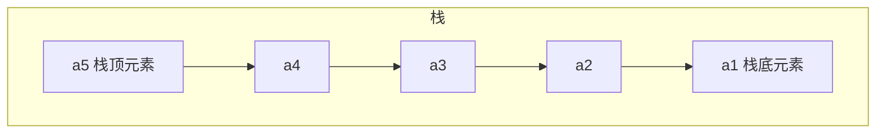
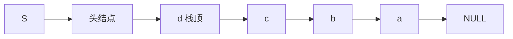
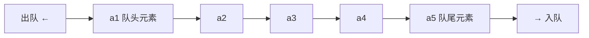
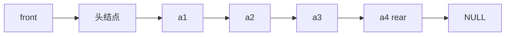
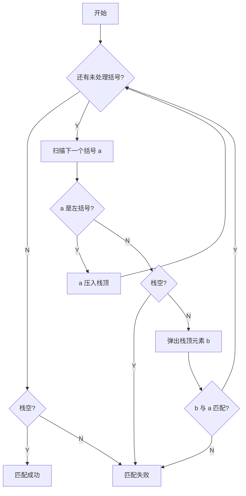
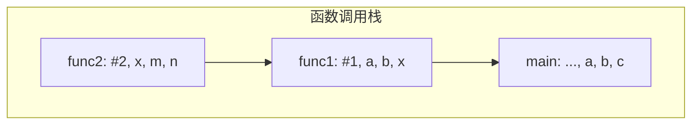
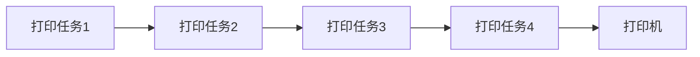

# 第三章 栈、队列和数组

| 考点                      | 重要程度 | 占分    | 常见题型  |
| ----------------------- | ---- | ----- | ----- |
| 栈的定义与基本操作（LIFO）         | ★★★  | 2~4 分 | 选择    |
| 栈的顺序存储（`top` 指针、共享栈）    | ★★★  | 2~4 分 | 选择、代码 |
| 栈的链式存储                  | ★★   | 2 分   | 选择    |
| 队列的定义与基本操作（FIFO）        | ★★★  | 2~4 分 | 选择    |
| 循环队列（判空/判满、元素个数）        | ★★★★ | 2~5 分 | 选择、计算 |
| 双端队列（输入/输出受限）           | ★★   | 2~4 分 | 选择    |
| 栈的应用（括号匹配、表达式求值、递归）     | ★★★★ | 4~6 分 | 综合、选择 |
| 特殊矩阵的压缩存储（对称、三角、三对角、稀疏） | ★★★  | 2~4 分 | 选择、计算 |

---


### 3.1.1 栈的基本概念

**定义**：**栈（Stack）是只允许在一端进行插入或删除操作的线性表**。

> 与普通线性表相比：
>
> - **逻辑结构**：与普通线性表**相同**；
> - **数据的运算**：插入、删除操作**有区别**（只能在栈顶进行）。

**重要术语**：

| 术语             | 含义              |
| -------------- | --------------- |
| **栈顶（Top）**    | **允许插入和删除**的一端  |
| **栈底（Bottom）** | **不允许插入和删除**的一端 |
| **空栈**         | 不含任何元素的栈        |



- **进栈顺序**：$a_1 \to a_2 \to a_3 \to a_4 \to a_5$
- **出栈顺序**：$a_5 \to a_4 \to a_3 \to a_2 \to a_1$
- **特点**：**后进先出**（Last In First Out，**LIFO**）

> 生活类比：一摞盘子（后放的先取）、烤串（后穿的先吃）。

**栈的基本操作**：

| 操作                 | 功能                                  | 归类 |
| ------------------ | ----------------------------------- | -- |
| `InitStack(&S)`    | 初始化栈。构造一个空栈 S，分配内存空间                | 创  |
| `DestroyStack(&S)` | 销毁栈。销毁并释放栈 S 所占用的内存空间               | 销  |
| `Push(&S, x)`      | **进栈**。若栈 S 未满，则将 x 加入使之成为**新栈顶**   | 增  |
| `Pop(&S, &x)`      | **出栈**。若栈 S 非空，则弹出栈顶元素，并用 x 返回      | 删  |
| `GetTop(S, &x)`    | **读栈顶元素**。若栈 S 非空，则用 x 返回栈顶元素       | 查  |
| `StackEmpty(S)`    | 判断一个栈 S 是否为空。若 S 为空返回 true，否则 false | 判空 |

> **要点**：
>
> - `Push` / `Pop` 会**删除**栈顶元素；`GetTop` **不删除**栈顶元素；
> - **查**：栈的使用场景中**大多只访问栈顶元素**；
> - **增、删只能在栈顶操作**。

#### 栈的常考题型

**问题**：进栈顺序为 $a \to b \to c \to d \to e$，有哪些合法的出栈顺序？

**结论**：$n$ 个不同元素进栈，出栈元素不同排列的个数为

$\frac{1}{n+1}C_{2n}^{n}$

上述公式称为**卡特兰（Catalan）数**，可采用数学归纳法证明（**不要求掌握**）。

例：$n=5$ 时

$\frac{1}{5+1}C_{10}^{5}=\frac{10\times9\times8\times7\times6}{6\times5\times4\times3\times2\times1}=42$

> 即 $a\to b\to c\to d\to e$ 进栈时，合法的出栈顺序共有 **42** 种。

**本节考点**：定义（操作受限的线性表，只能在栈顶插入/删除）→ 特性（**后进先出 LIFO**）→ 术语（栈顶、栈底、空栈）→ 基本操作（创销、增删、查、判空）。


### 3.1.2 栈的顺序存储实现

**顺序栈**：用**顺序存储**方式实现的栈 —— 用**静态数组**实现，并需要记录**栈顶指针**。

```c
#define MaxSize 10              // 定义栈中元素的最大个数
typedef struct{
    ElemType data[MaxSize];     // 静态数组存放栈中元素
    int top;                    // 栈顶指针
} SqStack;
```

> `Sq` = sequence（顺序）；顺序存储给各数据元素分配**连续**的存储空间，大小为 `MaxSize * sizeof(ElemType)`。

#### 1. 初始化操作

```c
void InitStack(SqStack &S){
    S.top = -1;                 // 初始化栈顶指针
}

bool StackEmpty(SqStack S){     // 判断栈空
    if(S.top == -1) return true;    // 栈空
    else return false;
}
```

> `top = -1` 时栈为空（此时 `top` 指向**栈顶元素**）。

#### 2. 进栈操作（Push）

```c
bool Push(SqStack &S, ElemType x){
    if(S.top == MaxSize - 1) return false;   // 栈满，报错
    S.top = S.top + 1;                       // 指针先加 1
    S.data[S.top] = x;                       // 新元素入栈
    return true;
}
```

> 上面两行**等价于** `S.data[++S.top] = x;`
> **错误写法**（指针与赋值顺序颠倒）：
> `S.data[S.top] = x;  S.top = S.top + 1;` 或 `S.data[S.top++] = x;`

#### 3. 出栈操作（Pop）

```c
bool Pop(SqStack &S, ElemType &x){
    if(S.top == -1) return false;   // 栈空，报错
    x = S.data[S.top];              // 栈顶元素先出栈
    S.top = S.top - 1;              // 指针再减 1
    return true;
}
```

> 上面两行**等价于** `x = S.data[S.top--];`
> **错误写法**：`S.top = S.top - 1;  x = S.data[S.top];` 或 `x = S.data[--S.top];`
> **注意**：出栈后数据**仍残留在内存**中，只是**逻辑上**被删除了。

#### 4. 读栈顶元素（GetTop）

```c
bool GetTop(SqStack S, ElemType &x){
    if(S.top == -1) return false;   // 栈空，报错
    x = S.data[S.top];              // x 记录栈顶元素
    return true;
}
```

> 与 `Pop` 的**唯一区别**：`Pop` 有 `S.top = S.top - 1`（先出栈、指针再减 1），`GetTop` **不移动指针**。

#### 5. 另一种方式（`top` 指向"下一个可插入位置"）

| 操作     | `top` 初始为 **-1**（指向栈顶元素） | `top` 初始为 **0**（指向下一个可插入位置） |
| ------ | ------------------------ | --------------------------- |
| 初始化    | `S.top = -1`             | `S.top = 0`                 |
| 进栈     | `S.data[++S.top] = x`    | `S.data[S.top++] = x`       |
| 出栈     | `x = S.data[S.top--]`    | `x = S.data[--S.top]`       |
| 读栈顶    | `x = S.data[S.top]`      | `x = S.data[S.top - 1]`     |
| **判空** | `S.top == -1`            | `S.top == 0`                |
| **判满** | `S.top == MaxSize - 1`   | `S.top == MaxSize`          |

> **顺序栈的缺点**：**栈的大小不可变**（静态数组）。
> **审题提醒**：做题前先看清题目用的是哪种实现方式。

#### 6. 共享栈

**两个栈共享同一片内存空间**，两个栈**从两边往中间增长**。

```c
#define MaxSize 10
typedef struct{
    ElemType data[MaxSize];     // 静态数组存放栈中元素
    int top0;                   // 0 号栈栈顶指针
    int top1;                   // 1 号栈栈顶指针
} ShStack;

void InitStack(ShStack &S){
    S.top0 = -1;                // 0 号栈从左边开始增长
    S.top1 = MaxSize;           // 1 号栈从右边开始增长
}
```

> **栈满的条件**：`top0 + 1 == top1`（两个栈顶指针相遇）。
> 好处：更充分地利用存储空间（只有在整片空间都被占满时才溢出）。

#### 小结

- 顺序栈的基本操作（创、增、删、查）都是 **$O(1)$** 时间复杂度；
- 两种实现方式（`top` 初值 -1 / 0）的**判空、判满、指针移动方式都不同**，要看清题目；
- **共享栈**：两个栈从两端往中间增长，栈满条件 `top0 + 1 == top1`；
- 顺序栈的**缺点**是容量固定不可变。

### 3.1.3 栈的链式存储实现

**链栈**：用**链式存储**方式实现的栈。

```c
typedef struct Linknode{
    ElemType data;              // 数据域
    struct Linknode *next;      // 指针域
} *LiStack;                     // 栈类型定义
```

**核心思想**：**进栈 / 出栈都只能在栈顶一端进行**，因此把**链头作为栈顶**：

| 链栈操作   | 对应单链表操作                     |
| ------ | --------------------------- |
| **进栈** | 对**头结点**的**后插**操作（头插法建立单链表） |
| **出栈** | 对**头结点**的**后删**操作           |

**两种实现方式**：

|     | 带头结点               | 不带头结点（**推荐**） |
| --- | ------------------ | ------------- |
| 初始化 | `S -> 头结点 -> NULL` | `S -> NULL`   |



> **注意**：链栈**一般不会满**（除非内存耗尽），因此通常**不需要判满**，只需判空（`S == NULL` 或 `S->next == NULL`）。

**本节要点**：链栈的**进栈、出栈都在链头进行**；本质就是"头插法建立单链表"+"对头结点的后删"，建议**动手写一遍**初始化、进栈、出栈、读栈顶、判空的代码。


### 3.2.1 队列的基本概念

**定义**：**队列（Queue）是只允许在一端进行插入，在另一端删除的线性表**。

> 与栈对比：栈是"只允许在一端进行插入或删除"，队列是"一端插入、另一端删除"。

**重要术语**：

| 术语            | 含义          |
| ------------- | ----------- |
| **队头（Front）** | **允许删除**的一端 |
| **队尾（Rear）**  | **允许插入**的一端 |
| **空队列**       | 不含任何元素的队列   |



- **入队**（EnQueue）：在**队尾**插入元素；
- **出队**（DeQueue）：在**队头**删除元素；
- **特点**：**先进先出**（First In First Out，**FIFO**）。

> 生活类比：排队打饭、收费站排队 —— 先进入队列的元素先出队。

**队列的基本操作**：

| 操作                 | 功能                                  | 归类 |
| ------------------ | ----------------------------------- | -- |
| `InitQueue(&Q)`    | 初始化队列。构造一个空队列 Q                     | 创  |
| `DestroyQueue(&Q)` | 销毁队列。销毁并释放队列 Q 所占用的内存空间             | 销  |
| `EnQueue(&Q, x)`   | **入队**。若队列 Q 未满，将 x 加入，使之成为**新的队尾** | 增  |
| `DeQueue(&Q, &x)`  | **出队**。若队列 Q 非空，删除**队头**元素，并用 x 返回  | 删  |
| `GetHead(Q, &x)`   | **读队头元素**。若队列 Q 非空，则将队头元素赋值给 x      | 查  |
| `QueueEmpty(Q)`    | 判队列空。若队列 Q 为空返回 true，否则 false       | 判空 |

> **要点**：
>
> - `EnQueue` / `DeQueue` 会**删除**队头元素；`GetHead` **不删除**队头元素；
> - **查**：队列的使用场景中**大多只访问队头元素**；
> - 增、删**只能在规定的一端进行**（队尾插入、队头删除）。

**本节考点**：定义（只能在**队尾插入、队头删除**的操作受限线性表）→ 特性（**先进先出 FIFO**）→ 术语（队头、队尾、空队列、队头元素、队尾元素）→ 基本操作（创销、增删、查、判空）。


### 3.2.2 队列的顺序实现

```c
#define MaxSize 10              // 定义队列中元素的最大个数
typedef struct{
    ElemType data[MaxSize];     // 用静态数组存放队列元素
    int front, rear;            // 队头指针和队尾指针
} SqQueue;
```

> **指针指向约定**（本节默认）：`front` 指向**队头元素**；`rear` 指向**队尾元素的后一个位置**（即**下一个应该插入的位置**）。

#### 1. 初始化操作

```c
void InitQueue(SqQueue &Q){
    Q.rear = Q.front = 0;       // 初始时，队头、队尾指针指向 0
}

bool QueueEmpty(SqQueue Q){
    if(Q.rear == Q.front) return true;   // 队空条件
    else return false;
}
```

#### 2. 入队操作（EnQueue）

**朴素做法**（`rear == MaxSize` 判断队满 —— **错误**，会造成"假溢出"）：

```c
Q.data[Q.rear] = x;             // 将 x 插入队尾
Q.rear = Q.rear + 1;            // 队尾指针后移
```

**循环队列做法**（用**取模运算**）：

```c
bool EnQueue(SqQueue &Q, ElemType x){
    if((Q.rear + 1) % MaxSize == Q.front) return false;   // 队满则报错
    Q.data[Q.rear] = x;                                   // 新元素插入队尾
    Q.rear = (Q.rear + 1) % MaxSize;                      // 队尾指针加 1 取模
    return true;
}
```

> **模运算**：将无限的整数域映射到有限的整数集合 $\{0,1,2,\dots,MaxSize-1\}$ 上，把存储空间在**逻辑上变成了"环状"**（循环队列）。
> 跨考 Tips：取模运算即取余运算，两个整数 $a,b$，`a % b` == $a$ 除以 $b$ 的余数；《数论》中通常表示为 $a \bmod b$。

#### 3. 出队操作（DeQueue）

```c
bool DeQueue(SqQueue &Q, ElemType &x){
    if(Q.rear == Q.front) return false;   // 队空则报错
    x = Q.data[Q.front];
    Q.front = (Q.front + 1) % MaxSize;    // 队头指针后移
    return true;
}

// 获得队头元素的值，用 x 返回
bool GetHead(SqQueue Q, ElemType &x){
    if(Q.rear == Q.front) return false;   // 队空则报错
    x = Q.data[Q.front];
    return true;
}
```

> **只能让队头元素出队**。

#### 4. 循环队列：判断队满 / 队空（三种方案）

**问题**：`Q.rear == Q.front` 既可能是**队空**，也可能是**队满**，需要区分。

**方案一：牺牲一个存储单元**（默认方案）

| 判断         | 条件                                                      |
| ---------- | ------------------------------------------------------- |
| **队空**     | `Q.rear == Q.front`                                     |
| **队满**     | `(Q.rear + 1) % MaxSize == Q.front`（队尾指针的**再下一个位置**是队头） |
| **队列元素个数** | `(rear + MaxSize - front) % MaxSize`                    |

> 代价：牺牲一个存储单元（`MaxSize=10` 的数组最多只能存 **9** 个元素）。

**方案二：增加 `size` 变量记录队列长度**

```c
typedef struct{
    ElemType data[MaxSize];
    int front, rear;
    int size;                   // 队列当前长度
} SqQueue;
```

- 插入成功 `size++`；删除成功 `size--`；
- **队列元素个数 = `size`**；
- **队空**：`size == 0`；**队满**：`size == MaxSize`。

**方案三：增加 `tag` 变量标记最近一次操作**

```c
typedef struct{
    ElemType data[MaxSize];
    int front, rear;
    int tag;                    // 最近进行的是删除(0) / 插入(1)
} SqQueue;
```

- **只有删除操作**才可能导致队空；**只有插入操作**才可能导致队满；
- 每次**删除**成功令 `tag = 0`；每次**插入**成功令 `tag = 1`；
- **队空**：`front == rear && tag == 0`；
- **队满**：`front == rear && tag == 1`。

#### 5. 其他出题方法：`rear` 指向队尾元素

若约定 **`rear` 指向队尾元素**（而非后一个位置）：

| 操作     | 写法                                                                   |
| ------ | -------------------------------------------------------------------- |
| 入队     | `Q.rear = (Q.rear + 1) % MaxSize;  Q.data[Q.rear] = x;`（**先移动指针再存**） |
| 出队     | `x = Q.data[Q.front];  Q.front = (Q.front + 1) % MaxSize;`           |
| **判空** | `(Q.rear + 1) % MaxSize == Q.front`                                  |
| **判满** | **不能**用 `(Q.rear+1)%MaxSize == Q.front`（与判空冲突），需另想办法                 |

> **判满的替代方案**：① **牺牲一个存储单元**；② **增加辅助变量**（`size` 或 `tag`）。

**解题套路**：遇到队列的题，先确定两件事 ——

1. **`front`、`rear` 指针的指向**：① `rear` 指向队尾元素**后一个位置**；② `rear` 指向**队尾元素**；
2. **判空/判满的方法**：a. 牺牲一个存储单元；b. 增加 `size` 变量；c. 增加 `tag` 标记。

组合起来（①a、①b、①c、②a、②b、②c）就是各种考题。


### 3.2.3 队列的链式实现

**链队列**：用**链式存储**方式实现的队列。

```c
typedef struct LinkNode{        // 链式队列结点
    ElemType data;
    struct LinkNode *next;
} LinkNode;

typedef struct{                 // 链式队列
    LinkNode *front, *rear;     // 队列的队头和队尾指针
} LinkQueue;
```



#### 1. 初始化

|        | 带头结点                                                                                | 不带头结点                                |
| ------ | ----------------------------------------------------------------------------------- | ------------------------------------ |
| 代码     | `Q.front = Q.rear = (LinkNode*)malloc(sizeof(LinkNode));`
`Q.front->next = NULL;` | `Q.front = NULL;`
`Q.rear = NULL;` |
| **判空** | `Q.front == Q.rear`                                                                 | `Q.front == NULL`                    |

#### 2. 入队（EnQueue）

**带头结点**（代码统一，无需特判）：

```c
void EnQueue(LinkQueue &Q, ElemType x){
    LinkNode *s = (LinkNode *)malloc(sizeof(LinkNode));
    s->data = x;
    s->next = NULL;
    Q.rear->next = s;           // 新结点插入到 rear 之后
    Q.rear = s;                 // 修改表尾指针
}
```

**不带头结点**（**第一个元素入队需特别处理**）：

```c
void EnQueue(LinkQueue &Q, ElemType x){
    LinkNode *s = (LinkNode *)malloc(sizeof(LinkNode));
    s->data = x;
    s->next = NULL;
    if(Q.front == NULL){        // 在空队列中插入第一个元素
        Q.front = s;            // 修改队头、队尾指针
        Q.rear = s;
    } else {
        Q.rear->next = s;       // 新结点插入到 rear 结点之后
        Q.rear = s;             // 修改 rear 指针
    }
}
```

#### 3. 出队（DeQueue）

**带头结点**：

```c
bool DeQueue(LinkQueue &Q, ElemType &x){
    if(Q.front == Q.rear) return false;   // 空队
    LinkNode *p = Q.front->next;
    x = p->data;                          // 用变量 x 返回队头元素
    Q.front->next = p->next;              // 修改头结点的 next 指针
    if(Q.rear == p)                       // 此次是最后一个结点出队
        Q.rear = Q.front;                 // 修改 rear 指针
    free(p);                              // 释放结点空间
    return true;
}
```

**不带头结点**（**最后一个元素出队需特别处理**）：

```c
bool DeQueue(LinkQueue &Q, ElemType &x){
    if(Q.front == NULL) return false;     // 空队
    LinkNode *p = Q.front;                // p 指向此次出队的结点
    x = p->data;                          // 用变量 x 返回队头元素
    Q.front = p->next;                    // 修改 front 指针
    if(Q.rear == p){                      // 此次是最后一个结点出队
        Q.front = NULL;                   // front 指向 NULL
        Q.rear = NULL;                    // rear 指向 NULL
    }
    free(p);                              // 释放结点空间
    return true;
}
```

#### 4. 队列满的条件

| 存储方式     | 队满条件                            |
| -------- | ------------------------------- |
| **顺序存储** | **预分配的空间耗尽**时队满                 |
| **链式存储** | **一般不会队满**（除非内存不足）→ **不存在"判满"** |

**本节考点**：链队列的初始化（带头/不带头）→ 入队（不带头时**第一个元素**要特判）→ 出队（不带头时**最后一个元素**要特判）→ 判空 → **判满不存在**。


### 3.2.4 双端队列

**三种"操作受限的线性表"对比**：

| 结构              | 插入        | 删除         |
| --------------- | --------- | ---------- |
| **栈**           | 只能从**一端** | 只能从**同一端** |
| **队列**          | 只能从**一端** | 只能从**另一端** |
| **双端队列（Deque）** | 允许从**两端** | 允许从**两端**  |

> **双端队列（Deque）**：只允许从**两端插入、两端删除**的线性表。
> 若只使用其中一端的插入、删除操作，则效果**等同于栈**。

**两种受限变种**：

| 变种            | 插入           | 删除           |
| ------------- | ------------ | ------------ |
| **输入受限**的双端队列 | 只允许从**一端**插入 | 允许从**两端**删除  |
| **输出受限**的双端队列 | 允许从**两端**插入  | 只允许从**一端**删除 |

#### 考点：判断输出序列合法性

**问题**：数据元素输入序列为 $1,2,3,4$，则哪些输出序列是合法的？

全部排列共 $A_4^4 = 4! = 24$ 种。

**① 栈**（只能一端插入、同一端删除）：

合法的输出序列有 **14** 种 —— 即卡特兰数

$\frac{1}{n+1}C_{2n}^{n}=\frac{1}{4+1}C_{8}^{4}=14$

**非法的 10 种**为：

|         |         |         |
| ------- | ------- | ------- |
| 3,1,2,4 | 3,1,4,2 | 4,1,2,3 |
| 4,1,3,2 | 4,2,1,3 | 4,2,3,1 |
| 4,3,1,2 | 1,4,2,3 | 2,4,1,3 |
| 3,4,1,2 |         |         |

**② 输入受限的双端队列**：**非法的 5 种**为

|         |         |
| ------- | ------- |
| 3,1,2,4 | 3,1,4,2 |
| 4,2,1,3 | 4,2,3,1 |
| 1,4,2,3 |         |

**③ 输出受限的双端队列**：**非法的 5 种**为

|         |         |
| ------- | ------- |
| 3,1,2,4 | 3,1,4,2 |
| 4,1,3,2 | 4,2,3,1 |
| 1,4,2,3 |         |

> **重要结论**：**在栈中合法的输出序列，在双端队列中必定合法**（因为栈是双端队列的一种特例 —— 两端都只使用同一端）。
> 所以双端队列合法的序列数 **≥** 栈合法的序列数（本例中：栈 14 种，两种受限双端队列各 19 种）。

**本节考点**：三种结构的定义辨析 → 输出序列合法性的判断 → "栈合法 ⇒ 双端队列必合法"。

> 回忆：栈的变种是**共享栈**（两栈共享一片空间，从两端向中间增长）。


### 3.3.1 栈在括号匹配中的应用

**问题**：编译器中，括号不匹配会报错（如 `int x = 10*(20*(1+1)-(3-2));`）。

**核心思路**：

- **最后出现的左括号最先被匹配**（**LIFO**）→ 可用**栈**实现该特性；
- 每出现一个**右括号**，就"**消耗**"一个左括号 → **出栈**。

即：**遇到左括号就入栈；遇到右括号，就"消耗"一个左括号**（弹出栈顶元素检查是否匹配）。

**三种匹配失败的情况**：

| 失败情况          | 说明                         |
| ------------- | -------------------------- |
| ① **左括号单身**   | 处理完所有括号后，**栈非空**（有左括号没被匹配） |
| ② **右括号单身**   | 扫描到右括号时，**栈空**（没有左括号可消耗）   |
| ③ **左右括号不匹配** | 弹出的栈顶左括号与当前右括号**类型不一致**    |

**算法流程图**：



**算法实现**：

```c
bool bracketCheck(char str[], int length){
    SqStack S;
    InitStack(S);                       // 初始化一个栈
    for(int i = 0; i < length; i++){
        if(str[i] == '(' || str[i] == '[' || str[i] == '{'){
            Push(S, str[i]);            // 扫描到左括号，入栈
        } else {
            if(StackEmpty(S))           // 扫描到右括号，且当前栈空
                return false;           // 匹配失败
            char topElem;
            Pop(S, topElem);            // 栈顶元素出栈
            if(str[i] == ')' && topElem != '(') return false;
            if(str[i] == ']' && topElem != '[') return false;
            if(str[i] == '}' && topElem != '{') return false;
        }
    }
    return StackEmpty(S);               // 检索完全部括号后，栈空说明匹配成功
}
```

> **考试技巧**：考场上**可直接使用基本操作**（`InitStack` / `Push` / `Pop` / `StackEmpty`），但建议**简要说明接口**。
> **练习建议**：不要用基本操作，动手实现完整代码。


### 3.3.2 栈在表达式求值中的应用

#### 1. 三种算术表达式

中缀表达式由三部分组成：**操作数、运算符、界限符**（括号）。界限符必不可少，它反映了计算的先后顺序。

波兰数学家的灵感：**不用界限符也能无歧义地表达运算顺序** —— 这就是波兰表达式。

| 表达式                                     | 规则              | 例                       |
| --------------------------------------- | --------------- | ----------------------- |
| **中缀表达式**                               | 运算符在两个操作数**中间** | `a+b`；`a+b-c`；`a+b-c*d` |
| **后缀表达式**（逆波兰式 Reverse Polish notation） | 运算符在两个操作数**后面** | `ab+`；`ab+c-`；`ab+cd*-` |
| **前缀表达式**（波兰式 Polish notation）          | 运算符在两个操作数**前面** | `+ab`；`-+abc`；`-+ab*cd` |

> **关键结论**：一个中缀表达式可以对应**多个**后缀、前缀表达式；
> 但若规定"左优先"/"右优先"原则，则一个中缀表达式**只对应一个**后缀表达式（保证算法的**确定性**）。

#### 2. 中缀表达式转后缀表达式（手算）

**手算方法**：

1. 确定中缀表达式中**各个运算符的运算顺序**；
2. 选择下一个运算符，按照「**左操作数 右操作数 运算符**」的方式组合成一个新的操作数；
3. 如果还有运算符没被处理，就继续 ②。

**"左优先"原则**：只要**左边的运算符能先计算，就优先算左边的** —— 保证手算和机算结果相同。

**例**：`((15 ÷ (7 - (1 + 1))) × 3) - (2 + (1 + 1))`

$\Rightarrow\ 15\ 7\ 1\ 1\ +\ -\ \div\ 3\ \times\ 2\ 1\ 1\ +\ +\ -$

**例**：`A + B - C * D / E + F` → `AB + CD * E / - F +`

**例**（对比"左优先"与否）：`A + B * (C - D) - E / F`

| 原则          | 运算顺序  | 后缀表达式               |
| ----------- | ----- | ------------------- |
| **左优先**（推荐） | ③②①⑤④ | `ABCD - * + EF / -` |
| 非左优先        | ⑤③②④① | `ABCD - * EF / - +` |

> 客观来看两种都正确，但**机算结果是前者**（左优先）。

#### 3. 后缀表达式的计算

**手算方法**：**从左往右**扫描，每遇到一个运算符，就让运算符**前面最近的两个操作数**执行对应运算，**合体为一个操作数**。

> **注意**：两个操作数的**左右顺序**（左操作数 在左，右操作数 在右）。

**机算（用栈实现）**：

1. **从左往右**扫描下一个元素，直到处理完所有元素；
2. 若扫描到**操作数**则**压入栈**，并回到 ①；否则执行 ③；
3. 若扫描到**运算符**，则**弹出两个栈顶元素**，执行相应运算，**运算结果压回栈顶**，回到 ①。

> **注意**：**先出栈的是"右操作数"**（因为左操作数先进栈）。
> 若表达式合法，则最后**栈中只会留下一个元素**，就是**最终结果**。
> **应用**：后缀表达式适用于**基于栈的编程语言**（stack-oriented programming language），如 **Forth**、**PostScript**。

#### 4. 中缀表达式转前缀表达式（手算）

**手算方法**：

1. 确定中缀表达式中**各个运算符的运算顺序**；
2. 选择下一个运算符，按照「**运算符 左操作数 右操作数**」的方式组合成一个新的操作数；
3. 如果还有运算符没被处理，就继续 ②。

**"右优先"原则**：只要**右边的运算符能先计算，就优先算右边的**。

**例**：`A + B * (C - D) - E / F`

| 运算顺序  | 前缀表达式                 |
| ----- | --------------------- |
| ③②①⑤④ | `- + A * B - CD / EF` |
| ⑤③②④① | `+ A - * B - CD / EF` |

**例**：`((15 ÷ (7 - (1 + 1))) × 3) - (2 + (1 + 1))` → `- × ÷ 15 - 7 + 1 1 3 + 2 + 1 1`

#### 5. 前缀表达式的计算（机算）

用栈实现前缀表达式的计算：

1. **从右往左**扫描下一个元素，直到处理完所有元素；
2. 若扫描到**操作数**则**压入栈**，并回到 ①；否则执行 ③；
3. 若扫描到**运算符**，则**弹出两个栈顶元素**，执行相应运算，**运算结果压回栈顶**，回到 ①。

> **注意**：**先出栈的是"左操作数"**（与后缀表达式相反）。

#### 6. 本节要点速记

| 操作      | 方向         | 先出栈的是    |
| ------- | ---------- | -------- |
| 后缀表达式求值 | **从左往右**扫描 | **右操作数** |
| 前缀表达式求值 | **从右往左**扫描 | **左操作数** |

| 转换      | 原则      | 组合方式            |
| ------- | ------- | --------------- |
| 中缀 → 后缀 | **左优先** | <左操作数 右操作数 运算符> |
| 中缀 → 前缀 | **右优先** | <运算符 左操作数 右操作数> |

**后缀转中缀**：从左往右扫描，每遇到一个运算符，就将 <左操作数 右操作数 运算符> 变为 **(左操作数 运算符 右操作数)** 的形式。

#### 7. 机算：用栈实现「中缀转后缀」

初始化**一个栈**，用于保存**暂时还不能确定运算顺序的运算符**。**从左到右**处理各个元素，直到末尾。

可能遇到**三种情况**：

| 遇到        | 处理方式                                                                          |
| --------- | ----------------------------------------------------------------------------- |
| ① **操作数** | **直接加入后缀表达式**                                                                 |
| ② **界限符** | 遇到 `(` **直接入栈**；遇到 `)` 则**依次弹出栈内运算符**并加入后缀表达式，直到弹出 `(` 为止。**注意：`(` 不加入后缀表达式** |
| ③ **运算符** | 依次弹出栈中**优先级高于或等于**当前运算符的所有运算符，并加入后缀表达式；若碰到 `(` 或**栈空**则停止。之后再**把当前运算符入栈**     |

> 按上述方法处理完所有字符后，将栈中**剩余运算符**依次弹出，并加入后缀表达式。

**例**：`A+B-C*D/E+F` → `AB+CD*E/-F+`
**例**：`A+B*(C-D)-E/F` → `ABCD-*+EF/-`

#### 8. 机算：用栈实现「后缀表达式求值」

1. **从左往右**扫描下一个元素，直到处理完所有元素；
2. 若扫描到**操作数**则**压入栈**，并回到 ①；否则执行 ③；
3. 若扫描到**运算符**，则**弹出两个栈顶元素**，执行相应运算，**运算结果压回栈顶**，回到 ①。

> **注意**：先出栈的是"**右操作数**"。

#### 9. 机算：用栈实现「中缀表达式求值」（两个栈）

初始化**两个栈**：**操作数栈**和**运算符栈**。

- 若扫描到**操作数**，**压入操作数栈**；
- 若扫描到**运算符或界限符**，则按照"**中缀转后缀**"相同的逻辑压入**运算符栈**（期间也会弹出运算符）；
- **每当弹出一个运算符时，就需要再弹出两个操作数栈的栈顶元素并执行相应运算，运算结果再压回操作数栈**。

> **本质**：把"中缀转后缀"和"后缀表达式求值"**合并成一步**完成。

#### 10. 三个机算算法速记

| 算法          | 栈的数量                 | 扫描方向 | 要点                                           |
| ----------- | -------------------- | ---- | -------------------------------------------- |
| **中缀 → 后缀** | 1 个（运算符栈）            | 从左往右 | 操作数直接输出；`(` 入栈、`)` 弹到 `(`；运算符弹出优先级 **≥** 自己的 |
| **后缀表达式求值** | 1 个（操作数栈）            | 从左往右 | 遇运算符弹出 2 个操作数，**先出的是右操作数**                   |
| **中缀表达式求值** | **2 个**（操作数栈 + 运算符栈） | 从左往右 | 弹出一个运算符就立刻做一次运算，结果回压操作数栈                     |


### 3.3.3 栈在递归中的应用

#### 1. 函数调用背后的过程

**函数调用的特点**：**最后被调用的函数最先执行结束**（**LIFO**）。

**函数调用时**，需要用一个"**函数调用栈**"存储：

1. **调用返回地址**
2. **实参**
3. **局部变量**



> 即：`main` 调用 `func1`，`func1` 调用 `func2`，则 `func2` 的栈帧在栈顶，最先执行结束、最先出栈。

#### 2. 栈在递归中的应用

**适合用"递归"算法解决的问题**：可以把原始问题转换为**属性相同，但规模较小**的问题。

**例 1：计算正整数的阶乘 $n!$**

$\text{factorial}(n)=\begin{cases}n\times\text{factorial}(n-1),&n>1\\[4pt]1,&n=1\\[4pt]1,&n=0\end{cases}$

- $n\times\text{factorial}(n-1)$ —— **递归表达式**（**递归体**）
- $n=1$、$n=0$ 时返回 1 —— **边界条件**（**递归出口**）

**例 2：求斐波那契数列**

$\text{Fib}(n)=\begin{cases}\text{Fib}(n-1)+\text{Fib}(n-2),&n>1\\[4pt]1,&n=1\\[4pt]0,&n=0\end{cases}$

**递归工作栈**：

- 递归调用时，函数调用栈可称为"**递归工作栈**"；
- **每进入一层递归**，就将递归调用所需信息**压入栈顶**；
- **每退出一层递归**，就从**栈顶弹出**相应信息。

#### 3. 递归的缺点与改造

| 缺点       | 说明                      |
| -------- | ----------------------- |
| **效率低**  | 太多层递归可能会导致**栈溢出**       |
| **重复计算** | 如求斐波那契数列时可能包含**很多重复计算** |

> **改进**：可以**自定义栈**，将递归算法**改造成非递归算法**。

**本节考点**：函数调用栈存什么（返回地址、实参、局部变量）→ 递归工作栈的入栈/出栈时机 → 递归的两个缺点（栈溢出、重复计算）→ 可用自定义栈改造成非递归。

### 3.3.4 队列在层次遍历中的应用

| 应用           | 说明                              |
| ------------ | ------------------------------- |
| **树的层次遍历**   | 用队列保存待访问的结点，一层一层地访问（在"树"章节详细学习） |
| **图的广度优先遍历** | 用队列保存待访问的顶点，由近及远地访问（在"图"章节详细学习） |

### 3.3.5 队列在操作系统中的应用

**核心场景**：多个进程争抢着使用**有限的系统资源**时，**FCFS**（First Come First Service，**先来先服务**）是一种常用策略 —— **可用队列实现**。

| 例子            | 说明                                               |
| ------------- | ------------------------------------------------ |
| **CPU 资源的分配** | 各进程按到达顺序排成**就绪进程队列**，依次获得 CPU                    |
| **打印数据缓冲区**   | 多个同学共用一台打印机时，打印任务按先后顺序排成队列；**可缓解主机与打印机速度不匹配的问题** |



**本节考点**：队列的两个典型应用场景 —— **层次遍历 / 广度优先遍历**（先进先出保证"由近及远"）、**操作系统的 FCFS 调度与缓冲区**。


### 3.4 特殊矩阵的压缩存储

#### 1. 数组的存储结构

**一维数组** `ElemType a[10];`

- 各数组元素**大小相同**，且**物理上连续存放**；
- `a[i]` 的存放地址 = **LOC + i × sizeof(ElemType)**（$0\le i<10$）。

> **注意**：除非题目特别说明，否则**数组下标默认从 0 开始**（**易错，注意审题**）。

**二维数组** `ElemType b[2][4];`（2 行 4 列）

逻辑视角是一个 $2\times4$ 的表格，但在内存中有两种铺法：

| 存储方式      | 排列顺序                                        |
| --------- | ------------------------------------------- |
| **行优先存储** | `b[0][0] b[0][1] b[0][2] b[0][3] b[1][0] …` |
| **列优先存储** | `b[0][0] b[1][0] b[0][1] b[1][1] b[0][2] …` |

**地址计算公式**（$M$ 行 $N$ 列的二维数组 `b[M][N]`，起始地址 LOC）：

| 存储方式    | 公式                                                    |
| ------- | ----------------------------------------------------- |
| **行优先** | `b[i][j]` 地址 = **LOC + (i×N + j) × sizeof(ElemType)** |
| **列优先** | `b[i][j]` 地址 = **LOC + (j×M + i) × sizeof(ElemType)** |

> **重要提醒**：**描述矩阵元素时，行、列号通常从 1 开始；而描述数组时通常下标从 0 开始**（具体看题目条件，**注意审题**）。

#### 2. 对称矩阵的压缩存储

**定义**：若 $n$ 阶方阵中任意一个元素 $a_{ij}$ 都有 $a_{ij}=a_{ji}$，则该矩阵为**对称矩阵**。

| 区域   | 条件    |
| ---- | ----- |
| 上三角区 | $i<j$ |
| 主对角线 | $i=j$ |
| 下三角区 | $i>j$ |

**普通存储**：$n\times n$ 二维数组（浪费约一半空间）。

**压缩存储策略**：只存储**主对角线 + 下三角区**（或主对角线 + 上三角区），按**行优先**原则将各元素存入一维数组 `B`。

- 数组大小 = $\dfrac{n(n+1)}{2}$

**映射公式**（矩阵下标 → 一维数组下标）：

$k=\begin{cases}\dfrac{i(i-1)}{2}+j-1,&i\ge j\ \text{（下三角区和主对角线元素）}\\[8pt]\dfrac{j(j-1)}{2}+i-1,&i<j\ \text{（上三角区元素，利用 } a_{ij}=a_{ji}\text{）}\end{cases}$

> **推导思路**：按行优先，$a_{ij}$ 前面有完整的 $1+2+\dots+(i-1)$ 个元素，再加上本行的第 $j$ 个。
> **出题变化**：① 存上三角还是下三角？② 行优先还是列优先？③ 矩阵元素下标从 0 还是 1 开始？④ 数组下标从 0 还是 1 开始？—— 任一变化，公式都要跟着改。

#### 3. 三角矩阵的压缩存储

| 类型        | 特点                              |
| --------- | ------------------------------- |
| **下三角矩阵** | 除了主对角线和下三角区，**其余元素都相同**（常量 $c$） |
| **上三角矩阵** | 除了主对角线和上三角区，**其余元素都相同**（常量 $c$） |

**压缩存储策略**：按**行优先**原则将非常量区元素存入一维数组，并**在最后一个位置存储常量 $c$**。

- 数组大小 = $\dfrac{n(n+1)}{2}+1$

**下三角矩阵**的映射公式：

$k=\begin{cases}\dfrac{i(i-1)}{2}+j-1,&i\ge j\ \text{（下三角区和主对角线元素）}\\[8pt]\dfrac{n(n+1)}{2},&i<j\ \text{（上三角区元素，值为常量 }c\text{）}\end{cases}$

**上三角矩阵**的映射公式：

$k=\begin{cases}\dfrac{(i-1)(2n-i+2)}{2}+(j-i),&i\le j\ \text{（上三角区和主对角线元素）}\\[8pt]\dfrac{n(n+1)}{2},&i>j\ \text{（下三角区元素，值为常量 }c\text{）}\end{cases}$

#### 4. 三对角矩阵（带状矩阵）的压缩存储

**定义**：当 $|i-j|>1$ 时，有 $a_{ij}=0$（$1\le i,j\le n$）。

**压缩存储策略**：按**行优先**（或列优先）原则，**只存储带状部分**。

- 数组大小 = $3n-2$（即 `B[0]` ~ `B[3n-3]`）

**正向映射**（$|i-j|\le1$）：

$k=2i+j-3$

> **推导**：前 $i-1$ 行共 $3(i-1)-1$ 个元素；$a_{ij}$ 是第 $i$ 行的第 $j-i+2$ 个元素；
> 所以 $a_{ij}$ 是第 $3(i-1)-1+(j-i+2)=2i+j-2$ 个元素，下标 $k=2i+j-3$。

**反向映射**（已知 $k$ 求 $i,j$）：

$i=\left\lceil\dfrac{k+2}{3}\right\rceil\quad\text{或}\quad i=\left\lfloor\dfrac{k+1}{3}+1\right\rfloor,\qquad j=k-2i+3$

> **思路**：第 $k+1$ 个元素满足 $3(i-1)-1<k+1\le3i-1$，解出 $i$ 的范围后向上取整。

#### 5. 稀疏矩阵的压缩存储

**定义**：**非零元素远远少于矩阵元素的个数**。

**压缩存储策略**：**只存储非零元素**。

| 策略         | 做法                                |
| ---------- | --------------------------------- |
| **① 顺序存储** | **三元组** `<行, 列, 值>`（按行优先列出所有非零元素） |
| **② 链式存储** | **十字链表法**                         |

**三元组示例**（$5\times6$ 矩阵）：`(1,3,4)`、`(1,6,5)`、`(2,2,3)`、`(2,4,9)`、`(3,5,7)`、`(4,2,2)`
（注：此处行、列标从 1 开始）

**十字链表法的结点结构**：每个非零元素结点含 **行、列、值** 三个数据域，外加两个指针域：

- **向右域 `right`**：指向**第 $i$ 行**的下一个非零元素；
- **向下域 `down`**：指向**第 $j$ 列**的下一个非零元素。


### 小结

1. **栈（Stack）**：只允许在**一端**插入、删除的线性表；**LIFO 后进先出**；术语有栈顶、栈底、空栈；基本操作 `InitStack` / `Push` / `Pop` / `GetTop` / `StackEmpty`。
2. **栈的存储**：**顺序栈**（`top=-1` 或 `top=0` 两种实现，注意判空/判满不同；**共享栈** `top0+1==top1` 为满）；**链栈**（链头为栈顶，进栈=头插、出栈=头删，一般不判满）。
3. **栈的常考题型**：$n$ 个不同元素进栈，出栈序列个数 = **卡特兰数** $\frac{1}{n+1}C_{2n}^{n}$。
4. **队列（Queue）**：**一端插入、另一端删除**；**FIFO 先进先出**；术语有队头、队尾、空队列。
5. **队列的顺序实现（循环队列）**：用**取模**把空间变成"环状"；判空/判满三方案 —— **牺牲一个存储单元**（满：`(rear+1)%MaxSize==front`）、**加 `size` 变量**、**加 `tag` 标记**；元素个数 = `(rear+MaxSize-front)%MaxSize`。
6. **队列的链式实现**：带头结点写代码更统一；不带头结点时**第一个元素入队**、**最后一个元素出队**都要特判；**链队列不存在队满**。
7. **双端队列**：两端都可插、都可删；**输入受限**（一端插入）/**输出受限**（一端删除）；**栈合法的输出序列在双端队列中必定合法**。
8. **栈的应用**：括号匹配（三种失败情况）；表达式求值（**中缀→后缀用"左优先"、中缀→前缀用"右优先"**；后缀求值先出栈的是**右操作数**、前缀求值先出栈的是**左操作数**；**中缀求值用两个栈**）。
9. **队列的应用**：树的**层次遍历**、图的**广度优先遍历**；操作系统的 **FCFS 调度**、**打印缓冲区**。
10. **特殊矩阵压缩存储**：**对称矩阵**（存主对角线+下三角，$k=\frac{i(i-1)}{2}+j-1$）；**三角矩阵**（多存一个常量 $c$，数组长 $\frac{n(n+1)}{2}+1$）；**三对角矩阵**（$k=2i+j-3$，数组长 $3n-2$）；**稀疏矩阵**（三元组 / 十字链表）。

---

