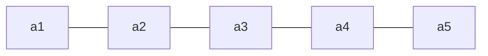
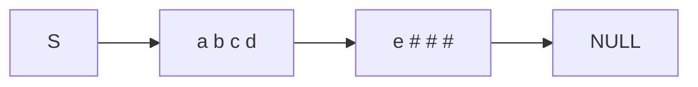
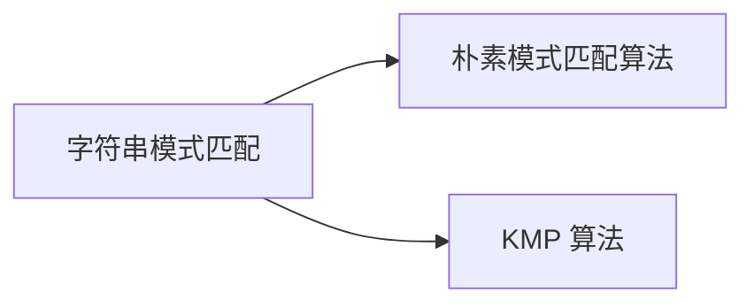

# 第四章 串

| 考点 | 重要程度 | 占分 | 常见题型 |
| --- | --- | --- | --- |
| 串的定义与基本操作 | ★★ | 2 分 | 选择 |
| 串的存储结构（顺序/链式） | ★★ | 2 分 | 选择 |
| 朴素模式匹配算法（BF） | ★★★ | 2~4 分 | 选择、计算 |
| **KMP 算法（`next` 数组、匹配过程）** | ★★★★★ | 4~8 分 | 选择、综合、代码 |
| **求 `next` 数组 / `nextval` 数组** | ★★★★★ | 4~8 分 | 选择、计算 |
| KMP 的进一步优化（`nextval`） | ★★★★ | 2~4 分 | 选择、计算 |

---

### 4.1.1 串的定义和基本操作

#### 1. 串的定义

**串**，即**字符串（String）**，是由**零个或多个字符组成的有限序列**。一般记为

$$S = \text{'a}_1a_2\cdots a_n\text{'}\qquad (n\ge 0)$$

- $S$ 是**串名**，单引号括起来的字符序列是**串的值**；
- $a_i$ 可以是字母、数字或其他字符；
- 串中字符的个数 $n$ 称为**串的长度**；
- $n=0$ 时的串称为**空串**（用 $\varnothing$ 表示）。

> 注：有的地方用双引号（如 Java、C），有的地方用单引号（如 Python）。

**例**：`S = "HelloWorld!"`、`T = 'iPhone 11 Pro Max?'`

**重要术语**：

| 术语 | 含义 |
| --- | --- |
| **子串** | 串中**任意个连续**的字符组成的子序列 |
| **主串** | **包含**子串的串 |
| **字符在主串中的位置** | 字符在串中的**序号** |
| **子串在主串中的位置** | 子串的**第一个字符**在主串中的位置 |

> **注意**：**位序从 1 开始**，而不是从 0 开始。

**例**（以 `T = 'iPhone 11 Pro Max?'` 为例）：

- `'iPhone'`、`'Pro M'` 是串 T 的**子串**；
- T 是子串 `'iPhone'` 的**主串**；
- `'1'` 在 T 中的位置是 **8**（第一次出现）；
- `'11 Pro'` 在 T 中的位置为 **8**。

**空串 V.S 空格串**：

| | 例 | 说明 |
| --- | --- | --- |
| **空串** | `M = ''` | M 是空串，长度为 0 |
| **空格串** | `N = '   '` | N 是由**三个空格字符**组成的空格串，每个空格字符占 1B |

#### 2. 串 V.S 线性表

| 对比项 | 说明 |
| --- | --- |
| **相同点** | 串是一种**特殊的线性表**，数据元素之间呈**线性关系** |
| **不同点 ①** | 串的数据对象**限定为字符集**（如中文字符、英文字符、数字字符、标点字符等） |
| **不同点 ②** | 串的基本操作（增删改查等）**通常以"子串"为操作对象** |



> 人类语言通常要**多个字符组成的序列**才有现实意义（如搜索引擎以"子串"为检索单位）。

#### 3. 串的基本操作

假设有串 `T = ""`、`S = "iPhone 11 Pro Max?"`、`W = "Pro"`：

| 操作 | 功能 |
| --- | --- |
| `StrAssign(&T, chars)` | **赋值**。把串 T 赋值为 chars |
| `StrCopy(&T, S)` | **复制**。由串 S 复制得到串 T |
| `StrEmpty(S)` | **判空**。若 S 为空串返回 TRUE，否则 FALSE |
| `StrLength(S)` | **求串长**。返回串 S 的元素个数 |
| `ClearString(&S)` | **清空**。将 S 清为空串 |
| `DestroyString(&S)` | **销毁**。将串 S 销毁（回收存储空间） |
| `Concat(&T, S1, S2)` | **串联接**。用 T 返回由 S1 和 S2 联接而成的新串 |
| `SubString(&Sub, S, pos, len)` | **求子串**。用 Sub 返回串 S 的第 pos 个字符起长度为 len 的子串 |
| `Index(S, T)` | **定位**。若主串 S 中存在与串 T 值相同的子串，则返回它在主串 S 中**第一次出现的位置**；否则返回 0 |
| `StrCompare(S, T)` | **比较**。若 S>T 返回值>0；若 S=T 返回值=0；若 S<T 返回值<0 |

**例**：

- `Concat(&T, S, W)` 后，`T = "iPhone 11 Pro Max?Pro"`（**存储空间扩展？**）
- `SubString(&T, S, 4, 6)` 后，`T = "one 11"`
- `Index(S, W)` 后，返回值为 **11**

#### 4. 串的比较操作

`StrCompare(S, T)` 的比较规则：

1. **从第一个字符开始往后依次对比**，**先出现更大字符的串就更大**；
2. **长串的前缀与短串相同时，长串更大**；
3. **只有两个串完全相同时，才相等**。

**例**：

| 比较 | 结果 |
| --- | --- |
| `"abandon"` vs `"aboard"` | `<`（第 3 个字符 `a` < `o`） |
| `"abstract"` vs `"abstraction"` | `<`（前缀相同，长串更大） |
| `"abstract"` vs `"abstract "` | `<`（前缀相同，长串更大） |
| `"academic"` vs `"abuse"` | `>`（第 2 个字符 `c` > `b`） |
| `"academic"` vs `"academic"` | `=` |

#### 5. 字符集编码

| 概念 | 含义 |
| --- | --- |
| **字符集** | 函数**定义域** |
| **编码** | 函数**映射规则** $f$ |
| **$y$** | 对应的**二进制数** |

> 任何数据存到计算机中一定是**二进制数**，需要确定"字符 ↔ 二进制数"的对应规则，这就是**编码**。
> **字符集**：英文字符 → **ASCII 字符集**；中英文 → **Unicode 字符集**。
> 基于同一个字符集，可以有**多种编码方案**，如 **UTF-8**、**UTF-16**。
> **注意**：采用不同的编码方式，每个字符所占空间不同；**考研中只需默认每个字符占 1B 即可**。

**拓展：乱码问题** —— 文件中原本采用编码规则 $y=f(x)$（如"码" → `00010101000101010010`），
打开文件时软件以为采用的是另一套规则 $y=g(x)$，于是 `00010101000101010010` 被解释成"樌"，**出现乱码**。

**本节考点**：串的定义与术语（串长、空串、空格串、子串、主串、位置）→ 串 V.S 线性表的异同 → 基本操作（重点是 `Index` 定位和 `StrCompare` 比较）→ 字符集编码。

### 4.1.2 串的存储结构

#### 1. 串的顺序存储

**① 静态数组实现**（定长顺序存储）：

```c
#define MAXLEN 255          // 预定义最大串长为 255
typedef struct{
    char ch[MAXLEN];        // 每个分量存储一个字符
    int length;             // 串的实际长度
} SString;
```

**② 动态数组实现**（堆分配存储）：

```c
typedef struct{
    char *ch;               // 按串长分配存储区，ch 指向串的基地址
    int length;             // 串的长度
} HString;

HString S;
S.ch = (char *) malloc(MAXLEN * sizeof(char));
S.length = 0;
```

> 分配**连续的存储空间**，每个 `char` 字符占 **1B**；用完之后需要**手动 `free`**。

**四种记录串长的方式**（以 `char ch[10]` 存 `"wangdao"` 为例）：

| 方案 | 做法 | 特点 |
| --- | --- | --- |
| **方案一** | 字符依次存，另用**变量 `Length`** 记录长度 | 直观 |
| **方案二** | **`ch[0]` 充当 `Length`** | **优点：字符的位序和数组下标相同** |
| **方案三** | **没有 `Length` 变量**，以字符 `'\0'` 表示结尾 | 对应 ASCII 码的 0 |
| **方案四（教材）** | **`ch[0]` 废弃不用**，另用变量 `Length` 记录长度 | 王道教材采用此方案 |

#### 2. 串的链式存储

**每个结点存 1 个字符**：

```c
typedef struct StringNode{
    char ch;                        // 每个结点存 1 个字符
    struct StringNode *next;
} StringNode, * String;
```

> **缺点**：**存储密度低** —— 每个字符 1B，每个指针却要 4B。

**每个结点存多个字符**（提高存储密度）：

```c
typedef struct StringNode{
    char ch[4];                     // 每个结点存多个字符
    struct StringNode *next;
} StringNode, * String;
```

> 没有字符的位置用 `'#'` 或 `'\0'` **补足**。



#### 3. 基于顺序存储实现基本操作

以教材方案四的 `SString` 为例。

**① 求子串 `SubString(&Sub, S, pos, len)`**：

```c
bool SubString(SString &Sub, SString S, int pos, int len){
    // 子串范围越界
    if (pos + len - 1 > S.length)
        return false;
    for (int i = pos; i < pos + len; i++)
        Sub.ch[i - pos + 1] = S.ch[i];
    Sub.length = len;
    return true;
}
```

**② 串的比较 `StrCompare(S, T)`**：

```c
int StrCompare(SString S, SString T) {
    for (int i = 1; i <= S.length && i <= T.length; i++){
        if (S.ch[i] != T.ch[i])
            return S.ch[i] - T.ch[i];
    }
    // 扫描过的所有字符都相同，则长度长的串更大
    return S.length - T.length;
}
```

**③ 定位 `Index(S, T)`**（求串 T 在主串 S 中的位置）：

```c
int Index(SString S, SString T){
    int i = 1, n = StrLength(S), m = StrLength(T);
    SString sub;                    // 用于暂存子串
    while (i <= n - m + 1){
        SubString(sub, S, i, m);
        if (StrCompare(sub, T) != 0) ++i;
        else return i;              // 返回子串在主串中的位置
    }
    return 0;                       // S 中不存在与 T 相等的子串
}
```

> **注意**：循环条件是 `i <= n - m + 1`（最后可能匹配的起始位置），不是 `i <= n`。

**本节考点**：顺序存储（静态/动态 + 四种串长记录方案，**教材用方案四**）→ 链式存储（每结点存多字符以提高存储密度）→ 三个基本操作的代码实现（`SubString`、`StrCompare`、`Index`）。

### 4.2.1 朴素模式匹配算法

#### 1. 什么是字符串的模式匹配

| 术语 | 含义 |
| --- | --- |
| **主串** | 被搜索的串（如 `'嘿嘿嘿红红火火恍恍惚惚…笑出猪叫哈哈…'`） |
| **模式串** | 要查找的串（如 `'笑出猪叫'`） |

**字符串模式匹配**：在**主串中找到与模式串相同的子串**，并返回其**所在位置**。

> **子串 vs 模式串**：**子串**是主串的一部分，**一定存在**；**模式串不一定能在主串中找到**。

**两种模式匹配算法**：



#### 2. 朴素模式匹配算法（BF / 暴力匹配）

**例**：主串 `S = abaabaabcabaabc`（长度 15），模式串 `T = abaaabc`（长度 6）。

**算法思想**：

- 设**主串长度为 $n$，模式串长度为 $m$**；
- 将主串中**所有长度为 $m$ 的子串**与模式串对比；
- 找到**第一个**与模式串匹配的子串，并返回子串**起始位置**；
- 若所有子串都不匹配，则返回 **0**。

**代码实现**：

```c
int Index(SString S, SString T){
    int i = 1, j = 1;
    while(i <= S.length && j <= T.length){
        if(S.ch[i] == T.ch[j]){
            ++i; ++j;           // 继续比较后继字符
        }
        else{
            i = i - j + 2;
            j = 1;              // 指针后退重新开始匹配
        }
    }
    if(j > T.length)
        return i - T.length;    // 匹配成功，返回子串第一个字符的位置
    else
        return 0;               // 匹配失败
}
```

> **要点**：
> - `i = i - j + 2` —— **主串指针回退**到本轮起始位置的下一位；
> - `j = 1` —— 模式串指针**从头开始**；
> - `j > T.length` 说明模式串全部匹配成功，此时返回 **`i - T.length`**。

#### 3. 最坏时间复杂度

设主串长度为 $n$，模式串长度为 $m$。

**最坏情况**：每个子串都要对比 $m$ 个字符，共 $n-m+1$ 个子串，因此

$$O\big((n-m+1)\times m\big)=O(nm)$$

> 注：很多时候 $n\gg m$。
> **最坏情况的典型例子**：主串 `aaaaaaab`、模式串 `aaaaab` —— 每一轮都在**最后一位**才失配，白白比较了很多次。

**本节考点**：模式匹配的概念（主串、模式串、子串）→ 朴素算法的思想与代码（`i=i-j+2`、返回 `i-T.length`）→ **最坏时间复杂度 $O(nm)$**（这也是 KMP 要解决的问题）。

### 4.2.2 KMP 算法

#### 1. KMP 算法的由来

由 **D.E.Knuth、J.H.Morris 和 V.R.Pratt** 提出，因此称为 **KMP 算法**。

#### 2. 核心思想：主串指针不回溯

**朴素算法的痛点**：每次失配后主串指针 `i` 都要回退（`i = i-j+2`），做了大量**无用功**。

**KMP 精髓**：**利用好已经匹配过的模式串的信息** —— 失配时**主串指针 `i` 不回溯**，只把**模式串指针 `j` 回退**到 `next[j]`。

**以 $T=\text{'abaabc'}$ 为例**（失配时的处理方式）：

| 失配位置 | 处理方式 |
| --- | --- |
| 第 6 个元素匹配失败 | `i` 不变，`j = 3` |
| 第 5 个元素匹配失败 | `i` 不变，`j = 2` |
| 第 4 个元素匹配失败 | `i` 不变，`j = 2` |
| 第 3 个元素匹配失败 | `i` 不变，`j = 1` |
| 第 2 个元素匹配失败 | `i` 不变，`j = 1` |
| 第 1 个元素匹配失败 | 匹配下一个相邻子串，令 **`j = 0`，`i++`，`j++`** |

> 把上面这些 `j` 的取值整理成数组，就是 **`next` 数组**。

#### 3. KMP 匹配的代码

```c
int Index_KMP(SString S, SString T, int next[]){
    int i = 1, j = 1;
    while(i <= S.length && j <= T.length){
        if(j == 0 || S.ch[i] == T.ch[j]){
            ++i;
            ++j;                // 继续比较后继字符
        }
        else
            j = next[j];        // 模式串向右移动
    }
    if(j > T.length)
        return i - T.length;    // 匹配成功
    else
        return 0;
}
```

> **与朴素算法的对比**：
> - 主串指针 `i` **从不回退**；
> - `j = next[j]` 取代了朴素算法的 `i = i-j+2; j = 1;`；
> - `j == 0` 表示**模式串第 1 个字符就失配**，此时主串、模式串**同时后移**。

#### 4. 时间复杂度

| 环节 | 复杂度 |
| --- | --- |
| 求 `next` 数组 | $O(m)$ |
| 模式匹配过程（最坏） | $O(n)$ |
| **KMP 算法总的（最坏）** | $\boldsymbol{O(m+n)}$ |

> 对比朴素算法的 $O(nm)$，KMP 在长文本（$n\gg m$）时优势明显。

#### 5. 求 next 数组（手算）

**`next` 数组的作用**：当模式串的**第 $j$ 个字符失配**时，从模式串的**第 `next[j]` 个**继续往后匹配。

**手算口诀**（背下来）：

1. **`next[1]` 都无脑写 0**；
2. **`next[2]` 都无脑写 1**；
3. **其他 `next`**：在**不匹配的位置前边，划一根"分界线"**，模式串**一步一步往后退**，直到**分界线之前"能对上"**，或**模式串完全跨过分界线**为止。**此时 `j` 指向哪儿，`next` 数组的值就是多少**。

**例 1**：$T=\text{'abaabc'}$

| 序号 $j$ | 1 | 2 | 3 | 4 | 5 | 6 |
| --- | --- | --- | --- | --- | --- | --- |
| 模式串 | a | b | a | a | b | c |
| **`next[j]`** | **0** | **1** | **1** | **2** | **2** | **3** |

**例 2**：$T=\text{'google'}$ → `next` = **0, 1, 1, 1, 2, 1**

**例 3**：$T=\text{'aaaab'}$ → `next` = **0, 1, 2, 3, 4**

**例 4**：$T=\text{'ababaa'}$ → `next` = **0, 1, 1, 2, 3, 4**

> **注意**：`next[0]` **不使用** —— `next` 数组的**下标从 1 开始**。

### 4.2.3 KMP 算法的进一步优化

#### 1. 为什么要优化？

`next` 数组的**缺陷**：当 `T[j]` 失配时让 `j` 退到 `next[j]`；但如果 **$T[j] = T[\text{next}[j]]$**，那么退过去之后**一定还会立即失配**（因为主串该位置的字符已经确定 $\ne T[j]$），白白多比较一次。

**优化思路**：如果 $T[j] = T[\text{next}[j]]$，就**继续往前退**，直接取 `nextval[next[j]]` 的值。

> 直观理解：**"退一步还是同样的字符"，那就干脆多退几步。**

#### 2. nextval 数组的求法

```c
nextval[1] = 0;
for (int j = 2; j <= T.length; j++) {
    if (T.ch[next[j]] == T.ch[j])
        nextval[j] = nextval[next[j]];
    else
        nextval[j] = next[j];
}
```

**手算步骤**：**先求 `next` 数组，再由 `next` 数组求 `nextval` 数组**。

#### 3. 经典例题

**例 1**：$T=\text{'abaabc'}$

| 序号 $j$ | 1 | 2 | 3 | 4 | 5 | 6 |
| --- | --- | --- | --- | --- | --- | --- |
| 模式串 | a | b | a | a | b | c |
| `next[j]` | 0 | 1 | 1 | 2 | 2 | 3 |
| **`nextval[j]`** | **0** | **1** | **0** | **2** | **1** | **3** |

**例 2**：$T=\text{'aaaab'}$

| 序号 $j$ | 1 | 2 | 3 | 4 | 5 |
| --- | --- | --- | --- | --- | --- |
| 模式串 | a | a | a | a | b |
| `next[j]` | 0 | 1 | 2 | 3 | 4 |
| **`nextval[j]`** | **0** | **0** | **0** | **0** | **4** |

**例 3**：$T=\text{'ababaa'}$

| 序号 $j$ | 1 | 2 | 3 | 4 | 5 | 6 |
| --- | --- | --- | --- | --- | --- | --- |
| 模式串 | a | b | a | b | a | a |
| `next[j]` | 0 | 1 | 1 | 2 | 3 | 4 |
| **`nextval[j]`** | **0** | **1** | **0** | **1** | **0** | **4** |

> **观察**：模式串中有**连续重复字符**（如 `aaaab`）时，`nextval` 的优化效果最明显（`0,0,0,0,4` 对比 `0,1,2,3,4`）。

**本节考点**：`nextval` 的**优化思路**（$T[j]=T[\text{next}[j]]$ 时继续前退）→ **先求 `next` 再求 `nextval`** → 三个经典例题。

### 小结

1. **串**：零个或多个字符组成的有限序列；术语有串长、空串、空格串、子串、主串、位置（**位序从 1 开始**）。
2. **串 V.S 线性表**：串是特殊的线性表，数据对象**限定为字符集**，基本操作**以"子串"为对象**。
3. **基本操作**：`StrAssign` / `StrCopy` / `StrEmpty` / `StrLength` / `ClearString` / `DestroyString` / `Concat` / `SubString` / **`Index`** / **`StrCompare`**。
4. **串的比较**：从第一个字符依次对比，先出现更大字符的更大；前缀相同时**长串更大**；完全相同才相等。
5. **字符集编码**：字符集是定义域、编码是映射规则；**考研中默认每个字符占 1B**；编码不一致会导致**乱码**。
6. **串的存储**：**顺序存储**（静态数组 `SString` / 动态数组 `HString`，四种串长记录方案，**教材用方案四** —— `ch[0]` 废弃不用 + `length`）；**链式存储**（每结点存多个字符以提高存储密度）。
7. **朴素模式匹配算法（BF）**：主串中所有长度为 $m$ 的子串逐个与模式串对比；失配时 `i = i-j+2; j = 1`（**主串指针回退**）；返回 `i - T.length`；最坏 **$O(nm)$**。
8. **KMP 算法**：**主串指针 `i` 不回溯**，失配时 `j = next[j]`；`j == 0` 时 `i++`、`j++`；时间复杂度 **$O(m+n)$**（求 `next` 为 $O(m)$，匹配为 $O(n)$）。
9. **求 `next` 数组口诀**：`next[1]` 无脑写 **0**，`next[2]` 无脑写 **1**，其余用**分界线法**（模式串往后退到分界线前"能对上"为止，**j 指向哪儿 next 值就是多少**）；**`next[0]` 不用**。
10. **KMP 优化（`nextval`）**：若 $T[j]=T[\text{next}[j]]$ 则继续前退；**先求 `next` 再求 `nextval`**；连续重复字符多的模式串优化效果最明显。

---

