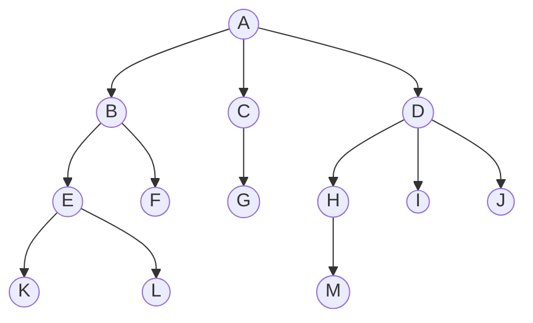
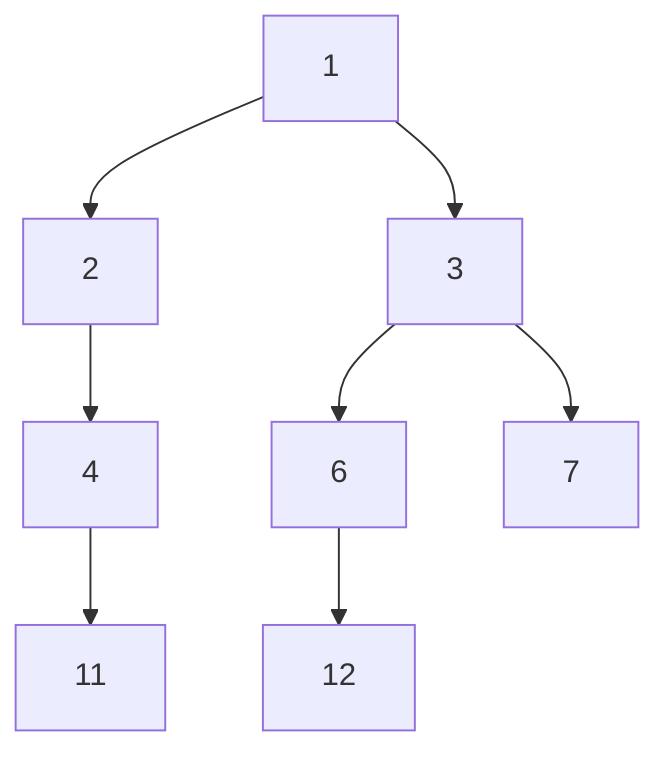
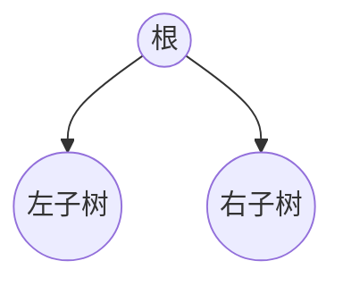
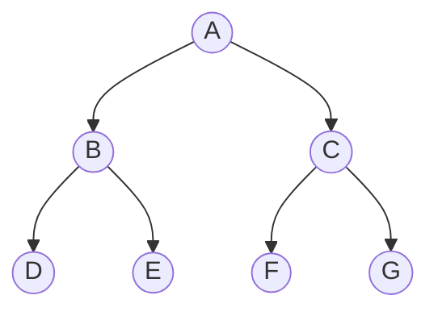
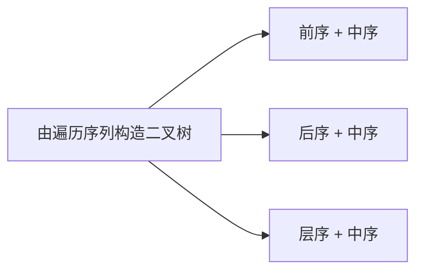

# 第五章 树与二叉树

| 考点 | 重要程度 | 占分 | 常见题型 |
| --- | --- | --- | --- |
| 树的定义与基本术语 | ★★ | 2 分 | 选择 |
| 树的性质（结点数、度、高度） | ★★★ | 2~4 分 | 选择、计算 |
| 二叉树的定义与性质 | ★★★ | 2~4 分 | 选择、计算 |
| 二叉树的存储结构 | ★★★ | 2~4 分 | 选择、代码 |
| **二叉树的遍历（先/中/后/层序）** | ★★★★★ | 4~8 分 | 选择、综合、代码 |
| **由遍历序列构造二叉树** | ★★★★ | 2~4 分 | 选择、综合 |
| 线索二叉树（概念 / 线索化 / 找前驱后继） | ★★★★ | 4~6 分 | 选择、综合、代码 |
| 树的存储结构（双亲 / 孩子 / 孩子兄弟） | ★★★ | 2~4 分 | 选择 |
| 树、森林与二叉树的转换 | ★★★ | 2~4 分 | 选择 |
| 树和森林的遍历 | ★★★ | 2~4 分 | 选择 |
| **哈夫曼树与哈夫曼编码** | ★★★★ | 4~6 分 | 选择、计算 |
| 并查集（含优化） | ★★★ | 2~4 分 | 选择、代码 |

---

### 5.1.1 树的基本概念

#### 1. 树的定义

**树**是 $n$（$n\ge 0$）个**结点**的**有限集合**：

- $n=0$ 时，称为**空树**（一种特殊情况）；
- 在任意一棵**非空树**中应满足：

  1. **有且仅有一个**特定的称为**根**的结点；
  2. 当 $n>1$ 时，其余结点可分为 $m$（$m>0$）个**互不相交**的有限集合 $T_1,T_2,\dots,T_m$，其中每个集合**本身又是一棵树**，并且称为根结点的**子树**。

> **树是一种递归定义的数据结构。**

**非空树的特性**：

| 特性 | 说明 |
| --- | --- |
| 根结点 | **有且仅有一个**根结点 |
| **叶子结点**（终端结点） | **没有后继**的结点 |
| **分支结点**（非终端结点） | **有后继**的结点 |
| 前驱唯一 | 除了根结点外，任何一个结点都有**且仅有**一个前驱 |
| 后继个数 | 每个结点可以有 **0 个或多个**后继 |



**树形逻辑结构的应用**：**行政区域划分**（中国 → 省 → 市）、**文件系统**（盘 → 文件夹 → 文件）。

#### 2. 基本术语

**① 结点之间的关系描述**（用家族关系类比很好记）：

| 术语 | 含义 |
| --- | --- |
| **祖先结点** | 从根到该结点所经分支上的所有结点 |
| **子孙结点** | 以某结点为根的子树中的任一结点 |
| **双亲结点（父结点）** | 直接前驱 |
| **孩子结点** | 直接后继 |
| **兄弟结点** | 有同一个双亲的结点 |
| **堂兄弟结点** | 双亲在**同一层**的结点 |
| **路径** | 两个结点之间的路径，**只能从上往下** |
| **路径长度** | 路径上**经过多少条边** |

**② 结点、树的属性描述**：

| 属性 | 定义 |
| --- | --- |
| **结点的层次（深度）** | **从上往下**数，**默认从 1 开始** |
| **结点的高度** | **从下往上**数 |
| **树的高度（深度）** | **总共多少层** |
| **结点的度** | 该结点**有几个孩子（分支）** |
| **树的度** | **各结点的度的最大值** |

> **非叶子结点的度 > 0**；**叶子结点的度 = 0**。

**③ 有序树 V.S 无序树**：

| 类型 | 含义 |
| --- | --- |
| **有序树** | 逻辑上看，树中结点的各子树**从左至右是有次序的**，**不能互换** |
| **无序树** | 逻辑上看，树中结点的各子树**从左至右是无次序的**，**可以互换** |

> 具体看你用树存什么，是否需要**用结点的左右位置反映某些逻辑关系**。

**④ 森林**：$m$（$m\ge0$）棵**互不相交**的树的集合（$m$ 可为 0，即**空森林**）。

> **考点**：森林与树的**相互转化**问题。

**本节考点**：树的定义（**递归定义**）与非空树的 5 条特性 → 结点间关系（父/子/兄弟/堂兄弟/路径/路径长度）→ 结点与树的属性（**层次从上往下、高度从下往上**；**结点的度 vs 树的度**）→ 有序树 vs 无序树 → 森林。

### 5.1.3 树的常考性质

#### 考点 1：结点数 = 总度数 + 1

$$\boxed{\text{结点数} = \text{总度数} + 1}$$

> 理解：每个结点（除根外）都恰好是某条边（分支）的"孩子"，所以**结点数 = 边数 + 1**，而**边数 = 总度数**。

#### 考点 2：度为 m 的树 V.S m 叉树

| | **度为 m 的树** | **m 叉树** |
| --- | --- | --- |
| 任意结点的度 | $\le m$（最多 $m$ 个孩子） | $\le m$（最多 $m$ 个孩子） |
| 是否有结点度 = m | **至少有一个结点度 $=m$** | 允许**所有**结点的度都 $<m$ |
| 是否可空 | **一定是非空树**，**至少有 $m+1$ 个结点** | **可以是空树** |

> **易错点**：这两个概念容易混 —— 度为 $m$ 的树**必须**存在度为 $m$ 的结点，所以**至少 $m+1$ 个结点**（1 个根 + $m$ 个孩子）；而 $m$ 叉树**可以是空树**。

#### 考点 3：第 i 层最多有多少个结点

$$\boxed{\text{度为 }m\text{ 的树 / }m\text{ 叉树第 }i\text{ 层至多有 } m^{\,i-1}\text{ 个结点}\quad (i\ge1)}$$

| 层数 | 最多结点数 |
| --- | --- |
| 第 1 层 | $m^0$ |
| 第 2 层 | $m^1$ |
| 第 3 层 | $m^2$ |
| 第 4 层 | $m^3$ |

#### 考点 4：高度为 h 的 m 叉树至多有多少个结点

$$\boxed{\text{至多 }\frac{m^h-1}{m-1}\text{ 个结点}}$$

> **推导**：由等比数列求和公式 $a+aq+aq^2+\dots+aq^{n-1}=\dfrac{a(1-q^n)}{1-q}$，
> 各层最多结点数相加：$m^0+m^1+\dots+m^{h-1}=\dfrac{m^h-1}{m-1}$。

#### 考点 5：最少有多少个结点

$$\boxed{\text{高度为 }h\text{ 的 }m\text{ 叉树至少有 }h\text{ 个结点}}$$

$$\boxed{\text{高度为 }h\text{、度为 }m\text{ 的树至少有 }h+m-1\text{ 个结点}}$$

> **理解**：$m$ 叉树最少时就是**一条链**（每层 1 个），共 $h$ 个；
> 度为 $m$ 的树还必须**至少有一个度为 $m$ 的结点**，所以要在链的基础上再挂 $m-1$ 个孩子，共 $h+m-1$ 个。

#### 考点 6：具有 n 个结点的 m 叉树的最小高度

$$\boxed{h_{\min}=\left\lceil\log_m\big(n(m-1)+1\big)\right\rceil}$$

**推导**（**高度最小 ⇒ 所有结点都有 $m$ 个孩子**）：

$$\underbrace{\frac{m^{h-1}-1}{m-1}}_{\text{前 }h-1\text{ 层最多}}<n\le\underbrace{\frac{m^h-1}{m-1}}_{\text{前 }h\text{ 层最多}}$$

$$m^{h-1}<n(m-1)+1\le m^h$$

$$h-1<\log_m\big(n(m-1)+1\big)\le h$$

$$\Rightarrow\ h_{\min}=\left\lceil\log_m\big(n(m-1)+1\big)\right\rceil$$

**本节考点**：6 个常考性质 —— ① **结点数 = 总度数 + 1**；② 度为 $m$ 的树 vs $m$ 叉树；③ 第 $i$ 层至多 $m^{i-1}$ 个；④ 高度 $h$ 至多 $\frac{m^h-1}{m-1}$ 个；⑤ 最少结点数（$h$ / $h+m-1$）；⑥ 最小高度 $\lceil\log_m(n(m-1)+1)\rceil$。

### 5.2.1 二叉树的定义和基本术语

#### 1. 二叉树的定义

**二叉树**是 $n$（$n\ge0$）个结点的**有限集合**：

1. 或者为**空二叉树**，即 $n=0$；
2. 或者由一个**根结点**和两个**互不相交**的、被称为根的**左子树**和**右子树**组成；左子树和右子树**又分别是一棵二叉树**。

**特点**：

1. 每个结点**至多只有两棵子树**（不存在度 $>2$ 的结点）；
2. 左右子树**不能颠倒** —— **二叉树是有序树**。

> **注意区别**：**二叉树 $\ne$ 度为 2 的有序树**。
> 度为 2 的有序树要求每个结点**恰好**有 2 个孩子；而二叉树允许结点的度为 **0、1、2**。

**二叉树的五种状态**：空二叉树、只有根结点、只有左子树、只有右子树、左右子树都有。

#### 2. 几个特殊的二叉树

**① 满二叉树**

一棵高度为 $h$，且含有 $2^h-1$ 个结点的二叉树。

| 特点 | 说明 |
| --- | --- |
| 叶子结点 | **只有最后一层**有叶子结点 |
| 度为 1 的结点 | **不存在** |
| 层序编号 | 按层序从 1 开始编号：结点 $i$ 的**左孩子为 $2i$**、**右孩子为 $2i+1$**；结点 $i$ 的**父结点为 $\lfloor i/2\rfloor$**（如果有的话） |

**② 完全二叉树**

当且仅当其每个结点都与**高度为 $h$ 的满二叉树**中编号为 $1\sim n$ 的结点**一一对应**时，称为完全二叉树。

| 特点 | 说明 |
| --- | --- |
| 叶子结点 | 只有**最后两层**可能有叶子结点 |
| 度为 1 的结点 | **最多只有一个** |
| 层序编号 | 同满二叉树③的编号规律 |
| 分支 / 叶子 | $i\le\lfloor n/2\rfloor$ 为**分支结点**，$i>\lfloor n/2\rfloor$ 为**叶子结点** |

> **易错点**：完全二叉树中若某结点**只有一个孩子**，那么**一定是左孩子**。

**③ 二叉排序树（BST）**

一棵二叉树或者是空二叉树，或者是具有如下性质的二叉树：

- **左子树上所有结点的关键字均小于根结点的关键字**；
- **右子树上所有结点的关键字均大于根结点的关键字**；
- 左子树和右子树**又各是一棵二叉排序树**。

> **用途**：元素的**排序、搜索**。

**④ 平衡二叉树（AVL）**

树上**任一结点的左子树和右子树的深度之差不超过 1**。

> **用途**：能有**更高的搜索效率**（"胖胖的、丰满的树"）。

**本节考点**：二叉树的定义（**递归定义**、至多两棵子树、**有序**）与"二叉树 vs 度为 2 的有序树"的区别 → 五种状态 → 四类特殊二叉树（满二叉树 / 完全二叉树 / 二叉排序树 / 平衡二叉树）的定义与特点。

### 5.2.2 二叉树的性质

#### 1. 二叉树的常考性质

**考点 1：$n_0 = n_2 + 1$**

设非空二叉树中度为 0、1 和 2 的结点个数分别为 $n_0$、$n_1$ 和 $n_2$，则

$$\boxed{n_0=n_2+1}$$

（**叶子结点比二分支结点多一个**）

**推导**：设结点总数为 $n$：

1. 按结点类型数：$n=n_0+n_1+n_2$
2. 按"**结点数 = 总度数 + 1**"：$n=n_1+2n_2+1$

② − ① 得 $n_0=n_2+1$。

**考点 2：第 $i$ 层至多有多少个结点**

$$\boxed{\text{二叉树第 }i\text{ 层至多有 } 2^{\,i-1}\text{ 个结点}\quad(i\ge1)}$$

**考点 3：高度为 $h$ 的二叉树至多有多少个结点**

$$\boxed{\text{至多 }2^h-1\text{ 个结点}\quad(\text{即满二叉树})}$$

#### 2. 完全二叉树的常考性质

**考点 1：具有 $n$（$n>0$）个结点的完全二叉树的高度 $h$**

$$\boxed{h=\left\lceil\log_2(n+1)\right\rceil\quad\text{或}\quad h=\left\lfloor\log_2 n\right\rfloor+1}$$

**推导一**（用满二叉树的结点数夹逼）：

$$\underbrace{2^{h-1}-1}_{\text{高 }h-1\text{ 的满二叉树}}<n\le\underbrace{2^h-1}_{\text{高 }h\text{ 的满二叉树}}\ \Rightarrow\ 2^{h-1}<n+1\le2^h\ \Rightarrow\ h-1<\log_2(n+1)\le h$$

$$\Rightarrow\ h=\left\lceil\log_2(n+1)\right\rceil$$

**推导二**（用完全二叉树本身的结点数范围）：

$$2^{h-1}\le n<2^h\ \Rightarrow\ h-1\le\log_2 n<h\ \Rightarrow\ h=\left\lfloor\log_2 n\right\rfloor+1$$

> **附带结论**：第 $i$ 个结点所在的层次为 $\left\lceil\log_2(n+1)\right\rceil$ 或 $\left\lfloor\log_2 n\right\rfloor+1$。

**考点 2：由结点数 $n$ 推出 $n_0$、$n_1$、$n_2$**

**突破口**：**完全二叉树最多只会有一个度为 1 的结点**，即 $n_1=0$ 或 $1$。

由 $n_0=n_2+1$ 可知 $n_0+n_2$ 一定是**奇数**，于是：

| 完全二叉树结点数 $n$ | $n_1$ | $n_0$ | $n_2$ |
| --- | --- | --- | --- |
| $2k$（**偶数**） | **1** | **k** | **k − 1** |
| $2k-1$（**奇数**） | **0** | **k** | **k − 1** |

**本节考点**：二叉树三条（$n_0=n_2+1$、第 $i$ 层至多 $2^{i-1}$、高 $h$ 至多 $2^h-1$）+ 完全二叉树两条（**高度公式**、**由 $n$ 反推 $n_0/n_1/n_2$**）。

### 5.2.3 二叉树的存储结构

#### 1. 顺序存储

```c
#define MaxSize 100
struct TreeNode {
    ElemType value;         // 结点中的数据元素
    bool isEmpty;           // 结点是否为空
};
TreeNode t[MaxSize];
```

定义一个长度为 `MaxSize` 的数组 `t`，按照**从上至下、从左至右**的顺序依次存储**完全二叉树**中的各个结点。

```c
// 初始化时所有结点标记为空
for (int i = 0; i < MaxSize; i++) {
    t[i].isEmpty = true;
}
```

> `t[0]` 可以让**第一个位置空缺**，保证**数组下标和结点编号一致**。

**几个重要常考的基本操作**（完全二叉树）：

| 操作 | 公式 |
| --- | --- |
| $i$ 的**左孩子** | $2i$ |
| $i$ 的**右孩子** | $2i+1$ |
| $i$ 的**父结点** | $\lfloor i/2\rfloor$ |
| $i$ 所在的**层次** | $\lceil\log_2(n+1)\rceil$ 或 $\lfloor\log_2 n\rfloor+1$ |

**若完全二叉树中共有 $n$ 个结点**：

| 判断 | 条件 |
| --- | --- |
| $i$ 是否有**左孩子** | $2i\le n$ ? |
| $i$ 是否有**右孩子** | $2i+1\le n$ ? |
| $i$ 是**叶子还是分支**结点 | $i>\lfloor n/2\rfloor$ ?（$i>\lfloor n/2\rfloor$ 为叶子） |

> **思考**：如果结点从 0 开始编号，该怎么算？（各公式都要相应调整）

**顺序存储的缺陷与结论**：

- 二叉树顺序存储中，**一定要把二叉树的结点编号与完全二叉树对应起来**（否则 $2i$、$2i+1$、$\lfloor i/2\rfloor$ 的规律失效）；
- **最坏情况**：高度为 $h$ 且只有 $h$ 个结点的**单支树**（所有结点只有右孩子），也至少需要 $2^h-1$ 个存储单元；
- **结论**：二叉树的**顺序存储结构只适合存储完全二叉树**。

#### 2. 链式存储

```c
// 二叉树的结点（链式存储）
typedef struct BiTNode{
    ElemType data;                      // 数据域
    struct BiTNode *lchild, *rchild;    // 左、右孩子指针
} BiTNode, *BiTree;
```

```c
// 定义一棵空树
BiTree root = NULL;

// 插入根结点
root = (BiTree) malloc(sizeof(BiTNode));
root->data = {1};
root->lchild = NULL;
root->rchild = NULL;

// 插入新结点
BiTNode *p = (BiTNode *) malloc(sizeof(BiTNode));
p->data = {2};
p->lchild = NULL;
p->rchild = NULL;
root->lchild = p;                       // 作为根结点的左孩子
```

> ⭐ **重要结论**：$n$ 个结点的**二叉链表共有 $n+1$ 个空链域**（可用于构造**线索二叉树**）。



**链式存储的优缺点**：

| 操作 | 说明 |
| --- | --- |
| 找指定结点 $p$ 的**左/右孩子** | **超简单**（直接 `p->lchild` / `p->rchild`） |
| 找指定结点 $p$ 的**父结点** | **只能从根开始遍历寻找** |

> **Tips**：根据实际需求决定要不要加**父结点指针** —— 加上就变成**三叉链表**，方便找父结点。

```c
// 三叉链表
typedef struct BiTNode{
    ElemType data;
    struct BiTNode *lchild, *rchild;    // 左、右孩子指针
    struct BiTNode *parent;             // 父结点指针
} BiTNode, *BiTree;
```

**本节考点**：顺序存储（**结点编号要与完全二叉树对应**、$2i$/$2i+1$/$\lfloor i/2\rfloor$、判孩子与判叶子的条件、**只适合存完全二叉树**）→ 链式存储（`BiTNode` 定义、**$n$ 个结点有 $n+1$ 个空链域**、找父结点需遍历、三叉链表）。

### 5.3.1 二叉树的先中后序遍历

#### 1. 什么是遍历

**遍历**：按照某种次序把**所有结点都访问一遍**。

| 遍历方式 | 依据的规则 |
| --- | --- |
| **层次遍历** | 基于树的**层次**特性确定的次序规则 |
| **先/中/后序遍历** | 基于树的**递归**特性确定的次序规则 |

**二叉树的递归特性**：① 要么是**空二叉树**；② 要么由"**根结点 + 左子树 + 右子树**"组成。

#### 2. 三种遍历的定义

| 遍历 | 次序 | 英文 |
| --- | --- | --- |
| **先序遍历** | **根 左 右** | **NLR** |
| **中序遍历** | **左 根 右** | **LNR** |
| **后序遍历** | **左 右 根** | **LRN** |



**例**：以 $A(B(D,E),C(F,G))$ 为例

| 遍历 | 序列 |
| --- | --- |
| 先序 | A B D E C F G |
| 中序 | D B E A F C G |
| 后序 | D E B F G C A |

#### 3. 三种遍历的代码

**先序遍历**：

```c
void PreOrder(BiTree T){
    if(T != NULL){
        visit(T);               // 访问根结点
        PreOrder(T->lchild);    // 递归遍历左子树
        PreOrder(T->rchild);    // 递归遍历右子树
    }
}
```

**中序遍历**：

```c
void InOrder(BiTree T){
    if(T != NULL){
        InOrder(T->lchild);     // 递归遍历左子树
        visit(T);               // 访问根结点
        InOrder(T->rchild);     // 递归遍历右子树
    }
}
```

**后序遍历**：

```c
void PostOrder(BiTree T){
    if(T != NULL){
        PostOrder(T->lchild);   // 递归遍历左子树
        PostOrder(T->rchild);   // 递归遍历右子树
        visit(T);               // 访问根结点
    }
}
```

> **空间复杂度**：三种遍历都需要**递归工作栈**，空间复杂度为 **$O(h)$**（$h$ 为树的高度）。

#### 4. 求遍历序列的技巧（重点）

**技巧一：分支结点逐层展开法** —— 把分支结点逐层展开成"根左右"等形式再读。

**技巧二："全世界路"法**（更直观）：

> **脑补空结点**，从根结点出发，画一条路：
> - 如果**左边还有没走的路**，优先往**左边**走；
> - 走到路的**尽头（空结点）**就**往回走**；
> - 如果**左边没路了**，就往**右边**走；
> - 如果**左、右都没路了**，则往**上面**走。

**关键结论**：**每个结点都会被"路过" 3 次**！

| 遍历 | 访问时机 |
| --- | --- |
| **先序遍历** | **第一次**路过时访问结点 |
| **中序遍历** | **第二次**路过时访问结点 |
| **后序遍历** | **第三次**路过时访问结点 |

#### 5. 应用举例

**算数表达式的"分析树"**（如 $a+b*(c-d)-e/f$）：

| 遍历 | 对应表达式 |
| --- | --- |
| **先序遍历** | **前缀**表达式（`-+a*b-cd/ef`） |
| **中序遍历** | **中缀**表达式（`a+b*c-d-e/f`，**需要加界限符**） |
| **后序遍历** | **后缀**表达式（`abcd-*+ef/-`） |

**求树的深度**：

```c
int treeDepth(BiTree T){
    if (T == NULL) {
        return 0;
    } else {
        int l = treeDepth(T->lchild);
        int r = treeDepth(T->rchild);
        // 树的深度 = Max(左子树深度, 右子树深度) + 1
        return l > r ? l + 1 : r + 1;
    }
}
```

**本节考点**：三种遍历的次序（**NLR / LNR / LRN**）与代码（**只是 `visit(T)` 的位置不同**）→ 求遍历序列的两种技巧（逐层展开 / **路过三次**：先序第一次、中序第二次、后序第三次）→ 遍历算数表达式树 → 求树的深度 → 空间复杂度 $O(h)$。

### 5.3.2 二叉树的层次遍历

#### 1. 算法思想

1. 初始化一个**辅助队列**；
2. **根结点入队**；
3. 若**队列非空**，则**队头结点出队**，访问该结点，并将其**左、右孩子插入队尾**（如果有的话）；
4. **重复 ③ 直至队列为空**。



> 上图的层序序列：**A B C D E F G**

#### 2. 代码实现

```c
// 层序遍历
void LevelOrder(BiTree T){
    LinkQueue Q;
    InitQueue(Q);                       // 初始化辅助队列
    BiTree p;
    EnQueue(Q, T);                      // 将根结点入队
    while(!IsEmpty(Q)){                 // 队列不空则循环
        DeQueue(Q, p);                  // 队头结点出队
        visit(p);                       // 访问出队结点
        if(p->lchild != NULL)
            EnQueue(Q, p->lchild);      // 左孩子入队
        if(p->rchild != NULL)
            EnQueue(Q, p->rchild);      // 右孩子入队
    }
}
```

**用到的辅助结构**：

```c
// 二叉树的结点（链式存储）
typedef struct BiTNode{
    char data;
    struct BiTNode *lchild, *rchild;
} BiTNode, *BiTree;

// 链式队列结点
typedef struct LinkNode{
    BiTNode *data;                      // 存指针而不是结点！
    struct LinkNode *next;
} LinkNode;

typedef struct{
    LinkNode *front, *rear;             // 队头队尾
} LinkQueue;
```

> **要点**：链式队列的结点中存的是 **`BiTNode *`（指针）**，而不是整个结点 —— **存指针而不是结点**。

**本节考点**：层序遍历的算法思想（**队列**：根入队 → 出队访问 → 左右孩子入队）→ 代码实现 → 队列元素类型是**结点指针**。

### 5.3.3 由遍历序列构造二叉树

#### 1. 重要结论

**结论 1**：**只给出前/中/后/层序遍历序列中的一种，不能唯一确定一棵二叉树。**

> 例如：中序序列 `BDCAE` 可以对应多种不同的二叉树形态。

**结论 2**：**前序、后序、层序序列的两两组合，无法唯一确定一棵二叉树**（必须有**中序**序列参与）。

**能唯一确定二叉树的三种组合**：



#### 2. 前序 + 中序遍历序列

**方法**：

1. **前序序列的第一个**就是**根结点**；
2. 在中序序列中找到该根结点，其**左边**是**左子树的中序序列**，**右边**是**右子树的中序序列**；
3. 由左子树中序序列的**长度**，可推出**左子树的前序序列**（前序中紧随根结点之后的若干元素），剩下的是**右子树的前序序列**；
4. 对左右子树**递归**重复上述过程。

**例 1**：前序 `A D B C E`，中序 `B D C A E`

| 步骤 | 说明 |
| --- | --- |
| 根结点 | 前序第一个 = **A** |
| 划分中序 | `BDC` \| **A** \| `E` → 左子树中序 `BDC`，右子树中序 `E` |
| 划分前序 | **A** \| `DBC` \| `E` → 左子树前序 `DBC`，右子树前序 `E` |
| 递归 | 左子树：前序 `DBC` + 中序 `BDC` → 根 D，左 B 右 C |

**结果**：$A\big(D(B,C),\ E\big)$

**例 2**：前序 `D A E F B C H G I`，中序 `E A F D H C B G I`
→ 结果：$D\big(A(E,F),\ B(H(C),\ G(I))\big)$

> **注意验证**：构造完后一定要用两个序列回代验证一遍。

#### 3. 后序 + 中序遍历序列

**方法**：与"前序 + 中序"完全对称 ——

1. **后序序列的最后一个**就是**根结点**；
2. 在中序序列中找到该根结点，划分左右子树的中序序列；
3. 由左子树中序序列的**长度**推出左子树的后序序列（后序中**前若干元素**），剩下的是右子树的后序序列；
4. **递归**处理。

**例 3**：后序 `E F A H C I G B D`，中序 `E A F D H C B G I`

- 根结点 = 后序最后一个 = **D**；
- 中序划分：`EAF` \| **D** \| `HCBGI`；
- 后序划分：`EFA` \| `HCIGB` \| **D**。

#### 4. 层序 + 中序遍历序列

**方法**：

1. **层序序列的第一个**就是**根结点**；
2. 在中序序列中划分出左右子树的中序序列；
3. 在层序序列中，**按顺序**找属于左子树的结点 —— **第一个**就是**左子树的根**；同理找出**右子树的根**；
4. **递归**处理。

**例 5**：层序 `A B C D E`，中序 `A C B E D`

- 根 = 层序第一个 = **A**；中序中 A 在**最左** → **左子树为空**，右子树中序 = `CBED`；
- 层序中剩下 `BCDE`，其中 **B** 是右子树的根（最先出现）；
- 中序 `C B E D` 中 B 左边是 `C`（左子树），右边是 `ED`（右子树）；
- 继续：层序中 **C** 先于 D 出现 → C 是 B 左子树的根；右子树 `ED` 中，层序 **D** 先出现 → D 为根，中序 `E D` 中 E 在左 → E 是 D 的左孩子。

**结果**：$A\big(-,\ B(C,\ D(E,-))\big)$

**本节考点**：**只给一种序列不能唯一确定**、**必须有中序序列** → 三种构造方法（前序/后序/层序 + 中序）→ 关键是**用中序序列划分左右子树**、**用长度对应推出另一种序列的划分** → 构造完要**回代验证**。

### 5.3.4 线索二叉树的概念

#### 1. 为什么要线索化？

**问题**：如何找到指定结点 $p$ 在**中序遍历序列中的前驱 / 后继**？

**朴素思路**：从根结点出发，重新进行一次中序遍历，用指针 `q` 记录当前访问的结点、`pre` 记录上一个被访问的结点：

- 当 `q == p` 时，`pre` 为**前驱**；
- 当 `pre == p` 时，`q` 为**后继**。

> **缺点**：**找前驱、后继很不方便；遍历操作必须从根开始**。

**突破口**：$n$ 个结点的二叉树有 **$n+1$ 个空链域** —— 可用来**记录前驱、后继的信息**！

#### 2. 线索二叉树的概念

| 概念 | 含义 |
| --- | --- |
| **线索** | 指向前驱、后继的指针称为"**线索**" |
| **前驱线索** | 由**左孩子指针**充当 |
| **后继线索** | 由**右孩子指针**充当 |

**作用**：方便从**一个指定结点**出发，找到其**前驱、后继**；**方便遍历**。

#### 3. 存储结构

```c
// 二叉树结点（链式存储）
typedef struct BiTNode{
    ElemType data;
    struct BiTNode *lchild, *rchild;
} BiTNode, *BiTree;                     // 术语：二叉链表

// 线索二叉树结点
typedef struct ThreadNode{
    ElemType data;
    struct ThreadNode *lchild, *rchild;
    int ltag, rtag;                     // 左、右线索标志
} ThreadNode, *ThreadTree;              // 术语：线索链表
```

**`tag` 标志位的含义**（**重要**）：

| 标志 | 取值 | 含义 |
| --- | --- | --- |
| `ltag` | **1** | `lchild` 指向**前驱** |
| `ltag` | **0** | `lchild` 指向**左孩子** |
| `rtag` | **1** | `rchild` 指向**后继** |
| `rtag` | **0** | `rchild` 指向**右孩子** |

> 记忆：**tag = 1 表示是"线索"**（指向前驱/后继）；**tag = 0 表示指向孩子**。

#### 4. 三种线索二叉树

| 类型 | 线索化依据 | 线索指向 |
| --- | --- | --- |
| **中序线索二叉树** | 以**中序遍历序列**为依据 | 中序前驱、中序后继 |
| **先序线索二叉树** | 以**先序遍历序列**为依据 | 先序前驱、先序后继 |
| **后序线索二叉树** | 以**后序遍历序列**为依据 | 后序前驱、后序后继 |

**例**（同一棵树 $A(B(D(G),E),C(F))$）：

| 类型 | 遍历序列 |
| --- | --- |
| 中序线索二叉树 | D G B E A F C |
| 先序线索二叉树 | A B D G E C F |
| 后序线索二叉树 | G D E B F C A |

#### 5. 手算画出线索二叉树（考点）

1. **确定线索二叉树类型** —— 中序、先序、还是后序？
2. **按照对应遍历规则**，确定各个结点的**访问顺序，并写上编号**；
3. 将 **$n+1$ 个空链域**连上**前驱、后继**。

**本节考点**：为什么线索化（$n+1$ 个空链域 + 找前驱后继不便）→ **`ltag`/`rtag` 的含义**（1 为线索、0 为孩子）→ 三种线索二叉树的区别（线索化依据不同）→ 手算画线索二叉树的三个步骤。

---

