# 第六章 图

| 考点 | 重要程度 | 占分 | 常见题型 |
| --- | --- | --- | --- |
| 图的基本概念（度、路径、连通性、子图） | ★★★ | 2~4 分 | 选择 |
| 图的存储结构（邻接矩阵 / 邻接表） | ★★★★ | 4~6 分 | 选择、综合、代码 |
| 十字链表、邻接多重表 | ★★ | 2 分 | 选择 |
| 图的基本操作 | ★★ | 2 分 | 选择 |
| **图的遍历（BFS / DFS）** | ★★★★★ | 4~8 分 | 选择、综合、代码 |
| 最小生成树（Prim / Kruskal） | ★★★★ | 4~6 分 | 选择、综合 |
| **最短路径（BFS / Dijkstra / Floyd）** | ★★★★ | 4~8 分 | 选择、综合 |
| 有向无环图描述表达式 | ★★ | 2 分 | 选择 |
| 拓扑排序 | ★★★★ | 4~6 分 | 选择、综合 |
| **关键路径** | ★★★ | 2~4 分 | 选择、综合 |

---

### 6.1.1 图的基本概念

#### 1. 图的定义

**图 $G$** 由**顶点集 $V$** 和**边集 $E$** 组成，记为 $G=(V,E)$：

- $V(G)$ 表示图 $G$ 中顶点的**有限非空集**；
- $E(G)$ 表示图 $G$ 中顶点之间的关系（边）集合；
- 若 $V=\{v_1,v_2,\dots,v_n\}$，则用 $|V|$ 表示图 $G$ 中**顶点的个数**，也称图 $G$ 的**阶**；
- $E=\{(u,v)\mid u\in V,\ v\in V\}$，用 $|E|$ 表示图 $G$ 中**边的条数**。

> **注意**：**线性表可以是空表，树可以是空树，但图不可以是空** —— $V$ **一定是非空集**（但 $E$ 可以是空集，即只有顶点没有边）。

**本节知识总览**：

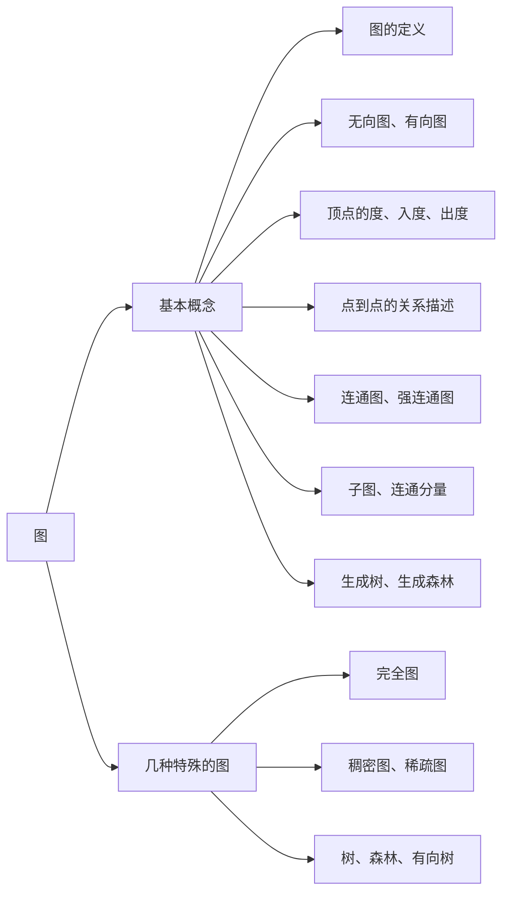

#### 2. 图逻辑结构的应用

同一个"图"结构，换一套 $V$ 和 $E$ 的含义，就能描述完全不同的现实问题：

| 现实问题 | $V$（顶点） | $E$（边） |
| --- | --- | --- |
| 全国铁路客运线路图 | 车站 | 铁路 |
| 城市地图导航 | 路口 | 道路 |
| 微信好友关系 | 用户 | 好友关系（**边没有方向**） |
| 微博粉丝关系 | 用户 | 关注关系（**边有方向**） |

#### 3. 无向图与有向图

| 类型 | 边的名称 | 边的表示 | 关键性质 |
| --- | --- | --- | --- |
| **无向图** | 无向边（简称**边**），$E$ 是**无向边**的有限集合 | 无序对 $(v,w)$ 或 $(w,v)$ | $(v,w)=(w,v)$ |
| **有向图** | 有向边（又称**弧**），$E$ 是**有向边**的有限集合 | 有序对 $\langle v,w\rangle$ | $\langle v,w\rangle\ne\langle w,v\rangle$ |

**相关术语**：

- **邻接点**：无向图中，若边 $(v,w)$ 存在，则称顶点 $w$ 和顶点 $v$ **互为邻接点**；
- **依附 / 关联**：边 $(v,w)$ **依附于**顶点 $v$ 和 $w$，或称边 $(v,w)$ 和顶点 $v,w$ **相关联**；
- **弧尾与弧头**：有向图中 $\langle v,w\rangle$ 表示从 $v$ 到 $w$ 的弧，$v$ 称为**弧尾**（起点），$w$ 称为**弧头**（终点）；
- **邻接到 / 邻接自**：$\langle v,w\rangle$ 也称 $v$ **邻接到** $w$，或 $w$ **邻接自** $v$。

> **图名区分**：本节给图命名时，示例的有向图 $G_1$（8 条弧）与无向图 $G_2$（6 条边）都只有 **5 个顶点 $A\sim E$**；**6.2.1 邻接矩阵法**一节另用一张 **6 个顶点 $A\sim F$** 的示例图。**本节 $G_1,G_2$ 与 6.2.1 的 6 顶点 $A\sim F$ 图不是同一张图**，不要因为都叫"$G$"就把两者的顶点集、边集混着用。

**例**（无向图 $G_2$，5 个顶点、6 条边）：

$$G_2=(V_2,E_2),\quad V_2=\{A,B,C,D,E\},\quad E_2=\{(A,B),(B,D),(B,E),(C,D),(C,E),(D,E)\}$$

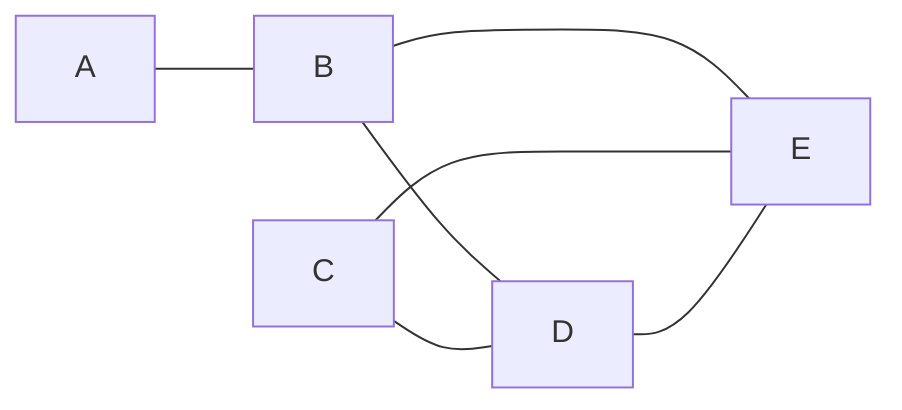

**例**（有向图 $G_1$，5 个顶点、8 条弧）：

$$G_1=(V_1,E_1),\quad V_1=\{A,B,C,D,E\},\quad E_1=\{\langle A,B\rangle,\langle A,C\rangle,\langle A,D\rangle,\langle A,E\rangle,\langle B,A\rangle,\langle B,C\rangle,\langle B,E\rangle,\langle C,D\rangle\}$$

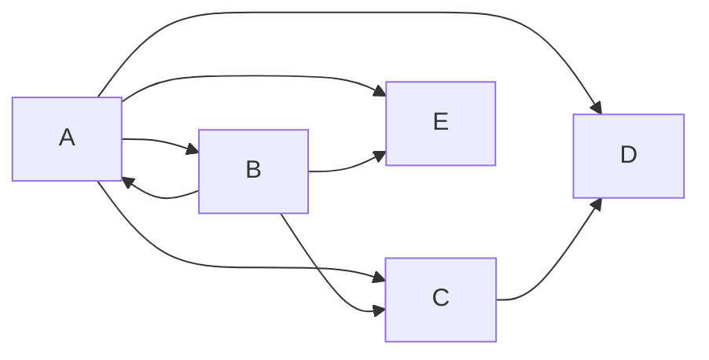

#### 4. 简单图与多重图

| 类型 | 定义 |
| --- | --- |
| **简单图** | ① **不存在重复边**；② **不存在顶点到自身的边**（无自环） |
| **多重图** | 图 $G$ 中某两个顶点之间的边数**多于一条**，又允许顶点通过同一条边**和自己关联** |

> **数据结构课程只探讨"简单图"**。后面出现的"图"，若无特别说明，都指简单图。

#### 5. 顶点的度、入度、出度

| 图 | 术语 | 定义 |
| --- | --- | --- |
| **无向图** | 顶点 $v$ 的**度** $\mathrm{TD}(v)$ | 依附于该顶点的**边的条数** |
| **有向图** | **入度** $\mathrm{ID}(v)$ | 以顶点 $v$ 为**终点**的有向边的数目 |
| **有向图** | **出度** $\mathrm{OD}(v)$ | 以顶点 $v$ 为**起点**的有向边的数目 |

**重要性质**：

- 无向图：具有 $n$ 个顶点、$e$ 条边时，**全部顶点的度之和等于边数的 2 倍**

$$\sum_{i=1}^{n}\mathrm{TD}(v_i)=2e$$

- 有向图：具有 $n$ 个顶点、$e$ 条边时，**入度之和 = 出度之和 = 边数**；顶点 $v$ 的度等于入度与出度之和

$$\sum_{i=1}^{n}\mathrm{ID}(v_i)=\sum_{i=1}^{n}\mathrm{OD}(v_i)=e,\qquad \mathrm{TD}(v)=\mathrm{ID}(v)+\mathrm{OD}(v)$$

> **理解**：无向图的每条边被两个端点"各算一次"，所以度之和是边数的 2 倍；有向图的每条弧恰好贡献一个出度和一个入度。

#### 6. 顶点与顶点之间的关系描述

| 术语 | 含义 |
| --- | --- |
| **路径** | 顶点 $v_p$ 到顶点 $v_q$ 之间的一条路径，是指顶点序列 $v_p,v_{i_1},v_{i_2},\dots,v_{i_m},v_q$ |
| **回路（环）** | **第一个顶点和最后一个顶点相同**的路径 |
| **简单路径** | 在路径序列中，**顶点不重复出现**的路径 |
| **简单回路** | 除第一个顶点和最后一个顶点外，**其余顶点不重复出现**的回路 |
| **路径长度** | 路径上**边的数目** |
| **点到点的距离** | 从顶点 $u$ 出发到顶点 $v$ 的**最短路径**若存在，则此路径的长度称为从 $u$ 到 $v$ 的距离 |
| **连通**（无向图） | 若从顶点 $v$ 到顶点 $w$ **有路径**存在，则称 $v$ 和 $w$ 是连通的 |
| **强连通**（有向图） | 若从 $v$ 到 $w$ **和**从 $w$ 到 $v$ **都有路径**，则称这两个顶点是强连通的 |

> **注意**：若从 $u$ 到 $v$ **根本不存在路径**，则记该距离为**无穷（$\infty$）**。另外，**有向图的路径也是有向的**，必须沿弧的方向走。

#### 7. 连通图、强连通图

| 类型 | 定义 |
| --- | --- |
| **连通图**（无向图） | 图中**任意两个顶点都是连通的**，则称图 $G$ 为连通图，否则称为非连通图 |
| **强连通图**（有向图） | 图中**任何一对顶点都是强连通的**，则称此图为强连通图 |

**常见考点（务必记住）**：

对于 $n$ 个顶点的**无向图** $G$：

- 若 $G$ 是**连通图**，则**最少有 $n-1$ 条边**（此时就是一棵树）；
- 若 $|E|>n-1$，则 $G$ **一定有回路**；
- 若 $G$ 是**非连通图**，则**最多可能有 $C_{n-1}^{2}$ 条边**（让 $n-1$ 个顶点构成完全图，剩下 1 个顶点孤立）；
- **无向完全图**共有 $C_n^2=\dfrac{n(n-1)}{2}$ 条边。

对于 $n$ 个顶点的**有向图** $G$：

- 所有顶点的**出度之和 = 入度之和 = $|E|$**，所有顶点的**度之和 = $2|E|$**；
- 若 $G$ 是**强连通图**，则**最少有 $n$ 条边**（$n$ 个顶点形成回路）；
- **有向完全图**共有 $2C_n^2=n(n-1)$ 条边。

> **易错**：非连通图的"最多边数"用的是 $C_{n-1}^{2}$（而不是 $C_n^2$）—— 要让其中一个顶点彻底孤立，其余 $n-1$ 个顶点两两相连。

#### 8. 子图与生成子图

设有两个图 $G=(V,E)$ 和 $G'=(V',E')$：

- 若 $V'$ 是 $V$ 的**子集**，且 $E'$ 是 $E$ 的**子集**，则称 $G'$ 是 $G$ 的**子图**；
- 若有满足 $V(G')=V(G)$ 的子图 $G'$，则称其为 $G$ 的**生成子图**（顶点一个不少，边可以少）。

> **注意**：**并非任意挑几个点、几条边都能构成子图** —— $E'$ 中的每条边都必须依附于 $V'$ 中的顶点；只留一个顶点 $A$ 却保留连接到 $B,C$ 的边，就不是子图。

#### 9. 连通分量与强连通分量

| 术语 | 定义 | 要点 |
| --- | --- | --- |
| **连通分量**（无向图） | 无向图中的**极大连通子图** | 子图必须**连通**，且包含**尽可能多的顶点和边** |
| **强连通分量**（有向图） | 有向图中的**极大强连通子图** | 子图必须**强连通**，同时**保留尽可能多的边** |

**例**（连通分量）：无向图 $G$ 拆成三个部分 —— $\{A,B,C,D,E,F\}$、$\{G,H,I\}$、$\{J\}$（孤立顶点），即 $G$ 有**三个连通分量**。**孤立顶点自己也是一个连通分量**。

**例**（强连通分量）：有向图中 $\{A,B,C,D,E\}$ 构成一个强连通分量，$F$、$G$ 各自单独构成一个，共**三个强连通分量**。

#### 10. 生成树与生成森林

- **生成树**：**连通图**的生成树是包含图中**全部顶点**的一个**极小连通子图**；
  - 若图中顶点数为 $n$，则它的生成树含有 **$n-1$ 条边**；
  - 对生成树而言，**砍去一条边**会变成**非连通图**，**加上一条边**则会形成**一个回路**（"极小"的含义）。
- **生成森林**：在**非连通图**中，**连通分量的生成树**构成了非连通图的**生成森林**。

**例**（$G$ 的两棵不同的生成树，顶点都是 $A\sim F$，各 5 条边）：

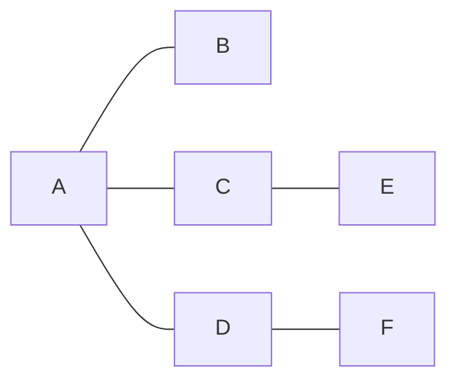

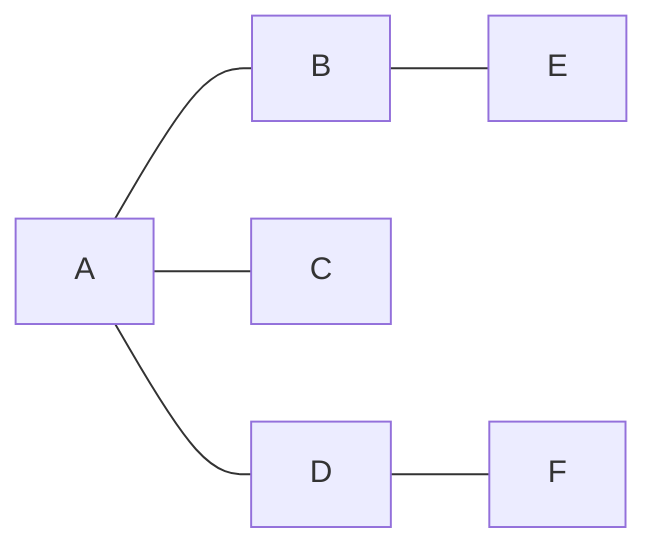

> 一个连通图的**生成树可能不唯一**；但无论哪一棵，**边数一定是 $n-1$**。

#### 11. 边的权、带权图 / 网

| 术语 | 含义 |
| --- | --- |
| **边的权** | 在一个图中，每条边都可以标上具有某种含义的**数值**，该数值称为该边的权值 |
| **带权图 / 网** | 边上**带有权值**的图称为带权图，也称**网** |
| **带权路径长度** | 当图是带权图时，一条路径上**所有边的权值之和**，称为该路径的带权路径长度 |

**例**（同一张地图，换一种权值就是另一个问题）：

| 权值的含义 | $P$ 城到 $Y$ 城的最优走法 |
| --- | --- |
| 实际距离（$50/40/40$ km 与 $70/80$ km 两条路） | 走 $P\to G\to R\to Y$，共 $130$ km（距离最短） |
| 高速费（$¥30/¥20/¥20$ 与 $¥40/¥0$ 两条路） | 走 $P\to G\to R\to Y$ 花 $¥70$，走 $P\to$ 渔村 $\to Y$ 花 $¥40$（收费最低） |

> 同一张图，**权值的定义不同，"最短路"的走法就不同** —— 这正是第六章 6.4.2 最短路径问题要解决的。
>
> **图名区分**：此例（$P$ 城、$G$ 镇、$R$ 城、$Y$ 城与渔村）与 **6.4.2 最短路径问题中的 G 港物流网不是同一张图**，只是借它说明"带权图上换一种权值定义就换一种最优走法"，读的时候不要把两张图的顶点混起来。

#### 12. 几种特殊形态的图

**① 完全图**

| 类型 | 定义 | 边数（顶点数为 $n$） |
| --- | --- | --- |
| **无向完全图** | 无向图中**任意两个顶点之间都存在边** | $C_n^2=\dfrac{n(n-1)}{2}$ |
| **有向完全图** | 有向图中**任意两个顶点之间都存在方向相反的两条弧** | $2C_n^2=n(n-1)$ |

> **要点**：完全图的边数是**定值** —— 顶点数 $n$ 一确定，边数就随之唯一确定，不存在"范围"一说。

**与"一般图的边数上界"区分开**：$0\le\lvert E\rvert\le C_n^2$、$0\le\lvert E\rvert\le n(n-1)$ 描述的是**任意简单图**边数的**取值范围**（$n$ 个顶点的简单无向图至多 $C_n^2$ 条边、简单有向图至多 $n(n-1)$ 条弧），**只有取到上界（等号成立）时，这个图才叫完全图**；一般的图只是落在区间之内。

**② 稠密图与稀疏图**

- **稀疏图**：边数很少的图；
- **稠密图**：反之称为稠密图；
- **没有绝对的界限**，一般来说 $|E|<|V|\log|V|$ 时，可以将 $G$ 视为稀疏图。

**③ 树、森林、有向树**

| 类型 | 定义 |
| --- | --- |
| **树** | **不存在回路**，且**连通**的无向图（$n$ 个顶点的树必有 $n-1$ 条边） |
| **森林** | 由若干棵互不相交的树组成（非连通且无回路） |
| **有向树** | 一个顶点的**入度为 0**、其余顶点的**入度均为 1** 的有向图 |

> **常见考点**：$n$ 个顶点的图，若 $|E|>n-1$，则**一定有回路**。

#### 13. 本节知识回顾

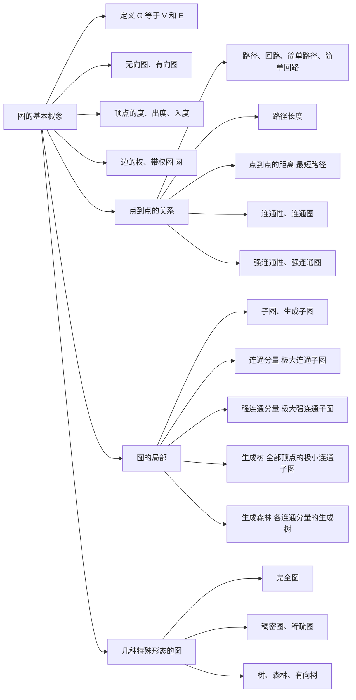

**本节考点**：$V$ **非空**（图不能是空图）→ **无向边 $(v,w)$ 与弧 $\langle v,w\rangle$ 的区别**（$(v,w)=(w,v)$，$\langle v,w\rangle\ne\langle w,v\rangle$）→ **度之和 $=\sum\mathrm{TD}=2e$、$\sum\mathrm{ID}=\sum\mathrm{OD}=e$** → 八个关系术语（路径/回路/简单路径/简单回路/路径长度/距离/连通/强连通）→ **连通图最少 $n-1$ 条边、非连通图最多 $C_{n-1}^{2}$ 条边、强连通图最少 $n$ 条边、完全图定值 $C_n^2$ 与 $n(n-1)$ 条边** → 子图与生成子图、连通分量与强连通分量（"极大"）→ 生成树（$n-1$ 条边、极小连通）与生成森林 → 带权图与带权路径长度 → 特殊图：完全图（边数为**定值**）、稠密/稀疏（$|E|<|V|\log|V|$）、树/森林/有向树。

---

### 6.2.1 邻接矩阵法

#### 1. 图的存储结构总览

图 $G=(V,E)$ 需要同时保存**顶点集**与**边集**两类信息。本章依次介绍四种存储结构，其中前两种是通用的，后两种是专用结构：

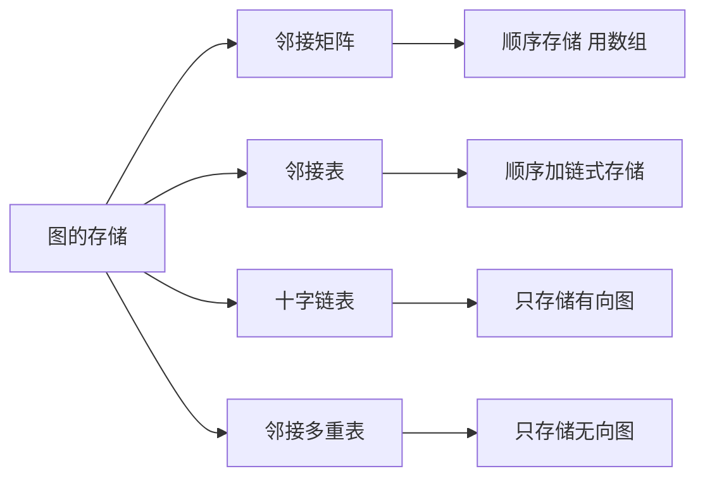

> **一句话定位**：邻接矩阵用"二维数组"存边，邻接表用"数组 + 链表"存边；十字链表是**有向图**的"邻接表 + 逆邻接表"结合体，邻接多重表是**无向图**去掉冗余边结点后的链式结构。

#### 2. 邻接矩阵的定义与取值规则

顶点数为 $n$ 的图 $G=(V,E)$ 的邻接矩阵 $A$ 是 $n\times n$ 的。将 $G$ 的顶点编号为 $v_1,v_2,\dots,v_n$，则

$$A[i][j]=\begin{cases}1, & \text{若 }(v_i,v_j)\text{ 或 }\langle v_i,v_j\rangle\text{ 是 }E(G)\text{ 中的边}\\[4pt] 0, & \text{若 }(v_i,v_j)\text{ 或 }\langle v_i,v_j\rangle\text{ 不是 }E(G)\text{ 中的边}\end{cases}$$

即**一维数组 `Vex[]` 顺序存放顶点，二维数组 `Edge[][]` 存放边**，行、列下标都对应顶点编号。

| `edge[i][j]` 的取值 | 含义 |
| --- | --- |
| $A[i][j]=1$ | 无向图中存在边 $(v_i,v_j)$；有向图中存在弧 $\langle v_i,v_j\rangle$（即 $v_i$ 邻接到 $v_j$） |
| $A[i][j]=0$ | 顶点 $v_i$ 与 $v_j$ 之间不存在边/弧 |
| 主对角线 | 简单图无自环，**对角线元素全为 0** |
| 无向图 | $A[i][j]=A[j][i]$，**矩阵一定对称** |
| 有向图 | $A[i][j]=1$ 只说明有 $v_i\to v_j$ 的弧，**不能推出** $A[j][i]=1$ |

> **两个"唯一性"结论**：邻接矩阵的规模只由**顶点数 $n$** 决定，与边数无关；**只要确定了顶点编号，图的邻接矩阵表示方式就是唯一的**（这一点与邻接表相反，见 6.2.2）。

#### 3. 邻接矩阵的结构定义

```c
#define MaxVertexNum 100                    // 顶点数目的最大值
typedef struct{
    char Vex[MaxVertexNum];                 // 顶点表
    int  Edge[MaxVertexNum][MaxVertexNum];  // 邻接矩阵，边表
    int  vexnum, arcnum;                    // 图的当前顶点数和边数/弧数
} MGraph;
```

说明：

- `Vex[]` 里存放的可以是**更复杂的信息**（如结构体），只要能唯一标识一个顶点；
- 存储**无权图**时，`Edge` 的元素类型可用 `bool` 型或枚举型变量表示，节省空间；
- 邻接矩阵是**顺序存储**，空间一次性开满 `MaxVertexNum × MaxVertexNum` 个元素。

#### 4. 无向图与有向图的邻接矩阵

**① 无向图**（$V=\{A,B,C,D,E,F\}$，$E=\{(A,B),(A,C),(A,D),(B,E),(B,F),(C,E),(D,F)\}$：6 个顶点、7 条边）

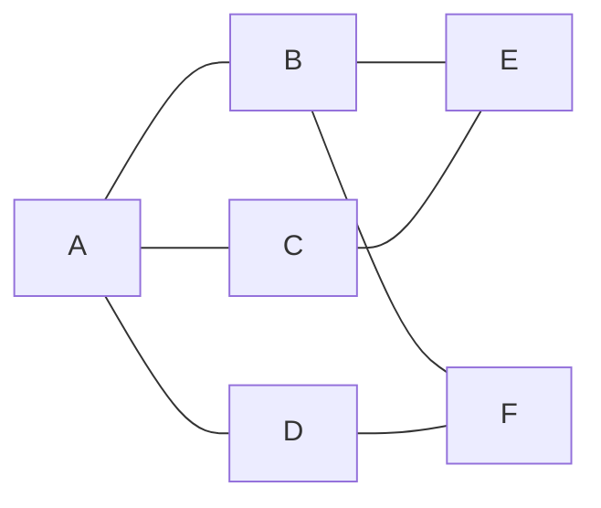

| | A | B | C | D | E | F |
| --- | --- | --- | --- | --- | --- | --- |
| **A** | 0 | 1 | 1 | 1 | 0 | 0 |
| **B** | 1 | 0 | 0 | 0 | 1 | 1 |
| **C** | 1 | 0 | 0 | 0 | 1 | 0 |
| **D** | 1 | 0 | 0 | 0 | 0 | 1 |
| **E** | 0 | 1 | 1 | 0 | 0 | 0 |
| **F** | 0 | 1 | 0 | 1 | 0 | 0 |

**② 有向图**（弧集 $\{\langle A,B\rangle,\langle C,A\rangle,\langle D,A\rangle,\langle E,B\rangle,\langle E,C\rangle,\langle F,B\rangle,\langle F,D\rangle\}$：6 个顶点、7 条弧）

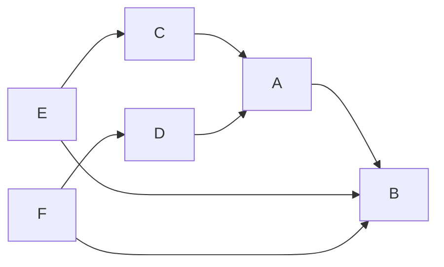

| | A | B | C | D | E | F |
| --- | --- | --- | --- | --- | --- | --- |
| **A** | 0 | 1 | 0 | 0 | 0 | 0 |
| **B** | 0 | 0 | 0 | 0 | 0 | 0 |
| **C** | 1 | 0 | 0 | 0 | 0 | 0 |
| **D** | 1 | 0 | 0 | 0 | 0 | 0 |
| **E** | 0 | 1 | 1 | 0 | 0 | 0 |
| **F** | 0 | 1 | 0 | 1 | 0 | 0 |

对比可得：

- 无向图的邻接矩阵**关于主对角线对称**：$A[0][1]=A[1][0]=1$ 表示同一条边 $(A,B)$；
- 有向图的邻接矩阵**一般不对称**：$A[0][1]=1$（弧 $A\to B$）但 $A[1][0]=0$（没有弧 $B\to A$）。

#### 5. 由邻接矩阵求度、出度、入度

| 图的类型 | 求法 | 时间复杂度 |
| --- | --- | --- |
| 无向图 | 第 $i$ 个顶点的**度** = 第 $i$ **行**（或第 $i$ **列**）的**非零元素个数** | $O(\lvert V\rvert)$ |
| 有向图 | 第 $i$ 个顶点的**出度** = 第 $i$ **行**的非零元素个数 | $O(\lvert V\rvert)$ |
| 有向图 | 第 $i$ 个顶点的**入度** = 第 $i$ **列**的非零元素个数 | $O(\lvert V\rvert)$ |
| 有向图 | 第 $i$ 个顶点的**度** = 第 $i$ 行、第 $i$ 列的非零元素个数之和 | $O(\lvert V\rvert)$ |

**为什么是 $O(\lvert V\rvert)$**：求某个顶点的度必须把对应的整行（或整列）扫一遍，即使这个顶点的度很小也不能提前结束；**如何找到与一个顶点相连的边/弧**同理，都要遍历对应行或列。这正是邻接矩阵在**稀疏图**上的最大软肋 —— 大量 0 元素被白白扫描。

以上面的无向图为例验证：各顶点的度依次为 $3,3,2,2,2,2$，总和 $=14=2\lvert E\rvert=2\times7$，与 6.1.1 中"无向图度之和等于边数 2 倍"的结论一致。

#### 6. 邻接矩阵存储带权图（网）

带权图（网）只需把"1"换成**权值**，把"0"换成**无穷 $\infty$**（代表两顶点之间没有边）。

**① 无向网**（$A\text{-}B:5$，$A\text{-}C:1$，$A\text{-}D:6$，$B\text{-}E:3$，$B\text{-}F:4$，$C\text{-}E:3$，$D\text{-}F:2$）

| | A | B | C | D | E | F |
| --- | --- | --- | --- | --- | --- | --- |
| **A** | 0 | 5 | 1 | 6 | $\infty$ | $\infty$ |
| **B** | 5 | 0 | $\infty$ | $\infty$ | 3 | 4 |
| **C** | 1 | $\infty$ | 0 | $\infty$ | 3 | $\infty$ |
| **D** | 6 | $\infty$ | $\infty$ | 0 | $\infty$ | 2 |
| **E** | $\infty$ | 3 | 3 | $\infty$ | 0 | $\infty$ |
| **F** | $\infty$ | 4 | $\infty$ | 2 | $\infty$ | 0 |

**② 有向网**（弧及其权值：$A\to B:5$，$C\to A:1$，$D\to A:6$，$E\to B:3$，$E\to C:3$，$F\to B:4$，$F\to D:2$）

| | A | B | C | D | E | F |
| --- | --- | --- | --- | --- | --- | --- |
| **A** | 0 | 5 | $\infty$ | $\infty$ | $\infty$ | $\infty$ |
| **B** | $\infty$ | 0 | $\infty$ | $\infty$ | $\infty$ | $\infty$ |
| **C** | 1 | $\infty$ | 0 | $\infty$ | $\infty$ | $\infty$ |
| **D** | 6 | $\infty$ | $\infty$ | 0 | $\infty$ | $\infty$ |
| **E** | $\infty$ | 3 | 3 | $\infty$ | 0 | $\infty$ |
| **F** | $\infty$ | 4 | $\infty$ | 2 | $\infty$ | 0 |

> **注意**：课件在网的邻接矩阵中把**主对角线写成 0**（顶点到自己的代价为 0），无边处写 $\infty$；若题目另行规定（例如对角线也写 $\infty$），以题干为准。

```c
#define MaxVertexNum 100                    // 顶点数目的最大值
#define INFINITY INT_MAX                    // 宏定义常量"无穷"（用 int 的上限值表示）
typedef char VertexType;                    // 顶点的数据类型
typedef int  EdgeType;                      // 带权图中边上权值的数据类型
typedef struct{
    VertexType Vex[MaxVertexNum];                  // 顶点
    EdgeType   Edge[MaxVertexNum][MaxVertexNum];   // 边的权
    int        vexnum, arcnum;                     // 图的当前顶点数和弧数
} MGraph;
```

#### 7. 邻接矩阵法的性能分析

| 指标 | 结论 |
| --- | --- |
| 空间复杂度 | $O(\lvert V\rvert^2)$ —— **只和顶点数相关，和实际的边数无关** |
| 适合存储 | **稠密图**（边数接近完全图，几乎没有 0 被浪费） |
| 不适合 | **稀疏图**（$n$ 很大而边很少时，绝大多数格子是 0，空间被大量浪费） |
| 求度/找相邻边 | 必须遍历对应行或列，$O(\lvert V\rvert)$ |
| 删除边 | **很方便**，把 `Edge[i][j]`、`Edge[j][i]` 置 0 即可 |
| 删除顶点 | **不方便**，数组是顺序存储，删除后需要大量移动数据 |
| 表示方式 | **唯一**（顶点编号确定后矩阵唯一） |

**无向图的压缩存储**：无向图的邻接矩阵是**对称矩阵**，可以只存储**主对角线 + 下三角区**（或上三角区），把 $n\times n$ 个元素压缩成 $\dfrac{n(n+1)}{2}$ 个元素的一维数组 $B$，**按行优先**原则依次存入：

$$k=\begin{cases}\dfrac{i(i-1)}{2}+j-1, & i\ge j\ \text{（下三角区与主对角线元素）}\\[8pt] \dfrac{j(j-1)}{2}+i-1, & i<j\ \text{（上三角区元素，利用 }A[i][j]=A[j][i]\text{）}\end{cases}$$

其中 $i,j$ 从 1 开始编号，一维数组的最大下标为 $\dfrac{n(n+1)}{2}-1$。

#### 8. 邻接矩阵的性质：$A^n$ 与路径数目

设图 $G$ 的邻接矩阵为 $A$（矩阵元素为 0/1），则 **$A^n$ 的元素 $A^n[i][j]$ 等于由顶点 $i$ 到顶点 $j$ 的长度为 $n$ 的路径的数目**。

**示例**：4 个顶点的无向图 $V=\{A,B,C,D\}$，边为 $(A,B),(B,C),(B,D),(C,D)$，顶点编号 $A=1,B=2,C=3,D=4$。

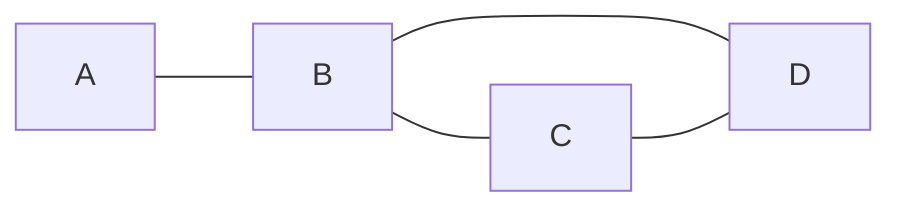

$$A=\begin{pmatrix}0&1&0&0\\1&0&1&1\\0&1&0&1\\0&1&1&0\end{pmatrix}$$

$A^2$ 即"长度为 2 的路径条数矩阵"：

$$A^2=\begin{pmatrix}1&0&1&1\\0&3&1&1\\1&1&2&1\\1&1&1&2\end{pmatrix}$$

**逐项验证**（矩阵乘法就是"中间顶点 $k$ 逐个试一遍"）：

- $A^2[1][4]=a_{1,1}a_{1,4}+a_{1,2}a_{2,4}+a_{1,3}a_{3,4}+a_{1,4}a_{4,4}=0+1+0+0=1$，即 $A\to B\to D$ 这 1 条路径；
- $A^2[2][2]=a_{2,1}a_{1,2}+a_{2,2}a_{2,2}+a_{2,3}a_{3,2}+a_{2,4}a_{4,2}=1+0+1+1=3$，即 $B\to A\to B$、$B\to C\to B$、$B\to D\to B$ 共 3 条；
- $A^2[3][3]=a_{3,1}a_{1,3}+a_{3,2}a_{2,3}+a_{3,3}a_{3,3}+a_{3,4}a_{4,3}=0+1+0+1=2$，即 $C\to B\to C$、$C\to D\to C$。

再与 $A$ 相乘得到 $A^3$（长度为 3 的路径条数）：

$$A^3=A^2\cdot A=\begin{pmatrix}0&3&1&1\\3&2&4&4\\1&4&2&3\\1&4&3&2\end{pmatrix}$$

> **易错**：$A^n[i][j]$ 数的是**路径条数**（顶点可以重复出现，即可含回路），不是"简单路径条数"；另外 $A^n$ 只对**无权图（0/1 矩阵）**有"路径条数"的含义，带权图的矩阵元素是权值，不能这样数路径。

#### 9. 本节考点

**本节考点**：邻接矩阵的取值规则 `edge[i][j]`（1 表示有边/弧，0 表示无边，对角线全 0）→ 无向图邻接矩阵**对称**、有向图邻接矩阵一般不对称 → 求度的三种口径（无向图数第 $i$ 行或第 $i$ 列的非零元素个数；有向图**第 $i$ 行非零为出度、第 $i$ 列非零为入度**，因为 $A[i][j]=1$ 表示 $v_i\to v_j$ 这条弧，时间都是 $O(\lvert V\rvert)$）→ 带权图用 $\infty$ 表示无边、主对角线写 0 → **空间复杂度 $O(\lvert V\rvert^2)$、适合稠密图、删除边方便而删除顶点需移动大量数据、表示方式唯一** → 无向图邻接矩阵的**对称矩阵压缩存储**（只存主对角线 + 下三角，共 $\dfrac{n(n+1)}{2}$ 个元素）→ **$A^n[i][j]$ = 顶点 $i$ 到 $j$ 长度为 $n$ 的路径数目**。

---

### 6.2.2 邻接表法

#### 1. 邻接表法的引入

邻接矩阵的两个痛点：**① 空间浪费** —— 用数组实现的顺序存储，空间复杂度 $O(\lvert V\rvert^2)$，只与顶点数有关，不适合存储稀疏图；**② 找相邻边麻烦** —— 求某个顶点的度或找它的相邻边都必须遍历整行/整列，$O(\lvert V\rvert)$。

于是引入**邻接表法（顺序 + 链式存储）**：顶点用**数组顺序存储**，每个顶点的邻接点用**单链表链式存储**，这样"有多少条边就只花多少空间"。

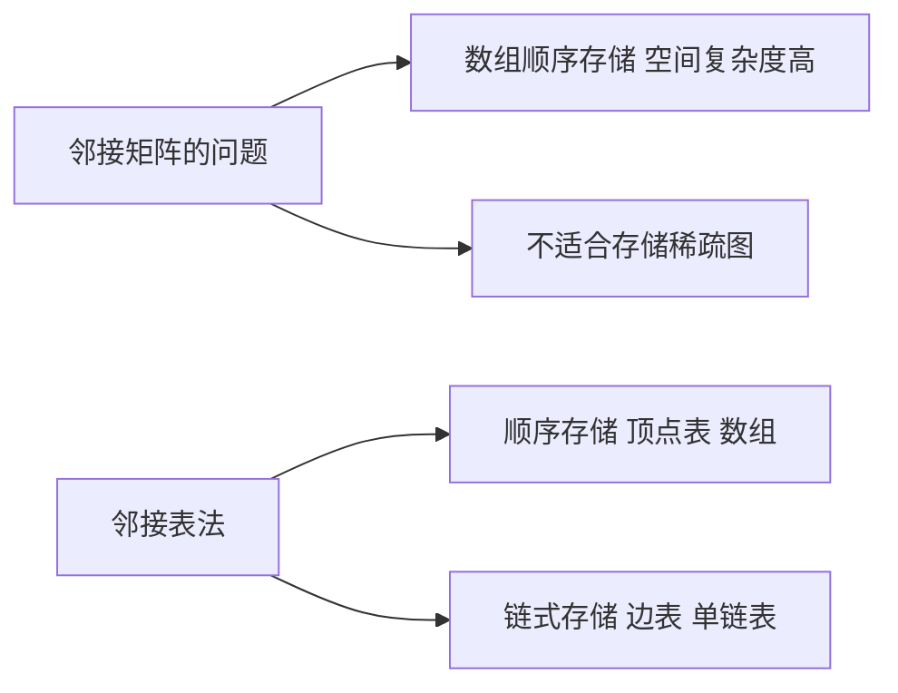

#### 2. 顶点表结点与边表结点的结构

邻接表由两部分组成，**顶点表顺序存储、边表链式存储**：

| 结点 | 结构 | 数据域 | 指针域 | 说明 |
| --- | --- | --- | --- | --- |
| **顶点结点 `VNode`** | `data` + `first` | `data`：顶点信息 | `first`：指向**第一条**依附于该顶点的边/弧 | 顺序存放在数组 `AdjList[]` 中 |
| **边结点 `ArcNode`** | `adjvex` + `next` | `adjvex`：该边/弧**指向哪个顶点**（邻接点在顶点表中的下标） | `next`：指向**下一条**边/弧的指针 | 每条边/弧一个结点，网中再加 `info` 存权值 |

> **理解**：顶点表的每个格子拉出一条单链表，链表里挂的就是"与这个顶点直接相连的所有顶点"。因此**顶点 $v$ 的边表（出边表）长度就是它的度（出度）**。

#### 3. 邻接表的结构定义

```c
#define MaxVertexNum 100            // 顶点数目的最大值

typedef struct ArcNode{             // "边/弧"
    int adjvex;                     // 边/弧指向哪个顶点
    struct ArcNode *next;           // 指向下一条弧的指针
    // InfoType info;               // 边权值
} ArcNode;

typedef struct VNode{               // "顶点"
    VertexType data;                // 顶点信息
    ArcNode *first;                 // 第一条边/弧
} VNode, AdjList[MaxVertexNum];

typedef struct{
    AdjList vertices;               // 用邻接表存储的图
    int vexnum, arcnum;             // 图的当前顶点数和弧数
} ALGraph;
```

#### 4. 无向图的邻接表

仍以 6.2.1 中的无向图 $G$ 为例（$V=\{A,B,C,D,E,F\}$，$E=\{(A,B),(A,C),(A,D),(B,E),(B,F),(C,E),(D,F)\}$）：


顶点表（顺序存储）+ 边表（链式存储）：

| 下标 | data | 边表（`adjvex` 序列，`^` 表示 NULL） |
| --- | --- | --- |
| 0 | A | 1 → 2 → 3 → `^` |
| 1 | B | 0 → 4 → 5 → `^` |
| 2 | C | 0 → 4 → `^` |
| 3 | D | 0 → 5 → `^` |
| 4 | E | 1 → 2 → `^` |
| 5 | F | 1 → 3 → `^` |

**关键结论**：

- 无向图中每条边 $(v_i,v_j)$ 在**两个顶点的边表里各出现一次**（$i$ 的表里有 $j$，$j$ 的表里有 $i$），所以**边结点总数 $=2\lvert E\rvert$**（上例 $2\times7=14$ 个边结点）；
- 顶点 $v$ 的**度 $=$ 它的边表中结点个数**，所以无向图求度**非常方便**；
- 求"与顶点 $v$ 相连的边/弧"只需遍历 $v$ 的边表，代价与 $v$ 的度成正比，比邻接矩阵的 $O(\lvert V\rvert)$ 更划算。

#### 5. 有向图的邻接表（出度易求，入度不便）

以 6.2.1 中的有向图为例（弧集 $\{\langle A,B\rangle,\langle C,A\rangle,\langle D,A\rangle,\langle E,B\rangle,\langle E,C\rangle,\langle F,B\rangle,\langle F,D\rangle\}$，共 7 条弧）：


| 下标 | data | 出边表（`adjvex` 序列） | 出度 | 入度 |
| --- | --- | --- | --- | --- |
| 0 | A | 1 → `^` | 1 | 2（来自 C、D） |
| 1 | B | `^` | 0 | 3（来自 A、E、F） |
| 2 | C | 0 → `^` | 1 | 1（来自 E） |
| 3 | D | 0 → `^` | 1 | 1（来自 F） |
| 4 | E | 1 → 2 → `^` | 2 | 0 |
| 5 | F | 1 → 3 → `^` | 2 | 0 |

| 求解目标 | 邻接表下的做法 | 代价 |
| --- | --- | --- |
| 有向图的**出度** | 数顶点 $v$ 的出边表结点个数（或直接遍历该表求全部出边） | 与 $v$ 的出度成正比，**很方便** |
| 有向图的**入度** | 邻接表里只记了 $v$ **出发**的弧，**必须遍历整个邻接表**，统计所有 `adjvex == v` 的结点 | $O(\lvert E\rvert)$，**不方便** |
| 有向图的**度** | 度 $=$ 出度 $+$ 入度 | 受入度拖累 |

> **逆邻接表**：如果改成"每个顶点挂一条**入边表**"（表里存的是**指向自己**的弧的弧尾），那么求入度很方便、求出度反而不便。**邻接表与逆邻接表正好互补**，把两者合起来就是 6.2.3 的十字链表。

#### 6. 边结点数与空间复杂度

| 图的类型 | 边结点数量 | 整体空间复杂度 | 适用场景 |
| --- | --- | --- | --- |
| 无向图 | $2\lvert E\rvert$ | $O(\lvert V\rvert+2\lvert E\rvert)$ | 稀疏图 |
| 有向图 | $\lvert E\rvert$ | $O(\lvert V\rvert+\lvert E\rvert)$ | 稀疏图 |

> 顶点表占 $\lvert V\rvert$ 个结点，边表占"边结点数"个结点，加起来即为空间复杂度。**当图很稀疏（$2\lvert E\rvert\ll\lvert V\rvert^2$）时，邻接表比邻接矩阵省得多。**

#### 7. 邻接表的表示方式不唯一

- 邻接矩阵：顶点编号确定后，**表示方式唯一**；
- 邻接表：顶点编号确定后，**每条边表内部各结点的先后次序仍然可以不同**（头插法、尾插法、输入边的顺序不同都会产生不同的链表），所以**图的邻接表表示方式并不唯一**。

> **易错**：同一个图的两份邻接表"长得不一样"并不意味着它们描述了不同的图 —— 只要每个顶点的邻接点集合相同，就是同一个图。做题时不要因为链表中结点顺序不同而判断成错。

#### 8. 邻接表与邻接矩阵的对比

| 对比项 | 邻接表 | 邻接矩阵 |
| --- | --- | --- |
| 空间复杂度 | 无向图 $O(\lvert V\rvert+2\lvert E\rvert)$；有向图 $O(\lvert V\rvert+\lvert E\rvert)$ | $O(\lvert V\rvert^2)$ |
| 适合用于 | 存储**稀疏图** | 存储**稠密图** |
| 表示方式 | **不唯一** | **唯一** |
| 计算度 / 出度 / 入度 | 计算无向图的度很方便；**计算有向图的度、入度不方便**，其余很方便 | **必须遍历对应行或列**，$O(\lvert V\rvert)$ |
| 找相邻的边 | 找无向图的相邻边很方便；**找有向图的入边不方便**，其余很方便 | 必须遍历对应行或列，$O(\lvert V\rvert)$ |
| 删除边或顶点 | 无向图中删除边或顶点**都不方便**（要改两份冗余信息） | 删除边很方便，删除顶点需要大量移动数据 |

#### 9. 与树的孩子表示法的对比

邻接表的结构与**树的孩子表示法**完全同构，可以类比记忆：

| 结构 | 顶点/结点表 | 链表内容 |
| --- | --- | --- |
| 树的孩子表示法 | 顺序存储各个结点，每个结点保存 `*firstChild` | 该结点的所有**孩子** |
| 图的邻接表 | 顺序存储各个顶点，每个顶点保存 `*first` | 该顶点的所有**邻接点** |

> 例如树 $A$ 的孩子为 $B,C,D$：`data` 表中的 $A$ 结点用 `*firstChild` 指向 `1→2→3→^` 的孩子链表 —— 这与邻接表中"顶点 A 指向 `1→2→3→^`"的形式一模一样。**"顶点表 + 每行一条链表"是这类结构的通用套路。**

#### 10. 本节考点

**本节考点**：邻接表的**结点结构**（顶点结点 `data` + `first`；边结点 `adjvex` + `next`，网中再加 `info` 存权值）→ **无向图边结点数为 $2\lvert E\rvert$、空间复杂度 $O(\lvert V\rvert+2\lvert E\rvert)$；有向图边结点数为 $\lvert E\rvert$、空间复杂度 $O(\lvert V\rvert+\lvert E\rvert)$、适合稀疏图** → **有向图出度易求（数出边表）、入度不便（要遍历整个邻接表，$O(\lvert E\rvert)$）与逆邻接表** → 无向图求度很方便 → **邻接表表示方式不唯一，邻接矩阵唯一** → 邻接表 vs 邻接矩阵对比表（空间、适用、唯一性、求度、找相邻边、删除操作）→ 与树的孩子表示法同构。

---

### 6.2.3 十字链表、邻接多重表

#### 1. 十字链表与邻接多重表要解决什么痛点

邻接矩阵和邻接表虽然通用，但在**有向图求入边**、**无向图存两份冗余边**这两件事上都不理想：

- **邻接矩阵**：空间复杂度高，$O(\lvert V\rvert^2)$；求度、找相邻边必须遍历对应行或列；
- **邻接表存有向图**：出度易求，但**求入度不方便** —— 邻接表只记录"从该顶点出发的弧"，求入度必须遍历整个邻接表（$O(\lvert E\rvert)$）；
- **邻接表存无向图**：每条边在两个顶点的边表里**各存一份**（边结点数 $2\lvert E\rvert$），信息冗余，**删除边、删除顶点时两份都要改**，操作不方便。

于是针对性地设计两种**专用**存储结构：

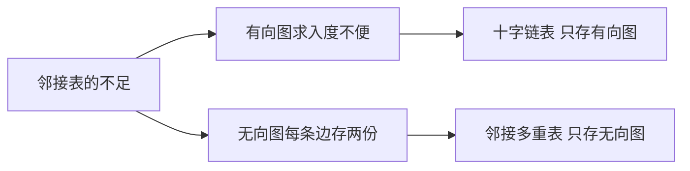

> **要点**：十字链表与邻接多重表的空间复杂度都是 $O(\lvert V\rvert+\lvert E\rvert)$，找相邻边、删除边或顶点都很方便；**十字链表只能存有向图，邻接多重表只能存无向图**（这是选择题的高频陷阱）。

#### 2. 十字链表的结点结构（有向图）

十字链表 $=$ **邻接表 $+$ 逆邻接表** 的结合体，因此顶点结点要挂两条链、弧结点要挂两根"链针"，形似十字，故名"十字链表"。

**① 弧结点**

| 域 | 名称 | 含义 |
| --- | --- | --- |
| `tailvex` | 弧尾顶点编号 | 该弧的**起点**（弧尾）在顶点表中的下标 |
| `headvex` | 弧头顶点编号 | 该弧的**终点**（弧头）在顶点表中的下标 |
| `info` | 权值 | 该弧的相关信息（如带权图中的权值），可视需要设置 |
| `hlink` | 弧头相同链针 | 指向**弧头相同**的下一条弧（把"进入同一顶点的所有弧"串成一条链） |
| `tlink` | 弧尾相同链针 | 指向**弧尾相同**的下一条弧（把"从同一顶点出发的所有弧"串成一条链） |

**② 顶点结点**

| 域 | 名称 | 含义 |
| --- | --- | --- |
| `data` | 数据域 | 顶点信息，顶点结点用**数组顺序存储** |
| `firstin` | 入弧链头 | 该顶点**作为弧头**的第一条弧（入边链的头指针） |
| `firstout` | 出弧链头 | 该顶点**作为弧尾**的第一条弧（出边链的头指针） |

```c
#define MaxVertexNum 100

typedef struct ArcBox{                  // 弧结点
    int tailvex, headvex;               // 该弧的弧尾、弧头顶点编号
    struct ArcBox *hlink, *tlink;       // 弧头相同、弧尾相同的下一条弧
    // InfoType info;                   // 该弧的相关信息（如权值）
} ArcBox;

typedef struct VexNode{                 // 顶点结点
    VertexType data;                    // 数据域
    ArcBox *firstin, *firstout;         // 该顶点作为弧头的第一条弧、作为弧尾的第一条弧
} VexNode;

typedef struct{
    VexNode xlist[MaxVertexNum];        // 顶点表，顺序存储
    int vexnum, arcnum;                 // 顶点数和弧数
} OLGraph;                              // Orthogonal List Graph
```

#### 3. 十字链表的建表示例

**示例**：有向图 $V=\{A,B,C,D\}$，弧集 $\{\langle A,B\rangle,\langle A,C\rangle,\langle C,A\rangle,\langle C,D\rangle,\langle D,A\rangle,\langle D,B\rangle,\langle D,C\rangle\}$，共 7 条弧（编号 $A=0,B=1,C=2,D=3$）。

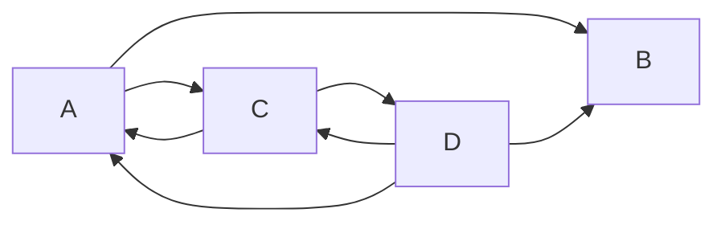

**① 顶点表**（`firstin` / `firstout` 存的是**弧结点**）

| 下标 | data | `firstin`（作为弧头的第一条弧） | `firstout`（作为弧尾的第一条弧） |
| --- | --- | --- | --- |
| 0 | A | C→A | A→B |
| 1 | B | A→B | `^` |
| 2 | C | A→C | C→A |
| 3 | D | C→D | D→A |

**② 弧结点**（共 $\lvert E\rvert=7$ 个）

| 弧 | `tailvex` | `headvex` | `hlink`（弧头相同的下一条弧） | `tlink`（弧尾相同的下一条弧） |
| --- | --- | --- | --- | --- |
| A→B | 0 | 1 | D→B | A→C |
| A→C | 0 | 2 | D→C | `^` |
| C→A | 2 | 0 | D→A | C→D |
| C→D | 2 | 3 | `^` | `^` |
| D→A | 3 | 0 | `^` | D→B |
| D→B | 3 | 1 | `^` | D→C |
| D→C | 3 | 2 | `^` | `^` |

**③ 校验用的两条链**（把上表串起来看更直观）

| 顶点 | 出边链（从 `firstout` 出发，沿 `tlink` 走） | 入边链（从 `firstin` 出发，沿 `hlink` 走） |
| --- | --- | --- |
| A | A→B → A→C | C→A → D→A |
| B | `^`（无出边） | A→B → D→B |
| C | C→A → C→D | A→C → D→C |
| D | D→A → D→B → D→C | C→D |

**建表过程**：

1. **建顶点表**：为每个顶点建一个顶点结点，`data` 填顶点信息，`firstin`、`firstout` 先置 `^`（顺序存储，下标即顶点编号）；
2. **逐条读入弧** $\langle v_i,v_j\rangle$：新建一个弧结点，令 `tailvex = i`、`headvex = j`、`hlink = tlink = ^`；
3. **挂到弧尾 $v_i$ 的出边链上**：用**头插法**把该弧结点插入 $v_i$ 的 `firstout` 链（即 `tlink` 链，链上全是弧尾为 $i$ 的弧）；
4. **挂到弧头 $v_j$ 的入边链上**：同样用**头插法**把它插入 $v_j$ 的 `firstin` 链（即 `hlink` 链，链上全是弧头为 $j$ 的弧）；
5. 每条弧插入时只改动 2 个头指针，**建表总时间 $O(\lvert E\rvert)$**；由于采用**头插法**，同一条链上弧结点的先后次序与输入次序**相反**（后读入的弧排在链首），因此**输入弧的顺序不同、或改用尾插法建表，都会得到链序不同的十字链表，即十字链表的表示方式不唯一**。

**查找操作**：

- 找顶点 $v$ 的**所有出边**：从 `xlist[v].firstout` 出发，**顺着 `tlink` 一路走**（对应课件图中绿色线路），沿路每个弧结点的 `headvex` 就是 $v$ 的一个直接后继；
- 找顶点 $v$ 的**所有入边**：从 `xlist[v].firstin` 出发，**顺着 `hlink` 一路走**（对应课件图中橙色线路），沿路每个弧结点的 `tailvex` 就是 $v$ 的一个直接前驱。

#### 4. 十字链表的性能分析

| 指标 | 结论 |
| --- | --- |
| 空间复杂度 | $O(\lvert V\rvert+\lvert E\rvert)$（顶点结点 $\lvert V\rvert$ 个，弧结点 $\lvert E\rvert$ 个，每条弧只存一次） |
| 求出度 / 出边 | 沿 `firstout` 的 `tlink` 链走，**很方便** |
| 求入度 / 入边 | 沿 `firstin` 的 `hlink` 链走，**很方便** |
| 删除边或顶点 | **很方便**（改指针即可，无需移动数据） |
| 适用对象 | **只能存储有向图** |
| 表示方式 | **不唯一**（头插使链序与输入次序**相反**，输入次序不同则链序不同） |

> **记忆**：十字链表把"出边"和"入边"两条视角同时保存下来，所以**入度、出度都能直接算**，代价只是弧结点多了 `hlink`、顶点结点多了 `firstin` 两个指针域 —— 空间仍是 $O(\lvert V\rvert+\lvert E\rvert)$。

#### 5. 邻接多重表的结点结构（无向图）

邻接表存无向图时，"同一条边存两份"（$2\lvert E\rvert$ 个边结点）造成冗余。邻接多重表让**每条边只对应一个边结点**，该结点同时挂在它两个端点的边链上。

**① 边结点**

| 域 | 名称 | 含义 |
| --- | --- | --- |
| `i` | 端点编号 | 该边依附的第一个顶点编号 |
| `j` | 端点编号 | 该边依附的第二个顶点编号 |
| `info` | 权值 | 该边的相关信息（如带权图中的权值） |
| `iLink` | 依附于 $i$ 的链针 | 指向**依附于顶点 $i$ 的下一条边** |
| `jLink` | 依附于 $j$ 的链针 | 指向**依附于顶点 $j$ 的下一条边** |

**② 顶点结点**

| 域 | 名称 | 含义 |
| --- | --- | --- |
| `data` | 数据域 | 顶点信息，顶点结点用**数组顺序存储** |
| `firstedge` | 边链头 | 指向**与该顶点相连的第一条边** |

```c
#define MaxVertexNum 100

typedef struct EBox{                    // 边结点
    int ivex, jvex;                     // 该边依附的两个顶点编号 i、j
    struct EBox *ilink, *jlink;         // 依附于顶点 i、j 的下一条边
    // InfoType info;                   // 边的权值等信息
} EBox;

typedef struct VexBox{                  // 顶点结点
    VertexType data;                    // 数据域
    EBox *firstedge;                    // 与该顶点相连的第一条边
} VexNode;

typedef struct{
    VexNode adjmulist[MaxVertexNum];    // 顶点表，顺序存储
    int vexnum, edgenum;                // 顶点数和边数
} AMLGraph;                             // Adjacency Multi-List Graph
```

#### 6. 邻接多重表的建表示例

**示例**：无向图 $V=\{A,B,C,D,E\}$，$E=\{(A,B),(A,D),(B,C),(B,E),(C,D),(C,E)\}$，共 5 个顶点、6 条边（编号 $A=0,B=1,C=2,D=3,E=4$）。

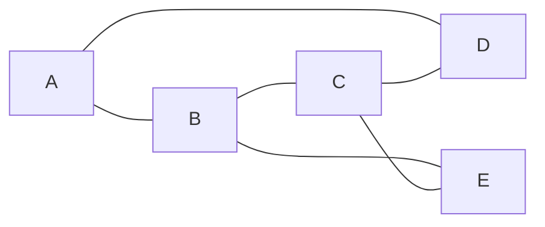

**① 顶点表**

| 下标 | data | `firstedge` |
| --- | --- | --- |
| 0 | A | A-B |
| 1 | B | A-B |
| 2 | C | C-B |
| 3 | D | A-D |
| 4 | E | E-B |

**② 边结点**（共 $\lvert E\rvert=6$ 个，**不是 $2\lvert E\rvert$ 个**）

| 边 | `i` | `j` | `iLink`（依附于 $i$ 的下一条边） | `jLink`（依附于 $j$ 的下一条边） |
| --- | --- | --- | --- | --- |
| A-B | 0 | 1 | A-D | C-B |
| A-D | 0 | 3 | `^` | C-D |
| C-B | 2 | 1 | C-D | E-B |
| C-D | 2 | 3 | C-E | `^` |
| E-B | 4 | 1 | C-E | `^` |
| C-E | 2 | 4 | `^` | `^` |

> **行名的写法**：上表行名按边结点 $(i,j)$ 的顺序书写（$i$ 在前、$j$ 在后），与后两列的 `iLink` / `jLink` 严格对应。无向边 $(B,C)$、$(B,E)$ 在建立时是以 $C$、$E$ 作为 `ivex` 读入的，故第 3、5 行记作 `C-B`、`E-B`；而 $(B,C)$ 与 $(C,B)$ 是**同一条边**，两种行名只是端点书写次序不同，**不要误认为两条边**（沿用输入顺序写成 `B-C`、`B-E` 也可以，但此时行名与 $i$、$j$ 的取值顺序相反，容易看错）。

**③ 各顶点的边链**（校验用）

| 顶点 | 边链（从 `firstedge` 出发） |
| --- | --- |
| A | A-B → A-D |
| B | A-B → C-B → E-B |
| C | C-B → C-D → C-E |
| D | A-D → C-D |
| E | E-B → C-E |

**建表过程**：

1. **建顶点表**：为每个顶点建一个顶点结点，`data` 填顶点信息，`firstedge` 先置 `^`；
2. **逐条读入边 $(v_i,v_j)$**：新建**一个**边结点（注意：无向图的同一条边**只建一个结点**，这是与邻接表最本质的区别），填入 `ivex = i`、`jvex = j`，`ilink = jlink = ^`；
3. **挂到顶点 $i$ 的边链上**（用 `ilink` 串起来），**再挂到顶点 $j$ 的边链上**（用 `jlink` 串起来）—— 同一条边在两条链上各出现一次指针，但**边结点本身只有一份**；
4. 顺着任一顶点的边链往回读时：若某个边结点的 `ivex` 等于该顶点，下一步就走 `ilink`；若 `jvex` 等于该顶点，下一步就走 `jlink`；
5. 边结点数 $=\lvert E\rvert$，**空间复杂度 $O(\lvert V\rvert+\lvert E\rvert)$**（比邻接表存无向图的 $O(\lvert V\rvert+2\lvert E\rvert)$ 省一半边结点）。

#### 7. 邻接多重表的性能分析

| 指标 | 结论 |
| --- | --- |
| 空间复杂度 | $O(\lvert V\rvert+\lvert E\rvert)$ —— **每条边只对应一份数据** |
| 删除边 | **很方便**：在它两个端点的边链上各摘一次即可，不会出现"删一半漏一半" |
| 删除顶点 | **很方便**：沿 `firstedge` 走遍它的边链，逐条删除相关边 |
| 求度 / 找相邻边 | 沿该顶点的边链走，**很方便** |
| 适用对象 | **只适用于存储无向图** |
| 表示方式 | **不唯一**（插入次序不同则链序不同） |

#### 8. 四种存储结构的对比

| 对比项 | 邻接矩阵 | 邻接表 | 十字链表 | 邻接多重表 |
| --- | --- | --- | --- | --- |
| 空间复杂度 | $O(\lvert V\rvert^2)$ | 无向图 $O(\lvert V\rvert+2\lvert E\rvert)$；有向图 $O(\lvert V\rvert+\lvert E\rvert)$ | $O(\lvert V\rvert+\lvert E\rvert)$ | $O(\lvert V\rvert+\lvert E\rvert)$ |
| 找相邻边 | 遍历对应行或列，时间 $O(\lvert V\rvert)$ | 找有向图的入边必须遍历整个邻接表 | **很方便** | **很方便** |
| 删除边或顶点 | 删除边很方便，删除顶点需要大量移动数据 | 无向图中删除边或顶点都不方便 | **很方便** | **很方便** |
| 适用于 | 稠密图 | 稀疏图和其他 | **只能存有向图** | **只能存无向图** |
| 表示方式 | **唯一** | 不唯一 | 不唯一 | 不唯一 |

**四种结构的"结点长相"速记**：

| 结构 | 顶点结点 | 边/弧结点 |
| --- | --- | --- |
| 邻接表 | `data` + `first` | `adjvex` + `next` |
| 十字链表 | `data` + `firstin` + `firstout` | `tailvex` + `headvex` + `hlink` + `tlink` |
| 邻接多重表 | `data` + `firstedge` | `ivex` + `jvex` + `ilink` + `jlink` |

#### 9. 本节考点

**本节考点**：两种结构**存在的理由**（邻接表求有向图入度不便 → 十字链表；邻接表存无向图每条边两份冗余、删除不便 → 邻接多重表）→ **十字链表弧结点五域 `tailvex`、`headvex`、`hlink`（弧头相同）、`tlink`（弧尾相同）与顶点结点 `data`、`firstin`、`firstout`** → 建表时每条弧**头插**进一条同尾链（`tlink`）和一条同头链（`hlink`），**出边顺 `tlink` 找、入边顺 `hlink` 找**；头插使链序与输入次序**相反**，故表示方式不唯一 → 邻接多重表边结点 `ivex`、`jvex`、`ilink`、`jlink` 与顶点结点 `data`、`firstedge`，**每条边只建一个边结点**（行名按 $(i,j)$ 顺序写） → 两者空间复杂度都是 $O(\lvert V\rvert+\lvert E\rvert)$、删除边和顶点都方便、**十字链表只存有向图、邻接多重表只存无向图** → 四种存储结构的横向对比（空间、找相邻边、删除操作、适用图、表示方式是否唯一）。

---

### 6.2.5 图的基本操作

#### 1. 图的基本操作总览

「图的基本操作」是**独立于存储结构**的一组接口：同一套操作名，在**邻接矩阵**与**邻接表**下的实现方式与执行效率差别很大，**"效率的差别"正是本节的命题点**。

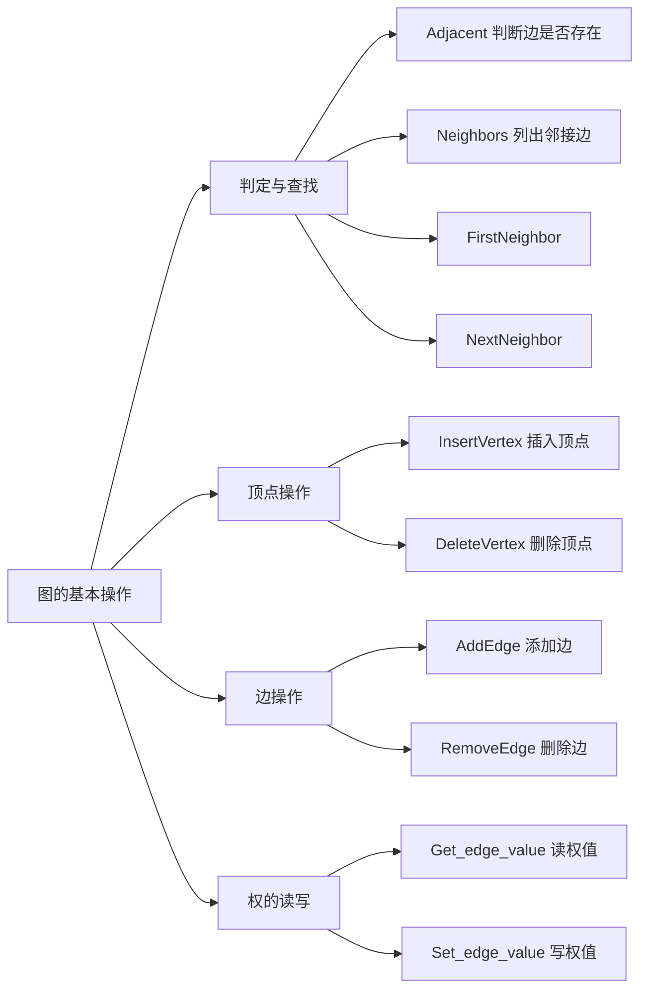

王道课件列出的操作共 **10 个**（6 个核心 + 2 个邻接点 + 2 个权值），含义如下：

| 操作 | 含义 |
| --- | --- |
| `Adjacent(G,x,y)` | 判断图 $G$ 是否存在边 $\langle x,y\rangle$ 或 $(x,y)$ |
| `Neighbors(G,x)` | 列出图 $G$ 中与顶点 $x$ **邻接的边** |
| `InsertVertex(G,x)` | 在图 $G$ 中**插入顶点** $x$ |
| `DeleteVertex(G,x)` | 从图 $G$ 中**删除顶点** $x$ |
| `AddEdge(G,x,y)` | 若无向边 $(x,y)$ 或有向边 $\langle x,y\rangle$ **不存在**，则向图 $G$ 中添加该边 |
| `RemoveEdge(G,x,y)` | 若无向边 $(x,y)$ 或有向边 $\langle x,y\rangle$ **存在**，则从图 $G$ 中删除该边 |
| `FirstNeighbor(G,x)` | 求图 $G$ 中顶点 $x$ 的**第一个邻接点**，有则返回顶点号；若 $x$ 没有邻接点或图中不存在 $x$，则返回 **-1** |
| `NextNeighbor(G,x,y)` | 假设顶点 $y$ 是顶点 $x$ 的一个邻接点，返回**除 $y$ 之外**顶点 $x$ 的**下一个邻接点**的顶点号；若 $y$ 是 $x$ 的最后一个邻接点，则返回 **-1** |
| `Get_edge_value(G,x,y)` | 获取图 $G$ 中边 $(x,y)$ 或 $\langle x,y\rangle$ 对应的**权值** |
| `Set_edge_value(G,x,y,v)` | 设置图 $G$ 中边 $(x,y)$ 或 $\langle x,y\rangle$ 对应的**权值为 $v$** |

> **注意**：`Get_edge_value`、`Set_edge_value` 与 `Adjacent` **雷同，核心都在于"找到边"** —— 找边的代价是多少，读写权值的代价就是多少。因此补一句"找边的复杂度"，这三种操作的复杂度写法完全一致。

#### 2. 本节使用的示例图

后续所有操作对比都以这两张图为例（顶点编号：$A=0,\ B=1,\ C=2,\ D=3,\ E=4,\ F=5$），它们是 **6.2.1 中的那两张图**（无向图 7 条边、有向图 7 条弧），本节只是换了操作视角，图本身没有变。

**无向图** $G=(V,E)$，$\lvert V\rvert=6$，$\lvert E\rvert=7$：

$$E=\{(A,B),(A,C),(A,D),(B,E),(B,F),(C,E),(D,F)\}$$


**有向图** $G_1=(V_1,E_1)$，$\lvert V_1\rvert=6$，$\lvert E_1\rvert=7$：

$$E_1=\{\langle A,B\rangle,\langle C,A\rangle,\langle D,A\rangle,\langle E,B\rangle,\langle E,C\rangle,\langle F,B\rangle,\langle F,D\rangle\}$$


> **与 6.2.1 的一致性**：本节的示例图**就是** 6.2.1 的示例图（无向图 7 条边；有向图 7 条弧，顶点 $B$ **没有出边**，$G_1$ 的邻接矩阵第 $B$ 行全为 0），也是 6.2.2 所说"以 6.2.1 中的有向图为例"的同一张有向图 —— 三节共用一套例子，注意不要凭印象给它多加一条弧 $\langle B,A\rangle$。

**两种存储下这两张图的形态**（对应王道课件原图）：

无向图 $G$ 的邻接矩阵（对称矩阵，7 个 1 所在位置即 7 条边）：

| data | A | B | C | D | E | F |
| --- | --- | --- | --- | --- | --- | --- |
| A | 0 | 1 | 1 | 1 | 0 | 0 |
| B | 1 | 0 | 0 | 0 | 1 | 1 |
| C | 1 | 0 | 0 | 0 | 1 | 0 |
| D | 1 | 0 | 0 | 0 | 0 | 1 |
| E | 0 | 1 | 1 | 0 | 0 | 0 |
| F | 0 | 1 | 0 | 1 | 0 | 0 |

> **对照检查**：矩阵中 $C$ 行只有 $A$、$E$ 两处为 1，即顶点 $C$ **只与 $A$、$E$ 相邻**；$C$ 与 $F$ 之间**没有边**，边集中不应出现 $(C,F)$。

无向图 $G$ 的邻接表（表头数组 + 出边结点，编号为顶点下标）：

| 下标 | data | first | 邻接点序列 |
| --- | --- | --- | --- |
| 0 | A | → | 1 → 2 → 3 → ^ |
| 1 | B | → | 0 → 4 → 5 → ^ |
| 2 | C | → | 0 → 4 → ^ |
| 3 | D | → | 0 → 5 → ^ |
| 4 | E | → | 1 → 2 → ^ |
| 5 | F | → | 1 → 3 → ^ |

有向图 $G_1$ 的邻接矩阵（**非对称**，第 $B$ 行全为 0）：

| data | A | B | C | D | E | F |
| --- | --- | --- | --- | --- | --- | --- |
| A | 0 | 1 | 0 | 0 | 0 | 0 |
| B | 0 | 0 | 0 | 0 | 0 | 0 |
| C | 1 | 0 | 0 | 0 | 0 | 0 |
| D | 1 | 0 | 0 | 0 | 0 | 0 |
| E | 0 | 1 | 1 | 0 | 0 | 0 |
| F | 0 | 1 | 0 | 1 | 0 | 0 |

有向图 $G_1$ 的邻接表（只存**出边**）：

| 下标 | data | first | 出边邻接点序列 |
| --- | --- | --- | --- |
| 0 | A | → | 1 → ^ |
| 1 | B | → | ^（无出边） |
| 2 | C | → | 0 → ^ |
| 3 | D | → | 0 → ^ |
| 4 | E | → | 1 → 2 → ^ |
| 5 | F | → | 1 → 3 → ^ |

> **课件勘误**：课件《图的存储——十字链表、邻接多重表》第 3 页"邻接矩阵、邻接表存储有向图"一处标注有误 —— 该页的**邻接矩阵**被误画成了无向图的**对称矩阵**（$B$ 行 $A$ 列为 1，且 $B$ 行还有 1）。该页的邻接表、以及本节课件的第 4、6、10、14 页都表明有向图只有 **7 条弧**、$B$ 没有任何出边，故**以多数页一致的 7 条弧为准**。

> **关键**：邻接表只保存**出边**。有向图要"找出边"很便宜，要"找入边"必须把**所有**顶点的出边链表扫一遍，因此出现 $O(\lvert E\rvert)$。

**邻接表结点结构**（注意 `next` 是用**头插法**串起来的）：

```c
#define MaxVertexNum 100          // 顶点数目的最大值

typedef struct ArcNode {          // 边表结点
    int adjvex;                   // 该弧指向的顶点编号
    struct ArcNode *next;         // 指向下一条弧的指针
    // InfoType info;             // 网的边权值
} ArcNode;

typedef struct VNode {            // 顶点表结点
    VertexType data;              // 顶点信息
    ArcNode *first;               // 指向第一条依附该顶点的弧
} VNode, AdjList[MaxVertexNum];

typedef struct {                  // 邻接表
    AdjList vertices;             // 顶点表
    int vexnum, arcnum;           // 顶点数、弧数
} ALGraph;

typedef struct {                  // 邻接矩阵
    VertexType vex[MaxVertexNum]; // 顶点表
    EdgeType edge[MaxVertexNum][MaxVertexNum]; // 邻接矩阵（边表）
    int vexnum, arcnum;
} MGraph;
```

#### 3. Adjacent：判断边是否存在

**功能**：判断图 $G$ 中是否存在边 $\langle x,y\rangle$ 或 $(x,y)$。

| 存储结构 | 做法 | 时间复杂度 |
| --- | --- | --- |
| **邻接矩阵** | 直接查看 `edge[x][y]` 是否为 1，**一个数组下标就定位** | $O(1)$ |
| **邻接表** | 顺着 `vertices[x].first` 遍历顶点 $x$ 的整条出边链表，找有没有 `adjvex == y` | $O(1)\sim O(\lvert V\rvert)$ |

```c
// 邻接矩阵：一次随机存取，常数时间
bool Adjacent(MGraph G, int x, int y) {
    return G.edge[x][y] != 0;
}

// 邻接表：最坏要扫完 x 的整条出边链表，链表长度可达 |V|-1
bool Adjacent(ALGraph G, int x, int y) {
    for (ArcNode *p = G.vertices[x].first; p != NULL; p = p->next)
        if (p->adjvex == y)
            return true;
    return false;
}
```

> **理解**：邻接表下"最好 $O(1)$"指的是 $y$ 恰好是 $x$ 的**第一个**邻接点；"最坏 $O(\lvert V\rvert)$"指的是 $y$ 在链表**末尾**或**根本不在表里**（必须走完全程才能判定不存在）。

#### 4. Neighbors：列出所有邻接边

**功能**：列出图 $G$ 中与顶点 $x$ 邻接的边。

**① 无向图**

| 存储结构 | 做法 | 时间复杂度 |
| --- | --- | --- |
| **邻接矩阵** | 扫描第 $x$ **行**（无向图矩阵对称，行即全部邻接关系） | $O(\lvert V\rvert)$ |
| **邻接表** | 遍历顶点 $x$ 的出边链表，链表长度＝$x$ 的度 | $O(1)\sim O(\lvert V\rvert)$ |

**② 有向图**

| 存储结构 | 要列出的边 | 做法 | 时间复杂度 |
| --- | --- | --- | --- |
| **邻接矩阵** | 出边 + 入边 | 扫描第 $x$ **行**得所有出边，扫描第 $x$ **列**得所有入边 | $O(\lvert V\rvert)$ |
| **邻接表** | **出边** | 直接遍历顶点 $x$ 的出边链表 | $O(1)\sim O(\lvert V\rvert)$ |
| **邻接表** | **入边** | 必须遍历**所有**顶点的出边链表，逐个检查是否指向 $x$（邻接表里没有指向 $x$ 的链） | $O(\lvert E\rvert)$ |

```c
// 邻接表：列出 x 的出边（无向图即全部邻接边）
void Neighbors(ALGraph G, int x) {
    for (ArcNode *p = G.vertices[x].first; p != NULL; p = p->next)
        visit(x, p->adjvex);
}

// 邻接表：列出 x 的入边 —— 需要全表扫描
void InNeighbors(ALGraph G, int x) {
    for (int i = 0; i < G.vexnum; i++)
        for (ArcNode *p = G.vertices[i].first; p != NULL; p = p->next)
            if (p->adjvex == x)
                visit(i, x);      // 存在弧 <i, x>
}
```

> **"万一是稀疏图呢？"** —— 王道课件专门抛出这句反问：邻接矩阵固定要扫 $O(\lvert V\rvert)$ 个格子，**哪怕 $x$ 只有 1 个邻接点**；而邻接表在稀疏图里链表很短，实际代价远小于 $\lvert V\rvert$。这就是"稠密图用矩阵、稀疏图用邻接表"的直接理由。

#### 5. InsertVertex：插入顶点

**功能**：在图 $G$ 中插入顶点 $x$（**新顶点孤立，与任何顶点都没有边**）。

| 存储结构 | 做法 | 时间复杂度 |
| --- | --- | --- |
| **邻接矩阵** | 顶点数加 1，把 `edge` 中新增的第 $n$ 行、第 $n$ 列全部置 0 | $O(1)$ |
| **邻接表** | 顶点表末尾追加一项，`data = x`、`first = NULL` | $O(1)$ |

**例**：向无向图 $G$ 插入顶点 $X$（$A\sim F$ 的编号不变，$X$ 编号为 6）：

- 邻接矩阵：新增第 7 行、第 7 列，`edge[6][*]` 与 `edge[*][6]` **全为 0**；
- 邻接表：表头数组新增 `<X, ^>`，**现有 0~5 号顶点的链表一个结点都不变**。

| 操作前（下标 0~5） | 操作后（下标 0~6） |
| --- | --- |
| 表头只有 A B C D E F | 表头追加 X，`first = NULL` |
| A: 1 → 2 → 3 → ^ | A: 1 → 2 → 3 → ^（不变） |

```c
// 邻接矩阵：把新增的一行一列清零
void InsertVertex(MGraph &G, VertexType x) {
    int n = G.vexnum;
    G.vex[n] = x;
    for (int i = 0; i <= n; i++) {
        G.edge[n][i] = 0;         // 第 n 行清零
        G.edge[i][n] = 0;         // 第 n 列清零
    }
    G.vexnum++;
}

// 邻接表：表头追加一项，first 置空
void InsertVertex(ALGraph &G, VertexType x) {
    G.vertices[G.vexnum].data = x;
    G.vertices[G.vexnum].first = NULL;
    G.vexnum++;
}
```

> **有向图也类似**，两者都是 $O(1)$。若用动态数组实现顶点表，**扩容时的搬移**会使单次操作退化，但**均摊**仍是 $O(1)$。

#### 6. DeleteVertex：删除顶点（本节的难点）

**功能**：从图 $G$ 中删除顶点 $x$，**同时要删掉所有依附于 $x$ 的边**。

| 存储结构 | 做法 | 时间复杂度 |
| --- | --- | --- |
| **邻接矩阵** | ① 把第 $x$ **行**清零（删掉 $x$ 的出边/关联边）；② 把第 $x$ **列**清零；③ 该顶点在顶点表中的位置置"空"（**逻辑删除**，后面的顶点编号不动） | $O(\lvert V\rvert)$ |
| **邻接表** | ① 删掉顶点 $x$ 自己的整条出边链表（删 $x$ 的**出边**）；② **遍历其余每一个顶点的出边链表**，把其中所有 `adjvex == x` 的结点删掉（删 $x$ 的**入边**） | $O(1)\sim O(\lvert E\rvert)$ |

**例**（无向图 $G$ 删除顶点 $C$，下标 2）：

| 存储结构 | 删除前 | 删除后 |
| --- | --- | --- |
| 邻接矩阵 | C 行、C 列上都是 1（C 与 A、E 相邻） | C 行、C 列**全置 0**，顶点表中 C 位置记为**"空"** |
| 邻接表（A 的链） | A: 1 → 2 → 3 → ^ | A: 1 → 3 → ^（**删掉 2 号结点**） |
| 邻接表（C 的链） | C: 0 → 4 → ^ | C: ^（**整条链删除**，表头记"空"） |
| 邻接表（E 的链） | E: 1 → 2 → ^ | E: 1 → ^（**删掉 2 号结点**） |
| 邻接表（B、D、F 的链） | B: 0 → 4 → 5 → ^ 等 | 不变（本来就不含 2） |

> **注意**：$C$ 的边链上只有 $0$（A）和 $4$（E）两个结点 —— 这与邻接矩阵中 $C$ 行只有 $A$、$E$ 两个 1 完全对应（$C$ 与 $F$ 不相邻）。

删除前后邻接表的差异（被删掉的结点都是 `adjvex == 2`）：

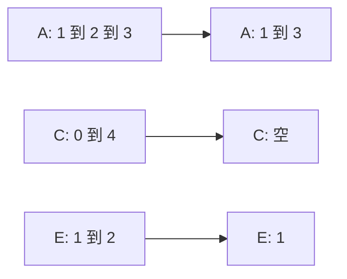

```c
// 邻接矩阵：清掉第 x 行、第 x 列
void DeleteVertex(MGraph &G, int x) {
    for (int i = 0; i < G.vexnum; i++) {
        G.edge[x][i] = 0;         // 第 x 行清零
        G.edge[i][x] = 0;         // 第 x 列清零
    }
    G.vex[x] = EMPTY;             // 逻辑删除，编号不变
    // 若要物理删除，需把 x 之后的顶点整体前移 -> 还得改所有边的编号
}

// 邻接表：删 x 自己的出边链 + 全表清理指向 x 的结点
void DeleteVertex(ALGraph &G, int x) {
    ArcNode *p = G.vertices[x].first;
    while (p != NULL) {                   // ① 释放 x 的出边链表
        ArcNode *q = p;
        p = p->next;
        free(q);
    }
    G.vertices[x].first = NULL;           // 表头置空（逻辑删除）
    for (int i = 0; i < G.vexnum; i++) {  // ② 扫所有顶点的出边链，删入边
        if (i == x) continue;
        ArcNode *pre = NULL, *cur = G.vertices[i].first;
        while (cur != NULL) {
            if (cur->adjvex == x) {       // 找到指向 x 的边
                if (pre == NULL) G.vertices[i].first = cur->next;
                else             pre->next = cur->next;
                ArcNode *q = cur;
                cur = cur->next;
                free(q);
            } else {
                pre = cur;
                cur = cur->next;
            }
        }
    }
}
```

**有向图的邻接表要分两种边**（王道课件专门标注）：

| 要删的边 | 做法 | 时间复杂度 |
| --- | --- | --- |
| 删**出边** | 释放顶点 $x$ 自己的出边链表 | $O(1)\sim O(\lvert V\rvert)$ |
| 删**入边** | 必须遍历**所有**顶点的出边链表，找指向 $x$ 的结点 | $O(\lvert E\rvert)$ |

> **为什么删除顶点在邻接表下更麻烦？**
> 1. **邻接矩阵"删顶点"只是把一行一列清零**，$O(\lvert V\rvert)$ 次赋值就完事；而邻接表要**逐个释放** $x$ 自己的出边结点。
> 2. 更麻烦的是**入边**：邻接表只存出边，**没有任何一条链是指向 $x$ 的**（无向图恰好靠对称性侥幸有，但有向图没有）。要知道"谁连到 $x$"，只能**把全部 $\lvert V\rvert$ 个顶点的出边链表全扫一遍**，代价 $O(\lvert E\rvert)$。
> 3. 若坚持**物理删除**（把后面顶点前移、真正缩小数组），则**所有边结点里保存的顶点编号都要跟着改**，牵一发动全身，通常改为**逻辑删除**（顶点表置"空"，矩阵行列清零）。

#### 7. AddEdge：添加边

**功能**：若无向边 $(x,y)$ 或有向边 $\langle x,y\rangle$ **不存在**，则向图 $G$ 中添加该边。

| 存储结构 | 做法 | 时间复杂度 |
| --- | --- | --- |
| **邻接矩阵** | 令 `edge[x][y] = 1`；**无向图还要令 `edge[y][x] = 1`**（保持对称） | $O(1)$ |
| **邻接表** | 在顶点 $x$ 的出边链表中**头插**一个新结点；无向图还要在 $y$ 的链表中再插一个 | $O(1)$ |

```c
// 邻接矩阵
void AddEdge(MGraph &G, int x, int y) {
    G.edge[x][y] = 1;
    G.edge[y][x] = 1;             // 无向图才有这一句
}

// 邻接表：头插法，O(1)
void AddEdge(ALGraph &G, int x, int y) {
    ArcNode *p = (ArcNode *)malloc(sizeof(ArcNode));
    p->adjvex = y;
    p->next = G.vertices[x].first;    // 插在表头
    G.vertices[x].first = p;
    // 无向图再对称地插一个 (y, x)
}
```

> **注意**：邻接表插入是 $O(1)$，但**前提是不去检查这条边是否已经存在**。若要按定义"先判断不存在再插入"，就得先遍历 $x$ 的链表，整体退化为 $O(1)\sim O(\lvert V\rvert)$。另外，采用**头插法**会改变邻接点的输出顺序 —— 这正是 6.3 节 BFS/DFS **遍历序列不唯一**的原因之一。

#### 8. RemoveEdge：删除边

**功能**：若无向边 $(x,y)$ 或有向边 $\langle x,y\rangle$ **存在**，则从图 $G$ 中删除该边。

| 存储结构 | 做法 | 时间复杂度 |
| --- | --- | --- |
| **邻接矩阵** | 令 `edge[x][y] = 0`；无向图再令 `edge[y][x] = 0` | $O(1)$ |
| **邻接表** | 在 $x$ 的出边链表中**找到 `adjvex == y` 的结点**并摘链、释放；无向图还要在 $y$ 的链表中做一遍 | $O(1)\sim O(\lvert V\rvert)$ |

```c
// 邻接矩阵
void RemoveEdge(MGraph &G, int x, int y) {
    G.edge[x][y] = 0;
    G.edge[y][x] = 0;             // 无向图才有这一句
}

// 邻接表：先找到 y 结点，再摘链
void RemoveEdge(ALGraph &G, int x, int y) {
    ArcNode *pre = NULL, *p = G.vertices[x].first;
    while (p != NULL && p->adjvex != y) {   // 找边
        pre = p;
        p = p->next;
    }
    if (p == NULL) return;                   // 边不存在
    if (pre == NULL) G.vertices[x].first = p->next;
    else             pre->next = p->next;
    free(p);
    // 无向图再对称地删一次 (y, x)
}
```

**有向图的邻接表同样要分两种边**：

| 要删的边 | 做法 | 时间复杂度 |
| --- | --- | --- |
| 删**出边** $\langle x,y\rangle$ | 在 $x$ 自己的出边链表里找 | $O(1)\sim O(\lvert V\rvert)$ |
| 删**入边** $\langle y,x\rangle$ | 遍历所有顶点的出边链表 | $O(\lvert E\rvert)$ |

> **为什么删除边在邻接表下更麻烦？**
> 1. **邻接矩阵"删边"只是两次赋值**（无向图两次、有向图一次），定位靠下标，**和 $x$ 的度完全无关**；
> 2. **邻接表必须先"找"到这条边**：链表的查找是顺序的，$y$ 不在表里（边不存在）时还得走完全程才能下结论，最坏 $O(\lvert V\rvert)$；
> 3. 删除单链表结点还要维护**前驱指针 `pre`**，分"删首结点"和"删中间结点"两种情况，代码明显更繁琐。

#### 9. FirstNeighbor 与 NextNeighbor

这两个操作是 **BFS/DFS 遍历的底层支撑**：`FirstNeighbor` 找遍历起点，`NextNeighbor` 找同一层的下一个分支。

**① `FirstNeighbor(G,x)`：求顶点 $x$ 的第一个邻接点**（无则返回 -1）

| 存储结构 | 做法 | 时间复杂度 |
| --- | --- | --- |
| **邻接矩阵** | 从 `edge[x][0]` 开始**从左往右**扫第 $x$ 行，找到第一个 1 即返回列号 | $O(1)\sim O(\lvert V\rvert)$ |
| **邻接表** | 直接返回 `vertices[x].first->adjvex`（链表空则返回 -1） | $O(1)$ |

**② `NextNeighbor(G,x,y)`：求除 $y$ 之外 $x$ 的下一个邻接点**（$y$ 是最后一个则返回 -1）

| 存储结构 | 做法 | 时间复杂度 |
| --- | --- | --- |
| **邻接矩阵** | 从 `edge[x][y+1]` 开始继续往右扫，找下一个 1 | $O(1)\sim O(\lvert V\rvert)$ |
| **邻接表** | 返回 `y 结点->next->adjvex`（`next` 为空则返回 -1） | $O(1)$ |

```c
// 邻接矩阵
int FirstNeighbor(MGraph G, int x) {
    for (int j = 0; j < G.vexnum; j++)
        if (G.edge[x][j] != 0) return j;   // 找到第一个邻接点
    return -1;
}

int NextNeighbor(MGraph G, int x, int y) {
    for (int j = y + 1; j < G.vexnum; j++)  // 从 y 之后继续找
        if (G.edge[x][j] != 0) return j;
    return -1;
}

// 邻接表
int FirstNeighbor(ALGraph G, int x) {
    if (G.vertices[x].first != NULL) return G.vertices[x].first->adjvex;
    return -1;
}

int NextNeighbor(ALGraph G, int x, int y) {
    ArcNode *p = G.vertices[x].first;
    while (p != NULL && p->adjvex != y) p = p->next;
    if (p != NULL && p->next != NULL) return p->next->adjvex;
    return -1;
}
```

**有向图（邻接表）要区分方向**（王道课件标注）：

| 要找的邻接点 | 做法 | 时间复杂度 |
| --- | --- | --- |
| **出边**邻接点 | 直接用 $x$ 的出边链表的首个/后继结点 | $O(1)$ |
| **入边**邻接点 | 需要全表扫描（或另外建**逆邻接表**） | $O(1)\sim O(\lvert E\rvert)$ |

> **易错**：邻接矩阵下 `NextNeighbor` 的循环必须**从 $y+1$ 开始**，不能从 0 开始 —— 否则会把已经访问过的邻接点又返回一次，遍历时陷入死循环或重复访问。这正是 6.3 节 BFS/DFS 伪代码里"`for (w = FirstNeighbor(...); w >= 0; w = NextNeighbor(...))`"能正常推进的原因。

#### 10. Get_edge_value 与 Set_edge_value

| 操作 | 功能 | 邻接矩阵 | 邻接表 |
| --- | --- | --- | --- |
| `Get_edge_value(G,x,y)` | 获取边 $(x,y)$ 或 $\langle x,y\rangle$ 的**权值** | $O(1)$，直接读 `edge[x][y]` | $O(1)\sim O(\lvert V\rvert)$（先找边） |
| `Set_edge_value(G,x,y,v)` | 设置边 $(x,y)$ 或 $\langle x,y\rangle$ 的**权值为 $v$** | $O(1)$，直接写 `edge[x][y] = v` | $O(1)\sim O(\lvert V\rvert)$（先找边） |

> **本质**：两者与 `Adjacent` **雷同，核心都在于"找到边"**。带权图在邻接表里把权值存在边结点的 `info` 域；在邻接矩阵里直接把 0/1 换成权值（无边用 $\infty$ 或 0 表示）。

#### 11. 10 个操作（12 种情形）的复杂度总表

**说明**：下表共 12 行，对应 **10 个操作** —— 其中 `Neighbors` 因无向图、有向图出边、有向图入边三种情形各占一行，故行数（12）比操作数（10）多 2。

**综合对比**（$x$ 表示被操作的顶点，$y$ 表示另一个顶点）：

| 操作 | 邻接矩阵 | 邻接表 | 关键差异原因 |
| --- | --- | --- | --- |
| `Adjacent(G,x,y)` | $O(1)$ | $O(1)\sim O(\lvert V\rvert)$ | 矩阵一次下标定位；链表需顺序查找 |
| `Neighbors(G,x)`（无向） | $O(\lvert V\rvert)$ | $O(1)\sim O(\lvert V\rvert)$ | 矩阵必须扫整行，链表只扫 $x$ 的度 |
| `Neighbors(G,x)`（有向，出边） | $O(\lvert V\rvert)$ | $O(1)\sim O(\lvert V\rvert)$ | 同上 |
| `Neighbors(G,x)`（有向，入边） | $O(\lvert V\rvert)$ | $O(\lvert E\rvert)$ | 邻接表不存入边，必须全表扫描 |
| `InsertVertex(G,x)` | $O(1)$ | $O(1)$ | 孤立顶点：矩阵新增行列清零，表头追加一项 |
| `DeleteVertex(G,x)` | $O(\lvert V\rvert)$ | $O(1)\sim O(\lvert E\rvert)$ | 矩阵清一行一列；链表要删出边链 + 全表删入边 |
| `AddEdge(G,x,y)` | $O(1)$ | $O(1)$ | 矩阵两次赋值；链表头插一个结点 |
| `RemoveEdge(G,x,y)` | $O(1)$ | $O(1)\sim O(\lvert V\rvert)$ | 矩阵两次赋值；链表要先找到该结点 |
| `FirstNeighbor(G,x)` | $O(1)\sim O(\lvert V\rvert)$ | $O(1)$ | 矩阵扫行找首个 1；链表取首结点 |
| `NextNeighbor(G,x,y)` | $O(1)\sim O(\lvert V\rvert)$ | $O(1)$ | 矩阵从 $y+1$ 继续扫行；链表取后继 |
| `Get_edge_value(G,x,y)` | $O(1)$ | $O(1)\sim O(\lvert V\rvert)$ | 同 `Adjacent` |
| `Set_edge_value(G,x,y,v)` | $O(1)$ | $O(1)\sim O(\lvert V\rvert)$ | 同 `Adjacent` |

**有向图邻接表的方向差异一览**：

| 操作 | 涉及出边 | 涉及入边 |
| --- | --- | --- |
| `Neighbors` | $O(1)\sim O(\lvert V\rvert)$ | $O(\lvert E\rvert)$ |
| `DeleteVertex` | $O(1)\sim O(\lvert V\rvert)$ | $O(\lvert E\rvert)$ |
| `RemoveEdge` / `Adjacent` | $O(1)\sim O(\lvert V\rvert)$ | $O(\lvert E\rvert)$ |
| `FirstNeighbor` / `NextNeighbor` | $O(1)$ | $O(1)\sim O(\lvert E\rvert)$ |

> **补充说明**：若在**有向图**中要**频繁查询入边/入度**，标准做法是额外建立**逆邻接表**（只存入边的邻接表），把"入边"的查询代价从 $O(\lvert E\rvert)$ 降到 $O(1)\sim O(\lvert V\rvert)$；代价是多一份存储（空间仍是 $O(\lvert V\rvert+\lvert E\rvert)$）。第六章 6.2.3 的**十字链表**、6.2.4 的**邻接多重表**就是为这类"既要出边又要入边"的需求设计的。

#### 12. 本节知识回顾

```mermaid
graph LR
    G[图的基本操作] --> A[Adjacent 判断边]
    G --> B[Neighbors 列邻接边]
    G --> C[InsertVertex 插入顶点]
    G --> D[DeleteVertex 删除顶点]
    G --> E[AddEdge 添加边]
    G --> F[RemoveEdge 删除边]
    G --> H[FirstNeighbor]
    G --> I[NextNeighbor]
    G --> J[Get 与 Set 权值]
    A --> A1[矩阵 O1 表 O1 到 OV]
    D --> D1[矩阵 OV 表 OV 到 OE]
    B --> B1[有向图入边 OE]
    H --> H1[遍历的底层支撑]
```

**本节考点**：十个操作的功能定义（`Adjacent` / `Neighbors` / `InsertVertex` / `DeleteVertex` / `AddEdge` / `RemoveEdge` / `FirstNeighbor` / `NextNeighbor` / `Get_edge_value` / `Set_edge_value`）→ **本节示例图与 6.2.1 是同一对图（无向图 7 条边、有向图 7 条弧，$B$ 无出边）** → **邻接矩阵 $O(1)$ 的三种操作（`Adjacent`、`AddEdge`、`RemoveEdge`）** 与邻接表 $O(1)$ 的四种操作（`InsertVertex`、`AddEdge`、`FirstNeighbor`、`NextNeighbor`）→ **`Adjacent`：矩阵 $O(1)$、邻接表 $O(1)\sim O(\lvert V\rvert)$** → `Neighbors`：矩阵固定 $O(\lvert V\rvert)$，邻接表看度，有向图**入边 $O(\lvert E\rvert)$** → **`DeleteVertex`：矩阵 $O(\lvert V\rvert)$、邻接表 $O(1)\sim O(\lvert E\rvert)$（删出边 + 全表删入边）** → **`RemoveEdge`：矩阵 $O(1)$、邻接表 $O(1)\sim O(\lvert V\rvert)$（要先找边、要维护前驱指针）** → `FirstNeighbor` / `NextNeighbor` 是 **BFS/DFS 的底层支撑**（`NextNeighbor` 在矩阵下必须从 $y+1$ 扫起）→ 有向图邻接表**不存入边**，删/查入边都要 $O(\lvert E\rvert)$，需逆邻接表、十字链表、邻接多重表来优化 → 结论：**邻接矩阵适合稠密图与"查边"密集的场景，邻接表适合稀疏图与"列邻接点"密集的场景**。

---

### 6.3.1 图的广度优先遍历

#### 1. 本节知识总览

```mermaid
graph LR
    G[图的遍历] --> A[广度优先遍历 BFS]
    G --> B[深度优先遍历 DFS]
    A --> A1[与树的层序遍历的联系]
    A --> A2[算法实现]
    A --> A3[复杂度分析]
    A --> A4[广度优先生成树]
```

> **一句话本质**：图的广度优先遍历 **BFS**（Breadth-First-Search）就是**树的层序遍历在图上的推广** —— 从某个顶点出发，由近及远，**一层一层**地向外访问所有可达顶点。

#### 2. 与树的广度优先遍历之间的联系

**先回忆树的层序遍历（树的广度优先遍历）**：

1. 若树非空，则**根结点入队**；
2. 若队列非空，**队头元素出队并访问**，同时将该元素的**孩子依次入队**；
3. **重复 ②**，直到队列为空。

例如对下图的树做层序遍历（从 1 号结点出发）：

```mermaid
graph TD
    T1[1] --> T2[2]
    T1 --> T3[3]
    T1 --> T4[4]
    T2 --> T5[5]
    T2 --> T6[6]
    T4 --> T7[7]
    T4 --> T8[8]
```

层序遍历序列：$1,2,3,4,5,6,7,8$。

**树 vs 图**（为什么图的 BFS 要比树多一层考虑）：

| 对比项 | 树 | 图 |
| --- | --- | --- |
| 回路 | **不存在回路** | **可能存在回路** |
| 搜索相邻结点时 | **不可能**搜到已经访问过的结点 | **有可能**搜到已经访问过的**顶点** |
| 办法 | 不需要额外判断 | 必须**标记哪些顶点被访问过**，否则会重复访问、死循环 |

> **结论**：图的 BFS 不能照抄树的层序遍历 —— 必须加一个 **`visited[]` 访问标记数组** 来"防重复"。

#### 3. BFS 的算法要点

**广度优先遍历（Breadth-First-Search, BFS）三个要点**：

1. **找到与一个顶点相邻的所有顶点**；
2. **标记哪些顶点被访问过**（`visited[]` 数组）；
3. **需要一个辅助队列**。

**找邻接点靠两个基本操作**（图的存储结构提供）：

| 操作 | 含义 | 返回值 |
| --- | --- | --- |
| `FirstNeighbor(G, x)` | 求图 $G$ 中顶点 $x$ 的**第一个邻接点** | 若有则返回顶点号；若 $x$ 没有邻接点或图中不存在 $x$，则返回 $-1$ |
| `NextNeighbor(G, x, y)` | 假设图 $G$ 中顶点 $y$ 是顶点 $x$ 的一个邻接点 | 返回**除 $y$ 之外**顶点 $x$ 的**下一个邻接点的顶点号**；若 $y$ 是 $x$ 的最后一个邻接点，则返回 $-1$ |

**访问标记数组**：

```c
bool visited[MAX_VERTEX_NUM];   //访问标记数组，初始都为 false
```

**本小节统一使用的示例图**（8 个顶点的无向图，10 条边）：

```mermaid
graph LR
    V1[1] --- V2[2]
    V1 --- V5[5]
    V2 --- V6[6]
    V6 --- V3[3]
    V6 --- V7[7]
    V3 --- V4[4]
    V3 --- V7
    V4 --- V7
    V4 --- V8[8]
    V7 --- V8
```

**邻接矩阵**（无向图，行、列均为 $1\sim 8$；矩阵**对称**）：

| 顶点 | 1 | 2 | 3 | 4 | 5 | 6 | 7 | 8 |
| --- | --- | --- | --- | --- | --- | --- | --- | --- |
| **1** | 0 | 1 | 0 | 0 | 1 | 0 | 0 | 0 |
| **2** | 1 | 0 | 0 | 0 | 0 | 1 | 0 | 0 |
| **3** | 0 | 0 | 0 | 1 | 0 | 1 | 1 | 0 |
| **4** | 0 | 0 | 1 | 0 | 0 | 0 | 1 | 1 |
| **5** | 1 | 0 | 0 | 0 | 0 | 0 | 0 | 0 |
| **6** | 0 | 1 | 1 | 0 | 0 | 0 | 1 | 0 |
| **7** | 0 | 0 | 1 | 1 | 0 | 1 | 0 | 1 |
| **8** | 0 | 0 | 0 | 1 | 0 | 0 | 1 | 0 |

**邻接表**（本节演示统一采用该顺序）：

| 顶点 | 邻接点链 |
| --- | --- |
| 1 | 2 → 5 |
| 2 | 1 → 6 |
| 3 | 4 → 6 → 7 |
| 4 | 3 → 7 → 8 |
| 5 | 1 |
| 6 | 2 → 3 → 7 |
| 7 | 3 → 4 → 6 → 8 |
| 8 | 4 → 7 |

#### 4. `visited[]` 的作用：为什么必须有它

| 问题 | 不加 `visited[]` 的后果 | 加了 `visited[]` 之后 |
| --- | --- | --- |
| 图中的**回路**会把已经访问过的顶点再送进队列 | 同一个顶点被反复入队，**访问序列重复**，队列**永不空**（死循环） | 只有 `!visited[w]` 的邻接点才入队，**每个顶点最多入队一次** |
| 同层顶点可能通过多条边指向同一个未访问顶点 | 该顶点被多次入队、多次访问 | 第一次被访问时立刻置 `true`，之后一概跳过 |
| 需要统计"还剩哪些顶点没访问" | 无法判断 | 可由 `visited[]` 直接看出，是 `BFSTraverse` 轮询的依据 |

**要点（易错）**：

- `visited[]` **初始全部为 `false`**，且**一次遍历过程中只初始化一次**（在 `BFSTraverse` 里统一初始化，不能放进 `BFS` 函数内部，否则每次调用都会被清空）；
- **"访问"和"标记"必须同时发生**：课件里是 `visit(w); visited[w]=TRUE; Enqueue(Q,w);` 三连 —— **入队时就要标记**，而不是出队时才标记。若等到出队才标记，同一顶点可能被多个已访问顶点重复入队，虽然不会错，但会浪费队列空间、且不再是标准写法；
- 有了 `visited[]`，每个顶点**至多入队一次、至多出队一次**，这是 BFS 复杂度分析的基础。

#### 5. BFS 伪代码

**核心函数（从顶点 $v$ 出发遍历其所在连通分量）**：

```c
bool visited[MAX_VERTEX_NUM];   //访问标记数组，初始都为 false

//广度优先遍历
void BFS(Graph G, int v){       //从顶点v出发，广度优先遍历图G
    visit(v);                   //访问初始顶点v
    visited[v]=TRUE;            //对v做已访问标记
    Enqueue(Q,v);               //顶点v入队列Q
    while(!isEmpty(Q)){
        DeQueue(Q,v);           //顶点v出队列
        for(w=FirstNeighbor(G,v); w>=0; w=NextNeighbor(G,v,w))
            //检测v所有邻接点
            if(!visited[w]){    //w为v的尚未访问的邻接顶点
                visit(w);       //访问顶点w
                visited[w]=TRUE;//对w做已访问标记
                Enqueue(Q,w);   //顶点w入队列
            }//if
    }//while
}
```

**完整版（`BFSTraverse`，可处理非连通图）**：

```c
bool visited[MAX_VERTEX_NUM];   //访问标记数组
void BFSTraverse(Graph G){      //对图G进行广度优先遍历
    for(i=0; i<G.vexnum; ++i)
        visited[i]=FALSE;       //访问标记数组初始化
    InitQueue(Q);               //初始化辅助队列Q
    for(i=0; i<G.vexnum; ++i)   //从0号顶点开始遍历
        if(!visited[i])         //对每个连通分量调用一次BFS
            BFS(G,i);           //vi未访问过，从vi开始BFS
}
```

> **易错点**：`BFS` 函数里那个 `for` 循环的写法 `for(w=FirstNeighbor(G,v); w>=0; w=NextNeighbor(G,v,w))` —— 循环变量 `w` 既是"当前邻接点"，又是 `NextNeighbor` 的参数（靠它推进到下一个邻接点）；终止条件是 `w>=0`（返回 $-1$ 表示没有下一个邻接点）。

#### 6. 逐帧演示：从顶点 1 出发的 BFS 过程

**演示所用邻接表顺序**：$1:2,5$；$2:1,6$；$3:4,6,7$；$4:3,7,8$；$5:1$；$6:2,3,7$；$7:3,4,6,8$；$8:4,7$。

**读表约定**：本表按本节规定的 **"入队时立即标记"** 执行，所以 **`visited[]` 列 = 截至该步已"被发现（入队）"的顶点集合**，它比"已出队访问的顶点"**超前一步**；表中的"访问序列"列则只记录**已经出队访问过**的顶点。例如第 ④ 步处理 6 时把 3、7 入队，`visited` 立刻变成 $\{1,2,3,5,6,7\}$，而 3、7 要到第 ⑤、⑥ 步才真正出队。

| 步骤 | 访问（出队）顶点 | 本次新入队的邻接点 | 队列内容（队头 → 队尾） | 访问序列（累计） | `visited[]` 为 true 的顶点 |
| --- | --- | --- | --- | --- | --- |
| 初始化 | — | — | 空 | — | 无（全 false） |
| ① | 1 | 2, 5 | 2, 5 | 1 | 1, 2, 5 |
| ② | 2 | 6（1 已访问） | 5, 6 | 1, 2 | 1, 2, 5, 6 |
| ③ | 5 | 无（1 已访问） | 6 | 1, 2, 5 | 1, 2, 5, 6 |
| ④ | 6 | 3, 7（2 已访问） | 3, 7 | 1, 2, 5, 6 | 1, 2, 3, 5, 6, 7 |
| ⑤ | 3 | 4（6、7 已访问） | 7, 4 | 1, 2, 5, 6, 3 | 1, 2, 3, 4, 5, 6, 7 |
| ⑥ | 7 | 8（3、4、6 已访问） | 4, 8 | 1, 2, 5, 6, 3, 7 | 1 ~ 8 全为 true |
| ⑦ | 4 | 无（3、7、8 均已访问） | 8 | 1, 2, 5, 6, 3, 7, 4 | 1 ~ 8 全为 true |
| ⑧ | 8 | 无（4、7 已访问） | **空** | 1, 2, 5, 6, 3, 7, 4, 8 | 1 ~ 8 全为 true |

**队列内容的逐帧变化**（对应课件动画每一帧）：

| 帧（对应上表步骤） | 队列（左端为队头） |
| --- | --- |
| ① 访问 1：1 出队、2 与 5 入队 | `2, 5` |
| ② 访问 2：2 出队、6 入队 | `5, 6` |
| ③ 访问 5：5 出队、无新入队 | `6` |
| ④ 处理 6：6 出队、3 与 7 入队 | `3, 7` |
| ⑤ 处理 3：3 出队、4 入队 | `7, 4` |
| ⑥ 处理 7：7 出队、8 入队 | `4, 8` |
| ⑦ 处理 4：4 出队、无新入队 | `8` |
| ⑧ 处理 8：8 出队、无新入队 | **空**（BFS 结束） |

> **课件动画的另一类画面**：动画还给出了"队列里同时存着多个已发现、待处理顶点"的帧，例如队列为 `2, 1, 6, 5, 3, 7` 的那一帧 —— 它对应"已发现 $\{1,2,3,5,6,7\}$、正在处理队头那个顶点"的中间状态，此时 4、8 尚未入队（`visited[4]=visited[8]=false`）。注意课件这一帧是**按"发现（入队）顺序"把已发现顶点排成一行**，并非 `BFS` 算法里那个"待处理队列"；按标准队列语义，此刻真正的待处理队列应为 `5, 6, 3, 7`（1、2 早已出队，每个顶点至多入队、出队一次）。

> **结论**：**从顶点 1 出发得到的广度优先遍历序列为 $1,2,5,6,3,7,4,8$**。
>
> **注意**：这一序列**不是唯一的**！换成另一种邻接表顺序（例如把 2 号顶点的邻接点链改成 `6 → 1`），同样的算法会得到 $2,6,1,\dots$ 这样不同的序列 —— 详见第 7 节。

**从顶点 3 出发**的广度优先遍历序列（同一邻接表顺序）：

$$3,\ 4,\ 6,\ 7,\ 8,\ 2,\ 1,\ 5$$

**逐层理解**（"一层一层由近及远"）：

| 层（到起点的距离） | 从 1 出发 | 从 3 出发 |
| --- | --- | --- |
| 第 0 层 | 1 | 3 |
| 第 1 层 | 2, 5 | 4, 6, 7 |
| 第 2 层 | 6 | 8, 2 |
| 第 3 层 | 3, 7 | 1 |
| 第 4 层 | 4, 8 | 5 |

> **重要性质**：BFS 的访问是**按"到起点的边数（距离）"严格分层的** —— 这直接支撑了"**BFS 求无权图单源最短路径**"的结论（见第 13 节）。

#### 7. 遍历序列的可变性：为什么 BFS 序列不唯一

课件用**同一个图、两种存储方式**做了对比：

| 存储结构 | 表示是否唯一 | 遍历序列是否唯一 | 原因 |
| --- | --- | --- | --- |
| **邻接矩阵** | **唯一** | **唯一** | 顶点编号一旦确定，矩阵就唯一确定，`FirstNeighbor`/`NextNeighbor` 的推进顺序被固定 |
| **邻接表** | **不唯一** | **不唯一** | 各顶点的邻接点链表中，**边结点的顺序可以任意**（谁先谁后都能表示同一个图） |

**例（同一张图，两种邻接表，得到两个不同的 BFS 序列，均从顶点 2 出发）**：

| 方案 | 2 号顶点的邻接点链 | 从 2 出发的 BFS 序列 |
| --- | --- | --- |
| 邻接表 A | 2 → **1** → 6 | $2,1,6,5,3,7,4,8$ |
| 邻接表 B | 2 → **6** → 1 | $2,6,1,3,7,5,4,8$ |

推导（方案 B）：出队 2 → 入队 6, 1（队 `6,1`）；出队 6 → 入队 3, 7（队 `1,3,7`）；出队 1 → 入队 5（队 `3,7,5`）；出队 3 → 入队 4（队 `7,5,4`）；出队 7 → 入队 8（队 `5,4,8`）；依次出队 5、4、8，无新入队。

> **课件原话**：同一个图的**邻接矩阵表示方式唯一**，因此广度优先遍历序列**唯一**；同一个图**邻接表表示方式不唯一**，因此广度优先遍历序列**不唯一**。

#### 8. 非连通图的处理：`BFSTraverse` 的顶点轮询

**问题**：上一节的 `BFS(G, v)` **只能遍历顶点 $v$ 所在的连通分量**。若图是非连通的（例如下图在 $1\sim 8$ 之外还有 $9,10,11$ 构成的另一个连通分量），只调用一次 `BFS` **无法遍历完所有顶点**。

> **注意**：下图中 $1\sim8$ 是一个连通分量，$9\sim11$ 是另一个连通分量。下图的 $1\sim8$ 分量就是第 3 节那张示例图（10 条边：$(1,2)$、$(1,5)$、$(2,6)$、$(3,6)$、$(3,7)$、$(4,7)$、$(4,8)$、$(6,7)$、$(7,8)$，无向图无向边各计一条），此处一并画出，便于对照 `visited[]` 的变化。

```mermaid
graph LR
    A1[1] --- A2[2]
    A1 --- A5[5]
    A2 --- A6[6]
    A6 --- A3[3]
    A6 --- A7[7]
    A3 --- A4[4]
    A3 --- A7
    A4 --- A7
    A4 --- A8[8]
    A7 --- A8
    B9[9] --- B10[10]
    B9 --- B11[11]
    B10 --- B11
```

**解决办法**：把"初始化 + 外层轮询"抽出来成为 `BFSTraverse(G)`：

```c
bool visited[MAX_VERTEX_NUM];   //访问标记数组
void BFSTraverse(Graph G){      //对图G进行广度优先遍历
    for(i=0; i<G.vexnum; ++i)
        visited[i]=FALSE;       //访问标记数组初始化
    InitQueue(Q);               //初始化辅助队列Q
    for(i=0; i<G.vexnum; ++i)   //从0号顶点开始遍历
        if(!visited[i])         //对每个连通分量调用一次BFS
            BFS(G,i);           //vi未访问过，从vi开始BFS
}
```

**执行过程**（对上面的非连通图，顶点编号 $1\sim 11$，即数组下标 $0\sim 10$ 对应的编号）：

| 轮次 | 外层 `for` 扫到的顶点 | `visited` 状态 | 是否调用 `BFS` | 本次 `BFS` 覆盖的顶点 |
| --- | --- | --- | --- | --- |
| 第 1 次 | 1 | false | **调用 `BFS(G,1)`** | 1, 2, 5, 6, 3, 7, 4, 8 |
| 第 2 次 | 2 ~ 8 | 已为 true | 跳过 | — |
| 第 3 次 | 9 | false | **调用 `BFS(G,9)`** | 9, 10, 11 |
| 第 4 次 | 10, 11 | 已为 true | 跳过 | — |

最终 `visited[]`：$1\sim 11$ **全部为 true**（课件最后一帧即为全 true）。

> **核心结论（必背）**：对于**无向图**，**调用 `BFS` 函数的次数 = 连通分量数**。
>
> **有向图不能这样类比**：有向图里 `BFS` 只能**顺弧**扩展，调用次数取决于**弧的方向**与**顶点扫描顺序**，同一张图可能一次遍历不完，**最坏可达 $\lvert V\rvert$ 次**（每个顶点都没有指向未访问顶点的弧，扫描到谁就从谁重新起一次），**绝不能**等同于强连通分量数。详见第 11 节的有向图练习。

#### 9. 广度优先生成树

**定义**：在**连通图**中，由**广度优先遍历过程**（即"从哪个顶点扩展到了哪个顶点"）确定的树，称为**广度优先生成树**（BFS 生成树）。

**构造规则**：`BFS` 中每执行一次"`if(!visited[w])` 成立 → 访问 `w` → 入队 `w`"，就相当于在生成树里**加一条边（`v`, `w`）**，其中 `v` 是当前**出队的顶点**（即 `w` 的"父亲"）。

**例：从顶点 2 出发，对上文示例图求广度优先生成树**

按邻接表 $2:1,6$；$1:2,5$；$6:2,3,7$；$3:4,6,7$；$7:3,4,6,8$；$4:3,7,8$；$8:4,7$ 的顺序：

| 步骤 | 出队顶点 $v$ | 新访问（入队）的 $w$ | 加入生成树的边 |
| --- | --- | --- | --- |
| ① | 2（起点） | 1, 6 | (2,1)、(2,6) |
| ② | 1 | 5 | (1,5) |
| ③ | 6 | 3, 7 | (6,3)、(6,7) |
| ④ | 5 | — | — |
| ⑤ | 3 | 4 | (3,4) |
| ⑥ | 7 | 8 | (7,8) |
| ⑦ | 4 | — | — |
| ⑧ | 8 | — | — |

生成树共 **$7$ 条边**（$8$ 个顶点，$n-1=7$）；**BFS 访问序列为 $2,1,6,5,3,7,4,8$**。

```mermaid
graph TD
    N2[2] --> N1[1]
    N2 --> N6[6]
    N1 --> N5[5]
    N6 --> N3[3]
    N6 --> N7[7]
    N3 --> N4[4]
    N7 --> N8[8]
```

**"生成树不唯一"的对照**：若把 6 号顶点的邻接点链改成 `2 → 7 → 3`，则 7 先于 3 被访问，出队 7 时 4、8 都还没被访问，生成树变为（访问序列 $2,1,6,5,7,3,8,4$）：

```mermaid
graph TD
    M2[2] --> M1[1]
    M2 --> M6[6]
    M1 --> M5[5]
    M6 --> M7[7]
    M6 --> M3[3]
    M7 --> M4[4]
    M7 --> M8[8]
```

> **课件原话**：广度优先生成树**由广度优先遍历过程确定**。由于**邻接表的表示方式不唯一**，因此**基于邻接表的广度优先生成树也不唯一**。
>
> **对照**：若图是用**邻接矩阵**存储的，则**广度优先生成树唯一**。

**"第 $k$ 层"的含义**：在广度优先生成树上，顶点所在的**层数**恰好等于该顶点到根的**最短路径长度（边数）** —— 这正是 BFS 能够"求单源最短路径"的原因。

#### 10. 广度优先生成森林

**定义**：对**非连通图**进行广度优先遍历，每个连通分量各得到一棵广度优先生成树，这些树合起来构成**广度优先生成森林**。

**例**（对上面的两分量非连通图，从顶点 2 出发遍历第一个分量、再轮询到 9 遍历第二个分量）：

```mermaid
graph TD
    F2[2] --> F1[1]
    F2 --> F6[6]
    F1 --> F5[5]
    F6 --> F3[3]
    F6 --> F7[7]
    F3 --> F4[4]
    F7 --> F8[8]
    F9[9] --> F11[11]
    F9 --> F10[10]
```

> **要点**：森林中**树的棵数 = 连通分量的个数 = `BFS` 函数被调用的次数**（此等式**只对无向图**成立）。

#### 11. 有向图的 BFS（练习）

**题目**：给定有向图 $G$，其弧集为

$$1\to5,\quad 2\to1,\quad 3\to6,\quad 4\to3,\quad 4\to7,\quad 6\to2,\quad 7\to3,\quad 7\to6,\quad 7\to8,\quad 8\to4$$

（共 8 个顶点、10 条弧。）问：

1. 从顶点 1 出发，需要调用几次 `BFS` 函数？
2. 从顶点 7 出发，需要调用几次 `BFS` 函数？

**邻接矩阵**（**约定：行 = 起点（弧尾），列 = 终点（弧头）**；第 $i$ 行第 $j$ 列为 $1$ 表示存在弧 $i\to j$）：

| 起点 \ 终点 | 1 | 2 | 3 | 4 | 5 | 6 | 7 | 8 |
| --- | --- | --- | --- | --- | --- | --- | --- | --- |
| **1** | 0 | 0 | 0 | 0 | 1 | 0 | 0 | 0 |
| **2** | 1 | 0 | 0 | 0 | 0 | 0 | 0 | 0 |
| **3** | 0 | 0 | 0 | 0 | 0 | 1 | 0 | 0 |
| **4** | 0 | 0 | 1 | 0 | 0 | 0 | 1 | 0 |
| **5** | 0 | 0 | 0 | 0 | 0 | 0 | 0 | 0 |
| **6** | 0 | 1 | 0 | 0 | 0 | 0 | 0 | 0 |
| **7** | 0 | 0 | 1 | 0 | 0 | 1 | 0 | 1 |
| **8** | 0 | 0 | 0 | 1 | 0 | 0 | 0 | 0 |

> **由邻接矩阵反推弧集**（按同一"行 = 起点"的读法）：第 1 行只有第 5 列为 1 → $1\to5$；第 2 行只有第 1 列 → $2\to1$；第 3 行只有第 6 列 → $3\to6$；第 4 行第 3、7 列 → $4\to3$、$4\to7$；第 6 行只有第 2 列 → $6\to2$；第 7 行第 3、6、8 列 → $7\to3$、$7\to6$、$7\to8$；第 8 行只有第 4 列 → $8\to4$。这与题给弧集**完全一致**（共 10 条弧；第 5 行全 0，说明顶点 5 没有出边，是个"汇"）。
>
> **易错**：一旦把读法换成"行 = 终点"，同一张矩阵会读出**转置**的那套弧（$5\to1$、$1\to2$、$6\to3$、$3\to4$、$7\to4$、$3\to7$、$6\to7$、$8\to7$、$4\to8$），结论也会随之改变。所以"行是起点还是终点"必须**先声明、且全节统一**。

**邻接表**（只存**出边**；同一顶点的多条出边可任意排序，这里按弧集给出的顺序）：

| 顶点 | 出边邻接点链 |
| --- | --- |
| 1 | 5 |
| 2 | 1 |
| 3 | 6 |
| 4 | 3 → 7 |
| 5 | 无 |
| 6 | 2 |
| 7 | 3 → 6 → 8 |
| 8 | 4 |

**解**：

先算各顶点的可达集（只沿弧的方向走）：

| 起点 | 可达顶点集合 | 追踪 |
| --- | --- | --- |
| 1 | 1, 5 | $1\to5$；5 无出边 |
| 2 | 1, 2, 5 | $2\to1\to5$ |
| 3 | 1, 2, 3, 5, 6 | $3\to6\to2\to1\to5$ |
| 4 | 1, 2, 3, 4, 5, 6, 7, 8 | $4\to3$、$4\to7$；$7\to3,6,8$；$6\to2$；$8\to4$；$2\to1$；$1\to5$ |
| 5 | 5 | 无出边 |
| 6 | 1, 2, 5, 6 | $6\to2\to1\to5$ |
| 7 | 1, 2, 3, 5, 6, 7, 8 | $7\to3,6,8$；$6\to2$；$3\to6$；$2\to1$；$1\to5$；$8\to4$；$4\to3,7$ |
| 8 | 1, 2, 3, 4, 5, 6, 7, 8 | $8\to4$，再取 4 的可达集 |

**第 1 问：从顶点 1 出发**

`BFSTraverse` 是**先初始化 `visited`、再按编号 $1,2,3,\dots,8$ 轮询**。所谓"从顶点 1 出发"，就是让外层 `for` 的第 1 次命中 `if(!visited[i])` 落在编号 1 上，即**第一次 `BFS` 的起点是 1**；之后轮询继续走完 $2\sim 8$。

| 顺序 | 触发的调用 | 本次覆盖的顶点 | 说明 |
| --- | --- | --- | --- |
| 第 1 次 | `BFS(G,1)` | 1, 5 | $1\to5$；$5$ 无出边 |
| 第 2 次 | `BFS(G,2)` | 2 | 轮询到 2 时仍未访问；$2\to1$ 但 1 已访问，故只覆盖自己 |
| 第 3 次 | `BFS(G,3)` | 3, 6 | $3\to6$；$6\to2$ 但 2 已访问 |
| 第 4 次 | `BFS(G,4)` | 4, 3, 7, 6, 8 | $4\to3$、$4\to7$；$7\to6,8$；$6\to2$（已访问）；$8\to4$（已访问）；$3$ 已访问 |

共 **4 次**。

**第 2 问：从顶点 7 出发**

按字面含义，"从 7 出发"就是**让第一次调用 `BFS` 的起点是 7**，之后继续按编号 $1,2,\dots,8$ 轮询。从 7 出发的可达范围如下：

| 步骤 | 过程（队列语义） | 已访问 |
| --- | --- | --- |
| `BFS(G,7)` | 访问 7 → 邻接点 3、6、8 入队；出队 3（$3\to6$ 已访问）；出队 6（$6\to2$，访问 2）；出队 8（$8\to4$，访问 4）；出队 2（$2\to1$，访问 1）；出队 4（$4\to3,7$ 均已访问）；出队 1（$1\to5$，访问 5） | 7, 3, 6, 8, 2, 4, 1, 5 —— **全部 8 个** |

一次 `BFS(7)` 就覆盖了全部 8 个顶点，外层轮询再扫 $1\sim8$ 时**全都已访问**，不会再触发新的调用。

> **解**：从顶点 1 出发需调用 `BFS` **4 次**（$\{1,5\}$｜$\{2\}$｜$\{3,6\}$｜$\{4,7,8\}$）；从顶点 7 出发**只需 1 次**（`BFS(7)` 一次覆盖全部 8 个顶点）。
>
> **为什么差别这么大**：有向图只能**顺弧**走。1 的出弧只有 $1\to5$，而 5 没有出弧，$\{1,5\}$ 就走不动了；能进入 7 的只有 $4\to7$，偏偏 4 自己没有入弧（只能等 8 发现它），于是 $\{2\}$、$\{3,6\}$、$\{4,7,8\}$ 被迫各占一轮。反过来，7 的出弧是 $3、6、8$，再由 $6\to2$、$2\to1$、$1\to5$、$8\to4$ 一路铺开，**一次就能收全**。
>
> **一个必须分清的读法**：若把"从 7 出发"曲解成"外层 `for` 仍从编号 1 开始轮询"，会数出 $1,2,3,4$ 各触发一次共 4 次，而且 `BFS(7)` **根本不会被调用**——那答的是"按编号从 1 开始轮询要几次"，不是本题问的"从 7 出发要几次"。

> **易错（必记）**：
>
> 1. 有向图的 BFS **只能顺弧走**，绝不能逆着弧走；
> 2. "从某个顶点出发要调用几次"要**先算该起点的可达集**：可达集越大、需要的调用越少（本例从 7 出发可达全部顶点，故只需 1 次）；**不要**机械地按"外层 `for` 从编号 1 开始"去数——那样数出来的是"按编号轮询要几次"，答非所问；
> 3. **不能**用"强连通分量数""连通分量数"去套有向图：同一张有向图，换一个起点、换一种顶点扫描顺序，答案都会变，最坏可达 $\lvert V\rvert$ 次。

#### 12. 复杂度分析

**空间复杂度**：

| 对象 | 规模 | 说明 |
| --- | --- | --- |
| 辅助队列 | 最坏 $O(\lvert V\rvert)$ | 最坏情况（如以 1 号顶点为中心的"星形"图）所有顶点**同层**，队列里同时存放 $O(\lvert V\rvert)$ 个顶点 |
| `visited[]` 数组 | $O(\lvert V\rvert)$ | 每个顶点一个标记位 |

$$\text{空间复杂度}=O(\lvert V\rvert)$$

**时间复杂度 = "访问顶点的时间" + "找邻接点（遍历边）的时间"**，与**图的存储结构**有关：

| 存储结构 | 访问 $\lvert V\rvert$ 个顶点 | 查找各顶点的邻接点 | 总时间复杂度 |
| --- | --- | --- | --- |
| **邻接矩阵** | $O(\lvert V\rvert)$ | 每个顶点都要扫描一整行，$O(\lvert V\rvert)$，共 $\lvert V\rvert$ 个顶点 | $O(\lvert V\rvert^2)$ |
| **邻接表** | $O(\lvert V\rvert)$ | 所有顶点的邻接点链表长度之和为 $O(\lvert E\rvert)$ | $O(\lvert V\rvert+\lvert E\rvert)$ |

> **记忆要点**：**邻接矩阵**存储的图 → BFS 时间 $O(\lvert V\rvert^2)$；**邻接表**存储的图 → BFS 时间 $O(\lvert V\rvert+\lvert E\rvert)$。
>
> 这与 DFS 的复杂度结论**完全一致**：遍历算法的复杂度**只取决于存储结构**，不取决于遍历顺序（BFS/DFS）。

**结论对照表**：

| 算法 | 邻接矩阵 | 邻接表 | 空间 |
| --- | --- | --- | --- |
| **BFS**（广度优先遍历） | $O(\lvert V\rvert^2)$ | $O(\lvert V\rvert+\lvert E\rvert)$ | $O(\lvert V\rvert)$ |
| DFS（深度优先遍历） | $O(\lvert V\rvert^2)$ | $O(\lvert V\rvert+\lvert E\rvert)$ | $O(\lvert V\rvert)$ |

#### 13. BFS 求无权图的单源最短路径（引入）

**为什么 BFS 能求最短路？** 因为 BFS 是**按"到起点的边数"逐层访问**的：**第 $k$ 层被访问到的顶点，其到起点的最短路径长度恰好为 $k$**。

**例**（上文示例图，从顶点 2 出发）：

| 顶点 | 1 | 2 | 3 | 4 | 5 | 6 | 7 | 8 |
| --- | --- | --- | --- | --- | --- | --- | --- | --- |
| $d$（到 2 的最短边数） | 1 | 0 | 2 | 3 | 2 | 1 | 2 | 3 |
| 最短路径（举例） | $2\to1$ | — | $2\to6\to3$ | $2\to6\to3\to4$ | $2\to1\to5$ | $2\to6$ | $2\to6\to7$ | $2\to6\to7\to8$ |

**做法**：在 BFS 的基础上，额外用一个数组 `d[]` 记录"到起点的距离"，一个数组 `path[]` 记录"前驱顶点"。

```c
bool visited[MAX_VERTEX_NUM];
int  d[MAX_VERTEX_NUM];      //d[i] 表示从起点到顶点 i 的最短路径长度（边数）
int  path[MAX_VERTEX_NUM];   //path[i] 表示顶点 i 在最短路径上的前驱顶点

void BFS_MIN_Distance(Graph G, int u){  //从顶点u出发，求到其他顶点的最短路径
    for(i=0; i<G.vexnum; ++i){
        d[i]=INFINITY;       //初始化路径长度，INFINITY 表示"不可达"
        path[i]=-1;          //初始化前驱为"无"
    }
    d[u]=0;                  //起点到自己距离为0
    visited[u]=TRUE;
    Enqueue(Q,u);
    while(!isEmpty(Q)){
        DeQueue(Q,u);
        for(w=FirstNeighbor(G,u); w>=0; w=NextNeighbor(G,u,w))
            if(!visited[w]){        //w为u的尚未访问的邻接顶点
                d[w]=d[u]+1;        //路径长度加1
                path[w]=u;          //最短路径应从u到w
                visited[w]=TRUE;
                Enqueue(Q,w);
            }//if
    }//while
}
```

> **注意**：这一做法**只适用于无权图**（或所有边权都相等）—— 因为它把"边数"当成了"路径长度"。**带权图的最短路径**要用 Dijkstra（$O(\lvert V\rvert^2)$）/ Floyd 算法，见后面 6.4 节。
>
> **若 $u$ 到 $w$ 不可达**，则 $d[w]$ 保持 $\infty$（`INFINITY`），`path[w]` 保持 $-1$。（有向图中"不可达"非常常见：如第 11 节的弧集里，$7$ 到不了 $1,2,5$。）

#### 14. 本节易错点小结

| 易错点 | 正确做法 |
| --- | --- |
| `visited[]` 放在 `BFS` 函数里初始化 | 必须放在 **`BFSTraverse`** 里初始化，全程只有一次 |
| 出队时才标记 `visited` | 应**入队时立即标记**：`visit(w); visited[w]=TRUE; Enqueue(Q,w);` |
| 认为 BFS 序列唯一 | **邻接矩阵唯一 → 序列唯一；邻接表不唯一 → 序列不唯一** |
| 用 `BFS(G,v)` 遍历非连通图 | 必须用 **`BFSTraverse`** 外层轮询 `if(!visited[i]) BFS(G,i);` |
| 调用次数 | 无向图：**`BFS` 调用次数 = 连通分量数**；**有向图取决于弧的方向与顶点扫描顺序**，最坏 $\lvert V\rvert$ 次，**不能**等同于强连通分量数 |
| 矩阵读法混用 | 有向图邻接矩阵必须先声明 **"行 = 起点（弧尾）、列 = 终点（弧头）"**，全节统一；换成"行 = 终点"会读到转置后的一整套弧 |
| `for` 循环边界 | `for(w=FirstNeighbor(G,v); w>=0; w=NextNeighbor(G,v,w))` —— 终止条件 `w>=0` |
| 复杂度混淆 | 邻接矩阵 $O(\lvert V\rvert^2)$；邻接表 $O(\lvert V\rvert+\lvert E\rvert)$；空间恒为 $O(\lvert V\rvert)$ |
| 生成树边数 | $n$ 个顶点的连通图，广度优先生成树必为 **$n-1$ 条边** |
| 用 BFS 求带权图最短路 | **不行**，BFS 只解决**无权图**（边权相等）的单源最短路径 |

**本节考点**：树的层序遍历是 BFS 的原型（但图有回路，**必须用 `visited[]` 防重复**）→ BFS 三大要点（找邻接点 `FirstNeighbor`/`NextNeighbor`、`visited[]` 标记、**辅助队列**）→ 伪代码（`BFS` 核心 + **`BFSTraverse` 轮询**，注意**入队即标记**、`visited` 在 `BFSTraverse` 里初始化）→ **逐帧队列过程与访问序列**（从 1 出发 $1,2,5,6,3,7,4,8$；从 3 出发 $3,4,6,7,8,2,1,5$）→ **遍历序列可变性**（邻接矩阵唯一→序列唯一；邻接表不唯一→序列不唯一）→ **非连通图**：`BFSTraverse` 对所有顶点轮询，**无向图 `BFS` 调用次数 = 连通分量数** → **有向图必须顺弧走**，调用次数随起点与扫描顺序变化（第 11 节练习：即便 8 个顶点全可达，答案也不是 1）→ **广度优先生成树**（由遍历过程确定、邻接表存储时不唯一、$n-1$ 条边）与**广度优先生成森林** → 复杂度：邻接矩阵 $O(\lvert V\rvert^2)$、邻接表 $O(\lvert V\rvert+\lvert E\rvert)$、空间 $O(\lvert V\rvert)$ → BFS 求**无权图单源最短路径**（`d[]` 与 `path[]`，逐层即最短）。

---

### 6.3.2 图的深度优先遍历

#### 1. 本节知识总览

**图的遍历**：从图中某一顶点出发，**按照某种搜索方法沿着图中的边对图中的所有顶点访问一次且仅访问一次**。

图的遍历比树的遍历复杂，根源在于**图的任意一个顶点都可能和其余顶点相邻接**，所以必须解决"如何保证每个顶点只被访问一次"的问题。

| 遍历方法 | 别称 | 核心辅助结构 | 搜索特点 |
| --- | --- | --- | --- |
| **广度优先遍历（BFS）** | 广度优先搜索 | **队列** | 一层一层向外扩展 |
| **深度优先遍历（DFS）** | 深度优先搜索 | **栈（递归工作栈）** | 一条路走到黑，走不通再回头 |

**本节知识总览**：

```mermaid
graph LR
    T[图的遍历] --> A[广度优先遍历 BFS]
    T --> B[深度优先遍历 DFS]
    B --> B1[与树的深度优先遍历之间的联系]
    B --> B2[算法实现]
    B --> B3[复杂度分析]
    B --> B4[深度优先生成树]
    B --> B5[图的遍历和图的连通性]
```

**知识网络（学完后自测用，把本节考点串成一张图）**：

```mermaid
graph LR
    DFS[图的 DFS] --> A[算法要点]
    DFS --> B[复杂度分析]
    DFS --> C[深度优先生成树]
    DFS --> D[图的遍历和图的连通性]
    A --> A1[递归深入未访问的邻接点]
    A --> A2[找邻接点 取下一个邻接点]
    A --> A3[visited 数组防重复]
    A --> A4[非连通图要轮询起点]
    B --> B1[空间 O 阶 V 递归栈]
    B --> B2[时间 访问顶点 加 访问边]
    B2 --> B21[邻接矩阵为 V 的平方]
    B2 --> B22[邻接表为 V 加 E]
    C --> C1[由深度优先遍历确定的树]
    C --> C2[邻接表不唯一 树不唯一]
    C --> C3[非连通图得生成森林]
    D --> D1[调用次数 即连通分量数]
    D --> D2[有向图要具体分析]
    D --> D3[强连通图任一顶点 1 次]
```

> **理解**：DFS 的"深度优先"思想并不新鲜 —— 它就是**树的先根遍历（先序遍历）在图上的一般化**。区别只在于：树不会绕回自己（无回路），所以树不必判重；图有回路，所以必须靠 `visited[]` 判重。

#### 2. 树的先根遍历（DFS 的思想源头）

课件先回顾**树的先根遍历**，再把它推广到图。

**例子**：一棵以 1 为根的树，1 有三个孩子 2、3、4；2 有两个孩子 5、6；4 有两个孩子 7、8。

```mermaid
graph TD
    N1[1] --> N2[2]
    N1 --> N3[3]
    N1 --> N4[4]
    N2 --> N5[5]
    N2 --> N6[6]
    N4 --> N7[7]
    N4 --> N8[8]
```

**树的先根遍历伪代码**：

```c
//树的先根遍历
void PreOrder(TreeNode *R){
    if (R != NULL){
        visit(R);                 //访问根结点
        while (R 还有下一个子树 T)
            PreOrder(T);          //先根遍历下一棵子树
    }
}
```

**逐帧执行过程**（课件用红色光圈表示"当前结点"，深灰/黄色底表示"已访问过的结点"）：

| 步骤 | 当前结点 | 动作 | 已访问序列（先根序列） | 递归栈（栈顶在左） |
| --- | --- | --- | --- | --- |
| 1 | 1 | 访问 1，进入第 1 棵子树 | 1 | 1 |
| 2 | 2 | 访问 2，进入第 1 棵子树 | 1, 2 | 2, 1 |
| 3 | 5 | 访问 5；5 无子树，回退 | 1, 2, 5 | 5, 2, 1 |
| 4 | 2 | 回到 2，进入第 2 棵子树 | 1, 2, 5 | 2, 1 |
| 5 | 6 | 访问 6；6 无子树，回退 | 1, 2, 5, 6 | 6, 2, 1 |
| 6 | 2 → 1 | 2 的子树全部走完，回退到 1 | 1, 2, 5, 6 | 2, 1 → 1 |
| 7 | 3 | 访问 1 的第 2 棵子树根 3 | 1, 2, 5, 6, 3 | 3, 1 |
| 8 | 3 → 1 | 3 无子树，回退；1 进入第 3 棵子树 | 1, 2, 5, 6, 3 | 3, 1 → 1 |
| 9 | 4 | 访问 4，进入第 1 棵子树 | 1, 2, 5, 6, 3, 4 | 4, 1 |
| 10 | 7 | 访问 7；7 无子树，回退 | 1, 2, 5, 6, 3, 4, 7 | 7, 4, 1 |
| 11 | 4 | 回到 4，进入第 2 棵子树 | 1, 2, 5, 6, 3, 4, 7 | 4, 1 |
| 12 | 8 | 访问 8；8 无子树，回退 | 1, 2, 5, 6, 3, 4, 7, 8 | 8, 4, 1 |
| 13 | 4 → 1 | 4 的子树走完，回退到 1；1 的子树全部走完，结束 | 1, 2, 5, 6, 3, 4, 7, 8 | 4, 1 → 1 → 空 |

**先根遍历序列**：

$$1,\ 2,\ 5,\ 6,\ 3,\ 4,\ 7,\ 8$$

> **关键观察**（课件原文标注）：**新找到的相邻结点一定是没有访问过的**。
>
> 这句话在树上显然成立（树没有回路，从父亲走到孩子，孩子必然还没被访问）；但**在图上就不成立了** —— 图中一个顶点可能有多个前驱，从不同路径都可能再次走到它。所以把先根遍历推广成图的 DFS 时，**必须增加一个访问标记数组 `visited[]`**。这正是下面要补上的东西。

#### 3. 图的深度优先遍历（DFS）手算过程（以顶点 2 为起点）

**定义**：**深度优先遍历（Depth First Search, DFS）** 类似于树的先根遍历，是**树的先根遍历的推广**：从顶点 $v$ 出发，访问 $v$，然后依次从 $v$ 的**各个未被访问的邻接点**出发，递归地进行深度优先遍历，直至图中所有和 $v$ 有路径相通的顶点都被访问到；若此时图中还有顶点未被访问，则另选一个未被访问的顶点作为起点，重复上述过程。

**例图**：8 个顶点的无向图，顶点 $1\sim 8$，共 10 条边：
$(1,2),(1,5),(2,6),(3,4),(3,6),(3,7),(4,7),(4,8),(6,7),(7,8)$。**注意 $(4,7)$、$(7,8)$ 两条边不能漏**，少了它们就会推出错误的访问序列。

```mermaid
graph LR
    V1[1] --- V2[2]
    V1 --- V5[5]
    V2 --- V6[6]
    V3[3] --- V4[4]
    V3 --- V6
    V3 --- V7[7]
    V4 --- V7
    V4 --- V8[8]
    V6 --- V7
    V7 --- V8
```

**存储方式：邻接表①**（课件第 051、052 页给出；DFSTraverse 必须严格按链上的次序推进）：

| 顶点 | 1 | 2 | 3 | 4 | 5 | 6 | 7 | 8 |
| --- | --- | --- | --- | --- | --- | --- | --- | --- |
| 邻接点链 | 2 → 5 | 1 → 6 | 4 → 6 → 7 | 3 → 7 → 8 | 1 | 2 → 3 → 7 | 3 → 4 → 6 → 8 | 4 → 7 |

> **本节统一口径（下面所有表格都按此核对）**：**起点是顶点 2**（课件第 025 页第一个变深灰的顶点就是 2），按**邻接表①** 的链次序推进，得到的序列是
>
> $$2,\ 1,\ 5,\ 6,\ 3,\ 4,\ 7,\ 8$$
>
> 也就是课件第 **047、052** 页自己印出的答案。
>
> **链次序可被印刷答案反推验证**（这是本节最容易被抄错的地方，三条结论都逐字符核对过）：
>
> 1. **3 的链必须是 `4 → 6 → 7`**：课件第 044/047/056 页动画的**红边只有 7 条**，恰好是 $1\!-\!2,1\!-\!5,2\!-\!6,6\!-\!3,3\!-\!4,4\!-\!7,7\!-\!8$ —— 其中进入 3 的那条是 **$6\!-\!3$**（6 是 3 的父结点），$7\!-\!6$ **不是**红边。而 3 的链若抄成 `4 → 7 → 6`，从 3 出发就会先走 $3\to4\to7$，再靠**回边 $7\!-\!6$** 去访问 6（7 的链是 3、4、6、8），生成树里凭空多出边 $7\!-\!6$、少了 $6\!-\!3$：**红的边集对不上**。所以 3 的链只能是 `4 → 6 → 7`。（顺带一提：单看"从 2 出发"的序列是分辨不出这两种写法的 —— 从 2 出发时先访问的是 1、5，`4 → 7 → 6` 与 `4 → 6 → 7` 都能凑出 $2,1,5,6,3,4,7,8$；**真正卡住它的是第 056 页的红边**。）
> 2. **6 的链必须是 `2 → 3 → 7`**：若抄成 `2 → 7 → 3`，从 2 出发走完 $2\to1\to5$ 回溯后再走 $2\to6$，6 扫到 2 已访问、下一个就是 **7**，于是先钻到 $7\to3\to4\to8$，序列变成 $2,1,5,6,7,3,4,8$，**第 052 页印刷的 $2,1,5,6,3,4,7,8$ 直接推不出来**（差别正在 7、3、4 的先后和 8 的位置）。
> 3. **两个链次序不能"混搭"**：`3: 4 → 7 → 6` 配上 `6: 2 → 7 → 3` 时，从 2 出发得到 $2,1,5,6,3,4,7,8$（对上了），但从 3 出发却变成 $3,4,6,2,1,5,7,8$（**与第 052 页印刷的第二行 $3,4,7,6,2,1,5,8$ 不符**）—— 这就是"表、印刷值、动画三者打架"的典型症状；**① 和 ② 两列的链必须整列照抄课件**，不能跨表取用。
>
> 结论：邻接表① 只能照第 052 页印刷值抄 —— **`3: 4 → 6 → 7`、`6: 2 → 3 → 7`**，别把 BFS 那一讲的链次序搬过来，也别"顺手改成从大到小"。

**逐次递归调用过程**（"当前邻接点扫描位置"写的是这次递归**将要访问**的邻接点 $w$；`visited[]` 一列给出该步结束后数组的状态；栈中每项写作 `顶点` 或 `顶点, w=值`，`w=值` 表示该层递归"已扫到 / 即将访问"的邻接点位置，作用相当于**返回地址**，回溯后从这里接着往下扫）：

| 步 | 本次调用 `DFS(G,v)` 的 v | 邻接点扫描位置 | 递归调用栈（栈底在左，栈顶在右） | 访问序列 | `visited[]`（1 2 3 4 5 6 7 8） |
| --- | --- | --- | --- | --- | --- |
| 1 | 2 | $w=1$（2 的第一个邻接点，**未访问**） | `2` | 2 | F T F F F F F F |
| 2 | 1 | $w=5$（先扫到 2，已访问，跳到 5） | `2, w=1`, `1` | 2, 1 | T T F F F F F F |
| 3 | 5 | 邻接点只有 1，**已访问**，无路可走 | `2, w=1`, `1, w=5`, `5` | 2, 1, 5 | T T F F T F F F |
| 4 | 归到 1 | 1 的邻接点 2、5 全部访问完，回溯 | `2, w=1`, `1, w=5` | 同上 | T T F F T F F F |
| 5 | 归到 2 | $w$ 从 1 推进到 6，**未访问** | `2, w=6` | 同上 | T T F F T F F F |
| 6 | 6 | $w=3$（先扫到 2，已访问，跳到 3） | `2, w=6`, `6` | 2, 1, 5, 6 | T T F F T T F F |
| 7 | 3 | $w=4$（3 的第一个邻接点，**未访问**） | `2, w=6`, `6, w=3`, `3` | 2, 1, 5, 6, 3 | T T T F F T F F |
| 8 | 4 | $w=7$（先扫到 3，已访问，跳到 7） | `2, w=6`, `6, w=3`, `3, w=4`, `4` | 2, 1, 5, 6, 3, 4 | T T T T F T F F |
| 9 | 7 | $w=8$（3、4、6 均已访问，跳到 8） | `2, w=6`, `6, w=3`, `3, w=4`, `4, w=7`, `7` | 2, 1, 5, 6, 3, 4, 7 | T T T T F T T F |
| 10 | 8 | 邻接点 4、7 **均已访问**，无路可走 | `2, w=6`, `6, w=3`, `3, w=4`, `4, w=7`, `7, w=8`, `8` | 2, 1, 5, 6, 3, 4, 7, 8 | T T T T F T T T |
| 11 | 归到 7 | 7 的邻接点 3、4、6、8 全部访问完，回溯 | `2, w=6`, `6, w=3`, `3, w=4`, `4, w=7`, `7` | 同上 | T T T T F T T T |
| 12 | 归到 4 | 4 的邻接点 3、7、8 全部访问完，回溯 | `2, w=6`, `6, w=3`, `3, w=4`, `4` | 同上 | T T T T F T T T |
| 13 | 归到 3 | 3 的邻接点 4、6、7 全部访问完，回溯 | `2, w=6`, `6, w=3`, `3` | 同上 | T T T T F T T T |
| 14 | 归到 6 | 6 的邻接点 2、3、7 全部访问完，回溯 | `2, w=6`, `6` | 同上 | T T T T F T T T |
| 15 | 归到 2 | 2 的邻接点 1、6 全部访问完，回溯 | `2` → 空 | 全部访问完，结束 | 全为 T |

**从 2 出发的搜索路径**（依次递归下去的边）：$2\to 1\to 5$，回溯至 2 后 $2\to 6\to 3\to 4\to 7\to 8$。

**课件动画的关键帧**（按页号与上表逐行对应，用以核对推导；栈一律按**栈底在左、栈顶在右**书写）：

| 课件页 | 画面内容 | 调用栈快照（栈底 → 栈顶） | `visited[]` |
| --- | --- | --- | --- |
| 第 024 页 | 栈空，8 个顶点均为蓝色（未访问） | 空 | 全 false |
| 第 025 页 | **起点选 2**：顶点 2 变深灰（已访问），栈里出现 `2`，`visited[2]=true` | `2` | 仅 2 = true |
| 第 026 页 | 顶点 2 为当前顶点，邻接点 1、6 亮黄 | `2` | 2 = true |
| 第 027 页 | 递归进入 `DFS(1)`：顶点 1 变深灰，边 1–2 变红 | `2, w=1`, `1` | 1、2 = true |
| 第 028 页 | 顶点 1 为当前顶点，邻接点 2 亮黄（已访问，跳过） | `2, w=1`, `1` | 1、2 = true |
| 第 029 页 | 递归进入 `DFS(5)`：顶点 5 变深灰，边 1–5 变红 | `2, w=1`, `1, w=5`, `5` | 1、2、5 = true |
| 第 030 页 | 顶点 5 为当前顶点，邻接点 1 亮黄（已访问） | `2, w=1`, `1, w=5`, `5` | 1、2、5 = true |
| 第 031 页 | 回溯到 1；1 的邻接点 2、5 已扫完 | `2, w=1`, `1, w=5` | 1、2、5 = true |
| 第 032 页 | 回到 2，$w$ 从 1 往后推进 | `2, w=1` | 1、2、5 = true |
| 第 033 页 | 2 的邻接点 1、6 亮黄，即将扫到 6 | `2, w=1` | 1、2、5 = true |
| 第 034～035 页 | 2 的下一邻接点 $w=6$ 未访问 → 递归 `DFS(6)`，访问 6 | `2, w=6`, `6` | 1、2、5、6 = true |
| 第 036～037 页 | 6 的邻接点 $w=3$ 未访问 → 递归 `DFS(3)`，访问 3 | `2, w=6`, `6, w=3`, `3` | 再加 3 = true |
| 第 038～039 页 | 3 的邻接点 $w=4$ 未访问 → 递归 `DFS(4)`，访问 4 | `2, w=6`, `6, w=3`, `3, w=4`, `4` | 再加 4 = true |
| 第 040～041 页 | 4 的邻接点 $w=7$ 未访问 → 递归 `DFS(7)`，访问 7 | `2, w=6`, `6, w=3`, `3, w=4`, `4, w=7`, `7` | 再加 7 = true |
| 第 042～043 页 | 7 的邻接点 $w=8$ 未访问 → 递归 `DFS(8)`，访问 8 | `2, w=6`, `6, w=3`, `3, w=4`, `4, w=7`, `7, w=8`, `8` | 再加 8 = true（全部为 true） |
| 第 044～046 页 | **8 无未访问邻接点 → 逐层返回**；第 044 页同屏的调用栈画了 **5 项** `2, w=6`、`6, w=3`、`3, w=4`、`4, w=7`、`7, w=8`（**5 早已退栈**，`8` 也不在栈里），红色边恰好是生成树的 7 条边 $1\!-\!2, 1\!-\!5, 2\!-\!6, 6\!-\!3, 3\!-\!4, 4\!-\!7, 7\!-\!8$ | `2, w=6`, `6, w=3`, `3, w=4`, `4, w=7`, `7, w=8` | 全为 true |
| 第 047 页 | 调用栈**清空**；印出"从2出发的深度遍历序列：2, 1, 5, 6, 3, 4, 7, 8" | 空 | 全为 true |

> **退栈时不再访问顶点**：只是把控制权交还给上层循环，继续检查上层顶点剩下的邻接点；整张图的 `visited` 全部为 true 后，本次 DFS 结束。
>
> **易错提醒**：课件把"访问顶点"和"置 `visited[v] = TRUE`"画在同一帧 —— 顶点一变深灰，`visited` 里对应的格子**立刻**变 `true`，逐帧核对下来二者始终同步，不存在"`visited[]` 滞后一帧"的说法。看动画时盯住"深灰顶点出现的先后"，就是访问序列。
>
> **为什么 5 排在 6 之前**：课件动画**从顶点 2 出发**，并**严格按邻接表① 的链次序**推进 —— 2 的链是 1、6，所以先走 $2\to1$；1 的链是 2、5，所以 $1\to5$（**5 排在 6 之前**）；5 无路可走回溯，1 的邻接点扫完再回溯到 2，之后才走 $2\to6\to3\to4\to7\to8$。因此 **5 一定先于 6 被访问**，序列是 $2,1,5,6,3,4,7,8$，与课件第 047、052 页的印刷答案完全一致。
>
> **同一张图另外还有两个印刷序列**（邻接表①，课件第 052 页）以及**换一种邻接表②** 后的序列，见本节"遍历序列不唯一"一节；**考试以课件印刷表为准**。

#### 4. 与树的深度优先遍历的联系

| 比较项 | 树的先根遍历 | 图的 DFS |
| --- | --- | --- |
| 出发点 | 树根（唯一） | 任一指定顶点（起点不唯一） |
| 是否可能"绕回"已访问结点 | **不会**（树无回路） | **会**（图有回路，可能从多条路径到达同一顶点） |
| 是否需要访问标记 | **不需要** | **必须**，`visited[]` 数组 |
| 递归结构 | `visit(R); while(有下一棵子树 T) PreOrder(T);` | `visit(v); visited[v]=TRUE; for(w=FirstNeighbor…; …; w=NextNeighbor…) if(!visited[w]) DFS(G,w);` |
| 一条路径走不通时 | 回退到父结点换下一棵子树 | 回退到上一个顶点换下一个邻接点 |
| 序列结果 | 每个结点恰好出现一次 | 从同一顶点出发，**序列可能不唯一**（取决于邻接点被访问的次序） |

**核心区别（务必记牢）**：

| 对比维度 | BFS | DFS |
| --- | --- | --- |
| 辅助数据结构 | **队列（Queue）**，先进先出 | **栈（Stack）**，后进先出；递归实现时用的是**函数调用栈** |
| 顶点出容器的次序 | 先入队的先扩展 | 后入栈的先深入 |
| 扩展方式 | 把 $v$ 的所有未访问邻接点**一次性全部入队**，再换下一个顶点 | 找到一个未访问邻接点就**立刻递归下去**，把当前顶点"挂起" |
| 类似树的遍历 | 类似**层次遍历** | 类似**先根遍历** |
| 算法骨架 | 循环 + 队列（非递归） | 递归（或显式用栈模拟递归） |

```mermaid
graph LR
    A[从起点 v 出发] --> B[标记 v 已访问]
    B --> C{还有未访问邻接点 w 吗}
    C -->|有| D[递归进入 DFS 顶点 w]
    D --> C
    C -->|没有| E[回溯到上一层顶点]
    E --> F{图还有未访问顶点吗}
    F -->|有| G[换一个未访问顶点作新起点]
    G --> B
    F -->|没有| H[遍历结束]
```

#### 5. 访问标记数组 `visited[]`

- 定义：`bool visited[MAX_VERTEX_NUM];`，**初值全为 `false`**；
- 作用：保证每个顶点**只被访问一次**，避免在图中有回路时出现死循环；
- 时机：在进入 `DFS(G,v)` 时**先 `visit(v)`、紧接着 `visited[v] = TRUE`**，然后再去扫描 $v$ 的邻接点；
- 遍历结束时，所有顶点（连通图）或每个连通分量的所有顶点（非连通图）对应的 `visited` 都变成 `TRUE`。

| 顶点 | 1 | 2 | 3 | 4 | 5 | 6 | 7 | 8 |
| --- | --- | --- | --- | --- | --- | --- | --- | --- |
| `visited`（初始） | false | false | false | false | false | false | false | false |

| 顶点 | 1 | 2 | 3 | 4 | 5 | 6 | 7 | 8 |
| --- | --- | --- | --- | --- | --- | --- | --- | --- |
| `visited`（遍历完） | true | true | true | true | true | true | true | true |

#### 6. 递归调用栈的直观模型

DFS 的递归本质上就是**函数调用栈**：每深入一层就压入一个栈帧，走不通就弹出栈帧回到上一层。课件在示例图左下角专门画了一个"**函数调用栈**"竖框来演示。

- 栈帧里保存两类信息：① 当前顶点 $v$；② **当前扫到哪个邻接点 $w$**（这样回溯后能接着往下扫，而不是从头再扫一遍）；
- 栈的**最大深度** = DFS 递归的最大深度，最坏情况为 $n$（例如一条链状的图）；
- 因此 DFS 的空间复杂度与**栈深度**直接相关，见下文复杂度分析。

```mermaid
graph LR
    S2[栈帧 v 等于 2] --> S1[栈帧 v 等于 1] --> S5[栈帧 v 等于 5]
    S2 --> S6[栈帧 v 等于 6] --> S3[栈帧 v 等于 3] --> S4[栈帧 v 等于 4] --> S7[栈帧 v 等于 7] --> S8[栈帧 v 等于 8]
```

> **本节示例图按邻接表① 从顶点 2 出发时，栈深分两段看**：
>
> - **起段 $2\to1\to5$ 最多 3 层**（`2, w=1` → `1, w=5` → `5`），顶点 5 出栈后才继续压入 6；
> - **全程最深出现在 $2\to6\to3\to4\to7\to8$ 这一段**：按"每深入一层压一个栈帧"来数，最深处是调用 `DFS(8)` 那一瞬，栈里有 **6 帧** `2, w=6` → `6, w=3` → `3, w=4` → `4, w=7` → `7, w=8` → `8`。
> - 课件第 **044** 页同屏的那个调用栈**只画了 5 项**（`2, w=6`、`6, w=3`、`3, w=4`、`4, w=7`、`7, w=8`，此时 5 早已退栈、`8` 也不在栈里）。这一帧应理解为**调用 `DFS(8)` 前后**的画面（课件从第 043 页到第 044 页跳过了中间帧，所以看不到 6 项的那一瞬）——**它不等于"全程最多同时压 5 层"**：按"每深入一层压一帧"数，最深处是 `DFS(8)` 正在执行的那一瞬 —— `2, w=6`、`6, w=3`、`3, w=4`、`4, w=7`、`7, w=8`、`8`，共 **6 帧**。看动画数栈帧时注意这个"差一帧"。
>
> 这与理论最坏情况**不矛盾**：理论最坏是 $O(\lvert V\rvert)$（链状图能压满 $\lvert V\rvert$ 层），本节这张 8 顶点图的递归深度只有 5～6，只是"最坏值"的一个特例；考试问"空间复杂度"答 $O(\lvert V\rvert)$，问"这张图最多同时压几层"答 **6 层**。

#### 7. 算法实现（DFS 与 DFSTraverse）

**递归算法的缺陷：非连通图遍历不全**。课件在演示结束后追加了 3 个孤立于原图之外的顶点 9、10、11（它们自成一个小连通分量）：

| visited | 1 | 2 | 3 | 4 | 5 | 6 | 7 | 8 | 9 | 10 | 11 |
| --- | --- | --- | --- | --- | --- | --- | --- | --- | --- | --- | --- |
| 值 | true | true | true | true | true | true | true | true | **false** | **false** | **false** |

> **算法存在的问题**：`DFS(G, v)` **只从一个顶点出发**，如果图是**非连通图**，则**无法遍历完所有顶点** —— 9、10、11 所在连通分量被完全漏掉。
>
> **解决办法**：在遍历函数中**轮询所有顶点**，凡是 `!visited[i]` 就再启动一次 DFS（即下面的 `DFSTraverse`）。

**完整代码（Final 版）**：

```c
bool visited[MAX_VERTEX_NUM];           // 访问标记数组，初始都为 false

void DFSTraverse(Graph G){              // 对图 G 进行深度优先遍历
    for(v = 0; v < G.vexnum; ++v)
        visited[v] = FALSE;             // 初始化已访问标记数据
    for(v = 0; v < G.vexnum; ++v)       // 本代码中是从 v=0 开始遍历
        if(!visited[v])
            DFS(G, v);
}

void DFS(Graph G, int v){               // 从顶点 v 出发，深度优先遍历图 G
    visit(v);                           // 访问顶点 v
    visited[v] = TRUE;                  // 设已访问标记
    for(w = FirstNeighbor(G, v); w >= 0; w = NextNeighbor(G, v, w))
        if(!visited[w]){                // w 为 u 的尚未访问的邻接顶点
            DFS(G, w);
        }                               // if
}
```

> **与 6.4.4 的交叉引用**：**6.4.4 拓扑排序**一节引用**同一段课件代码**，那一版只是把 `visit(v)` 换成了 `for` 循环之后的 `print(v)`（其余 `visited[]`、`FirstNeighbor`/`NextNeighbor`、`if(!visited[w]) DFS(G,w)` 完全相同）；两节的差异见 6.4.4。

**`DFS` 逐行说明**：

| 代码行 | 含义 | 易错点 |
| --- | --- | --- |
| `bool visited[MAX_VERTEX_NUM];` | 访问标记数组，初值**全为 `false`** | 必须是**全局**（或作为参数层层传递），不能每次递归都重新定义 |
| `void DFS(Graph G, int v)` | 从顶点 $v$ 出发深度优先遍历图 $G$ | 参数 `v` 是**顶点编号/下标**，不是顶点数据 |
| `visit(v);` | 访问顶点 $v$（打印、计数、记录序列等都算访问） | "访问"的具体动作由使用者定义 |
| `visited[v] = TRUE;` | 标记 $v$ 已访问 | **必须在递归之前**置位，否则有回路时会重复访问、无限递归 |
| `for (w = FirstNeighbor(G, v); w >= 0; w = NextNeighbor(G, v, w))` | 用 `w` 依次遍历 $v$ 的**全部邻接点** | 循环终值是 `w >= 0`（`-1` 表示没有下一个邻接点）；`NextNeighbor` 依赖具体的存储结构 |
| `if (!visited[w]) DFS(G, w);` | 只对**尚未访问**的邻接点递归 | 这一步是 DFS 的"深入"入口，也是与树先根遍历相比**新增的判断** |

**要点与易错**：

- `FirstNeighbor(G, v)` 返回 $v$ 的**第一个**邻接点下标；`NextNeighbor(G, v, w)` 返回 $v$ 的**除 $w$ 之外的下一个**邻接点；二者**返回 `-1`**（课件写作 `>= 0` 为循环条件）表示**没有下一个邻接点**。这两个基本操作在第六章"图的基本操作"中已有定义，DFS 的复杂度正是由它们的实现效率决定的。
- `DFSTraverse` 的**外层循环**每发现一个未访问顶点，就说明找到了一个新的连通分量，对其调用一次 `DFS`；因此**调用 DFS 的次数 = 连通分量个数**。
- **易错**：两层 `for` 循环**不能合并** —— 必须先**全部初始化** `visited[]`，再开始轮询顶点；否则第一轮 DFS 中途修改的标记会影响初始化的正确性。
- 递归的实质是**用函数调用栈保存"回退位置"**（见上一节）。

#### 8. 复杂度分析

设图的顶点数为 $\lvert V\rvert$、边数为 $\lvert E\rvert$。

**① 空间复杂度**：主要来自**函数调用栈**，与递归深度有关。

| 情形 | 图形状 | 递归深度 | 空间复杂度 |
| --- | --- | --- | --- |
| **最好情况** | 星形图（中心 1 连接其余全部顶点） | 最深 2 层，递归很快返回 | $O(1)$ |
| **最坏情况** | 链状图（顶点 1—2—…—8 依次相连） | 递归深度为 $\lvert V\rvert$ | $O(\lvert V\rvert)$ |

最坏情况下的链状图（退栈前栈里会压满 $\lvert V\rvert$ 层）：

```mermaid
graph LR
    a1[1] --- a2[2] --- a3[3] --- a4[4] --- a5[5] --- a6[6] --- a7[7] --- a8[8]
```

最好情况下的星形图（中心 1 与其余顶点直接相连，递归深度只有 2）：

```mermaid
graph LR
    b1[1] --- b2[2]
    b1 --- b3[3]
    b1 --- b4[4]
    b1 --- b5[5]
    b1 --- b6[6]
    b1 --- b7[7]
    b1 --- b8[8]
```

> 递归深度最深可达 $\lvert V\rvert$（例如 $n$ 个顶点连成一条链）；`visited[]` 数组另需 $O(\lvert V\rvert)$，但通常不单独计（若计入，仍为 $O(\lvert V\rvert)$）。

**② 时间复杂度** = **访问各顶点所需时间** + **探索各条边所需时间**：

| 存储结构 | 访问顶点的开销 | 探索邻接点的开销 | 时间复杂度 | 说明 |
| --- | --- | --- | --- | --- |
| **邻接矩阵** | 访问 $\lvert V\rvert$ 个顶点需要 $O(\lvert V\rvert)$ | 要扫描该顶点在矩阵中的**一整行**，查找**每个**顶点的邻接点都要 $O(\lvert V\rvert)$，共 $\lvert V\rvert$ 个顶点 | $O(\lvert V\rvert^2)$ | 与边数无关；稠密图划算 |
| **邻接表（无向图）** | 访问 $\lvert V\rvert$ 个顶点需要 $O(\lvert V\rvert)$ | 顺边链表走，只访问**实际存在的边**，查找**各个**顶点的邻接点共需 $O(\lvert E\rvert)$（每条边被正反各扫一次） | $O(\lvert V\rvert+\lvert E\rvert)$ | 稀疏图划算 |
| **邻接表（有向图）** | 访问 $\lvert V\rvert$ 个顶点需要 $O(\lvert V\rvert)$ | 沿出边链表走，**每条弧恰好被扫一次**，共 $O(\lvert E\rvert)$ | $O(\lvert V\rvert+\lvert E\rvert)$ | 稀疏图划算 |

$$\text{邻接矩阵：}\ O(\lvert V\rvert^2)\qquad \text{邻接表：}\ O(\lvert V\rvert+\lvert E\rvert)$$

> **重要结论**：**DFS 与 BFS 的时间复杂度完全相同**（只与存储结构有关），差别只在**辅助结构**（DFS 用栈、BFS 用队列）和**访问次序**上；二者空间复杂度也同为 $O(\lvert V\rvert)$。稀疏图用邻接表更划算，稠密图用邻接矩阵更划算，与存储结构选择的结论一致。
>
> **别把"这张图的栈深 5"当成复杂度**：复杂度看的是**结构类型**（矩阵 / 邻接表、最坏图形状），不看某个具体例子的瞬时栈深。

#### 9. 遍历序列不唯一：与存储结构有关

**从同一个顶点出发，DFS 序列可能不唯一**。因为 DFS 要求"依次"访问邻接点，而邻接点在存储结构中的**排列次序**不同，就会导致序列不同。课件用同一个图给出**两种邻接表**（第 051～053 页）。

演示图（8 个顶点、10 条边）的**邻接矩阵**（**唯一**）：

| | 1 | 2 | 3 | 4 | 5 | 6 | 7 | 8 |
| --- | --- | --- | --- | --- | --- | --- | --- | --- |
| **1** | 0 | 1 | 0 | 0 | 1 | 0 | 0 | 0 |
| **2** | 1 | 0 | 0 | 0 | 0 | 1 | 0 | 0 |
| **3** | 0 | 0 | 0 | 1 | 0 | 1 | 1 | 0 |
| **4** | 0 | 0 | 1 | 0 | 0 | 0 | 1 | 1 |
| **5** | 1 | 0 | 0 | 0 | 0 | 0 | 0 | 0 |
| **6** | 0 | 1 | 1 | 0 | 0 | 0 | 1 | 0 |
| **7** | 0 | 0 | 1 | 1 | 0 | 1 | 0 | 1 |
| **8** | 0 | 0 | 0 | 1 | 0 | 0 | 1 | 0 |

> **课件印刷瑕疵（抄写时不要跟着错）**：课件第 051/052 页印出的这张矩阵里，**第 4 行第 7 列印成了 `0`**（应为 `1`），于是第 4、7 两行不成"互为转置"，行度也和边集对不上。**无向图的邻接矩阵一定是对称的**，考试若给出这样的矩阵，要么是笔误、要么题目在考"矩阵与边集不一致"。按本节的**边集** $(1,2),(1,5),(2,6),(3,4),(3,6),(3,7),(4,7),(4,8),(6,7),(7,8)$，第 4 行、第 7 行都应该是 `0 0 1 0 0 0 1 1`；**下文统一采用这组修正后的取值**（第 4 行与第 7 行互为转置、行度与边集一致）。

同一个图可以有**两种不同的邻接表**（各顶点的邻接点链次序不同，均照课件第 052、053 页印刷值抄录）：

| 顶点 | 邻接表 ① 的邻接点链 | 邻接表 ② 的邻接点链 |
| --- | --- | --- |
| 1 | → 2 → 5 | → 2 → 5 |
| 2 | → 1 → 6 | → 6 → 1 |
| 3 | → 4 → 6 → 7 | → 6 → 7 → 4 |
| 4 | → 3 → 7 → 8 | → 3 → 8 → 7 |
| 5 | → 1 | → 1 |
| 6 | → 2 → 3 → 7 | → 2 → 7 → 3 |
| 7 | → 3 → 4 → 6 → 8 | → 6 → 8 → 3 → 4 |
| 8 | → 4 → 7 | → 4 → 7 |

> **两表的关键差异**（照课件第 052/053 页逐个格核对）：
>
> - **2 的链**：① 是 `1 → 6`，② 是 `6 → 1`（**决定 1、5 何时被访问**）；
> - **3 的链**：① 是 `4 → 6 → 7`，② 是 `6 → 7 → 4`（**决定 3 之后先走 4 还是先走 6**）；
> - 其余各链两表相同，**6 的链都是 `2 → 3 → 7`**（别误以为 ② 把 6 也改了）。
>
> 就靠这两处换序（共 3 个顶点的链不同），"从 2 出发"的序列从 $2,1,5,6,3,4,7,8$ 变成 $2,6,7,8,4,3,1,5$。

**两种存储结构下的 DFS 序列**（邻接表① 的三行是课件第 052 页**印刷值**；邻接表② 只有"从 2 出发"是第 053 页**印刷值**，"从 3 出发""从 1 出发"课件只打了问号，是**思考题**）：

| 出发点 | 邻接表 ① | 邻接表 ② |
| --- | --- | --- |
| 从 2 出发 | 2, 1, 5, 6, 3, 4, 7, 8（**印刷值**） | 2, 6, 7, 8, 4, 3, 1, 5（**印刷值**） |
| 从 3 出发 | 3, 4, 7, 6, 2, 1, 5, 8（**印刷值**） | 3, 6, 7, 8, 4, 2, 1, 5（**推得**，思考题无印刷答案） |
| 从 1 出发 | 1, 2, 6, 3, 4, 7, 8, 5（**印刷值**） | 1, 2, 6, 7, 8, 4, 3, 5（**推得**，思考题无印刷答案） |

> 表里② 的三个值**必须与上面② 的链次序逐字符对齐**，否则就会出现"表和推演段自相矛盾"的抄写事故：把 6 的链写成 `2 → 3 → 7`（它其实属于邻接表①/邻接矩阵那一列），② 的序列就会被算成 $2,6,3,7,8,4,1,5$ 之类，与课件第 053 页印刷的 $2,6,7,8,4,3,1,5$ 不符。

**补记：该图其他起点的可能序列**（邻接表① 次序，可作为自测）：

| 出发点 | 一种可能的 DFS 序列 |
| --- | --- |
| 1 | 1, 2, 6, 3, 4, 7, 8, 5（1 的另一邻接点 5 最后才轮到） |
| 2 | 2, 1, 5, 6, 3, 4, 7, 8 |
| 5 | 5, 1, 2, 6, 3, 4, 7, 8 |

**邻接表 ② 中"从 3 出发"的推演**（`解：`，**推得值**）：3 的链是 6→7→4，故先访问 6；6 的链是 2→7→3，故先扫到 2（**未访问**）→ 访问 2；2 的链是 6→1，6 已访问，故访问 1；1 的链是 2→5，2 已访问，故访问 5；5 无路可走，沿 1→2→6 逐层回退；回到 6 后轮到 7 → 访问 7；7 的链是 6→8→3→4，故访问 8；8 的链是 4→7，故访问 4；4 的链 3→8→7 都已访问，逐层回退结束 → **3, 6, 7, 8, 4, 2, 1, 5**。

**邻接表 ② 中"从 1 出发"的推演**（`解：`，**推得值**）：1 的链是 2→5，先访问 2；2 的链是 6→1，故访问 6；6 的链是 2→7→3，2 已访问，故访问 7；7 的链是 6→8→3→4，故访问 8；8 的链是 4→7，故访问 4；4 的链是 3→8→7，故访问 3；3 的链是 6→7→4 都已访问，回退到 1 后轮到 5 → **1, 2, 6, 7, 8, 4, 3, 5**。

> **同一张图同一个起点 2，两个印刷值为什么不同**：① 的 2 号链是 `1 → 6`，先走 1，于是 5 被顺手访问掉（$2,1,5$ 在前）；② 的 2 号链是 `6 → 1`，先走 6，5 只能留到最后（$5$ 在末尾）。

**核心结论**（课件第 056 页原文）：

> - 同一个图的**邻接矩阵表示方式唯一**，因此**深度优先遍历序列唯一**，**深度优先生成树也唯一**；
> - 同一个图**邻接表表示方式不唯一**，因此**深度优先遍历序列不唯一**，**深度优先生成树也不唯一**。

**对照可见**：同一张图、同一个起点 2，邻接表① 得 $2,1,5,6,3,4,7,8$，邻接表② 得 $2,6,7,8,4,3,1,5$ —— 差别正来自"2 的链里 1 在前还是 6 在前"。**考试以题目/课件给定的邻接表次序为准。**

> **易错**：题目若给出邻接表并要求"按邻接表中邻接点的**先后次序**遍历"，**必须严格按表中次序**走，不能按顶点编号从小到大"想当然"地走；若题目只给出图而未给邻接表，那么只要满足 DFS 规则（一路深入、走不通才回溯、不重复访问）的序列**都算对**。
>
> **注意邻接表的两套读法**：课件画的是**带头结点的链表**，链上从左到右就是 `FirstNeighbor` → `NextNeighbor` 的推进方向（**从左读到右**）；不要把它当成"头插法建立邻接表，所以要从右往左读"。按左→右读出的① 才是第 052 页的三行印刷答案。

#### 10. 深度优先生成树

对**连通图**做一次 DFS，把"**由某顶点出发向下递归时所经过的边**"（即真正触发 `DFS(G, w)` 递归的那些边，"从一个已访问顶点走到一个未访问邻接点"的边）保留下来，其余边（通向已访问顶点的边）去掉，剩下的就是一棵**深度优先生成树**；起点就是这棵树的根。

- 无向图：DFS 过程中**只保留递归下去的 $n-1$ 条边**，其余边是"回退时遇到的已访问边"，不进生成树；
- 生成树的**边数一定是 $n-1$**（$n$ 为顶点数）；
- **深度优先生成树不唯一** —— 从不同顶点出发，或顶点邻接点的访问次序不同，得到的是不同的生成树。

> **关键理解**：生成树的边正是"**把 `visited[w]` 由 `false` 变成 `true` 的那条边**"，即调用 `DFS(G, w)` 时所在的那条边 $(v,w)$。DFS 代码里 `if (!visited[w]) { DFS(G, w); }` 这个分支一旦成立，就说明 $(v,w)$ 是生成树上的一条边。
>
> **动画核对**：课件第 044/047/056 页把生成树的 **7 条边**染成红色，正是 $1\!-\!2,\ 1\!-\!5,\ 2\!-\!6,\ 6\!-\!3,\ 3\!-\!4,\ 4\!-\!7,\ 7\!-\!8$（第 056 页右侧还把这些红边单独重画成一棵树，可以逐条对照）。这 7 条边与序列 $2,1,5,6,3,4,7,8$、与邻接表① 的链次序**三者互相印证**。

**例一：示例图从顶点 1 出发（邻接矩阵 / 邻接表① 次序）得到的深度优先生成树**（触发递归的边：$1\!-\!2$、$2\!-\!6$、$6\!-\!3$、$3\!-\!4$、$4\!-\!7$、$7\!-\!8$、$1\!-\!5$，共 $8-1=7$ 条；与从 1 出发的序列 $1,2,6,3,4,7,8,5$ 一一对应）：

```mermaid
graph TD
    N1[1] --> N2[2]
    N1 --> N5[5]
    N2 --> N6[6]
    N6 --> N3[3]
    N3 --> N4[4]
    N4 --> N7[7]
    N7 --> N8[8]
```

**例二：都从顶点 2 出发，两种邻接表得到的两棵不同的深度优先生成树**：

**树 A**（邻接表 ①，DFS 序列 2, 1, 5, 6, 3, 4, 7, 8）：

```mermaid
graph TD
    t2[2] --> t1[1]
    t2 --> t6[6]
    t1 --> t5[5]
    t6 --> t3[3]
    t3 --> t4[4]
    t4 --> t7[7]
    t7 --> t8[8]
```

**树 B**（邻接表 ②，DFS 序列 2, 6, 7, 8, 4, 3, 1, 5）：

```mermaid
graph TD
    u2[2] --> u1[1]
    u2 --> u6[6]
    u1 --> u5[5]
    u6 --> u7[7]
    u7 --> u8[8]
    u8 --> u4[4]
    u4 --> u3[3]
```

> 两棵树的**根都是 2**、**都含全部 8 个顶点、都是 7 条边**，但**形状完全不同** —— 这正是"邻接表不唯一 ⇒ 生成树不唯一"的直观体现。
>
> 顺带记一个易混点：**"起点不同"并不必然改变生成树的边集**。以本节例图为例，"从 2 出发（邻接表①）"和"从 1 出发"得到的边集**完全相同**（都是 $1\!-\!2,1\!-\!5,2\!-\!6,6\!-\!3,3\!-\!4,4\!-\!7,7\!-\!8$ 这 7 条），差别只在**根的位置和父子关系**（2 为根时 1、6 都是 2 的孩子；1 为根时 2 是 1 的第一个孩子、5 是最后一个孩子）。真正让生成树"形状不同"的，一是**换邻接表**（① vs ②，见上），二是**换起点导致入树位置改变** —— 但**边数（$\lvert V\rvert-1$）与顶点集合始终不变**。

#### 11. 深度优先生成森林

对**非连通图**，需要对每个连通分量各做一次 DFS，得到的是**深度优先生成森林**（每个连通分量一棵深度优先生成树）。

课件在原有 1~8 的连通分量之外，再加一个由顶点 9、10、11 构成的三角形连通分量，然后调用 `DFSTraverse`：

| 连通分量 | 顶点集合 | 一次 DFS 得到的生成树 | 根 | 边数 |
| --- | --- | --- | --- | --- |
| 第 1 个 | $\{1,2,3,4,5,6,7,8\}$ | 树 1：$2\to\{1\to5,\ 6\to3\to4\to7\to8\}$（沿用第 024～047 页那次"从 2 出发"的动画） | 2 | 7 |
| 第 2 个 | $\{9,10,11\}$ | 树 2：$9\to10\to11$ | 9 | 2 |

> 课件演示：从 0 号顶点（即 1）开始轮询，第 1 次 DFS 走完顶点 1~8 所在连通分量；`visited[9]` 仍为 false，于是**再调用一次 DFS(G,9)**，走完 9→10→11。
>
> **口径说明**：课件第 060 页的生成森林图**沿用了"从顶点 2 出发"的那次动画**，所以树 1 的根画成 2，两个孩子分别是 1（下挂 5）和 6（下挂 3→4→7→8），对应序列 $2,1,5,6,3,4,7,8$。
>
> 若严格按 `DFSTraverse` **从 0 号顶点（顶点 1）开始轮询**，第一棵生成树的根就应是 **1**（形状见上一节"例一"）：沿邻接表① 的 2 号链 `1 → 6` 先进入 2，序列为 $1,2,6,3,4,7,8,5$，树是 $1\to\{2\to6\to3\to4\to7\to8,\ 5\}$。
>
> **两次结果差在哪，要说准**：
>
> - **不一样的是"入树位置"与父子关系**：以 2 为根时，**1 和 6 都是 2 的孩子**（1 再下挂 5）；以 1 为根时，**2 是 1 的第一个孩子、5 是 1 的最后一个孩子**，6 变成 2 的孩子。同一批顶点在不同起点下**挂到了不同的父结点上**，所以**画出来的有根树样子不同**。
> - **一样的是顶点集合与边集**：两种情况都覆盖 8 个顶点、都恰好 7 条边，而且**边集完全相同** —— 都是 $1\!-\!2,\ 1\!-\!5,\ 2\!-\!6,\ 6\!-\!3,\ 3\!-\!4,\ 4\!-\!7,\ 7\!-\!8$。换句话说，把两棵树都看成**无根树**时，它们就是同一棵树，只是**选谁当根、谁是谁的父亲**不同（**"根不同 ⇒ 有根树不同；边集与顶点集合相同"**）。
>
> 所以写答案时：**边数和顶点集合照写"7 条边、8 个顶点"**，画图时**按题目指定的起点把根和父子关系画对**，不要含糊地说"只是根不同、树形不变"（有根树视角下孩子次序和父子关系确实变了），也不要夸大成"两棵树完全不一样"（边集其实一字不差）。

**深度优先生成森林** = 非连通图中**每个连通分量的深度优先生成树**组成的森林：

```mermaid
graph TD
    r2[2] --> r1[1]
    r2 --> r6[6]
    r1 --> r5[5]
    r6 --> r3[3]
    r3 --> r4[4]
    r4 --> r7[7]
    r7 --> r8[8]
    s9[9] --> s10[10]
    s10 --> s11[11]
```

**要点**：

- **生成森林中树的棵数 = 连通分量的个数 = `DFSTraverse` 中调用 DFS 的次数**；
- 森林里每棵树各占一个连通分量，**顶点不重复、边不相交**，全部顶点被恰好覆盖一次；
- 顶点数 $n$、连通分量数 $k$ 时，森林共有 $n-k$ 条边（本节 $11-2=9$ 条：$7+2$）。

#### 12. 图的遍历与图的连通性

| 图 | 结论 |
| --- | --- |
| **无向图** | 调用 BFS/DFS 函数的**次数 = 连通分量数**；**连通图只需调用 1 次** |
| **有向图** | 调用次数**要具体问题具体分析**；若**起始顶点到其他各顶点都有路径**，则只需调用 1 次 |
| **强连通图**（有向） | 从**任一顶点**出发都**只需调用 1 次** BFS/DFS |

**无向图例**（顶点 1~8、9~11、12~13 构成 3 个连通分量）：

```mermaid
graph LR
    c1[1] --- c2[2]
    c1 --- c5[5]
    c2 --- c6[6]
    c6 --- c3[3]
    c3 --- c4[4]
    c4 --- c8[8]
    c4 --- c7[7]
    c7 --- c6
    c7 --- c8
    c7 --- c3
    d9[9] --- d10[10]
    d9 --- d11[11]
    d10 --- d11
    e12[12] --- e13[13]
```

调用 `DFSTraverse` / `BFSTraverse` 时：先从 1 开始遍历完 $\{1,\dots,8\}$，再发现 9 未访问遍历完 $\{9,10,11\}$，最后发现 12 未访问遍历完 $\{12,13\}$ —— **共 3 次调用，对应 3 个连通分量**。

**有向图例**：把同一张图改成有向图后，从 1 出发可能只能到达 $\{1,5\}$（因为 1 的出边只有 $1\to5$，而指向 1 的弧 $2\to1$ 不能反向走），此时就需要**继续轮询**其余顶点、再调用 DFS/BFS；反过来，若所选起点沿弧能到达**其余所有顶点**，则 1 次调用即可。

**强连通图例**（8 个顶点首尾相接构成有向环，从任一顶点出发都能走遍全部顶点）：

```mermaid
graph LR
    f1[1] --> f2[2]
    f2 --> f3[3]
    f3 --> f4[4]
    f4 --> f5[5]
    f5 --> f6[6]
    f6 --> f7[7]
    f7 --> f8[8]
    f8 --> f1
```

> **口诀**：无向图看**连通分量数**，有向图看**起点能否抵达全部顶点**，强连通图**随便挑起点都只调 1 次**。

#### 13. 易错点小结

| 易错点 | 正确做法 |
| --- | --- |
| 忘记 `visited[]` 判重 | 图有回路，不判重会**重复访问甚至死循环**；`visited[v]=TRUE` 要在**递归前**执行 |
| 把 DFS 说成用队列 | DFS 用**栈（递归调用栈）**；**BFS 才用队列** |
| 邻接矩阵下复杂度写成 $O(\lvert V\rvert+\lvert E\rvert)$ | 邻接矩阵**必须**扫整行，是 $O(\lvert V\rvert^2)$，与边数无关 |
| 空间复杂度记为 $O(1)$ | 递归栈最坏深度为 $\lvert V\rvert$，空间复杂度 $O(\lvert V\rvert)$（最好情况才是 $O(1)$） |
| 认为 DFS 序列唯一 | 序列取决于**起点**和**邻接点次序**，一般不唯一；邻接矩阵表示唯一 ⇒ 序列与生成树唯一，邻接表不唯一 ⇒ 序列与生成树都不唯一 |
| 非连通图只做一次 DFS | 一次 DFS 只能走完**一个连通分量**；非连通图需对每个未访问顶点再启动一次，得到深度优先生成**森林** |
| 把 `DFSTraverse` 的两层循环合并 | 必须先把 `visited[]` **全部初始化为 FALSE**，再轮询起点，否则初始化会被中途修改的标记破坏 |
| 手动推算时按顶点编号从小到大走 | 必须**严格按给定邻接表的链次序**推进，否则序列与课件印刷答案不符 |
| 把 BFS 那一讲的邻接表链次序抄进 DFS 的邻接表① | 邻接表① 必须是 **3: 4 → 6 → 7**、**6: 2 → 3 → 7**（课件第 052 页印刷值），抄成 `4 → 7 → 6` 或 `2 → 7 → 3` 就推不出第 052 页的三行印刷答案，也和动画红边不一致 |
| 邻接表② 的链次序与① 混用 | ② 的 **3: 6 → 7 → 4**、**6: 2 → 7 → 3** 只能配 ② 自己的序列；「从 3 出发」「从 1 出发」是**思考题**，表中值是**推得**，要标清楚 |
| 把"这张图的栈深"当成空间复杂度 | 本图起段 3 层、全程最深 **6 帧**（调用 `DFS(8)` 那一瞬；第 044 页画的是 8 返回后的 5 项，别当成最大值）；但复杂度结论仍是 $O(\lvert V\rvert)$，两者不矛盾 |
| 看到邻接矩阵不对称就以为是自己抄错 | 无向图的邻接矩阵**必然对称**；课件第 051/052 页矩阵的 4 行 7 列印成了 `0`，是课件瑕疵，按边集修正 |

**本节考点**：图的遍历定义（每个顶点**访问一次且仅一次**）→ **DFS 是树的先根遍历的推广**（树不需判重、图必须用 `visited[]`；先根遍历序列 $1,2,5,6,3,4,7,8$）→ DFS 手算：从**指定起点（本节为顶点 2）**出发的**访问序列 $2,1,5,6,3,4,7,8$**、**递归调用栈变化**（起段 3 层，全程最深 6 帧；第 044 页那一帧显示 5 项）→ DFS 伪代码（`visit(v)`、`visited[v]=TRUE` 必须在递归前、`FirstNeighbor`/`NextNeighbor`、`if(!visited[w]) DFS(G,w)`；与 6.4.4 同一段课件代码）→ **非连通图必须轮询起点**，`DFSTraverse` 调用 `DFS` 的次数 = 连通分量数 → **空间复杂度 $O(\lvert V\rvert)$（递归工作栈，最好 $O(1)$）；时间复杂度邻接矩阵 $O(\lvert V\rvert^2)$、邻接表 $O(\lvert V\rvert+\lvert E\rvert)$，与 BFS 相同** → **邻接矩阵唯一 ⇒ DFS 序列与生成树唯一；邻接表不唯一 ⇒ DFS 序列与生成树都不唯一**（邻接表① 三行印刷值 vs 邻接表② 一行印刷值 + 两行推得值；链次序必须与序列逐字符对齐）→ **深度优先生成树（$\lvert V\rvert-1$ 条边、不唯一）与深度优先生成森林（树的棵数 = 连通分量数，共 $n-k$ 条边）** → 用遍历判断**连通性 / 强连通性**：无向图数连通分量、有向图看起点可达性、强连通图从任一顶点 1 次即可。

---

### 6.4.1 最小生成树

#### 1. 生成树回顾（广度优先 / 深度优先生成树）

**生成树**：**连通图**的生成树是**包含图中全部顶点的一个极小连通子图**——"**边尽可能的少，但要保持连通**"。

- 若图中顶点数为 $n$，则它的生成树含有 **$n-1$ 条边**；
- 对生成树而言，**砍去它的一条边**则会变成**非连通图**，**加上一条边**则会**形成一个回路**；
- 一个连通图的生成树**可能不唯一**（同一个 $G$ 可以画出多棵不同的生成树）。

> **编号提醒**：本小节（生成树回顾）用的是一张 **1~8 编号的无权图**（与 6.3.1 是同一张）。**本章其余小节的顶点从 $V_0$ 或 $V_1$ 编号，本图的 1~8 与之编号体系不同，勿混。**

按遍历方式不同，同一个图可以得到两种常见的生成树：**广度优先生成树**（BFS）与**深度优先生成树**（DFS）。课件用同一个 8 顶点图（邻接矩阵与邻接表两种存储）作了对比：

该图共有 8 个顶点、10 条边，课件同时给出了它的邻接矩阵与邻接表，邻接表为：

| 顶点 | 邻接表中指向的顶点 |
| --- | --- |
| 1 | 2、5 |
| 2 | 1、6 |
| 3 | 4、6、7 |
| 4 | 3、7、8 |
| 5 | 1 |
| 6 | 2、3、7 |
| 7 | 3、4、6、8 |
| 8 | 4、7 |

**① 广度优先生成树**：从顶点 2 出发，按 BFS 顺序 $2\to1\to6\to5\to3\to7\to4\to8$ 把"第一次访问到"的边连起来：

```mermaid
graph TD
    v2[2] --- v1[1]
    v2 --- v6[6]
    v1 --- v5[5]
    v6 --- v3[3]
    v6 --- v7[7]
    v3 --- v4[4]
    v7 --- v8[8]
```

**② 深度优先生成树**：从顶点 2 出发，按 DFS 顺序 $2\to1\to5\to6\to3\to4\to7\to8$ 把"第一次访问到"的边连起来，得到一条更"深"的链：

```mermaid
graph TD
    v2[2] --- v1[1]
    v1 --- v5[5]
    v2 --- v6[6]
    v6 --- v3[3]
    v3 --- v4[4]
    v4 --- v7[7]
    v7 --- v8[8]
```

> **提示**：生成树只是"顶点全都要、边尽量少"的极小连通子图；若给边加上权值，不同生成树的**总代价**就会不同，于是引出**最小生成树**。

#### 2. 最小生成树（最小代价树）的概念

**引例（道路规划）**：某地有 **P城、学校、农场、矿场、电站、渔村** 6 个地点，连线上的数字表示修路代价（权值）。要求"**所有地方都连通，且成本尽可能的低**"。

各条可能的道路及代价：

| 道路 | 权值 |
| --- | --- |
| 学校 — P城 | 1 |
| 矿场 — 渔村 | 2 |
| 农场 — 电站 | 3 |
| P城 — 矿场 | 4 |
| P城 — 渔村 | 4 |
| 学校 — 矿场 | 5 |
| 农场 — P城 | 5 |
| 学校 — 农场 | 6 |
| P城 — 电站 | 6 |
| 电站 — 渔村 | 6 |

图的结构（权值见表）：

```mermaid
graph LR
    S[学校] --- N[农场]
    S --- P[P城]
    S --- K[矿场]
    N --- P
    N --- D[电站]
    P --- K
    P --- D
    P --- Y[渔村]
    K --- Y
    D --- Y
```

**两种修路方案的对比**（都连通了 6 个地点，但代价不同）：

| 方案 | 选入的道路 | 代价 |
| --- | --- | --- |
| 方案一（以 P城 为中心的星形） | P城—学校 1、P城—农场 5、P城—矿场 4、P城—电站 6、P城—渔村 4 | 课件标注 **19**（按图中各边权值相加为 $1+5+4+6+4=20$，课件标注疑为笔误） |
| 方案二（绕开最贵的边） | 学校—P城 1、学校—农场 6、农场—电站 3、P城—矿场 4、矿场—渔村 2 | $1+6+3+4+2=16$ |

> 方案二（16）比方案一更省。**最小生成树要解决的问题就是：在带权连通无向图中找出总代价最小的那棵生成树**——课件随后用 Prim 算法找到了代价更低的 **15**。

**最小生成树的定义**：

> 对于一个**带权连通无向图** $G=(V,E)$，生成树不同，每棵树的**权**（即树中所有边上的权值之和）也可能不同。设 $R$ 为 $G$ 的所有生成树的集合，若 $T$ 为 $R$ 中**边的权值之和最小**的生成树，则 $T$ 称为 $G$ 的**最小生成树**（*Minimum-Spanning-Tree, MST*）。

**关键理解（务必记牢）**：

- "**最小**"指的是**生成树上各边权值之和最小**，**不是**边数最少（边数一定是 $n-1$，无法更少）；
- 树中各边权值之和 $=\sum\limits_{e\in T} w(e)$，称为该生成树的**代价**；
- 记 $T$ 的权为 $W(T)$，则 $T$ 是最小生成树 $\iff W(T)$ 在所有生成树中最小。

#### 3. 最小生成树的四条性质

- **最小生成树可能有多个，但边的权值之和总是唯一且最小的**——不同选法可以得到不同的树，**总代价相同**；
- **最小生成树的边数 = 顶点数 $-1$**；砍掉一条则不连通，增加一条边则会出现回路（与"生成树"的极小连通性一致）；
- **如果一个连通图本身就是一棵树，则其最小生成树就是它本身**（不用再删边）；
- **只有连通图才有生成树，非连通图只有生成森林**（对每个连通分量各求一棵最小生成树，合起来是最小生成森林）。

课件还拿"所有边的权值都为 1"的极端例子说明：此时**每棵树的总权值都相同**，任意一棵生成树都是最小生成树，所以最小生成树的**个数可以很多**，但**权值之和唯一**。

#### 4. 求最小生成树的两种算法（总览）

```mermaid
graph LR
    Q[求最小生成树] --> A[Prim 算法 从顶点出发]
    Q --> B[Kruskal 算法 从边出发]
```

- **Prim 算法**：**从某一个顶点开始**构建生成树，每次将**代价最小**的新顶点纳入生成树；
- **Kruskal 算法**：**每次选择一条权值最小的边**，使这条边的两头连通。

两种算法用的是**同一张图、同一批权值**，只是顶点命名不同：演示部分用"地名"（学校 / 农场 / P城 / 矿场 / 电站 / 渔村），实现思想部分改用 $V_0\sim V_5$，两套图完全等价：

| 顶点 | $V_0$ | $V_1$ | $V_2$ | $V_3$ | $V_4$ | $V_5$ |
| --- | --- | --- | --- | --- | --- | --- |
| 地名 | 学校 | 农场 | 矿场 | P城 | 电站 | 渔村 |

#### 5. Prim 算法（普里姆）的思想

> **Prim 算法**：从某一个顶点开始构建生成树；每次将**代价最小**的新顶点纳入生成树，直到所有顶点都纳入为止。

更严格地说，算法维护一个**生成树顶点集** $U$：

- 初始时 $U$ 中只有**任选的一个起点**（起点可以是图中任一顶点）；
- 每轮在所有"**一端在 $U$ 内、另一端在 $U$ 外**"的边（候选边）中，选出**权值最小**的那条，把它连接的那个新顶点并入 $U$；
- 重复 $n-1$ 轮，直到所有顶点都被纳入，此时选出的 $n-1$ 条边就是一棵最小生成树。

要点：**Prim 是"加点"的算法**——每一步只关心"离当前生成树最近的那个顶点"，先不看全图的边；若出现**权值相同的候选边**，选哪条都可以，最终得到的可能是**不同的最小生成树**（但代价相同）。

#### 6. Prim 逐帧演示一（以 P城 为起点）

演示用的图就是上面的 6 个地点（顶点集 $\{学校, 农场, P城, 矿场, 电站, 渔村\}$）。课件从 **P城** 出发，逐帧过程如下（"候选边"= 一端在生成树内、另一端在树外的边）：

| 轮次 | 已纳入的顶点（生成树） | 本轮开始时的候选边（权值） | 本轮选中的边 | 累加代价 |
| --- | --- | --- | --- | --- |
| 初始 | $\{P城\}$ | P城—学校 1、P城—农场 5、P城—矿场 4、P城—电站 6、P城—渔村 4 | — | 0 |
| 1 | $\{P城, 学校\}$ | P城—学校 1、P城—农场 5、P城—矿场 4、P城—电站 6、P城—渔村 4 | **P城—学校（1）** | 1 |
| 2 | $\{P城, 学校, 矿场\}$ | P城—农场 5、P城—矿场 4、P城—电站 6、P城—渔村 4、学校—农场 6、学校—矿场 5 | **P城—矿场（4）**（与 P城—渔村 4 并列最小，此处选矿场） | 5 |
| 3 | $\{P城, 学校, 矿场, 渔村\}$ | 矿场—渔村 2、P城—农场 5、P城—电站 6、P城—渔村 4、学校—农场 6 | **矿场—渔村（2）** | 7 |
| 4 | 上列再加 农场 | 农场—P城 5、电站—P城 6、电站—渔村 6、学校—农场 6 | **农场—P城（5）** | 12 |
| 5 | 全部 6 个顶点 | 农场—电站 3、电站—P城 6、电站—渔村 6 | **农场—电站（3）** | **15** |

最终得到的最小生成树（5 条边，总代价 **15**）：

```mermaid
graph LR
    P[P城] --- S[学校]
    P --- N[农场]
    N --- D[电站]
    P --- K[矿场]
    K --- Y[渔村]
```

对应边权：P城—学校 1、P城—农场 5、农场—电站 3、P城—矿场 4、矿场—渔村 2，$1+5+3+4+2=15$。

> **注意**：第 2 轮出现了**两条权值同为 4 的候选边**（P城—矿场、P城—渔村），课件此时把两条都标红高亮，说明"**并列最小，任选其一**"。这正是最小生成树**可能不唯一**的来源。

#### 7. Prim 逐帧演示二（平局时改选另一条边，得到另一棵最小生成树）

课件把画面退回"已经纳入 学校、P城（已选 P城—学校 1）"的状态，在权值为 4 的两条候选边中**改选渔村方向**，重新走一遍：

| 轮次 | 已纳入的顶点（生成树） | 本轮开始时的候选边（权值） | 本轮选中的边 | 累加代价 |
| --- | --- | --- | --- | --- |
| 初始 | $\{P城, 学校\}$（已选 P城—学校 1） | P城—农场 5、P城—矿场 4、P城—电站 6、P城—渔村 4、学校—农场 6、学校—矿场 5 | — | 1 |
| 1 | 上列再加 渔村 | 同上（**4 的两条并列**，此处改选 P城—渔村） | **P城—渔村（4）** | 5 |
| 2 | 上列再加 矿场 | 矿场—渔村 2、P城—矿场 4、P城—农场 5、P城—电站 6、学校—农场 6、学校—矿场 5 | **矿场—渔村（2）** | 7 |
| 3 | 上列再加 农场 | 农场—P城 5、电站—P城 6、电站—渔村 6、学校—农场 6 | **农场—P城（5）** | 12 |
| 4 | 全部 6 个顶点 | 农场—电站 3、电站—P城 6、电站—渔村 6 | **农场—电站（3）** | **15** |

这棵树的边是：P城—学校 1、P城—渔村 4、渔村—矿场 2、P城—农场 5、农场—电站 3，总代价同样是 **15**：

```mermaid
graph LR
    P[P城] --- S[学校]
    P --- Y[渔村]
    Y --- K[矿场]
    P --- N[农场]
    N --- D[电站]
```

**两棵最小生成树的对比**（课件把两棵树并排放在同一页）：

| 对比项 | 以 P城 为起点的那棵树 | 平局改选后的那棵树 |
| --- | --- | --- |
| 选中的"4 的边" | P城—矿场 4 | P城—渔村 4 |
| 选中的"2 的边" | 矿场—渔村 2 | 渔村—矿场 2 |
| 其余边 | P城—学校 1、P城—农场 5、农场—电站 3 | 同左 |
| 总代价 | **15** | **15** |

> **结论**：这就是"**最小生成树可能有多个，但边的权值之和总是唯一且最小的**"——**树可以不同，最小代价一定相同**。课件给出的最小代价是 **15**（而以 P城 为中心的朴素方案课件标注为 19、方案二为 16，都高于 15）。

#### 8. Prim 逐帧演示三（换一个起点：以 农场 为起点）

课件又**换了一个起点**（农场）重跑 Prim，验证结果与起点无关：

| 轮次 | 已纳入的顶点（生成树） | 本轮开始时的候选边（权值） | 本轮选中的边 | 累加代价 |
| --- | --- | --- | --- | --- |
| 初始 | $\{农场\}$ | 农场—电站 3、农场—P城 5、农场—学校 6 | — | 0 |
| 1 | $\{农场, 电站\}$ | 农场—电站 3、农场—P城 5、农场—学校 6 | **农场—电站（3）** | 3 |
| 2 | $\{农场, 电站, P城\}$ | 农场—P城 5、电站—P城 6、电站—渔村 6 | **农场—P城（5）** | 8 |
| 3 | 上列再加 学校 | P城—学校 1、P城—矿场 4、P城—渔村 4、电站—渔村 6、农场—学校 6 | **P城—学校（1）** | 9 |
| 4 | 上列再加 矿场 | P城—矿场 4、P城—渔村 4、学校—矿场 5、学校—农场 6、电站—渔村 6 | **P城—矿场（4）** | 13 |
| 5 | 全部 6 个顶点 | 矿场—渔村 2、P城—渔村 4、电站—渔村 6 | **矿场—渔村（2）** | **15** |

> **结论**：**从任一顶点出发，Prim 得到的生成树代价都一样**（本例都是 15）。起点只影响"加点的先后顺序"；当存在**权值相同的候选边**时，取舍不同会得到不同的树。

> **口径说明**：上表（以及 §6、§7）的"**累加代价**"列，是"**入树边按选中顺序逐条累加**"的结果：初始为 0，每纳入一个新顶点就把该条入树边的权值加到总和上。三张表演示的是同一张图、同一套边权，所以最终都收敛到总代价 **15**。

#### 9. Prim 逐轮状态总表（$V_0\sim V_5$）

把课件动画中每一轮的关键状态汇总（顶点集用 $V$ 的子集表示，$U$ 为**已加入生成树的顶点集**；下文 $n=\lvert V\rvert$，$e=\lvert E\rvert$）：

| 阶段 | $U$（已加入树） | `lowCost` 数组 | 本轮纳入的顶点 | 累加代价 |
| --- | --- | --- | --- | --- |
| 初始 | $\{V_0\}$ | `0 5 4 1 6 ∞` | — | 0 |
| 第 1 轮 | $\{V_0,V_3\}$ | `0 5 4 1 6 ∞` | $V_3$（$1$ 最小） | 1 |
| 第 2 轮 | $\{V_0,V_3,V_2\}$ | `0 5 4 1 6 2` | $V_2$（$4$ 最小） | 1+4=5 |
| 第 3 轮 | $\{V_0,V_3,V_2,V_5\}$ | `0 5 4 1 6 2` | $V_5$（$2$ 最小） | 1+4+2=7 |
| 第 4 轮 | $\{V_0,V_3,V_2,V_5,V_1\}$ | `0 5 4 1 3 2` | $V_1$（$5$ 最小） | 1+4+2+5=12 |
| 第 5 轮 | 全部 6 个顶点 | `0 5 4 1 3 2` | $V_4$（$3$ 最小） | **1+4+2+5+3=15** |

- `lowCost[i]` 的含义：**各顶点加入树的最低代价**（只统计"树内顶点到树外顶点"的边，若不存在这样的边则为 $\infty$）；`lowCost` 为 0 表示该顶点已在树内。
- `isJoin[i]` 的含义：**标记各顶点是否已加入树**（✓ 已加入，✗ 未加入）。
- 初始行必须严格照伪代码 $lowCost[i] = M[V_0][i]$ 填写，$V_0$ 的邻接关系是 $V_0V_3=1$、$V_0V_2=4$、$V_0V_1=5$、$V_0V_4=6$、$V_0V_5=\infty$（$V_0$ 与 $V_5$ 之间没有边），所以是 **`0 5 4 1 6 ∞`**。
- 第 1 轮 $V_3$（P城）入树后，$V_3$ 只与 $V_4$（6）、$V_5$（4）相连，而 $V_4$ 的 `lowCost` 已经是 6、$V_5$ 仍为 $\infty$，于是 $V_5$ 更新为 **4**、$V_4$ 保持 **6**，数组为 **`0 5 4 1 6 ∞`**（$V_3$ 自己记 1）。
- **关于课件这两处的印错**：课件"初始"帧（第 54 页）与末页"复杂度"帧（第 73 页）把初始 `lowCost` 印成 `0 6 5 1 ∞ ∞`，另有一帧（第 58 页）把第 1 轮印成 `0 5 4 1 6 4`。这两处都与同页边权图自相矛盾：按图上 $V_0V_1=6$、$V_0V_2=5$ 的标注，初始值应是 $V_1$ 为 5、$V_2$ 为 4；按"$V_4$ 由 $\infty$ 更新为 6"的讲解，$V_5$ 不可能在同一步从 $\infty$ 直接变成 4。**本表一律以边权图与伪代码算出的正确值 $0 5 4 1 6 ∞$ 为准。**
- 第 1 轮中 $V_4$ 的 `lowCost` 从 $\infty$ **更新为 6**（借 $V_3-V_4$ 这条边，权值 6）；到第 4 轮 $V_1$ 入树后，$V_4$ 的代价又被压到 **3**（$V_1-V_4$）。这说明 **`lowCost` 只是"当前看到的最优"，不是最终答案，必须每轮重新比较更新**。
- 第 5 轮结束时 `isJoin` 全为 ✓，算法结束。
- Prim 得到的 5 条入树边为：$V_0-V_3$（1）、$V_3-V_2$（4）、$V_2-V_5$（2）、$V_3-V_1$（5）、$V_1-V_4$（3），**按选中顺序逐条累加**得 $1+4+2+5+3=$ 总代价 **15**，与 §6、§7、§8 演示表的累加口径一致，也与 Kruskal 得到的最小生成树**完全相同**。

**复杂度**：从 $V_0$ 开始，总共需要 $n-1$ 轮处理（$n=\lvert V\rvert$，即 $n-1$ 轮）；每一轮先循环遍历所有顶点找到 `lowCost` 最低且还没加入树的顶点，再循环遍历更新还没加入的各顶点 `lowCost` 值，所以**每一轮时间复杂度 $O(2n)$**，故**总时间复杂度为**

$$O(n^2)\quad\text{即}\quad O(\lvert V\rvert^2)$$

它**只与顶点数有关、与边数无关**，因此 **Prim 算法适合稠密图**（边多的图）。

#### 10. Prim 算法的伪代码

```c
#define INF 0x3f3f3f3f

int lowCost[MAXV];   // 各顶点加入树的最低代价
int isJoin[MAXV];    // 标记各顶点是否已加入树：1 已加入，0 未加入

// 从顶点 v0 开始构造最小生成树，n 为顶点数，M 为邻接矩阵
void Prim(int M[][MAXV], int n, int v0) {
    int i, j, min, k;
    for (i = 0; i < n; i++) {         // 初始化：把 v0 的邻接关系填进 lowCost
        lowCost[i] = M[v0][i];
        isJoin[i] = 0;
    }
    isJoin[v0] = 1;                   // v0 先加入树
    lowCost[v0] = 0;                  // 树内顶点的代价记 0

    for (i = 0; i < n - 1; i++) {     // 共 n-1 轮
        // 第 1 步：循环遍历所有顶点，找到 lowCost 最低的、且还没加入树的顶点
        min = INF; k = -1;
        for (j = 0; j < n; j++)
            if (!isJoin[j] && lowCost[j] < min) {
                min = lowCost[j];
                k = j;
            }
        if (k == -1) return;          // 找不到可入树的顶点：图不连通，不存在生成树
        isJoin[k] = 1;                // 第 k 号顶点加入树
        // 第 2 步：再次循环遍历，更新还没加入的各个顶点的 lowCost 值
        for (j = 0; j < n; j++)
            if (!isJoin[j] && M[k][j] < lowCost[j])
                lowCost[j] = M[k][j]; // 发现更便宜的入树方式则更新
    }
}
```

**要点**：

- `lowCost` 数组正是"**候选边**"的量化表示：它记录每个**树外顶点**到生成树的最小边权，每轮取其中的最小值即可（对应演示里每页被标红高亮的那条边）；`lowCost` 为 0 表示该顶点已在树内；
- `lowCost[j] = min(lowCost[j], M[k][j])` —— 只有**新加入的顶点 $k$** 的边才可能让 `lowCost` 变小，所以每轮只需扫一遍 $k$ 那一行即可，这正是"每轮 $O(2n)$、总共 $O(n^2)$"的由来；
- 若某一轮找不到可入树的顶点（`k == -1`），说明**图不连通**，此时退化为**最小生成森林**。

#### 11. Kruskal 算法（克鲁斯卡尔）的思想

> **Kruskal 算法**：每次选择一条**权值最小**的边，使这条边的**两头连通**（原本已经连通的**就不选**），直到所有顶点都连通。

与 Prim 对比着记：Prim 盯着**顶点**（每轮把"离生成树最近"的顶点并进来），Kruskal 盯着**边**（按权值从小到大挑边，只要不成环就要）。

#### 12. Kruskal 算法的一次完整逐帧演示（地名版）

仍用 6 个地点的图。Kruskal 的关键是：**先把所有边按权值从小到大排序**，再依次考察每条边，判断"这条边的两头是否已经连通"。

**整张图**（6 个顶点、10 条边，权值如表）：

```mermaid
graph LR
    学校 ---|6| 农场
    学校 ---|1| P城
    学校 ---|5| 矿场
    农场 ---|5| P城
    农场 ---|3| 电站
    P城 ---|6| 电站
    P城 ---|4| 矿场
    P城 ---|4| 渔村
    矿场 ---|2| 渔村
    电站 ---|6| 渔村
```

| weight | Vertex1 | Vertex2 |
| --- | --- | --- |
| 1 | 学校 | P城 |
| 2 | 矿场 | 渔村 |
| 3 | 农场 | 电站 |
| 4 | P城 | 矿场 |
| 4 | P城 | 渔村 |
| 5 | 学校 | 矿场 |
| 5 | 农场 | P城 |
| 6 | 学校 | 农场 |
| 6 | P城 | 电站 |
| 6 | 电站 | 渔村 |

**逐帧过程**（课件用动画一帧一帧演示，这里按"选择顺序"记录成一条完整走法）：

| 步骤 | 考察的边（权值） | 两头是否已连通 | 处理与结果 |
| --- | --- | --- | --- |
| 1 | 学校—P城（1） | 否（学校、P城各自孤立） | **选入**，学校、P城 连通为一个分量 |
| 2 | 矿场—渔村（2） | 否（矿场、渔村各自孤立） | **选入**，矿场、渔村 连通为另一个分量 |
| 3 | 农场—电站（3） | 否（农场、电站各自孤立） | **选入**，农场、电站 连通为第三个分量 |
| 4 | P城—矿场（4） | 否（分属两个不同分量） | **选入**（这一步把前两个分量并成一块） |
| 5 | P城—渔村（4） | **是**（此时 P城、渔村已连通） | **跳过**，选了会与 P城—矿场、矿场—渔村 围成回路 |
| 6 | 学校—矿场（5） | **是**（已连通） | **跳过** |
| 7 | 农场—P城（5） | 否（农场—电站 与 学校/P城/矿场/渔村 仍是两块） | **选入**，两块并成一块，至此 6 个顶点全部连通 |
| — | 学校—农场（6） | 已连通 | 跳过 |
| — | P城—电站（6） | 已连通 | 跳过 |
| — | 电站—渔村（6） | 已连通 | 跳过 |

**走到第 3 步时的中间状态**：已选入 学校—P城（1）、矿场—渔村（2）、农场—电站（3）3 条边，形成三个连通分量 $\{学校, P城\}$、$\{矿场, 渔村\}$、$\{农场, 电站\}$，原来考察中的 农场—电站（3）已确认选入：

```mermaid
graph LR
    S[学校] --- P[P城]
    K[矿场] --- Y[渔村]
    N[农场] --- D[电站]
```

**最终结果**（选中的边序为 $1\to2\to3\to4\to5$）：

```mermaid
graph LR
    学校 ---|1| P城
    P城 ---|4| 矿场
    矿场 ---|2| 渔村
    农场 ---|5| P城
    农场 ---|3| 电站
```

- 生成树边数 $=n-1=6-1=5$，与理论值一致；
- **最小代价 = $1+2+3+4+5=15$**（课件最后一页标出"**最小代价：15**"）；
- 剩下的 5 条边（P城—渔村 4、学校—矿场 5、学校—农场 6、P城—电站 6、电站—渔村 6）全部因为**会构成回路**被丢弃。

> **关键判断**：Kruskal 每轮都要检查"这条边的两头是否已经连通"——**已经连通就不能选**，否则会形成回路，生成树就不再是"极小连通子图"了。
>
> **易错**：选到第 4 步时，权值为 4 的边有**两条**（P城—矿场、P城—渔村）。课件选的是 **P城—矿场**；如果先选 P城—渔村，它就会与"矿场—渔村"围成一个回路，必须跳过。**权值相同不能随便选，关键看两端是否已经属于同一集合。**

#### 13. Kruskal 算法的实现思想（排序 + 并查集，$V_0\sim V_5$ 版）

Kruskal 只有两步：**① 把所有边按权值从小到大排序；② 依次检查每条边，两端不连通就选入并把两个集合合并，已连通就跳过。**"判断两个顶点是否属于同一集合"这一步正是**并查集（Disjoint Set / Union-Find）**的"查 + 并"操作，**Kruskal 算法的实现依赖并查集**：`Find` 判断是否同一集合，`Union` 把两棵树合并；用**最小堆**（或先对边排序）保证每次取出的是当前权值最小的边。

**初始**：排序后的边表（就是 Kruskal 的第一步，也是它区别于 Prim 的关键）：

| weight | Vertex1 | Vertex2 |
| --- | --- | --- |
| 1 | $V_0$ | $V_3$ |
| 2 | $V_2$ | $V_5$ |
| 3 | $V_1$ | $V_4$ |
| 4 | $V_2$ | $V_3$ |
| 4 | $V_3$ | $V_5$ |
| 5 | $V_0$ | $V_2$ |
| 5 | $V_1$ | $V_3$ |
| 6 | $V_0$ | $V_1$ |
| 6 | $V_3$ | $V_4$ |
| 6 | $V_4$ | $V_5$ |

**每一轮做的事**：检查当前这条边的两个顶点**是否连通**（**是否属于同一个集合**）——
- **不连通** → "连起来！"（把两个集合合并）；
- **已连通** → "跳过！"（选了就会成回路）。

**逐轮记录**：

| 轮次 | 检查的边 | 权值 | 判断 | 动作 |
| --- | --- | --- | --- | --- |
| 第 1 轮 | $V_0-V_3$ | 1 | 不连通 | 连起来 |
| 第 2 轮 | $V_2-V_5$ | 2 | 不连通 | 连起来 |
| 第 3 轮 | $V_1-V_4$ | 3 | 不连通 | 连起来 |
| 第 4 轮 | $V_2-V_3$ | 4 | 不连通 | 连起来 |
| 第 5 轮 | $V_3-V_5$ | 4 | **已连通** | **跳过** |
| 第 6~10 轮 | 权值为 5、6 的 5 条边 | 5、6 | 均已连通 | 全部跳过 |

**算法结束后的生成树**（边按权值列出）：

| 权值 | 边 | 说明 |
| --- | --- | --- |
| 1 | $V_0-V_3$ | 学校 — P城 |
| 2 | $V_2-V_5$ | 矿场 — 渔村 |
| 3 | $V_1-V_4$ | 农场 — 电站 |
| 4 | $V_2-V_3$ | 矿场 — P城 |
| 5 | $V_1-V_3$ | 农场 — P城 |

树权 $=1+2+3+4+5=15$，与地名版完全一致 —— 说明**同一张图，Prim 与 Kruskal 得到的最小生成树可以完全相同**（两种算法都是正确的，只是贪心角度不同）。

**伪代码**（并查集 + 边排序）：

```c
typedef struct {
    int weight;           // 边的权值
    int Vertex1, Vertex2; // 边两端的顶点下标
} Edge;

int parent[MAXV];         // 并查集：parent[i] 为顶点 i 的父结点

// 查找顶点 x 所在集合的根（带路径压缩）
int Find(int x) {
    if (parent[x] != x)
        parent[x] = Find(parent[x]);   // 路径压缩
    return parent[x];
}

// 按权值从小到大排序（可改为用最小堆，每次取堆顶）
void SortEdges(Edge e[], int eNum);

// Kruskal：n 为顶点数，eNum 为边数
void Kruskal(Edge e[], int n, int eNum, Edge tree[]) {
    int i, k = 0;                    // k 记录已选入的边数
    for (i = 0; i < n; i++)          // 初始化并查集：每个顶点自成一个集合
        parent[i] = i;
    SortEdges(e, eNum);              // 第 1 步：所有边按权值递增排序
    for (i = 0; i < eNum; i++) {     // 第 2 步：依次检查每条边
        int r1 = Find(e[i].Vertex1);
        int r2 = Find(e[i].Vertex2);
        if (r1 != r2) {              // 两端不属于同一集合 → 不连通，可以选
            tree[k++] = e[i];        // 把这条边加入生成树
            parent[r2] = r1;         // 合并两个集合
            if (k == n - 1) break;   // 已够 n-1 条边，提前结束
        }
        // 否则两端已连通，跳过（选了会成回路）
    }
}
```

> **易错**：循环条件里的提前退出是 `k == n - 1`（生成树恰好 $n-1$ 条边），**不是** $k==n$；并查集初始化必须是 `parent[i] = i`，否则 `Find` 无根可寻。

**复杂度**：Kruskal **共执行 $e$ 轮**（$e=\lvert E\rvert$，每条边检查一次），每轮判断两个顶点是否属于同一集合需要 $O(\log_2 e)$，故**总时间复杂度为**

$$O(e\log_2 e)\quad\text{即}\quad O(\lvert E\rvert\log_2\lvert E\rvert)$$

它**只与边数有关、与顶点数无关**，因此 **Kruskal 算法适合稀疏图**（边少的图）。

#### 14. 两种算法的完整对比

**Prim 算法（普里姆）**：从**某一个顶点**开始构建生成树；每次将**代价最小的新顶点**纳入生成树，直到所有顶点都纳入为止。

**Kruskal 算法（克鲁斯卡尔）**：每次选择一条**权值最小**的边，使这条边的**两头连通**（原本已经连通的就不选），直到所有顶点都连通。

```mermaid
graph LR
    T[最小生成树] --> P[Prim 算法]
    T --> K[Kruskal 算法]
    P --> P1[从某一顶点开始]
    P --> P2[每次纳入代价最小的新顶点]
    P --> P3[按顶点贪心]
    K --> K1[先把边按权值排序]
    K --> K2[每次选权值最小的边]
    K --> K3[不连通才选 按边贪心]
```

| 对比项 | Prim 算法 | Kruskal 算法 |
| --- | --- | --- |
| 贪心对象 | **顶点**：每次把代价最小的新顶点纳入树 | **边**：每次选权值最小且不构成回路的边 |
| 算法起点 | 必须指定一个起始顶点（如从 $V_0$ 开始） | 无起点，全局从最小边开始 |
| 核心数据结构 | `lowCost[]` 数组 + `isJoin[]` 标记（朴素实现） | **并查集** + **最小堆／边排序** |
| 判断依据 | `lowCost` 最小的、且还没加入树的顶点 | 边的两端是否**属于同一集合** |
| 循环轮数 | $n-1$ 轮（每轮纳入一个顶点） | $e$ 轮（每条边检查一次） |
| 每轮代价 | $O(2n)$ | $O(\log_2 e)$ |
| 总时间复杂度 | $O(n^2)$，即 $O(\lvert V\rvert^2)$ | $O(e\log_2 e)$，即 $O(\lvert E\rvert\log_2\lvert E\rvert)$ |
| 适用图 | **边稠密图**（$e$ 很大时与 $e$ 无关，只与 $n$ 有关） | **边稀疏图**（只与 $e$ 有关，$e$ 小则快） |

**例**（对同一张图分别跑两种算法）：

| 算法 | 起始条件 | 选边顺序（权值） | 得到的最小生成树 | 总代价 |
| --- | --- | --- | --- | --- |
| Prim | 从 $V_0$ 开始 | 1 → 4 → 2 → 5 → 3 | $V_0V_3,\ V_3V_2,\ V_2V_5,\ V_3V_1,\ V_1V_4$ | 15 |
| Kruskal | 全图最小边开始 | 1 → 2 → 3 → 4 → 5 | $V_0V_3,\ V_2V_5,\ V_1V_4,\ V_2V_3,\ V_1V_3$ | 15 |

> 两条路径的**选边顺序不同**（Prim 第 2 条就选了权值 4 的边，因为它盯着"离树最近的顶点"），但**最终都是同一棵 MST**（本例这条路径上各步取到的边权互不相同、没有形成并列选择，MST 唯一），总代价都是 **15**。

#### 15. 易错点

- **"最小"指边权之和最小**，不是边数最少（生成树边数都是 $n-1$），也不是"每一轮都选全局最小的边就能得到最小生成树"（该说法只对 Kruskal 的**逐条判定**成立，且必须剔除会成环的边）；
- **最小生成树可能不唯一**，但**总权值唯一且最小**；若图中所有边的权值**互不相同**，则最小生成树**唯一**。本例中有**两条权值同为 4 的候选边**（P城—矿场、P城—渔村），取哪一条都得到总代价 15 的 MST，于是得到两棵不同的最小生成树；
- **最小生成树的边数 $=n-1$**，砍掉一条就不连通、加一条就会出现回路；
- **只有连通图才有生成树（最小生成树）**；非连通图只能得到**生成森林**；
- Prim 中每一轮挑的边必须是"**一端在树内、一端在树外**"的**候选边**，两端都在树外的边（例如演示里还没轮到入树时的 矿场—渔村 2）暂时不能选；
- 起点可以任取，**结果代价与起点无关**，但树形可能因并列最小边而不同；
- 边权允许为**负数**或零，Prim / Kruskal 的贪心选择依然正确；
- 课件的 Kruskal 伪代码中提前退出条件是 `k == n - 1`（**不是** $k==n$）；并查集必须初始化 `parent[i] = i`；
- 课件把"以 P城 为中心的方案"标注为代价 **19**，但按图中各边权值相加是 $1+5+4+6+4=20$，两者不一致（**以边权相加为准**）；同页另一方案的 16 与边权之和一致，Prim 求出的最小代价 15 也与之自洽。
- 用 `lowCost` 手算时**不要照抄课件那两帧的数组**：课件初始帧与末页把初始 `lowCost` 印成 `0 6 5 1 ∞ ∞`，与同页 $V_0V_1=6$、$V_0V_2=5$ 的边权标注直接矛盾；正确值是 **`0 5 4 1 6 ∞`**（详见 §9 的说明）。

#### 16. 常考结论

**最小生成树（Minimum-Spanning-Tree, MST）的定义**（课件"知识回顾与重要考点"原文）：对于一个**带权连通无向图** $G=(V,E)$，**生成树不同，每棵树的权（即树中所有边上的权值之和）也可能不同**。设 $R$ 为 $G$ 的所有生成树的集合，若 $T$ 为 $R$ 中**边的权值之和最小**的生成树，则 $T$ 称为 $G$ 的**最小生成树（MST）**。

**必须记住的几条**：

1. **最小生成树的权值是唯一的** —— 无论用 Prim 还是 Kruskal、无论从哪个顶点开始，得到的**边权之和一定相同**。
2. **当图中各边权值互不相等时，最小生成树是唯一的**；若存在**权值相等的边**，则 MST **可能不唯一**（但权值之和仍唯一）。
3. 最小生成树的**边数一定是 $n-1$**（$n$ 为顶点数），且**一定不含回路**。
4. 最小生成树**不是唯一的，但最小代价是唯一的**；考试里若问"MST 是否唯一"，一定要先看**有没有权值相同的边**。
5. **稠密图用 Prim，稀疏图用 Kruskal** —— 判断依据：Prim 是 $O(\lvert V\rvert^2)$，与边数无关；Kruskal 是 $O(\lvert E\rvert\log_2\lvert E\rvert)$，与边数密切相关。当 $e$ 接近 $n^2$ 时 Kruskal 会退化到 $O(n^2\log n)$，不如 Prim。
6. Prim 与 Kruskal 都是**贪心算法**，正确性都来自**贪心选择性质**：每一步选出的最小边一定属于某棵最小生成树（"割性质"）。两者都**只能用于连通图**；若图不连通，则只能得到**最小生成森林**（每个连通分量各求一棵 MST）。

**本节考点**：生成树的定义（全部顶点的极小连通子图，$n-1$ 条边）→ 最小生成树的定义（"最小"= **边权之和最小**）→ 四条性质（**可能不唯一、权值和唯一最小**、边数 $=n-1$、图本身是树则 MST 就是它本身、非连通图只有生成森林）→ Prim 算法思想（任取起点，每轮并入**代价最小**的树外顶点）→ **逐帧演示的候选边与选边顺序**（P城、农场两个起点以及平局改选都得到代价 **15**，两次演示得到两棵不同的最小生成树）→ Prim 的 `lowCost` / `isJoin` 状态表与伪代码，邻接矩阵下复杂度 $O(\lvert V\rvert^2)$、**适合稠密图** → Kruskal 算法思想（按权值从小到大选边，**两头已连通就不选**，直到所有顶点连通）→ **完整演示的选边序 $1\to2\to3\to4\to5$、最小代价 15** → 每次判断"是否同一集合"用**并查集**、取最小边用**最小堆／边排序**，复杂度 $O(e\log_2 e)$、**适合稀疏图** → **MST 权值唯一、权值互不相同则 MST 唯一、边数恒为 $n-1$**。

---

### 6.4.2（1）最短路径问题（BFS 算法，无权图）

#### 1. 最短路径问题的两类提法

"最短路径"是图论里最贴近现实的一类问题，它的含义**完全由"权值"决定**：权值可以表示距离、时间、费用、中转次数……权值换了，"最短路"的走法就换了。

课件用的引入例子是一个物流集散中心 $G$ 港与 $R$、$Y$、$P$、$M$ 四座城市之间的**公路网**（**无向网**，8 条边）：

```mermaid
graph LR
    G[G港] ---|10| R[R城]
    G ---|5| P[P城]
    G ---|7| M[M城]
    R ---|6| Y[Y城]
    R ---|2| P
    Y ---|9| P
    Y ---|6| M
    P ---|2| M
```

**引例的边集与权值**（无向边，共 $8$ 条）：

| 边 | $G$–$R$ | $G$–$P$ | $G$–$M$ | $R$–$P$ | $R$–$Y$ | $Y$–$P$ | $Y$–$M$ | $P$–$M$ |
| --- | --- | --- | --- | --- | --- | --- | --- | --- |
| 权值 | 10 | 5 | 7 | 2 | 6 | 9 | 6 | 2 |

$G$ 港的邻居是 $R$、$P$、$M$ 三座城（$G$–$R\,10$、$G$–$P\,5$、$G$–$M\,7$）；$P$ 城是个"枢纽"，与 $G$、$R$、$Y$、$M$ 四座城都直接相连。

> **引例说明**：这张 $G$ 港公路网与 `### 6.4.2 最短路径问题（Dijkstra 算法，带权图）` 一节的引例是**同一张图**（课件两个小节的引例图完全一致），**不是两张不同的网**。课件把它画成"每条边一对方向相反的弧"，与无向边等价。

由此引出最短路径问题的**两大分支**：

```mermaid
graph LR
    A[最短路径问题] --> B[单源最短路径]
    A --> C[各顶点间的最短路径]
    B --> B1[BFS 算法 无权图]
    B --> B2[Dijkstra 算法]
    C --> C1[Floyd 算法]
```

| 提法 | 问题描述 | 典型算法 |
| --- | --- | --- |
| **单源最短路径** | 从**某一个源点**出发，到图中**其余各个顶点**的最短路径（"$G$ 港往各个城市运货怎么走最近"） | **BFS**（无权图）、**Dijkstra**（带权图 / 无权图） |
| **各顶点间的最短路径** | 图中**每一对顶点之间**的最短路径（"各个城市之间互相往来怎么走最近"） | **Floyd**（带权图 / 无权图） |

**单源最短路径（Single Source Shortest Path）的形式化定义**：

给定图 $G=(V,E)$ 和一个**源点** $u\in V$，对每个顶点 $v\in V$，求从 $u$ 到 $v$ 的、**路径长度最小**的那条路径，记该最小长度为 $d(v)$：

$$d(v)=\min\{\text{从 }u\text{ 到 }v\text{ 的所有路径的路径长度}\}$$

> **注意**：这里的"路径长度"在**无权图**中指**边的条数**；在**带权图**中指**各边权值之和**（带权路径长度）。若从 $u$ 到 $v$ **不存在路径**，则约定 $d(v)=\infty$。

#### 2. 为什么 BFS 只适用于无权图（或各边权值相同）

**关键观察**：BFS（**广度优先遍历**，别称"广度优先搜索"）是**按层**向外扩展的 —— 先访问所有与源点距离为 1 的顶点，再访问距离为 2 的，再访问距离为 3 的……

- BFS 中每个顶点都是**由它的上一层顶点"发现"**的（即由队首顶点 $u$ 扩展出邻接点 $w$）；
- 因此**顶点 $w$ 第一次被访问时，它所处的层数恰好就是从源点到它的最少边数**；
- 而 BFS 保证了**先发现、先访问、先入队**，一个顶点一旦被标记"已访问"，就**再也不会被修改** —— 也就是**第一次访问到的路径就是最短路径**。

**换个角度说**：无权图可以看作**一种特殊的带权图，只是每条边的权值都为 $1$**。此时"路径长度"就等于"边的条数"，而 BFS 的层次恰好把"边数"一层一层数清楚了，所以 BFS 求出的就是最短路径。

**带权图为什么不能用 BFS**（这正是不带权的 BFS 的"命门"）：

| 问题 | 说明 |
| --- | --- |
| BFS **只按"边数"分层**，不看权值 | 边数少的路径，权值之和未必小；权值小的路径，边数未必少 |
| BFS 的"第一次访问即最短"**不再成立** | 带权图中，某个顶点**后被访问到的那条路径可能总权值更小**，需要**回头修改**已确定的距离 |
| BFS 队列里**只存顶点、不比较权值** | 它没有"从当前未确定的顶点中挑一个当前距离最小者"的机制，无法处理"绕远路反而总代价更低"的情形 |

> **反例（就用上面那张 $G$ 港网）**：从 $G$ 港到 $R$ 城，**直达只有一条边**、权值 $10$；而绕道 $G$ 港 $\to P$ 城 $\to R$ 城有**两条边**、权值只有 $5+2=7$ —— **边少的那条反而更贵**。BFS 按层扩展，会把 $R$ 城记在第 1 层（距离为 $1$）、判定"直达最短"，结论就错了。
>
> 极端一点：若把 $G$ 港 $\to M$ 城的权值改成 $100$、把 $G$ 港 $\to P$ 城与 $P$ 城 $\to M$ 城各改成 $1$，绕两跳只有 $1+1=2$，BFS 却仍把 $M$ 城记在第 1 层，错得更彻底。**带权图必须用 Dijkstra 算法**：它每一轮从**尚未确定最短路径的顶点中挑出当前 $dist$ 最小者**并把它"收编"（加入已确定集合），从而允许后续用更小的累计权值去**更新（松弛）**其他顶点的 $dist$ —— 这正是 BFS 不具备的能力。

> **结论**：BFS 求单源最短路径，**仅适用于无权图（或各边权值相同/边权均为 1 的图）**；只要边上出现了不同的权值，就必须改用 **Dijkstra 算法**（见 6.4.2 的「Dijkstra 算法，带权图」一节）。

#### 3. 求解思路：在 BFS 上"顺手"多记两个数组

**核心思路一句话**：BFS 求无权图单源最短路径，就是**对 BFS 的小修改 —— 在 `visit` 一个顶点时，修改它的最短路径长度 `d[]`，并在 `path[]` 中记录前驱顶点**。

为此需要三个辅助数组：

| 数组 | 含义 | 初值 |
| --- | --- | --- |
| `visited[]` | 顶点是否已被访问（BFS 原有的标记数组） | 全部 `false` |
| `d[]` | 从源点 $u$ 到该顶点的**最短路径长度**（即层号 / 边数） | 源点 `d[u]=0`，其余 `d[i]=∞` |
| `path[]` | 该顶点在最短路径上的**前驱顶点**（从哪个顶点过来的） | 全部 `-1`（表示"还没有前驱"） |

**数组更新规则**（$u$ 为刚出队的队首顶点，$w$ 为 $u$ 的尚未访问的邻接点）：

$$d[w]=d[u]+1,\qquad path[w]=u,\qquad visited[w]=\text{TRUE}$$

> 这里是**赋值**，不是取最小值 —— 因为 $w$ 一旦被访问就再也不会被第二次处理，这正是"无权图 + BFS"给出的保证。带权图的 Dijkstra 才会写成 $dist[w]=\min(dist[w],dist[u]+w_{uw})$ 这样的**更新**。
>
> **注意**：`path[]` 记录的是"当前顶点 $\to$ 前驱"的方向，所以顺着 `path[]` 从终点往回走，最终回到源点，把序列**倒过来**才是从源点到终点的最短路径。
>
> **数组命名约定**：本节把距离数组记作 **`d[]`**（沿用课件 `BFS_MIN_Distance` 的写法），Dijkstra 一节把它记作 **`dist[]`** —— **两者含义完全相同**，都表示"源点到某顶点的最短路径长度"，只是两节各自沿用了所在课件的书写习惯。同理，本节 `path[]` 与 Dijkstra 节 `path[]` 含义一致（都是**前驱顶点**数组）。

#### 4. 逐帧演示：以顶点 2 为源点的 8 个顶点的无权图

**待求解的图**（8 个顶点、10 条边，取顶点 2 为**源点**）：

```mermaid
graph LR
    v2[2] --- v1[1]
    v1 --- v5[5]
    v2 --- v6[6]
    v6 --- v3[3]
    v3 --- v4[4]
    v4 --- v7[7]
    v6 --- v7
    v3 --- v7
    v7 --- v8[8]
    v4 --- v8
```

**边集**：$(1,2),(1,5),(2,6),(3,4),(3,6),(3,7),(4,7),(4,8),(6,7),(7,8)$，共 $10$ 条边。

> **易错点**：这条 $4$–$7$ 边极易看错成 $4$–$6$ —— 图上 $3\to6$ 与 $4\to7$ 是两条**交叉**的斜线。课件画的确实是 $(4,7)$：顶点 4 只与 3、7、8 相连，**与 6 不相邻**。

**各顶点的邻接点**（等价于邻接表，按课件 FirstNeighbor / NextNeighbor 从小到大的扫描顺序）：

| 顶点 $v$ | 1 | 2 | 3 | 4 | 5 | 6 | 7 | 8 |
| --- | --- | --- | --- | --- | --- | --- | --- | --- |
| 邻接点 | 2，5 | 1，6 | 4，6，7 | 3，7，8 | 1 | 2，3，7 | 3，4，6，8 | 4，7 |

**初始状态**（`visited[]` 全 `false` → 置 `visited[u]=TRUE` 后源点入队）：

| | 1 | 2 | 3 | 4 | 5 | 6 | 7 | 8 |
| --- | --- | --- | --- | --- | --- | --- | --- | --- |
| `d[]` | $∞$ | **0** | $∞$ | $∞$ | $∞$ | $∞$ | $∞$ | $∞$ |
| `path[]` | $-1$ | $-1$ | $-1$ | $-1$ | $-1$ | $-1$ | $-1$ | $-1$ |
| `visited[]` | F | **T** | F | F | F | F | F | F |

> **初始化**：`d[]` 全部为 $\infty$、`path[]` 全部为 $-1$、`visited[]` 全部为 `false`；然后置 `d[u]=0`、`visited[u]=TRUE`，并把源点 $u$ 入队。
>
> **课件动画的配色约定**：**深灰**顶点 = 已被访问（出过队或已入队），**蓝色**顶点 = 尚未访问；顶点旁的**数字**就是它的 `d[]` 值；顶点下方**排成一排的圆**是队列，最左边带光晕的那个是**当前队首**（本轮正要出队、正要扩展邻接点的顶点）；两点之间的**红色粗边**表示 `path[]` 记录下来的前驱关系，最后连起来就是广度优先生成树。

**逐轮"出队 → 扫描邻接点 → 修改数组"的过程**：

| 轮次 | 出队顶点 $u$ | $d[u]$ | $u$ 的未访问邻接点 $w$ | $d[]$ 的变化 | `path[]` 的变化 | 操作后的队列（队头 → 队尾） |
| --- | --- | --- | --- | --- | --- | --- |
| 初始 | — | — | — | `d[2]=0` | — | `[2]` |
| 1 | **2** | 0 | 1, 6 | `d[1]=1`、`d[6]=1` | `path[1]=2`、`path[6]=2` | `[1, 6]` |
| 2 | **1** | 1 | 5 | `d[5]=2` | `path[5]=1` | `[6, 5]` |
| 3 | **6** | 1 | 3, 7 | `d[3]=2`、`d[7]=2` | `path[3]=6`、`path[7]=6` | `[5, 3, 7]` |
| 4 | **5** | 2 | 无（1 已访问） | — | — | `[3, 7]` |
| 5 | **3** | 2 | 4（6、7 已访问） | `d[4]=3` | `path[4]=3` | `[7, 4]` |
| 6 | **7** | 2 | 8（3、4、6 已访问） | `d[8]=3` | `path[8]=7` | `[4, 8]` |
| 7 | **4** | 3 | 无（3、7、8 已访问） | — | — | `[8]` |
| 8 | **8** | 3 | 无（4、7 已访问） | — | — | `[]`（空，算法结束） |

> **顶点访问（出队）序列**：$2\to1\to6\to5\to3\to7\to4\to8$ —— 恰好是**按层（按 $d$ 值）从小到大**的顺序，这就是 BFS "按层扩展"的直接体现。
>
> **为什么第 3 轮出队 6 时不会得到 $d[4]$**：6 的邻接点是 $2,3,7$（**不含 4**），所以 4 只能等到它的真正邻居出队时才被发现 —— 第 5 轮 3 出队时给出 `d[4]=3`。若误把 4 当成 6 的邻接点，就会错误地在第 3 轮得到 `d[4]=2`，与后面的表格和最终结果全部对不上。

**最终结果**：

| | 1 | 2 | 3 | 4 | 5 | 6 | 7 | 8 |
| --- | --- | --- | --- | --- | --- | --- | --- | --- |
| `d[]` | 1 | **0** | 2 | 3 | 2 | 1 | 2 | 3 |
| `path[]` | 2 | $-1$ | 6 | 3 | 1 | 2 | 6 | 7 |
| `visited[]` | T | T | T | T | T | T | T | T |

**怎么读结果**：求源点 2 到顶点 8 的最短路径 ——

1. 先看长度：$d[8]=3$，即**从 2 到 8 的最短路径长度为 3**（3 条边）；
2. 再顺着 `path[]` 往回倒推：$8\ \leftarrow\ path[8]=7\ \leftarrow\ path[7]=6\ \leftarrow\ path[6]=2$，到 2 时 `path[2]=-1` 停止；
3. 把倒推序列**反过来**，得最短路径：$2\to6\to7\to8$。

同理，$d[4]=3$、$path[4]=3$、$path[3]=6$、$path[6]=2$，得最短路径 $2\to6\to3\to4$（长度 3）。注意 4 的邻接点是 $3,7,8$ 中的 **3 和 7**：3 在第 5 轮出队、7 在第 6 轮出队，**4 先被 3 发现，所以 `path[4]=3`**；如果 7 先出队（例如邻接表里 4 排在 3 的链前面），就会得到另一条等长路径 $2\to6\to7\to4$。这正说明：**无权图中可能存在多条等长最短路径，BFS 只给出其中一条**，具体是哪一条取决于邻接点的扫描顺序。

#### 5. 广度优先生成树：BFS 求解过程的"副产品"

把每一轮里 $u\to w$ 的**发现关系**（即 `path[w]=u` 这条边）单独抽出来，就得到一棵以源点为根的树 —— **广度优先生成树**：

```mermaid
graph TD
    n2[2] --- n1[1]
    n2 --- n6[6]
    n1 --- n5[5]
    n6 --- n3[3]
    n6 --- n7[7]
    n3 --- n4[4]
    n7 --- n8[8]
```

**性质**：

- 这棵生成树**一定是以源点为根**的，且是所有以源点为根的生成树中**高度最小**的那一棵；
- 顶点在树中的**层号**就是 `d[]` 的值，也就是**从源点到该顶点的最短路径长度**；
- 树中从根到任一顶点的**唯一路径**，就是 BFS 求出的最短路径（沿着 `path[]` 倒推得到的那条）。

> **易错**：BFS 生成树的高度最小，但**不保证权值和最小** —— 只有无权图（或各边权值相同）时，"层数最小"才等价于"最短路径"。

#### 6. 伪代码实现

**（1）BFS 求无权图单源最短路径**（课件 `BFS_MIN_Distance`）：

```c
// 求顶点 u 到其他顶点的最短路径
void BFS_MIN_Distance(Graph G, int u) {
    // d[i] 表示从 u 到 i 顶点的最短路径
    for (i = 0; i < G.vexnum; ++i) {
        d[i] = ∞;          // 初始化路径长度（∞ 即“不可达”）
        path[i] = -1;      // 最短路径从哪个顶点过来
    }
    d[u] = 0;              // 源点到自己的距离为 0
    visited[u] = TRUE;     // 对源点做已访问标记
    EnQueue(Q, u);         // 源点 u 入队列 Q
    while (!isEmpty(Q)) {              // BFS 算法主过程
        DeQueue(Q, u);                 // 队头元素 u 出队
        for (w = FirstNeighbor(G, u); w >= 0; w = NextNeighbor(G, u, w)) {
            if (!visited[w]) {         // w 为 u 的尚未访问的邻接顶点
                d[w] = d[u] + 1;       // 路径长度加 1
                path[w] = u;           // 最短路径应从 u 到 w
                visited[w] = TRUE;     // 设已访问标记
                EnQueue(Q, w);         // 顶点 w 入队
            } // if
        } // for
    } // while
}
```

> **逐行要点**：
> - 初始化循环里 `d[i]=∞`、`path[i]=-1` 是**对所有顶点**做的（包括源点），随后单独把源点改成 `d[u]=0`；
> - **`d[w] = d[u] + 1;` 必须放在 `if (!visited[w])` 里面** —— 只有"第一次发现"才赋值，这正是 BFS 正确性的体现；
> - `visited[w] = TRUE` 要在**入队的同时**就置位（而不是出队时才置位），否则同一个顶点可能被重复入队；
> - 出队后把队首元素**复用**给变量 `u`（`DeQueue(Q, u)` 是引用传递），下一轮用新的 `u` 继续扩展。

**（2）BFS 遍历的骨架**（对照看，多出来的只有 `d[]` / `path[]` 两行）：

```c
bool visited[MAX_VERTEX_NUM];   // 访问标记数组，初始都为 false

// 广度优先遍历
void BFS(Graph G, int v) {      // 从顶点 v 出发，广度优先遍历图 G
    visit(v);                   // 访问初始顶点 v
    visited[v] = TRUE;          // 对 v 做已访问标记
    EnQueue(Q, v);              // 顶点 v 入队列 Q
    while (!isEmpty(Q)) {
        DeQueue(Q, v);          // 顶点 v 出队列
        for (w = FirstNeighbor(G, v); w >= 0; w = NextNeighbor(G, v, w))
            // 检测 v 所有邻接点
            if (!visited[w]) {          // w 为 v 的尚未访问的邻接顶点
                visit(w);               // 访问顶点 w
                visited[w] = TRUE;      // 对 w 做已访问标记
                EnQueue(Q, w);          // 顶点 w 入队列
            } // if
    } // while
}
```

> **对比记忆**：`BFS_MIN_Distance` 只是把骨架里的 `visit(w)` **换成了 `d[w]=d[u]+1; path[w]=u;`** 两句。这就是课件所说的"**对 BFS 的小修改**"。
>
> 另外，若图**不连通**，一次 `BFS` / `BFS_MIN_Distance` 只能处理**源点所在的连通分量**；其余分量中的顶点 `d[]` 仍为 $\infty$、`path[]` 仍为 $-1$，需要在外层再套一个遍历所有顶点的循环（`for (i=0; i<G.vexnum; ++i) if (!visited[i]) ...`）才能得到完整结果。

#### 7. 复杂度分析

BFS 求单源最短路径的**时间开销与空间开销，与普通 BFS 遍历完全相同** —— 每个顶点只入队、出队一次，每条边只被扫描一（两）次，`d[]` / `path[]` 的赋值是 $O(1)$ 的常数操作，不改变数量级。

| 存储结构 | 时间复杂度 | 说明 |
| --- | --- | --- |
| **邻接表** | $O(\lvert V\rvert+\lvert E\rvert)$ | 每个顶点访问一次（$O(\lvert V\rvert)$），每条边被检查一次（无向图两次，仍是 $O(\lvert E\rvert)$） |
| **邻接矩阵** | $O(\lvert V\rvert^2)$ | 每个顶点出队后都要扫描它所在的那一整行，找邻接点需 $O(\lvert V\rvert)$ |

- **空间复杂度**：$O(\lvert V\rvert)$ —— 队列最大长度不超过 $\lvert V\rvert$，辅助数组 `visited[]`、`d[]`、`path[]` 均为 $O(\lvert V\rvert)$；
- **最好 / 最坏 / 平均**：三者**同阶**。BFS 的访问顺序由队列严格控制，不会因图的形状（链状、星形、完全图）而改变数量级，只影响常数与队列长度的峰值。

> **结论**：$T(n)=O(\lvert V\rvert+\lvert E\rvert)$（邻接表）。这个结论与 Dijkstra 用邻接表 + 最小堆实现的 $O(\lvert E\rvert\log\lvert V\rvert)$、以及 Floyd 的 $O(\lvert V\rvert^3)$ 形成鲜明对比 —— **BFS 是三者中最快的，代价是它只能处理无权图**。

#### 8. 易错点与考点辨析

1. **`visited[w]=TRUE` 的位置**：必须在"发现 $w$ 并赋值 `d[w]`、`path[w]`"的同一时刻置位；若等到出队才置位，$w$ 会被多次入队，`d[w]` 也可能被后来的更大值覆盖。
2. **`d[w]` 是赋值而不是取最小**：`d[w] = d[u] + 1;` 而非 `d[w] = min(d[w], d[u]+1)` —— 因为 $w$ 只可能被访问一次，第一次访问就是最短。若在带权图里也这样写就错了。
3. **`path[]` 的初值是 $-1$**，代表"无前驱"（源点也是 $-1$）。输出路径时要**倒序**，可以用一个辅助栈，或递归回溯。
4. **多条等长最短路径**：无权图中源点到某顶点的最短路径可能不唯一，BFS 给出的那一条**取决于邻接点的扫描顺序**（即邻接表中边的次序 / 邻接矩阵中列的下标次序）。题目若问"是否存在另一条等长路径"，要用 BFS 的层数去验证，不能只看 `path[]`。
5. **邻接点认错会全盘皆错**：本节例题里 $(4,7)$ 与 $(3,6)$ 是两条交叉边（4 不与 6 相邻），一旦看错，邻接点表、逐轮表、最终 `d[]`/`path[]` 会连锁出错。**先把邻接表写对，再动手模拟**。
6. **不连通图的处理**：单源 BFS 只能覆盖源点所在的连通分量；不可达顶点的 `d[]` 保持 $\infty$，这正是"路径长度 + 边的条数"定义下不可达的记号。
7. **BFS 广泛用于"最少"类问题**：无权图的最短路径、最少转机次数、最少换乘站数、社交网络中的"最少几层好友"等，本质都是"边数最少"，都是 BFS 的应用。
8. **与 DFS 的对比**（易考辨析）：

| 对比项 | BFS | DFS |
| --- | --- | --- |
| 扩展方式 | **按层**扩展（队列，先进先出） | **一条路走到底**再回溯（栈 / 递归） |
| 首次到达某顶点的路径 | **一定是最短路径**（无权图中） | 不保证长度最短 |
| 生成树 | 广度优先生成树，**高度最小** | 深度优先生成树，高度取决于遍历顺序 |
| 能否求无权图单源最短路径 | **能** | **不能**（常规 DFS 不行） |

**本节考点**：最短路径问题的两大分支（**单源** BFS/Dijkstra、**各顶点间** Floyd）→ **单源最短路径的定义**（源点到其余各点的最小路径长度，不可达记为 $\infty$）→ **BFS 适用于无权图（或各边权值相同）的原因**（按层扩展，第一次访问的层数即最短路径长度；无权图 = 所有边权值为 1 的带权图）→ **带权图的反例**（$G$ 港直达 $R$ 城 10，绕 $P$ 城只要 $5+2=7$：边数少 ≠ 权值小）→ 三个辅助数组 **`visited[]` / `d[]` / `path[]` 的含义与初值**（`d[u]=0`、其余 $∞$；`path[]` 全 $-1$；`d[]` 即 Dijkstra 节的 `dist[]`）→ **更新式 $d[w]=d[u]+1$、$path[w]=u$**（赋值而非取最小）→ **逐轮出队与数组变化**（顶点 2 为源点、边集含 $(4,7)$：访问序列 $2,1,6,5,3,7,4,8$，最终 `d[]` $=1,0,2,3,2,1,2,3$、`path[]` $=2,-1,6,3,1,2,6,7$）→ **沿 `path[]` 倒推得到最短路径**（$2\to6\to7\to8$，长度 $d[8]=3$）→ **广度优先生成树以源点为根、高度最小** → 伪代码 `BFS_MIN_Distance`（对 BFS 的最小修改：把 `visit(w)` 换成 `d[w]=d[u]+1; path[w]=u;`）→ **复杂度与 BFS 相同**（邻接表 $O(\lvert V\rvert+\lvert E\rvert)$，邻接矩阵 $O(\lvert V\rvert^2)$，空间 $O(\lvert V\rvert)$）→ **带权图为什么不能用 BFS**（不比较权值、不能松弛更新）→ 由 Dijkstra 算法解决。

---

### 6.4.2（2）最短路径问题（Dijkstra 算法，带权图）

#### 1. 最短路径问题的分类

**最短路径问题**：在带权图（网）中，求两点之间**带权路径长度最小**的那条路径。所谓**带权路径长度**，就是一条路径上**所有边的权值之和**。

按"求几对顶点之间"可分为两类，两类各有专属算法：

```mermaid
graph LR
    P[最短路径问题] --> A[单源最短路径]
    P --> B[各顶点间的最短路径]
    A --> A1[BFS 算法 无权图]
    A --> A2[Dijkstra 算法 带权图]
    B --> B1[Floyd 算法 带权图]
```

| 问题 | 算法 | 适用图 |
| --- | --- | --- |
| **单源**最短路径（一个源点到其余各点） | BFS | 无权图（或所有边权值相同） |
| **单源**最短路径（一个源点到其余各点） | **Dijkstra** | **带权图**、无权图 |
| **各顶点间**的最短路径（每一对顶点之间） | Floyd | 带权图、无权图 |

> **术语**：**单源**最短路径指"从**某一个**顶点（源点）出发，到其余**所有**顶点的最短路径"。Dijkstra 解决的就是这个问题；若要求**任意一对顶点之间**的最短路径（多源需求），要另用 **Floyd 算法**。

#### 2. BFS 求最短路径的局限性

BFS 求最短路径的本质是**按层（按边数）向外扩展**，它把"经过的边数最少"当成了"路径最短"，因此只能处理**无权图**。

**例**（城际交通网，边上的数字是里程）：

```mermaid
graph LR
    G[G港] ---|10| R[R城]
    G ---|5| P[P城]
    G ---|7| M[M城]
    R ---|6| Y[Y城]
    R ---|2| P
    Y ---|9| P
    Y ---|6| M
    P ---|2| M
```

这张网共 $8$ 条**无向边**：$G$–$R\,10$、$G$–$P\,5$、$G$–$M\,7$、$R$–$P\,2$、$R$–$Y\,6$、$Y$–$P\,9$、$Y$–$M\,6$、$P$–$M\,2$。

**真正的反例（用上面这张网就能验算）**：从 $G$ 港到 $R$ 城 ——

- 直达 $G\to R$：**一条边**，带权路径长度 $10$；
- 绕道 $G\to P\to R$：**两条边**，带权路径长度 $5+2=7$。

**边数少的那条反而更贵**（$10>7$），带权最短路径是绕道的 $G$ 港 $\to P$ 城 $\to R$ 城。而 BFS 按层扩展，会把 $R$ 城记在第 1 层（距离为 $1$）、把 $P$ 城也记在第 1 层，从而认定"$G$ 港到 $R$ 城最短就是直达"，结论就错了。

反方向同样对不上：$G$ 港 $\to R$ 城 $\to P$ 城两条边共 $10+2=12$，比直达 $G$ 港 $\to P$ 城的一条边 $5$ 贵得多 —— 所以"边数"和"权值和"这两种度量**在哪个方向上都不一致**，只看边数无法得到带权最短路。

> **结论**：**BFS 算法求单源最短路径只适用于无权图，或所有边的权值都相同的图。** 带权图必须改用 Dijkstra。

> **引例说明**：这张 $G$ 港公路网与 `### 6.4.2 最短路径问题（BFS 算法，无权图）` 一节的引例是**同一张图**（课件两个小节的引例图完全一致），**不是两张不同的网**。课件把它画成"每条边一对方向相反的弧"，与无向边等价。

#### 3. Dijkstra 算法的三个辅助数组

Dijkstra 算法（迪杰斯特拉算法）由 1972 年图灵奖得主 **Edsger Wybe Dijkstra**（1930~2002）提出，在数据结构中**大题、小题都常考**。

算法运行时维护**三个长度为 $\lvert V\rvert$ 的辅助数组**（数组下标即顶点编号）：

| 数组 | 名称 | 含义 | 初值 |
| --- | --- | --- | --- |
| `final[i]` | 标记数组 | 标记顶点 $i$ **是否已找到最短路径** | 源点 `final[0]=true`，其余顶点 `false` |
| `dist[i]` | 距离数组 | 当前**已知的**从源点到顶点 $i$ 的**最短路径长度** | `dist[0]=0`；其余 `dist[k]=arcs[0][k]`（源点直达 $k$ 的弧的权值，无弧则为 $\infty$） |
| `path[i]` | 前驱数组 | 顶点 $i$ 在最短路径上的**直接前驱** | `path[0]=-1`；若 `arcs[0][k]===∞` 则 `path[k]=-1`，否则 `path[k]=0` |

> **记法**：`final` 管"**定没定**"，`dist` 管"**有多长**"，`path` 管"**从哪来**"。
>
> **注意**：算法结束前，`dist[i]` 只是"**当前已知的**"暂时值，会随着松弛不断变小；只有 `final[i]==true` 之后，`dist[i]` 才是顶点 $i$ 真正的最终最短路径长度。
>
> **命名对照**：Dijkstra 节把距离数组记作 **`dist[]`**，BFS 一节把它记作 **`d[]`** —— **两者含义完全相同**（源点到某顶点的最短路径长度），只是各自沿用了所在课件的书写习惯；两节的 `path[]` 也都是**前驱顶点**数组。

**与 Prim 算法的对照**（两者实现思想几乎相同，做题时极易混淆）：

| 对比项 | Prim（最小生成树） | Dijkstra（最短路径） |
| --- | --- | --- |
| 辅助数组 | `isJoin[]`（是否已加入树）+ `lowCost[]` | `final[]` + `dist[]` + `path[]` |
| 每轮选谁 | `lowCost` 最低、且**还没加入树**的顶点 | `dist` 最小、且**还没确定最短路径**的顶点 |
| 更新方式 | 更新**还没加入**的顶点的 `lowCost` | 松弛 $V_i$ 的邻接点，更新其 `dist` 与 `path` |
| 一轮耗时 | $O(2n)$ | $O(2n)$ |
| 总时间复杂度 | $O(\lvert V\rvert^2)$ | $O(\lvert V\rvert^2)$ |

> **最本质的区别**：Prim 的 `lowCost[j]` 记录的是"**从已加入集合到 $j$ 的一条边**"的权值；Dijkstra 的 `dist[j]` 记录的是"**从源点走到 $j$ 的整条路径**"的长度之和。

#### 4. Dijkstra 算法执行步骤

从源点 $V_0$ 出发，算法分**三步**：

**第一步：初始化（$O(\lvert V\rvert)$）**

- 源点自身：`final[0] = true`，`dist[0] = 0`，`path[0] = -1`；
- 其余顶点：`final[k] = false`；`dist[k] = arcs[0][k]`；`path[k] = (arcs[0][k] === ∞) ? -1 : 0`。

**第二步：循环 $n-1$ 轮**（$n=\lvert V\rvert$），每轮做两件事：

1. **选出顶点**：循环遍历所有顶点，找到**还没确定最短路径**（`final[i]==false`）**且 `dist` 最小**的顶点 $V_i$，令 `final[i] = true`，把它并入"已确定"集合。
2. **松弛邻接点**：检查所有**邻接自 $V_i$** 的顶点 $V_j$，若 `final[j]==false` 且 `dist[i] + arcs[i][j] < dist[j]`，则更新：
   - `dist[j] = dist[i] + arcs[i][j]`；
   - `path[j] = i`。

   （注：`arcs[i][j]` 表示 $V_i$ 到 $V_j$ 的弧的权值；`arcs[i][j]===∞` 表示没有弧 $\langle V_i,V_j\rangle$，不参与松弛。）

**第三步：结束**。`dist[]` 即为源点到各顶点的最短路径长度，`path[]` 记录了路径的逆序链路。

```c
// 以邻接矩阵 arcs[n][n] 存储带权图，源点为 v0；INF 表示无穷大
void Dijkstra(int n, int arcs[][MAXV], int v0)
{
    bool final[MAXV];   // 标记各顶点是否已找到最短路径
    int  dist[MAXV];    // 最短路径长度
    int  path[MAXV];    // 路径上的直接前驱

    // 初始化
    for (int i = 0; i < n; i++) {
        final[i] = false;
        dist[i]  = arcs[v0][i];     // 源点直达 i 的弧的权值，无弧则为 INF
        if (arcs[v0][i] == INF)
            path[i] = -1;           // 源点不能直达 i，暂时没有前驱
        else
            path[i] = v0;           // i 的前驱是源点
    }
    final[v0] = true;               // 源点自身已确定
    dist[v0]  = 0;
    path[v0]  = -1;                 // 源点没有前驱

    // 共 n-1 轮处理
    for (int round = 1; round < n; round++) {
        int min = INF, i = -1;
        for (int j = 0; j < n; j++)         // 选点：未确定中 dist 最小者
            if (final[j] == false && dist[j] < min) {
                min = dist[j];
                i = j;
            }
        if (i == -1) return;                // 剩余顶点均不可达，提前结束
        final[i] = true;                    // 并入已确定集合

        for (int j = 0; j < n; j++)         // 松弛：更新 i 的所有邻接点
            if (final[j] == false && dist[i] + arcs[i][j] < dist[j]) {
                dist[j] = dist[i] + arcs[i][j];
                path[j] = i;
            }
    }
}
```

#### 5. 手工执行演示（逐轮完整记录）

**例题图**（有向带权图，5 个顶点 $V_0\sim V_4$，求 $V_0$ 到其余各点的最短路径）：

```mermaid
graph LR
    V0[V0] -->|10| V1[V1]
    V0 -->|5| V4[V4]
    V1 -->|1| V2[V2]
    V1 -->|2| V4
    V4 -->|3| V1
    V4 -->|9| V2
    V4 -->|2| V3[V3]
    V2 -->|4| V3
    V3 -->|6| V2
    V3 -->|7| V0
```

**图中各弧的权值**（共 $10$ 条弧）：

| 弧 | 权值 | 弧 | 权值 |
| --- | --- | --- | --- |
| $\langle V_0,V_1\rangle$ | 10 | $\langle V_3,V_0\rangle$ | 7 |
| $\langle V_0,V_4\rangle$ | 5 | $\langle V_3,V_2\rangle$ | 6 |
| $\langle V_1,V_2\rangle$ | 1 | $\langle V_4,V_1\rangle$ | 3 |
| $\langle V_1,V_4\rangle$ | 2 | $\langle V_4,V_2\rangle$ | 9 |
| $\langle V_2,V_3\rangle$ | 4 | $\langle V_4,V_3\rangle$ | 2 |

> **读图要点**：$V_1$ 与 $V_4$ 之间**有两条方向相反的弧**（$V_1\to V_4$ 权值 2、$V_4\to V_1$ 权值 3），$V_2$ 与 $V_3$ 之间也一样（$V_2\to V_3$ 权值 4、$V_3\to V_2$ 权值 6）；此外**没有** $V_2\to V_1$、也**没有** $V_4\to V_0$。

**邻接矩阵**（第 $i$ 行第 $j$ 列元素为 $\langle V_i,V_j\rangle$ 的权值，$\infty$ 表示无弧；对角线为 0）：

| $arcs$ | $V_0$ | $V_1$ | $V_2$ | $V_3$ | $V_4$ |
| --- | --- | --- | --- | --- | --- |
| $V_0$ | 0 | 10 | $\infty$ | $\infty$ | 5 |
| $V_1$ | $\infty$ | 0 | 1 | $\infty$ | 2 |
| $V_2$ | $\infty$ | $\infty$ | 0 | 4 | $\infty$ |
| $V_3$ | 7 | $\infty$ | 6 | 0 | $\infty$ |
| $V_4$ | $\infty$ | 3 | 9 | 2 | 0 |

> **核对**：$V_0$ 的初值 `dist[]` 就是矩阵第 0 行的第 $1,2,3,4$ 列 —— $10,\infty,\infty,5$，与下面的初值表一致。

**初值**（`final[0]=true`、`dist[0]=0`、`path[0]=-1`，其余按定义推出）：

| 数组 \ 顶点 | $V_0$ | $V_1$ | $V_2$ | $V_3$ | $V_4$ |
| --- | --- | --- | --- | --- | --- |
| `final[]` | true | false | false | false | false |
| `dist[]` | 0 | 10 | $\infty$ | $\infty$ | 5 |
| `path[]` | -1 | 0 | -1 | -1 | 0 |

**逐轮变化总表**（$\checkmark$ 表示 `true`，$\times$ 表示 `false`；每行记录**该轮结束后**三个数组的取值，变化处加粗）：

| 轮次 | 选中的 $V_i$ | 选点依据（未确定者的 `dist`） | 本轮的松弛与判断 | `final[]` | `dist[]` | `path[]` |
| --- | --- | --- | --- | --- | --- | --- |
| 初始 | — | — | — | $\checkmark\times\times\times\times$ | 0, 10, $\infty$, $\infty$, 5 | -1, 0, -1, -1, 0 |
| 第 1 轮 | $V_4$ | $V_1=10$、$V_2=\infty$、$V_3=\infty$、$V_4=5$，最小是 $V_4$ | $V_4\to V_1$：$5+3=8<10$，更新<br>$V_4\to V_2$：$5+9=14<\infty$，更新<br>$V_4\to V_3$：$5+2=7<\infty$，更新 | $\checkmark\times\times\times\checkmark$ | 0, **8**, **14**, **7**, 5 | -1, **4**, **4**, **4**, 0 |
| 第 2 轮 | $V_3$ | $V_1=8$、$V_2=14$、$V_3=7$，最小是 $V_3$ | $V_3\to V_0$：$7+7=14>0$，不更新<br>$V_3\to V_2$：$7+6=13<14$，更新 | $\checkmark\times\times\checkmark\checkmark$ | 0, 8, **13**, 7, 5 | -1, 4, **3**, 4, 0 |
| 第 3 轮 | $V_1$ | $V_1=8$、$V_2=13$，最小是 $V_1$ | $V_1\to V_2$：$8+1=9<13$，更新<br>$V_1\to V_4$：`final[4]` 已为 true，跳过 | $\checkmark\checkmark\times\checkmark\checkmark$ | 0, 8, **9**, 7, 5 | -1, 4, **1**, 4, 0 |
| 第 4 轮 | $V_2$ | 只剩 $V_2$ 未确定 | $V_2\to V_3$：`final[3]` 已为 true，跳过 | $\checkmark\checkmark\checkmark\checkmark\checkmark$ | 0, 8, 9, 7, 5 | -1, 4, 1, 4, 0 |

> **选点顺序**：$V_4\to V_3\to V_1\to V_2$。**每一轮选中的都确实是自己那一轮里"未确定者中 `dist` 最小"的顶点**（$5<10$；$7<8,14$；$8<13$），与算法规则完全吻合，不存在"该选 $V_2$ 却选了 $V_1$"的情况。

**逐轮详解**

**第 1 轮：选中 $V_4$**

- 选点：未确定顶点中 `dist` 为 $V_1=10$、$V_2=\infty$、$V_3=\infty$、$V_4=5$，最小者是 $V_4$，令 `final[4]=true`。
- 松弛 $V_4$ 的邻接点（看矩阵第 4 行：$V_4\to V_1$ 权值 3，$V_4\to V_2$ 权值 9，$V_4\to V_3$ 权值 2）：
  - $V_4\to V_1$：`dist[4]+3 = 5+3 = 8` 小于 `dist[1]=10`，**更新** `dist[1]=8`、`path[1]=4`；
  - $V_4\to V_2$：`dist[4]+9 = 5+9 = 14` 小于 `dist[2]=∞`，**更新** `dist[2]=14`、`path[2]=4`；
  - $V_4\to V_3$：`dist[4]+2 = 5+2 = 7` 小于 `dist[3]=∞`，**更新** `dist[3]=7`、`path[3]=4`。

| 顶点 | $V_0$ | $V_1$ | $V_2$ | $V_3$ | $V_4$ |
| --- | --- | --- | --- | --- | --- |
| `final[]` | true | false | false | false | **true** |
| `dist[]` | 0 | **8** | **14** | **7** | 5 |
| `path[]` | -1 | **4** | **4** | **4** | 0 |

**第 2 轮：选中 $V_3$**

- 选点：未确定顶点中 `dist` 为 $V_1=8$、$V_2=14$、$V_3=7$，最小者是 $V_3$，令 `final[3]=true`。
- 松弛 $V_3$ 的邻接点（看矩阵第 3 行：$V_3\to V_0$ 权值 7，$V_3\to V_2$ 权值 6）：
  - $V_3\to V_0$：`dist[3]+7 = 7+7 = 14` 大于 `dist[0]=0`，**不更新**；
  - $V_3\to V_2$：`dist[3]+6 = 7+6 = 13` 小于 `dist[2]=14`，**更新** `dist[2]=13`、`path[2]=3`。

| 顶点 | $V_0$ | $V_1$ | $V_2$ | $V_3$ | $V_4$ |
| --- | --- | --- | --- | --- | --- |
| `final[]` | true | false | false | **true** | true |
| `dist[]` | 0 | 8 | **13** | 7 | 5 |
| `path[]` | -1 | 4 | **3** | 4 | 0 |

**第 3 轮：选中 $V_1$**

- 选点：未确定顶点中 `dist` 为 $V_1=8$、$V_2=13$，最小者是 $V_1$，令 `final[1]=true`。
- 松弛 $V_1$ 的邻接点（看矩阵第 1 行：$V_1\to V_2$ 权值 1，$V_1\to V_4$ 权值 2）：
  - $V_1\to V_2$：`dist[1]+1 = 8+1 = 9` 小于 `dist[2]=13`，**更新** `dist[2]=9`、`path[2]=1`；
  - $V_1\to V_4$：`final[4]==true`，$V_4$ 已确定，**跳过**。

| 顶点 | $V_0$ | $V_1$ | $V_2$ | $V_3$ | $V_4$ |
| --- | --- | --- | --- | --- | --- |
| `final[]` | true | **true** | false | true | true |
| `dist[]` | 0 | 8 | **9** | 7 | 5 |
| `path[]` | -1 | 4 | **1** | 4 | 0 |

**第 4 轮：选中 $V_2$，算法结束**

- 只剩 $V_2$ 未确定，令 `final[2]=true`；它的邻接点只有 $V_3$，而 `final[3]` 已为 true，跳过松弛。
- 5 个顶点全部确定，循环结束。

| 顶点 | $V_0$ | $V_1$ | $V_2$ | $V_3$ | $V_4$ |
| --- | --- | --- | --- | --- | --- |
| `final[]` | true | true | **true** | true | true |
| `dist[]` | 0 | 8 | **9** | 7 | 5 |
| `path[]` | -1 | 4 | **1** | 4 | 0 |

> **与课件逐帧核对（四者自洽）**：课件的每一帧数组都与上面的邻接矩阵严格对应，**没有任何一帧与矩阵冲突** ——
>
> - 课件第 13 页（第 1 轮末）：`dist[] = 0, 8, 14, 7, 5`、`path[] = -1, 4, 4, 4, 0`；
> - 课件第 18 页（第 2 轮末）：`dist[] = 0, 8, 13, 7, 5`、`path[] = -1, 4, 3, 4, 0`（**这里的 $dist[2]=13$、$path[2]=3$ 正是 $V_3\to V_2$ 松弛 $7+6=13$ 的结果，不是笔误**）；
> - 课件第 24 页（第 3 轮末）：`dist[] = 0, 8, 9, 7, 5`、`path[] = -1, 4, 1, 4, 0`（$8+1=9$）；
> - 课件第 27 页（算法结束）：`final[]` 全为 $\checkmark$，`dist[] = 0, 8, 9, 7, 5`、`path[] = -1, 4, 1, 4, 0`。
>
> 因此只需按"每轮选未确定者中 `dist` 最小者 → 松弛其邻接点"的规则独立推演，得到的结果与课件**完全一致**，无需背任何结论。

**最终结果**：

| 终点 | 最短路径长度 `dist[]` | 由 `path[]` 回溯得到的最短路径 |
| --- | --- | --- |
| $V_1$ | 8 | $V_0\to V_4\to V_1$（$5+3=8$） |
| $V_2$ | 9 | $V_0\to V_4\to V_1\to V_2$（$5+3+1=9$） |
| $V_3$ | 7 | $V_0\to V_4\to V_3$（$5+2=7$） |
| $V_4$ | 5 | $V_0\to V_4$（直达） |

> **答题模板**：把上面这张"逐轮变化总表"当作标准答卷 —— 每一轮都必须写清四件事：**① 本轮选中哪个顶点、为什么选它（未确定的顶点中 `dist` 最小）；② 用哪条弧松弛了哪个顶点；③ `dist` 如何变化；④ `path` 如何变化。** 只写最后的 `dist[]`、`path[]` 会丢掉绝大部分过程分。

#### 6. 如何用数组信息找出具体路径

求出 `dist[]` 与 `path[]` 后，**长度查 `dist`，路径靠 `path` 逆向回溯**。

**例**：求 $V_0$ 到 $V_2$ 的最短路径。

- **长度**：`dist[2] = 9`；
- **路径**：从终点往源点倒推 ——
  - `path[2] = 1`，说明 $V_2$ 的直接前驱是 $V_1$；
  - `path[1] = 4`，说明 $V_1$ 的直接前驱是 $V_4$；
  - `path[4] = 0`，说明 $V_4$ 的直接前驱是 $V_0$；
  - `path[0] = -1`，$V_0$ 是源点，回溯结束。

  于是得到逆序链 $V_2 \leftarrow V_1 \leftarrow V_4 \leftarrow V_0$，反过来写就是正向路径 $V_0 \to V_4 \to V_1 \to V_2$。

```mermaid
graph RL
    V2[V2] --> V1[V1]
    V1 --> V4[V4]
    V4 --> V0[V0 源点]
```

> **回溯要点**：`path[i]` 存的是**逆向**链路，必须**从终点一路倒推到 `path` 为 -1 的源点**，再把序列**反转**成正向路径。`dist[源点]=0`、`path[源点]=-1` 是回溯的**终止条件**。

#### 7. 时间复杂度

- **总轮数**：从源点 $V_0$ 开始，总共需要 **$n-1$ 轮**处理；
- **每轮耗时**：一轮里要两次循环遍历所有顶点 —— 一次用来"找 `dist` 最小的未确定顶点"，一次用来"松弛该顶点的所有邻接点"，故每轮时间复杂度为 $O(2n)=O(n)$；
- **总时间**：$(n-1)\times O(n)$，即 $O(n^2)$；用图的规模表示就是

$$O(\lvert V\rvert^2)$$

Dijkstra 的每轮操作与 Prim 完全同构，所以**两者时间复杂度相同**，都适合**稠密图**；若用邻接表 + 优先队列（堆）实现，可优化到 $O(\lvert E\rvert\log\lvert V\rvert)$。

空间上需要三个长度为 $\lvert V\rvert$ 的辅助数组，为 $O(\lvert V\rvert)$（不计邻接矩阵本身）。

#### 8. 不适用于带负权值的图

Dijkstra 有一个**致命前提**：它假设"**顶点 $V_i$ 被选中（并入已确定集合）时，`dist[i]` 就是最终最短距离**"。这个假设只在**所有边的权值非负**时成立 —— 因为一旦有负权边，后续走一条更长的路径反而可能到达更短的距离。

**反例**：有向图 $V_0\to V_1$ 权值 10、$V_1\to V_2$ 权值 $-5$、另有 $V_0\to V_2$ 权值 7。求 $V_0$ 到 $V_2$ 的最短路径。

- 初始化：`final[] = [true, false, false]`，`dist[] = [0, 10, 7]`，`path[] = [-1, 0, 0]`。
- 第 1 轮：未确定者中 `dist` 最小的是 $V_2$（7，小于 $V_1$ 的 10），于是 `final[2]=true`。
- 之后即便发现 $V_0\to V_1\to V_2$ 的长度是 $10+(-5)=5$，比 7 更短，也**无法再回头修改** $V_2$ 的结果了。

| 顶点 | $V_0$ | $V_1$ | $V_2$ |
| --- | --- | --- | --- |
| `final[]`（算法错误确定） | true | false | **true** |
| `dist[]`（算法给出的错值） | 0 | 10 | **7** |
| `path[]` | -1 | 0 | **0** |

但实际上 $V_0\to V_2$ 的最短带权路径长度是 $10+(-5)=5$，走的是 $V_0\to V_1\to V_2$。

> **结论**：**Dijkstra 算法不适用于有负权值的带权图**（求解带负权边的最短路径需用 Bellman-Ford 等算法）。

#### 9. 总结

```mermaid
graph LR
    A[最短路径] --> B[单源最短路径]
    A --> C[各顶点间最短路径]
    B --> B1[BFS 无权图]
    B --> B2[Dijkstra 带权图]
    C --> C1[Floyd 带权图]
    B2 --> D1[三个辅助数组]
    B2 --> D2[初始化]
    B2 --> D3[选出 dist 最小的未确定顶点]
    B2 --> D4[松弛该顶点的邻接点]
    B2 --> D5[复杂度 O 顶点数的平方]
    B2 --> D6[不适用于负权图]
```

- Dijkstra 求的是**单源**最短路径（一个源点到其余各点）；
- 若需要**每一对顶点之间**的最短路径（多源需求），要用 **Floyd 算法**；
- `dist[]` 给出长度，`path[]` 给出路径，二者配合使用。

**本节考点**：最短路径问题的分类（单源用 BFS/Dijkstra、各顶点间用 Floyd）→ **BFS 只适用于无权图或权值全同的图**（反例：$G$ 港直达 $R$ 城 10，绕 $P$ 城只要 $5+2=7$）→ Dijkstra 三个辅助数组 `final[]`（是否已找到最短路径）/ `dist[]`（当前最短路径长度，即 BFS 节的 `d[]`）/ `path[]`（路径上的前驱顶点）的含义与初值 → 三步执行流程（**初始化 → 选出 `final` 为 false 中 `dist` 最小者并令 `final[i]=true` → 松弛其邻接点，若 `dist[i]+arcs[i][j] < dist[j]` 则更新 `dist` 与 `path`**）→ **逐轮手算模拟（每轮记录 `final`/`dist`/`path` 的变化，本章最常考的大题）**：本例弧集 $\langle V_0,V_1\rangle 10$、$\langle V_0,V_4\rangle 5$、$\langle V_1,V_2\rangle 1$、$\langle V_1,V_4\rangle 2$、$\langle V_2,V_3\rangle 4$、$\langle V_3,V_0\rangle 7$、$\langle V_3,V_2\rangle 6$、$\langle V_4,V_1\rangle 3$、$\langle V_4,V_2\rangle 9$、$\langle V_4,V_3\rangle 2$，选点顺序 $V_4\to V_3\to V_1\to V_2$，`dist[]` 逐轮为 $0,10,\infty,\infty,5 \to 0,8,14,7,5 \to 0,8,13,7,5 \to 0,8,9,7,5$，最终 `path[]` $=-1,4,1,4,0$ → 由 `path[]` 从终点回溯到源点得到具体路径（$V_0\to V_4\to V_1\to V_2$，$dist[2]=9$）→ 复杂度 $O(\lvert V\rvert^2)$（与 Prim 同构，适合稠密图）→ **不适用于带负权值的图**（反例：负权边会使已确定的 `dist` 不再是最终值）→ 单源用 Dijkstra、多源用 Floyd。

---

### 6.4.2（3）最短路径问题（Floyd 算法，各顶点间）

Floyd 算法（又称 **Floyd-Warshall 算法**）解决的是**各顶点之间**（图中每一对顶点之间）的最短路径问题，由 1978 年图灵奖得主 Robert W. Floyd（1936—2001）提出 —— 他还提出了堆排序算法。与只求"单源"的 Dijkstra 不同，Floyd **一次就把任意一对顶点之间的最短路径全部算出来**，并且**允许边上带负权值**。

> **记号约定**：距离数组统一写作 `dist[]` —— 即 **BFS 小节中的 `d[]` 就是这里说的 `dist[]`**（两节称呼不同、含义完全一致，均表示"当前已知的从源点到该顶点的最短路径长度"）；**有向边（弧）**一律写 $\langle V_i,V_j\rangle$，**无向边**一律写 $V_i-V_j$，**边（弧）的权值**一律写 $w(V_i,V_j)$。

最短路径问题的两大分支（课件原图）：

```mermaid
graph LR
    S[最短路径问题] --> A[单源最短路径]
    S --> B[各顶点间最短路径]
    A --> A1[BFS 算法]
    A --> A2[Dijkstra 算法]
    B --> B1[Floyd 算法]
```

各分支所适用的图类型：

| 分支 | 算法 | 适用的图 |
| --- | --- | --- |
| **单源最短路径** | BFS 算法 | 只限**无权图** |
| **单源最短路径** | Dijkstra 算法 | **带权图**、**无权图** |
| **各顶点间的最短路径** | Floyd 算法 | **带权图**、**无权图** |

#### 1. Floyd 算法要解决什么问题

- **目标**：求出每一对顶点 $V_i\to V_j$ 之间的最短路径（长度 + 完整路径）。
- **思想**：使用**动态规划**思想，把问题的求解**分为多个阶段**，逐阶段放宽限制、逐步逼近最优解。
- **关键区别于 Dijkstra**：Dijkstra 是"贪心 + 单源"，Floyd 是"动态规划 + 全源"；Dijkstra 不允许负权边，Floyd 允许负权边（但不允许负权回路，见第 9 节）。
- **适用图**：带权图、无权图都可以（无权图把每条边的权看作 1）。

#### 2. 动态规划的阶段划分

对于 $n$ 个顶点的图 $G$，求任意一对顶点 $V_i\to V_j$ 之间的最短路径可分为如下几个阶段：

| 阶段 | 允许的中转顶点 | 待求的两个矩阵 |
| --- | --- | --- |
| **初始** | 不允许在其他顶点中转 | $A^{(-1)}$、$path^{(-1)}$ |
| **#0** | 若允许在 $V_0$ 中转，最短路径是？ | $A^{(0)}$、$path^{(0)}$ |
| **#1** | 若允许在 $V_0$、$V_1$ 中转，最短路径是？ | $A^{(1)}$、$path^{(1)}$ |
| **#2** | 若允许在 $V_0$、$V_1$、$V_2$ 中转，最短路径是？ | $A^{(2)}$、$path^{(2)}$ |
| $\dots$ | $\dots$ | $\dots$ |
| **#n-1** | 若允许在 $V_0,V_1,V_2,\dots,V_{n-1}$ 中转，最短路径是？ | $A^{(n-1)}$、$path^{(n-1)}$ |

> **理解**：每个阶段"多允许一个顶点当中转站"。第 $k$ 个阶段允许 $\{V_0,V_1,\dots,V_k\}$ 这些顶点中转，因此 $A^{(k)}$ 一定是在 $A^{(k-1)}$ 的基础上只可能**变小**或**不变**（路径只增不减地变短）。
>
> 从 $A^{(-1)}$ 和 $path^{(-1)}$ 开始，**经过 $n$ 轮递推**，得到 $A^{(n-1)}$ 和 $path^{(n-1)}$，即最终结果（此时允许全部顶点中转）。

#### 3. 两个核心矩阵：距离矩阵 $A$ 与路径矩阵 $path$

| 矩阵 | 含义 | 初值 | 终值 |
| --- | --- | --- | --- |
| **距离矩阵 $A$** | $A[i][j]$：目前看来，$V_i$ 到 $V_j$ 的最短路径长度 | $A^{(-1)}$ 取图的**邻接矩阵**：$A[i][j]=$ 弧 $\langle V_i,V_j\rangle$ 的权值 $w(V_i,V_j)$；**不存在弧记 $\infty$**；**自己到自己记 $0$** | $A^{(n-1)}[i][j]$：$V_i$ 到 $V_j$ 的最终最短路径长度 |
| **路径矩阵 $path$** | $path[i][j]$：$V_i$ 到 $V_j$ 的最短路径上**所经过的中转点**（即由哪个顶点中转而来） | 全部记 $-1$，表示**没有中转点**（直达） | $path^{(n-1)}[i][j]$：用于**递归还原完整路径** |

> **易错**：初始矩阵**不是**把所有不可达都写成 0！对角线上（自己到自己）写 $0$，其余不可达一律写 $\infty$ —— 否则"不可达"会被误当成"距离为 0 的路径"而算出错误的最短路径。

#### 4. 迭代递推公式（状态转移方程）

以 $V_k$ 作为中转点，若"先到 $V_k$、再从 $V_k$ 到 $V_j$"比原来的走法更短，就更新：

**若** $A^{(k-1)}[i][j] > A^{(k-1)}[i][k] + A^{(k-1)}[k][j]$：

$$A^{(k)}[i][j] = A^{(k-1)}[i][k] + A^{(k-1)}[k][j],\qquad path^{(k)}[i][j] = k$$

**否则**：$A^{(k)}$ 和 $path^{(k)}$ **保持原值**。

也就是说，**三重循环的次序必须是 `for k`（阶段）→ `for i`（行）→ `for j`（列）**：

```c
for (k = 0; k < n; k++)                  // 第 k 个阶段：允许以 Vk 作为中转点
    for (i = 0; i < n; i++)              // 遍历整个矩阵，i 为行号
        for (j = 0; j < n; j++)          // j 为列号
            if (A[i][j] > A[i][k] + A[k][j]) {
                A[i][j] = A[i][k] + A[k][j];
                path[i][j] = k;
            }
```

> **理解**：$k$ 必须在最外层，因为 $A^{(k)}$ 只能由 $A^{(k-1)}$ **整轮**推出（阶段递推）；而 $i$、$j$ 的先后顺序无所谓，只是把 $n\times n$ 个格子扫一遍。
>
> 又因为第 $k$ 轮中 $A[i][k]$ 与 $A[k][j]$ 不会变（$A[i][k]$ 经 $V_k$ 中转还是 $A[i][k]+A[k][k]=A[i][k]+0$），所以可以**原地更新**，不必开第三个矩阵 —— 课件代码正是这么写的。

#### 5. 逐轮迭代演示一：3 个顶点的例子（常考）

有向带权图（6 条弧中的 5 条存在，$V_2\to V_1$ 不存在）：

```mermaid
graph LR
    V0 --> V1
    V1 --> V0
    V0 --> V2
    V2 --> V0
    V1 --> V2
```

| 弧 | $V_0\to V_1$ | $V_1\to V_0$ | $V_0\to V_2$ | $V_2\to V_0$ | $V_1\to V_2$ | $V_2\to V_1$ |
| --- | --- | --- | --- | --- | --- | --- |
| 权值 $w$ | 6 | 10 | 13 | 5 | 4 | 不存在（$\infty$） |

**初始：不允许在其他顶点中转**（$A^{(-1)}$ 取邻接矩阵，$path^{(-1)}$ 全为 $-1$）

$A^{(-1)}$：

| | $V_0$ | $V_1$ | $V_2$ |
| --- | --- | --- | --- |
| $V_0$ | 0 | 6 | 13 |
| $V_1$ | 10 | 0 | 4 |
| $V_2$ | 5 | $\infty$ | 0 |

$path^{(-1)}$：

| | $V_0$ | $V_1$ | $V_2$ |
| --- | --- | --- | --- |
| $V_0$ | -1 | -1 | -1 |
| $V_1$ | -1 | -1 | -1 |
| $V_2$ | -1 | -1 | -1 |

**第 #0 轮（$k=0$）：允许在 $V_0$ 中转，求 $A^{(0)}$ 和 $path^{(0)}$**

逐个检查"经 $V_0$ 中转"是否更短，只有一处发生变化：

| 更新项 | 判断过程 | 结果 |
| --- | --- | --- |
| $A^{(0)}[2][1]$ | $A^{(-1)}[2][1]=\infty > A^{(-1)}[2][0]+A^{(-1)}[0][1]=5+6=11$ | $A^{(0)}[2][1]=11$ |
| $path^{(0)}[2][1]$ | 以 $V_0$ 为中转点 | $path^{(0)}[2][1]=0$ |

其余格子：$A^{(-1)}[i][0]+A^{(-1)}[0][j]$ 要么等于原值，要么大于原值，**均不更新**。

$A^{(0)}$：

| | $V_0$ | $V_1$ | $V_2$ |
| --- | --- | --- | --- |
| $V_0$ | 0 | 6 | 13 |
| $V_1$ | 10 | 0 | 4 |
| $V_2$ | 5 | **11** | 0 |

$path^{(0)}$：

| | $V_0$ | $V_1$ | $V_2$ |
| --- | --- | --- | --- |
| $V_0$ | -1 | -1 | -1 |
| $V_1$ | -1 | -1 | -1 |
| $V_2$ | -1 | **0** | -1 |

**第 #1 轮（$k=1$）：允许在 $V_0$、$V_1$ 中转，求 $A^{(1)}$ 和 $path^{(1)}$**

| 更新项 | 判断过程 | 结果 |
| --- | --- | --- |
| $A^{(1)}[0][2]$ | $A^{(0)}[0][2]=13 > A^{(0)}[0][1]+A^{(0)}[1][2]=6+4=10$ | $A^{(1)}[0][2]=10$ |
| $path^{(1)}[0][2]$ | 以 $V_1$ 为中转点 | $path^{(1)}[0][2]=1$ |

（$A^{(0)}[2][1]+A^{(0)}[1][0]=11+10=21>5$、$A^{(0)}[2][1]+A^{(0)}[1][2]=11+4=15>0$ 等均不更新。）

$A^{(1)}$：

| | $V_0$ | $V_1$ | $V_2$ |
| --- | --- | --- | --- |
| $V_0$ | 0 | 6 | **10** |
| $V_1$ | 10 | 0 | 4 |
| $V_2$ | 5 | 11 | 0 |

$path^{(1)}$：

| | $V_0$ | $V_1$ | $V_2$ |
| --- | --- | --- | --- |
| $V_0$ | -1 | -1 | **1** |
| $V_1$ | -1 | -1 | -1 |
| $V_2$ | -1 | 0 | -1 |

**第 #2 轮（$k=2$）：允许在 $V_0$、$V_1$、$V_2$ 中转，求 $A^{(2)}$ 和 $path^{(2)}$**

| 更新项 | 判断过程 | 结果 |
| --- | --- | --- |
| $A^{(2)}[1][0]$ | $A^{(1)}[1][0]=10 > A^{(1)}[1][2]+A^{(1)}[2][0]=4+5=9$ | $A^{(2)}[1][0]=9$ |
| $path^{(2)}[1][0]$ | 以 $V_2$ 为中转点 | $path^{(2)}[1][0]=2$ |

$A^{(2)}$（此时 $n=3$，$A^{(2)}$ 就是最终矩阵 $A$）：

| | $V_0$ | $V_1$ | $V_2$ |
| --- | --- | --- | --- |
| $V_0$ | 0 | 6 | 10 |
| $V_1$ | **9** | 0 | 4 |
| $V_2$ | 5 | 11 | 0 |

$path^{(2)}$（最终 $path$）：

| | $V_0$ | $V_1$ | $V_2$ |
| --- | --- | --- | --- |
| $V_0$ | -1 | -1 | 1 |
| $V_1$ | **2** | -1 | -1 |
| $V_2$ | -1 | 0 | -1 |

**结果的读法**：

| 起点 $\to$ 终点 | 由 $A^{(2)}$ 得最短路径长度 | 由 $path^{(2)}$ 得完整路径信息 |
| --- | --- | --- |
| $V_1\to V_2$ | 4 | $V_1\_V_2$ |
| $V_0\to V_2$ | 10 | $V_0\_V_1\_V_2$ |
| $V_1\to V_0$ | 9 | $V_1\_V_2\_V_0$ |

**各轮次一览（每轮矩阵取值）**

$A$ 矩阵逐轮变化：

| 行 | $A^{(-1)}$ | $A^{(0)}$ | $A^{(1)}$ | $A^{(2)}$ |
| --- | --- | --- | --- | --- |
| $V_0$ | 0, 6, 13 | 0, 6, 13 | 0, 6, **10** | 0, 6, 10 |
| $V_1$ | 10, 0, 4 | 10, 0, 4 | 10, 0, 4 | **9**, 0, 4 |
| $V_2$ | 5, $\infty$, 0 | 5, **11**, 0 | 5, 11, 0 | 5, 11, 0 |

$path$ 矩阵逐轮变化：

| 行 | $path^{(-1)}$ | $path^{(0)}$ | $path^{(1)}$ | $path^{(2)}$ |
| --- | --- | --- | --- | --- |
| $V_0$ | -1, -1, -1 | -1, -1, -1 | -1, -1, **1** | -1, -1, 1 |
| $V_1$ | -1, -1, -1 | -1, -1, -1 | -1, -1, -1 | **2**, -1, -1 |
| $V_2$ | -1, -1, -1 | -1, **0**, -1 | -1, 0, -1 | -1, 0, -1 |

#### 6. Floyd 算法核心代码

```c
// ......准备工作，根据图的信息初始化矩阵 A 和 path（如上图）
for (int k = 0; k < n; k++) {              // 考虑以 Vk 作为中转点
    for (int i = 0; i < n; i++) {          // 遍历整个矩阵，i 为行号，j 为列号
        for (int j = 0; j < n; j++) {
            if (A[i][j] > A[i][k] + A[k][j]) {   // 以 Vk 为中转点的路径更短
                A[i][j] = A[i][k] + A[k][j];     // 更新最短路径长度
                path[i][j] = k;                  // 中转点
            }
        }
    }
}
```

代码要点：

- **三层循环的顺序不能换**：`k`（中转点/阶段）在最外层，`i`、`j` 在内层。
- 判断用**严格大于** `>`，相等时不更新 —— 保留原有路径信息，避免把已经确定的路径改乱。
- `A[i][j]` 可以**原地更新**（理由见第 4 节的"理解"），所以只需两个 $n\times n$ 矩阵。
- 两个矩阵**必须一起更新**：只更新 $A$ 不更新 $path$，最后只能得到长度，还原不出路径。

#### 7. 逐轮迭代演示二：5 个顶点的完整实例

> **重要提醒**：**本图与 6.4.2 Dijkstra 小节的例题图无关**（那题有 11 条弧，本图只有 7 条弧，弧的方向与权值也完全不同），只是顶点编号同为 $V_0\sim V_4$，勿混。

有向带权图（7 条弧）：

```mermaid
graph LR
    V0 --> V2
    V0 --> V4
    V1 --> V3
    V1 --> V4
    V2 --> V1
    V2 --> V4
    V3 --> V4
```

| 弧 | $V_0\to V_2$ | $V_0\to V_4$ | $V_1\to V_3$ | $V_1\to V_4$ | $V_2\to V_1$ | $V_2\to V_4$ | $V_3\to V_4$ |
| --- | --- | --- | --- | --- | --- | --- | --- |
| 权值 $w$ | 1 | 10 | 1 | 5 | 1 | 7 | 1 |

**初始 $A^{(-1)}$ 与 $path^{(-1)}$**（不可达记 $\infty$，自己对角线记 0，$path$ 全为 $-1$）

$A^{(-1)}$：

| | $V_0$ | $V_1$ | $V_2$ | $V_3$ | $V_4$ |
| --- | --- | --- | --- | --- | --- |
| $V_0$ | 0 | $\infty$ | 1 | $\infty$ | 10 |
| $V_1$ | $\infty$ | 0 | $\infty$ | 1 | 5 |
| $V_2$ | $\infty$ | 1 | 0 | $\infty$ | 7 |
| $V_3$ | $\infty$ | $\infty$ | $\infty$ | 0 | 1 |
| $V_4$ | $\infty$ | $\infty$ | $\infty$ | $\infty$ | 0 |

$path^{(-1)}$：五行五列**全部为 $-1$**。

**#0：允许在 $V_0$ 中转 —— 求 $A^{(0)}$ 和 $path^{(0)}$**

以 $V_0$ 中转需要 $A[i][0]$ 与 $A[0][j]$ 都有限，而 $A^{(-1)}$ 的第 0 列除 $A[0][0]=0$ 外全为 $\infty$，所以**没有任何元素被更新**：

$$A^{(0)}=A^{(-1)},\qquad path^{(0)}=path^{(-1)}$$

| | $V_0$ | $V_1$ | $V_2$ | $V_3$ | $V_4$ |
| --- | --- | --- | --- | --- | --- |
| $V_0$ | 0 | $\infty$ | 1 | $\infty$ | 10 |
| $V_1$ | $\infty$ | 0 | $\infty$ | 1 | 5 |
| $V_2$ | $\infty$ | 1 | 0 | $\infty$ | 7 |
| $V_3$ | $\infty$ | $\infty$ | $\infty$ | 0 | 1 |
| $V_4$ | $\infty$ | $\infty$ | $\infty$ | $\infty$ | 0 |

**#1：允许在 $V_0$、$V_1$ 中转 —— 求 $A^{(1)}$ 和 $path^{(1)}$**

| 更新项 | 判断过程 | 结果 |
| --- | --- | --- |
| $A^{(1)}[2][3]$ | $A^{(0)}[2][3]=\infty > A^{(0)}[2][1]+A^{(0)}[1][3]=1+1=2$ | $A^{(1)}[2][3]=2$，$path^{(1)}[2][3]=1$ |
| $A^{(1)}[2][4]$ | $A^{(0)}[2][4]=7 > A^{(0)}[2][1]+A^{(0)}[1][4]=1+5=6$ | $A^{(1)}[2][4]=6$，$path^{(1)}[2][4]=1$ |

$A^{(1)}$：

| | $V_0$ | $V_1$ | $V_2$ | $V_3$ | $V_4$ |
| --- | --- | --- | --- | --- | --- |
| $V_0$ | 0 | $\infty$ | 1 | $\infty$ | 10 |
| $V_1$ | $\infty$ | 0 | $\infty$ | 1 | 5 |
| $V_2$ | $\infty$ | 1 | 0 | **2** | **6** |
| $V_3$ | $\infty$ | $\infty$ | $\infty$ | 0 | 1 |
| $V_4$ | $\infty$ | $\infty$ | $\infty$ | $\infty$ | 0 |

$path^{(1)}$：

| | $V_0$ | $V_1$ | $V_2$ | $V_3$ | $V_4$ |
| --- | --- | --- | --- | --- | --- |
| $V_0$ | -1 | -1 | -1 | -1 | -1 |
| $V_1$ | -1 | -1 | -1 | -1 | -1 |
| $V_2$ | -1 | -1 | -1 | **1** | **1** |
| $V_3$ | -1 | -1 | -1 | -1 | -1 |
| $V_4$ | -1 | -1 | -1 | -1 | -1 |

**#2：允许在 $V_0$、$V_1$、$V_2$ 中转 —— 求 $A^{(2)}$ 和 $path^{(2)}$**

| 更新项 | 判断过程 | 结果 |
| --- | --- | --- |
| $A^{(2)}[0][1]$ | $A^{(1)}[0][1]=\infty > A^{(1)}[0][2]+A^{(1)}[2][1]=1+1=2$ | $A^{(2)}[0][1]=2$，$path^{(2)}[0][1]=2$ |
| $A^{(2)}[0][3]$ | $A^{(1)}[0][3]=\infty > A^{(1)}[0][2]+A^{(1)}[2][3]=1+2=3$ | $A^{(2)}[0][3]=3$，$path^{(2)}[0][3]=2$ |
| $A^{(2)}[0][4]$ | $A^{(1)}[0][4]=10 > A^{(1)}[0][2]+A^{(1)}[2][4]=1+6=7$ | $A^{(2)}[0][4]=7$，$path^{(2)}[0][4]=2$ |

$A^{(2)}$：

| | $V_0$ | $V_1$ | $V_2$ | $V_3$ | $V_4$ |
| --- | --- | --- | --- | --- | --- |
| $V_0$ | 0 | **2** | 1 | **3** | **7** |
| $V_1$ | $\infty$ | 0 | $\infty$ | 1 | 5 |
| $V_2$ | $\infty$ | 1 | 0 | 2 | 6 |
| $V_3$ | $\infty$ | $\infty$ | $\infty$ | 0 | 1 |
| $V_4$ | $\infty$ | $\infty$ | $\infty$ | $\infty$ | 0 |

$path^{(2)}$：

| | $V_0$ | $V_1$ | $V_2$ | $V_3$ | $V_4$ |
| --- | --- | --- | --- | --- | --- |
| $V_0$ | -1 | **2** | -1 | **2** | **2** |
| $V_1$ | -1 | -1 | -1 | -1 | -1 |
| $V_2$ | -1 | -1 | -1 | 1 | 1 |
| $V_3$ | -1 | -1 | -1 | -1 | -1 |
| $V_4$ | -1 | -1 | -1 | -1 | -1 |

**#3：允许在 $V_0$、$V_1$、$V_2$、$V_3$ 中转 —— 求 $A^{(3)}$ 和 $path^{(3)}$**

| 更新项 | 判断过程 | 结果 |
| --- | --- | --- |
| $A^{(3)}[0][4]$ | $A^{(2)}[0][4]=7 > A^{(2)}[0][3]+A^{(2)}[3][4]=3+1=4$ | $A^{(3)}[0][4]=4$，$path^{(3)}[0][4]=3$ |
| $A^{(3)}[1][4]$ | $A^{(2)}[1][4]=5 > A^{(2)}[1][3]+A^{(2)}[3][4]=1+1=2$ | $A^{(3)}[1][4]=2$，$path^{(3)}[1][4]=3$ |
| $A^{(3)}[2][4]$ | $A^{(2)}[2][4]=6 > A^{(2)}[2][3]+A^{(2)}[3][4]=2+1=3$ | $A^{(3)}[2][4]=3$，$path^{(3)}[2][4]=3$ |

$A^{(3)}$：

| | $V_0$ | $V_1$ | $V_2$ | $V_3$ | $V_4$ |
| --- | --- | --- | --- | --- | --- |
| $V_0$ | 0 | 2 | 1 | 3 | **4** |
| $V_1$ | $\infty$ | 0 | $\infty$ | 1 | **2** |
| $V_2$ | $\infty$ | 1 | 0 | 2 | **3** |
| $V_3$ | $\infty$ | $\infty$ | $\infty$ | 0 | 1 |
| $V_4$ | $\infty$ | $\infty$ | $\infty$ | $\infty$ | 0 |

$path^{(3)}$：

| | $V_0$ | $V_1$ | $V_2$ | $V_3$ | $V_4$ |
| --- | --- | --- | --- | --- | --- |
| $V_0$ | -1 | 2 | -1 | 2 | **3** |
| $V_1$ | -1 | -1 | -1 | -1 | **3** |
| $V_2$ | -1 | -1 | -1 | 1 | **3** |
| $V_3$ | -1 | -1 | -1 | -1 | -1 |
| $V_4$ | -1 | -1 | -1 | -1 | -1 |

**#4：允许在 $V_0$、$V_1$、$V_2$、$V_3$、$V_4$ 中转 —— 求 $A^{(4)}$ 和 $path^{(4)}$**

第 4 列除 $A[4][4]=0$ 外都有限，但第 4 行除 $A[4][4]=0$ 外**全为 $\infty$**（$V_4$ 没有出边），所以 $A[i][4]+A[4][j]=\infty$，**没有任何元素被更新**：

$$A^{(4)}=A^{(3)},\qquad path^{(4)}=path^{(3)}$$

$n=5$，故 $A^{(4)}$ 与 $path^{(4)}$ 即最终矩阵 $A$、$path$：

$A$：

| | $V_0$ | $V_1$ | $V_2$ | $V_3$ | $V_4$ |
| --- | --- | --- | --- | --- | --- |
| $V_0$ | 0 | 2 | 1 | 3 | 4 |
| $V_1$ | $\infty$ | 0 | $\infty$ | 1 | 2 |
| $V_2$ | $\infty$ | 1 | 0 | 2 | 3 |
| $V_3$ | $\infty$ | $\infty$ | $\infty$ | 0 | 1 |
| $V_4$ | $\infty$ | $\infty$ | $\infty$ | $\infty$ | 0 |

$path$：

| | $V_0$ | $V_1$ | $V_2$ | $V_3$ | $V_4$ |
| --- | --- | --- | --- | --- | --- |
| $V_0$ | -1 | 2 | -1 | 2 | 3 |
| $V_1$ | -1 | -1 | -1 | -1 | 3 |
| $V_2$ | -1 | -1 | -1 | 1 | 3 |
| $V_3$ | -1 | -1 | -1 | -1 | -1 |
| $V_4$ | -1 | -1 | -1 | -1 | -1 |

**各轮次一览（每轮矩阵取值）**

$A$ 矩阵逐轮变化：

| 行 | $A^{(-1)}$ | $A^{(0)}$ | $A^{(1)}$ | $A^{(2)}$ | $A^{(3)}$ | $A^{(4)}$ |
| --- | --- | --- | --- | --- | --- | --- |
| $V_0$ | 0, ∞, 1, ∞, 10 | 0, ∞, 1, ∞, 10 | 0, ∞, 1, ∞, 10 | 0, **2**, 1, **3**, **7** | 0, 2, 1, 3, **4** | 0, 2, 1, 3, 4 |
| $V_1$ | ∞, 0, ∞, 1, 5 | ∞, 0, ∞, 1, 5 | ∞, 0, ∞, 1, 5 | ∞, 0, ∞, 1, 5 | ∞, 0, ∞, 1, **2** | ∞, 0, ∞, 1, 2 |
| $V_2$ | ∞, 1, 0, ∞, 7 | ∞, 1, 0, ∞, 7 | ∞, 1, 0, **2**, **6** | ∞, 1, 0, 2, 6 | ∞, 1, 0, 2, **3** | ∞, 1, 0, 2, 3 |
| $V_3$ | ∞, ∞, ∞, 0, 1 | ∞, ∞, ∞, 0, 1 | ∞, ∞, ∞, 0, 1 | ∞, ∞, ∞, 0, 1 | ∞, ∞, ∞, 0, 1 | ∞, ∞, ∞, 0, 1 |
| $V_4$ | ∞, ∞, ∞, ∞, 0 | ∞, ∞, ∞, ∞, 0 | ∞, ∞, ∞, ∞, 0 | ∞, ∞, ∞, ∞, 0 | ∞, ∞, ∞, ∞, 0 | ∞, ∞, ∞, ∞, 0 |

$path$ 矩阵逐轮变化：

| 行 | $path^{(-1)}$ | $path^{(0)}$ | $path^{(1)}$ | $path^{(2)}$ | $path^{(3)}$ | $path^{(4)}$ |
| --- | --- | --- | --- | --- | --- | --- |
| $V_0$ | -1,-1,-1,-1,-1 | -1,-1,-1,-1,-1 | -1,-1,-1,-1,-1 | -1,**2**,-1,**2**,**2** | -1,2,-1,2,**3** | -1,2,-1,2,3 |
| $V_1$ | -1,-1,-1,-1,-1 | -1,-1,-1,-1,-1 | -1,-1,-1,-1,-1 | -1,-1,-1,-1,-1 | -1,-1,-1,-1,**3** | -1,-1,-1,-1,3 |
| $V_2$ | -1,-1,-1,-1,-1 | -1,-1,-1,-1,-1 | -1,-1,-1,**1**,**1** | -1,-1,-1,1,1 | -1,-1,-1,1,**3** | -1,-1,-1,1,3 |
| $V_3$ | -1,-1,-1,-1,-1 | -1,-1,-1,-1,-1 | -1,-1,-1,-1,-1 | -1,-1,-1,-1,-1 | -1,-1,-1,-1,-1 | -1,-1,-1,-1,-1 |
| $V_4$ | -1,-1,-1,-1,-1 | -1,-1,-1,-1,-1 | -1,-1,-1,-1,-1 | -1,-1,-1,-1,-1 | -1,-1,-1,-1,-1 | -1,-1,-1,-1,-1 |

#### 8. 如何由 $path$ 矩阵还原完整路径

$path[i][j]$ 只记录了"一次中转点"，要得到完整路径必须**递归展开**：

- 若 $path[i][j]=-1$：$V_i\to V_j$ **直达**，路径就是 $V_i\to V_j$；
- 否则令 $k=path[i][j]$：路径 $= (V_i\to V_k$ 的最短路径$) + (V_k\to V_j$ 的最短路径$)$，对两段继续递归。

**例**：求 $V_0\to V_4$ 的完整路径。由最终 $A$ 得 $A[0][4]=4$，再由 $path$ 逐层展开：

| 递归层 | 展开过程 | 得到的路径 |
| --- | --- | --- |
| 第 1 层 | $path[0][4]=3$，$V_0\to V_4$ 经 $V_3$ 中转 | $V_0\to V_3\to V_4$ |
| 第 2 层 | $path[0][3]=2$，$V_0\to V_3$ 经 $V_2$ 中转（$path[3][4]=-1$，$V_3\to V_4$ 直达） | $V_0\to V_2\to V_3\to V_4$ |
| 第 3 层 | $path[0][2]=-1$，$V_0\to V_2$ 直达；$path[2][3]=1$，$V_2\to V_3$ 经 $V_1$ 中转；$path[2][1]=-1$、$path[1][3]=-1$ 都直达 | $V_0\to V_2\to V_1\to V_3\to V_4$ |

验证：$1+1+1+1=4=A[0][4]$，与距离矩阵一致。

> **注意**：还原路径时**只看 $path$，不看 $A$**。$A[0][4]=4$ 只给出长度，路径的走向完全由 $path$ 的三层递归决定。

#### 9. 负权边与负权回路

**① Floyd 允许负权边**

练习：Floyd 算法用于带负权值的图。有向图 $V_0\to V_1=1$，$V_1\to V_2=-5$，$V_0\to V_2=7$（即 $V_0\to V_2$ 直接走要 7，绕 $V_1$ 走只要 $1+(-5)=-4$）。

| 弧 | $V_0\to V_1$ | $V_1\to V_2$ | $V_0\to V_2$ |
| --- | --- | --- | --- |
| 权值 | 1 | -5 | 7 |

初始 $A$：

| | $V_0$ | $V_1$ | $V_2$ |
| --- | --- | --- | --- |
| $V_0$ | 0 | 1 | 7 |
| $V_1$ | $\infty$ | 0 | -5 |
| $V_2$ | $\infty$ | $\infty$ | 0 |

初始 $path$：三行三列**全为 $-1$**。

逐轮迭代：

| 轮次 | 判断过程 | 结果 |
| --- | --- | --- |
| #0（$k=0$） | 第 0 列除 $A[0][0]=0$ 外全为 $\infty$ | $A^{(0)}=A^{(-1)}$，$path^{(0)}=path^{(-1)}$ |
| #1（$k=1$） | $A^{(0)}[0][2]=7 > A^{(0)}[0][1]+A^{(0)}[1][2]=1+(-5)=-4$ | $A^{(1)}[0][2]=-4$，$path^{(1)}[0][2]=1$ |
| #2（$k=2$） | 第 2 列只有 $A[0][2]$、$A[1][2]$、$A[2][2]$ 有限，而第 2 行除 $A[2][2]=0$ 外全为 $\infty$ | $A^{(2)}=A^{(1)}$，$path^{(2)}=path^{(1)}$ |

最终矩阵：

| $A$ | $V_0$ | $V_1$ | $V_2$ |
| --- | --- | --- | --- |
| $V_0$ | 0 | 1 | **-4** |
| $V_1$ | $\infty$ | 0 | -5 |
| $V_2$ | $\infty$ | $\infty$ | 0 |

| $path$ | $V_0$ | $V_1$ | $V_2$ |
| --- | --- | --- | --- |
| $V_0$ | -1 | -1 | **1** |
| $V_1$ | -1 | -1 | -1 |
| $V_2$ | -1 | -1 | -1 |

结论：**Floyd 算法可以用于负权值带权图**（这是它比 Dijkstra 更宽容的地方）—— 负权边不会破坏"路径只会越来越短、每轮结果单调不增"的性质。

**② Floyd 不能解决负权回路**

有向图 $V_0\to V_1=-9$，$V_1\to V_2=3$，$V_2\to V_0=4$：

```mermaid
graph LR
    V0 --> V1
    V1 --> V2
    V2 --> V0
```

该回路 $V_0\to V_1\to V_2\to V_0$ 的总权值为 $-9+3+4=-2<0$，是一个**负权回路**。

> 每绕这个回路一圈，路径长度就再减少 2，可以**无限绕下去**，最短路径长度会趋向 $-\infty$，即 $V_0,V_1,V_2$ 之间**根本不存在最短路径**。
>
> **Floyd 算法不能解决带有"负权回路"的图**（有负权值的边组成回路），这种图有可能没有最短路径。同理，Dijkstra、BFS 也都不能处理负权回路。
>
> 判据：若最终 $A[i][i]<0$，说明顶点 $V_i$ 处在某个负权回路上。

#### 10. 复杂度

| 指标 | 复杂度 | 说明 |
| --- | --- | --- |
| **时间复杂度** | $O(\lvert V\rvert^3)$ | 三重循环 `for k`、`for i`、`for j`，每重都跑 $n$ 次，内层是常数级判断与赋值 |
| **空间复杂度** | $O(\lvert V\rvert^2)$ | 两个 $n\times n$ 矩阵：距离矩阵 $A$ 与路径矩阵 $path$ |

> **注意**：Floyd 的时间复杂度**只与顶点数有关，与边数无关**，因此它更**适合稠密图**（边多时优势明显）；稀疏图上用"对每个顶点各跑一次 Dijkstra"往往更划算。

#### 11. Floyd 算法与 Dijkstra 算法的对比

| 对比项 | BFS 算法 | Dijkstra 算法 | Floyd 算法 |
| --- | --- | --- | --- |
| 无权图 | ✓ | ✓ | ✓ |
| 带权图 | ✗ | ✓ | ✓ |
| 带负权值的图 | ✗ | ✗ | ✓ |
| 带负权回路的图 | ✗ | ✗ | ✗ |
| 时间复杂度 | $O(\lvert V\rvert+\lvert E\rvert)$（邻接表）/ $O(\lvert V\rvert^2)$（邻接矩阵）[^bfs-complexity] | $O(\lvert V\rvert^2)$[^dijkstra-complexity] | $O(\lvert V\rvert^3)$ |
| 通常用于 | 求**无权图**的**单源**最短路径 | 求**带权图**的**单源**最短路径 | 求**带权图**中**各顶点间**的最短路径 |
| 距离数组名 | `dist[]`（即 6.4.2 BFS 小节所写的 `d[]`，本节统一记作 `dist[]`） | `dist[]` | 二维距离矩阵 $A$ |

**表注**（脚注 `[^bfs-complexity]`）：BFS 的时间复杂度**只取决于存储结构**，不是"两个可选项"、更不是两种算法 —— **邻接表**存储时每条边与每个顶点各被访问一次，为 $O(\lvert V\rvert+\lvert E\rvert)$；**邻接矩阵**存储时每个顶点都要扫描一整行（$n$ 个元素），为 $O(\lvert V\rvert^2)$。二者是**同一算法在不同存储结构下的开销**，做题时按题目给定的存储方式二选一。

**表注**（脚注 `[^dijkstra-complexity]`）：表中 Dijkstra 的 $O(\lvert V\rvert^2)$ 指**朴素（邻接矩阵）实现** —— 共 $n-1$ 轮，每轮选点与松弛各扫 $n$ 个元素；若改用**邻接表 + 堆（优先队列）**，时间复杂度可降为 $O(\lvert E\rvert\log\lvert V\rvert)$。

补充对比：

| 对比项 | Dijkstra | Floyd |
| --- | --- | --- |
| 求解范围 | 单源（一个起点到其余各点） | 全源（任意两点之间） |
| 算法策略 | 贪心（每次选一个未确定的最近顶点） | 动态规划（逐阶段加入中转点） |
| 核心数据结构 | 一维 `dist[]`、`visited[]` | 二维 $A[i][j]$、$path[i][j]$ |
| 负权边 | 不允许 | 允许 |
| 负权回路 | 不允许 | 不允许 |
| 适用图规模 | 稀疏图更优 | 稠密图更优 |

> **注**：也可用 Dijkstra 算法求所有顶点间的最短路径，**重复 $\lvert V\rvert$ 次**即可，总的时间复杂度也是 $O(\lvert V\rvert^3)$ —— 与 Floyd 同阶，但常数通常更大，且不支持负权边。

**本节考点**：最短路径问题的两大分支（单源：BFS/Dijkstra；各顶点间：Floyd）→ **两个矩阵**：距离矩阵 $A$（初值取邻接矩阵，不可达记 $\infty$、自己到自己记 $0$）与路径矩阵 $path$（初值全 $-1$，记录中转点）→ **动态规划分阶段**（#初始、#0、#1、…、#n-1，共 $n+1$ 个矩阵）→ **递推公式** $A^{(k-1)}[i][j]>A^{(k-1)}[i][k]+A^{(k-1)}[k][j]$ 则更新 $A^{(k)}[i][j]$ 且 $path^{(k)}[i][j]=k$，否则保持原值 → **三重循环 `for k → for i → for j`**（$k$ 必须最外层）→ **逐轮迭代手算填表**（$A^{(0)},A^{(1)},A^{(2)},\dots$ 每轮取值，常考综合题）→ 由 $path$ **递归还原完整路径** → **核心代码**（` ```c ` 版）→ **复杂度**：时间 $O(\lvert V\rvert^3)$、空间 $O(\lvert V\rvert^2)$，与边数无关、适合稠密图 → **允许负权边、不允许负权回路**（负权回路判定 $A[i][i]<0$）→ **BFS / Dijkstra / Floyd 三者对比**（单源 vs 各顶点间、复杂度、适用条件；注意 BFS 的复杂度随存储结构而变、Dijkstra 邻接表 + 堆可优化到 $O(\lvert E\rvert\log\lvert V\rvert)$、距离数组统一写 `dist[]`）。

---

### 6.4.3 有向无环图描述表达式

#### 1. 有向无环图的定义与判定

**有向无环图**：若一个有向图中**不存在环**，则称为有向无环图，简称 **DAG 图**（Directed Acyclic Graph）。

| 判定要点 | 说明 |
| --- | --- |
| 首先必须是**有向图** | 无向图里"环"与"连通"是另一套概念，不在本节讨论范围 |
| 其次**不存在回路** | 沿弧的方向走，无论从哪里出发都**回不到起点** |
| 等价说法 | DAG 一定可以**拓扑排序**；能拓扑排序的有向图一定是 DAG |
| 最少弧数 | 有 $n$ 个顶点的 DAG **最少有 $0$ 条弧**（一条弧都没有当然无环） |

**DAG 判定实例**：

```mermaid
graph LR
    V0 --> V1
    V0 --> V4
    V1 --> V2
    V4 --> V1
    V4 --> V3
    V3 --> V2
```

这是 DAG —— 沿着箭头 $V_0\to V_4\to V_3\to V_2$、$V_0\to V_1\to V_2$ 都走不回出发点。

```mermaid
graph LR
    V0 --> V1
    V0 --> V4
    V1 --> V2
    V1 --> V4
    V2 --> V3
    V4 --> V3
    V3 --> V1
    V3 --> V2
    V4 --> V0
    V0 --> V3
```

这不是 DAG —— 存在回路 $V_0\to V_1\to V_4\to V_0$（还有 $V_1\to V_4\to V_3\to V_1$ 等）。

> **注意**：判断有没有环，只看**弧的方向**能不能走回起点，与图形的"画法"无关；把有环的图画得再"顺眼"也仍然有环。

#### 2. 为什么用 DAG 描述表达式

程序中一个表达式在编译/求值时，往往**反复出现相同的子表达式**。若把它存成二叉树，每个出现位置都要存一棵子树，**同样的运算要重复计算、重复存储**。

**核心思想**：把表达式先写成一棵**二叉树**（按运算优先级与结合性定结构），再把**结构完全相同的子表达式合并**——相同的子式只保留**一个**顶点，被多次**引用**（一个顶点可以有多个前驱，即多条弧指向它），从而得到 DAG。

```mermaid
graph LR
    A[中缀表达式] --> B[按优先级与结合性建二叉树]
    B --> C[自底向上逐层检查同层运算符]
    C --> D[子表达式结构相同则合并]
    D --> E[得到有向无环图 DAG]
    E --> F[共享子式只存一份]
    F --> G[减少存储 避免重复计算]
```

| 维度 | 二叉树表示 | DAG 表示 |
| --- | --- | --- |
| 每个顶点的前驱数 | 恰好 **1 个**（根为 0 个） | **可以多个**（被多次引用） |
| 相同子表达式 | 各存一棵，**不共享** | **只存一份**，共享引用 |
| 顶点数 | 多（含全部重复部分） | 少（重复部分被合并） |
| 求值 | 相同子式**重复计算** | 相同子式**只算一次** |
| 环 | 树本身无环 | 合并后仍**无环**（合并只可能"向后指"，不会产生环） |

> **重要结论**：**同一个表达式，用 DAG 描述并不唯一** —— 合并的先后次序、哪些顶点被共享都可以不同。所以考题才要问"**至少**需要多少个顶点"。

#### 3. 完整实例的建树与合并过程

以课件中的表达式为例：

$$((a+b)*(b*(c+d))+(c+d)*e)*((c+d)*e)$$

**Step 1：把各个操作数不重复地排成一排**

底层的操作数（叶子）各占一格：$a\quad b\quad c\quad d\quad e$（相同操作数只留一个位置）。

**Step 2：标出各个运算符的生效顺序（先后顺序有点出入无所谓）**

课件在表达式上直接给运算符标了圈号 ①～⑩，**编号顺序就是运算符的生效顺序**（自底向上逐层加入）：

| 编号 | 生效的运算 | 编号 | 生效的运算 |
| --- | --- | --- | --- |
| ① | $a+b$ | ⑥ | $(c+d)\times e$（左份） |
| ② | $c+d$（左半的左份） | ⑦ | 左侧整体 $+$ 右侧整体 |
| ③ | $b\times(c+d)$ | ⑧ | $(c+d)\times e$（右份） |
| ④ | $(a+b)\times(b\times(c+d))$ | ⑨ | $c+d$（第 3 份，右半整体内部） |
| ⑤ | $c+d$（左半的右份） | ⑩ | （备用编号，本式未用到） |

> **说明**：$c+d$ 出现 **3** 次（编号 ②、⑤、⑨）；$(c+d)\times e$ 出现 **2** 次（编号 ⑥、⑧）；$b\times(c+d)$ 出现 **2** 次（编号 ③，以及编号 ④ 的右操作数）；$a+b$、④、⑦ 各 1 次。合计 $3+2+2+1+1+1=10$ 次。**全节只使用这一套编号**，下文所有图与表都按此编号；⑩ 在本表达式中没有对应的运算符（课件留作备用编号）。

**Step 3：按顺序加入运算符，注意"分层"**

**一个运算要基于下面一层运算的结果来进行** —— 运算符只能加在它两个操作数所在层**之上**，因此结果天然形成分层结构（课件用虚线把各层分开）。

**Step 4：从底向上逐层检查同层的运算符是否可以"合体"**

这一步就是把二叉树变成 DAG 的关键。先给出**原始二叉树**：

**① 原始二叉树**（共 **15** 个顶点：5 个操作数 + **10** 个运算符，根是最外层乘号 ⑩）

```mermaid
graph TD
    O8["8 *"] --> A7["7 +"]
    O8 --> O6["6 *"]
    A7 --> O4["4 *"]
    A7 --> O9["9 +"]
    O4 --> O1["1 +"]
    O4 --> O3["3 *"]
    O1 --> A["a"]
    O1 --> B1["b"]
    O3 --> B2["b"]
    O3 --> C2["2 +"]
    C2 --> C3["c"]
    C2 --> D3["d"]
    O6 --> O9
    O6 --> E1["e"]
    O9 --> C4["c"]
    O9 --> D4["d"]
```

> 图中 `1 +`～`9 +` 是 Step 2 的运算符编号，`a`～`e` 是操作数。每个顶点（除根）**有且仅有一个父顶点**，从根到任一操作数只有一条路径，且没有任何回路 —— 是一棵真正的二叉树，**无重复路径**。$c+d$ 出现 **3** 次（②、⑤、⑨），$b$ 作为叶子出现 2 次，$c$、$d$ 各出现 3 次。

**编号对照表**（全节唯一一套）：

| 编号 | 对应子表达式 | 编号 | 对应子表达式 |
| --- | --- | --- | --- |
| ① | $a+b$ | ⑥ | $(c+d)\times e$（左份） |
| ② | $c+d$（左半的左份） | ⑦ | 左侧整体 $+$ 右侧整体 |
| ③ | $b\times(c+d)$ | ⑧ | $(c+d)\times e$（右份） |
| ④ | $(a+b)\times(b\times(c+d))$ | ⑨ | $c+d$（第 3 份，右半整体内部） |
| ⑤ | $c+d$（左半的右份） | ⑩ | 备用编号（本式未用） |

> 提示：②、⑤、⑨ 都是**结构相同的子表达式** $c+d$，共出现 **3** 次；⑥ 与 ⑧ 都是 $(c+d)\times e$，共出现 **2** 次。$\times$ 即课件的 $\ast$。

**② 合并三份 $c+d$（②、⑤、⑨）** —— 顶点数 15 → 13

```mermaid
graph TD
    O8["8 *"] --> A7["7 +"]
    O8 --> O6["6 *"]
    A7 --> O4["4 *"]
    A7 --> CD["2/5/9 +"]
    O4 --> O1["1 +"]
    O4 --> O3["3 *"]
    O1 --> A["a"]
    O1 --> B1["b"]
    O3 --> B2["b"]
    O3 --> CD
    O6 --> CD
    O6 --> E1["e"]
    CD --> C["c"]
    CD --> D["d"]
```

> 三份 $c+d$ 合成一个顶点 `2/5/9 +`（3 份合 1 份，少 $2$ 个顶点），它**被 3 处引用** —— 入弧 **3** 条（来自两处 $b\times(c+d)$ 与右半整体的 $(c+d)\times e$），出弧 **2** 条（指向 $c$、$d$）。

**③ 合并两份 $(c+d)\times e$（⑥ 与 ⑨ 是同构子式）** —— 顶点数 13 → 12

> 两个 $(c+d)\times e$ 的**子表达式结构相同**（都是"共享的 $c+d$ 顶点 $\times$ 操作数 $e$"），合并为一个顶点；它被**两处引用**（中间的大加号 ⑦ 与最外层根乘号 ⑩），所以**入弧 2 条**、出弧 2 条（指向 $c+d$ 与 $e$）。

**④ 还有能合的吗？没有了** —— 逐个看剩下的运算符顶点：$a+b$（①）、$(a+b)\times(b\times(c+d))$（④）、中间的大加号（⑦）、最外层根乘号（⑩）—— 它们的**根运算符或左右子树结构互不相同**，都不能合并。

> **特别注意**：合并后的 $(c+d)\times e$ 与**最外层根乘号不是同构子式** —— 前者的右操作数是操作数 $e$，后者的右操作数是整个 $(c+d)\times e$，**两者不能合并**。所以顶点数停在 **12**。

> **合并的依据**：两个顶点能合并，当且仅当它们的**子表达式结构相同**（根运算符相同，且左右子树递归地结构相同）。$a+b$ 与 $b+a$ 结构不同，**不能合并**。

**⑤ 最终 DAG**（共享子式只保留一份，共 **12** 个顶点：5 个操作数 + 7 个运算符顶点）

```mermaid
graph TD
    R["10 * 根"] --> P["7 +"]
    R --> M["6/9 *"]
    P --> L["4 *"]
    P --> M
    L --> P1["1 +"]
    L --> BM["3 *"]
    P1 --> A["a"]
    P1 --> B["b"]
    BM --> B
    BM --> CD["2/5/8 +"]
    M --> CD
    M --> E["e"]
    CD --> C["c"]
    CD --> D["d"]
```

最终 DAG 的**顶点清单**（共 12 个）：

| 顶点 | 对应子表达式 | 入弧 | 出弧 | 说明 |
| --- | --- | --- | --- | --- |
| `10 * 根` | 整个表达式 | 0 | 2（指向 `7 +`、`6/9 *`） | DAG 的根，即最外层乘号 ⑩ |
| `7 +` | 左半整体 $+$ 右半整体 | 1（来自根） | 2（指向 `4 *`、`6/9 *`） | 中间的大加号 |
| `6/9 *` | $(c+d)\times e$ | **2**（来自 `7 +` 与根） | 2（指向 `2/5/8 +`、`e`） | 两份 $(c+d)\times e$ 合并后的共享顶点 |
| `4 *` | $(a+b)\times(b\times(c+d))$ | 1（来自 `7 +`） | 2（指向 `1 +`、`3 *`） | 左半整体 |
| `3 *` | $b\times(c+d)$ | 1（来自 `4 *`） | 2（指向 `b`、`2/5/8 +`） | —— |
| `1 +` | $a+b$ | 1（来自 `4 *`） | 2（指向 `a`、`b`） | —— |
| `2/5/8 +` | $c+d$ | **2**（来自 `3 *`、`6/9 *`） | 2（指向 `c`、`d`） | 三份 $c+d$ 合并后的共享顶点 |
| `a` | $a$ | 1（来自 `1 +`） | 0 | 操作数 |
| `b` | $b$ | **2**（来自 `1 +`、`3 *`） | 0 | 操作数，被 2 处引用，只占一个顶点 |
| `c` | $c$ | 1（来自 `2/5/8 +`） | 0 | 操作数 |
| `d` | $d$ | 1（来自 `2/5/8 +`） | 0 | 操作数 |
| `e` | $e$ | 1（来自 `6/9 *`） | 0 | 操作数 |

> 全图共 **14 条弧**：7 个运算符顶点各恰好出 2 条，$2\times 7=14$。**入弧多于 1 的共享顶点有 3 个** —— `6/9 *`（入弧 2）、`2/5/8 +`（入弧 2）、`b`（入弧 2）。每个操作数顶点只保留一份，**顶点中不可能出现重复的操作数**。

| 阶段 | 顶点数 | 说明 |
| --- | --- | --- |
| 原始结构（不合并） | $15$ | $5$ 个操作数 + $10$ 个运算符出现，重复子式各占一份 |
| 合并三份 $c+d$ | $13$ | 3 份合 1 份，少 $2$ 个顶点 |
| 合并两份 $(c+d)*e$ | $12$ | 2 份合 1 份，少 $1$ 个顶点 |
| 最终 DAG（完全合并） | $12$ | $5$ 个操作数 + $7$ 个运算符顶点 |

> **计数口径**：不重复操作数 $5$ + 运算符出现次数 $10$ − 合并省掉的 $3$ = **$12$**。
>
> **看图提醒**：课件的合并过程图沿用了**树形布局**，看上去还有上下重复的运算符；判断能否合并的唯一标准是"**子表达式结构是否相同**"，与它画在哪一层无关。

#### 4. 用 DAG 描述表达式的解题方法与计数

**通用四步法**（课件"解题方法"）：

```c
// 用 DAG 描述表达式的一般步骤
// 输入：中缀表达式 exp
// 输出：描述该表达式的 DAG

Step 1: 把各个操作数不重复地排成一排;   // 相同的操作数只留一个位置
Step 2: 标出各个运算符的生效顺序;       // 先后顺序有点出入无所谓
Step 3: 按顺序加入运算符，注意"分层";   // 一个运算要基于下面一层运算的结果
Step 4: 从底向上逐层检查同层的运算符是否可以"合体";
        // 子表达式结构相同则合并，被多次引用的顶点只保留一份
```

注意 Step 2 与 Step 3 是**交替**的：每标出一个运算符，就立刻把它加入图中（这也是课件逐页演示的方式）。

**顶点数怎么数**（最省事的考场算法）：

$$\text{顶点数}=\text{表达式中不同的操作数个数}+\text{二元运算符出现的次数}-\text{可合并的运算符顶点数}$$

其中"可合并的运算符顶点数"就是合并过程**省掉的顶点个数**：若某类结构相同的子式出现 $k$ 次，把它们合成 1 个就少 $k-1$ 个顶点，各类相加即可。这个算法对课件里的三个例子都成立：

| 表达式 | 不同操作数 | 二元运算符出现次数 | 可合并顶点 | 顶点数 |
| --- | --- | --- | --- | --- |
| $((a+b)*(b*(c+d))+(c+d)*e)*((c+d)*e)$ | $a,b,c,d,e$ 共 $5$ | $10$ | $3$（$c+d$ 出现 3 次少 $2$；$(c+d)*e$ 出现 2 次少 $1$） | $5+10-3=12$ |
| $(x+y)*((x+y)/x)$ | $x,y$ 共 $2$ | $4$ | $1$（两个 $x+y$ 合一） | $2+4-1=5$ |
| $(a*b)*(a*b)*(a*b)*c$ | $a,b,c$ 共 $3$ | $6$ | $2$（三个 $a*b$ 合一，少 $2$ 个） | $3+6-2=7$ |

- **不同的操作数个数**：同一个变量在表达式中出现多次（叶子），DAG 里**只算一个顶点**；合并后**顶点中不可能出现重复的操作数**；
- **二元运算符出现的次数**：按表达式里运算符**出现的次数**数（不是"不同运算符的种类数"）。本节例 1 的 $c+d$ 出现 3 次、$(c+d)*e$ 出现 2 次、$b*(c+d)$ 出现 2 次，另外 $a+b$、$(a+b)*(\cdots)$、最外层加法、最外层乘法各 1 次，合计 $3+2+2+1+1+1=10$ 次；
- **可合并的运算符顶点数**：同一个运算符的**左右子式结构相同**才能合，每合并 $k$ 份就少 $k-1$ 个顶点（例 1 中 $c+d$ 合 3 份少 $2$ 个，$(c+d)*e$ 合 2 份少 $1$ 个，$b*(c+d)$ 合 2 份少 $1$ 个，合计少 $4$ 个）；
- 一元运算符、常数也按**是否相同**决定合并与否。

> **易错**：把"运算符重复出现"当成一定能合并。**只有"同一个运算符 + 结构相同的左右子树"才能合并**：$a+b$ 与 $c+d$ 都是加号但操作数不同，**必须各算一个顶点**；反过来，像 $(a*b)$ 与 $(a*b)$ 这种**左右操作数完全相同**的乘号，就真的可以合并成一个顶点（见第 6 目练习）。

> **关于"不合并"的数法**：如果只按"运算符出现几次"逐项列出顶点、不做任何合并，例 1 会数出 $5+10=15$ 个顶点，而按上面右侧 DAG（共享顶点合并后）数则只有 $12$ 个。**同一表达式对应的 DAG 不唯一**，所以考题问的总是"**至少**需要多少个顶点" —— 一定要**先合并、再数顶点**。

#### 5. 真题：2019 统考真题

> **题 29（2019 统考真题）** 用有向无环图描述表达式 $(x+y)*((x+y)/x)$，需要的顶点个数**至少**是（　）。
> A. 5　　B. 6　　C. 8　　D. 9

**答：A**

**解**：按四步法，先把表达式写成二叉树（根是乘号，左子树 $x+y$，右子树 $(x+y)/x$），再把结构相同的两份 $x+y$ 合并。

**原始二叉树**（不合并时共 $5$ 个操作数**出现** + $4$ 个运算符 $=9$ 个顶点，对应选项 D）：

```mermaid
graph TD
    M1["* 根"] --> P1["+ 左"]
    M1 --> V1["/"]
    P1 --> X1["x 左"]
    P1 --> Y1["y 左"]
    V1 --> P2["+ 右"]
    V1 --> X2["x 中"]
    P2 --> X3["x 右"]
    P2 --> Y2["y 右"]
```

**合并后的 DAG**（一份 $x+y$ 被 2 处引用，$x$ 只占一个顶点，共 $5$ 个顶点）：

```mermaid
graph TD
    M1["* 根"] --> P1["+"]
    M1 --> V1["/"]
    V1 --> P1
    V1 --> X1["x"]
    P1 --> X1
    P1 --> Y1["y"]
```

**顶点对照**：

| 顶点 | 对应子表达式 | 说明 |
| --- | --- | --- |
| `* 根` | $(x+y)*((x+y)/x)$ | 根顶点 |
| `+` | $x+y$ | 两份 $x+y$ **结构相同，合并为一个顶点**，被乘号与除号共同引用（入弧 2 条） |
| `/` | $(x+y)/x$ | 左操作数是共享的 `+` 顶点，右操作数是共享的 `x` |
| `x` | $x$ | 在表达式里出现 3 次，**只算一个顶点**（入弧 2 条：来自 `+` 与 `/`） |
| `y` | $y$ | 操作数，只出现 1 次 |

- 顶点清单：操作数 $x$、$y$ 共 $2$ 个；运算符 $+$、$/$、$\ast$ 共 $3$ 个（两份 $x+y$ 已合并成一个顶点，$x$ 也只占一个顶点）。
- 数一数：$2+3=5$ 个，即选 **A**。

> **注意**：若**不合并**，树里有两个 $x+y$、三个 $x$，顶点数为 $9$（对应选项 D），这正是"最大顶点数"的陷阱。所谓"**叶子不合并**"，指的是**两个不同的操作数不能合并**；而**同一个操作数**在 DAG 里本来就只用一个顶点表示，被多处引用，而不是按出现次数各建一个。

#### 6. 练习：$(a*b)*(a*b)*(a*b)*c$

**Step 1**：操作数不重复地排一排 —— $a\quad b\quad c$。

**Step 2**：标出运算符生效顺序（课件在表达式上标了 ①～⑥）—— 见下表。

| 编号 | 生效的运算 | 编号 | 生效的运算 |
| --- | --- | --- | --- |
| ① | 第 1 份 $a*b$ | ④ | 第 2 份 $a*b$ |
| ② | $(a*b)*(a*b)$ | ⑤ | 第 3 份 $a*b$ |
| ③ | $(a*b)*(a*b)*(a*b)$ | ⑥ | （整体）$*c$ |

> 记号说明：第 1、2、3 份 $a*b$ 分别编为 ①、④、⑤，把前两份乘起来是 ②，再把第三份乘上（即结合）是 ③，最后整体乘 $c$ 是 ⑥。三份 $a*b$ 的**子表达式结构完全相同**（根运算符都是乘号，左右都是 $a$、$b$），因此可以合并 —— **②与⑤这两个"把 $a*b$ 继续往上乘"的顶点在合并后随之消失**。

**Step 3**：按顺序加入运算符并分层。**Step 4**：从底向上逐层检查同层运算符是否可以合体 —— 三个 $a*b$ **结构完全相同，合并成一个顶点**。

**原始二叉树**（3 个 $a*b$ 各占一份，共 $9$ 个顶点：3 个操作数 + $6$ 个运算符）：

```mermaid
graph TD
    N6["6 *"] --> N3["3 *"]
    N6 --> C1["c"]
    N3 --> N2["2 *"]
    N3 --> N5["5 *"]
    N2 --> N1["1 *"]
    N2 --> N4["4 *"]
    N1 --> A1["a"]
    N1 --> B1["b"]
    N4 --> A2["a"]
    N4 --> B2["b"]
    N5 --> A3["a"]
    N5 --> B3["b"]
```

**合并后的 DAG**（三个 $a*b$ 只留一个顶点，共 $7$ 个顶点：3 个操作数 + 4 个运算符）：

```mermaid
graph TD
    N6["6 *"] --> N3["3 *"]
    N6 --> C1["c"]
    N3 --> N2["2 *"]
    N3 --> AB["1 *"]
    N2 --> AB
    AB --> A["a"]
    AB --> B["b"]
```

> 说明：`2 *` 是 $(a*b)\times(a*b)$，它的**左、右两个操作数都指向共享顶点 `1 *`**（三份 $a*b$ 合并后只留这一个顶点，所以图上只画一条弧、实际是两处引用）；`3 *` 的左操作数是 `2 *`、右操作数又是 `1 *`。于是 `1 *` 一共被 **3 处**引用（`2 *` 两次、`3 *` 一次），**入弧 3 条**。

**顶点对照**：

| 顶点 | 对应子表达式 | 说明 |
| --- | --- | --- |
| `1 *` | $a\times b$ | 三份 $a\times b$ **结构完全相同**，合并后只留这一个顶点（**入弧 3 条**：被全式里 3 处引用；出弧 2 条指向 $a$、$b$） |
| `4 *` | $a\times b$（第 2 份） | 与 `1 *` 合并后**不再单独存在** |
| `5 *` | $a\times b$（第 3 份） | 与 `1 *` 合并后**不再单独存在** |
| `2 *` | $(a\times b)\times(a\times b)$ | 左、右两个操作数都指向共享顶点 `1 *`（`1 *` 的 3 条入弧里有 2 条来自它） |
| `3 *` | $(a\times b)\times(a\times b)\times(a\times b)$ | 左操作数是 `2 *`，右操作数是共享顶点 `1 *` |
| `6 *` | 整体再 $\times c$ | 根顶点 |

| 阶段 | 顶点数 |
| --- | --- |
| 原始二叉树（3 个 $a*b$ 各占一份） | $9$ |
| 合并三个 $a*b$（少 $2$ 个顶点） | $7$ |
| 按公式校验 | 不同操作数 $3$ + 运算符出现 $6$ − 可合并 $2$ $=7$ |

> **辨析**：本练习按"**相同的子表达式只保留一个顶点**"合并后，$a*b$ 只剩一个运算符顶点，因此真正的最少顶点为 $3+4=7$；公式中的"二元运算符出现次数"按**源串里运算符出现的次数**数（本练习为 $6$ 次），再减去合并省掉的 $2$ 个顶点即可。真题与练习的区别就在这里，做题时**一定先合并、再数顶点**。

#### 7. 常考结论与易错点

| 结论 / 易错点 | 说明 |
| --- | --- |
| **DAG 定义** | 有向图中**不存在环** → 有向无环图，简称 DAG（Directed Acyclic Graph） |
| **合并依据** | 两个子表达式**结构相同**（根运算符相同 + 左右子树递归同构）才能合并 |
| **叶子不合并（同名操作数只留一个）** | 同一个操作数（变量）在 DAG 中只用一个顶点表示，被多处引用 |
| **顶点中不可能出现重复的操作数** | 合并后不可能出现两个内容相同的操作数顶点 |
| **同一表达式对应的 DAG 不唯一** | 合并次序不同、哪些子式被共享不同，会得到不同的 DAG；所以问的是"**至少**需要多少顶点" |
| **顶点可以多个前驱** | DAG 允许一个顶点有多条入弧（被多次引用），这正是"节省存储"的来源 |
| **入弧多 ≠ 出弧多** | 公共子式被多处引用 → **入弧多**；它自身的操作数仍是 2 个 → **出弧仍为 2**（本节例 1 的 $c+d$：入弧 3、出弧 2） |
| **DAG 无环的原因** | 合并永远是把"相同的子式"指向同一个顶点，只会产生指向下层（更靠近操作数）的弧，不可能形成回路 |
| **答题模板** | Step 1 排操作数 → Step 2 标运算符生效顺序 → Step 3 分层加入（与 Step 2 交替进行）→ Step 4 自底向上合并同构子式 |
| **数顶点** | 先合并、再数：不同操作数个数 + 二元运算符出现次数 − 合并省掉的顶点个数 |

**本节考点**：DAG（有向无环图）的**定义与判定**（有向、不存在环）→ 用 DAG 描述表达式的**四步法**（排操作数 → 标运算符生效顺序 → 分层加运算符 → 自底向上合并同构子式）→ **合并依据是子表达式结构相同**，同名操作数（叶子）只保留一个顶点 → **同一表达式对应的 DAG 不唯一**（所以问"至少"多少顶点）→ 顶点计数：**不同操作数个数 + 运算符出现次数 − 合并省掉的顶点数**（例 1 为 $5+10-3=12$；2019 真题 $(x+y)*((x+y)/x)$ 为 $2+4-1=5$；练习 $(a*b)*(a*b)*(a*b)*c$ 为 $3+6-2=7$）→ 共享子式带来**存储与计算的节省**。

---

### 6.4.4 拓扑排序

#### 1. AOV 网（用顶点表示活动的网）

**AOV 网**（Activity On Vertex Network）：用 **DAG 图（有向无环图）** 表示一个工程。**顶点表示活动**，有向边 $\langle V_i,V_j\rangle$ 表示**活动 $V_i$ 必须先于活动 $V_j$ 进行**。

| 要素 | 含义 |
| --- | --- |
| 顶点 | 一个**活动**（一件事、一道工序） |
| 有向边 $\langle V_i,V_j\rangle$ | 活动 $V_i$ 是 $V_j$ 的**前驱**，即 $V_i$ **必须先做** |
| 整张图 | 一个**工程**（有向无环图 DAG） |

**例**：用 AOV 网描述"番茄炒蛋工程"（7 个顶点、8 条弧）。

```mermaid
graph LR
    A[准备厨具] --> B[打鸡蛋]
    A --> D[切番茄]
    C[买菜] --> B
    C --> E[洗番茄]
    E --> D
    B --> F[下锅炒]
    D --> F
    F --> G[吃]
```

**说明**：

| 弧 | 含义 |
| --- | --- |
| $\langle$准备厨具, 打鸡蛋$\rangle$ | 先准备好厨具，才谈得上打鸡蛋 |
| $\langle$准备厨具, 切番茄$\rangle$ | 先准备好厨具，才谈得上切番茄 |
| $\langle$买菜, 打鸡蛋$\rangle$ | 先买菜（有蛋可打），才能打鸡蛋 |
| $\langle$买菜, 洗番茄$\rangle$ | 先买菜，才能洗番茄 |
| $\langle$洗番茄, 切番茄$\rangle$ | 先洗番茄，才能切番茄 |
| $\langle$打鸡蛋, 下锅炒$\rangle$、$\langle$切番茄, 下锅炒$\rangle$ | 蛋打好、番茄切好，**两个前驱都完成**才能下锅炒 |
| $\langle$下锅炒, 吃$\rangle$ | 炒完才能吃 |

> **入度观察**："下锅炒"的入度为 **2**（有两个前驱"打鸡蛋"和"切番茄"），所以必须在**两条入边都被删除**之后才可能进入"入度为 0"的候选集合 —— 这也是判断 AOV 网中活动依赖关系的关键。

> **注意**：**AOV 网中不允许出现回路**。若在"切番茄"与"洗番茄"之间再加一条 $\langle$切番茄, 洗番茄$\rangle$，就形成回路 —— 表示"切完了才洗"，逻辑上自相矛盾，**此时这张图不是 AOV 网**。
>
> 也就是说：**AOV 网 = DAG（有向无环图）**；一旦有环，活动之间就存在"自己必须先于自己"的死锁，工程无法开工。

#### 2. 拓扑排序的定义

**定义（图论）**：由一个有向无环图的顶点组成的序列，当且仅当满足下列条件时，称为该图的一个**拓扑排序**：

1. **每个顶点出现且只出现一次**；
2. 若顶点 $A$ 在序列中排在顶点 $B$ 的前面，则**在图中不存在从顶点 $B$ 到顶点 $A$ 的路径**。

**等价定义**：拓扑排序是对有向无环图的顶点的一种排序，它使得**若存在一条从顶点 $A$ 到顶点 $B$ 的路径，则在排序中顶点 $B$ 出现在顶点 $A$ 的后面**。

**通俗理解**：拓扑排序就是**找到做事的先后顺序** —— 把所有活动排成一个线性序列，使得所有"必须先做"的约束都得到满足。

> **结论**：**每个 AOV 网都有一个或多个拓扑排序序列**。只有**存在回路**时，才**不存在**拓扑排序序列。

**例**：上图的"番茄炒蛋工程"，课件逐帧演示得到的一个合法拓扑排序为

$$准备厨具 \to 买菜 \to 洗番茄 \to 切番茄 \to 打鸡蛋 \to 下锅炒 \to 吃$$

只要满足"每条弧的起点都排在其终点之前"，就是合法的拓扑序列；例如把"打鸡蛋"提到"洗番茄"之前（$准备厨具 \to 买菜 \to 打鸡蛋 \to 洗番茄 \to 切番茄 \to 下锅炒 \to 吃$）同样合法。

#### 3. 基于"入度为 0"的经典算法（含存储结构与伪代码）

**顶点没有前驱** $\Leftrightarrow$ **该顶点的入度为 0**。于是有：

**算法步骤**：

1. 从 AOV 网中**选择一个没有前驱（入度为 0）的顶点并输出**；
2. 从网中**删除该顶点和所有以它为起点的有向边**（即把它的所有直接后继的入度减 1）；
3. **重复 ① 和 ②**，直到**当前的 AOV 网为空**（说明拓扑排序成功），或**当前网中不存在无前驱的顶点**为止（说明**原图存在回路**，即原图**不是 AOV 网**，拓扑排序失败）。

```mermaid
graph LR
    S[选一个入度为0的顶点] --> O[输出该顶点]
    O --> D[删除该顶点及其出边]
    D --> C{网中还有顶点}
    C -->|有| S
    C -->|无| OK[拓扑排序成功]
    C -->|没有入度为0的顶点| NO[原图存在回路 失败]
```

> **关键点**：算法"失败"的判定不是"图里还有顶点"，而是"**图里还有顶点，但一个入度为 0 的都没有**"。此时剩下的顶点互相制约，必然构成环。

**存储结构**：拓扑排序基于**邻接表**存储的图（用邻接表可以方便地"找某顶点的所有出边"，即 `for` 循环遍历 `firstarc` 那条链表）。

```c
#define MaxVertexNum 100        // 图中顶点数目的最大值

typedef struct ArcNode{         // 边表结点
    int adjvex;                 // 该弧所指向的顶点的位置
    struct ArcNode *nextarc;    // 指向下一条弧的指针
    // InfoType info;           // 网的边权值
}ArcNode;

typedef struct VNode{           // 顶点表结点
    VertexType data;            // 顶点信息
    ArcNode *firstarc;          // 指向第一条依附该顶点的弧的指针
}VNode, AdjList[MaxVertexNum];

typedef struct{
    AdjList vertices;           // 邻接表
    int vexnum, arcnum;         // 图的顶点数和弧数
} Graph;                        // Graph 是以邻接表存储的图类型
```

**拓扑排序算法**：

```c
bool TopologicalSort(Graph G){
    InitStack(S);                               // 初始化栈，存储入度为0的顶点
    for(int i=0; i<G.vexnum; i++)
        if(indegree[i]==0)
            Push(S,i);                          // 将所有入度为0的顶点进栈
    int count=0;                                // 计数，记录当前已经输出的顶点数
    while(!IsEmpty(S)){                         // 栈不空，则存在入度为0的顶点
        Pop(S,i);                               // 栈顶元素出栈
        print[count++]=i;                       // 输出顶点i
        for(p=G.vertices[i].firstarc; p; p=p->nextarc){
            // 将所有i指向的顶点的入度减1，并且将入度减为0的顶点压入栈S
            v=p->adjvex;
            if(!(--indegree[v]))
                Push(S,v);                      // 入度为0，则入栈
        }
    }//while
    if(count<G.vexnum)
        return false;                           // 排序失败，有向图中有回路
    else
        return true;                            // 拓扑排序成功
}
```

**逐行要点**：

| 语句 | 关键点 |
| --- | --- |
| `for(int i=0; i<G.vexnum; i++)` + `Push(S,i)` | 预处理：把**初始入度为 0** 的顶点**全部**入栈（可能有多个） |
| `print[count++]=i` | 先写入 `print[count]`，再把 `count` 加 1；`print` 记录拓扑序列 |
| `if(!(--indegree[v]))` | **先自减再判断**：删掉一条 $\langle i,v\rangle$ 就使 `indegree[v]` 减 1，减到 0 说明 $v$ 已无前驱，应立即入栈 |
| `if(count<G.vexnum) return false;` | 输出顶点数少于总顶点数，说明**剩下的顶点入度都不为 0**，即**有向图中有回路** |

> **易错**：`--indegree[v]` 是**前置自减**，判断的是"**减完之后是否为 0**"；若写成 `if(!(indegree[v]--))` 就判断成了减之前的值，逻辑错误。

#### 4. 逐轮演示：对"番茄炒蛋工程"跑一遍拓扑排序

| 轮次 | 当前所有入度为 0 的顶点 | 选中并输出 | 删除的出边 | 入度变化 |
| --- | --- | --- | --- | --- |
| 初始 | 准备厨具、买菜 | — | — | 打鸡蛋 2、切番茄 2、洗番茄 1、下锅炒 2、吃 1 |
| 1 | 准备厨具、买菜 | **准备厨具** | 准备厨具→打鸡蛋、准备厨具→切番茄 | 打鸡蛋 $2\to 1$，切番茄 $2\to 1$ |
| 2 | 买菜 | **买菜** | 买菜→打鸡蛋、买菜→洗番茄 | 打鸡蛋 $1\to 0$，洗番茄 $1\to 0$ |
| 3 | 打鸡蛋、洗番茄 | **洗番茄** | 洗番茄→切番茄 | 切番茄 $1\to 0$ |
| 4 | 打鸡蛋、切番茄 | **切番茄** | 切番茄→下锅炒 | 下锅炒 $2\to 1$ |
| 5 | 打鸡蛋 | **打鸡蛋** | 打鸡蛋→下锅炒 | 下锅炒 $1\to 0$ |
| 6 | 下锅炒 | **下锅炒** | 下锅炒→吃 | 吃 $1\to 0$ |
| 7 | 吃 | **吃** | 无 | 全部输出完毕 |

**得到的拓扑序列**：

$$准备厨具 \to 买菜 \to 洗番茄 \to 切番茄 \to 打鸡蛋 \to 下锅炒 \to 吃$$

> **读图说明**：以上轮次与序列与课件"番茄炒蛋"这段逐步动画一致 —— 第 012 页中已输出（灰色）的是 准备厨具、买菜、洗番茄，正在高亮的是"入度刚降为 0"的 **打鸡蛋** 与 **切番茄**；第 014 页已输出 准备厨具、买菜、洗番茄、切番茄，高亮的是正要输出的 **打鸡蛋**；第 020 页把整条序列排成一行：准备厨具 → 买菜 → 洗番茄 → 切番茄 → 打鸡蛋 → 下锅炒 → 吃。可见课件在第 3 轮"打鸡蛋、洗番茄"同时可选时**取的是洗番茄**。

**注意两点**：

- 求拓扑序列时，**每一步若有多个入度为 0 的顶点，可以任选其一**，因此**拓扑序列一般不唯一**（上表第 3 轮若改取"打鸡蛋"，就会得到另一条合法序列）；
- 只要还有入度为 0 的顶点可选，就**不能**断定存在回路；只有当"**还有顶点但入度全大于 0**"时，才说明**原图存在回路**。

#### 5. 对有回路的图跑一遍：失败是怎么发生的

在原"番茄炒蛋工程"中加入一条**反向边** $\langle$切番茄, 洗番茄$\rangle$，此时"洗番茄"与"切番茄"之间形成**回路**，原图不再是 AOV 网。

```mermaid
graph LR
    D[切番茄] --> E[洗番茄]
    E --> D
    B[打鸡蛋] --> F[下锅炒]
    D --> F
    F --> G[吃]
```

| 轮次 | 现象 | 结论 |
| --- | --- | --- |
| 1 | "准备厨具"、"买菜"入度为 0，可任选其一输出（如"准备厨具"） | 正常 |
| 2 | 输出另一个（如"买菜"） | 正常 |
| 3 | "打鸡蛋"入度为 0，输出"打鸡蛋" | 正常 |
| — | 此时剩余顶点：洗番茄、切番茄、下锅炒、吃 | 洗番茄入度为 1（来自切番茄），切番茄入度为 1（来自洗番茄），两者**互相等待** |
| 停 | **当前所有顶点入度均大于 0** | **说明原图存在回路**，算法终止，**拓扑排序失败** |

> **读图说明**：课件第 024 页画出加入回路后的图，此时"准备厨具""买菜"已变灰（已输出）；第 025 页"打鸡蛋"也变灰，并弹出红色标注"**当前所有顶点入度大于 0，说明原图存在回路**"—— 与上表第 1~3 轮、然后算法卡死的现象完全对应。

> 这正是算法步骤 ③ 中"**或当前网中不存在无前驱的顶点为止**"这一句话的意义：**算法无法输出全部顶点，就等价于检测出了回路**。

#### 6. 用栈（或队列）辅助实现

**算法思想**：用**入度表**配合一个**栈 $S$**（也可用队列）：

- ① 把所有**入度为 0** 的顶点压入栈 $S$；
- ② 从栈中弹出一个顶点 $i$ 并**输出**；
- ③ 把 $i$ 的所有**直接后继**的入度减 1，若某个后继的入度减到 0，就把它压入栈；
- ④ 重复 ②③，直到栈空（若输出顶点数少于总顶点数，则原图有回路）。

手工"删除顶点和出边"在程序里是通过**把入度减 1** 模拟的，同时用一个**辅助容器**保存所有"当前入度为 0"的顶点：

| 数据结构 | 作用 | 对结果的影响 |
| --- | --- | --- |
| `indegree[]` 数组 | 记录**当前各顶点的入度**（每删一条出边就减 1） | — |
| `print[]` 数组 | 记录**拓扑序列**，`print[count++] = i` | — |
| **栈 S** | 保存"入度为 0 的顶点"，取用时**出栈** | 后进先出，得到一种"逆序感"的拓扑序列 |
| **队列 Q** | 同上，但取用时**出队** | 先进先出，得到按"入度归零先后"的拓扑序列 |

> 教材原型用的是**栈**（`InitStack(S)`、`Push`、`Pop`），课件也注明"**保存度为 0 的顶点（也可用队列）**"。**用栈还是用队列只影响得到的是哪一个拓扑序列，不影响算法能否成功**（伪代码见第 3 节）。

**核心变量初值**：

- `indegree[i]`：由邻接表**预先统计**得到，即顶点 $i$ 的原始入度；
- `print[i]`：全部初始化为 $-1$，表示尚未输出；
- `count = 0`：已输出顶点个数；
- 栈 $S$：初始为空，扫描时把 `indegree[i] == 0` 的顶点全部 `Push` 进栈。

#### 7. 逐帧演示：`indegree[]`、`print[]` 与辅助栈的同步变化

**示例图**（5 个顶点、5 条弧）：$0\to1$、$1\to3$、$2\to3$、$2\to4$、$3\to4$。注意顶点 3 和顶点 4 **各自都有两个前驱**，初始入度都是 2。

```mermaid
graph LR
    V0[顶点0] --> V1[顶点1]
    V1 --> V3[顶点3]
    V2[顶点2] --> V3
    V2 --> V4[顶点4]
    V3 --> V4
```

**邻接表**（顶点 2 有两条出边：3 和 4；顶点 3 有一条出边：4）：

| 顶点 | 第一条弧指向 | 第二条弧指向 |
| --- | --- | --- |
| 0 | 1 | — |
| 1 | 3 | — |
| 2 | 3 | 4 |
| 3 | 4 | — |
| 4 | — | — |

**初始状态**（扫描一遍邻接表统计入度，再把入度为 0 的 0、2 依次入栈）：

| 数组 / 结构 | 内容 |
| --- | --- |
| `indegree[]` | `0  1  0  2  2`（顶点 0 为 0、1 为 1、2 为 0、3 为 2、4 为 2） |
| `print[]` | `-1  -1  -1  -1  -1` |
| `count` | `0` |
| 栈 `S` | 空（随后自底向上变为 `0, 2`，2 在栈顶） |

**逐帧变化**（帧号 = 课件页码）：

| 帧（页） | 动作 | `indegree[]` | `print[]` | 栈 `S`（底→顶） |
| --- | --- | --- | --- | --- |
| 027 | 初始海报：入度已统计，`print[]` 全 $-1$，栈空 | `0 1 0 2 2` | `-1 -1 -1 -1 -1` | 空 |
| 028 | 顶点 0 入度为 0，入栈 | `0 1 0 2 2` | `-1 -1 -1 -1 -1` | `0` |
| 029 | 顶点 2 入度为 0，入栈（2 在栈顶） | `0 1 0 2 2` | `-1 -1 -1 -1 -1` | `0, 2` |
| 030 | `count` 指向 `print[0]`，准备输出栈顶 | `0 1 0 2 2` | `-1 -1 -1 -1 -1` | `0, 2` |
| 031 | 弹出 **2**：`print[0]=2` | `0 1 0 2 2` | `2 -1 -1 -1 -1` | `0` |
| 033 | 处理弧 $2\to3$：`indegree[3]` $2\to1$ | `0 1 0 1 2` | `2 -1 -1 -1 -1` | `0` |
| 034 | 处理弧 $2\to4$：`indegree[4]` $2\to1$（两个后继都没减到 0，都不入栈） | `0 1 0 1 1` | `2 -1 -1 -1 -1` | `0` |
| 036 | 弹出 **0**：`print[1]=0` | `0 1 0 1 1` | `2 0 -1 -1 -1` | 空 |
| 038 | 处理弧 $0\to1$：`indegree[1]` $1\to0$ | `0 0 0 1 1` | `2 0 -1 -1 -1` | 空 |
| 039 | 顶点 1 入度为 0，入栈 | `0 0 0 1 1` | `2 0 -1 -1 -1` | `1` |
| 040 | 弹出 **1**：`print[2]=1` | `0 0 0 1 1` | `2 0 1 -1 -1` | 空 |
| 042 | 处理弧 $1\to3$：`indegree[3]` $1\to0$ | `0 0 0 0 1` | `2 0 1 -1 -1` | 空 |
| 043 | 顶点 3 入度为 0，入栈 | `0 0 0 0 1` | `2 0 1 -1 -1` | `3` |
| 044 | 弹出 **3**：`print[3]=3` | `0 0 0 0 1` | `2 0 1 3 -1` | 空 |
| 046 | 处理弧 $3\to4$：`indegree[4]` $1\to0$ | `0 0 0 0 0` | `2 0 1 3 -1` | 空 |
| 047 | 顶点 4 入度为 0，入栈 | `0 0 0 0 0` | `2 0 1 3 -1` | `4` |
| 048 | 弹出 **4**：`print[4]=4`，`count=5=G.vexnum`，栈空 | `0 0 0 0 0` | `2 0 1 3 4` | 空 |

**结果**：`count = 5 = G.vexnum`，`return true`，`print[]` 依次存放的拓扑序列为

$$2 \to 0 \to 1 \to 3 \to 4$$

> **读图说明（这就是本序列的唯一依据）**：这一整套动画在课件里是**同一张图、同一段连续演示**，从第 027 页一直播到第 048 页（第 049 页才转到复杂度标注）。可核对的原始画面：
>
> - **第 027 页**：左上角示例图与邻接表同框 —— 邻接表为 `0→1`、`1→3`、`2→3`（再串 `4`）、`3→4`、`4→空`；下方海报的 `indegree[]` 是 `0 1 0 2 2`、`print[]` 全为 $-1$、栈 $S$ 为空。**这直接确定了图是 5 个顶点、5 条弧且 $2\to4$ 与 $3\to4$ 同时存在**（正因为顶点 3、4 各有两个前驱，入度才是 2、2）。
> - **第 029 页**：栈内自下而上是 `0`、`2`（2 在栈顶，说明按 `i=0,1,2…` 扫描、后进先出）。
> - **第 031 页**：`print[0]=2`、栈内只剩 `0` —— 弹出的是 2。
> - **第 034 页**：`indegree[]` 变为 `0 1 0 1 1`，即 $2\to3$、$2\to4$ 各把入度减了 1，**两个后继都还没到 0，因此都没有入栈**（栈内仍只有 `0`）。如果图上没有 $2\to4$ 这条弧，这一帧的 `indegree[4]` 不可能从 2 变成 1。
> - **第 036 页**：`print[1]=0`、栈空 —— 接着 0 被弹出并输出。
> - **第 037~039 页**：$0\to1$ 使 `indegree[1]` 从 1 减到 0（第 038 页 `indegree[] = 0 0 0 1 1`），第 039 页顶点 `1` 已进栈。
> - **第 040~043 页**：`print[2]=1`；$1\to3$ 使 `indegree[3]` 减到 0（第 042 页 `indegree[] = 0 0 0 0 1`），第 043 页顶点 `3` 进栈。
> - **第 044~047 页**：`print[3]=3`；$3\to4$ 使 `indegree[4]` 减到 0（第 046 页 `indegree[]` 全为 0），第 047 页顶点 `4` 进栈。
> - **第 048 页**：`print[] = 2 0 1 3 4`，`count` 已指到序列末尾，栈空 —— 排序成功。
>
> 也就是说：4 之所以最后输出，是因为它先等 $2\to4$、再等 $3\to4$ 两条入边都被删掉；**"顶点 4 在 2 之后立刻出栈"是不成立的**。

> **易错（本题最常见的两种抄错）**：① **漏掉 $3\to4$ 这条弧**（只画 $2\to4$）—— 会把 `indegree[4]` 记成 1，于是 4 一进栈就被立刻弹出，算出错误的序列 $2\to4\to0\to1\to3$；② **错把 $0\to3$ 当成示例图的边**（图中 0 只指向 1）—— 会把 `indegree[3]` 记成 3。正确的入度表只有一组：$0,1,0,2,2$（顶点 3、4 各有两个前驱）。

> **对比**：如果把辅助容器换成**队列**，初始 0 先入队、2 后入队，则先出队的是 0，得到的是 $0 \to 2 \to 1 \to 3 \to 4$。**同一个 AOV 网可以有多个拓扑序列**，这正是"用栈还是用队列"带来的差别。

#### 8. 逆拓扑排序（定义与逐帧演示）

**对一个 AOV 网逆拓扑排序**：

- ① 从 AOV 网中选择一个**没有后继（出度为 0）**的顶点并输出；
- ② 从网中删除该顶点和所有**以它为终点**的有向边；
- ③ 重复 ① 和 ② 直到当前的 AOV 网为空。

```mermaid
graph LR
    A[准备厨具] --> B[打鸡蛋]
    A --> F[切番茄]
    C[买菜] --> B
    C --> D[洗番茄]
    D --> F
    F --> E[下锅炒]
    B --> E
    E --> G[吃]
```

**逐帧演示**（课件第 050~062 页，灰色小圆为已输出的顶点，出度为 0）：

| 帧 | 当前 AOV 网中出度为 0 的顶点 | 输出 | 累计逆拓扑序列 |
| --- | --- | --- | --- |
| 1 | 吃 | 吃 | 吃 |
| 2 | 下锅炒 | 下锅炒 | 吃, 下锅炒 |
| 3 | 切番茄与打鸡蛋同时出度为 0，本次取切番茄 | 切番茄 | 吃, 下锅炒, 切番茄 |
| 4 | 洗番茄 | 洗番茄 | 吃, 下锅炒, 切番茄, 洗番茄 |
| 5 | 打鸡蛋 | 打鸡蛋 | …, 打鸡蛋 |
| 6 | 准备厨具 | 准备厨具 | …, 准备厨具 |
| 7 | 买菜 | 买菜 | 吃, 下锅炒, 切番茄, 洗番茄, 打鸡蛋, 准备厨具, 买菜 |

> **读图说明**：第 051 页只有"吃"被高亮成灰色（第一个输出）；第 057 页已输出 吃、下锅炒、切番茄、洗番茄，此时"打鸡蛋"与"洗番茄"带红光高亮、蓝色只剩"准备厨具"和"买菜"；第 062 页把整条序列排成一行：吃 → 下锅炒 → 切番茄 → 洗番茄 → 打鸡蛋 → 准备厨具 → 买菜。

> **注意**：第 3 帧处"切番茄"和"打鸡蛋"的出度**同时**为 0，先输出哪一个都可以 —— 这正是**逆拓扑序列不唯一**的原因。课件演示取的是先"切番茄"、后"打鸡蛋"。
>
> 也正因为"选没有后继的顶点"与"选没有前驱的顶点"互为镜像，**逆拓扑序列正是把某个拓扑序列倒过来**：上表的 $吃 \to 下锅炒 \to 切番茄 \to 洗番茄 \to 打鸡蛋 \to 准备厨具 \to 买菜$ 倒过来，就是第 4 节那条正向拓扑序列。

#### 9. 逆拓扑排序的实现（出度表与三种存储结构的对照）

课件给出的练习：**模仿拓扑排序的思想实现逆拓扑排序**，并思考**使用不同的存储结构对复杂度的影响**。

只要把上文的"入度"换成"**出度**"即可：

- ① 先把所有**出度为 0** 的顶点压栈（或用队列）；
- ② 弹出一个顶点 $i$ 并输出；
- ③ 把**所有指向 $i$ 的顶点**（即 $i$ 的直接前驱）的出度减 1，减到 0 就入栈；
- ④ 重复 ②③ 直到栈空。

```c
bool ReverseTopologicalSort(Graph G){
    InitStack(S);                  //存储出度为0的顶点
    for(int i=0;i<G.vexnum;i++)
        if(outdegree[i]==0)
            Push(S,i);             //出度为0的顶点全部入栈
    int count=0;
    while(!IsEmpty(S)){
        Pop(S,i);
        print[count++]=i;          //输出顶点i
        //遍历所有以i为终点的弧，即i的前驱
        for(p=G.reverse[i].firstarc;p;p=p->nextarc){
            v=p->adjvex;           //v是i的一个直接前驱
            if(!(--outdegree[v]))
                Push(S,v);         //出度减为0，则入栈
        }
    }
    return count==G.vexnum;        //等于顶点数才成功，否则图中有回路
}
```

**为什么必须用"逆邻接表"**：拓扑排序沿**出边**走（找后继），逆拓扑排序沿**入边**走（找前驱）。找前驱需要**逆邻接表**（存放每个顶点的入边），或者退而使用**邻接矩阵**。

**三种存储结构的对照**（课件第 063 页用同一张 5 顶点示例图给出：$0\to1$、$1\to3$、$2\to3$、$2\to4$、$3\to4$）：

| 存储结构 | 结构说明 | 逆拓扑排序中"找前驱"的代价 | 时间复杂度 |
| --- | --- | --- | --- |
| **邻接表**（`0→1`，`1→3`，`2→3,4`，`3→4`，`4→空`） | 顶点表 + 出边链表，只能顺出边找**后继** | **找不到前驱**，无法直接实现逆拓扑排序 | 不适用 |
| **逆邻接表**（`0→空`，`1→0`，`2→空`，`3→1,2`，`4→2,3`） | 顶点表 + **入边**链表 | 一次遍历拿到 $i$ 的所有前驱 | $O(\lvert V\rvert+\lvert E\rvert)$ |
| **邻接矩阵** | $n\times n$ 的 0/1 矩阵，元素为 1 表示有一条弧 | 需扫描**第 $i$ 列**（$O(\lvert V\rvert)$）才能找到全部前驱 | $O(\lvert V\rvert^2)$ |

> **易错**：用**邻接表**存图时，若不做**逆邻接表**，就无法在 $O(\lvert V\rvert+\lvert E\rvert)$ 内完成逆拓扑排序 —— 必须"扫全表"才能确定谁是 $i$ 的前驱。

#### 10. 用 DFS 实现拓扑排序与逆拓扑排序

**核心结论**：**DFS 的退栈次序（即"退出递归前输出"的次序）就是逆拓扑排序序列**；把这个序列**逆置**，就得到拓扑排序序列。（本节 DFS 与 6.3.2 一节引用的是同一段课件代码，差别仅在于把 `visit(v)` 换成 `for` 之后的 `print(v)`，`visited[v]=TRUE` 仍在递归前。）（本节 DFS 与 6.3.2 一节引用的是同一段课件代码，差别仅在于把 `visit(v)` 换成 `for` 之后的 `print(v)`，`visited[v]=TRUE` 仍在递归前。）

```c
void DFSTraverse(Graph G){              //对图G进行深度优先遍历
    for(v=0;v<G.vexnum;++v)
        visited[v]=FALSE;               //初始化已访问标记数据
    for(v=0;v<G.vexnum;++v)             //本代码中是从v=0开始遍历
        if(!visited[v])
            DFS(G,v);
}

void DFS(Graph G,int v){                //从顶点v出发，深度优先遍历图G
    visited[v]=TRUE;                    //设已访问标记
    for(w=FirstNeighbor(G,v);w>=0;w=NextNeighbor(G,v,w))
        if(!visited[w]){                //w为v的尚未访问的邻接顶点
            DFS(G,w);
        }//if
    print(v);                           //输出顶点（在顶点退栈前输出）
}
```

**课件标注**：`DFS实现逆拓扑排序：在顶点退栈前输出`。

**逐帧演示**（第 7 节那张 5 顶点示例图，从 $v=0$ 开始遍历）：

```mermaid
graph LR
    V0[顶点0] --> V1[顶点1]
    V1 --> V3[顶点3]
    V2[顶点2] --> V3
    V2 --> V4[顶点4]
    V3 --> V4
```

| 帧 | 动作 | 递归栈（顶→底） | 逆拓扑序列 |
| --- | --- | --- | --- |
| 1 | 访问 0，进入 `DFS(0)` | 0 | — |
| 2 | 0 的邻接点 1 未访问，进入 `DFS(1)` | 1, 0 | — |
| 3 | 1 的邻接点 3 未访问，进入 `DFS(3)` | 3, 1, 0 | — |
| 4 | 3 的邻接点 4 未访问，进入 `DFS(4)` | 4, 3, 1, 0 | — |
| 5 | 4 无未访问邻接点，**退栈前输出 4** | 4, 3, 1, 0 | 4 |
| 6 | 3 的邻接点已全部访问完，**退栈前输出 3** | 3, 1, 0 | 4, 3 |
| 7 | 1 的邻接点已全部访问完，**退栈前输出 1** | 1, 0 | 4, 3, 1 |
| 8 | 0 的邻接点已全部访问完，**退栈前输出 0** | 0 | 4, 3, 1, 0 |
| 9 | 外层循环走到 2，2 未访问，进入 `DFS(2)` | 2 | 4, 3, 1, 0 |
| 10 | 2 的邻接点 3、4 都已访问，**退栈前输出 2** | 空 | 4, 3, 1, 0, 2 |

> **逆拓扑排序序列**：$4\to3\to1\to0\to2$。
>
> **关键理解**：顶点 $v$ 在 `print(v)` 时才输出，此时 $v$ 的**所有后继都已经先于它输出**了 —— 所以这个序列天然满足"后继排在前面"，正是逆拓扑序。把它**倒过来**就是拓扑序 $2\to0\to1\to3\to4$（与第 7 节用栈 + 入度表逐帧得到的结果一致）。

**注意**：DFS 退栈次序得到的逆拓扑序列**也不唯一**，它取决于 `FirstNeighbor`/`NextNeighbor` 的访问次序以及外层循环的起始顶点。

**正确性依据**：`print(v)` 写在 `for` 循环之后，意味着 **$v$ 的所有后继都已经被输出**（后继先递归、先退栈、先 `print`）之后才轮到 $v$ —— 所以"后继在前、前驱在后"，正是**逆拓扑序**的定义。

**同一张图、两种实现的对照**（务必分清）：

| 实现方式 | 关键语句位置 | 同一示例图上的结果 |
| --- | --- | --- |
| 栈 + 入度表 | 出栈时 `print[count++]=i` | **拓扑序列** $2\to0\to1\to3\to4$ |
| DFS | 在 `for` 循环**之后**、退栈前 `print(v)` | **逆拓扑序列** $4\to3\to1\to0\to2$ |

把 DFS 得到的 $4\to3\to1\to0\to2$ **逆置**，即得 $2\to0\to1\to3\to4$，也是合法的拓扑序列（与栈实现的结果**相同**，但两条路径的"输出时刻"完全不同）。

**判环**：DFS 过程中若遇到一个**已在递归栈中（尚未退栈）**的顶点，就说明存在**回边**，图中有回路；此时也就**不存在**拓扑/逆拓扑排序序列（详见第 12 节的三种判环方法）。

#### 11. 复杂度分析

**基于栈（或队列）+ 入度表**：

| 存储结构 | 每一步的花费 | 总时间复杂度 |
| --- | --- | --- |
| **邻接表** | 每个顶点**处理一次**（入栈出栈 $O(1)$）；每条边**处理一次**（把后继入度减 1） | $O(\lvert V\rvert+\lvert E\rvert)$ |
| **邻接矩阵** | 每个顶点出栈后都要扫描它所在的一整行（$O(\lvert V\rvert)$）才能找到全部后继 | $O(\lvert V\rvert^2)$ |

> 课件原话（第 049 页把这两句直接标在伪代码 `Pop(S,i)` 与 `v=p->adjvex;` 旁）：**每个顶点都需要处理一次**、**每条边都需要处理一次**，所以时间复杂度为 $O(\lvert V\rvert+\lvert E\rvert)$；**若采用邻接矩阵，则需 $O(\lvert V\rvert^2)$**。

- **空间复杂度**：栈 $S$ 以及 `indegree[]`、`print[]` 都只需 $O(\lvert V\rvert)$；用邻接表存图另需 $O(\lvert V\rvert+\lvert E\rvert)$。
- **DFS 实现**：与 DFS 遍历完全同阶 —— 邻接表 $O(\lvert V\rvert+\lvert E\rvert)$，邻接矩阵 $O(\lvert V\rvert^2)$；递归栈深度最坏为 $O(\lvert V\rvert)$。
- **逆拓扑排序**：用逆邻接表同样是 $O(\lvert V\rvert+\lvert E\rvert)$，用邻接矩阵是 $O(\lvert V\rvert^2)$（见第 9 节）。

#### 12. 常考结论与易错点

**拓扑排序的性质**：

| 结论 | 说明 |
| --- | --- |
| 拓扑序列**可能不唯一** | 同一时刻有多个入度为 0 的顶点时，选谁都可以；用**栈**和用**队列**得到的结果通常不同 |
| 图中有**环**，则**不存在**拓扑排序序列（也不存在逆拓扑排序序列） | 有环的顶点其入度永远降不到 0，算法结束时 `count < G.vexnum` |
| 拓扑排序序列中，若 $u$ 是 $v$ 的**前驱**，则 $u$ **一定**排在 $v$ **前面** | 这是拓扑序唯一的"硬约束"，也是判错选项的依据 |
| **AOV 网一定是 DAG 图，不能有环** | 顶点代表活动，有向边 $\langle V_i,V_j\rangle$ 表示活动 $V_i$ 必须先于 $V_j$ 进行 |
| 拓扑序列**唯一**的充分条件 | 每一步**只有一个**入度为 0 的顶点（等价于图中存在一条"贯穿全部顶点"的有向哈密顿路径） |

**判断有向图中是否有回路（三种方法）**：

1. **拓扑排序法**：对图做拓扑排序，若输出的顶点数 $<$ 顶点总数，则图中有环；
2. **DFS + 递归栈标记**：DFS 中若遇到一个**已被访问、且还在递归栈中（尚未退栈）**的顶点，说明存在**回边**，即图中有环。可用"白/灰/黑"三色标记：白色 = 未访问，灰色 = 正在递归栈中，黑色 = 已退栈；遇到灰色顶点即有环；
3. **DFS + 时间戳**：记录顶点的发现时间 $d$ 与完成时间 $f$，若存在边 $(u,v)$ 使 $d[v]<d[u]<f[v]$，则有环。

> **课件思考题**：如果存在回路，则不存在逆拓扑排序序列，**如何判断回路**？—— 用上面的方法 1（数输出顶点个数）或方法 2（退栈前判断是否有回边）。

**AOV 网与 AOE 网的区别**：

| 对比项 | AOV 网（Activity On Vertex Network） | AOE 网（Activity On Edge Network） |
| --- | --- | --- |
| 顶点 | 表示**活动** | 表示**事件** |
| 边 | 表示活动之间的**先后顺序**（约束关系） | 表示**活动**本身，边上的**权**表示活动持续时间 |
| 是否有环 | **一定是有向无环图（DAG）** | 也必须是 DAG（否则工程无法完成） |
| 解决的问题 | **拓扑排序**（判断工程能否顺利进行、给出可行的活动顺序） | **关键路径**（估算工程的最短完成时间、找出关键活动） |
| 特有概念 | 入度、出度、拓扑序列 | 源点、汇点、最早发生时间 $ve$、最迟发生时间 $vl$、最早开始时间 $e$、最迟开始时间 $l$、时间余量 $l-e$ |

> **衔接**：拓扑排序是 AOV 网的"顺序问题"，它给出**所有活动的一个可行执行次序**；一旦给边加上权值（活动时间），AOV 网就升级为 AOE 网，要解决的就是**关键路径**问题 —— 即 6.4.5 的内容。

**本节知识总览**（依据课件知识点回顾页）：

```mermaid
graph LR
    T[拓扑排序] --> A[AOV网]
    T --> B[拓扑排序]
    T --> C[逆拓扑排序]
    T --> D[用DFS实现]
    T --> E[性质]
    A --> A1[顶点表示活动]
    A --> A2[有向边表示先后关系]
    A --> A3[一定是有向无环图]
    B --> B1[选入度为0的顶点输出]
    B --> B2[删除该顶点及其出边]
    B --> B3[重复直至网空]
    B --> B4[栈或队列保存入度为0的顶点]
    C --> C1[选出度为0的顶点输出]
    C --> C2[删除该顶点及其入边]
    C --> C3[重复直至网空]
    D --> D1[退栈次序即逆拓扑序]
    D --> D2[逆置得到拓扑序]
    E --> E1[序列可能不唯一]
    E --> E2[有环则无拓扑序列]
    E --> E3[可判断图中是否有环]
    E --> E4[还有顶点但入度全大于0即失败]
```

**本节考点**：**AOV 网 = DAG（有向无环图）**，顶点表示活动、弧 $\langle V_i,V_j\rangle$ 表示 $V_i$ 必须先于 $V_j$ → **拓扑排序的定义**（每个顶点出现且只出现一次；有路径 $A\to B$ 则 $A$ 排在 $B$ 前）→ **无前驱 $\Leftrightarrow$ 入度为 0** → **经典算法三步**（选入度为 0 的顶点输出 → 删除该顶点及其所有出边 → 重复直到网空或找不到入度为 0 的顶点）→ **用栈/队列 + 入度表实现**（`indegree[]` 模拟"删边"、`print[]` 与 `count` 记录序列与个数，`count < G.vexnum` 即有回路；栈与队列得到的序列可能不同）→ **求拓扑序列时每步若有多个入度为 0 的顶点可任选，故拓扑序列不唯一** → **失败判定：还有顶点但入度全大于 0，说明原图存在回路**（判环三法：拓扑排序数输出顶点数、DFS 递归栈/三色标记、DFS 时间戳）→ **逆拓扑排序**（选出度为 0 的顶点、删"以它为终点"的边；找前驱必须用**逆邻接表**或**邻接矩阵**）→ **DFS 退栈前输出即逆拓扑排序序列，逆置得拓扑序列** → **复杂度**：邻接表 $O(\lvert V\rvert+\lvert E\rvert)$、邻接矩阵 $O(\lvert V\rvert^2)$ → **AOV 网（顶点表示活动）与 AOE 网（边表示活动、权为时间）的区别**，引出关键路径。

---

### 6.4.5 关键路径

> **记号约定**：**有向边（弧）**一律写 $\langle V_i,V_j\rangle$（$V_i$ 为弧尾、$V_j$ 为弧头）；**无向边**（若出现）写 $V_i-V_j$；**边（弧）的权值**一律写 $w(V_i,V_j)$；公式中的顶点下标也一律用**大写** $V_k$、$V_j$，与本节所有表格、例题、图示保持一致。

#### 1. AOE 网（用边表示活动的网络）

**定义**：在**带权有向图**中，以**顶点表示事件**，以**有向边表示活动**，以**边上的权值表示完成该活动的开销**（如完成活动所需的时间），称之为**用边表示活动的网络**，简称 **AOE 网**（Activity On Edge Network）。

> 对照记忆：**AOV 网**（Activity On Vertex Network）用**顶点表示活动**、边只表示活动之间的**先后制约关系**，边无权值，用于**拓扑排序**；**AOE 网**用**边表示活动**、权值表示活动持续时间，用于**关键路径**。

**例**（"番茄炒蛋"工程，顶点为 $V_1\sim V_4$ —— **与本节手算例题的 $V_1\sim V_6$ 不是同一张网**，二者只是下标区间重叠，切勿把本表的 $V_1\sim V_4$ 与手算例题的 $V_1\sim V_4$ 当成同一批顶点、同一条关键路径）：

| 顶点 | 表示的事件（里程碑） | 含义 |
| --- | --- | --- |
| $V_1$ | 开始 | 工程开工 |
| $V_2$ | 可以切了 | 洗番茄完成 |
| $V_3$ | 可以炒了 | 打鸡蛋、切番茄都完成 |
| $V_4$ | 结束 | 炒菜完成，工程完工 |

| 活动（边） | 活动内容 | 权值（所需时间）$w(V_i,V_j)$ |
| --- | --- | --- |
| $a_1=\langle V_1,V_3\rangle$ | 打鸡蛋 | $w(V_1,V_3)=2$ |
| $a_2=\langle V_1,V_2\rangle$ | 洗番茄 | $w(V_1,V_2)=1$ |
| $a_3=\langle V_2,V_3\rangle$ | 切番茄 | $w(V_2,V_3)=3$ |
| $a_4=\langle V_3,V_4\rangle$ | 炒菜 | $w(V_3,V_4)=2$ |

```mermaid
graph LR
    V1[V1 开始] -->|a1 权值 2 打鸡蛋| V3[V3 可以炒了]
    V1 -->|a2 权值 1 洗番茄| V2[V2 可以切了]
    V2 -->|a3 权值 3 切番茄| V3
    V3 -->|a4 权值 2 炒菜| V4[V4 结束]
```

**AOE 网的两条性质**：

1. **只有在某顶点所代表的事件发生后，从该顶点出发的各条有向边所代表的活动才能开始**；
2. **只有在进入某顶点的各条有向边所代表的活动都已结束时，该顶点所代表的事件才能发生**。

另外，**有些活动是可以并行进行的**（如"打鸡蛋"与"洗番茄"可以同时开工）。

#### 2. 源点与汇点

在 AOE 网中：

| 名称 | 定义 | 含义 |
| --- | --- | --- |
| **开始顶点（源点）** | **仅有一个入度为 0** 的顶点 | 表示**整个工程的开始** |
| **结束顶点（汇点）** | **仅有一个出度为 0** 的顶点 | 表示**整个工程的结束** |

> **注意**：源点与汇点都**有且仅有一个** —— 这是 AOE 网的规范性约定；若出现多个入度为 0 的顶点，说明工程有多个互不相关的起点，需要人为添加工期为零的虚边合并。

#### 3. 关键路径与关键活动

从**源点到汇点的有向路径可能有多条**，在所有路径中，**具有最大路径长度**（各边权值之和最大）的路径称为**关键路径**，而把**关键路径上的活动**称为**关键活动**。

> **重要结论**：
>
> - **完成整个工程的最短时间就是关键路径的长度**；
> - 若**关键活动不能按时完成，则整个工程的完成时间就会延长**。

**例**（"番茄炒蛋"网，顶点仍为 $V_1\sim V_4$）：

| 路径 | 长度（权值之和） |
| --- | --- |
| 打鸡蛋 $\to$ 炒菜，即 $a_1\to a_4$ | $2+2=4$ |
| 洗番茄 $\to$ 切番茄 $\to$ 炒菜，即 $a_2\to a_3\to a_4$ | $1+3+2=6$ |

路径长度最大的是 $a_2\to a_3\to a_4$，即**关键路径为 $V_1\to V_2\to V_3\to V_4$**，**关键活动为 $a_2,a_3,a_4$**，**最短工期为 6**。

> **易错**：这条关键路径上的活动是 $a_2,a_3,a_4$，**不是**从 $V_1$ 出发的 $a_1$ —— $a_1$ 与 $a_2$ 是**并行**的两条弧，看关键路径时要沿**首尾相接的弧**走，不能把"都从源点出发"的弧混进同一条路径。

#### 4. 四个关键量：$ve(k)$、$vl(k)$、$e(i)$、$l(i)$

| 量 | 名称 | 定义 |
| --- | --- | --- |
| $ve(k)$ | 事件 $V_k$ 的**最早发生时间** | 决定了**所有从 $V_k$ 开始的活动能够开工的最早时间**（"最快多久可以开始做"） |
| $vl(k)$ | 事件 $V_k$ 的**最迟发生时间** | **在不推迟整个工程完成的前提下**，该事件**最迟必须发生**的时间 |
| $e(i)$ | 活动 $a_i$ 的**最早开始时间** | 指该**活动弧的弧尾**所表示事件的**最早发生时间**，即 $e(i)=ve(\text{弧尾})$ |
| $l(i)$ | 活动 $a_i$ 的**最迟开始时间** | 指该**活动弧的弧头**所表示事件的**最迟发生时间**与**该活动所需时间**之差，即 $l(i)=vl(\text{弧头})-w(V_i,V_j)$ |

**时间余量 $d(i)$**（也称**松弛时间**）：

$$d(i)=l(i)-e(i)$$

它表示在**不增加完成整个工程所需总时间**的情况下，活动 $a_i$ **可以拖延的时间**。

- **若一个活动的时间余量为零，则说明该活动必须要如期完成**；
- 即 $d(i)=0$（也就是 $l(i)=e(i)$）的活动 $a_i$ 是**关键活动**；
- **由关键活动组成的路径就是关键路径**。

> **口决**：$d(i)=0$ 的活动就是关键活动，由关键活动可得关键路径。

**例**（沿用"番茄炒蛋"网，$ve/vl$ 标在顶点上、$e/l$ 标在边上；注意这里的 $V_1\sim V_4$ 仍是**番茄炒蛋网**的顶点，不是手算例题的 $V_1\sim V_6$）：

| 事件 | $ve(k)$ | $vl(k)$ |
| --- | --- | --- |
| $V_1$ | $0$ | $0$ |
| $V_2$ | $1$ | $1$ |
| $V_3$ | $4$ | $4$ |
| $V_4$ | $6$ | $6$ |

| 活动（弧） | 权值 $w$ | $e(i)$ | $l(i)$ | $d(i)=l(i)-e(i)$ | 是否关键活动 |
| --- | --- | --- | --- | --- | --- |
| $a_1=\langle V_1,V_3\rangle$ | $w(V_1,V_3)=2$ | $0$ | $2$ | $2$ | 否 |
| $a_2=\langle V_1,V_2\rangle$ | $w(V_1,V_2)=1$ | $0$ | $0$ | $0$ | **是** |
| $a_3=\langle V_2,V_3\rangle$ | $w(V_2,V_3)=3$ | $1$ | $1$ | $0$ | **是** |
| $a_4=\langle V_3,V_4\rangle$ | $w(V_3,V_4)=2$ | $4$ | $4$ | $0$ | **是** |

> 表中 $e(i)=ve(\text{弧尾})$，$l(i)=vl(\text{弧头})-w(V_i,V_j)$，例如 $a_3=\langle V_2,V_3\rangle$：$e(3)=ve(V_2)=1$，$l(3)=vl(V_3)-w(V_2,V_3)=4-3=1$。
>
> 课件在讲这一步时把 $V_3$ 上标了 $ve(V_3)=4$、$vl(V_3)=4$，二者相等也正是 $V_3$ 处于关键路径上的标志。**课件图上标红的关键活动是 $a_1,a_2,a_3$**，属于课件配色/标注失误（$a_1$ 与 $a_2$ 不可能同时出现在一条源点到汇点的路径上），**以计算为准**。

结论与直接枚举路径一致：**关键活动为 $a_2,a_3,a_4$**，**关键路径为 $V_1\to V_2\to V_3\to V_4$**。

#### 5. 求关键路径的完整步骤与复杂度

| 步骤 | 做什么 | 依据 |
| --- | --- | --- |
| ① | 求所有事件的**最早发生时间** $ve()$ | **按拓扑排序序列**递推 |
| ② | 求所有事件的**最迟发生时间** $vl()$ | **按逆拓扑排序序列**递推 |
| ③ | 求所有活动的**最早开始时间** $e()$ | $e(i)=ve(\text{弧尾})$ |
| ④ | 求所有活动的**最迟开始时间** $l()$ | $l(i)=vl(\text{弧头})-w(V_i,V_j)$ |
| ⑤ | 求所有活动的**时间余量** $d()=l()-e()$ | $d(i)=0$ 的活动就是关键活动，由关键活动可得关键路径 |

> **注意步骤顺序**：$ve$ 必须**正着推**（拓扑序），$vl$ 必须**倒着推**（逆拓扑序）—— $ve(k)$ 要用到**所有前驱**的结果，$vl(k)$ 要用到**所有后继**的结果。

**复杂度**：用**邻接表**存储 AOE 网时，求关键路径的时间复杂度为

$$O(\lvert V\rvert+\lvert E\rvert)$$

原因是：正、逆拓扑排序各需 $O(\lvert V\rvert+\lvert E\rvert)$，求 $ve,vl$ 时每条弧各被扫描一次，求 $e,l,d$ 时同样每条弧各扫一次，全程都是**线性**的。

> **本质**：关键路径算法 = **拓扑排序**（求 $ve$）+ **逆拓扑排序**（求 $vl$）+ 一趟枚举各弧（求 $e,l,d$）。所以**先掌握 6.4.4 拓扑排序**，再学本节就只是"多套一层公式"。

#### 6. 手算演示（完整例题，弧长为 8）

> **提醒**：本题的顶点是 $V_1\sim V_6$，与第 1、3、4 节"番茄炒蛋"网的 $V_1\sim V_4$ **是两张完全不同的 AOE 网**，下文所有 $V_i$ 均指本题的 6 个顶点。

**题目**：下图为 AOE 网，$V_1$ 为源点、$V_6$ 为汇点，弧上数字为活动持续时间，**求各事件的 $ve,vl$、各活动的 $e,l,d$，并确定关键活动与关键路径**。

| 活动（弧） | 起点（弧尾） | 终点（弧头） | 权值 $w(V_i,V_j)$（持续时间） |
| --- | --- | --- | --- |
| $a_1=\langle V_1,V_2\rangle$ | $V_1$ | $V_2$ | $3$ |
| $a_2=\langle V_1,V_3\rangle$ | $V_1$ | $V_3$ | $2$ |
| $a_3=\langle V_2,V_4\rangle$ | $V_2$ | $V_4$ | $2$ |
| $a_4=\langle V_2,V_5\rangle$ | $V_2$ | $V_5$ | $3$ |
| $a_5=\langle V_3,V_4\rangle$ | $V_3$ | $V_4$ | $4$ |
| $a_6=\langle V_3,V_6\rangle$ | $V_3$ | $V_6$ | $3$ |
| $a_7=\langle V_4,V_6\rangle$ | $V_4$ | $V_6$ | $2$ |
| $a_8=\langle V_5,V_6\rangle$ | $V_5$ | $V_6$ | $1$ |

```mermaid
graph LR
    V1[V1] -->|a1 权值 3| V2[V2]
    V1 -->|a2 权值 2| V3[V3]
    V2 -->|a3 权值 2| V4[V4]
    V2 -->|a4 权值 3| V5[V5]
    V3 -->|a5 权值 4| V4
    V3 -->|a6 权值 3| V6[V6]
    V4 -->|a7 权值 2| V6
    V5 -->|a8 权值 1| V6
```

**拓扑序列**：$V_1,V_3,V_2,V_5,V_4,V_6$（不唯一，只要满足"前驱在前"即可）

**逆拓扑序列**：$V_6,V_5,V_4,V_2,V_3,V_1$

**① 求 $ve()$（按拓扑序递推）**

$$ve(\text{源点})=0,\qquad ve(k)=\max\{ve(j)+w(V_j,V_k)\}\quad (V_j \text{ 为 } V_k \text{ 的任意前驱})$$

| 拓扑序 | 顶点 | 递推式 | $ve(k)$ |
| --- | --- | --- | --- |
| 1 | $V_1$ | 源点 | $0$ |
| 2 | $V_3$ | $ve(1)+w(V_1,V_3)=0+2$ | $2$ |
| 3 | $V_2$ | $ve(1)+w(V_1,V_2)=0+3$ | $3$ |
| 4 | $V_5$ | $ve(2)+w(V_2,V_5)=3+3$ | $6$ |
| 5 | $V_4$ | $\max\{ve(2)+w(V_2,V_4),\ ve(3)+w(V_3,V_4)\}=\max\{3+2,\ 2+4\}=\max\{5,6\}$ | $6$ |
| 6 | $V_6$ | $\max\{ve(5)+w(V_5,V_6),\ ve(4)+w(V_4,V_6),\ ve(3)+w(V_3,V_6)\}=\max\{6+1,\ 6+2,\ 2+3\}=\max\{7,8,5\}$ | $8$ |

**② 求 $vl()$（按逆拓扑序递推）**

$$vl(\text{汇点})=ve(\text{汇点}),\qquad vl(k)=\min\{vl(j)-w(V_k,V_j)\}\quad (V_j \text{ 为 } V_k \text{ 的任意后继})$$

| 逆拓扑序 | 顶点 | 递推式 | $vl(k)$ |
| --- | --- | --- | --- |
| 1 | $V_6$ | $vl(\text{汇点})=ve(\text{汇点})$ | $8$ |
| 2 | $V_5$ | $vl(6)-w(V_5,V_6)=8-1$ | $7$ |
| 3 | $V_4$ | $vl(6)-w(V_4,V_6)=8-2$ | $6$ |
| 4 | $V_2$ | $\min\{vl(5)-w(V_2,V_5),\ vl(4)-w(V_2,V_4)\}=\min\{7-3,\ 6-2\}=\min\{4,4\}$ | $4$ |
| 5 | $V_3$ | $\min\{vl(4)-w(V_3,V_4),\ vl(6)-w(V_3,V_6)\}=\min\{6-4,\ 8-3\}=\min\{2,5\}$ | $2$ |
| 6 | $V_1$ | $\min\{vl(2)-w(V_1,V_2),\ vl(3)-w(V_1,V_3)\}=\min\{4-3,\ 2-2\}=\min\{1,0\}$ | $0$ |

**事件时间汇总表**：

| 顶点 | $V_1$ | $V_2$ | $V_3$ | $V_4$ | $V_5$ | $V_6$ |
| --- | --- | --- | --- | --- | --- | --- |
| $ve(k)$ | $0$ | $3$ | $2$ | $6$ | $6$ | $8$ |
| $vl(k)$ | $0$ | $4$ | $2$ | $6$ | $7$ | $8$ |
| 是否满足 $ve(k)=vl(k)$ | **是** | 否 | **是** | **是** | 否 | **是** |

**③ 求 $e()$**

若弧 $\langle V_k,V_j\rangle$ 表示活动 $a_i$，则有

$$e(i)=ve(k)\quad(\text{即弧尾顶点 } V_k \text{ 的最早发生时间})$$

| 活动 | $a_1$ | $a_2$ | $a_3$ | $a_4$ | $a_5$ | $a_6$ | $a_7$ | $a_8$ |
| --- | --- | --- | --- | --- | --- | --- | --- | --- |
| 弧尾 | $V_1$ | $V_1$ | $V_2$ | $V_2$ | $V_3$ | $V_3$ | $V_4$ | $V_5$ |
| $e(i)$ | $0$ | $0$ | $3$ | $3$ | $2$ | $2$ | $6$ | $6$ |

**④ 求 $l()$**

$$l(i)=vl(j)-w(V_k,V_j)\quad(\text{弧头顶点 } V_j \text{ 的最迟发生时间减去该活动的持续时间})$$

| 活动 | 弧尾 | 弧头 | 权值 $w(V_k,V_j)$ | $vl(\text{弧头})-w(V_k,V_j)$ | $l(i)$ |
| --- | --- | --- | --- | --- | --- |
| $a_1$ | $V_1$ | $V_2$ | $3$ | $vl(2)-w(V_1,V_2)=4-3$ | $1$ |
| $a_2$ | $V_1$ | $V_3$ | $2$ | $vl(3)-w(V_1,V_3)=2-2$ | $0$ |
| $a_3$ | $V_2$ | $V_4$ | $2$ | $vl(4)-w(V_2,V_4)=6-2$ | $4$ |
| $a_4$ | $V_2$ | $V_5$ | $3$ | $vl(5)-w(V_2,V_5)=7-3$ | $4$ |
| $a_5$ | $V_3$ | $V_4$ | $4$ | $vl(4)-w(V_3,V_4)=6-4$ | $2$ |
| $a_6$ | $V_3$ | $V_6$ | $3$ | $vl(6)-w(V_3,V_6)=8-3$ | $5$ |
| $a_7$ | $V_4$ | $V_6$ | $2$ | $vl(6)-w(V_4,V_6)=8-2$ | $6$ |
| $a_8$ | $V_5$ | $V_6$ | $1$ | $vl(6)-w(V_5,V_6)=8-1$ | $7$ |

**⑤ 求 $d(i)=l(i)-e(i)$ 并判定关键活动**

| 活动 | $e(i)$ | $l(i)$ | $d(i)=l(i)-e(i)$ | 是否关键活动 |
| --- | --- | --- | --- | --- |
| $a_1$ | $0$ | $1$ | $1$ | 否 |
| $a_2$ | $0$ | $0$ | $0$ | **是** |
| $a_3$ | $3$ | $4$ | $1$ | 否 |
| $a_4$ | $3$ | $4$ | $1$ | 否 |
| $a_5$ | $2$ | $2$ | $0$ | **是** |
| $a_6$ | $2$ | $5$ | $3$ | 否 |
| $a_7$ | $6$ | $6$ | $0$ | **是** |
| $a_8$ | $6$ | $7$ | $1$ | 否 |

**⑥ 拼出关键路径**

关键活动为 $a_2,a_5,a_7$，它们首尾相接：

$$V_1\xrightarrow{a_2=2}V_3\xrightarrow{a_5=4}V_4\xrightarrow{a_7=2}V_6$$

- **关键路径**：$V_1\to V_3\to V_4\to V_6$；
- **关键路径长度（最短工期）**：$2+4+2=8$，与 $ve(6)=8$ 一致。

```mermaid
graph LR
    V1[V1 源点 ve 0] -->|a2 权值 2 关键| V3[V3 ve 2 vl 2]
    V1 -->|a1 权值 3| V2[V2 ve 3 vl 4]
    V2 -->|a4 权值 3| V5[V5 ve 6 vl 7]
    V2 -->|a3 权值 2| V4[V4 ve 6 vl 6]
    V3 -->|a5 权值 4 关键| V4
    V4 -->|a7 权值 2 关键| V6[V6 汇点 ve 8]
    V3 -->|a6 权值 3| V6
    V5 -->|a8 权值 1| V6
```

> **顺手的校验**：关键路径上的顶点必然满足 $ve(k)=vl(k)$（本例 $V_1,V_3,V_4,V_6$ 都满足，而 $V_2,V_5$ 不满足）；反过来，$ve(k)=vl(k)$ 的顶点一定在**某条**关键路径上，但**两个这样的顶点之间的弧不一定关键**（还要看 $d(i)$ 是否为 $0$）。

**常见手算失分点**：

| 失分点 | 正确做法 |
| --- | --- |
| $ve(k)$ 取了**最小值** | $ve$ 求"最早"，多个前驱时取 $\max$（要等最慢的那个前驱完成） |
| $vl(k)$ 取了**最大值** | $vl$ 求"最迟"，多个后继时取 $\min$（不能被最急的那个后继拖累） |
| $l(i)$ 减错了对象 | $l(i)=vl(\text{弧头})-w(V_k,V_j)$，用的**不是**弧尾的 $vl$ |
| 忘记 $vl(\text{汇点})=ve(\text{汇点})$ | 逆推的**起点**就是这一条 |
| 把 $d(i)=0$ 的弧乱连成路径 | 关键活动必须**首尾相接**才能拼成一条关键路径 |

#### 7. 关键活动与关键路径的特性

**（1）关键活动耗时变化对工期的影响**

| 情况 | 结果 |
| --- | --- |
| 关键活动**耗时增加** | **整个工程的工期将增长** |
| **缩短**关键活动的时间 | **可以缩短整个工程的工期** |
| 关键活动缩短**到一定程度**时 | 该**关键活动可能会变成非关键活动**（出现了新的、并列的最长路径） |
| **非关键活动**耗时增加 | 只要不超过它的**时间余量 $d(i)$**，**不会**影响总工期 |

**（2）关键路径可能不唯一**

**可能有多条关键路径**（长度相同且都等于最短工期）。此时：

> **只提高一条关键路径上的关键活动速度，并不能缩短整个工程的工期**；**只有加快那些包括在所有关键路径上的关键活动**（即所有关键路径的**公共活动**），才能达到缩短工期的目的。

**例**（回到"番茄炒蛋"网，顶点为 $V_1\sim V_4$ —— **不是**第 6 节手算例题的 $V_1\sim V_6$，别把下面的路径长度套到 6 顶点例上）：

| 情形 | 两条路径的长度 | 关键路径 | 加快谁才有效 |
| --- | --- | --- | --- |
| 原始（$w(V_1,V_3)=2,w(V_1,V_2)=1,w(V_2,V_3)=3,w(V_3,V_4)=2$） | 打鸡蛋路 $2+2=4$；洗番茄路 $1+3+2=6$ | 只有 $V_1\to V_2\to V_3\to V_4$（长度 $6$） | 加快 $a_2,a_3,a_4$ 均有效 |
| 把 $a_3$ 由 $3$ 缩短为 $0.5$ | 两条路都变成 $4$ | **两条关键路径**（$a_1,a_4$ 与 $a_2,a_3,a_4$） | 只有加快**公共活动 $a_4$** 才能缩短工期；单独加快 $a_1$ 或 $a_3$ 都**没用** |
| 再把 $a_1$ 由 $2$ 增大为 $4$ | $a_1+a_4=6>1+0.5+2=3.5$ | 只剩 $V_1\to V_3\to V_4$（长度 $6$） | 加快 $a_1,a_4$ 有效 |

> **关键结论一句话**：**关键路径长度 = 最短工期**；**关键路径可能不唯一**；**缩短工期必须缩短"公共关键活动"，且缩短到一定程度原关键活动会退化为非关键活动** —— 这正是"加快关键活动"时最容易被忽略的地方。

#### 8. 本节知识回顾

```mermaid
graph LR
    K[关键路径] --> A[AOE 网]
    K --> B[求解方法 五步]
    K --> C[特性]
    A --> A1[顶点表示事件]
    A --> A2[有向边表示活动]
    A --> A3[权值表示活动持续时间]
    A --> A4[源点 入度为 0 唯一]
    A --> A5[汇点 出度为 0 唯一]
    A --> A6[关键路径 最大路径长度]
    A --> A7[关键活动 关键路径上的活动]
    B --> B1[求事件最早发生时间 ve]
    B --> B2[求事件最迟发生时间 vl]
    B --> B3[求活动最早开始时间 e]
    B --> B4[求活动最迟开始时间 l]
    B --> B5[求时间余量 d 等于 l 减 e]
    B5 --> B6[余量为 0 的活动即关键活动]
    C --> C1[关键活动提速则工期缩短]
    C --> C2[关键路径可能不唯一]
    C --> C3[只有加快公共关键活动才有效]
    C --> C4[缩短过多会退化]
```

**五个公式集中记忆**：

| 量 | 公式 | 递推方向 |
| --- | --- | --- |
| $ve(k)$ | $ve(\text{源点})=0$，$ve(k)=\max\{ve(j)+w(V_j,V_k)\}$ | **拓扑序**（正推） |
| $vl(k)$ | $vl(\text{汇点})=ve(\text{汇点})$，$vl(k)=\min\{vl(j)-w(V_k,V_j)\}$ | **逆拓扑序**（倒推） |
| $e(i)$ | $e(i)=ve(\text{弧尾})=\text{弧尾事件 } V_k \text{ 的 } ve$ | —— |
| $l(i)$ | $l(i)=vl(\text{弧头})-w(V_k,V_j)$ | —— |
| $d(i)$ | $d(i)=l(i)-e(i)$，$d(i)=0\Leftrightarrow$ 关键活动 | —— |

**本节考点**：**AOE 网的定义**（顶点表示事件、有向边表示活动、权值表示活动持续时间）→ **源点入度为 0、汇点出度为 0，各自唯一** → **关键路径 = 源点到汇点中路径长度最大的路径，其长度即完成整个工程的最短时间** → **四个关键量 $ve(k)$、$vl(k)$、$e(i)$、$l(i)$ 的定义与公式** → **$ve$ 按拓扑序正推取 $\max$、$vl$ 按逆拓扑序倒推取 $\min$** → **时间余量 $d(i)=l(i)-e(i)$，$d(i)=0$ 的活动就是关键活动，由关键活动拼出关键路径** → **手算五步流程（考题高频，必须算得又快又准）** → **关键路径可能不唯一；只加快一条关键路径无效，必须加快所有关键路径的公共活动；缩短到一定程度关键活动会变成非关键活动** → **邻接表存储下复杂度 $O(\lvert V\rvert+\lvert E\rvert)$** → **本节有两张不同的网（番茄炒蛋网 $V_1\sim V_4$、手算例题 $V_1\sim V_6$），读题先认网、再认顶点**。

---

