# 第七章 查找

| 考点 | 重要程度 | 占分 | 常见题型 |
| --- | --- | --- | --- |
| 查找的基本概念（平均查找长度 ASL） | ★★★ | 2 分 | 选择 |
| 顺序查找（含哨兵、有序表与概率优化） | ★★ | 2 分 | 选择 |
| **折半查找（判定树）** | ★★★★ | 4~6 分 | 选择、综合 |
| 分块查找（索引顺序查找） | ★★★ | 2~4 分 | 选择、综合 |
| **二叉排序树（BST 的查找、插入、删除）** | ★★★★ | 4~6 分 | 选择、综合、代码 |
| **平衡二叉树（AVL 的旋转调整、插入删除）** | ★★★★ | 4~6 分 | 选择、综合 |
| 红黑树的定义性质与插入删除 | ★★★ | 2~4 分 | 选择 |
| B 树、B+ 树（定义、高度、插入删除） | ★★★ | 2~4 分 | 选择、综合 |
| **散列表（散列函数、冲突处理、ASL 计算）** | ★★★★★ | 4~8 分 | 选择、综合、代码 |

---

### 7.1 查找的基本概念

**本节知识总览**：

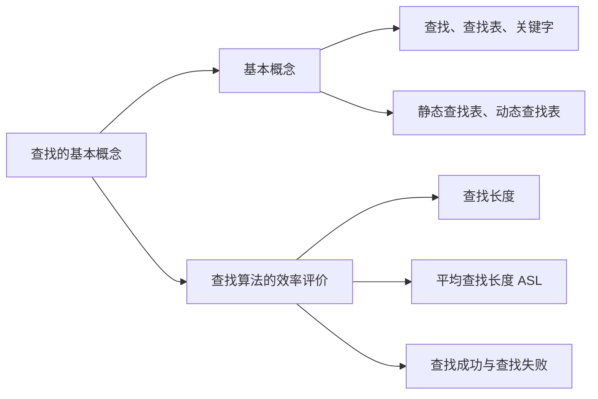
```mermaid
graph LR
    V[查找的基本概念] --> A[基本概念]
    V --> B[查找算法的效率评价]
    A --> A1[查找、查找表、关键字]
    A --> A2[静态查找表、动态查找表]
    B --> B1[查找长度]
    B --> B2[平均查找长度 ASL]
    B --> B3[查找成功与查找失败]
```

#### 1. 基本概念

**查找**：在数据集合中寻找满足某种条件的数据元素的过程称为**查找**。

**查找表**（查找结构）：用于查找的数据集合称为**查找表**，它由**同一类型**的数据元素（或记录）组成。

**关键字**：数据元素中**唯一标识**该元素的某个**数据项**的值。使用基于关键字的查找，查找结果应该是**唯一**的。

**Eg**（同一套"查找表"概念，换一种数据结构就对应不同的现实场景）：

| Eg | 查找表 | 数据元素（记录） | 关键字 |
| --- | --- | --- | --- |
| 学生成绩信息（**线性结构**，可顺序存储也可链式存储） | 学生成绩表 | 每个学生的信息 | 学号 |
| 微信用户数据集（**图结构**） | 微信用户集合 | 每个用户的信息 | 微信号 |

#### 2. 对查找表的常见操作

- ① **查找**符合条件的数据元素；
- ② **插入、删除**某个数据元素。

| 类型 | 执行的操作 | 关注点 |
| --- | --- | --- |
| **静态查找表** | 只需进行操作① | 仅关注查找速度即可 |
| **动态查找表** | 除操作①外，也要进行操作② | 除了查找速度，也要关注插/删操作是否方便实现 |

> 适合作为**静态查找表**的：顺序查找、折半查找、散列查找等；适合作为**动态查找表**的：散列查找、二叉排序树、B 树、B+ 树等——后几种结构本身就支持高效的插入/删除。

#### 3. 查找算法的评价指标——ASL

**查找长度**：在查找运算中，需要**对比关键字的次数**称为查找长度。

**平均查找长度**（ASL, Average Search Length）：所有查找过程中进行关键字的比较次数的**平均值**：

$$ASL=\sum_{i=1}^{n}P_iC_i$$

| 符号 | 含义 |
| --- | --- |
| $n$ | 数据元素（记录）的个数 |
| $P_i$ | 查找第 $i$ 个元素的概率（通常认为查找任何一个元素的概率都相同，即 $P_i=\frac{1}{n}$） |
| $C_i$ | 查找第 $i$ 个元素的查找长度（所需比较次数） |

- **ASL 的数量级反映了查找算法的时间复杂度**；
- 评价一个查找算法的效率时，通常分别考虑**查找成功**和**查找失败**两种情况下的 ASL。

#### 4. ASL 算例——同样一批数据，树形不同效率大不相同

两棵**二叉排序树**（左子树所有结点小于根、右子树所有结点大于根，详见 7.3.1），关键字集合相同：$\{21, 26, 30, 50, 60, 66, 68, 70\}$。

左树（形态匀称）：

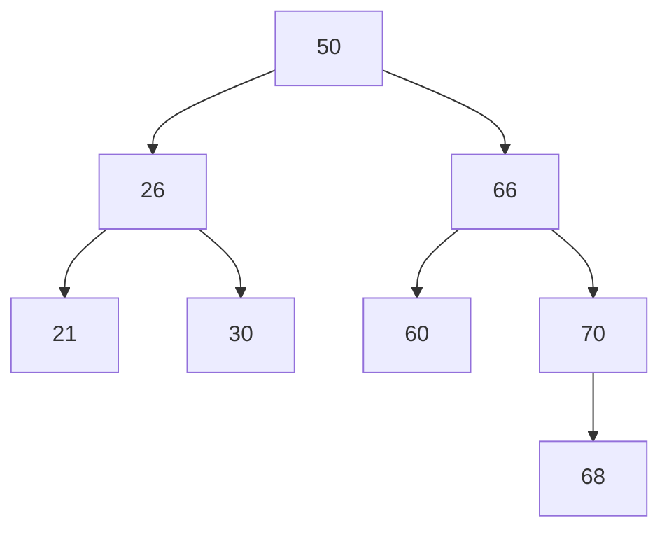
```mermaid
graph TD
    50 --> 26
    50 --> 66
    26 --> 21
    26 --> 30
    66 --> 60
    66 --> 70
    70 --> 68
```

右树（根 26 出发一路向右的斜树）：

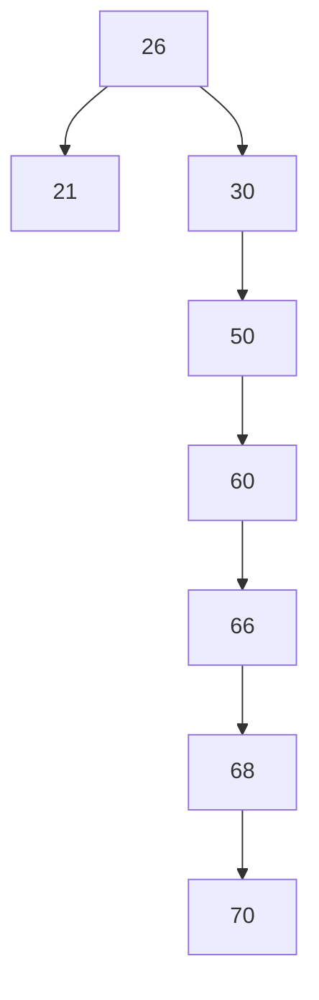
```mermaid
graph TD
    26 --> 21
    26 --> 30
    30 --> 50
    50 --> 60
    60 --> 66
    66 --> 68
    68 --> 70
```

**查找成功的 ASL**（比较次数 = 目标结点所在的层数）：

$$ASL_{\text{左树}}=\frac{1\times1+2\times2+3\times4+4\times1}{8}=2.625\qquad ASL_{\text{右树}}=\frac{1\times1+2\times2+3\times1+4\times1+5\times1+6\times1+7\times1}{8}=3.75$$

左树各层结点数依次为 $1,2,4,1$（68 是 70 的左孩子，在第 4 层）；右树除根和第二层外，50、60、66、68、70 依次位于第 $3\sim7$ 层。

**查找失败的 ASL**（查找落到**失败结点**——空指针位置——为止；$n$ 个结点的二叉树有 $n+1$ 个失败位置，比较次数 = 途经的结点个数）：

$$ASL_{\text{左树}}=\frac{3\times7+4\times2}{9}=\frac{29}{9}\approx3.22\qquad ASL_{\text{右树}}=\frac{2\times3+3+4+5+6+7\times2}{9}=\frac{38}{9}\approx4.22$$

左树失败位置明细：21、30、60 的左右空位及 70 的右空位共 **7** 处各比较 **3** 次（如 $50\to26\to21$），68 的左右空位共 **2** 处比较 **4** 次（$50\to66\to70\to68$）。
右树失败位置明细：21 的左右空位与 30 的左空位共 **3** 处各比较 **2** 次，50、60、66、68 的左空位依次比较 **3、4、5、6** 次，70 的左右空位共 **2** 处比较 **7** 次（$26\to30\to50\to60\to66\to68\to70$）。

> **结论**：关键字完全相同，**树形越匀称，查找成功/失败的 ASL 都越小**——这正是 7.3.2 要把二叉排序树"平衡化"的动机。

#### 5. 本节知识回顾

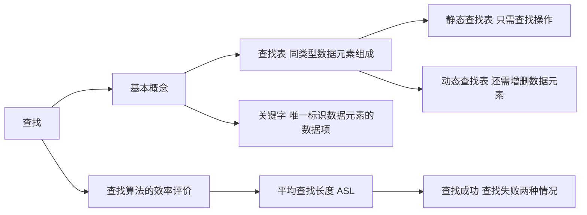
```mermaid
graph LR
    K[查找] --> A[基本概念]
    K --> B[查找算法的效率评价]
    A --> A1[查找表 同类型数据元素组成]
    A1 --> A2[静态查找表 只需查找操作]
    A1 --> A3[动态查找表 还需增删数据元素]
    A --> A4[关键字 唯一标识数据元素的数据项]
    B --> B1[平均查找长度 ASL]
    B1 --> B2[查找成功 查找失败两种情况]
```

**本节考点**：**查找、查找表、关键字三个概念**（关键字唯一标识数据元素，查找结果唯一）→ **静态查找表（只需查找）与动态查找表（还需增删）的区分及各自适合的算法** → **查找长度 = 需要对比关键字的次数** → **$ASL=\sum_{i=1}^{n}P_iC_i$，$P_i$ 通常取 $\frac{1}{n}$** → **查找成功、查找失败两种 ASL 都要会算：成功看目标结点层数；失败走到空指针位置，比较次数 = 途经结点数** → **ASL 的数量级反映了查找算法的时间复杂度**。

---

### 7.2.1 顺序查找

**本节知识总览**：

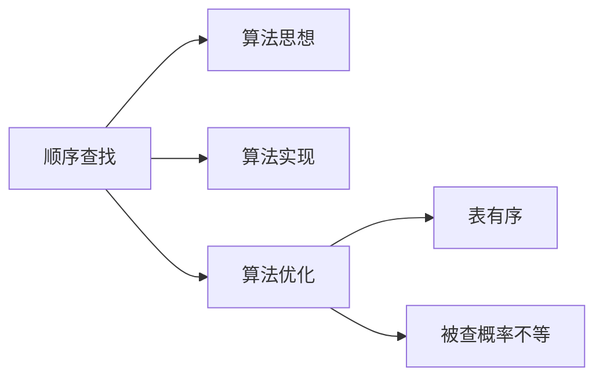
```mermaid
graph LR
    V[顺序查找] --> A[算法思想]
    V --> B[算法实现]
    V --> C[算法优化]
    C --> C1[表有序]
    C --> C2[被查概率不等]
```

#### 1. 算法思想

**顺序查找**（Sequential Search），又叫**线性查找**，通常用于线性表。

**算法思想**：从头到脚挨个找（或者反过来也 OK）。

**Eg**：查找表中依次存放 `33, 10, 13, 29, 16, 19, 32, 7, 43, 41, 37`，查找目标 $43$ → 从头挨个比较，比到第 9 个元素命中。

> 顺序查找**适用面最广**：顺序表、链表都行；表中元素**有序无序都 OK**。

#### 2. 算法实现

**普通实现**（0 号下标也存放数据）：

```c
typedef struct{            //查找表的数据结构（顺序表）
    ElemType *elem;        //动态数组基址
    int TableLen;          //表的长度
}SSTable;

//顺序查找
int Search_Seq(SSTable ST,ElemType key){
    int i;
    for(i=0;i<ST.TableLen && ST.elem[i]!=key; ++i);
    //查找成功，则返回元素下标；查找失败，则返回-1
    return i==ST.TableLen? -1 : i;
}
```

**哨兵实现**（0 号位置存"哨兵"，数据从下标 1 开始存，**从后往前找**）：

```c
typedef struct{            //查找表的数据结构（顺序表）
    ElemType *elem;        //动态数组基址
    int TableLen;          //表的长度
}SSTable;

//顺序查找
int Search_Seq(SSTable ST,ElemType key){
    ST.elem[0]=key;                        //"哨兵"
    int i;
    for(i=ST.TableLen;ST.elem[i]!=key;--i);//从后往前找
    return i;    //查找成功，则返回元素下标；查找失败，则返回0
}
```

- **哨兵**：把要找的 key 存入 0 号位置，从表尾向前扫；若最终停在 0 号，说明查找失败（返回 0）。
- **优点：无需判断下标是否越界**（普通实现若从后往前找必须额外判断 `i>=0`，哨兵保证循环必然终止），效率更高。

**查找效率分析**（$n$ 为表中元素个数）：

$$ASL_{\text{成功}}=\frac{1+2+\cdots+n}{n}=\frac{n+1}{2}\qquad ASL_{\text{失败}}=n+1$$

> 失败时要把 $n$ 个元素都比一遍、最后与哨兵比较后停在第 0 位，共 $n+1$ 次。

#### 3. 优化①——表内元素有序

**条件**：查找表中元素**有序存放**（递增/递减）。

- 递增表中，比较过程中一旦**当前关键字大于目标关键字**，即可直接判定**查找失败**，无需扫完全表 → **查找失败时 ASL 更少**（查找成功的 ASL 不变）。

**查找判定树**（以递增表 `7, 13, 19, 29, 37, 43` 为例，圆形为成功结点，方形为失败结点；边上标注比较结果小于/等于/大于）：

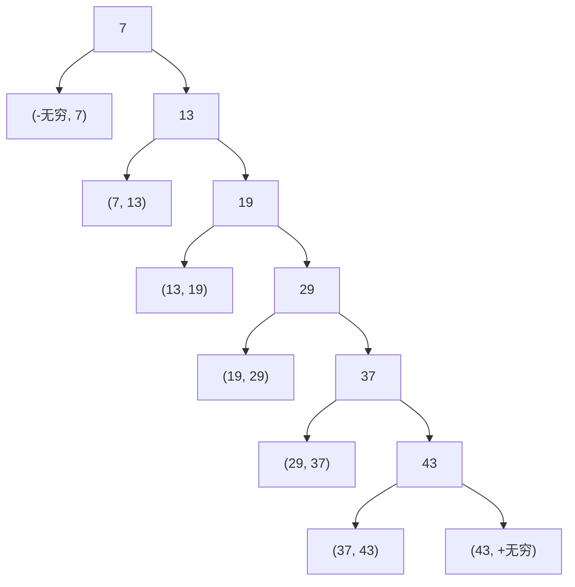
```mermaid
graph TD
    K7[7] --> F1["(-无穷, 7)"]
    K7 --> K13[13]
    K13 --> F2["(7, 13)"]
    K13 --> K19[19]
    K19 --> F3["(13, 19)"]
    K19 --> K29[29]
    K29 --> F4["(19, 29)"]
    K29 --> K37[37]
    K37 --> F5["(29, 37)"]
    K37 --> K43[43]
    K43 --> F6["(37, 43)"]
    K43 --> F7["(43, +无穷)"]
```

- $n$ 个**成功结点** + $n+1$ 个**失败结点**（共 $n+1$ 种查找失败的情况，对应 $n+1$ 个区间）；
- **一个成功结点的查找长度 = 自身所在层数**；
- **一个失败结点的查找长度 = 其父结点所在层数**；
- 默认情况下，各种失败情况或成功情况都**等概率**发生。

$$ASL_{\text{成功}}=\frac{1+2+\cdots+n}{n}=\frac{n+1}{2}\qquad ASL_{\text{失败}}=\frac{1+2+\cdots+n+n}{n+1}=\frac{n}{2}+\frac{n}{n+1}$$

> 失败时：7 个失败结点（$n=6$）的查找长度依次为 $1,2,3,4,5,6,6$，故 $ASL_{\text{失败}}=\frac{27}{7}\approx3.86$，远小于优化前的 $n+1$。

#### 4. 优化②——被查概率不相等

**条件**：各关键字的**被查概率不同**。

- 把**被查概率大的放在靠前位置**（按被查概率降序排列）→ **查找成功时 ASL 更少**。

**Eg**：查找表 `7, 13, 19, 29, 37, 43`，被查概率依次为 15%、5%、10%、40%、28%、2%：

| 存放顺序 | $ASL_{\text{成功}}$ 计算 | 结果 |
| --- | --- | --- |
| 原序 `7,13,19,29,37,43` | $1\times0.15+2\times0.05+3\times0.10+4\times0.40+5\times0.28+6\times0.02$ | $3.67$ |
| 按概率降序 `29,37,7,19,13,43` | $1\times0.40+2\times0.28+3\times0.15+4\times0.10+5\times0.05+6\times0.02$ | $\mathbf{2.18}$ |

#### 5. 本节知识回顾

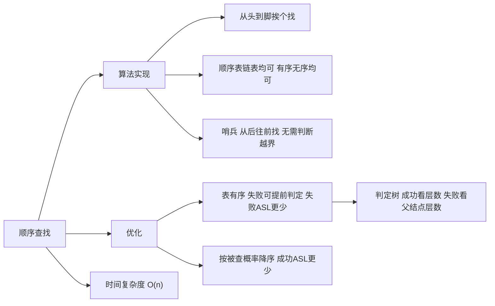
```mermaid
graph LR
    K[顺序查找] --> A[算法实现]
    K --> B[优化]
    K --> C["时间复杂度 O(n)"]
    A --> A1[从头到脚挨个找]
    A --> A2[顺序表链表均可 有序无序均可]
    A --> A3[哨兵 从后往前找 无需判断越界]
    B --> B1[表有序 失败可提前判定 失败ASL更少]
    B1 --> B2[判定树 成功看层数 失败看父结点层数]
    B --> B3[按被查概率降序 成功ASL更少]
```

**本节考点**：**顺序查找适用范围最广（顺序表/链表、有序/无序均可），时间复杂度 $O(n)$** → **普通实现失败返回 $-1$；哨兵实现 0 号存哨兵、从后往前找、失败返回 0，优点是无需判断越界** → **$ASL_{\text{成功}}=\frac{n+1}{2}$、$ASL_{\text{失败}}=n+1$** → **有序表优化：失败可提前判定，用判定树分析，失败结点查找长度 = 父结点层数，$ASL_{\text{失败}}=\frac{n}{2}+\frac{n}{n+1}$** → **概率不等优化：按被查概率降序存放，成功 ASL 更少**。

---

### 7.2.2 折半查找

**本节知识总览**：

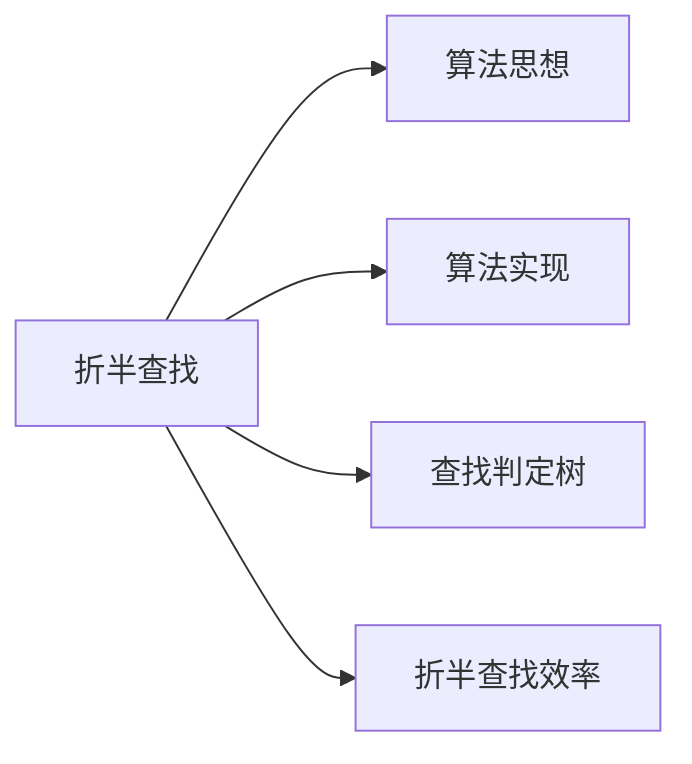
```mermaid
graph LR
    V[折半查找] --> A[算法思想]
    V --> B[算法实现]
    V --> C[查找判定树]
    V --> D[折半查找效率]
```

#### 1. 算法思想

**折半查找**，又称"**二分查找**"，**仅适用于有序的顺序表**。

**Eg**：有序表 `7, 10, 13, 16, 19, 29, 32, 33, 37, 41, 43`（TableLen=11），查找目标 33：$mid=\lfloor\frac{low+high}{2}\rfloor$，每次将目标与 mid 所指元素比较：

| 轮次 | low | high | mid | elem[mid] 与目标 | 动作 |
| --- | --- | --- | --- | --- | --- |
| 1 | 0 | 10 | 5 | $29<33$，目标只可能在右边 | $low=mid+1=6$ |
| 2 | 6 | 10 | 8 | $37>33$，目标只可能在左边 | $high=mid-1=7$ |
| 3 | 6 | 7 | 6 | $32<33$，目标只可能在右边 | $low=mid+1=7$ |
| 4 | 7 | 7 | 7 | $33==33$ | **查找成功** |

**Eg：查找 12（失败）**：

| 轮次 | low | high | mid | elem[mid] 与目标 | 动作 |
| --- | --- | --- | --- | --- | --- |
| 1 | 0 | 10 | 5 | $29>12$ | $high=mid-1=4$ |
| 2 | 0 | 4 | 2 | $13>12$ | $high=mid-1=1$ |
| 3 | 0 | 1 | 0 | $7<12$ | $low=mid+1=1$ |
| 4 | 1 | 1 | 1 | $10<12$ | $low=mid+1=2$ |
| 结束 | 2 | 1 | —— | $low>high$ | **查找失败** |

> 只有在 $[low,high]$ 之间才有可能找到目标关键字；**$low>high$ 则查找失败**。

#### 2. 算法实现

```c
typedef struct{            //查找表的数据结构（顺序表）
    ElemType   *elem;      //动态数组基址
    int TableLen;          //表的长度
}SSTable;

//折半查找
int Binary_Search(SSTable L,ElemType key){
    int low=0,high=L.TableLen-1,mid;
    while(low<=high){
        mid=(low+high)/2;                 //取中间位置
        if(L.elem[mid]==key)
            return mid;                   //查找成功则返回所在位置
        else if(L.elem[mid]>key)
            high=mid-1;                   //从前半部分继续查找
        else
            low=mid+1;                    //从后半部分继续查找
    }
    return -1;                            //查找失败，返回-1
}
```

> **仅适用于有序的顺序表**：顺序表拥有**随机访问**的特性，链表没有——折半查找需要随意定位 low/high/mid，链表做不到。

#### 3. 查找判定树

**构造方法**：mid 所指元素作为根结点，**左半部分递归构造左子树、右半部分递归构造右子树**。

- 若当前 low 和 high 之间有**奇数**个元素，则 mid 分隔后，**左右两部分元素个数相等**；
- 若当前 low 和 high 之间有**偶数**个元素，则 mid 分隔后，**左半部分比右半部分少一个元素**；
- **推论**：若 $mid=\lfloor\frac{low+high}{2}\rfloor$，则判定树中任何一个结点必有：**右子树结点数 − 左子树结点数 = 0 或 1**。

**Eg**（上表 11 个元素的判定树；10 是 7 的右孩子、19 是 16 的右孩子、33 是 32 的右孩子、43 是 41 的右孩子，图中不区分左右画出）：

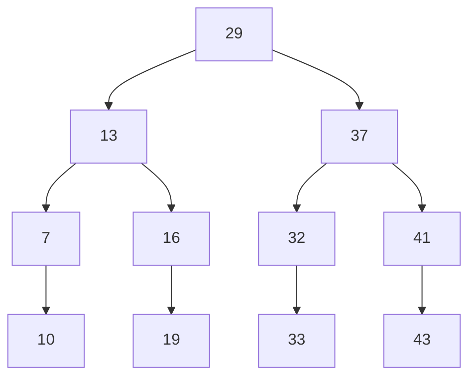
```mermaid
graph TD
    29 --> 13
    29 --> 37
    13 --> 7
    13 --> 16
    37 --> 32
    37 --> 41
    7 --> 10
    16 --> 19
    32 --> 33
    41 --> 43
```

**判定树的特性**：

- 折半查找的判定树**一定是平衡二叉树**，且满足**左 < 中 < 右**——它是一棵**平衡的二叉排序树（BST）**；
- 判定树**只有最下面一层是不满的** → 元素个数为 $n$ 时**树高 $h=\lceil\log_2(n+1)\rceil$**（计算方法同完全二叉树，**不含失败结点**）；
- **失败结点有 $n+1$ 个**（= 成功结点的空链域数量），代表 $n+1$ 种查找失败的情况（失败结点即 $n+1$ 个区间）。

**Eg**：给上面的 11 结点判定树补上 12 个失败结点（方形，代表区间 $(-\infty,7)$、$(7,10)$、$(10,13)$、…、$(43,+\infty)$）后：

$$ASL_{\text{成功}}=\frac{1\times1+2\times2+3\times4+4\times4}{11}=3\qquad ASL_{\text{失败}}=\frac{3\times4+4\times8}{12}=\frac{11}{3}\approx3.67$$

> 失败结点的比较次数 = 其**父结点所在层数**：第三层结点 7、16、32、41 各挂 1 个失败结点（共 4 个，各比较 3 次），第四层结点 10、19、33、43 各挂 2 个失败结点（共 8 个，各比较 4 次）。

**练习**（$mid=\lfloor\frac{low+high}{2}\rfloor$）：画含 1~16 个元素的查找表对应的判定树（暂不考虑失败结点）。16 个元素时：第 1~4 层全满、第 5 层仅 1 个结点（最右元素，是第 4 层最右结点的右孩子）。

#### 4. 折半查找效率

- 树高 $h=\lceil\log_2(n+1)\rceil$；
- **查找成功的 ASL ≤ h**，**查找失败的 ASL ≤ h**；
- **折半查找的时间复杂度 = $O(\log_2 n)$**。

> **折半查找的速度一定比顺序查找快吗？——不一定**：若目标恰好是表首元素，顺序查找 1 次即可命中，而折半查找仍需约 $\log_2 n$ 次比较。

**拓展：若 $mid=\lceil\frac{low+high}{2}\rceil$（向上取整）**：偶数个元素时 **左半部分比右半部分多一个元素**（与向下取整相反）；推论变为 **左子树结点数 − 右子树结点数 = 0 或 1**。15 个元素的判定树：第 1~4 层全满。

#### 5. 本节知识回顾

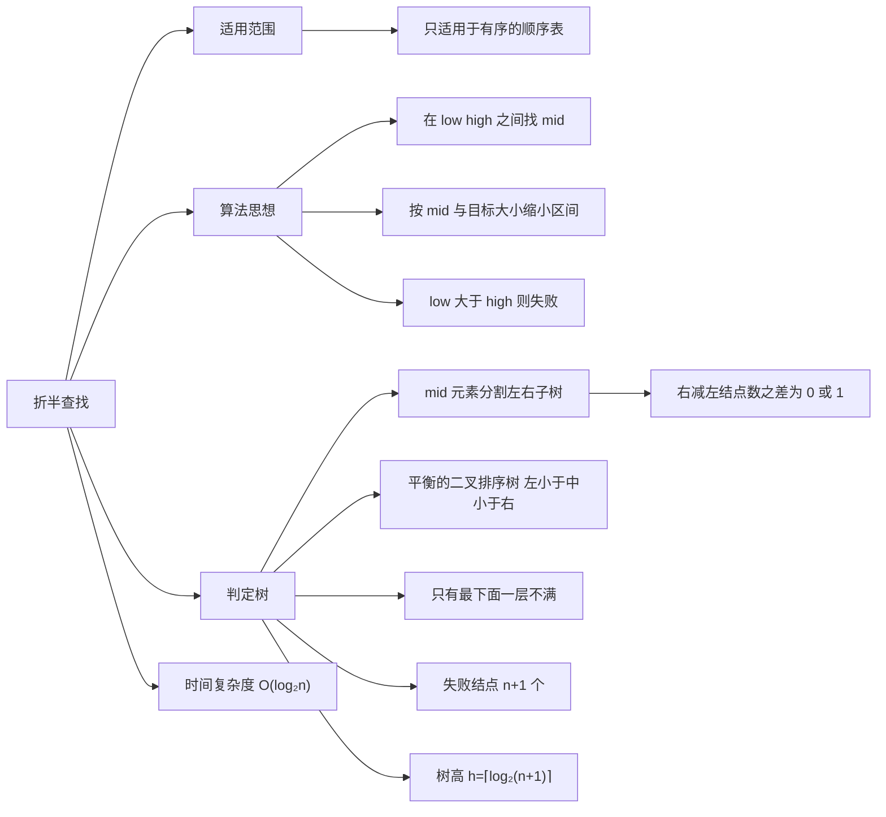
```mermaid
graph LR
    K[折半查找] --> A[适用范围]
    K --> B[算法思想]
    K --> C[判定树]
    K --> D["时间复杂度 O(log₂n)"]
    A --> A1[只适用于有序的顺序表]
    B --> B1[在 low high 之间找 mid]
    B --> B2[按 mid 与目标大小缩小区间]
    B --> B3[low 大于 high 则失败]
    C --> C1[mid 元素分割左右子树]
    C1 --> C2[右减左结点数之差为 0 或 1]
    C --> C3[平衡的二叉排序树 左小于中小于右]
    C --> C4[只有最下面一层不满]
    C --> C5[失败结点 n+1 个]
    C --> C6["树高 h=⌈log₂(n+1)⌉"]
```

**本节考点**：**折半查找只适用于有序顺序表（需要随机访问）** → **手算模拟：$mid=\lfloor\frac{low+high}{2}\rfloor$，逐轮缩小区间，$low>high$ 即失败** → **判定树的构造：mid 分割左右，右子树结点数−左子树结点数=0 或 1** → **判定树是平衡 BST，只有最下一层不满，树高 $h=\lceil\log_2(n+1)\rceil$，失败结点 $n+1$ 个** → **会算 $ASL_{\text{成功}}$、$ASL_{\text{失败}}$（失败结点比较次数 = 父结点层数）** → **时间复杂度 $O(\log_2 n)$；但不一定比顺序查找快（目标在表首时顺序更快）** → **向上取整变体：左子树结点数−右子树结点数=0 或 1**。

---

### 7.2.3 分块查找

**本节知识总览**：

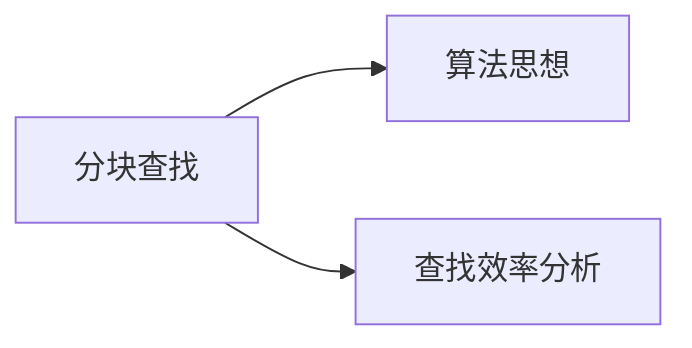
```mermaid
graph LR
    V[分块查找] --> A[算法思想]
    V --> B[查找效率分析]
```

#### 1. 算法思想

**分块查找**，又称**索引顺序查找**。

- 数据**分块**存储：**块内无序、块间有序**（前一块的最大关键字 < 后一块的所有关键字）；
- **索引表**中保存每个分块的**最大关键字**和**分块的存储区间**；
- 算法过程：① 在索引表中确定待查记录所属的分块（**可顺序、可折半**）；② 在块内**顺序查找**。

**Eg**（14 个元素分 5 块）：

| 索引表下标 | 0 | 1 | 2 | 3 | 4 |
| --- | --- | --- | --- | --- | --- |
| maxValue（最大关键字） | 10 | 20 | 30 | 40 | 50 |
| 存储区间 | [0,1] | [2,5] | [6,8] | [9,10] | [11,13] |

主表：下标 $0\sim13$ 依次为 `7, 10 | 13, 19, 16, 20 | 27, 22, 30 | 40, 36 | 43, 50, 48`（竖线为分块边界，块内无序、块间递增）。

```c
//索引表
typedef struct {
    ElemType maxValue;
    int low,high;
}Index;

//顺序表存储实际元素
ElemType List[100];
```

**查找过程示例**：

- **查 22（成功）**：索引表顺序扫描，$22>10$、$22>20$、$22\le30$ → 落在块 $[6,8]$ → 块内顺序查找 $27,22$ → 命中下标 7；
- **查 29（失败）**：同理定位到块 $[6,8]$，块内 $27,22,30$ 均不等于 29 → **查找失败**（后续块的关键字都大于 30，无需再看）。

#### 2. 用折半查找定位索引表（易错点！）

索引表按 maxValue **递增有序**，可以用**折半查找**定位分块。

**Eg：查 19（索引表中无 19）**，索引表 `10, 20, 30, 40, 50`：

| 步骤 | low | high | mid | 比较 | 动作 |
| --- | --- | --- | --- | --- | --- |
| 1 | 0 | 4 | 2 | $30>19$ | $high=mid-1=1$ |
| 2 | 0 | 1 | 0 | $10<19$ | $low=mid+1=1$ |
| 3 | 1 | 1 | 1 | $20>19$ | $high=mid-1=0$ |
| 结束 | 1 | 0 | —— | $low>high$ | 在 **low 所指分块 [2,5]** 中块内查找 |

块内顺序查找 `13, 19` → 命中下标 3，查找成功。

> **易错点**：若索引表中**不包含**目标关键字，则折半查找最终停在 $low>high$，要**在 low 所指分块中查找**（不是 high！）。原因：最终 $low$ 左边一定小于目标关键字、$high$ 右边一定大于目标关键字，而索引表保存的是各分块的**最大关键字**——目标若存在，必在 low 所指分块中。

**Eg：查 54（失败）**：$mid$ 依次指向 30、40、50 均小于 54，最终 $low$ **超出索引表范围** → 查找失败。

#### 3. 查找效率分析（ASL）

假设长度为 $n$ 的查找表被**均匀地分为 $b$ 块，每块 $s$ 个元素**（$n=b\times s$）。设索引查找和块内查找的平均查找长度分别为 $L_I$、$L_S$，则：

$$ASL=L_I+L_S$$

| 索引表查找方式 | $L_I$ | $L_S$ | ASL |
| --- | --- | --- | --- |
| **顺序查找** | $\dfrac{b+1}{2}$ | $\dfrac{s+1}{2}$ | $ASL=\dfrac{b+1}{2}+\dfrac{s+1}{2}=\dfrac{s^2+2s+n}{2s}$ |
| **折半查找** | $\lceil\log_2(b+1)\rceil$ | $\dfrac{s+1}{2}$ | $ASL=\lceil\log_2(b+1)\rceil+\dfrac{s+1}{2}$ |

- 顺序查索引时，**当 $s=\sqrt{n}$ 时 ASL 最小**：$ASL_{\min}=\sqrt{n}+1$。
- **Eg**：$n=10000$ → $ASL_{\min}=101$。
- 查找失败的情况更复杂，**一般不考**。

#### 4. 拓展：动态查找表怎么办？

若查找表是"动态查找表"（还需要插入/删除），顺序存储的分块查找不方便 → 可以改用**链式存储**：索引结点依次相连，每个索引结点向下引出一条元素链（块内仍无序、块间仍有序）。

#### 5. 本节知识回顾

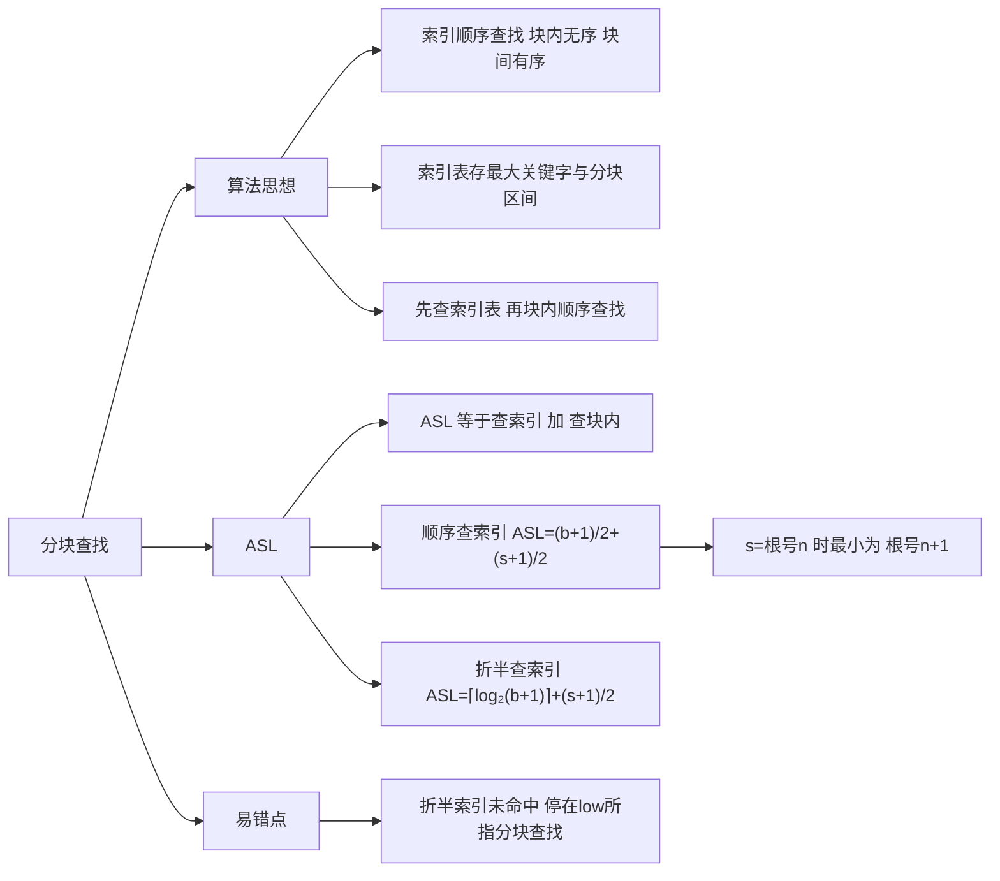
```mermaid
graph LR
    K[分块查找] --> A[算法思想]
    K --> B[ASL]
    K --> C[易错点]
    A --> A1[索引顺序查找 块内无序 块间有序]
    A --> A2[索引表存最大关键字与分块区间]
    A --> A3[先查索引表 再块内顺序查找]
    B --> B1[ASL 等于查索引 加 查块内]
    B --> B2["顺序查索引 ASL=(b+1)/2+(s+1)/2"]
    B2 --> B3["s=根号n 时最小为 根号n+1"]
    B --> B4["折半查索引 ASL=⌈log₂(b+1)⌉+(s+1)/2"]
    C --> C1[折半索引未命中 停在low所指分块查找]
```

**本节考点**：**分块查找 = 索引顺序查找，块内无序、块间有序** → **索引表存每块最大关键字与区间；先查索引（顺序或折半），再块内顺序查找** → **$ASL=L_I+L_S$：顺序查索引 $\frac{b+1}{2}+\frac{s+1}{2}$，$s=\sqrt n$ 时最小 $\sqrt n+1$；折半查索引 $\lceil\log_2(b+1)\rceil+\frac{s+1}{2}$** → **易错点：索引表折半查找未命中时停在 $low>high$，要在 low 所指分块中查找；$low$ 超出索引表范围才是彻底失败**。

---

### 7.3.1 二叉排序树

**本节知识总览**：

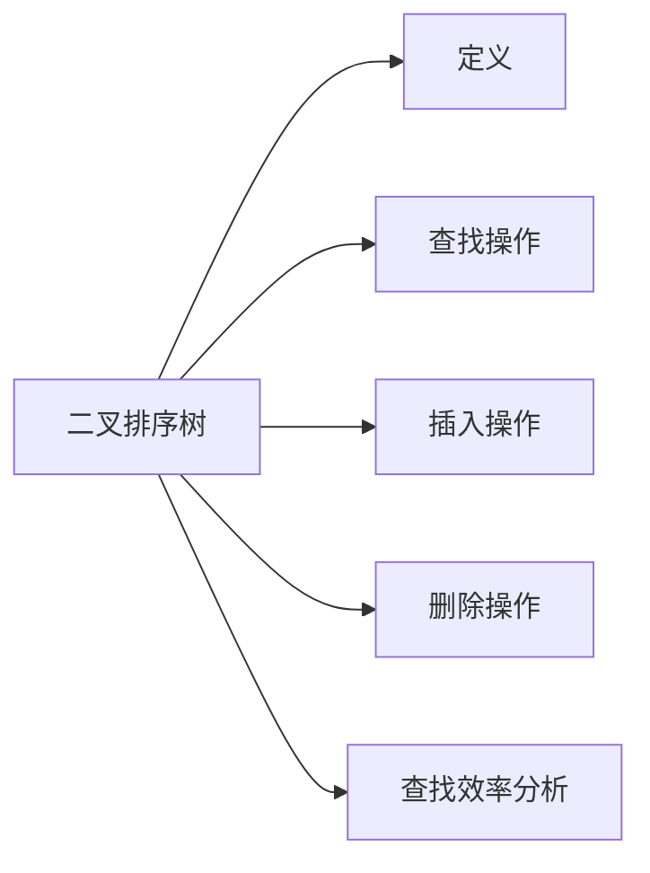
```mermaid
graph LR
    V[二叉排序树] --> A[定义]
    V --> B[查找操作]
    V --> C[插入操作]
    V --> D[删除操作]
    V --> E[查找效率分析]
```

#### 1. 二叉排序树的定义

**二叉排序树**（Binary Search Tree），又称**二叉查找树**（BST）：

> 一棵二叉树或者是**空二叉树**，或者是具有如下性质的二叉树：
> - **左子树**上**所有**结点的关键字**均小于**根结点的关键字；
> - **右子树**上**所有**结点的关键字**均大于**根结点的关键字；
> - 左子树和右子树又各是一棵二叉排序树。

即 **左子树结点值 < 根结点值 < 右子树结点值**（⚠️ 默认不允许两个结点的关键字相同）。

- 二叉排序树可用于元素的**有序组织、搜索**；
- 对 BST 进行**中序遍历**，可以得到一个**递增的有序序列**。

**Eg**：

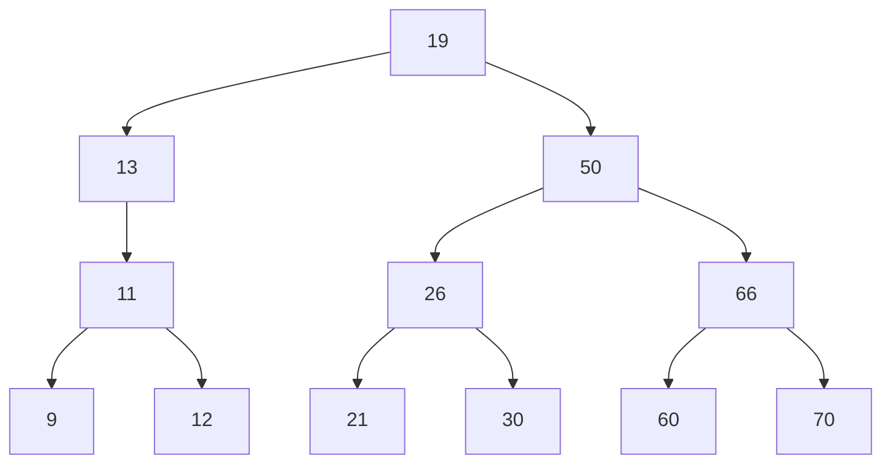
```mermaid
graph TD
    19 --> 13
    19 --> 50
    13 --> 11
    11 --> 9
    11 --> 12
    50 --> 26
    50 --> 66
    26 --> 21
    26 --> 30
    66 --> 60
    66 --> 70
```

中序序列：$9,11,12,13,19,21,26,30,50,60,66,70$，递增 ✓

#### 2. 查找操作

若树非空，目标值与根结点的值比较：

- 若**相等**，则**查找成功**；
- 若**小于**根结点，则在**左子树**上查找；**大于**则在**右子树**上查找；
- 查找成功，返回结点指针；查找失败返回 `NULL`。

**Eg**（上图的树）：

- **查 30**：$19\to50\to26\to30$，比较 4 次成功；
- **查 12**：$19\to13\to11\to$ 空指针，查找失败。

```c
//二叉排序树结点
typedef struct BSTNode{
    int key;
    struct BSTNode  *lchild,*rchild;
}BSTNode,*BSTree;

//在二叉排序树中查找值为 key 的结点
BSTNode *BST_Search(BSTree T,int key){
    while(T!=NULL&&key!=T->key){        //若树空或等于根结点值，则结束循环
        if(key<T->key)  T=T->lchild;    //小于，则在左子树上查找
        else    T=T->rchild;            //大于，则在右子树上查找
    }
    return T;
}

//在二叉排序树中查找值为 key 的结点（递归实现）
BSTNode *BSTSearch(BSTree T,int key){
    if (T==NULL)
        return NULL;    //查找失败
    if (key==T->key)
        return T;       //查找成功
    else if (key < T->key)
        return BSTSearch(T->lchild, key);   //在左子树中找
    else
        return BSTSearch(T->rchild, key);   //在右子树中找
}
```

> 循环版最坏**空间复杂度 $O(1)$**；递归版最坏**空间复杂度 $O(h)$**（递归工作栈深度）。

#### 3. 插入操作

若原二叉排序树为空，则直接插入结点；否则，若关键字 $k$ **小于**根结点值，则插入到**左子树**；若 $k$ **大于**根结点值，则插入到**右子树**。

- **新插入的结点一定是叶子**；
- 练习：自己实现非递归插入。

```c
//在二叉排序树插入关键字为k的新结点（递归实现）
int BST_Insert(BSTree &T, int k){
    if(T==NULL){                    //原树为空，新插入的结点为根结点
        T=(BSTree)malloc(sizeof(BSTNode));
        T->key=k;
        T->lchild=T->rchild=NULL;
        return 1;                   //返回1，插入成功
    }
    else if(k==T->key)
        return 0;                   //树中存在相同关键字的结点，插入失败
    else if(k<T->key)               //插入到T的左子树
        return BST_Insert(T->lchild,k);
    else                            //插入到T的右子树
        return BST_Insert(T->rchild,k);
}
```

> 注意参数是**引用** `BSTree &T`：要在原树上真正挂上新结点（修改父结点的孩子指针），必须传指针的引用。

#### 4. 二叉排序树的构造

```c
//按照 str[] 中的关键字序列建立二叉排序树
void Creat_BST(BSTree &T,int str[],int n){
    T=NULL;             //初始时T为空树
    int i=0;
    while(i<n){         //依次将每个关键字插入到二叉排序树中
        BST_Insert(T,str[i]);
        i++;
    }
}
```

- 例1 `str={50, 66, 60, 26, 21, 30, 70, 68}` 与例2 `str={50, 26, 21, 30, 66, 60, 70, 68}` → 得到**同款** BST（就是 7.1 ASL 算例中的左树）；
- 例3 `str={26, 21, 30, 50, 60, 66, 68, 70}`（递增序列）→ 得到**斜向单支**的 BST（就是 7.1 的右树，树高 = 结点数）。

> **不同的关键字序列可能得到同款二叉排序树，也可能得到不同款**——关键字的插入顺序直接决定树形。

#### 5. 删除操作

先搜索找到目标结点 $z$，分三种情形：

1. **$z$ 是叶结点**：**直接删除**，不会破坏二叉排序树的性质；
2. **$z$ 只有一棵左子树或右子树**：让 $z$ 的子树成为 $z$ **父结点**的子树，**替代 $z$ 的位置**；
3. **$z$ 有左、右两棵子树**：令 $z$ 的**直接后继（或直接前驱）替代 $z$**，然后从树中**删去这个直接后继（或直接前驱）**——于是转换成了情形①或②。

- $z$ 的**后继**：$z$ 的**右子树中最左下结点**（该结点一定没有左子树）；
- $z$ 的**前驱**：$z$ 的**左子树中最右下结点**（该结点一定没有右子树）。

> 原理：中序遍历是"左 根 右"，逐层展开（左 根 (左 根 右) → 左 根 ((左 根 右) 根 右)）可见：$z$ 的直接后继 = 右子树最左下结点，直接前驱 = 左子树最右下结点。

**Eg**（下树中删除 50——它有两棵子树）：

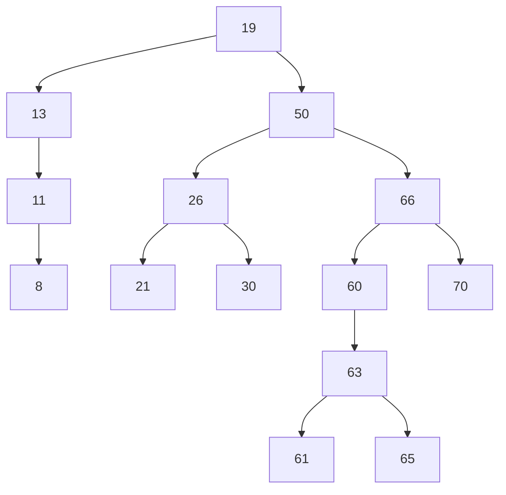
```mermaid
graph TD
    19 --> 13
    19 --> 50
    13 --> 11
    11 --> 8
    50 --> 26
    50 --> 66
    26 --> 21
    26 --> 30
    66 --> 60
    66 --> 70
    60 --> 63
    63 --> 61
    63 --> 65
```

- **用后继替代**：50 的后继 = 右子树（66）中最左下结点 **60**；60 顶替 50，60 原位置由其右孩子 63 顶替（60 无左子树，化为情形②）：
- **用前驱替代**：50 的前驱 = 左子树（26）中最右下结点 **30**；30 顶替 50，30 原位置直接删除（30 无右子树，化为情形①）。

删除 50 并用后继 60 替代后的树：

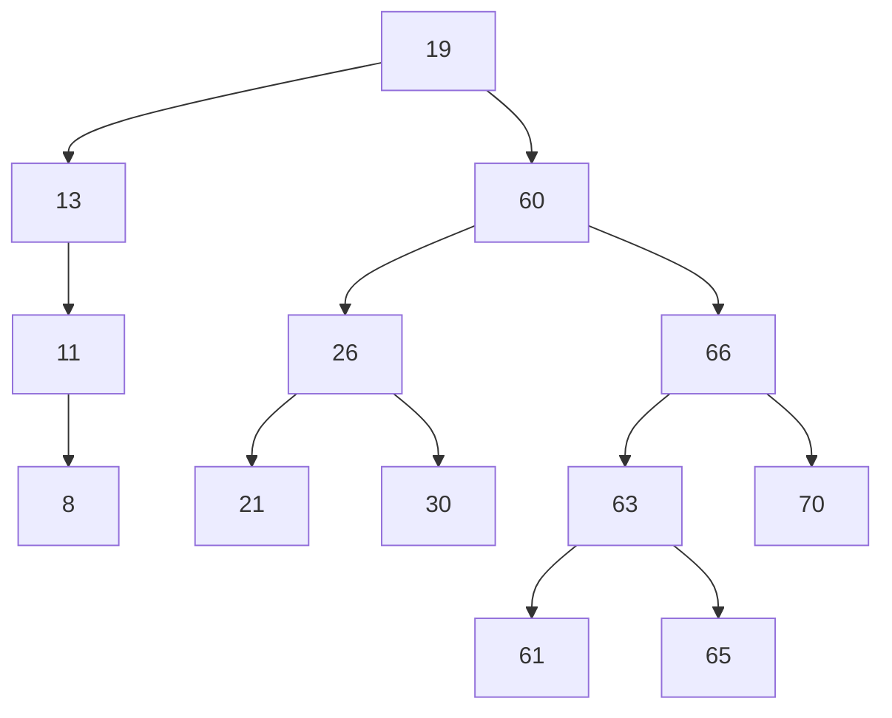
```mermaid
graph TD
    19 --> 13
    19 --> 60
    13 --> 11
    11 --> 8
    60 --> 26
    60 --> 66
    26 --> 21
    26 --> 30
    66 --> 63
    66 --> 70
    63 --> 61
    63 --> 65
```

（原树中 63 是 60 的右孩子、61/65 是 63 的左右孩子。）

#### 6. 查找效率分析

**查找长度**——在查找运算中，需要对比关键字的次数，反映了查找操作的时间复杂度。BST 的查找效率**取决于树的高度**（若树高 $h$，找到最下层的一个结点需要对比 $h$ 次）：

| 情形 | 树高 | 效率 | 例（7.1 的两棵树，$n=8$） |
| --- | --- | --- | --- |
| **最好**：形态匀称 | $n$ 个结点的二叉树最小高度 $\lfloor\log_2 n\rfloor+1$ | $O(\log_2 n)$ | $ASL_{\text{成功}}=2.625$，$ASL_{\text{失败}}\approx3.22$ |
| **最坏**：每个结点只有一个分支（斜树） | $h=n$ | $O(n)$ | $ASL_{\text{成功}}=3.75$，$ASL_{\text{失败}}\approx4.22$ |

> 同一批关键字，树形越**匀称**查找越快。为了让 BST 不退化成斜树 → 引出**平衡二叉树**。

#### 7. 本节知识回顾

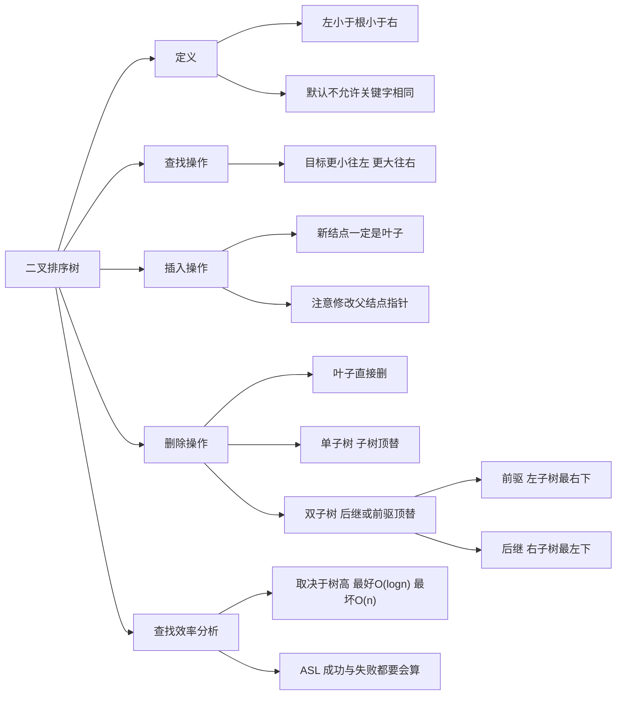
```mermaid
graph LR
    K[二叉排序树] --> A[定义]
    K --> B[查找操作]
    K --> C[插入操作]
    K --> D[删除操作]
    K --> E[查找效率分析]
    A --> A1[左小于根小于右]
    A --> A2[默认不允许关键字相同]
    B --> B1[目标更小往左 更大往右]
    C --> C1[新结点一定是叶子]
    C --> C2[注意修改父结点指针]
    D --> D1[叶子直接删]
    D --> D2[单子树 子树顶替]
    D --> D3[双子树 后继或前驱顶替]
    D3 --> D4[前驱 左子树最右下]
    D3 --> D5[后继 右子树最左下]
    E --> E1["取决于树高 最好O(logn) 最坏O(n)"]
    E --> E2[ASL 成功与失败都要会算]
```

**本节考点**：**BST 定义：左子树所有结点 < 根 < 右子树所有结点，中序序列递增；默认不允许关键字相同** → **查找：从根出发小往左大往右，失败停在空指针** → **插入：新结点一定是叶子；注意引用传参修改父结点指针** → **构造：依次插入；不同序列可能同款也可能不同款** → **⚠️ 删除三情形：叶子直接删；单子树子树顶替；双子树用后继（右子树最左下）或前驱（左子树最右下）顶替再删它** → **效率取决于树高：最好 $O(\log_2 n)$、最坏 $O(n)$；会算查找成功/失败的 ASL（失败需补 $n+1$ 个失败结点）**。

---

### 7.3.2 平衡二叉树

**本节知识总览**：

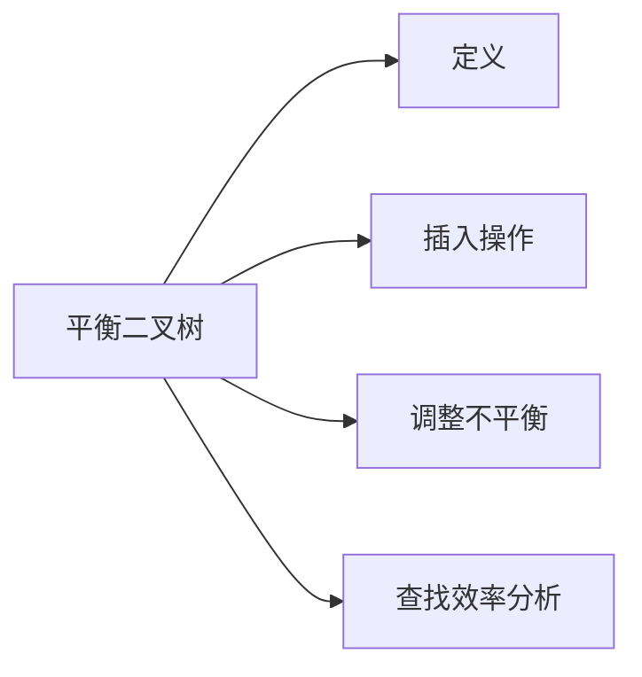
```mermaid
graph LR
    V[平衡二叉树] --> A[定义]
    V --> B[插入操作]
    V --> C[调整不平衡]
    V --> D[查找效率分析]
```

#### 1. 定义

**平衡二叉树**（Balanced Binary Tree），简称**平衡树**（**AVL 树**，以发明者 G. M. Adelson-Velsky 和 E. M. Landis 命名）——**树上任一结点的左子树和右子树的高度之差不超过 1**。

**结点的平衡因子** = 左子树高 − 右子树高。平衡二叉树结点的平衡因子的值只可能是 **−1、0 或 1**。

> ⚠️ 只要有**任一**结点的平衡因子**绝对值大于 1**，就不是平衡二叉树（检查的是每个结点，不只是根）。

```c
//平衡二叉树结点
typedef struct AVLNode{
    int key;                //数据域
    int balance;            //平衡因子
    struct AVLNode  *lchild,*rchild;
}AVLNode,*AVLTree;
```

**Eg**：7.1 算例的左树是 AVL（各结点平衡因子均为 −1/0/1）；右树中根 26 的平衡因子 = $1-6=-5$、链上各结点依次为 $-5,-4,-3,-2,-1,0$——不是 AVL。

#### 2. 插入与"最小不平衡子树"

在二叉排序树中插入新结点后，如何保持平衡？

- **查找路径上的所有结点都有可能受到影响**（平衡因子发生变化）；
- 从**插入点往回**找到**第一个不平衡结点**（$|bf|>1$），调整**以该结点为根的子树**——这就是**最小不平衡子树**；
- **每次调整的对象都是"最小不平衡子树"**。

**Eg**（插入 67 导致失衡并调整）：

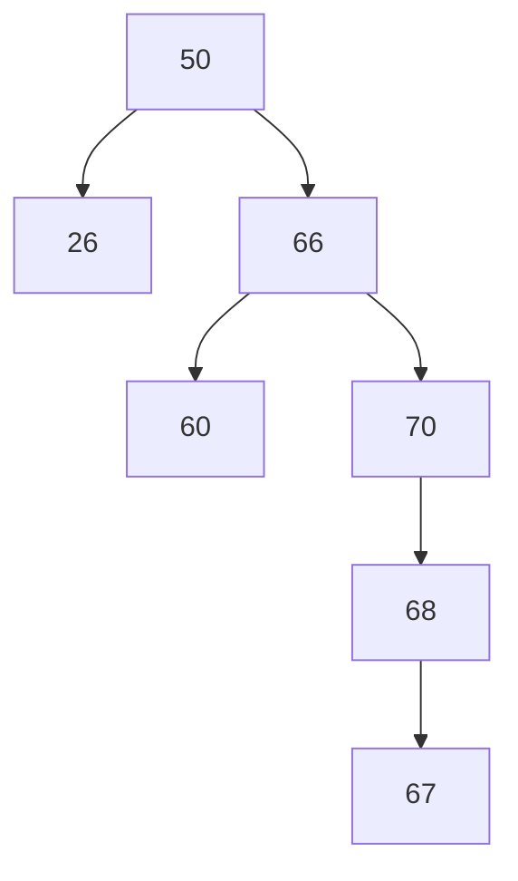
```mermaid
graph TD
    50 --> 26
    50 --> 66
    66 --> 60
    66 --> 70
    70 --> 68
    68 --> 67
```

插入路径 $50\to66\to70\to68\to67$，各结点平衡因子变为：$70:+2$、$68:+1$、$66:-2$、$50:-2$（其余 0）。从插入点往回第一个 $|bf|>1$ 的是 **70** → 最小不平衡子树以 70 为根；新结点插在 70 的**左孩子的左子树** → **LL 型** → 将 70 的左孩子 **68 右上旋**：

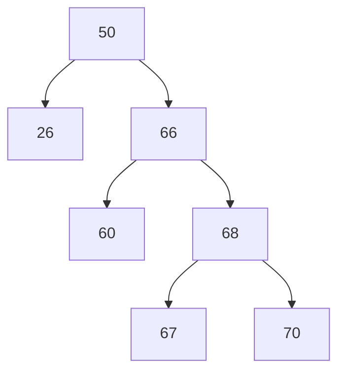
```mermaid
graph TD
    50 --> 26
    50 --> 66
    66 --> 60
    66 --> 68
    68 --> 67
    68 --> 70
```

调整后 68 为子树根（左孩子 67、右孩子 70），全树恢复平衡（$66:-1$，其余 $-1/0$）。

> **为什么只调整最小不平衡子树，其他祖先就都恢复平衡？** 插入操作使最小不平衡子树**高度 +1**（$H+2\to H+3$）；旋转调整后该子树**高度恢复为 $H+2$**——对上层而言"什么都没发生过"，祖先们的平衡因子自然复原。

#### 3. 四种平衡旋转

记最小不平衡子树的根为 $A$（失衡时 $A$ 的平衡因子必为 $\pm2$）：

| 类型 | 失衡原因 | 调整方法 | 旋转后中序顺序（保持 BST 特性） |
| --- | --- | --- | --- |
| **LL** | 在 $A$ 的**左**孩子(L)的**左**子树(L)中插入，$A$ 的 bf 由 $1$ 增至 $2$ | $A$ 的左孩子 $B$ **右上旋**：$B$ 代替 $A$，$A$ 成为 $B$ 的右孩子，$B$ 原右子树成为 $A$ 的左子树 | $BL<B<BR<A<AR$ |
| **RR** | 在 $A$ 的**右**孩子(R)的**右**子树(R)中插入，bf 由 $-1$ 减至 $-2$ | $A$ 的右孩子 $B$ **左上旋**：$B$ 代替 $A$，$A$ 成为 $B$ 的左孩子，$B$ 原左子树成为 $A$ 的右子树 | $AL<A<BL<B<BR$ |
| **LR** | 在 $A$ 的**左**孩子(L)的**右**子树(R)中插入 | $A$ 的左孩子 $B$ 的右子树根 $C$ **先左上旋**（升到 $B$ 的位置）**再右上旋**（升到 $A$ 的位置） | $BL<B<CL<C<CR<A<AR$ |
| **RL** | 在 $A$ 的**右**孩子(R)的**左**子树(L)中插入 | $A$ 的右孩子 $B$ 的左子树根 $C$ **先右上旋**（升到 $B$ 的位置）**再左上旋**（升到 $A$ 的位置） | $AL<A<CL<C<CR<B<BR$ |

**双旋转后各结点平衡因子**（易错！新结点插在 $C$ 的左/右子树结果不同）：

| 失衡类型 | 新结点插入位置 | 旋转后 $C$（新根） | $B$ | $A$ |
| --- | --- | --- | --- | --- |
| LR | $C$ 的左子树 CL | 0 | $+1$ | 0 |
| LR | $C$ 的右子树 CR | 0 | 0 | $-1$ |
| RL | $C$ 的左子树 CL | 0 | $-1$ | 0 |
| RL | $C$ 的右子树 CR | 0 | 0 | $+1$ |

**旋转的指针操作**（必背，顺序不能乱）：

```c
//实现 f 向右下旋转，p 向右上旋转：其中 f是爹，p为左孩子，gf为f他爹
① f->lchild = p->rchild;
② p->rchild = f;
③ gf->lchild/rchild = p;      //只有左孩子才能右上旋

//实现 f 向左下旋转，p 向左上旋转：其中 f是爹，p为右孩子，gf为f他爹
① f->rchild = p->lchild;
② p->lchild = f;
③ gf->lchild/rchild = p;      //只有右孩子才能左上旋
```

#### 4. 练习（三种类型各来一遍）

| 练习 | 插入后最小不平衡子树根（bf） | 类型 | 调整 | 结果 |
| --- | --- | --- | --- | --- |
| 插入 **90**（挂在 70 的右孩子） | 66（$-2$） | **RR** | 66 的右孩子 **68 左上旋** | 68 为子树根：左 66（孩子 60、67）、右 70（右孩子 90） |
| 插入 **63**（挂在 60 的右孩子） | 50（$-2$） | **RL** | 50 的右孩子 68 的左孩子 **66 先右上旋、再左上旋** | 66 为新根：左 50（孩子 26、60；60 的左孩子 63）、右 68（孩子 67、70；70 的右孩子 90） |
| 插入 **57**（挂在 55 的右孩子） | 66（$+2$） | **LR** | 66 的左孩子 50 的右孩子 **60 先左上旋、再右上旋** | 60 为新根：左 50（孩子 26、55；55 的右孩子 57）、右 66（孩子 63、68；68 孩子 67、70） |

插入 63（RL 型）调整完成后的整棵树（⚠️ 每次调整后都要检查是否满足左 < 根 < 右）：

```mermaid
graph TD
    66 --> 50
    66 --> 68
    50 --> 26
    50 --> 60
    26 --> 21
    60 --> 63
    68 --> 67
    68 --> 70
    70 --> 90
```

#### 5. 查找效率分析

- 若树高为 $h$，最坏情况下查找一个关键字最多需要对比 $h$ 次，即查找操作的时间复杂度不可能超过 $O(h)$；
- **平衡二叉树的最大深度为 $O(\log_2 n)$，平均查找长度为 $O(\log_2 n)$**。

**考点：高为 $h$ 的平衡二叉树最少有几个结点？**（递推求解）

设 $n_h$ 表示深度为 $h$ 的平衡树中含有的**最少**结点数，则：

$$n_0=0,\quad n_1=1,\quad n_2=2,\quad n_h=n_{h-1}+n_{h-2}+1$$

| $h$ | 0 | 1 | 2 | 3 | 4 | 5 | 6 | 7 |
| --- | --- | --- | --- | --- | --- | --- | --- | --- |
| $n_h$ | 0 | 1 | 2 | 4 | 7 | 12 | 20 | 33 |

（如 $n_5=n_4+n_3+1=7+4+1=12$：深度 5 的 AVL 最少 12 个结点。）

> 出处：AVL 原始论文《An algorithm for the organization of information》（G. M. Adelson-Velsky & E. M. Landis, 1962），其中证明了树的分支最大长度不超过 $\frac{3}{2}\log_2(N+1)$。

#### 6. 本节知识回顾

```mermaid
graph LR
    K[平衡二叉树] --> A[定义]
    K --> B[插入操作]
    K --> C[调整不平衡]
    K --> D[查找效率分析]
    A --> A1[任一结点左右子树高差不超过1]
    A --> A2[平衡因子等于左子树高减右子树高]
    B --> B1[同BST方式插入]
    B --> B2[查找路径上祖先可能失衡]
    C --> C1[调整最小不平衡子树A]
    C1 --> C2[LL 左孩子右上旋]
    C1 --> C3[RR 右孩子左上旋]
    C1 --> C4[LR 左孩子的右孩子 先左旋再右旋]
    C1 --> C5[RL 右孩子的左孩子 先右旋再左旋]
    D --> D1["nh 递推 求最少结点数"]
    D --> D2["深度与ASL均为O(logn)"]
```

**本节考点**：**AVL 定义：任一结点左右子树高度差 ≤ 1；平衡因子 = 左子树高 − 右子树高，只能是 −1/0/1** → **插入后从插入点往回找第一个不平衡结点，调整最小不平衡子树；插入只使该子树高度 +1，旋转后恢复，故祖先自动复原** → **⚠️ 四种旋转 LL/RR/LR/RL 的调整方法（含双旋转的先后次序）** → **双旋转后 A、B、C 平衡因子取决于新结点插入 CL 还是 CR** → **旋转指针操作三步（必背）** → **$n_h=n_{h-1}+n_{h-2}+1$ 递推求高为 $h$ 的最少结点数；AVL 深度与 ASL 均为 $O(\log_2 n)$**。

---

### 7.3.3 平衡二叉树的删除

删除与插入的要求相同：**删除结点后，要保持二叉排序树的特性不变（左<中<右）；若删除结点导致不平衡，则需要调整平衡**。

#### 1. 删除操作五步

1. **① 删除结点**（方法同"二叉排序树"）：
   - 删除的结点是**叶子**，直接删；
   - 只有**一个子树**，用子树顶替删除位置；
   - 有**两棵子树**，用**前驱（或后继）结点顶替**（**复制数据即可**），并**转化为对前驱（或后继）结点的删除**。
2. **② 一路向北找到最小不平衡子树，找不到就完结撒花**；
3. **③ 找最小不平衡子树下，"个头"最高的儿子、孙子**；
4. **④ 根据孙子的位置，调整平衡（LL/RR/LR/RL）**：

| 孙子在 | 调整方法 |
| --- | --- |
| **LL** | **儿子**右单旋 |
| **RR** | **儿子**左单旋 |
| **LR** | **孙子**先左旋，再右旋 |
| **RL** | **孙子**先右旋，再左旋 |

5. **⑤ 如果不平衡向上传导，继续②**——对最小不平衡子树的旋转可能导致**树变矮**，从而导致**上层祖先不平衡（不平衡向上传递）**。

> 与插入的区别：插入只会失衡一次、调整一次即全部复原；**删除可能向上传导、连续调整多次**。

#### 2. 六个删除例题

| 例 | 删除结点 | 情形 | 最小不平衡子树 | 类型（孙子位置） | 调整 | 后续 |
| --- | --- | --- | --- | --- | --- | --- |
| 1 | 9 | 叶子 | 无 | —— | —— | 无失衡，结束 |
| 2 | 55 | 叶子 | 75 | RR（孙子 90） | 儿子 80 左单旋 | 无传导，结束 |
| 3 | 32 | 叶子 | 44（整棵树） | RL（孙子 50） | 孙子 50 先右旋（绕 78）、再左旋（绕 44） | 无传导，结束 |
| 4 | 32 | 叶子 | 44 → 传导至 33 | 先 RL（孙子 50），后 LR（孙子 20） | 50 先右旋再左旋；20 先左旋再右旋 | 旋转后子树变矮，**不平衡向上传导**到 33，再调整一次才结束 |
| 5 | 75（两棵子树） | **前驱 60 顶替**（复制数据），转化为删前驱 | 60 | RR（孙子 90） | 儿子 80 左单旋 | 无传导，结束 |
| 6 | 75（两棵子树） | **后继 77 顶替**（复制数据），转化为删后继叶子 | 80 | 孙子 95（RR）或 85（RL）**等高** | 按 RR：儿子 90 左单旋；按 RL：孙子 85 先右旋再左旋 | 两种处理**均可**；⚠️ 课件原话：**"不可能考这种有多种处理方式的题目！"** |

例4 最终结果（两次调整后的整棵树，根 20）：

```mermaid
graph TD
    20 --> 10
    20 --> 33
    10 --> 5
    10 --> 15
    5 --> 4
    5 --> 8
    4 --> 1
    8 --> 6
    15 --> 12
    33 --> 25
    33 --> 50
    25 --> 23
    25 --> 28
    23 --> 21
    50 --> 44
    50 --> 78
    44 --> 17
    44 --> 48
    78 --> 62
    78 --> 88
```

（4 是 5 的左孩子、6 是 8 的左孩子、21 是 23 的左孩子、17/48 是 44 的左右孩子、62/88 是 78 的左右孩子。）

> 删除双子树结点的细节（例5/例6）：用前驱/后继**复制数据**顶替后，问题转化为"删除前驱/后继结点"——此时要用**结点实体**顶替（不再是复制数据）。

#### 3. 时间复杂度

> **平衡二叉树删除操作时间复杂度 = $O(\log_2 n)$**（最多沿树高方向做 $O(\log_2 n)$ 次调整）。

#### 4. 本节知识回顾

```mermaid
graph LR
    K[AVL删除] --> A["① 删除结点 同BST"]
    K --> B["② 找最小不平衡子树"]
    K --> C["③ 找最高的儿子 孙子"]
    K --> D["④ 按孙子位置调整"]
    K --> E["⑤ 不平衡向上传导则继续"]
    A --> A1[叶子直接删]
    A --> A2[单子树 子树顶替]
    A --> A3[双子树 前驱或后继顶替并转化]
    D --> D1[LL 儿子右单旋]
    D --> D2[RR 儿子左单旋]
    D --> D3[LR 孙子先左旋再右旋]
    D --> D4[RL 孙子先右旋再左旋]
    E --> E1[旋转可能使树变矮]
```

**本节考点**：**删除五步：删结点（同 BST）→ 找最小不平衡子树 → 找"个头"最高的儿子、孙子 → 按孙子位置 LL/RR/LR/RL 调整 → 不平衡向上传导则重来** → **⚠️ 单旋转调"儿子"、双旋转调"孙子"（与插入直接看 A 的左右孩子不同）** → **双子树删除用前驱/后继复制数据顶替，再转化为删除前驱/后继** → **旋转可能使子树变矮导致不平衡向上传导（删除可能连续调整多次，插入只调一次）** → **孙子等高时任选其一，两种处理均正确（考试不会考）** → **删除操作时间复杂度 $O(\log_2 n)$**。

---

### 7.3.4 红黑树

**本节知识总览**：

```mermaid
graph LR
    V[红黑树] --> A[定义 性质]
    V --> B[插入]
    V --> C[删除]
```

#### 1. 为什么要发明红黑树？

| | BST | AVL 树 | 红黑树 RBT |
| --- | --- | --- | --- |
| 生日 | 1960 | 1962 | 1972 |
| 查找 | $O(n)$ | $O(\log_2 n)$ | $O(\log_2 n)$ |
| 插入 | $O(n)$ | $O(\log_2 n)$ | $O(\log_2 n)$ |
| 删除 | $O(n)$ | $O(\log_2 n)$ | $O(\log_2 n)$ |

- **AVL 树**：插入/删除很容易破坏"平衡"特性，需要**频繁调整树的形态**——先计算平衡因子、找到最小不平衡子树（时间开销大），再进行 LL/RR/LR/RL 调整；
- **红黑树**：插入/删除**很多时候不会破坏"红黑"特性**，无需频繁调整树的形态；即便需要调整，一般都可以在**常数级时间**内完成；
- **AVL 适合以查为主、很少插/删的场景；红黑树适合频繁插入、删除的场景，实用性更强**。

**考法**：定义、性质——选择题；插入——要能手绘插入过程（不太可能考代码）；删除比较麻烦，也许不考。

#### 2. 红黑树的定义

红黑树首先是一棵**二叉排序树**（左子树结点值 ≤ 根结点值 ≤ 右子树结点值），额外的要求：

> 1. 每个结点或是**红色**，或是**黑色**的；
> 2. **根结点是黑色的**；
> 3. **叶结点**（外部结点、NULL 结点、失败结点）**均是黑色**的；
> 4. **不存在两个相邻的红结点**（即红结点的父结点和孩子结点均是黑色）；
> 5. 对每个结点，从该结点出发到**任一叶结点**的简单路径上，**所含黑结点的数目相同**。

> **口诀：左根右，根叶黑，不红红，黑路同。**

```c
struct RBnode {        //红黑树的结点定义
    int key;           //关键字的值
    RBnode* parent;    //父结点指针
    RBnode* lChild;    //左孩子指针
    RBnode* rChild;    //右孩子指针
    int color;         //结点颜色，如：可用0/1表示黑/红，也可用枚举型enum表示颜色
};
```

**Eg**（一棵满足定义的红黑树，结点标注颜色）：

```mermaid
graph TD
    N13["13 黑"] --> N8["8 红"]
    N13 --> N17["17 红"]
    N8 --> N1["1 黑"]
    N8 --> N11["11 黑"]
    N1 --> N6["6 红"]
    N17 --> N15["15 黑"]
    N17 --> N25["25 黑"]
    N25 --> N22["22 红"]
    N25 --> N27["27 红"]
```

（所有空孩子位置都挂黑色 **NIL 结点**。）

**判断练习**（判断一棵树是否满足红黑定义——逐条对照口诀）：

| 树的情形 | 违反的条目 |
| --- | --- |
| 40（红）的孩子 57（红） | 违反**"不红红"** |
| 根结点 10 是红色 | 违反**"根叶黑"** |
| 把上例中的 6 由红改黑 | 违反**"黑路同"**（1 到 NIL 经 6 与不经 6 的路径黑结点数不同） |
| 把上例中 8 的右孩子 11 改为 7（7 < 8 却是右孩子） | 违反**"左根右"**（先得是 BST） |

#### 3. 结点的"黑高"与重要性质

**结点的黑高 bh**：从某结点出发（**不含该结点**）到达任一空叶结点的路径上**黑结点总数**（NIL 结点是黑的，计入）。

**Eg**（结点旁标注黑高）：

```mermaid
graph TD
    N6["6 黑 bh=2"] --> N2["2 黑 bh=1"]
    N6 --> N15["15 红 bh=2"]
    N2 --> NL2["NIL"]
    N2 --> NR2["NIL"]
    N15 --> N11["11 黑 bh=1"]
    N15 --> N18["18 黑 bh=1"]
    N11 --> N8["8 红 bh=1"]
    N11 --> N14["14 红 bh=1"]
    N18 --> N20["20 红 bh=1"]
```

由定义推出两条性质：

- **性质 1**：从根结点到**叶结点**的**最长路径不大于最短路径的 2 倍**。
  （证明：任何一条查找失败路径上黑结点数都相同，而路径上不能出现相邻红结点——红结点只能穿插在各黑结点中间，故最坏情况"黑红黑红…"，长度 ≤ 2×纯黑路径。）
- **性质 2**：有 $n$ 个**内部结点**的红黑树高度 $h\le 2\log_2(n+1)$。
  （证明：若总高为 $h$，则根结点黑高 $\ge h/2$，故内部结点数 $n\ge 2^{h/2}-1$，移项即得。）
- → **红黑树查找操作时间复杂度 = $O(\log_2 n)$**（查找效率与 AVL 树同等数量级）。

**与黑高相关的推论**（假设根结点黑高为 $h$）：

| | 内部结点数（关键字数） |
| --- | --- |
| **最少** | $2^h-1$（全部为黑结点的满树） |
| **最多** | $2^{2h}-1$（$h$ 层黑结点、每层黑结点下铺满一层红结点，共 $2h$ 层满树） |

**查找操作**：与 BST、AVL 相同，从根出发左小右大；查找到空叶结点（NIL）则失败。

#### 4. 红黑树的插入（重点）

从空树开始，依次插入。**先按 BST 方式查找确定插入位置并插入新结点**，然后：

| 情形 | 处理 |
| --- | --- |
| **新结点是根** | **染为黑色** |
| **新结点非根** | **染为红色**；若插入后依然满足定义 → 结束；若不满足（只可能是与父结点相邻红，违反"不红红"）→ **看新结点叔叔的脸色** |

**看叔叔的脸色**：

| 叔结点颜色 | 口诀 | 具体操作 |
| --- | --- | --- |
| **黑叔** | **旋转+染色** | **LL 型：右单旋，父换爷 + 染色**；**RR 型：左单旋，父换爷 + 染色**；**LR 型：左、右双旋，儿换爷 + 染色**；**RL 型：右、左双旋，儿换爷 + 染色**（染色 = 旋转后**升为子树根的结点染黑**，它现在的左右两个孩子**染红**） |
| **红叔** | **染色+变新** | **叔、父、爷染色**（叔父变黑、爷变红），**爷变为"新结点"**继续向上检查（若爷是根则染黑） |

**Eg**（课件完整演示，插入序列 `20, 10, 5, 30, 40, 57, 3, 2, 4, 35, 25, 18, 22, 23, 24, 19, 18`）：

| 步 | 插入 | 情况 | 处理 |
| --- | --- | --- | --- |
| 1 | 20 | 新结点是根 | 染黑 |
| 2 | 10 | 非根染红，满足定义 | —— |
| 3 | 5 | 与父 10 相邻红；叔（20）黑，**LL** | 右单旋父换爷（10 升为根），染色：10 黑、5 红、20 红 |
| 4 | 30 | 与父 20 相邻红；叔 5 **红叔** | 叔父爷染色（5 黑、20 黑、10 红）；10 是根 → 染黑 |
| 5 | 40 | 与父 30 相邻红；叔（NIL）黑，**RR** | 左单旋父换爷（30 升），染色：30 黑、20 红、40 红 |
| 6 | 57 | 与父 40 相邻红；叔 20 **红叔** | 染色：20 黑、40 黑、30 红（30 非根，保持红） |
| 7 | 3 | 染红后满足 | —— |
| 8 | 2 | 与父 3 相邻红；叔（NIL）黑，**LL** | 右单旋（3 升），染色：3 黑、2 红、5 红 |
| 9 | 4 | 与父 5 相邻红；叔 2 **红叔** | 染色：2 黑、5 黑、3 红（3 非根保持红） |
| 10 | 35 | 满足 | —— |
| 11 | 25 | 满足 | —— |
| 12 | 18 | 满足 | —— |
| 13 | 22 | 与父 25 相邻红；叔 18 **红叔** → 染色后 20 变红又与 30 相邻红，叔 3 又是**红叔** → 染色后 10 成根 | **连续两次红叔**：18 黑、25 黑、20 红；3 黑、30 黑、10 红；10 是根 → 染黑 |
| 14 | 23 | 与父 22 相邻红；叔（NIL）黑，**LR** | 左旋 22、右旋 25（23 两次辈分升高），染色：23 黑、22 红、25 红 |
| 15 | 24 | 与父 25 相邻红；叔 22 **红叔** → 染色后 23 变红与 20 相邻红，叔 3 黑，**LR** | 先叔父爷染色（22 黑、25 黑、23 红）；再对 23 做 LR：左旋 20、右旋 30，染色：23 黑、20 红、30 红 |
| 16 | 19 | 满足 | —— |
| 17 | 18（重复插入） | 与父 19 相邻红；叔 22 黑，**RL** | 右旋 19、左旋 20（新 18 两次升高），染色：新 18 黑、原 18 红、19 红 |

最终得到的红黑树：

```mermaid
graph TD
    N10["10 黑"] --> N3["3 黑"]
    N10 --> N23["23 黑"]
    N3 --> N2["2 黑"]
    N3 --> N5["5 黑"]
    N5 --> N4["4 红"]
    N23 --> N20["20 红"]
    N23 --> N30["30 红"]
    N20 --> N18a["18 黑"]
    N20 --> N22["22 黑"]
    N18a --> N18b["18 红"]
    N30 --> N25["25 黑"]
    N30 --> N40["40 黑"]
    N25 --> N24["24 红"]
    N40 --> N35["35 红"]
    N40 --> N57["57 红"]
```

> **自我训练方法**：自己设计插入序列，每次插入前先思考如何调整，再到可视化网站验证（尽可能覆盖黑叔 LL/RR/LR/RL、红叔各种情况）：https://www.cs.usfca.edu/~galles/visualization/RedBlack.html （勾选 Show Null Leaves，用 pause + Step Forward 单步演示）。

#### 5. 红黑树的删除

- **红黑树的删除比插入难得多**（课件明示"也许不考"具体过程）；
- 重要考点：
  1. 红黑树**删除操作的时间复杂度 = $O(\log_2 n)$**；
  2. 删除结点的**处理方式和"二叉排序树的删除"一样**（叶子直接删/单子树顶替/双子树用前驱后继顶替转化）；
  3. 删除后可能破坏"红黑树特性"，此时需要**调整结点颜色、位置**，使其再次满足红黑树特性。

#### 6. 本节知识回顾

```mermaid
graph LR
    K[红黑树RBT] --> A[相关概念]
    K --> B[定义]
    K --> C[性质]
    K --> D[插入]
    A --> A1[黑高 不含自身到空叶的黑结点数]
    A --> A2[叶结点 即失败结点NULL结点外部结点]
    B --> B1[左根右]
    B --> B2[根叶黑]
    B --> B3[不红红]
    B --> B4[黑路同]
    C --> C1[最长路径不超过最短路径2倍]
    C --> C2["n个内部结点 h小于等于2log(n+1)"]
    D --> D1[新结点为根染黑]
    D --> D2[非根染红 看叔叔脸色]
    D2 --> D3[黑叔 旋转加染色]
    D3 --> D4["LL右旋 RR左旋 LR RL 双旋"]
    D2 --> D5[红叔 染色加变新 爷变为新结点]
```

**本节考点**：**红黑树 = BST + 五条红黑性质（口诀：左根右、根叶黑、不红红、黑路同），叶结点指 NIL 失败结点** → **会逐条判断一棵树是否为红黑树** → **黑高的定义（不含自身）；根黑高 $h$ 时内部结点数范围 $[2^h-1,\ 2^{2h}-1]$** → **性质：最长路径 ≤ 最短路径 2 倍；$n$ 个内部结点 $h\le 2\log_2(n+1)$，查找 $O(\log_2 n)$** → **⚠️ 插入：新结点为根染黑、非根染红；违反"不红红"看叔叔脸色——黑叔旋转+染色（LL 右单旋父换爷、RR 左单旋父换爷、LR/RL 双旋儿换爷，再染色），红叔染色+变新（叔父爷染色、爷变为新结点向上传导）** → **要能手绘完整插入过程（含红叔连续传导）** → **删除：方式同 BST，时间复杂度 $O(\log_2 n)$，破坏特性时调整颜色与位置** → **与 AVL 对比：红黑树插删不需频繁调整，适合频繁插删场景**。

---

### 7.4.1 B树

**本节知识总览**：

```mermaid
graph LR
    V[B树] --> A[从BST到m叉查找树]
    V --> B[保证效率的两条策略]
    V --> C[B树的定义]
    V --> D[B树的高度]
```

#### 1. 从二叉查找树到 m 叉查找树

回顾 BST：每个结点只有 1 个关键字、2 个分叉（小于走左、等于成功、大于走右），失败结点为叶子层（区间）。既然二叉不够用，**能不能变成 $m$ 叉查找树？**

**Eg：5 叉查找树**——每个结点最多 4 个关键字、5 个分叉：

```c
//5叉排序树的结点定义
struct Node {
    ElemType keys[4];        //最多4个关键字
    struct Node * child[5];  //最多5个孩子
    int num;                 //结点中有几个关键字
};
```

- 每个结点**最少 1 个关键字、2 个分叉；最多 4 个关键字、5 个分叉**；
- **结点内关键字有序**（结点内也可以折半查找）。

**查找过程**（多路查找，与 BST 同理）：

- **查 9（成功）**：根 $[22]$ → $9<22$ 走左子 $[5,11]$ → $9$ 在 $5$ 与 $11$ 之间走中间分叉 → 叶结点 $[6,8,9]$ 命中；
- **查 41（失败）**：根 $[22]$ → $41>22$ 走右子 $[36,45]$ → $36<41<45$ 走中间分叉 → $[40,42]$ → $40<41<42$ 走中间分叉 → **失败结点**。

#### 2. 保证查找效率的两条策略

**问题**：若每个结点内关键字太少，会导致树变高、要查更多层结点，效率低。

- **策略①（不要太"空"）**：$m$ 叉查找树中，规定**除了根结点外，任何结点至少有 $\lceil m/2\rceil$ 个分叉**，即**至少含有 $\lceil m/2\rceil-1$ 个关键字**。（5 叉树 → 除根外至少 3 个分叉、2 个关键字）
  - 根结点例外：如果整个树只有 1 个元素，根结点只有 2 个分叉；
- **策略②（要"绝对平衡"）**：规定**任何一个结点，其所有子树的高度都要相同**。（否则树会很高，要查很多层）

#### 3. B树的定义

**B 树**，又称**多路平衡查找树**。B 树中所被允许的**孩子个数的最大值**称为 B 树的**阶**（通常用 $m$ 表示）。

> 一棵 $m$ 阶 B 树**或为空树**，或为满足如下特性的 $m$ 叉树：
>
> 1. 树中每个结点**至多**有 $m$ 棵子树，即**至多含有 $m-1$ 个关键字**；
> 2. 若根结点不是终端结点，则**至少有两棵子树**；
> 3. 除根结点外的所有非叶结点**至少有 $\lceil m/2\rceil$ 棵子树**，即**至少含有 $\lceil m/2\rceil-1$ 个关键字**；
> 4. 所有非叶结点的结构如下：
>
>    | $n$ | $P_0$ | $K_1$ | $P_1$ | $K_2$ | $P_2$ | … | $K_n$ | $P_n$ |
>    | --- | --- | --- | --- | --- | --- | --- | --- | --- |
>
>    其中 $K_1<K_2<\cdots<K_n$ 为关键字；$P_{i-1}$ 所指子树中所有结点的关键字均**小于** $K_i$，$P_i$ 所指子树中所有结点的关键字均**大于** $K_i$（$\lceil m/2\rceil-1\le n\le m-1$ 为关键字个数）；
> 5. 所有的**叶结点**都出现在**同一层次**上，并且**不带信息**（可视为外部结点，类似于折半查找判定树的查找失败结点——实际上这些结点不存在，指向它们的指针为空）。

**术语**：最下层带关键字的结点称**终端结点**；最下层的"叶结点"（失败结点，不带信息）有时称**叶子结点**。

**Eg**（5 阶 B 树）：

```mermaid
graph TD
    R["22"] --> A["5, 11"]
    R --> B["36, 45"]
    A --> A1["1, 3"]
    A --> A2["6, 8, 9"]
    A --> A3["13, 15"]
    B --> B1["30, 35"]
    B --> B2["40, 42"]
    B --> B3["47, 48, 50, 56"]
```

**$m$ 阶 B 树的核心特性**（记忆版）：

1. 根结点的**子树数 $\in[2,m]$，关键字数 $\in[1,m-1]$**；其他结点的**子树数 $\in[\lceil m/2\rceil,m]$，关键字数 $\in[\lceil m/2\rceil-1,m-1]$**（策略①：尽可能"满"）；
2. 对任一结点，其**所有子树高度都相同**（策略②：尽可能"平衡"）；
3. 关键字的值：**子树$_0$ < 关键字$_1$ < 子树$_1$ < 关键字$_2$ < 子树$_2$ < …**（类比 BST 的左<中<右）。

#### 4. B树的高度

> **注**：大部分学校算 B 树的高度**不包括**叶子结点（失败结点）。

**问题**：含 $n$ 个关键字的 $m$ 阶 B 树，最小高度、最大高度是多少？

**最小高度**——让每个结点尽可能"满"（$m-1$ 个关键字、$m$ 个分叉）：

$$n\le(m-1)(1+m+m^2+\cdots+m^{h-1})=m^h-1\ \Rightarrow\ \boxed{h\ge\log_m(n+1)}$$

**最大高度**——让各层分叉尽可能少（根只有 2 个分叉，其他结点只有 $\lceil m/2\rceil$ 个分叉）。记 $k=\lceil m/2\rceil$：

| 层数 | 最少结点数 | 最少关键字数 |
| --- | --- | --- |
| 第一层 | 1 | 1 |
| 第二层 | 2 | $2(k-1)$ |
| 第三层 | $2k$ | $2k(k-1)$ |
| 第四层 | $2k^2$ | $2k^2(k-1)$ |
| … | … | … |
| 第 $h$ 层 | $2k^{h-2}$ | $2k^{h-2}(k-1)$ |

$h$ 层的 $m$ 阶 B 树至少包含关键字总数：

$$1+2(k-1)(k^0+k^1+\cdots+k^{h-2})=1+2(k^{h-1}-1)$$

若关键字总数少于这个值，高度一定达不到 $h$，故 $n\ge 1+2(k^{h-1}-1)$，即 $n+1\ge 2k^{h-1}$：

$$\boxed{h\le\log_{\lceil m/2\rceil}\frac{n+1}{2}+1}$$

> $n$ 个关键字的 B 树必有 **$n+1$ 个叶结点（失败结点）**——$n$ 个关键字把数域切分为 $n+1$ 个区间（同折半查找判定树）。

**结论**：

$$\log_m(n+1)\ \le\ h\ \le\ \log_{\lceil m/2\rceil}\frac{n+1}{2}+1$$

#### 5. 本节知识回顾

```mermaid
graph LR
    K[B树] --> A[由BST进化]
    K --> B[核心特性]
    K --> C[高度公式]
    A --> A1["BST 每结点1关键字2分叉"]
    A --> A2["m叉查找树 结点内关键字有序"]
    B --> B1["根 子树数2~m 关键字1~m-1"]
    B --> B2["其他 子树数至少m/2向上取整"]
    B --> B3[所有子树高度相同]
    B --> B4[子树与关键字大小交错]
    C --> C1["下界 log_m(n+1)"]
    C --> C2["上界 log_⌈m/2⌉(n+1)/2 + 1"]
```

**本节考点**：**B 树 = 多路平衡查找树，阶 = 最大孩子数** → **$m$ 阶 B 树五条定义逐条记牢（根 $\ge2$ 棵子树；非根 $\ge\lceil m/2\rceil$ 棵子树即 $\ge\lceil m/2\rceil-1$ 个关键字；结点内有序且子树与关键字大小交错；所有叶结点同层不带信息）** → **终端结点（最下层带关键字）≠ 叶子结点（失败结点）** → **核心特性：根子树数 $[2,m]$、关键字数 $[1,m-1]$；其他结点子树数 $[\lceil m/2\rceil,m]$、关键字数 $[\lceil m/2\rceil-1,m-1]$** → **高度公式 $\log_m(n+1)\le h\le\log_{\lceil m/2\rceil}\frac{n+1}{2}+1$（高度通常不含失败结点；$n$ 个关键字对应 $n+1$ 个失败结点）**。

---

### 7.4.1 B树的插入删除

#### 1. B树的插入

**核心要求**：① 对 $m$ 阶 B 树——除根结点外，结点关键字个数 $\lceil m/2\rceil-1\le n\le m-1$；② 子树$_0$ < 关键字$_1$ < 子树$_1$ < 关键字$_2$ < 子树$_2$ < …

- **新元素一定是插入到最底层"终端结点"**，用"**查找**"来确定插入位置（**B 树的失败结点只能出现在最下面一层**——不能把新结点插到中间层）。

**Eg**（5 阶 B 树，结点关键字个数 $2\le n\le 4$，省略失败结点）：

- 插入 25、38、49、60 → 根结点 $\{25,38,49,60\}$，未超上限；
- **插入 80 → 关键字数超上限，触发分裂**。分裂规则（原文）：

> 在插入 key 后，若导致原结点关键字数超过上限，则**从中间位置（$\lceil m/2\rceil$）**将其中的关键字**分为两部分**：**左部分**包含的关键字放在**原结点**中，**右部分**包含的关键字放到**新结点**中，**中间位置（$\lceil m/2\rceil$）的结点插入原结点的父结点**。若此时导致其**父结点**的关键字个数也**超过了上限**，则**继续**进行这种**分裂**操作，直至这个过程**传到根结点**为止，进而导致 **B 树高度增 1**。

- 5 阶树分裂：$\{25,38,49,60,80\}$ 从中间位置（第 3 个）分裂 → 左 $\{25,38\}$ 留原结点、右 $\{60,80\}$ 放新结点、**中间 49 插入父结点（成为新根）**；
- 插 90 → $\{60,80,90\}$；插 99 → $\{60,80,90,99\}$；插 88 → 超限 → **88 升入父结点** → 根 $\{49,88\}$，孩子 $\{25,38\},\{60,80\},\{90,99\}$；
- 插 83、87 → $\{60,80,83,87\}$；插 70 → 超限 → 中间（第 3 个）**80 升入父结点，落在 49 与 88 之间** → 根 $\{49,80,88\}$，孩子 $\{25,38\},\{60,70\},\{83,87\},\{90,99\}$；
- 插 92、93、94 → $\{90,92,93,94,99\}$ 超限 → **93 升入父结点** → 根 $\{49,80,88,93\}$（已达上限 4 个），孩子 $\{25,38\},\{60,70\},\{83,87\},\{90,92\},\{94,99\}$；
- 插 73、74、75 → $\{60,70,73,74,75\}$ 超限 → **73 升入父结点** → 根 $\{49,73,80,88,93\}$ **也超限** → **根继续分裂**：中间 **80 升为新根** →

```mermaid
graph TD
    R["80"] --> A["49, 73"]
    R --> B["88, 93"]
    A --> L1["25, 38"]
    A --> L2["60, 70"]
    A --> L3["74, 75"]
    B --> L4["83, 87"]
    B --> L5["90, 92"]
    B --> L6["94, 99"]
```

**根结点分裂导致 B 树高度 +1**（这是 B 树长高的唯一方式）。

#### 2. B树的删除

**删除示例树**（5 阶 B 树）：

```mermaid
graph TD
    R["80"] --> A["49, 73"]
    R --> B["88, 93"]
    A --> L1["25, 38"]
    A --> L2["60, 70, 71, 72"]
    A --> L3["74, 75, 76, 77"]
    B --> L4["82, 83, 86, 87"]
    B --> L5["90, 92"]
    B --> L6["94, 99"]
```

**情形①：被删关键字在终端结点** —— 直接删除该关键字（要注意结点关键字个数是否低于下限 $\lceil m/2\rceil-1$）。Eg：删 60 → $\{60,70,71,72\}$ 变 $\{70,71,72\}$，未低于下限，完事。

**情形②：被删关键字在非终端结点** —— 用**直接前驱或直接后继**替代被删除的关键字（对非终端结点关键字的删除，必然可以转化为对**终端结点**的删除）：

- **直接前驱**：当前关键字**左侧指针**所指子树中"**最右下**"的元素；
- **直接后继**：当前关键字**右侧指针**所指子树中"**最左下**"的元素。

Eg：删根结点中的 80 → 前驱为 $\{74,75,76,77\}$ 中的 **77** → 77 顶替 80（**复制数据即可**），再删除终端结点中的 77 → $\{74,75,76\}$；也可以用后继 **82** 替代，再删 82 → $\{83,86,87\}$。

**情形③：删除后关键字个数低于下限（下溢）**：

- **兄弟够借** → **父子换位法**：调整该结点、右（或左）兄弟结点及其双亲结点。
  - 删 38 → $\{25\}$ 下溢 → **父结点中的 49 下放**到该结点，**右兄弟的最小关键字 70 上移**补位 → $\{25,49\}$、$\{71,72\}$，父变 $\{70,73\}$。说白了：**右兄弟很宽裕时，用当前结点的后继、后继的后继依次顶替空缺**；
  - 删 90 → $\{92\}$ 下溢 → **父结点中的 88 下放**，**左兄弟的最大关键字 87 上移** → $\{88,92\}$、$\{83,86\}$，父变 $\{87,93\}$。**左兄弟很宽裕时，用当前结点的前驱、前驱的前驱依次顶替空缺**；
  - 本质：**要永远保证 子树$_0$ < 关键字$_1$ < 子树$_1$ < 关键字$_2$ < 子树$_2$ < …**
- **兄弟都不够借**（左、右兄弟关键字个数均 $=\lceil m/2\rceil-1$）→ **合并**：被删结点与**父结点中的关键字**、**左（或右）兄弟**合并为一个结点。
  - 删 49 → $\{25\}$ 下溢，右兄弟 $\{71,72\}$ 不够借 → $\{25\}$ + 父的 **70** + $\{71,72\}$ 合并为 $\{25,70,71,72\}$ → 父 $\{70,73\}$ 变 $\{73\}$，**又下溢**；
  - 继续合并：$\{73\}$ + 根的 **82** + 兄弟 $\{87,93\}$ 合并为 $\{73,82,87,93\}$ → **根结点关键字减至 0** → **直接删除根结点，合并后的新结点成为根，B 树高度 −1**：

```mermaid
graph TD
    R["73, 82, 87, 93"] --> L1["25, 70, 71, 72"]
    R --> L2["74, 75, 76"]
    R --> L3["83, 86"]
    R --> L4["88, 92"]
    R --> L5["94, 99"]
```

> 合并过程中**双亲结点的关键字个数会减 1**。若双亲是根结点且个数减至 0 → 直接删根；若双亲不是根且个数减到 $\lceil m/2\rceil-2$ → 又要与它自己的兄弟结点进行调整或合并，**重复上述步骤，直至符合 B 树的要求为止**。

#### 3. 本节知识回顾

```mermaid
graph LR
    K[B树] --> A[插入]
    K --> B[删除]
    A --> A1[查找定位 必在终端结点]
    A --> A2[未超上限 无需处理]
    A --> A3[超上限 中间关键字升入父结点 结点分裂]
    A3 --> A4[父结点也超限 继续分裂]
    A4 --> A5[根分裂则树高加1]
    B --> B1[非终端结点 前驱或后继替代 转化为终端删除]
    B1 --> B2[前驱 左子树最右下]
    B1 --> B3[后继 右子树最左下]
    B --> B4[终端结点 删后不低于下限则完事]
    B4 --> B5[低于下限]
    B5 --> B6[右兄弟够借 后继与后继的后继顶替]
    B5 --> B7[左兄弟够借 前驱与前驱的前驱顶替]
    B5 --> B8[都不够借 与父关键字和兄弟合并]
    B8 --> B9[父结点减1 可能继续合并 根减至0则树高减1]
```

**本节考点**：**插入：新元素必插到最底层终端结点（失败结点只能在最下层）；超上限则从中间位置 $\lceil m/2\rceil$ 分裂——左部分留原结点、右部分放新结点、中间关键字升入父结点；连续分裂传到根则 B 树高度 +1** → **5 阶 B 树手算：关键字个数上限 4，分裂时第 3 个关键字上移** → **删除：非终端结点用前驱（左子树最右下）或后继（右子树最左下）替代，转化为终端结点删除** → **终端结点删除后下溢：兄弟够借用父子换位法（后继/后继的后继 或 前驱/前驱的前驱 依次顶替）；兄弟都不够借则与父结点关键字、兄弟三者合并** → **合并使父结点关键字 −1，可能连锁合并；根减至 0 则删根、树高 −1**。

---

### 7.4.2 B+树

**本节知识总览**：

```mermaid
graph LR
    V[B+树] --> A[定义]
    V --> B[查找]
    V --> C[B树与B+树的对比]
```

#### 1. B+树的定义

> 一棵 $m$ 阶的 **B+ 树**需满足下列条件：
>
> 1. 每个**分支结点最多有 $m$ 棵子树**（孩子结点）；
> 2. **非叶根结点至少有两棵子树**，其他每个分支结点**至少有 $\lceil m/2\rceil$ 棵子树**；
> 3. **结点的子树个数与关键字个数相等**（$n$ 个关键字对应 $n$ 棵子树）；
> 4. **所有叶结点包含全部关键字**及**指向相应记录的指针**，叶结点中将关键字按大小顺序排列，并且**相邻叶结点按大小顺序相互链接起来**（→ 支持**顺序查找**）；
> 5. 所有**分支结点**中仅包含它的各个子结点中**关键字的最大值**及指向其子结点的指针（非叶结点只起**索引**作用）。

**Eg**（一棵 4 阶 B+ 树；叶结点之间顺序链接，每个叶结点下挂"记录"）：

```mermaid
graph TD
    R["15, 56"] --> A["3, 9, 15"]
    R --> B["35, 42, 56"]
    A --> L1["1, 3"]
    A --> L2["6, 8, 9"]
    A --> L3["13, 15"]
    B --> L4["30, 35"]
    B --> L5["40, 42"]
    B --> L6["47, 48, 50, 56"]
    L1 -.-> L2 -.-> L3 -.-> L4 -.-> L5 -.-> L6
```

注意：分支结点中的关键字 15、56、3、9……在叶结点中**再次出现**——叶结点才包含**全部**关键字；每个分支结点的关键字 = 其对应子树的**最大关键字**（类比**分块查找**的索引表存每块最大关键字——B+ 树相当于"**分块查找的进化 → 多级分块查找**"）。

**根结点的合法性讨论**（理解第 2 条）：根结点本身是叶子（直接挂记录）——合法；根结点不是叶子、但其孩子一侧直接指向记录——**不合法**（要追求"绝对平衡"：所有子树高度相同）；根的两个孩子均为叶子——合法。

#### 2. B+树的查找

- **多路查找**（原理同 B 树）：查 9 → 根 $[15,56]$ 走左子 $[3,9,15]$ → 9 落在 3 与 9 之间 → 叶结点 $[6,8,9]$ → 找到 9 及其记录，成功；查 7 → 同样走到叶结点 $[6,8,9]$，无 7 → 失败。
  > ⚠️ **B+ 树中，无论查找成功与否，最终一定都要走到最下面一层结点**（因为非叶结点只是索引、不带记录；B 树则可能停在任何一层）。
- **顺序查找**：从最左叶结点（链表头指针 $p$）出发，沿叶结点链表逐个扫描。

#### 3. B树与B+树的对比

| 对比项 | $m$ 阶 B 树 | $m$ 阶 B+ 树 |
| --- | --- | --- |
| 类比 | 二叉查找树的进化 → $m$ 叉查找树 | **分块查找的进化 → 多级分块查找** |
| 关键字与分叉 | $n$ 个关键字对应 **$n+1$** 棵子树 | $n$ 个关键字对应 **$n$** 棵子树 |
| 结点关键字数 | 根 $n\in[1,m-1]$；其他 $n\in[\lceil m/2\rceil-1,m-1]$ | 根 $n\in[1,m]$；其他 $n\in[\lceil m/2\rceil,m]$ |
| 关键字是否重复 | 各结点中关键字**不重复** | **叶结点包含全部关键字**，非叶结点中出现过的关键字会在叶结点中再现 |
| 结点包含的信息 | **所有结点**都包含关键字对应记录的存储地址 | **只有最下层叶结点**才包含记录的信息；非叶结点仅是索引（子树最大关键字 + 指针），**不含记录地址** |
| 查找方式 | 不支持顺序查找；成功可能停在任何一层，速度"**不稳定**" | 支持顺序查找；成功/失败都到达最下层，速度"**稳定**" |
| 典型应用 | —— | **关系型数据库的"索引"（如 MySQL）** |
| 相同点 | **除根结点外最少 $\lceil m/2\rceil$ 棵子树**（结点不要太"空"）；**任何结点的子树都要一样高**（"绝对平衡"） | 同左 |

> **为什么数据库索引用 B+ 树？** 非叶结点不含记录地址 → 一个磁盘块能装下**更多个关键字** → B+ 树的**阶更大、树更矮** → **读磁盘次数更少，查找更快**。

#### 4. 本节知识回顾

```mermaid
graph LR
    K[B+树] --> A[定义]
    K --> B[查找]
    K --> C[与B树对比]
    A --> A1[分支结点最多m棵子树]
    A --> A2[子树数等于关键字数]
    A --> A3[叶结点含全部关键字与记录指针 且按序链接]
    A --> A4[分支结点只存子树最大关键字]
    B --> B1[多路查找 成功失败都到最下层]
    B --> B2[支持沿叶结点链表顺序查找]
    C --> C1[n关键字对应n子树]
    C --> C2[只有叶结点带记录信息]
    C --> C3[查找速度稳定]
    C --> C4[数据库索引如MySQL]
```

**本节考点**：**$m$ 阶 B+ 树五条定义（分支结点最多 $m$ 棵子树；根至少 2 棵、其他至少 $\lceil m/2\rceil$ 棵；子树数 = 关键字数；叶结点含全部关键字 + 记录指针且按序链接；分支结点只含子树最大关键字）** → **B+ 树查找无论成败必到最下层，且支持顺序查找（速度稳定）；B 树可能停在任何一层（速度不稳定）** → **对比表逐项记牢：$n$ 关键字对应 $n$ 棵子树 vs $n+1$ 棵；叶结点才带记录信息；根关键字数 $[1,m]$ vs $[1,m-1]$** → **非叶结点不含记录地址 → 磁盘块容纳更多关键字 → 树更矮、读盘更少 → MySQL 索引用 B+ 树**。

---

### 7.5.1 散列表的基本概念

**本节知识总览**：

```mermaid
graph LR
    V[散列表的基本概念] --> A[散列表 散列函数]
    V --> B[冲突 同义词]
    V --> C[待解决的问题]
    C --> C1[如何减少冲突]
    C --> C2[如何处理冲突]
    C2 --> C3[拉链法]
    C2 --> C4[开放定址法]
```

#### 1. 散列表与散列函数

- **散列表**（哈希表，Hash Table）：一种数据结构，特点是**可以根据数据元素的关键字计算出它在散列表中的存储地址**；
- **散列函数**（哈希函数）：$Addr = H(key)$，建立了"**关键字 → 存储地址**"的映射关系。

**Eg**：散列表长度 13，散列函数 $H(key)=key\ \%\ 13$，依次插入 19、14、23：

$$19\,\%\,13=6,\qquad 14\,\%\,13=1,\qquad 23\,\%\,13=10$$

（位置 1 存 14、位置 6 存 19、位置 10 存 23。）

> **理想情况下**，在散列表中查找一个元素的时间复杂度为 $O(1)$：查 19 → 算出地址 6 → 检查位置 #6 → 成功；查 16 → 地址 3 → 位置 #3 为空 → 失败。**一次比较定结果**。

#### 2. 冲突与同义词

- **冲突（碰撞）**：插入数据元素时，若由关键字确定的**存储地址已经存储了其他元素**，称为"冲突（碰撞）"；
- **同义词**：若**不同的关键字**通过散列函数**映射到同一个存储地址**，则称它们为"同义词"。

**Eg**：继续插入元素 1：$1\,\%\,13=1$，该地址已存 14 → 发生**冲突**；对 $H(key)=key\ \%\ 13$ 而言，**1 和 14 是"同义词"**。

#### 3. 两个待解决的问题

1. **如何减少"冲突"？**——构造**更适合的散列函数**，让各关键字尽可能映射到不同的存储位置。
   **Eg**：把散列函数改为 $H(key)=key\ \%\ 12$：$19\to7$、$14\to2$、$23\to11$、$1\to1$，互不相同，不发生冲突。
2. **若"冲突"无可避免，如何处理冲突？**
   - **拉链法**（又称链接法、链地址法）：把所有"**同义词**"存储在**一个链表**中（位置 1 的链表：14 → 1）；
   - **开放定址法**：如果发生"冲突"，就给新元素**另找一个空闲位置**（用什么规则确定"另一个空闲位置"？→ 7.5.3）。

#### 4. 本节知识回顾

```mermaid
graph LR
    K[散列表的基本概念] --> A[散列表 哈希表]
    A --> A1[由关键字算出存储地址]
    K --> B[散列函数 关键字到地址的映射]
    K --> C[同义词 映射到同一地址的不同关键字]
    K --> D[冲突 插入位置已被占]
    K --> E[待解决的问题]
    E --> E1[减少冲突 构造更合适的散列函数]
    E --> E2[处理冲突 拉链法或开放定址法]
```

**本节考点**：**散列表（哈希表）与散列函数 $Addr=H(key)$ 的定义** → **理想情况下查找 $O(1)$** → **冲突（碰撞）与同义词的定义（不同关键字映射到同一地址）** → **减少冲突靠构造更合适的散列函数；处理冲突有拉链法（同义词存一个链表）与开放定址法（另找空闲位置）两条路**。

---

### 7.5.2 散列函数的构造

**核心目标：散列函数要尽可能地减少"冲突"。**

#### 1. 设计散列函数时应该注意什么？

| 要求 | 反例 |
| --- | --- |
| ① **定义域必须涵盖**所有可能出现的关键字 | $H(key)=\sqrt{key}\ \%\ 13$，不支持负数关键字 |
| ② **值域不能超出**散列表的地址范围 | $H(key)=key\ \%\ 15$，表长 13 时会映射到非法地址 13、14 |
| ③ 尽可能**减少冲突**，地址应**均匀分布**在整个地址空间 | $H(key)=(key\times13)\ \%\ 13$，任何关键字都映射到 0 |
| ④ 计算**尽量简单**，能快速算出散列地址 | $H(key)=(key!)\ \%\ 13$，关键字大时算阶乘耗时高 |

#### 2. 除留余数法（★最常用）

$$H(key)=key\ \%\ p$$

- 散列表表长为 $m$，**取一个不大于 $m$ 但最接近或等于 $m$ 的质数 $p$**；
- 适用场景：**较为通用，只要关键字是整数即可**。

**Eg**：
- 表长 $m=13$（本身是质数）→ 直接取 $H(key)=key\ \%\ 13$；
- 表长 $m=15$ → 不大于 15 且最接近 15 的质数是 **13** → $H(key)=key\ \%\ 13$（地址 13、14 永远用不到）。

**拓展：为什么对质数取余？**——对质数取余，散列地址分布更均匀，从而减少冲突。
**Eg**：关键字 $\{2,4,6,8,10,12,14\}$，表长 8：
- $H(key)=key\ \%\ 8$（合数）：2 与 10、4 与 12、6 与 14 全部冲突——**对合数取余，分布不均匀**；
- $H(key)=key\ \%\ 7$（质数）：14→0、8→1、2→2、10→3、4→4、12→5、6→6，全部错开——**对质数取余，分布均匀**。

> 原因：取余运算会被"**公因子**"影响（参见《数论》）。

#### 3. 直接定址法

$$H(key)=key\quad\text{或}\quad H(key)=a\times key+b$$

- **计算最简单，且不会产生冲突**；但若关键字分布不连续，空位较多，会造成**存储空间浪费**；
- 适用场景：**关键字分布基本连续**。

**Eg**：存储某班 30 个学生信息，学号 1120112176 ~ 1120112205（连续）→ 令 $H(key)=key-1120112176$，学号恰占满下标 0~29。

#### 4. 数字分析法

- **选取数码分布较为均匀的若干位**作为散列地址；
- 适用场景：**关键字集合已知**，且关键字的某几个数码位分布均匀。

**Eg**：手机用户信息存入长度 10000 的散列表，以手机号为关键字：各手机号前三位（138、199…）与中间四位分布都不均匀，而**最后四位**数码分布相对均匀 → **以手机号后四位作为散列地址**。

#### 5. 平方取中法

- **取关键字的平方值的中间几位**作为散列地址（取多少位视实际情况而定）；
- 平方值的中间几位与关键字的**每一位都有关系**，因此散列地址分布比较均匀；
- 适用场景：关键字的**每位取值都不够均匀**。

**Eg**：以（底盘号、发动机号、外观号）拼接作为汽车型号标识（如 605030），100 种车型存入长度 100 的散列表：各数码位分布都不均匀 → 取平方的中间三位：

$$605030^2=366061300900\ \to\ \text{取中 }613$$

（中间几位的值受每个数码位影响，故分布均匀；类似竖式乘法 985×985=970225 中间部分 702。）

#### 6. 本节知识回顾

```mermaid
graph LR
    K[散列函数的构造] --> A["★除留余数法"]
    K --> B[直接定址法]
    K --> C[数字分析法]
    K --> D[平方取中法]
    A --> A1["H(key)=key%p p取不大于表长的最大质数"]
    A --> A2[适用 关键字是整数即可 最通用]
    B --> B1["H(key)=a*key+b"]
    B --> B2[适用 关键字分布基本连续]
    C --> C1[取数码分布均匀的若干位]
    C --> C2[适用 关键字集合已知 某几位均匀]
    D --> D1[取平方值中间几位]
    D --> D2[适用 每位取值都不够均匀]
```

**本节考点**：**设计散列函数的四条注意（定义域全覆盖、值域不越界、均匀分布减冲突、计算简单）** → **★ 除留余数法 $H(key)=key\ \%\ p$：$p$ 取不大于表长 $m$ 但最接近或等于 $m$ 的**质数**（质数使地址分布均匀，合数会因公因子导致冲突）** → **直接定址法 $a\cdot key+b$：无冲突但可能浪费空间，适合关键字连续** → **数字分析法：取数码分布均匀的若干位，适合关键字集合已知** → **平方取中法：取平方中间几位，适合各位都不均匀** → **每种方法的适用场景是选择题高频点**。

---

### 7.5.3 处理冲突的方法——拉链法

**本节知识总览**：

```mermaid
graph LR
    V[拉链法] --> A[算法思想]
    V --> B[插入操作]
    V --> C[查找操作]
    V --> D[删除操作]
```

#### 1. 算法思想

**拉链法**（又称**链接法、链地址法**）：把所有"**同义词**"（散列地址相同的关键字）存储在**同一个链表**中。

- 散列表的每个位置存储一个**链表的头指针**；
- 发生冲突时，将新元素**插入到对应位置的链表**中。

**Eg**：散列表长度 13，散列函数 $H(key)=key\ \%\ 13$，依次插入 $\{19,14,23,1,68,20,84,27,55,11,10,79\}$：

| 关键字 | $H(key)$ | 说明 |
| --- | --- | --- |
| 19 | 6 | 位置 6：19 |
| 14 | 1 | 位置 1：14 |
| 23 | 10 | 位置 10：23 |
| 1 | 1 | 与 14 冲突 → 位置 1：1 → 14 |
| 68 | 3 | 位置 3：68 |
| 20 | 7 | 位置 7：20 |
| 84 | 6 | 与 19 冲突 → 位置 6：84 → 19 |
| 27 | 1 | 与 14、1 冲突 → 位置 1：27 → 1 → 14 |
| 55 | 3 | 与 68 冲突 → 位置 3：55 → 68 |
| 11 | 11 | 位置 11：11 |
| 10 | 10 | 与 23 冲突 → 位置 10：10 → 23 |
| 79 | 1 | 与 27、1、14 冲突 → 位置 1：79 → 27 → 1 → 14 |

最终散列表：

| 地址 | 0 | 1 | 2 | 3 | 4 | 5 | 6 | 7 | 8 | 9 | 10 | 11 | 12 |
| --- | --- | --- | --- | --- | --- | --- | --- | --- | --- | --- | --- | --- | --- |
| 链表 | ∧ | 79→27→1→14 | ∧ | 55→68 | ∧ | ∧ | 84→19 | 20 | ∧ | ∧ | 10→23 | 11 | ∧ |

> **插入采用头插法**，链表中的关键字是**乱序**的。若改为**有序链表**（插入时找到合适位置），可以略微提高查找效率（查找失败时可以提前终止）。

#### 2. 查找操作

**查找过程**：计算 $H(key)$ → 定位到对应链表 → **沿链表逐个比较关键字**。

- **查找成功**：在链表中找到关键字相同的结点；
- **查找失败**：遍历完链表仍未找到（或链表为空）。

**查找长度 = 对比关键字的次数**（空指针不计入）。

**Eg**（上表）：

| 查找目标 | 过程 | 结果 | 查找长度 |
| --- | --- | --- | --- |
| 27 | $H(27)=1$ → 位置 1 链表：79→27→…，比较 79（≠）、27（=） | 成功 | 2 |
| 20 | $H(20)=7$ → 位置 7 链表：20，比较 20（=） | 成功 | 1 |
| 66 | $H(66)=1$ → 位置 1 链表：79→27→1→14→∧，比较 4 次均未命中 | 失败 | 4 |
| 21 | $H(21)=8$ → 位置 8 链表为空（∧） | 失败 | 0 |

#### 3. 删除操作

**删除过程**：先按查找操作找到目标结点 → 从链表中**摘除**该结点。

- **查找成功**：找到后删除，链表长度减 1；
- **查找失败**：链表中不存在该关键字，无法删除。

**Eg**（上表）：

- **删除 27**：$H(27)=1$ → 位置 1 链表找到 27 → 摘除 → 位置 1：79→1→14；
- **删除 20**：$H(20)=7$ → 位置 7 链表找到 20 → 摘除 → 位置 7：∧；
- **删除 66**：$H(66)=1$ → 位置 1 链表中不存在 66 → **删除失败**。

#### 4. 本节知识回顾

```mermaid
graph LR
    K[拉链法] --> A[算法思想]
    K --> B[插入]
    K --> C[查找]
    K --> D[删除]
    A --> A1[同义词存同一链表]
    A --> A2[散列表每个位置存链表头指针]
    B --> B1[头插法 链表乱序]
    C --> C1[算地址 沿链表逐个比较]
    C --> C2[查找长度 等于比较次数]
    D --> D1[找到后摘除结点]
```

**本节考点**：**拉链法 = 同义词存同一链表，散列表每个位置存链表头指针** → **插入用头插法（链表乱序），也可改为有序链表略微提高查找效率** → **查找：算地址后沿链表逐个比较，查找长度 = 比较次数（空指针不计入）** → **删除：找到后从链表摘除；找不到则删除失败** → **散列表通常不考代码，着重掌握手算分析方法**。

可视化练习：https://www.cs.usfca.edu/~galles/visualization/OpenHash.html

---

### 7.5.4 处理冲突的方法——开放定址法

**本节知识总览**：

```mermaid
graph LR
    V[开放定址法] --> A[基本原理]
    V --> B[四种探测方法]
    V --> C[删除操作]
    B --> B1[线性探测法]
    B --> B2[平方探测法]
    B --> B3[双散列法]
    B --> B4[伪随机序列法]
```

#### 1. 基本原理

**开放定址法**：如果发生"冲突"，就给新元素**另找一个空闲位置**。

> 为什么叫"开放定址"？——一个散列地址，既对**同义词**开放，也对**非同义词**开放。

**核心问题**：用什么规则确定"另一个空闲位置"？

**思路**：确定一个**探测序列（增量序列）** $d_0,d_1,d_2,\ldots$，从初始散列地址出发，按探测序列依次寻找下一个空闲位置：

$$H_i = (H(key) + d_i)\ \%\ m$$

| 符号 | 含义 |
| --- | --- |
| $H_i$ | 发生第 $i$ 次冲突时的散列地址 |
| $H(key)$ | 初始散列地址 |
| $d_i$ | 第 $i$ 次冲突时的**偏移量**（$d_0=0$） |
| $m$ | 散列表表长 |

> $d_i$ 表示第 $i$ 次发生冲突时，下一个探测地址与初始散列地址的**相对偏移量**。

#### 2. 四种常用探测方法

| 方法 | 增量序列 $d_i$ | 特点 |
| --- | --- | --- |
| **线性探测法** | $d_i=0,1,2,3,\ldots,m-1$ | 逐个往后找；一定能探测到所有单元；容易产生**聚集**（大量元素连成一片） |
| **平方探测法**（二次探测法） | $d_i=0^2,1^2,-1^2,2^2,-2^2,\ldots,k^2,-k^2$（$k\le m/2$） | 正负交替跳跃；一般至少覆盖一半单元；若 $m$ 为 $4X+3$ 形式的素数则可覆盖全部 |
| **双散列法** | $d_i=i\times hash_2(key)$，$hash_2$ 是另一个散列函数 | 用第二个散列函数决定步长；若 $hash_2(key)$ 与 $m$ 互质则可覆盖全部 |
| **伪随机序列法** | $d_i$ 是一个伪随机序列（程序员人为设计） | 如 $d_i=0,5,3,11,\ldots$；设计合理则可覆盖全部 |

**双散列法常用套路**：令表长 $m$ 本身就是**质数**，取 $hash_2(key)=m-(key\ \%\ m)$——无论 key 值是多少，$hash_2(key)$ 和 $m$ **一定互质**。

#### 3. 线性探测法（插入、查找操作）

**Eg**：长度为 13 的散列表，$H(key)=key\ \%\ 13$，当前状态：

| 地址 | 0 | 1 | 2 | 3 | 4 | 5 | 6 | 7 | 8 | 9 | 10 | 11 | 12 |
| --- | --- | --- | --- | --- | --- | --- | --- | --- | --- | --- | --- | --- | --- |
| 关键字 | 13 | 14 | 2 | 15 | | | 19 | | | | 23 | | 12 |

**插入元素 1**（线性探测法，$d_i=0,1,2,3,\ldots,m-1$）：

| 步骤 | 计算 | 结果 | 说明 |
| --- | --- | --- | --- |
| 初始 | $H_0=1\ \%\ 13=1$ | 冲突（位置 1 已有 14） | 第 1 次冲突 |
| $d_1=1$ | $H_1=(1+1)\ \%\ 13=2$ | 冲突（位置 2 已有 2） | 第 2 次冲突 |
| $d_2=2$ | $H_2=(1+2)\ \%\ 13=3$ | 冲突（位置 3 已有 15） | 第 3 次冲突 |
| $d_3=3$ | $H_3=(1+3)\ \%\ 13=4$ | **未冲突，插入位置 #4** | 成功 |

**查找操作**原理类似：根据探测序列依次对比各存储单元内的关键字——若探测到**目标关键字**则查找成功；若探测到**空单元**则查找失败。

#### 4. 平方探测法（插入、查找操作）

同上表状态，**插入元素 1**（平方探测法，$d_i=0^2,1^2,-1^2,2^2,-2^2,\ldots$）：

| 步骤 | 计算 | 结果 | 说明 |
| --- | --- | --- | --- |
| 初始 | $H_0=1\ \%\ 13=1$ | 冲突 | 第 1 次冲突 |
| $d_1=1^2=1$ | $H_1=(1+1)\ \%\ 13=2$ | 冲突 | 第 2 次冲突 |
| $d_2=-1^2=-1$ | $H_2=(1-1)\ \%\ 13=0$ | 冲突（位置 0 已有 13） | 第 3 次冲突 |
| $d_3=2^2=4$ | $H_3=(1+4)\ \%\ 13=5$ | **未冲突，插入位置 #5** | 成功 |

#### 5. 双散列法（插入、查找操作）

同上表状态，**插入元素 1**（双散列法，假设 $hash_2(key)=13-(key\ \%\ 13)$，$d_i=i\times hash_2(key)$）：

由于 $key=1$，$hash_2(1)=13-(1\ \%\ 13)=12$：

| 步骤 | 计算 | 结果 | 说明 |
| --- | --- | --- | --- |
| 初始 | $H_0=1\ \%\ 13=1$ | 冲突 | 第 1 次冲突 |
| $d_1=1\times12=12$ | $H_1=(1+12)\ \%\ 13=0$ | 冲突（位置 0 已有 13） | 第 2 次冲突 |
| $d_2=2\times12=24$ | $H_2=(1+24)\ \%\ 13=12$ | 冲突（位置 12 已有 12） | 第 3 次冲突 |
| $d_3=3\times12=36$ | $H_3=(1+36)\ \%\ 13=11$ | **未冲突，插入位置 #11** | 成功 |

#### 6. 伪随机序列法（插入、查找操作）

同上表状态，**插入元素 1**（伪随机序列法，假设 $d_i=0,5,3,11,\ldots$）：

| 步骤 | 计算 | 结果 | 说明 |
| --- | --- | --- | --- |
| 初始 | $H_0=1\ \%\ 13=1$ | 冲突 | 第 1 次冲突 |
| $d_1=5$ | $H_1=(1+5)\ \%\ 13=6$ | 冲突（位置 6 已有 19） | 第 2 次冲突 |
| $d_2=3$ | $H_2=(1+3)\ \%\ 13=4$ | **未冲突，插入位置 #4** | 成功 |

#### 7. 四种探测序列的"探测覆盖率"总结

| 探测方法 | 覆盖率 |
| --- | --- |
| **线性探测法** | 经过 $m-1$ 次冲突，**一定能探测到散列表的所有单元** |
| **平方探测法** | 一般至少覆盖**一半**单元；若 $m$ 为 $4X+3$ 形式的素数则可探测所有单元 |
| **双散列法** | 若 $hash_2(key)$ 与 $m$ 互质，经过 $m-1$ 次冲突可探测所有单元 |
| **伪随机序列法** | 只要伪随机序列设计合理，就能探测到全部单元 |

#### 8. 删除操作——只能"逻辑删除"（⚠️ 重点易错）

**删除三步**：Step 1 算散列地址并对比关键字是否匹配，匹配则"查找成功"；Step 2 若不匹配，按**探测序列**对比下一个地址的关键字，直到"查找成功"或"查找失败"；Step 3 若"查找成功"，则删除找到的元素。

> 注：题目**一定会说明**具体采用哪种探测序列（线性探测法、平方探测法、双散列法、伪随机序列法）。

**错误示范**（线性探测法，表长 13，$H(key)=key\ \%\ 13$，表中 #0=13、#1=14、#2=2、#3=15、#4=1、#6=19、#10=23、#12=12）：删除元素 15 → $15\,\%\,13=2$，对比 #2 ≠ 15 → 探测 #3，等于 15 → **清空位置 #3**。此后**查找元素 1**：$H(1)=1$，#1≠1、#2≠1、**#3 为空 → 判定"查找失败"**——但 1 明明在 #4！**物理删除截断了它之后的探测路径**。

**正确示范**：删除 15 时**逻辑删除**——将位置 #3 标记为"**已删**"（而非置空）。再查找 1：#1、#2 不匹配，#3 原关键字已删、**继续探测后一个位置**，#4 关键字等于 1，**查找成功** ✓。

> **注意**：采用"开放定址法"时，删除元素**不能简单地将被删元素的空间置为空**，否则将**截断**在它之后的**探测路径**；可以做一个"**已删除**"标记，进行**逻辑删除**。无论线性探测法、平方探测法、双散列法、伪随机序列法**原理都一样**——删除元素时**只能逻辑删除**。

**逻辑删除带来的问题**：查找效率低下，**散列表看起来很满，实则很空**。

- 注：**新元素也可以插入到已被"逻辑删除"的地址**；
- Tips：可以**不定期整理散列表**内的数据（清除已删标记、重新排放元素）。

#### 9. 本节知识回顾

```mermaid
graph LR
    K[开放定址法] --> A[基本原理]
    K --> B[四种方法]
    K --> C[删除]
    A --> A1["Hi = H(key)+di % m"]
    A --> A2[di 为增量序列]
    B --> B1[线性探测 逐个找 必覆盖全部]
    B --> B2[平方探测 正负平方交替 覆盖一半]
    B --> B3[双散列 第二个散列函数定步长]
    B --> B4[伪随机 程序员设计序列]
    C --> C1[不能直接置空]
    C --> C2[逻辑删除 打已删除标记]
```

**本节考点**：**开放定址法公式 $H_i=(H(key)+d_i)\ \%\ m$，$d_i$ 为增量序列** → **四种方法：线性探测（逐个找，必覆盖全部，易聚集）、平方探测（正负平方交替，一般覆盖一半，$m=4X+3$ 素数则全覆盖）、双散列（$d_i=i\times hash_2(key)$，$hash_2$ 与 $m$ 互质则全覆盖，常用套路 $m$ 为质数且 $hash_2=m-(key\ \%\ m)$）、伪随机序列（人为设计，合理则全覆盖）** → **⚠️ 删除不能直接置空，必须逻辑删除（打"已删除"标记），否则后续查找会误判失败** → **查找操作：沿探测序列逐个比较，命中则成功，遇空单元则失败**。

---

### 7.5.5 散列查找的ASL分析

**本节知识总览**：

```mermaid
graph LR
    V[散列查找ASL] --> A[查找成功的ASL]
    V --> B[查找失败的ASL]
    V --> C[装填因子]
```

#### 1. 装填因子

**装填因子** $\alpha$：散列表的**装满程度**。

$$\alpha=\frac{\text{表中记录数 }n}{\text{散列表长度 }m}$$

- 装填因子反映了一个散列表"**满**"的程度；Eg：表长 16、已插入 12 个元素 → $\alpha=\dfrac{12}{16}=0.75$；
- $\alpha$ 越大，表越满，越**容易发生冲突**，插入、查找效率降低，**ASL 增大**；$\alpha$ 越小冲突越少，但空间浪费越多。

#### 2. ASL 的一般公式

$$ASL_{\text{成功}}=\frac{1}{n}\sum_{i=1}^{n}C_i\qquad ASL_{\text{失败}}=\frac{1}{r}\sum_{i=1}^{r}C_i$$

- $n$：散列表中已存在的**元素个数**，$C_i$：成功查找第 $i$ 个元素所需的**比较次数**；
- $r$：**散列函数取值的个数**，$C_i$：散列函数取值为 $i$ 时**查找失败的比较次数**；
- ⚠️ **特别注意：散列函数取值的个数 $r$、散列表长度 $m$ 可能不相同**（如 $H(key)=key\ \%\ 13$、表长 16：$r=13\ne m=16$）。

#### 3. 例题：手算 ASL（线性探测法）

**例**：设散列表 HT 长度为 16，初始为空。散列函数 $H(key)=key\ \%\ 13$，处理冲突采用**线性探测法**。依次插入 $\{19, 14, 23, 1, 68, 20, 84, 27, 55, 11, 10, 79\}$。

**(1) 构造散列表**（逐个写出探测过程）：

| 关键字 | 探测过程 | 比较次数 |
| --- | --- | --- |
| 19 | $H=6$，#6 空 → 插入 | 1 |
| 14 | $H=1$，#1 空 → 插入 | 1 |
| 23 | $H=10$，#10 空 → 插入 | 1 |
| 1 | $H=1$ 冲突 → #2 空 → 插入 | 2 |
| 68 | $H=3$，#3 空 → 插入 | 1 |
| 20 | $H=7$，#7 空 → 插入 | 1 |
| 84 | $H=6$ 冲突 → #7 冲突 → #8 空 → 插入 | 3 |
| 27 | $H=1$ 冲突 → #2、#3 冲突 → #4 空 → 插入 | 4 |
| 55 | $H=3$ 冲突 → #4 冲突 → #5 空 → 插入 | 3 |
| 11 | $H=11$，#11 空 → 插入 | 1 |
| 10 | $H=10$ 冲突 → #11 冲突 → #12 空 → 插入 | 3 |
| 79 | $H=1$ 冲突 → #2~#8 依次冲突 → #9 空 → 插入 | 9 |

最终散列表：

| 地址 | 0 | 1 | 2 | 3 | 4 | 5 | 6 | 7 | 8 | 9 | 10 | 11 | 12 | 13 | 14 | 15 |
| --- | --- | --- | --- | --- | --- | --- | --- | --- | --- | --- | --- | --- | --- | --- | --- | --- |
| 关键字 | | 14 | 1 | 68 | 27 | 55 | 19 | 20 | 84 | 79 | 23 | 11 | 10 | | | |

**(2) 查找成功的 ASL**（假设查找每一个已存在关键字的概率相同）：

$$ASL_{\text{成功}}=\frac{1+1+1+2+1+1+3+4+3+1+3+9}{12}=\frac{30}{12}=2.5$$

**(3) 查找失败的 ASL**（假设出现每一个**初始散列地址**的概率相同）：

> Tips：**任何一个关键字的初始散列地址都不可能落在 13~15**。

查找失败 = 从初始地址出发沿探测序列走到**第一个空单元**。各初始地址（$0\sim12$）的失败比较次数：

| 初始地址 | 0 | 1 | 2 | 3 | 4 | 5 | 6 | 7 | 8 | 9 | 10 | 11 | 12 |
| --- | --- | --- | --- | --- | --- | --- | --- | --- | --- | --- | --- | --- | --- |
| 比较次数 | 1 | 13 | 12 | 11 | 10 | 9 | 8 | 7 | 6 | 5 | 4 | 3 | 2 |

$$ASL_{\text{失败}}=\frac{1+13+12+11+10+9+8+7+6+5+4+3+2}{13}=\frac{91}{13}=7$$

> ❌ **经典错误**：把分母写成 16（表长）——虽然散列表长度为 16，但**散列函数的取值范围仅有 13 种可能性**！

**(4) 删除元素 20 后重算**（开放定址法删除 = **逻辑删除**，#7 打"已删"标记而非置空）：

- $ASL_{\text{成功}}$：11 个元素，探测路径不变（遇"已删"继续探测）→ $\dfrac{1+1+1+2+1+3+4+3+1+3+9}{11}=\dfrac{29}{11}\approx2.64$；
- $ASL_{\text{失败}}$：失败探测遇"已删"标记**继续往后走**，各地址比较次数不变 → 仍为 $\dfrac{91}{13}=7$；
- ⚠️ **易错点：采用开放定址法时，删除一个元素是逻辑删除，而非物理删除！这一点将影响查找长度的计算。**

#### 4. 聚集（堆积）现象

**聚集（堆积）现象**：在处理冲突的过程中，**几个初始散列地址不同的元素争夺同一个后继散列地址**的现象。

**Eg**（散列表长度 27，$H(key)=key\ \%\ 23$）：插入 6、29、52、75、98、121、144（初始地址全是 6）：

- **线性探测法**：它们连成一片存入 #6~#12 → 散列地址 **#13 将被初始散列地址为 6、7、8、9、10、11、12、13 的元素争夺**；
- **平方探测法**：同样这批元素"打散"存入 #2、#5、#6、#7、#10、#15、#24 → **散列地址 #8 只会被初始散列地址为 7、8 的元素争夺**，聚集明显减轻。

> **结论**：采用**线性探测法**处理冲突更容易导致"聚集（堆积）现象"，从而影响查找效率、导致 ASL 提升；用其他方法处理冲突可以将元素"打散"，减少聚集。

#### 5. 拓展：拉链法的 ASL（课件未展开，考试常考）

以拉链法一节的散列表为例（表长 13，头插法，链表：#1: 79→27→1→14；#3: 55→68；#6: 84→19；#7: 20；#10: 10→23；#11: 11）：

- **查找成功**：各关键字的比较次数 = 它在链表中的**位置序号**：

$$ASL_{\text{成功}}=\frac{(1+2+3+4)+(1+2)+(1+2)+1+(1+2)+1}{12}=\frac{21}{12}=1.75$$

- **查找失败**：需走完整个链表，比较次数 = **链表长度**；各初始地址（0~12）的链表长度依次为 $0,4,0,2,0,0,2,1,0,0,2,1,0$（分母同样是散列函数取值个数 13）：

$$ASL_{\text{失败}}=\frac{12}{13}\approx0.92$$

#### 6. 本节知识回顾

```mermaid
graph LR
    K[散列查找ASL] --> A[装填因子]
    K --> B[成功ASL]
    K --> C[失败ASL]
    K --> D[聚集现象]
    A --> A1["α = 记录数n/表长m"]
    A --> A2[α越大越易冲突 ASL增大]
    B --> B1[各元素比较次数之和除以n]
    C --> C1["除以散列函数取值个数r"]
    C1 --> C2[r可能不等于表长m]
    C --> C3[拉链法 看链表长度]
    D --> D1[线性探测最易聚集 其他方法可打散]
```

**本节考点**：**装填因子 $\alpha=n/m$，$\alpha$ 越大冲突越多、ASL 越大** → **$ASL_{\text{成功}}=\frac{1}{n}\sum C_i$（插入路径 = 查找路径，比较次数相同）** → **$ASL_{\text{失败}}=\frac{1}{r}\sum C_i$，$r$ 为散列函数取值个数，⚠️ 不一定等于表长（本例 $r=13\ne m=16$，这是"经典错误"考点）** → **会手算完整例题：构造散列表 → 成功 ASL $=\frac{30}{12}=2.5$ → 失败 ASL $=\frac{91}{13}=7$** → **逻辑删除后：成功 ASL 变 $\frac{29}{11}\approx2.64$、失败 ASL 不变** → **聚集（堆积）现象的定义与线性探测更易聚集的结论** → **拉链法 ASL：成功看链表位置序号、失败看链表长度**。

---
