# 第八章 排序

---

## 8.1 排序的基本概念

**本节知识总览**：

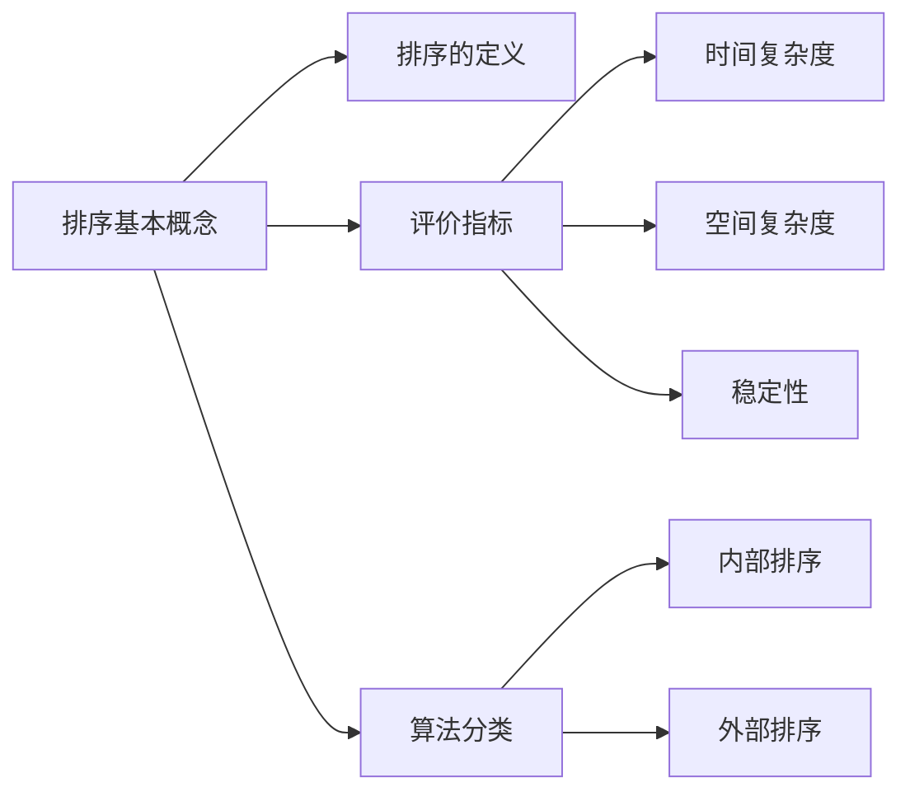

### 1. 排序的定义

**排序（Sort）**：重新排列列表中的元素，使表中的元素满足**按关键字有序**的过程。

> **输入**：$n$ 个记录 $R_1, R_2, \ldots, R_n$，对应的关键字为 $k_1, k_2, \ldots, k_n$。
>
> **输出**：输入序列的一个重排 $R_1', R_2', \ldots, R_n'$，使得有 $k_1' \leqslant k_2' \leqslant \ldots \leqslant k_n'$（也可递减）。

**Eg**：

| 排序前 | 6 | 3 | 2 | 8 | 10 | 1 | 4 | 7 | 9 | 5 |
| --- | --- | --- | --- | --- | --- | --- | --- | --- | --- | --- |
| 排序后 | 1 | 2 | 3 | 4 | 5 | 6 | 7 | 8 | 9 | 10 |

**排序算法的应用**：

- 游戏排行榜：按"荣耀战力"排序；
- 财富排行榜：按"财富值"排序。

> 关键字不同，排序结果不同——关键字是排序的依据。

### 2. 排序算法的评价指标

#### 2.1 时间复杂度与空间复杂度

- **时间复杂度**：排序过程中**关键字的比较次数**和**元素移动次数**；
- **空间复杂度**：排序过程中所需的**辅助存储空间**。

#### 2.2 稳定性

**定义**：若待排序表中有两个元素 $R_i$ 和 $R_j$，其对应的关键字相同即 $key_i = key_j$，且在排序前 $R_i$ 在 $R_j$ 的前面，若使用某一排序算法排序后，$R_i$ **仍然在** $R_j$ 的前面，则称这个排序算法是**稳定的**，否则称排序算法是**不稳定的**。

**Eg**：序列 `6 3 2 5 1 4 3̲`（两个 3，紫色在前、红色在后）：

| 排序结果 | 关键字相同的元素相对位置 | 稳定性 |
| --- | --- | --- |
| `1 2 3 3 4 5 6`（紫色 3 仍在红色 3 前面） | 相对位置**不变** | **稳定** |
| `1 2 3̲ 3 4 5 6`（红色 3 跑到紫色 3 前面） | 相对位置**改变** | **不稳定** |

> **问**：稳定的排序算法一定比不稳定的好？
>
> **答**：不一定，要看实际需求。

### 3. 排序算法的分类

| 分类 | 特点 | 关注重点 |
| --- | --- | --- |
| **内部排序** | 数据**都在内存中** | 如何使算法的**时间、空间复杂度更低** |
| **外部排序** | 数据太多，**无法全部放入内存** | 除了时间/空间复杂度，还要关注**如何使读/写磁盘次数更少** |

**内部排序 vs 外部排序的本质区别**：

- 内存（如 8GB DDR4）读写速度可达 60GB/s；
- 磁盘（如 1TB 机械硬盘）读写速度约 100MB/s；
- 内存比磁盘快约 **600 倍**——数据量太大无法全部装入内存时，频繁读写磁盘会成为瓶颈，因此外部排序需要专门设计以减少磁盘 I/O。

### 4. 本节知识回顾

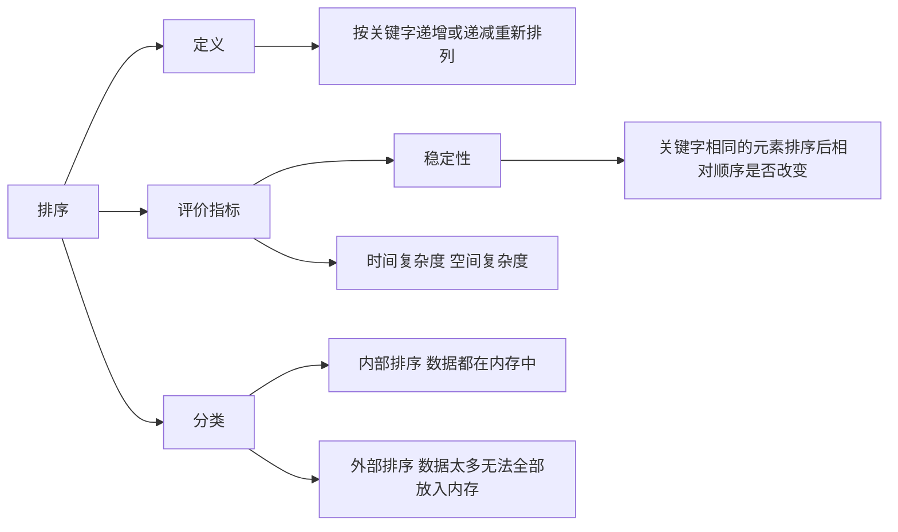

**本节考点**：**排序 = 按关键字递增/递减重新排列** → **评价指标三件套：时间复杂度、空间复杂度、稳定性** → **稳定性定义：关键字相同的元素排序后相对顺序是否改变（不变=稳定，改变=不稳定）** → **分类：内部排序（数据全在内存，关注时空复杂度）vs 外部排序（数据太大放不进内存，还要关注读写磁盘次数）** → **稳定不一定比不稳定好，看实际需求**。

可视化练习：https://www.cs.usfca.edu/~galles/visualization/Algorithms.html

---

## 8.2 插入排序

**本节知识总览**：

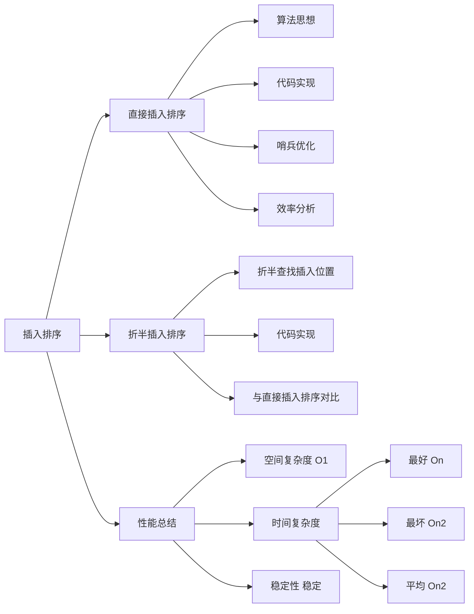

### 8.2.1 直接插入排序

#### 1. 算法思想

每次将一个**待排序的记录**按其关键字大小插入到前面**已排好序的子序列**中，直到全部记录插入完成。

> 类比打扑克牌：每摸到一张新牌，就把它插入到手中已排好序的牌的正确位置。

#### 2. 排序过程演示

初始序列：`[49, 38, 65, 97, 76, 13, 27, 49̲]`（最后一个 49 加下划线以示区分）

| 趟数 | 操作 | 排序结果 |
| --- | --- | --- |
| 初始 | — | `[49]` 38 65 97 76 13 27 49̲ |
| 第1趟 | 38 插入到 49 前面 | `[38 49]` 65 97 76 13 27 49̲ |
| 第2趟 | 65 已在 49 后面，不动 | `[38 49 65]` 97 76 13 27 49 |
| 第3趟 | 97 已在 65 后面，不动 | `[38 49 65 97]` 76 13 27 49̲ |
| 第4趟 | 76 插入到 65 和 97 之间 | `[38 49 65 76 97]` 13 27 49̲ |
| 第5趟 | 13 插入到最前面，前面全部右移 | `[13 38 49 65 76 97]` 27 49̲ |
| 第6趟 | 27 插入到 13 和 38 之间 | `[13 27 38 49 65 76 97]` 49̲ |
| 第7趟 | 49̲ 插入到 49 和 65 之间 | `[13 27 38 49 49̲ 65 76 97]` |

> 注意第7趟：49̲ 插入到 49 后面而非前面，**保持了稳定性**。

#### 3. 代码实现

```c
// 直接插入排序
void InsertSort(int A[], int n) {
    int i, j, temp;
    for (i = 1; i < n; i++)                  // 将各元素插入已排好序的序列中
        if (A[i] < A[i - 1]) {               // 若 A[i] 关键字小于前驱
            temp = A[i];                     // 用 temp 暂存 A[i]
            for (j = i - 1; j >= 0 && A[j] > temp; --j)  // 检查所有前面已排好序的元素
                A[j + 1] = A[j];             // 所有大于 temp 的元素都向后挪位
            A[j + 1] = temp;                 // 复制到插入位置
        }
}
```

#### 4. 哨兵优化

利用 `A[0]` 作为**哨兵**（不存放数据），可以省去内层循环中 `j >= 0` 的边界检查。

```c
// 直接插入排序（带哨兵）
void InsertSort(int A[], int n) {
    int i, j;
    for (i = 2; i <= n; i++)                 // 依次将 A[2]~A[n] 插入到前面已排序序列
        if (A[i] < A[i - 1]) {               // 若 A[i] 关键码小于其前驱，将 A[i] 插入有序表
            A[0] = A[i];                     // 复制为哨兵，A[0] 不存放元素
            for (j = i - 1; A[0] < A[j]; --j) // 从后往前查找待插入位置
                A[j + 1] = A[j];             // 向后挪位
            A[j + 1] = A[0];                 // 复制到插入位置
        }
}
```

**哨兵的作用**：

- 数组下标从 0 到 n，`A[0]` 作为哨兵，数据存放在 `A[1]` ~ `A[n]`；
- 当内层循环 `j` 减到 0 时，`A[0]`（哨兵）与自身比较，`A[0] < A[0]` 为假，循环自然终止；
- **省去了每次循环都要检查 `j >= 0`**，减少了比较次数。

#### 5. 算法效率分析

| 指标 | 值 | 说明 |
| --- | --- | --- |
| **空间复杂度** | $O(1)$ | 仅使用常数个辅助变量（temp / 哨兵） |
| **最好时间复杂度** | $O(n)$ | 序列已有序，每趟只需 1 次比较，共 $n-1$ 趟，无需移动 |
| **最坏时间复杂度** | $O(n^2)$ | 序列逆序，第 $i$ 趟比较 $i+1$ 次、移动 $i+2$ 次 |
| **平均时间复杂度** | $O(n^2)$ | — |
| **稳定性** | **稳定** | 相同关键字元素相对顺序不变 |

**最坏情况推导**（逆序 `[20, 30, 40, 50, 60, 70, 80, 10]`）：

| 趟数 | 比较关键字次数 | 移动元素次数 |
| --- | --- | --- |
| 第1趟 | 2 | 3 |
| 第2趟 | 3 | 4 |
| 第 $i$ 趟 | $i+1$ | $i+2$ |
| 第 $n-1$ 趟 | $n$ | $n+1$ |

总比较次数 $\approx \sum_{i=1}^{n-1}(i+1) = O(n^2)$，总移动次数 $\approx \sum_{i=1}^{n-1}(i+2) = O(n^2)$。

### 8.2.2 折半插入排序

#### 1. 算法思想

在直接插入排序的基础上**优化查找过程**：先用**折半查找**找到应该插入的位置，再移动元素。

> 直接插入排序中，查找插入位置是**顺序查找**（从后往前逐个比较）；折半插入排序将其改为**折半查找**，减少了关键字比较次数。

#### 2. 排序过程演示

初始序列（哨兵在 A[0]）：`[_, 20, 30, 40, 50, 60, 70, 80, 55, 60, 90, 10]`

**插入 55（i=8）**：

1. 哨兵 `A[0] = 55`，折半查找范围 `[low=1, high=7]`
2. `mid=4, A[4]=50 < 55` → `low=5`
3. `mid=6, A[6]=70 > 55` → `high=5`
4. `mid=5, A[5]=60 > 55` → `high=4`
5. `low=5 > high=4`，查找停止，插入位置为 `low=5`
6. 将 `[5, 7]` 内元素（60, 70, 80）右移，`A[5] = 55`

结果：`[_, 20, 30, 40, 50, 55, 60, 70, 80, 60, 90, 10]`

**插入 60（i=9）**：

1. 哨兵 `A[0] = 60`，折半查找范围 `[low=1, high=8]`
2. `mid=4, A[4]=50 < 60` → `low=5`
3. `mid=6, A[6]=60 == 60` → 为保证稳定性，`low=mid+1=7`（继续在右边找）
4. `mid=7, A[7]=70 > 60` → `high=6`
5. `low=7 > high=6`，查找停止，插入位置为 `low=7`
6. 将 `[7, 8]` 内元素（70, 80）右移，`A[7] = 60`

> **关键**：当 `A[mid] == A[0]` 时，为保证**稳定性**，应继续令 `low = mid + 1`，在 mid 右边继续查找。

**插入 10（i=11）**：

1. 哨兵 `A[0] = 10`，折半查找范围 `[low=1, high=10]`
2. `mid=5, A[5]=55 > 10` → `high=4`
3. `mid=2, A[2]=20 > 10` → `high=1`
4. `mid=1, A[1]=10 == 10` → 为保证稳定性，`low=2`
5. `low=2 > high=1`，查找停止，插入位置为 `low=1`
6. 将 `[1, 10]` 内所有元素右移，`A[1] = 10`

最终结果：`[_, 10, 20, 30, 40, 50, 55, 60, 60, 70, 80, 90]`

#### 3. 代码实现

```c
// 折半插入排序
void InsertSort(int A[], int n) {
    int i, j, low, high, mid;
    for (i = 2; i <= n; i++) {               // 依次将 A[2]~A[n] 插入前面的已排序序列
        A[0] = A[i];                         // 将 A[i] 暂存到 A[0]
        low = 1; high = i - 1;               // 设置折半查找的范围
        while (low <= high) {                // 折半查找（默认递增有序）
            mid = (low + high) / 2;          // 取中间点
            if (A[mid] > A[0]) high = mid - 1;  // 查找左半子表
            else low = mid + 1;              // 查找右半子表（A[mid]==A[0] 时也走这里，保证稳定性）
        }
        for (j = i - 1; j >= high + 1; --j)  // 统一后移元素，空出插入位置
            A[j + 1] = A[j];
        A[high + 1] = A[0];                  // 插入操作（high+1 == low）
    }
}
```

**要点**：

- 折半查找结束时 `low > high`，插入位置为 `low`（即 `high + 1`）；
- 当 `A[mid] == A[0]` 时，执行 `low = mid + 1`（而非 `high = mid - 1`），保证相同关键字元素的相对顺序不变；
- 元素移动操作与直接插入排序**完全相同**，只是查找方式不同。

#### 4. 与直接插入排序的对比

| 对比项 | 直接插入排序 | 折半插入排序 |
| --- | --- | --- |
| 查找方式 | 顺序查找 | 折半查找 |
| 关键字比较次数 | 较多 | **减少**（$O(n\log n)$ 量级） |
| 元素移动次数 | 不变 | **不变**（仍需逐个后移） |
| 时间复杂度 | $O(n^2)$ | $O(n^2)$（移动操作仍是瓶颈） |
| 稳定性 | 稳定 | 稳定 |
| 适用数据结构 | 顺序表、链表 | **仅适用于顺序表**（需要随机访问才能折半查找） |

> 折半插入排序减少了比较次数，但**元素移动次数不变**，整体时间复杂度仍为 $O(n^2)$。

### 3. 本节知识回顾

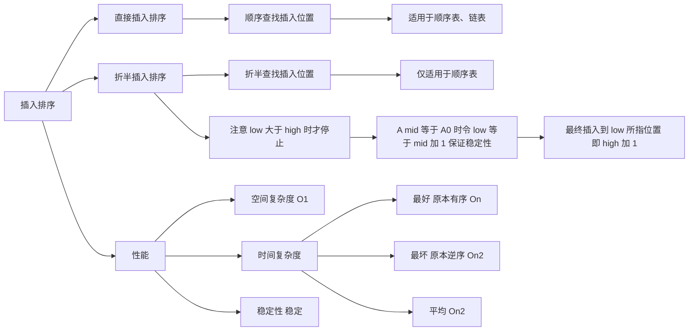

**本节考点**：**直接插入排序 = 顺序查找插入位置 + 后移元素** → **哨兵 A[0] 省去 j≥0 检查** → **折半插入排序 = 折半查找插入位置 + 后移元素（比较次数减少但移动次数不变，时间复杂度仍 O(n²)）** → **折半查找仅适用于顺序表** → **A[mid]==A[0] 时令 low=mid+1 保证稳定性** → **最终插入位置为 low（即 high+1）** → **空间 O(1)，最好 O(n)，最坏/平均 O(n²)，稳定**。

可视化练习：https://www.cs.usfca.edu/~galles/visualization/InsertionSort.html

---

### 8.2.3 希尔排序

#### 1. 算法思想

**希尔排序（Shell Sort）** 又称**缩小增量排序**，核心思想：

1. 先将待排序表分割成若干形如 $L[i,\ i+d,\ i+2d,\ \ldots,\ i+kd]$ 的"特殊"子表（按增量 $d$ 分组）；
2. 对各个子表分别进行**直接插入排序**；
3. **缩小增量 $d$**，重复上述过程，直到 $d=1$ 为止（此时整个表作为一组，做一次直接插入排序）。

> 希尔排序先追求表中元素**部分有序**，再逐渐逼近**全局有序**。当 $d=1$ 时，表"基本有序"，最后一趟直接插入排序效率很高。

**增量序列**：希尔本人建议每次将增量缩小一半，即 $d_1 = n/2,\ d_2 = d_1/2,\ \ldots,\ d_k = 1$。考试中可能遇到各种增量序列，需按给定增量逐步模拟。

#### 2. 排序过程演示

##### 增量序列 $d_1=4,\ d_2=2,\ d_3=1$

初始序列（$n=8$，A[0] 为暂存单元）：

| 下标 | 0 | 1 | 2 | 3 | 4 | 5 | 6 | 7 | 8 |
| --- | --- | --- | --- | --- | --- | --- | --- | --- | --- |
| 元素 | — | 49 | 38 | 65 | 97 | 76 | 13 | 27 | 49̲ |

**第一趟 $d_1 = n/2 = 4$**：将表分为 4 个子表，分别排序。

| 子表 | 元素 | 排序后 |
| --- | --- | --- |
| 子表1（下标 1,5） | {49, 76} | {49, 76} |
| 子表2（下标 2,6） | {38, 13} | {13, 38} |
| 子表3（下标 3,7） | {65, 27} | {27, 65} |
| 子表4（下标 4,8） | {97, 49̲} | {49̲, 97} |

第一趟结果：`[_, 49, 13, 27, 49̲, 76, 38, 65, 97]`

**第二趟 $d_2 = d_1/2 = 2$**：将表分为 2 个子表，分别排序。

| 子表 | 元素 | 排序后 |
| --- | --- | --- |
| 子表1（下标 1,3,5,7） | {49, 27, 76, 65} | {27, 49, 65, 76} |
| 子表2（下标 2,4,6,8） | {13, 49̲, 38, 97} | {13, 38, 49, 97} |

第二趟结果：`[_, 27, 13, 49, 38, 65, 49̲, 76, 97]`

**第三趟 $d_3 = d_2/2 = 1$**：整个表作为一组，做直接插入排序。

第三趟结果：`[_, 13, 27, 38, 49, 49, 65, 76, 97]` ✅

##### 增量序列 $d_1=3,\ d_2=1$（另一组增量示例）

初始序列同上：`[_, 49, 38, 65, 97, 76, 13, 27, 49̲]`

**第一趟 $d_1 = 3$**：分为 3 个子表。

| 子表 | 元素 | 排序后 |
| --- | --- | --- |
| 子表1（下标 1,4,7） | {49, 97, 27} | {27, 49, 97} |
| 子表2（下标 2,5,8） | {38, 76, 49̲} | {38, 49̲, 76} |
| 子表3（下标 3,6） | {65, 13} | {13, 65} |

第一趟结果：`[_, 27, 38, 13, 49, 49̲, 65, 97, 76]`

**第二趟 $d_2 = 1$**：整个表做直接插入排序。

第二趟结果：`[_, 13, 27, 38, 49, 49̲, 65, 76, 97]` ✅

#### 3. 代码实现

```c
// 希尔排序
void ShellSort(int A[], int n) {
    int d, i, j;
    // A[0]只是暂存单元，不是哨兵，当j<=0时，插入位置已到
    for (d = n / 2; d >= 1; d = d / 2)       // 步长变化
        for (i = d + 1; i <= n; ++i)
            if (A[i] < A[i - d]) {            // 需将A[i]插入有序增量子表
                A[0] = A[i];                  // 暂存在A[0]
                for (j = i - d; j > 0 && A[0] < A[j]; j -= d)
                    A[j + d] = A[j];          // 记录后移，查找插入的位置
                A[j + d] = A[0];              // 插入
            } // if
}
```

**与直接插入排序的关键区别**：

| 对比项 | 直接插入排序 | 希尔排序 |
| --- | --- | --- |
| A[0] 的角色 | **哨兵**（兼暂存，省去 $j \geq 0$ 检查） | **仅暂存**（不是哨兵，需 $j > 0$ 边界检查） |
| 步长 | 固定为 1 | 从 $n/2$ 逐步缩小到 1 |
| 内层循环步长 | `j--` | `j -= d` |
| 循环终止条件 | `A[0] < A[j]`（哨兵保证不会越界） | `j > 0 && A[0] < A[j]`（必须显式检查 $j>0$） |

#### 4. 算法执行过程详解

以增量序列 $d=4, 2, 1$ 为例，逐步跟踪代码执行。

初始：`[_, 49, 38, 65, 97, 76, 13, 27, 49̲]`

**第一趟 $d=4$**（$i$ 从 5 到 8）：

| $i$ | $A[i]$ vs $A[i-4]$ | 操作 | 数组状态 |
| --- | --- | --- | --- |
| 5 | $A[5]=76 > A[1]=49$ | 不交换 | `[_, 49, 38, 65, 97, 76, 13, 27, 49̲]` |
| 6 | $A[6]=13 < A[2]=38$ | 38→A[6], 13→A[2] | `[_, 49, 13, 65, 97, 76, 38, 27, 49̲]` |
| 7 | $A[7]=27 < A[3]=65$ | 65→A[7], 27→A[3] | `[_, 49, 13, 27, 97, 76, 38, 65, 49̲]` |
| 8 | $A[8]=49̲ < A[4]=97$ | 97→A[8], 49̲→A[4] | `[_, 49, 13, 27, 49̲, 76, 38, 65, 97]` |

**第二趟 $d=2$**（$i$ 从 3 到 8）：

| $i$ | $A[i]$ vs $A[i-2]$ | 操作 | 数组状态 |
| --- | --- | --- | --- |
| 3 | $A[3]=27 < A[1]=49$ | 49→A[3], 27→A[1] | `[_, 27, 13, 49, 49̲, 76, 38, 65, 97]` |
| 4 | $A[4]=49̲ > A[2]=13$ | 不交换 | `[_, 27, 13, 49, 49̲, 76, 38, 65, 97]` |
| 5 | $A[5]=76 > A[3]=49$ | 不交换 | `[_, 27, 13, 49, 49̲, 76, 38, 65, 97]` |
| 6 | $A[6]=38 < A[4]=49̲$ | 49̲→A[6], 38→A[4] | `[_, 27, 13, 49, 38, 76, 49̲, 65, 97]` |
| 7 | $A[7]=65 < A[5]=76$ | 76→A[7], 65→A[5] | `[_, 27, 13, 49, 38, 65, 49̲, 76, 97]` |
| 8 | $A[8]=97 > A[6]=49̲$ | 不交换 | `[_, 27, 13, 49, 38, 65, 49̲, 76, 97]` |

**第三趟 $d=1$**（$i$ 从 2 到 8，等价于直接插入排序）：

| $i$ | $A[i]$ vs $A[i-1]$ | 操作 | 数组状态 |
| --- | --- | --- | --- |
| 2 | $A[2]=13 < A[1]=27$ | 27→A[2], 13→A[1] | `[_, 13, 27, 49, 38, 65, 49̲, 76, 97]` |
| 3 | $A[3]=49 > A[2]=27$ | 不交换 | 不变 |
| 4 | $A[4]=38 < A[3]=49$ | 49→A[4], 38→A[3] | `[_, 13, 27, 38, 49, 65, 49, 76, 97]` |
| 5 | $A[5]=65 > A[4]=49$ | 不交换 | 不变 |
| 6 | $A[6]=49̲ < A[5]=65$ | 65→A[6], 49̲→A[5] | `[_, 13, 27, 38, 49, 49̲, 65, 76, 97]` |
| 7 | $A[7]=76 > A[6]=65$ | 不交换 | 不变 |
| 8 | $A[8]=97 > A[7]=76$ | 不交换 | 不变 |

最终结果：`[_, 13, 27, 38, 49, 49̲, 65, 76, 97]` ✅

#### 5. 算法性能分析

| 指标 | 结论 |
| --- | --- |
| **空间复杂度** | $O(1)$（仅用常数个辅助单元 A[0]） |
| **时间复杂度** | 与增量序列 $d_1, d_2, d_3, \ldots$ 的选择有关，目前**无法用数学手段证明确切的时间复杂度**。最坏时间复杂度为 $O(n^2)$，当 $n$ 在某个范围内时，可达 $O(n^{1.3})$ |
| **稳定性** | **不稳定** |
| **适用性** | **仅适用于顺序表**，不适用于链表 |

**不稳定的反例**：

原始序列：`[65, 49, 49̲]`（两个 49 中后者用 49̲ 标记）

| 趟次 | 增量 | 结果 |
| --- | --- | --- |
| 第一趟 | $d=2$ | `[49, 49, 65]` |
| 第二趟 | $d=1$ | `[49̲, 49, 65]` |

两个 49 的相对顺序发生了改变（原来 49 在前、49̲ 在后，排序后 49̲ 在前），因此希尔排序**不稳定**。

#### 6. 本节知识回顾

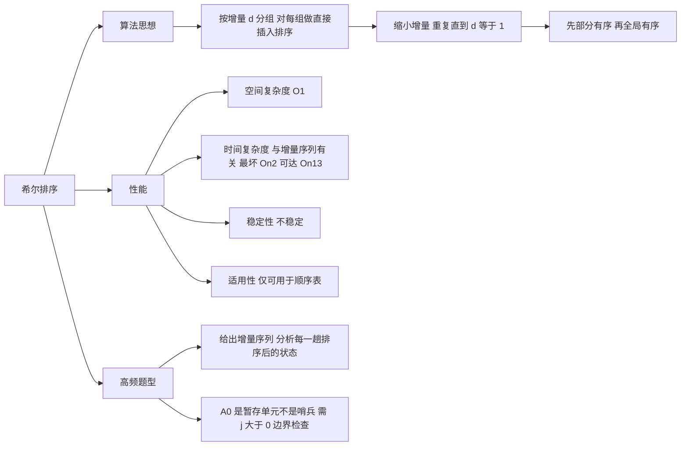

**本节考点**：**希尔排序 = 按增量分组 + 组内直接插入排序 + 缩小增量重复** → **A[0] 是暂存单元不是哨兵（需 $j>0$ 检查）** → **空间 $O(1)$，时间复杂度与增量序列有关（最坏 $O(n^2)$，可达 $O(n^{1.3})$）** → **不稳定** → **仅适用于顺序表** → **高频题型：给出增量序列，分析每一趟排序后的状态**。

可视化练习：https://www.cs.usfca.edu/~galles/visualization/ShellSort.html

---

## 8.3 交换排序

**本节知识总览**：

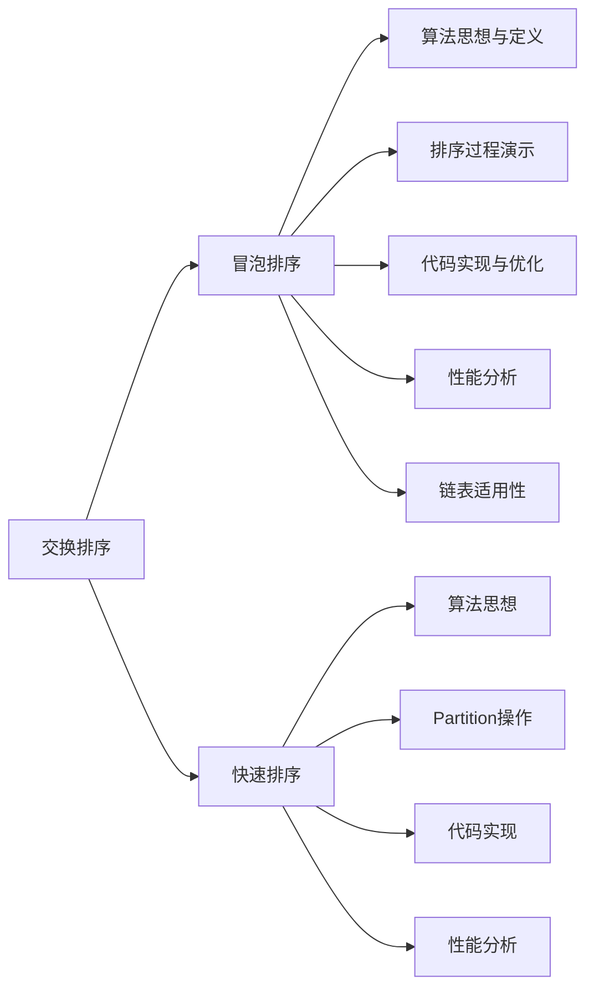

### 8.3.1 冒泡排序

#### 1. 算法思想

**冒泡排序（Bubble Sort）** 属于**交换排序**，核心思想：

从后往前（或从前往后）**两两比较相邻元素的值**，若为逆序（即 $A[i-1] > A[i]$），则**交换它们**，直到序列比较完。称这样过程为"**一趟**"冒泡排序。

> **关键特征**：每一趟排序都可以使一个元素移动到最终位置；已经确定最终位置的元素在之后的处理中无需再对比。如果某一趟排序过程中未发生"交换"，则算法可提前结束。最多只需 $n-1$ 趟排序。

#### 2. 排序过程演示

初始序列（0-indexed，无哨兵）：`[49, 38, 65, 97, 76, 13, 27, 49̲]`（最后一个 49 加下划线以示区分）

**第1趟**（从后往前比较，共 7 次比较，6 次交换）：

| 比较对 | 比较结果 | 是否交换 | 数组状态 |
| --- | --- | --- | --- |
| A[6]=27 vs A[7]=49̲ | 27 < 49 | 否 | `[49, 38, 65, 97, 76, 13, 27, 49̲]` |
| A[5]=13 vs A[6]=27 | 13 < 27 | 否 | `[49, 38, 65, 97, 76, 13, 27, 49̲]` |
| A[4]=76 vs A[5]=13 | 76 > 13 | **是** | `[49, 38, 65, 97, 13, 76, 27, 49]` |
| A[3]=97 vs A[4]=13 | 97 > 13 | **是** | `[49, 38, 65, 13, 97, 76, 27, 49̲]` |
| A[2]=65 vs A[3]=13 | 65 > 13 | **是** | `[49, 38, 13, 65, 97, 76, 27, 49̲]` |
| A[1]=38 vs A[2]=13 | 38 > 13 | **是** | `[49, 13, 38, 65, 97, 76, 27, 49̲]` |
| A[0]=49 vs A[1]=13 | 49 > 13 | **是** | `[13, 49, 38, 65, 97, 76, 27, 49̲]` |

第1趟结束：`[13, 49, 38, 65, 97, 76, 27, 49̲]` — 最小元素 13 "冒"到最前面 ✅

**第2趟**（跳过已就位的 pos 0，共 6 次比较，5 次交换）：

| 比较对 | 比较结果 | 是否交换 | 数组状态 |
| --- | --- | --- | --- |
| A[6]=27 vs A[7]=49̲ | 27 < 49̲ | 否 | `[13, 49, 38, 65, 97, 76, 27, 49̲]` |
| A[5]=76 vs A[6]=27 | 76 > 27 | **是** | `[13, 49, 38, 65, 97, 27, 76, 49̲]` |
| A[4]=97 vs A[5]=27 | 97 > 27 | **是** | `[13, 49, 38, 65, 27, 97, 76, 49]` |
| A[3]=65 vs A[4]=27 | 65 > 27 | **是** | `[13, 49, 38, 27, 65, 97, 76, 49̲]` |
| A[2]=38 vs A[3]=27 | 38 > 27 | **是** | `[13, 49, 27, 38, 65, 97, 76, 49̲]` |
| A[1]=49 vs A[2]=27 | 49 > 27 | **是** | `[13, 27, 49, 38, 65, 97, 76, 49̲]` |

第2趟结束：`[13, 27, 49, 38, 65, 97, 76, 49̲]` — 最小的两个元素"冒"到最前边 ✅

**第3趟**（跳过 pos 0,1，共 5 次比较，4 次交换）：

| 比较对 | 比较结果 | 是否交换 | 数组状态 |
| --- | --- | --- | --- |
| A[6]=76 vs A[7]=49̲ | 76 > 49 | **是** | `[13, 27, 49, 38, 65, 97, 49̲, 76]` |
| A[5]=97 vs A[6]=49̲ | 97 > 49̲ | **是** | `[13, 27, 49, 38, 65, 49̲, 97, 76]` |
| A[4]=65 vs A[5]=49̲ | 65 > 49̲ | **是** | `[13, 27, 49, 38, 49̲, 65, 97, 76]` |
| A[3]=38 vs A[4]=49̲ | 38 < 49 | 否 | `[13, 27, 49, 38, 49̲, 65, 97, 76]` |
| A[2]=49 vs A[3]=38 | 49 > 38 | **是** | `[13, 27, 38, 49, 49̲, 65, 97, 76]` |

第3趟结束：`[13, 27, 38, 49, 49, 65, 97, 76]` — 最小的3个元素"冒"到最前边 ✅

**第4趟**（跳过 pos 0,1,2，共 4 次比较，1 次交换）：

| 比较对 | 比较结果 | 是否交换 | 数组状态 |
| --- | --- | --- | --- |
| A[6]=97 vs A[7]=76 | 97 > 76 | **是** | `[13, 27, 38, 49, 49̲, 65, 76, 97]` |
| A[5]=65 vs A[6]=76 | 65 < 76 | 否 | `[13, 27, 38, 49, 49̲, 65, 76, 97]` |
| A[4]=49̲ vs A[5]=65 | 49̲ < 65 | 否 | `[13, 27, 38, 49, 49̲, 65, 76, 97]` |
| A[3]=49 vs A[4]=49̲ | 49 == 49̲ | 否 | `[13, 27, 38, 49, 49̲, 65, 76, 97]` |

第4趟结束：`[13, 27, 38, 49, 49̲, 65, 76, 97]` — 最小的4个元素"冒"到最前边 ✅

**第5趟**（跳过 pos 0,1,2,3，共 3 次比较，**0 次交换**）：

| 比较对 | 比较结果 | 是否交换 |
| --- | --- | --- |
| A[6]=76 vs A[7]=97 | 76 < 97 | 否 |
| A[5]=65 vs A[6]=76 | 65 < 76 | 否 |
| A[4]=49̲ vs A[5]=65 | 49̲ < 65 | 否 |
| A[3]=49 vs A[4]=49 | 49 == 49̲ | 否 |

第5趟无任何交换 → **序列已整体有序，算法提前终止！**

最终结果：`[13, 27, 38, 49, 49̲, 65, 76, 97]` ✅

> **稳定性验证**：原始序列中 49 在前、49̲ 在后；排序后仍然是 49 在前、49̲ 在后（第4趟中 49 vs 49̲ 相等不交换）。相对顺序不变 → **稳定**。

#### 3. 代码实现

```c
// 交换函数
void swap(int &a, int &b) {
    int temp = a;
    a = b;
    b = temp;
}

// 冒泡排序
void BubbleSort(int A[], int n) {
    for (int i = 0; i < n - 1; i++) {           // 外层循环控制趟数，最多 n-1 趟
        bool flag = false;                       // 表示本趟冒泡是否发生交换的标志
        for (int j = n - 1; j > i; j--)          // 一趟冒泡过程：从后往前比较
            if (A[j - 1] > A[j]) {               // 若为逆序
                swap(A[j - 1], A[j]);            // 交换
                flag = true;                      // 标记发生了交换
            }
        if (flag == false)                        // 本趟遍历后没有发生交换
            return;                               // 说明表已经有序，提前结束
    }
}
```

**要点**：

- `i` 所指位置之前的元素都已"有序"（每趟确定一个元素的最终位置）；
- `j` 从 `n-1` 递减到 `i+1`，比较 `A[j-1]` 与 `A[j]`；
- **只有 $A[j-1] > A[j]$ 时才交换**（严格大于才交换，等于不交换），因此算法是**稳定的**；
- `flag` 标志位实现**提前终止**：某趟无交换 → 已有序 → 直接返回。

#### 4. 算法性能分析

| 指标 | 结论 | 说明 |
| --- | --- | --- |
| **空间复杂度** | $O(1)$ | 仅使用常数个辅助变量（temp、flag） |
| **最好时间复杂度** | $O(n)$ | 序列已有序，只需 1 趟，比较 $n-1$ 次，交换 0 次 |
| **最坏时间复杂度** | $O(n^2)$ | 序列逆序，比较次数 = 交换次数 = $\frac{n(n-1)}{2}$ |
| **平均时间复杂度** | $O(n^2)$ | — |
| **稳定性** | **稳定** | 只有 $A[j-1] > A[j]$ 才交换，相等不交换 |

**最好情况推导**（有序 `[1, 2, 3, 4, 5, 6, 7, 8]`）：

- 第1趟：比较 $n-1$ 次，交换 0 次，`flag=false` → 提前返回
- 总比较次数 = $n-1$，总交换次数 = 0
- 时间复杂度 = $O(n)$

**最坏情况推导**（逆序 `[8, 7, 6, 5, 4, 3, 2, 1]`）：

- 每次交换需要移动元素 **3 次**（swap 函数中的三步赋值）
- 比较次数 = $(n-1)+(n-2)+\cdots+1 = \frac{n(n-1)}{2}$
- 交换次数 = 比较次数 = $\frac{n(n-1)}{2}$
- 时间复杂度 = $O(n^2)$

#### 5. 冒泡排序是否适用于链表？

**可以。** 但需调整方向：**从前往后"冒泡"**，每一趟将更大的元素"冒"到链尾。

以单链表 `L → 49 → 38 → 65 → 97 → 76 → 13 → 27 → 49̲ → NULL` 为例：

- 从前往后两两比较相邻节点的值，若逆序则交换（修改指针指向，而非交换数据域）；
- 每一趟将当前未排序部分的最大值"冒"到链尾；
- 下一趟缩短遍历范围（跳过已就位的尾部节点）。

> 链表版冒泡排序的**比较次数和交换次数**与数组版相同，时间复杂度仍为 $O(n^2)$，空间复杂度 $O(1)$，且仍然**稳定**。

#### 6. 知识回顾与重要考点

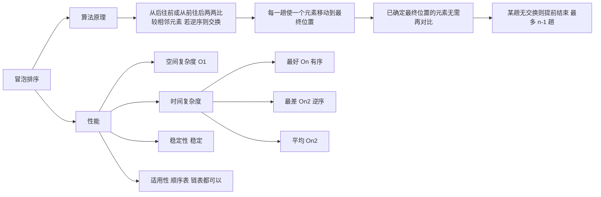

**本节考点**：**冒泡排序 = 两两比较相邻元素 + 逆序则交换 + 每趟确定一个元素最终位置** → **flag 提前终止（某趟无交换→已有序）** → **最多 $n-1$ 趟** → **空间 $O(1)$，最好 $O(n)$（有序），最坏/平均 $O(n^2)$（逆序）** → **稳定（只有严格大于才交换）** → **顺序表、链表都适用（链表需从前往后冒泡）**。

可视化练习：https://www.cs.usfca.edu/~galles/visualization/BubbleSort.html

---

## 8.3.2 快速排序

### 1. 算法思想

快速排序是**交换排序**中最高效的算法，也是**所有内部排序算法中平均性能最优**的排序算法。

**核心思想**：在待排序表 $L[1\ldots n]$ 中任取一个元素 `pivot` 作为**枢轴**（或基准，通常取首元素），通过一趟排序将待排序表划分为独立的两部分 $L[1\ldots k-1]$ 和 $L[k+1\ldots n]$，使得 $L[1\ldots k-1]$ 中的所有元素**小于** `pivot`，$L[k+1\ldots n]$ 中的所有元素**大于等于** `pivot`，则 `pivot` 放在了其最终位置 $L(k)$ 上。这个过程称为一次**"划分"**。然后分别递归地对两个子表重复上述过程，直至每部分内只有一个元素或空为止，即所有元素放在了其最终位置上。

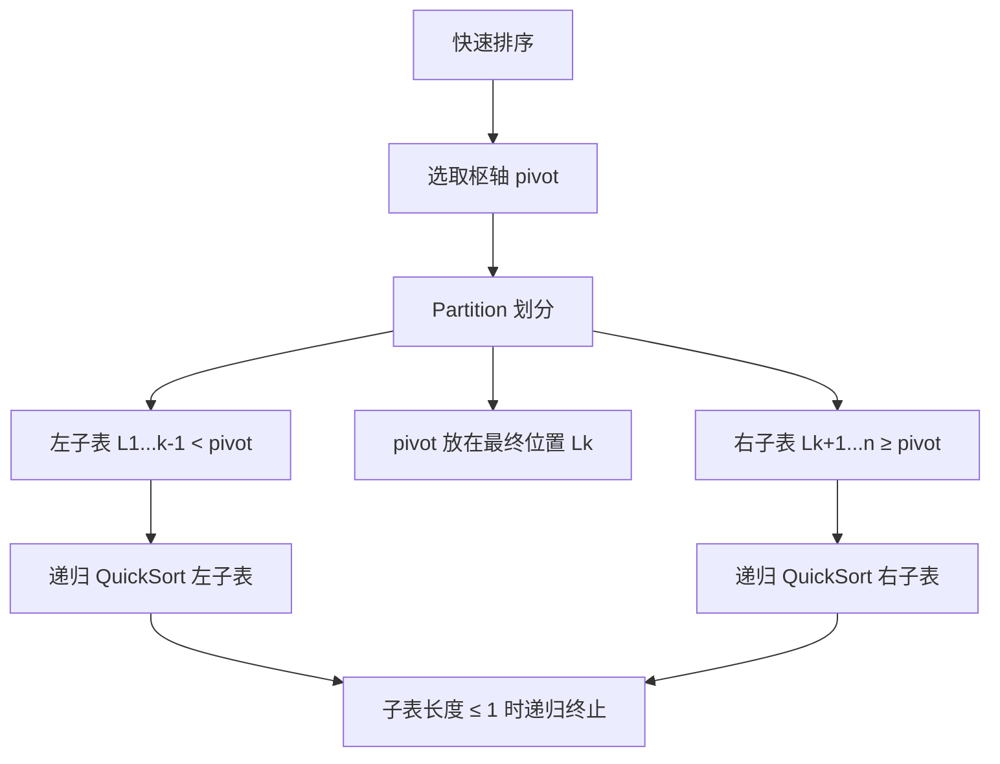

> **注意**：408 原题中说，对所有尚未确定最终位置的所有元素进行一遍处理称为"一趟"排序，因此一次"划分" ≠ 一趟排序。一次划分可以确定一个元素的最终位置，而一趟排序也许可以确定多个元素的最终位置。

### 2. 划分操作（Partition）详解

**Partition 操作**是快速排序的核心，使用 `low` 和 `high` 两个指针从两端向中间扫描：

1. 将第一个元素 `A[low]` 作为枢轴 `pivot`，暂存起来；
2. `high` 从右往左扫描，找到第一个 $< pivot$ 的元素，将其移到 `low` 位置；
3. `low` 从左往右扫描，找到第一个 $> pivot$ 的元素，将其移到 `high` 位置；
4. 重复步骤 2-3，直到 `low == high`；
5. 将 `pivot` 放到 `low`（即 `high`）位置，返回该位置。

#### 示例：`[49, 38, 65, 97, 76, 13, 27, 49]`，`low=0`，`high=7`

**第 1 趟 Partition**（枢轴 `pivot = 49`）：

| 步骤 | 操作 | low | high | 数组状态 |
|------|------|-----|------|----------|
| 初始 | 保存 pivot=49 | 0 | 7 | `[_, 38, 65, 97, 76, 13, 27, 49]` |
| ① | high 从右扫描：A[7]=49≥49→high=6；A[6]=27<49→A[0]=27 | 0 | 6 | `[27, 38, 65, 97, 76, 13, _, 49]` |
| ② | low 从左扫描：A[0]=27≤49→low=1；A[1]=38≤49→low=2；A[2]=65>49→A[6]=65 | 2 | 6 | `[27, 38, _, 97, 76, 13, 65, 49]` |
| ③ | high 继续：A[5]=13<49→A[2]=13 | 2 | 5 | `[27, 38, 13, 97, 76, _, 65, 49]` |
| ④ | low 继续：A[2]=13≤49→low=3；A[3]=97>49→A[5]=97 | 3 | 5 | `[27, 38, 13, _, 76, 97, 65, 49]` |
| ⑤ | high 继续：A[4]=76≥49→high=3；low==high=3 | 3 | 3 | `[27, 38, 13, _, 76, 97, 65, 49]` |
| 结束 | A[3]=pivot=49 | 3 | 3 | `[27, 38, 13, 49, 76, 97, 65, 49]` |

返回 `p = 3`。枢轴 49 已在最终位置。左子表 `[27, 38, 13]`（下标 0-2），右子表 `[76, 97, 65, 49]`（下标 4-7）。

### 3. 递归过程完整演示

以 `[49, 38, 65, 97, 76, 13, 27, 49]` 为例，递归调用栈如下：

```
QuickSort(A, 0, 7)
── Partition → p=3, 数组: [27, 38, 13, 49, 76, 97, 65, 49]
── QuickSort(A, 0, 2)        ← 左子表 [27, 38, 13]
│   ├── Partition → p=2, 数组: [13, 27, 38, 49, ...]
│   ├── QuickSort(A, 0, 1)    ← 左子表 [13, 27]
│   │   ├── Partition → p=0, 数组: [13, 27, ...]
│   │   ├── QuickSort(A, 0, -1) → 空，返回
│   │   └── QuickSort(A, 1, 1)  → 单元素，返回
│   └── QuickSort(A, 3, 2)    → 空，返回
└── QuickSort(A, 4, 7)        ← 右子表 [76, 97, 65, 49]
    ├── Partition → p=6, 数组: [..., 49, 65, 49, 76, 97]
    ├── QuickSort(A, 4, 5)    ← 左子表 [49, 65]
    │   ├── Partition → p=4, 数组: [..., 49, 65, ...]
    │   ├── QuickSort(A, 4, 3) → 空，返回
    │   └── QuickSort(A, 5, 5) → 单元素，返回
    └── QuickSort(A, 7, 7)    → 单元素 [97]，返回
```

最终有序数组：`[13, 27, 38, 49, 49, 65, 76, 97]`

### 4. C 语言实现

```c
// 用第一个元素将待排序序列划分成左右两个部分
int Partition(int A[], int low, int high) {
    int pivot = A[low];           // 第一个元素作为枢轴
    while (low < high) {          // 用 low、high 搜索枢轴的最终位置
        while (low < high && A[high] >= pivot) --high;
        A[low] = A[high];         // 比枢轴小的元素移动到左端
        while (low < high && A[low] <= pivot) ++low;
        A[high] = A[low];         // 比枢轴大的元素移动到右端
    }
    A[low] = pivot;               // 枢轴元素存放到最终位置
    return low;                   // 返回存放枢轴的最终位置
}

// 快速排序
void QuickSort(int A[], int low, int high) {
    if (low < high) {             // 递归跳出的条件
        int pivotpos = Partition(A, low, high);  // 划分
        QuickSort(A, low, pivotpos - 1);         // 划分左子表
        QuickSort(A, pivotpos + 1, high);        // 划分右子表
    }
}
```

> **注意**：快速排序使用 **0-indexed** 数组（与直接插入排序的 1-indexed + A[0] 哨兵不同）。

### 5. 性能分析

#### 5.1 时间复杂度

时间复杂度 = $O(n \times \text{递归层数})$，每一层处理当前所有未排序元素，比较次数 $\leq O(n)$。

| 情况 | 递归深度 | 时间复杂度 | 说明 |
|------|----------|-----------|------|
| **最好** | $\lfloor\log_2 n\rfloor + 1$ | $O(n\log_2 n)$ | 每次划分均匀，递归树为完全二叉树 |
| **最坏** | $n$ | $O(n^2)$ | 每次划分极不均匀（如原序列已有序或逆序） |
| **平均** | $O(\log_2 n)$ | $O(n\log_2 n)$ | — |

**最坏情况分析**：若初始序列**有序或逆序**，每次选首元素作枢轴，划分结果一边为 0 个元素、另一边为 $n-1$ 个元素，递归树退化为单支树，深度为 $n$。

例如 `[1, 2, 3, 4, 5, 6, 7, 8]`：

```
第1层: pivot=1, 左空, 右[2,3,4,5,6,7,8]
第2层: pivot=2, 左空, 右[3,4,5,6,7,8]
...
第8层: pivot=8, 完成
```

共 $n$ 层，每层比较 $O(n)$ 次，总时间 $O(n^2)$。

**较好情况分析**：若每次枢轴将序列划分为较均匀的两部分，递归深度最小，算法效率最高。例如 `[49, 38, 65, 97, 76, 13, 27, 49]` 只需 4 层即可完成排序。

#### 5.2 空间复杂度

空间复杂度 = $O(\text{递归层数})$，主要来自递归调用栈。

| 情况 | 递归深度 | 空间复杂度 |
|------|----------|-----------|
| **最好** | $\lfloor\log_2 n\rfloor + 1$ | $O(\log_2 n)$ |
| **最坏** | $n$ | $O(n)$ |

#### 5.3 优化思路

尽量选取可以将数据**中分**的枢轴元素：

1. **选头、中、尾三个位置的元素，取中间值**作为枢轴元素；
2. **随机选一个元素**作为枢轴元素。

#### 5.4 稳定性

**快速排序是不稳定的。**

反例：`[2̲, 2, 1]`（下划线标记第一个 2）

| 步骤 | 操作 | 数组状态 |
|------|------|----------|
| 初始 | pivot = 2̲ (A[0]) | `[_, 2, 1]` |
| high 扫描 | A[2]=1 < 2 → A[0]=1 | `[1, 2, _]` |
| low 扫描 | A[0]=1≤2→low=1；A[1]=2≤2→low=2；low==high=2 | `[1, 2, _]` |
| 放置 pivot | A[2]=2̲ | `[1, 2, 2]` |

原来在位置 0 的 2̲ 跑到了位置 2，而原来在位置 1 的 2 仍在位置 1，**相对顺序改变** → 不稳定。

### 6. 知识回顾与重要考点

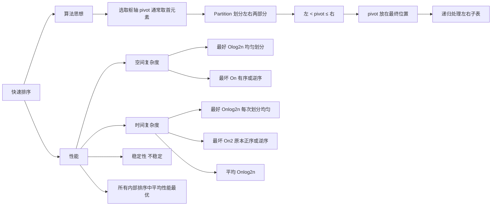

**本节考点**：**快速排序 = 选枢轴 + Partition 划分 + 递归排序子表** → **每次划分确定一个元素最终位置** → **时间：最好/平均 $O(n\log_2 n)$，最坏 $O(n^2)$（有序/逆序时）** → **空间：最好 $O(\log_2 n)$，最坏 $O(n)$** → **不稳定** → **优化：三数取中或随机选枢轴** → **所有内部排序算法中平均性能最优**。

可视化练习：https://www.cs.usfca.edu/~galles/visualization/ComparisonSort.html

---

## 8.4 选择排序

### 8.4.1 简单选择排序

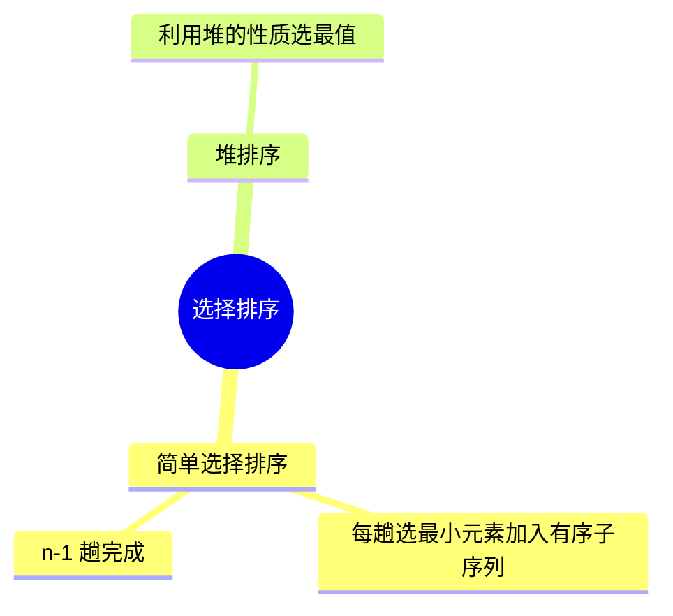

**算法思想**：每一趟在待排序元素中选取关键字**最小**的元素，加入有序子序列。

- 共需 **n−1 趟**处理（最后剩一个元素自动就位）
- 每趟操作：在 `A[i…n−1]` 中找最小元素，与 `A[i]` 交换

---

#### 排序过程演示

对序列 `[49, 38, 65, 97, 76, 13, 27, 49]`（下标 0~7）进行简单选择排序：

| 趟次 | 待排序范围 | 最小值 | 最小值位置 | 交换操作 | 排序后数组状态 |
|:---:|:---:|:---:|:---:|:---:|:---:|
| 初始 | — | — | — | — | [49, 38, 65, 97, 76, 13, 27, 49] |
| 第1趟 | A[0…7] | **13** | idx 5 | swap(A[0], A[5]) | [**13**, 38, 65, 97, 76, 49, 27, 49] |
| 第2趟 | A[1…7] | **27** | idx 6 | swap(A[1], A[6]) | [13, **27**, 65, 97, 76, 49, 38, 49] |
| 第3趟 | A[2…7] | **38** | idx 6 | swap(A[2], A[6]) | [13, 27, **38**, 97, 76, 49, 65, 49] |
| 第4趟 | A[3…7] | **49** | idx 5 | swap(A[3], A[5]) | [13, 27, 38, **49**, 76, 97, 65, 49] |
| 第5趟 | A[4…7] | **49** | idx 7 | swap(A[4], A[7]) | [13, 27, 38, 49, **49**, 97, 65, 76] |
| 第6趟 | A[5…7] | **65** | idx 6 | swap(A[5], A[6]) | [13, 27, 38, 49, 49, **65**, 97, 76] |
| 第7趟 | A[6…7] | **76** | idx 7 | swap(A[6], A[7]) | [13, 27, 38, 49, 49, 65, **76**, **97**] |

> 第7趟结束后，最后一个元素 97 自动就位，排序完成。

---

#### C 代码实现

```c
// 交换函数
void swap(int *a, int *b) {
    int temp = *a;
    *a = *b;
    *b = temp;
}

// 简单选择排序
void SelectSort(int A[], int n) {
    for (int i = 0; i < n - 1; i++) {    // 一共进行 n-1 趟
        int min = i;                      // 记录最小元素位置
        for (int j = i + 1; j < n; j++)   // 在 A[i...n-1] 中选择最小的元素
            if (A[j] < A[min]) min = j;   // 更新最小元素位置
        if (min != i) swap(&A[i], &A[min]); // 封装的 swap() 函数共移动元素3次
    }
}
```

---

#### 算法性能分析

| 指标 | 结果 | 说明 |
|:---:|:---:|:---:|
| **空间复杂度** | $O(1)$ | 仅用常数个辅助变量 |
| **时间复杂度** | $O(n^2)$ | 无论有序、逆序、乱序，一定需要 n−1 趟 |
| **比较次数** | $\frac{n(n-1)}{2}$ | $(n-1)+(n-2)+\cdots+1 = \frac{n(n-1)}{2}$ 次 |
| **交换次数** | $< n-1$ | 每趟最多交换一次 |
| **稳定性** | **不稳定** | 见下方反例 |

**稳定性反例**：序列 `[2, 2̲, 1]`（第一个 2 记为 2，第二个记为 2̲）

| 趟次 | 操作 | 结果 |
|:---:|:---:|:---:|
| 第1趟 | min=1@idx2, swap(A[0],A[2]) | [1, **2̲**, **2**] |
| 第2趟 | 自动就位 | [1, 2, 2] |

两个 2 的相对顺序被改变 → **不稳定**。

**适用性**：既可以用于**顺序表**，也可用于**链表**。

---

#### 知识回顾与考点总结

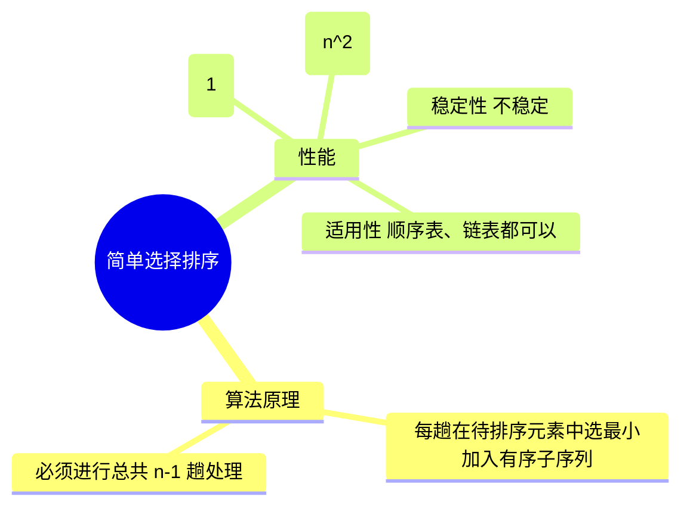

**本节考点**：**简单选择排序 = 每趟选最小 + 交换到前端** → **n−1 趟完成** → **时间 $O(n^2)$（最好/最坏/平均相同）** → **空间 $O(1)$** → **不稳定** → **顺序表、链表均可**。

可视化练习：https://www.cs.usfca.edu/~galles/visualization/SelectionSort.html
